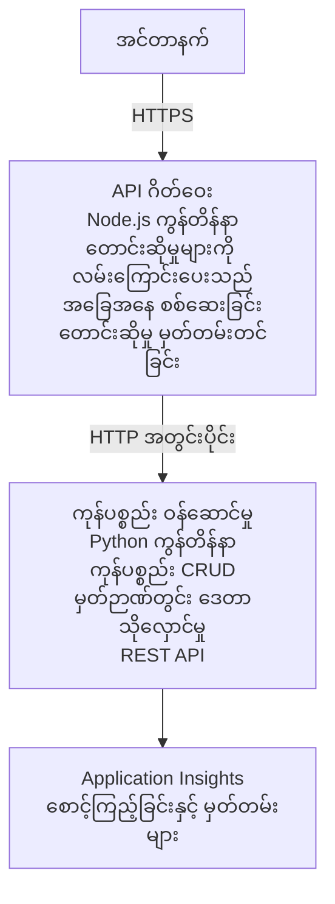

# Microservices Architecture - Container App Example

⏱️ **Estimated Time**: 25-35 minutes | 💰 **Estimated Cost**: ~$50-100/month | ⭐ **Complexity**: Advanced

A **simplified but functional** microservices architecture deployed to Azure Container Apps using AZD CLI. This example demonstrates service-to-service communication, container orchestration, and monitoring with a practical 2-service setup.

> **📚 Learning Approach**: This example starts with a minimal 2-service architecture (API Gateway + Backend Service) that you can actually deploy and learn from. After mastering this foundation, we provide guidance for expanding to a full microservices ecosystem.

## What You'll Learn

By completing this example, you will:
- Deploy multiple containers to Azure Container Apps
- Implement service-to-service communication with internal networking
- Configure environment-based scaling and health checks
- Monitor distributed applications with Application Insights
- Understand microservices deployment patterns and best practices
- Learn progressive expansion from simple to complex architectures

## Architecture

### Phase 1: What We're Building (Included in This Example)


**Why Start Simple?**
- ✅ Deploy and understand quickly (25-35 minutes)
- ✅ Learn core microservices patterns without complexity
- ✅ Working code you can modify and experiment with
- ✅ Lower cost for learning (~$50-100/month vs $300-1400/month)
- ✅ Build confidence before adding databases and message queues

**Analogy**: Think of this like learning to drive. You start with an empty parking lot (2 services), master the basics, then progress to city traffic (5+ services with databases).

### Phase 2: Future Expansion (Reference Architecture)

Once you master the 2-service architecture, you can expand to:

```
Full Architecture (Not Included - For Reference)
├── API Gateway (✅ Included)
├── Product Service (✅ Included)
├── Order Service (🔜 Add next)
├── User Service (🔜 Add next)
├── Notification Service (🔜 Add last)
├── Azure Service Bus (🔜 For async communication)
├── Cosmos DB (🔜 For product persistence)
├── Azure SQL (🔜 For order management)
└── Azure Storage (🔜 For file storage)
```

See "Expansion Guide" section at the end for step-by-step instructions.

## Features Included

✅ **Service Discovery**: Automatic DNS-based discovery between containers  
✅ **Load Balancing**: Built-in load balancing across replicas  
✅ **Auto-scaling**: Independent scaling per service based on HTTP requests  
✅ **Health Monitoring**: Liveness and readiness probes for both services  
✅ **Distributed Logging**: Centralized logging with Application Insights  
✅ **Internal Networking**: Secure service-to-service communication  
✅ **Container Orchestration**: Automatic deployment and scaling  
✅ **Zero-Downtime Updates**: Rolling updates with revision management  

## Prerequisites

### Required Tools

Before starting, verify you have these tools installed:

1. **[Azure Developer CLI (azd)](https://learn.microsoft.com/azure/developer/azure-developer-cli/install-azd)** (version 1.0.0 or higher)
   ```bash
   azd version
   # မျှော်မှန်းထားသော အထွက်: azd ဗားရှင်း 1.0.0 သို့မဟုတ် အထက်
   ```

2. **[Azure CLI](https://learn.microsoft.com/cli/azure/install-azure-cli)** (version 2.50.0 or higher)
   ```bash
   az --version
   # မျှော်မှန်းထားသော ထွက်ချက်: azure-cli 2.50.0 သို့မဟုတ် အထက်ဗားရှင်း
   ```

3. **[Docker](https://www.docker.com/get-started)** (for local development/testing - optional)
   ```bash
   docker --version
   # မျှော်မှန်းထားသော အထွက်: Docker ဗားရှင်း 20.10 သို့မဟုတ် ထက်မနည်း
   ```

### Azure Requirements

- An active **Azure subscription** ([create a free account](https://azure.microsoft.com/free/))
- Permissions to create resources in your subscription
- **Contributor** role on the subscription or resource group

### Knowledge Prerequisites

This is an **advanced-level** example. You should have:
- Completed the [Simple Flask API example](../../../../../examples/container-app/simple-flask-api) 
- Basic understanding of microservices architecture
- Familiarity with REST APIs and HTTP
- Understanding of container concepts

**New to Container Apps?** Start with the [Simple Flask API example](../../../../../examples/container-app/simple-flask-api) first to learn the basics.

## Quick Start (Step-by-Step)

### Step 1: Clone and Navigate

```bash
git clone https://github.com/microsoft/AZD-for-beginners.git
cd AZD-for-beginners/examples/container-app/microservices
```

**✓ Success Check**: Verify you see `azure.yaml`:
```bash
ls
# မျှော်မှန်းထားသည်: README.md, azure.yaml, infra/, src/
```

### Step 2: Authenticate with Azure

```bash
azd auth login
```

This opens your browser for Azure authentication. Sign in with your Azure credentials.

**✓ Success Check**: You should see:
```
Logged in to Azure.
```

### Step 3: Initialize the Environment

```bash
azd init
```

**Prompts you'll see**:
- **Environment name**: Enter a short name (e.g., `microservices-dev`)
- **Azure subscription**: Select your subscription
- **Azure location**: Choose a region (e.g., `eastus`, `westeurope`)

**✓ Success Check**: You should see:
```
SUCCESS: New project initialized!
```

### Step 4: Deploy Infrastructure and Services

```bash
azd up
```

**What happens** (takes 8-12 minutes):
1. Creates Container Apps environment
2. Creates Application Insights for monitoring
3. Builds API Gateway container (Node.js)
4. Builds Product Service container (Python)
5. Deploys both containers to Azure
6. Configures networking and health checks
7. Sets up monitoring and logging

**✓ Success Check**: You should see:
```
SUCCESS: Your application was deployed to Azure in X minutes Y seconds.
Endpoint: https://api-gateway-<unique-id>.azurecontainerapps.io
```

**⏱️ Time**: 8-12 minutes

### Step 5: Test the Deployment

```bash
# ဂိတ်ဝေး၏ endpoint ကို ရယူပါ
GATEWAY_URL=$(azd env get-values | grep API_GATEWAY_URL | cut -d '=' -f2 | tr -d '"')

# API Gateway ၏ ကျန်းမာရေးကို စစ်ဆေးပါ
curl $GATEWAY_URL/health

# မျှော်မှန်းထားသော အထွက်:
# {"status":"ကျန်းမာ","service":"api-gateway","timestamp":"2025-11-19T10:30:00Z"}
```

**Test product service through gateway**:
```bash
# ထုတ်ကုန်များ စာရင်း
curl $GATEWAY_URL/api/products

# မျှော်မှန်းထားသော ထွက်ရလဒ်:
# [
#   {"id":1,"name":"လက်ပ်တော့","price":999.99,"stock":50},
#   {"id":2,"name":"မောက်စ်","price":29.99,"stock":200},
#   {"id":3,"name":"ကီးဘုတ်","price":79.99,"stock":150}
# ]
```

**✓ Success Check**: Both endpoints return JSON data without errors.

---

**🎉 Congratulations!** You've deployed a microservices architecture to Azure!

## Project Structure

All implementation files are included—this is a complete, working example:

```
microservices/
│
├── README.md                         # This file
├── azure.yaml                        # AZD configuration
├── .gitignore                        # Git ignore patterns
│
├── infra/                           # Infrastructure as Code (Bicep)
│   ├── main.bicep                   # Main orchestration
│   ├── abbreviations.json           # Naming conventions
│   ├── core/                        # Shared infrastructure
│   │   ├── container-apps-environment.bicep  # Container environment + registry
│   │   └── monitor.bicep            # Application Insights + Log Analytics
│   └── app/                         # Service definitions
│       ├── api-gateway.bicep        # API Gateway container app
│       └── product-service.bicep    # Product Service container app
│
└── src/                             # Application source code
    ├── api-gateway/                 # Node.js API Gateway
    │   ├── app.js                   # Express server with routing
    │   ├── package.json             # Node dependencies
    │   └── Dockerfile               # Container definition
    └── product-service/             # Python Product Service
        ├── main.py                  # Flask API with product data
        ├── requirements.txt         # Python dependencies
        └── Dockerfile               # Container definition
```

**What Each Component Does:**

**Infrastructure (infra/)**:
- `main.bicep`: Orchestrates all Azure resources and their dependencies
- `core/container-apps-environment.bicep`: Creates the Container Apps environment and Azure Container Registry
- `core/monitor.bicep`: Sets up Application Insights for distributed logging
- `app/*.bicep`: Individual container app definitions with scaling and health checks

**API Gateway (src/api-gateway/)**:
- Public-facing service that routes requests to backend services
- Implements logging, error handling, and request forwarding
- Demonstrates service-to-service HTTP communication

**Product Service (src/product-service/)**:
- Internal service with product catalog (in-memory for simplicity)
- REST API with health checks
- Example of backend microservice pattern

## Services Overview

### API Gateway (Node.js/Express)

**Port**: 8080  
**Access**: Public (external ingress)  
**Purpose**: Routes incoming requests to appropriate backend services  

**Endpoints**:
- `GET /` - Service information
- `GET /health` - Health check endpoint
- `GET /api/products` - Forward to product service (list all)
- `GET /api/products/:id` - Forward to product service (get by ID)

**Key Features**:
- Request routing with axios
- Centralized logging
- Error handling and timeout management
- Service discovery via environment variables
- Application Insights integration

**Code Highlight** (`src/api-gateway/app.js`):
```javascript
// အတွင်းပိုင်း ဝန်ဆောင်မှုများအကြား ဆက်သွယ်မှု
app.get('/api/products', async (req, res) => {
  const response = await axios.get(`${PRODUCT_SERVICE_URL}/products`);
  res.json(response.data);
});
```

### Product Service (Python/Flask)

**Port**: 8000  
**Access**: Internal only (no external ingress)  
**Purpose**: Manages product catalog with in-memory data  

**Endpoints**:
- `GET /` - Service information
- `GET /health` - Health check endpoint
- `GET /products` - List all products
- `GET /products/<id>` - Get product by ID

**Key Features**:
- RESTful API with Flask
- In-memory product store (simple, no database needed)
- Health monitoring with probes
- Structured logging
- Application Insights integration

**Data Model**:
```python
{
  "id": 1,
  "name": "Laptop",
  "description": "High-performance laptop",
  "price": 999.99,
  "stock": 50
}
```

**Why Internal Only?**
The product service is not exposed publicly. All requests must go through the API Gateway, which provides:
- Security: Controlled access point
- Flexibility: Can change backend without affecting clients
- Monitoring: Centralized request logging

## Understanding Service Communication

### How Services Talk to Each Other

In this example, the API Gateway communicates with the Product Service using **internal HTTP calls**:

```javascript
// API ဂိတ်ဝေး (src/api-gateway/app.js)
const PRODUCT_SERVICE_URL = process.env.PRODUCT_SERVICE_URL;

// အတွင်းပိုင်း HTTP တောင်းဆိုချက် ပြုလုပ်သည်
const response = await axios.get(`${PRODUCT_SERVICE_URL}/products`);
```

**Key Points**:

1. **DNS-Based Discovery**: Container Apps automatically provides DNS for internal services
   - Product Service FQDN: `product-service.internal.<environment>.azurecontainerapps.io`
   - Simplified as: `http://product-service` (Container Apps resolves it)

2. **No Public Exposure**: Product Service has `external: false` in Bicep
   - Only accessible within the Container Apps environment
   - Cannot be reached from the internet

3. **Environment Variables**: Service URLs are injected at deployment time
   - Bicep passes the internal FQDN to the gateway
   - No hardcoded URLs in application code

**Analogy**: Think of this like office rooms. The API Gateway is the reception desk (public-facing), and the Product Service is an office room (internal only). Visitors must go through reception to reach any office.

## Deployment Options

### Full Deployment (Recommended)

```bash
# အခြေခံအင်ဖရာနှင့် ဝန်ဆောင်မှုနှစ်ခုလုံးကို တပ်ဆင်ပါ
azd up
```

This deploys:
1. Container Apps environment
2. Application Insights
3. Container Registry
4. API Gateway container
5. Product Service container

**Time**: 8-12 minutes

### Deploy Individual Service

```bash
# ဝန်ဆောင်မှု တစ်ခုတည်းကိုသာ တပ်ဆင်ပါ (အစပိုင်း azd up ပြီးနောက်)
azd deploy api-gateway

# သို့မဟုတ် product ဝန်ဆောင်မှုကို တပ်ဆင်ပါ
azd deploy product-service
```

**Use Case**: When you've updated code in one service and want to redeploy only that service.

### Update Configuration

```bash
# အရွယ်ချဲ့ခြင်း သတ်မှတ်ချက်များကို ပြောင်းပါ
azd env set GATEWAY_MAX_REPLICAS 30

# ဖွဲ့စည်းပုံအသစ်နှင့် ပြန်တပ်ဆင်ပါ
azd up
```

## Configuration

### Scaling Configuration

Both services are configured with HTTP-based autoscaling in their Bicep files:

**API Gateway**:
- Min replicas: 2 (always at least 2 for availability)
- Max replicas: 20
- Scale trigger: 50 concurrent requests per replica

**Product Service**:
- Min replicas: 1 (can scale to zero if needed)
- Max replicas: 10
- Scale trigger: 100 concurrent requests per replica

**Customize Scaling** (in `infra/app/*.bicep`):
```bicep
scale: {
  minReplicas: 1
  maxReplicas: 10
  rules: [
    {
      name: 'http-scale-rule'
      http: {
        metadata: {
          concurrentRequests: '100'  // Adjust this
        }
      }
    }
  ]
}
```

### Resource Allocation

**API Gateway**:
- CPU: 1.0 vCPU
- Memory: 2 GiB
- Reason: Handles all external traffic

**Product Service**:
- CPU: 0.5 vCPU
- Memory: 1 GiB
- Reason: Lightweight in-memory operations

### Health Checks

Both services include liveness and readiness probes:

```bicep
probes: [
  {
    type: 'Liveness'
    httpGet: {
      path: '/health'
      port: 8080
    }
    initialDelaySeconds: 10
    periodSeconds: 30
  }
  {
    type: 'Readiness'
    httpGet: {
      path: '/health'
      port: 8080
    }
    initialDelaySeconds: 5
    periodSeconds: 10
  }
]
```

**What This Means**:
- **Liveness**: If health check fails, Container Apps restarts the container
- **Readiness**: If not ready, Container Apps stops routing traffic to that replica


## Monitoring & Observability

### View Service Logs

```bash
# azd monitor ကို အသုံးပြု၍ လော့ဂ်များကို ကြည့်ပါ
azd monitor --logs

# သို့မဟုတ် သတ်မှတ်ထားသော Container Apps များအတွက် Azure CLI ကို အသုံးပြုပါ:
# API Gateway မှ လော့ဂ်များကို စီးဆင်းထုတ်လွှင့်ပါ
az containerapp logs show --name api-gateway --resource-group $RG_NAME --follow

# နောက်ဆုံးရ ထုတ်ကုန် ဝန်ဆောင်မှု လော့ဂ်များကို ကြည့်ပါ
az containerapp logs show --name product-service --resource-group $RG_NAME --tail 100
```

**Expected Output**:
```
[api-gateway] API Gateway listening on port 8080
[api-gateway] Product Service URL: http://product-service
[api-gateway] GET /api/products 200 - 45ms
[product-service] Retrieved 5 products
```

### Application Insights Queries

Access Application Insights in Azure Portal, then run these queries:

**Find Slow Requests**:
```kusto
requests
| where timestamp > ago(1h)
| where duration > 1000  // Requests taking >1 second
| summarize count() by name, cloud_RoleName
| order by count_ desc
```

**Track Service-to-Service Calls**:
```kusto
dependencies
| where timestamp > ago(1h)
| where type == "Http"
| project timestamp, name, target, duration, success
| order by timestamp desc
```

**Error Rate by Service**:
```kusto
exceptions
| where timestamp > ago(24h)
| summarize errorCount = count() by cloud_RoleName, type
| order by errorCount desc
```

**Request Volume Over Time**:
```kusto
requests
| where timestamp > ago(1h)
| summarize requestCount = count() by bin(timestamp, 5m), cloud_RoleName
| render timechart
```

### Access Monitoring Dashboard

```bash
# Application Insights အသေးစိတ် ရယူရန်
azd env get-values | grep APPLICATIONINSIGHTS

# Azure Portal ၏ မော်နီတာကို ဖွင့်ရန်
az monitor app-insights component show \
  --app $(azd env get-values | grep APPLICATIONINSIGHTS_CONNECTION_STRING | cut -d '=' -f2) \
  --resource-group $(azd env get-values | grep AZURE_RESOURCE_GROUP | cut -d '=' -f2) \
  --query "appId" -o tsv
```

### Live Metrics

1. Navigate to Application Insights in Azure Portal
2. Click "Live Metrics"
3. See real-time requests, failures, and performance
4. Test by running: `curl $(azd env get-values | grep API_GATEWAY_URL | cut -d '=' -f2 | tr -d '"')/api/products`

## Practical Exercises

[Note: See full exercises above in the "Practical Exercises" section for detailed step-by-step exercises including deployment verification, data modification, autoscaling tests, error handling, and adding a third service.]

## Cost Analysis

### Estimated Monthly Costs (For This 2-Service Example)

| Resource | Configuration | Estimated Cost |
|----------|--------------|----------------|
| API Gateway | 2-20 replicas, 1 vCPU, 2GB RAM | $30-150 |
| Product Service | 1-10 replicas, 0.5 vCPU, 1GB RAM | $15-75 |
| Container Registry | Basic tier | $5 |
| Application Insights | 1-2 GB/month | $5-10 |
| Log Analytics | 1 GB/month | $3 |
| **Total** | | **$58-243/month** |

**Cost Breakdown by Usage**:
- **Light traffic** (testing/learning): ~$60/month
- **Moderate traffic** (small production): ~$120/month
- **High traffic** (busy periods): ~$240/month

### Cost Optimization Tips

1. **Scale to Zero for Development**:
   ```bicep
   scale: {
     minReplicas: 0  // Save $30-40/month when not in use
     maxReplicas: 10
   }
   ```

2. **Use Consumption Plan for Cosmos DB** (when you add it):
   - Pay only for what you use
   - No minimum charge

3. **Set Application Insights Sampling**:
   ```javascript
   appInsights.defaultClient.config.samplingPercentage = 50; // တောင်းဆိုမှုများ၏ 50% ကို နမူနာယူပါ
   ```

4. **Clean Up When Not Needed**:
   ```bash
   azd down
   ```

### Free Tier Options

For learning/testing, consider:
- Azure အခမဲ့ ခရက်ဒစ်များကို အသုံးပြုပါ (ပထမ ၃၀ ရက်)
- replicas များကို အနည်းဆုံးထားပါ
- စမ်းသပ်ပြီးနောက် ဖျက်ပါ (ဆက်လက်ကုန်ကျစရိတ် မဖြစ်စေရန်)

---

## ဖယ်ရှားခြင်း

ဆက်လက် ကုန်ကျစရိတ် မဖြစ်စေရန် အရင်းအမြစ်များအားလုံးကို ဖျက်ပါ။

```bash
azd down --force --purge
```

**အတည်ပြု မေးခွန်း**:
```
? Total resources to delete: 6, are you sure you want to continue? (y/N)
```

အတည်ပြုရန် `y` ဟု ရိုက်ပါ။

**ဖျက်မည့် အရာများ**:
- Container Apps ပတ်ဝန်းကျင်
- Container Apps နှစ်ခု (gateway နှင့် product service)
- Container Registry
- Application Insights
- Log Analytics Workspace
- Resource Group

**✓ ရှင်းလင်းမှုကို အတည်ပြုပါ**:
```bash
az group list --query "[?starts_with(name,'rg-microservices')]" --output table
```

အလွတ် ပြန်လာရမည်။

---

## တိုးချဲ့ လမ်းညွှန်: 2 မှ 5+ ဝန်ဆောင်မှုများသို့

ဤ 2-ဝန်ဆောင်မှု ဖွဲ့စည်းပုံကို ကျွမ်းကျင်ပြီးပါက တိုးချဲ့ရန် အောက်ပါအတိုင်း လုပ်နိုင်သည်။

### အဆင့် 1: ဒေတာသိုလှောင်မှု (နောက်တစ်ဆင့်)

**Product Service အတွက် Cosmos DB ထည့်ရန်**:

1. `infra/core/cosmos.bicep` ဖိုင်ကို ဖန်တီးပါ။
   ```bicep
   resource cosmosAccount 'Microsoft.DocumentDB/databaseAccounts@2023-04-15' = {
     name: name
     location: location
     kind: 'GlobalDocumentDB'
     properties: {
       databaseAccountOfferType: 'Standard'
       locations: [{ locationName: location, failoverPriority: 0 }]
     }
   }
   ```

2. product service ကို in-memory data အစား Cosmos DB အသုံးပြုသည့်အတိုင်း အပ်ဒိတ်လုပ်ပါ။

3. ခန့်မှန်း အပို ကုန်ကျစရိတ်: ~ $25/လ (serverless)

### အဆင့် 2: တတိယ ဝန်ဆောင်မှု ထည့်ရန် (Order Management)

**Order Service ဖန်တီးခြင်း**:

1. ဖိုလ်ဒါအသစ်: `src/order-service/` (Python/Node.js/C#)
2. Bicep အသစ်: `infra/app/order-service.bicep`
3. API Gateway ကို `/api/orders` သို့ ကြောင်းခွဲရန် အပ်ဒိတ်လုပ်ပါ
4. အော်ဒါ သိုလှောင်မှုအတွက် Azure SQL Database ထည့်ပါ

**ဖွဲ့စည်းပုံ ရလာမည်**:
```
API Gateway → Product Service (Cosmos DB)
           → Order Service (Azure SQL)
```

### အဆင့် 3: အစဉ်မရှိ ဆက်သွယ်မှု (Service Bus)

**Event-Driven Architecture ကို အကောင်အထည်ဖော်ပါ**:

1. Azure Service Bus ထည့်ပါ: `infra/core/servicebus.bicep`
2. Product Service မှ "ProductCreated" events များကို ပျံ့နှံ့ပို့ပါ
3. Order Service သည် product events များကို subscribe လုပ်ပါ
4. အဖြစ်အပျက်များကို ဆောင်ရွက်ရန် Notification Service ထည့်ပါ

**ပုံစံ**: Request/Response (HTTP) + Event-Driven (Service Bus)

### အဆင့် 4: အသုံးပြုသူ အတည်ပြုခြင်း ထည့်သွင်းခြင်း

**User Service ကို တည်ဆောက်ပါ**:

1. `src/user-service/` ဖိုလ်ဒါကို ဖန်တီးပါ (Go/Node.js)
2. Azure AD B2C သို့မဟုတ် custom JWT authentication ထည့်ပါ
3. API Gateway သည် token များကို အတည်ပြုသည်
4. ဝန်ဆောင်မှုများသည် အသုံးပြုသူ ခွင့်ပြုချက်များကို စစ်ဆေးသည်

### အဆင့် 5: ထုတ်လုပ်မှု အဆင်ပြေစေရန်

**ဤ အစိတ်အပိုင်းများ ထည့်ပါ**:
- Azure Front Door (ကမ္ဘာလုံးဆိုင်ရာ load balancing)
- Azure Key Vault (လျှို့ဝှက် အရာများ စီမံခန့်ခွဲခြင်း)
- Azure Monitor Workbooks (စိတ်ကြိုက် dashboards)
- CI/CD Pipeline (GitHub Actions)
- Blue-Green Deployments
- ဝန်ဆောင်မှုအားလုံးအတွက် Managed Identity

**ထုတ်လုပ်မှု အပြည့်အစုံ ဖွဲ့စည်းပုံ ကုန်ကျစရိတ်**: ~ $300-1,400/လ

---

## ပိုမိုလေ့လာရန်

### ဆက်စပ်စာရွက်စာတမ်းများ
- [Azure Container Apps စာရွက်စာတမ်း](https://learn.microsoft.com/azure/container-apps/)
- [Microservices ဖွဲ့စည်းပုံ လမ်းညွှန်](https://learn.microsoft.com/azure/architecture/guide/architecture-styles/microservices)
- [Distributed Tracing အတွက် Application Insights](https://learn.microsoft.com/azure/azure-monitor/app/distributed-tracing)
- [Azure Developer CLI စာရွက်စာတမ်း](https://learn.microsoft.com/azure/developer/azure-developer-cli/)

### ဒီသင်တန်း၏ နောက်တစ်ဆင့်များ
- ← Previous: [Simple Flask API](../../../../../examples/container-app/simple-flask-api) - စတင်လေ့လာသူများအတွက် တစ်-ကွန်တိန်နာ ဥပမာ
- → Next: [AI Integration Guide](../../../../../examples/docs/ai-foundry) - AI လုပ်ဆောင်ချက်များ ထည့်သွင်းခြင်း
- 🏠 [Course Home](../../README.md)

### နှိုင်းယှဉ်ချက်: ဘယ်အချိန် ဘာကို အသုံးပြုသင့်သလဲ

**Single Container App** (ရိုးရှင်းသော Flask API ဥပမာ):
- ✅ ရိုးရှင်းသော အက်ပလီကေးရှင်းများ
- ✅ Monolithic ဖွဲ့စည်းပုံ
- ✅ မြန်ဆန်စွာ တင်သွင်းနိုင်သည်
- ❌ တိုးချဲ့နိုင်စွမ်း ကန့်သတ်ချက်ရှိသည်
- **ကုန်ကျစရိတ်**: ~ $15-50/လ

**Microservices** (ဤဥပမာ):
- ✅ အပြင်းထန်ရှုပ်ထွေးသော အက်ပလီကေးရှင်းများ
- ✅ ဝန်ဆောင်မှု တစ်ခုချင်းစီ အလိုက် လွတ်လပ်စွာ ချဲ့နိုင်မှု
- ✅ အသင်းအလိုက် လွတ်လပ်မှု (ဝန်ဆောင်မှု မတူ၊ အသင်းများ မတူ)
- ❌ စီမံခန့်ခွဲရန် ပိုမိုရှုပ်ထွေးသည်
- **ကုန်ကျစရိတ်**: ~ $60-250/လ

**Kubernetes (AKS)**:
- ✅ ထိန်းချုပ်နိုင်မှုနှင့် အပြောင်းလဲခံနိုင်မှု အများဆုံး
- ✅ မျိုးစုံ cloud သို့ ဆောင်ရွက်နိုင်မှု
- ✅ အဆင့်မြင့် နက်ဝက်ကွန်ယက်
- ❌ Kubernetes ကျွမ်းကျင်မှု လိုအပ်သည်
- **ကုန်ကျစရိတ်**: ~ $150-500/လ အနည်းဆုံး

**အကြံပေးချက်**: အစမှာ Container Apps (ဤဥပမာ) ဖြင့် စတင်ပါ၊ Kubernetes အထူး လုပ်ဆောင်ချက်များ လိုအပ်ပါကသာ AKS သို့ ရွေ့ပါ။

---

## မကြာခဏ မေးသောမေးခွန်းများ

**Q: 5+ ဝန်ဆောင်မှုများမဟုတ်ဘဲ ဘာကြောင့် 2 ဝန်ဆောင်မှုသာထားတာလဲ?**  
A: သင်ယူရေးဆိုင်ရာ တိုးတက်မှုအတွက် ဖြစ်သည်။ ရိုးရှင်းသော ဥပမာဖြင့် ဝန်ဆောင်မှုဆက်သွယ်ခြင်း၊ မော်နီတာခြင်းနှင့် ချဲ့နိုင်စွမ်းတို့ကို ကျွမ်းကျင်နိုင်ရန် စတင်ပါ။ ဤနေရာတွင် သင်လေ့လာသည့် ပုံစံများကို 100-ဝန်ဆောင်မှု ဖွဲ့စည်းပုံများတွင်လည်း အသုံးချနိုင်ပါသည်။

**Q: ကိုယ်တိုင် ဝန်ဆောင်မှုများ ပိုထည့်နိုင်မလား?**  
A: ဟုတ်ပါတယ်! အပေါ်က တိုးချဲ့လမ်းညွှန်ကို လိုက်နာပါ။ ဝန်ဆောင်မှုအသစ်တိုင်းသည် အတူတူပုံစံကို လိုက်နာသည်: src ဖိုလ်ဒါ ဖန်တီး၊ Bicep ဖိုင် ဖန်တီး၊ azure.yaml ကို အပ်ဒိတ်၊ deploy လုပ်ပါ။

**Q: ဤသည် သည် ထုတ်လုပ်ရေးအတွက် အသင့်ပါသလား?**  
A: ဤသည် သည် ခိုင်မာသော အခြေခံ လက်ခံခြင်းဖြစ်သည်။ ထုတ်လုပ်ရေးအတွက် managed identity, Key Vault, persistent databases, CI/CD pipeline, monitoring alerts, backup strategy များကို ထည့်သွင်းပါ။

**Q: Dapr သို့မဟုတ် အခြား service mesh မသုံးဘူးလား?**  
A: သင်ယူရန် ရိုးရှင်းစေရန် ဖြစ်သည်။ Container Apps ၏ မူလ ကွန်ရက်နည်းပညာကို နားလည်သည့်အခါ Dapr ကို အလွှာတင်၍ အသုံးပြုနိုင်ပါသည်။

**Q: ဒေသတွင်း (locally) ဘယ်လို debug လုပ်မလဲ?**  
A: Docker ဖြင့် ဝန်ဆောင်မှုများကို ဒေသတွင်းတွင် ပြေးဆောင် လေ့လာနိုင်သည်။
```bash
cd src/api-gateway
docker build -t local-gateway .
docker run -p 8080:8080 -e PRODUCT_SERVICE_URL=http://localhost:8000 local-gateway
```

**Q: မတူသော programming languages များကို သုံးလို့ ရမလား?**  
A: ဟုတ်ပါတယ်! ဤဥပမာတွင် Node.js (gateway) + Python (product service) ကို ပြထားသည်။ ကွန်တိန်နာတွင်း ဆောင်ရွက်နိုင်သည့် ဘာသာစကား များကို မည်သို့ပဲ ပေါင်းစပ်အသုံးပြုနိုင်သည်။

**Q: Azure ခရက်ဒစ် မရှိရင်ဘာလဲ?**  
A: Azure အခမဲ့ အဆင့်ကို အသုံးပြုပါ (အကောင့်အသစ်များအတွက် ပထမ ၃၀ ရက်) သို့မဟုတ် စမ်းသပ်ရန် ကြာချိန်တိုတိုအတွက် တင်ပြီး ချက်ချင်း ဖျက်ပါ။

---

> **🎓 သင်ယူရေးလမ်းစဉ် အကျဉ်းချုပ်**: သင်သည် အလိုအလျောက် ချဲ့နိုင်မှု၊ အတွင်းပိုင်း ကြိုးနက်ကွန်ယက်၊ ဗဟိုစီမံမော်နီတာခြင်းနှင့် ထုတ်လုပ်မှုသင့် ပုံစံများပါသော multi-service ဖွဲ့စည်းပုံ တင်သွင်းနည်းကို လေ့လာပြီး ကျင့်သုံးနိုင်သည်။ ဤအခြေခံသည် ရှုပ်ထွေးသော ဖြန့်ဖြူးစနစ်များနှင့် စီးပွားရေး microservices ဖွဲ့စည်းပုံများအတွက် သင့်ကို အဆင်ပြေစေပါသည်။

**📚 သင်တန်း လမ်းညွှန်:**
- ← Previous: [Simple Flask API](../../../../../examples/container-app/simple-flask-api)
- → Next: [Database Integration Example](../../../../../examples/database-app)
- 🏠 [Course Home](../../../README.md)
- 📖 [Container Apps Best Practices](../../../docs/chapter-04-infrastructure/deployment-guide.md)

---

<!-- CO-OP TRANSLATOR DISCLAIMER START -->
**Disclaimer**:
ဤစာရွက်ကို AI ဘာသာပြန်ဝန်ဆောင်မှု [Co-op Translator](https://github.com/Azure/co-op-translator) အသုံးပြု၍ ဘာသာပြန်ထားပါသည်။ ကျွန်ုပ်တို့သည် တိကျမှုအတွက် ကြိုးစားပေမယ့် အလိုအလျောက် ဘာသာပြန်ချက်များတွင် အမှားများ သို့မဟုတ် မှားယွင်းချက်များ ပါဝင်နိုင်ကြောင်း ကျေးဇူးပြု၍ သတိပြုပါ။ မူလစာရွက်ကို မိခင်ဘာသာဖြင့်ရှိသော မူရင်း ကိုယ်စားလှယ်အရင်းအမြစ်ဟု သတ်မှတ်ရန် လိုအပ်ပါသည်။ အရေးကြီးသော သတင်းအချက်အလက်များအတွက် ကျွမ်းကျင် လူသား ဘာသာပြန်သူတို့၏ ဘာသာပြန်ချက်ကို ထောက်ခံအပ်ပါသည်။ ဤဘာသာပြန်ချက်ကို အသုံးပြုခြင်းကြောင့် ဖြစ်ပေါ်လာသည့် နားလည်မှုလွဲခြင်းများ သို့မဟုတ် မှားသုညချက်များအတွက် ကျွန်ုပ်တို့သည် တာဝန်မယူပါ။
<!-- CO-OP TRANSLATOR DISCLAIMER END -->