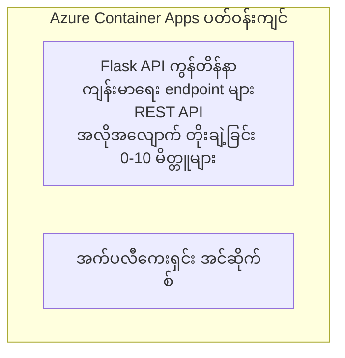

# ရိုးရှင်းသော Flask API - Container App ဥပမာ

**သင်ယူရန် လမ်းကြောင်း:** အခြေခံ ⭐ | **အချိန်:** 25-35 မိနစ် | **ကုန်ကျစရိတ်:** $0-15/month

Azure Developer CLI (azd) အသုံးပြုပြီး Azure Container Apps သို့ တင်သွင်းထားသော ပြည့်စုံ လုပ်ငန်းဆောင်ရွက်နိုင်သော Python Flask REST API တစ်ခု။ ဤဥပမာသည် container တင်သွင်းခြင်း၊ အလိုအလျောက် စကေးခြင်းနှင့် စောင့်ကြည့်ခြင်း အခြေခံများကို ဖော်ပြသည်။

## 🎯 သင်ယူမည့်အချက်များ

- Container အဖြစ်ထုပ်ပိုးထားသည့် Python အပလီကေးရှင်းကို Azure သို့ တင်ခြင်း
- scale-to-zero အပါအဝင် အလိုအလျောက် စကေး (auto-scaling) ကို ဖော်ဆောင်ခြင်း
- Health probes နှင့် readiness checks များ အကောင်အထည်ဖော်ခြင်း
- အပလီကေးရှင်း၏ logs နှင့် metrics များကို စောင့်ကြည့်ခြင်း
- မြန်ဆန်စွာ တင်သွင်းနိုင်ရန် Azure Developer CLI ကို အသုံးပြုခြင်း

## 📦 ပါဝင်သောအရာများ

✅ **Flask Application** - CRUD လုပ်ဆောင်ချက်များပါဝင်သည့် ပြည့်စုံသော REST API (`src/app.py`)  
✅ **Dockerfile** - ထုတ်လုပ်ရေးအဆင်ပြေအောင် ပြင်ဆင်ထားသော container ဖိုင်  
✅ **Bicep Infrastructure** - Container Apps ပတ်ဝန်းကျင်နှင့် API တင်သွင်းမှု  
✅ **AZD Configuration** - တစ်ချက် command ဖြင့် တင်သွင်းနိုင်ရန် ပြင်ဆင်ထားခြင်း  
✅ **Health Probes** - Liveness နှင့် Readiness checks များ ကို ဖော်ပြထားသည်  
✅ **Auto-scaling** - HTTP လုပ်ငန်းနှုန်းအပေါ် မူတည်၍ 0-10 replicas

## Architecture


## လိုအပ်ချက်များ

### လိုအပ်သည်များ
- **Azure Developer CLI (azd)** - [Install guide](https://learn.microsoft.com/azure/developer/azure-developer-cli/install-azd)
- **Azure subscription** - [အခမဲ့ အကောင့်](https://azure.microsoft.com/free/)
- **Docker Desktop** - [Docker ကို တပ်ဆင်ရန်](https://www.docker.com/products/docker-desktop/) (ကိုယ်ပိုင် စမ်းသပ်မှုများအတွက်)

### လိုအပ်ချက်များကို စစ်ဆေးရန်

```bash
# azd ဗားရှင်းကို စစ်ဆေးပါ (1.5.0 သို့မဟုတ် အထက်ရှိ ဗားရှင်း လိုအပ်သည်)
azd version

# Azure လော့ဂ်အင်း ဖြစ်နေမှုကို အတည်ပြုပါ
azd auth login

# Docker ကို စစ်ဆေးပါ (ရွေးချယ်နိုင်သည်၊ ဒေသခံ စမ်းသပ်ရန်)
docker --version
```

## ⏱️ တင်သွင်းချိန်ဇယား

| အဆင့် | သက်တမ်း | ဖြစ်ပျက်မည့်အရာ |
|-------|----------|--------------||
| ပတ်ဝန်းကျင် သတ်မှတ်ခြင်း | 30 စက္ကန့် | azd ပတ်ဝန်းကျင် ဖန်တီးခြင်း |
| Container တည်ဆောက်ခြင်း | 2-3 မိနစ် | Flask app အတွက် Docker build |
| အင်ဖရာစထရပ်ချာ ထောက်ပံ့ခြင်း | 3-5 မိနစ် | Container Apps, registry, monitoring ဖန်တီးခြင်း |
| အပလီကေးရှင်း တင်သွင်းခြင်း | 2-3 မိနစ် | Image ကို push ပြီး Container Apps သို့ deploy ပြုလုပ်ခြင်း |
| **စုစုပေါင်း** | **8-12 မိနစ်** | တင်သွင်းမှု ပြီးဆုံးပြီး အသင့်အတင် |

## လျှင်မြန် စတင်ခြင်း

```bash
# ဥပမာသို့ သွားပါ
cd examples/container-app/simple-flask-api

# ပတ်ဝန်းကျင်ကို စတင်လုပ်ပါ (ထူးခြားသော အမည်ရွေးပါ)
azd env new myflaskapi

# အားလုံးကို တပ်ဆင်ပါ (အောက်ခံအဆောက်အအုံ + အက်ပလီကေးရှင်း)
azd up
# သင်အား အောက်ပါအတိုင်း မေးမြန်းမည်:
# 1. Azure subscription ကို ရွေးပါ
# 2. တည်နေရာကို ရွေးပါ (ဥပမာ၊ eastus2)
# 3. တပ်ဆင်မှုအတွက် 8-12 မိနစ် ခန့် စောင့်ဆိုင်းပါ

# သင့် API endpoint ကို ရယူပါ
azd env get-values

# API ကို စမ်းသပ်ပါ
curl $(azd env get-value API_ENDPOINT)/health
```

**မျှော်လင့်ထားသော အထွက်:**
```json
{
  "status": "healthy",
  "timestamp": "2025-11-19T10:30:00Z",
  "service": "simple-flask-api",
  "version": "1.0.0"
}
```

## ✅ တင်သွင်းမှုကို စစ်ဆေးခြင်း

### အဆင့် 1: တင်သွင်းမှု အခြေအနေကို စစ်ဆေးပါ

```bash
# တပ်ဆင်ပြီးသော ဝန်ဆောင်မှုများကို ကြည့်ပါ
azd show

# မျှော်မှန်းထားသော ထွက်ရလဒ์မှာ:
# - ဝန်ဆောင်မှု: api
# - အင်ဒ်ပိုင်း (Endpoint): https://ca-api-[env].xxx.azurecontainerapps.io
# - အခြေအနေ: လည်ပတ်နေသည်
```

### အဆင့် 2: API Endpoints များကို စမ်းသပ်ပါ

```bash
# API endpoint ကို ရယူရန်
API_URL=$(azd env get-value API_ENDPOINT)

# health ကို စမ်းသပ်ရန်
curl $API_URL/health

# root endpoint ကို စမ်းသပ်ရန်
curl $API_URL/

# item တစ်ခု ဖန်တီးရန်
curl -X POST $API_URL/api/items \
  -H "Content-Type: application/json" \
  -d '{"name": "Test Item", "description": "My first item"}'

# item များအားလုံးကို ရယူရန်
curl $API_URL/api/items
```

**အောင်မြင်မှုပုံစံများ:**
- ✅ Health endpoint သည် HTTP 200 ကို ပြန်ပေးရမည်
- ✅ Root endpoint သည် API အချက်အလက်များကို ပြသရမည်
- ✅ POST သည် အချက်အရာ ဖန်တီးပြီး HTTP 201 ကို ပြန်ပေးရမည်
- ✅ GET သည် ဖန်တီးထားသော အရာများကို ပြန်ပေးရမည်

### အဆင့် 3: Logs များ ကြည့်ရှုပါ

```bash
# azd monitor ဖြင့် တိုက်ရိုက် လော့ဂ်များကို စီးဆင်းကြည့်ပါ
azd monitor --logs

# သို့မဟုတ် Azure CLI ကို အသုံးပြုပါ:
az containerapp logs show --name api --resource-group $RG_NAME --follow

# သင်မြင်ရမည်မှာ:
# - Gunicorn စတင်ခြင်း ကြေညာချက်များ
# - HTTP တောင်းဆိုချက် လော့ဂ်များ
# - အပလီကေးရှင်း သတင်းအချက်အလက် လော့ဂ်များ
```

## ပရောဂျက် ဖွဲ့စည်းပုံ

```
simple-flask-api/
├── azure.yaml              # AZD configuration
├── infra/
│   ├── main.bicep         # Main infrastructure
│   ├── main.parameters.json
│   └── app/
│       ├── container-env.bicep
│       └── api.bicep
└── src/
    ├── app.py             # Flask application
    ├── requirements.txt
    └── Dockerfile
```

## API Endpoints

| Endpoint | Method | ဖော်ပြချက် |
|----------|--------|-------------|
| `/health` | GET | Health check |
| `/api/items` | GET | List all items |
| `/api/items` | POST | Create new item |
| `/api/items/{id}` | GET | Get specific item |
| `/api/items/{id}` | PUT | Update item |
| `/api/items/{id}` | DELETE | Delete item |

## ပြင်ဆင်ချက်များ

### ပတ်ဝန်းကျင် ပြောင်းလဲနိုင်သော အချက်အလက်များ

```bash
# စိတ်ကြိုက် ပြင်ဆင်ချက်များ သတ်မှတ်ပါ
azd env set PORT 8000
azd env set LOG_LEVEL info
azd env set MAX_REPLICAS 20
```

### စကေးချိန်ညှိမှု

API သည် HTTP traffic အပေါ် မူတည်၍ အလိုအလျောက် စကေးလုပ်သည်။
- **Min Replicas**: 0 (idle ဖြစ်ပါက zero သို့ စကေးလုပ်သည်)
- **Max Replicas**: 10
- **Concurrent Requests per Replica**: 50

## ဖွံ့ဖြိုးရေး

### ကိုယ်ပိုင်စက်၌ ပြေးရန်

```bash
# လိုအပ်သော ပက်ကေ့ချ်များကို ထည့်သွင်းပါ
cd src
pip install -r requirements.txt

# အက်ပ်ကို အလုပ်လုပ်အောင် စတင်ပါ
python app.py

# ဒေသခံတွင် စမ်းသပ်ပါ
curl http://localhost:8000/health
```

### Container တည်ဆောက်၍ စမ်းသပ်ခြင်း

```bash
# Docker image ကို တည်ဆောက်ရန်
docker build -t flask-api:local ./src

# container ကို ကိုယ့်စက်ပေါ်တွင် ပြေးရန်
docker run -p 8000:8000 flask-api:local

# container ကို စမ်းသပ်ရန်
curl http://localhost:8000/health
```

## တင်သွင်းခြင်း

### အပြည့်အစုံ တင်သွင်းခြင်း

```bash
# အခြေခံအဆောက်အအုံနှင့် အပလီကေးရှင်းကို တပ်ဆင်ပါ
azd up
```

### ကုဒ်သာ ဖြင့် တင်သွင်းခြင်း

```bash
# အက်ပလီကေးရှင်းကုဒ်သာ တင်ပို့ပါ (အင်ဖရာစထရပ်ချာ မပြောင်းလဲဘဲ)
azd deploy api
```

### ပြင်ဆင်မှု များ အပ်ဒိတ်လုပ်ခြင်း

```bash
# ပတ်ဝန်းကျင် ပြောင်းလဲနိုင်သော တန်ဖိုးများအား အပ်ဒိတ်လုပ်ပါ
azd env set API_KEY "new-api-key"

# အသစ်သော ဖွဲ့စည်းပုံဖြင့် ပြန်တပ်ဆင်ပါ
azd deploy api
```

## စောင့်ကြည့်ခြင်း

### Logs ကြည့်ရန်

```bash
# azd monitor ကို အသုံးပြုပြီး တိုက်ရိုက် မှတ်တမ်းများကို စီးဆင်းကြည့်ပါ
azd monitor --logs

# သို့မဟုတ် Container Apps အတွက် Azure CLI ကို အသုံးပြုပါ:
az containerapp logs show --name api --resource-group $RG_NAME --follow

# နောက်ဆုံး 100 လိုင်းများကို ကြည့်ပါ
az containerapp logs show --name api --resource-group $RG_NAME --tail 100
```

### Metrics များကို စောင့်ကြည့်ရန်

```bash
# Azure Monitor ဒက်ရှ်ဘုတ်ကို ဖွင့်ပါ
azd monitor --overview

# တိကျသော မက်ထရစ်များကို ကြည့်ရှုပါ
az monitor metrics list \
  --resource $(azd show --output json | jq -r '.services.api.resourceId') \
  --metric "Requests,ResponseTime"
```

## စမ်းသပ်မှုများ

### Health Check

```bash
curl $(azd show --output json | jq -r '.services.api.endpoint')/health
```

မျှော်လင့်ထားသော ပြန်လည်တုံ့ပြန်ချက်:
```json
{
  "status": "healthy",
  "timestamp": "2025-11-19T10:30:00Z"
}
```

### အရာ ဖန်တီးခြင်း

```bash
curl -X POST $(azd show --output json | jq -r '.services.api.endpoint')/api/items \
  -H "Content-Type: application/json" \
  -d '{"name": "Test Item", "description": "A test item"}'
```

### အရာများအားလုံး ရယူခြင်း

```bash
curl $(azd show --output json | jq -r '.services.api.endpoint')/api/items
```

## ကုန်ကျစရိတ် ထိရောက်စွာ စီမံခြင်း

ဤ တင်သွင်းမှုသည် scale-to-zero ကို အသုံးပြုသောကြောင့် API သည် request များကို ကြုံတွေ့သည့်အချိန်တွင်သာ ကျသင့်မှုရှိသည်။

- **Idle cost**: ~$0/month (idle ဖြစ်သည့်အချိန်တွင် zero သို့ စကေး)
- **Active cost**: ~$0.000024/second တစ်ကော်ပီလ်ဖြင့်
- **မျှော်လင့်ထားသော လစဉ် ကုန်ကျစရိတ်** (အသုံးအနှုန်း နည်း): $5-15

### ကုန်ကျစရိတ် ပိုလျော့စေမည့် နည်းလမ်းများ

```bash
# dev အတွက် အများဆုံး replicas များကို လျော့ချပါ
azd env set MAX_REPLICAS 3

# မအလုပ်လုပ်နေသည့် အချိန် ပိတ်သိမ်းချိန်ကို ပိုတိုစေပါ
azd env set SCALE_TO_ZERO_TIMEOUT 300  # ၅ မိနစ်
```

## ပြဿနာဖြေရှင်းခြင်း

### Container မစဖြစ်မီ

```bash
# ကွန်တိန်နာမှတ်တမ်းများကို Azure CLI ဖြင့် စစ်ဆေးပါ
az containerapp logs show --name api --resource-group $RG_NAME --tail 100

# Docker image များကို ကိုယ်ပိုင်စက်တွင် တည်ဆောက်နိုင်ကြောင်း အတည်ပြုပါ
docker build -t test ./src
```

### API သို့ မလက်လှမ်းရသော ပြဿနာ

```bash
# ingress သည် ပြင်ပဖြစ်ကြောင်း စစ်ဆေးပါ
az containerapp show --name api --resource-group rg-simple-flask-api \
  --query properties.configuration.ingress.external
```

### တုံ့ပြန်ချိန် မြင့်နေခြင်း

```bash
# CPU နှင့် မှတ်ဉာဏ် အသုံးချမှုကို စစ်ဆေးပါ
az monitor metrics list \
  --resource $(azd show --output json | jq -r '.services.api.resourceId') \
  --metric "CPUPercentage,MemoryPercentage"

# လိုအပ်ပါက အရင်းအမြစ်များကို မြှင့်တင်ပါ
az containerapp update --name api --resource-group rg-simple-flask-api \
  --cpu 1.0 --memory 2Gi
```

## ဖျက်သိမ်းခြင်း

```bash
# အရင်းအမြစ်အားလုံးကို ဖျက်ပါ
azd down --force --purge
```

## နောက်ထပ် လုပ်ဆောင်ချက်များ

### ဤ ဥပမာကို တိုးချဲ့ရန်

1. **ဒေတာဘေ့စ် ထည့်ပါ** - Azure Cosmos DB သို့မဟုတ် SQL Database ကို ပေါင်းစည်းထည့်သွင်းပါ
   ```bash
   # infra/main.bicep သို့ Cosmos DB မော်ဂျူလ်ကို ထည့်ပါ
   # app.py ကို ဒေတာဘေ့စ် ချိတ်ဆက်မှုဖြင့် အပ်ဒိတ်လုပ်ပါ
   ```

2. **အတည်ပြုမှု ထည့်ပါ** - Azure AD သို့မဟုတ် API keys များ ကို အကောင်အထည်ဖော်ပါ
   ```python
   # app.py မှာ authentication middleware ကို ထည့်ပါ
   from functools import wraps
   ```

3. **CI/CD ကို တည်ဆောက်ပါ** - GitHub Actions workflow
   ```yaml
   # Create .github/workflows/deploy.yml
   name: Deploy to Azure
   on: [push]
   ```

4. **Managed Identity ထည့်ပါ** - Azure ဝန်ဆောင်မှုများ သို့ လုံခြုံစွာ ဝင်ရောက်နိုင်ရေး
   ```bicep
   # Update infra/app/api.bicep
   identity: { type: 'SystemAssigned' }
   ```

### ဆက်စပ် ဥပမာများ

- **[ဒေတာဘေ့စ် အက်ပ်](../../../../../examples/database-app)** - SQL Database ပါဝင်သည့် ပြည့်စုံသော ဥပမာ
- **[မိုက်ခရိုဆာဗစ်များ](../../../../../examples/container-app/microservices)** - ဝန်ဆောင်မှုများ ပါဝင်သည့် ဖွဲ့စည်းပုံ
- **[Container Apps Master Guide](../README.md)** - Container ပုံစံများ အားလုံး

### သင်ယူရေး အရင်းအမြစ်များ

- 📚 [AZD For Beginners Course](../../../README.md) - သင်တန်း မူလစာမျက်နှာ
- 📚 [Container Apps Patterns](../README.md) - တင်သွင်းမှု ပုံစံများ ပိုမိုလေ့လာရန်
- 📚 [AZD Templates Gallery](https://azure.github.io/awesome-azd/) - လူမှုအသိုင်းအဝိုင်း အမျိုးအစား templates

## အပို အရင်းအမြစ်များ

### စာရွက်များ
- **[Flask Documentation](https://flask.palletsprojects.com/)** - Flask framework လမ်းညွန်
- **[Azure Container Apps](https://learn.microsoft.com/azure/container-apps/)** - Azure ၏ တရားဝင် စာရွက်များ
- **[Azure Developer CLI](https://learn.microsoft.com/azure/developer/azure-developer-cli/)** - azd အမိန့် ရည်ညွှန်းစာ

### လမ်းညွန်သင်တန်းများ
- **[Container Apps Quickstart](https://learn.microsoft.com/azure/container-apps/quickstart-portal)** - သင့် ပထမဆုံး app ကို တင်သွင်းခြင်း
- **[Python on Azure](https://learn.microsoft.com/azure/developer/python/)** - Python ဖွံ့ဖြိုးရေး လမ်းညွန်
- **[Bicep Language](https://learn.microsoft.com/azure/azure-resource-manager/bicep/)** - Infrastructure as code လမ်းညွန်

### ကိရိယာများ
- **[Azure Portal](https://portal.azure.com)** - အရင်းအမြစ်များကို အမြင်ဆိုင်ရာ အုပ်ချုပ်ရန်
- **[VS Code Azure Extension](https://marketplace.visualstudio.com/items?itemName=ms-azuretools.vscode-azurecontainerapps)** - IDE တွင် ပေါင်းစည်းအသုံးပြုနိုင်ရန်

---

**🎉 ကံကောင်းပါသည်!** သင်သည် auto-scaling နှင့် monitoring ပါဝင်သည့် production-ready Flask API ကို Azure Container Apps သို့ တင်သွင်းပြီး ဖြစ်ပါသည်။

**မေးခွန်းများ ရှိပါသလား?** [issue တစ်ခု ဖွင့်ရန်](https://github.com/microsoft/AZD-for-beginners/issues) သို့မဟုတ် [FAQ](../../../resources/faq.md) ကို ကြည့်ပါ

---

<!-- CO-OP TRANSLATOR DISCLAIMER START -->
**အသိပေးချက်**:
ဒီစာတမ်းကို AI ဘာသာပြန်ဝန်ဆောင်မှု [Co-op Translator](https://github.com/Azure/co-op-translator) ဖြင့် ဘာသာပြန်ထားပါသည်။ ကျွန်ုပ်တို့သည် တိကျမှုအတွက် ကြိုးပမ်းပါသော်လည်း အလိုအလျောက် ဘာသာပြန်ချက်များတွင် အမှားများ သို့မဟုတ် မှားယွင်းချက်များ ပါဝင်နိုင်ကြောင်း သတိပြုပါ။ မူလဘာသာဖြင့် ရေးသားထားသော မူရင်းစာတမ်းကို ယုံကြည်ရသော အရင်းအမြစ်အဖြစ် ယူဆသင့်ပါသည်။ အရေးကြီးသော အချက်အလက်များအတွက် ပရော်ဖက်ရှင်နယ် လူ့ဘာသာပြန်သူအား အသိမှတ်ပြု၍ ပြန်ဆိုစေသင့်ပါသည်။ ဤဘာသာပြန်ချက်ကို အသုံးပြုရာမှ ဖြစ်ပေါ်လာသော နားမလည်မှုများ သို့မဟုတ် မှားယွင်းဖော်ပြချက်များအတွက် ကျွန်ုပ်တို့သည် တာဝန်မယူပါ။
<!-- CO-OP TRANSLATOR DISCLAIMER END -->