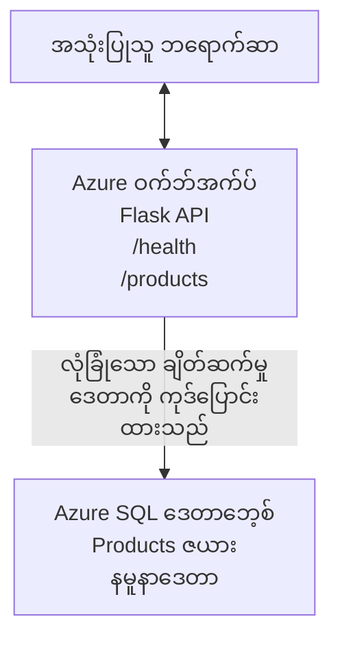

# AZD ဖြင့် Microsoft SQL ဒေတာဘေ့စ်နှင့် Web App ကို တင်သွင်းခြင်း

⏱️ **သတ်မှတ်ထားသော အချိန်**: 20-30 မိနစ် | 💰 **ခန့်မှန်းကုန်ကျစရိတ်**: ~$15-25/လ | ⭐ **အတော်လေး အဆင့်**: အလယ်အလတ်

ဤ **ပြည့်စုံပြီး လုပ်နိုင်သော ဥပမာ** သည် [Azure Developer CLI (azd)](https://learn.microsoft.com/azure/developer/azure-developer-cli/) ကို အသုံးပြု၍ Python Flask web application တစ်ခုကို Microsoft SQL ဒေတာဘေ့စ်နှင့်အတူ Azure သို့ တင်သွင်းနည်းကို ဖော်ပြသည်။ ကုဒ်အားလုံး ပါဝင်ပြီး စမ်းသပ်ထားပြီး—ပြင်ပ အားကိုးမှုပြဿနာများ မလိုအပ်ပါ။

## သင်ဘာတွေလေ့လာမလဲ

ဤဥပမာကို ပြီးစီးပါက၊ သင်သည် -
- infrastructure-as-code ကို အသုံးပြု၍ multi-tier application (web app + database) တင်သွင်းနည်း
- လျှို့ဝှက်ချက်များကို source code တွင် မထည့်ဘဲ database ချိတ်ဆက်မှုများကို ဘေးကင်းစေရန် ဖော်ပြနည်း
- Application Insights ဖြင့် application ကျန်းမာရေးကို ကြည့်ရ
- AZD CLI ဖြင့် Azure ရင်းမြစ်များကို ထိရောက်စွာ စီမံခန့်ခွဲနည်း
- လုံခြုံရေး၊ ကုန်ကျစရိတ် ထိရောက်မှုနှင့် observability အတွက် Azure ၏ အကောင်းဆုံး လုပ်ထုံးလုပ်နည်းများကို လိုက်နာနည်း

## ရှုမြင်ထောင့်ချုပ်
- **Web App**: database ချိတ်ဆက်မှုပါရှိသော Python Flask REST API
- **Database**: ဥပမာဒေတာပါရှိသော Azure SQL Database
- **Infrastructure**: Bicep (module အလိုက် အသုံးပြုနိုင်သော စံနမူနာများ) ဖြင့် provision
- **Deployment**: `azd` commands များဖြင့် အလိုအလျောက် ပြီးဆုံး
- **Monitoring**: မျက်နှာချင်းဆိုင် logs နှင့် telemetry အတွက် Application Insights

## လိုအပ်ချက်များ

### လိုအပ်သော ကိရိယာများ

စတင်မီ အောက်ပါကိရိယာများ ထည့်သွင်းပြီးသား ဖြစ်ကြောင်း စစ်ဆေးပါ။

1. **[Azure CLI](https://learn.microsoft.com/cli/azure/install-azure-cli)** (version 2.50.0 သို့မဟုတ် အထက်)
   ```sh
   az --version
   # မျှော်လင့်ထားသော အထွက်: azure-cli 2.50.0 သို့မဟုတ် ထက်မြင့်သော
   ```

2. **[Azure Developer CLI (azd)](https://learn.microsoft.com/azure/developer/azure-developer-cli/install-azd)** (version 1.0.0 သို့မဟုတ် အထက်)
   ```sh
   azd version
   # မျှော်မှန်းထားသော ထွက်ရလဒ်: azd ဗားရှင်း 1.0.0 သို့မဟုတ် အထက်
   ```

3. **[Python 3.8+](https://www.python.org/downloads/)** (local development အတွက်)
   ```sh
   python --version
   # မျှော်မှန်းထားသော ထွက်ရလဒ်: Python 3.8 သို့မဟုတ် ထက်မြင့်
   ```

4. **[Docker](https://www.docker.com/get-started)** (optional၊ local containerized development အတွက်)
   ```sh
   docker --version
   # မျှော်မှန်းထားသော အထွက်: Docker ဗားရှင်း 20.10 သို့မဟုတ် ထက်မြင့်
   ```

### Azure အလိုအပ်ချက်များ

- အသုံးပြုနိုင်သော **Azure subscription** ([create a free account](https://azure.microsoft.com/free/))
- သင်၏ subscription ထဲတွင် resources ဖန်တီးခွင့်များ
- subscription သို့မဟုတ် resource group ပေါ်တွင် **Owner** သို့မဟုတ် **Contributor** အခန်းကဏ္ဍ

### သိရှိထားရမည့် အခြေခံအချက်များ

ဤသည်မှာ **အလယ်အလတ်-အဆင့်** ဥပမာဖြစ်သည်။ သင်သည် အောက်ပါ အရာများကို သိရှိထားရမည်။
- command-line အခြေခံ အရာများ
- cloud အခြေခံ အယူအဆများ (resources, resource groups)
- web applications နှင့် databases အတွက် အခြေခံ နားလည်မှု

**AZD အသစ်လား?** အရင်ဆုံး [Getting Started guide](../../docs/chapter-01-foundation/azd-basics.md) ကို စတင်ဖတ်ရှုပါ။

## ဖျဉ်းချုပ်ဆောက်ပုံ

ဤဥပမာသည် web application နှင့် SQL database ပါရှိသည့် two-tier architecture တစ်ခုကို တင်သွင်းသည်-


**Resource Deployment:**
- **Resource Group**: အရင်းမြစ်များအားလုံး၏ ထုပ်ပိုးခုံ
- **App Service Plan**: Linux အခြေပြု hosting (ကုန်ကျစရိတ်ထိရောက်စေရန် B1 tier)
- **Web App**: Python 3.11 runtime နှင့် Flask application
- **SQL Server**: TLS 1.2 အနည်းဆုံး ဖြင့် စီမံခန့်ခွဲချက်ရှိသော database server
- **SQL Database**: Basic tier (2GB၊ development/testing အတွက် သင့်တော်)
- **Application Insights**: မျက်နှာဖုံးနှင့် log များအတွက်
- **Log Analytics Workspace**: log များစုစည်းထားသော ဗဟိုကွန်ရက်

**သရုပ်ပြချက်**: ၎င်းကို စားသောက်ဆိုင်တစ်ခု (web app) နှင့် လမ်းလျှောက်သိမ်းထားသည့် အအေးခန်း (database) ကဲ့သို့ စဥ်းစားပါ။ ဖောက်သည်များသည် မီနူး (API endpoints) မှာ အမှာစာတင်ကြပြီး မီးဖိုချောင် (Flask app) သည် အအေးခန်း (ဒေတာ) မှ ဧရာဝတီ ပစ္စည်းများ (data) ကို ရယူသည်။ စားသောက်ဆိုင်မန်နေဂျာ (Application Insights) သည် ဖြစ်ရပ်များအားလုံးကို ထိန်းသိမ်းကြည့်ရှုသည်။

## ဖိုလ်ဒါ ဖွဲ့စည်းပုံ

ဤဥပမာတွင် ဖိုင်များအားလုံး ပါဝင်ပြီး ပြင်ပ အားကိုးမှု မလိုအပ်ပါ။

```
examples/database-app/
│
├── README.md                    # This file
├── azure.yaml                   # AZD configuration file
├── .env.sample                  # Sample environment variables
├── .gitignore                   # Git ignore patterns
│
├── infra/                       # Infrastructure as Code (Bicep)
│   ├── main.bicep              # Main orchestration template
│   ├── abbreviations.json      # Azure naming conventions
│   └── resources/              # Modular resource templates
│       ├── sql-server.bicep    # SQL Server configuration
│       ├── sql-database.bicep  # Database configuration
│       ├── app-service-plan.bicep  # Hosting plan
│       ├── app-insights.bicep  # Monitoring setup
│       └── web-app.bicep       # Web application
│
└── src/
    └── web/                    # Application source code
        ├── app.py              # Flask REST API
        ├── requirements.txt    # Python dependencies
        └── Dockerfile          # Container definition
```

**ဖိုင်တိုင်း၏ လုပ်ဆောင်ချက်:**
- **azure.yaml**: AZD ထောင့်မှ တင်သွင်းရန် အချက်အလက်များကို ပြောပြသည်
- **infra/main.bicep**: Azure resources အားလုံးကို စီမံညှိနှိုင်းသည်
- **infra/resources/*.bicep**: တစ်ခုချင်း resource သတ်မှတ်ချက်များ (module အလိုက် အသုံးပြုနိုင်ရန်)
- **src/web/app.py**: database logic ပါသော Flask application
- **requirements.txt**: Python package များ၏မူကြမ်း
- **Dockerfile**: deployment အတွက် containerization ညွှန်ကြားချက်များ

## Quickstart (အဆင့်နှင့်အဆင့်)

### အဆင့် 1: Clone ပြီး ဗာည်ရှင်းသွားပါ

```sh
git clone https://github.com/microsoft/AZD-for-beginners.git
cd AZD-for-beginners/examples/database-app
```

**✓ အောင်မြင်မှု စစ်ဆေးချက်**: `azure.yaml` နှင့် `infra/` ဖိုလ်ဒါကို တွေ့နိုင်သလား စစ်ဆေးပါ။
```sh
ls
# မျှော်မှန်းထားသည်: README.md, azure.yaml, infra/, src/
```

### အဆင့် 2: Azure သို့ အတည်ပြု身份

```sh
azd auth login
```

ဤသည်သည် Azure အတည်ပြုပြီး Browser ကို ဖွင့်ပေးပါလိမ့်မည်။ သင့် Azure အသိအမှတ်အသားဖြင့် စာရင်းသွင်းပါ။

**✓ အောင်မြင်မှု စစ်ဆေးချက်**: အောက်ပါ အရာတွေကို တွေ့ရမည်။
```
Logged in to Azure.
```

### အဆင့် 3: Environment ကို စတင်အပြင်အဆင်

```sh
azd init
```

**ဖြစ်ပျက်မည့်အချက်များ**: AZD သည် သင့် deployment အတွက် local configuration ကို ဖန်တီးပေးမည်။

**မေးမြန်းချက်များကို သင်ကြုံတွေ့မည့်အရာများ**:
- **Environment name**: အသေးစား အမည်တစ်ခု ထည့်ပါ (ဥပမာ `dev`, `myapp`)
- **Azure subscription**: စာရင်းမှ သင်၏ subscription ကို ရွေးပါ
- **Azure location**: တိုင်းရင်းဒေသ ရွေးချယ်ပါ (ဥပမာ `eastus`, `westeurope`)

**✓ အောင်မြင်မှု စစ်ဆေးချက်**: အောက်ပါအရာတွေကို တွေ့ရမည်။
```
SUCCESS: New project initialized!
```

### အဆင့် 4: Azure Resources များကို Provision ပြုလုပ်ပါ

```sh
azd provision
```

**ဖြစ်ပျက်မည့်အချက်များ**: AZD သည် အင်ဖရားစက်မှုအားလုံးကို တပ်ဆင်မည် (5-8 မိနစ်ယူနိုင်သည်)။
1. Resource group ဖန်တီးသည်
2. SQL Server နှင့် Database ဖန်တီးသည်
3. App Service Plan ဖန်တီးသည်
4. Web App ဖန်တီးသည်
5. Application Insights ဖန်တီးသည်
6. နက်ဝတ်ခ်နှင့် လုံခြုံရေးများကို ဖော်ပြသည်

**သင့်အား မေးမြန်းမည့်အရာများ**:
- **SQL admin username**: username တစ်ခု ထည့်ပါ (ဥပမာ `sqladmin`)
- **SQL admin password**: ခိုင်ခံ့သော password တစ်ခု ထည့်ပါ (သိမ်းဆည်းပါ!)

**✓ အောင်မြင်မှု စစ်ဆေးချက်**: အောက်ပါ အရာများကို တွေ့ရမည်။
```
SUCCESS: Your application was provisioned in Azure in X minutes Y seconds.
You can view the resources created under the resource group rg-<env-name> in Azure Portal:
https://portal.azure.com/#@/resource/subscriptions/.../resourceGroups/rg-<env-name>
```

**⏱️ Time**: 5-8 minutes

### အဆင့် 5: Application ကို Deploy ပြုလုပ်ပါ

```sh
azd deploy
```

**ဖြစ်ပျက်မည့်အချက်များ**: AZD သည် သင့် Flask application ကို build နှင့် deploy ပြုလုပ်မည်။
1. Python application ကို package ပြုလုပ်သည်
2. Docker container ကို build ပြုလုပ်သည်
3. Azure Web App သို့ push လုပ်သည်
4. Database ကို ဥပမာဒေတာဖြင့် initialize လုပ်သည်
5. application ကို စတင်သည်

**✓ အောင်မြင်မှု စစ်ဆေးချက်**: အောက်ပါ အရာများကို တွေ့ရမည်။
```
SUCCESS: Your application was deployed to Azure in X minutes Y seconds.
You can view the resources created under the resource group rg-<env-name> in Azure Portal:
https://portal.azure.com/#@/resource/subscriptions/.../resourceGroups/rg-<env-name>
```

**⏱️ Time**: 3-5 minutes

### အဆင့် 6: Application ကို အလည်လာကြည့်ပါ

```sh
azd browse
```

ဤသည်သည် သင့် deployed web app ကို `https://app-<unique-id>.azurewebsites.net` တွင် browser ဖြင့် ဖွင့်ပေးသည်။

**✓ အောင်မြင်မှု စစ်ဆေးချက်**: JSON output ကို တွေ့ရမည်။
```json
{
  "message": "Welcome to the Database App API",
  "endpoints": {
    "/": "This help message",
    "/health": "Health check endpoint",
    "/products": "List all products",
    "/products/<id>": "Get product by ID"
  }
}
```

### အဆင့် 7: API Endpoints များကို စမ်းသပ်ပါ

**Health Check** (database ချိတ်ဆက်မှုကို စစ်ဆေးရန်):
```sh
curl https://app-<your-id>.azurewebsites.net/health
```

**မျှော်လင့်ထားသော အဖြေ**:
```json
{
  "status": "healthy",
  "database": "connected"
}
```

**List Products** (ဥပမာဒေတာ):
```sh
curl https://app-<your-id>.azurewebsites.net/products
```

**မျှော်လင့်ထားသော အဖြေ**:
```json
[
  {
    "id": 1,
    "name": "Laptop",
    "description": "High-performance laptop",
    "price": 1299.99,
    "created_at": "2025-11-19T10:30:00"
  },
  ...
]
```

**Get Single Product**:
```sh
curl https://app-<your-id>.azurewebsites.net/products/1
```

**✓ အောင်မြင်မှု စစ်ဆေးချက်**: အားလုံးသော endpoints များသည် အမှားမရှိဘဲ JSON ဒေတာ ပြန်လာရမည်။

---

**🎉 ဂုဏ်ယူပါတယ်!** AZD ကို အသုံးပြု၍ Azure သို့ web application နှင့် database တစ်ခုကို အောင်မြင်စွာ တင်သွင်းပြီးဖြစ်ပါပြီ။

## ဖွဲ့စည်းမှု နက်ရှိုင်း လေ့လာချက်

### Environment Variables

လျှို့ဝှက်ချက်များကို Azure App Service configuration မှလုံခြုံစွာ စီမံထားသည်—**source code ထဲတွင် ဘယ်တော့မှ hardcode မထားရပါ**။

**AZD မှ အလိုအလျောက် ဖော်ပြထားသောများ**:
- `SQL_CONNECTION_STRING`: Database ချိတ်ဆက်မှု (လျှို့ဝှက်ချက်များ encryption ထဲတွင်)
- `APPLICATIONINSIGHTS_CONNECTION_STRING`: monitoring telemetry endpoint
- `SCM_DO_BUILD_DURING_DEPLOYMENT`: အလိုအလျောက် dependency 설치 ကို ဖွင့်သည်

**လျှို့ဝှက်ချက်များ ဘယ်မှာ သိမ်းထားသလဲ**:
1. `azd provision` အတွင်း သင်သည် SQL အကောင့် အချက်အလက်များကို secure prompts ဖြင့် ထည့်သွင်းသည်
2. AZD သည် ထိုအချက်အလက်များကို သင့် local `.azure/<env-name>/.env` ဖိုင်ထဲသို့ (git-ignore ထားသည်) သိမ်းဆည်းသည်
3. AZD သည် ထိုတိုင်းတာချက်များကို Azure App Service configuration ထဲသို့ inject ပြုလုပ်သည် (at rest တွင် 암호화)
4. Application သည် runtime တွင် `os.getenv()` ဖြင့် ဖတ်ယူသည်

### Local Development

local စမ်းသပ်ရေးအတွက် sample မှ `.env` ဖိုင်တစ်ခု ဖန်တီးပါ။

```sh
cp .env.sample .env
# .env ကို သင့်ဒေသခံ ဒေတာဘေ့စ် ဆက်သွယ်မှု အချက်အလက်များဖြင့် တည်းဖြတ်ပါ
```

**Local Development Workflow**:
```sh
# လိုအပ်သော မူတည်မှုများကို ထည့်သွင်းပါ
cd src/web
pip install -r requirements.txt

# ပတ်ဝန်းကျင် တန်ဖိုးများကို သတ်မှတ်ပါ
export SQL_CONNECTION_STRING="your-local-connection-string"

# အပလီကေးရှင်းကို လည်ပတ်ပါ
python app.py
```

**Test locally**:
```sh
curl http://localhost:8000/health
# မျှော်လင့်ထားသည်: {"status": "healthy", "database": "connected"}
```

### Infrastructure as Code

Azure resources အားလုံးကို **Bicep templates** (`infra/` ဖိုလ်ဒါ) တွင် သတ်မှတ်ထားသည်။

- **Modular Design**: resource အမျိုးအစားတစ်ခုချင်းစီသည် အသုံးပြုရန် အခြားဖိုင်များပါရှိသည်
- **Parameterized**: SKUs, regions, naming conventions များကို သင့်လိုချင်သည့်အတိုင်း အပြောင်းအလဲပြုနိုင်သည်
- **အကောင်းဆုံး လုပ်ထုံးလုပ်နည်းများ**: Azure naming standards နှင့် security defaults ကို လိုက်နာထားသည်
- **Version Controlled**: Infrastructure ပြောင်းလဲမှုများကို Git မှာ ထိန်းသိမ်းထားသည်

**ပြောင်းလဲမှုဥပမာ**:
Database tier ကို ပြောင်းချင်ရင် `infra/resources/sql-database.bicep` ကို တည်းဖြတ်ပါ။
```bicep
sku: {
  name: 'Standard'  // Changed from 'Basic'
  tier: 'Standard'
  capacity: 10
}
```

## လုံခြုံရေး အကောင်းဆုံးလေ့လာချက်များ

ဤဥပမာသည် Azure ၏ လုံခြုံရေး အကောင်းဆုံး လုပ်ထုံးလုပ်နည်းများကို လိုက်နာထားသည်။

### 1. **Source Code အတွင်း လျှို့ဝှက်ချက် မရှိပါ**
- ✅ Credentials များကို Azure App Service configuration ထဲတွင် (암호화 ထားပြီး) သိမ်းဆည်းထားသည်
- ✅ `.env` ဖိုင်များကို `.gitignore` ဖြင့် Git မှ မပါဝင်စေထားသည်
- ✅ Provisioning အတွင်း secure parameters များဖြင့် လျှို့ဝှက်ချက်များ ပေးပို့ထားသည်

### 2. **암호화 ချိတ်ဆက်မှုများ**
- ✅ SQL Server အတွက် TLS 1.2 အနည်းဆုံး
- ✅ Web App အတွက် HTTPS-only ကို ကတိပြုထားသည်
- ✅ Database ချိတ်ဆက်မှုများတွင် 암호화ထားသော ချန်နယ်များကို အသုံးပြုသည်

### 3. **Network လုံခြုံရေး**
- ✅ SQL Server firewall ကို Azure services အတွက်သာ ခွင့်ပြုထားသည်
- ✅ Public network access ကို ကန့်သတ်ထားသည် (Private Endpoints ဖြင့် ပိုမိုကန့်သတ်နိုင်သည်)
- ✅ Web App တွင် FTPS ကို ပိတ်ထားသည်

### 4. **Authentication & Authorization**
- ⚠️ **လက်ရှိ**: SQL authentication (username/password)
- ✅ **Production အကြံပြုချက်**: password ကင်းသော authentication အတွက် Azure Managed Identity ကို အသုံးပြုရန်

**Managed Identity သို့ အဆင့်မြှင့်ရန်** (production အတွက်):
1. Web App ပေါ်တွင် managed identity ကို ဖွင့်ရန်
2. identity သို့ SQL အခွင့်အရေးများ ပေးရန်
3. connection string ကို managed identity အသုံးပြုရန် update ပြုလုပ်ရန်
4. password-based authentication ကို ဖယ်ရှားရန်

### 5. **Auditing & Compliance**
- ✅ Application Insights သည် request และ error များအားလုံးကို log ထုတ်သည်
- ✅ SQL Database auditing ကို ဖွင့်ထားသည် (compliance အလိုက် ပြန်ချိန်ထိန်းနိုင်သည်)
- ✅ အရင်းအမြစ်များအားလုံးကို governance အတွက် tag ထားသည်

**Production အတွက် လုံခြုံရေး စစ်ဆေးစာရင်း**:
- [ ] Enable Azure Defender for SQL
- [ ] Configure Private Endpoints for SQL Database
- [ ] Enable Web Application Firewall (WAF)
- [ ] Implement Azure Key Vault for secret rotation
- [ ] Configure Azure AD authentication
- [ ] Enable diagnostic logging for all resources

## ကုန်ကျစရိတ် ထိရောက်စေရန်

**ခန့်မှန်း လစဉ်ကုန်ကျစရိတ်** (November 2025 အခြေအနေ အရ):

| Resource | SKU/Tier | Estimated Cost |
|----------|----------|----------------|
| App Service Plan | B1 (Basic) | ~$13/month |
| SQL Database | Basic (2GB) | ~$5/month |
| Application Insights | Pay-as-you-go | ~$2/month (low traffic) |
| **Total** | | **~$20/month** |

**💡 ကုန်ကျစရိတ် လျှော့ချနည်းများ**:

1. **သင်ယူရန် Free Tier ကို အသုံးပြုပါ**:
   - App Service: F1 tier (အခမဲ့၊ အချိန်ကန့်သတ် 있음)
   - SQL Database: Azure SQL Database serverless အသုံးပြုပါ
   - Application Insights: 5GB/လ အခမဲ့ ingestion

2. **အသုံးမရှိချိန်တွင် resources များကို ရပ်ထားပါ**:
   ```sh
   # ဝက်ဘ်အက်ပ်ကို ရပ်ပါ (ဒေတာဘေ့စ်အတွက် ကုန်ကျစရိတ်များ ဆက်လက် ရှိနေပါမည်)
   az webapp stop --name <app-name> --resource-group <rg-name>
   
   # လိုအပ်သည့်အချိန်တွင် ပြန်စပါ
   az webapp start --name <app-name> --resource-group <rg-name>
   ```

3. **စမ်းသပ်ပြီးနောက် အားလုံး ဖျက်ပစ်ပါ**:
   ```sh
   azd down
   ```
   ၎င်းသည် အရင်းအမြစ်အားလုံးကို ဖျက်ပစ်ပြီး ချက်လတ်စွာ ကိစ္စရပ်ငွေ လျော့ပါးစေသည်။

4. **Development နှင့် Production SKUs များကို ခွဲခြားပါ**:
   - **Development**: ဤဥပမာတွင် အသုံးပြုထားသော် Basic tier
   - **Production**: redundancy ပါသော Standard/Premium tier

**ကုန်ကျစရိတ် ကြည့်ရှုခြင်း**:
- [Azure Cost Management](https://portal.azure.com/#view/Microsoft_Azure_CostManagement) တွင် ကုန်ကျစရိတ် ကြည့်ပါ
- အလွဲအလွဲ မဖြစ်စေဘဲ cost alerts ကို စတင်ဖန်တီးထားပါ
- resource အားလုံးကို `azd-env-name` ဖြင့် tag ပြုလုပ်ထားပါ

**Free Tier အစားထိုးနည်း**:
သင်ယူရန်ရည်ရွယ်ပါက `infra/resources/app-service-plan.bicep` ကို ပြောင်းလဲနိုင်သည်။
```bicep
sku: {
  name: 'F1'  // Free tier
  tier: 'Free'
}
```
**Note**: Free tier တွင် ကန့်သတ်ချက်များ ရှိသည် (60 min/day CPU, always-on မရှိပါ)။

## မျက်မြင်ရေးနှင့် ကြည့်ရှုနိုင်မှု

### Application Insights ပေါင်းစည်းမှု

ဤဥပမာတွင် **Application Insights** ပါဝင်သည်၊ အပြည့်အဝ ကြည့်ရှုစစ်ဆေးနိုင်ရန်။

**အရာများကို မျက်မြင်စောင့်ကြည့်သည်**:
- ✅ HTTP requests (latency, status codes, endpoints)
- ✅ Application errors နှင့် exceptions
- ✅ Flask app မှ custom logging
- ✅ Database connection ကျန်းမာရေး
- ✅ performance metrics (CPU, memory)

**Application Insights ထဲသို့ ဝင်ရန်**:
1. [Azure Portal](https://portal.azure.com) ကို ဖွင့်ပါ
2. သင့် resource group (`rg-<env-name>`) သို့ သွားပါ
3. Application Insights resource (`appi-<unique-id>`) ကို နှိပ်ပါ

**အသုံးဝင် Query များ** (Application Insights → Logs):

**View All Requests**:
```kusto
requests
| where timestamp > ago(1h)
| order by timestamp desc
| project timestamp, name, url, resultCode, duration
```

**Find Errors**:
```kusto
exceptions
| where timestamp > ago(24h)
| order by timestamp desc
| project timestamp, type, outerMessage, operation_Name
```

**Check Health Endpoint**:
```kusto
requests
| where name contains "health"
| summarize count() by resultCode, bin(timestamp, 1h)
```

### SQL Database Auditing

**SQL Database auditing ကို ဖွင့်ထားသည်**၊ အောက်ပါအရာများကို ထောက်လှမ်းနိုင်ရန်။
- Database access patterns
- Failed login attempts
- Schema changes
- Data access (compliance အတွက်)

**Audit Logs များသို့ ဝင်ကြည့်ရန်**:
1. Azure Portal → SQL Database → Auditing
2. Log Analytics workspace တွင် logs များကို ကြည့်ပါ

### တိုက်ရိုက် မြင်သာစေမှု

**Live Metrics ကြည့်ရန်**:
1. Application Insights → Live Metrics
2. request များ၊ failure များ နှင့် performance ကို တိုက်ရိုက် ကြည့်ရှုနိုင်သည်

**Alerts စတင်ဖန်တီးရန်**:
critical ဖြစ်သော အရာများအတွက် alerts များ ဖန်တီးပါ။
- HTTP 500 errors > 5 in 5 minutes
- Database connection failures
- High response times (>2 seconds)

**Alert ဖန်တီးခြင်း ဥပမာ**:
```sh
az monitor metrics alert create \
  --name "High-Response-Time" \
  --resource-group <rg-name> \
  --scopes <app-insights-resource-id> \
  --condition "avg requests/duration > 2000" \
  --description "Alert when response time exceeds 2 seconds"
```

## Troubleshooting
### ပုံမှန်ပြဿနာများနှင့် ဖြေရှင်းနည်းများ

#### 1. `azd provision` fails with "Location not available"

**လက္ခဏာ**:
```
Error: The subscription is not registered for the resource type 'components' in the location 'centralus'.
```

**ဖြေရှင်းချက်**:
အခြား Azure ဒေသတစ်ခုကို ရွေးချယ်ပါ သို့မဟုတ် resource provider ကို မှတ်ပုံတင်ပါ:
```sh
az provider register --namespace Microsoft.Insights
```

#### 2. SQL Connection Fails During Deployment

**လက္ခဏာ**:
```
pyodbc.OperationalError: ('08001', '[08001] [Microsoft][ODBC Driver 18 for SQL Server]TCP Provider...')
```

**ဖြေရှင်းချက်**:
- SQL Server firewall သည် Azure ဝန်ဆောင်မှုများအား ခွင့်ပြုထားသည်ကို စစ်ဆေးပါ (အလိုအလျောက် ဖွဲ့စည်းသည်)
- `azd provision` ကို အသုံးပြုစဉ် SQL admin password ကို မှန်ကန်စွာ ဖြည့်သွင်းထားကြောင်း စစ်ဆေးပါ
- SQL Server ကို ပြည့်စုံစွာ provision လုပ်ပြီးသားဖြစ်ကြောင်း သေချာပါစေ (2-3 မိနစ်ယူနိုင်သည်)

**ချိတ်ဆက်မှုကို စစ်ဆေးပါ**:
```sh
# Azure Portal မှာ SQL Database → Query editor သို့ သွားပါ
# သင့် အသုံးပြုခွင့် အချက်အလက်များဖြင့် ချိတ်ဆက်ကြည့်ပါ
```

#### 3. Web App Shows "Application Error"

**လက္ခဏာ**:
ဘရောက်ဇာသည် သာမန် အမှား စာမျက်နှာကို ပြသည်။

**ဖြေရှင်းချက်**:
အပလီကေးရှင်း မှတ်တမ်းများကို စစ်ဆေးပါ:
```sh
# လတ်တလော မှတ်တမ်းများကို ကြည့်ရန်
az webapp log tail --name <app-name> --resource-group <rg-name>
```

**ပုံမှန် ဖြစ်ပေါ်ရသော အကြောင်းရင်းများ**:
- ပတ်ဝန်းကျင် အပြောင်းအလဲ တန်ဖိုးများ (environment variables) မရှိခြင်း (App Service → Configuration ကို စစ်ဆေးပါ)
- Python package ထည့်သွင်းမှု မအောင်မြင်ခြင်း (deployment logs ကို စစ်ဆေးပါ)
- ဒေတာဘေ့စ် စတင်ပြုလုပ်ရာ အမှား (SQL ချိတ်ဆက်မှုကို စစ်ဆေးပါ)

#### 4. `azd deploy` Fails with "Build Error"

**လက္ခဏာ**:
```
Error: Failed to build project
```

**ဖြေရှင်းချက်**:
- `requirements.txt` တွင် syntax အမှားမရှိကြောင်း သေချာစေပါ
- `infra/resources/web-app.bicep` တွင် Python 3.11 ကို သတ်မှတ်ထားကြောင်း စစ်ဆေးပါ
- Dockerfile တွင် အခြေခံ image မှန်ကန်ကြောင်း အတည်ပြုပါ

**ဒေသခံတွင် Debug လုပ်ရန်**:
```sh
cd src/web
docker build -t test-app .
docker run -p 8000:8000 test-app
```

#### 5. "Unauthorized" When Running AZD Commands

**လက္ခဏာ**:
```
ERROR: (Unauthorized) The client '<id>' with object id '<id>' does not have authorization
```

**ဖြေရှင်းချက်**:
Azure နဲ့ ထပ်မံ အတည်ပြုပါ:
```sh
# AZD အလုပ်စဉ်များအတွက် လိုအပ်သည်
azd auth login

# သင် Azure CLI အမိန့်များကို တိုက်ရိုက်လည်း အသုံးပြုနေပါက ရွေးချယ်နိုင်သည်
az login
```

subscription ပေါ်တွင် မှန်ကန်သော ခွင့်ပြုချက်များ (Contributor role) ရှိကြောင်း အတည်ပြုပါ။

#### 6. High Database Costs

**လက္ခဏာ**:
မျှော်လင့်မထားသော Azure ငွေကျသင့်မှု။

**ဖြေရှင်းချက်**:
- စမ်းသပ်ပြီးပြီးနောက် `azd down` ကို မရိုက်ထားကြောင်း စစ်ဆေးပါ
- SQL Database သည် Basic tier အသုံးပြုနေကြောင်း အတည်ပြုပါ (Premium မဟုတ်ရပါ)
- Azure Cost Management တွင် ကုန်ကျစရိတ်များကို ပြန်လည်စစ်ဆေးပါ
- ကုန်ကျစရိတ် အသိပေးချက်များကို စီစစ်ချထားပါ

### အကူအညီရယူရန်

**AZD ပတ်ဝန်းကျင် အပြောင်းအလဲများအားလုံး ကြည့်ရန်**:
```sh
azd env get-values
```

**တပ်ဆင်မှု အခြေအနေကို စစ်ဆေးရန်**:
```sh
az webapp show --name <app-name> --resource-group <rg-name> --query state
```

**အပလီကေးရှင်း မှတ်တမ်းများသို့ ဝင်ရောက်ရန်**:
```sh
az webapp log download --name <app-name> --resource-group <rg-name> --log-file app-logs.zip
```

**ထပ်မံ အကူအညီ လိုပါသလား?**
- [AZD Troubleshooting Guide](../../docs/chapter-07-troubleshooting/common-issues.md)
- [Azure App Service Troubleshooting](https://learn.microsoft.com/azure/app-service/troubleshoot-diagnostic-logs)
- [Azure SQL Troubleshooting](https://learn.microsoft.com/azure/azure-sql/database/troubleshoot-common-errors-issues)

## လက်တွေ့လေ့ကျင့်ခန်းများ

### လေ့ကျင့်ခန်း ၁: သင့်တပ်ဆင်မှုကို အတည်ပြုပါ (စတင်သူ)

**ရည်ရွယ်ချက်**: အရင်းအမြစ်များအားလုံး တပ်ဆင်ပြီး အပလီကေးရှင်း အလုပ်လုပ်နေကြောင်း အတည်ပြုပါ။

**အဆင့်များ**:
1. သင့် resource group ထဲရှိ အရင်းအမြစ်များအားလုံးကို စာရင်းပြပါ:
   ```sh
   az resource list --resource-group rg-<env-name> --output table
   ```
   **မျှော်လင့်ချက်**: 6-7 resources (Web App, SQL Server, SQL Database, App Service Plan, Application Insights, Log Analytics)

2. API endpoints များအားလုံး စမ်းသပ်ပါ:
   ```sh
   curl https://app-<your-id>.azurewebsites.net/
   curl https://app-<your-id>.azurewebsites.net/health
   curl https://app-<your-id>.azurewebsites.net/products
   curl https://app-<your-id>.azurewebsites.net/products/1
   ```
   **မျှော်လင့်ချက်**: အားလုံးမှ အမှားမရှိဘဲ မှန်ကန်သော JSON ကို ပြန်ပေးရမည်

3. Application Insights ကို စစ်ဆေးပါ:
   - Azure Portal တွင် Application Insights သို့ သွားပါ
   - "Live Metrics" သို့ သွားပါ
   - web app တွင် သင့် browser ကို refresh လုပ်ပါ
   **မျှော်လင့်ချက်**: တောင်းဆိုချက်များကို တိုက်ရိုက် အချိန်တွင် မြင်ရမည်

**အောင်မြင်မှု ချက်**: အရင်းအမြစ် 6-7 ခုရှိပြီး၊ အားလုံး endpoint များက ဒေတာ ပြန်ပေးသည်၊ Live Metrics တွင် လှုပ်ရှားမှု တွေ့ရသည်။

---

### လေ့ကျင့်ခန်း ၂: API Endpoint အသစ် ထည့်ပါ (အလယ်အလတ်)

**ရည်ရွယ်ချက်**: Flask အပလီကေးရှင်းကို endpoint အသစ်တစ်ခုဖြင့် တိုးချဲ့ပါ။

**စတားတာ ကုဒ်**: လက်ရှိ endpoints များသည် `src/web/app.py` တွင် ရှိပါသည်

**အဆင့်များ**:
1. `src/web/app.py` ကို ပြင်ဆင်ပြီး `get_product()` function အပြီးတွင် endpoint အသစ်တစ်ခု ထည့်ပါ:
   ```python
   @app.route('/products/search/<keyword>')
   def search_products(keyword):
       """Search products by name or description."""
       try:
           conn = get_db_connection()
           cursor = conn.cursor()
           cursor.execute(
               "SELECT id, name, description, price, created_at FROM products WHERE name LIKE ? OR description LIKE ?",
               (f'%{keyword}%', f'%{keyword}%')
           )
           
           products = []
           for row in cursor.fetchall():
               products.append({
                   'id': row[0],
                   'name': row[1],
                   'description': row[2],
                   'price': float(row[3]) if row[3] else None,
                   'created_at': row[4].isoformat() if row[4] else None
               })
           
           cursor.close()
           conn.close()
           
           logger.info(f"Search for '{keyword}' returned {len(products)} results")
           return jsonify(products), 200
           
       except Exception as e:
           logger.error(f"Error searching products: {str(e)}")
           return jsonify({'error': str(e)}), 500
   ```

2. ပြင်ဆင်ပြီးသော အပလီကေးရှင်းကို တပ်ဆင်ပါ:
   ```sh
   azd deploy
   ```

3. endpoint အသစ်ကို စမ်းသပ်ပါ:
   ```sh
   curl https://app-<your-id>.azurewebsites.net/products/search/laptop
   ```
   **မျှော်လင့်ချက်**: "laptop" နှင့် ကိုက်ညီသည့် products များကို ပြန်ပေးရမည်

**အောင်မြင်မှု ချက်**: Endpoint အသစ် အလုပ်လုပ်ကောင်းမက်ပြီး၊ ဖျILTER လုပ်ထားသော ရလဒ်များ ပြန်ပေးကာ Application Insights မှတ်တမ်းများတွင် တွေ့ရမည်။

---

### လေ့ကျင့်ခန်း ၃: စောင့်ကြည့်မှုနှင့် အသိပေးချက်များ ထည့်သွင်းပါ (အဆင့်မြင့်)

**ရည်ရွယ်ချက်**: အသိပေးချက်များနှင့် ကြိုတင်စောင့်ကြည့်မှု သတ်မှတ်ပါ။

**အဆင့်များ**:
1. HTTP 500 အမှားများအတွက် alert တစ်ခု ဖန်တီးပါ:
   ```sh
   # Application Insights အရင်းအမြစ် ID ကို ရယူပါ
   AI_ID=$(az monitor app-insights component show \
     --app appi-<your-id> \
     --resource-group rg-<env-name> \
     --query id -o tsv)
   
   # သတိပေးချက် ဖန်တီးပါ
   az monitor metrics alert create \
     --name "High-Error-Rate" \
     --resource-group rg-<env-name> \
     --scopes $AI_ID \
     --condition "count requests/failed > 5" \
     --window-size 5m \
     --evaluation-frequency 1m \
     --description "Alert when >5 failed requests in 5 minutes"
   ```

2. အမှားများ ဖြစ်စေခြင်းဖြင့် alert ကို trigger ပေးပါ:
   ```sh
   # မရှိသော ထုတ်ကုန်တစ်ခုကို တောင်းဆိုခြင်း
   for i in {1..10}; do curl https://app-<your-id>.azurewebsites.net/products/999; done
   ```

3. alert ပေါက်ကွဲလားမလား စစ်ဆေးပါ:
   - Azure Portal → Alerts → Alert Rules
   - သင့် အီးမေးလ်ကို စစ်ဆေးပါ (တပ်ဆင်ထားပါက)

**အောင်မြင်မှု ချက်**: Alert rule တစ်ခု ဖန်တီးပြီး အမှားများတွင် trigger ဖြစ်ကာ အသိပေးချက်များ လက်ခံရရှိသည်။

---

### လေ့ကျင့်ခန်း ၄: Database Schema ပြင်ဆင်မှုများ (အဆင့်မြင့်)

**ရည်ရွယ်ချက်**: ဇယားအသစ်တစ်ခုထည့်ပြီး application ကို အသုံးပြုရန် ပြင်ဆင်ပါ။

**အဆင့်များ**:
1. Azure Portal Query Editor မှတဆင့် SQL Database သို့ ချိတ်ဆက်ပါ

2. `categories` ဆိုသည့် ဇယားအသစ်ကို ဖန်တီးပါ:
   ```sql
   CREATE TABLE categories (
       id INT PRIMARY KEY IDENTITY(1,1),
       name NVARCHAR(50) NOT NULL,
       description NVARCHAR(200)
   );
   
   INSERT INTO categories (name, description) VALUES
   ('Electronics', 'Electronic devices and accessories'),
   ('Office Supplies', 'Office equipment and supplies');
   
   -- Add category to products table
   ALTER TABLE products ADD category_id INT;
   UPDATE products SET category_id = 1; -- Set all to Electronics
   ```

3. `src/web/app.py` ကို category အချက်အလက်များကို responses တွင် ထည့်သွင်းရန် ပြင်ဆင်ပါ

4. တပ်ဆင်ပြီး စမ်းသပ်ပါ

**အောင်မြင်မှု ချက်**: ဇယားအသစ် ရှိပြီး၊ products များတွင် category အချက်အလက် ပြပါသည်၊ application အလုပ်ဖြစ်နေသည်။

---

### လေ့ကျင့်ခန်း ၅: Caching ကို အကောင်အထည်ဖော်ပါ (အထူးကျွမ်းကျင်)

**ရည်ရွယ်ချက်**: ဖျော်ဖြေရေးမြင့်တင်ရန် Azure Redis Cache ထည့်ပါ။

**အဆင့်များ**:
1. `infra/main.bicep` တွင် Redis Cache ကို ထည့်ပါ
2. `src/web/app.py` ကို ပြင်ဆင်ပြီး product queries များကို cache ပြုလုပ်ပါ
3. Application Insights ဖြင့် performance တိုးတက်မှုကို တိုင်းတာပါ
4. Caching မတိုင်မှီ/နောက်ပိုင်း တုံ့ပြန်ချိန်များကို နှိုင်းယှဉ်ပါ

**အောင်မြင်မှု ချက်**: Redis တပ်ဆင်ပြီး caching အလုပ်လုပ်၊ တုံ့ပြန်ချိန်များ >50% မြှင့်တက်သည်။

**အကြံပြုချက်**: [Azure Cache for Redis documentation](https://learn.microsoft.com/azure/azure-cache-for-redis/) ကို စတင်ဖတ်ပါ။

---

## သန့်ရှင်းရေး

ဆက်လက်ပေးချေမှုများမှ ကာကွယ်ရန် အလုပ်ပြီးသွားပါက အရင်းအမြစ်များအားလုံး ဖျက်ပစ်ပါ။

```sh
azd down
```

**အတည်ပြုမေးခွန်း**:
```
? Total resources to delete: 7, are you sure you want to continue? (y/N)
```

အတည်ပြုရန် `y` ဟု ရိုက်ထည့်ပါ။

**✓ အောင်မြင်မှု စစ်ဆေးချက်**: 
- Azure Portal မှ အရင်းအမြစ်အားလုံး ဖျက်ထားပြီး ဖြစ်ရမည်
- စက်လည်ပတ်မှုဆက်လက်ဖြစ်စေရန် ငွေပေးချေမှု မရှိကြောင်း အတည်ပြုပါ
- ဒေသခံ `.azure/<env-name>` ဖိုလ်ဒါကို ဖျက်နိုင်သည်

**အခြားရွေးချယ်မှု** (အဆောက်အဦးကို ထိန်းသိမ်းပြီး ဒေတာကို ဖျက်ချင်ပါက):
```sh
# ရင်းမြစ်အုပ်စုကိုပဲ ဖျက်ပါ (AZD ဆက်တင်ကို ထားပါ)
az group delete --name rg-<env-name> --yes
```
## သေးထပ်ဖတ်ရှုရန်

### ဆက်စပ် စာရွက်စာတမ်းများ
- [Azure Developer CLI Documentation](https://learn.microsoft.com/azure/developer/azure-developer-cli/)
- [Azure SQL Database Documentation](https://learn.microsoft.com/azure/azure-sql/database/)
- [Azure App Service Documentation](https://learn.microsoft.com/azure/app-service/)
- [Application Insights Documentation](https://learn.microsoft.com/azure/azure-monitor/app/app-insights-overview)
- [Bicep Language Reference](https://learn.microsoft.com/azure/azure-resource-manager/bicep/)

### ဒီသင်တန်းအတွင်း နောက်ဆက်တွဲ အဆင့်များ
- **[Container Apps Example](../../../../examples/container-app)**: Azure Container Apps ဖြင့် microservices များ တပ်ဆင်ခြင်း
- **[AI Integration Guide](../../../../docs/ai-foundry)**: သင့် အက်ပ်သို့ AI လုံခြုံမှု ထည့်သွင်းခြင်း
- **[Deployment Best Practices](../../docs/chapter-04-infrastructure/deployment-guide.md)**: ထုတ်လုပ်မှု တပ်ဆင်ရာ အကောင်းဆုံး လမ်းစဉ်များ

### အဆင့်မြင့် ခေါင်းစဉ်များ
- **Managed Identity**: စကားဝှက်များကို ဖျက်ပြီး Azure AD authentication ကို အသုံးပြုပါ
- **Private Endpoints**: virtual network အတွင်း ဒေတာဘေ့စ် ချိတ်ဆက်မှုများကို လုံခြုံစေရန်
- **CI/CD Integration**: GitHub Actions သို့မဟုတ် Azure DevOps ဖြင့် တပ်ဆင်မှုများ ကို အလိုအလျောက်လုပ်ဆောင်ပါ
- **Multi-Environment**: dev, staging, production ပတ်ဝန်းကျင်များကို သတ်မှတ်ပါ
- **Database Migrations**: schema versioning အတွက် Alembic သို့မဟုတ် Entity Framework ကို အသုံးပြုပါ

### အခြားနည်းလမ်းများနှင့် နှိုင်းယှဉ်ချက်

**AZD vs. ARM Templates**:
- ✅ AZD: အဆင့်မြင့် abstraction, command များ ပိုရိုးရှင်း
- ⚠️ ARM: စာပိုင်းများ ပိုလေးနက်ပြီး၊ ပို၍ အသေးစိတ် ထိန်းချုပ်နိုင်

**AZD vs. Terraform**:
- ✅ AZD: Azure-မူရင်း၊ Azure ဝန်ဆောင်မှုများနှင့် ပေါင်းစည်းထားသည်
- ⚠️ Terraform: Multi-cloud ထောက်ပံ့မှု၊ ကြီးမားသော ecosystem

**AZD vs. Azure Portal**:
- ✅ AZD: ပြန်လည်အသုံးပြုနိုင်၍ version-control ထားနိုင်ပြီး automation လွယ်ကူ
- ⚠️ Portal: လက်ဖြင့် နှိပ်ထိန်းထိန်းသောကြောင့် ပြန်လည်ထပ်မံလုပ်ရန် ခက်ခဲ

**AZD ကို တွေးကြည့်ပါ**: Azure အတွက် Docker Compose လို့ ထင်ပါ — စုပေါင်းတပ်ဆင်မှုများအတွက် ဖော်ပြချက်များကို ရိုးရှင်းစေသည်။

---

## မကြာခဏ မေးလေ့ရှိသော မေးခွန်းများ

**Q: မတူညီသော programming language ကို အသုံးပြုနိုင်ပါသလား?**  
A: ဟုတ်ကဲ့! `src/web/` ကို Node.js, C#, Go သို့မဟုတ် မည်သည့် ဘာသာစကားမဆို အစားထိုးနိုင်သည်။ `azure.yaml` နှင့် Bicep ကို သင့်လျော်စွာ ပြင်ဆင်ပါ။

**Q: ဘာလို့ ပိုမိုသော databases ထည့်နိုင်မလဲ?**  
A: `infra/main.bicep` တွင် SQL Database module တစ်ခု ပိုထည့်ပါ သို့မဟုတ် PostgreSQL/MySQL ကို Azure Database services မှ အသုံးပြုနိုင်သည်။

**Q: ဒါကို production အတွက် အသုံးပြုနိုင်မလား?**  
A: ဤနေရာသည် အစပြုရန် နေရာဖြစ်သည်။ Production အတွက် managed identity, private endpoints, redundancy, backup strategy, WAF, နှင့် တိုးတက်သော စောင့်ကြည့်မှုများကို ထည့်သွင်းပါ။

**Q: ကုဒ်တင်တာ အစား containers အသုံးပြုချင်ရင် ဘာလုပ်မလဲ?**  
A: [Container Apps Example](../../../../examples/container-app) ကို ကြည့်ပါ၊ အများအားဖြင့် Docker containers ကို အစဉ်လိုက်အသုံးပြုထားသည်။

**Q: ကိုယ့် local machine မှ database ကို ဘယ်လို ချိတ်ဆက်မလဲ?**  
A: SQL Server firewall တွင် သင့် IP ကို ထည့်ပါ:
```sh
az sql server firewall-rule create \
  --resource-group rg-<env-name> \
  --server sql-<unique-id> \
  --name AllowMyIP \
  --start-ip-address <your-ip> \
  --end-ip-address <your-ip>
```

**Q: အသစ် ဖန်တီးရန် အစား ရှိပြီးသား database ကို အသုံးပြုနိုင်မလား?**  
A: ဟုတ်ကဲ့၊ `infra/main.bicep` ကို လိုက်လျောညီထွေစွာ ပြင်ဆင်ပြီး ရှိပြီးသား SQL Server ကို ကိုးကားစေဦး၍ connection string ပဲ ပြင်ဆင်ပါ။

---

> **မှတ်ချက်:** ဤဥပမာသည် AZD ကို အသုံးပြု၍ database ပါဝင်သည့် web app တပ်ဆင်ရာတွင် အကောင်းဆုံးလက်တွေ့များကို ပြသသည်။ လုပ်ငန်းဆောင်တာများအတွက် အလုပ်လုပ်နိုင်သောကုဒ်၊ စုံလင်သော စာရွက်စာတမ်းများနှင့် လက်တွေ့လေ့ကျင့်ခန်းများ ပါဝင်သည်။ ထုတ်လုပ်ရေးတွင် ထပ်မံ တပ်ဆင်မည့်အခါ သင့်အဖွဲ့အစည်းနှင့် လိုက်တူသော လုံခြုံရေး၊ scaling၊ လိုက်နာမှုနှင့် ကုန်ကျစရိတ် လိုအပ်ချက်များကို ပြန်လည်သုံးသပ်ပါ။

**📚 သင်တန်း လမ်းကြောင်း ဗဟိုစာမျက်နှာ:**
- ← ယခင်: [Container Apps Example](../../../../examples/container-app)
- → နောက်တစ်ခု: [AI Integration Guide](../../../../docs/ai-foundry)
- 🏠 [သင်တန်း မူလစာမျက်နှာ](../../README.md)

---

<!-- CO-OP TRANSLATOR DISCLAIMER START -->
**တာဝန်မခံချက်**:
ဤစာရွက်စာတမ်းကို AI ဘာသာပြန်ဝန်ဆောင်မှုဖြစ်သည့် [Co-op Translator](https://github.com/Azure/co-op-translator) အသုံးပြုပြီး ဘာသာပြန်ထားပါသည်။ ကျွန်ုပ်တို့သည် တိကျမှန်ကန်မှုအတွက် ကြိုးစားပေမယ့်၊ အလိုအလျောက် ဘာသာပြန်ချက်များတွင် အမှားများ သို့မဟုတ် မှားယွင်းချက်များ ပါဝင်နိုင်ကြောင်း ကျေးဇူးပြု၍ သတိပြုပါ။ မူလစာတမ်းကို မူလဘာသာဖြင့် ရရှိထားသည့် မူရင်းကို အာဏာပိုင် အရင်းအမြစ်အဖြစ် သတ်မှတ်သင့်သည်။ အရေးကြီးသော သတင်းအချက်အလက်များအတွက် အနက်ရှိုင်းသော အချက်အလက်များကို လူ့ပရော်ဖက်ရှင်နယ် ဘာသာပြန်အား သုံးစွဲရန် အကြံပြုပါသည်။ ဤဘာသာပြန်ချက်ကို အသုံးပြုခြင်းကြောင့် ဖြစ်ပေါ်လာနိုင်သည့် နားမလည်မှုများ သို့မဟုတ် မှားရှုခြင်းများအတွက် ကျွန်ုပ်တို့ တာဝန်မရှိပါ။
<!-- CO-OP TRANSLATOR DISCLAIMER END -->