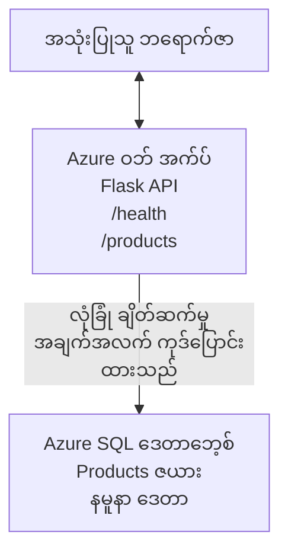

# Microsoft SQL Database နှင့် Web App တစ်ခုကို AZD ဖြင့် Deploy လုပ်ခြင်း

⏱️ **ခန့်မှန်းချိန်**: 20-30 မိနစ် | 💰 **ခန့်မှန်းကုန်ကျစရိတ်**: ~$15-25/month | ⭐ **ရှုပ်ထွေးမှု**: အလယ်အလတ်

ဤ **ပြည့်စုံပြီး အလုပ်လုပ်နိုင်သော ဥပမာ** တွင် [Azure Developer CLI (azd)](https://learn.microsoft.com/azure/developer/azure-developer-cli/) ကိုအသုံးပြုပြီး Python Flask web application တစ်ခုကို Microsoft SQL Database နှင့်အတူ Azure သို့ deploy လုပ်နည်းကို ဖော်ပြထားသည်။ ကုဒ်အားလုံး ထည့်သွင်းပြီး စမ်းသပ်ထားပြီး—ပြင်ပ အခြားပေါင်းသင်းသူများ မလိုအပ်ပါ။

## သင်ဘာတွေ သင်ယူမလဲ

ဤဥပမာကို ပြီးမြောက်စေခြင်းအားဖြင့် သင်သည်:
- infrastructure-as-code အဖြစ် multi-tier application (web app + database) တစ်ခု တပ်ဆင်ချင်း deploy လုပ်နည်း
- secrets များကို hardcode မလုပ်ဘဲ database ချိတ်ဆက်မှုများကို လုံခြုံစွာ ပြုလုပ်နည်း
- Application Insights ဖြင့် application ကျန်းမာရေးကို မော်နီတာလုပ်နည်း
- AZD CLI ဖြင့် Azure အရင်းအမြစ်များကို ထိရောက်စွာ စီမံခန့်ခွဲနည်း
- လုံခြုံရေး၊ ကုန်ကျစရိတ် တိုးတက်မှုနှင့် observability အတွက် Azure ၏ အကောင်းဆုံး လေ့လာနည်းများကို လိုက်နာနည်း

## အခြေအနေ အနှစ်ချုပ်
- **Web App**: Python Flask REST API နှင့် database ချိတ်ဆက်မှု
- **Database**: Azure SQL Database (နမူနာဒေတာပါပါသည်)
- **Infrastructure**: Bicep အသုံးပြု၍ provision (မော်ဂျူးလာ၊ pun reuse ပြုနိုင်သော templates)
- **Deployment**: `azd` command များဖြင့် အပြည့်အဝ အလိုအလျောက်
- **Monitoring**: logs နှင့် telemetry အတွက် Application Insights

## ချက်ခြောက်လိုအပ်ချက်များ

### လိုအပ်သော ကိရိယာများ

စတင်ရန်မပြုမီ အောက်ပါ ကိရိယာများ ထည့်သွင်းထားသည်ကို စစ်ဆေးပါ:

1. **[Azure CLI](https://learn.microsoft.com/cli/azure/install-azure-cli)** (version 2.50.0 သို့မဟုတ် အထက်)
   ```sh
   az --version
   # မျှော်လင့်ထားသော ထွက်ရှိမှု: azure-cli 2.50.0 သို့မဟုတ် အထက်
   ```

2. **[Azure Developer CLI (azd)](https://learn.microsoft.com/azure/developer/azure-developer-cli/install-azd)** (version 1.0.0 သို့မဟုတ် အထက်)
   ```sh
   azd version
   # မျှော်မှန်းထားသော အထွက်: azd ဗားရှင်း 1.0.0 သို့မဟုတ် ထက်မြင့်
   ```

3. **[Python 3.8+](https://www.python.org/downloads/)** (local development အတွက်)
   ```sh
   python --version
   # မျှော်မှန်းထားသော အထွက်: Python 3.8 သို့မဟုတ် အထက်
   ```

4. **[Docker](https://www.docker.com/get-started)** (optional၊ local containerized development အတွက်)
   ```sh
   docker --version
   # မျှော်မှန်းထားသော ထွက်ရလဒ်: Docker ဗားရှင်း 20.10 သို့မဟုတ် အထက်
   ```

### Azure လိုအပ်ချက်များ

- အသုံးပြုနိုင်သော **Azure subscription** ([create a free account](https://azure.microsoft.com/free/))
- သင့် subscription တွင် အရင်းအမြစ်များ ဖန်တီးခွင့်ရှိမှု
- Subscription သို့မဟုတ် resource group ပေါ်တွင် **Owner** သို့မဟုတ် **Contributor** role

### အသိပညာ အခြေခံ

ဤဥပမာမှာ **အလယ်အလတ်အဆင့်** ဖြစ်သည်။ သင်သည် အောက်ပါအချက်များကို နည်းနည်း ပြောရပါမည်။
- အခြေခံ command-line အခြေအနေများကို သိရှိမှု
- cloud အကြောင်း အခြေခံအကြောင်းအရာများ (resources, resource groups)
- web applications နှင့် databases အကြောင်း အခြေခံ နားလည်မှု

**AZD အသစ်လား?** အရင်ဆုံး [Getting Started guide](../../docs/chapter-01-foundation/azd-basics.md) ကို စတင်ဖတ်ပါ။

## Architecture

ဤဥပမာသည် web application နှင့် SQL database ပါသော two-tier architecture တစ်ခုကို deploy လုပ်သည်။



**Resource Deployment:**
- **Resource Group**: အရင်းအမြစ်များအားလုံး အတွက် container
- **App Service Plan**: Linux-based hosting (ကုန်ကျစရိတ် သိသာသော B1 tier)
- **Web App**: Python 3.11 runtime နှင့် Flask application
- **SQL Server**: TLS 1.2 အနည်းဆုံး ဖြင့် စီမံထားသော database server
- **SQL Database**: Basic tier (2GB၊ development/testing အတွက် သင့်တော်)
- **Application Insights**: မော်နီတာလုပ်ခြင်းနှင့် logging
- **Log Analytics Workspace**: logs များစုစည်းထားသည့် ဗဟိုတည်နေရာ

**တူတူ သဘောတရား**: ဒါကို စားသောက်ဆိုင် (web app) တစ်ခုနှင့် ထိပ်ခန်း ချိုင့်တင်းထားသော walk-in ရေခဲသေတ္တာ (database) တစ်ခုလို တွေးပါ။ ဖောက်သည်များသည် မီနူး (API endpoints) မှာ မှာစာပြုန်းပြီး မီးဖိုချောင် (Flask app) သည် ရေနံပစ္စည်းများ (ဒေတာ) ကို ရေခဲသေတ္တာထဲမှ ယူလာသည်။ စားသောက်ဆိုင် မန်နာချာ (Application Insights) သည် ဖြစ်ရပ်တစ်ခုချင်းစီကို မှတ်တမ်းတင်ကြည့်ရှုလေ့ရှိသည်။

## ဖိုလ်ဒါ ဖွဲ့စည်းပုံ

ဤဥပမာတွင် ဖိုင်အားလုံး ပါဝင်ပြီး—ပြင်ပ အခြားမလိုအပ်ပါ:

```
examples/database-app/
│
├── README.md                    # This file
├── azure.yaml                   # AZD configuration file
├── .env.sample                  # Sample environment variables
├── .gitignore                   # Git ignore patterns
│
├── infra/                       # Infrastructure as Code (Bicep)
│   ├── main.bicep              # Main orchestration template
│   ├── abbreviations.json      # Azure naming conventions
│   └── resources/              # Modular resource templates
│       ├── sql-server.bicep    # SQL Server configuration
│       ├── sql-database.bicep  # Database configuration
│       ├── app-service-plan.bicep  # Hosting plan
│       ├── app-insights.bicep  # Monitoring setup
│       └── web-app.bicep       # Web application
│
└── src/
    └── web/                    # Application source code
        ├── app.py              # Flask REST API
        ├── requirements.txt    # Python dependencies
        └── Dockerfile          # Container definition
```

**ဖိုင်တစ်ခုချင်းစီ၏ အလုပ်လုပ်ပုံ:**
- **azure.yaml**: AZD သည် ဘာကို deploy လုပ်မည်နှင့် သွားမည်ကို ပြောပြသည်
- **infra/main.bicep**: Azure resources အားလုံးကို ညွှန်ကြားပေးသည်
- **infra/resources/*.bicep**: တစ်ခုချင်း resource တွေရဲ့ သတ်မှတ်ချက်များ (reuse အတွက် မော်ဂျူးလာ)
- **src/web/app.py**: database logic ပါသော Flask application
- **requirements.txt**: Python package များလိုအပ်ချက်များ
- **Dockerfile**: deployment အတွက် containerization အညွှန်ပြချက်များ

## Quickstart (ခြေလှမ်းဆင့်)

### Step 1: Clone နှင့် သွားရောက်ရန်

```sh
git clone https://github.com/microsoft/AZD-for-beginners.git
cd AZD-for-beginners/examples/database-app
```

**✓ အောင်မြင်မှု စစ်ဆေးမှု**: `azure.yaml` နှင့် `infra/` ဖိုလ်ဒါကို မြင်ရမည်ကို စစ်ဆေးပါ:
```sh
ls
# မျှော်မှန်းထားသည်: README.md, azure.yaml, infra/, src/
```

### Step 2: Azure မှာ အတည်ပြု အကောင့်ဝင်မှုလုပ်ရန်

```sh
azd auth login
```

ဤကာလတွင် သင့် browser ကို ဖွင့်ပြီး Azure authentication ကို ပြုလုပ်ပါ။ သင့် Azure credential ဖြင့် sign in ဝင်ပါ။

**✓ အောင်မြင်မှု စစ်ဆေးမှု**: အောက်ပါအတိုင်း မြင်ရပါမည်:
```
Logged in to Azure.
```

### Step 3: Environment ကို initialize လုပ်ရန်

```sh
azd init
```

**ဘာတွေဖြစ်မည်**: AZD သည် သင့် deployment အတွက် local configuration တစ်ခု ဖန်တီးပါလိမ့်မည်။

**Prompt များ**:
- **Environment name**: အတိုချုံး အမည်တစ်ခုထည့်ပါ (ဥပမာ `dev`, `myapp`)
- **Azure subscription**: စာရင်းမှ သင့် subscription ကို ရွေးချယ်ပါ
- **Azure location**: တစ်ခု Region ရွေးချယ်ပါ (ဥပမာ `eastus`, `westeurope`)

**✓ အောင်မြင်မှု စစ်ဆေးမှု**: အောက်ပါအတိုင်း မြင်ရပါမည်:
```
SUCCESS: New project initialized!
```

### Step 4: Azure Resources များကို Provision လုပ်ရန်

```sh
azd provision
```

**ဘာတွေဖြစ်မည်**: AZD သည် အားလုံး Infrastructure ကို deploy လုပ်မည် (5-8 မိနစ် ကြာနိုင်သည်):
1. Resource group ဖန်တီးသည်
2. SQL Server နှင့် Database ဖန်တီးသည်
3. App Service Plan ဖန်တီးသည်
4. Web App ဖန်တီးသည်
5. Application Insights ဖန်တီးသည်
6. Networking နှင့် security ကို ပြင်ဆင်သည်

**သင်ထံမေးမည့်အရာများ**:
- **SQL admin username**: username တစ်ခု ထည့်ပါ (ဥပမာ `sqladmin`)
- **SQL admin password**: များပြား၍ ခိုင်မာသော password တစ်ခု ထည့်ပါ (ထိန်းသိမ်းထားပါ!)

**✓ အောင်မြင်မှု စစ်ဆေးမှု**: အောက်ပါအတိုင်း မြင်ရပါမည်:
```
SUCCESS: Your application was provisioned in Azure in X minutes Y seconds.
You can view the resources created under the resource group rg-<env-name> in Azure Portal:
https://portal.azure.com/#@/resource/subscriptions/.../resourceGroups/rg-<env-name>
```

**⏱️ အချိန်**: 5-8 မိနစ်

### Step 5: Application ကို Deploy လုပ်ရန်

```sh
azd deploy
```

**ဘာတွေဖြစ်မည်**: AZD သည် သင့် Flask application ကို build နှင့် deploy လုပ်မည်:
1. Python application ကို package လုပ်သည်
2. Docker container ကို build လုပ်သည်
3. Azure Web App သို့ push လုပ်သည်
4. Database ကို နမူနာဒေတာဖြင့် initialize လုပ်သည်
5. Application ကို စတင်သည်

**✓ အောင်မြင်မှု စစ်ဆေးမှု**: အောက်ပါအတိုင်း မြင်ရပါမည်:
```
SUCCESS: Your application was deployed to Azure in X minutes Y seconds.
You can view the resources created under the resource group rg-<env-name> in Azure Portal:
https://portal.azure.com/#@/resource/subscriptions/.../resourceGroups/rg-<env-name>
```

**⏱️ အချိန်**: 3-5 မိနစ်

### Step 6: Application ကို Browser ဖြင့် ကြည့်ရှုရန်

```sh
azd browse
```

ဤကာလတွင် သင့် deploy လုပ်ထားသော web app ကို browser ဖြင့် ဖွင့်ပါ — `https://app-<unique-id>.azurewebsites.net`

**✓ အောင်မြင်မှု စစ်ဆေးမှု**: JSON output ကို မြင်ရမည်:
```json
{
  "message": "Welcome to the Database App API",
  "endpoints": {
    "/": "This help message",
    "/health": "Health check endpoint",
    "/products": "List all products",
    "/products/<id>": "Get product by ID"
  }
}
```

### Step 7: API Endpoints များ စမ်းသပ်ရန်

**Health Check** (database ချိတ်ဆက်မှုကို စစ်ဆေးရန်):
```sh
curl https://app-<your-id>.azurewebsites.net/health
```

**မျှော်လင့်ထားသော တုံ့ပြန်ချက်**:
```json
{
  "status": "healthy",
  "database": "connected"
}
```

**List Products** (နမူနာဒေတာ):
```sh
curl https://app-<your-id>.azurewebsites.net/products
```

**မျှော်လင့်ထားသော တုံ့ပြန်ချက်**:
```json
[
  {
    "id": 1,
    "name": "Laptop",
    "description": "High-performance laptop",
    "price": 1299.99,
    "created_at": "2025-11-19T10:30:00"
  },
  ...
]
```

**Get Single Product**:
```sh
curl https://app-<your-id>.azurewebsites.net/products/1
```

**✓ အောင်မြင်မှု စစ်ဆေးမှု**: အားလုံးသော endpoints များသည် error မရှိဘဲ JSON data ပြန်ပေးရမည်။

---

**🎉 ဂုဏ်ယူပါတယ်!** AZD ကို အသုံးပြု၍ Azure သို့ web application တစ်ခုနှင့် database ကို ရှေ့ပြေး တပ်ဆင်နိုင်ခဲ့ပြီ။

## ဖွင့်ဖော်သည့် ဖွင့်ချိန် (Configuration) အကွာအဝေး

### Environment Variables

Secrets များကို Azure App Service configuration မှတဆင့် လုံခြုံစိတ်ချစွာ စီမံထားသည်—**source code ထဲတွင် ဆက်တိုက်ရေးမထားပါနှင့်**။

**AZD မှ အလိုအလျောက် ဖွင့်ထားသောအရာများ**:
- `SQL_CONNECTION_STRING`: encrypted credentials ပါသော Database connection
- `APPLICATIONINSIGHTS_CONNECTION_STRING`: Monitoring telemetry endpoint
- `SCM_DO_BUILD_DURING_DEPLOYMENT`: dependency installation အလိုအလျောက် အလုပ်လုပ်စေသည်

**Secrets များ ဘယ်မှာ သိမ်းထားသလဲ**:
1. `azd provision` ဖျော်ဖြေရင်းတွင် သင့်အား SQL credentials မေးမြန်းမည်
2. AZD သည် ထို credentials များကို local `.azure/<env-name>/.env` ဖိုင်ထဲသို့ သိမ်းဆည်းသည် (git-ignored)
3. AZD သည် ထို secrets များကို Azure App Service configuration ထဲသို့ inject လုပ်သည် (rest များတွင် encryption)
4. Application သည် runtime တွင် `os.getenv()` ဖြင့် ဖတ်ယူသည်

### Local Development

Local စမ်းသပ်ရန် `.env` ဖိုင်ကို နမူနာဖြင့် ပြုလုပ်ပါ:

```sh
cp .env.sample .env
# သင့်ဒေသခံဒေတာဘေ့စ်ချိတ်ဆက်ချက်ဖြင့် .env ကို တည်းဖြတ်ပါ
```

**Local Development Workflow**:
```sh
# လိုအပ်သော မော်ဂျူးများကို တပ်ဆင်ပါ
cd src/web
pip install -r requirements.txt

# ပတ်ဝန်းကျင် တန်ဖိုးများကို သတ်မှတ်ပါ
export SQL_CONNECTION_STRING="your-local-connection-string"

# အပလီကေးရှင်းကို လည်ပတ်ပါ
python app.py
```

** locally စမ်းသပ်ရန်**:
```sh
curl http://localhost:8000/health
# မျှော်လင့်ထားသည်: {"status": "ကျန်းမာ", "database": "ချိတ်ဆက်ထားသည်"}
```

### Infrastructure as Code

Azure အရင်းအမြစ်အားလုံးကို **Bicep templates** (`infra/` ဖိုလ်ဒါ) တွင် သတ်မှတ်ထားသည်။

- **မော်ဂျူးလာဒီဇိုင်း**: resource အမျိုးအစားတစ်ခုချင်းစီမှာ မိမိတိုင်ဖိုင် ရှိသည်၊ reuse အတွက်
- **parameterized**: SKUs, regions, naming conventions များကို customize လုပ်နိုင်သည်
- **အကောင်းဆုံး လေ့လာနည်းများ**: Azure naming standards နှင့် security defaults ကို လိုက်နာသည်
- **Version Controlled**: Infrastructure ပြောင်းလဲမှုများကို Git တွင် စီမံထားသည်

**ပြောင်းလဲရန် ဥပမာ**:
Database tier ကို ပြောင်းလိုပါက `infra/resources/sql-database.bicep` ကို ပြန်လည် တည်းဖြတ်ပါ:
```bicep
sku: {
  name: 'Standard'  // Changed from 'Basic'
  tier: 'Standard'
  capacity: 10
}
```

## လုံခြုံရေး အကောင်းဆုံးလက်ကြံ

ဤဥပမာသည် Azure ၏ လုံခြုံရေး အကောင်းဆုံး လေ့လာနည်းများကိုလိုက်နာသည်။

### 1. **Source Code တွင် Secrets မရှိစေရန်**
- ✅ Credentials များကို Azure App Service configuration တွင် သိမ်းဆည်းထားသည် (encrypted)
- ✅ `.env` ဖိုင်များကို `.gitignore` မှ ဖြုတ်ထားသည်
- ✅ Secrets များကို provisioning အတွင်း secure parameters ဖြင့် ပေးပို့သည်

### 2. **Encrypt ပြုလုပ်ထားသော ချိတ်ဆက်မှုများ**
- ✅ SQL Server အတွက် TLS 1.2 အနည်းဆုံး
- ✅ Web App အတွက် HTTPS-only ကို သတ်မှတ်ထားသည်
- ✅ Database ချိတ်ဆက်မှုများသည် encrypted channels အသုံးပြုသည်

### 3. **Network Security**
- ✅ SQL Server firewall ကို Azure services သာ ခွင့်ပြုထားသည်
- ✅ Public network access ကို အကန့်အသတ်ထားသည် (Private Endpoints ဖြင့် ပိုမို တင်းကြပ်နိုင်သည်)
- ✅ Web App တွင် FTPS ကို ပိတ်ထားသည်

### 4. **Authentication & Authorization**
- ⚠️ **လက်ရှိ**: SQL authentication (username/password)
- ✅ **ထုတ်လုပ်မှု အကြံပြုချက်**: password လုံးမလိုပဲ authentication အတွက် Azure Managed Identity ကို အသုံးပြုရန်

**Managed Identity သို့ အဆင့်မြှင့်ရန်** (ထုတ်လုပ်မှုအတွက်):
1. Web App တွင် managed identity ကို ဖွင့်ပါ
2. Identity ကို SQL permissions များ ပေးပါ
3. connection string ကို managed identity အသုံးပြုရန် update လုပ်ပါ
4. password-based authentication ကို ဖယ်ရှားပါ

### 5. **Auditing & Compliance**
- ✅ Application Insights သည် တောင်းဆိုချက်များနှင့် error များအားလုံးကို မှတ်တမ်းတင်သည်
- ✅ SQL Database auditing ကို ဖွင့်ထားသည် (compliance အတွက် ဖော်ပြနိုင်သည်)
- ✅ အရင်းအမြစ်အားလုံးကို governance အတွက် tag တွေ ထည့်သွင်းထားသည်

**ထုတ်လုပ်မှုမတိုင်မီ လုံခြုံရေး လုပ်ဆောင်ရန် စစ်ဆေးစာရင်း**:
- [ ] Azure Defender for SQL ကို ဖွင့်ပါ
- [ ] SQL Database အတွက် Private Endpoints များ configure လုပ်ပါ
- [ ] Web Application Firewall (WAF) ကို ဖွင့်ပါ
- [ ] Azure Key Vault ဖြင့် secret rotation ကို အကောင်အထည်ဖော်ပါ
- [ ] Microsoft Entra ID authentication ကို configure လုပ်ပါ
- [ ] အရင်းအမြစ်အားလုံးအတွက် diagnostic logging ကို ဖွင့်ပါ

## ကုန်ကျစရိတ် အတွေ့အကြုံ တိုးသက်စေမှု

**ခန့်မှန်း လစဉ်ကုန်ကျစရိတ်** (November 2025 အခြေအနေဖြင့်):

| Resource | SKU/Tier | Estimated Cost |
|----------|----------|----------------|
| App Service Plan | B1 (Basic) | ~$13/month |
| SQL Database | Basic (2GB) | ~$5/month |
| Application Insights | Pay-as-you-go | ~$2/month (low traffic) |
| **Total** | | **~$20/month** |

**💡 ကုန်ကျစရိတ် မွမ်းမံနည်းများ**:

1. **လေ့လာမှုအတွက် Free Tier ကို အသုံးပြုပါ**:
   - App Service: F1 tier (free, အချိန်အကန့်အသတ်ရှိ)
   - SQL Database: Azure SQL Database serverless ကို အသုံးပြုပါ
   - Application Insights: 5GB/month အခမဲ့ ingestion

2. **မလိုအပ်စဉ်တွင် Resources များကို ရပ်တန့်ထားပါ**:
   ```sh
   # ဝက်ဘ်အက်ပ်ကို ပိတ်ပါ (ဒေတာဘေ့စ်က ဆက်လက်ကြေးယူမည်)
   az webapp stop --name <app-name> --resource-group <rg-name>
   
   # လိုအပ်သည့်အချိန်တွင် ပြန်စပါ
   az webapp start --name <app-name> --resource-group <rg-name>
   ```

3. **စမ်းသပ်ပြီး နောက် အားလုံး ဖျက်ပစ်ပါ**:
   ```sh
   azd down
   ```
   ဤကိစ္စသည် အားလုံးသော resources များကို ဖျက်ပစ်ပြီး ချွန်ချာမှုကို ရပ်တန့်မည်။

4. **Development vs. Production SKUs**:
   - **Development**: Basic tier (ဤဥပမာတွင် အသုံးပြုထားသည်)
   - **Production**: redundancy ပါရှိသော Standard/Premium tier

**ကုန်ကျစရိတ် မော်နီတာလုပ်ခြင်း**:
- [Azure Cost Management](https://portal.azure.com/#view/Microsoft_Azure_CostManagement) တွင် ကုန်ကျစရိတ်ကြည့်ရှုပါ
- အလပ်အရှုံး မဖြစ်အောင် cost alerts များ သတ်မှတ်ပါ
- ကုန်ကျစရိတ် လိုက်နာရန် အရင်းအမြစ်အားလုံးကို `azd-env-name` ဖြင့် tag ထားပါ

**Free Tier အစားထိုး ရွေးခွင့်**:
လေ့လာမှုပန်းတိုင်အတွက် `infra/resources/app-service-plan.bicep` ကို ပြင်ဆင်နိုင်သည်:
```bicep
sku: {
  name: 'F1'  // Free tier
  tier: 'Free'
}
```
**Note**: Free tier သည် ကန့်သတ်ချက်များရှိသည် (60 min/day CPU၊ always-on မရှိပါ)。

## မော်နီတာလုပ်ခြင်း နှင့် တွေ့ကြုံရသော အရာများ

### Application Insights ပေါင်းစည်းမှု

ဤဥပမာတွင် **Application Insights** ကို မော်နီတာလုပ်ရန် ထည့်သွင်းထားသည်။

**မော်နီတာခံရသည့်အရာများ**:
- ✅ HTTP requests (latency, status codes, endpoints)
- ✅ Application errors နှင့် exceptions
- ✅ Flask app မှ custom logging များ
- ✅ Database ချိတ်ဆက်မှု ကျန်းမာရေး
- ✅ performance metrics (CPU, memory)

**Application Insights ကို ဝင်ရောက်ကြည့်ရှုရန်**:
1. [Azure Portal](https://portal.azure.com) ကို ဖွင့်ပါ
2. သင့် resource group (`rg-<env-name>`) သို့ သွားပါ
3. Application Insights resource (`appi-<unique-id>`) ကို နှိပ်ပါ

**အသုံးဝင်သော Queries** (Application Insights → Logs):

**အားလုံးသော Requests ကြည့်ရန်**:
```kusto
requests
| where timestamp > ago(1h)
| order by timestamp desc
| project timestamp, name, url, resultCode, duration
```

**Error များ ရှာဖွေရန်**:
```kusto
exceptions
| where timestamp > ago(24h)
| order by timestamp desc
| project timestamp, type, outerMessage, operation_Name
```

**Health Endpoint စစ်ဆေးရန်**:
```kusto
requests
| where name contains "health"
| summarize count() by resultCode, bin(timestamp, 1h)
```

### SQL Database Auditing

**SQL Database auditing ကို ဖွင့်ထားပြီး** အောက်ပါအရာများကို ကိုင်တွယ်မှတ်တမ်းတင်ပါသည်:
- Database access patterns
- မအောင်မြင်သော login ကြိုးစားမှုများ
- Schema ပြောင်းလဲမှုများ
- Data access (compliance အတွက်)

**Audit Logs များကို ဝင်ကြည့်ရန်**:
1. Azure Portal → SQL Database → Auditing
2. Log Analytics workspace တွင် logs များကို ကြည့်ပါ

### တိုက်ရိုက် မော်နီတာလုပ်ခြင်း (Real-Time)

**Live Metrics ကြည့်ရန်**:
1. Application Insights → Live Metrics
2. တိုက်ရိုက် request များ၊ failure များနှင့် performance များကို ကြည့်ရှုနိုင်သည်

**Alerts များ သတ်မှတ်ရန်**:
critical ဖြစ်နိုင်သည့်เหตุการณ์များအတွက် alerts ဖန်တီးပါ:
- HTTP 500 errors > 5 ဦး 5 မိနစ်အတွင်း
- Database ချိတ်ဆက်မှု မအောင်မြင်ခြင်း
- အမြင့် တုံ့ပြန်ချိန် (>2 seconds)

**Alert ဖန်တီးရန် ဥပမာ**:
```sh
az monitor metrics alert create \
  --name "High-Response-Time" \
  --resource-group <rg-name> \
  --scopes <app-insights-resource-id> \
  --condition "avg requests/duration > 2000" \
  --description "Alert when response time exceeds 2 seconds"
```

## Troubleshooting
### ပုံမှန်ပြဿနာများ နှင့် ဖြေရှင်းနည်းများ

#### 1. `azd provision` fails with "တည်နေရာ မရနိုင်ပါ"

**လက္ခဏာ**:
```
Error: The subscription is not registered for the resource type 'components' in the location 'centralus'.
```

**ဖြေရှင်းနည်း**:
အခြား Azure တိုင်းဒေသရွေးပါ သို့မဟုတ် resource provider ကို မှတ်ပုံတင်ပါ။
```sh
az provider register --namespace Microsoft.Insights
```

#### 2. SQL Connection Fails During Deployment

**လက္ခဏာ**:
```
pyodbc.OperationalError: ('08001', '[08001] [Microsoft][ODBC Driver 18 for SQL Server]TCP Provider...')
```

**ဖြေရှင်းနည်း**:
- SQL Server firewall သည် Azure services များကို ခွင့်ပြုထားကြောင်း သေချာစစ်ဆေးပါ (အလိုအလျောက် ဖွင့်ထားသည်)
- `azd provision` ပြုလုပ်စဉ် SQL admin password ကို မှန်ကန်စွာ ထည့်ထားကြောင်း စစ်ဆေးပါ
- SQL Server အပြည့်အဝ provision လုပ်ပြီးသား ဖြစ်ကြောင်း သေချာစောင့်ကြည့်ပါ (၂-၃ မိနစ်ယူနိုင်သည်)

**ချိတ်ဆက်မှု စစ်ဆေးရန်**:
```sh
# Azure Portal မှ SQL Database → Query editor သို့ သွားပါ
# သင့် အကောင့် အချက်အလက်ဖြင့် ချိတ်ဆက်ကြည့်ပါ
```

#### 3. Web App တွင် "Application Error" ပြသခြင်း

**လက္ခဏာ**:
Browser သည် ယေဘုယျ error စာမျက်နှာကို ပြသည်။

**ဖြေရှင်းနည်း**:
လျှောက်လွှာ မှတ်တမ်းများကို စစ်ဆေးပါ။
```sh
# လတ်တလော မှတ်တမ်းများကို ကြည့်ရန်
az webapp log tail --name <app-name> --resource-group <rg-name>
```

**ပုံမှန် အကြောင်းရင်းများ**:
- Environment variables မကျန်ရှိခြင်း (App Service → Configuration ကို စစ်ဆေးပါ)
- Python package ထည့်သွင်းမှု မအောင်မြင်ခြင်း (deployment logs ကို စစ်ပါ)
- ဒေတာဘေ့စ် စတင်ပေါင်းထည့်မှု အမှား (SQL ချိတ်ဆက်မှုကို စစ်ပါ)

#### 4. `azd deploy` Fails with "Build Error"

**လက္ခဏာ**:
```
Error: Failed to build project
```

**ဖြေရှင်းနည်း**:
- `requirements.txt` တွင် syntax အမှား မရှိကြောင်း သေချာစစ်ပါ
- `infra/resources/web-app.bicep` တွင် Python 3.11 သတ်မှတ်ထားကြောင်း စစ်ပါ
- Dockerfile တွင် base image မှန်ကန်ကြောင်း အတည်ပြုပါ

**ဒေသခံတွင် Debug လုပ်ခြင်း**:
```sh
cd src/web
docker build -t test-app .
docker run -p 8000:8000 test-app
```

#### 5. "Unauthorized" When Running AZD Commands

**လက္ခဏာ**:
```
ERROR: (Unauthorized) The client '<id>' with object id '<id>' does not have authorization
```

**ဖြေရှင်းနည်း**:
Azure တွင် ပြန်လည် authentication ပြုလုပ်ပါ။
```sh
# AZD လုပ်ငန်းစဉ်များအတွက် လိုအပ်သည်
azd auth login

# သင် Azure CLI အမိန့်များကို တိုက်ရိုက်လည်း အသုံးပြုနေပါက ရွေးချယ်နိုင်သည်
az login
```

Subscription ပေါ်တွင် မှန်ကန်သော ခွင့်ပြုချက်များ (Contributor role) ရှိကြောင်း အတည်ပြုပါ။

#### 6. ဒေတာဘေ့စ် သုံးစွဲမှု ကုန်ကျစရိတ် မြင့်မားခြင်း

**လက္ခဏာ**:
မမျှော်လင့်ထားသော Azure ငွေတောင်းခံလွှာ။

**ဖြေရှင်းနည်း**:
- စမ်းသပ်ပြီးနောက် `azd down` ကို မလုပ်ခဲ့တာ မရှိကြောင်း စစ်ဆေးပါ
- SQL Database သည် Basic tier ကို အသုံးပြုထားကြောင်း (Premium မဟုတ်) အတည်ပြုပါ
- Azure Cost Management တွင် ကုန်ကျစရိတ်များကို ပြန်လည်သုံးသပ်ပါ
- ကုန်ကျစရိတ် သတိပေးချက်များကို သတ်မှတ်ပါ

### အကူအညီ ရယူရန်

**AZD Environment Variables အားလုံး ကြည့်ရန်**:
```sh
azd env get-values
```

**Deployment အခြေအနေ စစ်ဆေးရန်**:
```sh
az webapp show --name <app-name> --resource-group <rg-name> --query state
```

**Application logs သို့ ဝင်ရောက်ကြည့်ရန်**:
```sh
az webapp log download --name <app-name> --resource-group <rg-name> --log-file app-logs.zip
```

**ပိုမိုအကူအညီ လိုပါသလား?**
- [AZD ပြဿနာဖြေရှင်းလမ်းညွှန်](../../docs/chapter-07-troubleshooting/common-issues.md)
- [Azure App Service ပြဿနာဖြေရှင်းခြင်း](https://learn.microsoft.com/azure/app-service/troubleshoot-diagnostic-logs)
- [Azure SQL ပြဿနာဖြေရှင်းခြင်း](https://learn.microsoft.com/azure/azure-sql/database/troubleshoot-common-errors-issues)

## လက်တွေ့ လေ့ကျင့်ခန်းများ

### လေ့ကျင့်ခန်း 1: သင့် Deployment ကို စစ်ဆေးပါ (အခြေခံ)

**ရည်မှန်းချက်**: အရင်းအမြစ်များအားလုံး တပ်ဆင်ပြီး လျှောက်လွှာ အလုပ်လုပ်နေသည်ကို အတည်ပြုပါ။

**ခြေလှမ်းများ**:
1. သင့် resource group အတွင်းရှိ အရင်းအမြစ်များအားလုံး စာရင်းပြပါ:
   ```sh
   az resource list --resource-group rg-<env-name> --output table
   ```
   **မျှော်မှန်းချက်**: 6-7 resources (Web App, SQL Server, SQL Database, App Service Plan, Application Insights, Log Analytics)

2. API endpoints အားလုံးကို စမ်းသပ်ပါ:
   ```sh
   curl https://app-<your-id>.azurewebsites.net/
   curl https://app-<your-id>.azurewebsites.net/health
   curl https://app-<your-id>.azurewebsites.net/products
   curl https://app-<your-id>.azurewebsites.net/products/1
   ```
   **မျှော်မှန်းချက်**: အားလုံးမှ အမှားမရှိသော JSON ပြန်လာရမည်

3. Application Insights ကို စစ်ဆေးပါ:
   - Azure Portal တွင် Application Insights သို့ သွားပါ
   - "Live Metrics" သို့ သွားပါ
   - web app တွင် browser ကို ပြန်လည် Refresh လုပ်ပါ
   **မျှော်မှန်းချက်**: တောင်းဆိုမှုများကို တိုက်ရိုက် အချိန်တွင် တွေ့နိုင်ရမည်

**အောင်မြင်မှု စံသတ်မှတ်ချက်**: အရင်းအမြစ် 6-7 ခုရှိရမည်၊ endpoint အားလုံး ဒေတာ ပြန်လာရမည်၊ Live Metrics တွင် လှုပ်ရှားမှု မြင်ရရမည်။

---

### လေ့ကျင့်ခန်း 2: API Endpoint အသစ် ထည့်သွင်းခြင်း (အလယ်အလတ်)

**ရည်မှန်းချက်**: Flask application ကို endpoint အသစ် ဖြင့် တိုးချဲ့ပါ။

**စတားတာ ကုဒ်**: လက်ရှိ endpoints များသည် `src/web/app.py` တွင်ရှိသည်

**ခြေလှမ်းများ**:
1. `src/web/app.py` ကို တည်းဖြတ်ပြီး `get_product()` function အပြီးတွင် endpoint အသစ် တစ်ခု ထည့်ပါ:
   ```python
   @app.route('/products/search/<keyword>')
   def search_products(keyword):
       """Search products by name or description."""
       try:
           conn = get_db_connection()
           cursor = conn.cursor()
           cursor.execute(
               "SELECT id, name, description, price, created_at FROM products WHERE name LIKE ? OR description LIKE ?",
               (f'%{keyword}%', f'%{keyword}%')
           )
           
           products = []
           for row in cursor.fetchall():
               products.append({
                   'id': row[0],
                   'name': row[1],
                   'description': row[2],
                   'price': float(row[3]) if row[3] else None,
                   'created_at': row[4].isoformat() if row[4] else None
               })
           
           cursor.close()
           conn.close()
           
           logger.info(f"Search for '{keyword}' returned {len(products)} results")
           return jsonify(products), 200
           
       except Exception as e:
           logger.error(f"Error searching products: {str(e)}")
           return jsonify({'error': str(e)}), 500
   ```

2. ပြင်ဆင်ထားသော application ကို deploy လုပ်ပါ:
   ```sh
   azd deploy
   ```

3. endpoint အသစ်ကို စမ်းသပ်ပါ:
   ```sh
   curl https://app-<your-id>.azurewebsites.net/products/search/laptop
   ```
   **မျှော်မှန်းချက်**: "laptop" နှင့် ကိုက်ညီသော ထုတ်ကုန်များ ပြန်လာရမည်

**အောင်မြင်မှု စံသတ်မှတ်ချက်**: endpoint အသစ် အလုပ်လုပ်ရမည်၊ စစ်ထုတ်ထားသော ရလဒ်များ ပြန်သွားရမည်၊ Application Insights logs တွင် တွေ့ရမည်။

---

### လေ့ကျင့်ခန်း 3: မော်နီတာနှင့် သတိပေးချက်များ ထည့်ခြင်း (အဆင့်မြင့်)

**ရည်မှန်းချက်**: သတိပေးချက်များနှင့် ကြိုတင်မော်နီတာ ထည့်ဆောင်ပါ။

**ခြေလှမ်းများ**:
1. HTTP 500 အမှားများအတွက် သတိပေးချက် တစ်ခု ဖန်တီးပါ:
   ```sh
   # Application Insights အရင်းအမြစ် ID ကို ရယူပါ
   AI_ID=$(az monitor app-insights component show \
     --app appi-<your-id> \
     --resource-group rg-<env-name> \
     --query id -o tsv)
   
   # သတိပေးချက် ဖန်တီးပါ
   az monitor metrics alert create \
     --name "High-Error-Rate" \
     --resource-group rg-<env-name> \
     --scopes $AI_ID \
     --condition "count requests/failed > 5" \
     --window-size 5m \
     --evaluation-frequency 1m \
     --description "Alert when >5 failed requests in 5 minutes"
   ```

2. အမှားများ ဖြစ်စေ၍ သတိပေးချက်ကို ဖော်ထုတ်ပါ:
   ```sh
   # မရှိသော ထုတ်ကုန်တစ်ခုကို တောင်းဆိုပါ
   for i in {1..10}; do curl https://app-<your-id>.azurewebsites.net/products/999; done
   ```

3. သတိပေးချက် ဖောက်ပြန်ခဲ့ပါသလား စစ်ဆေးပါ:
   - Azure Portal → Alerts → Alert Rules ကို ကြည့်ပါ
   - သင့် အီးမေးလ်ကို စစ်ဆေးပါ (သတ်မှတ်ထားပါက)

**အောင်မြင်မှု စံသတ်မှတ်ချက်**: သတိပေးချက် စည်းမျဉ်းတစ်ခု ဖန်တီးပြီး အမှားတွင် ဖေါ်ထုတ်ကာ သတိပေးချက်များ လက်ခံရရှိရမည်။

---

### လေ့ကျင့်ခန်း 4: ဒေတာဘေ့စ် Schema ပြောင်းလဲခြင်း (အဆင့်မြင့်)

**ရည်မှန်းချက်**: ဇယားအသစ်တစ်ခု ထည့်သွင်းပြီး အပလီကေးရှင်းကို အသုံးပြုရန် ပြင်ဆင်ပါ။

**ခြေလှမ်းများ**:
1. Azure Portal Query Editor မှတဆင့် SQL Database သို့ ချိတ်ဆက်ပါ

2. `categories` ဆိုသော ဇယား အသစ် တစ်ခု ဖန်တီးပါ:
   ```sql
   CREATE TABLE categories (
       id INT PRIMARY KEY IDENTITY(1,1),
       name NVARCHAR(50) NOT NULL,
       description NVARCHAR(200)
   );
   
   INSERT INTO categories (name, description) VALUES
   ('Electronics', 'Electronic devices and accessories'),
   ('Office Supplies', 'Office equipment and supplies');
   
   -- Add category to products table
   ALTER TABLE products ADD category_id INT;
   UPDATE products SET category_id = 1; -- Set all to Electronics
   ```

3. `src/web/app.py` ကို response များတွင် category သတင်းအချက်အလက် ထည့်သွင်းရန် ပြင်ဆင်ပါ

4. Deploy ပြီး စမ်းသပ်ပါ

**အောင်မြင်မှု စံသတ်မှတ်ချက်**: ဇယား အသစ် ရှိပြီး ထုတ်ကုန်များတွင် category အချက်အလက် ပြပါမည်၊ အပလီကေးရှင်း သာလွန်စွာ အလုပ်လုပ်နေပါသည်။

---

### လေ့ကျင့်ခန်း 5: Caching ကို အကောင်အထည် ဖော်ခြင်း (ကျွမ်းကျင်)

**ရည်မှန်းချက်**: စွမ်းဆောင်ရည်တိုးရန် Azure Redis Cache ကို ထည့်ပါ။

**ခြေလှမ်းများ**:
1. `infra/main.bicep` တွင် Redis Cache ကို ထည့်ပါ
2. `src/web/app.py` ကို ထုတ်ကုန် မေးခွန်းများကို cache ထည့်ရန် ပြင်ဆင်ပါ
3. Application Insights ဖြင့် စွမ်းဆောင်ရည် တိုးတက်မှုကို တိုင်းတာပါ
4. Caching မပြုမီ/ပြီးနောက် တုံ့ပြန်ချိန်များကို နှိုင်းယှဉ်ပါ

**အောင်မြင်မှု စံသတ်မှတ်ချက်**: Redis တပ်ဆင်ပြီး caching အလုပ်လုပ်ပါစေ၊ တုံ့ပြန်ချိန်များ 50% ထက်ပို ကောင်းလာရမည်။

**အကြံပြုချက်**: စတင်ရန် [Azure Cache for Redis documentation](https://learn.microsoft.com/azure/azure-cache-for-redis/) ကို ကြည့်ပါ။

---

## ရှင်းလင်းရေး

ဆက်လက်ပေးချေရေးမှ ကာကွယ်ရန် အလုပ်ပြီးသည်နှင့် အရင်းအမြစ်များအားလုံး ဖျက်ပစ်ပါ။

```sh
azd down
```

**အတည်ပြု မေးခွန်း**:
```
? Total resources to delete: 7, are you sure you want to continue? (y/N)
```

အတည်ပြုရန် `y` ကို ရိုက်ပါ။

**✓ အောင်မြင်မှု စစ်ဆေးချက်**: 
- Azure Portal မှ အရင်းအမြစ်များအားလုံး ဖျက်ပြီးနေပါသည်
- ဆက်လက် စရိတ်မရှိပါ
- ဒေသဆိုင်ရာ `.azure/<env-name>` ဖိုလ်ဒါကို ဖျက်ထားနိုင်သည်

**အခြားရွေးချယ်စရာ** (အင်ဖရာစွမ်းအင်ကို ထိန်းထားပြီး ဒေတာကို ဖျက်ရန်):
```sh
# resource group ကိုသာ ဖျက်ပါ (AZD ဆက်တင်ကို ထားပါ)
az group delete --name rg-<env-name> --yes
```
## အဆက်မြှင့်လေ့လာရန်

### ဆက်စပ်စာရွက်စာတမ်းများ
- [Azure Developer CLI စာတမ်း](https://learn.microsoft.com/azure/developer/azure-developer-cli/)
- [Azure SQL Database စာတမ်း](https://learn.microsoft.com/azure/azure-sql/database/)
- [Azure App Service စာတမ်း](https://learn.microsoft.com/azure/app-service/)
- [Application Insights စာတမ်း](https://learn.microsoft.com/azure/azure-monitor/app/app-insights-overview)
- [Bicep ဘာသာစကား ရည်ညွှန်းချက်](https://learn.microsoft.com/azure/azure-resource-manager/bicep/)

### ဒီသင်တန်းအတွက် နောက်တစ်ဆင့်များ
- **[Container Apps နမူနာ](../../../../examples/container-app)**: Azure Container Apps ဖြင့် microservices များ တပ်ဆင်ခြင်း
- **[AI ပေါင်းစည်းခြင်း လမ်းညွှန်](../../../../docs/ai-foundry)**: သင့် app သို့ AI အင်္ဂါရပ်များ ထည့်သွင်းပါ
- **[Deployment အကောင်းဆုံး အလေ့အကျင့်များ](../../docs/chapter-04-infrastructure/deployment-guide.md)**: ထုတ်လုပ်မှု deployment ပုံစံများ

### အဆင့်မြင့် ခေါင်းစဉ်များ
- **Managed Identity**: စကားဝှက်များကို ဖယ်ရှား၍ Microsoft Entra ID authentication ကို အသုံးပြုပါ
- **Private Endpoints**: virtual network အတွင်း ဒေတာဘေ့စ် ချိတ်ဆက်မှုများကို လုံခြုံစေပါ
- **CI/CD Integration**: GitHub Actions သို့မဟုတ် Azure DevOps နှင့် deployment များကို အလိုအလျောက်လုပ်ပါ
- **Multi-Environment**: dev, staging, production ပတ်ဝန်းကျင်များ စီမံပါ
- **Database Migrations**: Schema အတန်းအစားပြောင်းလဲရေးအတွက် Alembic သို့မဟုတ် Entity Framework ကို အသုံးပြုပါ

### အခြား နည်းလမ်းများနှင့် နှိုင်းယှဉ်ချက်

**AZD နှင့် ARM Templates နှိုင်းယှဉ်**:
- ✅ AZD: အဆင့်မြင့် abstraction, ကိရိယာအမိန့်များ ပိုလွယ်ကူသည်
- ⚠️ ARM: စာပိုင်းများပိုများပြီး အသေးစိတ် ထိန်းချုပ်နိုင်မှု ရှိသည်

**AZD နှင့် Terraform နှိုင်းယှဉ်**:
- ✅ AZD: Azure-မူလ, Azure services နှင့် ပေါင်းစည်းထားသည်
- ⚠️ Terraform: Multi-cloud ကို ထောက်ပံ့ပြီး ပိုကြီးမားသော ecosystem ရှိသည်

**AZD နှင့် Azure Portal နှိုင်းယှဉ်**:
- ✅ AZD: ထပ်တူပြန်လုပ်နိုင်ပြီး version-control ထောက်ပံ့, အလိုအလျောက်လုပ်နိုင်သည်
- ⚠️ Portal: လက်ဖြင့် နှိပ်ရမည်၊ ထပ်လုပ်ရန် ခက်ခဲသည်

**AZD ကို အောက်ပါအတိုင်း တွေးပါ**: Azure အတွက် Docker Compose—ရှုပ်ထွေးသော deployment များအတွက် ပိုမိုလွယ်ကူသော configuration။

---

## မကြာခဏ မေးလေ့ရှိသောမေးခွန်းများ

**Q: မဲြတခြား programming language အသုံးပြုနိုင်ပါသလား?**  
A: ဟုတ်ပါတယ်! `src/web/` ကို Node.js, C#, Go, သို့မဟုတ် မည်သည့်ဘာသာစုံကိုမဆို အစားထိုးနိုင်သည်။ `azure.yaml` နှင့် Bicep ကို အလိုက်သင့် ပြင်ဆင်ပါ။

**Q: ပိုမိုသော databases များ ထည့်လိုပါက ဘယ်လိုလုပ်ရမည်နည်း?**  
A: `infra/main.bicep` တွင် SQL Database module တစ်ခု ထပ်ထည့်ပါ၊ ဒါမှမဟုတ် Azure Database services မှ PostgreSQL/MySQL ကို အသုံးပြုနိုင်သည်။

**Q: ဤကို ထုတ်လုပ်ရေးတွင် အသုံးပြုနိုင်လား?**  
A: ဤသည် စတင်ရန် နေရာတစ်ခုသာ ဖြစ်သည်။ ထုတ်လုပ်မှုအတွက် managed identity, private endpoints, redundancy, backup strategy, WAF, နှင့် တိုးတက်သည့် မော်နီတာများ ထည့်ပါ။

**Q: ကုဒ် တင်ခြင်းမဟုတ်ဘဲ ကွန်တိနာများ အသုံးပြုလိုပါက ဘာလုပ်မည်နည်း?**  
A: **[Container Apps နမူနာ](../../../../examples/container-app)** ကို ကြည့်ပါ၊ ၎င်းတွင် Docker containers ကို အဝန်းအရ အသုံးပြုထားသည်။

**Q: မိမိ၏ local machine မှ ဒေတာဘေ့စ်သို့ ချိတ်ဆက်လိုပါက မည်သို့လုပ်မည်နည်း?**  
A: သင့် IP ကို SQL Server firewall တွင် ထည့်ပါ:
```sh
az sql server firewall-rule create \
  --resource-group rg-<env-name> \
  --server sql-<unique-id> \
  --name AllowMyIP \
  --start-ip-address <your-ip> \
  --end-ip-address <your-ip>
```

**Q: ဇယားအသစ် ဖန်တီးခြင်းမပြုဘဲ ရှိပြီးသား database ကို အသုံးပြုနိုင်သလား?**  
A: ဟုတ်ပါတယ်၊ `infra/main.bicep` ကို ပြင်၍ ရှိပြီးသား SQL Server ကို ကိုးကားစေပြီး connection string parameters များကို အပ်ဒိတ်လုပ်ပါ။

---

> **မှတ်ချက်:** ဤနမူနာသည် AZD ကို အသုံးပြု၍ database နှင့်အတူ web app တပ်ဆင်မှုများလုပ်ရာတွင် အကောင်းဆုံး လေ့လာနည်းများကို ပြသသည်။ အလုပ်လုပ်နိုင်သော ကုဒ်၊ တိကျပြည့်စုံသော စာတမ်းများနှင့် လက်တွေ့ လေ့ကျင့်ခန်းများ ပါဝင်သည်။ ထုတ်လုပ်မှု deployment များအတွက် သင့်အဖွဲ့အစည်း အလိုက် လုံခြုံရေး၊ တိုးချဲ့မှု၊ ကန့်သတ်ချက်လိုက်နာမှု နှင့် ကုန်ကျစရိတ်လိုအပ်ချက်များကို ပြန်လည် သုံးသပ်ပါ။

**📚 သင်တန်း ခရီးညွှန်:**
- ← ယခင်: [Container Apps နမူနာ](../../../../examples/container-app)
- → နောက်တစ်ခု: [AI ပေါင်းစည်းခြင်း လမ်းညွှန်](../../../../docs/ai-foundry)
- 🏠 [သင်တန်း မူလစာမျက်နှာ](../../README.md)

---

<!-- CO-OP TRANSLATOR DISCLAIMER START -->
**ပြောကြားချက်**
ဤစာတမ်းကို AI ဘာသာပြန်ဝန်ဆောင်မှု [Co-op Translator](https://github.com/Azure/co-op-translator) အသုံးပြု၍ ဘာသာပြန်ထားပါသည်။ ကျွန်ုပ်တို့သည် တိကျမှန်ကန်မှုအတွက် ကြိုးပမ်းနေသော်လည်း၊ စက်ကိရိယာဘာသာပြန်ခြင်းများတွင် အမှားများ သို့မဟုတ် မှားယွင်းချက်များ ပါဝင်နိုင်ကြောင်း သတိပြုပါရန် လိုအပ်ပါသည်။ မူလစာတမ်းကို မူရင်းဘာသာဖြင့်သာ ယုံကြည်စိတ်ချရသော အချက်အလက်အဖြစ် သတ်မှတ်သင့်သည်။ အရေးကြီးသည့် သတင်းအချက်အလက်များအတွက် ပရော်ဖက်ရှင်နယ် လူသားဘာသာပြန်သူဝန်ဆောင်မှုကို အကြံပြုပါသည်။ ဤဘာသာပြန်ချက်ကို အသုံးပြုခြင်းမှ ဖြစ်ပေါ်လာသော နားလည်မှုကွာခြားမှုများ သို့မဟုတ် မမှန်ကန်သော အသုံးပြုမှုများအတွက် ကျွန်ုပ်တို့ တာဝန်မခံပါ။
<!-- CO-OP TRANSLATOR DISCLAIMER END -->