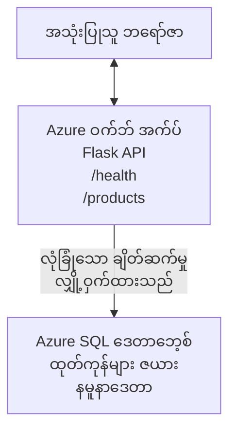

# Deploying a Microsoft SQL Database and Web App with AZD

⏱️ **Estimated Time**: 20-30 minutes | 💰 **Estimated Cost**: ~$15-25/month | ⭐ **Complexity**: Intermediate

This **complete, working example** demonstrates how to use the [Azure Developer CLI (azd)](https://learn.microsoft.com/azure/developer/azure-developer-cli/) to deploy a Python Flask web application with a Microsoft SQL Database to Azure. All code is included and tested—no external dependencies required.

## What You'll Learn

By completing this example, you will:
- Deploy a multi-tier application (web app + database) using infrastructure-as-code
- Configure secure database connections without hardcoding secrets
- Monitor application health with Application Insights
- Manage Azure resources efficiently with AZD CLI
- Follow Azure best practices for security, cost optimization, and observability

## Scenario Overview
- **Web App**: Python Flask REST API with database connectivity
- **Database**: Azure SQL Database with sample data
- **Infrastructure**: Provisioned using Bicep (modular, reusable templates)
- **Deployment**: Fully automated with `azd` commands
- **Monitoring**: Application Insights for logs and telemetry

## Prerequisites

### Required Tools

Before starting, verify you have these tools installed:

1. **[Azure CLI](https://learn.microsoft.com/cli/azure/install-azure-cli)** (version 2.50.0 or higher)
   ```sh
   az --version
   # မျှော်မှန်းရလဒ်: azure-cli 2.50.0 သို့မဟုတ် ထိုထက်မြင့် ဗားရှင်း
   ```

2. **[Azure Developer CLI (azd)](https://learn.microsoft.com/azure/developer/azure-developer-cli/install-azd)** (version 1.0.0 or higher)
   ```sh
   azd version
   # မျှော်လင့်ထားသော အထွက်: azd ဗားရှင်း 1.0.0 သို့မဟုတ် အထက်
   ```

3. **[Python 3.8+](https://www.python.org/downloads/)** (for local development)
   ```sh
   python --version
   # မျှော်မှန်းထားသော အထွက်: Python 3.8 သို့မဟုတ် ထက်ပိုမြင့်သော
   ```

4. **[Docker](https://www.docker.com/get-started)** (optional, for local containerized development)
   ```sh
   docker --version
   # မျှော်မှန်းထားသော ထွက်ရှိမှု: Docker ဗားရှင်း 20.10 သို့မဟုတ် အထက်ဖြစ်ရမည်။
   ```

### Azure Requirements

- An active **Azure subscription** ([create a free account](https://azure.microsoft.com/free/))
- Permissions to create resources in your subscription
- **Owner** or **Contributor** role on the subscription or resource group

### Knowledge Prerequisites

This is an **intermediate-level** example. You should be familiar with:
- Basic command-line operations
- Fundamental cloud concepts (resources, resource groups)
- Basic understanding of web applications and databases

**New to AZD?** Start with the [Getting Started guide](../../docs/chapter-01-foundation/azd-basics.md) first.

## Architecture

This example deploys a two-tier architecture with a web application and SQL database:


**Resource Deployment:**
- **Resource Group**: Container for all resources
- **App Service Plan**: Linux-based hosting (B1 tier for cost efficiency)
- **Web App**: Python 3.11 runtime with Flask application
- **SQL Server**: Managed database server with TLS 1.2 minimum
- **SQL Database**: Basic tier (2GB, suitable for development/testing)
- **Application Insights**: Monitoring and logging
- **Log Analytics Workspace**: Centralized log storage

**Analogy**: Think of this like a restaurant (web app) with a walk-in freezer (database). Customers order from the menu (API endpoints), and the kitchen (Flask app) retrieves ingredients (data) from the freezer. The restaurant manager (Application Insights) tracks everything that happens.

## Folder Structure

All files are included in this example—no external dependencies required:

```
examples/database-app/
│
├── README.md                    # This file
├── azure.yaml                   # AZD configuration file
├── .env.sample                  # Sample environment variables
├── .gitignore                   # Git ignore patterns
│
├── infra/                       # Infrastructure as Code (Bicep)
│   ├── main.bicep              # Main orchestration template
│   ├── abbreviations.json      # Azure naming conventions
│   └── resources/              # Modular resource templates
│       ├── sql-server.bicep    # SQL Server configuration
│       ├── sql-database.bicep  # Database configuration
│       ├── app-service-plan.bicep  # Hosting plan
│       ├── app-insights.bicep  # Monitoring setup
│       └── web-app.bicep       # Web application
│
└── src/
    └── web/                    # Application source code
        ├── app.py              # Flask REST API
        ├── requirements.txt    # Python dependencies
        └── Dockerfile          # Container definition
```

**What Each File Does:**
- **azure.yaml**: Tells AZD what to deploy and where
- **infra/main.bicep**: Orchestrates all Azure resources
- **infra/resources/*.bicep**: Individual resource definitions (modular for reuse)
- **src/web/app.py**: Flask application with database logic
- **requirements.txt**: Python package dependencies
- **Dockerfile**: Containerization instructions for deployment

## Quickstart (Step-by-Step)

### Step 1: Clone and Navigate

```sh
git clone https://github.com/microsoft/AZD-for-beginners.git
cd AZD-for-beginners/examples/database-app
```

**✓ Success Check**: Verify you see `azure.yaml` and `infra/` folder:
```sh
ls
# မျှော်မှန်းချက်: README.md, azure.yaml, infra/, src/
```

### Step 2: Authenticate with Azure

```sh
azd auth login
```

This opens your browser for Azure authentication. Sign in with your Azure credentials.

**✓ Success Check**: You should see:
```
Logged in to Azure.
```

### Step 3: Initialize the Environment

```sh
azd init
```

**What happens**: AZD creates a local configuration for your deployment.

**Prompts you'll see**:
- **Environment name**: Enter a short name (e.g., `dev`, `myapp`)
- **Azure subscription**: Select your subscription from the list
- **Azure location**: Choose a region (e.g., `eastus`, `westeurope`)

**✓ Success Check**: You should see:
```
SUCCESS: New project initialized!
```

### Step 4: Provision Azure Resources

```sh
azd provision
```

**What happens**: AZD deploys all infrastructure (takes 5-8 minutes):
1. Creates resource group
2. Creates SQL Server and Database
3. Creates App Service Plan
4. Creates Web App
5. Creates Application Insights
6. Configures networking and security

**You'll be prompted for**:
- **SQL admin username**: Enter a username (e.g., `sqladmin`)
- **SQL admin password**: Enter a strong password (save this!)

**✓ Success Check**: You should see:
```
SUCCESS: Your application was provisioned in Azure in X minutes Y seconds.
You can view the resources created under the resource group rg-<env-name> in Azure Portal:
https://portal.azure.com/#@/resource/subscriptions/.../resourceGroups/rg-<env-name>
```

**⏱️ Time**: 5-8 minutes

### Step 5: Deploy the Application

```sh
azd deploy
```

**What happens**: AZD builds and deploys your Flask application:
1. Packages the Python application
2. Builds the Docker container
3. Pushes to Azure Web App
4. Initializes the database with sample data
5. Starts the application

**✓ Success Check**: You should see:
```
SUCCESS: Your application was deployed to Azure in X minutes Y seconds.
You can view the resources created under the resource group rg-<env-name> in Azure Portal:
https://portal.azure.com/#@/resource/subscriptions/.../resourceGroups/rg-<env-name>
```

**⏱️ Time**: 3-5 minutes

### Step 6: Browse the Application

```sh
azd browse
```

This opens your deployed web app in the browser at `https://app-<unique-id>.azurewebsites.net`

**✓ Success Check**: You should see JSON output:
```json
{
  "message": "Welcome to the Database App API",
  "endpoints": {
    "/": "This help message",
    "/health": "Health check endpoint",
    "/products": "List all products",
    "/products/<id>": "Get product by ID"
  }
}
```

### Step 7: Test the API Endpoints

**Health Check** (verify database connection):
```sh
curl https://app-<your-id>.azurewebsites.net/health
```

**Expected Response**:
```json
{
  "status": "healthy",
  "database": "connected"
}
```

**List Products** (sample data):
```sh
curl https://app-<your-id>.azurewebsites.net/products
```

**Expected Response**:
```json
[
  {
    "id": 1,
    "name": "Laptop",
    "description": "High-performance laptop",
    "price": 1299.99,
    "created_at": "2025-11-19T10:30:00"
  },
  ...
]
```

**Get Single Product**:
```sh
curl https://app-<your-id>.azurewebsites.net/products/1
```

**✓ Success Check**: All endpoints return JSON data without errors.

---

**🎉 Congratulations!** You've successfully deployed a web application with a database to Azure using AZD.

## Configuration Deep-Dive

### Environment Variables

Secrets are managed securely via Azure App Service configuration—**never hardcoded in source code**.

**Configured Automatically by AZD**:
- `SQL_CONNECTION_STRING`: Database connection with encrypted credentials
- `APPLICATIONINSIGHTS_CONNECTION_STRING`: Monitoring telemetry endpoint
- `SCM_DO_BUILD_DURING_DEPLOYMENT`: Enables automatic dependency installation

**Where Secrets Are Stored**:
1. During `azd provision`, you provide SQL credentials via secure prompts
2. AZD stores these in your local `.azure/<env-name>/.env` file (git-ignored)
3. AZD injects them into Azure App Service configuration (encrypted at rest)
4. Application reads them via `os.getenv()` at runtime

### Local Development

For local testing, create a `.env` file from the sample:

```sh
cp .env.sample .env
# .env ကို သင့်ဒေသဆိုင်ရာ ဒေတာဘေ့စ် ချိတ်ဆက်မှုဖြင့် တည်းဖြတ်ပါ
```

**Local Development Workflow**:
```sh
# မူတည်မှုများကို တပ်ဆင်ပါ
cd src/web
pip install -r requirements.txt

# ပတ်ဝန်းကျင် အပြောင်းအလဲများကို သတ်မှတ်ပါ
export SQL_CONNECTION_STRING="your-local-connection-string"

# အပလီကေးရှင်းကို လည်ပတ်ပါ
python app.py
```

**Test locally**:
```sh
curl http://localhost:8000/health
# မျှော်မှန်းထားသည်: {"status": "ကျန်းမာ", "database": "ချိတ်ဆက်ထားသည်"}
```

### Infrastructure as Code

All Azure resources are defined in **Bicep templates** (`infra/` folder):

- **Modular Design**: Each resource type has its own file for reusability
- **Parameterized**: Customize SKUs, regions, naming conventions
- **Best Practices**: Follows Azure naming standards and security defaults
- **Version Controlled**: Infrastructure changes are tracked in Git

**Customization Example**:
To change the database tier, edit `infra/resources/sql-database.bicep`:
```bicep
sku: {
  name: 'Standard'  // Changed from 'Basic'
  tier: 'Standard'
  capacity: 10
}
```

## Security Best Practices

This example follows Azure security best practices:

### 1. **No Secrets in Source Code**
- ✅ Credentials stored in Azure App Service configuration (encrypted)
- ✅ `.env` files excluded from Git via `.gitignore`
- ✅ Secrets passed via secure parameters during provisioning

### 2. **Encrypted Connections**
- ✅ TLS 1.2 minimum for SQL Server
- ✅ HTTPS-only enforced for Web App
- ✅ Database connections use encrypted channels

### 3. **Network Security**
- ✅ SQL Server firewall configured to allow Azure services only
- ✅ Public network access restricted (can be further locked down with Private Endpoints)
- ✅ FTPS disabled on Web App

### 4. **Authentication & Authorization**
- ⚠️ **Current**: SQL authentication (username/password)
- ✅ **Production Recommendation**: Use Azure Managed Identity for passwordless authentication

**To Upgrade to Managed Identity** (for production):
1. Enable managed identity on Web App
2. Grant identity SQL permissions
3. Update connection string to use managed identity
4. Remove password-based authentication

### 5. **Auditing & Compliance**
- ✅ Application Insights logs all requests and errors
- ✅ SQL Database auditing enabled (can be configured for compliance)
- ✅ All resources tagged for governance

**Security Checklist Before Production**:
- [ ] Enable Azure Defender for SQL
- [ ] Configure Private Endpoints for SQL Database
- [ ] Enable Web Application Firewall (WAF)
- [ ] Implement Azure Key Vault for secret rotation
- [ ] Configure Azure AD authentication
- [ ] Enable diagnostic logging for all resources

## Cost Optimization

**Estimated Monthly Costs** (as of November 2025):

| Resource | SKU/Tier | Estimated Cost |
|----------|----------|----------------|
| App Service Plan | B1 (Basic) | ~$13/month |
| SQL Database | Basic (2GB) | ~$5/month |
| Application Insights | Pay-as-you-go | ~$2/month (low traffic) |
| **Total** | | **~$20/month** |

**💡 Cost-Saving Tips**:

1. **Use Free Tier for Learning**:
   - App Service: F1 tier (free, limited hours)
   - SQL Database: Use Azure SQL Database serverless
   - Application Insights: 5GB/month free ingestion

2. **Stop Resources When Not in Use**:
   ```sh
   # ဝက်ဘ်အက်ပ်ကို ပိတ်ပါ (ဒေတာဘေ့စ်အတွက် ကုန်ကျမှု ဆက်ရှိနေမည်)
   az webapp stop --name <app-name> --resource-group <rg-name>
   
   # လိုအပ်သည့်အခါ ပြန်စတင်ပါ
   az webapp start --name <app-name> --resource-group <rg-name>
   ```

3. **Delete Everything After Testing**:
   ```sh
   azd down
   ```
   This removes ALL resources and stops charges.

4. **Development vs. Production SKUs**:
   - **Development**: Basic tier (used in this example)
   - **Production**: Standard/Premium tier with redundancy

**Cost Monitoring**:
- View costs in [Azure Cost Management](https://portal.azure.com/#view/Microsoft_Azure_CostManagement)
- Set up cost alerts to avoid surprises
- Tag all resources with `azd-env-name` for tracking

**Free Tier Alternative**:
For learning purposes, you can modify `infra/resources/app-service-plan.bicep`:
```bicep
sku: {
  name: 'F1'  // Free tier
  tier: 'Free'
}
```
**Note**: Free tier has limitations (60 min/day CPU, no always-on).

## Monitoring & Observability

### Application Insights Integration

This example includes **Application Insights** for comprehensive monitoring:

**What's Monitored**:
- ✅ HTTP requests (latency, status codes, endpoints)
- ✅ Application errors and exceptions
- ✅ Custom logging from Flask app
- ✅ Database connection health
- ✅ Performance metrics (CPU, memory)

**Access Application Insights**:
1. Open [Azure Portal](https://portal.azure.com)
2. Navigate to your resource group (`rg-<env-name>`)
3. Click on Application Insights resource (`appi-<unique-id>`)

**Useful Queries** (Application Insights → Logs):

**View All Requests**:
```kusto
requests
| where timestamp > ago(1h)
| order by timestamp desc
| project timestamp, name, url, resultCode, duration
```

**Find Errors**:
```kusto
exceptions
| where timestamp > ago(24h)
| order by timestamp desc
| project timestamp, type, outerMessage, operation_Name
```

**Check Health Endpoint**:
```kusto
requests
| where name contains "health"
| summarize count() by resultCode, bin(timestamp, 1h)
```

### SQL Database Auditing

**SQL Database auditing is enabled** to track:
- Database access patterns
- Failed login attempts
- Schema changes
- Data access (for compliance)

**Access Audit Logs**:
1. Azure Portal → SQL Database → Auditing
2. View logs in Log Analytics workspace

### Real-Time Monitoring

**View Live Metrics**:
1. Application Insights → Live Metrics
2. See requests, failures, and performance in real-time

**Set Up Alerts**:
Create alerts for critical events:
- HTTP 500 errors > 5 in 5 minutes
- Database connection failures
- High response times (>2 seconds)

**Example Alert Creation**:
```sh
az monitor metrics alert create \
  --name "High-Response-Time" \
  --resource-group <rg-name> \
  --scopes <app-insights-resource-id> \
  --condition "avg requests/duration > 2000" \
  --description "Alert when response time exceeds 2 seconds"
```

## Troubleshooting
### ပုံမှန် ပြဿနာများနှင့် ဖြေရှင်းနည်းများ

#### 1. `azd provision` သည် "Location not available" ဖြင့် မအောင်မြင်ပါ

**လက္ခဏာ**:
```
Error: The subscription is not registered for the resource type 'components' in the location 'centralus'.
```

**ဖြေရှင်းချက်**:
အခြား Azure အလယ်ပိုင်းတစ်ခုကို ရွေးချယ်ပါ သို့မဟုတ် resource provider ကို မှတ်ပုံတင်ပါ။
```sh
az provider register --namespace Microsoft.Insights
```

#### 2. တင်တပ်မှု (deployment) အတွင်း SQL ချိတ်ဆက်မှု မအောင်မြင်ခြင်း

**လက္ခဏာ**:
```
pyodbc.OperationalError: ('08001', '[08001] [Microsoft][ODBC Driver 18 for SQL Server]TCP Provider...')
```

**ဖြေရှင်းချက်**:
- SQL Server firewall သည် Azure ဝန်ဆောင်မှုများအား ခွင့်ပြုထားသည်ကို စစ်ဆေးပါ (အလိုအလျောက် ပြုလုပ်ထားနိုင်သည်)
- `azd provision` လုပ်စဉ် တိကျစွာ SQL admin စကားဝှက် ထည့်ထားသည်ကို စစ်ဆေးပါ
- SQL Server သည် အပြည့်အ၀ provision လုပ်ပြီးကြောင်း သေချာပါစေ (၂-၃ မိနစ် ကြာနိုင်သည်)

**ချိတ်ဆက်မှု စစ်ဆေးရန်**:
```sh
# Azure Portal ထဲကနေ SQL Database → Query editor သို့ သွားပါ။
# သင့် အကောင့် အချက်အလက်များဖြင့် ချိတ်ဆက်ကြည့်ပါ။
```

#### 3. Web App တွင် "Application Error" ပြသည်

**လက္ခဏာ**:
ဘရောက်ဇာတွင် ယေဘုယျ အမှားစာမျက်နှာ ကို ပြသသည်။

**ဖြေရှင်းချက်**:
အက်ပလီကေးရှင်း logs များကို စစ်ဆေးပါ:
```sh
# နောက်ဆုံးလော့ဂ်များကိုကြည့်ပါ
az webapp log tail --name <app-name> --resource-group <rg-name>
```

**ပုံမှန် အကြောင်းရင်းများ**:
- ပတ်ဝန်းကျင်အပြောင်းအလဲများ (environment variables) မရှိ/မှားနေခြင်း (App Service → Configuration ကို စစ်ဆေးပါ)
- Python package တပ်ဆင်မှု မအောင်မြင်ခြင်း (deployment logs ကို စစ်ဆေးပါ)
- ဒေတာဘေ့စ် စတင်ခြင်း အမှား (SQL ချိတ်ဆက်မှုကို စစ်ဆေးပါ)

#### 4. `azd deploy` သည် "Build Error" ဖြင့် မအောင်မြင်ခြင်း

**လက္ခဏာ**:
```
Error: Failed to build project
```

**ဖြေရှင်းချက်**:
- `requirements.txt` တွင် syntax အမှားများ မရှိကြောင်း သေချာပါစေ
- `infra/resources/web-app.bicep` တွင် Python 3.11 ကို သတ်မှတ်ထားသည်ကို စစ်ဆေးပါ
- Dockerfile တွင် မှန်ကန်သော base image သတ်မှတ်ထားသည်ကို အတည်ပြုပါ

**ဒေသတွင်း Debug ပြုလုပ်ရန်**:
```sh
cd src/web
docker build -t test-app .
docker run -p 8000:8000 test-app
```

#### 5. AZD အမိန့်များကို အလုပ်လုပ်စဉ် "Unauthorized" ဖြစ်ခြင်း

**လက္ခဏာ**:
```
ERROR: (Unauthorized) The client '<id>' with object id '<id>' does not have authorization
```

**ဖြေရှင်းချက်**:
Azure သို့ ပြန်လည် အကောင့်အတည်ပြု (re-authenticate) လုပ်ပါ:
```sh
azd auth login
az login
```

Subscription တွင် သင့်အား သင့်လျော်သော ခွင့်ပြုချက်များ (Contributor role) ရှိကြောင်း စစ်ဆေးပါ။

#### 6. ဒေတာဘေ့စ် သုံးစွဲမှု ကုန်ကျစရိတ် မြင့်မားခြင်း

**လက္ခဏာ**:
မမျှော်လင့်ထားသည့် Azure ဘောက်ချာ။

**ဖြေရှင်းချက်**:
- စမ်းသပ်ပြီးသောနောက် `azd down` မလုပ်ထားလျှင် စစ်ဆေးပါ
- SQL Database သည် Basic tier ကို အသုံးပြုထားသည်ကို သေချာပါ (Premium မဟုတ်)
- Azure Cost Management တွင် ကုန်ကျစရိတ်ကို ပြန်လည်စစ်ဆေးပါ
- ကုန်ကျစရိတ် သတိပေးချက်များ စီစဉ်ပါ

### ကူညီမှု ရယူရန်

**AZD ပတ်ဝန်းကျင် variables အားလုံး ကြည့်ရေးရန်**:
```sh
azd env get-values
```

**Deployment အခြေအနေကို စစ်ဆေးရန်**:
```sh
az webapp show --name <app-name> --resource-group <rg-name> --query state
```

**အက်ပလီကေးရှင်း logs အား ဝင်ရောက်ကြည့်ရန်**:
```sh
az webapp log download --name <app-name> --resource-group <rg-name> --log-file app-logs.zip
```

**ပိုမို ကူညီမှု လိုပါသလား?**
- [AZD ပြဿနာဖြေရှင်း လမ်းညွှန်](../../docs/chapter-07-troubleshooting/common-issues.md)
- [Azure App Service ပြဿနာဖြေရှင်း](https://learn.microsoft.com/azure/app-service/troubleshoot-diagnostic-logs)
- [Azure SQL ပြဿနာဖြေရှင်း](https://learn.microsoft.com/azure/azure-sql/database/troubleshoot-common-errors-issues)

## လက်တွေ့ လေ့ကျင့်ခန်းများ

### လေ့ကျင့်ခန်း 1: သင့် Deployment ကို အတည်ပြုခြင်း (စတင်သူ)

**ရည်မှန်းချက်**: အရင်းအမြစ်အားလုံး တင်ထားပြီး အက်ပလီကေးရှင်း လုပ်ဆောင်နိုင်ကြောင်း အတည်ပြုပါ။

**အဆင့်များ**:
1. resource group အတွင်း ရှိသော အရင်းအမြစ်အားလုံး စာရင်းပြပါ:
   ```sh
   az resource list --resource-group rg-<env-name> --output table
   ```
   **Expected**: 6-7 resources (Web App, SQL Server, SQL Database, App Service Plan, Application Insights, Log Analytics)

2. API endpoint အားလုံးကို စမ်းသပ်ပါ:
   ```sh
   curl https://app-<your-id>.azurewebsites.net/
   curl https://app-<your-id>.azurewebsites.net/health
   curl https://app-<your-id>.azurewebsites.net/products
   curl https://app-<your-id>.azurewebsites.net/products/1
   ```
   **Expected**: အားလုံး မှားချက်မရှိ၍ မှန်ကန်သော JSON ပြန်ပေးရမည်

3. Application Insights ကို စစ်ဆေးပါ:
   - Azure Portal တွင် Application Insights သို့ သွားပါ
   - "Live Metrics" သို့ သွားပါ
   - web app ပေါ်တွင် ဘရောက်ဇာကို ပြန်လည် refresh လုပ်ပါ
   **Expected**: တောင်းဆိုမှုများကို တိုက်ရိုက် အချိန်တွင် တွေ့မြင်ရပါမည်

**အောင်မြင်မှုပမာဏ**: 6-7 အရင်းအမြစ် အားလုံး ရှိပြီး အားလုံး endpoint များ data ပြန်လည်ပေးသည်၊ Live Metrics တွင် လှုပ်ရှားမှု တွေ့ရသည်။

---

### လေ့ကျင့်ခန်း 2: API Endpoint အသစ် ထည့်ရန် (အလယ်အလတ်)

**ရည်မှန်းချက်**: Flask အက်ပလီကေးရှင်းတွင် endpoint အသစ် တစ်ခု ထည့်ပါ။

**စတင်ကုဒ်**: လက်ရှိ endpoints များသည် `src/web/app.py` တွင် ရှိသည်

**အဆင့်များ**:
1. `src/web/app.py` ကို သြင်းစစ်ပြီး `get_product()` function အပြီးတွင် endpoint အသစ်တစ်ခု ထည့်ပါ:
   ```python
   @app.route('/products/search/<keyword>')
   def search_products(keyword):
       """Search products by name or description."""
       try:
           conn = get_db_connection()
           cursor = conn.cursor()
           cursor.execute(
               "SELECT id, name, description, price, created_at FROM products WHERE name LIKE ? OR description LIKE ?",
               (f'%{keyword}%', f'%{keyword}%')
           )
           
           products = []
           for row in cursor.fetchall():
               products.append({
                   'id': row[0],
                   'name': row[1],
                   'description': row[2],
                   'price': float(row[3]) if row[3] else None,
                   'created_at': row[4].isoformat() if row[4] else None
               })
           
           cursor.close()
           conn.close()
           
           logger.info(f"Search for '{keyword}' returned {len(products)} results")
           return jsonify(products), 200
           
       except Exception as e:
           logger.error(f"Error searching products: {str(e)}")
           return jsonify({'error': str(e)}), 500
   ```

2. အက်ပလီကေးရှင်းကို အပ်ဒိတ် ပြုပြင်ပြီး deploy လုပ်ပါ:
   ```sh
   azd deploy
   ```

3. endpoint အသစ်ကို စမ်းသပ်ပါ:
   ```sh
   curl https://app-<your-id>.azurewebsites.net/products/search/laptop
   ```
   **Expected**: "laptop" နှင့် ကိုက်ညီသော products များကို ပြန်လည်ပေးမည်

**အောင်မြင်မှုပမာဏ**: endpoint အသစ်လုပ်ဆောင်နိုင်ပြီး စစ်ထုတ်ထားသော ဖျော်ဖြေမှုများကို ပြန်ပေးနိုင်သည်၊ Application Insights logs တွင် ပြသရမည်။

---

### လေ့ကျင့်ခန်း 3: မော်နီတာနှင့် သတိပေးချက်များ ထည့်သွင်းရန် (အဆင့်မြင့်)

**ရည်မှန်းချက်**: ကြိုတင် ကြည့်ရန် မော်နီတာနှင့် သတိပေးချက်များ စီစဉ်ပါ။

**အဆင့်များ**:
1. HTTP 500 အမှားများအတွက် alert တစ်ခု ဖန်တီးပါ:
   ```sh
   # Application Insights အရင်းအမြစ် ID ကို ရယူပါ
   AI_ID=$(az monitor app-insights component show \
     --app appi-<your-id> \
     --resource-group rg-<env-name> \
     --query id -o tsv)
   
   # အသိပေးချက် ဖန်တီးပါ
   az monitor metrics alert create \
     --name "High-Error-Rate" \
     --resource-group rg-<env-name> \
     --scopes $AI_ID \
     --condition "count requests/failed > 5" \
     --window-size 5m \
     --evaluation-frequency 1m \
     --description "Alert when >5 failed requests in 5 minutes"
   ```

2. အမှားများဖြစ်စေ၍ alert ကို ထိခိုက်စေပါ:
   ```sh
   # မရှိသော ထုတ်ကုန်ကို တောင်းဆိုခြင်း
   for i in {1..10}; do curl https://app-<your-id>.azurewebsites.net/products/999; done
   ```

3. alert ဖိုင်းလ်ထွက်မှုကို စစ်ဆေးပါ:
   - Azure Portal → Alerts → Alert Rules
   - သင့် အီမေးလ်ကို စစ်ဆေးပါ (ကွန်ဖစ်ဂျာထားပါက)

**အောင်မြင်မှုပမာဏ**: Alert rule တစ်ခု ဖန်တီးပြီး အမှားဖြစ်စဉ်တွင် trigger လုပ်ပြီး သတိပေးချက်များ လက်ခံရရှိသည်။

---

### လေ့ကျင့်ခန်း 4: Database Schema ပြင်ဆင်မှုများ (အဆင့်မြင့်)

**ရည်မှန်းချက်**: အတန်းသစ်တစ်ခု ထည့်ပြီး အက်ပလီကေးရှင်းကို အရည်အသွေးပြောင်းလဲမှုနှင့် သုံးစွဲပါ။

**အဆင့်များ**:
1. Azure Portal Query Editor ဖြင့် SQL Database နဲ့ ချိတ်ဆက်ပါ

2. `categories` ဆိုသော ဇယားအသစ်ကို ဖန်တီးပါ:
   ```sql
   CREATE TABLE categories (
       id INT PRIMARY KEY IDENTITY(1,1),
       name NVARCHAR(50) NOT NULL,
       description NVARCHAR(200)
   );
   
   INSERT INTO categories (name, description) VALUES
   ('Electronics', 'Electronic devices and accessories'),
   ('Office Supplies', 'Office equipment and supplies');
   
   -- Add category to products table
   ALTER TABLE products ADD category_id INT;
   UPDATE products SET category_id = 1; -- Set all to Electronics
   ```

3. `src/web/app.py` ကို အုပ်ထိန်းပြုပြင်၍ response များတွင် category အချက်အလက် ထည့်ပါ

4. Deploy လုပ်ပြီး စမ်းသပ်ပါ

**အောင်မြင်မှုပမာဏ**: ဇယားအသစ် ရှိပြီး products များတွင် category အချက်အလက် ပြသထားသည်၊ အက်ပလီကေးရှင်း အလုပ်လုပ်ဆဲ ဖြစ်ရမည်။

---

### လေ့ကျင့်ခန်း 5: Caching အကောင်အထည်ဖော်ခြင်း (အထူးကျွမ်းကျင်)

**ရည်မှန်းချက်**: လုပ်ဆောင်ချက်မြှင့်တင်ရန် Azure Redis Cache ထည့်ပါ။

**အဆင့်များ**:
1. `infra/main.bicep` သို့ Redis Cache ကို ထည့်ပါ
2. `src/web/app.py` ကို ပြင်ဆင်၍ product query များကို cache ထည့်ပါ
3. Application Insights ဖြင့် နေ့စဉ် အချိန်ပိုင်း တုံ့ပြန်ချိန် တိုင်းတာပါ
4. Caching မပြုမီ/ပြီးနောက် response time များ နှိုင်းယှဉ်ပါ

**အောင်မြင်မှုပမာဏ**: Redis ကို deploy လုပ်ပြီး caching အလုပ်လုပ်သည်၊ တုံ့ပြန်ချိန်များ >50% များအနေဖြင့် တိုးတက်သည်။

**အကြံပြုချက်**: စတင်ရန် [Azure Cache for Redis documentation](https://learn.microsoft.com/azure/azure-cache-for-redis/) ကို ကြည့်ပါ။

---

## ရှင်းလင်းခြင်း

အဆက်မပြတ် ကုန်ကျစရိတ် မဖြစ်စေရန် အလုပ်ပြီးဆုံးပါက အရင်းအမြစ်အားလုံး ဖျက်ပါ:

```sh
azd down
```

**အတည်ပြု မေးခွန်း**:
```
? Total resources to delete: 7, are you sure you want to continue? (y/N)
```

အတည်ပြုရန် `y` ဟု ရိုက်ထည့်ပါ။

**✓ အောင်မြင်မှု စစ်ဆေးချက်**: 
- Azure Portal မှ အရင်းအမြစ်အားလုံး ဖျက်သိမ်းပြီးပါပြီ
- တက်ရှိနေသည့် ကုန်ကျစရိတ် မရှိပါ
- ဒေသခံ `.azure/<env-name>` ဖိုလ်ဒါကို ဖျက်လို့ရသည်

**အခြားရွေးချယ်စရာ** (အဆောက်အအုံကို ထိန်းသိမ်းပြီး ဒေတာကို ဖျက်မည်):
```sh
# AZD ဆက်တင်ကို ထိန်းထားပြီး ရင်းမြစ်အုပ်စုကိုပဲ ဖျက်ပါ
az group delete --name rg-<env-name> --yes
```
## နောက်ထပ် သတင်းအချက်အလက်များ

### ဆက်စပ် စာတမ်းများ
- [Azure Developer CLI စာတမ်း](https://learn.microsoft.com/azure/developer/azure-developer-cli/)
- [Azure SQL Database စာတမ်း](https://learn.microsoft.com/azure/azure-sql/database/)
- [Azure App Service စာတမ်း](https://learn.microsoft.com/azure/app-service/)
- [Application Insights စာတမ်း](https://learn.microsoft.com/azure/azure-monitor/app/app-insights-overview)
- [Bicep ဘာသာစကား ကိုးကားချက်](https://learn.microsoft.com/azure/azure-resource-manager/bicep/)

### ဒီသင်တန်းတွင် နောက်တစ်ဆင့်များ
- **[Container Apps Example](../../../../examples/container-app)**: Azure Container Apps ဖြင့် microservices များကို တင်သွင်းပါ
- **[AI Integration Guide](../../../../docs/ai-foundry)**: သင့်အက်ပလီကေးရှင်းတွင် AI စွမ်းရည်များ ထည့်ပါ
- **[Deployment Best Practices](../../docs/chapter-04-infrastructure/deployment-guide.md)**: ထုတ်လုပ်ရေး deployment ပုံစံများ

### အဆင့်မြင့် ခေါင်းစဉ်များ
- **Managed Identity**: စကားဝှက်များကို ဖယ်ရှားပြီး Azure AD authentication ကို အသုံးပြုပါ
- **Private Endpoints**: virtual network အတွင်းတွင် ဒေတာဘေ့စ် ချိတ်ဆက်မှုများကို လုံခြုံစေပါ
- **CI/CD Integration**: GitHub Actions သို့မဟုတ် Azure DevOps ဖြင့် deployment များကို အလိုအလျောက်လုပ်ဆောင်ပါ
- **Multi-Environment**: dev, staging, production ပတ်ဝန်းကျင်များကို စီစဉ်ပါ
- **Database Migrations**: schema versioning အတွက် Alembic သို့မဟုတ် Entity Framework ကို အသုံးပြုပါ

### အခြား နည်းလမ်းများနှင့် နှိုင်းယှဉ်

**AZD vs. ARM Templates**:
- ✅ AZD: အဆင့်မြင့် abstraction နှင့် အမိန့်များ အသုံးပြုရ ပိုမိုလွယ်ကူသည်
- ⚠️ ARM: စာလုံးများပိုများပြီး အသေးစိတ် ထိန်းချုပ်နိုင်သည်

**AZD vs. Terraform**:
- ✅ AZD: Azure အတွက် သဘာဝကျပြီး Azure ဝန်ဆောင်မှုများနှင့် ပေါင်းစည်းထားသည်
- ⚠️ Terraform: Multi-cloud ထောက်ပံ့မှု ရှိပြီး ပို၍ ကြီးမားသော ecosystem ရှိသည်

**AZD vs. Azure Portal**:
- ✅ AZD: ထပ်လုပ်နိုင်ပြီး၊ version-controlled ဖြစ်သည်၊ automation ပြုလုပ်နိုင်သည်
- ⚠️ Portal: လက်ဖြင့် ကလစ်လုပ်ရသောကြောင့် ထပ်မံ ပြန်လုပ်ရန် ခက်ခဲသည်

AZD ကို Azure အတွက် Docker Compose အဖြစ် တွေးပါ — စနစ်တကျ မျှတသော configuration ဖြင့် ရိုးရှင်းစေသော deployment များအတွက် အထောက်အကူပြုသည်။

---

## မကြာခဏ မေးလေ့ရှိသော မေးခွန်းများ

**Q: အခြား programming language တစ်ခု ကို အသုံးပြုနိုင်ပါသလား?**  
A: ဟုတ်ပါတယ်! `src/web/` ကို Node.js, C#, Go သို့မဟုတ် မည်သည့်ဘာသာစကားမဆို ပြောင်းလဲလိုက်ပါ။ `azure.yaml` နှင့် Bicep များကို ကိုက်ညီအောင် ပြင်ဆင်ပါ။

**Q: ပိုသော database များ ထည့်ချင်ရင် မည်သို့လုပ်မလဲ?**  
A: `infra/main.bicep` တွင် SQL Database module တစ်ခု ထပ်ထည့်ပါ သို့မဟုတ် Azure Database ဝန်ဆောင်မှုများမှ PostgreSQL/MySQL အသုံးပြုပါ။

**Q: ၎င်းကို production အတွက် အသုံးပြုနိုင်ပါသလား?**  
A: ဤကိစ္စသည် စတင်ရန် အခြေခံဖြစ်သည်။ production အတွက် managed identity, private endpoints, redundancy, backup strategy, WAF, နှင့် တိုးတက်သော monitoring များ ထပ်မံ ထည့်သွင်းပါ။

**Q: code deployment အစား containers များကို အသုံးချချင်ရင် ဘာလုပ်မလဲ?**  
A: Docker containers များကို အကုန်လုံး အသုံးပြုထားသော [Container Apps Example](../../../../examples/container-app) ကို ကြည့်ပါ။

**Q: ကျွန်ုပ်၏ local machine မှ database ဆီ ချိတ်ဆက်လိုပါက မည်သို့လုပ်မလဲ?**  
A: SQL Server firewall တွင် သင့် IP ကို ထည့်ပါ:
```sh
az sql server firewall-rule create \
  --resource-group rg-<env-name> \
  --server sql-<unique-id> \
  --name AllowMyIP \
  --start-ip-address <your-ip> \
  --end-ip-address <your-ip>
```

**Q: ရှိပြီးသား database ကို အသုံးပြုမလား?**  
A: ရပါတယ်၊ `infra/main.bicep` ကို ပြင်လို့ ရှိပြီးသား SQL Server ကို ရည်ညွှန်းပြီး connection string parameters များကို အပ်ဒိတ်လုပ်ပါ။

> **မှတ်ချက်:** ဤဥပမာသည် AZD ကို အသုံးပြု၍ database ဖြင့် Web app တင်သွင်းရာတွင် အကောင်းဆုံးကျင့်စဉ်များကို ပြသသည်။ ၎င်းတွင် အလုပ်လုပ်နိုင်သော ကုဒ်၊ အပြည့်အစုံစာတမ်းနှင့် လက်တွေ့ လေ့ကျင့်ခန်းများ ပါဝင်သည်။ ထုတ်လုပ်ရေးအတွက် တင်သွင်းရာတွင် သင့်အဖွဲ့အစည်းနှင့် သက်ဆိုင်သော လုံခြုံရေး၊ မျှတမှု၊ လိုက်နာမှုနှင့် ကုန်ကျစရိတ် လိုအပ်ချက်များကို ထည့်သွင်းစဉ်းစားပါ။

**📚 သင်တန်း လမ်းညွှန်:**
- ← ယခင်: [Container Apps Example](../../../../examples/container-app)
- → နောက်တစ်ခု: [AI Integration Guide](../../../../docs/ai-foundry)
- 🏠 [သင်တန်း မူလစာမျက်နှာ](../../README.md)

---

<!-- CO-OP TRANSLATOR DISCLAIMER START -->
**Disclaimer**:
ဒီစာတမ်းကို AI ဘာသာပြန်မှုဝန်ဆောင်မှု [Co-op Translator](https://github.com/Azure/co-op-translator) ကို အသုံးပြု၍ ဘာသာပြန်ထားပါသည်။ ကျွန်ုပ်တို့သည် တိကျမှုအတွက် ကြိုးစားနေသော်လည်း အလိုအလျောက် ဘာသာပြန်မှုများတွင် အမှားများ သို့မဟုတ် မတိကျမှုများ ရှိနိုင်ကြောင်း သတိပြုပါ။ မူလဘာသာဖြင့် ရေးသားထားသော မူရင်းစာတမ်းကို အာဏာပိုင် အရင်းအမြစ်အဖြစ် သတ်မှတ်စဉ်းစားသင့်သည်။ အရေးကြီးသော အချက်အလက်များအတွက် ပရော်ဖက်ရှင်နယ် လူဘာသာပြန်သူမှ ဘာသာပြန်ခြင်းကို အကြံပြုပါသည်။ ဒီဘာသာပြန်ချက်ကို အသုံးပြုခြင်းကြောင့် ဖြစ်ပေါ်လာနိုင်သော နားမလည်မှုများ သို့မဟုတ် မှားယွင်းဖော်ထုတ်ချက်များအတွက် ကျွန်ုပ်တို့သည် တာဝန်မယူပါ။
<!-- CO-OP TRANSLATOR DISCLAIMER END -->