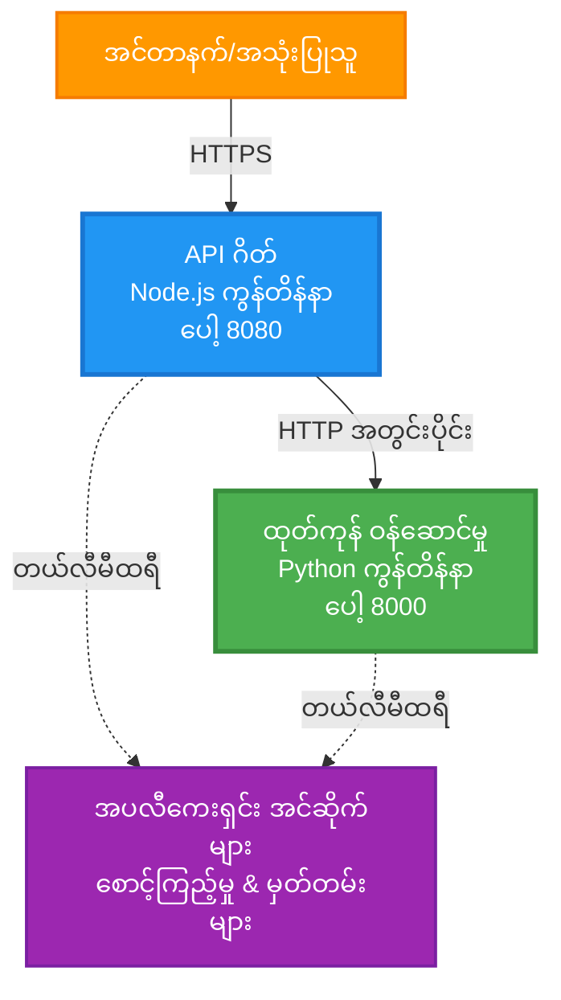
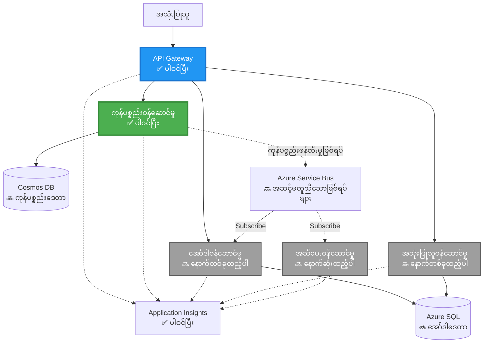
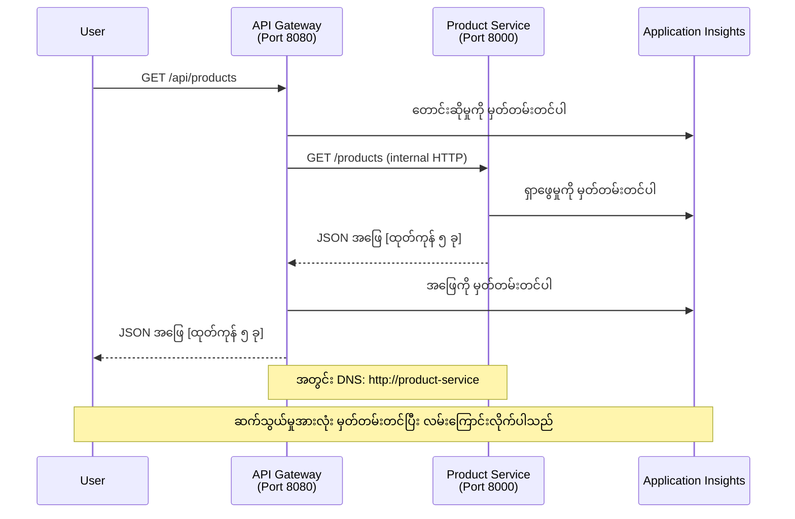

<!--
CO_OP_TRANSLATOR_METADATA:
{
  "original_hash": "eb3a4803a1e80a7f2e64f6bf63738c0f",
  "translation_date": "2025-11-23T23:36:45+00:00",
  "source_file": "examples/microservices/README.md",
  "language_code": "my"
}
-->
# Microservices Architecture - Container App Example

⏱️ **ခန့်မှန်းချိန်**: ၂၅-၃၅ မိနစ် | 💰 **ခန့်မှန်းကုန်ကျစရိတ်**: ~$50-100/လ | ⭐ **အဆင့်**: အဆင့်မြင့်

**📚 သင်ကြားမှုလမ်းကြောင်း**:
- ← အရင်တစ်ခု: [Simple Flask API](../../../../examples/container-app/simple-flask-api) - Single container အခြေခံ
- 🎯 **သင်ရှိနေသောနေရာ**: Microservices Architecture (၂-ဝန်ဆောင်မှုအခြေခံ)
- → နောက်တစ်ခု: [AI Integration](../../../../docs/ai-foundry) - ဝန်ဆောင်မှုများတွင် ဉာဏ်ရည်ထည့်သွင်းခြင်း
- 🏠 [သင်တန်းမူလစာမျက်နှာ](../../README.md)

---

Azure Container Apps တွင် AZD CLI ကို အသုံးပြု၍ **ရိုးရှင်းပြီး အသုံးဝင်သော** microservices architecture တစ်ခုကို တင်သွင်းထားသည်။ ဤဥပမာသည် ဝန်ဆောင်မှုမှ ဝန်ဆောင်မှုဆက်သွယ်မှု၊ container orchestration နှင့် ၂-ဝန်ဆောင်မှု setup ဖြင့် စစ်ဆင်ရေးကို ပြသသည်။

> **📚 သင်ကြားမှုနည်းလမ်း**: ဤဥပမာသည် deploy လုပ်နိုင်ပြီး သင်ယူနိုင်သော အနည်းဆုံး ၂-ဝန်ဆောင်မှု architecture (API Gateway + Backend Service) ဖြင့် စတင်သည်။ ဤအခြေခံကို ကျွမ်းကျင်ပြီးနောက်၊ အပြည့်အစုံ microservices ecosystem သို့ တိုးချဲ့ရန် လမ်းညွှန်ချက်များကို ပေးထားသည်။

## သင်လေ့လာနိုင်မည့်အရာများ

ဤဥပမာကို ပြီးမြောက်စွာ လုပ်ဆောင်ပြီးပါက၊ သင်သည်-
- Azure Container Apps တွင် containers များစွာကို deploy လုပ်ခြင်း
- ဝန်ဆောင်မှုမှ ဝန်ဆောင်မှုဆက်သွယ်မှုကို internal networking ဖြင့် အကောင်အထည်ဖော်ခြင်း
- ပတ်ဝန်းကျင်အခြေခံ scaling နှင့် health checks ကို configure လုပ်ခြင်း
- Application Insights ဖြင့် distributed applications များကို စောင့်ကြည့်ခြင်း
- microservices deployment patterns နှင့် အကောင်းဆုံးအလေ့အကျင့်များကို နားလည်ခြင်း
- ရိုးရှင်းသော architecture မှ အဆင့်မြင့် architecture သို့ တိုးတက်မှုကို သင်ယူခြင်း

## Architecture

### အဆင့် ၁: ကျွန်ုပ်တို့တည်ဆောက်နေသောအရာ (ဤဥပမာတွင် ပါဝင်သည်)


**Component အသေးစိတ်**:

| Component | ရည်ရွယ်ချက် | Access | Resources |
|-----------|---------|--------|-----------|
| **API Gateway** | အပြင်ဘက် request များကို backend services သို့ လမ်းညွှန်သည် | Public (HTTPS) | 1 vCPU, 2GB RAM, 2-20 replicas |
| **Product Service** | in-memory data ဖြင့် product catalog ကို စီမံသည် | Internal only | 0.5 vCPU, 1GB RAM, 1-10 replicas |
| **Application Insights** | centralized logging နှင့် distributed tracing | Azure Portal | 1-2 GB/month data ingestion |

**ရိုးရှင်းစွာ စတင်ရန် အကြောင်းအရင်း**:
- ✅ အလွယ်တကူ deploy လုပ်ပြီး နားလည်နိုင်သည် (၂၅-၃၅ မိနစ်)
- ✅ အဆင့်မြင့် microservices patterns များကို ရိုးရှင်းစွာ သင်ယူနိုင်သည်
- ✅ ပြင်ဆင်ပြီး စမ်းသပ်နိုင်သော code
- ✅ သင်ယူရန်အတွက် အနည်းဆုံးကုန်ကျစရိတ် (~$50-100/လ vs $300-1400/လ)
- ✅ databases နှင့် message queues မထည့်မီ ယုံကြည်မှုတိုးတက်စေသည်

**ဥပမာ**: ဦးဆောင်မောင်းနှင်မှုကို သင်ယူခြင်းလိုက်ပါ။ သင် empty parking lot (၂-ဝန်ဆောင်မှု) တွင် စတင်ပြီး အခြေခံကို ကျွမ်းကျင်ပြီးနောက်၊ မြို့တွင်း traffic (၅+ ဝန်ဆောင်မှုများနှင့် databases) သို့ တိုးတက်သည်။

### အဆင့် ၂: အနာဂတ်တိုးချဲ့မှု (Reference Architecture)

၂-ဝန်ဆောင်မှု architecture ကို ကျွမ်းကျင်ပြီးနောက်၊ သင်တိုးချဲ့နိုင်သည်-


"Expansion Guide" အပိုင်း၏ နောက်ဆုံးတွင် အဆင့်ဆင့် လမ်းညွှန်ချက်များကို ကြည့်ပါ။

## ပါဝင်သော Features

✅ **Service Discovery**: containers များအကြား DNS အခြေခံ discovery ကို အလိုအလျောက်  
✅ **Load Balancing**: replicas များအကြား built-in load balancing  
✅ **Auto-scaling**: HTTP requests အပေါ်အခြေခံ၍ ဝန်ဆောင်မှုတစ်ခုချင်းစီကို အလိုအလျောက် scale လုပ်ခြင်း  
✅ **Health Monitoring**: ဝန်ဆောင်မှုနှစ်ခုစလုံးအတွက် liveness နှင့် readiness probes  
✅ **Distributed Logging**: Application Insights ဖြင့် centralized logging  
✅ **Internal Networking**: ဝန်ဆောင်မှုမှ ဝန်ဆောင်မှုဆက်သွယ်မှုကို လုံခြုံစွာ  
✅ **Container Orchestration**: deployment နှင့် scaling ကို အလိုအလျောက်  
✅ **Zero-Downtime Updates**: revision management ဖြင့် rolling updates  

## လိုအပ်ချက်များ

### လိုအပ်သော Tools

စတင်မီ၊ သင်တွင် အောက်ပါ tools များ install လုပ်ထားကြောင်း အတည်ပြုပါ:

1. **[Azure Developer CLI (azd)](https://learn.microsoft.com/azure/developer/azure-developer-cli/install-azd)** (version 1.0.0 သို့မဟုတ် အထက်)
   ```bash
   azd version
   # မျှော်မှန်းထားသော output: azd version 1.0.0 သို့မဟုတ် အထက်ရှိ version
   ```

2. **[Azure CLI](https://learn.microsoft.com/cli/azure/install-azure-cli)** (version 2.50.0 သို့မဟုတ် အထက်)
   ```bash
   az --version
   # မျှော်မှန်းထားသော output: azure-cli 2.50.0 သို့မဟုတ် အထက်ရှိ version
   ```

3. **[Docker](https://www.docker.com/get-started)** (local development/testing အတွက် - optional)
   ```bash
   docker --version
   # မျှော်မှန်းထားသော output: Docker version 20.10 သို့မဟုတ် အထက်ရှိ version
   ```

### သင့် Setup ကို အတည်ပြုပါ

ဤ commands များကို run လုပ်၍ သင့်အဆင်သင့်ဖြစ်ကြောင်း အတည်ပြုပါ:

```bash
# Azure Developer CLI ကိုစစ်ဆေးပါ
azd version
# ✅ မျှော်မှန်းထားသည်: azd version 1.0.0 သို့မဟုတ် အထက်

# Azure CLI ကိုစစ်ဆေးပါ
az --version
# ✅ မျှော်မှန်းထားသည်: azure-cli 2.50.0 သို့မဟုတ် အထက်

# Docker ကိုစစ်ဆေးပါ (ရွေးချယ်နိုင်သည်)
docker --version
# ✅ မျှော်မှန်းထားသည်: Docker version 20.10 သို့မဟုတ် အထက်
```

**အောင်မြင်မှုအချက်**: commands အားလုံးသည် minimum version များနှင့် ကိုက်ညီသော version numbers ကို ပြန်ပေးသည်။

### Azure လိုအပ်ချက်များ

- **Azure subscription** ([အခမဲ့ account တစ်ခုဖန်တီးပါ](https://azure.microsoft.com/free/))  
- သင့် subscription တွင် resources များဖန်တီးရန် ခွင့်ပြုချက်  
- subscription သို့မဟုတ် resource group တွင် **Contributor** role  

### အသိပညာလိုအပ်ချက်များ

ဤသည် **အဆင့်မြင့်** ဥပမာဖြစ်သည်။ သင်သည်-
- [Simple Flask API example](../../../../examples/container-app/simple-flask-api) ကို ပြီးမြောက်စွာ လုပ်ဆောင်ထားရမည်  
- microservices architecture အခြေခံကို နားလည်ထားရမည်  
- REST APIs နှင့် HTTP ကို ကျွမ်းကျင်ရမည်  
- container concepts ကို နားလည်ထားရမည်  

**Container Apps အသစ်စတင်သူများ**: အခြေခံကို သင်ယူရန် [Simple Flask API example](../../../../examples/container-app/simple-flask-api) ကို စတင်ပါ။

## အမြန်စတင်ခြင်း (အဆင့်ဆင့်)

### အဆင့် ၁: Clone နှင့် Navigate

```bash
git clone https://github.com/microsoft/AZD-for-beginners.git
cd AZD-for-beginners/examples/microservices
```

**✓ အောင်မြင်မှုအချက်**: `azure.yaml` ကို တွေ့ပါ:
```bash
ls
# မျှော်မှန်းထားသည်: README.md, azure.yaml, infra/, src/
```

### အဆင့် ၂: Azure နှင့် Authenticate

```bash
azd auth login
```

ဤသည် သင့် browser ကို ဖွင့်ပြီး Azure authentication အတွက် Sign in လုပ်ရန် တောင်းဆိုသည်။

**✓ အောင်မြင်မှုအချက်**: သင့် screen တွင်:
```
Logged in to Azure.
```

### အဆင့် ၃: Environment ကို Initialize လုပ်ပါ

```bash
azd init
```

**သင့် screen တွင် တွေ့ရမည့် Prompts**:
- **Environment name**: အတိုချုံးနာမည်တစ်ခုထည့်ပါ (ဥပမာ- `microservices-dev`)
- **Azure subscription**: သင့် subscription ကို ရွေးပါ
- **Azure location**: region တစ်ခုကို ရွေးပါ (ဥပမာ- `eastus`, `westeurope`)

**✓ အောင်မြင်မှုအချက်**: သင့် screen တွင်:
```
SUCCESS: New project initialized!
```

### အဆင့် ၄: Infrastructure နှင့် Services ကို Deploy လုပ်ပါ

```bash
azd up
```

**ဖြစ်ပျက်မှု** (၈-၁၂ မိနစ်):

```mermaid
graph LR
    A[azd up] --> B[အရင်းအမြစ်အုပ်စုဖန်တီးပါ]
    B --> C[ကွန်တိန်နာမှတ်ပုံတင်ရေးကို တင်ဆောင်ပါ]
    C --> D[Log Analytics ကို တင်ဆောင်ပါ]
    D --> E[App Insights ကို တင်ဆောင်ပါ]
    E --> F[ကွန်တိန်နာပတ်ဝန်းကျင်ဖန်တီးပါ]
    F --> G[API Gateway ပုံရိပ်ကို တည်ဆောက်ပါ]
    F --> H[Product Service ပုံရိပ်ကို တည်ဆောက်ပါ]
    G --> I[မှတ်ပုံတင်ရေးသို့ တွန်းပါ]
    H --> I
    I --> J[API Gateway ကို တင်ဆောင်ပါ]
    I --> K[Product Service ကို တင်ဆောင်ပါ]
    J --> L[Ingress & ကျန်းမာရေးစစ်ဆေးမှုများကို ဖွဲ့စည်းပါ]
    K --> L
    L --> M[တင်ဆောင်မှုပြီးစီး ✓]
    
    style A fill:#2196F3,stroke:#1976D2,stroke-width:3px,color:#fff
    style M fill:#4CAF50,stroke:#388E3C,stroke-width:3px,color:#fff
```


**✓ အောင်မြင်မှုအချက်**: သင့် screen တွင်:
```
SUCCESS: Your application was deployed to Azure in X minutes Y seconds.
Endpoint: https://api-gateway-<unique-id>.azurecontainerapps.io
```

**⏱️ အချိန်**: ၈-၁၂ မိနစ်

### အဆင့် ၅: Deployment ကို စမ်းသပ်ပါ

```bash
# ဂိတ်ဝေးအဆုံးမှတ်ကိုရယူပါ
GATEWAY_URL=$(azd env get-values | grep API_GATEWAY_URL | cut -d '=' -f2 | tr -d '"')

# API Gateway ကျန်းမာရေးကိုစမ်းသပ်ပါ
curl $GATEWAY_URL/health
```

**✅ မျှော်မှန်းထားသော output**:
```json
{
  "status": "healthy",
  "service": "api-gateway",
  "timestamp": "2025-11-19T10:30:00Z"
}
```

**gateway မှတစ်ဆင့် product service ကို စမ်းသပ်ပါ**:
```bash
# ထုတ်ကုန်များစာရင်း
curl $GATEWAY_URL/api/products
```

**✅ မျှော်မှန်းထားသော output**:
```json
[
  {"id":1,"name":"Laptop","price":999.99,"stock":50},
  {"id":2,"name":"Mouse","price":29.99,"stock":200},
  {"id":3,"name":"Keyboard","price":79.99,"stock":150}
]
```

**✓ အောင်မြင်မှုအချက်**: endpoints နှစ်ခုစလုံး JSON data ကို error မရှိဘဲ ပြန်ပေးသည်။

---

**🎉 ဂုဏ်ယူပါတယ်!** သင်သည် Azure တွင် microservices architecture ကို deploy လုပ်ပြီးပါပြီ!

## Project Structure

Implementation files အားလုံးပါဝင်သည်—ဤသည်မှာ ပြည့်စုံပြီး အလုပ်လုပ်သော ဥပမာဖြစ်သည်:

```
microservices/
│
├── README.md                         # This file
├── azure.yaml                        # AZD configuration
├── .gitignore                        # Git ignore patterns
│
├── infra/                           # Infrastructure as Code (Bicep)
│   ├── main.bicep                   # Main orchestration
│   ├── abbreviations.json           # Naming conventions
│   ├── core/                        # Shared infrastructure
│   │   ├── container-apps-environment.bicep  # Container environment + registry
│   │   └── monitor.bicep            # Application Insights + Log Analytics
│   └── app/                         # Service definitions
│       ├── api-gateway.bicep        # API Gateway container app
│       └── product-service.bicep    # Product Service container app
│
└── src/                             # Application source code
    ├── api-gateway/                 # Node.js API Gateway
    │   ├── app.js                   # Express server with routing
    │   ├── package.json             # Node dependencies
    │   └── Dockerfile               # Container definition
    └── product-service/             # Python Product Service
        ├── main.py                  # Flask API with product data
        ├── requirements.txt         # Python dependencies
        └── Dockerfile               # Container definition
```

**Component တစ်ခုချင်းစီ၏ ရည်ရွယ်ချက်**:

**Infrastructure (infra/)**:
- `main.bicep`: Azure resources အားလုံးနှင့် dependencies များကို စီမံသည်
- `core/container-apps-environment.bicep`: Container Apps environment နှင့် Azure Container Registry ကို ဖန်တီးသည်
- `core/monitor.bicep`: Application Insights ကို setup လုပ်သည်
- `app/*.bicep`: Individual container app definitions (scaling နှင့် health checks ပါဝင်သည်)

**API Gateway (src/api-gateway/)**:
- Public-facing service ဖြစ်ပြီး request များကို backend services သို့ လမ်းညွှန်သည်
- logging, error handling, နှင့် request forwarding ကို implement လုပ်သည်
- service-to-service HTTP communication ကို ပြသသည်

**Product Service (src/product-service/)**:
- product catalog (ရိုးရှင်းစွာ in-memory) ဖြင့် internal service
- REST API နှင့် health checks ပါဝင်သည်
- backend microservice pattern ကို ဥပမာပြသည်

## Services Overview

### API Gateway (Node.js/Express)

**Port**: 8080  
**Access**: Public (external ingress)  
**Purpose**: incoming requests များကို သင့်တော်သော backend services သို့ လမ်းညွှန်သည်  

**Endpoints**:
- `GET /` - ဝန်ဆောင်မှုအချက်အလက်
- `GET /health` - Health check endpoint
- `GET /api/products` - product service (list all) သို့ forward
- `GET /api/products/:id` - product service (get by ID) သို့ forward

**Key Features**:
- axios ဖြင့် request routing
- centralized logging
- error handling နှင့် timeout management
- environment variables ဖြင့် service discovery
- Application Insights integration

**Code Highlight** (`src/api-gateway/app.js`):
```javascript
// အတွင်းဝန်ဆောင်မှုဆက်သွယ်မှု
app.get('/api/products', async (req, res) => {
  const response = await axios.get(`${PRODUCT_SERVICE_URL}/products`, {
    timeout: 5000
  });
  res.json(response.data);
});
```

### Product Service (Python/Flask)

**Port**: 8000  
**Access**: Internal only (external ingress မရှိ)  
**Purpose**: in-memory data ဖြင့် product catalog ကို စီမံသည်  

**Endpoints**:
- `GET /` - ဝန်ဆောင်မှုအချက်အလက်
- `GET /health` - Health check endpoint
- `GET /products` - product များအားလုံးကို list
- `GET /products/<id>` - ID ဖြင့် product ကို ရယူ

**Key Features**:
- Flask ဖြင့် RESTful API
- database မလိုအပ်သော in-memory product store
- probes ဖြင့် health monitoring
- structured logging
- Application Insights integration

**Data Model**:
```python
{
  "id": 1,
  "name": "Laptop",
  "description": "High-performance laptop",
  "price": 999.99,
  "stock": 50
}
```

**အဘယ်ကြောင့် Internal Only?**
Product service ကို public မထုတ်ဖော်ထားပါ။ requests အားလုံးသည် API Gateway မှတစ်ဆင့် သွားရမည်၊ အရာသည်-
- လုံခြုံရေး: access point ကို ထိန်းချုပ်သည်
- အလွယ်တကူပြောင်းလဲနိုင်မှု: client များကို ထိခိုက်မှုမရှိဘဲ backend ကို ပြောင်းနိုင်သည်
- စောင့်ကြည့်မှု: centralized request logging

## ဝန်ဆောင်မှုဆက်သွယ်မှုကို နားလည်ခြင်း

### ဝန်ဆောင်မှုများအကြား ဆက်သွယ်မှု


ဤဥပမာတွင် API Gateway သည် Product Service နှင့် **internal HTTP calls** ဖြင့် ဆက်သွယ်သည်:

```javascript
// API Gateway (src/api-gateway/app.js)
const PRODUCT_SERVICE_URL = process.env.PRODUCT_SERVICE_URL;

// အတွင်း HTTP တောင်းဆိုမှုလုပ်ပါ
const response = await axios.get(`${PRODUCT_SERVICE_URL}/products`);
```

**အရေးကြီးသောအချက်များ**:

1. **DNS-Based Discovery**: Container Apps သည် internal services အတွက် DNS ကို အလိုအလျောက် ပေးသည်
   - Product Service FQDN: `product-service.internal.<environment>.azurecontainerapps.io`
   - ရိုးရှင်းစွာ: `http://product-service` (Container Apps သည် အလိုအလျောက် resolve လုပ်သည်)

2. **Public Exposure မရှိ**: Product Service တွင် Bicep တွင် `external: false` ပါဝင်သည်
   - Container Apps environment အတွင်းမှသာ access လုပ်နိုင်သည်
   - အင်တာနက်မှ access မရနိုင်

3. **Environment Variables**: Service URLs များကို deployment အချိန်တွင် inject လုပ်သည်
   - Bicep သည် internal FQDN ကို gateway သို့ pass လုပ်သည်
   - application code တွင် hardcoded URLs မရှိ

**ဥပမာ**: ဤသည်ကို ရုံးခန်းများလိုက်ပါ။ API Gateway သည် reception desk (public-facing) ဖြစ်ပြီး Product Service သည် ရုံးခန်း (internal only) ဖြစ်သည်။ ဧည့်သည်များသည် reception မှတစ်ဆင့်သာ ရုံးခန်းများသို့ ရောက်နိုင်သည်။

## Deployment Options

### Full Deployment (အကြံပြုသည်)

```bash
# အခြေခံအဆောက်အအုံနှင့် ဝန်ဆောင်မှုနှစ်ခုကို တင်သွင်းပါ
azd up
```

ဤသည် deploy လုပ်သည်:
1. Container Apps environment
2. Application Insights
3. Container Registry
4. API Gateway container
5. Product Service container

**အချိန်**: ၈-၁၂ မိနစ်

### Individual Service ကို Deploy လုပ်ပါ

```bash
# တစ်ခုတည်းသော service ကို deploy လုပ်ပါ (အစပိုင်း azd up အပြီး)
azd deploy api-gateway

# ဒါမှမဟုတ် product service ကို deploy လုပ်ပါ
azd deploy product-service
```

**အသုံးပြုမှု**: သင့် code ကို update လုပ်ပြီး service တစ်ခုကိုသာ redeploy လုပ်လိုသောအခါ။

### Configuration ကို Update လုပ်ပါ

```bash
# အတိုင်းအတာများကို ပြောင်းလဲပါ
azd env set GATEWAY_MAX_REPLICAS 30

# configuration အသစ်ဖြင့် ပြန်လည်တပ်ဆင်ပါ
azd up
```

## Configuration

### Scaling Configuration

ဝန်ဆောင်မှုနှစ်ခုစလုံးသည် Bicep files တွင် HTTP-based autoscaling ဖြင့် configure လုပ်ထားသည်:

**API Gateway**:
- Min replicas: ၂ (availability အတွက် အနည်းဆုံး ၂)
- Max replicas: ၂၀
- Scale trigger: replica တစ်ခုလျှင် ၅၀ concurrent requests

**Product Service**:
- Min replicas: ၁ (လိုအပ်ပါက zero သို့ scale လုပ်နိုင်သည်)
- Max replicas: ၁၀
- Scale trigger: replica တစ်ခုလျှင် ၁၀၀ concurrent requests

**Scaling ကို Customize လုပ်ပါ** (`infra/app/*.bicep`):
```bicep
scale: {
  minReplicas: 1
  maxReplicas: 10
  rules: [
    {
      name: 'http-scale-rule'
      http: {
        metadata: {
          concurrentRequests: '100'  // Adjust this
        }
      }
    }
  ]
}
```

### Resource Allocation

**API Gateway**:
- CPU: 1.0 vCPU
- Memory: 2 GiB
- အကြောင်းအရင်း: external traffic အားလုံးကို handle လုပ်သည်

**Product Service**:
- CPU: 0.5 vCPU
- Memory: 1 GiB
- အကြောင်းအရင်း: lightweight in-memory operations

### Health Checks

ဝန်ဆောင်မှုနှစ်ခုစလုံးတွင် liveness နှင့် readiness probes ပါဝင်သည်:

```bicep
probes: [
  {
    type: 'Liveness'
    httpGet: {
      path: '/health'
      port: 8080
    }
    initialDelaySeconds: 10
    periodSeconds: 30
  }
  {
    type: 'Readiness'
    httpGet: {
      path: '/health'
      port: 8080
    }
    initialDelaySeconds: 5
    periodSeconds: 10
  }
]
```

**ဤအရာ၏ အဓိပ္ပါယ်**:
- **Liveness**: health check မအောင်မြင်ပါက Container Apps သည် container ကို restart လုပ်သည်
- **Readiness**: ready မဖြစ်ပါက Container Apps သည် replica သို့ traffic မပို့ပါ

## Monitoring & Observability

### Service Logs ကို ကြည့်ပါ

```bash
# API Gateway မှ log များကို stream လုပ်ပါ
azd logs api-gateway --follow

# နောက်ဆုံးထုတ်ကုန်ဝန်ဆောင်မှု log များကိုကြည့်ပါ
azd logs product-service --tail 100

# ဝန်ဆောင်မှုနှစ်ခုလုံးမှ log များအားလုံးကိုကြည့်ပါ
azd logs --follow
```

**မျှော်မှန်းထားသော Output**:
```
[api-gateway] API Gateway listening on port 8080
[api-gateway] Product Service URL: http://product-service
[api-gateway] GET /api/products 200 - 45ms
[product-service] Retrieved 5 products
```

### Application Insights Queries

Azure Portal တွင် Application Insights ကို access လုပ်ပြီး ဤ queries များကို run လုပ်ပါ:

**Find Slow Requests**:
```kusto
requests
| where timestamp > ago(1h)
| where duration > 1000  // Requests taking >1 second
| summarize count() by name, cloud_RoleName
| order by count_ desc
```

**Track Service-to-Service Calls**:
```kusto
dependencies
| where timestamp > ago(1h)
| where type == "Http"
| project timestamp, name, target, duration, success
| order by timestamp desc
```

**Error Rate by Service**:
```kusto
exceptions
| where timestamp > ago(24h)
| summarize errorCount = count() by cloud_RoleName, type
| order by errorCount desc
```

**Request Volume Over Time**:
```kusto
requests
| where timestamp > ago(1h)
| summarize requestCount = count() by bin(timestamp, 5m), cloud_RoleName
| render timechart
```

### Monitoring Dashboard ကို Access လုပ်ပါ

```bash
# အက်ပလီကေးရှင်းအိုင်နိုက်များ၏အသေးစိတ်ကိုရယူပါ
azd env get-values | grep APPLICATIONINSIGHTS

# Azure Portal monitoring ကိုဖွင့်ပါ
az monitor app-insights component show \
  --app $(azd env get-values | grep APPLICATIONINSIGHTS_CONNECTION_STRING | cut -d '=' -f2) \
  --resource-group $(azd env get-values | grep AZURE_RESOURCE_GROUP | cut -d '=' -f2) \
  --query "appId" -o tsv
```

### Live Metrics

1. Azure Portal တွင် Application Insights သို့ သွားပါ
2. "Live Metrics" ကို click လုပ်ပါ
3. real-time requests, failures, နှင့် performance ကို ကြည့်ပါ
4. စမ်းသပ်ရန် run လုပ်
3. နှစ်ခုလုံးသော service များကို ပြန်လည် deploy လုပ်ပါ။

```bash
azd deploy product-service
azd deploy api-gateway
```

4. Endpoint အသစ်ကို စမ်းသပ်ပါ။

```bash
GATEWAY_URL=$(azd env get-values | grep API_GATEWAY_URL | cut -d '=' -f2 | tr -d '"')

# ထုတ်ကုန်အသစ်တစ်ခုဖန်တီးပါ
curl -X POST $GATEWAY_URL/api/products \
  -H "Content-Type: application/json" \
  -d '{"name":"USB Cable","price":9.99,"stock":500}'
```

**✅ မျှော်မှန်းထားသော output:**
```json
{"id":6,"name":"USB Cable","description":"","price":9.99,"stock":500}
```

5. စာရင်းထဲတွင် ပေါ်လာသည်ကို အတည်ပြုပါ။

```bash
curl $GATEWAY_URL/api/products
# ယခု USB Cable အသစ်အပါအဝင် ၆ မျိုးသောထုတ်ကုန်များကို ပြသသင့်ပါသည်။
```

**အောင်မြင်မှုအချက်များ**:
- ✅ POST request သည် HTTP 201 ကို ပြန်ပေးသည်။
- ✅ GET /api/products စာရင်းတွင် ထည့်သွင်းထားသော product အသစ်ပေါ်လာသည်။
- ✅ Product တွင် auto-incremented ID ပါရှိသည်။

**အချိန်**: 10-15 မိနစ်

---

### အလေ့အကျင့် 2: Autoscaling Rules ကို ပြင်ဆင်ပါ ⭐⭐ (အလယ်အလတ်)

**ရည်ရွယ်ချက်**: Product Service ကို ပိုမိုတက်ကြွစွာ scale လုပ်နိုင်အောင် ပြောင်းလဲပါ။

**စတင်နေရာ**: `infra/app/product-service.bicep`

**အဆင့်များ**:

1. `infra/app/product-service.bicep` ကို ဖွင့်ပြီး `scale` block ကို ရှာပါ (line 95 အနီး)

2. အောက်ပါအတိုင်း ပြောင်းပါ:
```bicep
scale: {
  minReplicas: 1
  maxReplicas: 10
  rules: [
    {
      name: 'http-scale-rule'
      http: {
        metadata: {
          concurrentRequests: '100'  // OLD
        }
      }
    }
  ]
}
```

To:
```bicep
scale: {
  minReplicas: 2  // Always have 2 running
  maxReplicas: 20  // Allow more scaling
  rules: [
    {
      name: 'http-scale-rule'
      http: {
        metadata: {
          concurrentRequests: '20'  // Scale at lower threshold
        }
      }
    }
  ]
}
```

3. Infrastructure ကို ပြန်လည် deploy လုပ်ပါ။

```bash
azd up
```

4. Autoscaling configuration အသစ်ကို အတည်ပြုပါ။

```bash
az containerapp show \
  --name $(azd env get-values | grep PRODUCT_SERVICE | head -1 | cut -d '/' -f5) \
  --resource-group $(azd env get-values | grep AZURE_RESOURCE_GROUP | cut -d '=' -f2 | tr -d '"') \
  --query "properties.template.scale" -o json
```

**✅ မျှော်မှန်းထားသော output:**
```json
{
  "minReplicas": 2,
  "maxReplicas": 20,
  "rules": [...]
}
```

5. Load ဖြင့် autoscaling ကို စမ်းသပ်ပါ။

```bash
# တစ်ချိန်တည်းမှာတောင်းဆိုမှုများကိုဖန်တီးပါ
for i in {1..500}; do curl $GATEWAY_URL/api/products & done

# အရွယ်အစားချဲ့ထွင်မှုဖြစ်ပေါ်မှုကိုကြည့်ရှုပါ
azd logs product-service --follow
# ရှာဖွေပါ: Container Apps အရွယ်အစားချဲ့ထွင်မှုဖြစ်ရပ်များ
```

**အောင်မြင်မှုအချက်များ**:
- ✅ Product Service သည် အနည်းဆုံး 2 replicas တွင် အမြဲ run ဖြစ်နေသည်။
- ✅ Load ရှိသောအခါ 2 replicas ထက်ပိုမို scale လုပ်သည်။
- ✅ Azure Portal တွင် autoscaling rules အသစ်ကို ပြသသည်။

**အချိန်**: 15-20 မိနစ်

---

### အလေ့အကျင့် 3: Custom Monitoring Query ထည့်သွင်းပါ ⭐⭐ (အလယ်အလတ်)

**ရည်ရွယ်ချက်**: Product API performance ကို စောင့်ကြည့်ရန် custom Application Insights query တစ်ခု ဖန်တီးပါ။

**အဆင့်များ**:

1. Azure Portal တွင် Application Insights ကို သွားပါ:
   - Azure Portal သို့ သွားပါ
   - သင့် resource group (rg-microservices-*) ကို ရှာပါ
   - Application Insights resource ကို click လုပ်ပါ

2. ဘယ်ဘက် menu တွင် "Logs" ကို click လုပ်ပါ။

3. အောက်ပါ query ကို ဖန်တီးပါ:

```kusto
requests
| where timestamp > ago(1h)
| where name contains "products"
| summarize 
    RequestCount = count(),
    AvgDuration = avg(duration),
    P95Duration = percentile(duration, 95),
    SuccessRate = 100.0 * countif(success == true) / count()
  by bin(timestamp, 5m)
| render timechart
```

4. Query ကို run လုပ်ရန် "Run" ကို click လုပ်ပါ။

5. Query ကို save လုပ်ပါ:
   - "Save" ကို click လုပ်ပါ
   - Name: "Product API Performance"
   - Category: "Performance"

6. Test traffic ကို ဖန်တီးပါ။

```bash
for i in {1..100}; do curl $GATEWAY_URL/api/products; sleep 1; done
```

7. Query ကို refresh လုပ်ပြီး data ကို ကြည့်ပါ။

**✅ မျှော်မှန်းထားသော output:**
- အချိန်အလိုက် request count ကို ပြသသော chart
- အချိန်ပျမ်းမျှ < 500ms
- Success rate = 100%
- 5 မိနစ် interval time bins

**အောင်မြင်မှုအချက်များ**:
- ✅ Query တွင် 100+ requests ကို ပြသသည်။
- ✅ Success rate သည် 100% ဖြစ်သည်။
- ✅ အချိန်ပျမ်းမျှ < 500ms ဖြစ်သည်။
- ✅ Chart တွင် 5 မိနစ် interval time bins ကို ပြသသည်။

**သင်ယူရသောအကျိုးကျေးဇူး**: Custom queries ဖြင့် service performance ကို စောင့်ကြည့်နည်းကို နားလည်ပါ။

**အချိန်**: 10-15 မိနစ်

---

### အလေ့အကျင့် 4: Retry Logic ကို အကောင်အထည်ဖော်ပါ ⭐⭐⭐ (Advanced)

**ရည်ရွယ်ချက်**: Product Service အချို့အခါ မရရှိနိုင်သောအခါ API Gateway တွင် retry logic ထည့်သွင်းပါ။

**စတင်နေရာ**: `src/api-gateway/app.js`

**အဆင့်များ**:

1. Retry library ကို install လုပ်ပါ:

```bash
cd src/api-gateway
npm install axios-retry --save
cd ../..
```

2. `src/api-gateway/app.js` ကို update လုပ်ပါ (axios import အပြီးတွင် ထည့်ပါ):

```javascript
const axiosRetry = require('axios-retry');

// ပြန်လည်ကြိုးစားမှု လိုဂစ်ကို ဖွဲ့စည်းပါ
axiosRetry(axios, {
  retries: 3,
  retryDelay: (retryCount) => {
    return retryCount * 1000; // 1စက္ကန့်၊ 2စက္ကန့်၊ 3စက္ကန့်
  },
  retryCondition: (error) => {
    // ကွန်ယက်အမှားများ သို့မဟုတ် 5xx တုံ့ပြန်မှုများတွင် ပြန်လည်ကြိုးစားပါ
    return axiosRetry.isNetworkOrIdempotentRequestError(error) ||
           (error.response && error.response.status >= 500);
  }
});

console.log('Retry logic configured: 3 retries with exponential backoff');
```

3. API Gateway ကို ပြန်လည် deploy လုပ်ပါ။

```bash
azd deploy api-gateway
```

4. Service failure ကို simulation လုပ်ပြီး retry behavior ကို စမ်းသပ်ပါ။

```bash
# ပစ္စည်းဝန်ဆောင်မှုကို 0 အထိချဲ့ထွင်ပါ (မအောင်မြင်မှုကို simulation လုပ်ပါ)
az containerapp update \
  --name $(azd env get-values | grep PRODUCT_SERVICE | head -1 | cut -d '/' -f5) \
  --resource-group $(azd env get-values | grep AZURE_RESOURCE_GROUP | cut -d '=' -f2 | tr -d '"') \
  --min-replicas 0 \
  --max-replicas 0

# ပစ္စည်းများကို access လုပ်ရန်ကြိုးစားပါ (3 ကြိမ် retry လုပ်မည်)
time curl -v $GATEWAY_URL/api/products
# ကြည့်ရှုပါ: တုံ့ပြန်မှု ~6 စက္ကန့်ကြာသည် (1s + 2s + 3s retries)

# ပစ္စည်းဝန်ဆောင်မှုကိုပြန်လည်ထူထောင်ပါ
az containerapp update \
  --name $(azd env get-values | grep PRODUCT_SERVICE | head -1 | cut -d '/' -f5) \
  --resource-group $(azd env get-values | grep AZURE_RESOURCE_GROUP | cut -d '=' -f2 | tr -d '"') \
  --min-replicas 1 \
  --max-replicas 10
```

5. Retry logs ကို ကြည့်ပါ။

```bash
azd logs api-gateway --tail 50
# ပြန်လည်ကြိုးစားမှုအကြိမ်အရေအတွက်စာတိုများကိုရှာပါ
```

**✅ မျှော်မှန်းထားသော behavior:**
- Requests သည် fail ဖြစ်မတိုင်မီ 3 ကြိမ် retry လုပ်သည်။
- တစ်ကြိမ်စီ retry သည် ပိုမိုကြာမြင့်သည် (1s, 2s, 3s)
- Service ပြန်လည်စတင်ပြီးနောက် successful requests
- Logs တွင် retry attempts ကို ပြသသည်။

**အောင်မြင်မှုအချက်များ**:
- ✅ Requests သည် fail ဖြစ်မတိုင်မီ 3 ကြိမ် retry လုပ်သည်။
- ✅ တစ်ကြိမ်စီ retry သည် exponential backoff ဖြင့် ပိုမိုကြာမြင့်သည်။
- ✅ Service ပြန်လည်စတင်ပြီးနောက် successful requests
- ✅ Logs တွင် retry attempts ကို ပြသသည်။

**သင်ယူရသောအကျိုးကျေးဇူး**: Microservices တွင် resilience patterns (circuit breakers, retries, timeouts) ကို နားလည်ပါ။

**အချိန်**: 20-25 မိနစ်

---

## သင်ယူမှုအချက်အချာ

ဤဥပမာကို ပြီးမြောက်ပြီးနောက် သင့်နားလည်မှုကို အတည်ပြုပါ:

### 1. Service Communication ✓

သင့်နားလည်မှုကို စမ်းသပ်ပါ:
- [ ] API Gateway သည် Product Service ကို ဘယ်လို ရှာဖွေသလဲ? (DNS-based service discovery)
- [ ] Product Service မရရှိနိုင်ပါက ဘာဖြစ်မည်? (Gateway သည် 503 error ကို ပြန်ပေးသည်)
- [ ] သုံးသက်သော service တစ်ခုကို ဘယ်လို ထည့်သွင်းမည်? (Bicep file အသစ် ဖန်တီးပါ၊ main.bicep တွင် ထည့်ပါ၊ src folder ဖန်တီးပါ)

**လက်တွေ့ verification**:
```bash
# ဝန်ဆောင်မှုမအောင်မြင်မှုကို အတုယူပါ
az containerapp update --name <product-service-name> --min-replicas 0 --max-replicas 0
curl $GATEWAY_URL/api/products
# ✅ မျှော်မှန်းထားသည်: 503 ဝန်ဆောင်မှုမရရှိနိုင်ပါ

# ဝန်ဆောင်မှုကို ပြန်လည်ထူထောင်ပါ
az containerapp update --name <product-service-name> --min-replicas 1 --max-replicas 10
```

### 2. Monitoring & Observability ✓

သင့်နားလည်မှုကို စမ်းသပ်ပါ:
- [ ] Distributed logs ကို ဘယ်မှာ ကြည့်နိုင်သလဲ? (Azure Portal တွင် Application Insights)
- [ ] Slow requests ကို ဘယ်လို စောင့်ကြည့်မည်? (Kusto query: `requests | where duration > 1000`)
- [ ] Error ဖြစ်စေသော service ကို ဘယ်လို ရှာမည်? (Logs တွင် `cloud_RoleName` field ကို စစ်ဆေးပါ)

**လက်တွေ့ verification**:
```bash
# ဖြည်းဖြည်းလေးတောင်းဆိုမှု simulation တစ်ခုကို ဖန်တီးပါ
curl "$GATEWAY_URL/api/products?delay=2000"

# ဖြည်းဖြည်းလေးတောင်းဆိုမှုများအတွက် Application Insights ကို Query လုပ်ပါ
# Azure Portal → Application Insights → Logs သို့ သွားပါ
# Run: requests | where duration > 1000 | project timestamp, name, duration, cloud_RoleName
```

### 3. Scaling & Performance ✓

သင့်နားလည်မှုကို စမ်းသပ်ပါ:
- [ ] Autoscaling ကို ဘာ trigger လုပ်သလဲ? (HTTP concurrent request rules: gateway အတွက် 50, product အတွက် 100)
- [ ] ယခု run ဖြစ်နေသော replicas အရေအတွက် ဘယ်လောက်လဲ? (`az containerapp revision list` ဖြင့် စစ်ဆေးပါ)
- [ ] Product Service ကို 5 replicas အထိ scale လုပ်ရန် ဘယ်လို ပြောင်းမည်? (Bicep တွင် minReplicas ကို update လုပ်ပါ)

**လက်တွေ့ verification**:
```bash
# အော်တိုစကေးလင့်ကို စမ်းသပ်ရန် load ကို ဖန်တီးပါ
for i in {1..1000}; do curl $GATEWAY_URL/api/products & done

# Replica များ တိုးလာမှုကို ကြည့်ပါ
azd logs api-gateway --follow
# ✅ မျှော်မှန်းထားသည်: log များတွင် စကေးလင့်ဖြစ်ရပ်များကို တွေ့ပါ
```

**အောင်မြင်မှုအချက်များ**: အားလုံးသောမေးခွန်းများကို ဖြေဆိုနိုင်ပြီး လက်တွေ့ command များဖြင့် အတည်ပြုနိုင်သည်။

---

## ကုန်ကျစရိတ်ခန့်မှန်းခြေ

### Estimated Monthly Costs (ဤ 2-Service ဥပမာအတွက်)

| Resource | Configuration | Estimated Cost |
|----------|--------------|----------------|
| API Gateway | 2-20 replicas, 1 vCPU, 2GB RAM | $30-150 |
| Product Service | 1-10 replicas, 0.5 vCPU, 1GB RAM | $15-75 |
| Container Registry | Basic tier | $5 |
| Application Insights | 1-2 GB/month | $5-10 |
| Log Analytics | 1 GB/month | $3 |
| **Total** | | **$58-243/month** |

### Usage အလိုက် ကုန်ကျစရိတ်ခွဲခြမ်း

**Light traffic** (စမ်းသပ်/လေ့လာ): ~$60/month
- API Gateway: 2 replicas × 24/7 = $30
- Product Service: 1 replica × 24/7 = $15
- Monitoring + Registry = $13

**Moderate traffic** (အသေးစား production): ~$120/month
- API Gateway: 5 avg replicas = $75
- Product Service: 3 avg replicas = $45
- Monitoring + Registry = $13

**High traffic** (အလုပ်များသောအချိန်): ~$240/month
- API Gateway: 15 avg replicas = $225
- Product Service: 8 avg replicas = $120
- Monitoring + Registry = $13

### ကုန်ကျစရိတ် လျှော့ချရန် အကြံပြုချက်များ

1. **Development အတွက် Scale to Zero**:
   ```bicep
   scale: {
     minReplicas: 0  // Save $30-40/month when not in use
     maxReplicas: 10
   }
   ```

2. **Cosmos DB အတွက် Consumption Plan ကို အသုံးပြုပါ** (ထည့်သွင်းသောအခါ):
   - သုံးသက်မှုအလိုက်ပေးဆောင်ပါ
   - အနည်းဆုံး charge မရှိပါ

3. **Application Insights Sampling ကို Set လုပ်ပါ**:
   ```javascript
   appInsights.defaultClient.config.samplingPercentage = 50; // တောင်းဆိုမှုများ၏ ၅၀% ကို နမူနာယူပါ
   ```

4. **မလိုအပ်သောအခါ Clean Up လုပ်ပါ**:
   ```bash
   azd down --force --purge
   ```

### Free Tier Options

လေ့လာ/စမ်းသပ်ရန်အတွက် အောက်ပါအတိုင်း စဉ်းစားပါ:
- ✅ Azure free credits ($200 for first 30 days with new accounts) ကို အသုံးပြုပါ
- ✅ အနည်းဆုံး replicas တွင်ထားပါ (ကုန်ကျစရိတ် ~50% လျှော့ချနိုင်သည်)
- ✅ စမ်းသပ်ပြီးနောက် delete လုပ်ပါ (အဆက်မပြတ် charge မရှိပါ)
- ✅ လေ့လာမှု session များအကြား Scale to Zero လုပ်ပါ

**ဥပမာ**: ဤဥပမာကို 2 နာရီ/နေ့ × 30 ရက် = ~$5/month ဖြစ်ပြီး $60/month အစား သက်သာနိုင်သည်။

---

## Troubleshooting Quick Reference

### ပြဿနာ: `azd up` သည် "Subscription not found" ဖြင့် fail ဖြစ်သည်။

**ဖြေရှင်းနည်း**:
```bash
# စာရင်းသွင်းမှုကို ထင်ရှားစွာပြန်လည်ဝင်ရောက်ပါ
az account set --subscription <your-subscription-id>
azd env set AZURE_SUBSCRIPTION_ID <your-subscription-id>
azd up
```

### ပြဿနာ: API Gateway သည် 503 "Product service unavailable" ကို ပြန်ပေးသည်။

**အခြေအနေကို စစ်ဆေးပါ**:
```bash
# ထုတ်ကုန်ဝန်ဆောင်မှုမှတ်တမ်းများကို စစ်ဆေးပါ။
azd logs product-service --tail 50

# ထုတ်ကုန်ဝန်ဆောင်မှုကျန်းမာရေးကို စစ်ဆေးပါ။
az containerapp show \
  --name $(azd env get-values | grep PRODUCT_SERVICE | head -1 | cut -d '/' -f5) \
  --resource-group $(azd env get-values | grep AZURE_RESOURCE_GROUP | cut -d '=' -f2 | tr -d '"') \
  --query "properties.runningStatus"
```

**ရင်းမြစ်များ**:
1. Product service မစတင်နိုင်ပါ (Python error များအတွက် logs ကို စစ်ဆေးပါ)
2. Health check fail ဖြစ်နေသည် (`/health` endpoint သည် အလုပ်လုပ်နေသည်ကို အတည်ပြုပါ)
3. Container image build fail ဖြစ်နေသည် (image အတွက် registry ကို စစ်ဆေးပါ)

### ပြဿနာ: Autoscaling အလုပ်မလုပ်ပါ

**အခြေအနေကို စစ်ဆေးပါ**:
```bash
# လက်ရှိ replica အရေအတွက်ကို စစ်ဆေးပါ
az containerapp revision list \
  --name $(azd env get-values | grep API_GATEWAY | head -1 | cut -d '/' -f5) \
  --resource-group $(azd env get-values | grep AZURE_RESOURCE_GROUP | cut -d '=' -f2 | tr -d '"') \
  --query "[].properties.replicas"

# စမ်းသပ်ရန် load ကို ဖန်တီးပါ
for i in {1..1000}; do curl $GATEWAY_URL/api/products & done

# အတိုင်းအတာပြောင်းလဲမှုများကို ကြည့်ရှုပါ
azd logs api-gateway --follow | grep -i scale
```

**ရင်းမြစ်များ**:
1. Load သာလွန်မရှိသေးပါ (scale rule ကို trigger လုပ်ရန် >50 concurrent requests လိုအပ်သည်)
2. Max replicas ရောက်ရှိပြီးသား (Bicep configuration ကို စစ်ဆေးပါ)
3. Scale rule ကို Bicep တွင် မမှန်ကန်စွာ configure လုပ်ထားသည် (concurrentRequests value ကို အတည်ပြုပါ)

### ပြဿနာ: Application Insights သည် logs ကို မပြသပါ

**အခြေအနေကို စစ်ဆေးပါ**:
```bash
# ချိတ်ဆက်မှု string သတ်မှတ်ထားရှိမှုကို အတည်ပြုပါ
azd env get-values | grep APPLICATIONINSIGHTS

# ဝန်ဆောင်မှုများသည် တယ်လီမီတာပို့နေသည်ကို စစ်ဆေးပါ
az monitor app-insights component show \
  --app $(azd env get-values | grep APPLICATIONINSIGHTS_NAME | cut -d '=' -f2 | tr -d '"') \
  --resource-group $(azd env get-values | grep AZURE_RESOURCE_GROUP | cut -d '=' -f2 | tr -d '"') \
  --query "properties.InstrumentationKey"
```

**ရင်းမြစ်များ**:
1. Connection string ကို container သို့ မပို့ထားပါ (environment variables ကို စစ်ဆေးပါ)
2. Application Insights SDK ကို configure မလုပ်ထားပါ (code တွင် imports ကို အတည်ပြုပါ)
3. Firewall သည် telemetry ကို block လုပ်ထားသည် (ရှားပါးသောအခြေအနေ၊ network rules ကို စစ်ဆေးပါ)

### ပြဿနာ: Docker build သည် locally fail ဖြစ်သည်

**အခြေအနေကို စစ်ဆေးပါ**:
```bash
# API Gateway build ကို စမ်းသပ်ပါ
cd src/api-gateway
docker build -t test-gateway .

# Product Service build ကို စမ်းသပ်ပါ
cd ../product-service
docker build -t test-product .
```

**ရင်းမြစ်များ**:
1. package.json/requirements.txt တွင် dependencies မပါရှိပါ
2. Dockerfile syntax error
3. Network သက်ဆိုင်သော dependencies မရရှိနိုင်ပါ

**Still Stuck?** [Common Issues Guide](../../docs/troubleshooting/common-issues.md) သို့မဟုတ် [Azure Container Apps Troubleshooting](https://learn.microsoft.com/azure/container-apps/troubleshooting) ကို ကြည့်ပါ။

---

## Cleanup

အဆက်မပြတ် charge မရှိစေရန် resource အားလုံးကို delete လုပ်ပါ:

```bash
azd down --force --purge
```

**Confirmation Prompt**:
```
? Total resources to delete: 6, are you sure you want to continue? (y/N)
```

`y` ကို confirm လုပ်ပါ။

**Delete လုပ်မည့်အရာများ**:
- Container Apps Environment
- Container Apps နှစ်ခု (gateway & product service)
- Container Registry
- Application Insights
- Log Analytics Workspace
- Resource Group

**✓ Cleanup ကို အတည်ပြုပါ**:
```bash
az group list --query "[?starts_with(name,'rg-microservices')]" --output table
```

အလုံးစုံ empty ဖြစ်ရမည်။

---

## Expansion Guide: 2 မှ 5+ Services သို့

ဤ 2-service architecture ကို ကျွမ်းကျင်ပြီးနောက် အောက်ပါအတိုင်း တိုးချဲ့ပါ:

### အဆင့် 1: Database Persistence ထည့်သွင်းပါ (နောက်တစ်ဆင့်)

**Product Service အတွက် Cosmos DB ထည့်သွင်းပါ**:

1. `infra/core/cosmos.bicep` ကို ဖန်တီးပါ:
   ```bicep
   resource cosmosAccount 'Microsoft.DocumentDB/databaseAccounts@2023-04-15' = {
     name: name
     location: location
     kind: 'GlobalDocumentDB'
     properties: {
       databaseAccountOfferType: 'Standard'
       consistencyPolicy: { defaultConsistencyLevel: 'Session' }
       locations: [{ locationName: location, failoverPriority: 0 }]
     }
   }
   ```

2. Product service ကို Azure Cosmos DB Python SDK အသုံးပြုရန် ပြောင်းပါ (in-memory data အစား)

3. ခန့်မှန်းကုန်ကျစရိတ်: ~$25/month (serverless)

### အဆင့် 2: Third Service ထည့်သွင်းပါ (Order Management)

**Order Service ကို ဖန်တီးပါ**:

1. Folder အသစ်: `src/order-service/` (Python/Node.js/C#)
2. Bicep အသစ်: `infra/app/order-service.bicep`
3. API Gateway ကို `/api/orders` သို့ route ပြောင်းပါ
4. Order persistence အတွက် Azure SQL Database ထည့်ပါ

**Architecture သည်**:
```
API Gateway → Product Service (Cosmos DB)
           → Order Service (Azure SQL)
```

### အဆင့် 3: Async Communication (Service Bus) ထည့်သွင်းပါ

**Event-Driven Architecture ကို အကောင်အထည်ဖော်ပါ**:

1. Azure Service Bus ကို ထည့်ပါ: `infra/core/servicebus.bicep`
2. Product Service သည် "ProductCreated" events ကို publish လုပ်ပါ
3. Order Service သည် product events ကို subscribe လုပ်ပါ
4. Notification Service ကို events ကို process လုပ်ရန် ထည့်ပါ

**Pattern**: Request/Response (HTTP) + Event-Driven (Service Bus)

### အဆင့် 4: User Authentication ထည့်သွင်းပါ

**User Service ကို အကောင်အထည်ဖော်ပါ**:

1. `src/user-service/` ကို ဖန်တီးပါ (Go/Node.js)
2. Azure AD B2C သို့မဟုတ် custom JWT authentication ကို ထည့်ပါ
3. API Gateway သည် tokens ကို validate လုပ်ပြီး route ပြောင်းပါ
4. Services များသည် user permissions ကို စစ်ဆေးပါ

### အဆင့် 5: Production Readiness

**ဤအရာများကို ထည့်သွင်းပါ**:
- ✅ Azure Front Door (global load balancing)
- ✅ Azure Key Vault (secret management)
- ✅ Azure Monitor Workbooks (custom dashboards)
- ✅ CI/CD Pipeline (GitHub Actions)
- ✅ Blue-Green Deployments
- ✅ Managed Identity for all services

**Full Production Architecture Cost**: ~$300-1,400/month

---

## Learn More

### Related Documentation
- [Azure Container Apps Documentation](https://learn.microsoft.com/azure/container-apps/)
- [Microservices Architecture Guide](https://learn.microsoft.com/azure/architecture/guide/architecture-styles/microservices)
- [Application Insights for Distributed Tracing](https://learn.microsoft.com/azure/azure-monitor/app/distributed-tracing)
- [Azure Developer CLI Documentation](https://learn.microsoft.com/azure/developer/azure-developer-cli/)

### Next Steps in This Course
- ← Previous: [Simple Flask API](../../../../examples/container-app/simple-flask-api) - Beginner single-container example
- → Next: [AI Integration Guide](../../../../docs/ai-foundry) - Add AI capabilities
- 🏠 [Course Home](../../README.md)

### Comparison: When to Use What

| Feature | Single Container | Microservices (This) | Kubernetes (AKS) |
|---------|-----------------|---------------------|------------------|
| **Use Case** | Simple apps | Complex apps | Enterprise apps |
| **Scalability** | Single service | Per-service scaling | Maximum flexibility |
| **Complexity** | Low | Medium | High |
| **Team Size** | 1-3 developers | 3-10 developers | 10+ developers |
| **Cost** | ~$15-50/month | ~$60-250/month | ~$150-500/month |
| **
| **အကောင်းဆုံးအတွက်** | MVPs, prototypes | ထုတ်လုပ်မှုအက်ပ်များ | Multi-cloud, advanced networking |

**အကြံပြုချက်**: Container Apps (ဤဥပမာ) ဖြင့် စတင်ပါ၊ Kubernetes-specific features လိုအပ်ပါက AKS သို့ ရောက်ပါ။

---

## မကြာခဏမေးလေ့ရှိသောမေးခွန်းများ

**Q: အဘယ်ကြောင့် 5+ ဝန်ဆောင်မှုများမဟုတ်ဘဲ 2 ဝန်ဆောင်မှုသာရှိသနည်း?**  
A: ပညာရေးဆိုင်ရာတိုးတက်မှု။ ရိုးရှင်းသောဥပမာဖြင့် အခြေခံများ (service communication, monitoring, scaling) ကို ကျွမ်းကျင်ပြီးမှ ရှုပ်ထွေးမှုကို ထည့်သွင်းပါ။ ဤနေရာတွင် သင်ယူသော pattern များသည် 100-service architecture များတွင်လည်း သက်ဆိုင်ပါသည်။

**Q: ကိုယ်တိုင်ပိုမိုသောဝန်ဆောင်မှုများထည့်နိုင်မလား?**  
A: အမှန်ပဲ! အထက်တွင်ရှိသော တိုးချဲ့လမ်းညွှန်ကို လိုက်နာပါ။ ဝန်ဆောင်မှုအသစ်တစ်ခုစီသည် အတူတူသော pattern ကို လိုက်နာပါသည် - src folder ဖန်တီးပါ၊ Bicep ဖိုင် ဖန်တီးပါ၊ azure.yaml ကို update လုပ်ပါ၊ deploy လုပ်ပါ။

**Q: ဤသည်သည် ထုတ်လုပ်မှုအဆင့်အဆင်ပြေလား?**  
A: အခြေခံအားကောင်းသည်။ ထုတ်လုပ်မှုအတွက် managed identity, Key Vault, persistent databases, CI/CD pipeline, monitoring alerts, backup strategy စသည်တို့ကို ထည့်သွင်းပါ။

**Q: Dapr သို့မဟုတ် အခြား service mesh မသုံးရသေးတာဘာလို့လဲ?**  
A: သင်ယူရန် ရိုးရှင်းစေပါ။ Container Apps networking ကို နားလည်ပြီးမှ state management, pub/sub, bindings စသည်တို့အတွက် Dapr ကို ထည့်သွင်းနိုင်ပါသည်။

**Q: ဒေသတွင်းတွင် ဘယ်လို debug လုပ်မလဲ?**  
A: Docker ဖြင့် ဝန်ဆောင်မှုများကို ဒေသတွင်းတွင် run လုပ်ပါ:
```bash
cd src/api-gateway
docker build -t local-gateway .
docker run -p 8080:8080 -e PRODUCT_SERVICE_URL=http://localhost:8000 local-gateway
```

**Q: အခြား programming language များကို သုံးနိုင်မလား?**  
A: ဟုတ်ပါတယ်! ဤဥပမာသည် Node.js (gateway) + Python (product service) ကို ပြသသည်။ C#, Go, Java, Ruby, PHP စသည်တို့ကို containers တွင် run လုပ်နိုင်သော ဘာသာစကားများကို ရောနှောနိုင်သည်။

**Q: Azure credits မရှိရင် ဘာလုပ်မလဲ?**  
A: Azure free tier ကို သုံးပါ (အကောင့်အသစ်များအတွက် ပထမ 30 ရက်တွင် $200 credits ရရှိသည်) သို့မဟုတ် အတိုချုပ်စမ်းသပ်မှုကာလအတွက် deploy လုပ်ပြီး ချက်ချင်း delete လုပ်ပါ။ ဤဥပမာသည် တစ်နေ့လျှင် ~ $2 သက်သာသည်။

**Q: Azure Kubernetes Service (AKS) နှင့် ဘာကွာခြားသလဲ?**  
A: Container Apps သည် ရိုးရှင်းသည် (Kubernetes အသိပညာမလိုအပ်ပါ) သို့သော် ပိုမိုအလွယ်တကူမဟုတ်ပါ။ AKS သည် အပြည့်အစုံ Kubernetes ကို ထိန်းချုပ်နိုင်သော်လည်း ပိုမိုကျွမ်းကျင်မှုလိုအပ်သည်။ Container Apps ဖြင့် စတင်ပြီး AKS သို့ ရောက်ပါ။

**Q: ရှိပြီးသား Azure ဝန်ဆောင်မှုများနှင့် သုံးနိုင်မလား?**  
A: ဟုတ်ပါတယ်! ရှိပြီးသား databases, storage accounts, Service Bus စသည်တို့နှင့် ချိတ်ဆက်နိုင်သည်။ Bicep ဖိုင်များကို update လုပ်ပြီး အသစ်ဖန်တီးခြင်းမဟုတ်ဘဲ ရှိပြီးသား resources ကို ရည်ညွှန်းပါ။

---

> **🎓 သင်ယူမှုလမ်းကြောင်းအကျဉ်းချုပ်**: သင်သည် automatic scaling, internal networking, centralized monitoring, production-ready patterns ဖြင့် multi-service architecture ကို deploy လုပ်ရန် သင်ယူပြီးပါပြီ။ ဤအခြေခံသည် ရှုပ်ထွေးသော distributed systems နှင့် enterprise microservices architectures များအတွက် ပြင်ဆင်ပေးသည်။

**📚 သင်ခန်းစာ Navigation:**
- ← အရင်: [Simple Flask API](../../../../examples/container-app/simple-flask-api)
- → နောက်တစ်ခု: [Database Integration Example](../../../../database-app)
- 🏠 [သင်ခန်းစာအိမ်စာမျက်နှာ](../../README.md)
- 📖 [Container Apps အကောင်းဆုံးအလေ့အကျင့်များ](../../docs/deployment/deployment-guide.md)

---

**✨ ဂုဏ်ယူပါတယ်!** သင်သည် microservices ဥပမာကို ပြီးမြောက်စွာပြီးစီးပါပြီ။ Azure Container Apps တွင် distributed applications များကို တည်ဆောက်၊ deploy လုပ်၊ monitor လုပ်နည်းကို နားလည်ပြီးပါပြီ။ AI capabilities ထည့်သွင်းရန် အသင့်ဖြစ်ပါပြီလား? [AI Integration Guide](../../../../docs/ai-foundry) ကို ကြည့်ပါ!

---

<!-- CO-OP TRANSLATOR DISCLAIMER START -->
**အကြောင်းကြားချက်**:  
ဤစာရွက်စာတမ်းကို AI ဘာသာပြန်ဝန်ဆောင်မှု [Co-op Translator](https://github.com/Azure/co-op-translator) ကို အသုံးပြု၍ ဘာသာပြန်ထားပါသည်။ ကျွန်ုပ်တို့သည် တိကျမှုအတွက် ကြိုးစားနေသော်လည်း အလိုအလျောက် ဘာသာပြန်မှုများတွင် အမှားများ သို့မဟုတ် မတိကျမှုများ ပါဝင်နိုင်သည်ကို သတိပြုပါ။ မူရင်းဘာသာစကားဖြင့် ရေးသားထားသော စာရွက်စာတမ်းကို အာဏာတရ အရင်းအမြစ်အဖြစ် သတ်မှတ်သင့်ပါသည်။ အရေးကြီးသော အချက်အလက်များအတွက် လူက ဘာသာပြန်မှုကို အကြံပြုပါသည်။ ဤဘာသာပြန်မှုကို အသုံးပြုခြင်းမှ ဖြစ်ပေါ်လာသော အလွဲအမှားများ သို့မဟုတ် အနားလွဲမှုများအတွက် ကျွန်ုပ်တို့သည် တာဝန်မယူပါ။
<!-- CO-OP TRANSLATOR DISCLAIMER END -->