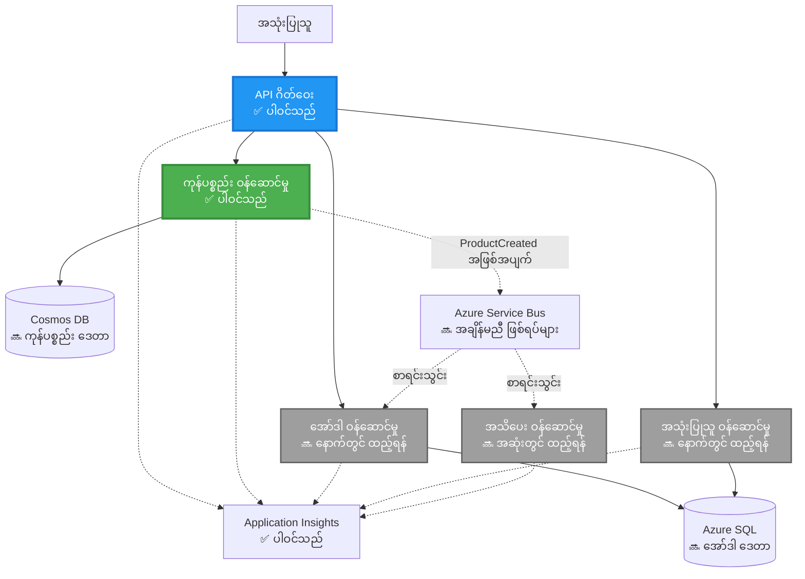
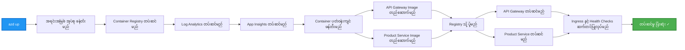
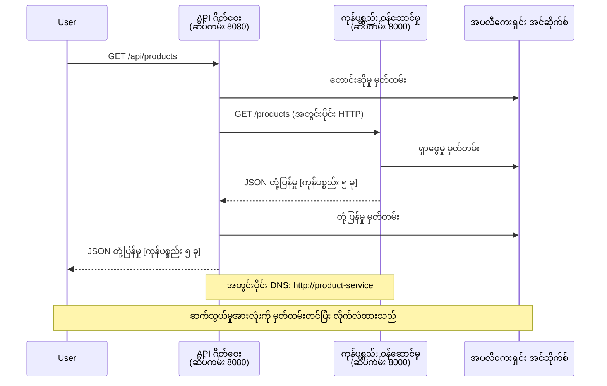

# မိုက်ခရိုဆာဗစ် ဖွဲ့စည်းပုံ - Container App နမူနာ

⏱️ **ခန့်မှန်းချိန်**: 25-35 မိနစ် | 💰 **ခန့်မှန်းကုန်ကျစရိတ်**: ~$50-100/လ | ⭐ **ရှုပ်ထွေးမှု**: အဆင့်မြင့်

**📚 သင်ယူမှု လမ်းကြောင်း:**
- ← ယခင်: [ရိုးရှင်း Flask API](../../../../examples/container-app/simple-flask-api) - တစ်ခုသာပါသော container အခြေခံ
- 🎯 **သင်ရှိရာ**: မိုက်ခရိုဆာဗစ် ဖွဲ့စည်းပုံ (၀န်ဆောင်မှုပေါင်း 2 ဖြင့် အခြေခံ)
- → Next: [AI Integration](../../../../docs/ai-foundry) - သင့် ဝန်ဆောင်မှုများတွင် ပညာရည်စွမ်း ထည့်သွင်းခြင်း
- 🏠 [သင်တန်း မူလစာမျက်နှာ](../../README.md)

---

AZD CLI ကို အသုံးပြု၍ Azure Container Apps သို့ တင်သွင်းထားသော **ရိုးရှင်းသော်လည်း လုပ်ဆောင်နိုင်သော** မိုက်ခရိုဆာဗစ် ဖွဲ့စည်းပုံ ဖြစ်သည်။ ဤ နမူနာသည် ဝန်ဆောင်မှုများအကြား ဆက်သွယ်ရေး၊ ကွန်တိန်နာ စီမံခန့်ခွဲမှုနှင့် စောင့်ကြည့်မှုတို့ကို လက်တွေ့ 2-၀န်ဆောင်မှု စက်တင်ဖြင့် ပြသသည်။

> **📚 သင်ကြားမှု ရည်ရွယ်ချက်**: ဤ နမူနာသည် အနုတ်လက္ခဏာ 2-၀န်ဆောင်မှု ဖွဲ့စည်းပုံ (API Gateway + Backend Service) မှ စတင်ပြီး သင်တန်းအဖြစ် တင်ဆက်နိုင်သည်။ ဤ အခြေခံကို ကျွမ်းကျင်သည်နောက်ပိုင်းတွင် ကျွန်ုပ်တို့သည် ပြည့်စုံသော မိုက်ခရိုဆာဗစ် စနစ်သို့ တိုးချဲ့ရန် လမ်းညွှန်ချက်များ ပေးမည်။

## သင်လေ့လာမည့် အကြောင်းအရာများ

ဤ နမူနာကို ပြီးမြောက်စွာ ပြုလုပ်ခြင်းအားဖြင့် သင်သည်:
- Azure Container Apps သို့ မျိုးစုံသော ကွန်တိန်နာများကို တင်ပို့နိုင်မည်
- အတွင်းပိုင်း ကွန်ယက်ဖြင့် ဝန်ဆောင်မှု-မှ-ဝန်ဆောင်မှု ဆက်သွယ်ရေးကို အကောင်အထည်ဖော်နိုင်မည်
- ပတ်ဝန်းကျင်အပေါ် မူတည်၍ စကေးလ်နှင့် ကျန်းမာရေး စစ်ဆေးမှုများကို သတ်မှတ်နိုင်မည်
- Application Insights ဖြင့် ဖြန့်ဝေထားသည့် အက်ပလီကေးရှင်းများကို စောင့်ကြည့်နိုင်မည်
- မိုက်ခရိုဆာဗစ် တင်သွင်းခြင်း ပုံစံများနှင့် အကောင်းဆုံး လေ့လာနည်းများကို နားလည်မည်
- ရိုးရှင်းမှ ရှုပ်ထွေးသည့် ဖွဲ့စည်းပုံများသို့ တိုးချဲ့သင်ယူနည်းကို သင်ယူမည်

## ဖွဲ့စည်းပုံ

### အဆင့် ၁: ကျွန်ုပ်တို့ တည်ဆောက်မည့် အရာ (ဤ နမူနာတွင် ထည့်ထားသည်)

```mermaid
graph TB
    Internet[အင်တာနက်/အသုံးပြုသူ]
    Gateway[API ဂိတ်ဝေး<br/>Node.js ကွန်တိန်နာ<br/>ဆိပ်ကမ်း 8080]
    Product[ထုတ်ကုန် ဝန်ဆောင်မှု<br/>Python ကွန်တိန်နာ<br/>ဆိပ်ကမ်း 8000]
    AppInsights[အက်ပလီကေးရှင်း အင်ဆိုက်(စ်)<br/>စောင့်ကြည့်မှုနှင့် မှတ်တမ်းများ]
    
    Internet -->|HTTPS| Gateway
    Gateway -->|HTTP အတွင်းပိုင်း| Product
    Gateway -.->|တယ်လီမက်ထရီ| AppInsights
    Product -.->|တယ်လီမက်ထရီ| AppInsights
    
    style Gateway fill:#2196F3,stroke:#1976D2,stroke-width:3px,color:#fff
    style Product fill:#4CAF50,stroke:#388E3C,stroke-width:3px,color:#fff
    style Internet fill:#FF9800,stroke:#F57C00,stroke-width:2px,color:#fff
    style AppInsights fill:#9C27B0,stroke:#7B1FA2,stroke-width:2px,color:#fff
```
**အစိတ်အပိုင်း အသေးစိတ်:**

| Component | Purpose | Access | Resources |
|-----------|---------|--------|-----------|
| **API Gateway** | Routes external requests to backend services | Public (HTTPS) | 1 vCPU, 2GB RAM, 2-20 replicas |
| **Product Service** | Manages product catalog with in-memory data | Internal only | 0.5 vCPU, 1GB RAM, 1-10 replicas |
| **Application Insights** | Centralized logging and distributed tracing | Azure Portal | 1-2 GB/month data ingestion |

**ဘာကြောင့် ရိုးရှင်းစွာ စတင်သင့်သလဲ?**
- ✅ တင်သွင်း၍ အလျင်အမြန် နားလည်နိုင်သည် (25-35 မိနစ်)
- ✅ ရိုးရှင်းစွာ ရှုပ်ထွေးမှုမရှိဘဲ မိုက်ခရိုဆာဗစ် ပုံစံအခြေခံများကို သင်ယူနိုင်သည်
- ✅ ပြင်ဆင်လေ့လာ စမ်းသပ်နိုင်သည့် လုပ်ဆောင်နိုင်သော ကုဒ်
- ✅ သင်ယူရန် ကုန်ကျစရိတ် သက်သာ (လစဉ် ~ $50-100 နှင့် $300-1400/လ ကြား)
- ✅ ဒေတာဘေ့စ်များနှင့် မက်ဆေ့ခ်ျ ကွေ့များ ထည့်သည့်မတိုင်မီ ယုံကြည်မှု တည်ဆောက်နိုင်သည်

**နမူနာ**:  ဤကိစ္စကို ကားမောင်း သင်ယူခြင်းလို ထင်ပါ။ အစမှာ အလယ်ဗလာ ရပ်နားခင်း (၀န်ဆောင်မှု 2) နှင့် စတင်ပြီး အခြေခံများကို ကျွမ်းကျင်ပြီးနောက် မြို့လမ်းယာဉ်များ (၀န်ဆောင်မှု 5+ နှင့် ဒေတာဘေ့စ်များပါ) သို့ တိုးတက်သွားမည်။

### အဆင့် ၂: အနာဂတ် တိုးချဲ့ခြင်း (ကိုးကား ဖွဲ့စည်းပုံ)

Once you master the 2-service architecture, you can expand to:


```mermaid
graph TB
    User[အသုံးပြုသူ]
    Gateway[API ဂိတ်ဝေး<br/>✅ ပါဝင်သည်]
    Product[ကုန်ပစ္စည်း ဝန်ဆောင်မှု<br/>✅ ပါဝင်သည်]
    Order[အော်ဒါ ဝန်ဆောင်မှု<br/>🔜 နောက်တွင် ထည့်ရန်]
    UserSvc[အသုံးပြုသူ ဝန်ဆောင်မှု<br/>🔜 နောက်တွင် ထည့်ရန်]
    Notify[အသိပေး ဝန်ဆောင်မှု<br/>🔜 အဆုံးတွင် ထည့်ရန်]
    
    CosmosDB[(Cosmos DB<br/>🔜 ကုန်ပစ္စည်း ဒေတာ)]
    AzureSQL[(Azure SQL<br/>🔜 အော်ဒါ ဒေတာ)]
    ServiceBus[Azure Service Bus<br/>🔜 အချိန်မညီ ဖြစ်ရပ်များ]
    AppInsights[Application Insights<br/>✅ ပါဝင်သည်]
    
    User --> Gateway
    Gateway --> Product
    Gateway --> Order
    Gateway --> UserSvc
    
    Product --> CosmosDB
    Order --> AzureSQL
    UserSvc --> AzureSQL
    
    Product -.->|ProductCreated အဖြစ်အပျက်| ServiceBus
    ServiceBus -.->|စာရင်းသွင်း| Notify
    ServiceBus -.->|စာရင်းသွင်း| Order
    
    Gateway -.-> AppInsights
    Product -.-> AppInsights
    Order -.-> AppInsights
    UserSvc -.-> AppInsights
    Notify -.-> AppInsights
    
    style Product fill:#4CAF50,stroke:#388E3C,stroke-width:3px,color:#fff
    style Gateway fill:#2196F3,stroke:#1976D2,stroke-width:3px,color:#fff
    style Order fill:#9E9E9E,stroke:#616161,stroke-width:2px,color:#fff
    style UserSvc fill:#9E9E9E,stroke:#616161,stroke-width:2px,color:#fff
    style Notify fill:#9E9E9E,stroke:#616161,stroke-width:2px,color:#fff
```
See "Expansion Guide" section at the end for step-by-step instructions.

## ပါဝင်သည့် လုပ်ဆောင်ချက်များ

✅ **Service Discovery**: ကွန်တိန်နာများအကြား အလိုအလျောက် DNS အခြေပြု ရှာဖွေမှု  
✅ **Load Balancing**: မိတ္တူများအကြား အတွင်းထည့်ထားသော load balancing  
✅ **Auto-scaling**: HTTP တောင်းဆိုမှုများအပေါ် မူတည်၍ ဝန်ဆောင်မှုတစ်ခုစီ အလိုအလျောက် ချဲ့/လျော့မှု  
✅ **Health Monitoring**: လိုင်ဗ်နေစ်နှင့် ရီဒီနက်နစ် ပရိုဘ်များ (liveness and readiness probes)  
✅ **Distributed Logging**: Application Insights ဖြင့် စုစုပေါင်း လော့ဂ်များ  
✅ **Internal Networking**: ၀န်ဆောင်မှု-မှ-၀န်ဆောင်မှု လုံခြုံစိတ်ချစေသော ဆက်သွယ်ရေး  
✅ **Container Orchestration**: အလိုအလျောက် တင်သွင်းခြင်းနှင့် စကေးလ်ချုပ်ခြင်း  
✅ **Zero-Downtime Updates**: revision စီမံခန့်ခွဲမှုဖြင့် Rolling updates (Downtime မရှိ)

## လိုအပ်ချက်များ

### လိုအပ်သော ကိရိယာများ

Before starting, verify you have these tools installed:

1. **[Azure Developer CLI (azd)](https://learn.microsoft.com/azure/developer/azure-developer-cli/install-azd)** (ဗားရှင်း 1.0.0 သို့ နှင့် အထက်)
   ```bash
   azd version
   # မျှော်လင့်ထားသော အထွက်: azd ဗားရှင်း 1.0.0 သို့မဟုတ် ထိုထက်မြင့်မားသော
   ```

2. **[Azure CLI](https://learn.microsoft.com/cli/azure/install-azure-cli)** (ဗားရှင်း 2.50.0 သို့ နှင့် အထက်)
   ```bash
   az --version
   # မျှော်မှန်းထားသော ထွက်ရလဒ်: azure-cli 2.50.0 သို့မဟုတ် အထက်
   ```

3. **[Docker](https://www.docker.com/get-started)** (တည်နေရာတွင် ဖွံ့ဖြိုးရေး/စမ်းသပ်ရန် - ရွေးချယ်စရာ)
   ```bash
   docker --version
   # မျှော်မှန်းရလဒ်: Docker ဗားရှင်း 20.10 သို့မဟုတ် အထက်
   ```

### သင့် စနစ်ကို အတည်ပြုရန်

Run these commands to confirm you're ready:

```bash
# Azure Developer CLI ကို စစ်ဆေးပါ
azd version
# ✅ မျှော်မှန်းချက်: azd ဗားရှင်း 1.0.0 သို့မဟုတ် အထက်

# Azure CLI ကို စစ်ဆေးပါ
az --version
# ✅ မျှော်မှန်းချက်: azure-cli 2.50.0 သို့မဟုတ် အထက်

# Docker ကို စစ်ဆေးပါ (ရွေးချယ်စရာ)
docker --version
# ✅ မျှော်မှန်းချက်: Docker ဗားရှင်း 20.10 သို့မဟုတ် အထက်
```

**အောင်မြင်မှု ချက်ပြတ်ချက်**: All commands return version numbers matching or exceeding minimums.

### Azure လိုအပ်ချက်များ

- တက်ကြွသော **Azure subscription** ([အခမဲ့ အကောင့် ဖန်တီးရန်](https://azure.microsoft.com/free/))
- သင့် subscription တွင် အရင်းအမြစ်များ ဖန်တီးခွင့်
- subscription သို့ resource group ပေါ်တွင် **Contributor** အခန်းကဏ္ဍ

### အသိပညာ လိုအပ်ချက်များ

ဤ နမူနာသည် **အဆင့်မြင့်** ဖြစ်သည်။ သင်တွင် အောက်ပါအရာများ ရှိသင့်သည် -
- [Simple Flask API နမူနာ](../../../../examples/container-app/simple-flask-api) ကို ပြီးမြောက်ထားခြင်း
- မိုက်ခရိုဆာဗစ် ဖွဲ့စည်းပုံ အခြေခံ နားလည်မှု
- REST API များနှင့် HTTP ကို နားလည်မှု
- container အယူအဆများ နားလည်မှု

**Container Apps အသစ်လား?** အခြေခံများ သင်ယူရန် အရင်ဆုံး [Simple Flask API နမူနာ](../../../../examples/container-app/simple-flask-api) ကို စတင်ပါ။

## အမြန် စတင်ခြင်း (ခြေလှမ်းတစ်ဆင့်ချင်း)

### ခြေလှမ်း ၁: Clone လုပ်၍ ဖိုင်များသို့ သွားပါ

```bash
git clone https://github.com/microsoft/AZD-for-beginners.git
cd AZD-for-beginners/examples/microservices
```

**✓ အောင်မြင် စစ်ဆေးချက်**: `azure.yaml` ကို မြင်ရသည်ကို အတည်ပြုပါ:
```bash
ls
# မျှော်မှန်းထားသောအရာများ: README.md, azure.yaml, infra/, src/
```

### ခြေလှမ်း ၂: Azure သို့ အထောက်အထား (authenticate) လုပ်ရန်

```bash
azd auth login
```

This opens your browser for Azure authentication. Sign in with your Azure credentials.

**✓ အောင်မြင် စစ်ဆေးမှု**: သင် အောက်ပါကို မြင်ရမည်:
```
Logged in to Azure.
```

### ခြေလှမ်း ၃: ပတ်ဝန်းကျင် စတင် ပြင်ဆင်ရန်

```bash
azd init
```

**သင့်မြင်ရမည့် မေးခွန်းများ**:
- **ပတ်ဝန်းကျင် အမည်**: အတိုချုပ် အမည်တစ်ခု ထည့်ပါ (ဥပမာ၊ `microservices-dev`)
- **Azure subscription**: သင့် subscription ကို ရွေးချယ်ပါ
- **Azure တည်နေရာ**: ဒေသတစ်ခု ရွေးချယ်ပါ (ဥပမာ၊ `eastus`, `westeurope`)

**✓ အောင်မြင် စစ်ဆေးမှု**: သင် အောက်ပါကို မြင်ရမည်:
```
SUCCESS: New project initialized!
```

### ခြေလှမ်း ၄: အချက်အလက် အခြေခံ အဆောက်အအုံနှင့် ဝန်ဆောင်မှုများ တင်သွင်းရန်

```bash
azd up
```

**ဖြစ်ပေါ်မည့် အရာများ** (8-12 မိနစ်ကြာနိုင်သည်):


```mermaid
graph LR
    A[azd up] --> B[အရင်းအမြစ် အုပ်စု ဖန်တီးမည်]
    B --> C[Container Registry တပ်ဆင်မည်]
    C --> D[Log Analytics တပ်ဆင်မည်]
    D --> E[App Insights တပ်ဆင်မည်]
    E --> F[Container ပတ်ဝန်းကျင် ဖန်တီးမည်]
    F --> G[API Gateway Image တည်ဆောက်မည်]
    F --> H[Product Service Image တည်ဆောက်မည်]
    G --> I[Registry သို့ ပို့မည်]
    H --> I
    I --> J[API Gateway တပ်ဆင်မည်]
    I --> K[Product Service တပ်ဆင်မည်]
    J --> L[Ingress နှင့် Health Checks ဆက်တင်ပြုလုပ်မည်]
    K --> L
    L --> M[တပ်ဆင်မှု ပြီးဆုံး ✓]
    
    style A fill:#2196F3,stroke:#1976D2,stroke-width:3px,color:#fff
    style M fill:#4CAF50,stroke:#388E3C,stroke-width:3px,color:#fff
```
**✓ အောင်မြင် စစ်ဆေးမှု**: သင် အောက်ပါကို မြင်ရမည်။
```
SUCCESS: Your application was deployed to Azure in X minutes Y seconds.
Endpoint: https://api-gateway-<unique-id>.azurecontainerapps.io
```

**⏱️ အချိန်**: 8-12 မိနစ်

### ခြေလှမ်း ၅: တင်သွင်းမှု စမ်းသပ်ရန်

```bash
# ဂိတ်ဝေး၏ endpoint ကို ရယူပါ
GATEWAY_URL=$(azd env get-values | grep API_GATEWAY_URL | cut -d '=' -f2 | tr -d '"')

# API Gateway ၏ အခြေအနေကို စစ်ဆေးပါ
curl $GATEWAY_URL/health
```

**✅ မျှော်မှန်းထားသော ထွက်ရလဒ်:**
```json
{
  "status": "healthy",
  "service": "api-gateway",
  "timestamp": "2025-11-19T10:30:00Z"
}
```

**Gateway မှတဆင့် ထုတ်ကုန် ဝန်ဆောင်မှုကို စမ်းသပ်ပါ**:
```bash
# ထုတ်ကုန်များ စာရင်း
curl $GATEWAY_URL/api/products
```

**✅ မျှော်မှန်းထားသော ထွက်ရလဒ်:**
```json
[
  {"id":1,"name":"Laptop","price":999.99,"stock":50},
  {"id":2,"name":"Mouse","price":29.99,"stock":200},
  {"id":3,"name":"Keyboard","price":79.99,"stock":150}
]
```

**✓ အောင်မြင် စစ်ဆေးမှု**: endpoint နှစ်ခုလုံးမှ မှားယွင်းမှုမရှိဘဲ JSON ဒေတာ ပြန်ပေးရမည်။

---

**🎉 ဂုဏ်ပြုပါတယ်!** သင်သည် Azure သို့ မိုက်ခရိုဆာဗစ် ဖွဲ့စည်းပုံ တင်သွင်းပြီးပါပြီ!

## စီမံကိန်း ဖွဲ့စည်းပုံ

All implementation files are included—this is a complete, working example:

```
microservices/
│
├── README.md                         # This file
├── azure.yaml                        # AZD configuration
├── .gitignore                        # Git ignore patterns
│
├── infra/                           # Infrastructure as Code (Bicep)
│   ├── main.bicep                   # Main orchestration
│   ├── abbreviations.json           # Naming conventions
│   ├── core/                        # Shared infrastructure
│   │   ├── container-apps-environment.bicep  # Container environment + registry
│   │   └── monitor.bicep            # Application Insights + Log Analytics
│   └── app/                         # Service definitions
│       ├── api-gateway.bicep        # API Gateway container app
│       └── product-service.bicep    # Product Service container app
│
└── src/                             # Application source code
    ├── api-gateway/                 # Node.js API Gateway
    │   ├── app.js                   # Express server with routing
    │   ├── package.json             # Node dependencies
    │   └── Dockerfile               # Container definition
    └── product-service/             # Python Product Service
        ├── main.py                  # Flask API with product data
        ├── requirements.txt         # Python dependencies
        └── Dockerfile               # Container definition
```

**အစိတ်အပိုင်း တစ်ခုချင်းစီ အလုပ်လုပ်ပုံ**:

**အခြေခံအဆောက်အအုံ (infra/)**:
- `main.bicep`: Azure ရင်းမြစ်များနှင့် ၎င်းတို့၏ ကိုက်တွယ်မှုများအား အစီအစဉ်တက်စွာ စီမံခန့်ခွဲသည်
- `core/container-apps-environment.bicep`: Container Apps ပတ်ဝန်းကျင်နှင့် Azure Container Registry ကို ဖန်တီးသည်
- `core/monitor.bicep`: ဖြန့်ချိ logging အတွက် Application Insights ကို တပ်ဆင်သည်
- `app/*.bicep`: စကေးလ်နှင့် ကျန်းမာရေး စစ်ဆေးမှုများပါသော တစ်ခုချင်း စ Container App သတ်မှတ်ချက်များ

**API Gateway (src/api-gateway/)**:
- ပြင်ပကို ရှေ့ဆောင်သော ဝန်ဆောင်မှုဖြစ်ပြီး အောက်မြောက် ဝန်ဆောင်မှုများသို့ တောင်းဆိုမှုများကို လမ်းညွှန်ပေးသည်
- logging, အမှားကိုင်တွယ်မှုနှင့် တောင်းဆိုချက် ပေးပို့မှုကို အကောင်အထည်ဖော်သည်
- ဝန်ဆောင်မှု-မှ-ဝန်ဆောင်မှု HTTP ဆက်သွယ်ရေးကို ပြသသည်

**Product Service (src/product-service/)**:
- ထုတ်ကုန် ကတ်တလော့ (in-memory ထည့်သွင်းထား၍ ရိုးရှင်းရန်) ပါရှိသည့် အတွင်းဝန်ဆောင်မှု
- REST API နှင့် ကျန်းမာရေး စစ်ဆေးမှုများပါရှိသည်
- backend မိုက်ခရိုဆာဗစ် ပုံစံ၏ ဥပမာ

## ဝန်ဆောင်မှု အနှစ်ချုပ်

### API Gateway (Node.js/Express)

**Port**: 8080  
**Access**: အများပြည်သူ (ပြင်ပ ဝင်ရောက်မှု)  
**Purpose**: လက်ခံရရှိသော တောင်းဆိုမှုများကို သင့်လျော်သည့် backend ဝန်ဆောင်မှုသို့ လမ်းညွှန်ပေးသည်  

**Endpoints**:
- `GET /` - ဝန်ဆောင်မှု သတင်းအချက်အလက်
- `GET /health` - ကျန်းမာရေး စစ်ဆေးရေး အပြီးသတ်
- `GET /api/products` - Product service သို့ ပြန်ပို့သည် (အားလုံး စာရင်း)
- `GET /api/products/:id` - Product service သို့ ပြန်ပို့သည် (ID အလိုက် ရယူ)

**အဓိက လက္ခဏာများ**:
- axios ဖြင့် တောင်းဆိုမှု လမ်းညွှန်ခြင်း
- စုပေါင်း logging
- အမှားကိုင်တွယ်မှုနှင့် timeout စီမံခန့်ခွဲမှု
- ပတ်ဝန်းကျင် များမှ Service discovery
- Application Insights ပေါင်းစည်းမှု

**Code Highlight** (`src/api-gateway/app.js`):
```javascript
// အတွင်း ဝန်ဆောင်မှုများအကြား ဆက်သွယ်မှု
app.get('/api/products', async (req, res) => {
  const response = await axios.get(`${PRODUCT_SERVICE_URL}/products`, {
    timeout: 5000
  });
  res.json(response.data);
});
```

### Product Service (Python/Flask)

**Port**: 8000  
**Access**: အတွင်းပိုင်းသာ (ပြင်ပ ဝင်ရောက်မရှိ)  
**Purpose**: in-memory ဒေတာဖြင့် ထုတ်ကုန် ကတ်တလော့ကို စီမံထိန်းသိမ်းသည်  

**Endpoints**:
- `GET /` - ဝန်ဆောင်မှု သတင်းအချက်အလက်
- `GET /health` - ကျန်းမာရေး စစ်ဆေးရေး အပြီးသတ်
- `GET /products` - ထုတ်ကုန်အားလုံး ပြထားသည်
- `GET /products/<id>` - ID အရ ထုတ်ကုန် ရယူရန်

**အဓိက လက္ခဏာများ**:
- Flask ဖြင့် RESTful API
- in-memory ထုတ်ကုန် စတိုး (ရိုးရှင်း၊ ဒေတာဘေ့စ် မလိုအပ်)
- probes ဖြင့် ကျန်းမာရေး စောင့်ကြည့်မှု
- ဖွဲ့စည်းထားသော logging
- Application Insights ပေါင်းစည်းမှု

**ဒေတာ မော်ဒယ်**:
```python
{
  "id": 1,
  "name": "Laptop",
  "description": "High-performance laptop",
  "price": 999.99,
  "stock": 50
}
```

**ဘာကြောင့် အတွင်းပိုင်းသာလဲ?**
Product service ကို အများပြည်သူရှေ့ မဖော်ပြထားပါ။ တောင်းဆိုမှုအားလုံးသည် API Gateway ဖြတ်ကျော်ရမည်၊ ၎င်းက ပေးသော အကျိုးကျေးဇူးများမှာ -
- လုံခြုံရေး: ထိန်းချုပ်ထားသော ဝင်ရောက်လမ်း
- ပြောင်းလွယ်ပြင်လွယ်: client မထိခိုက်ဘဲ backend ကို ပြောင်းနိုင်သည်
- စောင့်ကြည့်မှု: တောင်းဆိုမှုများ စုစုပေါင်း လော့ဂ်

## ဝန်ဆောင်မှု ဆက်သွယ်ရေး နားလည်ခြင်း

### ဝန်ဆောင်မှုများ အချင်းချင်း ပြောဆိုပုံ


```mermaid
sequenceDiagram
    participant User
    participant Gateway as API ဂိတ်ဝေး<br/>(ဆိပ်ကမ်း 8080)
    participant Product as ကုန်ပစ္စည်း ဝန်ဆောင်မှု<br/>(ဆိပ်ကမ်း 8000)
    participant AI as အပလီကေးရှင်း အင်ဆိုက်စ်
    
    User->>Gateway: GET /api/products
    Gateway->>AI: တောင်းဆိုမှု မှတ်တမ်း
    Gateway->>Product: GET /products (အတွင်းပိုင်း HTTP)
    Product->>AI: ရှာဖွေမှု မှတ်တမ်း
    Product-->>Gateway: JSON တုံ့ပြန်မှု [ကုန်ပစ္စည်း ၅ ခု]
    Gateway->>AI: တုံ့ပြန်မှု မှတ်တမ်း
    Gateway-->>User: JSON တုံ့ပြန်မှု [ကုန်ပစ္စည်း ၅ ခု]
    
    Note over Gateway,Product: အတွင်းပိုင်း DNS: http://product-service
    Note over User,AI: ဆက်သွယ်မှုအားလုံးကို မှတ်တမ်းတင်ပြီး လိုက်လံထားသည်
```
ဤနမူနာတွင် API Gateway သည် Product Service နှင့် **အတွင်းပိုင်း HTTP ခေါ်ဆိုမှုများ** ဖြင့် ဆက်သွယ်ပါသည်။

```javascript
// API ဂိတ်ဝေး (src/api-gateway/app.js)
const PRODUCT_SERVICE_URL = process.env.PRODUCT_SERVICE_URL;

// အတွင်းပိုင်း HTTP တောင်းဆိုမှု တစ်ခု ပြုလုပ်ပါ
const response = await axios.get(`${PRODUCT_SERVICE_URL}/products`);
```

**အဓိက အချက်များ**:

1. **DNS-အခြေပြု ရှာဖွေမှု**: Container Apps သည် အတွင်းဝန်ဆောင်မှုများအတွက် DNS ကို အလိုအလျောက် ပေးသည်
   - Product Service FQDN: `product-service.internal.<environment>.azurecontainerapps.io`
   - ရိုးရှင်းစွာ: `http://product-service` (Container Apps က ဖြေရှင်းပေးသည်)

2. **ပြည်သူ့ ပြသမှု မရှိ**: Product Service တွင် Bicep အတွင်း `external: false` ရှိသည်
   - Container Apps ပတ်ဝန်းကျင်အတွင်းမှသာ ဝင်ရောက်နိုင်သည်
   - အင်တာနက်မှ မရောက်နိုင်ပါ

3. **ပတ်ဝန်းကျင် အပြောင်းအလဲများ**: Service URL များကို တင်သွင်းချိန်တွင် ထည့်သွင်းသည်
   - Bicep သည် အတွင်း FQDN ကို gateway သို့ ပေးပို့သည်
   - အပလီကေးရှင်းကုဒ်အတွင်း hardcoded URL မရှိပါ

**နမူနာ**: ဤကို ရုံးခန်းများလို ထင်ပါ။ API Gateway သည် ကြိုဆို ဂိမ်းတိုင် (public-facing) ဖြစ်ပြီး Product Service သည် ရုံးခန်း (အတွင်းပိုင်း) ဖြစ်သည်။ ဧည့်သည်များသည် ရုံးခန်းများသို့ သွားရန် ကြိုဆို ဂိမ်းတိုင်မှ ဖြတ်ကာ ရောက်ရမည်။

## တင်သွင်းမှု ရွေးချယ်မှုများ

### ပြည့်စုံ တင်သွင်းခြင်း (အကြံပြု)

```bash
# အခြေခံအဆောက်အအုံးနှင့် ဝန်ဆောင်မှုနှစ်ခုကို ဖြန့်ချိပါ
azd up
```

ဤသည် တင်သွင်းသည်:
1. Container Apps ပတ်ဝန်းကျင်
2. Application Insights
3. Container Registry
4. API Gateway ကွန်တိန်နာ
5. Product Service ကွန်တိန်နာ

**အချိန်**: 8-12 မိနစ်

### တစ်ခုချင်း ဝန်ဆောင်မှု တင်သွင်းခြင်း

```bash
# အစပိုင်း azd up ပြီးနောက် ဝန်ဆောင်မှုတစ်ခုတည်းကိုသာ ထည့်သွင်းပါ
azd deploy api-gateway

# သို့မဟုတ် product ဝန်ဆောင်မှုကို တပ်ဆင်ပါ
azd deploy product-service
```

**အသုံးပြုမှုပုံ**: ဝန်ဆောင်မှု တစ်ခု၏ ကုဒ်ကို ပြင်ဆင်ပြီး သင် သာမန် အဲဒီ ဝန်ဆောင်မှုကို ပြန်တင်ချင်သောအခါ။

### ဖော်ပြချက် ပြင်ဆင်ခြင်း

```bash
# အရွယ်ချဲ့မှုဆိုင်ရာ ပရမီတာများကို ပြင်ဆင်ပါ
azd env set GATEWAY_MAX_REPLICAS 30

# ဖွဲ့စည်းတပ်ဆင်ချက်အသစ်ဖြင့် ထပ်မံတပ်ဆင်ပါ
azd up
```

## ဖော်ပြချက်များ

### စကေးလ် သတ်မှတ်ချက်များ

Both services are configured with HTTP-based autoscaling in their Bicep files:

**API Gateway**:
- Min replicas: 2 (always at least 2 for availability)
- Max replicas: 20
- Scale trigger: 50 concurrent requests per replica

**Product Service**:
- Min replicas: 1 (can scale to zero if needed)
- Max replicas: 10
- Scale trigger: 100 concurrent requests per replica

**စကေးလ်ကို ကိုယ်တိုင်ပြင်ဆင်ရန်** (in `infra/app/*.bicep`):
```bicep
scale: {
  minReplicas: 1
  maxReplicas: 10
  rules: [
    {
      name: 'http-scale-rule'
      http: {
        metadata: {
          concurrentRequests: '100'  // Adjust this
        }
      }
    }
  ]
}
```

### အရင်းအမြစ် ခန့်ဝေမှု

**API Gateway**:
- CPU: 1.0 vCPU
- Memory: 2 GiB
- Reason: ပြင်ပ မှာလာသော လမ်းလာများအားလုံးကို ကိုင်တွယ်ရန်

**Product Service**:
- CPU: 0.5 vCPU
- Memory: 1 GiB
- Reason: in-memory အလုပ်များအတွက် အလေးမရှိသော လုပ်ငန်းများ

### ကျန်းမာရေး စစ်ဆေးမှုများ

Both services include liveness and readiness probes:

```bicep
probes: [
  {
    type: 'Liveness'
    httpGet: {
      path: '/health'
      port: 8080
    }
    initialDelaySeconds: 10
    periodSeconds: 30
  }
  {
    type: 'Readiness'
    httpGet: {
      path: '/health'
      port: 8080
    }
    initialDelaySeconds: 5
    periodSeconds: 10
  }
]
```

**ဤ၏ အဓိပ္ပါယ်**:
- **Liveness**: ကျန်းမာရေး စစ်ဆေးမှု မအောင်မြင်ပါက Container Apps သည် ကွန်တိန်နာကို ပြန်စတင်မည်
- **Readiness**: အသင့်မရှိပါက Container Apps သည် ၎င်း မိတ္တူထံသို့ traffic မပို့တော့ပါ

## စောင့်ကြည့်ခြင်းနှင့် မြင်သာမှု

### ဝန်ဆောင်မှု လော့ဂ်များ ကြည့်ရန်

```bash
# azd monitor ဖြင့် လော့ဂ်များ ကြည့်ပါ
azd monitor --logs

# သို့မဟုတ် သတ်မှတ်ထားသော Container Apps များအတွက် Azure CLI ကို အသုံးပြုပါ:
# API Gateway မှ လော့ဂ်များ စီးဆင်းထုတ်လွှင့်ပါ
az containerapp logs show --name api-gateway --resource-group $RG_NAME --follow

# နောက်ဆုံး ကုန်ပစ္စည်း ဝန်ဆောင်မှု လော့ဂ်များ ကြည့်ပါ
az containerapp logs show --name product-service --resource-group $RG_NAME --tail 100
```

**မျှော်မှန်းထားသော ထွက်ရလဒ်**:
```
[api-gateway] API Gateway listening on port 8080
[api-gateway] Product Service URL: http://product-service
[api-gateway] GET /api/products 200 - 45ms
[product-service] Retrieved 5 products
```

### Application Insights Queries

Azure Portal တွင် Application Insights ကို ဝင်ရောက်ပြီး အောက်ပါ query များကို ပြေးပါ:

**နှေးသော တောင်းဆိုမှုများ ရှာဖွေရန်**:
```kusto
requests
| where timestamp > ago(1h)
| where duration > 1000  // Requests taking >1 second
| summarize count() by name, cloud_RoleName
| order by count_ desc
```

**ဝန်ဆောင်မှု-မှ-ဝန်ဆောင်မှု ခေါ်ဆိုမှုများကို သုံးသပ်ရန်**:
```kusto
dependencies
| where timestamp > ago(1h)
| where type == "Http"
| project timestamp, name, target, duration, success
| order by timestamp desc
```

**ဝန်ဆောင်မှုအလိုက် အမှားနှုန်း**:
```kusto
exceptions
| where timestamp > ago(24h)
| summarize errorCount = count() by cloud_RoleName, type
| order by errorCount desc
```

**တောင်းဆိုမှု ပမာဏ အချိန်အလိုက်**:
```kusto
requests
| where timestamp > ago(1h)
| summarize requestCount = count() by bin(timestamp, 5m), cloud_RoleName
| render timechart
```

### စောင့်ကြည့်ရေး ဒက်ရှ်ဘုတ်ကို ဝင်ရောက်ကြည့်ရန်

```bash
# Application Insights အသေးစိတ်များကို ရယူပါ
azd env get-values | grep APPLICATIONINSIGHTS

# Azure Portal တွင် စောင့်ကြည့်မှုကို ဖွင့်ပါ
az monitor app-insights component show \
  --app $(azd env get-values | grep APPLICATIONINSIGHTS_CONNECTION_STRING | cut -d '=' -f2) \
  --resource-group $(azd env get-values | grep AZURE_RESOURCE_GROUP | cut -d '=' -f2) \
  --query "appId" -o tsv
```

### တိုက်ရိုက် မက်ထရစ်များ

1. Azure Portal တွင် Application Insights သို့ သွားပါ
2. "Live Metrics" ကို နှိပ်ပါ
3. တိုက်ရိုက် တောင်းဆိုမှုများ၊ မအောင်မြင်မှုများနှင့် စွမ်းဆောင်ရည်ကို ကြည့်ရှုနိုင်သည်
4. အောက်ပါ command ကို ပြေးပြီး စမ်းသပ်ပါ: `curl $(azd env get-values | grep API_GATEWAY_URL | cut -d '=' -f2 | tr -d '"')/api/products`

## လက်တွေ့ လေ့ကျင့်ရေးများ

### လေ့ကျင့်မှု ၁: ထုတ်ကုန် အဆုံးတန်း အသစ် ထည့်ရန် ⭐ (လွယ်ကူ)

**ရည်မှန်းချက်**: ထုတ်ကုန်အသစ် ဖန်တီးရန် POST အဆုံးတန်း တစ်ခု ထည့်သွင်းပါ

**စတင်ရာ**: `src/product-service/main.py`

**ခြေလှမ်းများ**:

1. `main.py` တွင် `get_product` function အပြီးတွင် ဤ အဆုံးတန်းကို ထည့်ပါ:
```python
@app.route('/products', methods=['POST'])
def create_product():
    """Create a new product"""
    data = request.get_json()
    
    # လိုအပ်သော အကွက်များကို အတည်ပြုပါ
    if not data or 'name' not in data or 'price' not in data:
        return jsonify({'error': 'Missing required fields: name, price'}), 400
    
    new_id = max(p['id'] for p in products) + 1
    new_product = {
        'id': new_id,
        'name': data['name'],
        'description': data.get('description', ''),
        'price': float(data['price']),
        'stock': int(data.get('stock', 0))
    }
    products.append(new_product)
    logger.info(f"Created product {new_id}")
    return jsonify(new_product), 201
```

2. API Gateway (`src/api-gateway/app.js`) တွင် POST route ကို ထည့်ပါ:
```javascript
// GET /api/products route ရှိပြီးနောက် ဤကို ထည့်ပါ
app.post('/api/products', async (req, res) => {
  try {
    console.log(`Forwarding POST request to ${PRODUCT_SERVICE_URL}/products`);
    const response = await axios.post(`${PRODUCT_SERVICE_URL}/products`, req.body, {
      timeout: 5000
    });
    res.status(201).json(response.data);
  } catch (error) {
    console.error('Error calling product service:', error.message);
    res.status(503).json({
      error: 'Product service unavailable',
      message: error.message
    });
  }
});
```

3. နှစ်ခုလုံးသော ဝန်ဆောင်မှုများကို ပြန်လည်တပ်ဆင်ပါ။

```bash
azd deploy product-service
azd deploy api-gateway
```

4. အသစ်ထည့်ထားသော endpoint ကို စမ်းသပ်ပါ။

```bash
GATEWAY_URL=$(azd env get-values | grep API_GATEWAY_URL | cut -d '=' -f2 | tr -d '"')

# ထုတ်ကုန် အသစ်တစ်ခု ဖန်တီးပါ
curl -X POST $GATEWAY_URL/api/products \
  -H "Content-Type: application/json" \
  -d '{"name":"USB Cable","price":9.99,"stock":500}'
```

**✅ မျှော်မှန်းရသော ထွက်ရှိမှု:**
```json
{"id":6,"name":"USB Cable","description":"","price":9.99,"stock":500}
```

5. စာရင်းတွင် အသစ်တင်ထားသော အရာ ပေါ်လာသည်ကို စစ်ဆေးပါ။

```bash
curl $GATEWAY_URL/api/products
# ယခု USB ကြိုးအသစ်ပါဝင်ပြီး ထုတ်ကုန် ၆ ခု ပြသရမည်။
```

**အောင်မြင်မှု ချက်များ**:
- ✅ POST တောင်းဆိုမှုသည် HTTP 201 ကို ပြန်ပေးရမည်
- ✅ GET /api/products စာရင်းတွင် ကုန်ပစ္စည်းအသစ် ပေါ်ပေါက်ရမည်
- ✅ ကုန်ပစ္စည်းမှာ အလိုအလျောက် တိုးမြှင့်ထားသော ID ရှိရမည်

**အချိန်**: 10-15 မိနစ်

---

### လေ့ကျင့်ခန်း 2: Autoscaling စည်းမျဉ်းများကို ပြင်ဆင်ပါ ⭐⭐ (အလယ်အလတ်)

**ရည်မှန်းချက်**: Product Service အတွက် autoscaling ကို ပိုမိုစိတ်အားထက်သန်စွာ ပြောင်းလဲပါ

**စတင်ရန်နေရာ**: `infra/app/product-service.bicep`

**အဆင့်များ**:

1. `infra/app/product-service.bicep` ကို ဖွင့်ပြီး `scale` block ကို (line 95 အနီး) ရှာပါ။

2. အောက်ပါမှ ပြောင်းပါ:
```bicep
scale: {
  minReplicas: 1
  maxReplicas: 10
  rules: [
    {
      name: 'http-scale-rule'
      http: {
        metadata: {
          concurrentRequests: '100'  // OLD
        }
      }
    }
  ]
}
```

သို့:
```bicep
scale: {
  minReplicas: 2  // Always have 2 running
  maxReplicas: 20  // Allow more scaling
  rules: [
    {
      name: 'http-scale-rule'
      http: {
        metadata: {
          concurrentRequests: '20'  // Scale at lower threshold
        }
      }
    }
  ]
}
```

3. အင်ဖရားစထတာ (infrastructure) ကို ပြန်လည်တင်Deploy လုပ်ပါ။
```bash
azd up
```

4. scaling ပြင်ဆင်ချက်အသစ်ကို စစ်ဆေးပါ။
```bash
az containerapp show \
  --name $(azd env get-values | grep PRODUCT_SERVICE | head -1 | cut -d '/' -f5) \
  --resource-group $(azd env get-values | grep AZURE_RESOURCE_GROUP | cut -d '=' -f2 | tr -d '"') \
  --query "properties.template.scale" -o json
```

**✅ မျှော်မှန်း ထွက်ရှိမှု:**
```json
{
  "minReplicas": 2,
  "maxReplicas": 20,
  "rules": [...]
}
```

5. load ဖြင့် autoscaling ကို စမ်းသပ်ပါ။
```bash
# တစ်ပြိုင်နက်တည်း တောင်းဆိုမှုများ ဖန်တီးပါ
for i in {1..500}; do curl $GATEWAY_URL/api/products & done

# Azure CLI ဖြင့် အတိုင်းအတာ တိုးချဲ့ခြင်း ဖြစ်ပေါ်မှုကို ကြည့်ပါ
az containerapp logs show --name product-service --resource-group $RG_NAME --follow
# ရှာဖွေပါ: Container Apps အတွက် အတိုင်းအတာ တိုးချဲ့မှု ဖြစ်ရပ်များ
```

**အောင်မြင်မှု ချက်များ**:
- ✅ Product Service သည် အနည်းဆုံး replica 2 ခုကို အမြဲတမ်း chạy ရမည်
- ✅ Load ကြီးလာပါက replica 2 ထက် ပိုများသို့ scale ဖြစ်ရမည်
- ✅ Azure Portal တွင် scaling စည်းမျဉ်းအသစ်များ ပြသသင့်သည်

**အချိန်**: 15-20 မိနစ်

---

### လေ့ကျင့်ခန်း 3: Custom Monitoring Query တစ်ခု ထည့်ပါ ⭐⭐ (အလယ်အလတ်)

**ရည်မှန်းချက်**: Product API စွမ်းဆောင်ရည်ကို လေ့လာရန် Application Insights အတွက် custom query တစ်ခု ဖန်တီးပါ

**အဆင့်များ**:

1. Azure Portal တွင် Application Insights သို့ သွားပါ။
   - Go to Azure Portal
   - Find your resource group (rg-microservices-*)
   - Click on Application Insights resource

2. ဘယ်ဘက်မီနူးတွင် "Logs" ကို နှိပ်ပါ

3. ဤ query ကို ဖန်တီးပါ။

```kusto
requests
| where timestamp > ago(1h)
| where name contains "products"
| summarize 
    RequestCount = count(),
    AvgDuration = avg(duration),
    P95Duration = percentile(duration, 95),
    SuccessRate = 100.0 * countif(success == true) / count()
  by bin(timestamp, 5m)
| render timechart
```

4. Query ကို 실행 မလုပ်ရန် "Run" ကို နှိပ်ပါ

5. Query ကို သိမ်းဆည်းပါ။
   - Click "Save"
   - Name: "Product API Performance"
   - Category: "Performance"

6. စမ်းသပ်ရန် traffic ထုတ်လုပ်ပါ။

```bash
for i in {1..100}; do curl $GATEWAY_URL/api/products; sleep 1; done
```

7. အချက်အလက်များ မြင်ရန် query ကို ပြန်လည် refresh လုပ်ပါ

**✅ မျှော်မှန်း ထွက်ရှိမှု:**
- တောင်းဆိုမှု အရေအတွက်များကို အချိန်နှင့်အမျှပြသသော chart
- ပျမ်းမျှ ကြာချိန် < 500ms
- အောင်မြင်နှုန်း = 100%
- 5 မိနစ် အပိုင်းလိုက် အချိန်ခွဲများ

**အောင်မြင်မှု ချက်များ**:
- ✅ Query သည် 100+ တောင်းဆိုမှုများကို ပြသရမည်
- ✅ အောင်မြင်နှုန်းမှာ 100% ဖြစ်ရမည်
- ✅ ပျမ်းမျှ ကြာချိန် < 500ms ဖြစ်ရမည်
- ✅ Chart တွင် 5 မိနစ် အပိုင်းလိုက် အချိန်ခွဲများ ပြသရမည်

**သင်ယူရမည့် အကျိုးအမြတ်**: custom queries ဖြင့် service စွမ်းဆောင်ရည်ကို မျက်မြင်စမ်းသပ်နားလည်နိုင်ခြင်း

**အချိန်**: 10-15 မိနစ်

---

### လေ့ကျင့်ခန်း 4: Retry Logic ကို ထည့်သွင်းပါ ⭐⭐⭐ (ရှေ့ဆောင်)

**ရည်မှန်းချက်**: Product Service အချိန်ပိုင်း မရရှိနိုင်သည့် အချိန်များတွင် API Gateway တွင် retry logic ကို ထည့်ပါ

**စတင်ရာနေရာ**: `src/api-gateway/app.js`

**အဆင့်များ**:

1. retry library ကို install လုပ်ပါ။

```bash
cd src/api-gateway
npm install axios-retry --save
cd ../..
```

2. `src/api-gateway/app.js` ကို update လုပ်ပါ (`axios` import အပြီးတွင် ထည့်ပါ)။
```javascript
const axiosRetry = require('axios-retry');

// ပြန်ကြိုးစားမှု လုပ်နည်းကို ဆက်တင်ပါ
axiosRetry(axios, {
  retries: 3,
  retryDelay: (retryCount) => {
    return retryCount * 1000; // 1 စက္ကန့်, 2 စက္ကန့်, 3 စက္ကန့်
  },
  retryCondition: (error) => {
    // ကွန်ယက် အမှားများ သို့မဟုတ် 5xx တုံ့ပြန်ချက်များတွင် ပြန်ကြိုးစားပါ
    return axiosRetry.isNetworkOrIdempotentRequestError(error) ||
           (error.response && error.response.status >= 500);
  }
});

console.log('Retry logic configured: 3 retries with exponential backoff');
```

3. API Gateway ကို ပြန်လည် redeploy လုပ်ပါ။
```bash
azd deploy api-gateway
```

4. ဝန်ဆောင်မှု ဖျက်ခြင်းကို ဆင်တူစနစ်ဖြင့် ပြုလုပ်ပြီး retry အပြုအမူကို စမ်းသပ်ပါ။
```bash
# ကုန်ပစ္စည်း ဝန်ဆောင်မှုကို 0 အထိ အတိုင်းအတာ ပြောင်းပါ (ချို့ယွင်းမှုကို အတုဖော်ရန်)
az containerapp update \
  --name $(azd env get-values | grep PRODUCT_SERVICE | head -1 | cut -d '/' -f5) \
  --resource-group $(azd env get-values | grep AZURE_RESOURCE_GROUP | cut -d '=' -f2 | tr -d '"') \
  --min-replicas 0 \
  --max-replicas 0

# ထုတ်ကုန်များကို လက်လှမ်းမီရန် ကြိုးစားပါ (မအောင်မြင်လျှင် ၃ ကြိမ် ထပ်ကြိုးစားမည်)
time curl -v $GATEWAY_URL/api/products
# သတိပြုရန်: တုံ့ပြန်ချိန်သည် စုပေါင်း ~၆ စက္ကန့် (၁ စက္ကန့် + ၂ စက္ကန့် + ၃ စက္ကန့် ထပ်မံကြိုးစားမှုများ)

# ကုန်ပစ္စည်း ဝန်ဆောင်မှုကို ပြန်လည်စတင်ပါ
az containerapp update \
  --name $(azd env get-values | grep PRODUCT_SERVICE | head -1 | cut -d '/' -f5) \
  --resource-group $(azd env get-values | grep AZURE_RESOURCE_GROUP | cut -d '=' -f2 | tr -d '"') \
  --min-replicas 1 \
  --max-replicas 10
```

5. retry logs များကို ကြည့်ရှုပါ။
```bash
az containerapp logs show --name api-gateway --resource-group $RG_NAME --tail 50
# ရှာဖွေပါ: ပြန်ကြိုးပမ်းသည့် မက်ဆေ့ခ််များ
```

**✅ မျှော်မှန်း သဘောထား**:
- တောင်းဆိုမှုများသည် မအောင်မြင်မီ 3 ကြိမ် ပြန်ကြိုးစားမည်
- မျိုးဆက်တိုက်သော retry များသည် ပိုရှည်စွာ စောင့်ဆိုင်းမည် (1s, 2s, 3s)
- ဝန်ဆောင်မှု ပြန်စပြီးနောက် တောင်းဆိုမှုများ အောင်မြင်မည်
- Logs တွင် retry ကြိုးစားမှုများ ပြသမည်

**အောင်မြင်မှု ချက်များ**:
- ✅ တောင်းဆိုမှုများသည် မအောင်မြင်မီ 3 ကြိမ် ပြန်ကြိုးစားသည်
- ✅ retry တစ်ခုချင်းစီသည် ပိုရှည်စွာ စောင့်ဆိုင်းခြင်း (exponential backoff)
- ✅ ဝန်ဆောင်မှု ပြန်စပြီးနောက် တောင်းဆိုမှုများ အောင်မြင်သည်
- ✅ Logs တွင် retry ကြိုးစားမှုများ ထင်ရှားသည်

**သင်ယူရမည့် အကျိုးအမြတ်**: microservices တွင် လုံခြုံမှုအကျင့်မျိုးစုံ (circuit breakers, retries, timeouts) ကို နားလည်ရန်

**အချိန်**: 20-25 မိနစ်

---

## အတတ်ပညာ စစ်ဆေးမှု (Knowledge Checkpoint)

ဤဥပမာကို ပြီးမြောက်ပြီးနောက် သင့်နားလည်မှုကို အောက်ပါအတိုင်း အတည်ပြုပါ။

### 1. ဝန်ဆောင်မှုဆက်သွယ်မှု ✓

သင်၏ သိမြင်မှုကို စမ်းသပ်ပါ။
- [ ] API Gateway သည် Product Service ကို ဘယ်လို ရှာတွေ့ပါသလဲ? (DNS-အခြေပြု ဝန်ဆောင်မှု ရှာဖွေခြင်း)
- [ ] Product Service သည် မရရှိဘူးဆိုလျှင် ဘာဖြစ်ပါသလဲ? (Gateway သည် 503 error ကို ပြန်ပေးမည်)
- [ ] တတိယ ဝန်ဆောင်မှုတစ်ခု ထည့်မည်ဆိုလျှင် မည်သို့လုပ်မည်နည်း? (Create new Bicep file, add to main.bicep, create src folder)

Hands-On Verification:
```bash
# ဝန်ဆောင်မှုပျက်ကွက်မှုကို သရုပ်ပြပါ
az containerapp update --name <product-service-name> --min-replicas 0 --max-replicas 0
curl $GATEWAY_URL/api/products
# ✅ မျှော်လင့်ထားသည်: 503 - ဝန်ဆောင်မှု မရနိုင်ပါ

# ဝန်ဆောင်မှုကို ပြန်လည်ထူထောင်ပါ
az containerapp update --name <product-service-name> --min-replicas 1 --max-replicas 10
```

### 2. မော်နတာန့် နှင့် တွေ့မြင်နိုင်မှု ✓

သင်၏ သိမြင်မှုကို စမ်းသပ်ပါ။
- [ ] သင့် distributed logs မည်သည့်နေရာတွင် မြင်ရမည်နည်း? (Application Insights in Azure Portal)
- [ ] နည်းသော တောင်းဆိုမှုများကို မည်သို့ ချိန်မီရှာမည်နည်း? (Kusto query: `requests | where duration > 1000`)
- [ ] အမှားဖြစ်စေသည့် ဝန်ဆောင်မှုကို မည်သို့ ဖော်ထုတ်နိုင်သနည်း? (Check `cloud_RoleName` field in logs)

Hands-On Verification:
```bash
# နောက်ကျသော တောင်းဆိုမှု စမ်းသပ်မှုကို ဖန်တီးပါ
curl "$GATEWAY_URL/api/products?delay=2000"

# Application Insights တွင် နောက်ကျသော တောင်းဆိုမှုများကို မေးမြန်းပါ
# Azure Portal → Application Insights → Logs သို့ သွားပါ
# အောက်ပါကို လည်ပတ်ပါ: requests | where duration > 1000 | project timestamp, name, duration, cloud_RoleName
```

### 3. Scaling & စွမ်းဆောင်ရည် ✓

သင်၏ သိမြင်မှုကို စမ်းသပ်ပါ။
- [ ] autoscaling ကို ဘာက လှုံ့ဆော်သနည်း? (HTTP concurrent request rules: 50 for gateway, 100 for product)
- [ ] ယခုဘယ်နှရပ်ရှိသော replicas များ ပြေးနေပါသနည်း? (Check with `az containerapp revision list`)
- [ ] Product Service ကို 5 replicas သို့ မည်သို့ ပြောင်းမည်နည်း? (Update minReplicas in Bicep)

Hands-On Verification:
```bash
# အလိုအလျောက် တိုးချဲ့မှု (autoscaling) ကို စမ်းသပ်ရန် load ကို ဖန်တီးပါ
for i in {1..1000}; do curl $GATEWAY_URL/api/products & done

# Azure CLI ဖြင့် replicas များ တိုးလာခြင်းကို ကြည့်ပါ
az containerapp logs show --name api-gateway --resource-group $RG_NAME --follow
# ✅ မျှော်လင့်ချက်: logs တွင် အရွယ်အစား တိုးချဲ့ခြင်း ဖြစ်ရပ်များကို မြင်ရမည်
```

**အောင်မြင်မှု ချက်များ**: မေးခွန်းများအားလုံးကို ဖြေရှင်းနိုင်ပြီး hands-on ကွန်မန်းဒ်များဖြင့် အတည်ပြုနိုင်ရမည်။

---

## စျေးနှုန်း ခွဲခြမ်းစိတ်ဖြာမှု

### လစဉ် ခန့်မှန်း ကုန်ကျစရိတ် (ဤ 2-Service ဥပမာအတွက်)

| အရင်းအမြစ် | ဖွဲ့စည်းမှု | ခန့်မှန်း ကုန်ကျစရိတ် |
|----------|--------------|----------------|
| API Gateway | 2-20 replicas, 1 vCPU, 2GB RAM | $30-150 |
| Product Service | 1-10 replicas, 0.5 vCPU, 1GB RAM | $15-75 |
| Container Registry | Basic tier | $5 |
| Application Insights | 1-2 GB/month | $5-10 |
| Log Analytics | 1 GB/month | $3 |
| **စုစုပေါင်း** | | **$58-243/month** |

### အသုံးအနှုန်းအလိုက် ကုန်ကျစရိတ် ခွဲခြမ်းချက်

**အသေးစား traffic** (စမ်းသပ်/လေ့လာခြင်း): ~ $60/လ
- API Gateway: 2 replicas × 24/7 = $30
- Product Service: 1 replica × 24/7 = $15
- Monitoring + Registry = $13

**အလယ်အလတ် traffic** (အသေးစား production): ~ $120/လ
- API Gateway: 5 avg replicas = $75
- Product Service: 3 avg replicas = $45
- Monitoring + Registry = $13

**အများကြီး traffic** (ရှုပ်ထွေးသည့်အချိန်များ): ~ $240/လ
- API Gateway: 15 avg replicas = $225
- Product Service: 8 avg replicas = $120
- Monitoring + Registry = $13

### ကုန်ကျစရိတ် optimize လုပ်ချိတ်ဆက်နည်းများ

1. **Development အတွက် Scale to Zero ကို အသုံးပြုပါ**:
   ```bicep
   scale: {
     minReplicas: 0  // Save $30-40/month when not in use
     maxReplicas: 10
   }
   ```

2. **Cosmos DB အတွက် Consumption Plan ကို အသုံးပြုပါ** (ထည့်သွင်းချိန်တွင်)
   - သင်အသုံးပြုသည့်အတိုင်းသာ ပေးချေမည်
   - အနိမ့်ဆုံးအမှုမရှိပါ

3. **Application Insights Sampling ကို သတ်မှတ်ပါ**:
   ```javascript
   appInsights.defaultClient.config.samplingPercentage = 50; // တောင်းဆိုချက်များ၏ ၅၀% ကို နမူနာယူပါ
   ```

4. **မလိုအပ်သေးသောအချိန်တွင် ဖျက်ပစ်ပါ**:
   ```bash
   azd down --force --purge
   ```

### အခမဲ့ အကောင့် ရွေးချယ်စရာများ

လေ့လာစမ်းသပ်ရန်:
- ✅ Azure free credits ကို အသုံးပြုပါ ($200 ပထမ 30 ရက်အတွက် အကောင့်အသစ်များအတွက်)
- ✅ replicas အနည်းဆုံးထားပါ (ကုန်ကျစရိတ် ~50% ချွတ်နိုင်သည်)
- ✅ စမ်းသပ်ပြီးနောက် ဖျက်ပစ်ပါ (မရှိတော့သောကြာချိန်များအတွက်)
- ✅ သင်ယူခြင်းအကြား scale to zero လုပ်ပါ

**ဥပမာ**: ဤဥပမာကို တစ်ရက်လျှင် 2 နာရီ × 30 ရက် ပြေးပါက = ~$5/လ ဖြစ်ပြီး $60/လ အစားဖြစ်သည်

---

## ပြဿနာဖြေရှင်း အတိုချုံး အညွှန်း

### ပြဿနာ: `azd up` သည် "Subscription not found" အမှားဖြင့် မအောင်မြင်ပါ

**ဖြေရှင်းချက်**:
```bash
# ရှင်းလင်းသတ်မှတ်ထားသော subscription ဖြင့် ထပ်မံ လော့ဂ်အင် ဝင်ပါ
az account set --subscription <your-subscription-id>
azd env set AZURE_SUBSCRIPTION_ID <your-subscription-id>
azd up
```

### ပြဿနာ: API Gateway သည် 503 "Product service unavailable" ကို ပြန်ပေးသည်

**ကြုံကြည့်မှု ဆောင်ရွက်ရန်**:
```bash
# Azure CLI ကို အသုံးပြု၍ ကုန်ပစ္စည်း ဝန်ဆောင်မှု၏ မှတ်တမ်းများကို စစ်ဆေးပါ
az containerapp logs show --name product-service --resource-group $RG_NAME --tail 50

# ကုန်ပစ္စည်း ဝန်ဆောင်မှု၏ ကျန်းမာရေးကို စစ်ဆေးပါ
az containerapp show \
  --name $(azd env get-values | grep PRODUCT_SERVICE | head -1 | cut -d '/' -f5) \
  --resource-group $(azd env get-values | grep AZURE_RESOURCE_GROUP | cut -d '=' -f2 | tr -d '"') \
  --query "properties.runningStatus"
```

**ပုံမှန် ဖြစ်စေသော အကြောင်းရင်းများ**:
1. Product service စတင်မရ (Python အမှားများအတွက် logs ကိုစစ်ပါ)
2. Health check မအောင်မြင် ( `/health` endpoint အလုပ်လုပ်သည့်အခြေအနေကို စစ်ပါ)
3. Container image build မအောင်မြင် (registry တွင် image ရှိမရှိ စစ်ဆေးပါ)

### ပြဿနာ: Autoscaling မအလုပ်လုပ်ပါ

**ကြုံကြည့်မှု ဆောင်ရွက်ရန်**:
```bash
# လက်ရှိ replica အရေအတွက်ကို စစ်ဆေးပါ
az containerapp revision list \
  --name $(azd env get-values | grep API_GATEWAY | head -1 | cut -d '/' -f5) \
  --resource-group $(azd env get-values | grep AZURE_RESOURCE_GROUP | cut -d '=' -f2 | tr -d '"') \
  --query "[].properties.replicas"

# စမ်းသပ်ရန် ဖိအား (load) ကို ဖန်တီးပါ
for i in {1..1000}; do curl $GATEWAY_URL/api/products & done

# Azure CLI ကို အသုံးပြုပြီး scaling ဖြစ်ရပ်များကို စောင့်ကြည့်ပါ
az containerapp logs show --name api-gateway --resource-group $RG_NAME --follow | grep -i scale
```

**ပုံမှန် ဖြစ်စေသော အကြောင်းရင်းများ**:
1. Scale rule ကို ရှိစေရန် လိုအပ်သည့် load မလုံလောက် (HTTP concurrent requests >50 လိုအပ်သည်)
2. မက်စ်မီမ် replicas ရောက်ရှိပြီးသား (Bicep configuration ကိုစစ်ပါ)
3. Bicep ထဲက scale rule မမှန် (concurrentRequests အတန်ကို စစ်ပါ)

### ပြဿနာ: Application Insights တွင် logs မပေါ်ပါ

**ကြုံကြည့်မှု ဆောင်ရွက်ရန်**:
```bash
# connection string ကို သတ်မှတ်ထားပြီးကြောင်း အတည်ပြုပါ
azd env get-values | grep APPLICATIONINSIGHTS

# ဝန်ဆောင်မှုများက telemetry ပို့နေခြင်းရှိမရှိ စစ်ဆေးပါ
az monitor app-insights component show \
  --app $(azd env get-values | grep APPLICATIONINSIGHTS_NAME | cut -d '=' -f2 | tr -d '"') \
  --resource-group $(azd env get-values | grep AZURE_RESOURCE_GROUP | cut -d '=' -f2 | tr -d '"') \
  --query "properties.InstrumentationKey"
```

**ပုံမှန် ဖြစ်စေသော အကြောင်းရင်းများ**:
1. Connection string ကို container သို့ ပို့မထား (environment variables စစ်ပါ)
2. Application Insights SDK မသတ်မှတ်ထား (code တွင် imports များကို စစ်ပါ)
3. Firewall က telemetry ကို တားဆီးထား (နည်းပါးသည့်ဖြစ်ရပ်၊ network rules စစ်ပါ)

### ပြဿနာ: Docker build ကို local တွင် မအောင်မြင်ပါ

**ကြုံကြည့်မှု ဆောင်ရွက်ရန်**:
```bash
# API Gateway ဆောက်လုပ်မှုကို စမ်းသပ်ခြင်း
cd src/api-gateway
docker build -t test-gateway .

# ကုန်ပစ္စည်း ဝန်ဆောင်မှု ဆောက်လုပ်မှုကို စမ်းသပ်ခြင်း
cd ../product-service
docker build -t test-product .
```

**ပုံမှန် ဖြစ်စေသော အကြောင်းရင်းများ**:
1. package.json/requirements.txt အတွင်း dependencies မရှိ
2. Dockerfile သဒ္ဓါနပိုင်း syntax အမှား
3. dependencies ဒေါင်းလုပ်လုပ်စဉ် network ပြဿနာ

**ထပ်မံ မဖြေရှင်းနိုင်သေးပါသလား?** [Common Issues Guide](../../docs/chapter-07-troubleshooting/common-issues.md) ကို သို့မဟုတ် [Azure Container Apps Troubleshooting](https://learn.microsoft.com/azure/container-apps/troubleshooting) ကို ကြည့်ပါ

---

## ဖျက်ပစ်ခြင်း (Cleanup)

အသက်ရှင်နေဆဲ စနစ်ကြေးများ ဖြစ်တတ်ခြင်းကို ရှောင်ရှားရန် အရင်းအမြစ်အားလုံးကို ဖျက်ပါ။

```bash
azd down --force --purge
```

**အတည်ပြုခြင်း အချက်ခံ**:
```
? Total resources to delete: 6, are you sure you want to continue? (y/N)
```

`y` ကို ထည့်၍ အတည်ပြုပါ။

**ဘာတွေ ဖျက်ပစ်မည်နည်း**:
- Container Apps Environment
- Container Apps နှစ်ခုလုံး (gateway & product service)
- Container Registry
- Application Insights
- Log Analytics Workspace
- Resource Group

**✓ ဖျက်ပစ်ခြင်း အတည်ပြုချက်**:
```bash
az group list --query "[?starts_with(name,'rg-microservices')]" --output table
```

အာမခံရမည်: အလွတ် ပြန်လာရမည်။

---

## တိုးချဲ့ရေးလမ်းညွှန်: 2 services မှ 5+ services သို့

ဤ 2-service architecture ကို ကျွမ်းကျင်လာပါက ဖော်ပြပါအတိုင်း တိုးချဲ့နိုင်ပါသည်။

### အဆင့် 1: Database Persistence ထည့်ခြင်း (နောက်တစ်ဆင့်)

**Product Service အတွက် Cosmos DB ထည့်ရန်**:

1. `infra/core/cosmos.bicep` ဖိုင်ကို ဖန်တီးပါ။
   ```bicep
   resource cosmosAccount 'Microsoft.DocumentDB/databaseAccounts@2023-04-15' = {
     name: name
     location: location
     kind: 'GlobalDocumentDB'
     properties: {
       databaseAccountOfferType: 'Standard'
       consistencyPolicy: { defaultConsistencyLevel: 'Session' }
       locations: [{ locationName: location, failoverPriority: 0 }]
     }
   }
   ```

2. Product service ကို in-memory data အစား Azure Cosmos DB Python SDK အသုံးပြုရန် update လုပ်ပါ

3. ခန့်မှန်း ထပ်မံ ကုန်ကျစရိတ်: ~ $25/လ (serverless)

### အဆင့် 2: တတိယ ဝန်ဆောင်မှု ထည့်ခြင်း (Order Management)

**Order Service ဖန်တီးခြင်း**:

1. ဖိုလ်ဒါ အသစ်: `src/order-service/` (Python/Node.js/C#)
2. Bicep အသစ်: `infra/app/order-service.bicep`
3. API Gateway ကို `/api/orders` သို့ မောင်းကြည့်ရန် update လုပ်ပါ
4. Order persistence အတွက် Azure SQL Database ထည့်ပါ

**Architecture သည် အောက်ပါအဖြစ် ဖြစ်လာမည်**:
```
API Gateway → Product Service (Cosmos DB)
           → Order Service (Azure SQL)
```

### အဆင့် 3: အဆက်အသွယ် အချိန်နှင့် တပြိုင်နက် (Service Bus) ထည့်ခြင်း

**Event-Driven Architecture ကို အကောင်အထည်ဖော်ခြင်း**:

1. Azure Service Bus ထည့်ပါ: `infra/core/servicebus.bicep`
2. Product Service သည် "ProductCreated" events ကို publish လုပ်မည်
3. Order Service သည် product events များ subscribe လုပ်မည်
4. Notification Service တစ်ခု ထည့်၍ events များကို 처리 မည်

**ပုံစံ**: Request/Response (HTTP) + Event-Driven (Service Bus)

### အဆင့် 4: အသုံးပြုသူ authentication ထည့်ခြင်း

**User Service ကို အကောင်အထည်ဖော်ပါ**:

1. `src/user-service/` (Go/Node.js) ဖန်တီးပါ
2. Azure AD B2C သို့မဟုတ် custom JWT authentication ထည့်ပါ
3. API Gateway သည် token များကို route မတိုင်မီ စစ်ဆေးမည်
4. Services များသည် user permissions များကို စစ်မည်

### အဆင့် 5: Production ပြင်ဆင်မှုများ

**ဤအစိတ်အပိုင်းများကို ထည့်ပါ**:
- ✅ Azure Front Door (global load balancing)
- ✅ Azure Key Vault (secret management)
- ✅ Azure Monitor Workbooks (custom dashboards)
- ✅ CI/CD Pipeline (GitHub Actions)
- ✅ Blue-Green Deployments
- ✅ Managed Identity ကို ဝန်ဆောင်မှုအားလုံးအတွက် အသုံးပြုပါ

**Full Production Architecture ကုန်ကျစရိတ်**: ~ $300-1,400/လ

---

## ပိုမိုလေ့လာရန်

### ဆက်စပ်စာတမ်းများ
- [Azure Container Apps Documentation](https://learn.microsoft.com/azure/container-apps/)
- [Microservices Architecture Guide](https://learn.microsoft.com/azure/architecture/guide/architecture-styles/microservices)
- [Application Insights for Distributed Tracing](https://learn.microsoft.com/azure/azure-monitor/app/distributed-tracing)
- [Azure Developer CLI Documentation](https://learn.microsoft.com/azure/developer/azure-developer-cli/)

### သင်ယူမှုလမ်းကြောင်း (Next Steps)
- ← ယခင်: [Simple Flask API](../../../../examples/container-app/simple-flask-api) - Beginner single-container ဥပမာ
- → အောက်တစ်ချက်: [AI Integration Guide](../../../../docs/ai-foundry) - AI ချိတ်ဆက်မှု ထည့်သွင်းခြင်း
- 🏠 [Course Home](../../README.md)

### နှိုင်းယှဉ်ချက်: ဘယ်အခါ ဘာကို အသုံးပြုသင့်သလဲ

| အင်္ဂါရပ် | တစ်ခွက် Container | Microservices (ဤဥပမာ) | Kubernetes (AKS) |
|---------|-----------------|---------------------|------------------|
| Use Case | Simple apps | Complex apps | Enterprise apps |
| Scalability | Single service | Per-service scaling | Maximum flexibility |
| Complexity | Low | Medium | High |
| Team Size | 1-3 developers | 3-10 developers | 10+ developers |
| Cost | ~$15-50/month | ~$60-250/month | ~$150-500/month |
| Deployment Time | 5-10 minutes | 8-12 minutes | 15-30 minutes |
| **အကောင်းဆုံး** | MVPs၊ နမူနာများ | ထုတ်လုပ်ရေး အက်ပလီကေးရှင်းများ | မျိုးစုံ Cloud နှင့် အဆင့်မြင့် ကွန်ယက်ဆိုင်ရာ |

**အကြံပြုချက်**: Container Apps (ဤဥပမာ) နှင့် စတင်ပါ၊ Kubernetes- အထူး လက္ခဏာများ လိုအပ်လာပါကသာ AKS သို့ ရွှေ့ပါ။

---

## အမြဲမေးလေ့ရှိသောမေးခွန်းများ

**Q: ဘာကြောင့် 5 ကျော်မဟုတ် ပဲ 2 ဆာဗစ်ပဲလဲ?**  
A: သင်ယူမှု အဆင့်ချီတက်မှု။ ရိုးရှင်းသော ဥပမာတစ်ခုဖြင့် အရင်းအမြစ် ဆက်သွယ်မှု၊ မွန်တရင့်၊ စကေးအင်လုပ်ဆောင်မှုများကို အလေ့အကျင့်ပြုပါ။ ပြီးနောက် ပြင်းထန်လှသော ရှုပ်ထွေးမှုကို ထည့်သွင်းပါ။ ဤနေရာတွင် သင်လေ့လာသည့် ပုံစံများသည် 100-ဆာဗစ် အင်ဂျင်နည်းပညာများတွင်လည်း အသုံးဝင်ပါသည်။

**Q: ကျွန်တော်/ကျွန်မ ဖန်တီးပြီး ဆာဗစ်ပိုများ ထည့်နိုင်မလား?**  
A: တကယ်ပါပဲ! အထက်တွင် ဖော်ပြထားသော တိုးချဲ့မှု လမ်းညွှန်ကို လိုက်နာပါ။ နယူး ဆာဗစ်တိုင်းသည် အတူတူပုံစံကို လိုက်နာသည်။ src ဖိုလ်ဒါကို ဖန်တီး၊ Bicep ဖိုင် ဖန်တီး၊ azure.yaml ကို update ထည့်ပြီး deploy လုပ်ပါ။

**Q: ဒါက ထုတ်လုပ်ရေးအဆင်သင့် ဖြစ်ပြီလား?**  
A: အခြေခံအတွက် တည်မြဲသော အုတ်မြစ်ဖြစ်သည်။ ထုတ်လုပ်ရေးအတွက်တော့ managed identity, Key Vault, သက်တမ်းရှည် database များ, CI/CD pipeline, မော်နီတာစနစ် အလင်းပေးချက်များ၊ backup မဟာဗျည်းစဉ်ကို ထပ်မံ ထည့်သင့်ပါသည်။

**Q: Dapr သို့မဟုတ် အခြား service mesh များ မသုံးဘူးလို့?**  
A: သင်ယူရန် ရိုးရှင်းစေချင်တာပါ။ Container Apps ၏ သဘာဝကွန်ယက်စနစ်ကို နားလည်လာပါက state management၊ pub/sub၊ bindings စသည့် အဆင့်မြင့် အမှုများအတွက် Dapr ကို ပေါင်းထည့်နိုင်သည်။

**Q: ဒါကို လိုကယ်တွင် ဘယ်လို debug လုပ်ရမလဲ?**  
A: Docker ဖြင့် ဝန်ဆောင်မှုများကို ဒေသတွင် ထိန်းအုပ်ပါ -  
```bash
cd src/api-gateway
docker build -t local-gateway .
docker run -p 8080:8080 -e PRODUCT_SERVICE_URL=http://localhost:8000 local-gateway
```

**Q: မတူကာ ဘာသာစကားတွေ အသုံးပြုလို့ ရမလား?**  
A: ဟုတ်ပါတယ်! ဤဥပမာတွင် Node.js (gateway) + Python (product service) ကို ပြထားသည်။ C#, Go, Java, Ruby, PHP စသည့် container များတွင် chạy ရသော ဘာသာစကားများကို အ混合 အသုံးပြုနိုင်သည်။

**Q: Azure credit မရှိရင် ဘာလဲ?**  
A: Azure free tier ကို အသုံးပြုပါ (အကောင့်အသစ်များအတွက် ပထမ 30 ရက်တွင် $200 credit ရရှိသည်) သို့မဟုတ် စမ်းသပ်ချိန်အတိုင်း deploy လုပ်ပြီး ချက်ချင်း ဖျက်ပါ။ ဤဥပမာ၏ ကုန်ကျစရိတ် ~\$2/နေ့ ဖြစ်သည်။

**Q: ဒါက Azure Kubernetes Service (AKS) နဲ့ ဘယ်လို ကွဲပြားလဲ?**  
A: Container Apps သည် ပို၍ ရိုးရှင်းသည် (Kubernetes ကို သိနိုင်ရန် မလို) သို့သော် ကျစ်လစ်မှုနည်းသည်။ AKS သည် Kubernetes အပြည့်စုံကို ထိန်းချုပ်ခွင့်ပေးသော်လည်း ကျွမ်းကျင်မှု ပိုမိုလိုအပ်သည်။ Container Apps ဖြင့် စတင်ပြီး လိုအပ်သည့်အခါ AKS သို့ တက်ကြွပါ။

**Q: ရှိပြီးသား Azure ဝန်ဆောင်မှုများနှင့် ပေါင်းစည်း အသုံးပြုနိုင်မလား?**  
A: ဟုတ်ကဲ့! ရှိပြီးသား database များ၊ storage account များ၊ Service Bus စသည့် အရင်းအမြစ်များကို ချိတ်ဆက်နိုင်သည်။ အသစ် ဖန်တီးခြင်းမပြုဘဲ ရှိပြီးသား အရင်းအမြစ်များကို ကိုးကားရန် Bicep ဖိုင်များကို update လုပ်ပါ။

---

> **🎓 သင်ယူမှုပတ်လည်အကျဉ်းချုံး**: သင်သည် automatic scaling၊ internal networking၊ centralized monitoring နှင့် ထုတ်လုပ်ရေးအဆင်သင့် ပုံစံများဖြင့် multi-service architecture တစ်ခုကို deploy လုပ်နိုင်ရန် သင်ယူပြီးဖြစ်သည်။ ဤအခြေခံသည် ရှုပ်ထွေးသော ဖြန့်ချိထားသည့် စနစ်များနှင့် စီးပွားရေး microservices architecture များအတွက် ပြင်ဆင်မှု ဖြစ်စေပါသည်။

**📚 သင်တန်း သွားရောက်ခြင်း:**
- ← ယခင်: [Simple Flask API](../../../../examples/container-app/simple-flask-api)
- → နောက်တစ်ခု: [Database Integration Example](../../../../database-app)
- 🏠 [သင်တန်း မူလစာမျက်နှာ](../../README.md)
- 📖 [Container Apps အကောင်းဆုံး လက်တွေ့ လမ်းညွှန်](../../docs/chapter-04-infrastructure/deployment-guide.md)

---

**✨ ဂုဏ်လစ်ပါတယ်!** သင်သည် microservices ဥပမာကို ပြီးမြောက်စွာ လေ့လာပြီးဖြစ်သည်။ Azure Container Apps ပေါ်တွင် မျှဝေထားသော အက်ပလီကေးရှင်းများကို တည်ဆောက်၊ deploy နှင့် မော်နီတာလုပ်နည်းများကို အခုနားလည်ထားပါပြီ။ AI ဖန်တီးနည်းများ ထည့်လိုပါသလား? [AI Integration Guide](../../../../docs/ai-foundry) ကို ကြည့်ပါ။

---

<!-- CO-OP TRANSLATOR DISCLAIMER START -->
တာဝန်မယူမှု ကြေညာချက်:

ဤစာတမ်းကို AI ဘာသာပြန်ဝန်ဆောင်မှုဖြစ်သည့် Co-op Translator (https://github.com/Azure/co-op-translator) ကို အသုံးပြု၍ ဘာသာပြန်ထားပါသည်။ ကျွန်ုပ်တို့သည် မှန်ကန်မှုအတွက် ကြိုးပမ်းပါသော်လည်း အလိုအလျောက် ဘာသာပြန်ချက်များတွင် အမှားများ သို့မဟုတ် မှန်ကန်မှုနည်းပါးမှုများ ပါဝင်နိုင်ပါသည်။ မူလစာတမ်းကို မူလဘာသာဖြင့် ရှိသည့် မူရင်းအားသာ အတည်ပြုနိုင်သော အရင်းအမြစ်အဖြစ် ထားယူစဉ်းစားရပါမည်။ အရေးကြီးသော အချက်အလက်များအတွက်တော့ လူ့ဘာသာပြန်ကျွမ်းကျင်သူများ အနေဖြင့် ပရော်ဖက်ရှင်နယ် ဘာသာပြန်မှုကို အသုံးပြုရန် အကြံပြုပါသည်။ ဤဘာသာပြန်ချက်ကို အသုံးပြုခြင်းကြောင့် ဖြစ်ပေါ်လာသည့် သဘောမတူမှုများ သို့မဟုတ် ဖော်ပြချက်မှားယွင်းခြင်းများအတွက် ကျွန်ုပ်တို့သည် တာဝန်မယူပါ။
<!-- CO-OP TRANSLATOR DISCLAIMER END -->