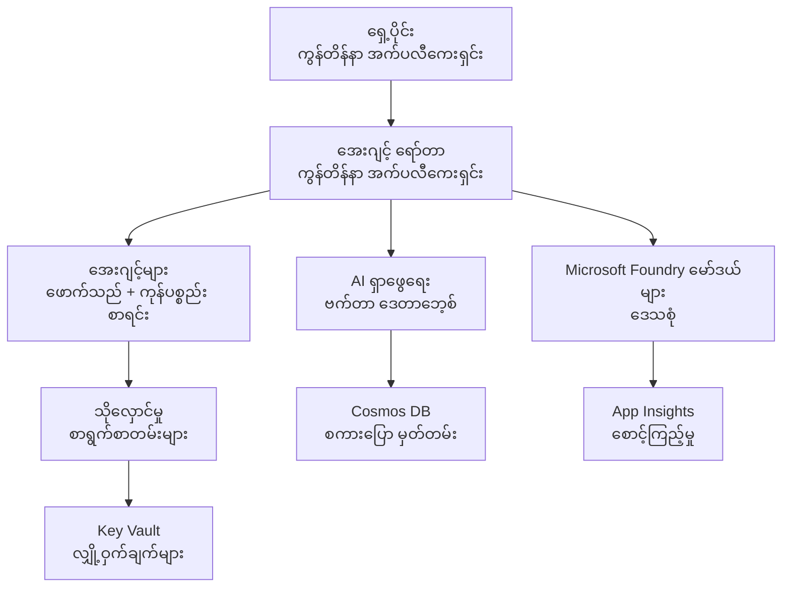

# Retail Multi-Agent Solution - အဆောက်အအုံ နမူနာ

**အခန်း ၅: ထုတ်လုပ်ရေး တပ်ဆင်မှု အထုပ်**
- **📚 သင်တန်း စာမျက်နှာ**: [AZD For Beginners](../../README.md)
- **📖 ဆက်စပ် အခန်း**: [အခန်း ၅: Multi-Agent AI Solutions](../../README.md#-chapter-5-multi-agent-ai-solutions-advanced)
- **📝 ကိစ္စရပ် လမ်းညွှန်**: [ပြည့်စုံသော ဖွဲ့စည်းပုံ](../retail-scenario.md)
- **🎯 အမြန် တပ်ဆင်ခြင်း**: [တစ်ချက်နှိပ် ဖြင့် တပ်ဆင်ခြင်း](#-quick-deployment)

> **⚠️ အဆောက်အအုံ နမူနာသာ ဖြစ်ပါသည်**  
> ဤ ARM template သည် မျိုးစုံ အေးဂျင့် စနစ်အတွက် **Azure အရင်းအမြစ်များ** ကို တပ်ဆင်ပေးပါသည်။  
>  
> **ဘာတွေ တပ်ဆင်ပေးမလဲ (15-25 မိနစ်):**
> - ✅ Microsoft Foundry Models (gpt-4.1, gpt-4.1-mini, embeddings across 3 regions)
> - ✅ AI Search service (empty, ready for index creation)
> - ✅ Container Apps (placeholder images, ready for your code)
> - ✅ Storage, Cosmos DB, Key Vault, Application Insights
>  
> **ဘာတွေ မပါဝင်သေးပါ (ဖွံ့ဖြိုးရေး လိုအပ်သေးသည်):**
> - ❌ Agent implementation code (Customer Agent, Inventory Agent)
> - ❌ Routing logic and API endpoints
> - ❌ Frontend chat UI
> - ❌ Search index schemas and data pipelines
> - ❌ **ခန့်မှန်း ဖွံ့ဖြိုးရေး အလုပ်အကန့်**: 80-120 နာရီ
>  
> **ဤ template ကို သုံးပါက:**
> - ✅ မျိုးစုံ အေးဂျင့် စီမံကိန်းအတွက် Azure အဆောက်အအုံကို အသင့်တင်ပေးလိုပါက
> - ✅ အေးဂျင့် အကောင်အထည်ပြုမှုကို သီးခြား ဖွံ့ဖြိုးရန် ရည်ရွယ်ထားပါက
> - ✅ ထုတ်လုပ်မှု အသင့် အဆောက်အအုံ အခြေခံ စနစ် လိုအပ်ပါက
>  
> **မသုံးသင့်သော အခြေအနေများ:**
> - ❌ ချက်ချင်း လက်တွေ့ အသုံးပြုနိုင်သော မျိုးစုံ အေးဂျင့် demo မလိုချင်ပါက
> - ❌ ပြည့်စုံသော application code ဥပမာများလိုချင်ပါက

## အကျဉ်းချုပ်

ဤ ဖိုလ်ဒါတွင် မျိုးစုံ အေးဂျင့် customer support စနစ်အတွက် အဆောက်အအုံ အခြေခံကို တပ်ဆင်ရန် အသုံးပြုနိုင်သော Azure Resource Manager (ARM) template တစ်ခု ပါဝင်သည်။ Template သည် လိုအပ်သော Azure ဝန်ဆောင်မှုများအားလုံးကို မှန်ကန်စွာ ပြင်ဆင်၍ ဆက်သွယ်ထားပေးသည် — သင့် application ဖွံ့ဖြိုးရေးအတွက် အသင့်ဖြစ်နေပါပြီ။

**တပ်ဆင်ပြီးနောက်၊ သင့်မှာ ရှိမည်:** ထုတ်လုပ်မှု အသင့် Azure အဆောက်အအုံ  
**စနစ်ကို ပြီးမြောက်စေရန် လိုအပ်သည့် အရာများ:** Agent code, frontend UI, နှင့် ဒေတာ ဖွဲ့စည်းပုံ (ကြည့်ရန် [ဖွဲ့စည်းပုံ လမ်းညွှန်](../retail-scenario.md))

## 🎯 ဘာတွေ တပ်ဆင်ပေးမလဲ

### မူလ အဆောက်အအုံ (တပ်ဆင်ပြီးနောက် မျက်နှာဖုံး)

✅ **Microsoft Foundry Models Services** (API ခေါ်ဆိုမှုများအတွက် အသင့်)
  - Primary region: gpt-4.1 deployment (20K TPM capacity)
  - Secondary region: gpt-4.1-mini deployment (10K TPM capacity)
  - Tertiary region: Text embeddings model (30K TPM capacity)
  - Evaluation region: gpt-4.1 grader model (15K TPM capacity)
  - **အခြေအနေ:** လုံးဝ လည်ပတ်နိုင်ပြီး - ချက်ချင်း API ခေါ်ဆိုနိုင်ပါသည်

✅ **Azure AI Search** (ရှင်းလင်း - index ဖန်တီးရန် အသင့်)
  - Vector search စွမ်းရည်များ ဖွင့်ထားသည်
  - Standard tier with 1 partition, 1 replica
  - **အခြေအနေ:** ဝန်ဆောင်မှု လည်ပတ်နေသော်လည်း index ဖန်တီးရန် လိုအပ်သည်
  - **လိုအပ်သော လုပ်ဆောင်ချက်:** သင့် schema ဖြင့် search index ဖန်တီးပါ

✅ **Azure Storage Account** (ရှင်းလင်း - ဖိုင်တင်ရန် အသင့်)
  - Blob containers: `documents`, `uploads`
  - လုံခြုံစိတ်ချသော configuration (HTTPS-only, အများသုံး ဝင်ရောက်ခြင်းမရှိ)
  - **အခြေအနေ:** ဖိုင်များ ရယူရန် အသင့်ဖြစ်သည်
  - **လိုအပ်သော လုပ်ဆောင်ချက်:** သင့် ထုတ်ကုန် ဒေတာနှင့် စာရွက်စာတမ်းများ upload ပြုလုပ်ပါ

⚠️ **Container Apps Environment** (Placeholder images တပ်ဆင်ထားသည်)
  - Agent router app (nginx default image)
  - Frontend app (nginx default image)
  - Auto-scaling configured (0-10 instances)
  - **အခြေအနေ:** Placeholder containers များ လည်ပတ်နေသည်
  - **လိုအပ်သော လုပ်ဆောင်ချက်:** သင့် agent applications များကို build နှင့် deploy ပြုလုပ်ရန်

✅ **Azure Cosmos DB** (ရှင်းလင်း - ဒေတာ ထည့်ရန် အသင့်)
  - Database နှင့် container များ ကြိုတင် ပြင်ဆင်ထားသည်
  - အနည်းဆုံး ထိတွေ့နှုန်း အတွက် optimize ပြုထားသည်
  - TTL အနေနဲ့ အလိုအလျောက် ဖျက်ချင်မှုများ ဖွင့်ထားသည်
  - **အခြေအနေ:** chat history သိမ်းဆည်းရန် အသင့်ဖြစ်သည်

✅ **Azure Key Vault** (Optional - secret များ သိမ်းရန် အသင့်)
  - Soft delete ဖွင့်ထားသည်
  - RBAC ကို managed identities တွေလုပ်ပိုင်ခွင့် အရ လုပ်ထားသည်
  - **အခြေအနေ:** API keys နှင့် connection strings သိမ်းဆည်းရန် အသင့်ဖြစ်သည်

✅ **Application Insights** (Optional - မော်နီတာလုပ်ငန်း ဖွင့်ထား)
  - Log Analytics workspace နှင့် ချိတ်ဆက်ထားသည်
  - အထူး metrics နှင့် alerts များ ပြင်ဆင်ထားသည်
  - **အခြေအနေ:** သင့် apps အတွက် telemetry ရယူရန် အသင့်ဖြစ်သည်

✅ **Document Intelligence** (API ခေါ်ဆိုမှုများအတွက် အသင့်)
  - S0 tier ကို ထုတ်လုပ်မှုလုပ်ငန်းအတွက် သတ်မှတ်ထားသည်
  - **အခြေအနေ:** တင်ထားသော စာရွက်စာတမ်းများကို ဖြန့်ချပေးနိုင်သည်

✅ **Bing Search API** (API ခေါ်ဆိုမှုများအတွက် အသင့်)
  - S1 tier ကို real-time searches အတွက် သတ်မှတ်ထားသည်
  - **အခြေအနေ:** web search queries များအတွက် အသင့်ဖြစ်သည်

### တပ်ဆင်ခြင်း မော်ဒ်များ

| Mode | OpenAI Capacity | Container Instances | Search Tier | Storage Redundancy | Best For |
|------|-----------------|---------------------|-------------|-------------------|----------|
| **Minimal** | 10K-20K TPM | 0-2 replicas | Basic | LRS (Local) | Dev/test, learning, proof-of-concept |
| **Standard** | 30K-60K TPM | 2-5 replicas | Standard | ZRS (Zone) | Production, moderate traffic (<10K users) |
| **Premium** | 80K-150K TPM | 5-10 replicas, zone-redundant | Premium | GRS (Geo) | Enterprise, high traffic (>10K users), 99.99% SLA |

**ကုန်ကျစရိတ် အကျိုးသက်ရောက်မှု:**
- **Minimal → Standard:** ~4x ကုန်ကျစရိတ် တိုးလာသည် ($100-370/mo → $420-1,450/mo)
- **Standard → Premium:** ~3x ကုန်ကျစရိတ် တိုးလာသည် ($420-1,450/mo → $1,150-3,500/mo)
- **ရွေးချယ်ရန် အချက်များ:** မျှော်မှန်းထားသော ထာဝရ၊ SLA လိုအပ်ချက်များ၊ ဘတ်ဂျက် ကန့်သတ်ချက်များ

**စွမ်းရည် စီမံချက်:**
- **TPM (Tokens Per Minute):** မော်ဒယ် deployment များ စုပေါင်း၏ တစ်မိနစ်လျှင် token အရေအတွက်
- **Container Instances:** Auto-scaling ကျပ်သတ် (min-max replicas)
- **Search Tier:** query performance နှင့် index အရွယ်အစား ကန့်သတ်ချက် များအား သက်ရောက်စေသည်

## 📋 ကြိုတင် လိုအပ်ချက်များ

### လိုအပ်သော ကိရိယာများ
1. **Azure CLI** (version 2.50.0 or higher)
   ```bash
   az --version  # ဗားရှင်းကို စစ်ဆေးပါ
   az login      # အတည်ပြုပါ
   ```

2. **Active Azure subscription** with Owner or Contributor access
   ```bash
   az account show  # စာရင်းသွင်းမှုကို အတည်ပြုပါ
   ```

### လိုအပ်သည့် Azure Quotas

တပ်ဆင်မှု မလုပ်ခင် သင်ရွေးချယ်ထားသော ဒေသများတွင် လုံလောက်သည့် quota များ ရှိကြောင်း စစ်ဆေးပါ။

```bash
# သင့်ဒေသတွင် Microsoft Foundry မော်ဒယ်များ ရရှိနိုင်မှုကို စစ်ဆေးပါ
az cognitiveservices account list-skus \
  --kind OpenAI \
  --location eastus2

# OpenAI ကွိုတာကို စစ်ဆေးပါ (ဥပမာ gpt-4.1 အတွက်)
az cognitiveservices usage list \
  --location eastus2 \
  --query "[?name.value=='OpenAI.Standard.gpt-4.1']"

# Container Apps ကွိုတာကို စစ်ဆေးပါ
az provider show \
  --namespace Microsoft.App \
  --query "resourceTypes[?resourceType=='managedEnvironments'].locations"
```

**အနည်းဆုံး လိုအပ်သော Quotas:**
- **Microsoft Foundry Models:** ဒေသအလိုက် 3-4 မော်ဒယ် deployment များ
  - gpt-4.1: 20K TPM (Tokens Per Minute)
  - gpt-4.1-mini: 10K TPM
  - text-embedding-ada-002: 30K TPM
  - **မှတ်ချက်:** gpt-4.1 ကို အချို့ဒေသများတွင် စောင့်ဆိုင်းစာရင်းရှိနိုင်သည် - [မော်ဒယ် ရရှိနိုင်မှု](https://learn.microsoft.com/azure/ai-services/openai/concepts/models) ကို စစ်ဆေးပါ
- **Container Apps:** Managed environment + 2-10 container instances
- **AI Search:** Standard tier (Basic သည် vector search အတွက် မလုံလောက်ပါ)
- **Cosmos DB:** Standard provisioned throughput

**Quota မလုံလောက်ပါက:**
1. Azure Portal → Quotas → Request increase သို့သွားပါ
2. သို့မဟုတ် Azure CLI သုံးပါ:
   ```bash
   az support tickets create \
     --ticket-name "OpenAI-Quota-Increase" \
     --severity "minimal" \
     --description "Request quota increase for Microsoft Foundry Models gpt-4.1 in eastus2"
   ```
3. ရရှိနိုင်မှုရှိသည့် အခြားဒေသများကို စဉ်းစားပါ

## 🚀 အမြန် တပ်ဆင်ခြင်း

### ရွေးချယ်စရာ ၁: Azure CLI သုံးခြင်း

```bash
# နမူနာ ဖိုင်များကို clone လုပ်ပါ သို့မဟုတ် ဒေါင်းလုတ် ဆွဲပါ
git clone <repository-url>
cd examples/retail-multiagent-arm-template

# တပ်ဆင်ရေး စကရစ်ပ်ကို ဆောင်ရွက်နိုင်သော ဖိုင်အဖြစ် ပြောင်းပါ
chmod +x deploy.sh

# ပုံမှန် ဆက်တင်များဖြင့် တပ်ဆင်ပါ
./deploy.sh -g myResourceGroup

# အဆင့်မြင့် အင်္ဂါရပ်များနှင့်အတူ ထုတ်လုပ်ရေးအတွက် တပ်ဆင်ပါ
./deploy.sh -g myProdRG -e prod -m premium -l eastus2
```

### ရွေးချယ်စရာ ၂: Azure Portal သုံးခြင်း

[](https://portal.azure.com/#create/Microsoft.Template/uri/https%3A%2F%2Fraw.githubusercontent.com%2Fmicrosoft%2Fazd-for-beginners%2Fmain%2Fexamples%2Fretail-multiagent-arm-template%2Fazuredeploy.json)

### ရွေးချယ်စရာ ၃: Azure CLI ကို တိုက်ရိုက် အသုံးပြုခြင်း

```bash
# ရင်းမြစ်အုပ်စု ဖန်တီးပါ
az group create --name myResourceGroup --location eastus2

# ပုံစံကို ဖြန့်ချိပါ
az deployment group create \
  --resource-group myResourceGroup \
  --template-file azuredeploy.json \
  --parameters azuredeploy.parameters.json
```

## ⏱️ တပ်ဆင်မှု အချိန်ဇယား

### မျှော်လင့်ရမည့် အရာများ

| Phase | Duration | What Happens |
|-------|----------|--------------||
| **Template Validation** | 30-60 seconds | Azure validates ARM template syntax and parameters |
| **Resource Group Setup** | 10-20 seconds | Creates resource group (if needed) |
| **OpenAI Provisioning** | 5-8 minutes | Creates 3-4 OpenAI accounts and deploys models |
| **Container Apps** | 3-5 minutes | Creates environment and deploys placeholder containers |
| **Search & Storage** | 2-4 minutes | Provisions AI Search service and storage accounts |
| **Cosmos DB** | 2-3 minutes | Creates database and configures containers |
| **Monitoring Setup** | 2-3 minutes | Sets up Application Insights and Log Analytics |
| **RBAC Configuration** | 1-2 minutes | Configures managed identities and permissions |
| **Total Deployment** | **15-25 minutes** | Complete infrastructure ready |

**တပ်ဆင်ပြီးနောက်:**
- ✅ **အဆောက်အအုံ အသင့်:** Azure ဝန်ဆောင်မှုများအားလုံး တပ်ဆင်ပြီး လည်ပတ်နေသည်
- ⏱️ **Application ဖွံ့ဖြိုးရေး:** 80-120 နာရီ (သင့်တာဝန်)
- ⏱️ **Index ဖွဲ့စည်းမှု:** 15-30 မိနစ် (သင့် schema လိုအပ်သည်)
- ⏱️ **ဒေတာ တင်ခြင်း:** dataset အရွယ်အစား ပေါ် မူတည်၍ ကြာချိန် မတူပါ
- ⏱️ **စမ်းသပ်ရေးနှင့် အတည်ပြုခြင်း:** 2-4 နာရီ

---

## ✅ တပ်ဆင်မှု အောင်မြင်မှုကို အတည်ပြုခြင်း

### အဆင့် 1: Resource များ တပ်ဆင်ထားမှု စစ်ဆေးပါ (2 မိနစ်)

```bash
# အရင်းအမြစ်အားလုံးကို အောင်မြင်စွာ ဖြန့်ချိထားကြောင်း အတည်ပြုပါ။
az resource list \
  --resource-group myResourceGroup \
  --query "[?provisioningState!='Succeeded'].{Name:name, Status:provisioningState, Type:type}" \
  --output table
```

**မျှော်လင့်ထားချက်:** ရင့်ရှင်းသော ဇယား (all resources show "Succeeded" status)

### အဆင့် 2: Microsoft Foundry Models များ တပ်ဆင်မှု စစ်ဆေးပါ (3 မိနစ်)

```bash
# OpenAI အကောင့်များအားလုံးကို စာရင်းပြပါ
az cognitiveservices account list \
  --resource-group myResourceGroup \
  --query "[?kind=='OpenAI'].{Name:name, Location:location, Status:properties.provisioningState}" \
  --output table

# ပင်မ ဒေသအတွက် မော်ဒယ်တပ်ဆင်မှုများကို စစ်ဆေးပါ
OPENAI_NAME=$(az cognitiveservices account list \
  --resource-group myResourceGroup \
  --query "[?kind=='OpenAI'] | [0].name" -o tsv)

az cognitiveservices account deployment list \
  --name $OPENAI_NAME \
  --resource-group myResourceGroup \
  --output table
```

**မျှော်လင့်ထားချက်:** 
- primary, secondary, tertiary, evaluation region များအတွက် OpenAI accounts 3-4 ခု
- တစ်ခုချင်းစီတွင် 1-2 မော်ဒယ် deployment (gpt-4.1, gpt-4.1-mini, text-embedding-ada-002)

### အဆင့် 3: အဆောက်အအုံ endpoints များ စမ်းသပ်ပါ (5 မိနစ်)

```bash
# Container App အတွက် URL များကို ရယူပါ
az containerapp list \
  --resource-group myResourceGroup \
  --query "[].{Name:name, URL:properties.configuration.ingress.fqdn, Status:properties.runningStatus}" \
  --output table

# router endpoint ကို စမ်းသပ်ပါ (placeholder ပုံမှ ပြန်လည္တုံ့ပြန်မည်)
ROUTER_URL=$(az containerapp show \
  --name retail-router \
  --resource-group myResourceGroup \
  --query "properties.configuration.ingress.fqdn" -o tsv)

echo "Testing: https://$ROUTER_URL"
curl -I https://$ROUTER_URL || echo "Container running (placeholder image - expected)"
```

**မျှော်လင့်ထားချက်:** 
- Container Apps များ "Running" အခြေအနေကို ပြစေပါမည်
- Placeholder nginx မှ HTTP 200 သို့မဟုတ် 404 ပြန်လည်ဖြေဆိုနိုင်ပါသည် (application code မရှိသေး)

### အဆင့် 4: Microsoft Foundry Models API ဝင်ရောက် စစ်ဆေးပါ (3 မိနစ်)

```bash
# OpenAI endpoint နှင့် key ကို ရယူပါ
OPENAI_ENDPOINT=$(az cognitiveservices account show \
  --name $OPENAI_NAME \
  --resource-group myResourceGroup \
  --query "properties.endpoint" -o tsv)

OPENAI_KEY=$(az cognitiveservices account keys list \
  --name $OPENAI_NAME \
  --resource-group myResourceGroup \
  --query "key1" -o tsv)

# gpt-4.1 deployment ကို စမ်းသပ်ပါ
curl "${OPENAI_ENDPOINT}openai/deployments/gpt-4.1/chat/completions?api-version=2024-08-01-preview" \
  -H "Content-Type: application/json" \
  -H "api-key: $OPENAI_KEY" \
  -d '{
    "messages": [{"role": "user", "content": "Say hello"}],
    "max_tokens": 10
  }'
```

**မျှော်လင့်ထားချက်:** JSON response နှင့် chat completion (OpenAI လည်ပတ်နိုင်ကြောင်း အတည်ပြု)

### ဘာတွေ လုပ်ဆောင်နိုင်ပြီ vs ဘာတွေ မလုပ်ဆောင်ရသေးသလဲ

**✅ တပ်ဆင်ပြီး လုပ်ဆောင်နိုင်သေးသည်:**
- Microsoft Foundry Models မော်ဒယ်များ တပ်ဆင်ပြီး API ခေါ်ဆိုမှုများ လက်ခံနိုင်သည်
- AI Search ဝန်ဆောင်မှု လည်ပတ်နေသည် (ရှင်းလင်း - index မရှိသေး)
- Container Apps များ လည်ပတ်နေသည် (placeholder nginx images)
- Storage accounts အသုံးပြုနိုင်ပြီး ဖိုင်များ တင်နိုင်သည်
- Cosmos DB ဒေတာ လုပ်ဆောင်မှုများအတွက် အသင့်ဖြစ်သည်
- Application Insights က အဆောက်အအုံ telemetry စုဆောင်းနေသည်
- Key Vault သည် secret များ သိမ်းဆည်းရန် အသင့်ဖြစ်သည်

**❌ မလုပ်ဆောင်ရသေးသေး (ဖွံ့ဖြိုးရေး လိုအပ်သည်):**
- Agent endpoints (application code မတပ်ဆင်ထား)
- Chat လုပ်ဆောင်ချက် (frontend + backend အကောင်အထည်ဖော်ရန် လိုအပ်)
- Search queries (search index မဖန်တီးထား)
- Document processing pipeline (ဒေတာ မတင်ထား)
- Custom telemetry (application instrumentation လိုအပ်)

**နောက်ဆင့်များ:** သင့် application ကို ဖွံ့ဖြိုး၍ deploy ပြုလုပ်ရန် [Post-Deployment Configuration](#-post-deployment-next-steps) ကို ကြည့်ပါ

---

## ⚙️ ကိုက်ညီစေရန် ရွေးချယ်စရာများ

### Template Parameters

| Parameter | Type | Default | Description |
|-----------|------|---------|-------------|
| `projectName` | string | "retail" | ထို resource name အားလုံး အတွက် prefix |
| `location` | string | Resource group location | Primary deployment region |
| `secondaryLocation` | string | "westus2" | Secondary region for multi-region deployment |
| `tertiaryLocation` | string | "francecentral" | Region for embeddings model |
| `environmentName` | string | "dev" | Environment designation (dev/staging/prod) |
| `deploymentMode` | string | "standard" | Deployment configuration (minimal/standard/premium) |
| `enableMultiRegion` | bool | true | မျိုးစုံ ဒေသများတွင် တပ်ဆင်မှု ဖွင့်ရန် |
| `enableMonitoring` | bool | true | Application Insights နှင့် logging များ ဖွင့်ရန် |
| `enableSecurity` | bool | true | Key Vault နှင့် လုံခြုံရေးအပို ဆောင်ရွက်ချက်များ ဖွင့်ရန် |

### Parameter များ ကို ကိုက်ညီစေရန်

Edit `azuredeploy.parameters.json`:

```json
{
  "$schema": "https://schema.management.azure.com/schemas/2019-04-01/deploymentParameters.json#",
  "contentVersion": "1.0.0.0",
  "parameters": {
    "projectName": {
      "value": "mycompany"
    },
    "environmentName": {
      "value": "prod"
    },
    "deploymentMode": {
      "value": "premium"
    },
    "location": {
      "value": "eastus2"
    }
  }
}
```

## 🏗️ ဖွဲ့စည်းပုံ အကျဉ်းချုပ်


## 📖 Deployment Script အသုံးပြုနည်း

`deploy.sh` script သည် အပြန်အလှန် မေးမြန်းနိုင်သည့် deployment အတွေ့အကြုံကို ပေးသည်:

```bash
# အကူအညီပြပါ
./deploy.sh --help

# အခြေခံ ဖြန့်ချိခြင်း
./deploy.sh -g myResourceGroup

# စိတ်ကြိုက် ဆက်တင်များဖြင့် အဆင့်မြင့် ဖြန့်ချိခြင်း
./deploy.sh \
  -g myProductionRG \
  -p companyname \
  -e prod \
  -m premium \
  -l eastus2

# ဖွံ့ဖြိုးရေးအတွက် ဒေသများစုံမပါဘဲ ဖြန့်ချိခြင်း
./deploy.sh \
  -g myDevRG \
  -e dev \
  -m minimal \
  --no-multi-region \
  --no-security
```

### Script ၏ အင်္ဂါရပ်များ

- ✅ **ကြိုတင်လိုအပ်ချက် စစ်ဆေးခြင်း** (Azure CLI, login အခြေအနေ, template ဖိုင်များ)
- ✅ **Resource group စီမံခန့်ခွဲမှု** (မရှိပါက ကြိုတင်ဖန်တီး)
- ✅ **Template ကို validate ပြုလုပ်ခြင်း** deployment မတိုင်မီ
- ✅ **ကြာချိန် မျက်နှာကြည့်ခြင်း** စာသား အရောင်များနှင့်အတူ
- ✅ **Deployment outputs** များ ပြသခြင်း
- ✅ **တပ်ဆင်ပြီးနောက် လမ်းညွှန်များ**

## 📊 တပ်ဆင်မှု မော်နီတာရန်

### တပ်ဆင်မှု အခြေအနေ စစ်ဆေးရန်

```bash
# deployment များကို စာရင်းပြပါ
az deployment group list --resource-group myResourceGroup --output table

# deployment အသေးစိတ်ကို ရယူပါ
az deployment group show \
  --resource-group myResourceGroup \
  --name retail-deployment-YYYYMMDD-HHMMSS

# deployment တိုးတက်မှုကို ကြည့်ရှုပါ
az deployment group create \
  --resource-group myResourceGroup \
  --template-file azuredeploy.json \
  --parameters azuredeploy.parameters.json \
  --verbose
```

### တပ်ဆင်ပြီးနောက် ထုတ်ယူနိုင်သည့် Outputs

တပ်ဆင်မှု အောင်မြင်ပြီးနောက် အောက်ပါ outputs များ ရရှိမည်ဖြစ်သည် -

- **Frontend URL**: ဝက်ဘ် အင်တာဖေ့စ်အတွက် အများသုံး endpoint
- **Router URL**: agent router အတွက် API endpoint
- **OpenAI Endpoints**: Primary နှင့် secondary OpenAI ဝန်ဆောင်မှု endpoints
- **Search Service**: Azure AI Search ဝန်ဆောင်မှုပြီး/endpoint
- **Storage Account**: စာရွက်စာတမ်းများအတွက် storage account အမည်
- **Key Vault**: Key Vault အမည် (ဖွင့်ထားပါက)
- **Application Insights**: မော်နီတာလုပ်ငန်း ဝန်ဆောင်မှု အမည် (ဖွင့်ထားပါက)

## 🔧 တပ်ဆင်ပြီးနောက်: နောက်ဆင့်များ
> **📝 အရေးကြီး:** အခြေခံအဆောက်အအုံကို တပ်ဆင်ပြီးသား ဖြစ်ပါသည်၊ သို့သော် သင်သည် အက်ပလီကေးရှင်း ကုဒ်ကို ဖန်တီး၍ ဖြန့်ချိရမည်။

### အဆင့် ၁: Agent အက်ပလီကေးရှင်းများ ဖွံ့ဖြိုးရေး (သင်၏ တာဝန်)

The ARM template creates **ဗလာ Container Apps** with placeholder nginx images. သင်သည် အောက်ပါအချက်များကို လုပ်ဆောင်ရမည်။

**လိုအပ်သော ဖွံ့ဖြိုးမှု:**
1. **Agent အကောင်အထည်ဖော်ခြင်း** (30-40 နာရီ)
   - ဖောက်သည်ဝန်ဆောင်မှု အေဂျင့် (gpt-4.1 နှင့် ပေါင်းစည်းထား)
   - ကုန်ပစ္စည်းစာရင်း အေဂျင့် (gpt-4.1-mini နှင့် ပေါင်းစည်းထား)
   - အေဂျင့် များသို့ လမ်းကြောင်းပေးသည့် လိုဂစ်

2. **Frontend ဖွံ့ဖြိုးရေး** (20-30 နာရီ)
   - Chat အင်တာဖေ့စ် UI (React/Vue/Angular)
   - ဖိုင်တင်ခြင်း လုပ်ဆောင်ချက်
   - တုံ့ပြန်ချက် ဖော်ပြပုံနှင့် ဖော်မက်တင်း

3. **Backend ဝန်ဆောင်မှုများ** (12-16 နာရီ)
   - FastAPI သို့မဟုတ် Express router
   - အထောက်အထား အတည်ပြုရေး middleware
   - Telemetry ပေါင်းစည်းခြင်း

**ကြည့်ရန်:** [တည်ဆောက်ပုံ လမ်းညွှန်](../retail-scenario.md) — အသေးစိတ် အကောင်အထည်ဖော်နည်းပုံများနှင့် ကုဒ် ဥပမာများအတွက်

### အဆင့် ၂: AI Search Index ကို သတ်မှတ်ခြင်း (15-30 မိနစ်)

သင်၏ ဒေတာမော်ဒယ်နှင့် ကိုက်ညီသော search index တစ်ခု ဖန်တီးပါ။

```bash
# ရှာဖွေရေး ဝန်ဆောင်မှု အသေးစိတ်ကို ရယူပါ
SEARCH_NAME=$(az search service list \
  --resource-group myResourceGroup \
  --query "[0].name" -o tsv)

SEARCH_KEY=$(az search admin-key show \
  --service-name $SEARCH_NAME \
  --resource-group myResourceGroup \
  --query "primaryKey" -o tsv)

# သင့် schema ဖြင့် index တစ်ခုဖန်တီးပါ (ဥပမာ)
curl -X POST "https://${SEARCH_NAME}.search.windows.net/indexes?api-version=2023-11-01" \
  -H "Content-Type: application/json" \
  -H "api-key: ${SEARCH_KEY}" \
  -d '{
    "name": "products",
    "fields": [
      {"name": "id", "type": "Edm.String", "key": true},
      {"name": "title", "type": "Edm.String", "searchable": true},
      {"name": "content", "type": "Edm.String", "searchable": true},
      {"name": "category", "type": "Edm.String", "filterable": true},
      {"name": "content_vector", "type": "Collection(Edm.Single)", 
       "searchable": true, "dimensions": 1536, "vectorSearchProfile": "default"}
    ],
    "vectorSearch": {
      "algorithms": [{"name": "default", "kind": "hnsw"}],
      "profiles": [{"name": "default", "algorithm": "default"}]
    }
  }'
```

**အရင်းအမြစ်များ:**
- [AI Search Index Schema Design](https://learn.microsoft.com/azure/search/search-what-is-an-index)
- [Vector Search Configuration](https://learn.microsoft.com/azure/search/vector-search-how-to-create-index)

### အဆင့် ၃: သင့်ဒေတာကို အတင်ပို့ခြင်း (အချိန် ကွာခြားနိုင်သည်)

တစ်ကြောင်းကို product data နဲ့ စာရွက်စာတမ်းများ ရရှိလာတာနဲ့အမျှ။

```bash
# သိုလှောင်မှု အကောင့် အသေးစိတ် ရယူပါ
STORAGE_NAME=$(az storage account list \
  --resource-group myResourceGroup \
  --query "[0].name" -o tsv)

STORAGE_KEY=$(az storage account keys list \
  --account-name $STORAGE_NAME \
  --resource-group myResourceGroup \
  --query "[0].value" -o tsv)

# သင့်စာရွက်စာတမ်းများကို တင်ပါ
az storage blob upload-batch \
  --destination documents \
  --source /path/to/your/product/docs \
  --account-name $STORAGE_NAME \
  --account-key $STORAGE_KEY

# ဥပမာ: တစ်ဖိုင်တည်းတင်ခြင်း
az storage blob upload \
  --container-name documents \
  --name "product-manual.pdf" \
  --file /path/to/product-manual.pdf \
  --account-name $STORAGE_NAME \
  --account-key $STORAGE_KEY
```

### အဆင့် ၄: သင့်အက်ပလီကေးရှင်းများ ကို တည်ဆောက်၍ ဖြန့်ချိခြင်း (8-12 နာရီ)

သင်၏ agent ကုဒ်များ ဖော်ဆောင်ပြီးနောက်:

```bash
# 1. Azure Container Registry တစ်ခုကို (လိုအပ်ပါက) ဖန်တီးပါ
az acr create \
  --name myregistry \
  --resource-group myResourceGroup \
  --sku Basic

# 2. agent router အီမေ့ချ်ကို တည်ဆောက်၍ push လုပ်ပါ
docker build -t myregistry.azurecr.io/agent-router:v1 /path/to/your/router/code
az acr login --name myregistry
docker push myregistry.azurecr.io/agent-router:v1

# 3. frontend အီမေ့ချ်ကို တည်ဆောက်၍ push လုပ်ပါ
docker build -t myregistry.azurecr.io/frontend:v1 /path/to/your/frontend/code
docker push myregistry.azurecr.io/frontend:v1

# 4. Container Apps ကို သင့် အီမေ့ချ်များဖြင့် အပ်ဒိတ် ပြုလုပ်ပါ
az containerapp update \
  --name retail-router \
  --resource-group myResourceGroup \
  --image myregistry.azurecr.io/agent-router:v1

az containerapp update \
  --name retail-frontend \
  --resource-group myResourceGroup \
  --image myregistry.azurecr.io/frontend:v1

# 5. ပတ်ဝန်းကျင် အပြောင်းအလဲများကို ပြင်ဆင်၍ သတ်မှတ်ပါ
az containerapp update \
  --name retail-router \
  --resource-group myResourceGroup \
  --set-env-vars \
    OPENAI_ENDPOINT=secretref:openai-endpoint \
    OPENAI_KEY=secretref:openai-key \
    SEARCH_ENDPOINT=secretref:search-endpoint \
    SEARCH_KEY=secretref:search-key
```

### အဆင့် ၅: သင့်အက်ပလီကေးရှင်းကို စမ်းသပ်ခြင်း (2-4 နာရီ)

```bash
# သင့်အက်ပလီကေးရှင်း၏ URL ကို ရယူပါ
ROUTER_URL=$(az containerapp show \
  --name retail-router \
  --resource-group myResourceGroup \
  --query "properties.configuration.ingress.fqdn" -o tsv)

# ကုဒ်ကို တင်ပြီးနောက် အေဂျင့် endpoint ကို စမ်းသပ်ပါ
curl -X POST "https://${ROUTER_URL}/chat" \
  -H "Content-Type: application/json" \
  -d '{
    "message": "Hello, I need help with my order",
    "agent": "customer"
  }'

# အက်ပလီကေးရှင်း၏ လော့ဂ်များကို စစ်ဆေးပါ
az containerapp logs show \
  --name retail-router \
  --resource-group myResourceGroup \
  --follow
```

### အကောင်အထည်ဖော်ရန် အရင်းအမြစ်များ

**တည်ဆောက်ပုံနှင့် ဒီဇိုင်း:**
- 📖 [ပြည့်စုံသော တည်ဆောက်ပုံ လမ်းညွှန်](../retail-scenario.md) - အသေးစိတ် အကောင်အထည်ဖော်နည်းပုံများ
- 📖 [Multi-Agent ဒီဇိုင်းပုံစံများ](https://learn.microsoft.com/azure/architecture/ai-ml/guide/multi-agent-systems)

**ကုဒ် ဥပမာများ:**
- 🔗 [Microsoft Foundry Models Chat Sample](https://github.com/Azure-Samples/azure-search-openai-demo) - RAG ပုံစံ
- 🔗 [Semantic Kernel](https://github.com/microsoft/semantic-kernel) - Agent ဖရေမ်ဝုတ် (C#)
- 🔗 [LangChain Azure](https://github.com/langchain-ai/langchain) - Agent စီမံခန့်ခွဲမှု (Python)
- 🔗 [AutoGen](https://github.com/microsoft/autogen) - Multi-agent စကားဝိုင်းများ

**စုစုပေါင်း ခန့်မှန်း အမြန်အစီအစဉ်:**
- အခြေခံအဆောက်အအုံ တပ်ဆင်ခြင်း: 15-25 မိနစ် (✅ ပြီးစီးပြီး)
- အက်ပလီကေးရှင်း ဖွံ့ဖြိုးရေး: 80-120 နာရီ (🔨 သင်၏ အလုပ်)
- စမ်းသပ်မှုနှင့် တိုးတက်အောင်လုပ်ခြင်း: 15-25 နာရီ (🔨 သင်၏ အလုပ်)

## 🛠️ ပြဿနာရှာဖွေရန်

### ပုံမှန် ဖြစ်ပျက်တတ်သော ပြဿနာများ

#### 1. Microsoft Foundry Models Quota Exceeded

```bash
# လက်ရှိ ကွိုတာ အသုံးပြုမှုကို စစ်ဆေးပါ
az cognitiveservices usage list --location eastus2

# ကွိုတာ တိုးမြှင့်ရန် တောင်းဆိုပါ
az support tickets create \
  --ticket-name "OpenAI-Quota-Increase" \
  --severity "minimal" \
  --description "Request quota increase for Microsoft Foundry Models in region X"
```

#### 2. Container Apps Deployment Failed

```bash
# ကွန်တိန်နာ အက်ပ်၏ မှတ်တမ်းများကို စစ်ဆေးပါ
az containerapp logs show \
  --name retail-router \
  --resource-group myResourceGroup \
  --follow

# ကွန်တိန်နာ အက်ပ်ကို ပြန်စတင်ပါ
az containerapp revision restart \
  --name retail-router \
  --resource-group myResourceGroup
```

#### 3. Search Service Initialization

```bash
# ရှာဖွေရေး ဝန်ဆောင်မှု၏ အခြေအနေကို အတည်ပြုပါ
az search service show \
  --name <search-service-name> \
  --resource-group myResourceGroup

# ရှာဖွေရေး ဝန်ဆောင်မှု ဆက်သွယ်နိုင်မှုကို စမ်းသပ်ပါ
curl -X GET "https://<search-service-name>.search.windows.net/indexes?api-version=2023-11-01" \
  -H "api-key: <search-admin-key>"
```

### Deployment အတည်ပြုခြင်း

```bash
# အားလုံးသော အရင်းအမြစ်များ ဖန်တီးပြီးကြောင်း အတည်ပြုပါ
az resource list \
  --resource-group myResourceGroup \
  --output table

# အရင်းအမြစ်များ၏ ကျန်းမာရေးကို စစ်ဆေးပါ
az resource list \
  --resource-group myResourceGroup \
  --query "[?provisioningState!='Succeeded'].{Name:name, Status:provisioningState, Type:type}" \
  --output table
```

## 🔐 လုံခြုံရေးစဉ်းစားချက်များ

### သော့ခန်း စီမံခန့်ခွဲမှု
- အားလုံးသော အမဲဆိတ်များကို Azure Key Vault တွင် သိမ်းဆည်းထားသည် (ဖွင့်ထားပါက)
- Container apps များသည် authentication အတွက် managed identity ကို အသုံးပြုသည်
- Storage accounts များတွင် စိတ်ချရသော မူကိုသတ်မှတ်ချက်များ ရှိသည် (HTTPS ပဲ၊ public blob access မရှိ)

### ကွန်ယက် လုံခြုံရေး
- Container apps များသည် ခွင့်ရလျှင် internal networking ကို အသုံးပြုသည်
- Search service ကို private endpoints ရွေးစရာဖြင့် ထိန်းသိမ်းထားသည်
- Cosmos DB ကို လိုအပ်သည့် permission များသာ သတ်မှတ်ထားသည်

### RBAC ပုံစံ ပြင်ဆင်မှု
```bash
# managed identity အတွက် လိုအပ်သော ခွင့်များ သတ်မှတ်ပေးရန်
az role assignment create \
  --assignee <container-app-managed-identity> \
  --role "Cognitive Services OpenAI User" \
  --scope <openai-resource-id>
```

## 💰 ကုန်ကျစရိတ် လျှော့ချရန် အကြံပြုချက်

### ကုန်ကျစရိတ် ခန့်မှန်းချက်များ (လစဉ်၊ USD)

| အဆင့် | OpenAI | Container Apps | Search | Storage | စုစုပေါင်း ခန့်မှန်း |
|------|--------|----------------|--------|---------|------------|
| နည်းဆုံး | $50-200 | $20-50 | $25-100 | $5-20 | $100-370 |
| ပုံမှန် | $200-800 | $100-300 | $100-300 | $20-50 | $420-1450 |
| ပရီမီယံ | $500-2000 | $300-800 | $300-600 | $50-100 | $1150-3500 |

### ကုန်ကျစရိတ် စောင့်ကြည့်ခြင်း

```bash
# ဘတ်ဂျက်အတွက် သတိပေးချက်များ သတ်မှတ်ပါ
az consumption budget create \
  --account-name <subscription-id> \
  --budget-name "retail-budget" \
  --amount 500 \
  --time-grain Monthly \
  --start-date 2024-01-01 \
  --end-date 2024-12-31
```

## 🔄 အပ်ဒိတ်များနှင့် ထိန်းသိမ်းမှု

### Template အပ်ဒိတ်များ
- ARM template ဖိုင်များကို ဗားရှင်း ထိန်းချုပ်ပါ
- ပြောင်းလဲမှုများကို development ပတ်ဝန်းကျင်တွင် မည်မှီ စမ်းသပ်ပါ
- အပ်ဒိတ်များအတွက် incremental deployment မုဒ်ကို အသုံးပြုပါ

### ရင်းမြစ် အပ်ဒိတ်များ
```bash
# အသစ်သော ပါရာမီတာများဖြင့် အပ်ဒိတ်လုပ်ပါ
az deployment group create \
  --resource-group myResourceGroup \
  --template-file azuredeploy.json \
  --parameters azuredeploy.parameters.json \
  --mode Incremental
```

### မိတ္တူယူခြင်းနှင့် ပြန်လည်ထူထောင်ခြင်း
- Cosmos DB အလိုအလျောက် မိတ္တူယူခြင်း ဖွင့်ထားသည်
- Key Vault soft delete ဖွင့်ထားသည်
- Container app revision များကို rollback အတွက် ထိန်းသိမ်းထားသည်

## 📞 ပံ့ပိုးမှု

- **Template ပြဿနာများ**: [GitHub Issues](https://github.com/microsoft/azd-for-beginners/issues)
- **Azure Support**: [Azure Support Portal](https://portal.azure.com/#blade/Microsoft_Azure_Support/HelpAndSupportBlade)
- **Community**: [Azure AI Discord](https://discord.gg/microsoft-azure)

---

**⚡ မိမိ၏ multi-agent ဖြန့်ချိမှုကို စတင်ရန် ပြင်ဆင်ပြီးပါသလား?**

စတင်ရန်: `./deploy.sh -g myResourceGroup`

---

<!-- CO-OP TRANSLATOR DISCLAIMER START -->
**Disclaimer**:
ဤစာတမ်းကို AI ဘာသာပြန်ဝန်ဆောင်မှု [Co-op Translator](https://github.com/Azure/co-op-translator) ဖြင့် ဘာသာပြန်ထားပါသည်။ ကျွန်ုပ်တို့သည် တိကျမှုကို ကြိုးပမ်းပေမယ့် အလိုအလျောက် ဘာသာပြန်ချက်များတွင် အမှားများ သို့မဟုတ် မှန်ကန်မှုပျက်ပြားမှုများ ပါဝင်နိုင်သည့်အချက်ကို သိရှိထားရပါသည်။ မူလစာတမ်းကို မူလဘာသာစကားဖြင့်သာ တရားဝင် အရင်းအမြစ်အဖြစ် ယူဆသင့်သည်။ အရေးကြီးသော အချက်အလက်များအတွက်တော့ ပရော်ဖက်ရှင်နယ် လူ့ဘာသာပြန်ဆီမှ ဘာသာပြန်ခြင်းကို အကြံပြုပါသည်။ ဤဘာသာပြန်ချက်ကို အသုံးပြုမှုကြောင့် ဖြစ်ပေါ်လာသော နားလည်မှုမှားခြင်းများ သို့မဟုတ် မမှန်ကန်စွာ အဓိပ္ပာယ်ဖွင့်ဖော်ခြင်းများအတွက် ကျွန်ုပ်တို့ တာဝန်မယူပါ။
<!-- CO-OP TRANSLATOR DISCLAIMER END -->