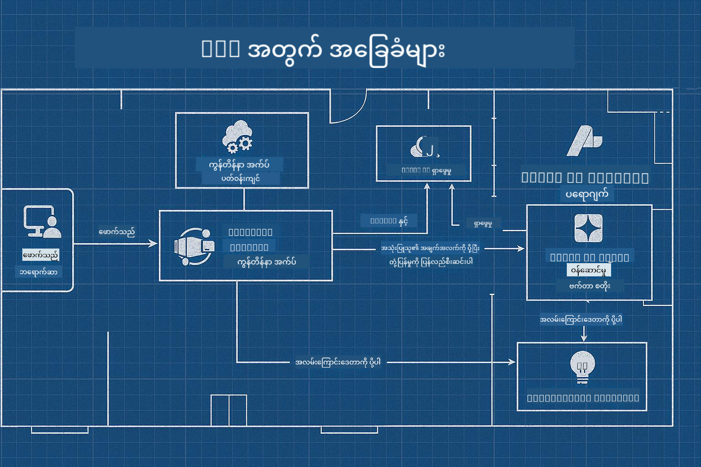

<!--
CO_OP_TRANSLATOR_METADATA:
{
  "original_hash": "245d24997bbcf2bae93bb2a503845d37",
  "translation_date": "2025-09-23T12:08:34+00:00",
  "source_file": "workshop/README.md",
  "language_code": "my"
}
-->
# AZD အတွက် AI Developer Workshop

## AZD Templates

သင့်အတွက် သင့်လိုအပ်ချက်နှင့် ကိုက်ညီသော စီးပွားရေးအဆင့် AI အက်ပလီကေးရှင်းဖြေရှင်းချက်တစ်ခု တည်ဆောက်ခြင်းသည် သင့်အိမ်ကို ကိုယ်တိုင် တည်ဆောက်သကဲ့သို့ဖြစ်သည်။ သင်သည် ၎င်းကို ကိုယ်တိုင် ဒီဇိုင်းဆွဲနိုင်ပြီး၊ တစ်လုံးချင်းစီ တည်ဆောက်နိုင်ပြီး၊ အုပ်ချုပ်မှုနှင့် ဖွံ့ဖြိုးရေး လမ်းညွှန်ချက်များနှင့် ကိုက်ညီမှုရှိစေရန် တာဝန်ယူနိုင်သည်။

**သို့မဟုတ် ....**

သင်သည် အိမ်တစ်လုံးအတွက် _blueprint_ ပေးနိုင်သော အင်ဂျင်နီယာတစ်ဦးနှင့် လုပ်ဆောင်နိုင်ပြီး၊ ၎င်းကို သင့်လိုအပ်ချက်များနှင့် ကိုက်ညီစေရန် _customize_ ပြုလုပ်နိုင်သည်။ ၎င်းသည် သင့်အိမ်ကို အထူးပြုလုပ်သော အချက်များအပေါ် အာရုံစိုက်ရန် ခွင့်ပြုပြီး၊ အခြေခံလိုအပ်ချက်များကို ကျွမ်းကျင်သူများက စီမံဆောင်ရွက်ပေးမည်ဖြစ်သည်။

**[AI App Templates](https://ai.azure.com/templates)** ဆိုသည်မှာ သင့်အတွက် အခြေခံလိုအပ်ချက်များနှင့် ကိုက်ညီသော အမျိုးမျိုးသော AI အက်ပလီကေးရှင်း "အိမ်များ" တည်ဆောက်ရန် အတွက် _blueprints_ များဖြစ်သည်။

## Template Customization

ဒီ templates များကို [Azure AI Foundry](https://ai.azure.com) နှင့်အတူ အလုပ်လုပ်ရန် ဒီဇိုင်းပြုလုပ်ထားသည်။ ဒီ platform ကို သင့်အတွက် "အိမ်တည်ဆောက်သူ" အဖြစ် သတ်မှတ်နိုင်ပြီး၊ လိုအပ်သော အရင်းအမြစ်များ၊ ကိရိယာများနှင့် ကျွမ်းကျင်မှုများကို ရရှိစေရန် အထောက်အကူပြုသည်။

သင့်လုပ်ရမည့်အရာမှာ [starter templates](https://learn.microsoft.com/en-us/azure/ai-foundry/how-to/develop/ai-template-get-started) ကို ရွေးချယ်ရန်သာဖြစ်သည်။ ဥပမာအားဖြင့်၊ _Get Started with AI Agents_ template ကို အသုံးပြု၍ AI Search, Red Teaming, Evaluations, Tracing, Monitoring စသည့် လုပ်ဆောင်ချက်များပါဝင်သော "Agentic AI Home" တစ်ခုကို တည်ဆောက်မည်ဖြစ်သည်။



သင့်လိုအပ်ချက်များနှင့် ကိုက်ညီစေရန် customize ပြုလုပ်ရန် အင်ဂျင်နီယာနှင့် အချိန်ချိန်းရန်သာ လိုအပ်သည်။ [GitHub Copilot for Azure](https://learn.microsoft.com/en-us/azure/developer/github-copilot-azure/get-started) သည် သင့်လမ်းညွှန်ဖြစ်နိုင်သည်။ ၎င်းနှင့် "စကားပြော" လုပ်၍ -

- Template အတွင်းရှိ Azure features များကို လေ့လာရန်  
- Azure resources များကို deploy ပြုလုပ်ရန်  
- Deployment အခြေအနေများကို သိရှိရန်  
- ပြဿနာများကို ရှာဖွေပြီး ဖြေရှင်းရန်  

ဒီ workshop တွင် ကျွန်ုပ်တို့သည် ရှိပြီးသား template ကို _deconstruct_ ပြုလုပ်၍ (၎င်းက ဘာများပေးဆောင်နိုင်သည်ကို လေ့လာရန်)၊ ထို့နောက် _customize_ ပြုလုပ်၍ (သင့်လိုအပ်ချက်များကို ဖြည့်ဆည်းရန်) တစ်ဆင့်ချင်းစီ လုပ်ဆောင်သွားမည်ဖြစ်သည်။

AI Templates များက **အလုပ်လုပ်စေသည်** - workshop ကို ပြီးမြောက်စွာ တက်ရောက်ပြီးပါက သင်သည် ၎င်းကို **သင့်အတွက် အထူးပြုလုပ်နိုင်မည်ဖြစ်သည်**

----

**Workshop Navigation**
- **📚 Course Home**: [AZD For Beginners](../README.md)
- **📖 Related Chapters**: [Chapter 1](../README.md#-chapter-1-foundation--quick-start), [Chapter 2](../README.md#-chapter-2-ai-first-development-recommended-for-ai-developers), နှင့် [Chapter 5](../README.md#-chapter-5-multi-agent-ai-solutions-advanced)
- **🛠️ Hands-On Lab**: [AI Workshop Lab](../docs/ai-foundry/ai-workshop-lab.md)
- **🚀 Next Steps**: [Workshop Lab Modules](../../../workshop)

Azure Developer CLI (AZD) ကို အသုံးပြု၍ AI အက်ပလီကေးရှင်းများကို deploy ပြုလုပ်ရန် သင်ကြားမှု workshop သို့ ကြိုဆိုပါသည်။ ဒီ workshop သည် AZD အခြေခံမှ စ၍ production-ready AI ဖြေရှင်းချက်များကို deploy ပြုလုပ်ရန်အထိ သင့်ကို လမ်းညွှန်ပေးမည်ဖြစ်သည်။

## Workshop Overview

**ကြာမြင့်ချိန်**: ၂-၃ နာရီ  
**အဆင့်**: အခြေခံမှ အလယ်အလတ်အထိ  
**လိုအပ်ချက်များ**: Azure, command line tools, နှင့် AI အကြောင်းအရာများအပေါ် အခြေခံသိရှိမှု

### သင်လေ့လာမည့်အရာများ

- **AZD အခြေခံများ**: AZD ဖြင့် Infrastructure as Code ကို နားလည်ခြင်း  
- 🤖 **AI ဝန်ဆောင်မှု ပေါင်းစည်းမှု**: Azure OpenAI, AI Search, နှင့် အခြား AI ဝန်ဆောင်မှုများကို deploy ပြုလုပ်ခြင်း  
- **Container Deployment**: Azure Container Apps ကို အသုံးပြု၍ AI အက်ပလီကေးရှင်းများကို တည်ဆောက်ခြင်း  
- **လုံခြုံရေး အကောင်းဆုံး လမ်းညွှန်ချက်များ**: Managed Identity နှင့် လုံခြုံသော configuration များကို အကောင်အထည်ဖော်ခြင်း  
- **Monitoring & Observability**: AI workload များအတွက် Application Insights ကို တပ်ဆင်ခြင်း  
- **Production Patterns**: စီးပွားရေးအဆင့် deployment များအတွက် မော်ဒယ်များ  

## Workshop Structure

### Module 1: AZD Foundations (30 မိနစ်)
- AZD ကို တပ်ဆင်ခြင်းနှင့် configure ပြုလုပ်ခြင်း  
- AZD project ဖွဲ့စည်းမှုကို နားလည်ခြင်း  
- သင့်ပထမဆုံး AZD deployment  
- **Lab**: ရိုးရှင်းသော web application တစ်ခုကို deploy ပြုလုပ်ခြင်း  

### Module 2: Azure OpenAI Integration (45 မိနစ်)
- Azure OpenAI resources များကို တပ်ဆင်ခြင်း  
- မော်ဒယ် deployment များအတွက် မော်ဒယ်များကို configure ပြုလုပ်ခြင်း  
- API access နှင့် authentication ကို configure ပြုလုပ်ခြင်း  
- **Lab**: GPT-4 ဖြင့် chat application တစ်ခုကို deploy ပြုလုပ်ခြင်း  

### Module 3: RAG Applications (45 မိနစ်)
- Azure AI Search integration  
- Azure Document Intelligence ဖြင့် စာရွက်စာတမ်းများကို ပြုလုပ်ခြင်း  
- Vector embeddings နှင့် semantic search  
- **Lab**: စာရွက်စာတမ်း Q&A စနစ်တစ်ခုကို တည်ဆောက်ခြင်း  

### Module 4: Production Deployment (30 မိနစ်)
- Container Apps configuration  
- Scaling နှင့် performance optimization  
- Monitoring နှင့် logging  
- **Lab**: Observability ဖြင့် production သို့ deploy ပြုလုပ်ခြင်း  

### Module 5: Advanced Patterns (15 မိနစ်)
- Multi-environment deployments  
- CI/CD integration  
- ကုန်ကျစရိတ် လျှော့ချမှု မော်ဒယ်များ  
- **Wrap-up**: Production readiness checklist  

## Prerequisites

### လိုအပ်သော ကိရိယာများ

Workshop မတက်ခင် အောက်ပါ ကိရိယာများကို တပ်ဆင်ပါ:

```bash
# Azure Developer CLI
curl -fsSL https://aka.ms/install-azd.sh | bash

# Azure CLI
curl -sL https://aka.ms/InstallAzureCLIDeb | sudo bash

# Git
sudo apt-get install git

# Docker
curl -fsSL https://get.docker.com -o get-docker.sh
sudo sh get-docker.sh

# Python 3.10+
sudo apt-get install python3.10 python3.10-venv python3-pip
```

### Azure Account Setup

1. **Azure Subscription**: [အခမဲ့ စတင်ရန်](https://azure.microsoft.com/free/)  
2. **Azure OpenAI Access**: [Access တောင်းဆိုရန်](https://aka.ms/oai/access)  
3. **လိုအပ်သော ခွင့်ပြုချက်များ**:  
   - Subscription သို့မဟုတ် resource group အတွက် Contributor role  
   - User Access Administrator (RBAC assignments အတွက်)  

### လိုအပ်ချက်များကို စစ်ဆေးရန်

ဒီ script ကို run ပြုလုပ်ပါ:

```bash
#!/bin/bash
echo "Verifying workshop prerequisites..."

# Check AZD installation
if command -v azd &> /dev/null; then
    echo "✅ Azure Developer CLI: $(azd --version)"
else
    echo "❌ Azure Developer CLI not found"
fi

# Check Azure CLI
if command -v az &> /dev/null; then
    echo "✅ Azure CLI: $(az --version | head -n1)"
else
    echo "❌ Azure CLI not found"
fi

# Check Docker
if command -v docker &> /dev/null; then
    echo "✅ Docker: $(docker --version)"
else
    echo "❌ Docker not found"
fi

# Check Python
if command -v python3 &> /dev/null; then
    echo "✅ Python: $(python3 --version)"
else
    echo "❌ Python 3 not found"
fi

# Check Azure login
if az account show &> /dev/null; then
    echo "✅ Azure: Logged in as $(az account show --query user.name -o tsv)"
else
    echo "❌ Azure: Not logged in (run 'az login')"
fi

echo "Setup verification complete!"
```

## Workshop Materials

### Lab လေ့ကျင့်မှုများ

Module တစ်ခုစီတွင် starter code နှင့် လုပ်ဆောင်ရန် လမ်းညွှန်ချက်များပါဝင်သော hands-on labs များပါဝင်သည်:

- **[lab-1-azd-basics/](../../../workshop/lab-1-azd-basics)** - သင့်ပထမဆုံး AZD deployment  
- **[lab-2-openai-chat/](../../../workshop/lab-2-openai-chat)** - Azure OpenAI ဖြင့် chat application  
- **[lab-3-rag-search/](../../../workshop/lab-3-rag-search)** - AI Search ဖြင့် RAG application  
- **[lab-4-production/](../../../workshop/lab-4-production)** - Production deployment မော်ဒယ်များ  
- **[lab-5-advanced/](../../../workshop/lab-5-advanced)** - အဆင့်မြင့် deployment မော်ဒယ်များ  

### ရည်ညွှန်း စာရွက်စာတမ်းများ

- **[AI Foundry Integration Guide](../docs/ai-foundry/azure-ai-foundry-integration.md)** - ပေါင်းစည်းမှု မော်ဒယ်များ  
- **[AI Model Deployment Guide](../docs/ai-foundry/ai-model-deployment.md)** - မော်ဒယ် deployment အကောင်းဆုံး လမ်းညွှန်ချက်များ  
- **[Production AI Practices](../docs/ai-foundry/production-ai-practices.md)** - စီးပွားရေးအဆင့် deployment မော်ဒယ်များ  
- **[AI Troubleshooting Guide](../docs/troubleshooting/ai-troubleshooting.md)** - ရှိနိုင်သော ပြဿနာများနှင့် ဖြေရှင်းနည်းများ  

### နမူနာ Templates

AI အတွက် ရိုးရှင်းသော စတင်ရန် templates များ:

```
workshop/templates/
├── minimal-chat/          # Basic OpenAI chat app
├── rag-application/       # RAG with AI Search
├── multi-model/          # Multiple AI services
└── production-ready/     # Enterprise template
```

## စတင်ရန်

### Option 1: GitHub Codespaces (အကြံပြု)

Workshop ကို အမြန်ဆုံးစတင်ရန်:

[](https://github.com/codespaces/new?hide_repo_select=true&ref=main&repo=YOUR_REPO_ID)

### Option 2: Local Development

1. **Workshop repository ကို clone ပြုလုပ်ပါ:**
```bash
git clone https://github.com/YOUR_ORG/AZD-for-beginners.git
cd AZD-for-beginners/workshop
```

2. **Azure သို့ login ပြုလုပ်ပါ:**
```bash
az login
azd auth login
```

3. **Lab 1 ဖြင့် စတင်ပါ:**
```bash
cd lab-1-azd-basics
cat README.md  # Follow the instructions
```

### Option 3: Instructor-Led Workshop

သင်သည် အင်စထရပ်တာ လမ်းညွှန်မှု workshop တက်ရောက်နေပါက:

- 🎥 **Workshop Recording**: [လိုအပ်ချိန်တွင် ကြည့်ရှုနိုင်သည်](https://aka.ms/azd-ai-workshop)  
- 💬 **Discord Community**: [တိုက်ရိုက် အထောက်အကူပေးမှုအတွက် ပါဝင်ပါ](https://aka.ms/foundry/discord)  
- **Workshop Feedback**: [သင့်အတွေ့အကြုံကို မျှဝေပါ](https://aka.ms/azd-workshop-feedback)  

## Workshop Timeline

### Self-Paced Learning (3 နာရီ)

```
⏰ 00:00 - 00:30  Module 1: AZD Foundations
⏰ 00:30 - 01:15  Module 2: Azure OpenAI Integration
⏰ 01:15 - 02:00  Module 3: RAG Applications
⏰ 02:00 - 02:30  Module 4: Production Deployment
⏰ 02:30 - 02:45  Module 5: Advanced Patterns
⏰ 02:45 - 03:00  Q&A and Next Steps
```

### Instructor-Led Session (2.5 နာရီ)

```
⏰ 00:00 - 00:15  Welcome & Prerequisites Check
⏰ 00:15 - 00:40  Module 1: Live Demo + Lab
⏰ 00:40 - 01:20  Module 2: OpenAI Integration
⏰ 01:20 - 01:30  Break
⏰ 01:30 - 02:10  Module 3: RAG Applications
⏰ 02:10 - 02:30  Module 4: Production Patterns
⏰ 02:30 - 02:45  Module 5: Advanced Topics
⏰ 02:45 - 03:00  Q&A and Resources
```

## အောင်မြင်မှု စံချိန်များ

Workshop ပြီးဆုံးချိန်တွင် သင်သည် အောက်ပါအရာများကို ပြုလုပ်နိုင်မည်ဖြစ်သည်:

✅ **AZD templates အသုံးပြု၍ AI အက်ပလီကေးရှင်းများကို deploy ပြုလုပ်နိုင်သည်**  
✅ **Azure OpenAI ဝန်ဆောင်မှုများကို လုံခြုံစွာ configure ပြုလုပ်နိုင်သည်**  
✅ **Azure AI Search integration ဖြင့် RAG အက်ပလီကေးရှင်းများကို တည်ဆောက်နိုင်သည်**  
✅ **စီးပွားရေးအဆင့် AI workload များအတွက် production မော်ဒယ်များကို အကောင်အထည်ဖော်နိုင်သည်**  
✅ **AI အက်ပလီကေးရှင်း deployment များကို စောင့်ကြည့်ပြီး ပြဿနာများကို ဖြေရှင်းနိုင်သည်**  
✅ **AI workload များအတွက် ကုန်ကျစရိတ် လျှော့ချမှု မော်ဒယ်များကို အသုံးပြုနိုင်သည်**  

## Community & Support

### Workshop အတွင်း

- 🙋 **မေးခွန်းများ**: Workshop chat သို့မဟုတ် လက်မြှောက်ပါ  
- 🐛 **ပြဿနာများ**: [Troubleshooting guide](../docs/troubleshooting/ai-troubleshooting.md) ကို ကြည့်ပါ  
- **အကြံပြုချက်များ**: အခြားပါဝင်သူများနှင့် ရှာဖွေတွေ့ရှိမှုများကို မျှဝေပါ  

### Workshop ပြီးနောက်

- 💬 **Discord**: [Azure AI Foundry Community](https://aka.ms/foundry/discord)  
- **GitHub Issues**: [Template ပြဿနာများကို Report ပြုလုပ်ပါ](https://github.com/YOUR_ORG/AZD-for-beginners/issues)  
- 📧 **Feedback**: [Workshop အကဲဖြတ်ပုံစံ](https://aka.ms/azd-workshop-feedback)  

## Next Steps

### ဆက်လက်လေ့လာရန်

1. **အဆင့်မြင့် မော်ဒယ်များ**: [multi-region deployments](../docs/ai-foundry/production-ai-practices.md#multi-region-deployment) ကို စူးစမ်းပါ  
2. **CI/CD Integration**: [GitHub Actions workflows](../docs/deployment/github-actions.md) ကို တပ်ဆင်ပါ  
3. **Custom Templates**: [AZD templates](../docs/getting-started/custom-templates.md) ကို ကိုယ်တိုင် ဖန်တီးပါ  

### သင့်ပရောဂျက်များတွင် အသုံးချရန်

1. **အကဲဖြတ်မှု**: [readiness checklist](./production-readiness-checklist.md) ကို အသုံးပြုပါ  
2. **Templates**: [AI-specific templates](../../../workshop/templates) ဖြင့် စတင်ပါ  
3. **Support**: [Azure AI Foundry Discord](https://aka.ms/foundry/discord) ကို ပါဝင်ပါ  

### သင့်အောင်မြင်မှုကို မျှဝေပါ

- ⭐ **Repository ကို Star လုပ်ပါ** ဒီ workshop က သင့်ကို အထောက်အကူဖြစ်ခဲ့လျှင်  
- 🐦 **Social Media တွင် မျှဝေပါ** #AzureDeveloperCLI #AzureAI  
- 📝 **သင့် AI deployment ခရီးစဉ်အကြောင်း Blog post ရေးပါ**  

---

## Workshop Feedback

သင့်အကြံပြုချက်များက Workshop အတွေ့အကြုံကို တိုးတက်စေရန် အထောက်အကူဖြစ်သည်:

| Aspect | Rating (1-5) | Comments |
|--------|--------------|----------|
| Content Quality | ⭐⭐⭐⭐⭐ | |
| Hands-on Labs | ⭐⭐⭐⭐⭐ | |
| Documentation | ⭐⭐⭐⭐⭐ | |
| Difficulty Level | ⭐⭐⭐⭐⭐ | |
| Overall Experience | ⭐⭐⭐⭐⭐ | |

**Feedback ပေးပို့ရန်**: [Workshop Evaluation Form](https://aka.ms/azd-workshop-feedback)

---

**Previous:** [AI Troubleshooting Guide](../docs/troubleshooting/ai-troubleshooting.md) | **Next:** [Lab 1: AZD Basics](../../../workshop/lab-1-azd-basics) ဖြင့် စတင်ပါ

**AZD ဖြင့် AI အက်ပလီကေးရှင်းများ တည်ဆောက်ရန် အသင့်ဖြစ်ပြီလား?**

[Lab 1: AZD Foundations →](./lab-1-azd-basics/README.md)

---

