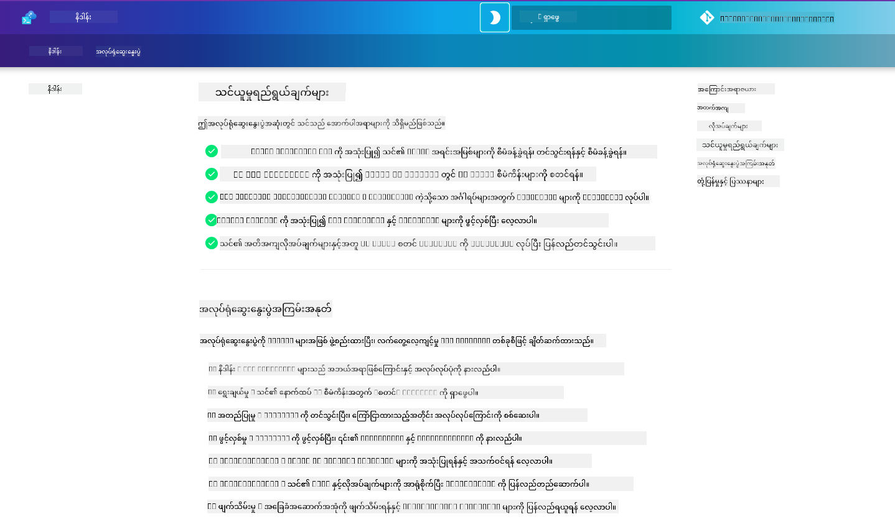

<!--
CO_OP_TRANSLATOR_METADATA:
{
  "original_hash": "9cc966416ab431c38b2ab863884b196c",
  "translation_date": "2025-09-25T01:40:09+00:00",
  "source_file": "workshop/README.md",
  "language_code": "my"
}
-->
# AZD for AI Developers Workshop

Azure Developer CLI (AZD) ကို အသုံးပြု၍ AI application များကို deploy လုပ်ခြင်းအပေါ် အာရုံစိုက်ပြီး လက်တွေ့ကျကျ သင်ကြားမှု workshop သို့ ကြိုဆိုပါသည်။ ဒီ workshop သည် AZD templates ကို သုံးပြီး အောက်ပါ ၃ ချက်အဆင့်ဆင့်ဖြင့် သင်ယူနိုင်ရန် အထောက်အကူပြုပါသည်-

1. **ရှာဖွေခြင်း** - သင့်အတွက် သင့်တော်သော template ကို ရှာဖွေပါ။
1. **Deploy လုပ်ခြင်း** - deploy လုပ်ပြီး အလုပ်လုပ်မှုကို အတည်ပြုပါ။
1. **အပြောင်းအလဲလုပ်ခြင်း** - သင့်လိုအပ်ချက်အတိုင်း ပြင်ဆင်ပြီး iterate လုပ်ပါ။

ဒီ workshop အတွင်းမှာ သင့် end-to-end development ခရီးလမ်းကို streamline လုပ်နိုင်ရန် core developer tools နှင့် workflows များကိုလည်း မိတ်ဆက်ပေးပါမည်။

<br/>

## Browser-Based Guide

Workshop lesson များကို Markdown ဖြင့် ရေးသားထားပါသည်။ GitHub တွင် တိုက်ရိုက် navigation လုပ်နိုင်သလို - အောက်ပါ screenshot တွင် ပြထားသည့်အတိုင်း browser-based preview ကိုလည်း ဖွင့်နိုင်ပါသည်။



ဒီ option ကို အသုံးပြုရန် - repository ကို သင့် profile သို့ fork လုပ်ပြီး GitHub Codespaces ကို ဖွင့်ပါ။ VS Code terminal အလုပ်လုပ်နေသောအခါမှာ အောက်ပါ command ကို ရိုက်ထည့်ပါ-

```bash title="" linenums="0"
mkdocs serve > /dev/null 2>&1 &
```

အချို့စက္ကန့်အတွင်း pop-up dialog တစ်ခုကို တွေ့ပါမည်။ `Open in browser` ကို ရွေးချယ်ပါ။ web-based guide သည် browser tab အသစ်တွင် ဖွင့်ပါမည်။ ဒီ preview ရဲ့ အကျိုးကျေးဇူးများမှာ-

1. **Built-in search** - keyword များ သို့မဟုတ် lesson များကို အလွယ်တကူ ရှာဖွေပါ။
1. **Copy icon** - codeblocks အပေါ်တွင် hover လုပ်ပြီး copy option ကို ရယူပါ။
1. **Theme toggle** - dark နှင့် light themes အကြား ပြောင်းလဲနိုင်ပါသည်။
1. **Get help** - footer တွင် Discord icon ကို click လုပ်ပြီး ဆွေးနွေးရန် join လုပ်ပါ။

<br/>

## Workshop Overview

**Duration:** 3-4 နာရီ  
**Level:** Beginner to Intermediate  
**Prerequisites:** Azure, AI concepts, VS Code နှင့် command-line tools အပေါ် ရင်းနှီးမှု။

ဒီ workshop သည် လက်တွေ့ကျကျ သင်ယူမှုဖြစ်ပြီး လုပ်ဆောင်ခြင်းမှတစ်ဆင့် သင်ယူပါမည်။ အလေ့အကျင့်များကို ပြီးမြောက်ပြီးနောက် AZD For Beginners curriculum ကို ပြန်လည်သုံးသပ်ရန် အကြံပြုပါသည်။ Security နှင့် Productivity အကောင်းဆုံး လုပ်နည်းများကို ဆက်လက်လေ့လာနိုင်ပါသည်။

| Time| Module  | Objective |
|:---|:---|:---|
| 15 mins | [Introduction](docs/instructions/0-Introduction.md) | အခြေခံအဆင့်ကို သတ်မှတ်ပြီး ရည်မှန်းချက်များကို နားလည်ပါ။ |
| 30 mins | [Select AI Template](docs/instructions/1-Select-AI-Template.md) | ရွေးချယ်ရန် options များကို ရှာဖွေပြီး starter ကို ရွေးပါ။ | 
| 30 mins | [Validate AI Template](docs/instructions/2-Validate-AI-Template.md) | Azure တွင် default solution ကို deploy လုပ်ပါ။ |
| 30 mins | [Deconstruct AI Template](docs/instructions/3-Deconstruct-AI-Template.md) | Structure နှင့် configuration ကို ရှာဖွေပါ။ |
| 30 mins | [Configure AI Template](docs/instructions/4-Configure-AI-Template.md) | ရရှိနိုင်သော features များကို activate လုပ်ပြီး စမ်းသပ်ပါ။ |
| 30 mins | [Customize AI Template](docs/instructions/5-Customize-AI-Template.md) | Template ကို သင့်လိုအပ်ချက်အတိုင်း ပြင်ဆင်ပါ။ |
| 30 mins | [Teardown Infrastructure](docs/instructions/6-Teardown-Infrastructure.md) | Resources များကို cleanup လုပ်ပြီး ပြန်လွှတ်ပါ။ |
| 15 mins | [Wrap-Up & Next Steps](docs/instructions/7-Wrap-up.md) | သင်ယူမှု resources နှင့် Workshop challenge |

<br/>

## What You'll Learn

AZD Template ကို Azure AI Foundry တွင် end-to-end development အတွက် အမျိုးမျိုးသော capabilities နှင့် tools များကို ရှာဖွေစမ်းသပ်ရန် learning sandbox အဖြစ် သတ်မှတ်ပါ။ Workshop ပြီးဆုံးချိန်တွင် အောက်ပါ tools နှင့် concepts များအပေါ် အလွယ်တကူ နားလည်မှု ရရှိထားမည်ဖြစ်သည်။

| Concept  | Objective |
|:---|:---|
| **Azure Developer CLI** | Tool commands နှင့် workflows ကို နားလည်ပါ။ |
| **AZD Templates**| Project structure နှင့် config ကို နားလည်ပါ။ |
| **Azure AI Agent**| Azure AI Foundry project ကို provision နှင့် deploy လုပ်ပါ။ |
| **Azure AI Search**| Agents နှင့် context engineering ကို enable လုပ်ပါ။ |
| **Observability**| Tracing, monitoring နှင့် evaluations ကို ရှာဖွေပါ။ |
| **Red Teaming**| Adversarial testing နှင့် mitigations ကို ရှာဖွေပါ။ |

<br/>

## Workshop Structure

Workshop ကို template discovery မှ စတင်ပြီး deployment, deconstruction, customization အထိ ခရီးလမ်းတစ်ခုအဖြစ် ဖွဲ့စည်းထားပါသည်။ [Getting Started with AI Agents](https://github.com/Azure-Samples/get-started-with-ai-agents) starter template ကို အခြေခံအဖြစ် အသုံးပြုပါသည်။

### [Module 1: Select AI Template](docs/instructions/1-Select-AI-Template.md) (30 mins)

- AI Templates ဆိုတာဘာလဲ?
- AI Templates ကို ဘယ်မှာ ရှာနိုင်မလဲ?
- AI Agents ကို ဘယ်လို စတင်တည်ဆောက်နိုင်မလဲ?
- **Lab**: GitHub Codespaces ဖြင့် Quickstart

### [Module 2: Validate AI Template](docs/instructions/2-Validate-AI-Template.md) (30 mins)

- AI Template Architecture ဆိုတာဘာလဲ?
- AZD Development Workflow ဆိုတာဘာလဲ?
- AZD Development အတွက် အကူအညီကို ဘယ်လိုရယူနိုင်မလဲ?
- **Lab**: AI Agents template ကို Deploy နှင့် Validate လုပ်ပါ။

### [Module 3: Deconstruct AI Template](docs/instructions/3-Deconstruct-AI-Template.md) (30 mins)

- `.azure/` တွင် သင့် environment ကို ရှာဖွေပါ။
- `infra/` တွင် သင့် resource setup ကို ရှာဖွေပါ။
- `azure.yaml` တွင် AZD configuration ကို ရှာဖွေပါ။
- **Lab**: Environment Variables ကို ပြောင်းလဲပြီး Redeploy လုပ်ပါ။

### [Module 4: Configure AI Template](docs/instructions/4-Configure-AI-Template.md) (30 mins)
- ရှာဖွေပါ: Retrieval Augmented Generation
- ရှာဖွေပါ: Agent Evaluation နှင့် Red Teaming
- ရှာဖွေပါ: Tracing နှင့် Monitoring
- **Lab**: AI Agent + Observability ကို ရှာဖွေပါ။

### [Module 5: Customize AI Template](docs/instructions/5-Customize-AI-Template.md) (30 mins)
- သတ်မှတ်ပါ: PRD နှင့် Scenario Requirements
- Configure လုပ်ပါ: AZD အတွက် Environment Variables
- Implement လုပ်ပါ: Lifecycle Hooks for added tasks
- **Lab**: Template ကို သင့် scenario အတွက် Customize လုပ်ပါ။

### [Module 6: Teardown Infrastructure](docs/instructions/6-Teardown-Infrastructure.md) (30 mins)
- Recap: AZD Templates ဆိုတာဘာလဲ?
- Recap: Azure Developer CLI ကို ဘာကြောင့် အသုံးပြုသင့်လဲ?
- Next Steps: Template တစ်ခုကို စမ်းသပ်ပါ။
- **Lab**: Infrastructure ကို Deprovision လုပ်ပြီး cleanup လုပ်ပါ။

<br/>

## Workshop Challenge

ပိုမိုစိန်ခေါ်မှုကို လုပ်ဆောင်လိုပါသလား? အောက်ပါ project အကြံပြုချက်များကို စမ်းသပ်ပါ - သို့မဟုတ် သင့်အကြံများကို မျှဝေပါ!!

| Project | Description |
|:---|:---|
|1. **Deconstruct A Complex AI Template** | ကျွန်ုပ်တို့ ဖော်ပြထားသော workflow နှင့် tools ကို အသုံးပြုပြီး အခြား AI solution template ကို deploy, validate, နှင့် customize လုပ်နိုင်မလား စမ်းသပ်ပါ။ _ဘာတွေ သင်ယူခဲ့ပါသလဲ?_|
|2. **Customize With Your Scenario**  | Scenario တစ်ခုအတွက် PRD (Product Requirements Document) ရေးရန် စမ်းသပ်ပါ။ GitHub Copilot ကို သင့် template repo တွင် Agent Model အဖြစ် အသုံးပြုပြီး customization workflow ကို generate လုပ်ရန် မေးပါ။ _ဘာတွေ သင်ယူခဲ့ပါသလဲ? ဒီအကြံများကို ဘယ်လိုတိုးတက်အောင်လုပ်နိုင်မလဲ?_|
| | |

## Have feedback?

1. ဒီ repo တွင် issue တစ်ခု post လုပ်ပါ - `Workshop` ဟူသော tag ကို အသုံးပြုပါ။
1. Azure AI Foundry Discord ကို join လုပ်ပြီး သင့် peers များနှင့် ဆက်သွယ်ပါ။

| | | 
|:---|:---|
| **📚 Course Home**| [AZD For Beginners](../README.md)|
| **📖 Documentation** | [Get started with AI templates](https://learn.microsoft.com/en-us/azure/ai-foundry/how-to/develop/ai-template-get-started)|
| **🛠️AI Templates** | [Azure AI Foundry Templates](https://ai.azure.com/templates) |
|**🚀 Next Steps** | [Take The Challenge](../../../workshop) |
| | |

<br/>

---

**Previous:** [AI Troubleshooting Guide](../docs/troubleshooting/ai-troubleshooting.md) | **Next:** Begin with [Lab 1: AZD Basics](../../../workshop/lab-1-azd-basics)

**Ready to start building AI applications with AZD?**

[Begin Lab 1: AZD Foundations →](./lab-1-azd-basics/README.md)

---

