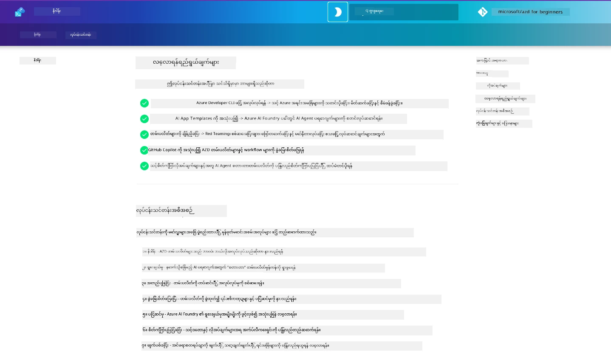

<div align="center">
  <div style="background: linear-gradient(135deg, #0078d4, #106ebe); border-radius: 10px; padding: 20px; margin: 20px 0; box-shadow: 0 4px 15px rgba(0, 120, 212, 0.3); border: 2px solid #005a9e;">
    <h2 style="color: white; margin: 0; font-size: 24px; text-shadow: 1px 1px 2px rgba(0,0,0,0.3);">
      🎯 AI ဖွံ့ဖြိုးရေးသူများအတွက် AZD အလုပ်ရုံသင်တန်း
    </h2>
    <p style="color: white; margin: 10px 0 0 0; font-size: 16px; text-shadow: 1px 1px 2px rgba(0,0,0,0.3);">
      <strong>Azure Developer CLI ဖြင့် AI အက်ပလီကေးရှင်းများ တည်ဆောက်ရန် လက်တွေ့ အလုပ်ရုံသင်တန်း။</strong><br>
      AZD အတည်းပုံများနှင့် AI တင်ပို့လုပ်ငန်းစဉ်များကို ကျွမ်းကျင်စေရန် ၇ ခန်းကို ပြီးမြောက်ပါ။
    </p>
    <div style="margin-top: 15px;">
      <span style="background: rgba(255,255,255,0.2); padding: 5px 10px; border-radius: 15px; color: white; font-size: 14px;">
        📅 နောက်ဆုံးပြင်ဆင်သည့်ရက်: March 2026
      </span>
    </div>
  </div>
</div>

# AI ဖွံ့ဖြိုးရေးသူများအတွက် AZD အလုပ်ရုံသင်တန်း

Azure Developer CLI (AZD) ကို AI အက်ပလီကေးရှင်း တင်သွင်းခြင်းအတွက် အာရုံစိုက်ကာ လက်တွေ့ လေ့လာသင်ကြားနိုင်သည့် အလုပ်ရုံသင်တန်းသို့ ကြိုဆိုပါတယ်။ ဤအလုပ်ရုံသင်တန်းသည် AZD template များအား ၃ ဆင့်ဖြင့် လက်တွေ့နည်းလမ်းဖြင့် နားလည်စေပါသည်။

1. **ရှာဖွေခြင်း** - မိမိအတွက် သင့်တော်သော template ကို ရှာဖွေပါ။
1. **တပ်ဆင်ခြင်း** - တင်သွင်းပြီး အလုပ်လုပ်ကြောင်း အတည်ပြုပါ
1. **စိတ်ကြိုက်ပြင်ဆင်ခြင်း** - မိမိလိုအပ်သလို ပြင်ဆင်ပြီး အဆင့်မြှင့်ပါ!

ဤအလုပ်ရုံသင်တန်းတစ်လျှောက်တွင် သင်သည် မူလ developer ကိရိယာများနှင့် workflow များကိုလည်း အကျုံ့အမြင်ရရှိပြီး အဆုံးမှ အဆုံး ဖွံ့ဖြိုးရေး ခရီးစဉ်ကို လျှော့ရှင်းစေရန် အကူအညီယူနိုင်ပါသည်။

<br/>

## ဘရောက်ဇာ အခြေပြု လမ်းညွှန်

အလုပ်ရုံသင်ခန်းများသည် Markdown ဖြင့် ရေးသားထားသည်။ GitHub တွင် တိုက်ရိုက် ရှာဖွေကြည့်လို့ ရသည် - သို့မဟုတ် အောက်ပါ screenshot တွင် ဖော်ပြထားသည့်အတိုင်း browser-based preview ကို စတင်ဖွင့်၍ ကြည့်ရှုနိုင်သည်။



ဤရွေးချယ်မှုကို အသုံးပြုရန် - repository ကို သင့် profile သို့ fork လုပ်ပြီး GitHub Codespaces ကို စတင်ပါ။ VS Code terminal အလုပ်ဖြစ်လာလျင် အောက်က ကျမ်းကို ရိုက်ထည့်ပါ။

This browser preview works in GitHub Codespaces, dev containers, or a local clone with Python and MkDocs installed.

```bash title="" linenums="0"
mkdocs serve > /dev/null 2>&1 &
```

In a few seconds, you will see a pop-up dialog. Select the option to `ဘရောက်ဇာတွင်ဖွင့်ရန်`. The web-based guide will now open in a new browser tab. Some benefits of this preview:

1. **Built-in search** - စကားလုံးများ သို့မဟုတ် သင်ခန်းစာများကို လျင်မြန်စွာ ရှာဖွေနိုင်ပါသည်။
1. **Copy icon** - codeblocks များပေါ်တွင် ညှိကြည့်လျှင် ဤရွေးချယ်ခွင့်ကို တွေ့ရပါမည်
1. **Theme toggle** - အမှောင်နှင့် အလင်း အပြင်အဆင်များကို ပြောင်းနိုင်ပါသည်
1. **Get help** - footer မှ Discord icon ကို နှိပ်ကာ ဝင်ရောက်ထိတွေ့ပါ။

<br/>

## အလုပ်ရုံ အနှစ်ချုပ်

**ကြာချိန်:** 3-4 hours  
**အဆင့်:** Beginner to Intermediate  
**လိုအပ်ချက်များ:** Azure, AI အယူအဆများ၊ VS Code နှင့် command-line tools များကို သိရှိပြီးဖြစ်ရမည်။

ဤသည်မှာ လက်တွေ့ လေ့လာသည့် အလုပ်ရုံသင်တန်းဖြစ်၍ လုပ်ဆောင်ခြင်းဖြင့် သင်ယူရပါမည်။ လေ့ကျင့်ခန်းများကို ပြီးမြောက်လိုက်ပါက AZD For Beginners သင်ရိုးညွှန်းကို ပြန်လည်ဆန်းစစ်ပြီး Security နှင့် Productivity အကောင်းဆုံးလုပ်ထုံးလုပ်နည်းများသို့ ဆက်လက်လေ့လာရန် အကြံပြုပါသည်။

| အချိန်| မော်ဂျူး  | ရည်ရွယ်ချက် |
|:---|:---|:---|
| 15 မိနစ် | [မိတ်ဆက်](docs/instructions/0-Introduction.md) | နောက်ခံကို သတ်မှတ်ပြီး ရည်မှန်းချက်များကို နားလည်ပါ |
| 30 မိနစ် | [AI Template ရွေးချယ်ခြင်း](docs/instructions/1-Select-AI-Template.md) | ရွေးချယ်စရာများကို ရှာဖွေပြီး စတင်ရန် ရွေးချယ်ပါ | 
| 30 မိနစ် | [AI Template အတည်ပြုခြင်း](docs/instructions/2-Validate-AI-Template.md) | Default ဖြေရှင်းချက်ကို Azure သို့ တင်ပို့ပါ |
| 30 မိနစ် | [AI Template ဖွင့်လှစ်လေ့လာခြင်း](docs/instructions/3-Deconstruct-AI-Template.md) | ဖွဲ့စည်းမှုနှင့် configuration ကို စူးစမ်းပါ |
| 30 မိနစ် | [AI Template ပြင်ဆင်ခြင်း](docs/instructions/4-Configure-AI-Template.md) | အသုံးပြုနိုင်သော ဖွင့်လှစ်ချက်များကို ဖွင့်၍ စမ်းကြည့်ပါ |
| 30 မိနစ် | [AI Template စိတ်ကြိုက်ပြင်ဆင်ခြင်း](docs/instructions/5-Customize-AI-Template.md) | template ကို သင်၏လိုအပ်ချက်များအတိုင်း အကောင်အထည်ဖော်ပါ |
| 30 မိနစ် | [အင်ဖရာ ဖျက်သိမ်းခြင်း](docs/instructions/6-Teardown-Infrastructure.md) | ရင်းမြစ်များ ကို ရှင်းလင်းပြီး လွှတ်ပေးပါ |
| 15 မိနစ် | [အနှစ်ချုပ် & နောက်ဆက်တွဲ အဆင့်များ](docs/instructions/7-Wrap-up.md) | သင်ယူရမည့် အရင်းအမြစ်များ၊ အလုပ်ရုံ စိန်ခေါ်မှု |

<br/>

## သင်ဘာတွေ သင်ယူမလဲ

AZD Template ကို Microsoft Foundry ပလက်ဖောင်းပေါ်တွင် အဆုံးမှ အဆုံး ဖွံ့ဖြိုးရေးလုပ်ငန်းစဉ်များကို စူးစမ်းလေ့လာရန် နမူနာသန်းမြင့် sandbox အဖြစ် ယူဆနိုင်သည်။ ဤအလုပ်ရုံသင်တန်းအဆုံးတွင် သင်သည် ဤအကြောင်းအရာနှင့် ပတ်သတ်ပြီး စိတ်အမြင် ရရှိထားရမည်။

| အယူအဆ  | ရည်ရွယ်ချက် |
|:---|:---|
| **Azure Developer CLI** | ကိရိယာအမိန့်များနှင့် workflow များကို နားလည်ပါ |
| **AZD Templates**| ပရောဂျက် ဖွဲ့စည်းမှုနှင့် configuration ကို နားလည်ပါ |
| **Azure AI Agent**| Microsoft Foundry ပရောဂျက်ကို provision နှင့် deploy လုပ်ပါ |
| **Azure AI Search**| agents များဖြင့် context engineering ကို အသုံးပြုပါ |
| **Observability**| tracing၊ monitoring နှင့် အကဲဖြတ်ခြင်းများကို စူးစမ်းပါ |
| **Red Teaming**| ဆန့်ကျင်ဖောက်ပြန် စမ်းသပ်မှုများနှင့် ကာကွယ်ဆည်းပမ်းနည်းများကို စူးစမ်းပါ |

<br/>

## အလုပ်ရုံ ဖွဲ့စည်းပုံ

အလုပ်ရုံသည် template ရွေးချယ်ခြင်း၊ တင်သွင်းခြင်း၊ ဖွင့်လှစ်လေ့လာခြင်းနှင့် စိတ်ကြိုက်ပြင်ဆင်ခြင်း သို့ ခရီးစဉ်တစ်လျှောက် ဆောင်ရွက်စေပါသည် - အခြေခံအနေဖြင့် သင်တန်းကတ်တမ်းအဖြစ် အောက်ပါ တည်နေရာတွင် ရှိသည့် တိကျသော [Getting Started with AI Agents](https://github.com/Azure-Samples/get-started-with-ai-agents) starter template ကို အသုံးပြုပါသည်။

### [မော်ဂျူး ၁: AI Template ရွေးချယ်ခြင်း](docs/instructions/1-Select-AI-Template.md) (30 မိနစ်)

- AI Templates ဆိုတာ မည်သည်နည်း?
- AI Templates များကို ဘယ်မှာ ရှာနိုင်မလဲ?
- AI Agents များ တည်ဆောက်ရန် မည်သို့ စတင်ရမလဲ?
- **Lab**: Codespaces သို့မဟုတ် dev container တွင် အမြန်စတင်ခြင်း

### [မော်ဂျူး ၂: AI Template အတည်ပြုခြင်း](docs/instructions/2-Validate-AI-Template.md) (30 မိနစ်)

- AI Template ဆောက်ပုံဇာတ်ကောင်ဘာလဲ?
- AZD Development Workflow ဆိုတာ ဘာလဲ?
- AZD Development အတွက် အကူအညီ မည်သို့ ရယူမလဲ?
- **Lab**: AI Agents template ကို Deploy & Validate လုပ်ပါ

### [မော်ဂျူး ၃: AI Template ဖွင့်လှစ်လေ့လာခြင်း](docs/instructions/3-Deconstruct-AI-Template.md) (30 မိနစ်)

- သင့်ပတ်ဝန်းကျင်ကို `.azure/` တွင် စူးစမ်းပါ 
- သင့် resource ဆက်တင်ကို `infra/` တွင် စူးစမ်းပါ 
- သင့် AZD ဖိုင်ဘက်ကို `azure.yaml`s တွင် စူးစမ်းပါ
- **Lab**: Environment Variables များကို ပြင်ဆင်ပြီး ပြန်တင်ပါ

### [မော်ဂျူး ၄: AI Template ပြင်ဆင်ခြင်း](docs/instructions/4-Configure-AI-Template.md) (30 မိနစ်)
- လေ့လာရန်: Retrieval Augmented Generation
- လေ့လာရန်: Agent Evaluation & Red Teaming
- လေ့လာရန်: Tracing & Monitoring
- **Lab**: AI Agent + Observability ကို စူးစမ်းပါ

### [မော်ဂျူး ၅: AI Template စိတ်ကြိုက်ပြင်ဆင်ခြင်း](docs/instructions/5-Customize-AI-Template.md) (30 မိနစ်)
- သတ်မှတ်ပါ: Scenario လိုအပ်ချက်များပါသည့် PRD
- သတ်မှတ်ပါ: AZD အတွက် Environment Variables
- အကောင်အထည်ဖော်ပါ: ထပ်ထည့်လိုသည့် လုပ်ငန်းများအတွက် Lifecycle Hooks
- **Lab**: မိမိ၏ စီနာရီအတွက် template ကို စိတ်ကြိုက် ပြင်ဆင်ပါ

### [မော်ဂျူး ၆: အင်ဖရာ ဖျက်သိမ်းခြင်း](docs/instructions/6-Teardown-Infrastructure.md) (30 မိနစ်)
- အနှစ်ချုပ်: AZD Templates များဆိုတာ ဘာလဲ?
- အနှစ်ချုပ်: Azure Developer CLI ကို မည်သို့ အသုံးချသင့်သနည်း?
- နောက်ဆက်တွဲ: အခြား template ကို ကြိုးစားကြည့်ပါ!
- **Lab**: အင်ဖရာကို Deprovision လုပ်ပြီး ရှင်းလင်းပါ

<br/>

## အလုပ်ရုံ စိန်ခေါ်မှု

ပိုပြီး စိန်ခေါ်မှုယူပြီး ကိစ္စများကို လုပ်ချင်ပါသလား? ဤနေရာတွင် အကြံပြုနိုင်သော project များ ရှိသည် - သို့မဟုတ် သင်၏ အတွေးများကို ကျွန်ုပ်တို့နှင့် မျှဝေပါ!!

| Project | Description |
|:---|:---|
|1. **Deconstruct A Complex AI Template** | သာမန် workflow နှင့် ကိရိယာများကို အသုံးပြုပြီး မတူညီသည့် AI solution template တစ်ခုကို deploy, validate, နှင့် customize လုပ်နိုင်သလား စမ်းကြည့်ပါ။ _ဘာတွေ သင်ယူခဲ့သလဲ?_|
|2. **Customize With Your Scenario**  | မတူညီသော စီနာရီအတွက် PRD (Product Requirements Document) တစ်စောင် ရေးပြီး ကြည့်ပါ။ ထို့နောက် template repo ထဲတွင် GitHub Copilot ကို Agent Model ထဲတွင် အသုံးပြုကာ customization workflow တစ်ခု ဖန်တီးပေးရန် တောင်းကြည့်ပါ။ _ဘာတွေ သင်ယူခဲ့သလဲ? ဤအကြံပြုချက်များကို မည်သို့ တိုးတက်စေနိုင်မလဲ?_|
| | |

## အကြံပြုချက် ရှိပါသလား?

1. ဒီ repo တွင် issue တင်ပါ - သက်ဆိုင်ရာ သတ်မှတ်ချက်အဖြစ် `Workshop` ဟု tag လုပ်ပါ။
1. Microsoft Foundry Discord တွင် ဝင်ရောက်ပါ - သင့်ပူးပေါင်းသူများနှင့် ဆက်သွယ်ပါ！


| | | 
|:---|:---|
| **📚 သင်တန်း မူလစာမျက်နှာ**| [AZD အစမှ စတင်သူများ](../README.md)|
| **📖 စာရွက်စာတမ်း** | [AI templates စတင်နည်း](https://learn.microsoft.com/en-us/azure/ai-foundry/how-to/develop/ai-template-get-started)|
| **🛠️AI Templates** | [Microsoft Foundry Templates](https://ai.azure.com/templates) |
|**🚀 နောက်ဆက်တွဲအဆင့်များ** | [အလုပ်ရုံ စတင်ပါ](#အလုပ်ရုံ-အနှစ်ချုပ်) |
| | |

<br/>

---

**Navigation:** [မူလ သင်တန်း](../README.md) | [မိတ်ဆက်](docs/instructions/0-Introduction.md) | [မော်ဂျူး ၁: AI Template ရွေးချယ်ခြင်း](docs/instructions/1-Select-AI-Template.md)

**AZD ဖြင့် AI အက်ပလီကေးရှင်းများ တည်ဆောက်ရန် စတင်ဖို့ အဆင်သင့်ပါသလား?**

[အလုပ်ရုံ စတင်ပါ: မိတ်ဆက် →](docs/instructions/0-Introduction.md)

---

<!-- CO-OP TRANSLATOR DISCLAIMER START -->
**တာဝန်မယူခြင်း**:
ဤစာတမ်းကို AI ဘာသာပြန်ဝန်ဆောင်မှု [Co-op Translator](https://github.com/Azure/co-op-translator) ဖြင့် ဘာသာပြန်ထားပါသည်။ ကျွန်တော်တို့သည် မှန်ကန်မှုအတွက် ကြိုးပမ်းပါသောင်း၊ သို့သော် အလိုအလျော်ဘူ ဘာသာပြန်မှုများတွင် အမှားများ သို့မဟုတ် မမှန်ကန်မှုများ ပါရှိနိုင်ကြောင်း ချန်တောင့်ပါ။ မူလစာတမ်းကို မူလဘာသာဖြင့် တရားဝင် ရင်းမြစ်အဖြစ် သတ်မှတ်ရမည်ဖြစ်သည်။ အရေးကြီးသော သတင်းအချက်အလက်များအတွက် ပရော်ဖက်ရှင်နယ် လူ့ဘာသာပြန်မှ ဘာသာပြန်ချက်ရရှိရန် အကြံပြုပါသည်။ ဤဘာသာပြန်ချက်ကို အသုံးပြုရာမှ ဖြစ်ပေါ်သည့် နားမလည်မှုများ သို့မဟုတ် မှားယွင်းသော ဖော်ထုတ်ချက်များအတွက် ကျွန်တော်တို့ တာဝန်မယူပါ။
<!-- CO-OP TRANSLATOR DISCLAIMER END -->