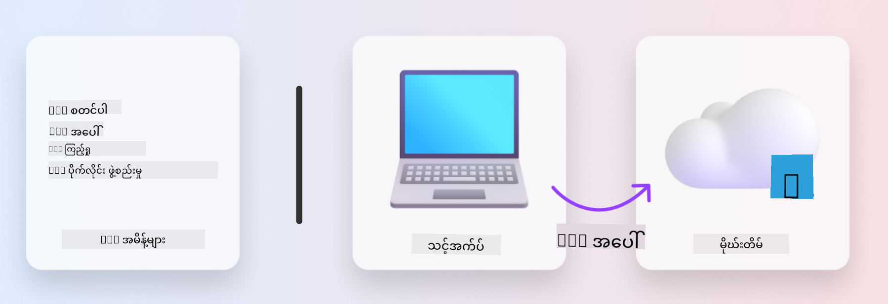

<!--
CO_OP_TRANSLATOR_METADATA:
{
  "original_hash": "06d6207eff634aefcaa41739490a5324",
  "translation_date": "2025-09-25T02:00:50+00:00",
  "source_file": "workshop/docs/instructions/1-Select-AI-Template.md",
  "language_code": "my"
}
-->
# 1. Template ရွေးချယ်ခြင်း

!!! tip "ဒီ module အဆုံးသတ်မှာ သင်တတ်မြောက်မည့်အရာများ"

    - [ ] AZD templates ဆိုတာဘာလဲဆိုတာ ရှင်းပြနိုင်မည်
    - [ ] AI အတွက် AZD templates ရှာဖွေပြီး အသုံးပြုနိုင်မည်
    - [ ] AI Agents template ကို စတင်အသုံးပြုနိုင်မည်
    - [ ] **Lab 1:** GitHub Codespaces ဖြင့် AZD Quickstart

---

## 1. တည်ဆောက်သူ၏ ဥပမာ

ခေတ်မီသော အဖွဲ့အစည်းအဆင့် AI application ကို _အခြေခံမှ_ တည်ဆောက်ခြင်းသည် အလွန်ခက်ခဲနိုင်သည်။ ၎င်းသည် သင်၏အိမ်အသစ်ကို ကိုယ်တိုင် အုတ်တစ်ချပ်ချင်းစီဖြင့် တည်ဆောက်ရသလိုပင် ဖြစ်သည်။ ဟုတ်ကဲ့၊ ၎င်းကို ပြုလုပ်နိုင်သည်! သို့သော် မိမိလိုချင်သော ရလဒ်ကို ရရှိရန် အကျိုးရှိဆုံးနည်းလမ်းမဟုတ်ပါ! 

အစား၊ ကျွန်ုပ်တို့သည် ရှိပြီးသား _ဒီဇိုင်းအကြမ်းပုံ_ တစ်ခုကို စတင်အသုံးပြုပြီး၊ မိမိလိုအပ်ချက်များနှင့် ကိုက်ညီစေရန် အင်ဂျင်နီယာနှင့် ပူးပေါင်းလုပ်ဆောင်လေ့ရှိသည်။ AI application များ တည်ဆောက်ရာတွင်လည်း အတိအကျ ဒီနည်းလမ်းကို အသုံးပြုသင့်သည်။ ပထမဦးဆုံး၊ မိမိ၏ ပြဿနာနယ်ပယ်နှင့် ကိုက်ညီသော ဒီဇိုင်း architecture ကို ရှာဖွေပါ။ ထို့နောက် မိမိ၏ အထူးလိုအပ်ချက်များအတွက် ဖြေရှင်းချက်ကို customize လုပ်ပြီး တိုးတက်အောင်လုပ်ဆောင်ပါ။

ဒါပေမယ့် ဒီဇိုင်းအကြမ်းပုံများကို ဘယ်မှာ ရှာနိုင်မလဲ? အကြမ်းပုံများကို ကိုယ်တိုင် customize လုပ်ပြီး deploy လုပ်နည်းကို သင်ပေးမည့် အင်ဂျင်နီယာကို ဘယ်လို ရှာမလဲ? ဒီ workshop မှာ ကျွန်ုပ်တို့သည် အဆိုပါမေးခွန်းများကို ဖြေရှင်းပေးမည့် နည်းပညာသုံးမျိုးကို မိတ်ဆက်ပေးပါမည်။

1. [Azure Developer CLI](https://aka.ms/azd) - အရင်းအမြစ်ဖွင့် tool တစ်ခုဖြစ်ပြီး၊ ဒေသတွင်း development (build) မှ cloud deployment (ship) သို့ developer လမ်းကြောင်းကို အရှိန်မြှင့်ပေးသည်။
1. [Azure AI Foundry Templates](https://ai.azure.com/templates) - AI solution architecture တစ်ခုကို deploy လုပ်ရန် sample code, infrastructure နှင့် configuration ဖိုင်များပါဝင်သော standardized open-source repositories။
1. [GitHub Copilot Agent Mode](https://code.visualstudio.com/docs/copilot/chat/chat-agent-mode) - Azure knowledge ကို အခြေခံထားသော coding agent တစ်ခုဖြစ်ပြီး၊ natural language အသုံးပြု၍ codebase ကို navigate လုပ်ခြင်းနှင့် ပြောင်းလဲမှုများပြုလုပ်ရန် လမ်းညွှန်ပေးနိုင်သည်။

ဒီ tools များကို အသုံးပြု၍ သင့်အတွက် _သင့်လျော်သော template ကို ရှာဖွေ_၊ _deploy_ လုပ်၍ ၎င်းအလုပ်လုပ်မှုကို အတည်ပြုပြီး၊ သင့်အထူးလိုအပ်ချက်များနှင့် _ကိုက်ညီအောင်_ customize လုပ်နိုင်ပါပြီ။ အခုတော့ ဒီ tools များအလုပ်လုပ်ပုံကို လေ့လာကြပါစို့။

---

## 2. Azure Developer CLI

[Azure Developer CLI](https://learn.microsoft.com/en-us/azure/developer/azure-developer-cli/) (သို့မဟုတ် `azd`) သည် အရင်းအမြစ်ဖွင့် commandline tool တစ်ခုဖြစ်ပြီး၊ IDE (development) နှင့် CI/CD (devops) ပတ်ဝန်းကျင်များတွင် တစ်ပြိုင်တည်းအလုပ်လုပ်သော developer-friendly commands များဖြင့် သင့် code-to-cloud ခရီးကို အရှိန်မြှင့်ပေးနိုင်သည်။

`azd` ဖြင့် သင့် deployment ခရီးသည် အလွန်ရိုးရှင်းနိုင်သည်။

- `azd init` - ရှိပြီးသား AZD template မှ AI project အသစ်တစ်ခုကို initialize လုပ်သည်။
- `azd up` - Infrastructure ကို provision လုပ်ပြီး application ကို တစ်ဆင့်တည်း deploy လုပ်သည်။
- `azd monitor` - Deploy လုပ်ထားသော application အတွက် အချိန်နှင့်တပြေးညီ monitoring နှင့် diagnostics ရယူသည်။
- `azd pipeline config` - Azure သို့ deployment ကို automate လုပ်ရန် CI/CD pipelines ကို setup လုပ်သည်။

**🎯 | လေ့ကျင့်မှု**: <br/> GitHub Codespaces ပတ်ဝန်းကျင်တွင် `azd` commandline tool ကို စမ်းသုံးပါ။ tool ရဲ့ လုပ်ဆောင်နိုင်မှုကို ကြည့်ရန် ဒီ command ကို ရိုက်ထည့်ပါ။

```bash title="" linenums="0"
azd help
```



---

## 3. AZD Template

`azd` အလုပ်လုပ်နိုင်ရန်၊ infrastructure ကို provision လုပ်ရန်၊ enforce လုပ်ရန် configuration settings များနှင့် deploy လုပ်ရန် application ကို သိရှိထားရန် လိုအပ်သည်။ ဒီအချိန်မှာ [AZD templates](https://learn.microsoft.com/en-us/azure/developer/azure-developer-cli/azd-templates?tabs=csharp) တွင် အရေးပါလာသည်။

AZD templates သည် open-source repositories ဖြစ်ပြီး၊ solution architecture ကို deploy လုပ်ရန် sample code နှင့် infrastructure, configuration ဖိုင်များကို ပေါင်းစပ်ထားသည်။
_Infrastructure-as-Code_ (IaC) နည်းလမ်းကို အသုံးပြုခြင်းအားဖြင့်၊ template resource definitions နှင့် configuration settings များကို app source code လိုပင် version-controller လုပ်နိုင်သည် - ၎င်း project ကို အသုံးပြုသူများအကြား reusable နှင့် consistent workflows များကို ဖန်တီးပေးသည်။

သင့် scenario အတွက် AZD template တစ်ခုကို ဖန်တီးခြင်း သို့မဟုတ် အသုံးပြုခြင်းအခါ၊ ဒီမေးခွန်းများကို စဉ်းစားပါ။

1. သင်ဘာကို တည်ဆောက်နေပါသလဲ? → အဆိုပါ scenario အတွက် starter code ပါဝင်သော template ရှိပါသလား?
1. သင့် solution ကို ဘယ်လို architect လုပ်ထားပါသလဲ? → လိုအပ်သော resources ပါဝင်သော template ရှိပါသလား?
1. သင့် solution ကို ဘယ်လို deploy လုပ်ထားပါသလဲ? → `azd deploy` ကို pre/post-processing hooks ဖြင့် စဉ်းစားပါ!
1. ၎င်းကို ထပ်မံ optimize လုပ်နိုင်မည့် နည်းလမ်းများရှိပါသလား? → built-in monitoring နှင့် automation pipelines ကို စဉ်းစားပါ!

**🎯 | လေ့ကျင့်မှု**: <br/> 
[Awesome AZD](https://azure.github.io/awesome-azd/) gallery ကို သွားရောက်ပြီး၊ လက်ရှိရှိသော template 250+ ကို filters အသုံးပြု၍ ရှာဖွေပါ။ သင့် scenario လိုအပ်ချက်များနှင့် ကိုက်ညီသော template တစ်ခုကို ရှာဖွေနိုင်မလား ကြည့်ပါ။


---

## 4. AI App Templates

---

