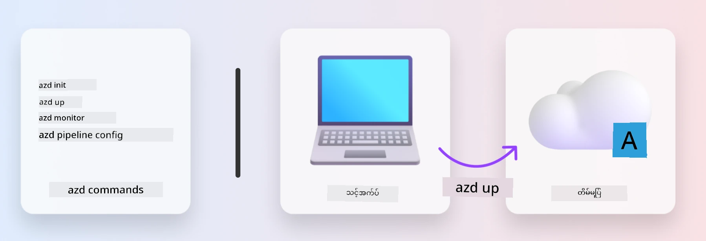
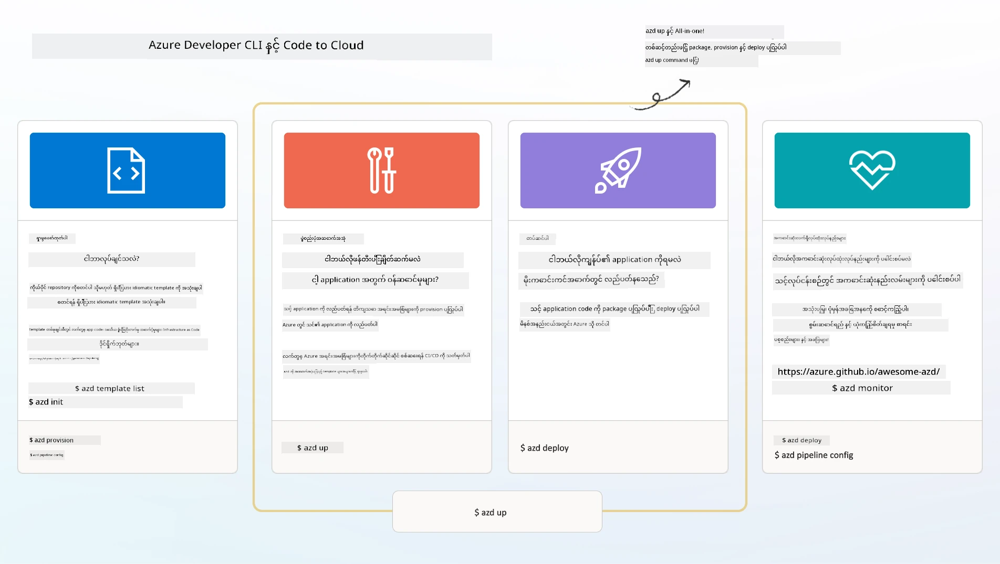

# 1. နမူနာရွေးချယ်ပါ

!!! tip "BY THE END OF THIS MODULE YOU WILL BE ABLE TO"

    - [ ] AZD templates ဆိုတာဘာလဲ ဆိုတာ ဖော်ပြနိုင်ပါသည်
    - [ ] AI အတွက် AZD templates များကို ရှာဖွေ အသုံးပြုနိုင်ပါသည်
    - [ ] AI Agents template ဖြင့် စတင်လုပ်ဆောင်နိုင်ပါသည်
    - [ ] **Lab 1:** GitHub Codespaces ဖြင့် AZD Quickstart

---

## 1. ဆောက်လုပ်သူ ဆင်တူချက်

အဆင့်မြင့်၊ စီးပွားရေးအသင့် AI အက်ပလီကေးရှင်းတစ်ခုကို _အစစကနေ_ တည်ဆောက်ခြင်းသည် အလွန်ရှုပ်ထွေးနိုင်သည်။ ၎င်းကို သင်၏ ကိုယ်ပိုင် အိမ်ကို လက်ဖြင့် ရိုးခြင်းစီ တည်ဆောက်သလိုတစ်စိတ်တစ်ပိုင်းတည်းဖြင့် ဆောက်လုပ်နေသလို ဖြစ်သည်။ ဟုတ်ပါတယ်၊ လုပ်နိုင်ပါသည်! သို့သော် မလိုလားအပ်သည့် နည်းလမ်းဖြင့် ရည်မှန်းထားသည့် ဂိုးရလဒ်ကို ရယူရန် အကောင်းဆုံးနည်းလမ်း မဟုတ်ပါ။

မဟုတ်ရင် ထပ်မံစဉ်းစားပါက၊ ကျွန်ုပ်တို့သည် အများအားဖြင့် ရှိပြီးသား _ဒီဇိုင်း အချက်ပြဇယား_ တစ်ခုမှ စတင်ပြီး အာကာကိုအတည်ပြုသူ (architect) တစ်ယောက်နှင့် ပူးပေါင်းကာ ကိုယ့်လိုအပ်ချက်များအတိုင်း ကိုက်ညီစေရန် ပြုပြင်ပြီး တီထွင်ကြသည်။ ၎င်းသည် စျေးပေါသော နည်းလမ်းဖြစ်သည်။ အကောင်အထည်ဖော်လိုသော အင်တယ်လီဂျင့် အက်ပလီကေးရှင်းများကို ဖန်တီးရာတွင်လည်း တစ်ခုတည်းသော လမ်းကြောင်းအဖြစ် အထူးသင့်တော်သည်။ ပထမဦးဆုံး သင့်ပြဿနာနယ်ပယ်နှင့် ကိုက်ညီသည့် ကောင်းသော ဒီဇိုင်း ဖွဲ့စည်းပုံကို ရှာပါ။ ထို့နောက် ချက်ချင်း ပေ့ါဖိုလ်ရှင်နယ် အင်တာချိတ်ဆက်သူ (solution architect) တစ်ဦးနှင့် ပူးပေါင်းကာ သင့်ရည်မှန်းချက်အတွက် တပ်ဆင်၊ အပြင်ဆင် ထားပါ။

သို့သော် ဤဒီဇိုင်း အချက်ပြဇယားများကို ဘယ်မှာ ရနိုင်မလဲ? နဲ့ ဤဇယားများကို ကိုယ်တိုင်စိတ်ကြိုက် ပြင်ဆင်၍ ပို့စ်လုပ်ပေးနိုင်မည့် အင်ဂျင်နီယာတစ်ဦးကို မည်သို့ရှာမလဲ? ဤworkshop တွင် ကျွန်ုပ်တို့သည် အောက်ပါနည်းပညာသုံးခုကို စိတ်ချယုံကြည်စွာ မိတ်ဆက်ပေးကာ အဆိုပါ မေးခွန်းများကို ဖြေကြားပေးပါမည်။

1. [Azure Developer CLI](https://aka.ms/azd) - ဒေသတွင်းဖွံ့ဖြိုးရေးမှ cloud သို့ (build → ship) တက်လာရန် developer အလိုအပ်ချက်များကို လျင်မြန်စေသော open-source ကိရိယာ။
1. [Microsoft Foundry Templates](https://ai.azure.com/templates) - AI solution architecture တပ်ဆင်ရန် လိုအပ်သော ဥပမာကုဒ်၊ အင်ဖရီစထက်ချာနှင့် ဖိုင်များ ပါဝင်သည့် စံတော်ချိန် open-source အရင်းအမြစ်များ။
1. [GitHub Copilot Agent Mode](https://code.visualstudio.com/docs/copilot/chat/chat-agent-mode) - Azure အချက်အလက်အပေါ် အခြေခံထားသော ကွန်ပျူတာ ကူညီရေးဂျင့်၊ ၎င်းသည် ကုဒ်ဘေ့(စ်)ကို လမ်းပြကာ ပြင်ဆင်ရန် သဘာဝဘာသာစကားဖြင့် လမ်းညွှန်ပေးနိုင်သည်။

ဤကိရိယာများကို ကိုင်ဆောင်ထားလျှင် သင်သည် သင့်လိုအပ်ချက်နှင့် ကိုက်ညီသည့် တမ်းပလိတ်ကို _ရှာဖွေရန်_၊ ၎င်းကို အမှန်တကယ္ လည်ပတ်ကြောင်း _deploy_ ပြုလုပ်ရန်၊ နှင့် သင့်ရည်ရွယ်ချက်အတိုင်း _စိတ်ကြိုက်ပြင်ဆင်_ ရန် လုပ်ဆောင်နိုင်ပါပြီ။ အခု တက်ပါစို့၊ ၎င်းများကို ဘယ်လို အသုံးပြုရသည်ကို သင်ယူလိုက်ကြပါစို့။

---

## 2. Azure Developer CLI

The [Azure Developer CLI](https://learn.microsoft.com/en-us/azure/developer/azure-developer-cli/) (or `azd`) သည် open-source command-line ကိရိယာတစ်ခုဖြစ်ပြီး သင့် code-to-cloud ခရီးကို IDE (development) နှင့် CI/CD (devops) ပတ်ဝန်းကျင်များတွင် အမြဲတမ်း တူညီစွာ လုပ်ဆောင်ပေးနိုင်သည့် developer-friendly command များဖြင့် အရှိန်မြှင့်ပေးနိုင်ပါသည်။

`azd` ဖြင့် သင့် deployment ခရီးစဉ်ကို အလွန် ရိုးရှင်းစွာ အောက်ပါအတိုင်း ပြုလုပ်နိုင်သည် -

- `azd init` - ရှိပြီးသား AZD template မှ အသစ်သော AI project တစ်ခုကို စတင် initialize ပြုလုပ်သည်။
- `azd up` - Infrastructure ကို provision ပြုလုပ်ကာ သင့် application ကို တစ်ချက်တည်းတွင် deploy လုပ်ပေးသည်။
- `azd monitor` - သင့်တပ်ဆင်ပြီးသော application အတွက် အချိန်နှင့်တပြေးညီ မော်နီတာနှင့် ပြဿနာဖော်ထုတ်မှုရယူရန်။
- `azd pipeline config` - Azure သို့ စက်တင် အလိုအလျောက်ပို့ရန် CI/CD pipeline များကို သတ်မှတ်ပေးရန်။

**🎯 | EXERCISE**: <br/> သင့် GitHub Codespaces ပတ်ဝန်းကျင်တွင် `azd` command-line ကိရိယာကို လေ့လာပါ။ ကိရိယာ၏ လုပ်ဆောင်နိုင်ချက်ကို ကြည့်ရန် ဤ command ကို ရိုက်ထည့်ပြီး စတင်ပါ။

```bash title="" linenums="0"
azd help
```



---

## 3. The AZD Template

`azd` သည် ၎င်းကို ရရှိစေရန် provisioning လုပ်ရမည့် infrastructure၊ အဖွဲ့အစည်းတစ်ခုတည်း သတ်မှတ်ရန် configuration အချို့နှင့် deploy ပြုလုပ်ရန် application ကို အချက်ရွက်အဖြစ် သိထားရန် လိုအပ်သည်။ ၎င်းအတွက် [AZD templates](https://learn.microsoft.com/en-us/azure/developer/azure-developer-cli/azd-templates?tabs=csharp) များ ပါဝင်သည်။

AZD templates သည် နမူနာကုဒ်များနှင့် solution architecture ကို တပ်ဆင်ရန် လိုအပ်သော infrastructure နှင့် configuration ဖိုင်များကို ပေါင်းစည်းထားသော open-source repository များပင် ဖြစ်သည်။ _Infrastructure-as-Code_ (IaC) နည်းစနစ်ကို အသုံးပြုခြင်းဖြင့် template resource သတ်မှတ်ချက်များနှင့် configuration ဆက်တင်များကို application source code ကဲ့သို့ ဗားရှင်းထိန်းချုပ်နိုင်၍ အကြောင်းအရာတူညီသည့် workflow များကို ပြန်လည်အသုံးပြုနိုင်စေသည်။

သင်၏ သီးသန့် အခြေအနေအတွက် AZD template တစ်ခုကို ဖန်တီးသို့မဟုတ် သုံးဆောင်ရန် လျှောက်လွှာစဉ်ကာလတွင် အောက်ပါမေးခွန်းများကို စဉ်းစားပါ -

1. သင် ဘာကို ဆောက်လုပ်နေပါသလဲ? → ဤအခြေအနေအတွက် စတင်ကုဒ် ပါသော template ရှိပါသလား?
1. သင့်ဖြေရှင်းချက်ကို ဘယ်သို့ ဖွဲ့စည်းထားသလဲ? → လိုအပ်သော resource များပါဝင်သည့် template ရှိပါသလား?
1. သင့်ဖြေရှင်းချက်ကို မည်သို့ deploy လုပ်မည်နည်း? → pre/post-processing hooks တွေပါသော `azd deploy` ကို စဉ်းစားပါ!
1. ဘယ်လို ပို၍ အထူးပြုနိုင်မလဲ? → built-in monitoring နှင့် automation pipeline များကို စဉ်းစားပါ!

**🎯 | EXERCISE**: <br/> 
[Awesome AZD](https://azure.github.io/awesome-azd/) ဂယ်လရီကို သွားရောက်ပြီး filter များကို အသုံးပြုကာ လက်ရှိတွင် ရရှိနိုင်သည့် 250+ templates များကို ရှာဖွေပါ။ သင့်အခြေအနေ တိုက်ညီသည့် တမ်းပလိတ်ကို ရှာနိုင်ပါစေလျှင် စိစစ်ကြည့်ပါ။



---

## 4. AI အက်ပလီကေးရှင်း နမူနာများ

AI အားဖြင့် လုပ်ဆောင်သည့် အက်ပလီကေးရှင်းများအတွက် Microsoft သည် **Microsoft Foundry** နှင့် **Foundry Agents** ပါဝင်သည့် အထူးပြု templates များကို ပံ့ပိုးပေးသည်။ ဤ templates များသည် သင့်ကို အင်တယ်လီဂျင့်၊ ထုတ်လုပ်နိုင်သော အက်ပလီကေးရှင်းများ ဖန်တီးရန် လမ်းကြောင်းကို အမြန်တိုးမြှင့်ပေးသည်။

### Microsoft Foundry & Foundry Agents Templates

အောက်ပါတွင် တပ်ဆင်ရန် template တစ်ခုကို ရွေးပါ။ တစ်ခုချင်းစီကို [Awesome AZD](https://azure.github.io/awesome-azd/) တွင် ရနိုင်ပြီး တစ်ချက်သာဖြင့် initialize ပြုလုပ်နိုင်ပါသည်။

| နမူနာ | ဖော်ပြချက် | တပ်ဆင် အမိန့် |
|----------|-------------|----------------|
| **[RAG ဖြင့် AI စကားဝိုင်း](https://azure.github.io/awesome-azd/?tags=ai&tags=rag)** | Microsoft Foundry ကို အသုံးပြု၍ Retrieval Augmented Generation ဖြင့် စကားဝိုင်း အက်ပလီကေးရှင်း | `azd init -t azure-samples/azure-search-openai-demo` |
| **[Foundry Agent ဝန်ဆောင်မှု စတင်နမူနာ](https://azure.github.io/awesome-azd/?tags=ai&tags=agents)** | Foundry Agents များဖြင့် ကိုယ်တိုင်းတာ အလိုအလျောက် လုပ်ငန်းများ လုပ်ဆောင်နိုင်သော AI agent များ ဖန်တီးရန် | `azd init -t azure-samples/foundry-agent-service-starter` |
| **[Multi-Agent ဆက်လက်ညှိနှိုင်းမှု](https://azure.github.io/awesome-azd/?tags=ai&tags=agents)** | ဇာတ်လမ်းရှုပ်ထွေးသော workflow များအတွက် Foundry Agents များကို ညှိနှိုင်းရန် | `azd init -t azure-samples/multi-agent-orchestration` |
| **[AI စာရွက်စာတမ်း အသိပညာ](https://azure.github.io/awesome-azd/?tags=ai&tags=document)** | Microsoft Foundry မော်ဒယ်များကို အသုံးပြု၍ စာရွက်စာတမ်းများကို သိမြင်၍ အသုံးချရန် | `azd init -t azure-samples/ai-document-processing` |
| **[စကားပြော AI ဘော့](https://azure.github.io/awesome-azd/?tags=ai&tags=bot)** | Microsoft Foundry ဖြင့် ပေါင်းစည်းထားသော ပညာစကားပြောဘော့များ တည်ဆောက်ရန် | `azd init -t azure-samples/ai-chat-protocol` |
| **[AI ပုံဖန်တီးမှု](https://azure.github.io/awesome-azd/?tags=ai&tags=dalle)** | Microsoft Foundry မှတဆင့် DALL-E အသုံးပြု၍ ပုံများ ဖန်တီးရန် | `azd init -t azure-samples/ai-image-generation` |
| **[Semantic Kernel Agent](https://azure.github.io/awesome-azd/?tags=ai&tags=semantic-kernel)** | Foundry Agents နှင့် တွဲဖက် အသုံးပြုသော Semantic Kernel အေပၚ အေဂျင့်များ | `azd init -t azure-samples/semantic-kernel-agent` |
| **[AutoGen Multi-Agent](https://azure.github.io/awesome-azd/?tags=ai&tags=autogen)** | AutoGen framework ကို အသုံးပြုသည့် မျိုးစုံ agent စနစ်များ | `azd init -t azure-samples/autogen-multi-agent` |

### အလျင်အမြန် စတင်ခြင်း

1. **Browse templates**: [https://azure.github.io/awesome-azd/](https://azure.github.io/awesome-azd/) သို့ သွား၍ `AI`, `Agents`, သို့မဟုတ် `Microsoft Foundry` ဖြင့် စစ်ထုတ်ပါ
2. **Select your template**: သင့်အသုံးအဆောင်နှင့် ကိုက်ညီသည့် တစ်ခုကို ရွေးပါ
3. **Initialize**: ရွေးချယ်ထားသည့် template အတွက် `azd init` command ကို အလုပ်ပေးပါ
4. **Deploy**: Provision ပြုလုပ်ကာ deploy လုပ်ရန် `azd up` ကို အလုပ်ပေးပါ

**🎯 | EXERCISE**: <br/>
အပေါ်ပါ template များထဲမှ သင့် အခြေအနေအပေါ် မူတည်၍ တစ်ခုကို ရွေးပါ။

- **စကားပြောဘော့ တည်ဆောက်နေပါသလား?** → **RAG ဖြင့် AI စကားဝိုင်း** သို့မဟုတ် **စကားပြော AI ဘော့** ဖြင့် စတင်ပါ
- **ကိုယ်တိုင် အလိုအလျောက် အလုပ်လုပ်နိုင်သော agent များလိုပါသလား?** → **Foundry Agent ဝန်ဆောင်မှု စတင်နမူနာ** သို့မဟုတ် **Multi-Agent ဆက်လက်ညှိနှိုင်းမှု** ကို စမ်းကြည့်ပါ
- **စာရွက်စာတမ်းများကို ပြုစုကူးယူနေရပါသလား?** → **AI စာရွက်စာတမ်း အသိပညာ** ကို အသုံးပြုပါ
- **AI ကူညီရေးသားမှုဆိုင်ရာ အကူအညီလိုပါသလား?** → **Semantic Kernel Agent** သို့မဟုတ် **AutoGen Multi-Agent** ကို စူးစမ်းပါ

```bash title="Example: Deploy the AI Chat with RAG template" linenums="0"
azd init -t azure-samples/azure-search-openai-demo
azd up
```

!!! info "Explore More Templates"
    The [Awesome AZD Gallery](https://azure.github.io/awesome-azd/) တွင် 250+ templates များပါရှိသည်။ ဘာသာစကား၊ framework နှင့် Azure services အလိုက် သင့်လိုအပ်ချက်နှင့် ကိုက်ညီသည့် template များ ရှာဖွေရန် filters များကို အသုံးပြုပါ။

---

<!-- CO-OP TRANSLATOR DISCLAIMER START -->
အသိပေးချက်:
ဤစာရွက်ကို AI ဘာသာပြန်ဝန်ဆောင်မှုဖြစ်သည့် [Co-op Translator](https://github.com/Azure/co-op-translator) ကို အသုံးပြု၍ ဘာသာပြန်ထားပါသည်။ ကျွန်ုပ်တို့သည် တိကျမှုကို ကြိုးစားသော်လည်း အလိုအလျောက် ဘာသာပြန်မှုများတွင် အမှားများ သို့မဟုတ် မှားယွင်းချက်များ ပါဝင်နိုင်ပါသည်ဆိုတာ ကျေးဇူးပြု၍ အသိထားပါ။ မူလစာရွက်ကို မူလဘာသာစကားဖြင့် ရှိသမျှ စာတမ်းကိုသာ တာဝန်ခံ အရင်းအမြစ်အဖြစ် ယူဆသင့်ပါသည်။ အရေးကြီးသော အချက်အလက်များအတွက် ပရော်ဖက်ရှင်နယ် လူသား ဘာသာပြန်ကို အကြံပြုပါသည်။ ဤဘာသာပြန်ချက်ကို အသုံးပြုခြင်းကြောင့် ဖြစ်ပေါ်နိုင်သည့် နားလည်မှု အမှားများ သို့မဟုတ် အဓိပ္ပာယ် မမှန်ကန်မှုများအတွက် ကျွန်ုပ်တို့သည် တာဝန်မယူပါကြောင်း သတိပေးပါသည်။
<!-- CO-OP TRANSLATOR DISCLAIMER END -->