<!--
CO_OP_TRANSLATOR_METADATA:
{
  "original_hash": "7816c6ec50c694c331e7c6092371be4d",
  "translation_date": "2025-09-25T02:14:52+00:00",
  "source_file": "workshop/docs/instructions/2-Validate-AI-Template.md",
  "language_code": "my"
}
-->
# 2. Template ကိုအတည်ပြုပါ

!!! tip "ဒီ module အဆုံးသတ်မှာ သင်တတ်နိုင်မယ့်အရာတွေ"

    - [ ] AI Solution Architecture ကိုခွဲခြမ်းစိတ်ဖြာနိုင်မယ်
    - [ ] AZD Deployment Workflow ကိုနားလည်နိုင်မယ်
    - [ ] GitHub Copilot ကိုအသုံးပြုပြီး AZD အသုံးပြုမှုအတွက်အကူအညီရနိုင်မယ်
    - [ ] **Lab 2:** AI Agents template ကို Deploy & Validate လုပ်နိုင်မယ်

---

## 1. အကျဉ်းချုပ်

[Azure Developer CLI](https://learn.microsoft.com/en-us/azure/developer/azure-developer-cli/) သို့မဟုတ် `azd` ဟာ Azure မှာ application တွေကိုတည်ဆောက်ပြီး deploy လုပ်တဲ့အခါ developer workflow ကိုလွယ်ကူစေတဲ့ open-source commandline tool တစ်ခုဖြစ်ပါတယ်။

[AZD Templates](https://learn.microsoft.com/azure/developer/azure-developer-cli/azd-templates) တွေဟာ sample application code, _infrastructure as code_ assets, နဲ့ `azd` configuration files တွေပါဝင်တဲ့ standardized repositories တွေဖြစ်ပြီး solution architecture တစ်ခုကိုတည်ဆောက်ဖို့အတွက်အသုံးပြုနိုင်ပါတယ်။ Infrastructure ကို provision လုပ်ဖို့ `azd provision` command တစ်ခုနဲ့ရနိုင်သလို `azd up` ကိုအသုံးပြုပြီး infrastructure ကို provision လုပ်ပြီး application ကိုတစ်ခါတည်း deploy လုပ်နိုင်ပါတယ်။

ဒီလိုနဲ့ သင့် application development process ကိုစတင်ဖို့အတွက် သင့် application နဲ့ infrastructure လိုအပ်ချက်တွေကိုနီးစပ်တဲ့ _AZD Starter template_ ကိုရှာဖွေပြီး repository ကို customize လုပ်ဖို့လွယ်ကူစေပါတယ်။

စတင်မလုပ်ခင် Azure Developer CLI ကို install လုပ်ထားတာသေချာပါစေ။

1. VS Code terminal ကိုဖွင့်ပြီး ဒီ command ကိုရိုက်ပါ:

      ```bash title="" linenums="0"
      azd version
      ```

1. ဒီလိုအရာတစ်ခုကိုတွေ့ရပါမယ်!

      ```bash title="" linenums="0"
      azd version 1.19.0 (commit b3d68cea969b2bfbaa7b7fa289424428edb93e97)
      ```

**အခုတော့ azd နဲ့ template ကိုရွေးပြီး deploy လုပ်ဖို့အဆင်သင့်ဖြစ်ပါပြီ**

---

## 2. Template ရွေးချယ်ခြင်း

Azure AI Foundry platform မှာ [အကြံပြု AZD templates](https://learn.microsoft.com/en-us/azure/ai-foundry/how-to/develop/ai-template-get-started) တွေပါဝင်ပြီး multi-agent workflow automation နဲ့ multi-modal content processing စတဲ့ solution scenarios တွေကိုဖုံးကွယ်ထားပါတယ်။ ဒီ templates တွေကို Azure AI Foundry portal မှာလည်းရှာဖွေနိုင်ပါတယ်။

1. [https://ai.azure.com/templates](https://ai.azure.com/templates) ကိုသွားပါ
1. Azure AI Foundry portal မှာ log in လုပ်ပါ - ဒီလိုအရာတစ်ခုကိုတွေ့ရပါမယ်။

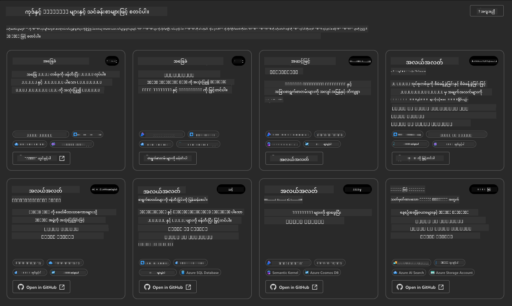

**Basic** options တွေဟာ starter templates တွေဖြစ်ပါတယ်:

1. [ ] [Get Started with AI Chat](https://github.com/Azure-Samples/get-started-with-ai-chat) ဟာ basic chat application ကို _သင့် data_ နဲ့ Azure Container Apps မှာ deploy လုပ်ပေးပါတယ်။ AI chatbot scenario ကိုစမ်းသုံးဖို့ဒီ template ကိုအသုံးပြုပါ။
1. [X] [Get Started with AI Agents](https://github.com/Azure-Samples/get-started-with-ai-agents) ဟာ standard AI Agent (Azure AI Agent Service နဲ့) ကို deploy လုပ်ပေးပါတယ်။ tools နဲ့ models တွေပါဝင်တဲ့ agentic AI solutions ကိုနားလည်ဖို့ဒီ template ကိုအသုံးပြုပါ။

အပေါ်က link ကို browser tab အသစ်မှာဖွင့်ပါ (သို့မဟုတ် `Open in GitHub` ကိုနှိပ်ပါ။) AZD Template ရဲ့ repository ကိုတွေ့ရပါမယ်။ README ကိုကြည့်ဖို့အချိန်ယူပါ။ Application architecture ဟာဒီလိုပုံစံရှိပါတယ်:

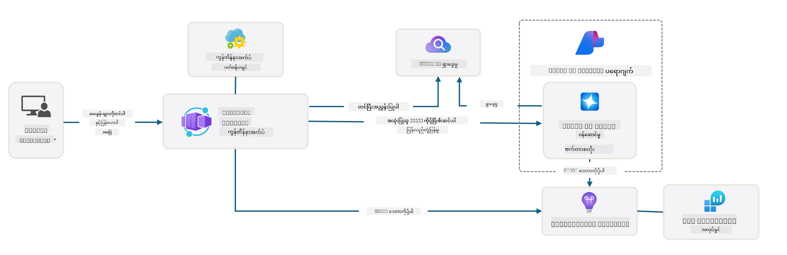

---

## 3. Template Activation

ဒီ template ကို deploy လုပ်ပြီး valid ဖြစ်တာကိုအတည်ပြုကြည့်ရအောင်။ [Getting Started](https://github.com/Azure-Samples/get-started-with-ai-agents?tab=readme-ov-file#getting-started) အပိုင်းမှာ guidelines တွေကိုလိုက်နာပါ။

1. [ဒီ link](https://github.com/codespaces/new/Azure-Samples/get-started-with-ai-agents) ကိုနှိပ်ပါ - `Create codespace` ကိုအတည်ပြုပါ
1. Browser tab အသစ်ကိုဖွင့်ပါ - GitHub Codespaces session load ပြီးအောင်စောင့်ပါ
1. Codespaces မှာ VS Code terminal ကိုဖွင့်ပြီး ဒီ command ကိုရိုက်ပါ:

   ```bash title="" linenums="0"
   azd up
   ```

Workflow steps တွေကိုပြီးစီးအောင်လုပ်ပါ:

1. Azure မှာ log in လုပ်ဖို့ prompt လုပ်ပါမယ် - authenticate လုပ်ဖို့ညွှန်ကြားချက်တွေကိုလိုက်နာပါ
1. သင့်အတွက် unique environment name တစ်ခုထည့်ပါ - ဥပမာ၊ `nitya-mshack-azd` ကိုသုံးခဲ့တယ်
1. `.azure/` folder တစ်ခုကိုဖန်တီးပါမယ် - env name နဲ့ subfolder တစ်ခုကိုတွေ့ရပါမယ်
1. Subscription name ကိုရွေးဖို့ prompt လုပ်ပါမယ် - default ကိုရွေးပါ
1. Location ကိုရွေးဖို့ prompt လုပ်ပါမယ် - `East US 2` ကိုသုံးပါ

Provisioning ပြီးအောင်စောင့်ပါ။ **ဒီအချိန်ဟာ 10-15 မိနစ်ကြာနိုင်ပါတယ်**

1. ပြီးသွားတဲ့အခါ console မှာ SUCCESS message တစ်ခုကိုဒီလိုပုံစံနဲ့တွေ့ရပါမယ်:
      ```bash title="" linenums="0"
      SUCCESS: Your up workflow to provision and deploy to Azure completed in 10 minutes 17 seconds.
      ```
1. Azure Portal မှာ environment name နဲ့ resource group တစ်ခုကို provision လုပ်ထားတာတွေ့ရပါမယ်:

      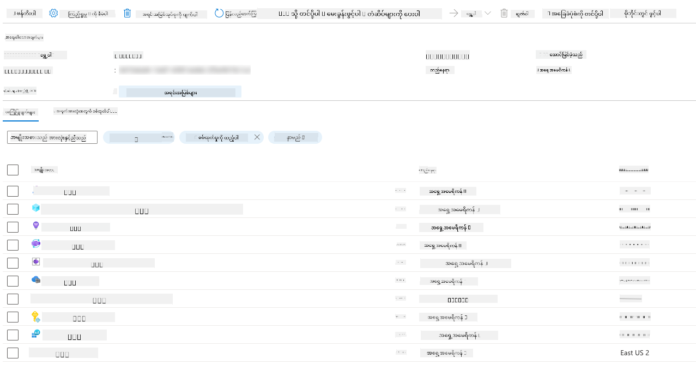

1. **Deploy လုပ်ထားတဲ့ infrastructure နဲ့ application ကိုအတည်ပြုဖို့အဆင်သင့်ဖြစ်ပါပြီ**။

---

## 4. Template Validation

1. Azure Portal [Resource Groups](https://portal.azure.com/#browse/resourcegroups) page ကိုသွားပါ - log in လုပ်ဖို့ prompt လုပ်ပါမယ်
1. သင့် environment name ရဲ့ RG ကိုနှိပ်ပါ - အပေါ်က page ကိုတွေ့ရပါမယ်

      - Azure Container Apps resource ကိုနှိပ်ပါ
      - _Essentials_ အပိုင်း (အပေါ်ညာဘက်) မှာ Application Url ကိုနှိပ်ပါ

1. Hosted application front-end UI ကိုဒီလိုပုံစံနဲ့တွေ့ရပါမယ်:

   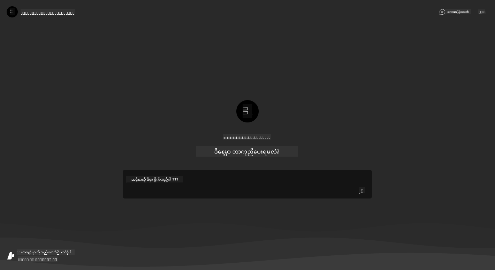

1. [sample questions](https://github.com/Azure-Samples/get-started-with-ai-agents/blob/main/docs/sample_questions.md) တချို့ကိုစမ်းကြည့်ပါ

      1. ```What is the capital of France?``` လို့မေးပါ
      1. ```What's the best tent under $200 for two people, and what features does it include?``` လို့မေးပါ

1. အောက်မှာပြထားတဲ့အတိုင်းဖြေကြားချက်တွေကိုရပါမယ်။ _ဒါကဘယ်လိုအလုပ်လုပ်သလဲ?_ 

      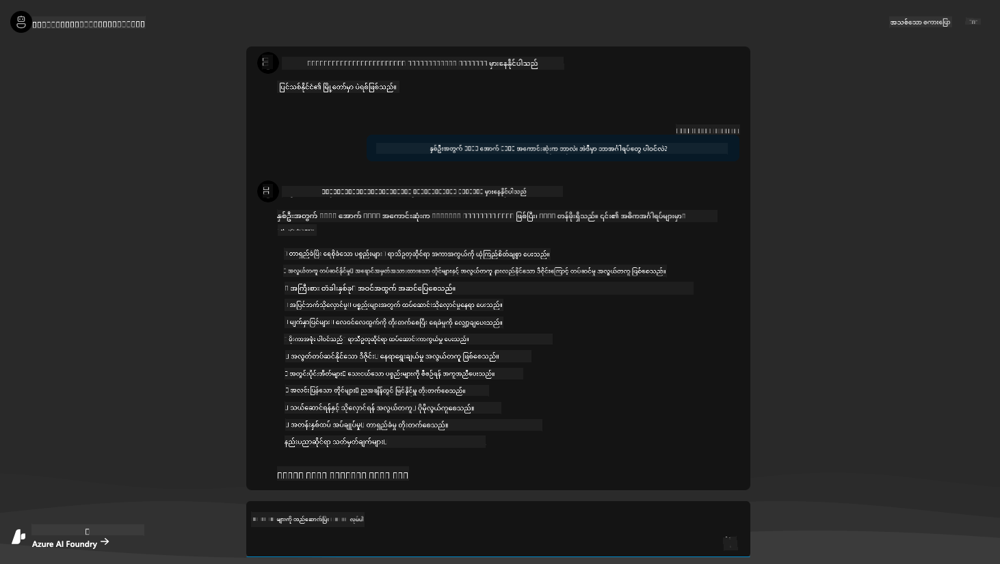

---

## 5. Agent Validation

Azure Container App ဟာ endpoint တစ်ခုကို deploy လုပ်ပြီး ဒီ template အတွက် Azure AI Foundry project မှာ provision လုပ်ထားတဲ့ AI Agent နဲ့ချိတ်ဆက်ပေးပါတယ်။ ဒါဟာဘာကိုဆိုလိုတာလဲဆိုတာကြည့်ရအောင်။

1. Azure Portal မှာ သင့် resource group ရဲ့ _Overview_ page ကိုပြန်သွားပါ

1. List မှာ `Azure AI Foundry` resource ကိုနှိပ်ပါ

1. ဒီလိုအရာတစ်ခုကိုတွေ့ရပါမယ်။ `Go to Azure AI Foundry Portal` button ကိုနှိပ်ပါ။ 
   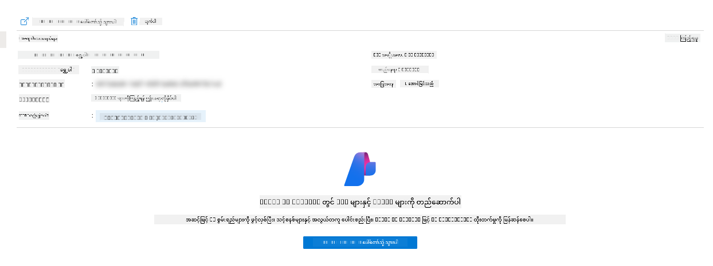

1. သင့် AI application အတွက် Foundry Project page ကိုတွေ့ရပါမယ်
   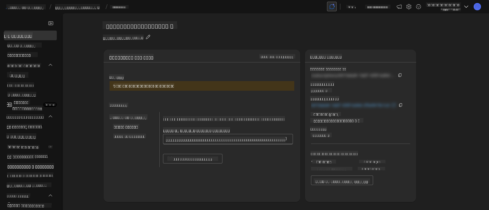

1. `Agents` ကိုနှိပ်ပါ - သင့် project မှာ provision လုပ်ထားတဲ့ default Agent ကိုတွေ့ရပါမယ်
   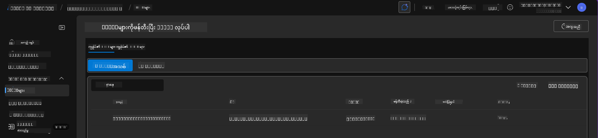

1. Agent ကိုရွေးပါ - Agent details ကိုတွေ့ရပါမယ်။ အောက်ပါအချက်တွေကိုသတိပြုပါ:

      - Agent ဟာ File Search ကို default အနေနဲ့အသုံးပြုပါတယ် (အမြဲ)
      - Agent ရဲ့ `Knowledge` မှာ file search အတွက် 32 files upload လုပ်ထားတာတွေ့ရပါမယ်
      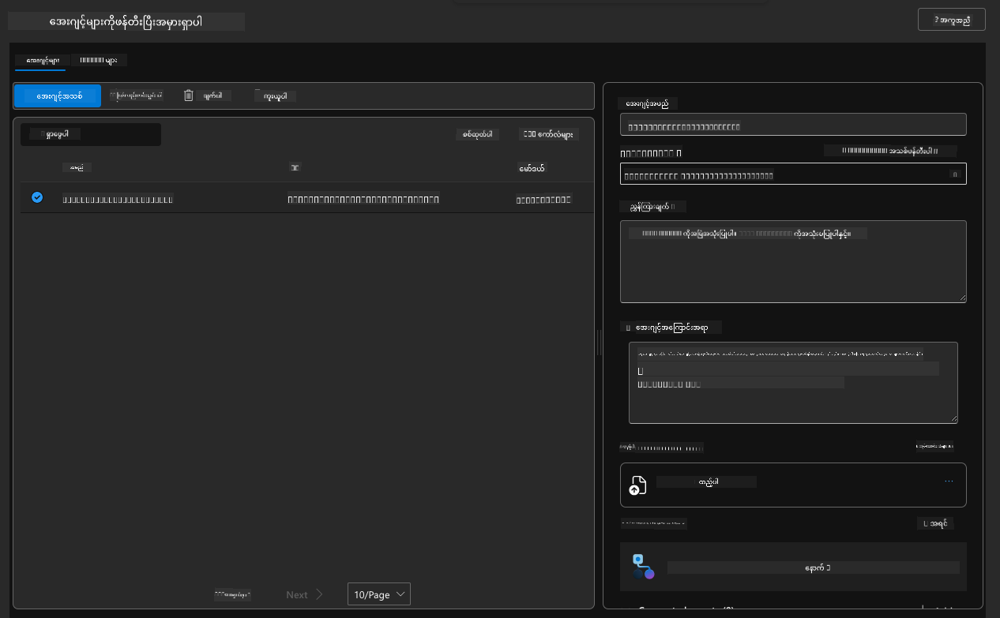

1. ဘယ် menu မှာ `Data+indexes` option ကိုရှာပြီး details ကိုကြည့်ပါ။ 

      - Knowledge အတွက် upload လုပ်ထားတဲ့ 32 data files တွေကိုတွေ့ရပါမယ်။
      - ဒီ files တွေဟာ `src/files` အောက်မှာရှိတဲ့ 12 customer files နဲ့ 20 product files တွေကိုကိုက်ညီပါမယ်။
      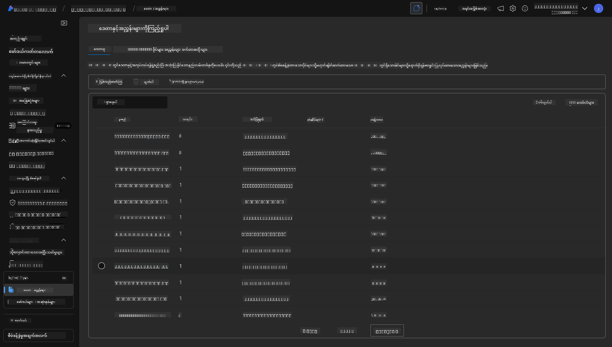

**Agent operation ကိုအတည်ပြုပြီးပါပြီ!**

1. Agent ရဲ့ response တွေဟာ အဲ့ဒီ files တွေထဲက knowledge ကိုအခြေခံထားပါတယ်။
1. အဲ့ဒီ data နဲ့ဆိုင်တဲ့မေးခွန်းတွေကိုမေးပြီး grounded responses ရနိုင်ပါတယ်။
1. ဥပမာ: `customer_info_10.json` မှာ "Amanda Perez" ရဲ့ 3 purchases ကိုဖော်ပြထားပါတယ်။

Container App endpoint ရဲ့ browser tab ကိုပြန်သွားပြီး `What products does Amanda Perez own?` လို့မေးပါ။ ဒီလိုအရာတစ်ခုကိုတွေ့ရပါမယ်:

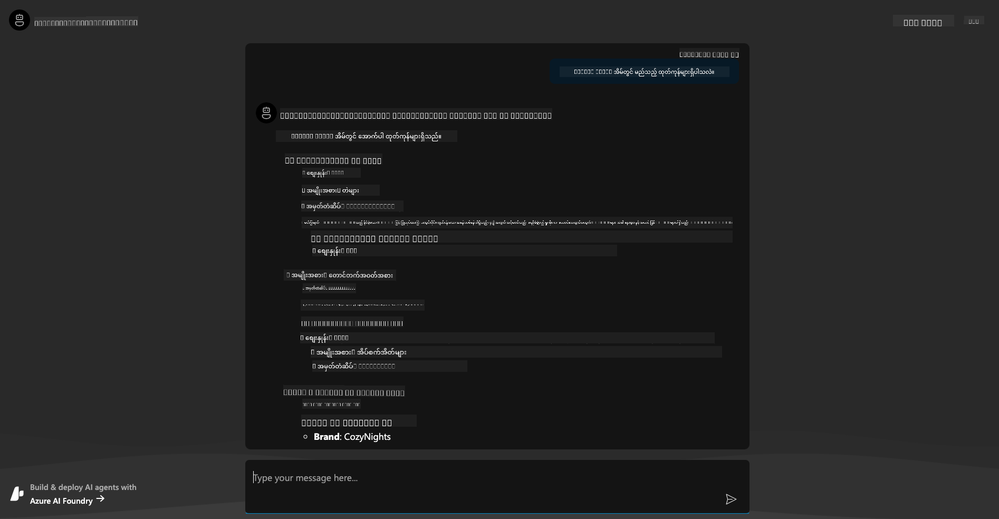

---

## 6. Agent Playground

Azure AI Foundry ရဲ့စွမ်းရည်တွေကိုနားလည်ဖို့ Agent ကို Agents Playground မှာစမ်းကြည့်ရအောင်။

1. Azure AI Foundry ရဲ့ `Agents` page ကိုပြန်သွားပါ - default agent ကိုရွေးပါ
1. `Try in Playground` option ကိုနှိပ်ပါ - Playground UI ကိုဒီလိုပုံစံနဲ့တွေ့ရပါမယ်
1. အဲ့ဒီမေးခွန်းကိုပြန်မေးပါ: `What products does Amanda Perez own?`

    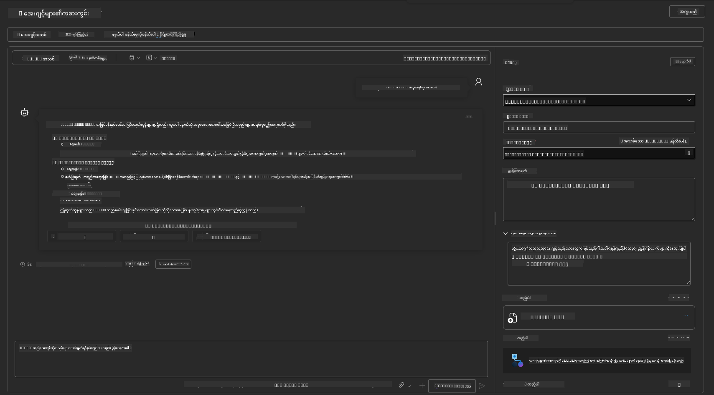

အဲ့ဒီ response ကိုပြန်ရပါမယ် (သို့မဟုတ်) response နဲ့ဆင်တူတဲ့အရာကိုရပါမယ် - ဒါပေမယ့် response ရဲ့ quality, cost, နဲ့ performance ကိုနားလည်ဖို့အသုံးပြုနိုင်တဲ့အချက်တွေကိုလည်းတွေ့ရပါမယ်။ ဥပမာ:

1. Response ကို "ground" လုပ်ဖို့အသုံးပြုတဲ့ data files တွေကိုဖော်ပြထားပါတယ်။
1. File labels တွေကို hover လုပ်ပါ - သင့် query နဲ့ response ကိုက်ညီမှုကိုကြည့်ပါ။

Response အောက်မှာ _stats_ row တစ်ခုကိုလည်းတွေ့ရပါမယ်။

1. Metrics တစ်ခုခုကို hover လုပ်ပါ - ဥပမာ၊ Safety. ဒီလိုအရာတစ်ခုကိုတွေ့ရပါမယ်
1. Response ရဲ့ safety level အတွက် rating ဟာ သင့်အတွေးအမြင်နဲ့ကိုက်ညီပါသလား?

      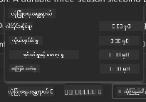

---

## 7. Built-in Observability

Observability ဟာ application ကို debug လုပ်ဖို့နဲ့ optimize လုပ်ဖို့အသုံးပြုနိုင်တဲ့ data ကိုထုတ်လုပ်ဖို့ application ကို instrument လုပ်တာကိုဆိုလိုပါတယ်။ ဒီအကြောင်းကိုနားလည်ဖို့:

1. `View Run Info` button ကိုနှိပ်ပါ - ဒီ view ကိုတွေ့ရပါမယ်။ ဒီဟာ [Agent tracing](https://learn.microsoft.com/en-us/azure/ai-foundry/how-to/develop/trace-agents-sdk#view-trace-results-in-the-azure-ai-foundry-agents-playground) ရဲ့ဥပမာတစ်ခုဖြစ်ပါတယ်။ _Thread Logs ကို top-level menu မှာနှိပ်ပြီးလည်းဒီ view ကိုရနိုင်ပါတယ်_။

   - Agent ရဲ့ run steps နဲ့ tools တွေကိုနားလည်ပါ
   - Response အတွက် total Token count (vs. output tokens usage) ကိုနားလည်ပါ
   - Latency နဲ့ execution မှာအချိန်ကုန်ကျမှုကိုနားလည်ပါ

      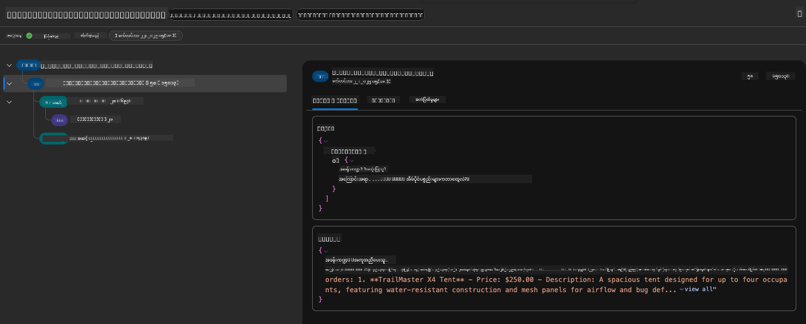

1. `Metadata` tab ကိုနှိပ်ပြီး run အတွက် debugging issues တွေကိုနောက်ပိုင်းမှာအသုံးပြုနိုင်တဲ့အချက်တွေကိုကြည့်ပါ။   

      

1. `Evaluations` tab ကိုနှိပ်ပြီး agent response အပေါ် auto-assessments တွေကိုကြည့်ပါ။ ဒီအထဲမှာ safety evaluations (ဥပမာ၊ Self-harm) နဲ့ agent-specific evaluations (ဥပမာ၊ Intent resolution, Task adherence) ပါဝင်ပါတယ်။

      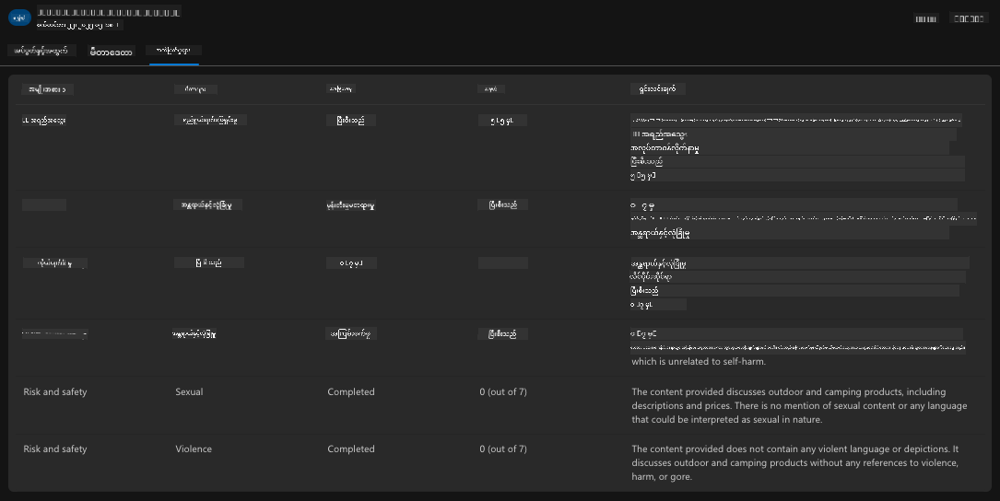

1. နောက်ဆုံးအနေနဲ့ sidebar menu မှာ `Monitoring` tab ကိုနှိပ်ပါ။

      - `Resource usage` tab ကိုရွေးပြီး metrics တွေကိုကြည့်ပါ။
      - Application usage ကို cost (tokens) နဲ့ load (requests) အနေနဲ့ track လုပ်ပါ။
      - Application latency ကို first byte (input processing) နဲ့ last byte (output) အနေနဲ့ track လုပ်ပါ။

      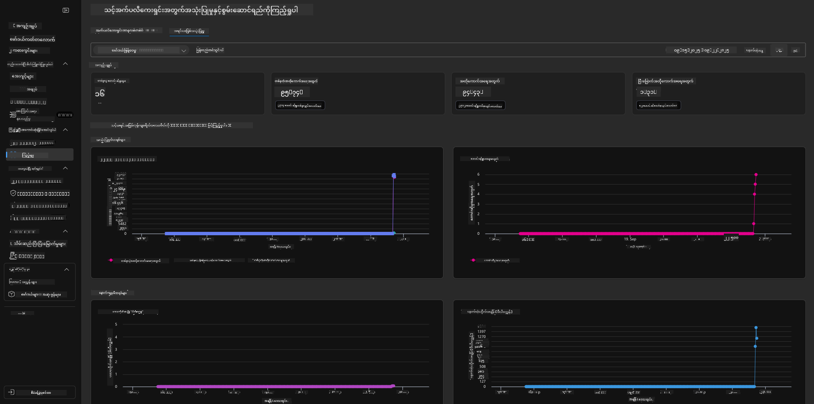

---

## 8. Environment Variables

အခုထိ browser မှာ deployment ကို walkthrough လုပ်ပြီး infrastructure provision လုပ်ထားတာနဲ့ application operational ဖြစ်တာကိုအတည်ပြုပြီးပါပြီ။ ဒါပေမယ့် application ကို _code-first_ နဲ့အလုပ်လုပ်ဖို့အတွက် resource တွေကိုအသုံးပြုဖို့လိုအပ်တဲ့ variables တွေကို local development environment မှာ configure လုပ်ဖို့လိုပါတယ်။ `azd` ကိုအသုံးပြုပြီးဒီအရာကိုလွယ်ကူစေပါတယ်။

1. Azure Developer CLI [environment variables](https://learn.microsoft.com/en-us/azure/developer/azure-developer-cli/manage-environment-variables?tabs=bash) တွေကိုအသုံးပြုပြီး application deployments အတွက် configuration settings တွေကိုသိမ်းဆည်းပြီးစီမံခန့်ခွဲပါတယ်။

1. Environment variables တွေကို `.azure/<env-name>/.env` မှာသိမ်းဆည်းထားပြီး deployment အတွင်း environment name ကို scope လုပ်ထားပါတယ်။ ဒီဟာက repo တစ်ခုအတွင်းမှာ deployment targets မတူတဲ့ environments တွေကို isolate လုပ်ဖို့အထောက်အကူပြုပါတယ်။

1. Environment variables တွေကို `azd` command က automatically load လုပ်ပြီး specific command (ဥပမာ၊ `azd up`) ကို execute လုပ်ပါတယ်။ သို့သော် `azd` ဟာ _OS-level_ environment variables (ဥပမာ၊ shell မှာ set လုပ်ထားတဲ့) ကို automatic မဖတ်ပါဘူး - script တွေအတွင်းမှာ information ကိုပို့ဖို့ `azd set env` နဲ့ `azd get env` ကိုအသုံးပြုပါ။

Commands တချို့ကိုစမ်းကြည့်ရအောင်:

1. ဒီ environment အတွက် `azd` မှာ set လုပ်ထားတဲ့ environment variables အားလုံးကိုရယူပါ:

      ```bash title="" linenums="0"
      azd env get-values
      ```
      
      ဒီလိုအရာတစ်ခုကိုတွေ့ရပါမယ်:

      ```bash title="" linenums="0"
      AZURE_AI_AGENT_DEPLOYMENT_NAME="gpt-4o-mini"
      AZURE_AI_AGENT_NAME="agent-template-assistant"
      AZURE_AI_EMBED_DEPLOYMENT_NAME="text-embedding-3-small"
      AZURE_AI_EMBED_DIMENSIONS=100
      ...
      ```

1. Specific value တစ်ခုကိုရယူပါ - ဥပမာ၊ `AZURE_AI_AGENT_MODEL_NAME` value ကို set လုပ်ထားမထားသိချင်တယ်

      ```bash title="" linenums="0"
      azd env get-value AZURE_AI_AGENT_MODEL_NAME 
      ```
      
      ဒီလိုအရာတစ်ခုကိုတွေ့ရပါမယ် - default အနေနဲ့ set လုပ်ထားမထားပါဘူး!

      ```bash title="" linenums="0"
      ERROR: key 'AZURE_AI_AGENT_MODEL_NAME' not found in the environment values
      ```

1. `azd` အတွက် environment variable အသစ်တစ်ခုကို set လုပ်ပါ။ ဒီမှာ agent model name ကို update လုပ်ပါတယ်။ _မှတ်ချက်: ပြောင်းလဲမှုတွေဟာ `.azure/<env-name>/.env` file မှာချက်ချင်းပြသပါမယ်။

      ```bash title="" linenums="0"
      azd env set AZURE_AI_AGENT_MODEL_NAME gpt-4.1
      azd env set AZURE_AI_AGENT_MODEL_VERSION 2025-04-14
      azd env set AZURE_AI_AGENT_DEPLOYMENT_CAPACITY 150
      ```

      အခုတော့ value ကို set လုပ်ထားတာတွေ့ရပါမယ်:

      ```bash title="" linenums="0"
      azd env get-value AZURE_AI_AGENT_MODEL_NAME 
      ```

1. အချို့ resource တွေဟာ persistent (ဥပမာ၊ model deployments) ဖြစ်ပြီး env vars ပြောင်းလဲမှုကို force လုပ်ဖို့ `azd up` တစ်ခုထက်ပိုလိုအပ်နိုင်ပါတယ်။ Original deployment ကိုဖျက်ပြီး env vars ပြောင်းလဲထားတဲ့အခြေအနေနဲ့ပြန် deploy လုပ်ကြည့်ရအောင်။

1. **Refresh** အကယ်၍ azd template ကိုအသုံးပြုပြီး infrastructure ကိုအရင် deploy လုပ်ထားခဲ့ရင် - Azure deployment ရဲ့ current state အပေါ်အခြေခံပြီး local environment variables ရဲ့ state ကို _refresh_ လုပ်ဖို့ဒီ command ကိုအသုံးပြုပါ:
      ```bash title="" linenums="0"
      azd env refresh
      ```

      ဒါဟာ ပိုမိုအားကောင်းတဲ့နည်းလမ်းတစ်ခုဖြစ်ပြီး _sync_ လုပ်ထားသော ပတ်ဝန်းကျင် variable များကို ဒေသတွင်း ဖွံ့ဖြိုးရေးပတ်ဝန်းကျင်များ (ဥပမာ၊ developer များစွာပါဝင်သောအဖွဲ့) အကြားတွင်မျှဝေစေပါသည်။ ဒါဟာ deploy လုပ်ထားသော infrastructure ကို variable state အတွက် ground truth အဖြစ်အသုံးပြုနိုင်စေပြီး အဖွဲ့ဝင်များသည် variable များကို _refresh_ လုပ်ခြင်းဖြင့် ပြန်လည်မျှဝေမှုကိုရယူနိုင်ပါသည်။

---

## 9. အောင်မြင်မှု 🏆

သင်သည် အဆုံးမှအဆုံး workflow တစ်ခုကို ပြီးမြောက်စွာလုပ်ဆောင်ခဲ့ပြီး အောက်ပါအရာများကို ပြုလုပ်ခဲ့ပါသည်-

- [X] သင်အသုံးပြုလိုသော AZD Template ကို ရွေးချယ်ခဲ့သည်
- [X] GitHub Codespaces ဖြင့် Template ကို စတင်ခဲ့သည်
- [X] Template ကို deploy လုပ်ပြီး အလုပ်လုပ်မှုကို အတည်ပြုခဲ့သည်

---

