# 2. တမ်းပလိတ်ကို စစ်ဆေးခြင်း

!!! tip "ဤမော်ဂျူးလ် အဆုံးတွင် သင်အောက်ပါအချက်များကို ကျွမ်းကျင်နိုင်မည်"

    - [ ] AI ဖြေရှင်းချက် များ၏ ဆောက်လုပ်ရေး معمိတာကို ခွဲခြမ်းစိတ်ဖြာနိုင်မည်
    - [ ] AZD ဖြင့် ဖြန့်ကျက်မှု လုပ်ငန်းစဉ်ကို နားလည်နိုင်မည်
    - [ ] AZD အသုံးပြုမှုအတွက် GitHub Copilot ကို အကူအညီယူနိုင်မည်
    - [ ] **Lab 2:** AI Agents တမ်းပလိတ်ကို ဖြန့်ချိ၍ စစ်ဆေးမည်

---


## 1. နိဒါန်း

[Azure Developer CLI](https://learn.microsoft.com/en-us/azure/developer/azure-developer-cli/) သို့မဟုတ် `azd` သည် Azure သို့ အက်ပလီကေးရှင်းများကို တည်ဆောက်ပြီး ဖြန့်ချိရာတွင် ဖန်တီးသူတို့၏ အလုပ်စဉ်ကို လျှော့ချပေးသည့် open-source command-line ကိရိယာတစ်ခုဖြစ်သည်။

[AZD Templates](https://learn.microsoft.com/azure/developer/azure-developer-cli/azd-templates) များမှာ နမူနာ အက်ပလီကေးရှင်း ကုဒ်၊ _infrastructure-as-code_ အရင်းအမြစ်များနှင့် `azd` ပြင်ဆင်မှု ဖိုင်များကို တစ်စုတည်း အုပ်စုဖွဲ့ထားသော စံတမ်း repository များဖြစ်ပြီး ဖြေရှင်းချက်တစ်ခုစီအတွက် သေချာစေရန် ဖွဲ့စည်းပုံကို ထောက်ပံ့ပေးသည်။ အင်ဖရာကို provision ပြုလုပ်ခြင်းသည် `azd provision` ကဲ့သို့သော command တစ်ခုနဲ့ ရိုးရှင်းစွာ ပြုလုပ်နိုင်သည် — ထို့ပြင် `azd up` သည် အင်ဖရာကို provision ပြုလုပ်ပြီး သင့်အက်ပလီကေးရှင်းကို တစ်ပြိုင်နက်တည်း ဖြန့်ချိပေးနိုင်သည်။

ရလဒ်အနေဖြင့် သင့်အက်ပလီကေးရှင်း ဖွံ့ဖြိုးရေး လုပ်ငန်းစဉ်ကို စတင်ရန်အတွက် သင့်တင်သွင်းလိုအပ်ချက်နှင့် ကိုက်ညီသော _AZD Starter template_ ကို ရွေးချယ်ပြီး repository ကို သင့်အခြေအနေအရ အပြင်ဆင်ပေးခြင်းဖြင့် လွယ်ကူစွာ အစပြုနိုင်သည်။

စတင်မီ၌ Azure Developer CLI ကို ထည့်ထားပြီးဖြစ်ကြောင်း သေချာစေရအောင် လုပ်ဆောင်လိုက်စို့။

1. VS Code terminal ကို ဖွင့်၍ ဤ command ကို ရိုက်ထည့်ပါ။

      ```bash title="" linenums="0"
      azd version
      ```

1. ဤလိုမျိုး အချက်အလက်ကို မြင်မြင်ရပါမည်။

      ```bash title="" linenums="0"
      azd version 1.19.0 (commit b3d68cea969b2bfbaa7b7fa289424428edb93e97)
      ```

**အခု သင်သည် azd ဖြင့် တမ်းပလိတ်ကို ရွေးချယ်၍ ဖြန့်ချိနိုင်ရန် အသင့်ပါ**

---

## 2. တမ်းပလိတ် ရွေးချယ်ခြင်း

Microsoft Foundry ပလက်ဖောင်းတွင် [အကြံပြုထားသော AZD templates များ၏ စုစည်းမှု](https://learn.microsoft.com/en-us/azure/ai-foundry/how-to/develop/ai-template-get-started) ရှိပြီး ၎င်းများမှာ _multi-agent workflow automation_ နှင့် _multi-modal content processing_ ကဲ့သို့ လူကြိုက်များသော ဖြေရှင်းချက် စနစ်များကို ဖုံးလွှမ်းထားသည်။ သင်သည် Microsoft Foundry ပေါ်တယ်တွင်လည်း ဤ templates များကို ရှာဖွေနိုင်သည်။

1. [https://ai.azure.com/templates](https://ai.azure.com/templates) သို့ ရောက်ရှိပါ
1. ဖော်ပြသောအတိုင်း Microsoft Foundry ပေါ်တယ်သို့ လော့ဂ်အင်လုပ်ပါ - သင်ဤလိုမျိုး မြင်ရမည်။

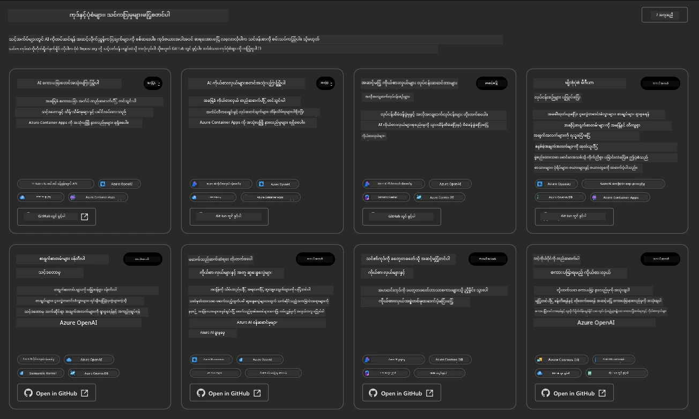


**Basic** ရွေးချယ်စရာများသည် သင့်စတားတာ template များဖြစ်သည်။

1. [ ] [Get Started with AI Chat](https://github.com/Azure-Samples/get-started-with-ai-chat) — သင့်ဒေတာနှင့် အတူ Azure Container Apps သို့ မူလ မက်ဆေ့ခ််ချတ် အက်ပလီကေးရှင်းအခြေခံပုံစံကို ဖြန့်ချိသည်။ အခြေခံ AI chatbot အမှုသမားကို စမ်းသပ်ရန် အသုံးပြုနိုင်သည်။
1. [X] [Get Started with AI Agents](https://github.com/Azure-Samples/get-started-with-ai-agents) — ၎င်းသည် တူညီသော ထုံးစံ AI Agent (Foundry Agents နှင့်အတူ) ကိုလည်း တည်ဆောက်ဖြန့်ချိသည်။ tools နှင့် models တွေပါဝင်သည့် agentic AI ဖြေရှင်းချက်များသို့ ရင်းနှီးစေခြင်းအတွက် ၎င်းကို အသုံးပြုပါ။

နှစ်ခုရဲ့ ဒုတိယလင့်ခ်ကို ဘရောက်ဇာတွင် ထပ်တစ် tab ဖြင့် ဖွင့်ပါ (သို့မဟုတ် သက်ဆိုင်ရာ ကတ်၏ `Open in GitHub` ကို နှိပ်ပါ)။ သင့်အား ဤ AZD Template အတွက် repository ကို မြင်ရမည်။ README ကို အနည်းငယ် ကြည့်ရှုပါ။ အက်ပလီကေးရှင်း၏ ဖွဲ့စည်းပုံမှာ ဤအတိုင်း ဖြစ်သည်။

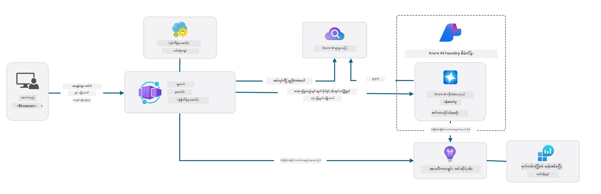

---

## 3. တမ်းပလိတ် ဖန်တီးဖွင့်ခြင်း

ယခု တမ်းပလိတ်အား ဖြန့်ချိ၍ တရားဝင်ဖြစ်မည့်အချက်ကို စစ်ဆေးကြည့်မည်။ [Getting Started](https://github.com/Azure-Samples/get-started-with-ai-agents?tab=readme-ov-file#getting-started) အပိုင်းတွင် လမ်းညွှန်ထားသည့် အတိုင်း လိုက်နာမည်။

1. ဤလင့်ခ်ကို နှိပ်ပါ [this link](https://github.com/codespaces/new/Azure-Samples/get-started-with-ai-agents) — ဗဟိုလုပ်ဆောင်မှုအား `Create codespace` အဖြစ် အတည်ပြုပါ
1. ဤနေရာတွင် ဘရောက်ဇာ အသစ်တစ်ခု ဖွင့်သည် - GitHub Codespaces အချိန်ကုန်သောင် loading ပြီးဆုံးရန် စောင့်ပါ
1. Codespaces တွင် VS Code terminal ကို ဖွင့်ပြီး အောက်ပါ command ကို ရိုက်ထည့်ပါ။

   ```bash title="" linenums="0"
   azd up
   ```

ဤကိရိယာသည် ထည့်သွင်းမည့် workflow အဆင့်များကို trigger လိမ့်မည်ကို ပြီးမြောက်ပါ။

1. Azure သို့ လော့ဂ်အင်ရန် အတိုင်ပင်ခံမေးถาม များ ပြသမည် - authentication လုပ်ရန် ညွှန်ကြားချက်များကို 따르ပါ
1. သင့်အတွက် ထူးခြားသော environment name တစ်ခု ရိုက်ထည့်ပါ — ဥပမာ၊ ငါ သုံးခဲ့သည် `nitya-mshack-azd`
1. ဤအလုပ်က `.azure/` ဖိုလ်ဒါကို ဖန်တီးမည် — သင် env name ဖြင့် subfolder တစ်ခု မြင်ရမည်
1. subscription name ရွေးရန် မေးမည် — default ကို ရွေးချယ်ပါ
1. တည်နေရာ (location) မေးမည် — `East US 2` ကို အသုံးပြုပါ

အခု Provisioning ပြီးဆုံးရန် စောင့်ဆိုင်းပါ။ **ဤကိစ္စသည် 10-15 မိနစ် ကြာနိုင်သည်**

1. ပြီးဆုံးသွားပါက သင့်ကွန်ဆိုလ်တွင် SUCCESS စာသားမျိုးကို မြင်ရမည်။
      ```bash title="" linenums="0"
      SUCCESS: Your up workflow to provision and deploy to Azure completed in 10 minutes 17 seconds.
      ```
1. သင့် Azure Portal တွင် အဆိုပါတာဝန်အပါအဝင် resource group တစ်ခု ထည့်သွင်းထားပါလိမ့်မည်။

      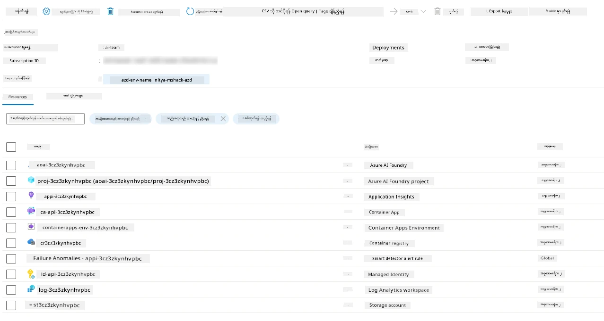

1. **အခု သင်သည် ဖြန့်ချိထားသော အင်ဖရာနှင့် အက်ပလီကေးရှင်းကို စစ်ဆေးရန် အသင့်ဖြစ်ပြီ။**

---

## 4. တမ်းပလိတ် စစ်ဆေးခြင်း

1. Azure Portal တွင် [Resource Groups](https://portal.azure.com/#browse/resourcegroups) စာမျက်နှာသို့ သွားပါ - လော့ဂ်အင် လိုအပ်ပါက လုပ်ဆောင်ပါ
1. သင့် environment name အတွက် RG ကို နှိပ်ပါ - အထက်ပါ စာမျက်နှာကို မြင်ရမည်။

      - Azure Container Apps resource ကို နှိပ်ပါ
      - _Essentials_ အပိုင်း (အပေါ်ညာဘက်) တွင်ရှိသည့် Application Url ကို နှိပ်ပါ

1. သင့်အား ဤကဲ့သို့ hosting ထားသော အက်ပလီကေးရှင်း ရှေ့နား UI ကို မြင်ရမည်။

   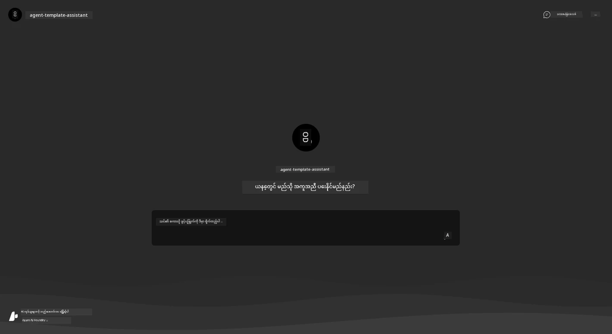

1. [နမူနာ မေးခွန်းများ](https://github.com/Azure-Samples/get-started-with-ai-agents/blob/main/docs/sample_questions.md) တစ်ချို့ကို မေးကြည့်ပါ။

      1. မေးပါ: ```What is the capital of France?``` 
      1. မေးပါ: ```What's the best tent under $200 for two people, and what features does it include?```

1. အောက်ပါကဲ့သို့ အဖြေများ ရရှိရမည်။ _ဒါပေမယ့် ဤလုပ်ငန်းစဉ်သည် မည်သို့ ရှိသနည်း?_ 

      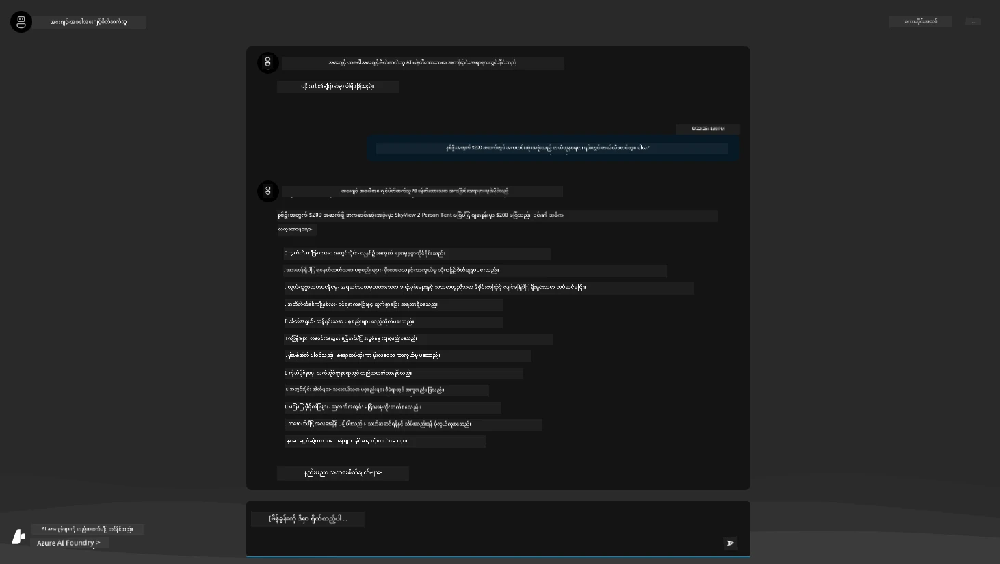

---

## 5. Agent စစ်ဆေးခြင်း

Azure Container App သည် ဒီတမ်းပလိတ်အတွက် Microsoft Foundry ပရောဂျက်တွင် provision ပြုလုပ်ထားသည့် AI Agent သို့ ချိတ်ဆက်သည့် endpoint တစ်ခုကို ဖြန့်ချိထားသည်။ ၎င်းက ဘာကို အဓိပ္ပာယ်ရသည်ကို လေ့လာကြည့်မယ်။

1. သင့် resource group အတွက် Azure Portal _Overview_ စာမျက်နှာသို့ ပြန်သွားပါ

1. အဆိုပါ စာရင်းထဲမှ `Microsoft Foundry` resource ကို နှိပ်ပါ

1. ဤအတိုင်း မြင်ရမည်။ `Go to Microsoft Foundry Portal` ခလုတ်ကို နှိပ်ပါ။
   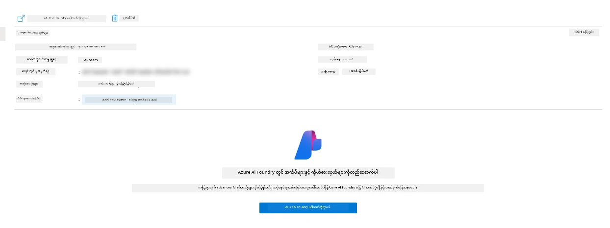

1. သင့် AI အက်ပလီကေးရှင်းအတွက် Foundry Project စာမျက်နှာကို မြင်ရမည်။
   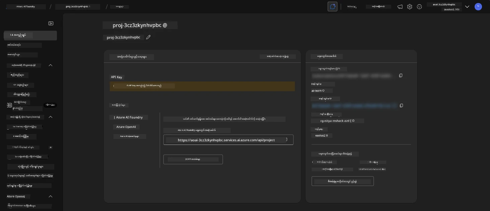

1. `Agents` ကို နှိပ်ပါ - သင့်ပရောဂျက်ထဲတွင် default Agent တစ်ခု provision ပြုလုပ်ထားသည်ကို မြင်ရမည်။
   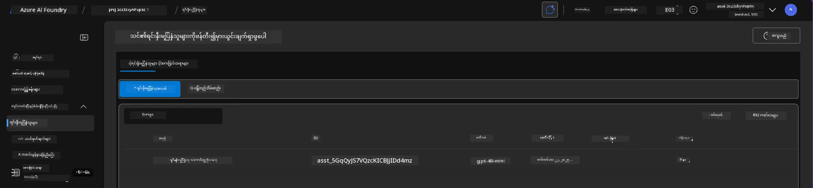

1. ၎င်းကို ရွေးချယ်ပါ - Agent အသေးစိတ်အချက်အလက်များကို မြင်ရမည်။ သတိပြုရန် အချက်အလက်များမှာ အောက်ပါအတိုင်းဖြစ်သည်။

      - အဲဒီ agent သည် အမြဲ File Search ကို စနစ်တကျ အသုံးပြုသည် (ပုံမှန်)
      - agent ၏ `Knowledge` တွင် 32 ဖိုင် upload ပြုလုပ်ထားသည်ဟု ပြပါသည် (file search အတွက်)
      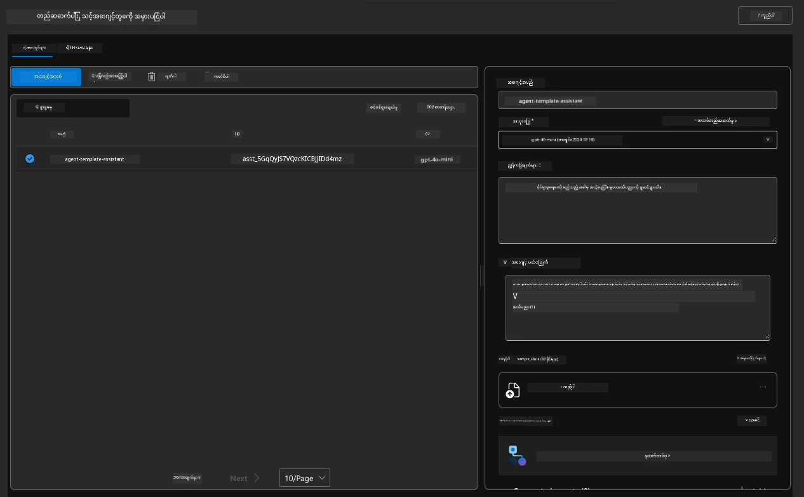

1. ဘာသာရပ် menu ၏ ဘယ်ဘက်ဧရိယာ၌ `Data+indexes` ဆိုသော ရွေးချယ်စရာကို ရှာဖွေပြီး အသေးစိတ် ကြည့်ပါ။ 

      - knowledge အတွက် upload ပြုလုပ်ထားသော 32 data ဖိုင်များကို မြင်ရမည်။
      - ၎င်းများမှာ `src/files` အောက်ရှိ customer ဖိုင် 12 ခုနှင့် product ဖိုင် 20 ခုနှင့် ကိုက်ညီမည်။
      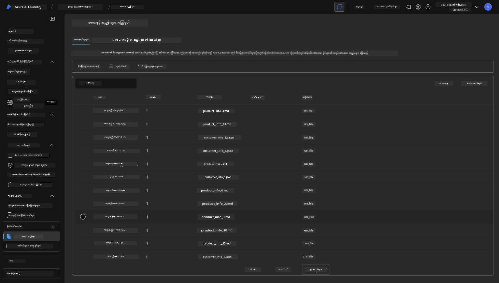

**သင်သည် Agent အလုပ်လုပ်မှုကို စစ်ဆေး အတည်ပြုပြီးဖြစ်သည်!**

1. agent ၏ တုံ့ပြန်ချက်များသည် အဆိုပါ ဖိုင်များထဲရှိ အသိပညာ (knowledge) ပေါ် မူတည်ထားသည်။
1. သင် ယခုထိုဒေတာနှင့် ဆက်စပ်သော မေးခွန်းများ မေးပြီး ကျစ်လစ်သေချာသော တုံ့ပြန်ချက်များ ရနိုင်သည်။
1. ဥပမာ - `customer_info_10.json` တွင် "Amanda Perez" က ဝယ်ယူထားသည့် အရာများ ၃ ခု ဖော်ပြထားသည်။

Container App endpoint ပါသော ဘရောက်ဇာ tab သို့ ပြန်သွားပြီး မေးပါ - `What products does Amanda Perez own?` ။ သင် ဤလိုမျိုး မြင်ရမည်။

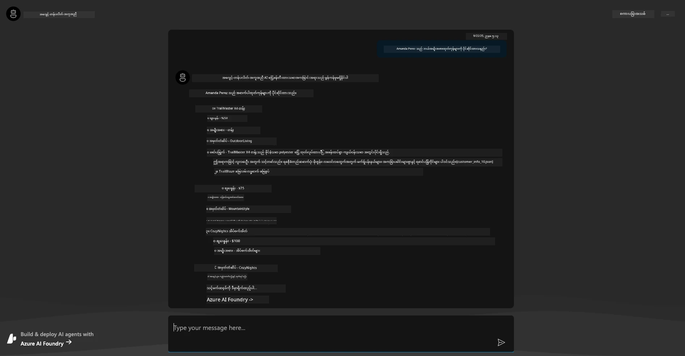

---

## 6. Agent Playground

Microsoft Foundry ၏ အင်အားများကို နားလည်ရန်အတွက် Agent ကို Agents Playground တွင် စမ်းကြည့်ပါ။

1. Microsoft Foundry တွင် `Agents` စာမျက်နှာသို့ ပြန်သွားပါ - default agent ကို ရွေးချယ်ပါ
1. `Try in Playground` ရွေးချယ်စရာကို နှိပ်ပါ - Playground UI တစ်ခုကို မြင်ရမည်
1. အဲဒီမေးခွန်းကို ထပ်မေးပါ: `What products does Amanda Perez own?`

    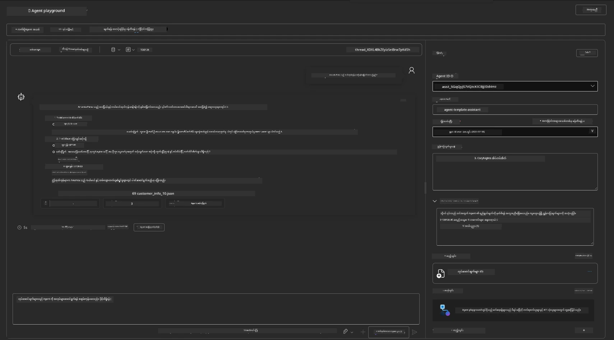

တူညီ (သို့) ဆင်တူ အဖြေကို ရရှိမည် — သို့သော် agentic အက်ပလီကေးရှင်း၏ အရည်အသွေး၊ ကုန်ကျစရိတ်နှင့် လုပ်ဆောင်မှုပမာဏကို နားလည်ရန် အသုံးဝင်သည့် အချက်အလက်များကို ထပ်မံ ရရှိနိုင်သည်။ ဥပမာ -

1. တုံ့ပြန်ချက်တွင် ground စေရန် အသုံးပြုထားသည့် data ဖိုင်များကို citation အနေဖြင့် ဖော်ပြထားသည်ကို သတိထားပါ
1. ဖိုင် label များ၏ မူလအချက်အလက်ကို မေးခွန်းနှင့် ပြထားသည့် တုံ့ပြန်ချက်နှင့် နှိုင်းယှဉ် စစ်ဆေးရန် နောက်ထပ်ဖိုင် label များကို hover လုပ်ကြည့်ပါ

တုံ့ပြန်ချက်အောက်တွင် _stats_ ရောင်းတန္းမျိုးလည်း တွေ့ရမည်။

1. metrics များအနက် Safety ကို ဥပမာ hover လုပ်ကြည့်ပါ — ဤလိုမျိုး အချက်အလက်ကို မြင်ရမည်
1. သတ်မှတ်ထားသော အကဲဖြတ်ချက်သည် သင်၏ ျဖစ္နိုင်သည့် တုံ့ပြန်ချက် လုံခြုံမှု အကြမ်းဖက်မှုနှင့် သင်၏ အာရုံထဲတွင် ကိုက်ညီပါသလား စဥ်းစားကြည့်ပါ။

      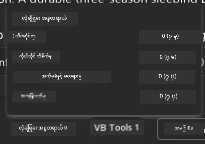

---

## 7. ရှာဖွေကြည့်နိုင်မှု (Built-in Observability)

Observability ဆိုသည်မှာ သင့်အက်ပလီကေးရှင်းကို ကိရိယာတင်၍ အချက်အလက် ထုတ်ပေးစေခြင်းဖြင့် ၎င်း၏ လုပ်ငန်းဆောင်တာများကို နားလည်ရန်၊ ပြဿနာရှာဖွေရန်နှင့် တိုးတက်စေရန် အသုံးပြုနိုင်သည့် ဒေတာကို ဖန်တီးပေးခြင်းဖြစ်သည်။ ၎င်း၏ အထွေထွေခံစားမှုကို ရရှိစေရန်:

1. `View Run Info` ခလုတ်ကို နှိပ်ပါ - ဤအမြင်ကို မြင်ရမည်။ ၎င်းသည် Agent tracing ၏ လက်တွေ့ဥပမာတစ်ခုဖြစ်သည်။ _ဤအမြင်ကို ထပ်မံလေ့လာရန် Thread Logs ကို ထိပ်တန်းမီနူးတွင် ရွေးချယ်၍လည်း ရနိုင်သည်_။

   - agent တစ်ခုဖြင့် ဆောင်ရွက်သည့် run အဆင့်များနှင့် အသုံးပြုသော tools များကို သိရှိပါ
   - တုံ့ပြန်ချက်အတွက် စုစုပေါင်း Token ကိန်းရေ (output tokens အသုံးပြုမှုနှင့် နှိုင်းယှဉ်) ကို နားလည်ပါ
   - နှောင့်နှေးချိန် (latency) နှင့် အချိန် အပိုင်းအစများသည် အလုပ်ဆောင်မှုအတွင်း ဘယ်နေရာတွေမှာ သုံးဆောင်နေသည်ကို နားလည်ပါ

      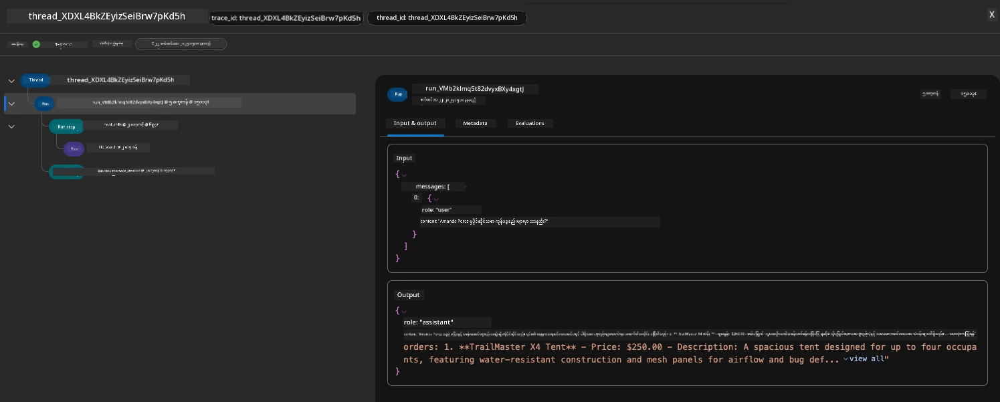

1. `Metadata` tab ကို နှိပ်၍ run အတွက် အပိုမက်တာများကို ကြည့်ပါ၊ ၎င်းသည် နောက်ပိုင်း ပြဿနာရှာဖွေရာတွင် အထောက်အကူဖြစ်နိုင်သည့် အချက်အလက်များပေးနိုင်သည်။   

      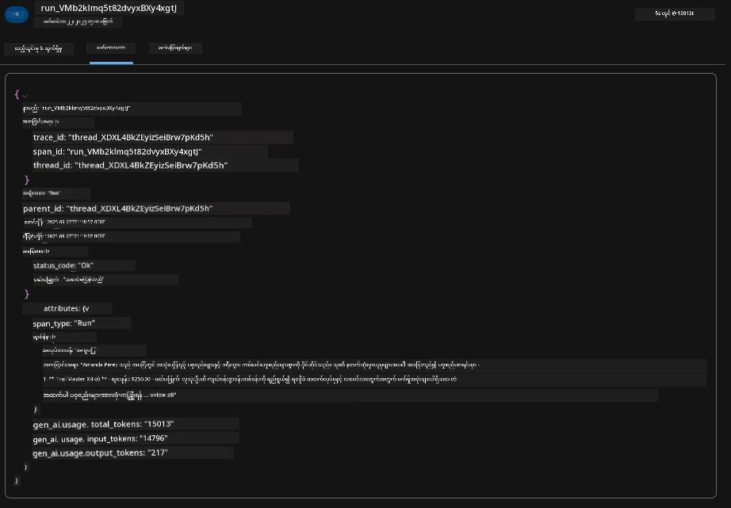


1. `Evaluations` tab ကို နှိပ်၍ agent တုံ့ပြန်ချက်ပေါ်တွင် အလိုအလျှောက် အကဲဖြတ်ထားသည့် အချက်အလက်များကို ကြည့်ပါ။ ၎င်းမှာ လုံခြုံရေး အကဲဖြတ်ချက်များ (ဥပမာ Self-harm) နှင့် agent အထူးအကဲဖြတ်ချက်များ (ဥပမာ ရည်ရွယ်ချက် ဖြေရှင်းမှု၊ လုပ်ငန်းလိုက်နာမှု) တို့ ပါဝင်သည်။

      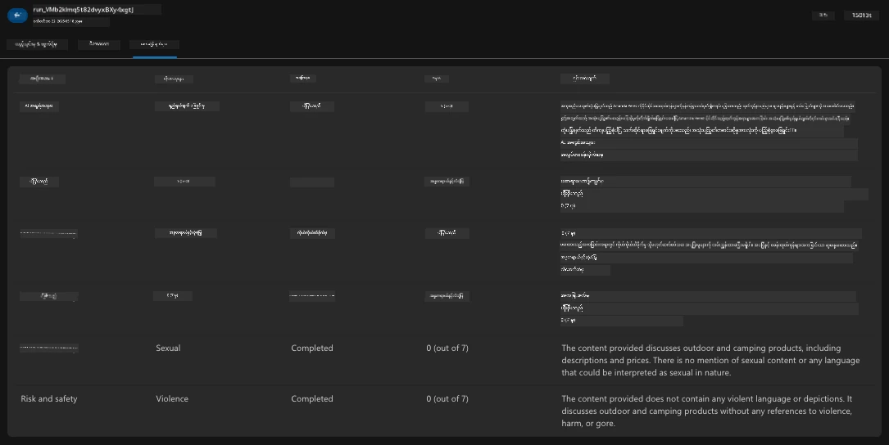

1. နောက်ဆုံးတွင် sidebar မီနူးတွင် `Monitoring` tab ကို နှိပ်ပါ။

      - ပြသနေသော စာမျက်နှာတွင် `Resource usage` tab ကို ရွေးချယ်ပြီး metrics များကို ကြည့်ပါ။
      - token ကုန်ကျစရိတ်နှင့် စကားဝိုင်း (requests) အရ သက်ဆိုင်သည့် အက်ပလီကေးရှင်း အသုံးပြုမှုကို လမ်းကြောင်းလိုက် ချိတ်ဆက်ကြည့်ပါ။
      - first byte (input processing) နှင့် last byte (output) ထိ အက်ပလီကေးရှင်း latency ကို ကိုင်တွယ်ခြေရာခံပါ။

      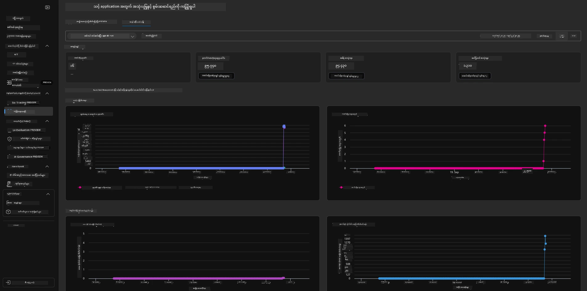

---

## 8. ပတ်ဝန်းကျင် သတ်မှတ်ချက်များ (Environment Variables)

ယခုအထိ ဗရောက်ဇာတွင် ဖြန့်ချိမှုကို လေ့လာပြီး အင်ဖရာ provision ပြီး အက်ပလီကေးရှင်း လည်ပတ်နေသည်ဟု စစ်ဆေးပြီးပြီ။ သို့သော် application ကို _code-first_ နည်းဖြင့် အလုပ်လုပ်လိုပါက ဤရင်းနှီးမြှုပ်နှံထားသော အရင်းအမြစ်များနှင့် ဆက်စပ်သည့် သတ်မှတ်ချက်များကို သင့်ဒေသတွင် ဖော်ပြရန်လိုအပ်သည်။ `azd` ကို အသုံးပြုခြင်းက ၎င်းကို လွယ်ကူစေသည်။

1. Azure Developer CLI သည် application deployment များအတွက် configuration settings များကို သိမ်းဆည်းနှင့် စီမံရန် [environment variables](https://learn.microsoft.com/en-us/azure/developer/azure-developer-cli/manage-environment-variables?tabs=bash) ကို အသုံးပြုသည်။

1. ပတ်ဝန်းကျင် သတ်မှတ်ချက်များကို `.azure/<env-name>/.env` တွင် သိမ်းဆည်းထားသည် — ၎င်းသည် deployment အတွင်းသုံးသော `env-name` အတွက် scope လုပ်ပေးပြီး တူနေသော repository အတွင်း လူတစ်ဦးနှင့် တစ်ဦးအကြား environment များကို ခွဲခြားထားနိုင်မှာ ဖြစ်သည်။

1. `azd` command သည် အထူး command (ဥပမာ `azd up`) တစ်ခုကို အလုပ်လုပ်စဉ် အလိုအလျှောက် environment variables များကို load ပြုလုပ်ပေးသည်။ သတိပြုရန် — `azd` သည် _OS-level_ environment variables (ဥပမာ shell တွင် set လုပ်ထားသော) ကို အလိုအလျှောက် ဖတ်မယူပါ — script များအတွင်း ထိတွေ့ရန် `azd set env` နှင့် `azd get env` ကို အသုံးပြုပါ။

အချို့ command များကို စမ်းသပ်ကြည့်ကြစို့။

1. ဤ environment အတွက် `azd` အတွက် သတ်မှတ်ထားသော အားလုံးသော environment variables များကို ရယူပါ။

      ```bash title="" linenums="0"
      azd env get-values
      ```
      
      ဤလိုမျိုး မြင်ရမည်။

      ```bash title="" linenums="0"
      AZURE_AI_AGENT_DEPLOYMENT_NAME="gpt-4.1-mini"
      AZURE_AI_AGENT_NAME="agent-template-assistant"
      AZURE_AI_EMBED_DEPLOYMENT_NAME="text-embedding-3-small"
      AZURE_AI_EMBED_DIMENSIONS=100
      ...
      ```

1. သတ်မှတ်ထားသည့် တစ်ခုချင်းတန်ဖိုးကို ရယူပါ — ဥပမာ၊ ငါ `AZURE_AI_AGENT_MODEL_NAME` တန်ဖိုးကို သတ်မှတ်ထားသလား သိချင်သည်

      ```bash title="" linenums="0"
      azd env get-value AZURE_AI_AGENT_MODEL_NAME 
      ```
      
      ဤလိုမျိုး မြင်ရမည် — ပုံမှန်အားဖြင့် မသတ်မှတ်ထားသေးပါ။

      ```bash title="" linenums="0"
      ERROR: key 'AZURE_AI_AGENT_MODEL_NAME' not found in the environment values
      ```

1. `azd` အတွက် အသစ်သော environment variable ကို သတ်မှတ်ပါ။ ဤနေရာ၌၊ agent model name ကို update ပြုလုပ်သည်။ _မှတ်ချက်: ပြောင်းလဲမှုများကို မည်သည့်အချိန်မဆို `.azure/<env-name>/.env` ဖိုင်တွင် ချက်ချင်း တွေ့ရမည်။_

      ```bash title="" linenums="0"
      azd env set AZURE_AI_AGENT_MODEL_NAME gpt-4.1
      azd env set AZURE_AI_AGENT_MODEL_VERSION 2025-04-14
      azd env set AZURE_AI_AGENT_DEPLOYMENT_CAPACITY 150
      ```

      ယခု တန်ဖိုးသည် သတ်မှတ်ထားကြောင်း ရှာဖွေကြည့်မည်။

      ```bash title="" linenums="0"
      azd env get-value AZURE_AI_AGENT_MODEL_NAME 
      ```

1. အချို့သော resources များမှာ ပာမီနန့် (persistent) ဖြစ်ပြီး (ဥပမာ model deployments) ပြန်လည် ဖြန့်ချိရန်အတွက် `azd up` မှသာ မဖြစ်နိုင်သော အခြား လုပ်ငန်းစဉ်များလိုအပ်နိုင်သည်။ မူလ deployment ကို ကင်းလွတ်ပစ်ပြီး အသစ်သော env vars များဖြင့် ပြန်လည် ဖြန့်ချိကြည့်မည်။

1. **Refresh** - သင်က အစောပိုင်းတွင် azd template ကို အသုံးပြု၍ အင်ဖရာတစ်ခုကို ထည့်သွင်းပြုလုပ်ထားခဲ့ပါက - ဤ command ကို အသုံးပြု၍ သင့်လက်ရှိ Azure deployment အခြေအနေအပေါ် အခြေခံ၍ သင့်ဒေသရှိ အခြေအနေ variables များကို refresh ပြုလုပ်နိုင်သည်။

      ```bash title="" linenums="0"
      azd env refresh
      ```

      ဤနည်းလမ်းသည် ဒေသတွင်း ဖွံ့ဖြိုးရေးပတ်ဝန်းကျင် နှစ်ခု သို့မဟုတ် ထက်ပို များသော ဒေသဆိုင်ရာ ဖွံ့ဖြိုးရေးပတ်ဝန်းကျင်များအကြား ပတ်ဝန်းကျင်အပြောင်းအလဲ ကိန်းတန်ဖိုးများ (environment variables) ကို _ချိန်ညှိ_ လုပ်ပေးရန် အလွန်အစွမ်းထက်သော နည်းလမ်းဖြစ်သည် (ဥပမာ၊ ဖွံ့ဖြိုးရေးသူများစွာပါဝင်သည့် အဖွဲ့) - ထည့်သွင်းထားသော အင်ဖရာစထရပ်ချာကို env ကိန်းတန်ဖိုး၏ အခြေခံအမှန်တရား (ground truth) အဖြစ် အသုံးပြုနိုင်စေသည်။ အဖွဲ့ဝင်များသည် ကိန်းများကို _ပြန်လည်အသစ်ယူ_ တတ်နေရုံဖြင့် ပြန်လည်ညီမှိုက်နိုင်ကြသည်။

---

## 9. ဂုဏ်ပြုပါတယ် 🏆

သင်သည် အခု အစမှ အဆုံး အလုပ်စဉ်တစ်ခုကို ပြီးမြောက်လိုက်ပါပြီ၊ ၎င်းတွင် သင်သည်:

- [X] သင်အသုံးပြုလိုသည့် AZD Template ကို ရွေးချယ်ခဲ့သည်
- [X] GitHub Codespaces ဖြင့် Template ကို စတင်ဖွင့်လှစ်ခဲ့သည်
- [X] Template ကို တင်ဖြန့်ပြီး ၎င်း အလုပ်လုပ်ကြောင်း အတည်ပြုခဲ့သည်

---

<!-- CO-OP TRANSLATOR DISCLAIMER START -->
**Disclaimer**:
ဤစာတမ်းကို AI ဘာသာပြန်ဝန်ဆောင်မှုဖြစ်သည့် [Co-op Translator](https://github.com/Azure/co-op-translator) ဖြင့် ဘာသာပြန်ထားပါသည်။ ကျွန်ုပ်တို့သည် တိကျမှုအတွက် ကြိုးစားပေမယ့် အလိုအလျောက် ဘာသာပြန်ချက်များတွင် အမှားများ သို့မဟုတ် မမှန်ကန်မှုများ ပါဝင်နိုင်ကြောင်း ကျေးဇူးပြု၍ သတိပြုပါ။ မူလစာတမ်းကို မူလဘာသာဖြင့်သာ အာဏာရှိသော ရင်းမြစ်အဖြစ် ယူဆသင့်သည်။ အရေးကြီးသော အချက်အလက်များအတွက် ကျွမ်းကျင် လူဘာသာပြန်နှင့် စစ်ဆေးရန် အကြံပြုပါသည်။ ဤဘာသာပြန်မှုကို အသုံးပြုခြင်းကြောင့် ဖြစ်ပေါ်လာနိုင်သည့် မနားလည်မှုများ သို့မဟုတ် အမှားဖတ်ရှုမှုများအတွက် ကျွန်ုပ်တို့သည် တာဝန်မယူပါ။
<!-- CO-OP TRANSLATOR DISCLAIMER END -->