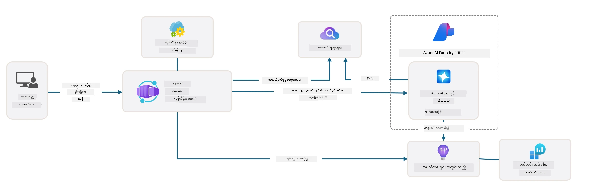

# 3. Template ကို ခွဲထုတ်ခြင်း

!!! tip "ဒီမော်ဂျူး အဆုံးတွင် သင်အောက်ပါများကို လုပ်နိုင်မည်"

    - [ ] Azure အကူအညီရရှိရန် MCP ဆာဗာများနှင့် GitHub Copilot ကို အသုံးပြုဖွင့်တတ်ရန်
    - [ ] AZD template ဖိုလ်ဒါ ဖွဲ့စည်းပုံနှင့် အစိတ်အပိုင်းများကို နားလည်ရန်
    - [ ] infrastructure-as-code (Bicep) အဖွဲ့အစည်း နမူနာပုံစံများကို ရှာဖွေရန်
    - [ ] **Lab 3:** GitHub Copilot ကို အသုံးပြုပြီး repository ဆောက်လုပ်ပုံကို ရှာဖွေ နားလည်ရန် 

---


With AZD templates and the Azure Developer CLI (`azd`) we can quickly jumpstart our AI development journey with standardized repositories that provide sample code, infrastructure and configuration files - in the form of a ready-to-deploy _starter_ project.

**But now, we need to understand the project structure and codebase - and be able to customize the AZD template - without any prior experience or understanding of AZD!**

---

## 1. GitHub Copilot ကို အက်တီဗိတ် လုပ်ခြင်း

### 1.1 GitHub Copilot Chat ကို တပ်ဆင်ခြင်း

It's time to explore [GitHub Copilot with Agent Mode](https://code.visualstudio.com/docs/copilot/chat/chat-agent-mode). Now, we can use natural language to describe our task at a high level, and get assistance in execution. For this lab, we'll use the [Copilot Free plan](https://github.com/github-copilot/signup) which has a monthly limit for completions and chat interactions.

The extension can be installed from the marketplace, but should already be available in your Codespaces environment. _Click `Open Chat` from the Copilot icon drop-down - and type a prompt like `What can you do?`_ - you may be prompted to log in. **GitHub Copilot Chat is ready**.

### 1.2. Install MCP Servers

For Agent mode to be effective, it needs access to the right tools to help it retrieve knowledge or take actions. This is where MCP servers can help. We'll configure the following servers:

1. [Azure MCP ဆာဗာ](../../../../../workshop/docs/instructions)
1. [Microsoft Docs MCP ဆာဗာ](../../../../../workshop/docs/instructions)

To activate these:

1. `.vscode/mcp.json` ဖိုင် မရှိသေးပါက ဖန်တီးပါ
1. အောက်ပါအရာကို ထိုဖိုင်ထဲသို့ ကူးထည့်ပြီး ဆာဗာများကို စတင်ပါ!
   ```json title=".vscode/mcp.json"
   {
      "servers": {
         "Azure MCP Server": {
            "command": "npx",
            "args": [
            "-y",
            "@azure/mcp@latest",
            "server",
            "start"
            ]
         },
         "microsoft.docs.mcp": {
            "type": "http",
            "url": "https://learn.microsoft.com/api/mcp"
         }
      }
   }
   ```

??? warning "`npx` မတပ်ဆင်ထားခြင်းကြောင့် အမှားတက်နိုင်ပါသည် (ဖြေရှင်းနည်းကို ကြည့်ရန် နှိပ်ပါ)"

      ပြဿနာကို ဖြေရှင်းရန်၊ `.devcontainer/devcontainer.json` ဖိုင်ကို ဖွင့်ပြီး features အပိုင်းတွင် ဤလိုင်းကို ထည့်ပါ။ ထို့နောက် container ကို ပြန်လည်ဆောက်ပါ။ ယခု `npx` ထည့်သွင်းပြီး ဖြစ်သင့်သည်။

      ```title="" linenums="0"
         "features": {
            "ghcr.io/devcontainers/features/node:1": {},
            ...
         },
      ```

---

### 1.3. GitHub Copilot Chat ကို စမ်းသပ်ခြင်း

**First use `az login` to authenticate with Azure from VS Code command line.**

You should now be able to query your Azure subscription status, and ask questions about deployed resources or configuration. Try these prompts:

1. `List my Azure resource groups`
1. `#foundry list my current deployments`

You can also ask questions about Azure documentation and get responses grounded in the Microsoft Docs MCP server. Try these prompts:

1. `#microsoft_docs_search What is Azure Developer CLI?`
1. `#microsoft_docs_search Show me a Python tutorial to chat with deployed model`

Or you can ask for code snippets to complete a task. Try this prompt.

1. `Give me a Python code example that uses AAD for an interactive chat client`

In `Ask` mode, this will provide code that you can copy-paste and try out. In `Agent` mode, this might go a step further and create the relevant resources for you - including setup scripts and documentation - to help you execute that task.

**You are now equipped to start exploring the template repository**

---

## 2. ဆောက်လုပ်ပုံကို ခွဲထုတ်ခြင်း

??? prompt "မေးပါ: docs/images/architecture.png ထဲရှိ အက်ပလီကေးရှင်း ဆောက်ပုံကို ၁ ပုဒ်စာဖြင့် ရှင်းပြပါ"

      ဤအက်ပလီကေးရှင်းသည် Azure အပေါ် တည်ဆောက်ထားသော AI အင်အားဖြင့် တိုးတက်စွာ ပံ့ပိုးထားသည့် chat application တစ်ခုဖြစ်ပြီး ခေတ်မီ agent-based ဆောက်ပုံကို ပြသသည်။ ဖြေရှင်းချက်သည် အဓိကထား၍ Azure Container App တစ်ခုတွင် အက်ပလီကေးရှင်းကုဒ်ကို ဂရုစိုက်ထားသည်။ အဆိုပါကုဒ်သည် အသုံးပြုသူ၏ထည့်သွင်းချက်များကို ဆက်လက်ကောက်ယူကာ AI agent မှတဆင့် စိတ်ကြိုက်ဖြေရှင်းချက်များ ထုတ်ပေးနိုင်ရန် စီမံဆောင်ရွက်သည်။

      ဆောက်ပုံတွင် Microsoft Foundry Project ကို AI အင်္ဂါရပ်များအတွက် အခြေခံပြီး Azure AI Services (ဥပမာ GPT-4o-mini ကဲ့သို့သော language models) နှင့် agent အလုပ်လုပ်ပုံများကို ချိတ်ဆက်ထားသည်။ အသုံးပြုသူ၏ အပြန်အလှန် ပြောဆိုမှုများသည် React အခြေခံ frontend မှတဆင့် FastAPI backend သို့ ဆက်သွယ်ပြီး AI agent service နှင့် ဆက်သွယ်ကာ စိတ်တိုင်းမကျသော ပတ်ဝန်းကျင်ထဲမှ အရေးပါသောဖြေရှင်းချက်များကို ပြန်လည်ထုတ်ပေးသည်။

      စနစ်တွင် ဖိုင်ရှာဖွေမှု သို့မဟုတ် Azure AI Search ဝန်ဆောင်မှုမှတဆင့် သိရှိမှု ရယူနိုင်စေရန် knowledge retrieval အင်္ဂါရပ်များပါဝင်သည်၊ ထို့ကြောင့် agent သည် တင်သွင်းထားသောစာရွက်စာတမ်းများမှ သက်ဆိုင်သော အချက်အလက်များကို ရှာဖွေ နှင့် ကိုးကားနိုင်သည်။ စီမံခန့်ခွဲမှုမြင့်မားရေးအတွက် Application Insights နှင့် Log Analytics Workspace တို့အား အသုံးပြု၍ tracing, logging နှင့် performance အဆင့်မြှင့်ဆုံးရှင်းရေးများကို ထည့်သွင်းထားသည်။

      Azure Storage သည် application data နှင့် ဖိုင်တင်သွင်းမှုများအတွက် blob storage ကို ကျွန်တော်တို့ထည့်သွင်းထားပြီး Managed Identity သည် ခွင့်ပြုချက်မလိုအပ်ဘဲ Azure အရင်းအမြစ်များအကြား လုံခြုံစိတ်ချစေသည်။ မည်သည့်အချိန်တွင်မဆို ထိန်းသိမ်းမှုနှင့် scalability အတွက် ဒီဖြေရှင်းချက်ကို ဖန်တီးထားပြီး containerized application သည် လိုအပ်ချက်အပေါ် မူတည်၍ အလိုအလျောက် ပမာဏကို တိုးချဲ့နိုင်သည်။ ထို့အပြင် Azure ၏ managed services များကနေ CI/CD, လုံခြုံရေးနှင့် မော်နီတာလုပ်ဆောင်မှုများကို ပံ့ပိုးပေးထားသည်။



---

## 3. Repository ဖွဲ့စည်းပုံ

!!! prompt "မေးပါ: template ဖိုလ်ဒါဖွဲ့စည်းပုံကို ရှင်းပြပါ။ ရှုမြင်နိုင်သော အဆင့်ဆင့် ဇယားဖြင့် စတင်ပါ။"

??? info "ဖြေ: မြင်နိုင်သော အဆင့်ဆင့် ဇယား"

      ```bash title="" 
      get-started-with-ai-agents/
      ├── 📋 Configuration & Setup
      │   ├── azure.yaml                    # Azure Developer CLI configuration
      │   ├── docker-compose.yaml           # Local development containers
      │   ├── pyproject.toml                # Python project configuration
      │   ├── requirements-dev.txt          # Development dependencies
      │   └── .devcontainer/                # VS Code dev container setup
      │
      ├── 🏗️ Infrastructure (infra/)
      │   ├── main.bicep                    # Main infrastructure template
      │   ├── api.bicep                     # API-specific resources
      │   ├── main.parameters.json          # Infrastructure parameters
      │   └── core/                         # Modular infrastructure components
      │       ├── ai/                       # AI service configurations
      │       ├── host/                     # Hosting infrastructure
      │       ├── monitor/                  # Monitoring and logging
      │       ├── search/                   # Azure AI Search setup
      │       ├── security/                 # Security and identity
      │       └── storage/                  # Storage account configs
      │
      ├── 💻 Application Source (src/)
      │   ├── api/                          # Backend API
      │   │   ├── main.py                   # FastAPI application entry
      │   │   ├── routes.py                 # API route definitions
      │   │   ├── search_index_manager.py   # Search functionality
      │   │   ├── data/                     # API data handling
      │   │   ├── static/                   # Static web assets
      │   │   └── templates/                # HTML templates
      │   ├── frontend/                     # React/TypeScript frontend
      │   │   ├── package.json              # Node.js dependencies
      │   │   ├── vite.config.ts            # Vite build configuration
      │   │   └── src/                      # Frontend source code
      │   ├── data/                         # Sample data files
      │   │   └── embeddings.csv            # Pre-computed embeddings
      │   ├── files/                        # Knowledge base files
      │   │   ├── customer_info_*.json      # Customer data samples
      │   │   └── product_info_*.md         # Product documentation
      │   ├── Dockerfile                    # Container configuration
      │   └── requirements.txt              # Python dependencies
      │
      ├── 🔧 Automation & Scripts (scripts/)
      │   ├── postdeploy.sh/.ps1           # Post-deployment setup
      │   ├── setup_credential.sh/.ps1     # Credential configuration
      │   ├── validate_env_vars.sh/.ps1    # Environment validation
      │   └── resolve_model_quota.sh/.ps1  # Model quota management
      │
      ├── 🧪 Testing & Evaluation
      │   ├── tests/                        # Unit and integration tests
      │   │   └── test_search_index_manager.py
      │   ├── evals/                        # Agent evaluation framework
      │   │   ├── evaluate.py               # Evaluation runner
      │   │   ├── eval-queries.json         # Test queries
      │   │   └── eval-action-data-path.json
      │   ├── sandbox/                      # Development playground
      │   │   ├── 1-quickstart.py           # Getting started examples
      │   │   └── aad-interactive-chat.py   # Authentication examples
      │   └── airedteaming/                 # AI safety evaluation
      │       └── ai_redteaming.py          # Red team testing
      │
      ├── 📚 Documentation (docs/)
      │   ├── deployment.md                 # Deployment guide
      │   ├── local_development.md          # Local setup instructions
      │   ├── troubleshooting.md            # Common issues & fixes
      │   ├── azure_account_setup.md        # Azure prerequisites
      │   └── images/                       # Documentation assets
      │
      └── 📄 Project Metadata
         ├── README.md                     # Project overview
         ├── CODE_OF_CONDUCT.md           # Community guidelines
         ├── CONTRIBUTING.md              # Contribution guide
         ├── LICENSE                      # License terms
         └── next-steps.md                # Post-deployment guidance
      ```

### 3.1. အဓိက အက်ပ် ဆောက်ပုံ

This template follows a **full-stack web application** pattern with:

- **Backend**: Python FastAPI နှင့် Azure AI ပေါင်းစပ်ထားသော
- **Frontend**: TypeScript/React နှင့် Vite build system
- **Infrastructure**: Azure Bicep templates သုံး၍ cloud resources များကို စီမံခြင်း
- **Containerization**: Docker ကို အရည်အသွေး တပြိုင်နက်ရှိသော deployment အတွက် အသုံးပြုခြင်း

### 3.2 Infrastructure-as-Code (Bicep)

The infrastructure layer uses **Azure Bicep** templates organized modularly:

   - **`main.bicep`**: Orchestrates all Azure resources
   - **`core/` modules**: Reusable components for different services
      - AI services (Azure OpenAI, AI Search)
      - Container hosting (Azure Container Apps)
      - Monitoring (Application Insights, Log Analytics)
      - Security (Key Vault, Managed Identity)

### 3.3 Application Source (`src/`)

**Backend API (`src/api/`)**:

- FastAPI-based REST API
- Foundry Agents integration
- Search index management for knowledge retrieval
- File upload and processing capabilities

**Frontend (`src/frontend/`)**:

- Modern React/TypeScript SPA
- Vite for fast development and optimized builds
- Chat interface for agent interactions

**Knowledge Base (`src/files/`)**:

- Sample customer and product data
- Demonstrates file-based knowledge retrieval
- JSON and Markdown format examples


### 3.4 DevOps & Automation

**Scripts (`scripts/`)**:

- Cross-platform PowerShell and Bash scripts
- Environment validation and setup
- Post-deployment configuration
- Model quota management

**Azure Developer CLI Integration**:

- `azure.yaml` configuration for `azd` workflows
- Automated provisioning and deployment
- Environment variable management

### 3.5 Testing & Quality Assurance

**Evaluation Framework (`evals/`)**:

- Agent performance evaluation
- Query-response quality testing
- Automated assessment pipeline

**AI Safety (`airedteaming/`)**:

- Red team testing for AI safety
- Security vulnerability scanning
- Responsible AI practices

---

## 4. ဂုဏ်ယူပါတယ် 🏆

You successfully used GitHub Copilot Chat with MCP servers, to explore the repository.

- [X] Azure အတွက် GitHub Copilot ကို အက်တီဗိတ် လုပ်ထားသည်
- [X] Application ဆောက်ပုံကို နားလည်ထားသည်
- [X] AZD template ဖွဲ့စည်းပုံကို စူးစမ်းလေ့လာထားသည်

This gives you a sense of the _infrastructure as code_ assets for this template. Next, we'll look at the configuration file for AZD.

---

<!-- CO-OP TRANSLATOR DISCLAIMER START -->
အသိပေးချက်

ဤစာတမ်းကို AI ဘာသာပြန်ဝန်ဆောင်မှု Co-op Translator (https://github.com/Azure/co-op-translator) ကို အသုံးပြုပြီး ဘာသာပြန်ထားပါသည်။ ကျွန်ုပ်တို့သည် တိကျမှန်ကန်မှုအတွက် ကြိုးပမ်းပါသည်မည်သော်လည်း အလိုအလျှောက် ဘာသာပြန်မှုများတွင် အမှားများ သို့မဟုတ် မတိကျမှုများ ပါနိုင်ကြောင်း ကျေးဇူးပြု၍ သတိပြုပါ။ မူလဘာသာဖြင့် ရေးသားထားသော မူရင်းစာတမ်းကိုသာ တရားဝင် အချက်အလက်အရင်းအမြစ်အဖြစ် မှန်ကန်စွာ ကိုးကားသင့်သည်။ အရေးကြီးသော အချက်အလက်များအတွက် သက်ဆိုင်ရာ ပရော်ဖက်ရှင်နယ် လူသားဘာသာပြန်ကို တိုက်တွန်းပါသည်။ ဤဘာသာပြန်ကို အသုံးပြုရာမှ ဖြစ်ပေါ်နိုင်သည့် နားမလည်မှုများ သို့မဟုတ် မမှန်ကန်သော သရုပ်ဖေါ်ချက်များအတွက် ကျွန်ုပ်တို့ တာဝန်မရှိပါ။
<!-- CO-OP TRANSLATOR DISCLAIMER END -->