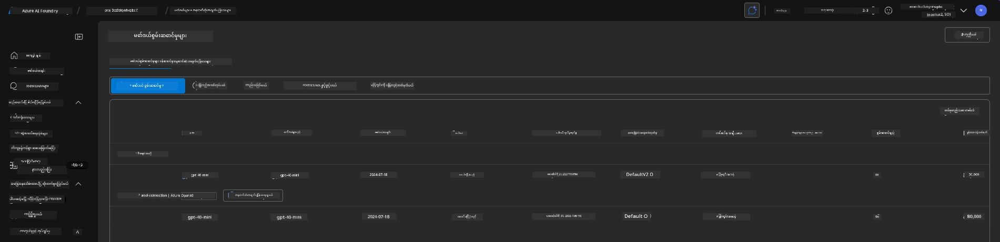
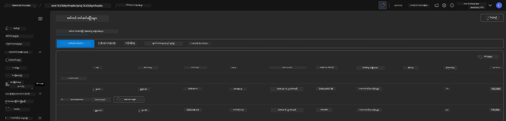

# 6. အင်ဖာရာစထရာ ဖျက်သိမ်းခြင်း

!!! tip "ဒီမော်ဂျူးအဆုံးသတ်သည့်အခါ သင်အောက်ပါအရာများကို လုပ်နိုင်မည်"

    - [ ] ရင်းမြစ်များကို သန့်စင်ခြင်းနှင့် ကုန်ကျစရိတ် စီမံခန့်ခွဲမှု၏ အရေးပါမှုကို နားလည်ပါ
    - [ ] `azd down` ကို အသုံးပြုပြီး အင်ဖရာစထရာကို လုံခြုံစွာ ပယ်ဖျက်ပါ
    - [ ] လိုအပ်ပါက soft-delete လုပ်ထားသော Cognitive Services များကို ပြန်လည်ရယူပါ
    - [ ] **Lab 6:** Azure ရင်းမြစ်များအား ရှင်းလင်းပြီး ဖယ်ရှားမှုကို စစ်ဆေးခြင်း

---

## အပိုလေ့ကျင့်ခန်းများ

Before we tear down the project, take a few minutes to do some open-ended exploration.

!!! info "စူးစမ်းရန် အကြံပြုချက်များ"

    **GitHub Copilot ဖြင့် လေ့လာစမ်းသပ်ခြင်း:**
    
    1. မေးပါ: `What other AZD templates could I try for multi-agent scenarios?`
    2. မေးပါ: `How can I customize the agent instructions for a healthcare use case?`
    3. မေးပါ: `What environment variables control cost optimization?`
    
    **Azure ပေါ့တ်ထယ်ကို စူးစမ်းလေ့လာခြင်း:**
    
    1. သင့် deployment အတွက် Application Insights မက်ထရစ်များကို ပြန်လည်သုံးသပ်ပါ
    2. ပြုစုထားသော ရင်းမြစ်များအတွက် ကုန်ကျစရိတ် ခွဲခြမ်းစစ်ဆေးမှုကို စစ်ဆေးပါ
    3. Microsoft Foundry portal agent playground ကို ထပ်မံ စူးစမ်းပါ

---

## အင်ဖရာစထရာ ပယ်ဖျက်ခြင်း

1. အင်ဖရာစထရာကို ဖျက်သိမ်းခြင်းမှာ အလွယ်တကူ အောက်ပါအတိုင်းဖြစ်သည်:
      
      ```bash title="" linenums="0"
      azd down --purge
      ```
1. `--purge` ဖလက်သည် soft-delete လုပ်ထားသော Cognitive Service အရင်းအမြစ်များကိုလည်း ဖျက်ပစ်ပေးလိမ့်မည်၊ ထို့ကြောင့် ၎င်းများက ဖွင့်ထားသော quota များကို လွှတ်ပေးပါသည်။ ပြီးဆုံးသွားပါက အောက်ပါကဲ့သို့ ပြပါလိမ့်မည်။
      
      ```bash title="" linenums="0"
      ? Total resources to delete: 11, are you sure you want to continue? Yes
      Deleting your resources can take some time.
      (✓) Done: Deleted resource group rg-nitya-mshack-azd
      (✓) Done: Purging Cognitive Account: aoai-3cz3zkynhvpbc

      SUCCESS: Your application was removed from Azure in 11 minutes 4 seconds.
      ```

1. (Optional) ယခု `azd up` ကို ထပ်မံ အသုံးပြုပါက local `.azure` ဖိုလ်ဒါတွင် environment variable ကို ပြောင်းလဲ (နှင့် သိမ်းဆည်း) ထားသောကြောင့် gpt-4.1 မော်ဒယ်သည် ထပ်မံ တပ်ဆင်ထားသည့်အရ ဖြစ်သွားမည်ကို သင် တွေ့မည်။

      ဒီမှာ မော်ဒယ် တပ်ဆင်မှုများ၏ **မတိုင်မီ** အခြေအနေမှာ အောက်ပါအတိုင်းဖြစ်ပါသည်။

      

      နှင့် ၎င်း၏ **ပြီးနောက်** အခြေအနေမှာ:
      

---

<!-- CO-OP TRANSLATOR DISCLAIMER START -->
တာဝန်ပယ်ချချက်။
ဤစာတမ်းကို AI ဘာသာပြန် ဝန်ဆောင်မှုဖြစ်သည့် [Co-op Translator](https://github.com/Azure/co-op-translator) ဖြင့် ဘာသာပြန်ထားပါသည်။ ကျွန်ုပ်တို့သည် မှန်ကန်မှုအတွက် ကြိုးပမ်းသော်လည်း၊ အလိုအလျောက် ဘာသာပြန်ချက်များတွင် အမှားများ သို့မဟုတ် မှားယွင်းချက်များပါဝင်နိုင်သည်ကို ကျေးဇူးပြု၍ သတိပြုပါ။ မူရင်းစာတမ်းကို မူလဘာသာစကားဖြင့်သာ အာဏာပိုင် အရင်းအမြစ်အဖြစ် သတ်မှတ်ရန် လိုအပ်ပါသည်။ အရေးကြီးသော အချက်အလက်များအတွက်မှာ ပရော်ဖက်ရှင်နယ် လူသားဘာသာပြန်ခြင်းကို အကြံပြုပါသည်။ ဤဘာသာပြန်ချက်ကို အသုံးပြုရာမှ ဖြစ်ပေါ်နိုင်သည့် နားလည်မှုပျောက်ကွယ်ခြင်းများ သို့မဟုတ် အဓိပ္ပါယ်မှားယူခြင်းများအတွက် ကျွန်ုပ်တို့ တာဝန်မယူပါ။
<!-- CO-OP TRANSLATOR DISCLAIMER END -->