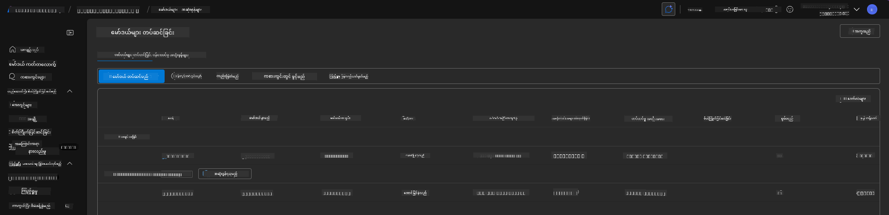

<!--
CO_OP_TRANSLATOR_METADATA:
{
  "original_hash": "6539a34c770f3ceff282370d72ee74dc",
  "translation_date": "2025-09-25T02:17:53+00:00",
  "source_file": "workshop/docs/instructions/6-Teardown-Infrastructure.md",
  "language_code": "my"
}
-->
# 6. အခြေခံအဆောက်အအုံကို ဖျက်သိမ်းခြင်း

!!! tip "ဤအခန်းကို ပြီးဆုံးသောအခါ သင်တတ်နိုင်မည်မှာ"

    - [ ] အချက်
    - [ ] အချက်
    - [ ] အချက်

---

## အပိုလေ့ကျင့်ခန်းများ

ပရောဂျက်ကို ဖျက်သိမ်းမီ အချိန်အနည်းငယ်ယူပြီး အခွင့်အရေးပေါ် စူးစမ်းလေ့လာမှုများ ပြုလုပ်ပါ။

!!! danger "NITYA-TODO: စမ်းသပ်ရန် အကြံပြုချက်များကို ဖော်ပြပါ"

---

## အခြေခံအဆောက်အအုံကို ဖျက်သိမ်းခြင်း

1. အခြေခံအဆောက်အအုံကို ဖျက်သိမ်းခြင်းသည် အလွန်လွယ်ကူပါသည်-

      ```bash title="" linenums="0"
      azd down --purge
      ```
1. `--purge` flag သည် soft-deleted Cognitive Service အရင်းအမြစ်များကိုလည်း ဖျက်သိမ်းပေးပြီး၊ အရင်းအမြစ်များအားဖြင့် ကိုင်တွယ်ထားသော quota ကိုလွှတ်ပေးသည်။ ပြီးဆုံးသောအခါ သင်သည် အောက်ပါအတိုင်း တစ်ခုခုကို တွေ့ရမည်ဖြစ်သည်-

      ```bash title="" linenums="0"
      ? Total resources to delete: 11, are you sure you want to continue? Yes
      Deleting your resources can take some time.
      (✓) Done: Deleted resource group rg-nitya-mshack-azd
      (✓) Done: Purging Cognitive Account: aoai-3cz3zkynhvpbc

      SUCCESS: Your application was removed from Azure in 11 minutes 4 seconds.
      ```

1. (Optional) ယခု `azd up` ကို ထပ်မံ run လုပ်ပါက gpt-4.1 model သည် deploy လုပ်မည်ဖြစ်သည်။ အဲဒါက environment variable ကို local `.azure` folder မှာ ပြောင်းလဲပြီး (သိမ်းဆည်း) ပြီးသားဖြစ်သောကြောင့် ဖြစ်သည်။

      ဤသည်မှာ **မတိုင်မီ** model deployments ဖြစ်သည်-

      

      အဲဒါက **နောက်ပိုင်း** ဖြစ်သည်-
      

---

