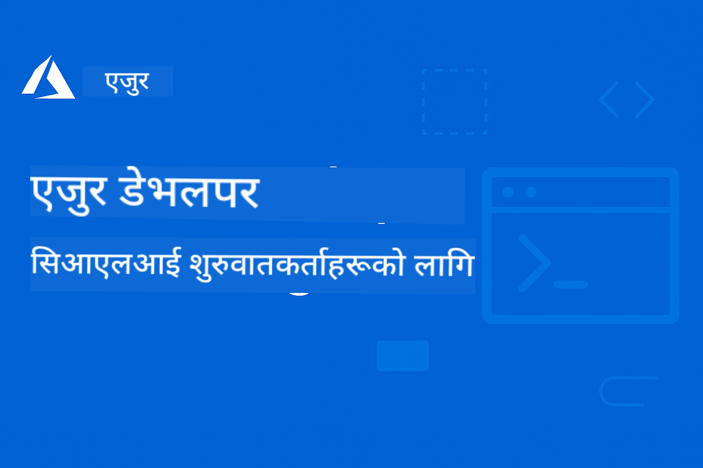

<!--
CO_OP_TRANSLATOR_METADATA:
{
  "original_hash": "62affa32f7697d88ec2a2d5745364db1",
  "translation_date": "2025-12-15T22:20:13+00:00",
  "source_file": "README.md",
  "language_code": "ne"
}
-->
# AZD शुरुवातकर्ताहरूका लागि: एक संरचित सिकाइ यात्रा

 

[](https://GitHub.com/microsoft/azd-for-beginners/watchers/)
[](https://GitHub.com/microsoft/azd-for-beginners/network/)
[](https://GitHub.com/microsoft/azd-for-beginners/stargazers/)

[](https://discord.gg/microsoft-azure)
[](https://discord.gg/nTYy5BXMWG)

## यस कोर्ससँग सुरु गर्ने तरिका

तपाईंको AZD सिकाइ यात्रालाई सुरु गर्न यी चरणहरू पालना गर्नुहोस्:

1. **रिपोजिटरी फोर्क गर्नुहोस्**: क्लिक गर्नुहोस् [](https://GitHub.com/microsoft/azd-for-beginners/fork)
2. **रिपोजिटरी क्लोन गर्नुहोस्**: `git clone https://github.com/microsoft/azd-for-beginners.git`
3. **समुदायमा सामेल हुनुहोस्**: [Azure Discord Communities](https://discord.com/invite/ByRwuEEgH4) विशेषज्ञ सहयोगका लागि
4. **तपाईंको सिकाइ मार्ग चयन गर्नुहोस्**: तलको अध्यायहरूबाट आफ्नो अनुभव स्तरसँग मेल खाने अध्याय छान्नुहोस्

### बहुभाषी समर्थन

#### स्वचालित अनुवादहरू (सधैं अद्यावधिक)

<!-- CO-OP TRANSLATOR LANGUAGES TABLE START -->
[Arabic](../ar/README.md) | [Bengali](../bn/README.md) | [Bulgarian](../bg/README.md) | [Burmese (Myanmar)](../my/README.md) | [Chinese (Simplified)](../zh/README.md) | [Chinese (Traditional, Hong Kong)](../hk/README.md) | [Chinese (Traditional, Macau)](../mo/README.md) | [Chinese (Traditional, Taiwan)](../tw/README.md) | [Croatian](../hr/README.md) | [Czech](../cs/README.md) | [Danish](../da/README.md) | [Dutch](../nl/README.md) | [Estonian](../et/README.md) | [Finnish](../fi/README.md) | [French](../fr/README.md) | [German](../de/README.md) | [Greek](../el/README.md) | [Hebrew](../he/README.md) | [Hindi](../hi/README.md) | [Hungarian](../hu/README.md) | [Indonesian](../id/README.md) | [Italian](../it/README.md) | [Japanese](../ja/README.md) | [Kannada](../kn/README.md) | [Korean](../ko/README.md) | [Lithuanian](../lt/README.md) | [Malay](../ms/README.md) | [Malayalam](../ml/README.md) | [Marathi](../mr/README.md) | [Nepali](./README.md) | [Nigerian Pidgin](../pcm/README.md) | [Norwegian](../no/README.md) | [Persian (Farsi)](../fa/README.md) | [Polish](../pl/README.md) | [Portuguese (Brazil)](../br/README.md) | [Portuguese (Portugal)](../pt/README.md) | [Punjabi (Gurmukhi)](../pa/README.md) | [Romanian](../ro/README.md) | [Russian](../ru/README.md) | [Serbian (Cyrillic)](../sr/README.md) | [Slovak](../sk/README.md) | [Slovenian](../sl/README.md) | [Spanish](../es/README.md) | [Swahili](../sw/README.md) | [Swedish](../sv/README.md) | [Tagalog (Filipino)](../tl/README.md) | [Tamil](../ta/README.md) | [Telugu](../te/README.md) | [Thai](../th/README.md) | [Turkish](../tr/README.md) | [Ukrainian](../uk/README.md) | [Urdu](../ur/README.md) | [Vietnamese](../vi/README.md)
<!-- CO-OP TRANSLATOR LANGUAGES TABLE END -->

## कोर्स अवलोकन

Azure Developer CLI (azd) लाई संरचित अध्यायहरू मार्फत मास्टर गर्नुहोस् जुन प्रगतिशील सिकाइका लागि डिजाइन गरिएको छ। **Microsoft Foundry एकीकरणसहित AI अनुप्रयोग तैनाथीमा विशेष ध्यान।**

### किन यो कोर्स आधुनिक विकासकर्ताहरूका लागि आवश्यक छ

Microsoft Foundry Discord समुदायका अन्तर्दृष्टिहरूमा आधारित, **४५% विकासकर्ताहरू AZD लाई AI कार्यभारहरूका लागि प्रयोग गर्न चाहन्छन्** तर निम्न चुनौतीहरू भोगिरहेका छन्:
- जटिल बहु-सेवा AI वास्तुकला
- उत्पादन AI तैनाथीका उत्तम अभ्यासहरू  
- Azure AI सेवा एकीकरण र कन्फिगरेसन
- AI कार्यभारहरूको लागत अनुकूलन
- AI-विशिष्ट तैनाथी समस्याहरूको समाधान

### सिकाइ उद्देश्यहरू

यो संरचित कोर्स पूरा गरेर, तपाईंले:
- **AZD आधारभूतहरूमा दक्षता हासिल गर्नुहोस्**: मुख्य अवधारणाहरू, स्थापना, र कन्फिगरेसन
- **AI अनुप्रयोगहरू तैनाथ गर्नुहोस्**: Microsoft Foundry सेवाहरूको साथ AZD प्रयोग गर्नुहोस्
- **Infrastructure as Code लागू गर्नुहोस्**: Bicep टेम्प्लेटहरूसँग Azure स्रोतहरू व्यवस्थापन गर्नुहोस्
- **तैनाथी समस्याहरू समाधान गर्नुहोस्**: सामान्य समस्याहरू समाधान र डिबग गर्नुहोस्
- **उत्पादनका लागि अनुकूलन गर्नुहोस्**: सुरक्षा, स्केलिङ, अनुगमन, र लागत व्यवस्थापन
- **बहु-एजेन्ट समाधानहरू निर्माण गर्नुहोस्**: जटिल AI वास्तुकला तैनाथ गर्नुहोस्

## 📚 सिकाइ अध्यायहरू

*अनुभव स्तर र लक्ष्यहरूका आधारमा आफ्नो सिकाइ मार्ग चयन गर्नुहोस्*

### 🚀 अध्याय १: आधार र छिटो सुरु
**पूर्वआवश्यकता**: Azure सदस्यता, आधारभूत कमाण्ड लाइन ज्ञान  
**समय**: ३०-४५ मिनेट  
**जटिलता**: ⭐

#### तपाईंले के सिक्नुहुनेछ
- Azure Developer CLI का आधारभूत कुरा बुझ्ने
- आफ्नो प्लेटफर्ममा AZD स्थापना गर्ने
- तपाईंको पहिलो सफल तैनाथी

#### सिकाइ स्रोतहरू
- **🎯 यहाँबाट सुरु गर्नुहोस्**: [Azure Developer CLI के हो?](../..)
- **📖 सिद्धान्त**: [AZD आधारभूतहरू](docs/getting-started/azd-basics.md) - मुख्य अवधारणाहरू र शब्दावली
- **⚙️ सेटअप**: [स्थापना र सेटअप](docs/getting-started/installation.md) - प्लेटफर्म-विशिष्ट मार्गदर्शन
- **🛠️ व्यावहारिक**: [तपाईंको पहिलो परियोजना](docs/getting-started/first-project.md) - चरण-द्वारा-चरण ट्युटोरियल
- **📋 छिटो सन्दर्भ**: [कमाण्ड चीट शीट](resources/cheat-sheet.md)

#### व्यावहारिक अभ्यासहरू
```bash
# छिटो स्थापना जाँच
azd version

# तपाईंको पहिलो अनुप्रयोग तैनाथ गर्नुहोस्
azd init --template todo-nodejs-mongo
azd up
```

**💡 अध्याय परिणाम**: AZD प्रयोग गरेर Azure मा सरल वेब अनुप्रयोग सफलतापूर्वक तैनाथ गर्नुहोस्

**✅ सफलता प्रमाणीकरण:**
```bash
# अध्याय १ पूरा गरेपछि, तपाईं सक्षम हुनुहुनेछ:
azd version              # स्थापना गरिएको संस्करण देखाउँछ
azd init --template todo-nodejs-mongo  # परियोजना आरम्भ गर्दछ
azd up                  # Azure मा परिनियोजन गर्दछ
azd show                # चलिरहेको एप्लिकेशनको URL देखाउँछ
# एप्लिकेशन ब्राउजरमा खुल्छ र काम गर्छ
azd down --force --purge  # स्रोतहरू सफा गर्दछ
```

**📊 समय लगानी:** ३०-४५ मिनेट  
**📈 सिकाइ स्तर पछि:** आधारभूत अनुप्रयोगहरू स्वतन्त्र रूपमा तैनाथ गर्न सक्ने

**✅ सफलता प्रमाणीकरण:**
```bash
# अध्याय १ पूरा गरेपछि, तपाईं सक्षम हुनुहुनेछ:
azd version              # स्थापना गरिएको संस्करण देखाउँछ
azd init --template todo-nodejs-mongo  # परियोजना आरम्भ गर्दछ
azd up                  # Azure मा तैनाथ गर्दछ
azd show                # चलिरहेको एपको URL देखाउँछ
# एप्लिकेशन ब्राउजरमा खुल्छ र काम गर्छ
azd down --force --purge  # स्रोतहरू सफा गर्दछ
```

**📊 समय लगानी:** ३०-४५ मिनेट  
**📈 सिकाइ स्तर पछि:** आधारभूत अनुप्रयोगहरू स्वतन्त्र रूपमा तैनाथ गर्न सक्ने

---

### 🤖 अध्याय २: AI-प्रथम विकास (AI विकासकर्ताहरूका लागि सिफारिस गरिएको)
**पूर्वआवश्यकता**: अध्याय १ पूरा  
**समय**: १-२ घण्टा  
**जटिलता**: ⭐⭐

#### तपाईंले के सिक्नुहुनेछ
- AZD सँग Microsoft Foundry एकीकरण
- AI-संचालित अनुप्रयोगहरू तैनाथ गर्ने
- AI सेवा कन्फिगरेसनहरू बुझ्ने

#### सिकाइ स्रोतहरू
- **🎯 यहाँबाट सुरु गर्नुहोस्**: [Microsoft Foundry एकीकरण](docs/microsoft-foundry/microsoft-foundry-integration.md)
- **📖 ढाँचाहरू**: [AI मोडेल तैनाथी](docs/microsoft-foundry/ai-model-deployment.md) - AI मोडेलहरू तैनाथ र व्यवस्थापन गर्ने
- **🛠️ कार्यशाला**: [AI कार्यशाला ल्याब](docs/microsoft-foundry/ai-workshop-lab.md) - तपाईंको AI समाधानहरू AZD-योग्य बनाउने
- **🎥 अन्तरक्रियात्मक मार्गदर्शन**: [कार्यशाला सामग्रीहरू](workshop/README.md) - MkDocs * DevContainer वातावरणसहित ब्राउजर-आधारित सिकाइ
- **📋 टेम्प्लेटहरू**: [Microsoft Foundry टेम्प्लेटहरू](../..)
- **📝 उदाहरणहरू**: [AZD तैनाथी उदाहरणहरू](examples/README.md)

#### व्यावहारिक अभ्यासहरू
```bash
# तपाईंको पहिलो एआई अनुप्रयोग तैनाथ गर्नुहोस्
azd init --template azure-search-openai-demo
azd up

# थप एआई टेम्प्लेटहरू प्रयास गर्नुहोस्
azd init --template openai-chat-app-quickstart
azd init --template agent-openai-python-prompty
```

**💡 अध्याय परिणाम**: RAG क्षमतासहित AI-संचालित च्याट अनुप्रयोग तैनाथ र कन्फिगर गर्नुहोस्

**✅ सफलता प्रमाणीकरण:**
```bash
# अध्याय २ पछि, तपाईं सक्षम हुनुहुनेछ:
azd init --template azure-search-openai-demo
azd up
# एआई च्याट इन्टरफेस परीक्षण गर्नुहोस्
# प्रश्नहरू सोध्नुहोस् र स्रोतहरूसहित एआई-शक्ति प्रतिक्रियाहरू प्राप्त गर्नुहोस्
# खोज एकीकरण काम गर्छ कि भनी जाँच गर्नुहोस्
azd monitor  # एप्लिकेशन इनसाइट्सले टेलिमेट्री देखाउँछ कि भनी जाँच गर्नुहोस्
azd down --force --purge
```

**📊 समय लगानी:** १-२ घण्टा  
**📈 सिकाइ स्तर पछि:** उत्पादन-योग्य AI अनुप्रयोगहरू तैनाथ र कन्फिगर गर्न सक्ने  
**💰 लागत सचेतना:** $८०-१५०/महिना विकास लागत, $३००-३५००/महिना उत्पादन लागत बुझ्ने

#### 💰 AI तैनाथीका लागि लागत विचारहरू

**विकास वातावरण (अनुमानित $८०-१५०/महिना):**
- Azure OpenAI (Pay-as-you-go): $०-५०/महिना (टोकन प्रयोगमा आधारित)
- AI Search (बेसिक तह): $७५/महिना
- Container Apps (खपत): $०-२०/महिना
- Storage (स्ट्यान्डर्ड): $१-५/महिना

**उत्पादन वातावरण (अनुमानित $३००-३,५००+/महिना):**
- Azure OpenAI (PTU स्थिर प्रदर्शनका लागि): $३,०००+/महिना वा उच्च भोल्युमसहित Pay-as-go
- AI Search (स्ट्यान्डर्ड तह): $२५०/महिना
- Container Apps (समर्पित): $५०-१००/महिना
- Application Insights: $५-५०/महिना
- Storage (प्रीमियम): $१०-५०/महिना

**💡 लागत अनुकूलन सुझावहरू:**
- सिकाइका लागि **Free Tier** Azure OpenAI प्रयोग गर्नुहोस् (५०,००० टोकन/महिना समावेश)
- सक्रिय विकास नगर्दा स्रोतहरू डीलोकेट गर्न `azd down` चलाउनुहोस्
- खपत-आधारित बिलिङबाट सुरु गर्नुहोस्, उत्पादनका लागि मात्र PTU मा अपग्रेड गर्नुहोस्
- तैनाथी अघि लागत अनुमान गर्न `azd provision --preview` प्रयोग गर्नुहोस्
- अटो-स्केलिङ सक्षम गर्नुहोस्: वास्तविक प्रयोगको लागि मात्र तिर्नुहोस्

**लागत अनुगमन:**
```bash
# अनुमानित मासिक लागतहरू जाँच गर्नुहोस्
azd provision --preview

# Azure पोर्टलमा वास्तविक लागतहरू अनुगमन गर्नुहोस्
az consumption budget list --resource-group <your-rg>
```

---

### ⚙️ अध्याय ३: कन्फिगरेसन र प्रमाणीकरण
**पूर्वआवश्यकता**: अध्याय १ पूरा  
**समय**: ४५-६० मिनेट  
**जटिलता**: ⭐⭐

#### तपाईंले के सिक्नुहुनेछ
- वातावरण कन्फिगरेसन र व्यवस्थापन
- प्रमाणीकरण र सुरक्षा उत्तम अभ्यासहरू
- स्रोत नामकरण र संगठन

#### सिकाइ स्रोतहरू
- **📖 कन्फिगरेसन**: [कन्फिगरेसन गाइड](docs/getting-started/configuration.md) - वातावरण सेटअप
- **🔐 सुरक्षा**: [प्रमाणीकरण ढाँचाहरू र व्यवस्थापन गरिएको पहिचान](docs/getting-started/authsecurity.md) - प्रमाणीकरण ढाँचाहरू
- **📝 उदाहरणहरू**: [डेटाबेस अनुप्रयोग उदाहरण](examples/database-app/README.md) - AZD डेटाबेस उदाहरणहरू

#### व्यावहारिक अभ्यासहरू
- बहु वातावरणहरू कन्फिगर गर्नुहोस् (डेभ, स्टेजिङ, प्रोड)
- व्यवस्थापन गरिएको पहिचान प्रमाणीकरण सेटअप गर्नुहोस्
- वातावरण-विशिष्ट कन्फिगरेसनहरू लागू गर्नुहोस्

**💡 अध्याय परिणाम**: उचित प्रमाणीकरण र सुरक्षासहित बहु वातावरणहरू व्यवस्थापन गर्नुहोस्

---

### 🏗️ अध्याय ४: Infrastructure as Code र तैनाथी
**पूर्वआवश्यकता**: अध्याय १-३ पूरा  
**समय**: १-१.५ घण्टा  
**जटिलता**: ⭐⭐⭐

#### तपाईंले के सिक्नुहुनेछ
- उन्नत तैनाथी ढाँचाहरू
- Bicep सँग Infrastructure as Code
- स्रोत प्रावधान रणनीतिहरू

#### सिकाइ स्रोतहरू
- **📖 तैनाथी**: [तैनाथी गाइड](docs/deployment/deployment-guide.md) - पूर्ण कार्यप्रवाहहरू
- **🏗️ प्रावधान**: [स्रोत प्रावधान](docs/deployment/provisioning.md) - Azure स्रोत व्यवस्थापन
- **📝 उदाहरणहरू**: [Container App उदाहरण](../../examples/container-app) - कन्टेनराइज्ड तैनाथीहरू

#### व्यावहारिक अभ्यासहरू
- कस्टम Bicep टेम्प्लेटहरू सिर्जना गर्नुहोस्
- बहु-सेवा अनुप्रयोगहरू तैनाथ गर्नुहोस्
- नीलो-हरियो तैनाथी रणनीतिहरू लागू गर्नुहोस्

**💡 अध्याय परिणाम**: कस्टम Infrastructure टेम्प्लेटहरू प्रयोग गरेर जटिल बहु-सेवा अनुप्रयोगहरू तैनाथ गर्नुहोस्

---

### 🎯 अध्याय ५: बहु-एजेन्ट AI समाधानहरू (उन्नत)
**पूर्वआवश्यकता**: अध्याय १-२ पूरा  
**समय**: २-३ घण्टा  
**जटिलता**: ⭐⭐⭐⭐

#### तपाईंले के सिक्नुहुनेछ
- बहु-एजेन्ट वास्तुकला ढाँचाहरू
- एजेन्ट समन्वय र समन्वय
- उत्पादन-योग्य AI तैनाथीहरू

#### सिकाइ स्रोतहरू
- **🤖 विशेष परियोजना**: [रिटेल बहु-एजेन्ट समाधान](examples/retail-scenario.md) - पूर्ण कार्यान्वयन
- **🛠️ ARM टेम्प्लेटहरू**: [ARM टेम्प्लेट प्याकेज](../../examples/retail-multiagent-arm-template) - एक-क्लिक डिप्लोयमेन्ट  
- **📖 वास्तुकला**: [मल्टि-एजेन्ट समन्वय ढाँचाहरू](/docs/pre-deployment/coordination-patterns.md) - ढाँचाहरू

#### व्यावहारिक अभ्यासहरू  
```bash
# पूर्ण खुद्रा बहु-एजेन्ट समाधान तैनाथ गर्नुहोस्
cd examples/retail-multiagent-arm-template
./deploy.sh

# एजेन्ट कन्फिगरेसनहरू अन्वेषण गर्नुहोस्
az deployment group show --resource-group <rg-name> --name <deployment-name>
```
  
**💡 अध्याय परिणाम**: ग्राहक र सूची एजेन्टहरूसँग उत्पादन-तयार मल्टि-एजेन्ट AI समाधान डिप्लोय र व्यवस्थापन गर्नुहोस्

---

### 🔍 अध्याय ६: पूर्व-डिप्लोयमेन्ट प्रमाणीकरण र योजना  
**पूर्वआवश्यकताहरू**: अध्याय ४ पूरा भएको  
**अवधि**: १ घण्टा  
**जटिलता**: ⭐⭐

#### तपाईंले के सिक्नुहुनेछ  
- क्षमता योजना र स्रोत प्रमाणीकरण  
- SKU चयन रणनीतिहरू  
- पूर्व-उडान जाँच र स्वचालन

#### सिकाइ स्रोतहरू  
- **📊 योजना**: [क्षमता योजना](docs/pre-deployment/capacity-planning.md) - स्रोत प्रमाणीकरण  
- **💰 चयन**: [SKU चयन](docs/pre-deployment/sku-selection.md) - लागत-कुशल विकल्पहरू  
- **✅ प्रमाणीकरण**: [पूर्व-उडान जाँचहरू](docs/pre-deployment/preflight-checks.md) - स्वचालित स्क्रिप्टहरू

#### व्यावहारिक अभ्यासहरू  
- क्षमता प्रमाणीकरण स्क्रिप्टहरू चलाउनुहोस्  
- लागतका लागि SKU चयनहरू अनुकूलित गर्नुहोस्  
- स्वचालित पूर्व-डिप्लोयमेन्ट जाँचहरू कार्यान्वयन गर्नुहोस्

**💡 अध्याय परिणाम**: कार्यान्वयन अघि डिप्लोयमेन्टहरू प्रमाणीकरण र अनुकूलित गर्नुहोस्

---

### 🚨 अध्याय ७: समस्या समाधान र डिबगिङ  
**पूर्वआवश्यकताहरू**: कुनै पनि डिप्लोयमेन्ट अध्याय पूरा भएको  
**अवधि**: १-१.५ घण्टा  
**जटिलता**: ⭐⭐

#### तपाईंले के सिक्नुहुनेछ  
- प्रणालीगत डिबगिङ दृष्टिकोणहरू  
- सामान्य समस्याहरू र समाधानहरू  
- AI-विशिष्ट समस्या समाधान

#### सिकाइ स्रोतहरू  
- **🔧 सामान्य समस्याहरू**: [सामान्य समस्याहरू](docs/troubleshooting/common-issues.md) - FAQ र समाधानहरू  
- **🕵️ डिबगिङ**: [डिबगिङ मार्गदर्शन](docs/troubleshooting/debugging.md) - चरण-द्वारा-चरण रणनीतिहरू  
- **🤖 AI समस्याहरू**: [AI-विशिष्ट समस्या समाधान](docs/troubleshooting/ai-troubleshooting.md) - AI सेवा समस्याहरू

#### व्यावहारिक अभ्यासहरू  
- डिप्लोयमेन्ट असफलताहरू निदान गर्नुहोस्  
- प्रमाणीकरण समस्याहरू समाधान गर्नुहोस्  
- AI सेवा कनेक्टिविटी डिबग गर्नुहोस्

**💡 अध्याय परिणाम**: स्वतन्त्र रूपमा सामान्य डिप्लोयमेन्ट समस्याहरू निदान र समाधान गर्नुहोस्

---

### 🏢 अध्याय ८: उत्पादन र उद्यम ढाँचाहरू  
**पूर्वआवश्यकताहरू**: अध्यायहरू १-४ पूरा भएको  
**अवधि**: २-३ घण्टा  
**जटिलता**: ⭐⭐⭐⭐

#### तपाईंले के सिक्नुहुनेछ  
- उत्पादन डिप्लोयमेन्ट रणनीतिहरू  
- उद्यम सुरक्षा ढाँचाहरू  
- अनुगमन र लागत अनुकूलन

#### सिकाइ स्रोतहरू  
- **🏭 उत्पादन**: [उत्पादन AI उत्तम अभ्यासहरू](docs/microsoft-foundry/production-ai-practices.md) - उद्यम ढाँचाहरू  
- **📝 उदाहरणहरू**: [माइक्रोसर्भिसेज उदाहरण](../../examples/microservices) - जटिल वास्तुकला  
- **📊 अनुगमन**: [एप्लिकेशन इनसाइट्स एकीकरण](docs/pre-deployment/application-insights.md) - अनुगमन

#### व्यावहारिक अभ्यासहरू  
- उद्यम सुरक्षा ढाँचाहरू कार्यान्वयन गर्नुहोस्  
- व्यापक अनुगमन सेटअप गर्नुहोस्  
- उचित शासनसहित उत्पादनमा डिप्लोय गर्नुहोस्

**💡 अध्याय परिणाम**: पूर्ण उत्पादन क्षमताहरू सहित उद्यम-तयार अनुप्रयोगहरू डिप्लोय गर्नुहोस्

---

## 🎓 कार्यशाला अवलोकन: व्यावहारिक सिकाइ अनुभव

> **⚠️ कार्यशाला स्थिति: सक्रिय विकास**  
> कार्यशाला सामग्रीहरू हाल विकास र परिमार्जन हुँदैछन्। मुख्य मोड्युलहरू कार्यरत छन्, तर केही उन्नत खण्डहरू अपूर्ण छन्। हामी सबै सामग्री पूरा गर्न सक्रिय रूपमा काम गर्दैछौं। [प्रगति ट्र्याक गर्नुहोस् →](workshop/README.md)

### अन्तरक्रियात्मक कार्यशाला सामग्रीहरू  
**ब्राउजर-आधारित उपकरणहरू र मार्गदर्शित अभ्यासहरूसँग व्यापक व्यावहारिक सिकाइ**

हाम्रो कार्यशाला सामग्रीहरूले माथि उल्लिखित अध्याय-आधारित पाठ्यक्रमलाई पूरक गर्ने संरचित, अन्तरक्रियात्मक सिकाइ अनुभव प्रदान गर्दछ। कार्यशाला स्व-गति सिकाइ र प्रशिक्षक-नेतृत्व सत्रहरू दुवैका लागि डिजाइन गरिएको हो।

#### 🛠️ कार्यशाला सुविधाहरू  
- **ब्राउजर-आधारित इन्टरफेस**: खोज, प्रतिलिपि, र थिम सुविधाहरू सहित पूर्ण MkDocs-संचालित कार्यशाला  
- **GitHub Codespaces एकीकरण**: एक-क्लिक विकास वातावरण सेटअप  
- **संरचित सिकाइ मार्ग**: ७-चरण मार्गदर्शित अभ्यासहरू (कुल ३.५ घण्टा)  
- **खोज → डिप्लोय → अनुकूलन**: प्रगतिशील कार्यप्रणाली  
- **अन्तरक्रियात्मक DevContainer वातावरण**: पूर्व-कन्फिगर गरिएको उपकरणहरू र निर्भरताहरू

#### 📚 कार्यशाला संरचना  
कार्यशाला **खोज → डिप्लोय → अनुकूलन** कार्यप्रणाली अनुसरण गर्दछ:

१. **खोज चरण** (४५ मिनेट)  
   - Microsoft Foundry टेम्प्लेटहरू र सेवाहरू अन्वेषण गर्नुहोस्  
   - मल्टि-एजेन्ट वास्तुकला ढाँचाहरू बुझ्नुहोस्  
   - डिप्लोयमेन्ट आवश्यकताहरू र पूर्वआवश्यकताहरू समीक्षा गर्नुहोस्

२. **डिप्लोय चरण** (२ घण्टा)  
   - AZD सँग AI अनुप्रयोगहरूको व्यावहारिक डिप्लोयमेन्ट  
   - Azure AI सेवाहरू र अन्तबिन्दुहरू कन्फिगर गर्नुहोस्  
   - सुरक्षा र प्रमाणीकरण ढाँचाहरू कार्यान्वयन गर्नुहोस्

३. **अनुकूलन चरण** (४५ मिनेट)  
   - विशिष्ट प्रयोग केसहरूको लागि अनुप्रयोगहरू परिमार्जन गर्नुहोस्  
   - उत्पादन डिप्लोयमेन्टका लागि अनुकूलन गर्नुहोस्  
   - अनुगमन र लागत व्यवस्थापन कार्यान्वयन गर्नुहोस्

#### 🚀 कार्यशालासँग सुरु गर्नुहोस्  
```bash
# विकल्प १: GitHub Codespaces (सिफारिस गरिएको)
# रिपोजिटरीमा "Code" → "Create codespace on main" मा क्लिक गर्नुहोस्

# विकल्प २: स्थानीय विकास
git clone https://github.com/microsoft/azd-for-beginners.git
cd azd-for-beginners/workshop
# workshop/README.md मा सेटअप निर्देशनहरू पालना गर्नुहोस्
```
  
#### 🎯 कार्यशाला सिकाइ परिणामहरू  
कार्यशाला पूरा गरेर सहभागीहरूले:  
- **उत्पादन AI अनुप्रयोगहरू डिप्लोय गर्नुहोस्**: Microsoft Foundry सेवाहरू सहित AZD प्रयोग गर्नुहोस्  
- **मल्टि-एजेन्ट वास्तुकलाहरूमा दक्षता हासिल गर्नुहोस्**: समन्वित AI एजेन्ट समाधानहरू कार्यान्वयन गर्नुहोस्  
- **सुरक्षा उत्तम अभ्यासहरू कार्यान्वयन गर्नुहोस्**: प्रमाणीकरण र पहुँच नियन्त्रण कन्फिगर गर्नुहोस्  
- **स्केलका लागि अनुकूलन गर्नुहोस्**: लागत-कुशल, प्रदर्शनशील डिप्लोयमेन्ट डिजाइन गर्नुहोस्  
- **डिप्लोयमेन्ट समस्या समाधान गर्नुहोस्**: सामान्य समस्याहरू स्वतन्त्र रूपमा समाधान गर्नुहोस्

#### 📖 कार्यशाला स्रोतहरू  
- **🎥 अन्तरक्रियात्मक मार्गदर्शक**: [कार्यशाला सामग्रीहरू](workshop/README.md) - ब्राउजर-आधारित सिकाइ वातावरण  
- **📋 चरण-द्वारा-चरण निर्देशनहरू**: [मार्गदर्शित अभ्यासहरू](../../workshop/docs/instructions) - विस्तृत मार्गदर्शन  
- **🛠️ AI कार्यशाला प्रयोगशाला**: [AI कार्यशाला प्रयोगशाला](docs/microsoft-foundry/ai-workshop-lab.md) - AI-केंद्रित अभ्यासहरू  
- **💡 छिटो सुरु गर्नुहोस्**: [कार्यशाला सेटअप मार्गदर्शक](workshop/README.md#quick-start) - वातावरण कन्फिगरेसन

**उपयुक्त छ**: कर्पोरेट प्रशिक्षण, विश्वविद्यालय कोर्सहरू, स्व-गति सिकाइ, र विकासकर्ता बुटक्याम्पहरूका लागि।

---

## 📖 Azure Developer CLI के हो?

Azure Developer CLI (azd) एक विकासकर्ता-केंद्रित कमाण्ड-लाइन इन्टरफेस हो जसले Azure मा अनुप्रयोगहरू निर्माण र डिप्लोय गर्ने प्रक्रियालाई तीव्र बनाउँछ। यसले प्रदान गर्दछ:

- **टेम्प्लेट-आधारित डिप्लोयमेन्टहरू** - सामान्य अनुप्रयोग ढाँचाहरूका लागि पूर्व-निर्मित टेम्प्लेटहरू प्रयोग गर्नुहोस्  
- **इन्फ्रास्ट्रक्चर एज कोड** - Bicep वा Terraform प्रयोग गरी Azure स्रोतहरू व्यवस्थापन गर्नुहोस्  
- **एकीकृत कार्यप्रवाहहरू** - अनुप्रयोगहरू सहज रूपमा प्रावधान, डिप्लोय, र अनुगमन गर्नुहोस्  
- **विकासकर्ता-अनुकूल** - विकासकर्ता उत्पादकता र अनुभवका लागि अनुकूलित

### **AZD + Microsoft Foundry: AI डिप्लोयमेन्टका लागि उत्तम**

**किन AZD AI समाधानहरूका लागि?** AZD ले AI विकासकर्ताहरूले सामना गर्ने शीर्ष चुनौतीहरू समाधान गर्दछ:

- **AI-तयार टेम्प्लेटहरू** - Azure OpenAI, Cognitive Services, र ML कार्यभारहरूको लागि पूर्व-कन्फिगर गरिएको टेम्प्लेटहरू  
- **सुरक्षित AI डिप्लोयमेन्टहरू** - AI सेवाहरू, API कुञ्जीहरू, र मोडेल अन्तबिन्दुहरूको लागि निर्मित सुरक्षा ढाँचाहरू  
- **उत्पादन AI ढाँचाहरू** - स्केलेबल, लागत-कुशल AI अनुप्रयोग डिप्लोयमेन्टका लागि उत्तम अभ्यासहरू  
- **एन्ड-टु-एन्ड AI कार्यप्रवाहहरू** - मोडेल विकासदेखि उत्पादन डिप्लोयमेन्टसम्म उचित अनुगमनसहित  
- **लागत अनुकूलन** - AI कार्यभारहरूको लागि स्मार्ट स्रोत आवंटन र स्केलिङ रणनीतिहरू  
- **Microsoft Foundry एकीकरण** - Microsoft Foundry मोडेल क्याटलग र अन्तबिन्दुहरूसँग सहज जडान

---

## 🎯 टेम्प्लेट र उदाहरण पुस्तकालय

### विशेष: Microsoft Foundry टेम्प्लेटहरू  
**यदि तपाईं AI अनुप्रयोगहरू डिप्लोय गर्दै हुनुहुन्छ भने यहाँबाट सुरु गर्नुहोस्!**

> **नोट:** यी टेम्प्लेटहरूले विभिन्न AI ढाँचाहरू प्रदर्शन गर्छन्। केही बाह्य Azure नमूनाहरू हुन्, अन्य स्थानीय कार्यान्वयनहरू।

| टेम्प्लेट | अध्याय | जटिलता | सेवाहरू | प्रकार |
|----------|---------|------------|----------|------|
| [**AI च्याटसँग सुरु गर्नुहोस्**](https://github.com/Azure-Samples/get-started-with-ai-chat) | अध्याय २ | ⭐⭐ | AzureOpenAI + Azure AI मोडेल इन्फरेन्स API + Azure AI सर्च + Azure कन्टेनर एप्स + एप्लिकेशन इनसाइट्स | बाह्य |
| [**AI एजेन्टहरूसँग सुरु गर्नुहोस्**](https://github.com/Azure-Samples/get-started-with-ai-agents) | अध्याय २ | ⭐⭐ | Azure AI एजेन्ट सेवा + AzureOpenAI + Azure AI सर्च + Azure कन्टेनर एप्स + एप्लिकेशन इनसाइट्स | बाह्य |
| [**Azure सर्च + OpenAI डेमो**](https://github.com/Azure-Samples/azure-search-openai-demo) | अध्याय २ | ⭐⭐ | AzureOpenAI + Azure AI सर्च + एप सेवा + स्टोरेज | बाह्य |
| [**OpenAI च्याट एप क्विकस्टार्ट**](https://github.com/Azure-Samples/openai-chat-app-quickstart) | अध्याय २ | ⭐ | AzureOpenAI + कन्टेनर एप्स + एप्लिकेशन इनसाइट्स | बाह्य |
| [**एजेन्ट OpenAI Python Prompty**](https://github.com/Azure-Samples/agent-openai-python-prompty) | अध्याय ५ | ⭐⭐⭐ | AzureOpenAI + Azure Functions + Prompty | बाह्य |
| [**Contoso च्याट RAG**](https://github.com/Azure-Samples/contoso-chat) | अध्याय ८ | ⭐⭐⭐⭐ | AzureOpenAI + AI सर्च + Cosmos DB + कन्टेनर एप्स | बाह्य |
| [**रिटेल मल्टि-एजेन्ट समाधान**](examples/retail-scenario.md) | अध्याय ५ | ⭐⭐⭐⭐ | AzureOpenAI + AI सर्च + स्टोरेज + कन्टेनर एप्स + Cosmos DB | **स्थानीय** |

### विशेष: पूर्ण सिकाइ परिदृश्यहरू  
**उत्पादन-तयार अनुप्रयोग टेम्प्लेटहरू सिकाइ अध्यायहरूसँग मिलाइएको**

| टेम्प्लेट | सिकाइ अध्याय | जटिलता | मुख्य सिकाइ |
|----------|------------------|------------|--------------|
| [**openai-chat-app-quickstart**](https://github.com/Azure-Samples/openai-chat-app-quickstart) | अध्याय २ | ⭐ | आधारभूत AI डिप्लोयमेन्ट ढाँचाहरू |
| [**azure-search-openai-demo**](https://github.com/Azure-Samples/azure-search-openai-demo) | अध्याय २ | ⭐⭐ | Azure AI सर्चसँग RAG कार्यान्वयन |
| [**ai-document-processing**](https://github.com/Azure-Samples/ai-document-processing) | अध्याय ४ | ⭐⭐ | कागजात बुद्धिमत्ता एकीकरण |
| [**agent-openai-python-prompty**](https://github.com/Azure-Samples/agent-openai-python-prompty) | अध्याय ५ | ⭐⭐⭐ | एजेन्ट फ्रेमवर्क र फंक्शन कलिङ |
| [**contoso-chat**](https://github.com/Azure-Samples/contoso-chat) | अध्याय ८ | ⭐⭐⭐ | उद्यम AI समन्वय |
| [**retail-multi-agent-solution**](examples/retail-scenario.md) | अध्याय ५ | ⭐⭐⭐⭐ | ग्राहक र सूची एजेन्टहरूसँग मल्टि-एजेन्ट वास्तुकला |

### उदाहरण प्रकार अनुसार सिकाइ

> **📌 स्थानीय बनाम बाह्य उदाहरणहरू:**  
> **स्थानीय उदाहरणहरू** (यस रिपोजिटरीमा) = तुरुन्त प्रयोग गर्न तयार  
> **बाह्य उदाहरणहरू** (Azure नमूनाहरू) = लिंक गरिएको रिपोजिटरीहरूबाट क्लोन गर्नुहोस्

#### स्थानीय उदाहरणहरू (तुरुन्त प्रयोग गर्न तयार)  
- [**रिटेल मल्टि-एजेन्ट समाधान**](examples/retail-scenario.md) - ARM टेम्प्लेटहरूसहित पूर्ण उत्पादन-तयार कार्यान्वयन  
  - मल्टि-एजेन्ट वास्तुकला (ग्राहक + सूची एजेन्टहरू)  
  - व्यापक अनुगमन र मूल्याङ्कन  
  - ARM टेम्प्लेट मार्फत एक-क्लिक डिप्लोयमेन्ट

#### स्थानीय उदाहरणहरू - कन्टेनर अनुप्रयोगहरू (अध्याय २-५)  
**यस रिपोजिटरीमा व्यापक कन्टेनर डिप्लोयमेन्ट उदाहरणहरू:**  
- [**कन्टेनर एप उदाहरणहरू**](examples/container-app/README.md) - कन्टेनराइज्ड डिप्लोयमेन्टहरूको पूर्ण मार्गदर्शन  
  - [सरल Flask API](../../examples/container-app/simple-flask-api) - स्केल-टु-जीरो सहित आधारभूत REST API  
  - [माइक्रोसर्भिसेज वास्तुकला](../../examples/container-app/microservices) - उत्पादन-तयार बहु-सेवा डिप्लोयमेन्ट  
  - क्विक स्टार्ट, उत्पादन, र उन्नत डिप्लोयमेन्ट ढाँचाहरू  
  - अनुगमन, सुरक्षा, र लागत अनुकूलन मार्गदर्शन

#### बाह्य उदाहरणहरू - सरल अनुप्रयोगहरू (अध्याय १-२)  
**यी Azure नमूनाहरू रिपोजिटरीहरू क्लोन गरेर सुरु गर्नुहोस्:**  
- [सरल वेब एप - Node.js + MongoDB](https://github.com/Azure-Samples/todo-nodejs-mongo) - आधारभूत डिप्लोयमेन्ट ढाँचाहरू  
- [स्थिर वेबसाइट - React SPA](https://github.com/Azure-Samples/todo-csharp-sql-swa-func) - स्थिर सामग्री डिप्लोयमेन्ट  
- [कन्टेनर एप - Python Flask](https://github.com/Azure-Samples/container-apps-store-api-microservice) - REST API डिप्लोयमेन्ट

#### बाह्य उदाहरणहरू - डाटाबेस एकीकरण (अध्याय ३-४)  
- [डाटाबेस एप - C# + SQL](https://github.com/Azure-Samples/todo-csharp-sql) - डाटाबेस कनेक्टिविटी ढाँचाहरू  
- [फंक्शनहरू + Cosmos DB](https://github.com/Azure-Samples/todo-python-mongo-swa-func) - सर्भरलेस डाटा कार्यप्रवाह

#### बाह्य उदाहरणहरू - उन्नत ढाँचाहरू (अध्याय ४-८)  
- [Java माइक्रोसर्भिसेज](https://github.com/Azure-Samples/java-microservices-aca-lab) - बहु-सेवा वास्तुकलाहरू  
- [कन्टेनर एप्स जागिरहरू](https://github.com/Azure-Samples/container-apps-jobs) - पृष्ठभूमि प्रशोधन  
- [उद्यम ML पाइपलाइन](https://github.com/Azure-Samples/mlops-v2) - उत्पादन-तयार ML ढाँचाहरू

### बाह्य टेम्प्लेट संग्रहहरू  
- [**अधिकारिक AZD टेम्प्लेट ग्यालरी**](https://azure.github.io/awesome-azd/) - आधिकारिक र समुदाय टेम्प्लेटहरूको चयनित संग्रह  
- [**Azure Developer CLI टेम्प्लेटहरू**](https://learn.microsoft.com/en-us/azure/developer/azure-developer-cli/azd-templates) - Microsoft Learn टेम्प्लेट कागजात  
- [**उदाहरण निर्देशिका**](examples/README.md) - विस्तृत व्याख्याहरू सहित स्थानीय सिकाइ उदाहरणहरू

---

## 📚 सिकाइ स्रोतहरू र सन्दर्भहरू

### छिटो सन्दर्भहरू
- [**कमाण्ड चीट शीट**](resources/cheat-sheet.md) - अध्याय अनुसार व्यवस्थित आवश्यक azd कमाण्डहरू  
- [**शब्दावली**](resources/glossary.md) - Azure र azd सम्बन्धी शब्दावली  
- [**सामान्य प्रश्न**](resources/faq.md) - सिकाइ अध्याय अनुसार सामान्य प्रश्नहरू  
- [**अध्ययन मार्गदर्शक**](resources/study-guide.md) - व्यापक अभ्यास अभ्यासहरू  

### व्यावहारिक कार्यशालाहरू  
- [**AI कार्यशाला ल्याब**](docs/microsoft-foundry/ai-workshop-lab.md) - तपाईंको AI समाधानहरू AZD-डिप्लोय गर्न योग्य बनाउनुहोस् (२-३ घण्टा)  
- [**इन्टरएक्टिभ कार्यशाला मार्गदर्शक**](workshop/README.md) - MkDocs र DevContainer वातावरणसहित ब्राउजर-आधारित कार्यशाला  
- [**संरचित सिकाइ मार्ग**](../../workshop/docs/instructions) - ७-चरण निर्देशित अभ्यासहरू (पत्ता लगाउने → डिप्लोयमेन्ट → अनुकूलन)  
- [**AZD प्रारम्भिक कार्यशाला**](workshop/README.md) - GitHub Codespaces एकीकरणसहित पूर्ण व्यावहारिक कार्यशाला सामग्री  

### बाह्य सिकाइ स्रोतहरू  
- [Azure Developer CLI कागजात](https://learn.microsoft.com/en-us/azure/developer/azure-developer-cli/)  
- [Azure वास्तुकला केन्द्र](https://learn.microsoft.com/en-us/azure/architecture/)  
- [Azure मूल्य निर्धारण क्यालकुलेटर](https://azure.microsoft.com/pricing/calculator/)  
- [Azure स्थिति](https://status.azure.com/)  

---

## 🔧 छिटो समस्या समाधान मार्गदर्शक

**शुरुआतीहरूले सामना गर्ने सामान्य समस्याहरू र तत्काल समाधानहरू:**

### ❌ "azd: कमाण्ड फेला परेन"

```bash
# पहिले AZD स्थापना गर्नुहोस्
# विन्डोज (पावरशेल):
winget install microsoft.azd

# म्याकओएस:
brew tap azure/azd && brew install azd

# लिनक्स:
curl -fsSL https://aka.ms/install-azd.sh | bash

# स्थापना पुष्टि गर्नुहोस्
azd version
```
  
### ❌ "सदस्यता फेला परेन" वा "सदस्यता सेट गरिएको छैन"

```bash
# उपलब्ध सदस्यताहरू सूचीबद्ध गर्नुहोस्
az account list --output table

# पूर्वनिर्धारित सदस्यता सेट गर्नुहोस्
az account set --subscription "<subscription-id-or-name>"

# AZD वातावरणको लागि सेट गर्नुहोस्
azd env set AZURE_SUBSCRIPTION_ID "<subscription-id>"

# प्रमाणित गर्नुहोस्
az account show
```
  
### ❌ "अपर्याप्त कोटा" वा "कोटा नाघियो"

```bash
# विभिन्न Azure क्षेत्र प्रयास गर्नुहोस्
azd env set AZURE_LOCATION "westus2"
azd up

# वा विकासमा साना SKU हरू प्रयोग गर्नुहोस्
# infra/main.parameters.json सम्पादन गर्नुहोस्:
{
  "sku": "B1"  // Instead of "P1V2"
}
```
  
### ❌ "azd up" आधा बाट असफल भयो

```bash
# विकल्प १: सफा गर्नुहोस् र पुन: प्रयास गर्नुहोस्
azd down --force --purge
azd up

# विकल्प २: केवल पूर्वाधार ठीक गर्नुहोस्
azd provision

# विकल्प ३: विस्तृत लगहरू जाँच गर्नुहोस्
azd show
azd logs
```
  
### ❌ "प्रमाणीकरण असफल" वा "टोकन म्याद सकियो"

```bash
# पुनः प्रमाणीकरण गर्नुहोस्
az logout
az login

azd auth logout
azd auth login

# प्रमाणीकरण पुष्टि गर्नुहोस्
az account show
```
  
### ❌ "स्रोत पहिले नै अवस्थित छ" वा नामकरण द्वन्द्वहरू

```bash
# AZD अद्वितीय नामहरू सिर्जना गर्दछ, तर यदि द्वन्द्व हुन्छ:
azd down --force --purge

# त्यसपछि नयाँ वातावरणसँग पुन: प्रयास गर्नुहोस्
azd env new dev-v2
azd up
```
  
### ❌ टेम्प्लेट डिप्लोयमेन्ट धेरै समय लिँदैछ

**सामान्य प्रतीक्षा समयहरू:**  
- साधारण वेब एप: ५-१० मिनेट  
- डेटाबेस सहित एप: १०-१५ मिनेट  
- AI अनुप्रयोगहरू: १५-२५ मिनेट (OpenAI प्रावधान ढिलो हुन्छ)  

```bash
# प्रगति जाँच गर्नुहोस्
azd show

# यदि ३० मिनेट भन्दा बढी अड्किएको छ भने, Azure पोर्टल जाँच गर्नुहोस्:
azd monitor
# असफल परिनियोजनहरू खोज्नुहोस्
```
  
### ❌ "अनुमति अस्वीकृत" वा "प्रतिबन्धित"

```bash
# तपाईंको Azure भूमिका जाँच गर्नुहोस्
az role assignment list --assignee $(az account show --query user.name -o tsv)

# तपाईंलाई कम्तिमा "Contributor" भूमिका आवश्यक छ
# तपाईंको Azure प्रशासकलाई अनुमति दिनुहोस्:
# - Contributor (स्रोतहरूको लागि)
# - User Access Administrator (भूमिका असाइनमेन्टहरूको लागि)
```
  
### ❌ डिप्लोय गरिएको एप्लिकेशन URL फेला पार्न सकिएन

```bash
# सबै सेवा अन्तबिन्दुहरू देखाउनुहोस्
azd show

# वा Azure पोर्टल खोल्नुहोस्
azd monitor

# विशेष सेवा जाँच गर्नुहोस्
azd env get-values
# *_URL भेरिएबलहरू खोज्नुहोस्
```
  
### 📚 पूर्ण समस्या समाधान स्रोतहरू

- **सामान्य समस्याहरू मार्गदर्शक:** [विस्तृत समाधानहरू](docs/troubleshooting/common-issues.md)  
- **AI-विशेष समस्याहरू:** [AI समस्या समाधान](docs/troubleshooting/ai-troubleshooting.md)  
- **डिबगिङ मार्गदर्शक:** [चरण-द्वारा-चरण डिबगिङ](docs/troubleshooting/debugging.md)  
- **मद्दत लिनुहोस्:** [Azure Discord](https://discord.gg/microsoft-azure) #azure-developer-cli  

---

## 🔧 छिटो समस्या समाधान मार्गदर्शक

**शुरुआतीहरूले सामना गर्ने सामान्य समस्याहरू र तत्काल समाधानहरू:**

<details>
<summary><strong>❌ "azd: कमाण्ड फेला परेन"</strong></summary>

```bash
# पहिले AZD स्थापना गर्नुहोस्
# विन्डोज (पावरशेल):
winget install microsoft.azd

# म्याकओएस:
brew tap azure/azd && brew install azd

# लिनक्स:
curl -fsSL https://aka.ms/install-azd.sh | bash

# स्थापना पुष्टि गर्नुहोस्
azd version
```
</details>

<details>
<summary><strong>❌ "सदस्यता फेला परेन" वा "सदस्यता सेट गरिएको छैन"</strong></summary>

```bash
# उपलब्ध सदस्यताहरू सूचीबद्ध गर्नुहोस्
az account list --output table

# पूर्वनिर्धारित सदस्यता सेट गर्नुहोस्
az account set --subscription "<subscription-id-or-name>"

# AZD वातावरणको लागि सेट गर्नुहोस्
azd env set AZURE_SUBSCRIPTION_ID "<subscription-id>"

# प्रमाणित गर्नुहोस्
az account show
```
</details>

<details>
<summary><strong>❌ "अपर्याप्त कोटा" वा "कोटा नाघियो"</strong></summary>

```bash
# विभिन्न Azure क्षेत्र प्रयास गर्नुहोस्
azd env set AZURE_LOCATION "westus2"
azd up

# वा विकासमा साना SKU हरू प्रयोग गर्नुहोस्
# infra/main.parameters.json सम्पादन गर्नुहोस्:
{
  "sku": "B1"  // Instead of "P1V2"
}
```
</details>

<details>
<summary><strong>❌ "azd up" आधा बाट असफल भयो</strong></summary>

```bash
# विकल्प १: सफा गर्नुहोस् र पुन: प्रयास गर्नुहोस्
azd down --force --purge
azd up

# विकल्प २: केवल पूर्वाधार ठीक गर्नुहोस्
azd provision

# विकल्प ३: विस्तृत लगहरू जाँच गर्नुहोस्
azd show
azd logs
```
</details>

<details>
<summary><strong>❌ "प्रमाणीकरण असफल" वा "टोकन म्याद सकियो"</strong></summary>

```bash
# पुनः प्रमाणीकरण गर्नुहोस्
az logout
az login

azd auth logout
azd auth login

# प्रमाणीकरण पुष्टि गर्नुहोस्
az account show
```
</details>

<details>
<summary><strong>❌ "स्रोत पहिले नै अवस्थित छ" वा नामकरण द्वन्द्वहरू</strong></summary>

```bash
# AZD ले अनौठो नामहरू सिर्जना गर्छ, तर यदि द्वन्द्व हुन्छ भने:
azd down --force --purge

# त्यसपछि नयाँ वातावरणसँग पुन: प्रयास गर्नुहोस्
azd env new dev-v2
azd up
```
</details>

<details>
<summary><strong>❌ टेम्प्लेट डिप्लोयमेन्ट धेरै समय लिँदैछ</strong></summary>

**सामान्य प्रतीक्षा समयहरू:**  
- साधारण वेब एप: ५-१० मिनेट  
- डेटाबेस सहित एप: १०-१५ मिनेट  
- AI अनुप्रयोगहरू: १५-२५ मिनेट (OpenAI प्रावधान ढिलो हुन्छ)  

```bash
# प्रगति जाँच गर्नुहोस्
azd show

# यदि ३० मिनेट भन्दा बढी अड्किएको छ भने, Azure पोर्टल जाँच गर्नुहोस्:
azd monitor
# असफल परिनियोजनहरू खोज्नुहोस्
```
</details>

<details>
<summary><strong>❌ "अनुमति अस्वीकृत" वा "प्रतिबन्धित"</strong></summary>

```bash
# तपाईंको Azure भूमिका जाँच गर्नुहोस्
az role assignment list --assignee $(az account show --query user.name -o tsv)

# तपाईंलाई कम्तिमा "Contributor" भूमिका आवश्यक छ
# तपाईंको Azure प्रशासकलाई अनुमति दिनुहोस्:
# - Contributor (स्रोतहरूको लागि)
# - User Access Administrator (भूमिका असाइनमेन्टहरूको लागि)
```
</details>

<details>
<summary><strong>❌ डिप्लोय गरिएको एप्लिकेशन URL फेला पार्न सकिएन</strong></summary>

```bash
# सबै सेवा अन्तबिन्दुहरू देखाउनुहोस्
azd show

# वा Azure पोर्टल खोल्नुहोस्
azd monitor

# विशेष सेवा जाँच गर्नुहोस्
azd env get-values
# *_URL भेरिएबलहरू खोज्नुहोस्
```
</details>

### 📚 पूर्ण समस्या समाधान स्रोतहरू

- **सामान्य समस्याहरू मार्गदर्शक:** [विस्तृत समाधानहरू](docs/troubleshooting/common-issues.md)  
- **AI-विशेष समस्याहरू:** [AI समस्या समाधान](docs/troubleshooting/ai-troubleshooting.md)  
- **डिबगिङ मार्गदर्शक:** [चरण-द्वारा-चरण डिबगिङ](docs/troubleshooting/debugging.md)  
- **मद्दत लिनुहोस्:** [Azure Discord](https://discord.gg/microsoft-azure) #azure-developer-cli  

---

## 🎓 पाठ्यक्रम पूरा गर्ने र प्रमाणपत्र

### प्रगति ट्र्याकिङ  
प्रत्येक अध्यायमा तपाईंको सिकाइ प्रगति ट्र्याक गर्नुहोस्:  

- [ ] **अध्याय १**: आधार र छिटो सुरु ✅  
- [ ] **अध्याय २**: AI-प्रथम विकास ✅  
- [ ] **अध्याय ३**: कन्फिगरेसन र प्रमाणीकरण ✅  
- [ ] **अध्याय ४**: इन्फ्रास्ट्रक्चर एज कोड र डिप्लोयमेन्ट ✅  
- [ ] **अध्याय ५**: बहु-एजेन्ट AI समाधानहरू ✅  
- [ ] **अध्याय ६**: पूर्व-डिप्लोयमेन्ट प्रमाणीकरण र योजना ✅  
- [ ] **अध्याय ७**: समस्या समाधान र डिबगिङ ✅  
- [ ] **अध्याय ८**: उत्पादन र उद्यम ढाँचाहरू ✅  

### सिकाइ प्रमाणीकरण  
प्रत्येक अध्याय पूरा गरेपछि, तपाईंको ज्ञान प्रमाणित गर्नुहोस्:  
1. **व्यावहारिक अभ्यास**: अध्यायको व्यावहारिक डिप्लोयमेन्ट पूरा गर्नुहोस्  
2. **ज्ञान जाँच**: तपाईंको अध्यायको FAQ खण्ड समीक्षा गर्नुहोस्  
3. **समुदाय छलफल**: Azure Discord मा आफ्नो अनुभव साझा गर्नुहोस्  
4. **अर्को अध्याय**: अर्को जटिलता स्तरमा जानुहोस्  

### पाठ्यक्रम पूरा गर्ने फाइदाहरू  
सबै अध्यायहरू पूरा गरेपछि, तपाईंले पाउनुहुनेछ:  
- **उत्पादन अनुभव**: Azure मा वास्तविक AI अनुप्रयोगहरू डिप्लोय गरिएको  
- **व्यावसायिक सीपहरू**: उद्यम-तयार डिप्लोयमेन्ट क्षमता  
- **समुदाय मान्यता**: Azure विकासकर्ता समुदायको सक्रिय सदस्य  
- **क्यारियर उन्नति**: मागमा रहेको AZD र AI डिप्लोयमेन्ट विशेषज्ञता  

---

## 🤝 समुदाय र समर्थन

### मद्दत र समर्थन प्राप्त गर्नुहोस्  
- **प्राविधिक समस्याहरू**: [बग रिपोर्ट र सुविधाहरू अनुरोध गर्नुहोस्](https://github.com/microsoft/azd-for-beginners/issues)  
- **सिकाइ प्रश्नहरू**: [Microsoft Azure Discord समुदाय](https://discord.gg/microsoft-azure) र [](https://discord.gg/nTYy5BXMWG)  
- **AI-विशेष मद्दत**: [](https://discord.gg/nTYy5BXMWG) मा सामेल हुनुहोस्  
- **कागजातहरू**: [अधिकारिक Azure Developer CLI कागजात](https://learn.microsoft.com/en-us/azure/developer/azure-developer-cli/)  

### Microsoft Foundry Discord बाट समुदाय अन्तर्दृष्टि

**#Azure च्यानलबाट हालैको मतदान परिणामहरू:**  
- **४५%** विकासकर्ताहरूले AI कार्यभारका लागि AZD प्रयोग गर्न चाहन्छन्  
- **शीर्ष चुनौतीहरू**: बहु-सेवा डिप्लोयमेन्ट, प्रमाणपत्र व्यवस्थापन, उत्पादन तयारी  
- **सबैभन्दा धेरै अनुरोध गरिएका**: AI-विशेष टेम्प्लेटहरू, समस्या समाधान मार्गदर्शकहरू, उत्तम अभ्यासहरू  

**हाम्रो समुदायमा सामेल हुनुहोस् र:**  
- तपाईंको AZD + AI अनुभवहरू साझा गर्नुहोस् र मद्दत पाउनुहोस्  
- नयाँ AI टेम्प्लेटहरूको प्रारम्भिक पूर्वावलोकनहरू पहुँच गर्नुहोस्  
- AI डिप्लोयमेन्ट उत्तम अभ्यासहरूमा योगदान गर्नुहोस्  
- भविष्यका AI + AZD सुविधाहरू विकासमा प्रभाव पार्नुहोस्  

### पाठ्यक्रममा योगदान  
हामी योगदानहरू स्वागत गर्दछौं! कृपया हाम्रो [योगदान मार्गदर्शक](CONTRIBUTING.md) पढ्नुहोस्:  
- **सामग्री सुधारहरू**: विद्यमान अध्याय र उदाहरणहरू सुधार गर्नुहोस्  
- **नयाँ उदाहरणहरू**: वास्तविक संसारका परिदृश्य र टेम्प्लेटहरू थप्नुहोस्  
- **अनुवाद**: बहुभाषिक समर्थन कायम राख्न मद्दत गर्नुहोस्  
- **बग रिपोर्टहरू**: शुद्धता र स्पष्टता सुधार गर्नुहोस्  
- **समुदाय मापदण्डहरू**: हाम्रो समावेशी समुदाय दिशानिर्देशहरू पालना गर्नुहोस्  

---

## 📄 पाठ्यक्रम जानकारी

### लाइसेन्स  
यो परियोजना MIT लाइसेन्स अन्तर्गत लाइसेन्स गरिएको छ - विवरणका लागि [LICENSE](../../LICENSE) फाइल हेर्नुहोस्।  

### सम्बन्धित Microsoft सिकाइ स्रोतहरू

हाम्रो टोलीले अन्य व्यापक सिकाइ पाठ्यक्रमहरू उत्पादन गर्दछ:  

<!-- CO-OP TRANSLATOR OTHER COURSES START -->  
### Azure / Edge / MCP / एजेन्टहरू  
[](https://github.com/microsoft/AZD-for-beginners?WT.mc_id=academic-105485-koreyst)  
[](https://github.com/microsoft/edgeai-for-beginners?WT.mc_id=academic-105485-koreyst)  
[](https://github.com/microsoft/mcp-for-beginners?WT.mc_id=academic-105485-koreyst)  
[](https://github.com/microsoft/ai-agents-for-beginners?WT.mc_id=academic-105485-koreyst)  

---  
 
### जनरेटिभ AI श्रृंखला  
[](https://github.com/microsoft/generative-ai-for-beginners?WT.mc_id=academic-105485-koreyst)  
[-9333EA?style=for-the-badge&labelColor=E5E7EB&color=9333EA)](https://github.com/microsoft/Generative-AI-for-beginners-dotnet?WT.mc_id=academic-105485-koreyst)  
[-C084FC?style=for-the-badge&labelColor=E5E7EB&color=C084FC)](https://github.com/microsoft/generative-ai-for-beginners-java?WT.mc_id=academic-105485-koreyst)  
[-E879F9?style=for-the-badge&labelColor=E5E7EB&color=E879F9)](https://github.com/microsoft/generative-ai-with-javascript?WT.mc_id=academic-105485-koreyst)  

---  
 
### मुख्य सिकाइ  
[](https://aka.ms/ml-beginners?WT.mc_id=academic-105485-koreyst)  
[](https://aka.ms/datascience-beginners?WT.mc_id=academic-105485-koreyst)  
[](https://aka.ms/ai-beginners?WT.mc_id=academic-105485-koreyst)  
[](https://github.com/microsoft/Security-101?WT.mc_id=academic-96948-sayoung)
[](https://aka.ms/webdev-beginners?WT.mc_id=academic-105485-koreyst)
[](https://aka.ms/iot-beginners?WT.mc_id=academic-105485-koreyst)
[](https://github.com/microsoft/xr-development-for-beginners?WT.mc_id=academic-105485-koreyst)

---
 
### कोपाइलट श्रृंखला
[](https://aka.ms/GitHubCopilotAI?WT.mc_id=academic-105485-koreyst)
[](https://github.com/microsoft/mastering-github-copilot-for-dotnet-csharp-developers?WT.mc_id=academic-105485-koreyst)
[](https://github.com/microsoft/CopilotAdventures?WT.mc_id=academic-105485-koreyst)
<!-- CO-OP TRANSLATOR OTHER COURSES END -->

---

## 🗺️ कोर्स नेभिगेसन

**🚀 सिक्न सुरु गर्न तयार?**

**शुरुआतीहरू**: [अध्याय १: आधार र छिटो सुरु](../..) बाट सुरु गर्नुहोस्  
**AI विकासकर्ताहरू**: [अध्याय २: AI-प्रथम विकास](../..) मा जानुहोस्  
**अनुभवी विकासकर्ताहरू**: [अध्याय ३: कन्फिगरेसन र प्रमाणीकरण](../..) बाट सुरु गर्नुहोस्

**अर्को कदमहरू**: [अध्याय १ सुरु गर्नुहोस् - AZD आधारभूत](docs/getting-started/azd-basics.md) →

---

<!-- CO-OP TRANSLATOR DISCLAIMER START -->
**अस्वीकरण**:
यो दस्तावेज AI अनुवाद सेवा [Co-op Translator](https://github.com/Azure/co-op-translator) प्रयोग गरी अनुवाद गरिएको हो। हामी शुद्धताका लागि प्रयासरत छौं, तर कृपया ध्यान दिनुहोस् कि स्वचालित अनुवादमा त्रुटि वा अशुद्धता हुन सक्छ। मूल दस्तावेज यसको मूल भाषामा नै अधिकारिक स्रोत मानिनुपर्छ। महत्वपूर्ण जानकारीका लागि व्यावसायिक मानव अनुवाद सिफारिस गरिन्छ। यस अनुवादको प्रयोगबाट उत्पन्न कुनै पनि गलतफहमी वा गलत व्याख्याका लागि हामी जिम्मेवार छैनौं।
<!-- CO-OP TRANSLATOR DISCLAIMER END -->