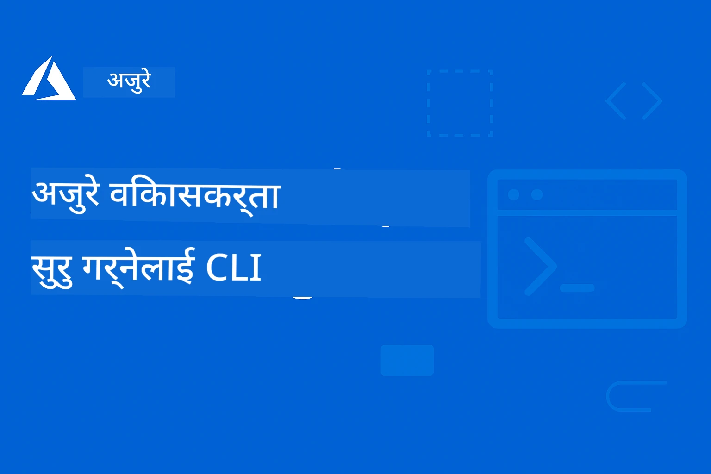

# AZD सुरु गर्नेहरूका लागि: एक संरचित सिकाइ यात्रा

 

[](https://GitHub.com/microsoft/azd-for-beginners/watchers/)
[](https://GitHub.com/microsoft/azd-for-beginners/network/)
[](https://GitHub.com/microsoft/azd-for-beginners/stargazers/)

[](https://discord.gg/microsoft-azure)
[](https://discord.gg/nTYy5BXMWG)

## यस कोर्ससँग सुरु गर्दै

तपाईंको AZD सिकाइ यात्रामा सुरु गर्न यी चरणहरू पालना गर्नुहोस्:

1. **Repository फोर्क गर्नुहोस्**: क्लिक गर्नुहोस् [](https://GitHub.com/microsoft/azd-for-beginners/fork)
2. **Repository क्लोन गर्नुहोस्**: `git clone https://github.com/microsoft/azd-for-beginners.git`
3. **समुदायमा सहभागी हुनुहोस्**: [Azure Discord समुदायहरू](https://discord.com/invite/ByRwuEEgH4) विशेषज्ञ समर्थनका लागि
4. **तपाईंको सिकाइ पथ छान्नुहोस्**: तलको अध्यायबाट तपाईंको अनुभव स्तर अनुसार उपयुक्त एउटा चयन गर्नुहोस्

### बहुभाषिक समर्थन

#### स्वचालित अनुवादहरू (सधैं अपडेट हुने)

<!-- CO-OP TRANSLATOR LANGUAGES TABLE START -->
[Arabic](../ar/README.md) | [Bengali](../bn/README.md) | [Bulgarian](../bg/README.md) | [Burmese (Myanmar)](../my/README.md) | [Chinese (Simplified)](../zh-CN/README.md) | [Chinese (Traditional, Hong Kong)](../zh-HK/README.md) | [Chinese (Traditional, Macau)](../zh-MO/README.md) | [Chinese (Traditional, Taiwan)](../zh-TW/README.md) | [Croatian](../hr/README.md) | [Czech](../cs/README.md) | [Danish](../da/README.md) | [Dutch](../nl/README.md) | [Estonian](../et/README.md) | [Finnish](../fi/README.md) | [French](../fr/README.md) | [German](../de/README.md) | [Greek](../el/README.md) | [Hebrew](../he/README.md) | [Hindi](../hi/README.md) | [Hungarian](../hu/README.md) | [Indonesian](../id/README.md) | [Italian](../it/README.md) | [Japanese](../ja/README.md) | [Kannada](../kn/README.md) | [Korean](../ko/README.md) | [Lithuanian](../lt/README.md) | [Malay](../ms/README.md) | [Malayalam](../ml/README.md) | [Marathi](../mr/README.md) | [Nepali](./README.md) | [Nigerian Pidgin](../pcm/README.md) | [Norwegian](../no/README.md) | [Persian (Farsi)](../fa/README.md) | [Polish](../pl/README.md) | [Portuguese (Brazil)](../pt-BR/README.md) | [Portuguese (Portugal)](../pt-PT/README.md) | [Punjabi (Gurmukhi)](../pa/README.md) | [Romanian](../ro/README.md) | [Russian](../ru/README.md) | [Serbian (Cyrillic)](../sr/README.md) | [Slovak](../sk/README.md) | [Slovenian](../sl/README.md) | [Spanish](../es/README.md) | [Swahili](../sw/README.md) | [Swedish](../sv/README.md) | [Tagalog (Filipino)](../tl/README.md) | [Tamil](../ta/README.md) | [Telugu](../te/README.md) | [Thai](../th/README.md) | [Turkish](../tr/README.md) | [Ukrainian](../uk/README.md) | [Urdu](../ur/README.md) | [Vietnamese](../vi/README.md)

> **स्थानीय रूपमा क्लोन गर्न चाहनुहुन्छ?**

> यस रिपोजिटरीमा ५० भन्दा बढी भाषाको अनुवादहरू समावेश गरिएको छ जसले डाउनलोड आकार उल्लेखनीय रूपमा बढाउछ। अनुवादहरू बिना क्लोन गर्न `sparse checkout` प्रयोग गर्नुहोस्:
> ```bash
> git clone --filter=blob:none --sparse https://github.com/microsoft/AZD-for-beginners.git
> cd AZD-for-beginners
> git sparse-checkout set --no-cone '/*' '!translations' '!translated_images'
> ```
> यसले तपाईंलाई कोर्स पूरा गर्न आवश्यक सबै कुरा धेरै छिटो डाउनलोडका साथ दिन्छ।
<!-- CO-OP TRANSLATOR LANGUAGES TABLE END -->

## कोर्स अवलोकन

Azure Developer CLI (azd) मा मास्टरी प्राप्त गर्न संरचित अध्यायहरू मार्फत प्रगतिको साथ सिक्न डिजाइन गरिएको। **विशेष ध्यान Microsoft Foundry एकीकरणसहित AI अनुप्रयोग डिप्लोयमेन्टमा।**

### किन यो कोर्स आधुनिक विकासकर्ताहरूका लागि आवश्यक छ

Microsoft Foundry Discord समुदायका अनुसार, **४५% विकासकर्ताहरू AI वर्कलोडहरूको लागि AZD प्रयोग गर्न चाहन्छन्** तर निम्न चुनौतीहरू सामना गर्छन्:
- जटिल बहु-सेवा AI आर्किटेक्चरहरू
- उत्पादन AI डिप्लोयमेन्टका उत्तम अभ्यासहरू  
- Azure AI सेवा एकीकरण र कन्फिगरेसन
- AI वर्कलोडहरूको लागत अनुकूलन
- AI विशेष डिप्लोयमेन्ट मुद्दाहरूको त्रुटि समाधान

### सिकाइ उद्देश्यहरू

यो संरचित कोर्स पूरा गरेर तपाईंले:
- **AZD आधारभूतहरूमा महारथ हासिल गर्नुहोस्**: मुख्य अवधारणाहरू, स्थापना, र सेटअप
- **AI अनुप्रयोगहरू डिप्लोय गर्नुहोस्**: Microsoft Foundry सेवा प्रयोग गरी AZD संग
- **इन्फ्रास्ट्रक्चर एज़ कोड कार्यान्वयन गर्नुहोस्**: Bicep टेम्प्लेटमार्फत Azure स्रोत व्यवस्थापन
- **डिप्लोयमेन्ट त्रुटि समाधान गर्नुहोस्**: सामान्य समस्याहरू समाधान र डिबग
- **उत्पादनको लागि अनुकूलन गर्नुहोस्**: सुरक्षा, स्केलिङ, अनुगमन, र लागत व्यवस्थापन
- **बहु-एजेन्ट समाधानहरू निर्माण गर्नुहोस्**: जटिल AI आर्किटेक्चरहरू डिप्लोय गर्नुहोस्

## 📚 सिकाइ अध्यायहरू

*अनुभव स्तर र लक्ष्य अनुसार तपाईंको सिकाइ पथ चयन गर्नुहोस्*

### 🚀 अध्याय १: आधार र तिब्र आरम्भ
**पूर्वाधार:** Azure सदस्यता, आधारभूत कमाण्ड लाइन ज्ञान  
**अवधि:** ३०-४५ मिनेट  
**जटिलता:** ⭐

#### सिक्ने कुराहरू
- Azure Developer CLI को आधारभूत समझ
- तपाईंको प्लेटफर्ममा AZD स्थापना
- तपाईंको पहिलो सफल डिप्लोयमेन्ट

#### सिकाइ स्रोतहरू
- **🎯 यहाँबाट सुरु गर्नुहोस्**: [Azure Developer CLI के हो?](../..)
- **📖 सिद्धान्त**: [AZD आधारहरू](docs/getting-started/azd-basics.md) - मुख्य अवधारणा र शब्दावली
- **⚙️ सेटअप**: [स्थापना र सेटअप](docs/getting-started/installation.md) - प्लेटफर्म विशेष मार्गदर्शन
- **🛠️ हातमुख गर्दै**: [तपाईंको पहिलो प्रोजेक्ट](docs/getting-started/first-project.md) - चरण-द्वारा-चरण ट्युटोरियल
- **📋 छिटो सन्दर्भ**: [कमाण्ड चिट शीट](resources/cheat-sheet.md)

#### व्यावहारिक अभ्यासहरू
```bash
# छिटो स्थापना जाँच
azd version

# तपाइँको पहिलो अनुप्रयोग तैनाथ गर्नुहोस्
azd init --template todo-nodejs-mongo
azd up
```

**💡 अध्याय परिणाम**: AZD प्रयोग गरेर Azure मा एक साधारण वेब अनुप्रयोग सफलतापूर्वक डिप्लोय गर्नुहोस्

**✅ सफलता प्रमाणीकरण:**
```bash
# अध्याय १ पूरा गरेपछि, तपाईं सक्षम हुनुहुनेछ:
azd version              # स्थापना गरिएको संस्करण देखाउँछ
azd init --template todo-nodejs-mongo  # परियोजना प्रारम्भ गर्दछ
azd up                  # Azure मा परिनियोजन गर्दछ
azd show                # चलिरहेको एप्लिकेसनको URL देखाउँछ
# एप्लिकेसन ब्राउजरमा खुल्छ र काम गर्छ
azd down --force --purge  # स्रोतहरू सफा गर्दछ
```

**📊 समय लगानी:** ३०-४५ मिनेट  
**📈 अध्ययन स्तर पछि:** आधारभूत अनुप्रयोगहरू स्वतन्त्र रूपमा डिप्लोय गर्न सक्षम

**✅ सफलता प्रमाणीकरण:**
```bash
# अध्याय १ पूरा गरेपछि, तपाईं सक्षम हुनुहुनेछ:
azd version              # इन्स्टल गरिएको संस्करण देखाउँछ
azd init --template todo-nodejs-mongo  # परियोजना आरम्भ गर्दछ
azd up                  # Azure मा परिनियोजन गर्दछ
azd show                # चलिरहेको एपको URL देखाउँछ
# अनुप्रयोग ब्राउजरमा खुल्छ र काम गर्छ
azd down --force --purge  # स्रोतहरू सफा गर्दछ
```

**📊 समय लगानी:** ३०-४५ मिनेट  
**📈 अध्ययन स्तर पछि:** आधारभूत अनुप्रयोगहरू स्वतन्त्र रूपमा डिप्लोय गर्न सक्षम

---

### 🤖 अध्याय २: AI-प्रथम विकास (AI विकासकर्ताका लागि सिफारिस गरिएको)
**पूर्वाधार:** अध्याय १ पूरा  
**अवधि:** १-२ घण्टा  
**जटिलता:** ⭐⭐

#### सिक्ने कुराहरू
- Microsoft Foundry एकीकरण AZD सँग
- AI-शक्ति अनुप्रयोगहरू डिप्लोय गर्नुहोस्
- AI सेवा कन्फिगरेसन बुझ्नुहोस्

#### सिकाइ स्रोतहरू
- **🎯 यहाँबाट सुरु गर्नुहोस्**: [Microsoft Foundry एकीकरण](docs/microsoft-foundry/microsoft-foundry-integration.md)
- **📖 ढाँचा**: [AI मोडेल डिप्लोयमेन्ट](docs/microsoft-foundry/ai-model-deployment.md) - AI मोडेलहरू डिप्लोय र व्यवस्थापन
- **🛠️ कार्यशाला**: [AI कार्यशाला प्रयोगशाला](docs/microsoft-foundry/ai-workshop-lab.md) - तपाईंको AI समाधानलाई AZD-मैत्री बनाउनुहोस्
- **🎥 अन्तरक्रियात्मक मार्गदर्शन**: [कार्यशाला सामग्रीहरू](workshop/README.md) - MkDocs * DevContainer वातावरण सहित ब्राउजर आधारित सिकाइ
- **📋 टेम्प्लेटहरू**: [Microsoft Foundry टेम्प्लेटहरू](../..)
- **📝 उदाहरणहरू**: [AZD डिप्लोयमेन्ट उदाहरणहरू](examples/README.md)

#### व्यावहारिक अभ्यासहरू
```bash
# तपाईंको पहिलो एआई अनुप्रयोग तैनाथ गर्नुहोस्
azd init --template azure-search-openai-demo
azd up

# थप एआई ढाँचा प्रयास गर्नुहोस्
azd init --template openai-chat-app-quickstart
azd init --template agent-openai-python-prompty
```

**💡 अध्याय परिणाम**: RAG क्षमतासहित AI-शक्ति बातचीत अनुप्रयोग डिप्लोय र कन्फिगर गर्नुहोस्

**✅ सफलता प्रमाणीकरण:**
```bash
# अध्याय २ पछि, तपाईं सक्षम हुनुहुनेछ:
azd init --template azure-search-openai-demo
azd up
# AI कुराकानी अन्तरफलक परीक्षण गर्नुहोस्
# प्रश्नहरू सोध्नुहोस् र स्रोतहरू सहित AI-शक्ति प्राप्त जवाफहरू पाउनुहोस्
# खोजी एकीकरण काम गर्छ कि भनी प्रमाणीकरण गर्नुहोस्
azd monitor  # एप्लिकेशन इनसाइट्सले टेलीमेट्री देखाउँछ कि भनी जाँच गर्नुहोस्
azd down --force --purge
```

**📊 समय लगानी:** १-२ घण्टा  
**📈 अध्ययन स्तर पछि:** उत्पादन तयार AI अनुप्रयोग डिप्लोय र कन्फिगर गर्न सक्षम  
**💰 लागत चेतना:** $८०-१५०/महिना विकास लागत, $३००-३५००/महिना उत्पादन लागत बुझ्न

#### 💰 AI डिप्लोयमेन्ट लागत विचारहरू

**विकास वातावरण (अनुमानित $८०-१५०/महिना):**
- Azure OpenAI (Pay-as-you-go): $०-५०/महिना (टोकन प्रयोग अनुसार)
- AI सर्च (प्राथमिक तह): $७५/महिना
- कन्टेनर एप्स (उपभोग): $०-२०/महिना
- स्टोरेज (मानक): $१-५/महिना

**उत्पादन वातावरण (अनुमानित $३००-३,५००+/महिना):**
- Azure OpenAI (स्थिर प्रदर्शनको लागि PTU): $३,०००+/महिना वा उच्च मात्रा pay-as-you-go
- AI सर्च (मानक तह): $२५०/महिना
- कन्टेनर एप्स (समर्पित): $५०-१००/महिना
- एप्लिकेशन इन्साइट्स: $५-५०/महिना
- स्टोरेज (प्रीमियम): $१०-५०/महिना

**💡 लागत अनुकूलन सुझावहरू:**
- सिक्नको लागि **निःशुल्क तह** Azure OpenAI प्रयोग गर्नुहोस् (५०,००० टोकन/महिना समावेश)
- सक्रिय विकास नहुँदा `azd down` चलाएर स्रोतहरू बन्द गर्नुहोस्
- उपभोग आधारित बिलिङबाट सुरु गर्नुहोस्, उत्पादनको लागि मात्र PTU मा अपग्रेड गर्नुहोस्
- डिप्लोय गर्नुअघि लागत अनुमान गर्न `azd provision --preview` प्रयोग गर्नुहोस्
- अटो-स्केलिङ सक्षम पार्नुहोस्: मात्र साँच्चिकै प्रयोगको आधारमा तिर्नुहोस्

**लागत अनुगमन:**
```bash
# अनुमानित मासिक लागत जाँच गर्नुहोस्
azd provision --preview

# Azure पोर्टलमा वास्तविक लागतहरू निगरानी गर्नुहोस्
az consumption budget list --resource-group <your-rg>
```

---

### ⚙️ अध्याय ३: कन्फिगरेसन र प्रमाणीकरण
**पूर्वाधार:** अध्याय १ पूरा  
**अवधि:** ४५-६० मिनेट  
**जटिलता:** ⭐⭐

#### सिक्ने कुराहरू
- वातावरण कन्फिगरेसन र व्यवस्थापन
- प्रमाणीकरण र सुरक्षा उत्तम अभ्यासहरू
- स्रोत नामकरण र संगठन

#### सिकाइ स्रोतहरू
- **📖 कन्फिगरेसन**: [कन्फिगरेसन मार्गदर्शन](docs/getting-started/configuration.md) - वातावरण सेटअप
- **🔐 सुरक्षा**: [प्रमाणीकरण ढाँचा र प्रबंधित आइडेन्टीटी](docs/getting-started/authsecurity.md) - प्रमाणीकरण ढाँचाहरू
- **📝 उदाहरणहरू**: [डेटाबेस अनुप्रयोग उदाहरण](examples/database-app/README.md) - AZD डेटाबेस उदाहरणहरू

#### व्यावहारिक अभ्यासहरू
- बहु वातावरणहरू (डेभ, स्टेजिङ, प्रोड) कन्फिगर गर्नुहोस्
- प्रबंधित आइडेन्टी प्रमाणीकरण सेट अप गर्नुहोस्
- वातावरण-विशेष कन्फिगरेसनहरू कार्यान्वयन गर्नुहोस्

**💡 अध्याय परिणाम**: उपयुक्त प्रमाणीकरण र सुरक्षासहित बहु वातावरणहरू व्यवस्थापन गर्नुहोस्

---

### 🏗️ अध्याय ४: इन्फ्रास्ट्रक्चर एज़ कोड र डिप्लोयमेन्ट
**पूर्वाधार:** अध्यायहरू १-३ पूरा  
**अवधि:** १-१.५ घण्टा  
**जटिलता:** ⭐⭐⭐

#### सिक्ने कुराहरू
- उन्नत डिप्लोयमेन्ट ढाँचाहरू
- Bicep सँग इन्फ्रास्ट्रक्चर एज़ कोड
- स्रोत प्रावधान रणनीतिहरू

#### सिकाइ स्रोतहरू
- **📖 डिप्लोयमेन्ट**: [डिप्लोयमेन्ट मार्गदर्शन](docs/deployment/deployment-guide.md) - सम्पूर्ण कार्यप्रवाहहरू
- **🏗️ प्रावधान**: [स्रोत प्रावधान](docs/deployment/provisioning.md) - Azure स्रोत व्यवस्थापन
- **📝 उदाहरणहरू**: [कन्टेनर एप उदाहरण](../../examples/container-app) - कन्टेनराइज्ड डिप्लोयमेन्टहरू

#### व्यावहारिक अभ्यासहरू
- अनुकूलित Bicep टेम्प्लेटहरू सिर्जना गर्नुहोस्
- बहु-सेवा अनुप्रयोगहरू डिप्लोय गर्नुहोस्
- ब्लु-ग्रीन डिप्लोयमेन्ट रणनीतिहरू कार्यान्वयन गर्नुहोस्

**💡 अध्याय परिणाम**: अनुकूलित इन्फ्रास्ट्रक्चर टेम्प्लेटहरू प्रयोग गरी जटिल बहु-सेवा अनुप्रयोगहरू डिप्लोय गर्नुहोस्

---

### 🎯 अध्याय ५: बहु-एजेन्ट AI समाधानहरू (उन्नत)
**पूर्वाधार:** अध्यायहरू १-२ पूरा  
**अवधि:** २-३ घण्टा  
**जटिलता:** ⭐⭐⭐⭐
#### तपाईंले के सिक्नेछौं
- बहु-एजेन्ट वास्तुकला ढाँचाहरू
- एजेन्ट समन्वय र तालमेल
- उत्पादन-तयार AI डिप्लोयमेन्टहरू

#### सिकाइ स्रोतहरू
- **🤖 प्रदर्शन परियोजना**: [रिटेल बहु-एजेन्ट समाधान](examples/retail-scenario.md) - पूर्ण कार्यान्वयन
- **🛠️ ARM टेम्प्लेटहरू**: [ARM टेम्प्लेट प्याकेज](../../examples/retail-multiagent-arm-template) - एक क्लिकमा डिप्लोयमेन्ट
- **📖 वास्तुकला**: [बहु-एजेन्ट समन्वय ढाँचाहरू](/docs/pre-deployment/coordination-patterns.md) - ढाँचाहरू

#### व्यावहारिक अभ्यासहरू
```bash
# पूरै खुद्रा बहु-एजेन्ट समाधान तैनाथ गर्नुहोस्
cd examples/retail-multiagent-arm-template
./deploy.sh

# एजेन्ट कन्फिगरेसनहरू अन्वेसण गर्नुहोस्
az deployment group show --resource-group <rg-name> --name <deployment-name>
```

**💡 अध्याय परिणाम**: ग्राहक र इनभेन्टरी एजेन्टहरू सहित उत्पादन-तयार बहु-एजेन्ट AI समाधान डिप्लोय र व्यवस्थापन गर्नुहोस्

---

### 🔍 अध्याय ६: पूर्व-डिप्लोयमेन्ट मान्यकरण र योजना बनाउने
**पूर्वापेक्षितहरू**: अध्याय ४ पूरा भयो  
**अवधि**: १ घण्टा  
**जटिलता**: ⭐⭐

#### तपाईंले के सिक्नेछौं
- क्षमता योजना र स्रोत मान्यकरण
- SKU छनोट रणनीतिहरू
- पूर्व-उडान जाँचहरू र स्वचालन

#### सिकाइ स्रोतहरू
- **📊 योजना**: [क्षमता योजना](docs/pre-deployment/capacity-planning.md) - स्रोत मान्यकरण
- **💰 छनोट**: [SKU छनोट](docs/pre-deployment/sku-selection.md) - लागत-प्रभावी छनोटहरू
- **✅ मान्यकरण**: [पूर्व-उडान जाँचहरू](docs/pre-deployment/preflight-checks.md) - स्वचालित स्क्रिप्टहरू

#### व्यावहारिक अभ्यासहरू
- क्षमता मान्यकरण स्क्रिप्टहरू चलाउनुहोस्
- लागतको लागि SKU छनोटहरू अनुकूलन गर्नुहोस्
- स्वचालित पूर्व-डिप्लोयमेन्ट जाँचहरू कार्यान्वयन गर्नुहोस्

**💡 अध्याय परिणाम**: कार्यान्वयन अघि डिप्लोयमेन्टहरू मान्य र अनुकूलन गर्नुहोस्

---

### 🚨 अध्याय ७: समस्या समाधान र डिबगिङ
**पूर्वापेक्षितहरू**: कुनै पनि डिप्लोयमेन्ट अध्याय पूरा  
**अवधि**: १-१.५ घण्टा  
**जटिलता**: ⭐⭐

#### तपाईंले के सिक्नेछौं
- प्रणालीगत डिबगिङ विधिहरू
- सामान्य समस्याहरू र समाधानहरू
- AI-विशेष समस्या समाधान

#### सिकाइ स्रोतहरू
- **🔧 सामान्य समस्याहरू**: [सामान्य समस्याहरू](docs/troubleshooting/common-issues.md) - FAQ र समाधानहरू
- **🕵️ डिबगिङ**: [डिबगिङ मार्गदर्शन](docs/troubleshooting/debugging.md) - चरण-दर-चरण रणनीतिहरू
- **🤖 AI समस्याहरू**: [AI-विशेष समस्या समाधान](docs/troubleshooting/ai-troubleshooting.md) - AI सेवा समस्याहरू

#### व्यावहारिक अभ्यासहरू
- डिप्लोयमेन्ट विफलताहरू निदान गर्नुहोस्
- प्रमाणीकरण समस्याहरू समाधान गर्नुहोस्
- AI सेवा कनेक्टिविटी डिबग गर्नुहोस्

**💡 अध्याय परिणाम**: स्वतन्त्र रूपमा सामान्य डिप्लोयमेन्ट समस्याहरू निदान र समाधान गर्नुहोस्

---

### 🏢 अध्याय ८: उत्पादन र उद्यम ढाँचाहरू
**पूर्वापेक्षितहरू**: अध्यायहरू १-४ पूरा  
**अवधि**: २-३ घण्टा  
**जटिलता**: ⭐⭐⭐⭐

#### तपाईंले के सिक्नेछौं
- उत्पादन डिप्लोयमेन्ट रणनीतिहरू
- उद्यम सुरक्षा ढाँचाहरू
- अनुगमन र लागत अनुकूलन

#### सिकाइ स्रोतहरू
- **🏭 उत्पादन**: [उत्पादन AI उत्तम अभ्यासहरू](docs/microsoft-foundry/production-ai-practices.md) - उद्यम ढाँचाहरू
- **📝 उदाहरणहरू**: [माइक्रोसर्भिस उदाहरण](../../examples/microservices) - जटिल वास्तुकलाहरू
- **📊 अनुगमन**: [एप्लिकेशन इनसाइट्स एकीकरण](docs/pre-deployment/application-insights.md) - अनुगमन

#### व्यावहारिक अभ्यासहरू
- उद्यम सुरक्षा ढाँचाहरू कार्यान्वयन गर्नुहोस्
- व्यापक अनुगमन सेट अप गर्नुहोस्
- उचित शासनका साथ उत्पादनमा डिप्लोय गर्नुहोस्

**💡 अध्याय परिणाम**: पूर्ण उत्पादन क्षमताहरू सहित उद्यम-तयार अनुप्रयोगहरू डिप्लोय गर्नुहोस्

---

## 🎓 कार्यशाला अवलोकन: व्यावहारिक सिकाइ अनुभव

> **⚠️ कार्यशाला स्थिति: सक्रिय विकास**  
> कार्यशाला सामग्रीहरू हाल विकास र सुधार भइरहेको छ। मुख्य मोड्युलहरू कार्यरत छन्, तर केही उन्नत खण्डहरू अधूरी छन्। हामी सबै सामग्री पूरा गर्न सक्रिय रूपमा काम गरिरहेका छौं। [प्रगति ट्र्याक गर्नुहोस् →](workshop/README.md)

### अन्तरक्रियात्मक कार्यशाला सामग्री
**ब्राउजर-आधारित उपकरणहरू र मार्गदर्शन अभ्यासहरूसहित व्यापक व्यावहारिक सिकाइ**

हाम्रो कार्यशाला सामग्रीले माथि उल्लिखित अध्याय-आधारित पाठ्यक्रमसँग पूरक एक संरचित, अन्तरक्रियात्मक सिकाइ अनुभव प्रदान गर्दछ। कार्यशाला स्व-गतिको सिकाइ र प्रशिक्षक-नेतृत्वका सत्रहरू दुवैका लागि डिजाइन गरिएको छ।

#### 🛠️ कार्यशाला सुविधाहरू
- **ब्राउजर-आधारित इन्टरफेस**: खोज, प्रतिलिपि, र थिम सुविधाहरू सहित पूर्ण MkDocs-संचालित कार्यशाला
- **GitHub Codespaces एकीकरण**: एक क्लिकमा विकास वातावरण सेट अप
- **संरचित सिकाइ मार्ग**: ७-चरण मार्गदर्शित अभ्यासहरू (कुल ३.५ घण्टा)
- **पत्ता लगाउने → डिप्लोय → अनुकूलन**: प्रगतिशील कार्यप्रणाली
- **इन्टरएक्टिभ DevContainer वातावरण**: पूर्व-कन्फिगर उपकरणहरू र निर्भरता

#### 📚 कार्यशाला संरचना
कार्यशाला "पत्ता लगाउने → डिप्लोय → अनुकूलन" विधि अनुसरण गर्दछ:

१. **पत्ता लगाउने चरण** (४५ मिनेट)
   - Microsoft Foundry टेम्प्लेटहरू र सेवाहरू अन्वेषण गर्नुहोस्
   - बहु-एजेन्ट वास्तुकला ढाँचाहरू बुझ्नुहोस्
   - डिप्लोयमेन्ट आवश्यकताहरू र पूर्वापेक्षितहरू समीक्षा गर्नुहोस्

२. **डिप्लोय चरण** (२ घण्टा)
   - AZD सँग AI अनुप्रयोगहरूमा व्यावहारिक डिप्लोयमेन्ट
   - Azure AI सेवा र अन्तबिन्दुहरू कन्फिगर गर्नुहोस्
   - सुरक्षा र प्रमाणीकरण ढाँचाहरू कार्यान्वयन गर्नुहोस्

३. **अनुकूलन चरण** (४५ मिनेट)
   - विशिष्ट प्रयोग केसहरूको लागि अनुप्रयोगहरू संशोधन गर्नुहोस्
   - उत्पादन डिप्लोयमेन्टको लागि अनुकूलन गर्नुहोस्
   - अनुगमन र लागत व्यवस्थापन कार्यान्वयन गर्नुहोस्

#### 🚀 कार्यशाला सुरू गर्ने तरिका
```bash
# विकल्प १: GitHub Codespaces (सिफारिस गरिएको)
# रिपोजिटरीमा "Code" → "Create codespace on main" मा क्लिक गर्नुहोस्

# विकल्प २: स्थानीय विकास
git clone https://github.com/microsoft/azd-for-beginners.git
cd azd-for-beginners/workshop
# workshop/README.md मा सेटअप निर्देशनहरू पालन गर्नुहोस्
```

#### 🎯 कार्यशाला सिकाइ परिणामहरू
कार्यशाला पूरा गरेपछि सहभागीहरूले:
- **उत्पादन AI अनुप्रयोगहरू डिप्लोय गर्नुहोस्**: Microsoft Foundry सेवाहरू सहित AZD प्रयोग गर्नुहोस्
- **बहु-एजेन्ट वास्तुकलाहरूमा निपूर्ण हुनुहोस्**: समन्वित AI एजेन्ट समाधानहरू कार्यान्वयन गर्नुहोस्
- **सुरक्षा सर्वोत्तम अभ्यासहरू कार्यान्वयन गर्नुहोस्**: प्रमाणीकरण र पहुँच नियन्त्रण कन्फिगर गर्नुहोस्
- **स्केलका लागि अनुकूलन गर्नुहोस्**: लागत-प्रभावी, उच्च प्रदर्शन डिप्लोयमेन्ट डिजाइन गर्नुहोस्
- **डिप्लोयमेन्ट समस्या समाधान गर्नुहोस्**: सामान्य समस्याहरू स्वतन्त्र रूपमा समाधान गर्नुहोस्

#### 📖 कार्यशाला स्रोतहरू
- **🎥 अन्तरक्रियात्मक मार्गदर्शन**: [कार्यशाला सामग्री](workshop/README.md) - ब्राउजर-आधारित सिकाइ वातावरण
- **📋 चरण-दर-चरण निर्देशनहरू**: [मार्गदर्शित अभ्यासहरू](../../workshop/docs/instructions) - विस्तृत हिँडाइहरू
- **🛠️ AI कार्यशाला प्रयोगशाला**: [AI कार्यशाला प्रयोगशाला](docs/microsoft-foundry/ai-workshop-lab.md) - AI केन्द्रित अभ्यासहरू
- **💡 छिटो सुरु गाइड**: [कार्यशाला सेटअप गाइड](workshop/README.md#quick-start) - वातावरण कन्फिगरेसन

**उत्तम: कर्पोरेट प्रशिक्षण, विश्वविद्यालय कोर्सहरू, स्व-गतिको सिकाइ, र विकासकर्ता बुटक्याम्पहरूका लागि।**

---

## 📖 Azure Developer CLI के हो?

Azure Developer CLI (azd) एक विकासकर्ता केन्द्रित कमाण्ड-लाइन इन्टरफेस हो जसले Azure मा अनुप्रयोगहरू निर्माण र डिप्लोय गर्ने प्रक्रियालाई छिटो बनाउँछ। यसले प्रदान गर्छ:

- **टेम्प्लेट-आधारित डिप्लोयमेन्टहरू** - सामान्य अनुप्रयोग ढाँचाहरूका लागि पूर्वनिर्मित टेम्प्लेटहरू प्रयोग गर्नुहोस्
- **कोडको रूपमा पूर्वाधार** - Bicep वा Terraform प्रयोग गरी Azure स्रोतहरू व्यवस्थापन गर्नुहोस्  
- **समेकित कार्यप्रवाहहरू** - Seamlessly अनुप्रयोगहरू प्रविष्टीकरण, डिप्लोय, र अनुगमन गर्नुहोस्
- **विकासकर्ता मैत्री** - विकासकर्ता उत्पादकत्व र अनुभवको लागि अनुकूलित

### **AZD + Microsoft Foundry: AI डिप्लोयमेन्टहरूका लागि उत्तम**

**किन AZD AI समाधानहरूका लागि?** AZD ले AI विकासकर्ताहरूले सामना गर्ने प्रमुख चुनौतीहरूका लागि समाधान गर्दछ:

- **AI-तयार टेम्प्लेटहरू** - Azure OpenAI, Cognitive Services, र ML कार्यभारहरूको लागि पूर्व-कन्फिगर टेम्प्लेटहरू
- **सुरक्षित AI डिप्लोयमेन्टहरू** - AI सेवा, API कुञ्जीहरू, र मोडेल अन्तबिन्दुहरूका लागि सुरक्षित ढाँचाहरू
- **उत्पादन AI ढाँचाहरू** - स्केलेबल, लागत-प्रभावी AI अनुप्रयोग डिप्लोयमेन्टका लागि उत्तम अभ्यासहरू
- **एन्ड-टु-एन्ड AI कार्यप्रवाहहरू** - मोडेल विकासदेखि उत्पादन डिप्लोयमेन्टसम्म उचित अनुगमनसहित
- **लागत अनुकूलन** - AI कार्यभारहरूको लागि स्मार्ट स्रोत वितरण र स्केलिंग रणनीतिहरू
- **Microsoft Foundry एकीकरण** - Microsoft Foundry मोडेल क्याटलग र अन्तबिन्दुहरूसँग बिना अवरोध कनेक्शन

---

## 🎯 टेम्प्लेटहरू र उदाहरण पुस्तकालय

### प्रदर्शन गरिएको: Microsoft Foundry टेम्प्लेटहरू
**तपाईं AI अनुप्रयोगहरू डिप्लोय गर्दै हुनुहुन्छ भने यहाँबाट सुरु गर्नुहोस्!**

> **सूचना:** यी टेम्प्लेटहरूले विभिन्न AI ढाँचाहरू देखाउँछन्। केही बाह्य Azure नमूनाहरू हुन्, अरूहरू स्थानीय कार्यान्वयनहरू हुन्।

| टेम्प्लेट | अध्याय | जटिलता | सेवा | प्रकार |
|----------|---------|------------|----------|------|
| [**AI च्याटसँग सुरु गर्नुहोस्**](https://github.com/Azure-Samples/get-started-with-ai-chat) | अध्याय २ | ⭐⭐ | AzureOpenAI + Azure AI Model Inference API + Azure AI Search + Azure Container Apps + Application Insights | बाह्य |
| [**AI एजेन्टहरूसँग सुरु गर्नुहोस्**](https://github.com/Azure-Samples/get-started-with-ai-agents) | अध्याय २ | ⭐⭐ | Azure AI Agent Service + AzureOpenAI + Azure AI Search + Azure Container Apps + Application Insights| बाह्य |
| [**Azure Search + OpenAI डेमो**](https://github.com/Azure-Samples/azure-search-openai-demo) | अध्याय २ | ⭐⭐ | AzureOpenAI + Azure AI Search + App Service + Storage | बाह्य |
| [**OpenAI च्याट एप् छिटो सुरु**](https://github.com/Azure-Samples/openai-chat-app-quickstart) | अध्याय २ | ⭐ | AzureOpenAI + Container Apps + Application Insights | बाह्य |
| [**एजेन्ट OpenAI Python Prompty**](https://github.com/Azure-Samples/agent-openai-python-prompty) | अध्याय ५ | ⭐⭐⭐ | AzureOpenAI + Azure Functions + Prompty | बाह्य |
| [**Contoso Chat RAG**](https://github.com/Azure-Samples/contoso-chat) | अध्याय ८ | ⭐⭐⭐⭐ | AzureOpenAI + AI Search + Cosmos DB + Container Apps | बाह्य |
| [**Retail Multi-Agent Solution**](examples/retail-scenario.md) | अध्याय ५ | ⭐⭐⭐⭐ | AzureOpenAI + AI Search + Storage + Container Apps + Cosmos DB | **स्थानीय** |

### प्रदर्शन गरिएको: पूर्ण सिकाइ परिदृश्यहरू
**उत्पादन-तयार अनुप्रयोग टेम्प्लेटहरू सिकाइ अध्यायहरूमा मिलाइएको**

| टेम्प्लेट | सिकाइ अध्याय | जटिलता | मुख्य सिकाइ |
|----------|------------------|------------|--------------|
| [**openai-chat-app-quickstart**](https://github.com/Azure-Samples/openai-chat-app-quickstart) | अध्याय २ | ⭐ | आधारभूत AI डिप्लोयमेन्ट ढाँचाहरू |
| [**azure-search-openai-demo**](https://github.com/Azure-Samples/azure-search-openai-demo) | अध्याय २ | ⭐⭐ | Azure AI Search सँग RAG कार्यान्वयन |
| [**ai-document-processing**](https://github.com/Azure-Samples/ai-document-processing) | अध्याय ४ | ⭐⭐ | कागजात बुद्धिमत्ता एकीकरण |
| [**agent-openai-python-prompty**](https://github.com/Azure-Samples/agent-openai-python-prompty) | अध्याय ५ | ⭐⭐⭐ | एजेन्ट फ्रेमवर्क र फंक्शन कलिङ् |
| [**contoso-chat**](https://github.com/Azure-Samples/contoso-chat) | अध्याय ८ | ⭐⭐⭐ | उद्यम AI समन्वय |
| [**retail-multi-agent-solution**](examples/retail-scenario.md) | अध्याय ५ | ⭐⭐⭐⭐ | ग्राहक र इनभेन्टरी एजेन्टहरूसहित बहु-एजेन्ट वास्तुकला |

### उदाहरण प्रकारद्वारा सिकाइ

> **📌 स्थानीय बनाम बाह्य उदाहरणहरू:**  
> **स्थानिय उदाहरणहरू** (यस रिपोजिटरीमा) = तुरुन्त प्रयोग गर्न तयार  
> **बाह्य उदाहरणहरू** (Azure Samples) = लिंक गरिएको रिपोजिटरीबाट क्लोन गर्नुहोस्

#### स्थानीय उदाहरणहरू (तुरुन्त प्रयोग गर्नको लागि)
- [**Retail Multi-Agent Solution**](examples/retail-scenario.md) - पूर्ण उत्पादन-तयार कार्यान्वयन ARM टेम्प्लेटहरूसहित
  - बहु-एजेन्ट वास्तुकला (ग्राहक + इनभेन्टरी एजेन्टहरू)
  - व्यापक अनुगमन र मूल्याङ्कन
  - ARM टेम्प्लेटमार्फत एक क्लिक डिप्लोयमेन्ट

#### स्थानीय उदाहरणहरू - कन्टेनर अनुप्रयोगहरू (अध्यायहरू २-५)
**यस रिपोजिटरीमा व्यापक कन्टेनर डिप्लोयमेन्ट उदाहरणहरू:**
- [**कन्टेनर एप उदाहरणहरू**](examples/container-app/README.md) - कन्टेनराइज्ड डिप्लोयमेन्टहरूको पूर्ण मार्गदर्शन
  - [सादृश्य Flask API](../../examples/container-app/simple-flask-api) - आधारभूत REST API स्केल-टु-शून्यसहित
  - [माइक्रोसर्भिस वास्तुकला](../../examples/container-app/microservices) - उत्पादन-तयार बहु-सेवा डिप्लोयमेन्ट
  - छिटो सुरु, उत्पादन, र उन्नत डिप्लोयमेन्ट ढाँचाहरू
  - अनुगमन, सुरक्षा, र लागत अनुकूलन निर्देशन

#### बाह्य उदाहरणहरू - सरल अनुप्रयोगहरू (अध्यायहरू १-२)
**यी Azure नमूनाहरू रिपोजिटरीहरू क्लोन गरेर सुरु गर्नुहोस्:**
- [सरल वेब एप - Node.js + MongoDB](https://github.com/Azure-Samples/todo-nodejs-mongo) - आधारभूत डिप्लोयमेन्ट ढाँचाहरू
- [स्थिर वेबसाइट - React SPA](https://github.com/Azure-Samples/todo-csharp-sql-swa-func) - स्थिर सामग्री डिप्लोयमेन्ट
- [कन्टेनर एप - Python Flask](https://github.com/Azure-Samples/container-apps-store-api-microservice) - REST API डिप्लोयमेन्ट

#### बाह्य उदाहरणहरू - डाटाबेस एकीकरण (अध्यायहरू ३-४)  
- [डाटाबेस एप - C# + SQL](https://github.com/Azure-Samples/todo-csharp-sql) - डाटाबेस कनेक्टिविटी ढाँचाहरू
- [Functions + Cosmos DB](https://github.com/Azure-Samples/todo-python-mongo-swa-func) - सर्वरलेस डेटा कार्यप्रवाह

#### बाह्य उदाहरणहरू - उन्नत ढाँचाहरू (अध्यायहरू ४-८)
- [Java माइक्रोसर्भिसहरू](https://github.com/Azure-Samples/java-microservices-aca-lab) - बहु-सेवा वास्तुकलाहरू
- [कन्टेनर एप्स जॉबहरू](https://github.com/Azure-Samples/container-apps-jobs) - पृष्ठभूमि प्रशोधन  
- [उद्यम ML पाइपलाइन](https://github.com/Azure-Samples/mlops-v2) - उत्पादन-तयार ML ढाँचाहरू

### बाह्य टेम्प्लेट सङ्ग्रहहरू
- [**अधिकारिक AZD टेम्प्लेट ग्यालरी**](https://azure.github.io/awesome-azd/) - आधिकारिक र समुदाय टेम्प्लेटहरूको curated सङ्ग्रह
- [**Azure Developer CLI टेम्प्लेटहरू**](https://learn.microsoft.com/en-us/azure/developer/azure-developer-cli/azd-templates) - Microsoft Learn टेम्प्लेट दस्तावेज
- [**उदाहरण निर्देशिका**](examples/README.md) - विस्तृत व्याख्याहरू सहित स्थानीय सिकाइका उदाहरणहरू

---

## 📚 सिकाइ स्रोतहरू र सन्दर्भहरू

### छिटो सन्दर्भहरू
- [**कमाण्ड चिट सिट**](resources/cheat-sheet.md) - अध्याय अनुसार व्यवस्थित आवश्यक azd कमाण्डहरू
- [**शब्दावली**](resources/glossary.md) - Azure र azd शब्दावली  
- [**सामान्य प्रश्न**](resources/faq.md) - सिकाइ अध्याय अनुसार व्यवस्थित सामान्य प्रश्नहरू
- [**अध्ययन गाइड**](resources/study-guide.md) - व्यापक अभ्यास अभ्यासहरू

### हात-हातमा कार्यशालाहरू
- [**AI कार्यशाला ल्याब**](docs/microsoft-foundry/ai-workshop-lab.md) - तपाईँका AI समाधानहरू AZD-परिनियोज्य बनाउन (२-३ घण्टा)
- [**इन्टरऐक्टिभ कार्यशाला गाइड**](workshop/README.md) - MkDocs र DevContainer वातावरणको साथ ब्राउज़र-आधारित कार्यशाला
- [**संरचित सिकाइ मार्ग**](../../workshop/docs/instructions) - ७-चरण निर्देशित अभ्यासहरू (खोज → परिनियोजन → अनुकूलन)
- [**शुरुआतीहरूका लागि AZD कार्यशाला**](workshop/README.md) - GitHub Codespaces एकीकरण सहित पूर्ण हात-हातमा कार्यशाला सामग्रीहरू

### बाह्य सिकाइ स्रोतहरू
- [Azure Developer CLI दस्तावेज](https://learn.microsoft.com/en-us/azure/developer/azure-developer-cli/)
- [Azure आर्किटेक्चर केन्द्र](https://learn.microsoft.com/en-us/azure/architecture/)
- [Azure मूल्य निर्धारण क्यालकुलेटर](https://azure.microsoft.com/pricing/calculator/)
- [Azure स्थिति](https://status.azure.com/)

---

## 🔧 छिटो समस्या समाधान गाइड

**सामान्य समस्याहरू जुन शुरुवातीहरूलाई हुन्छ र तत्काल समाधानहरू:**

### ❌ "azd: command not found"

```bash
# पहिला AZD इन्स्टल गर्नुहोस्
# विन्डोज (पावरशेल):
winget install microsoft.azd

# म्याकओएस:
brew tap azure/azd && brew install azd

# लिनक्स:
curl -fsSL https://aka.ms/install-azd.sh | bash

# इन्स्टलेशन पुष्टि गर्नुहोस्
azd version
```

### ❌ "No subscription found" वा "Subscription not set"

```bash
# उपलब्ध सदस्यताहरू सूचीबद्ध गर्नुहोस्
az account list --output table

# डिफल्ट सदस्यता सेट गर्नुहोस्
az account set --subscription "<subscription-id-or-name>"

# AZD वातावरणको लागि सेट गर्नुहोस्
azd env set AZURE_SUBSCRIPTION_ID "<subscription-id>"

# सत्यापित गर्नुहोस्
az account show
```

### ❌ "InsufficientQuota" वा "Quota exceeded"

```bash
# फरक Azure क्षेत्र प्रयास गर्नुहोस्
azd env set AZURE_LOCATION "westus2"
azd up

# वा विकासमा साना SKU हरु प्रयोग गर्नुहोस्
# infra/main.parameters.json सम्पादन गर्नुहोस्:
{
  "sku": "B1"  // Instead of "P1V2"
}
```

### ❌ "azd up" आधा बाट असफल भयो

```bash
# विकल्प १: सफा गर्नुहोस् र पुन: प्रयास गर्नुहोस्
azd down --force --purge
azd up

# विकल्प २: केवल पूर्वाधार मर्मत गर्नुहोस्
azd provision

# विकल्प ३: विस्तृत लगहरू जाँच गर्नुहोस्
azd show
azd logs
```

### ❌ "Authentication failed" वा "Token expired"

```bash
# पुनः प्रमाणीकरण गर्नुहोस्
az logout
az login

azd auth logout
azd auth login

# प्रमाणीकरण सत्यापित गर्नुहोस्
az account show
```

### ❌ "Resource already exists" वा नामकरण द्वन्द्वहरू

```bash
# AZD अद्वितीय नामहरू उत्पादन गर्दछ, तर यदि द्वन्द्व हुन्छ:
azd down --force --purge

# तब नयाँ वातावरणसँग पुन: प्रयास गर्नुहोस्
azd env new dev-v2
azd up
```

### ❌ टेम्प्लेट परिनियोजन धेरै ढिलो भइरहेको छ

**सामान्य प्रतीक्षा समयहरू:**
- सामान्य वेब अनुप्रयोग: ५-१० मिनेट
- डाटाबेस सहितको अनुप्रयोग: १०-१५ मिनेट
- AI अनुप्रयोगहरू: १५-२५ मिनेट (OpenAI व्यवस्थापन ढिलो हुन्छ)

```bash
# प्रगति जाँच गर्नुहोस्
azd show

# यदि ३० मिनेट भन्दा बढी अड्कियो भने, Azure Portal जाँच गर्नुहोस्:
azd monitor
# असफल परिनियोजनहरू खोज्नुहोस्
```

### ❌ "Permission denied" वा "Forbidden"

```bash
# तपाईंको Azure भूमिका जाँच गर्नुहोस्
az role assignment list --assignee $(az account show --query user.name -o tsv)

# तपाईंलाई कम्तिमा "Contributor" भूमिका आवश्यक छ
# आफ्नो Azure प्रशासकलाई अनुमति दिनुहोस्:
# - Contributor (स्रोतहरूको लागि)
# - User Access Administrator (भूमिका तोकाइहरूको लागि)
```

### ❌ परिनियोजित अनुप्रयोग URL फेला पार्न सकेन

```bash
# सबै सेवा अन्तबिन्दुहरू देखाउनुहोस्
azd show

# वा Azure पोर्टल खोल्नुहोस्
azd monitor

# विशेष सेवा जाँच गर्नुहोस्
azd env get-values
# *_URL परिवर्तनीयहरू खोज्नुहोस्
```

### 📚 पूर्ण समस्या समाधान स्रोतहरू

- **सामान्य समस्याहरू मार्गदर्शक:** [विस्तृत समाधानहरू](docs/troubleshooting/common-issues.md)
- **AI-विशिष्ट समस्याहरू:** [AI समस्या समाधान](docs/troubleshooting/ai-troubleshooting.md)
- **डिबगिङ्ग गाइड:** [चरण-द्वारा-चरण डिबगिङ्ग](docs/troubleshooting/debugging.md)
- **सहयोग प्राप्त गर्नुहोस्:** [Azure Discord](https://discord.gg/microsoft-azure) #azure-developer-cli

---

## 🔧 छिटो समस्या समाधान गाइड

**सामान्य समस्याहरू जुन शुरुवातीहरूलाई हुन्छ र तत्काल समाधानहरू:**

<details>
<summary><strong>❌ "azd: command not found"</strong></summary>

```bash
# पहिले AZD स्थापना गर्नुहोस्
# विन्डोज (पावरशेल):
winget install microsoft.azd

# म्याकओएस:
brew tap azure/azd && brew install azd

# लिनक्स:
curl -fsSL https://aka.ms/install-azd.sh | bash

# स्थापना जाँच गर्नुहोस्
azd version
```
</details>

<details>
<summary><strong>❌ "No subscription found" वा "Subscription not set"</strong></summary>

```bash
# उपलब्ध सदस्यता सूचीबद्ध गर्नुहोस्
az account list --output table

# पूर्वनिर्धारित सदस्यता सेट गर्नुहोस्
az account set --subscription "<subscription-id-or-name>"

# AZD वातावरणका लागि सेट गर्नुहोस्
azd env set AZURE_SUBSCRIPTION_ID "<subscription-id>"

# प्रमाणित गर्नुहोस्
az account show
```
</details>

<details>
<summary><strong>❌ "InsufficientQuota" वा "Quota exceeded"</strong></summary>

```bash
# विभिन्न Azure क्षेत्र प्रयास गर्नुहोस्
azd env set AZURE_LOCATION "westus2"
azd up

# वा विकासमा साना SKUs प्रयोग गर्नुहोस्
# infra/main.parameters.json सम्पादन गर्नुहोस्:
{
  "sku": "B1"  // Instead of "P1V2"
}
```
</details>

<details>
<summary><strong>❌ "azd up" आधा बाट असफल भयो</strong></summary>

```bash
# विकल्प १: सफा गर्नुहोस् र पुनः प्रयास गर्नुहोस्
azd down --force --purge
azd up

# विकल्प २: केवल पूर्वाधार सुधार गर्नुहोस्
azd provision

# विकल्प ३: विस्तृत लगहरू जाँच गर्नुहोस्
azd show
azd logs
```
</details>

<details>
<summary><strong>❌ "Authentication failed" वा "Token expired"</strong></summary>

```bash
# पुन: प्रमाणीकरण गर्नुहोस्
az logout
az login

azd auth logout
azd auth login

# प्रमाणीकरण प्रमाणित गर्नुहोस्
az account show
```
</details>

<details>
<summary><strong>❌ "Resource already exists" वा नामकरण द्वन्द्वहरू</strong></summary>

```bash
# AZD अनौठो नामहरू सिर्जना गर्छ, तर यदि द्वन्द्व भएमा:
azd down --force --purge

# तब ताजा वातावरणसँग पुन: प्रयास गर्नुहोस्
azd env new dev-v2
azd up
```
</details>

<details>
<summary><strong>❌ टेम्प्लेट परिनियोजन धेरै ढिलो भइरहेको छ</strong></summary>

**सामान्य प्रतीक्षा समयहरू:**
- सामान्य वेब अनुप्रयोग: ५-१० मिनेट
- डाटाबेस सहितको अनुप्रयोग: १०-१५ मिनेट
- AI अनुप्रयोगहरू: १५-२५ मिनेट (OpenAI व्यवस्थापन ढिलो हुन्छ)

```bash
# प्रगति जाँच्नुहोस्
azd show

# यदि ३० मिनेट भन्दा बढी अड्किएको छ भने, Azure Portal जाँच्नुहोस्:
azd monitor
# असफल डिप्लोयमेन्टहरू खोज्नुहोस्
```
</details>

<details>
<summary><strong>❌ "Permission denied" वा "Forbidden"</strong></summary>

```bash
# तपाइँको Azure भूमिका जाँच गर्नुहोस्
az role assignment list --assignee $(az account show --query user.name -o tsv)

# तपाइँलाई कम्तिमा "Contributor" भूमिका चाहिन्छ
# तपाइँको Azure प्रशासकलाई अनुमति दिनुस्:
# - Contributor (स्रोतहरूका लागि)
# - User Access Administrator (भूमिका असाइनमेन्टहरूका लागि)
```
</details>

<details>
<summary><strong>❌ परिनियोजित अनुप्रयोग URL फेला पार्न सकेन</strong></summary>

```bash
# सबै सेवा अन्त बिन्दुहरू देखाउनुहोस्
azd show

# वा Azure पोर्टल खोल्नुहोस्
azd monitor

# विशेष सेवा जाँच गर्नुहोस्
azd env get-values
# *_URL भेरिएबलहरू खोज्नुहोस्
```
</details>

### 📚 पूर्ण समस्या समाधान स्रोतहरू

- **सामान्य समस्याहरू मार्गदर्शक:** [विस्तृत समाधानहरू](docs/troubleshooting/common-issues.md)
- **AI-विशिष्ट समस्याहरू:** [AI समस्या समाधान](docs/troubleshooting/ai-troubleshooting.md)
- **डिबगिङ्ग गाइड:** [चरण-द्वारा-चरण डिबगिङ्ग](docs/troubleshooting/debugging.md)
- **सहयोग प्राप्त गर्नुहोस्:** [Azure Discord](https://discord.gg/microsoft-azure) #azure-developer-cli

---

## 🎓 कोर्स समाप्ति र प्रमाणपत्र

### प्रगति ट्र्याकिङ
प्रत्येक अध्यायमार्फत आफ्नो सिकाइ प्रगति ट्र्याक गर्नुहोस्:

- [ ] **अध्याय १**: आधार र छिटो सुरुवात ✅
- [ ] **अध्याय २**: AI-प्रथम विकास ✅  
- [ ] **अध्याय ३**: कन्फिगरेसन र प्रमाणीकरण ✅
- [ ] **अध्याय ४**: इन्फ्रास्ट्रक्चर एज कोड र परिनियोजन ✅
- [ ] **अध्याय ५**: बहु-एजेण्ट AI समाधानहरू ✅
- [ ] **अध्याय ६**: पूर्व-परिनियोजन प्रमाणीकरण र योजना ✅
- [ ] **अध्याय ७**: समस्या समाधान र डिबगिङ्ग ✅
- [ ] **अध्याय ८**: उत्पादन र एंटरप्राइज ढाँचाहरू ✅

### सिकाइ प्रमाणीकरण
प्रत्येक अध्याय समाप्त गरेपछि, आफ्नो ज्ञान जाँच गर्नुहोस्:
1. **व्यावहारिक अभ्यास**: अध्यायको हात-हात परिनियोजन पूरा गर्नुहोस्
2. **ज्ञान जाँच**: आफ्नो अध्यायको FAQ भाग समीक्षा गर्नुहोस्
3. **समुदाय छलफल**: Azure Discord मा आफ्नो अनुभव साझा गर्नुहोस्
4. **अर्को अध्याय**: अर्को जटिलता स्तरमा सर्नुहोस्

### कोर्स समाप्ति फाइदाहरू
सबै अध्यायहरू पूरा गरेपछि, तपाईंसँग हुनेछ:
- **उत्पादन अनुभव**: Azure मा वास्तविक AI अनुप्रयोगहरू परिनियोजित 
- **व्यावसायिक कौशल**: एंटरप्राइज-तयार परिनियोजन क्षमता  
- **समुदाय मान्यता**: Azure विकासकर्ता समुदायको सक्रिय सदस्य
- **करियर उन्नति**: मागमा AZD र AI परिनियोजन विशेषज्ञता

---

## 🤝 समुदाय र समर्थन

### सहयोग र समर्थन प्राप्त गर्नुहोस्
- **प्राविधिक समस्याहरू**: [बग रिपोर्ट गर्नुहोस् र सुविधाहरू अनुरोध गर्नुहोस्](https://github.com/microsoft/azd-for-beginners/issues)
- **सिकाइ प्रश्नहरू**: [Microsoft Azure Discord समुदाय](https://discord.gg/microsoft-azure) र [](https://discord.gg/nTYy5BXMWG)
- **AI-विशिष्ट सहयोग**: मा सहभागी हुनुस् [](https://discord.gg/nTYy5BXMWG)
- **दस्तावेजीकरण**: [औपचारिक Azure Developer CLI दस्तावेज](https://learn.microsoft.com/en-us/azure/developer/azure-developer-cli/)

### Microsoft Foundry Discord बाट समुदाय अन्तर्दृष्टिहरू

**#Azure च्यानलबाट हालैका मतदान परिणामहरू:**
- **४५%** विकासकर्ताहरूले AI कार्यभारहरूको लागि AZD प्रयोग गर्न चाहन्छन्
- **शीर्ष चुनौतीहरू**: बहु-सेवा परिनियोजनहरू, प्रमाणपत्र व्यवस्थापन, उत्पादन तयारी  
- **अधिकांश अनुरोध गरिएको**: AI-विशिष्ट टेम्प्लेटहरू, समस्या समाधान गाइडहरू, सबैभन्दा राम्रो अभ्यासहरू

**हाम्रा समुदायमा सहभागी हुनुहोस् र:**
- AZD + AI अनुभवहरू साझा गर्नुहोस् र सहयोग प्राप्त गर्नुहोस्
- नयाँ AI टेम्प्लेटहरूको प्रारम्भिक पूर्वावलोकनमा पहुँच प्राप्त गर्नुहोस्
- AI परिनियोजन सबैभन्दा राम्रो अभ्यासमा योगदान गर्नुहोस्
- भविष्यको AI + AZD सुविधा विकासमा प्रभाव पार्नुहोस्

### कोर्समा योगदान
हामी योगदानलाई स्वागत गर्दछौं! कृपया हाम्रो [योगदान गाइड](CONTRIBUTING.md) पढ्नुहोस्:
- **सामग्री सुधारहरू**: विद्यमान अध्याय र उदाहरणहरू सुधार गर्नुहोस्
- **नयाँ उदाहरणहरू**: वास्तविक जीवनका परिदृश्य र टेम्प्लेटहरू थप्नुहोस्  
- **अनुवादन**: बहुभाषी समर्थन कायम राख्न मद्दत गर्नुहोस्
- **बग रिपोर्टहरू**: सटीकता र स्पष्टता सुधार गर्नुहोस्
- **समुदाय मापदण्डहरू**: हाम्रो समावेशी समुदाय दिशानिर्देशहरू पछ्याउनुहोस्

---

## 📄 कोर्स जानकारी

### अनुमति
यो परियोजना MIT लाइसेन्स मुनि अनुमत छ - विवरणका लागि [LICENSE](../../LICENSE) फाइल हेर्नुहोस्।

### सम्बन्धित Microsoft सिकाइ स्रोतहरू

हाम्रो टोलीले अन्य समग्र सिकाइ कोर्सहरू उत्पादन गर्दछ:

<!-- CO-OP TRANSLATOR OTHER COURSES START -->
### LangChain
[](https://aka.ms/langchain4j-for-beginners)
[](https://aka.ms/langchainjs-for-beginners?WT.mc_id=m365-94501-dwahlin)
[](https://github.com/microsoft/langchain-for-beginners?WT.mc_id=m365-94501-dwahlin)
---

### Azure / Edge / MCP / Agents
[](https://github.com/microsoft/AZD-for-beginners?WT.mc_id=academic-105485-koreyst)
[](https://github.com/microsoft/edgeai-for-beginners?WT.mc_id=academic-105485-koreyst)
[](https://github.com/microsoft/mcp-for-beginners?WT.mc_id=academic-105485-koreyst)
[](https://github.com/microsoft/ai-agents-for-beginners?WT.mc_id=academic-105485-koreyst)

---
 
### Generative AI श्रृंखला
[](https://github.com/microsoft/generative-ai-for-beginners?WT.mc_id=academic-105485-koreyst)
[-9333EA?style=for-the-badge&labelColor=E5E7EB&color=9333EA)](https://github.com/microsoft/Generative-AI-for-beginners-dotnet?WT.mc_id=academic-105485-koreyst)
[-C084FC?style=for-the-badge&labelColor=E5E7EB&color=C084FC)](https://github.com/microsoft/generative-ai-for-beginners-java?WT.mc_id=academic-105485-koreyst)
[-E879F9?style=for-the-badge&labelColor=E5E7EB&color=E879F9)](https://github.com/microsoft/generative-ai-with-javascript?WT.mc_id=academic-105485-koreyst)

---
 
### मूल सिकाइ
---
 
### कोपिलट सिरिज
<!-- CO-OP TRANSLATOR OTHER COURSES END -->

---

## 🗺️ कोर्स नेभिगेसन

**🚀 सिकाइ सुरु गर्न तयार?**

**शुरुवातीहरू**: सुरु गर्नुहोस् [अध्याय 1: आधार र छिटो सुरु](../..)  
**एआई विकासकर्ताहरू**: जानुहोस् [अध्याय 2: एआई-प्रथम विकास](../..)  
**अनुभवी विकासकर्ताहरू**: सुरु गर्नुहोस् [अध्याय 3: कन्फिगरेसन र प्रमाणीकरण](../..)

**अगाडि के गर्ने?**: [अध्याय 1 सुरु गर्नुहोस् - AZD आधारहरु](docs/getting-started/azd-basics.md) →

---

<!-- CO-OP TRANSLATOR DISCLAIMER START -->
**स्वीकृति**:
यस दस्तावेजलाई AI अनुवाद सेवा [Co-op Translator](https://github.com/Azure/co-op-translator) प्रयोग गरी अनुवाद गरिएको हो। हामी शुद्धताको प्रयास गर्छौं, तर कृपया ध्यान दिनुहोस् कि स्वचालित अनुवादमा त्रुटि वा गलत जानकारी हुन सक्छ। मूल दस्तावेज यसको मूल भाषामा आधिकारिक स्रोत मानिनु पर्छ। महत्वपूर्ण जानकारीका लागि पेशेवर मानव अनुवादको सिफारिस गरिन्छ। यस अनुवादको प्रयोगबाट देखिएका कुनै पनि गलत बुझाइ वा व्याख्याको लागि हामी जिम्मेवार छैनौं।
<!-- CO-OP TRANSLATOR DISCLAIMER END -->