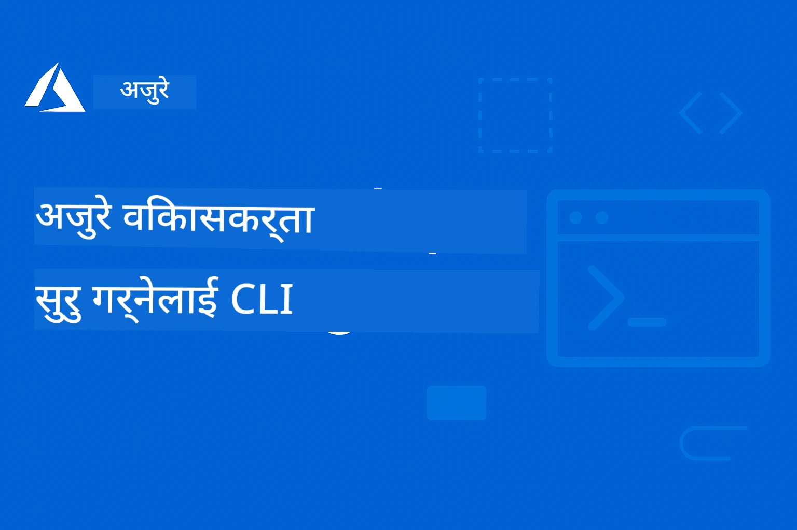

# AZD शुरुवातीहरूका लागि: एक संरचित सिकाइ यात्रा

 

[](https://GitHub.com/microsoft/azd-for-beginners/watchers/)
[](https://GitHub.com/microsoft/azd-for-beginners/network/)
[](https://GitHub.com/microsoft/azd-for-beginners/stargazers/)

[](https://discord.com/invite/nkVh3dp)
[](https://discord.gg/nTYy5BXMWG)

---

### स्वत: अनुवादहरू (सधैं अद्यावधिक)

<!-- CO-OP TRANSLATOR LANGUAGES TABLE START -->
[Arabic](../ar/README.md) | [Bengali](../bn/README.md) | [Bulgarian](../bg/README.md) | [Burmese (Myanmar)](../my/README.md) | [Chinese (Simplified)](../zh-CN/README.md) | [Chinese (Traditional, Hong Kong)](../zh-HK/README.md) | [Chinese (Traditional, Macau)](../zh-MO/README.md) | [Chinese (Traditional, Taiwan)](../zh-TW/README.md) | [Croatian](../hr/README.md) | [Czech](../cs/README.md) | [Danish](../da/README.md) | [Dutch](../nl/README.md) | [Estonian](../et/README.md) | [Finnish](../fi/README.md) | [French](../fr/README.md) | [German](../de/README.md) | [Greek](../el/README.md) | [Hebrew](../he/README.md) | [Hindi](../hi/README.md) | [Hungarian](../hu/README.md) | [Indonesian](../id/README.md) | [Italian](../it/README.md) | [Japanese](../ja/README.md) | [Kannada](../kn/README.md) | [Korean](../ko/README.md) | [Lithuanian](../lt/README.md) | [Malay](../ms/README.md) | [Malayalam](../ml/README.md) | [Marathi](../mr/README.md) | [Nepali](./README.md) | [Nigerian Pidgin](../pcm/README.md) | [Norwegian](../no/README.md) | [Persian (Farsi)](../fa/README.md) | [Polish](../pl/README.md) | [Portuguese (Brazil)](../pt-BR/README.md) | [Portuguese (Portugal)](../pt-PT/README.md) | [Punjabi (Gurmukhi)](../pa/README.md) | [Romanian](../ro/README.md) | [Russian](../ru/README.md) | [Serbian (Cyrillic)](../sr/README.md) | [Slovak](../sk/README.md) | [Slovenian](../sl/README.md) | [Spanish](../es/README.md) | [Swahili](../sw/README.md) | [Swedish](../sv/README.md) | [Tagalog (Filipino)](../tl/README.md) | [Tamil](../ta/README.md) | [Telugu](../te/README.md) | [Thai](../th/README.md) | [Turkish](../tr/README.md) | [Ukrainian](../uk/README.md) | [Urdu](../ur/README.md) | [Vietnamese](../vi/README.md)

> **स्थानीय क्लोन गर्न रुचाउनुहुन्छ?**
>
> This repository includes 50+ language translations which significantly increases the download size. To clone without translations, use sparse checkout:
>
> **Bash / macOS / Linux:**
> ```bash
> git clone --filter=blob:none --sparse https://github.com/microsoft/AZD-for-beginners.git
> cd AZD-for-beginners
> git sparse-checkout set --no-cone '/*' '!translations' '!translated_images'
> ```
>
> **CMD (Windows):**
> ```cmd
> git clone --filter=blob:none --sparse https://github.com/microsoft/AZD-for-beginners.git
> cd AZD-for-beginners
> git sparse-checkout set --no-cone "/*" "!translations" "!translated_images"
> ```
>
> This gives you everything you need to complete the course with a much faster download.
<!-- CO-OP TRANSLATOR LANGUAGES TABLE END -->

## 🆕 आज azd मा के नयाँ छ

Azure Developer CLI परम्परागत वेब एप र API भन्दा पर विस्तार भएको छ। आज, azd Azure मा **कुनै पनि** अनुप्रयोग तैनाथ गर्नको लागि एकल उपकरण बनेको छ—एआई-समर्थित अनुप्रयोगहरू र बुद्धिमान एजेन्टहरू समेत।

यसले तपाइँका लागि के अर्थ राख्छ:

- **AI एजेन्टहरू अब azd का प्रथम-श्रेणी वर्कलोडहरू हुन्।** तपाईंले एउटै `azd init` → `azd up` वर्कफ्लो प्रयोग गरेर AI एजेन्ट परियोजनाहरू सुरु, तैनाथ, र व्यवस्थापन गर्न सक्नुहुन्छ।
- **Microsoft Foundry एकीकरण**ले मोडेल तैनाथीकरण, एजेन्ट होस्टिङ, र AI सेवा कन्फिगरेसनलाई सिधै azd टेम्पलेट इकोसिस्टममा ल्याउँछ।
- **मुख्य वर्कफ्लो परिवर्तन भएको छैन।** चाहे तपाईं todo एप, एक माइक्रोसर्भिस, वा बहु-एजेन्ट AI समाधान तैनाथ गर्दै हुनुहुन्छ, आदेशहरू उस्तै छन्।

यदि तपाईंले पहिले azd प्रयोग गर्नुभएको छ भने, AI समर्थन स्वाभाविक विस्तार हो—अल्गोरिथ्म वा अलग उपकरण होइन। यदि तपाईं नयाँ हुनुहुन्छ भने, तपाईंले एउटा वर्कफ्लो सिक्नुहुनेछ जुन सबैका लागि काम गर्छ।

---

## 🚀 Azure Developer CLI (azd) भनेको के हो?

**Azure Developer CLI (azd)** विकासकर्ताका लागि मैत्री कमाण्ड-लाइन उपकरण हो जसले Azure मा अनुप्रयोग तैनाथ गर्न सजिलो बनाउँछ। दर्जनौं Azure स्रोतहरू म्यानुअली सिर्जना र जडान गर्नको सट्टा, तपाईं एकल आदेशमा सम्पूर्ण अनुप्रयोगहरू तैनाथ गर्न सक्नुहुन्छ।

### `azd up` को जादू

```bash
# यो एकल कमाण्डले सबै काम गर्दछ:
# ✅ सबै Azure स्रोतहरू सिर्जना गर्दछ
# ✅ नेटवर्किङ र सुरक्षा कन्फिगर गर्दछ
# ✅ तपाईंको आवेदन कोड निर्माण गर्दछ
# ✅ Azure मा डिप्लोय गर्छ
# ✅ तपाईंलाई काम गर्ने URL दिन्छ
azd up
```

**त्यो नै हो!** Azure Portal मा क्लिकिङ्ग छैन, जटिल ARM टेम्पलेटहरू पहिले सिक्नुपर्दैन, कुनै म्यानुअल कन्फिगरेसन छैन - केवल Azure मा काम गर्ने अनुप्रयोगहरू।

---

## ❓ Azure Developer CLI र Azure CLI: के फरक छ?

यो शुरुवातकर्ताहरूले सोध्ने सबैभन्दा सामान्य प्रश्न हो। यहाँ सरल उत्तर छ:

| Feature | **Azure CLI (`az`)** | **Azure Developer CLI (`azd`)** |
|---------|---------------------|--------------------------------|
| **Purpose** | व्यक्तिगत Azure स्रोतहरू व्यवस्थापन गर्नु | पूर्ण अनुप्रयोग तैनाथ गर्नु |
| **Mindset** | पूर्वाधार-केन्द्रित | अनुप्रयोग-केन्द्रित |
| **Example** | `az webapp create --name myapp...` | `azd up` |
| **Learning Curve** | Azure सेवाहरू जान्नुपर्छ | केवल आफ्नो एप जान्नुपर्‍यो |
| **Best For** | DevOps, पूर्वाधार | विकासकर्ता, प्रोटोटाइपिंग |

### सरल उपमा

- **Azure CLI** हाउस बनाउनका लागि सबै उपकरणहरू भएको जस्तै हो - ह्यामर, र्${े}हरू, कान्टाहरू। तपाईं केही पनि बनाउन सक्नुहुन्छ, तर निर्माण प्रक्रिया जान्नुपर्छ।
- **Azure Developer CLI** एक ठेकेदार राख्नु जस्तो हो - तपाईंले के चाहनुहुन्छ वर्णन गर्नुहुन्छ, र उनीहरूले निर्माणको हेरचाह गर्दछन्।

### कुन अवस्था मा कुन प्रयोग गर्ने

| Scenario | Use This |
|----------|----------|
| "I want to deploy my web app quickly" | `azd up` |
| "I need to create just a storage account" | `az storage account create` |
| "I'm building a full AI application" | `azd init --template azure-search-openai-demo` |
| "I need to debug a specific Azure resource" | `az resource show` |
| "I want production-ready deployment in minutes" | `azd up --environment production` |

### तिनीहरूले सँगै काम गर्दछन्!

AZD ले भित्रित रूपमा Azure CLI प्रयोग गर्छ। तपाईं दुवै प्रयोग गर्न सक्नुहुन्छ:
```bash
# AZD सँग आफ्नो एप्लिकेसन डिप्लोय गर्नुहोस्
azd up

# त्यसपछि Azure CLI सँग विशेष स्रोतहरूलाई सुधार गर्नुहोस्
az webapp config set --name myapp --always-on true
```

---

## 🌟 Awesome AZD मा टेम्पलेटहरू खोज्नुहोस्

शून्यबाट सुरु नगर्नुहोस्! **Awesome AZD** तयार-तैनाथ टेम्पलेटहरूको समुदाय संग्रह हो:

| Resource | Description |
|----------|-------------|
| 🔗 [**Awesome AZD Gallery**](https://azure.github.io/awesome-azd/) | एक-क्लिक तैनाथसहित 200+ टेम्प्लेट ब्राउज गर्नुहोस् |
| 🔗 [**Submit a Template**](https://github.com/Azure/awesome-azd/issues) | आफ्नो टेम्पलेट समुदायमा योगदान गर्नुहोस् |
| 🔗 [**GitHub Repository**](https://github.com/Azure/awesome-azd) | स्टार गर्नुहोस् र स्रोत अन्वेषण गर्नुहोस् |

### Awesome AZD बाट लोकप्रिय AI टेम्पलेटहरू

```bash
# माइक्रोसफ्ट फाउन्ड्री मोडेलहरु + एआई खोजसँग RAG कुराकानी
azd init --template azure-search-openai-demo

# छिटो एआई कुराकानी अनुप्रयोग
azd init --template openai-chat-app-quickstart

# फाउन्ड्री एजेन्टहरुसहित एआई एजेन्टहरु
azd init --template get-started-with-ai-agents
```

---

## 🎯 3 चरणमा शुरुवात

### Step 1: AZD इन्स्टल गर्नुहोस् (2 मिनेट)

**Windows:**
```powershell
winget install microsoft.azd
```

**macOS:**
```bash
brew tap azure/azd && brew install azd
```

**Linux:**
```bash
curl -fsSL https://aka.ms/install-azd.sh | bash
```

### Step 2: Azure मा लगइन गर्नुहोस्

```bash
azd auth login
```

### Step 3: आफ्नो पहिलो एप तैनाथ गर्नुहोस्

```bash
# टेम्प्लेटबाट सुरु गर्नुहोस्
azd init --template todo-nodejs-mongo

# Azure मा डिप्लोय गर्नुहोस् (सबै कुरा बनाउँछ!)
azd up
```

**🎉 त्यो नै हो!** तपाईंको एप अब Azure मा उपलब्ध छ।

### सफा गर्नुहोस् (बिर्सनु हुँदैन!)

```bash
# Remove all resources when done experimenting
azd down --force --purge
```

---

## 📚 यस कोर्स कसरी प्रयोग गर्ने

यो कोर्स **प्रगतिशील सिकाइ**का लागि डिजाइन गरिएको हो - जहाँ तपाइँ सहज हुनुहुन्छ त्यहाँबाट सुरु गर्नुहोस् र माथि बढ्दै जानुहोस्:

| Your Experience | Start Here |
|-----------------|------------|
| **Brand new to Azure** | [Chapter 1: Foundation](#-chapter-1-foundation--quick-start) |
| **Know Azure, new to AZD** | [Chapter 1: Foundation](#-chapter-1-foundation--quick-start) |
| **Want to deploy AI apps** | [Chapter 2: AI-First Development](#-chapter-2-ai-first-development-recommended-for-ai-developers) |
| **Want hands-on practice** | [🎓 Interactive Workshop](workshop/README.md) - 3-4 hour guided lab |
| **Need production patterns** | [Chapter 8: Production & Enterprise](#-chapter-8-production--enterprise-patterns) |

### छिटो सेटअप

1. **यस रिपोजिटरीलाई फोर्क गर्नुहोस्**: [](https://GitHub.com/microsoft/azd-for-beginners/fork)
2. **यसलाई क्लोन गर्नुहोस्**: `git clone https://github.com/YOUR-USERNAME/azd-for-beginners.git`
3. **सहायता लिनुहोस्**: [Azure Discord Community](https://discord.com/invite/ByRwuEEgH4)

> **स्थानीय क्लोन गर्न रुचाउनुहुन्छ?**

> This repository includes 50+ language translations which significantly increases the download size. To clone without translations, use sparse checkout:
> ```bash
> git clone --filter=blob:none --sparse https://github.com/microsoft/AZD-for-beginners.git
> cd AZD-for-beginners
> git sparse-checkout set --no-cone '/*' '!translations' '!translated_images'
> ```
> यसले तपाइँलाई कोर्स पूरा गर्न आवश्यक सबै कुरा द्रुत डाउनलोडमा दिन्छ।


## Course Overview

स्ट्रक्चर्ड अध्यायहरू मार्फत Azure Developer CLI (azd) मा विशेषज्ञता हासिल गर्नुहोस् जुन प्रगतिशील सिकाइका लागि डिजाइन गरिएको छ। **Microsoft Foundry एकीकरणसहित AI अनुप्रयोग तैनाथीकरणमा विशेष ध्यान।**

### किन आधुनिक विकासकर्ताहरूका लागि यो कोर्स आवश्यक छ

Microsoft Foundry Discord समुदायका जानकारीहरूका आधारमा, **45% विकासकर्ताहरू AZD लाई AI वर्कलोडहरूका लागि प्रयोग गर्न चाहन्छन्** तर निम्न चुनौतीहरू देख्छन्:
- जटिल बहु-सेवा AI आर्किटेक्चरहरू
- उत्पादन AI तैनाथीकरणका उत्तम अभ्यासहरू  
- Azure AI सेवा एकीकरण र कन्फिगरेसन
- AI वर्कलोडहरूको लागत अनुकूलन
- AI-विशिष्ट तैनाथीकरण समस्याहरू समस्या समाधान

### सिक्न उद्देश्यहरू

यस संरचित कोर्स पूरा गरेर, तपाईं:
- **AZD आधारहरूमा निपुणता हासिल गर्नुहुनेछ**: मुख्य अवधारणा, इन्स्टलेशन, र कन्फिगरेसन
- **AI अनुप्रयोगहरू तैनाथ गर्नुहोस्**: Microsoft Foundry सेवाहरूसँग AZD प्रयोग गर्नुहोस्
- **Infrastructure as Code कार्यान्वयन गर्नुहोस्**: Bicep टेम्पलेटहरूसँग Azure स्रोतहरू व्यवस्थापन गर्नुहोस्
- **तैनाथीकरण समस्याहरू समाधान गर्नुहोस्**: सामान्य समस्याहरू समाधान र डिबग गर्नुहोस्
- **उत्पादनका लागि अनुकूलन गर्नुहोस्**: सुरक्षा, स्केलिङ, मोनिटरिङ, र लागत व्यवस्थापन
- **बहु-एजेन्ट समाधानहरू निर्माण गर्नुहोस्**: जटिल AI आर्किटेक्चर तैनाथ गर्नुहोस्

## 🗺️ कोर्स नक्शा: अध्यायद्वारा छिटो नेभिगेसन

हरेक अध्यायसँग समर्पित README छ जसमा सिकाई उद्देश्यहरू, छिटो सुरु गर्ने तरिका, र अभ्यासहरू छन्:

| Chapter | Topic | Lessons | Duration | Complexity |
|---------|-------|---------|----------|------------|
| **[Ch 1: Foundation](docs/chapter-01-foundation/README.md)** | Getting Started | [AZD Basics](docs/chapter-01-foundation/azd-basics.md) &#124; [Installation](docs/chapter-01-foundation/installation.md) &#124; [First Project](docs/chapter-01-foundation/first-project.md) | 30-45 min | ⭐ |
| **[Ch 2: AI विकास](docs/chapter-02-ai-development/README.md)** | एआई-प्रथम अनुप्रयोगहरू | [Foundry Integration](docs/chapter-02-ai-development/microsoft-foundry-integration.md) &#124; [एआई एजेन्टहरू](docs/chapter-02-ai-development/agents.md) &#124; [मोडेल परिनियोजन](docs/chapter-02-ai-development/ai-model-deployment.md) &#124; [कार्यशाला](docs/chapter-02-ai-development/ai-workshop-lab.md) | 1-2 घण्टा | ⭐⭐ |
| **[Ch 3: Configuration](docs/chapter-03-configuration/README.md)** | प्रमाणीकरण र सुरक्षा | [Configuration](docs/chapter-03-configuration/configuration.md) &#124; [Auth & Security](docs/chapter-03-configuration/authsecurity.md) | 45-60 मिनेट | ⭐⭐ |
| **[Ch 4: Infrastructure](docs/chapter-04-infrastructure/README.md)** | IaC र परिनियोजन | [Deployment Guide](docs/chapter-04-infrastructure/deployment-guide.md) &#124; [Provisioning](docs/chapter-04-infrastructure/provisioning.md) | 1-1.5 घण्टा | ⭐⭐⭐ |
| **[Ch 5: Multi-Agent](docs/chapter-05-multi-agent/README.md)** | एआई एजेन्ट समाधानहरू | [Retail Scenario](examples/retail-scenario.md) &#124; [Coordination Patterns](docs/chapter-06-pre-deployment/coordination-patterns.md) | 2-3 घण्टा | ⭐⭐⭐⭐ |
| **[Ch 6: Pre-Deployment](docs/chapter-06-pre-deployment/README.md)** | योजना र प्रमाणिकरण | [Preflight Checks](docs/chapter-06-pre-deployment/preflight-checks.md) &#124; [Capacity Planning](docs/chapter-06-pre-deployment/capacity-planning.md) &#124; [SKU Selection](docs/chapter-06-pre-deployment/sku-selection.md) &#124; [App Insights](docs/chapter-06-pre-deployment/application-insights.md) | 1 घण्टा | ⭐⭐ |
| **[Ch 7: Troubleshooting](docs/chapter-07-troubleshooting/README.md)** | डिबग र समाधान | [Common Issues](docs/chapter-07-troubleshooting/common-issues.md) &#124; [Debugging](docs/chapter-07-troubleshooting/debugging.md) &#124; [AI Issues](docs/chapter-07-troubleshooting/ai-troubleshooting.md) | 1-1.5 घण्टा | ⭐⭐ |
| **[Ch 8: Production](docs/chapter-08-production/README.md)** | एन्तरप्राइज ढाँचा | [Production Practices](docs/chapter-08-production/production-ai-practices.md) | 2-3 घण्टा | ⭐⭐⭐⭐ |
| **[🎓 Workshop](workshop/README.md)** | हस्तक्षेपात्मक ल्याब | [Introduction](workshop/docs/instructions/0-Introduction.md) &#124; [Selection](workshop/docs/instructions/1-Select-AI-Template.md) &#124; [Validation](workshop/docs/instructions/2-Validate-AI-Template.md) &#124; [Deconstruction](workshop/docs/instructions/3-Deconstruct-AI-Template.md) &#124; [Configuration](workshop/docs/instructions/4-Configure-AI-Template.md) &#124; [Customization](workshop/docs/instructions/5-Customize-AI-Template.md) &#124; [Teardown](workshop/docs/instructions/6-Teardown-Infrastructure.md) &#124; [Wrap-up](workshop/docs/instructions/7-Wrap-up.md) | 3-4 घण्टा | ⭐⭐ |

**कुल कोर्स अवधि:** ~10-14 घण्टा | **कौशल प्रगति:** शुरुवाती → उत्पादन-तयार

---

## 📚 सिकाइ अध्यायहरू

*आफ्नो अनुभव स्तर र लक्ष्यहरूका आधारमा आफ्नो सिकाइ मार्ग छान्नुहोस्*

### 🚀 अध्याय 1: आधार र द्रुत सुरुवात
**आवश्यकताहरू**: Azure सदस्यता, आधारभूत कमाण्ड लाइन ज्ञान  
**समय**: 30-45 मिनेट  
**जटिलता**: ⭐

#### तपाईंले के सिक्नुहुनेछ
- Azure Developer CLI का आधारभूत कुराहरू बुझ्ने
- आफ्नो प्लेटफर्ममा AZD स्थापना गर्ने
- तपाईंको पहिलो सफल परिनियोजन

#### सिकाइ स्रोतहरू
- **🎯 यहाँबाट सुरु गर्नुहोस्**: [Azure Developer CLI भनेको के हो?](#what-is-azure-developer-cli)
- **📖 सिद्धान्त**: [AZD आधारभूत](docs/chapter-01-foundation/azd-basics.md) - मुख्य अवधारणाहरू र शब्दावली
- **⚙️ सेटअप**: [स्थापना र सेटअप](docs/chapter-01-foundation/installation.md) - प्लेटफर्म-विशिष्ट मार्गदर्शन
- **🛠️ हात-मा-हात**: [तपाईंको पहिलो परियोजना](docs/chapter-01-foundation/first-project.md) - चरण-द्वारा-चरण ट्यूटोरियल
- **📋 द्रुत संदर्भ**: [कमाण्ड चीट शीट](resources/cheat-sheet.md)

#### व्यावहारिक अभ्यासहरू
```bash
# छिटो स्थापना जाँच
azd version

# आफ्नो पहिलो अनुप्रयोग तैनाथ गर्नुहोस्
azd init --template todo-nodejs-mongo
azd up
```

**💡 अध्याय नतिजा**: AZD प्रयोग गरेर Azure मा एउटा सरल वेब अनुप्रयोग सफलतापूर्वक परिनियोजन गर्नु

**✅ सफलता मान्यता:**
```bash
# अध्याय 1 पूरा गरेपछि, तपाईंले निम्न कुराहरू गर्न सक्षम हुनुहुनेछ:
azd version              # स्थापित संस्करण देखाउँछ
azd init --template todo-nodejs-mongo  # परियोजना आरम्भ गर्दछ
azd up                  # Azure मा परिनियोजन गर्दछ
azd show                # चलिरहेको एपको URL देखाउँछ
# अनुप्रयोग ब्राउजरमा खुल्छ र काम गर्छ
azd down --force --purge  # संसाधनहरू सफा गर्छ
```

**📊 समय लगानी:** 30-45 मिनेट  
**📈 सिकाइ स्तर पछि:** आधारभूत अनुप्रयोगहरू स्वतन्त्र रूपमा परिनियोजन गर्न सक्षम
**📈 सिकाइ स्तर पछि:** आधारभूत अनुप्रयोगहरू स्वतन्त्र रूपमा परिनियोजन गर्न सक्षम

---

### 🤖 अध्याय 2: एआई-प्रथम विकास (एआई विकासकर्ताहरूका लागि सिफारिस)
**आवश्यकताहरू**: अध्याय 1 पूरा गरिएको हुनु पर्ने  
**समय**: 1-2 घण्टा  
**जटिलता**: ⭐⭐

#### तपाईंले के सिक्नुहुनेछ
- AZD सँग Microsoft Foundry एकीकरण
- एआई-सक्षम अनुप्रयोगहरू परिनियोजन गर्ने
- एआई सेवा कन्फिगरेसनहरू बुझ्ने

#### सिकाइ स्रोतहरू
- **🎯 यहाँबाट सुरु गर्नुहोस्**: [Microsoft Foundry Integration](docs/chapter-02-ai-development/microsoft-foundry-integration.md)
- **🤖 एआई एजेन्टहरू**: [एआई एजेन्ट मार्गदर्शिका](docs/chapter-02-ai-development/agents.md) - AZD सँग बुद्धिमान एजेन्टहरू परिनियोजन गर्नुहोस्
- **📖 ढाँचाहरू**: [मोडेल परिनियोजन](docs/chapter-02-ai-development/ai-model-deployment.md) - एआई मोडेलहरू परिनियोजन र व्यवस्थापन गर्ने
- **🛠️ कार्यशाला**: [एआई कार्यशाला ल्याब](docs/chapter-02-ai-development/ai-workshop-lab.md) - तपाइँका एआई समाधानहरू AZD-तयार बनाउने
- **🎥 अन्तरक्रियात्मक मार्गदर्शिका**: [वर्कशप सामग्रीहरू](workshop/README.md) - MkDocs * DevContainer वातावरणसहित ब्राउजर-आधारित सिकाइ
- **📋 टेम्प्लेटहरू**: [Microsoft Foundry Templates](#कार्यशाला-स्रोतहरू)
- **📝 उदाहरणहरू**: [AZD परिनियोजन उदाहरणहरू](examples/README.md)

#### व्यावहारिक अभ्यासहरू
```bash
# तपाईंको पहिलो एआई अनुप्रयोग तैनाथ गर्नुहोस्
azd init --template azure-search-openai-demo
azd up

# थप एआई टेम्पलेटहरू प्रयास गर्नुहोस्
azd init --template openai-chat-app-quickstart
azd init --template agent-openai-python-prompty
```

**💡 अध्याय नतिजा**: RAG क्षमताहरू भएको एआई-शक्ति गरिएको च्याट अनुप्रयोग परिनियोजन र कन्फिगर गर्नु

**✅ सफलता मान्यता:**
```bash
# अध्याय २ पछि, तपाईंले यी गर्न सक्षम हुनुहुनेछ:
azd init --template azure-search-openai-demo
azd up
# AI च्याट अन्तरफलक परीक्षण गर्नुहोस्
# प्रश्नहरू सोध्नुहोस् र स्रोतहरू सहित AI-संचालित उत्तरहरू प्राप्त गर्नुहोस्
# खोज एकीकरणले काम गर्छ भनेर जाँच गर्नुहोस्
azd monitor  # Application Insights मा टेलिमेट्री देखिन्छ कि जाँच गर्नुहोस्
azd down --force --purge
```

**📊 समय लगानी:** 1-2 घण्टा  
**📈 सिकाइ स्तर पछि:** उत्पादन-तयार एआई अनुप्रयोगहरू परिनियोजन र कन्फिगर गर्न सक्षम  
**💰 लागत अवेयरनेस:** विकास लागत $80-150/महिना, उत्पादन लागत $300-3500/महिना बुझ्नुहोस्

#### 💰 एआई परिनियोजनहरूको लागि लागत विचारहरू

**विकास वातावरण (अनुमानित $80-150/महिना):**
- Microsoft Foundry मोडेलहरू (Pay-as-you-go): $0-50/महिना (टोकन प्रयोगको आधारमा)
- AI Search (Basic टियर): $75/महिना
- Container Apps (Consumption): $0-20/महिना
- Storage (Standard): $1-5/महिना

**उत्पादन वातावरण (अनुमानित $300-3,500+/महिना):**
- Microsoft Foundry मोडेलहरू (स्थिर प्रदर्शनका लागि PTU): $3,000+/महिना वा उच्च भोल्युममा Pay-as-go
- AI Search (Standard टियर): $250/महिना
- Container Apps (Dedicated): $50-100/महिना
- Application Insights: $5-50/महिना
- Storage (Premium): $10-50/महिना

**💡 लागत अनुकूलन सुझावहरू:**
- सिकाइका लागि Microsoft Foundry मोडेलहरूको **Free Tier** प्रयोग गर्नुहोस् (Azure OpenAI 50,000 टोकन/महिना समावेश)
- सक्रिय रूपमा विकास नगर्दा स्रोतहरू अनडेलोकेट गर्न `azd down` चलाउनुहोस्
- सुरुमा consumption-आधारित बिलिङ प्रयोग गर्नुहोस्, केवल उत्पादनका लागि PTU मा अपग्रेड गर्नुहोस्
- परिनियोजन अघि लागत अनुमान गर्न `azd provision --preview` प्रयोग गर्नुहोस्
- स्वत: स्केलिङ सक्षम गर्नुहोस्: वास्तविक प्रयोगका लागि मात्र तिर्नुहोस्

**लागत मोनिटरिङ:**
```bash
# अनुमानित मासिक लागत जाँच गर्नुहोस्
azd provision --preview

# Azure पोर्टलमा वास्तविक लागतहरू अनुगमन गर्नुहोस्
az consumption budget list --resource-group <your-rg>
```

---

### ⚙️ अध्याय 3: कन्फिगरेसन र प्रमाणीकरण
**आवश्यकताहरू**: अध्याय 1 पूरा गरिएको हुनु पर्ने  
**समय**: 45-60 मिनेट  
**जटिलता**: ⭐⭐

#### तपाईंले के सिक्नुहुनेछ
- वातावरण कन्फिगरेसन र व्यवस्थापन
- प्रमाणीकरण र सुरक्षा उत्कृष्ट अभ्यासहरू
- स्रोत नामकरण र संगठन

#### सिकाइ स्रोतहरू
- **📖 कन्फिगरेसन**: [कन्फिगरेसन गाइड](docs/chapter-03-configuration/configuration.md) - वातावरण सेटअप
- **🔐 सुरक्षा**: [प्रमाणीकरण ढाँचा र व्यवस्थापित आइडेन्टिटी](docs/chapter-03-configuration/authsecurity.md) - प्रमाणीकरण ढाँचाहरू
- **📝 उदाहरणहरू**: [डेटाबेस अनुप्रयोग उदाहरण](examples/database-app/README.md) - AZD डेटाबेस उदाहरणहरू

#### व्यावहारिक अभ्यासहरू
- बहु वातावरणहरू कन्फिगर गर्नुहोस् (dev, staging, prod)
- व्यवस्थापित आइडेन्टिटी प्रमाणीकरण सेटअप गर्नुहोस्
- वातावरण-विशिष्ट कन्फिगरेसनहरू लागू गर्नुहोस्

**💡 अध्याय नतिजा**: उपयुक्त प्रमाणीकरण र सुरक्षा साथ बहु वातावरण व्यवस्थापन गर्नु

---

### 🏗️ अध्याय 4: इन्फ्रास्ट्रक्चर एज कोड र परिनियोजन
**आवश्यकताहरू**: अध्याय 1-3 पूरा गरिएको हुनु पर्ने  
**समय**: 1-1.5 घण्टा  
**जटिलता**: ⭐⭐⭐

#### तपाईंले के सिक्नुहुनेछ
- उन्नत परिनियोजन ढाँचाहरू
- Bicep सँग Infrastructure as Code
- स्रोत Provisioning रणनीतिहरू

#### सिकाइ स्रोतहरू
- **📖 परिनियोजन**: [Deployment Guide](docs/chapter-04-infrastructure/deployment-guide.md) - पूर्ण कार्यप्रवाहहरू
- **🏗️ Provisioning**: [Provisioning Resources](docs/chapter-04-infrastructure/provisioning.md) - Azure स्रोत व्यवस्थापन
- **📝 उदाहरणहरू**: [Container App Example](../../examples/container-app) - कन्टेनराइज्ड परिनियोजनहरू

#### व्यावहारिक अभ्यासहरू
- कस्टम Bicep टेम्पलेटहरू सिर्जना गर्नुहोस्
- बहु-सेवा अनुप्रयोगहरू परिनियोजन गर्नुहोस्
- ब्लु-ग्रीन परिनियोजन रणनीतिहरू लागू गर्नुहोस्

**💡 अध्याय नतिजा**: कस्टम इन्फ्रास्ट्रक्चर टेम्पलेटहरू प्रयोग गरेर जटिल बहु-सेवा अनुप्रयोगहरू परिनियोजन गर्नु

---

### 🎯 अध्याय 5: मल्टि-एजेन्ट एआई समाधानहरू (उन्नत)
**आवश्यकताहरू**: अध्याय 1-2 पूरा गरिएको हुनु पर्ने  
**समय**: 2-3 घण्टा  
**जटिलता**: ⭐⭐⭐⭐

#### तपाईंले के सिक्नुहुनेछ
- मल्टि-एजेन्ट आर्किटेक्चर ढाँचाहरू
- एजेन्ट अर्चेस्ट्रेशन र समन्वय
- उत्पादन-तयार एआई परिनियोजनहरू

#### सिकाइ स्रोतहरू
- **🤖 फीचर्ड परियोजना**: [Retail Multi-Agent Solution](examples/retail-scenario.md) - पूर्ण कार्यान्वयन
- **🛠️ ARM टेम्पलेटहरू**: [ARM Template Package](../../examples/retail-multiagent-arm-template) - एक-क्लिक परिनियोजन
- **📖 आर्किटेक्चर**: [मल्टि-एजेन्ट समन्वय ढाँचाहरू](docs/chapter-06-pre-deployment/coordination-patterns.md) - ढाँचाहरू

#### व्यावहारिक अभ्यासहरू
```bash
# पूर्ण खुद्रा बहु-एजेन्ट समाधान तैनाथ गर्नुहोस्
cd examples/retail-multiagent-arm-template
./deploy.sh

# एजेन्ट विन्यासहरू अन्वेषण गर्नुहोस्
az deployment group show --resource-group <rg-name> --name <deployment-name>
```

**💡 अध्याय नतिजा**: Customer र Inventory एजेन्टहरूसहित उत्पादन-तयार मल्टि-एजेन्ट एआई समाधान परिनियोजन र व्यवस्थापन गर्नु

---

### 🔍 अध्याय 6: प्रि-परिनियोजन प्रमाणिकरण र योजना
**आवश्यकताहरू**: अध्याय 4 पूरा गरिएको हुनु पर्ने  
**समय**: 1 घण्टा  
**जटिलता**: ⭐⭐

#### तपाईंले के सिक्नुहुनेछ
- क्षमता योजना र स्रोत प्रमाणिकरण
- SKU चयन रणनीतिहरू
- प्रि-फलाइट चेकहरू र अटोमेसन

#### सिकाइ स्रोतहरू
- **📊 योजना**: [Capacity Planning](docs/chapter-06-pre-deployment/capacity-planning.md) - स्रोत प्रमाणिकरण
- **💰 चयन**: [SKU Selection](docs/chapter-06-pre-deployment/sku-selection.md) - लागत-कुशल विकल्पहरू
- **✅ प्रमाणिकरण**: [Pre-flight Checks](docs/chapter-06-pre-deployment/preflight-checks.md) - स्वचालित स्क्रिप्टहरू

#### व्यावहारिक अभ्यासहरू
- क्षमता प्रमाणिकरण स्क्रिप्टहरू चलाउनुहोस्
- लागतको लागि SKU छनोटहरू अनुकूल गर्नुहोस्
- स्वचालित प्रि-परिनियोजन चेकहरू लागू गर्नुहोस्

**💡 अध्याय नतिजा**: कार्यान्वयन अघि परिनियोजनहरूको प्रमाणिकरण र अनुकूलन गर्नु

---

### 🚨 अध्याय 7: ट्रबलशुटिङ र डिबगिङ
**आवश्यकताहरू**: कुनै पनि परिनियोजन अध्याय पूरा गरिएको हुन सक्छ  
**समय**: 1-1.5 घण्टा  
**जटिलता**: ⭐⭐

#### तपाईंले के सिक्नुहुनेछ
- व्यवस्थित डिबगिङ दृष्टिकोणहरू
- सामान्य समस्याहरू र समाधानहरू
- एआई-विशिष्ट ट्रबलशुटिङ

#### सिकाइ स्रोतहरू
- **🔧 सामान्य समस्याहरू**: [Common Issues](docs/chapter-07-troubleshooting/common-issues.md) - FAQ र समाधानहरू
- **🕵️ डिबगिङ**: [Debugging Guide](docs/chapter-07-troubleshooting/debugging.md) - चरण-द्वारा-चरण रणनीतिहरू
- **🤖 एआई समस्याहरू**: [एआई-विशिष्ट ट्रबलशुटिङ](docs/chapter-07-troubleshooting/ai-troubleshooting.md) - एआई सेवा समस्याहरू

#### व्यावहारिक अभ्यासहरू
- परिनियोजन विफलताहरू निदान गर्नुहोस्
- प्रमाणीकरण समस्याहरू समाधान गर्नुहोस्
- एआई सेवा कनेक्टिविटी डिबग गर्नुहोस्

**💡 अध्याय नतिजा**: सामान्य परिनियोजन समस्याहरू स्वतन्त्र रूपमा निदान र समाधान गर्न सक्षम हुनु

---

### 🏢 अध्याय 8: उत्पादन र एन्तरप्राइज ढाँचाहरू
**आवश्यकताहरू**: अध्याय 1-4 पूरा गरिएको हुनु पर्ने  
**समय**: 2-3 घण्टा  
**जटिलता**: ⭐⭐⭐⭐

#### तपाईंले के सिक्नुहुनेछ
- उत्पादन परिनियोजन रणनीतिहरू
- एन्तरप्राइज सुरक्षा ढाँचाहरू
- अनुगमन र लागत अनुकूलन

#### सिकाइ स्रोतहरू
- **🏭 उत्पादन**: [Production AI Best Practices](docs/chapter-08-production/production-ai-practices.md) - उद्यम नमूनाहरू
- **📝 उदाहरणहरू**: [Microservices Example](../../examples/microservices) - जटिल संरचनाहरू
- **📊 निगरानी**: [Application Insights integration](docs/chapter-06-pre-deployment/application-insights.md) - निगरानी

#### व्यावहारिक अभ्यासहरू
- उद्यम सुरक्षा ढाँचाहरू लागू गर्नुहोस्
- व्यापक निगरानी सेटअप गर्नुहोस्
- उचित शासनसहित उत्पादनमा परिनियोजन गर्नुहोस्

**💡 अध्याय नतिजा**: पूर्ण उत्पादन क्षमताहरू सहित उद्यम-तयार अनुप्रयोगहरू परिनियोजन गर्नुहोस्

---

## 🎓 कार्यशाला अवलोकन: व्यवहारिक सिकाइ अनुभव

> **⚠️ कार्यशाला स्थिति: सक्रिय विकास**  
> कार्यशाला सामग्रीहरू हाल विकास र परिमार्जनको क्रममा छन्। मुख्य मोड्युलहरू कार्यरत छन्, तर केही उन्नत खण्डहरू अपूर्ण छन्। हामी सम्पूर्ण सामग्री पूरा गर्न सक्रिय रूपमा काम गरिरहेका छौं। [प्रगति ट्र्याक गर्नुहोस् →](workshop/README.md)

### इन्टरएक्टिभ कार्यशाला सामग्रीहरू
**ब्राउजर-आधारित उपकरणहरू र निर्देशित अभ्यासहरूसहित समग्र व्यवहारिक सिकाइ**

हाम्रो कार्यशाला सामग्रीहरूले शीर्षक-आधारित पाठ्यक्रमलाई पूरक गर्ने संरचित, इन्टरएक्टिभ सिकाइ अनुभव प्रदान गर्दछन्। कार्यशाला स्व-गतिको सिकाइ र प्रशिक्षक-नेतृत्व सत्रहरू दुवैको लागि डिजाइन गरिएको हो।

#### 🛠️ कार्यशालाका विशेषताहरू
- **ब्राउजर-आधारित अन्तरफलक**: खोज, प्रतिलिपि, र थिम सुविधाहरू सहित पूर्ण MkDocs-समर्थित कार्यशाला
- **GitHub Codespaces एकीकरण**: एक-क्लिक विकास वातावरण सेटअप
- **संरचित सिकाइ मार्ग**: ८-मोड्युल निर्देशित अभ्यासहरू (कुल ३-४ घण्टा)
- **क्रमिक कार्यविधि**: परिचय → चयन → मान्यकरण → विघटन → कन्फिगरेसन → अनुकूलन → संसाधन हटाउने → समापन
- **इन्टरएक्टिभ DevContainer वातावरण**: पूर्व-कन्फिगर गरिएका उपकरण र निर्भरताहरू

#### 📚 कार्यशाला मोड्युल संरचना
कार्यशालाले एक **८-मोड्युल क्रमिक कार्यविधि** अनुसरण गर्दछ जसले तपाईंलाई खोजबाट परिनियोजन निपुणतामा लैजान्छ:

| Module | Topic | What You'll Do | Duration |
|--------|-------|----------------|----------|
| **0. Introduction** | Workshop Overview | Understand learning objectives, prerequisites, and workshop structure | 15 min |
| **1. Selection** | Template Discovery | Explore AZD templates and select the right AI template for your scenario | 20 min |
| **2. Validation** | Deploy & Verify | Deploy the template with `azd up` and validate infrastructure works | 30 min |
| **3. Deconstruction** | Understand Structure | Use GitHub Copilot to explore template architecture, Bicep files, and code organization | 30 min |
| **4. Configuration** | azure.yaml Deep Dive | Master `azure.yaml` configuration, lifecycle hooks, and environment variables | 30 min |
| **5. Customization** | Make It Yours | Enable AI Search, tracing, evaluation, and customize for your scenario | 45 min |
| **6. Teardown** | Clean Up | Safely deprovision resources with `azd down --purge` | 15 min |
| **7. Wrap-up** | Next Steps | Review accomplishments, key concepts, and continue your learning journey | 15 min |

**कार्यशाला प्रवाह:**
```
Introduction → Selection → Validation → Deconstruction → Configuration → Customization → Teardown → Wrap-up
     ↓            ↓           ↓              ↓               ↓              ↓            ↓           ↓
  Overview    Find the     Deploy &      Explore        Master         Customize     Clean up    Review &
             right        verify        code &        azure.yaml      for your      resources   next steps
             template                   structure                     scenario
```

#### 🚀 कार्यशाला सुरू गर्ने तरिका
```bash
# विकल्प 1: GitHub Codespaces (सिफारिस गरिएको)
# रिपोजिटरीमा रहेको "Code" → "Create codespace on main" मा 클릭 गर्नुहोस्

# विकल्प 2: स्थानीय विकास
git clone https://github.com/microsoft/azd-for-beginners.git
cd azd-for-beginners/workshop
# workshop/README.md मा सेटअप निर्देशहरू अनुसरण गर्नुहोस्
```

#### 🎯 कार्यशाला सिकाइ परिणामहरू
कार्यशाला पूरा गर्दा, सहभागीहरूले:
- **उत्पादन AI अनुप्रयोग परिनियोजन गर्नुहोस्**: Microsoft Foundry सेवाहरू संग AZD प्रयोग गर्नुहोस्
- **बहु-एजेन्ट आर्किटेक्चरमा निपुण बनौं**: समन्वित AI एजेन्ट समाधानहरू लागू गर्नुहोस्
- **सुरक्षा सर्वोत्तम अभ्यासहरू लागू गर्नुहोस्**: प्रमाणीकरण र पहुँच नियन्त्रण कन्फिगर गर्नुहोस्
- **स्केलका लागि अनुकूलन गर्नुहोस्**: लागत-प्रभावकारी, प्रदर्शन-कुशल परिनियोजन डिजाइन गर्नुहोस्
- **परिनियोजन समस्याहरू समाधान गर्नुहोस्**: सामान्य मुद्दाहरू स्वतन्त्र रूपमा समाधान गर्नुहोस्

#### 📖 कार्यशाला स्रोतहरू
- **🎥 इन्टरएक्टिभ मार्गदर्शक**: [Workshop Materials](workshop/README.md) - ब्राउजर-आधारित सिकाइ वातावरण
- **📋 मोड्युल-दर-मोड्युल निर्देशहरू**:
  - [0. Introduction](workshop/docs/instructions/0-Introduction.md) - कार्यशाला अवलोकन र उद्देश्यहरू
  - [1. Selection](workshop/docs/instructions/1-Select-AI-Template.md) - AI ढाँचाहरू फेला पार्नुहोस् र छनौट गर्नुहोस्
  - [2. Validation](workshop/docs/instructions/2-Validate-AI-Template.md) - ढाँचाहरू परिनियोजन र प्रमाणित गर्नुहोस्
  - [3. Deconstruction](workshop/docs/instructions/3-Deconstruct-AI-Template.md) - ढाँचा वास्तुकला अन्वेषण गर्नुहोस्
  - [4. Configuration](workshop/docs/instructions/4-Configure-AI-Template.md) - `azure.yaml` मा निपुण बनौं
  - [5. Customization](workshop/docs/instructions/5-Customize-AI-Template.md) - तपाईंको परिदृश्यका लागि अनुकूलन गर्नुहोस्
  - [6. Teardown](workshop/docs/instructions/6-Teardown-Infrastructure.md) - स्रोतहरू सफा गर्नुहोस्
  - [7. Wrap-up](workshop/docs/instructions/7-Wrap-up.md) - समीक्षा र अगाडिका चरणहरू
- **🛠️ AI Workshop Lab**: [AI Workshop Lab](docs/chapter-02-ai-development/ai-workshop-lab.md) - AI-केन्द्रित अभ्यासहरू
- **💡 छिटो सुरु**: [Workshop Setup Guide](workshop/README.md#quick-start) - वातावरण कन्फिगरेसन

**उपयुक्त छ**: कर्पोरेट प्रशिक्षण, विश्वविद्यालय पाठ्यक्रमहरू, स्व-गतिको सिकाइ, र डेभलपर बुटक्याम्पहरू।

---

## 📖 गहिराइमा: AZD क्षमताहरू

आधारभूत कुराहरू भन्दा पर, AZD ले उत्पादन परिनियोजनहरूको लागि शक्तिशाली सुविधाहरू प्रदान गर्दछ:

- **ढाँचा-आधारित परिनियोजनहरू** - सामान्य अनुप्रयोग ढाँचाहरूका लागि पूर्व-निर्मित ढाँचाहरू प्रयोग गर्नुहोस्
- **आधारभूत संरचना लाई कोडको रूपमा** - Bicep वा Terraform प्रयोग गरी Azure स्रोतहरू व्यवस्थापन गर्नुहोस्  
- **समेकित कार्यप्रवाहहरू** - अनुप्रयोगहरूलाई सहज रूपमा प्राविजन, परिनियोजन, र अनुगमन गर्नुहोस्
- **डेभलपर-मैत्री** - डेभलपर उत्पादकता र अनुभवको लागि अनुकूलित

### **AZD + Microsoft Foundry: AI परिनियोजनहरूको लागि उपयुक्त**

**AI समाधानहरूको लागि AZD किन?** AZD ले AI विकासकर्ताहरूले सामना गर्ने शीर्ष चुनौतीहरू सम्बोधन गर्दछ:

- **AI-तयार ढाँचाहरू** - Microsoft Foundry Models, Cognitive Services, र ML वर्कलोडहरूको लागि पूर्व-कन्फिगर गरिएको ढाँचाहरू
- **सुरक्षित AI परिनियोजनहरू** - AI सेवाहरू, API कुञ्जीहरू, र मोडल एन्डपोइन्टहरूका लागि बिल्ट-इन सुरक्षा ढाँचाहरू  
- **उत्पादन AI नमूनाहरू** - स्केलेबल, लागत-प्रभावकारी AI अनुप्रयोग परिनियोजनका लागि सर्वोत्तम अभ्यासहरू
- **एन्ड-टु-एन्ड AI कार्यप्रवाहहरू** - मोडल विकासबाट लिएर उचित अनुगमन सहित उत्पादन परिनियोजनसम्म
- **लागत अनुकूलन** - AI वर्कलोडहरूको लागि स्मार्ट स्रोत विभाजन र स्केलिङ रणनीतिहरू
- **Microsoft Foundry एकीकरण** - Microsoft Foundry मोडल क्याटलग र एन्डपोइन्टहरूसँग सहज कनेक्सन

---

## 🎯 टेम्पलेटहरू र उदाहरण पुस्तकालय

### विशेष: Microsoft Foundry ढाँचाहरू
**यदि तपाईं AI अनुप्रयोगहरू परिनियोजन गर्दै हुनुहुन्छ भने यहाँबाट सुरु गर्नुहोस्!**

> **नोट:** यी ढाँचाहरू विभिन्न AI नमूनाहरू प्रदर्शन गर्छन्। केही बाह्य Azure Samples हुन्, अरू स्थानीय कार्यान्वयनहरू।

| ढाँचा | अध्याय | जटिलता | सेवाहरू | प्रकार |
|----------|---------|------------|----------|------|
| [**Get started with AI chat**](https://github.com/Azure-Samples/get-started-with-ai-chat) | अध्याय 2 | ⭐⭐ | AzureOpenAI + Azure AI Model Inference API + Azure AI Search + Azure Container Apps + Application Insights | बाह्य |
| [**Get started with AI agents**](https://github.com/Azure-Samples/get-started-with-ai-agents) | अध्याय 2 | ⭐⭐ | Foundry Agents + AzureOpenAI + Azure AI Search + Azure Container Apps + Application Insights| बाह्य |
| [**Azure Search + OpenAI Demo**](https://github.com/Azure-Samples/azure-search-openai-demo) | अध्याय 2 | ⭐⭐ | AzureOpenAI + Azure AI Search + App Service + Storage | बाह्य |
| [**OpenAI Chat App Quickstart**](https://github.com/Azure-Samples/openai-chat-app-quickstart) | अध्याय 2 | ⭐ | AzureOpenAI + Container Apps + Application Insights | बाह्य |
| [**Agent OpenAI Python Prompty**](https://github.com/Azure-Samples/agent-openai-python-prompty) | अध्याय 5 | ⭐⭐⭐ | AzureOpenAI + Azure Functions + Prompty | बाह्य |
| [**Contoso Chat RAG**](https://github.com/Azure-Samples/contoso-chat) | अध्याय 8 | ⭐⭐⭐⭐ | AzureOpenAI + AI Search + Cosmos DB + Container Apps | बाह्य |
| [**Retail Multi-Agent Solution**](examples/retail-scenario.md) | अध्याय 5 | ⭐⭐⭐⭐ | AzureOpenAI + AI Search + Storage + Container Apps + Cosmos DB | **स्थानीय** |

### विशेष: पूर्ण सिकाइ परिदृश्यहरू
**सिकाइ अध्यायहरूसँग म्याप गरिएको उत्पादन-तयार अनुप्रयोग ढाँचाहरू**

| Template | सिकाइ अध्याय | जटिलता | प्रमुख सिकाइ |
|----------|------------------|------------|--------------|
| [**openai-chat-app-quickstart**](https://github.com/Azure-Samples/openai-chat-app-quickstart) | अध्याय 2 | ⭐ | आधारभूत AI परिनियोजन ढाँचाहरू |
| [**azure-search-openai-demo**](https://github.com/Azure-Samples/azure-search-openai-demo) | अध्याय 2 | ⭐⭐ | Azure AI Search सँग RAG कार्यान्वयन |
| [**ai-document-processing**](https://github.com/Azure-Samples/ai-document-processing) | अध्याय 4 | ⭐⭐ | Document Intelligence एकीकरण |
| [**agent-openai-python-prompty**](https://github.com/Azure-Samples/agent-openai-python-prompty) | अध्याय 5 | ⭐⭐⭐ | एजेन्ट फ्रेमवर्क र फङ्सन कलिङ |
| [**contoso-chat**](https://github.com/Azure-Samples/contoso-chat) | अध्याय 8 | ⭐⭐⭐ | उद्यम AI अर्चेस्ट्रेशन |
| [**retail-multi-agent-solution**](examples/retail-scenario.md) | अध्याय 5 | ⭐⭐⭐⭐ | ग्राहक र इन्भेन्टरी एजेन्टहरूसँग बहु-एजेन्ट आर्किटेक्चर |

### प्रकार अनुसार सिकाइ

> **📌 स्थानीय बनाम बाह्य उदाहरणहरू:**  
> **स्थानीय उदाहरणहरू** (यस भण्डारमा) = तुरुन्त प्रयोग गर्न तयार  
> **बाह्य उदाहरणहरू** (Azure Samples) = लिंक गरिएको रिपोजिटरीहरूबाट क्लोन गर्नुहोस्

#### स्थानीय उदाहरणहरू (प्रयोग गर्न तयार)
- [**Retail Multi-Agent Solution**](examples/retail-scenario.md) - ARM टेम्पलेटहरूसहित पूर्ण उत्पादन-तयार कार्यान्वयन
  - बहु-एजेन्ट आर्किटेक्चर (ग्राहक + इन्भेन्टरी एजेन्टहरू)
  - व्यापक निगरानी र मूल्याङ्कन
  - ARM टेम्पलेट मार्फत एक-क्लिक परिनियोजन

#### स्थानीय उदाहरणहरू - कन्टेनर अनुप्रयोगहरू (अध्याय 2-5)
**यस भण्डारमा व्यापक कन्टेनर परिनियोजन उदाहरणहरू:**
- [**Container App Examples**](examples/container-app/README.md) - कन्टेनराइज्ड परिनियोजनहरूको पूर्ण मार्गदर्शिका
  - [Simple Flask API](../../examples/container-app/simple-flask-api) - स्केल-टु-ज़िरो सहित आधारभूत REST API
  - [Microservices Architecture](../../examples/container-app/microservices) - उत्पादन-तयार बहु-सेवा परिनियोजन
  - चाँडो सुरु, उत्पादन, र उन्नत परिनियोजन ढाँचाहरू
  - निगरानी, सुरक्षा, र लागत अनुकूलन मार्गदर्शन

#### बाह्य उदाहरणहरू - सरल अनुप्रयोगहरू (अध्याय 1-2)
**थालनी गर्न यी Azure Samples रिपोजिटरीहरू क्लोन गर्नुहोस्:**
- [Simple Web App - Node.js + MongoDB](https://github.com/Azure-Samples/todo-nodejs-mongo) - आधारभूत परिनियोजन ढाँचाहरू
- [Static Website - React SPA](https://github.com/Azure-Samples/todo-csharp-sql-swa-func) - स्थिर सामग्री परिनियोजन
- [Container App - Python Flask](https://github.com/Azure-Samples/container-apps-store-api-microservice) - REST API परिनियोजन

#### बाह्य उदाहरणहरू - डाटाबेस एकीकरण (अध्याय 3-4)  
- [Database App - C# + SQL](https://github.com/Azure-Samples/todo-csharp-sql) - डाटाबेस कनेक्टिभिटी ढाँचाहरू
- [Functions + Cosmos DB](https://github.com/Azure-Samples/todo-python-mongo-swa-func) - सर्भरलेस डाटा कार्यप्रवाह

#### बाह्य उदाहरणहरू - उन्नत नमूनाहरू (अध्याय 4-8)
- [Java Microservices](https://github.com/Azure-Samples/java-microservices-aca-lab) - बहु-सेवा आर्किटेक्चरहरू
- [Container Apps Jobs](https://github.com/Azure-Samples/container-apps-jobs) - पृष्ठभूमि प्रशोधन  
- [Enterprise ML Pipeline](https://github.com/Azure-Samples/mlops-v2) - उत्पादन-तयार ML नमूनाहरू

### बाह्य टेम्पलेट संग्रहहरू
- [**Official AZD Template Gallery**](https://azure.github.io/awesome-azd/) - आधिकारिक र समुदायका ढाँचाहरूको क्यूरेट गरिएको संग्रह
- [**Azure Developer CLI Templates**](https://learn.microsoft.com/en-us/azure/developer/azure-developer-cli/azd-templates) - Microsoft Learn टेम्पलेट डकुमेन्टेशन
- [**Examples Directory**](examples/README.md) - विस्तृत व्याख्याहरू सहित स्थानीय सिकाइ उदाहरणहरू

---

## 📚 सिकाइ स्रोतहरू र सन्दर्भहरू

### छिटो सन्दर्भहरू
- [**Command Cheat Sheet**](resources/cheat-sheet.md) - अध्याय अनुसार व्यवस्थित आवश्यक azd आदेशहरू
- [**Glossary**](resources/glossary.md) - Azure र azd सम्बन्धी शब्दावली  
- [**FAQ**](resources/faq.md) - सिकाइ अध्याय अनुसार व्यवस्थित सामान्य प्रश्नहरू
- [**Study Guide**](resources/study-guide.md) - व्यापक अभ्यास व्यायामहरू

### व्यवहारिक कार्यशालाहरू
- [**AI Workshop Lab**](docs/chapter-02-ai-development/ai-workshop-lab.md) - तपाईंको AI समाधानहरूलाई AZD-परिनियोजन योग्य बनाउनुहोस् (२-३ घण्टा)
- [**Interactive Workshop**](workshop/README.md) - MkDocs र GitHub Codespaces सहित ८-मोड्युल निर्देशित अभ्यासहरू
  - अनुसरण गर्दछ: परिचय → चयन → मान्यकरण → विघटन → कन्फिगरेसन → अनुकूलन → संसाधन हटाउने → समापन

### बाह्य सिकाइ स्रोतहरू
- [Azure Developer CLI प्रलेखन](https://learn.microsoft.com/en-us/azure/developer/azure-developer-cli/)
- [Azure वास्तुकला केन्द्र](https://learn.microsoft.com/en-us/azure/architecture/)
- [Azure मूल्य गणक](https://azure.microsoft.com/pricing/calculator/)
- [Azure स्थिति](https://status.azure.com/)

### तपाईंको सम्पादकका लागि AI एजेण्ट कौशलहरू
- [**skills.sh मा Microsoft Azure कौशलहरू**](https://skills.sh/microsoft/github-copilot-for-azure) - Azure AI, Foundry, परिनियोजन, निदान, लागत अनुकूलन, र थपका लागि 37 खुला एजेण्ट कौशलहरू। यीहरू GitHub Copilot, Cursor, Claude Code, वा कुनै समर्थित एजेण्टमा स्थापना गर्नुहोस्:
  ```bash
  npx skills add microsoft/github-copilot-for-azure
  ```

---

## 🔧 छिटो समस्या निवारण मार्गदर्शिका

**सामान्य समस्याहरू जुन शुरुवातीहरूले भोग्छन् र तत्काल समाधानहरू:**

<details>
<summary><strong>❌ "azd: command not found"</strong></summary>

```bash
# पहिले AZD स्थापना गर्नुहोस्
# Windows (PowerShell):
winget install microsoft.azd

# macOS:
brew tap azure/azd && brew install azd

# Linux:
curl -fsSL https://aka.ms/install-azd.sh | bash

# स्थापना जाँच्नुहोस्
azd version
```
</details>

<details>
<summary><strong>❌ "No subscription found" or "Subscription not set"</strong></summary>

```bash
# उपलब्ध सदस्यताहरू सूचीबद्ध गर्नुहोस्
az account list --output table

# पूर्वनिर्धारित सदस्यता सेट गर्नुहोस्
az account set --subscription "<subscription-id-or-name>"

# AZD वातावरणका लागि सेट गर्नुहोस्
azd env set AZURE_SUBSCRIPTION_ID "<subscription-id>"

# सत्यापित गर्नुहोस्
az account show
```
</details>

<details>
<summary><strong>❌ "InsufficientQuota" or "Quota exceeded"</strong></summary>

```bash
# विभिन्न Azure क्षेत्रहरू प्रयास गर्नुहोस्
azd env set AZURE_LOCATION "westus2"
azd up

# वा विकासमा साना SKUहरू प्रयोग गर्नुहोस्
# infra/main.parameters.json सम्पादन गर्नुहोस्:
{
  "sku": "B1"  // Instead of "P1V2"
}
```
</details>

<details>
<summary><strong>❌ "azd up" fails halfway through</strong></summary>

```bash
# विकल्प 1: सफा गरेर फेरि प्रयास गर्नुहोस्
azd down --force --purge
azd up

# विकल्प 2: केवल पूर्वाधार ठीक गर्नुहोस्
azd provision

# विकल्प 3: विस्तृत स्थिति जाँच गर्नुहोस्
azd show

# विकल्प 4: Azure Monitor मा लगहरू जाँच गर्नुहोस्
azd monitor --logs
```
</details>

<details>
<summary><strong>❌ "Authentication failed" or "Token expired"</strong></summary>

```bash
# पुनः प्रमाणीकरण गर्नुहोस्
az logout
az login

azd auth logout
azd auth login

# प्रमाणीकरण जाँच गर्नुहोस्
az account show
```
</details>

<details>
<summary><strong>❌ "Resource already exists" or naming conflicts</strong></summary>

```bash
# AZD अद्वितीय नामहरू उत्पन्न गर्छ, तर यदि नाम टकरायो भने:
azd down --force --purge

# त्यसपछि नयाँ वातावरणसहित पुनः प्रयास गर्नुहोस्
azd env new dev-v2
azd up
```
</details>

<details>
<summary><strong>❌ Template deployment taking too long</strong></summary>

**सामान्य पर्खाइ समयहरू:**
- साधारण वेब अनुप्रयोग: 5-10 मिनेट
- डाटाबेस भएको एप: 10-15 मिनेट
- AI अनुप्रयोगहरू: 15-25 मिनेट (OpenAI प्रोभिजनिङ सुस्त हुन्छ)

```bash
# प्रगति जाँच गर्नुहोस्
azd show

# यदि ३० मिनेटभन्दा बढी अड्किएको छ भने, Azure पोर्टल जाँच गर्नुहोस्:
azd monitor
# असफल परिनियोजनहरू खोज्नुहोस्
```
</details>

<details>
<summary><strong>❌ "Permission denied" or "Forbidden"</strong></summary>

```bash
# आफ्नो Azure भूमिका जाँच गर्नुहोस्
az role assignment list --assignee $(az account show --query user.name -o tsv)

# तपाईंलाई कम्तिमा "Contributor" भूमिका आवश्यक छ
# आफ्नो Azure प्रशासकलाई निम्न अनुमति दिन भन्नुहोस्:
# - Contributor (संसाधनहरूको लागि)
# - User Access Administrator (भूमिका नियुक्तिहरूका लागि)
```
</details>

<details>
<summary><strong>❌ Can't find deployed application URL</strong></summary>

```bash
# सबै सेवा अन्तबिन्दुहरू देखाउनुहोस्
azd show

# वा Azure पोर्टल खोल्नुहोस्
azd monitor

# विशिष्ट सेवाको जाँच गर्नुहोस्
azd env get-values
# *_URL भेरिएबलहरू खोज्नुहोस्
```
</details>

### 📚 पूर्ण समस्या निवारण साधनहरू

- **सामान्य समस्याहरू गाइड:** [विस्तृत समाधानहरू](docs/chapter-07-troubleshooting/common-issues.md)
- **AI-विशेष समस्या:** [AI समस्या निवारण](docs/chapter-07-troubleshooting/ai-troubleshooting.md)
- **डिबगिङ गाइड:** [चरणबद्ध डिबगिङ](docs/chapter-07-troubleshooting/debugging.md)
- **मद्दत पाउनुहोस्:** [Azure Discord](https://discord.gg/microsoft-azure) #azure-developer-cli

---

## 🎓 पाठ्यक्रम पूर्णता र प्रमाणपत्र

### प्रगति ट्र्याकिङ
प्रत्येक अध्याय मार्फत आफ्नो सिकाइ प्रगति ट्र्याक गर्नुहोस्:

- [ ] **अध्याय 1**: आधार र छिटो सुरु ✅
- [ ] **अध्याय 2**: AI-प्रथम विकास ✅  
- [ ] **अध्याय 3**: कन्फिगरेसन र प्रमाणीकरण ✅
- [ ] **अध्याय 4**: पूर्वाधारलाई कोडको रूपमा र परिनियोजन ✅
- [ ] **अध्याय 5**: बहु-एजेण्ट AI समाधानहरू ✅
- [ ] **अध्याय 6**: पूर्व-परिनियोजन मान्यकरण र योजना ✅
- [ ] **अध्याय 7**: समस्या निवारण र डिबगिङ ✅
- [ ] **अध्याय 8**: उत्पादन र उद्यम पैटर्नहरू ✅

### सिकाइ सत्यापन
प्रत्येक अध्याय पूरा गरेपछि, आफ्नो ज्ञान यसरी प्रमाणित गर्नुहोस्:
1. **व्यावहारिक अभ्यास**: अध्यायको ह्यान्ड्स-ऑन परिनियोजन पूरा गर्नुहोस्
2. **ज्ञान जाँच**: आफ्नो अध्यायको FAQ सेक्शन समीक्षा गर्नुहोस्
3. **समुदाय छलफल**: आफ्नो अनुभव Azure Discord मा साझा गर्नुहोस्
4. **अर्को अध्याय**: अर्को जटिलता स्तरमा अघि बढ्नुहोस्

### पाठ्यक्रम पूरा गरेपछि लाभहरू
सबै अध्यायहरू पूरा गरेपछि, तपाईंले निम्न पाउनुहुनेछ:
- **उत्पादन अनुभव**: Azure मा वास्तविक AI अनुप्रयोगहरू परिनियोजित
- **व्यावसायिक सीपहरू**: उद्यम-तयार परिनियोजन क्षमता  
- **समुदाय मान्यता**: Azure विकासकर्ता समुदायका सक्रिय सदस्य
- **कैरियर उन्नति**: मागमा रहेको AZD र AI परिनियोजन विशेषज्ञता

---

## 🤝 समुदाय र समर्थन

### सहयोग र समर्थन पाउनुहोस्
- **प्राविधिक समस्याहरू**: [बग रिपोर्ट गर्नुहोस् र सुविधाहरू अनुरोध गर्नुहोस्](https://github.com/microsoft/azd-for-beginners/issues)
- **सिकाइ सम्बन्धी प्रश्नहरू**: [Microsoft Azure Discord समुदाय](https://discord.gg/microsoft-azure) र [](https://discord.gg/nTYy5BXMWG)
- **AI-विशेष सहयोग**: मा सामेल हुनुहोस् [](https://discord.gg/nTYy5BXMWG)
- **प्रलेखन**: [आधिकारिक Azure Developer CLI प्रलेखन](https://learn.microsoft.com/en-us/azure/developer/azure-developer-cli/)

### Microsoft Foundry Discord बाट समुदाय अन्तर्दृष्टिहरू

**#Azure च्यानलबाट हालैको पोल परिणामहरू:**
- **45%** विकासकर्ताहरूले AI वर्कलोडहरूका लागि AZD प्रयोग गर्न चाहन्छन्
- **मुख्य चुनौतीहरू**: बहु-सेवा परिनियोजनहरू, क्रेडेन्सियल व्यवस्थापन, उत्पादन तयारता  
- **सबैभन्दा धेरै अनुरोध गरिएका**: AI-विशेष टेम्प्लेटहरू, समस्या निवारण मार्गदर्शिकाहरू, उत्तम अभ्यासहरू

हाम्रो समुदायमा सामेल भएर:
- आफ्नो AZD + AI अनुभवहरू साझा गर्नुहोस् र मद्दत प्राप्त गर्नुहोस्
- नयाँ AI टेम्प्लेटहरूको प्रारम्भिक पूर्वावलोकनहरू पहुँच गर्नुहोस्
- AI परिनियोजनका उत्तम अभ्यासहरूमा योगदान गर्नुहोस्
- भविष्यका AI + AZD सुविधाहरूको विकासमा प्रभाव पार्नुहोस्

### पाठ्यक्रममा योगदान
हामी योगदानहरू स्वागत गर्दछौं! विस्तृत जानकारीका लागि कृपया हाम्रा [Contributing Guide](CONTRIBUTING.md) पढ्नुहोस्:
- **सामग्री सुधार**: विद्यमान अध्यायहरू र उदाहरणहरू सुधार गर्नुहोस्
- **नयाँ उदाहरणहरू**: वास्तविक संसारका परिदृश्य र टेम्प्लेटहरू थप्नुहोस्  
- **अनुवाद**: बहु-भाषी समर्थन जोगाउन मद्दत गर्नुहोस्
- **बग रिपोर्टहरू**: शुद्धता र स्पष्टता सुधार गर्नुहोस्
- **समुदाय मानकहरू**: हाम्रो समावेशी समुदाय मार्गनिर्देशहरू पालन गर्नुहोस्

---

## 📄 पाठ्यक्रम जानकारी

### लाइसेन्स
यो प्रोजेक्ट MIT लाइसेन्स अन्तर्गत लाइसेन्स गरिएको छ - विस्तृत जानकारीका लागि [LICENSE](../../LICENSE) फाइल हेर्नुहोस्।

### सम्बन्धित Microsoft सिकाइ स्रोतहरू

हाम्रो टोलीले अरु व्यापक सिकाइ पाठ्यक्रमहरू उत्पादन गर्दछ:

<!-- CO-OP TRANSLATOR OTHER COURSES START -->
### LangChain
[](https://aka.ms/langchain4j-for-beginners)
[](https://aka.ms/langchainjs-for-beginners?WT.mc_id=m365-94501-dwahlin)
[](https://github.com/microsoft/langchain-for-beginners?WT.mc_id=m365-94501-dwahlin)
---

### Azure / Edge / MCP / Agents
[](https://github.com/microsoft/AZD-for-beginners?WT.mc_id=academic-105485-koreyst)
[](https://github.com/microsoft/edgeai-for-beginners?WT.mc_id=academic-105485-koreyst)
[](https://github.com/microsoft/mcp-for-beginners?WT.mc_id=academic-105485-koreyst)
[](https://github.com/microsoft/ai-agents-for-beginners?WT.mc_id=academic-105485-koreyst)

---
 
### Generative AI Series
[](https://github.com/microsoft/generative-ai-for-beginners?WT.mc_id=academic-105485-koreyst)
[-9333EA?style=for-the-badge&labelColor=E5E7EB&color=9333EA)](https://github.com/microsoft/Generative-AI-for-beginners-dotnet?WT.mc_id=academic-105485-koreyst)
[-C084FC?style=for-the-badge&labelColor=E5E7EB&color=C084FC)](https://github.com/microsoft/generative-ai-for-beginners-java?WT.mc_id=academic-105485-koreyst)
[-E879F9?style=for-the-badge&labelColor=E5E7EB&color=E879F9)](https://github.com/microsoft/generative-ai-with-javascript?WT.mc_id=academic-105485-koreyst)

---
 
### मुख्य सिकाइ
[](https://aka.ms/ml-beginners?WT.mc_id=academic-105485-koreyst)
[](https://aka.ms/datascience-beginners?WT.mc_id=academic-105485-koreyst)
[](https://aka.ms/ai-beginners?WT.mc_id=academic-105485-koreyst)
[](https://github.com/microsoft/Security-101?WT.mc_id=academic-96948-sayoung)
[](https://aka.ms/webdev-beginners?WT.mc_id=academic-105485-koreyst)
[](https://aka.ms/iot-beginners?WT.mc_id=academic-105485-koreyst)
[](https://github.com/microsoft/xr-development-for-beginners?WT.mc_id=academic-105485-koreyst)

---
 
### Copilot श्रृंखला
[](https://aka.ms/GitHubCopilotAI?WT.mc_id=academic-105485-koreyst)
[](https://github.com/microsoft/mastering-github-copilot-for-dotnet-csharp-developers?WT.mc_id=academic-105485-koreyst)
[](https://github.com/microsoft/CopilotAdventures?WT.mc_id=academic-105485-koreyst)
<!-- CO-OP TRANSLATOR OTHER COURSES END -->

---

## 🗺️ पाठ्यक्रम नेभिगेशन

**🚀 सिकाइ सुरु गर्न तयार हुनुहुन्छ?**

**सुरुवातीहरू**: [अध्याय 1: आधार र द्रुत सुरुवात](#-chapter-1-foundation--quick-start) बाट सुरु गर्नुहोस्  
**एआई विकासकर्ताहरू**: [अध्याय 2: एआई-प्रथम विकास](#-chapter-2-ai-first-development-recommended-for-ai-developers) मा जानुहोस्  
**अनुभवी विकासकर्ताहरू**: [अध्याय 3: कन्फिगरेसन र प्रमाणीकरण](#️-chapter-3-configuration--authentication) बाट सुरु गर्नुहोस्

**अर्को कदमहरू**: [अध्याय 1 सुरु गर्नुहोस् - AZD आधारभूत](docs/chapter-01-foundation/azd-basics.md) →

---

<!-- CO-OP TRANSLATOR DISCLAIMER START -->
**Disclaimer**:
यो कागजात AI अनुवाद सेवा [Co-op Translator](https://github.com/Azure/co-op-translator) प्रयोग गरी अनुवाद गरिएको हो। हामी सटीकताको लागि प्रयास गर्छौं, तर कृपया ध्यान दिनुहोस् कि स्वचालित अनुवादमा त्रुटि वा अशुद्धता हुन सक्छ। मूल कागजातलाई यसको मूल भाषामा अधिकारिक स्रोत मानिनुहोस्। महत्वपूर्ण जानकारीको लागि व्यावसायिक मानव अनुवाद सिफारिस गरिन्छ। हामी यस अनुवादको प्रयोगबाट उत्पन्न कुनै पनि गलतफहमी वा दुरव्याख्याका लागि उत्तरदायी छैनौं।
<!-- CO-OP TRANSLATOR DISCLAIMER END -->