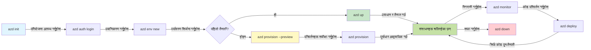

# AZD आधारभूत - Azure Developer CLI बुझ्न

# AZD आधारभूत - मुख्य अवधारणाहरू र आधारभूत सिद्धान्तहरू

**Chapter Navigation:**
- **📚 Course Home**: [शुरुआतीका लागि AZD](../../README.md)
- **📖 Current Chapter**: अध्याय 1 - आधार र छिटो सुरु
- **⬅️ Previous**: [पाठ्यक्रम अवलोकन](../../README.md#-chapter-1-foundation--quick-start)
- **➡️ Next**: [इन्स्टलेशन र सेटअप](installation.md)
- **🚀 Next Chapter**: [अध्याय २: एआई-प्राथमिक विकास](../chapter-02-ai-development/microsoft-foundry-integration.md)

## परिचय

यस पाठले तपाईंलाई Azure Developer CLI (azd) सँग परिचित गराउँछ, जुन एक शक्तिशाली कमान्ड-लाइन उपकरण हो जसले स्थानीय विकासबाट Azure तैनाथीकरणसम्मको यात्रा तीव्र बनाउँछ। तपाईंले आधारभूत अवधारणाहरू, मुख्य सुविधाहरू सिक्नुहुनेछ र azd ले कसरी क्लाउड-नेटिभ अनुप्रयोग तैनाथीकरण सजिलो बनाउँछ भन्ने बुझ्नुहुनेछ।

## सिकाइ लक्ष्यहरू

यस पाठको अन्त्यसम्म, तपाईंले:
- Azure Developer CLI के हो र यसको प्राथमिक उद्देश्य के हो भनेर बुझ्नुहुनेछ
- टेम्पलेटहरू, वातावरणहरू, र सेवाहरूका मुख्य अवधारणाहरू सिक्नुहुनेछ
- टेम्पलेट-चालित विकास र Infrastructure as Code सहितका मुख्य सुविधाहरू अन्वेषण गर्नुहुनेछ
- azd प्रोजेक्ट संरचना र वर्कफ्लो बुझ्नुहुनेछ
- विकास वातावरणका लागि azd स्थापना र कन्फिगर गर्न तयार हुनुहुनेछ

## सिकाइ परिणामहरू

यस पाठ पूरा गरेपछि, तपाईं सक्षम हुनुहुनेछ:
- आधुनिक क्लाउड विकास वर्कफ्लोहरूमा azd को भूमिका व्याख्या गर्ने
- azd प्रोजेक्ट संरचनाका कम्पोनेन्टहरू छुट्याउने
- टेम्पलेटहरू, वातावरणहरू, र सेवाहरू कसरी सँगै काम गर्छन् भनेर वर्णन गर्ने
- azd सँग Infrastructure as Code का फाइदाहरू बुझ्ने
- फरक-फरक azd कमाण्डहरू र तिनका उद्देश्यहरू चिन्ने

## Azure Developer CLI (azd) के हो?

Azure Developer CLI (azd) एक कमान्ड-लाइन उपकरण हो जसले स्थानीय विकासबाट Azure तैनाथीकरणसम्मको तपाईंको यात्रा तीव्र बनाउँछ। यसले Azure मा क्लाउड-नेटिभ अनुप्रयोग बनाउने, तैनाथ गर्ने, र व्यवस्थापन गर्ने प्रक्रियालाई सरल बनाउँछ।

### azd ले तपाईंले के के तैनाथ गर्न सक्नुहुन्छ?

azd ले विस्तृत प्रकारका वर्कलोडहरू समर्थन गर्छ—र सूची बढ्दै जान्छ। आज, तपाईं azd प्रयोग गरेर तैनाथ गर्न सक्नुहुन्छ:

| Workload Type | Examples | Same Workflow? |
|---------------|----------|----------------|
| **परम्परागत अनुप्रयोगहरू** | Web apps, REST APIs, static sites | ✅ `azd up` |
| **सेवाहरू र माइक्रोसर्भिसहरू** | Container Apps, Function Apps, multi-service backends | ✅ `azd up` |
| **एआई-संचालित अनुप्रयोगहरू** | Chat apps with Microsoft Foundry Models, RAG solutions with AI Search | ✅ `azd up` |
| **बुद्धिमान एजेन्टहरू** | Foundry-hosted agents, multi-agent orchestrations | ✅ `azd up` |

मुख्य अन्तर्दृष्टि भनेको कि **तपाईं जे तैनाथ गर्दै हुनुहुन्छ भन्ने कुराबाट स्वतन्त्र रूपमा azd लाइफसाइकल उस्तै रहन्छ**। तपाईं प्रोजेक्ट इनिसियलाइज गर्नुहुन्छ, इन्फ्रास्ट्रक्चर प्रोभिजन गर्नुहुन्छ, कोड तैनाथ गर्नुहुन्छ, आफ्नो एप मनिटर गर्नुहुन्छ, र क्लिनअप गर्नुहुन्छ—यो सानो वेबसाइट होस् वा जटिल एआई एजेन्ट।

यो निरन्तरता डिजाइन अनुरूप हो। azd ले एआई क्षमताहरूलाई तपाईंको एप्लिकेशनले प्रयोग गर्न सक्ने अर्को प्रकारको सेवा रूपमा व्यवहार गर्छ, कुनै मौलिक रूपमा फरक कुरा जस्तो नभएको। Microsoft Foundry Models द्वारा समर्थित एक च्याट एन्डपॉइन्ट azd का दृष्टिले केवल कन्फिगर र तैनाथ गर्नुपर्ने अर्को सेवा हो।

### 🎯 किन AZD प्रयोग गर्ने? वास्तविक संसारको तुलना

साधारण वेब एप र डेटाबेस तैनाथीकरण तुलना गरौँ:

#### ❌ WITHOUT AZD: Manual Azure Deployment (30+ minutes)

```bash
# चरण 1: रिसोर्स समूह सिर्जना गर्नुहोस्
az group create --name myapp-rg --location eastus

# चरण 2: एप सर्भिस योजना सिर्जना गर्नुहोस्
az appservice plan create --name myapp-plan \
  --resource-group myapp-rg \
  --sku B1 --is-linux

# चरण 3: वेब एप सिर्जना गर्नुहोस्
az webapp create --name myapp-web-unique123 \
  --resource-group myapp-rg \
  --plan myapp-plan \
  --runtime "NODE:18-lts"

# चरण 4: Cosmos DB खाता सिर्जना गर्नुहोस् (10-15 मिनेट)
az cosmosdb create --name myapp-cosmos-unique123 \
  --resource-group myapp-rg \
  --kind MongoDB

# चरण 5: डेटाबेस सिर्जना गर्नुहोस्
az cosmosdb mongodb database create \
  --account-name myapp-cosmos-unique123 \
  --resource-group myapp-rg \
  --name tododb

# चरण 6: कलेक्शन सिर्जना गर्नुहोस्
az cosmosdb mongodb collection create \
  --account-name myapp-cosmos-unique123 \
  --resource-group myapp-rg \
  --database-name tododb \
  --name todos

# चरण 7: कनेक्शन स्ट्रिङ प्राप्त गर्नुहोस्
CONN_STR=$(az cosmosdb keys list \
  --name myapp-cosmos-unique123 \
  --resource-group myapp-rg \
  --type connection-strings \
  --query "connectionStrings[0].connectionString" -o tsv)

# चरण 8: एप सेटिङहरू कन्फिगर गर्नुहोस्
az webapp config appsettings set \
  --name myapp-web-unique123 \
  --resource-group myapp-rg \
  --settings MONGODB_URI="$CONN_STR"

# चरण 9: लगिङ सक्षम गर्नुहोस्
az webapp log config --name myapp-web-unique123 \
  --resource-group myapp-rg \
  --application-logging filesystem \
  --detailed-error-messages true

# चरण 10: Application Insights सेटअप गर्नुहोस्
az monitor app-insights component create \
  --app myapp-insights \
  --location eastus \
  --resource-group myapp-rg

# चरण 11: App Insights लाई वेब एपसँग जडान गर्नुहोस्
INSTRUMENTATION_KEY=$(az monitor app-insights component show \
  --app myapp-insights \
  --resource-group myapp-rg \
  --query "instrumentationKey" -o tsv)

az webapp config appsettings set \
  --name myapp-web-unique123 \
  --resource-group myapp-rg \
  --settings APPINSIGHTS_INSTRUMENTATIONKEY="$INSTRUMENTATION_KEY"

# चरण 12: स्थानीय रूपमा एप्लिकेशन निर्माण गर्नुहोस्
npm install
npm run build

# चरण 13: डिप्लोयमेन्ट प्याकेज सिर्जना गर्नुहोस्
zip -r app.zip . -x "*.git*" "node_modules/*"

# चरण 14: एप्लिकेशन परिनियोजन गर्नुहोस्
az webapp deployment source config-zip \
  --resource-group myapp-rg \
  --name myapp-web-unique123 \
  --src app.zip

# चरण 15: पर्खनुहोस् र यो काम होस् भनेर प्रार्थना गर्नुहोस् 🙏
# (स्वचालित मान्यकरण छैन, म्यानुअल परीक्षण आवश्यक)
```

**समस्याहरू:**
- ❌ 15+ कमाण्डहरू याद गर्न र क्रमशः कार्यान्वयन गर्नुपर्ने
- ❌ 30-45 minutes को म्यानुअल काम
- ❌ गल्ती गर्न सजिलो (टाइपो, गलत प्यारामिटर)
- ❌ कनेक्सन स्ट्रिङहरू टर्मिनल इतिहासमा प्रकट हुन्छन्
- ❌ केहि असफल भएमा स्वचालित रोलब्याक हुँदैन
- ❌ टिम सदस्यहरूले दोहोर्याउन गाह्रो
- ❌ हरेक पटक फरक (पुनरुत्पादनयोग्य छैन)

#### ✅ WITH AZD: Automated Deployment (5 commands, 10-15 minutes)

```bash
# चरण 1: टेम्पलेटबाट आरम्भ गर्नुहोस्
azd init --template todo-nodejs-mongo

# चरण 2: प्रमाणिकरण गर्नुहोस्
azd auth login

# चरण 3: वातावरण सिर्जना गर्नुहोस्
azd env new dev

# चरण 4: परिवर्तनहरू पूर्वावलोकन गर्नुहोस् (वैकल्पिक तर सिफारिश गरिन्छ)
azd provision --preview

# चरण 5: सबै कुरा तैनाथ गर्नुहोस्
azd up

# ✨ सम्पन्न! सबै कुरा तैनाथ, कन्फिगर गरिएको र अनुगमन गरिएको छ
```

**फाइदाहरू:**
- ✅ **5 commands** बनाम 15+ म्यानुअल चरणहरू
- ✅ **10-15 minutes** कुल समय (प्रमुखतः Azure को प्रतीक्षा)
- ✅ **कम म्यानुअल त्रुटिहरू** - निरन्तर, टेम्पलेट-चालित वर्कफ्लो
- ✅ **सुरक्षित सिक्रेट ह्यान्डलिंग** - धेरै टेम्पलेटहरूले Azure-प्रबंधित सिक्रेट स्टोरेज प्रयोग गर्छन्
- ✅ **दोहर्याउन मिल्ने तैनाथीकरणहरू** - हरेकपटक एकै वर्कफ्लो
- ✅ **पूर्ण रूपमा पुनरुत्पादनयोग्य** - हरेकपटक उस्तै नतिजा
- ✅ **टिम-तयार** - कुनै पनि व्यक्ति उस्तै कमाण्डहरूसँग तैनाथीकरण गर्न सक्छ
- ✅ **Infrastructure as Code** - संस्करण नियन्त्रण गरिएको Bicep टेम्पलेटहरू
- ✅ **बिल्ट-इन मोनिटरिङ** - Application Insights स्वचालित रूपमा कन्फिगर हुन्छ

### 📊 Time & Error Reduction

| Metric | Manual Deployment | AZD Deployment | Improvement |
|:-------|:------------------|:---------------|:------------|
| **Commands** | 15+ | 5 | 67% fewer |
| **Time** | 30-45 min | 10-15 min | 60% faster |
| **Error Rate** | ~40% | <5% | 88% reduction |
| **Consistency** | Low (manual) | 100% (automated) | Perfect |
| **Team Onboarding** | 2-4 hours | 30 minutes | 75% faster |
| **Rollback Time** | 30+ min (manual) | 2 min (automated) | 93% faster |

## मुख्य अवधारणाहरू

### टेम्पलेटहरू
टेम्पलेटहरू azd को आधार हुन्। तिनीहरूले समावेश गर्दछन्:
- **Application code** - तपाईंको स्रोत कोड र निर्भरताहरू
- **Infrastructure definitions** - Bicep वा Terraform मा परिभाषित Azure स्रोतहरू
- **Configuration files** - सेटिङहरू र वातावरण भेरिएबलहरू
- **Deployment scripts** - स्वचालित तैनाथीकरण वर्कफ्लोहरू

### वातावरणहरू
वातावरणहरूले विभिन्न तैनाथि लक्ष्यहरू प्रतिनिधित्व गर्छन्:
- **Development** - परीक्षण र विकासका लागि
- **Staging** - पूर्व-प्रोडक्सन वातावरण
- **Production** - प्रत्यक्ष उत्पादन वातावरण

हरेक वातावरणले आफ्नो निम्न भूमिका राख्छ:
- Azure resource group
- Configuration settings
- Deployment state

### सेवाहरू
सेवाहरू तपाईंको अनुप्रयोगका बनोट ब्लकहरू हुन्:
- **Frontend** - वेब अनुप्रयोगहरू, SPAs
- **Backend** - APIs, माइक्रोसर्भिसहरू
- **Database** - डेटा भण्डारण समाधानहरू
- **Storage** - फाइल र ब्लब स्टोरेज

## मुख्य सुविधाहरू

### 1. टेम्पलेट-चालित विकास
```bash
# उपलब्ध टेम्पलेटहरू ब्राउज गर्नुहोस्
azd template list

# टेम्पलेटबाट आरम्भ गर्नुहोस्
azd init --template <template-name>
```

### 2. Infrastructure as Code
- **Bicep** - Azure को डोमेन-विशेष भाषा
- **Terraform** - मल्टि-क्लाउड इन्फ्रास्ट्रक्चर उपकरण
- **ARM Templates** - Azure Resource Manager टेम्पलेटहरू

### 3. एकीकृत वर्कफ्लोहरू
```bash
# पूर्ण परिनियोजन कार्यप्रवाह
azd up            # प्रावधान + परिनियोजन: पहिलो पटक सेटअपका लागि हात-रहित

# 🧪 नयाँ: परिनियोजन अघि पूर्वाधार परिवर्तनहरूको पूर्वावलोकन (सुरक्षित)
azd provision --preview    # परिवर्तन नगरी पूर्वाधार परिनियोजन अनुकरण गर्नुहोस्

azd provision     # पूर्वाधार अपडेट गर्दा Azure स्रोतहरू सिर्जना गर्न यसलाई प्रयोग गर्नुहोस्
azd deploy        # अनुप्रयोग कोड परिनियोजन गर्नुहोस् वा अपडेट भएपछि पुन: परिनियोजन गर्नुहोस्
azd down          # स्रोतहरू सफा गर्नुहोस्
```

#### 🛡️ पूर्वावलोकनसहित सुरक्षित इन्फ्रास्ट्रक्चर योजना
The `azd provision --preview` command is a game-changer for safe deployments:
- **Dry-run analysis** - के के सिर्जना, परिमार्जन, वा मेटिनेछ देखाउँछ
- **Zero risk** - तपाईंको Azure वातावरणमा कुनै वास्तविक परिवर्तन हुँदैन
- **Team collaboration** - तैनाथीकरण अघि पूर्वावलोकन नतिजाहरू साझा गर्नुहोस्
- **Cost estimation** - प्रतिबद्धता अघि स्रोतहरूको लागत बुझ्नुहोस्

```bash
# उदाहरण पूर्वावलोकन कार्यप्रवाह
azd provision --preview           # के परिवर्तन हुने छ हेर्नुहोस्
# आउटपुट समीक्षा गर्नुहोस्, टोलीसँग छलफल गर्नुहोस्
azd provision                     # विश्वासका साथ परिवर्तन लागू गर्नुहोस्
```

### 📊 Visual: AZD Development Workflow



**वर्कफ्लो व्याख्या:**
1. **Init** - टेम्पलेट वा नयाँ प्रोजेक्टबाट सुरु गर्नुहोस्
2. **Auth** - Azure सँग प्रमाणित गर्नुहोस्
3. **Environment** - अलग्गै तैनाथि वातावरण सिर्जना गर्नुहोस्
4. **Preview** - 🆕 सधैं पहिले इन्फ्रास्ट्रक्चर परिवर्तनहरू पूर्वावलोकन गर्नुहोस् (सुरक्षित अभ्यास)
5. **Provision** - Azure स्रोतहरू सिर्जना/अपडेट गर्नुहोस्
6. **Deploy** - तपाईंको एप्लिकेशन कोड पुश गर्नुहोस्
7. **Monitor** - एप्लिकेशन प्रदर्शन अवलोकन गर्नुहोस्
8. **Iterate** - परिवर्तनहरू गर्नुहोस् र कोड पुन: तैनाथ गर्नुहोस्
9. **Cleanup** - समाप्त भएपछि स्रोतहरू हटाउनुहोस्

### 4. वातावरण व्यवस्थापन
```bash
# वातावरणहरू सिर्जना गर्नुहोस् र व्यवस्थापन गर्नुहोस्
azd env new <environment-name>
azd env select <environment-name>
azd env list
```

### 5. एक्सटेन्सन र एआई कमाण्डहरू

azd ले कोर CLI भन्दा बाहिर क्षमताहरू थप्न एक्सटेन्सन प्रणाली प्रयोग गर्छ। यो विशेष गरी एआई वर्कलोडहरूका लागि उपयोगी छ:

```bash
# उपलब्ध एक्सटेन्सनहरू सूचीबद्ध गर्नुहोस्
azd extension list

# Foundry एजेन्टहरू एक्सटेन्सन स्थापना गर्नुहोस्
azd extension install azure.ai.agents

# म्यानिफेस्टबाट AI एजेन्ट परियोजना आरम्भ गर्नुहोस्
azd ai agent init -m agent-manifest.yaml

# डिप्लोय गरिएको एजेन्ट परीक्षण गर्नुहोस् (लेटेन्सी र टाइम-टु-फर्स्ट-बाइट देखाउँछ)
azd ai agent invoke

# AI-सहायता प्राप्त विकासका लागि MCP सर्भर सुरु गर्नुहोस् (अल्फा)
azd mcp start
```

**एजेन्ट लाइफसाइकल, सुरु देखि अन्तसम्म।** एक पटक तपाईंले `azure.ai.agents` इन्स्टल गर्नुभयो भने, एकल वर्कफ्लोले तपाईंलाई विचारबाट चलिरहेको, अनुगमन गरिएको एजेन्टमा पुर्‍याउँछ। यी सबैलाई पहिलो दिनमा आवश्यक छैन—तर जान्नुस् कि यी उपलब्ध छन्:

| Stage | Command | What it does |
|-------|---------|--------------|
| **Scaffold** | `azd ai agent init -m <manifest>` | म्यानिफेस्टबाट एजेन्ट प्रोजेक्ट जेनेरेट गर्छ |
| **Test** | `azd ai agent invoke` | एजेन्टलाई कल गर्छ र प्रतिक्रिया समय देख्छ |
| **Measure** | `azd ai agent eval generate` | एजेन्टको लागि मूल्याङ्कन डेटासेट सिर्जना गर्छ |
| **Improve** | `azd ai agent optimize` | तपाईंको डाटाका विरुद्ध एजेन्ट निर्देशहरू अनुकूलित गर्छ |
| **Inspect** | `azd ai agent endpoint show` | लाइभ एन्डपॉइन्ट कन्फिगरेसन देख्छ |
| **Clean up** | `azd ai agent delete` | होस्ट गरिएको एजेन्ट र यसको सबै भर्सनहरू मेटाउँछ |

> एक्सटेन्सनहरू [अध्याय 2: एआई-प्राथमिक विकास](../chapter-02-ai-development/agents.md) र [AZD एआई CLI कमाण्डहरू](../chapter-08-production/production-ai-practices.md#azd-ai-cli-commands-and-extensions) सन्दर्भमा विस्तृत रूपमा समावेश गरिएका छन्।

## 📁 प्रोजेक्ट संरचना

एक सामान्य azd प्रोजेक्ट संरचना:
```
my-app/
├── .azd/                    # azd configuration
│   └── config.json
├── .azure/                  # Azure deployment artifacts
├── .devcontainer/          # Development container config
├── .github/workflows/      # GitHub Actions
├── .vscode/               # VS Code settings
├── infra/                 # Infrastructure code
│   ├── main.bicep        # Main infrastructure template
│   ├── main.parameters.json
│   └── modules/          # Reusable modules
├── src/                  # Application source code
│   ├── api/             # Backend services
│   └── web/             # Frontend application
├── azure.yaml           # azd project configuration
└── README.md
```

## 🔧 कन्फिगरेसन फाइलहरू

### azure.yaml
मुख्य प्रोजेक्ट कन्फिगरेसन फाइल:
```yaml
name: my-awesome-app
metadata:
  template: my-template@1.0.0

services:
  web:
    project: ./src/web
    language: js
    host: appservice
  api:
    project: ./src/api
    language: js
    host: appservice

hooks:
  preprovision:
    shell: pwsh
    run: echo "Preparing to provision..."
```

### .azure/config.json
वातावरण-विशिष्ट कन्फिगरेसन:
```json
{
  "version": 1,
  "defaultEnvironment": "dev",
  "environments": {
    "dev": {
      "subscriptionId": "your-subscription-id",
      "location": "eastus"
    }
  }
}
```

## 🎪 सामान्य वर्कफ्लोहरू र प्रयोगात्मक अभ्यासहरू

> **💡 सिकाइ सुझाव:** यी अभ्यासहरू क्रमशः पालना गर्नुहोस् ताकि तपाइँले AZD कौशलहरु क्रमिक रूपमा विकास गर्न सक्नुहोस्।

### 🎯 Exercise 1: Initialize Your First Project

**लक्ष्य:** AZD प्रोजेक्ट सिर्जना गर्नुहोस् र यसको संरचना अन्वेषण गर्नुहोस्

**चरणहरू:**
```bash
# प्रमाणित टेम्पलेट प्रयोग गर्नुहोस्
azd init --template todo-nodejs-mongo

# सिर्जना भएका फाइलहरू अन्वेषण गर्नुहोस्
ls -la  # लुकेका फाइलहरू समेत सबै फाइलहरू हेर्नुहोस्

# मुख्य सिर्जना गरिएका फाइलहरू:
# - azure.yaml (मुख्य कन्फिग)
# - infra/ (पूर्वाधार कोड)
# - src/ (अनुप्रयोग कोड)
```

**✅ सफलता:** तपाईंसँग azure.yaml, infra/, र src/ डाइरेक्टरीहरू छन्

---

### 🎯 Exercise 2: Deploy to Azure

**लक्ष्य:** अन्त्यदेखि अन्त्यसम्म तैनाथीकरण पूरा गर्नुहोस्

**चरणहरू:**
```bash
# 1. प्रमाणिकरण गर्नुहोस्
az login && azd auth login

# 2. वातावरण सिर्जना गर्नुहोस्
azd env new dev
azd env set AZURE_LOCATION eastus

# 3. परिवर्तनहरूको पूर्वावलोकन गर्नुहोस् (सिफारिस गरिएको)
azd provision --preview

# 4. सबै परिनियोजन गर्नुहोस्
azd up

# 5. परिनियोजनको पुष्टि गर्नुहोस्
azd show    # आफ्नो एपको URL हेर्नुहोस्
```

**अपेक्षित समय:** 10-15 minutes  
**✅ सफलता:** एप्लिकेशन URL ब्राउजरमा खुलेको छ

---

### 🎯 Exercise 3: Multiple Environments

**लक्ष्य:** dev र staging मा तैनाथ गर्नुहोस्

**चरणहरू:**
```bash
# पहिले नै dev छ, staging सिर्जना गर्नुहोस्
azd env new staging
azd env set AZURE_LOCATION westus2
azd up

# तिनीहरूबीच स्विच गर्नुहोस्
azd env list
azd env select dev
```

**✅ सफलता:** Azure Portal मा दुई अलग्गा स्रोत समूहहरू

---

### 🛡️ Clean Slate: `azd down --force --purge`

जब तपाईंलाई पूर्ण रूपमा रिसेट गर्न आवश्यक हुन्छ:

```bash
azd down --force --purge
```

**यसले के गर्छ:**
- `--force`: कुनै पुष्टिकरण संकेतहरू हुँदैन
- `--purge`: सबै स्थानीय स्टेट र Azure स्रोतहरू मेटाउँछ

**कहिले प्रयोग गर्ने:**
- Deployment failed mid-way
- Switching projects
- Need fresh start

---

## 🎪 मूल वर्कफ्लो सन्दर्भ

### नयाँ प्रोजेक्ट सुरु गर्दै
```bash
# विधि 1: अवस्थित टेम्पलेट प्रयोग गर्नुहोस्
azd init --template todo-nodejs-mongo

# विधि 2: शून्यबाट सुरु गर्नुहोस्
azd init

# विधि 3: हालको निर्देशिका प्रयोग गर्नुहोस्
azd init .
```

### विकास चक्र
```bash
# विकास वातावरण सेटअप गर्नुहोस्
azd auth login
azd env new dev
azd env select dev

# सबै तैनाथ गर्नुहोस्
azd up

# परिवर्तनहरू गर्नुहोस् र पुन: तैनाथ गर्नुहोस्
azd deploy

# समाप्त भएपछि सफा गर्नुहोस्
azd down --force --purge # Azure Developer CLI मा आदेशले तपाईंको वातावरणको लागि **कठोर रिसेट** हो—विशेष गरी जब तपाईं असफल परिनियोजनहरू समस्या समाधान गर्दै हुनुहुन्छ, अनाथ स्रोतहरू सफा गर्दै हुनुहुन्छ, वा नयाँ पुनः तैनातीको तयारी गर्दै हुनुहुन्छ।
```

## `azd down --force --purge` बुझ्न
`azd down --force --purge` कमाण्ड तपाईंको azd वातावरण र सम्बन्धित सबै स्रोतहरू पूर्ण रूपमा teardown गर्नको लागि शक्तिशाली तरिका हो। यहाँ प्रत्येक फ्ल्यागले के गर्छ भन्ने विश्लेषण छ:
```
--force
```

- पुष्टिकरण संकेतहरू छोड्छ।
- स्वचालन वा स्क्रिप्टिङका लागि उपयोगी जहाँ म्यानुअल इनपुट सम्भव हुँदैन।
- CLI ले असंगतिहरू पत्ता लगाए पनि teardown रुकावट बिना अघि बढोस् भनेर सुनिश्चित गर्छ।

```
--purge
```
**सबै सम्बन्धित मेटाडाटा** मेटाउँछ, जसमा समावेश छन्:
वातावरण स्थिति
स्थानीय `.azure` फोल्डर
क्याच गरिएको तैनाथि जानकारी
azd लाई अघिल्ला तैनाथीकरणहरू 'स्मरण' नगर्नबाट रोक्छ, जसले मिसम्याच गरिएको स्रोत समूहहरू वा स्टेल रजिस्ट्री सन्दर्भहरू जस्ता समस्याहरू निम्त्याउन सक्छ।

### किन दुवै प्रयोग गर्ने?
जब lingering state वा आंशिक तैनाथीकरणका कारण `azd up` ले तपाईंलाई ब्लक गरेको छ भने, यो संयोजनले **सफा सुरुवात** सुनिश्चित गर्छ।

यो विशेष गरी Azure पोर्टलमा म्यानुअल रूपमा स्रोतहरू मेटाएपछि वा टेम्पलेट, वातावरण, वा स्रोत समूह नामकरण कन्वेन्सन परिवर्तन गर्दा उपयोगी हुन्छ।

### बहु वातावरणहरूको व्यवस्थापन
```bash
# स्टेजिङ वातावरण सिर्जना गर्नुहोस्
azd env new staging
azd env select staging
azd up

# फेरि dev मा फर्कनुहोस्
azd env select dev

# वातावरणहरू तुलना गर्नुहोस्
azd env list
```

## 🔐 प्रमाणिकरण र क्रेडेन्सियलहरू

प्रमाणीकरण बुझ्नु azd तैनाथीकरणका लागि अत्यावश्यक छ। Azure ले धेरै प्रमाणीकरण विधिहरू प्रयोग गर्छ, र azd ले अन्य Azure उपकरणहरूले प्रयोग गर्ने सोही क्रेडेन्सियल चेन प्रयोग गर्छ।

### Azure CLI प्रमाणिकरण (`az login`)

azd प्रयोग गर्नु अघि, तपाईंले Azure सँग प्रमाणित हुनुपर्छ। सबैभन्दा सामान्य विधि Azure CLI प्रयोग गर्नु हो:

```bash
# इन्टरएक्टिभ लगइन (ब्राउजर खोल्छ)
az login

# विशिष्ट टेनेंटसँग लगइन
az login --tenant <tenant-id>

# सर्भिस प्रिन्सिपलसँग लगइन
az login --service-principal -u <app-id> -p <password> --tenant <tenant-id>

# हालको लगइन स्थिति जाँच्नुहोस्
az account show

# उपलब्ध सदस्यताहरू सूचीबद्ध गर्नुहोस्
az account list --output table

# पूर्वनिर्धारित सदस्यता सेट गर्नुहोस्
az account set --subscription <subscription-id>
```

### प्रमाणिकरण प्रवाह
1. **Interactive Login**: प्रमाणिकरणका लागि तपाईंको डिफल्ट ब्राउजर खोल्छ
2. **Device Code Flow**: ब्राउजर पहुँच नभएका वातावरणहरूका लागि
3. **Service Principal**: स्वचालन र CI/CD परिदृश्यहरूका लागि
4. **Managed Identity**: Azure-होस्ट गरिएका अनुप्रयोगहरूको लागि

### DefaultAzureCredential चेन

`DefaultAzureCredential` एक प्रकारको क्रेडेन्सियल हो जसले विशेष क्रममा स्वचालित रूपमा बहु क्रेडेन्सियल स्रोतहरूको प्रयास गरेर सरल प्रमाणीकरण अनुभव प्रदान गर्छ:

#### क्रेडेन्सियल चेन क्रम
```mermaid
graph TD
    A[पूर्वनिर्धारित Azure क्रेडेन्सियल] --> B[पर्यावरण भेरिएबलहरू]
    B --> C[वर्कलोड पहिचान]
    C --> D[प्रबन्धित पहिचान]
    D --> E[भिजुअल स्टुडियो]
    E --> F[भिजुअल स्टुडियो कोड]
    F --> G[Azure कमाण्ड लाइन इन्टरफेस (CLI)]
    G --> H[Azure पावरशेल]
    H --> I[इन्टरएक्टिव ब्राउजर]
```

#### 1. वातावरण भेरिएबलहरू
```bash
# सर्भिस प्रिन्सिपलका लागि वातावरण चरहरू सेट गर्नुहोस्
export AZURE_CLIENT_ID="<app-id>"
export AZURE_CLIENT_SECRET="<password>"
export AZURE_TENANT_ID="<tenant-id>"
```

#### 2. Workload Identity (Kubernetes/GitHub Actions)
स्वतः प्रयोग गरिन्छ:
- Workload Identity सहित Azure Kubernetes Service (AKS)
- OIDC फेडरेशन सहित GitHub Actions
- अन्य फेडरेटेड पहिचान परिदृश्यहरू

#### 3. Managed Identity
जस्ता Azure स्रोतहरूको लागि:
- Virtual Machines
- App Service
- Azure Functions
- Container Instances

```bash
# म्यानेज्ड आइडेन्टिटी भएको Azure स्रोतमा चलिरहेको हो कि छैन जाँच गर्नुहोस्
az account show --query "user.type" --output tsv
# फिर्ता गर्छ: "servicePrincipal" यदि म्यानेज्ड आइडेन्टिटी प्रयोग गरिएको छ
```

#### 4. डेवलपर उपकरण एकीकरण
- **Visual Studio**: स्वचालित रूपमा साइन-इन गरिएको खाता प्रयोग गर्छ
- **VS Code**: Azure Account एक्सटेन्सन क्रेडेन्सियलहरू प्रयोग गर्छ
- **Azure CLI**: `az login` क्रेडेन्सियलहरू प्रयोग गर्छ (स्थानीय विकासका लागि सबैभन्दा सामान्य)

### AZD प्रमाणिकरण सेटअप

```bash
# विधि 1: Azure CLI प्रयोग गर्नुहोस् (विकासका लागि सिफारिस गरिन्छ)
az login
azd auth login  # अवस्थित Azure CLI प्रमाणपत्रहरू प्रयोग गर्दछ

# विधि 2: प्रत्यक्ष azd प्रमाणीकरण
azd auth login --use-device-code  # हेडलेस वातावरणका लागि

# विधि 3: प्रमाणीकरण स्थिति जाँच्नुहोस्
azd auth login --check-status

# विधि 4: लगआउट गर्नुहोस् र पुनः प्रमाणीकरण गर्नुहोस्
azd auth logout
azd auth login
```

### प्रमाणिकरणका उत्तम अभ्यासहरू

#### स्थानीय विकासका लागि
```bash
# 1. Azure CLI मार्फत लगइन गर्नुहोस्
az login

# 2. सही सदस्यता प्रमाणित गर्नुहोस्
az account show
az account set --subscription "Your Subscription Name"

# 3. अवस्थित प्रमाण-पत्रहरूसँग azd चलाउनुहोस्
azd auth login
```

#### CI/CD पाइपलाइनहरूका लागि
```yaml
# GitHub Actions example
- name: Azure Login
  uses: azure/login@v1
  with:
    creds: ${{ secrets.AZURE_CREDENTIALS }}

- name: Deploy with azd
  run: |
    azd auth login --client-id ${{ secrets.AZURE_CLIENT_ID }} \
                    --client-secret ${{ secrets.AZURE_CLIENT_SECRET }} \
                    --tenant-id ${{ secrets.AZURE_TENANT_ID }}
    azd up --no-prompt
```

#### उत्पादन वातावरणका लागि
- Azure स्रोतहरूमा चलाउँदा **Managed Identity** प्रयोग गर्नुहोस्
- अटोमेशन परिदृश्यहरूको लागि **Service Principal** प्रयोग गर्नुहोस्
- कोड वा कन्फिगरेसन फाइलहरूमा प्रमाणिकरण जानकारी भण्डारण नगर्नुहोस्
- संवेदनशील कन्फिगरेसनका लागि **Azure Key Vault** प्रयोग गर्नुहोस्

### सामान्य प्रमाणीकरण सम्बन्धी समस्याहरू र समाधानहरू

#### समस्या: "No subscription found"
```bash
# समाधान: पूर्वनिर्धारित सदस्यता सेट गर्नुहोस्
az account list --output table
az account set --subscription "<subscription-id>"
azd env set AZURE_SUBSCRIPTION_ID "<subscription-id>"
```

#### समस्या: "Insufficient permissions"
```bash
# समाधान: आवश्यक भूमिकाहरू जाँच्नुहोस् र तोक्नुहोस्
az role assignment list --assignee $(az account show --query user.name --output tsv)

# सामान्य आवश्यक भूमिकाहरू:
# - Contributor (संसाधन व्यवस्थापनका लागि)
# - User Access Administrator (भूमिका तोक्नका लागि)
```

#### समस्या: "Token expired"
```bash
# समाधान: पुनः प्रमाणीकरण गर्नुहोस्
az logout
az login
azd auth logout
azd auth login
```

### फरक परिदृश्यहरूमा प्रमाणीकरण

#### स्थानीय विकास
```bash
# व्यक्तिगत विकास खाता
az login
azd auth login
```

#### टोली विकास
```bash
# संगठनका लागि विशिष्ट टेनन्ट प्रयोग गर्नुहोस्
az login --tenant contoso.onmicrosoft.com
azd auth login
```

#### बहु-टेनेन्ट परिदृश्यहरू
```bash
# टेनेन्टहरू बीच स्विच गर्नुहोस्
az login --tenant tenant1.onmicrosoft.com
# टेनेन्ट 1 मा तैनाथ गर्नुहोस्
azd up

az login --tenant tenant2.onmicrosoft.com  
# टेनेन्ट 2 मा तैनाथ गर्नुहोस्
azd up
```

### सुरक्षा सम्बन्धी विचारहरू

1. **क्रेडेन्सियल भण्डारण**: स्रोत कोडमा कहिल्यै प्रमाणिकरण जानकारी भण्डारण नगर्नुहोस्
2. **सीमित दायरा**: Service Principal हरूका लागि न्यूनतम अनुमति सिद्धान्त प्रयोग गर्नुहोस्
3. **टोकन रोटेसन**: Service Principal का गोप्य कुञ्जीहरू नियमित रूपमा परिवर्तन गर्नुहोस्
4. **अडिट ट्रेल**: प्रमाणीकरण र डिप्लोयमेन्ट गतिविधिहरू अनुगमन गर्नुहोस्
5. **नेटवर्क सुरक्षा**: सम्भव भएमा निजी endpoints प्रयोग गर्नुहोस्

### प्रमाणीकरण समस्याहरू समाधान

```bash
# प्रमाणीकरण समस्याहरू डिबग गर्नुहोस्
azd auth login --check-status
az account show
az account get-access-token

# सामान्य डायग्नोस्टिक आदेशहरू
whoami                          # हालको प्रयोगकर्ता सन्दर्भ
az ad signed-in-user show      # Microsoft Entra ID प्रयोगकर्ता विवरण
az group list                  # संसाधन पहुँच परीक्षण गर्नुहोस्
```

## `azd down --force --purge` को बुझाइ

### पत्ता लगाउने
```bash
azd template list              # टेम्पलेटहरू ब्राउज़ गर्नुहोस्
azd template show <template>   # टेम्पलेट विवरण
azd init --help               # प्रारम्भिक विकल्पहरू
```

### परियोजना व्यवस्थापन
```bash
azd show                     # परियोजना अवलोकन
azd env list                # उपलब्ध वातावरणहरू र चयन गरिएको पूर्वनिर्धारित
azd config show            # कन्फिगरेसन सेटिङहरू
```

### निगरानी
```bash
azd monitor                  # Azure पोर्टलको अनुगमन खोल्नुहोस्
azd monitor --logs           # अनुप्रयोग लगहरू हेर्नुहोस्
azd monitor --live           # प्रत्यक्ष मेट्रिकहरू हेर्नुहोस्
azd pipeline config          # CI/CD सेट अप गर्नुहोस्
```

## उत्तम अभ्यासहरू

### 1. अर्थपूर्ण नामहरू प्रयोग गर्नुहोस्
```bash
# राम्रो
azd env new production-east
azd init --template web-app-secure

# टार्नुहोस्
azd env new env1
azd init --template template1
```

### 2. टेम्पलेटहरू प्रयोग गर्नुहोस्
- विद्यमान टेम्पलेटबाट सुरु गर्नुहोस्
- आफ्नो आवश्यकताअनुसार अनुकूलन गर्नुहोस्
- आफ्नो संगठनका लागि पुन: प्रयोग योग्य टेम्पलेटहरू बनाउनुहोस्

### 3. वातावरण अलग्गै राख्नुहोस्
- dev/staging/prod का लागि अलग वातावरणहरू प्रयोग गर्नुहोस्
- स्थानीय मेसिनबाट सिधै उत्पादनमा कहिल्यै डिप्लोय नगर्नुहोस्
- उत्पादन डिप्लोयमेन्टका लागि CI/CD पाइपलाइन्स प्रयोग गर्नुहोस्

### 4. कन्फिगरेसन व्यवस्थापन
- संवेदनशील डेटा का लागि वातावरणीय भेरिएबलहरू प्रयोग गर्नुहोस्
- कन्फिगरेसन भर्सन कन्ट्रोलमा राख्नुहोस्
- वातावरण-विशिष्ट सेटिङहरू कागजात गर्नुहोस्

## सिकाइ प्रगति

### प्रारम्भिक (सप्ताह 1-2)
1. azd इन्स्टल गरी प्रमाणिकरण गर्नुहोस्
2. साधारण टेम्पलेट डिप्लोय गर्नुहोस्
3. परियोजना संरचनालाई बुझ्नुहोस्
4. आधारभूत कमान्डहरू सिक्नुहोस् (up, down, deploy)

### मध्यवर्ती (सप्ताह 3-4)
1. टेम्पलेटहरू अनुकूलन गर्नुहोस्
2. बहु वातावरणहरू व्यवस्थापन गर्नुहोस्
3. इन्फ्रास्ट्रक्चर कोडलाई बुझ्नुहोस्
4. CI/CD पाइपलाइन्स सेटअप गर्नुहोस्

### उन्नत (सप्ताह 5+)
1. अनुकूलित टेम्पलेटहरू सिर्जना गर्नुहोस्
2. उन्नत इन्फ्रास्ट्रक्चर ढाँचाहरू
3. बहु-क्षेत्र डिप्लोयमेन्टहरू
4. एण्टरप्राइज-स्तर कन्फिगरेसनहरू

## आगामी कदमहरू

**📖 अध्याय १ सिकाइ जारी राख्नुहोस्:**
- [इन्स्टलेशन र सेटअप](installation.md) - azd इन्स्टल गरेर कन्फिगर गर्नुहोस्
- [तपाईंको पहिलो परियोजना](first-project.md) - व्यावहारिक ट्युटोरियल पूरा गर्नुहोस्
- [कन्फिगरेसन गाइड](configuration.md) - उन्नत कन्फिगरेसन विकल्पहरू

**🎯 अर्को अध्यायको लागि तयार?**
- [अध्याय 2: AI-प्रथम विकास](../chapter-02-ai-development/microsoft-foundry-integration.md) - AI अनुप्रयोगहरू विकास गर्न सुरु गर्नुहोस्

## अतिरिक्त स्रोतहरू

- [Azure Developer CLI अवलोकन](https://learn.microsoft.com/en-us/azure/developer/azure-developer-cli/)
- [टेम्पलेट ग्यालरी](https://azure.github.io/awesome-azd/)
- [समुदाय नमूनाहरू](https://github.com/Azure-Samples)

---

## 🙋 बारम्बार सोधिने प्रश्नहरू

### सामान्य प्रश्नहरू

**Q: AZD र Azure CLI बीच के फरक छ?**

A: Azure CLI (`az`) व्यक्तिगत Azure स्रोतहरू व्यवस्थापन गर्नको लागि हो। AZD (`azd`) पूरै अनुप्रयोगहरू व्यवस्थापन गर्नको लागि हो:

```bash
# Azure CLI - तल्लो-स्तरीय स्रोत व्यवस्थापन
az webapp create --name myapp --resource-group rg
az sql server create --name myserver --resource-group rg
# ...थप धेरै आदेशहरू आवश्यक छन्

# AZD - अनुप्रयोग-स्तरीय व्यवस्थापन
azd up  # सबै स्रोतहरू सहित सम्पूर्ण अनुप्रयोग तैनाथ गर्छ
```

**यसरी सोच्नुहोस्:**
- `az` = व्यक्तिगत लेगो ईंटहरूमा काम गर्ने
- `azd` = पूर्ण लेगो सेटहरूसँग काम गर्ने

---

**Q: AZD प्रयोग गर्न Bicep वा Terraform जान्न आवश्यक छ?**

A: होइन! टेम्पलेटहरूबाट सुरु गर्नुहोस्:
```bash
# अवस्थित टेम्प्लेट प्रयोग गर्नुहोस् - IaC ज्ञान आवश्यक छैन
azd init --template todo-nodejs-mongo
azd up
```

तपाईं पछि इन्फ्रास्ट्रक्चर अनुकूलन गर्न Bicep सिक्न सक्नुहुन्छ। टेम्पलेटहरूले सिक्नका लागि कार्यरत उदाहरणहरू प्रदान गर्दछन्।

---

**Q: AZD टेम्पलेट चलाउन कति खर्च लाग्छ?**

A: लागत टेम्पलेट अनुसार फरक पर्छ। अधिकांश विकास टेम्पलेटहरू $50-150/महिना पर्छन्:

```bash
# डिप्लोय गर्नुअघि लागतहरू पूर्वावलोकन गर्नुहोस्
azd provision --preview

# प्रयोगमा नभएको बेला सधैं सफा गर्नुहोस्
azd down --force --purge  # सबै स्रोतहरू हटाउँछ
```

**सुझाव:** जहाँ उपलब्ध छ त्यहाँ निःशुल्क टियरहरू प्रयोग गर्नुहोस्:
- App Service: F1 (Free) टियर
- Microsoft Foundry मोडेलहरू: Azure OpenAI 50,000 टोकन्स/महिनामा निःशुल्क
- Cosmos DB: 1000 RU/s निःशुल्क टियर

---

**Q: के म AZD लाई अवस्थित Azure स्रोतहरूसँग प्रयोग गर्न सक्छु?**

A: हुनछ, तर नयाँबाट सुरु गर्नु सजिलो हुन्छ। AZD तब राम्रोसँग काम गर्छ जब यसले पूर्ण लाइफसाइकल व्यवस्थापन गर्छ। अवस्थित स्रोतहरूको लागि:
```bash
# विकल्प 1: अवस्थित स्रोतहरू आयात गर्नुहोस् (उन्नत)
azd init
# त्यसपछि infra/ लाई परिमार्जन गरी अवस्थित स्रोतहरूलाई सन्दर्भ गर्नुहोस्

# विकल्प 2: नयाँबाट सुरु गर्नुहोस् (सिफारिस गरिएको)
azd init --template matching-your-stack
azd up  # नयाँ वातावरण सिर्जना गर्छ
```

---

**Q: मैले मेरो परियोजना कसरी टोलीका सदस्यहरूसँग साझा गर्ने?**

A: AZD परियोजनालाई Git मा कमिट गर्नुहोस् (तर .azure फोल्डरलाई होइन):
```bash
# पहिले नै .gitignore मा पूर्वनिर्धारित रूपमा समावेश छ
.azure/        # गोप्य जानकारी र वातावरण सम्बन्धी डेटा समावेश गर्दछ
*.env          # वातावरण चरहरू

# त्यसपछि टोलीका सदस्यहरू:
git clone <your-repo>
azd auth login
azd env new <their-name>-dev
azd up
```

सबैले एउटै टेम्पलेटबाट उस्तै इन्फ्रास्ट्रक्चर प्राप्त गर्छन्।

---

### समस्यासम्माधान सम्बन्धी प्रश्नहरू

**Q: "azd up" बीचमै विफल भयो। म के गर्न सक्छु?**

A: त्रुटि जाँच गर्नुहोस्, समाधान गर्नुहोस्, र फेरि प्रयास गर्नुहोस्:
```bash
# विस्तृत लगहरू हेर्नुहोस्
azd show

# सामान्य समाधानहरू:

# 1. यदि कोटा पार भयो भने:
azd env set AZURE_LOCATION "westus2"  # अर्को क्षेत्र प्रयोग गर्नुहोस्

# 2. यदि स्रोत नाम टकराव छ भने:
azd down --force --purge  # सुरुबाट सफा गर्नुहोस्
azd up  # फेरि प्रयास गर्नुहोस्

# 3. यदि प्रमाणीकरण म्याद सकिएको छ भने:
az login
azd auth login
azd up
```

**सबैभन्दा सामान्य समस्या:** गलत Azure subscription चयन गरिएको छ
```bash
az account list --output table
az account set --subscription "<correct-subscription>"
```

---

**Q: पुन:प्रोभिजन नगरी केवल कोड परिवर्तनहरू कसरी डिप्लोय गर्ने?**

A: `azd up` को सट्टा `azd deploy` प्रयोग गर्नुहोस्:
```bash
azd up          # पहिलो पटक: पूर्वतयारी + परिनियोजन (धिमा)

# कोड परिवर्तन गर्नुहोस्...

azd deploy      # पछिल्ला पटकहरू: केवल परिनियोजन (छिटो)
```

गति तुलना:
- `azd up`: 10-15 मिनेट (इन्फ्रास्ट्रक्चर प्रोभिजन गर्छ)
- `azd deploy`: 2-5 मिनेट (केवल कोड)

---

**Q: के म इन्फ्रास्ट्रक्चर टेम्पलेटहरू अनुकूलन गर्न सक्छु?**

A: हुनछ! `infra/` भित्रका Bicep फाइलहरू सम्पादन गर्नुहोस्:
```bash
# azd init पछि
cd infra/
code main.bicep  # VS Code मा सम्पादन गर्नुहोस्

# परिवर्तनहरू पूर्वावलोकन गर्नुहोस्
azd provision --preview

# परिवर्तनहरू लागू गर्नुहोस्
azd provision
```

**टिप:** सानोबाट सुरु गर्नुहोस् - पहिले SKUs बदल्नुहोस्:
```bicep
// infra/main.bicep
sku: {
  name: 'B1'  // Change to 'P1V2' for production
}
```

---

**Q: AZD ले बनाएको सबै कुरा कसरी मेटाउने?**

A: एक कमाण्डले सबै स्रोतहरू हटाउँछ:
```bash
azd down --force --purge

# यसले मेटाउँछ:
# - सबै Azure स्रोतहरू
# - स्रोत समूह
# - स्थानीय वातावरणको अवस्था
# - क्यास गरिएको परिनियोजन डेटा
```

**यसलाई सधैं चलाउनुहोस् जब:**
- टेम्पलेट परीक्षण समाप्त भएको छ
- फरक परियोजनामा सरेपछि
- नयाँ सुरुवात चाहनुहुन्छ

**खर्च कटौती:** अप्रयुक्त स्रोतहरू मेटाउँदा = $0 चार्ज

---

**Q: यदि मैले गल्तीले Azure Portal मा स्रोतहरू मेटाएँ भने के हुन्छ?**

A: AZD को अवस्था असिङ्क हुन सक्छ। सफा सुरुवात गर्ने तरिका:
```bash
# 1. स्थानीय स्थिति हटाउनुहोस्
azd down --force --purge

# 2. नयाँबाट सुरु गर्नुहोस्
azd up

# विकल्प: AZD लाई पत्ता लगाउन र ठीक गर्न दिनुहोस्
azd provision  # अनुपस्थित स्रोतहरू सिर्जना गर्नेछ
```

---

### उन्नत प्रश्नहरू

**Q: के म CI/CD पाइपलाइन्समा AZD प्रयोग गर्न सक्छु?**

A: हुनछ! GitHub Actions को उदाहरण:
```yaml
# .github/workflows/deploy.yml
name: Deploy with AZD

on:
  push:
    branches: [main]

jobs:
  deploy:
    runs-on: ubuntu-latest
    steps:
      - uses: actions/checkout@v2
      
      - name: Install azd
        run: curl -fsSL https://aka.ms/install-azd.sh | bash
      
      - name: Azure Login
        run: |
          azd auth login \
            --client-id ${{ secrets.AZURE_CLIENT_ID }} \
            --client-secret ${{ secrets.AZURE_CLIENT_SECRET }} \
            --tenant-id ${{ secrets.AZURE_TENANT_ID }}
      
      - name: Deploy
        run: azd up --no-prompt
```

---

**Q: म गोप्य र संवेदनशील डाटालाई कसरी व्यवस्थापन गर्ने?**

A: AZD स्वचालित रूपमा Azure Key Vault सँग एकीकृत हुन्छ:
```bash
# सिक्रेटहरू Key Vault मा भण्डारण गरिन्छ, कोडमा होइन
azd env set DATABASE_PASSWORD "$(openssl rand -base64 32)"

# AZD स्वचालित रूपमा:
# 1. Key Vault सिर्जना गर्छ
# 2. सिक्रेट भण्डारण गर्छ
# 3. Managed Identity मार्फत एप्लिकेशनलाई पहुँच प्रदान गर्छ
# 4. रनटाइममा इन्जेक्ट गर्छ
```

**कहिल्यै कमिट नगर्नुहोस्:**
- `.azure/` फोल्डर (वातावरण डेटा समावेश गर्दछ)
- `.env` फाइला (स्थानीय गोप्य विवरण)
- कनेक्शन स्ट्रिंगहरू

---

**Q: के म बहु-क्षेत्रहरूमा डिप्लोय गर्न सक्छु?**

A: हुनछ, प्रत्येक क्षेत्रमा फरक वातावरण बनाउनुहोस्:
```bash
# संयुक्त राज्य अमेरिकाको पूर्वी वातावरण
azd env new prod-eastus
azd env set AZURE_LOCATION eastus
azd up

# युरोपको पश्चिमी वातावरण
azd env new prod-westeurope
azd env set AZURE_LOCATION westeurope
azd up

# प्रत्येक वातावरण स्वतन्त्र छ
azd env list
```

साँचो बहु-क्षेत्र एपहरूका लागि, एकै समयमा धेरै क्षेत्रमा डिप्लोय गर्न Bicep टेम्पलेटहरू अनुकूलन गर्नुहोस्।

---

**Q: यदि म अल्झिएँ भने कहाँ सहयोग प्राप्त गर्न सक्छु?**

1. **AZD दस्तावेज:** https://learn.microsoft.com/azure/developer/azure-developer-cli/
2. **GitHub Issues:** https://github.com/Azure/azure-dev/issues
3. **Discord:** [Azure Discord](https://discord.gg/microsoft-azure) - #azure-developer-cli च्यानल
4. **Stack Overflow:** ट्याग `azure-developer-cli`
5. **यो कोर्स:** [समस्यासम्माधान गाइड](../chapter-07-troubleshooting/common-issues.md)

**सुझाव:** सोध्नुअघि, चलाउनुहोस्:
```bash
azd show       # हालको स्थिति देखाउँछ
azd version    # तपाईंको संस्करण देखाउँछ
```
छिटो सहायता पाउनका लागि आफ्नो प्रश्नमा यी जानकारीहरू समावेश गर्नुहोस्।

---

## 🎓 अब के?

अब तपाईं AZD का आधारहरू बुझिसक्नुभयो। आफ्नो मार्ग चयन गर्नुहोस्:

### 🎯 शुरुवातीहरूका लागि:
1. **अर्को:** [इन्स्टलेशन र सेटअप](installation.md) - AZD आफ्नो मेसिनमा इन्स्टल गर्नुहोस्
2. **त्यसपछि:** [तपाईंको पहिलो परियोजना](first-project.md) - आफ्नो पहिलो एप डिप्लोय गर्नुहोस्
3. **अभ्यास:** यस पाठका सबै 3 अभ्यासहरू पूरा गर्नुहोस्

### 🚀 AI विकासकर्ताहरूका लागि:
1. **सरक्नुहोस्:** [अध्याय 2: AI-प्रथम विकास](../chapter-02-ai-development/microsoft-foundry-integration.md)
2. **डिप्लोय:** `azd init --template get-started-with-ai-chat` बाट सुरु गर्नुहोस्
3. **सिक्नुहोस्:** डिप्लोय गर्दा निर्माण गर्नुहोस्

### 🏗️ अनुभवी विकासकर्ताहरूका लागि:
1. **समिक्षा गर्नुहोस्:** [कन्फिगरेसन गाइड](configuration.md) - उन्नत सेटिङहरू
2. **अनुसन्धान गर्नुहोस्:** [Infrastructure as Code](../chapter-04-infrastructure/provisioning.md) - Bicep को गहिरो अन्वेषण
3. **निर्माण गर्नुहोस्:** आफ्नो स्ट्याकका लागि अनुकूलित टेम्पलेटहरू सिर्जना गर्नुहोस्

---

**अध्याय नेभिगेसन:**
- **📚 पाठ्यक्रम गृह**: [AZD For Beginners](../../README.md)
- **📖 वर्तमान अध्याय**: Chapter 1 - Foundation & Quick Start  
- **⬅️ अघिल्लो**: [Course Overview](../../README.md#-chapter-1-foundation--quick-start)
- **➡️ अर्को**: [इन्स्टलेशन र सेटअप](installation.md)
- **🚀 अर्को अध्याय**: [अध्याय 2: AI-प्रथम विकास](../chapter-02-ai-development/microsoft-foundry-integration.md)

---

<!-- CO-OP TRANSLATOR DISCLAIMER START -->
**अस्वीकरण**:
यो दस्तावेज़ AI अनुवाद सेवा [Co-op Translator](https://github.com/Azure/co-op-translator) प्रयोग गरेर अनुवाद गरिएको हो। हामी सही हुन प्रयास गर्छौं, तर कृपया जानकार हुनुस् कि स्वचालित अनुवादमा त्रुटिहरू वा अशुद्धताहरू हुन सक्छन्। मूल दस्तावेज़ यसको मूल भाषामा आधिकारिक स्रोत मानिनुपर्छ। महत्वपूर्ण जानकारीका लागि व्यावसायिक मानव अनुवाद सिफारिस गरिन्छ। यस अनुवादको प्रयोगबाट उत्पन्न कुनै पनि गलत बुझाइ वा त्रुटिको लागि हामी जिम्मेवार छैनौं।
<!-- CO-OP TRANSLATOR DISCLAIMER END -->