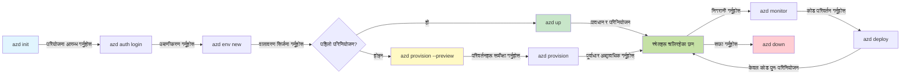

# AZD आधारभूत - Azure Developer CLI बुझ्नुहोस्

# AZD आधारभूत - मुख्य अवधारणाहरू र आधारभूत कुरा

**अध्याय नेभिगेसन:**
- **📚 Course Home**: [AZD For Beginners](../../README.md)
- **📖 Current Chapter**: अध्याय 1 - आधार र द्रुत सुरुवात
- **⬅️ Previous**: [Course Overview](../../README.md#-chapter-1-foundation--quick-start)
- **➡️ Next**: [Installation & Setup](installation.md)
- **🚀 Next Chapter**: [Chapter 2: AI-First Development](../chapter-02-ai-development/microsoft-foundry-integration.md)

## परिचय

यस पाठले तपाईंलाई Azure Developer CLI (azd) सँग परिचित गराउँछ, जुन एक शक्तिशाली कमाण्ड-लाइन उपकरण हो जसले स्थानीय विकासबाट Azure मा डिप्लोयमेन्टसम्मको यात्रा तिब्र बनाउँछ। यहाँ तपाईंले आधारभूत अवधारणाहरू, प्रमुख सुविधाहरू सिक्नुहुनेछ र कसरी azd ले क्लाउड-नेटिभ अनुप्रयोग डिप्लोयमेन्टलाई सरल बनाउँछ भन्ने बुझ्नुहुनेछ।

## सिकाइ लक्ष्यहरू

यस पाठको अन्त्यमा, तपाईं:
- Azure Developer CLI के हो र यसको मुख्य उद्देश्य के हो भनी बुझ्ने
- टेम्पलेटहरू, वातावरणहरू, र सेवाहरूका मुख्य अवधारणाहरू सिक्ने
- टेम्पलेट-ड्राइभन विकास र Infrastructure as Code जस्ता प्रमुख सुविधाहरू अन्वेषण गर्ने
- azd परियोजना संरचना र कार्यप्रवाह बुझ्ने
- आफ्नो विकास वातावरणका लागि azd स्थापना र कन्फिगर गर्न तयार हुने

## सिकाइ नतिजाहरू

यो पाठ पूरा गरेपछि, तपाईं सक्षम हुनुहुनेछ:
- आधुनिक क्लाउड विकास कार्यप्रवाहमा azd को भूमिकालाई व्याख्या गर्ने
- azd परियोजना संरचनाका घटकहरू पहिचान गर्ने
- कसरी टेम्पलेटहरू, वातावरणहरू, र सेवाहरूले एकसाथ काम गर्छन् वर्णन गर्ने
- azd सँग Infrastructure as Code का फाइदाहरू बुझ्ने
- विभिन्न azd कमाण्डहरू र तिनीहरूको उद्देश्य पहिचान गर्ने

## Azure Developer CLI (azd) के हो?

Azure Developer CLI (azd) एक कमाण्ड-लाइन उपकरण हो जुन स्थानीय विकासबाट Azure मा डिप्लोयमेन्टसम्मको यात्रा तिब्र पार्न डिजाइन गरिएको हो। यसले Azure मा क्लाउड-नेटिभ अनुप्रयोगहरू तयार पार्ने, डिप्लोय गर्ने, र व्यवस्थापन गर्ने प्रक्रियालाई सरल बनाउँछ।

### 🎯 किन AZD प्रयोग गर्ने? एक वास्तविक–विश्व तुलना

साधारण वेब एप र डेटाबेस डिप्लोय गर्ने कुरालाई तुलना गरौं:

#### ❌ AZD बिना: म्यानुअल Azure डिप्लोयमेन्ट (30+ मिनेट)

```bash
# चरण 1: रिसोर्स समूह सिर्जना गर्नुहोस्
az group create --name myapp-rg --location eastus

# चरण 2: एप सर्भिस प्लान सिर्जना गर्नुहोस्
az appservice plan create --name myapp-plan \
  --resource-group myapp-rg \
  --sku B1 --is-linux

# चरण 3: वेब एप सिर्जना गर्नुहोस्
az webapp create --name myapp-web-unique123 \
  --resource-group myapp-rg \
  --plan myapp-plan \
  --runtime "NODE:18-lts"

# चरण 4: Cosmos DB खाता सिर्जना गर्नुहोस् (१०-१५ मिनेट)
az cosmosdb create --name myapp-cosmos-unique123 \
  --resource-group myapp-rg \
  --kind MongoDB

# चरण 5: डेटाबेस सिर्जना गर्नुहोस्
az cosmosdb mongodb database create \
  --account-name myapp-cosmos-unique123 \
  --resource-group myapp-rg \
  --name tododb

# चरण 6: संग्रह सिर्जना गर्नुहोस्
az cosmosdb mongodb collection create \
  --account-name myapp-cosmos-unique123 \
  --resource-group myapp-rg \
  --database-name tododb \
  --name todos

# चरण 7: कनेक्शन स्ट्रिङ प्राप्त गर्नुहोस्
CONN_STR=$(az cosmosdb keys list \
  --name myapp-cosmos-unique123 \
  --resource-group myapp-rg \
  --type connection-strings \
  --query "connectionStrings[0].connectionString" -o tsv)

# चरण 8: एप सेटिङहरू कन्फिगर गर्नुहोस्
az webapp config appsettings set \
  --name myapp-web-unique123 \
  --resource-group myapp-rg \
  --settings MONGODB_URI="$CONN_STR"

# चरण 9: लगिङ सक्षम गर्नुहोस्
az webapp log config --name myapp-web-unique123 \
  --resource-group myapp-rg \
  --application-logging filesystem \
  --detailed-error-messages true

# चरण 10: Application Insights सेटअप गर्नुहोस्
az monitor app-insights component create \
  --app myapp-insights \
  --location eastus \
  --resource-group myapp-rg

# चरण 11: App Insights लाई वेब एपसँग जोड्नुहोस्
INSTRUMENTATION_KEY=$(az monitor app-insights component show \
  --app myapp-insights \
  --resource-group myapp-rg \
  --query "instrumentationKey" -o tsv)

az webapp config appsettings set \
  --name myapp-web-unique123 \
  --resource-group myapp-rg \
  --settings APPINSIGHTS_INSTRUMENTATIONKEY="$INSTRUMENTATION_KEY"

# चरण 12: अनुप्रयोग स्थानीय रूपमा बनाउनुहोस्
npm install
npm run build

# चरण 13: डिप्लोयमेन्ट प्याकेज सिर्जना गर्नुहोस्
zip -r app.zip . -x "*.git*" "node_modules/*"

# चरण 14: अनुप्रयोग परिनियोजन गर्नुहोस्
az webapp deployment source config-zip \
  --resource-group myapp-rg \
  --name myapp-web-unique123 \
  --src app.zip

# चरण 15: पर्खनुहोस् र काम होस् भनेर प्राथना गर्नुहोस् 🙏
# (स्वचालित मान्यकरण छैन, म्यानुअल परीक्षण आवश्यक छ)
```

**समस्याहरू:**
- ❌ सम्झन र क्रमबद्ध रूपमा चलाउन 15+ कमाण्डहरू
- ❌ 30-45 मिनेटको म्यानुअल काम
- ❌ गल्ती गर्न सजिलो (टाइपो, गलत प्यारामिटर)
- ❌ कनेक्शन स्ट्रिङ्स टर्मिनल इतिहासमा खुल्ला रहन्छन्
- ❌ केही असफल भएमा स्वचालित रोलब्याक हुँदैन
- ❌ टोली सदस्यहरूको लागि दोहोर्याउन कठिन
- ❌ प्रत्येक पटक फरक हुन्छ (फेरि उत्पादित गर्न सकिंदैन)

#### ✅ AZD सँग: स्वचालित डिप्लोयमेन्ट (5 कमाण्ड, 10-15 मिनेट)

```bash
# चरण 1: टेम्पलेटबाट आरम्भ गर्नुहोस्
azd init --template todo-nodejs-mongo

# चरण 2: प्रमाणिकरण गर्नुहोस्
azd auth login

# चरण 3: वातावरण सिर्जना गर्नुहोस्
azd env new dev

# चरण 4: परिवर्तनहरूको पूर्वावलोकन गर्नुहोस् (वैकल्पिक तर सिफारिस गरिन्छ)
azd provision --preview

# चरण 5: सबै तैनाथ गर्नुहोस्
azd up

# ✨ सम्पन्न! सबै कुरा तैनाथ, कन्फिगर र अनुगमन गरिएको छ
```

**फाइदाहरू:**
- ✅ **5 कमाण्ड** बनाम 15+ म्यानुअल चरणहरू
- ✅ **10-15 मिनेट** कुल समय (प्रमुखतया Azure को प्रतीक्षामा)
- ✅ **शून्य त्रुटि** - स्वचालित र परीक्षण गरिएको
- ✅ **सीक्रेटहरू सुरक्षित रूपमा व्यवस्थापन** गरिन्छ via Key Vault
- ✅ **स्वचालित रोलब्याक** असफलतामा
- ✅ **पूर्ण रूपमा पुनरुत्पादनयोग्य** - हरेक पटक एउटै परिणाम
- ✅ **टीम-तैयार** - कोही पनि एउटै कमाण्डहरू चलाएर डिप्लोय गर्न सक्छ
- ✅ **Infrastructure as Code** - संस्करण नियन्त्रणमा Bicep टेम्पलेटहरू
- ✅ **इनबिल्ट मनि्टरिङ** - Application Insights स्वतः कन्फिगर गरिन्छ

### 📊 समय र त्रुटि घटाउने

| Metric | Manual Deployment | AZD Deployment | Improvement |
|:-------|:------------------|:---------------|:------------|
| **Commands** | 15+ | 5 | 67% fewer |
| **Time** | 30-45 min | 10-15 min | 60% faster |
| **Error Rate** | ~40% | <5% | 88% reduction |
| **Consistency** | Low (manual) | 100% (automated) | Perfect |
| **Team Onboarding** | 2-4 hours | 30 minutes | 75% faster |
| **Rollback Time** | 30+ min (manual) | 2 min (automated) | 93% faster |

## मुख्य अवधारणाहरू

### टेम्पलेटहरू
टेम्पलेटहरू azd को आधार हुन्। तिनीहरूले समावेश गर्दछन्:
- **Application code** - तपाईँको सोर्स कोड र निर्भरता
- **Infrastructure definitions** - Bicep वा Terraform मा परिभाषित Azure स्रोतहरू
- **Configuration files** - सेटिङहरू र वातावरण भेरिएबलहरू
- **Deployment scripts** - स्वचालित डिप्लोयमेन्ट कार्यप्रवाहहरू

### वातावरणहरू
वातावरणहरू फरक डिप्लोयमेन्ट लक्षित स्थानहरू प्रतिनिधित्व गर्छन्:
- **Development** - परीक्षण र विकासको लागि
- **Staging** - प्रि-प्रोडक्सन वातावरण
- **Production** - प्रत्यक्ष उत्पादन वातावरण

प्रत्येक वातावरणले आफ्नै कायम गर्छ:
- Azure resource group
- कन्फिगरेसन सेटिङहरू
- डिप्लोयमेन्ट अवस्था

### सेवाहरू
सेवाहरू तपाईंको अनुप्रयोगका निर्माण ब्लकहरू हुन्:
- **Frontend** - वेब अनुप्रयोगहरू, SPAs
- **Backend** - API हरू, माइक्रोसर्भिसहरू
- **Database** - डाटा भण्डारण समाधानहरू
- **Storage** - फाइल र ब्लब स्टोरेज

## प्रमुख सुविधाहरू

### 1. Template-Driven Development
```bash
# उपलब्ध टेम्पलेटहरू हेर्नुहोस्
azd template list

# टेम्पलेटबाट आरम्भ गर्नुहोस्
azd init --template <template-name>
```

### 2. Infrastructure as Code
- **Bicep** - Azure को डोमेन-विशेष भाषा
- **Terraform** - बहु-क्लाउड इन्फ्रास्ट्रक्चर उपकरण
- **ARM Templates** - Azure Resource Manager टेम्पलेटहरू

### 3. Integrated Workflows
```bash
# पूर्ण परिनियोजन कार्यप्रवाह
azd up            # प्रावधान + परिनियोजन — यो पहिलो पटक सेटअपका लागि हस्तक्षेपविहीन छ

# 🧪 नयाँ: परिनियोजन भन्दा पहिले पूर्वाधार परिवर्तनहरूको पूर्वावलोकन गर्नुहोस् (सुरक्षित)
azd provision --preview    # परिवर्तन नगरी पूर्वाधार परिनियोजनको अनुकरण गर्नुहोस्

azd provision     # पूर्वाधार अपडेट गर्दा Azure स्रोतहरू सिर्जना गर्न यसलाई प्रयोग गर्नुहोस्
azd deploy        # अनुप्रयोग कोड परिनियोजन गर्नुहोस् वा अपडेट गरेपछि पुनः परिनियोजन गर्नुहोस्
azd down          # स्रोतहरू सफा गर्नुहोस्
```

#### 🛡️ Preview संग सुरक्षित इन्फ्रास्ट्रक्चर योजनाकरण
`azd provision --preview` कमाण्ड सुरक्षित डिप्लोयमेन्टका लागि गेम-चেঞ्जर हो:
- **Dry-run विश्लेषण** - के सिर्जना, परिवर्तन, वा मेटिनेछ देखाउँछ
- **शून्य जोखिम** - तपाईँको Azure वातावरणमा कुनै वास्तविक परिवर्तन हुँदैन
- **टोली सहयोग** - डिप्लोय अघि प्रिभ्यु नतिजाहरू साझा गर्न सकिन्छ
- **लागत अनुमान** - प्रतिवद्धता अघि स्रोत लागत बुझ्न सहयोग पुर्‍याउँछ

```bash
# उदाहरण पूर्वावलोकन कार्यप्रवाह
azd provision --preview           # के परिवर्तन हुनेछ हेर्नुहोस्
# आउटपुटको समीक्षा गर्नुहोस्, टोलीसँग छलफल गर्नुहोस्
azd provision                     # आत्मविश्वासका साथ परिवर्तनहरू लागू गर्नुहोस्
```

### 📊 भिजुअल: AZD विकास वर्कफ्लो


**वर्कफ्लो स्पष्टीकरण:**
1. **Init** - टेम्पलेटबाट वा नयाँ परियोजनाबाट सुरु गर्नुहोस्
2. **Auth** - Azure सँग प्रमाणीकरण गर्नुहोस्
3. **Environment** - अलग गरिएको डिप्लोयमेन्ट वातावरण बनाउनुहोस्
4. **Preview** - 🆕 सधैं पहिले इन्फ्रास्ट्रक्चर परिवर्तनहरू प्रिभ्यु गर्नुहोस् (सुरक्षित अभ्यास)
5. **Provision** - Azure स्रोतहरू सिर्जना/अपडेट गर्नुहोस्
6. **Deploy** - आफ्नो एप्लिकेशन कोड पठाउनुहोस्
7. **Monitor** - अनुप्रयोग प्रदर्शन अवलोकन गर्नुहोस्
8. **Iterate** - परिवर्तनहरू गर्नुहोस् र कोड पुन:डिप्लोय गर्नुहोस्
9. **Cleanup** - काम सकिएपछि स्रोतहरू हटाउनुहोस्

### 4. Environment Management
```bash
# वातावरणहरू सिर्जना र व्यवस्थापन गर्नुहोस्
azd env new <environment-name>
azd env select <environment-name>
azd env list
```

## 📁 परियोजना संरचना

एक सामान्य azd परियोजना संरचना:
```
my-app/
├── .azd/                    # azd configuration
│   └── config.json
├── .azure/                  # Azure deployment artifacts
├── .devcontainer/          # Development container config
├── .github/workflows/      # GitHub Actions
├── .vscode/               # VS Code settings
├── infra/                 # Infrastructure code
│   ├── main.bicep        # Main infrastructure template
│   ├── main.parameters.json
│   └── modules/          # Reusable modules
├── src/                  # Application source code
│   ├── api/             # Backend services
│   └── web/             # Frontend application
├── azure.yaml           # azd project configuration
└── README.md
```

## 🔧 कन्फिगरेसन फाइलहरू

### azure.yaml
The main project configuration file:
```yaml
name: my-awesome-app
metadata:
  template: my-template@1.0.0

services:
  web:
    project: ./src/web
    language: js
    host: appservice
  api:
    project: ./src/api
    language: js
    host: appservice

hooks:
  preprovision:
    shell: pwsh
    run: echo "Preparing to provision..."
```

### .azure/config.json
Environment-specific configuration:
```json
{
  "version": 1,
  "defaultEnvironment": "dev",
  "environments": {
    "dev": {
      "subscriptionId": "your-subscription-id",
      "location": "eastus"
    }
  }
}
```

## 🎪 सामान्य वर्कफ्लोहरू र व्यावहारिक अभ्यासहरू

> **💡 सिकाइ सुझाव:** आफ्नो AZD कौशल प्रगतिशील रूपमा निर्माण गर्न यी अभ्यासहरू क्रमबद्ध रूपमा अनुगमन गर्नुहोस्।

### 🎯 अभ्यास 1: आफ्नो पहिलो परियोजना सुरु गर्नुस्

**लक्ष्य:** एक AZD परियोजना सिर्जना गर्नुहोस् र यसको संरचनालाई अन्वेषण गर्नुहोस्

**स्टेपहरू:**
```bash
# प्रमाणित टेम्पलेट प्रयोग गर्नुहोस्
azd init --template todo-nodejs-mongo

# उत्पन्न फाइलहरू अन्वेषण गर्नुहोस्
ls -la  # लुकेका फाइलहरू समेत सबै फाइलहरू हेर्नुहोस्

# सिर्जना भएका मुख्य फाइलहरू:
# - azure.yaml (मुख्य कन्फिग)
# - infra/ (पूर्वाधार कोड)
# - src/ (अनुप्रयोग कोड)
```

**✅ Success:** तपाईंंसँग azure.yaml, infra/, र src/ निर्देशिकाहरू छन्

---

### 🎯 अभ्यास 2: Azure मा डिप्लोय गर्नुहोस्

**लक्ष्य:** इन-एन्ड-टु-इन डिप्लोयमेन्ट पूरा गर्नुहोस्

**स्टेपहरू:**
```bash
# 1. प्रमाणीकरण गर्नुहोस्
az login && azd auth login

# 2. वातावरण सिर्जना गर्नुहोस्
azd env new dev
azd env set AZURE_LOCATION eastus

# 3. परिवर्तनहरू पूर्वावलोकन गर्नुहोस् (सिफारिस गरिन्छ)
azd provision --preview

# 4. सबै तैनाथ गर्नुहोस्
azd up

# 5. परिनियोजन जाँच गर्नुहोस्
azd show    # आफ्नो एपको URL हेर्नुहोस्
```

**Expected Time:** 10-15 minutes  
**✅ Success:** एप्लिकेशन URL ब्राउजरमा खुल्छ

---

### 🎯 अभ्यास 3: बहु वातावरणहरू

**लक्ष्य:** dev र staging मा डिप्लोय गर्नुहोस्

**स्टेपहरू:**
```bash
# पहिले नै dev छ, staging सिर्जना गर्नुहोस्
azd env new staging
azd env set AZURE_LOCATION westus2
azd up

# उनीहरूबीच स्विच गर्नुहोस्
azd env list
azd env select dev
```

**✅ Success:** Azure Portal मा दुई अलग स्रोत समूहहरू

---

### 🛡️ क्लिन स्लेट: `azd down --force --purge`

जब तपाईंलाई पूर्ण रूपमा रिसेट गर्न आवश्यक हुन्छ:

```bash
azd down --force --purge
```

**यसले के गर्छ:**
- `--force`: कुनै पुष्टिकरण संकेतहरू छैनन्
- `--purge`: सबै स्थानीय अवस्था र Azure स्रोतहरू मेटाउँछ

**कहिले प्रयोग गर्ने:**
- डिप्लोयमेन्ट बीचमै असफल भयो भने
- परियोजनाहरू सर्नु परेमा
- नयाँ सुरुवात चाहिएको अवस्थामा

---

## 🎪 मूल वर्कफ्लो सन्दर्भ

### नयाँ परियोजना सुरु गर्दै
```bash
# विधि 1: विद्यमान टेम्पलेट प्रयोग गर्नुहोस्
azd init --template todo-nodejs-mongo

# विधि 2: शून्यबाट सुरु गर्नुहोस्
azd init

# विधि 3: वर्तमान निर्देशика प्रयोग गर्नुहोस्
azd init .
```

### विकास चक्र
```bash
# विकास वातावरण सेटअप गर्नुहोस्
azd auth login
azd env new dev
azd env select dev

# सबै तैनाथ गर्नुहोस्
azd up

# परिवर्तन गर्नुहोस् र फेरि तैनाथ गर्नुहोस्
azd deploy

# काम सकिएपछि सफा गर्नुहोस्
azd down --force --purge # Azure Developer CLI मा रहेको कमाण्ड तपाईंको वातावरणका लागि एक 'हार्ड रिसेट' जस्तै हो—विशेष गरी जब तपाईं असफल तैनाथीहरूको समस्या निवारण गर्दै हुनुहुन्छ, परित्यक्त स्रोतहरू सफा गर्दै हुनुहुन्छ, वा नयाँ पुनःतैनाथीको लागि तयारी गर्दै हुनुहुन्छ
```

## `azd down --force --purge` बुझ्न

`azd down --force --purge` कमाण्ड तपाईंको azd वातावरण र सबै सम्बन्धित स्रोतहरू पूर्ण रूपमा हटाउनका लागि शक्तिशाली तरिका हो। प्रत्येक फ्ल्यागले के गर्छ भन्ने सम्बन्धमा तल विश्लेषण छ:
```
--force
```
- पुष्टिकरण प्रम्प्टहरू छोड्छ।
- स्वच automatisation वा स्क्रिप्टिङका लागि उपयोगी जहाँ म्यानुअल इनपुट सम्भव छैन।
- CLI ले असंगतता पत्ता लगाए पनि teardown अवरोध बिना अघि बढ्न सुनिश्चित गर्छ।

```
--purge
```
**सबै सम्बन्धित मेटाडाटा हटाउँछ**, जसमा समावेश छन्:
- Environment state
- स्थानीय `.azure` फोल्डर
- क्याश गरिएको deployment जानकारी
- azd लाई पहिलाका डिप्लोयमेन्टहरू "स्मरण" गर्नबाट रोक्छ, जसले mismatched resource groups वा stale registry references जस्ता समस्याहरू निम्त्याउन सक्छ।

### किन दुवै प्रयोग गर्ने?
जब तपाइँ `azd up` सँग बाँकी रहेको अवस्था वा आंशिक डिप्लोयमेन्टका कारण अड्किनुभयो भने, यो संयोजनले **सफा सुरूवात** सुनिश्चित गर्छ।

यो विशेष गरी Azure पोर्टलमा म्यानुअल रूपमा स्रोतहरू मेटाएपछि वा टेम्पलेटहरू, वातावरणहरू, वा resource group नामकरण कन्वेन्सनहरू परिवर्तन गर्दा उपयोगी हुन्छ।

### बहु वातावरणहरूको व्यवस्थापन
```bash
# स्टेजिङ वातावरण सिर्जना गर्नुहोस्
azd env new staging
azd env select staging
azd up

# विकास वातावरणमा फर्किनुहोस्
azd env select dev

# वातावरणहरू तुलना गर्नुहोस्
azd env list
```

## 🔐 प्रमाणीकरण र प्रमाणपत्रहरू

प्रमाणीकरण बुझ्नु azd डिप्लोयमेन्ट सफल बनाउन अत्यन्त महत्वपूर्ण छ। Azure ले बहु प्रमाणीकरण विधिहरू प्रयोग गर्छ, र azd ले अरू Azure उपकरणहरूले प्रयोग गर्ने उही क्रेडेन्सियल चेन प्रयोग गर्छ।

### Azure CLI Authentication (`az login`)

azd प्रयोग गर्नु अघि, तपाईंले Azure सँग प्रमाणीकरण गर्न आवश्यक छ। सबैभन्दा सामान्य विधि Azure CLI को प्रयोग हो:

```bash
# इन्टरेक्टिभ लगइन (ब्राउजर खुल्छ)
az login

# विशिष्ट टेनेन्टसँग लगइन
az login --tenant <tenant-id>

# सर्भिस प्रिन्सिपलसँग लगइन
az login --service-principal -u <app-id> -p <password> --tenant <tenant-id>

# हालको लगइन स्थिति जाँच्नुहोस्
az account show

# उपलब्ध सदस्यताहरू सूचीबद्ध गर्नुहोस्
az account list --output table

# पूर्वनिर्धारित सदस्यता सेट गर्नुहोस्
az account set --subscription <subscription-id>
```

### Authentication Flow
1. **Interactive Login**: प्रमाणीकरणका लागि तपाइँको डिफल्ट ब्राउजर खोलिन्छ
2. **Device Code Flow**: ब्राउजर पहुँच नभएको वातावरणका लागि
3. **Service Principal**: स्वचालन र CI/CD परिदृश्यका लागि
4. **Managed Identity**: Azure-होस्टेड अनुप्रयोगहरूको लागि

### DefaultAzureCredential Chain

`DefaultAzureCredential` एउटा क्रेडेन्सियल प्रकार हो जुन स्वतः रूपमा विशेष क्रममा बहु क्रेडेन्सियल स्रोतहरू प्रयास गरेर सरल प्रमाणीकरण अनुभव प्रदान गर्छ:

#### Credential Chain Order
```mermaid
graph TD
    A[पूर्वनिर्धारित Azure प्रमाणपत्र] --> B[पर्यावरण चरहरू]
    B --> C[वर्कलोड पहिचान]
    C --> D[प्रबन्धित पहिचान]
    D --> E[भिजुअल स्टुडियो]
    E --> F[भिजुअल स्टुडियो कोड]
    F --> G[Azure CLI (कमाण्ड-लाइन इन्टरफेस)]
    G --> H[Azure पावरशेल]
    H --> I[इन्टरएक्टिभ ब्राउजर]
```
#### 1. Environment Variables
```bash
# सर्भिस प्रिन्सिपलका लागि वातावरण चरहरू सेट गर्नुहोस्
export AZURE_CLIENT_ID="<app-id>"
export AZURE_CLIENT_SECRET="<password>"
export AZURE_TENANT_ID="<tenant-id>"
```

#### 2. Workload Identity (Kubernetes/GitHub Actions)
स्वचालित रूपमा प्रयोग हुने स्थानहरू:
- Azure Kubernetes Service (AKS) with Workload Identity
- GitHub Actions with OIDC federation
- अन्य फेडेरेटेड आइडेन्टिटी परिदृश्यहरू

#### 3. Managed Identity
Azure स्रोतहरू जस्तै:
- Virtual Machines
- App Service
- Azure Functions
- Container Instances

```bash
# प्रबन्धित पहिचान भएको Azure स्रोतमा चलिरहेको छ कि छैन जाँच गर्नुहोस्
az account show --query "user.type" --output tsv
# फिर्ता गर्छ: "servicePrincipal" यदि प्रबन्धित पहिचान प्रयोग भइरहेको छ
```

#### 4. Developer Tools Integration
- **Visual Studio**: साइन-इन गरिएको खाताको स्वचालित प्रयोग
- **VS Code**: Azure Account एक्सटेन्सन क्रेडेन्सियल प्रयोग गर्छ
- **Azure CLI**: `az login` क्रेडेन्सियल प्रयोग गर्छ (स्थानीय विकासका लागि सबैभन्दा सामान्य)

### AZD प्रमाणीकरण सेटअप

```bash
# विधि 1: Azure CLI प्रयोग गर्नुहोस् (विकासको लागि सिफारिस गरिएको)
az login
azd auth login  # अस्तित्वमा रहेका Azure CLI प्रमाणपत्रहरू प्रयोग गर्दछ

# विधि 2: प्रत्यक्ष azd प्रमाणीकरण
azd auth login --use-device-code  # हेडलेस वातावरणहरूका लागि

# विधि 3: प्रमाणीकरण स्थिति जाँच गर्नुहोस्
azd auth login --check-status

# विधि 4: लगआउट गर्नुहोस् र पुनः प्रमाणीकरण गर्नुहोस्
azd auth logout
azd auth login
```

### प्रमाणीकरणका राम्रो अभ्यासहरू

#### स्थानीय विकासका लागि
```bash
# 1. Azure CLI बाट लगइन गर्नुहोस्
az login

# 2. सही सदस्यता जाँच गर्नुहोस्
az account show
az account set --subscription "Your Subscription Name"

# 3. विद्यमान प्रमाणपत्रहरूसँग azd प्रयोग गर्नुहोस्
azd auth login
```

#### CI/CD पाइपलाइनहरूका लागि
```yaml
# GitHub Actions example
- name: Azure Login
  uses: azure/login@v1
  with:
    creds: ${{ secrets.AZURE_CREDENTIALS }}

- name: Deploy with azd
  run: |
    azd auth login --client-id ${{ secrets.AZURE_CLIENT_ID }} \
                    --client-secret ${{ secrets.AZURE_CLIENT_SECRET }} \
                    --tenant-id ${{ secrets.AZURE_TENANT_ID }}
    azd up --no-prompt
```

#### उत्पादन वातावरणका लागि
- Azure स्रोतहरूमा चलाउँदा **Managed Identity** प्रयोग गर्नुहोस्
- स्वचालन परिदृश्यका लागि **Service Principal** प्रयोग गर्नुहोस्
- कोड वा कन्फिगरेसन फाइलहरूमा प्रमाणपत्रहरू भण्डारण नगर्नुहोस्
- संवेदनशील कन्फिगरेसनको लागि **Azure Key Vault** प्रयोग गर्नुहोस्

### सामान्य प्रमाणीकरण समस्याहरू र समाधानहरू

#### समस्या: "No subscription found"
```bash
# समाधान: पूर्वनिर्धारित सदस्यता सेट गर्नुहोस्
az account list --output table
az account set --subscription "<subscription-id>"
azd env set AZURE_SUBSCRIPTION_ID "<subscription-id>"
```

#### समस्या: "Insufficient permissions"
```bash
# समाधान: आवश्यक भूमिकाहरू जाँचेर तोक्नुहोस्
az role assignment list --assignee $(az account show --query user.name --output tsv)

# सामान्य आवश्यक भूमिकाहरू:
# - Contributor (स्रोत व्यवस्थापनका लागि)
# - User Access Administrator (भूमिका तोक्नका लागि)
```

#### समस्या: "Token expired"
```bash
# समाधान: पुनः प्रमाणीकरण गर्नुहोस्
az logout
az login
azd auth logout
azd auth login
```

### विभिन्न परिदृश्यहरूमा प्रमाणीकरण

#### स्थानीय विकास
```bash
# व्यक्तिगत विकास खाता
az login
azd auth login
```

#### टोली विकास
```bash
# संगठनका लागि विशिष्ट टेनन्ट प्रयोग गर्नुहोस्
az login --tenant contoso.onmicrosoft.com
azd auth login
```

#### बहु-टेनेन्ट परिदृश्यहरू
```bash
# टेनेन्टहरू बीच स्विच गर्नुहोस्
az login --tenant tenant1.onmicrosoft.com
# टेनेन्ट 1 मा परिनियोजन गर्नुहोस्
azd up

az login --tenant tenant2.onmicrosoft.com  
# टेनेन्ट 2 मा परिनियोजन गर्नुहोस्
azd up
```

### सुरक्षा सम्बन्धी विचारहरू

1. **क्रेडेन्सियल भण्डारण**: कहिल्यै क्रेडेन्सियलहरू सोर्स कोडमा भण्डारण नगर्नुहोस्
2. **स्कोप सीमित गर्नुहोस्**: सेवा प्रिन्सिपलहरूका लागि न्यूनतम-अधिकार सिद्धान्त प्रयोग गर्नुहोस्
3. **टोकन रोटेशन**: सेवा प्रिन्सिपल सिक्रेटहरू नियमित रूपमा रोटेट गर्नुहोस्
4. **अडिट ट्रेल**: प्रमाणीकरण र डिप्लोयमेन्ट गतिविधिहरू अनुगमन गर्नुहोस्
5. **नेटवर्क सुरक्षा**: सम्भव भएसम्म निजी अन्तबिन्दुहरू प्रयोग गर्नुहोस्

### प्रमाणीकरण समस्याहरू समाधान गर्ने

```bash
# प्रमाणीकृत समस्याहरू डीबग गर्नुहोस्
azd auth login --check-status
az account show
az account get-access-token

# सामान्य निदान आदेशहरू
whoami                          # हालको प्रयोगकर्ता सन्दर्भ
az ad signed-in-user show      # Azure AD प्रयोगकर्ता विवरणहरू
az group list                  # संसाधन पहुँच परीक्षण गर्नुहोस्
```

## `azd down --force --purge` बुझ्न

### Discovery
```bash
azd template list              # टेम्पलेटहरू ब्राउज़ गर्नुहोस्
azd template show <template>   # टेम्पलेट विवरण
azd init --help               # प्रारम्भिक विकल्पहरू
```

### परियोजना व्यवस्थापन
```bash
azd show                     # परियोजना अवलोकन
azd env show                 # हालको वातावरण
azd config list             # कन्फिगरेसन सेटिङहरू
```

### मनि्टरिङ
```bash
azd monitor                  # Azure पोर्टलको निगरानी खोल्नुहोस्
azd monitor --logs           # अनुप्रयोग लगहरू हेर्नुहोस्
azd monitor --live           # प्रत्यक्ष मेट्रिक्स हेर्नुहोस्
azd pipeline config          # CI/CD सेटअप गर्नुहोस्
```

## उत्तम अभ्यासहरू

### 1. अर्थपूर्ण नामहरू प्रयोग गर्नुहोस्
```bash
# राम्रो
azd env new production-east
azd init --template web-app-secure

# टार्नुहोस्
azd env new env1
azd init --template template1
```

### 2. टेम्पलेटहरूको प्रयोग गर्नुहोस्
- अस्तित्वमा रहेका टेम्पलेटबाट सुरु गर्नुहोस्
- आफ्नो आवश्यकताका लागि अनुकूलित गर्नुहोस्
- आफ्नो संगठनका लागि पुन:प्रयोगयोग्य टेम्पलेटहरू सिर्जना गर्नुहोस्

### 3. वातावरण अलग्गै राख्नुहोस्
- dev/staging/prod का लागि अलग वातावरण प्रयोग गर्नुहोस्
- स्थानीय मेशिनबाट सिधै production मा डिप्लोय नगर्नुहोस्
- production डिप्लोयमेन्टहरूका लागि CI/CD पाइपलाइनहरू प्रयोग गर्नुहोस्

### 4. कन्फिगरेसन व्यवस्थापन
- संवेदनशील डाटा लागि वातावरण भेरिएबलहरू प्रयोग गर्नुहोस्
- कन्फिगरेसनलाई संस्करण नियन्त्रणमा राख्नुहोस्
- वातावरण-विशिष्ट सेटिङहरूको दस्तावेजीकरण गर्नुहोस्

## सिकाइ प्रगतिशीलता

### Beginner (सप्ताह 1-2)
1. azd स्थापना गर्नुहोस् र प्रमाणीकरण गर्नुहोस्
2. सरल टेम्पलेट डिप्लोय गर्नुहोस्
3. परियोजना संरचना बुझ्नुहोस्
4. आधारभूत कमाण्डहरू सिक्नुहोस् (up, down, deploy)

### Intermediate (सप्ताह 3-4)
1. टेम्पलेटहरू अनुकूलन गर्नुहोस्
2. बहु वातावरण व्यवस्थापन गर्नुहोस्
3. Infrastructure कोड बुझ्नुहोस्
4. CI/CD पाइपलाइनहरू सेटअप गर्नुहोस्

### Advanced (सप्ताह 5+)
1. कस्टम टेम्पलेटहरू सिर्जना गर्नुहोस्
2. उन्नत इन्फ्रास्ट्रक्चर ढाँचा
3. बहु-क्षेत्र डिप्लोयमेन्टहरू
4. एन्त्रप्राइज-ग्रेड कन्फिगरेसनहरू

## अर्को कदम

**📖 Continue Chapter 1 Learning:**
- [स्थापना र सेटअप](installation.md) - azd इन्स्टल र कन्फिगर गर्नुहोस्
- [तपाईंको पहिलो परियोजना](first-project.md) - पूर्ण व्यावहारिक ट्यूटोरियल
- [कन्फिगरेसन गाइड](configuration.md) - उन्नत कन्फिगरेसन विकल्पहरू

**🎯 अर्को अध्यायका लागि तयार?**
- [अध्याय 2: AI-प्रथम विकास](../chapter-02-ai-development/microsoft-foundry-integration.md) - AI अनुप्रयोगहरू बनाउन सुरु गर्नुहोस्

## थप स्रोतहरू

- [Azure Developer CLI अवलोकन](https://learn.microsoft.com/en-us/azure/developer/azure-developer-cli/)
- [टेम्पलेट ग्यालरी](https://azure.github.io/awesome-azd/)
- [समुदाय नमूनाहरू](https://github.com/Azure-Samples)

---

## 🙋 प्राय: सोधिने प्रश्नहरू

### सामान्य प्रश्नहरू

**Q: AZD र Azure CLI बीच के फरक छ?**

A: Azure CLI (`az`) व्यक्तिगत Azure स्रोतहरू व्यवस्थापन गर्नका लागि हो। AZD (`azd`) सम्पूर्ण अनुप्रयोगहरू व्यवस्थापन गर्नका लागि हो:

```bash
# Azure CLI - निम्न-स्तरीय संसाधन व्यवस्थापन
az webapp create --name myapp --resource-group rg
az sql server create --name myserver --resource-group rg
# ...थप धेरै आदेशहरू आवश्यक

# AZD - अनुप्रयोग-स्तरीय व्यवस्थापन
azd up  # सबै संसाधनहरूसहित सम्पूर्ण अनुप्रयोग परिनियोजन गर्दछ
```

**यसरी सोच्नुहोस्:**
- `az` = व्यक्तिगत Lego ईंटहरूमा काम गर्नु
- `azd` = पूरा Lego सेटहरूसँग काम गर्नु

---

**Q: AZD प्रयोग गर्न Bicep वा Terraform जान्न आवश्यक छ?**

A: होईन! टेम्पलेटबाट सुरु गर्नुहोस्:
```bash
# अवस्थित टेम्पलेट प्रयोग गर्नुहोस् - IaC सम्बन्धी ज्ञान आवश्यक छैन
azd init --template todo-nodejs-mongo
azd up
```

तपाईं पछि Bicep सिकेर पूर्वाधार अनुकूलन गर्न सक्नुहुन्छ। टेम्पलेटहरूले सिक्नका लागि काम गर्ने उदाहरणहरू प्रदान गर्छन्।

---

**Q: AZD टेम्पलेटहरू चलाउन कति खर्च हुन्छ?**

A: लागत टेम्पलेटअनुसार फरक हुन्छ। अधिकांश विकास टेम्पलेटहरूको लागत $50-150/महिना हुन्छ:

```bash
# तैनाथ गर्नु अघि लागतहरू पूर्वावलोकन गर्नुहोस्
azd provision --preview

# प्रयोग नगर्दा सधैं सफा गर्नुहोस्
azd down --force --purge  # सबै स्रोतहरू हटाउँछ
```

**प्रो टिप:** जहाँ उपलब्ध छ त्यहाँ निःशुल्क तहहरू प्रयोग गर्नुहोस्:
- App Service: F1 (Free) tier
- Azure OpenAI: 50,000 tokens/month free
- Cosmos DB: 1000 RU/s free tier

---

**Q: के म अवस्थित Azure स्रोतहरूसँग AZD प्रयोग गर्न सक्छु?**

A: हो, तर नयाँबाट सुरु गर्न सजिलो हुन्छ। AZD ले पूरा लाइफसाइकल व्यवस्थापन गर्दा उत्तम काम गर्छ। अवस्थित स्रोतहरूका लागि:

```bash
# विकल्प 1: अवस्थित स्रोतहरू आयात गर्नुहोस् (उन्नत)
azd init
# त्यसपछि infra/ लाई अवस्थित स्रोतहरूलाई सन्दर्भ गर्ने गरी संशोधन गर्नुहोस्

# विकल्प 2: नयाँबाट सुरु गर्नुहोस् (सिफारिस गरिएको)
azd init --template matching-your-stack
azd up  # नयाँ वातावरण सिर्जना गर्दछ
```

---

**Q: म आफ्नो परियोजना टोलीसँग कसरी साझा गर्छु?**

A: AZD परियोजनालाई Git मा कमिट गर्नुहोस् (तर .azure फोल्डरलाई कमिट नगर्नुहोस्):

```bash
# पहिले नै .gitignore मा डिफल्ट रूपमा छ
.azure/        # गोप्य जानकारी र वातावरण सम्बन्धी डाटा समावेश गर्छ
*.env          # वातावरण चरहरू

# त्यसपछि टोलीका सदस्यहरू:
git clone <your-repo>
azd auth login
azd env new <their-name>-dev
azd up
```

सबैले त्यस्तै टेम्पलेटबाट समान पूर्वाधार पाउँछन्।

---

### समस्या निवारण प्रश्नहरू

**Q: "azd up" आधा बाट विफल भयो। म के गरूँ?**

A: त्रुटि जाँच गर्नुहोस्, सुधार गर्नुहोस्, अनि फेरि प्रयास गर्नुहोस्:

```bash
# विस्तृत लगहरू हेर्नुहोस्
azd show

# सामान्य समाधानहरू:

# 1. यदि कोटा नाघिएको छ भने:
azd env set AZURE_LOCATION "westus2"  # अर्को क्षेत्र प्रयोग गर्नुहोस्

# 2. यदि स्रोत नाममा टकराव छ भने:
azd down --force --purge  # नयाँ सुरुवात गर्नुहोस्
azd up  # फेरि प्रयास गर्नुहोस्

# 3. यदि प्रमाणीकरण म्याद सकियो भने:
az login
azd auth login
azd up
```

**सबैभन्दा सामान्य समस्या:** गलत Azure सब्स्क्रिप्शन चयन गरिएको छ
```bash
az account list --output table
az account set --subscription "<correct-subscription>"
```

---

**Q: पुनःप्राविधान नगरी केवल कोड परिवर्तनहरू कसरी तैनाथ गर्ने?**

A: `azd up` को सट्टा `azd deploy` प्रयोग गर्नुहोस्:

```bash
azd up          # पहिलो पटक: सेटअप + परिनियोजन (धीमा)

# कोडमा परिवर्तन गर्नुहोस्...

azd deploy      # पछिल्ला पटकहरू: केवल परिनियोजन (छिटो)
```

गति तुलना:
- `azd up`: 10-15 मिनेट (पूर्वाधार प्रावधान गर्दछ)
- `azd deploy`: 2-5 मिनेट (केवल कोड)

---

**Q: के म पूर्वाधार टेम्पलेटहरू अनुकूलन गर्न सक्छु?**

A: हो! `infra/` भित्र Bicep फाइलहरू सम्पादन गर्नुहोस्:

```bash
# azd init पछि
cd infra/
code main.bicep  # VS Code मा सम्पादन गर्नुहोस्

# परिवर्तनहरू पूर्वावलोकन गर्नुहोस्
azd provision --preview

# परिवर्तनहरू लागू गर्नुहोस्
azd provision
```

**सुझाव:** सानोबाट सुरु गर्नुहोस् - सबैभन्दा पहिले SKU परिवर्तन गर्नुहोस्:
```bicep
// infra/main.bicep
sku: {
  name: 'B1'  // Change to 'P1V2' for production
}
```

---

**Q: AZD ले बनाएको सबै कुरा कसरी मेटाउने?**

A: एउटा कमाण्डले सबै स्रोतहरू हटाउँछ:

```bash
azd down --force --purge

# यसले निम्न कुराहरू मेटाउँछ:
# - सबै Azure स्रोतहरू
# - स्रोत समूह
# - स्थानीय वातावरण स्थिति
# - क्यास गरिएको तैनाती डाटा
```

**सधैं यो चलाउनुहोस् जब:**
- टेम्पलेट परीक्षण समाप्त भएको बेला
- फरक परियोजनामा सर्नु परेमा
- नयाँबाट सुरु गर्न चाहनुहुन्छ भने

**लागत बचत:** प्रयोग नगरिएका स्रोतहरू मेटाउँदा = $0 चार्ज

---

**Q: यदि मैले गल्तीले Azure Portal मा स्रोतहरू मेटेँ भने के हुन्छ?**

A: AZD को स्थिति असिङक हुन सक्छ। सफा सुरुवातका लागि यो विधि अपनाउनुहोस्:

```bash
# 1. स्थानीय अवस्था हटाउनुहोस्
azd down --force --purge

# 2. नयाँबाट सुरु गर्नुहोस्
azd up

# वैकल्पिक: AZD लाई पत्ता लगाएर सुधार गर्न दिनुहोस्
azd provision  # अनुपस्थित स्रोतहरू सिर्जना गर्नेछ
```

---

### उन्नत प्रश्नहरू

**Q: के म CI/CD पाइपलाइनहरूमा AZD प्रयोग गर्न सक्छु?**

A: हो! GitHub Actions उदाहरण:

```yaml
# .github/workflows/deploy.yml
name: Deploy with AZD

on:
  push:
    branches: [main]

jobs:
  deploy:
    runs-on: ubuntu-latest
    steps:
      - uses: actions/checkout@v2
      
      - name: Install azd
        run: curl -fsSL https://aka.ms/install-azd.sh | bash
      
      - name: Azure Login
        run: |
          azd auth login \
            --client-id ${{ secrets.AZURE_CLIENT_ID }} \
            --client-secret ${{ secrets.AZURE_CLIENT_SECRET }} \
            --tenant-id ${{ secrets.AZURE_TENANT_ID }}
      
      - name: Deploy
        run: azd up --no-prompt
```

---

**Q: म गोप्य र संवेदनशील डाटा कसरी ह्यान्डल गर्ने?**

A: AZD स्वचालित रूपमा Azure Key Vault सँग एकीकृत हुन्छ:

```bash
# गोप्य विवरणहरू Key Vault मा भण्डारण गरिन्छन्, कोडमा होइन
azd env set DATABASE_PASSWORD "$(openssl rand -base64 32)"

# AZD स्वचालित रूपमा:
# 1. Key Vault सिर्जना गर्छ
# 2. गोप्य विवरण भण्डारण गर्छ
# 3. Managed Identity मार्फत एपलाई पहुँच दिन्छ
# 4. रनटाइममा इन्जेक्ट गर्छ
```

**कहिल्यै कमिट नगर्नुहोस्:**
- `.azure/` फोल्डर (वातावरण/इनभाइरोन्मेन्ट डेटा समावेश)
- `.env` फाइलहरू (स्थानीय गोप्य जानकारी)
- कनेक्शन स्ट्रिङहरू

---

**Q: के म एकैपटक धेरै क्षेत्रहरूमा डिप्लोय गर्न सक्छु?**

A: हो, प्रत्येक क्षेत्रमा अलग environment सिर्जना गर्नुहोस्:

```bash
# पूर्वी अमेरिकी परिवेश
azd env new prod-eastus
azd env set AZURE_LOCATION eastus
azd up

# पश्चिमी युरोप परिवेश
azd env new prod-westeurope
azd env set AZURE_LOCATION westeurope
azd up

# प्रत्येक परिवेश स्वतन्त्र छ
azd env list
```

साँचो बहु-क्षेत्र अनुप्रयोगहरूका लागि, एकैसाथ धेरै क्षेत्रहरूमा तैनाथ गर्न Bicep टेम्पलेटहरू अनुकूलन गर्नुहोस्।

---

**Q: यदि म अड्किए भने कहाँ मद्दत पाउन सक्छु?**

1. **AZD डकुमेन्टेशन:** https://learn.microsoft.com/azure/developer/azure-developer-cli/
2. **GitHub Issues:** https://github.com/Azure/azure-dev/issues
3. **Discord:** [Azure Discord](https://discord.gg/microsoft-azure) - #azure-developer-cli च्यानल
4. **Stack Overflow:** ट्याग `azure-developer-cli`
5. **यो कोर्स:** [समस्या निवारण मार्गदर्शक](../chapter-07-troubleshooting/common-issues.md)

**प्रो टिप:** सोध्नु अघि, चलाउनुहोस्:
```bash
azd show       # हालको अवस्था देखाउँछ
azd version    # तपाईंको संस्करण देखाउँछ
```
छिटो मद्दतका लागि आफ्नो प्रश्नमा यी जानकारी समावेश गर्नुहोस्।

---

## 🎓 अब के?

अब तपाईंले AZD का आधारभूत कुराहरू बुझ्नुभएको छ। आफ्नो बाटो छान्नुहोस्:

### 🎯 शुरुवातीहरूका लागि:
1. **अर्को:** [स्थापना र सेटअप](installation.md) - आफ्नो मेशिनमा AZD स्थापना गर्नुहोस्
2. **त्यसपछि:** [तपाईंको पहिलो परियोजना](first-project.md) - आफ्नो पहिलो अनुप्रयोग डिप्लोय गर्नुहोस्
3. **अभ्यास:** यस पाठका सबै 3 अभ्यासहरू पूरा गर्नुहोस्

### 🚀 AI विकासकर्ताहरूका लागि:
1. **सिधै जानुहोस्:** [अध्याय 2: AI-प्रथम विकास](../chapter-02-ai-development/microsoft-foundry-integration.md)
2. **तैनाथ गर्नुहोस्:** `azd init --template get-started-with-ai-chat` बाट सुरु गर्नुहोस्
3. **सिक्नुहोस्:** तैनाथ गर्दा निर्माण गर्नुहोस्

### 🏗️ अनुभवी विकासकर्ताहरूका लागि:
1. **पुनरावलोकन:** [कन्फिगरेसन गाइड](configuration.md) - उन्नत सेटिङहरू
2. **अन्वेषण:** [पूर्वाधारलाई कोडको रूपमा](../chapter-04-infrastructure/provisioning.md) - Bicep गहिराइमा
3. **निर्माण गर्नुहोस्:** आफ्नो स्ट्याकका लागि कस्टम टेम्पलेटहरू सिर्जना गर्नुहोस्

---

**अध्याय नेभिगेसन:**
- **📚 कोर्स होम**: [AZD For Beginners](../../README.md)
- **📖 हालको अध्याय**: अध्याय 1 - आधारशिला र छिटो सुरुवात  
- **⬅️ अघिल्लो**: [कोर्स अवलोकन](../../README.md#-chapter-1-foundation--quick-start)
- **➡️ अर्को**: [स्थापना र सेटअप](installation.md)
- **🚀 अर्को अध्याय**: [अध्याय 2: AI-प्रथम विकास](../chapter-02-ai-development/microsoft-foundry-integration.md)

---

<!-- CO-OP TRANSLATOR DISCLAIMER START -->
अस्वीकरण:
यो दस्तावेज AI अनुवाद सेवा [Co-op Translator](https://github.com/Azure/co-op-translator) प्रयोग गरी अनुवाद गरिएको हो। हामी शुद्धताका लागि प्रयासरत छौँ, तर कृपया ध्यान दिनुहोस् कि स्वचालित अनुवादमा त्रुटि वा असङ्गतता हुनसक्छ। यस दस्तावेजको मूल भाषामा रहेको मूल प्रतिलिपिलाई नै आधिकारिक स्रोत मान्नुहोला। महत्वपूर्ण जानकारीको लागि पेशेवर मानव अनुवाद सिफारिस गरिन्छ। यस अनुवादको प्रयोगबाट उत्पन्न हुने कुनै पनि भ्रम वा गलत व्याख्याका लागि हामी जिम्मेवार छैनौँ।
<!-- CO-OP TRANSLATOR DISCLAIMER END -->