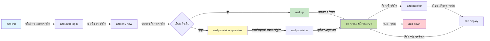
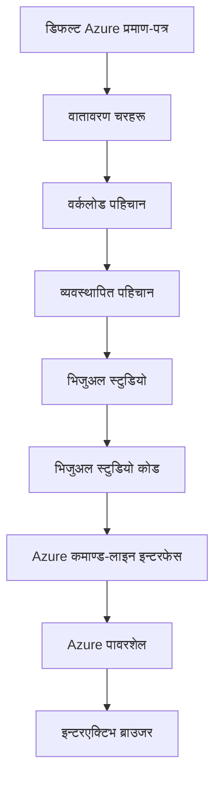

# AZD Basics - Understanding Azure Developer CLI

# AZD Basics - Core Concepts and Fundamentals

**Chapter Navigation:**
- **📚 Course Home**: [AZD For Beginners](../../README.md)
- **📖 Current Chapter**: Chapter 1 - Foundation & Quick Start
- **⬅️ Previous**: [Course Overview](../../README.md#-chapter-1-foundation--quick-start)
- **➡️ Next**: [Installation & Setup](installation.md)
- **🚀 Next Chapter**: [Chapter 2: AI-First Development](../chapter-02-ai-development/microsoft-foundry-integration.md)

## Introduction

यस पाठले तपाईंलाई Azure Developer CLI (azd) सँग परिचय गराउँछ, जुन एक शक्तिशाली कमाण्ड-लाइन उपकरण हो जसले स्थानीय विकासदेखि Azure तिर डिप्लोयमेन्टसम्मको旅तालाइ तीब्र बनाउँछ। तपाईंले आधारभूत अवधारणाहरु, मुख्य सुविधाहरु सिक्नुहुनेछ र azd ले क्लाउड-नेटिभ एप्लिकेशन डिप्लोयमेन्ट कसरी सजिलो बनाउँछ भन्ने बुझ्नुहुनेछ।

## Learning Goals

यस पाठको अन्त्यपछि, तपाईं:
- Azure Developer CLI के हो र यसको प्राथमिक उद्देश्य के हो भन्ने बुझ्न सक्नुहुनेछ
- टेम्पलेटहरू, वातावरणहरू, र सेवाहरूको मुख्य अवधारणाहरू सिक्नुहुनेछ
- टेम्पलेट-प्रेरित विकास र Infrastructure as Code लगायतका प्रमुख सुविधाहरू अन्वेषण गर्नुहुनेछ
- azd परियोजना संरचना र कार्यप्रवाह बुझ्नुहुनेछ
- आफ्नो विकास वातावरणका लागि azd इन्स्टल र कन्फिगर गर्न तयार हुनुहुनेछ

## Learning Outcomes

यस पाठ पूरा गरेपछि, तपाईं गर्न सक्षम हुनुहुनेछ:
- आधुनिक क्लाउड विकास कार्यप्रवाहहरूमा azd को भूमिकाको व्याख्या गर्न
- azd परियोजना संरचनाका कम्पोनेन्टहरू पहिचान गर्न
- टेम्पलेटहरू, वातावरणहरू, र सेवाहरू कसरी सँगै काम गर्छन् भन्ने वर्णन गर्न
- azd सँग Infrastructure as Code का फाइदाहरू बुझ्न
- फरक azd कमाण्डहरू र तिनका उद्देश्यहरू पहिचान गर्न

## What is Azure Developer CLI (azd)?

Azure Developer CLI (azd) एउटा कमाण्ड-लाइन उपकरण हो जुन स्थानीय विकासदेखि Azure डिप्लोयमेन्टसम्मको旅तालाई तीब्र बनाउँछ। यसले Azure मा क्लाउड-नेटिभ एप्लिकेशनहरू बनाउने, डिप्लोय गराउने, र व्यवस्थापन गर्ने प्रक्रियालाई सरल बनाउँछ।

### What Can You Deploy with azd?

azd ले धेरै प्रकारका कार्यभारहरू समर्थन गर्दछ—र सूची बिस्तारै बढिरहेको छ। आज, तपाईं azd प्रयोग गरेर निम्न डिप्लोय गर्न सक्नुहुन्छ:

| Workload Type | Examples | Same Workflow? |
|---------------|----------|----------------|
| **Traditional applications** | Web apps, REST APIs, static sites | ✅ `azd up` |
| **Services and microservices** | Container Apps, Function Apps, multi-service backends | ✅ `azd up` |
| **AI-powered applications** | Chat apps with Microsoft Foundry Models, RAG solutions with AI Search | ✅ `azd up` |
| **Intelligent agents** | Foundry-hosted agents, multi-agent orchestrations | ✅ `azd up` |

मुख्य निष्कर्ष यो हो कि **तपाईं जे पनि डिप्लोय गरिरहनु भएको छ भन्ने कुरामा आ-ज़ीडी लाइफसाइकल उस्तै रहन्छ**। तपाईं प्रोजेक्ट सुरु गर्नुहुन्छ, पूर्वाधार प्राविजन गर्नुहुन्छ, आफ्नो कोड डिप्लोय गर्नुहुन्छ, एप्लिकेशनको अनुगमन गर्नुहुन्छ, र सफाइ गर्नुहुन्छ—चाहे त्यो साधारण वेबसाइट हो या जटिल AI एजेन्ट।

यो निरन्तरता डिजाइनकै भाग हो। azd ले AI क्षमता लाई तपाईंको एप्लिकेशनले प्रयोग गर्ने अर्को प्रकारको सेवा जस्तै व्यवहार गर्छ, केहि मौलिक रूपमा फरक नभएर। Microsoft Foundry Models द्वारा समर्थित एक च्याट अन्तबिन्दु azd को दृष्टिमा, कन्फिगर र डिप्लोय गर्नुपर्ने अर्को सेवा मात्र हो।

### 🎯 Why Use AZD? A Real-World Comparison

साधारण वेब एप् र डाटाबेस डिप्लोय गर्ने कुरा तुलना गरौं:

#### ❌ WITHOUT AZD: Manual Azure Deployment (30+ minutes)

```bash
# चरण 1: संसाधन समूह सिर्जना गर्नुहोस्
az group create --name myapp-rg --location eastus

# चरण 2: एप सेवा योजना सिर्जना गर्नुहोस्
az appservice plan create --name myapp-plan \
  --resource-group myapp-rg \
  --sku B1 --is-linux

# चरण 3: वेब एप सिर्जना गर्नुहोस्
az webapp create --name myapp-web-unique123 \
  --resource-group myapp-rg \
  --plan myapp-plan \
  --runtime "NODE:18-lts"

# चरण 4: Cosmos DB खाता सिर्जना गर्नुहोस् (10-15 मिनेट)
az cosmosdb create --name myapp-cosmos-unique123 \
  --resource-group myapp-rg \
  --kind MongoDB

# चरण 5: डेटाबेस सिर्जना गर्नुहोस्
az cosmosdb mongodb database create \
  --account-name myapp-cosmos-unique123 \
  --resource-group myapp-rg \
  --name tododb

# चरण 6: संग्रह सिर्जना गर्नुहोस्
az cosmosdb mongodb collection create \
  --account-name myapp-cosmos-unique123 \
  --resource-group myapp-rg \
  --database-name tododb \
  --name todos

# चरण 7: कनेक्शन स्ट्रिङ प्राप्त गर्नुहोस्
CONN_STR=$(az cosmosdb keys list \
  --name myapp-cosmos-unique123 \
  --resource-group myapp-rg \
  --type connection-strings \
  --query "connectionStrings[0].connectionString" -o tsv)

# चरण 8: एप सेटिङहरू कन्फिगर गर्नुहोस्
az webapp config appsettings set \
  --name myapp-web-unique123 \
  --resource-group myapp-rg \
  --settings MONGODB_URI="$CONN_STR"

# चरण 9: लगिङ सक्षम गर्नुहोस्
az webapp log config --name myapp-web-unique123 \
  --resource-group myapp-rg \
  --application-logging filesystem \
  --detailed-error-messages true

# चरण 10: Application Insights सेट अप गर्नुहोस्
az monitor app-insights component create \
  --app myapp-insights \
  --location eastus \
  --resource-group myapp-rg

# चरण 11: App Insights लाई वेब एपसँग जोड्नुहोस्
INSTRUMENTATION_KEY=$(az monitor app-insights component show \
  --app myapp-insights \
  --resource-group myapp-rg \
  --query "instrumentationKey" -o tsv)

az webapp config appsettings set \
  --name myapp-web-unique123 \
  --resource-group myapp-rg \
  --settings APPINSIGHTS_INSTRUMENTATIONKEY="$INSTRUMENTATION_KEY"

# चरण 12: स्थानीय रूपमा अनुप्रयोग निर्माण गर्नुहोस्
npm install
npm run build

# चरण 13: डिप्लोयमेन्ट प्याकेज सिर्जना गर्नुहोस्
zip -r app.zip . -x "*.git*" "node_modules/*"

# चरण 14: अनुप्रयोग परिनियोजन गर्नुहोस्
az webapp deployment source config-zip \
  --resource-group myapp-rg \
  --name myapp-web-unique123 \
  --src app.zip

# चरण 15: पर्खनुहोस् र आशा गर्नुहोस् कि यो काम गर्छ 🙏
# (स्वचालित सत्यापन छैन, म्यानुअल परीक्षण आवश्यक छ)
```

**Problems:**
- ❌ 15+ commands to remember and execute in order
- ❌ 30-45 minutes of manual work
- ❌ Easy to make mistakes (typos, wrong parameters)
- ❌ Connection strings exposed in terminal history
- ❌ No automated rollback if something fails
- ❌ Hard to replicate for team members
- ❌ Different every time (not reproducible)

#### ✅ WITH AZD: Automated Deployment (5 commands, 10-15 minutes)

```bash
# चरण 1: टेम्पलेटबाट आरम्भ गर्नुहोस्
azd init --template todo-nodejs-mongo

# चरण 2: प्रमाणीकरण गर्नुहोस्
azd auth login

# चरण 3: वातावरण सिर्जना गर्नुहोस्
azd env new dev

# चरण 4: परिवर्तनहरू पूर्वावलोकन गर्नुहोस् (वैकल्पिक तर सिफारिस गरिन्छ)
azd provision --preview

# चरण 5: सबै कुरा तैनाथ गर्नुहोस्
azd up

# ✨ सम्पन्न! सबै कुरा तैनाथ, कन्फिगर गरिएको र अनुगमन गरिएको छ
```

**Benefits:**
- ✅ **5 commands** vs. 15+ manual steps
- ✅ **10-15 minutes** total time (mostly waiting for Azure)
- ✅ **Zero errors** - automated and tested
- ✅ **Secrets managed securely** via Key Vault
- ✅ **Automatic rollback** on failures
- ✅ **Fully reproducible** - same result every time
- ✅ **Team-ready** - anyone can deploy with same commands
- ✅ **Infrastructure as Code** - version controlled Bicep templates
- ✅ **Built-in monitoring** - Application Insights configured automatically

### 📊 Time & Error Reduction

| Metric | Manual Deployment | AZD Deployment | Improvement |
|:-------|:------------------|:---------------|:------------|
| **Commands** | 15+ | 5 | 67% fewer |
| **Time** | 30-45 min | 10-15 min | 60% faster |
| **Error Rate** | ~40% | <5% | 88% reduction |
| **Consistency** | Low (manual) | 100% (automated) | Perfect |
| **Team Onboarding** | 2-4 hours | 30 minutes | 75% faster |
| **Rollback Time** | 30+ min (manual) | 2 min (automated) | 93% faster |

## Core Concepts

### Templates
टेम्पलेटहरू azd को आधार हुन्। तिनीहरूले समावेश गर्छन्:
- **Application code** - तपाईंको स्रोत कोड र निर्भरताहरू
- **Infrastructure definitions** - Bicep वा Terraform मा परिभाषित Azure स्रोतहरू
- **Configuration files** - सेटिङहरू र वातावरण चरहरू
- **Deployment scripts** - स्वत: डिप्लोयमेन्ट कार्यप्रवाहहरू

### Environments
वातावरणहरू फरक डिप्लोयमेन्ट लक्ष्यहरू प्रतिनिधित्व गर्छन्:
- **Development** - परीक्षण र विकासका लागि
- **Staging** - प्रि-प्रोडक्सन वातावरण
- **Production** - प्रत्यक्ष उत्पादन वातावरण

प्रत्येक वातावरणले आफ्नो:
- Azure resource group
- Configuration settings
- Deployment state

राख्छ।

### Services
सेवाहरू तपाईंको एप्लिकेशनका निर्माण खण्डहरू हुन्:
- **Frontend** - वेब एप्लिकेशनहरू, SPA हरू
- **Backend** - APIहरू, माइक्रोसर्भिसहरू
- **Database** - डाटा भण्डारण समाधानहरू
- **Storage** - फाइल र ब्लब स्टोरेज

## Key Features

### 1. Template-Driven Development
```bash
# उपलब्ध टेम्पलेटहरू हेर्नुहोस्
azd template list

# टेम्पलेटबाट सुरू गर्नुहोस्
azd init --template <template-name>
```

### 2. Infrastructure as Code
- **Bicep** - Azure को डोमेन-विशेष भाषा
- **Terraform** - मल्टि-क्लाउड पूर्वाधार उपकरण
- **ARM Templates** - Azure Resource Manager टेम्पलेटहरू

### 3. Integrated Workflows
```bash
# पूर्ण तैनाती कार्यप्रवाह
azd up            # प्रोभिजन + तैनाती: पहिलो सेटअपका लागि हस्तक्षेपरहित

# 🧪 नयाँ: तैनाती गर्नु अघि पूर्वाधार परिवर्तनहरू पूर्वावलोकन गर्नुहोस् (सुरक्षित)
azd provision --preview    # परिवर्तन नगरी पूर्वाधार तैनाती अनुकरण गर्नुहोस्

azd provision     # यदि तपाईं पूर्वाधार अपडेट गर्नुहुन्छ भने Azure स्रोतहरू सिर्जना गर्न यसलाई प्रयोग गर्नुहोस्
azd deploy        # एप्लिकेशन कोड तैनाथ गर्नुहोस् वा अपडेट भएपछि पुनः तैनाथ गर्नुहोस्
azd down          # स्रोतहरू सफा गर्नुहोस्
```

#### 🛡️ Safe Infrastructure Planning with Preview
`azd provision --preview` कमाण्ड सुरक्षित डिप्लोयमेन्टका लागि गेम-चेन्जर हो:
- **Dry-run analysis** - के सिर्जना, परिवर्तन, वा मेटिने छ भनेर देखाउँछ
- **Zero risk** - तपाईंको Azure वातावरणमा कुनै वास्तविक परिवर्तन गरिँदैन
- **Team collaboration** - डिप्लोय गर्नुअघि पूर्वावलोकन नतिजा साझेदारी गर्नुहोस्
- **Cost estimation** - प्रतिबद्ध हुनुअघि स्रोत लागत बुझ्नुहोस्

```bash
# उदाहरण पूर्वावलोकन कार्यप्रवाह
azd provision --preview           # के परिवर्तन हुनेछ हेर्नुहोस्
# आउटपुट समीक्षा गर्नुहोस्, टोलीसँग छलफल गर्नुहोस्
azd provision                     # आत्मविश्वासका साथ परिवर्तनहरू लागू गर्नुहोस्
```

### 📊 Visual: AZD Development Workflow


**Workflow Explanation:**
1. **Init** - टेम्पलेट वा नयाँ प्रोजेक्टबाट सुरु गर्नुहोस्
2. **Auth** - Azure सँग प्रमाणिकरण गर्नुहोस्
3. **Environment** - अलग गरिएका डिप्लोयमेन्ट वातावरण सिर्जना गर्नुहोस्
4. **Preview** - 🆕 सधैं पूर्वावलोकन गर्नुहोस् पहिलोमा पूर्वाधार परिवर्तनहरू (सुरक्षित अभ्यास)
5. **Provision** - Azure स्रोतहरू सिर्जना/अद्यावधिक गर्नुहोस्
6. **Deploy** - आफ्नो एप्लिकेशन कोड पठाउनुहोस्
7. **Monitor** - एप्लिकेशन प्रदर्शन अवलोकन गर्नुहोस्
8. **Iterate** - परिवर्तनहरू गर्नुहोस् र कोड पुन:डिप्लोय गर्नुहोस्
9. **Cleanup** - काम सकिएपछि स्रोतहरू हटाउनुहोस्

### 4. Environment Management
```bash
# पर्यावरणहरू सिर्जना र व्यवस्थापन गर्नुहोस्
azd env new <environment-name>
azd env select <environment-name>
azd env list
```

### 5. Extensions and AI Commands

azd ले कोर CLI बाहिर क्षमताहरू थप्न एक्स्टेन्सन सिस्टम प्रयोग गर्छ। यो विशेष गरी AI कार्यभारहरूको लागि उपयोगी हुन्छ:

```bash
# उपलब्ध एक्सटेन्सनहरू सूचीबद्ध गर्नुहोस्
azd extension list

# Foundry agents एक्सटेन्सन स्थापना गर्नुहोस्
azd extension install azure.ai.agents

# मानिफेस्टबाट AI एजेन्ट परियोजना आरम्भ गर्नुहोस्
azd ai agent init -m agent-manifest.yaml

# AI-सहायता प्राप्त विकासका लागि MCP सर्भर सुरु गर्नुहोस् (अल्फा)
azd mcp start
```

> Extensions are covered in detail in [Chapter 2: AI-First Development](../chapter-02-ai-development/agents.md) and the [AZD AI CLI Commands](../chapter-08-production/production-ai-practices.md#azd-ai-cli-commands-and-extensions) reference.

## 📁 Project Structure

A typical azd project structure:
```
my-app/
├── .azd/                    # azd configuration
│   └── config.json
├── .azure/                  # Azure deployment artifacts
├── .devcontainer/          # Development container config
├── .github/workflows/      # GitHub Actions
├── .vscode/               # VS Code settings
├── infra/                 # Infrastructure code
│   ├── main.bicep        # Main infrastructure template
│   ├── main.parameters.json
│   └── modules/          # Reusable modules
├── src/                  # Application source code
│   ├── api/             # Backend services
│   └── web/             # Frontend application
├── azure.yaml           # azd project configuration
└── README.md
```

## 🔧 Configuration Files

### azure.yaml
The main project configuration file:
```yaml
name: my-awesome-app
metadata:
  template: my-template@1.0.0

services:
  web:
    project: ./src/web
    language: js
    host: appservice
  api:
    project: ./src/api
    language: js
    host: appservice

hooks:
  preprovision:
    shell: pwsh
    run: echo "Preparing to provision..."
```

### .azure/config.json
Environment-specific configuration:
```json
{
  "version": 1,
  "defaultEnvironment": "dev",
  "environments": {
    "dev": {
      "subscriptionId": "your-subscription-id",
      "location": "eastus"
    }
  }
}
```

## 🎪 Common Workflows with Hands-On Exercises

> **💡 Learning Tip:** यी अभ्यासहरू क्रममै पालन गर्नुहोस् ताकि तपाईं क्रमिक रुपमा AZD कौशल निर्माण गर्न सक्नुहुनेछ।

### 🎯 Exercise 1: Initialize Your First Project

**Goal:** Create an AZD project and explore its structure

**Steps:**
```bash
# प्रमाणित टेम्पलेट प्रयोग गर्नुहोस्
azd init --template todo-nodejs-mongo

# उत्पन्न भएका फाइलहरू अन्वेषण गर्नुहोस्
ls -la  # लुकेका फाइलहरू सहित सबै फाइलहरू हेर्नुहोस्

# सिर्जना भएका प्रमुख फाइलहरू:
# - azure.yaml (मुख्य कन्फिग)
# - infra/ (पूर्वाधार कोड)
# - src/ (अनुप्रयोग कोड)
```

**✅ Success:** You have azure.yaml, infra/, and src/ directories

---

### 🎯 Exercise 2: Deploy to Azure

**Goal:** Complete end-to-end deployment

**Steps:**
```bash
# 1. प्रमाणीककरण गर्नुहोस्
az login && azd auth login

# 2. वातावरण सिर्जना गर्नुहोस्
azd env new dev
azd env set AZURE_LOCATION eastus

# 3. परिवर्तनहरू पूर्वावलोकन गर्नुहोस् (सिफारिस गरिएको)
azd provision --preview

# 4. सबै कुरा परिनियोजन गर्नुहोस्
azd up

# 5. परिनियोजन जाँच गर्नुहोस्
azd show    # आफ्नो एपको URL हेर्नुहोस्
```

**Expected Time:** 10-15 minutes  
**✅ Success:** Application URL opens in browser

---

### 🎯 Exercise 3: Multiple Environments

**Goal:** Deploy to dev and staging

**Steps:**
```bash
# पहिले नै dev छ, staging सिर्जना गर्नुहोस्
azd env new staging
azd env set AZURE_LOCATION westus2
azd up

# तिनीहरूबीच स्विच गर्नुहोस्
azd env list
azd env select dev
```

**✅ Success:** Two separate resource groups in Azure Portal

---

### 🛡️ Clean Slate: `azd down --force --purge`

When you need to completely reset:

```bash
azd down --force --purge
```

**What it does:**
- `--force`: No confirmation prompts
- `--purge`: Deletes all local state and Azure resources

**Use when:**
- Deployment failed mid-way
- Switching projects
- Need fresh start

---

## 🎪 Original Workflow Reference

### Starting a New Project
```bash
# विधि 1: अवस्थित टेम्प्लेट प्रयोग गर्नुहोस्
azd init --template todo-nodejs-mongo

# विधि 2: शून्यबाट सुरु गर्नुहोस्
azd init

# विधि 3: वर्तमान निर्देशिका प्रयोग गर्नुहोस्
azd init .
```

### Development Cycle
```bash
# विकास वातावरण तयार गर्नुहोस्
azd auth login
azd env new dev
azd env select dev

# सबै कुरा परिनियोजित गर्नुहोस्
azd up

# परिवर्तनहरू गर्नुहोस् र पुन: परिनियोजित गर्नुहोस्
azd deploy

# काम सकेपछि सफा गर्नुहोस्
azd down --force --purge # Azure Developer CLI मा रहेको आदेश तपाईंको वातावरणका लागि **हार्ड रिसेट** हो—विशेष गरी जब तपाईं असफल परिनियोजनहरू समस्या समाधान गर्दै हुनुहुन्छ, परित्यक्त स्रोतहरू सफा गर्दै हुनुहुन्छ, वा नयाँ पुन:परिनियोजनको लागि तयारी गर्दै हुनुहुन्छ।
```

## Understanding `azd down --force --purge`
`azd down --force --purge` कमाण्ड तपाईंको azd वातावरण र सबै सम्बन्धित स्रोतहरू पूर्ण रूपमा तह लगाउनको लागि शक्तिशाली तरिका हो। यहाँ प्रत्येक फ्ल्यागले के गर्छ भन्ने व्याख्या छ:
```
--force
```
- पुष्टिकरण सोधपुछहरू स्किप गर्छ।
- स्वचालन वा स्क्रिप्टिङका लागि उपयोगी जहाँ म्यानुअल इनपुट सम्भव हुँदैन।
- CLI ले असंगतताहरू पत्ता लगाए पनि तह लगाउने प्रक्रिया अवरुद्ध हुन नदिने सुनिश्चित गर्छ।

```
--purge
```
Deletes **all associated metadata**, including:
Environment state
Local `.azure` folder
Cached deployment info
Prevents azd from "remembering" previous deployments, which can cause issues like mismatched resource groups or stale registry references.


### Why use both?
जब `azd up` सँग बाँकी रहेको राज्य वा आंशिक डिप्लोयमेन्टका कारण समस्या आइरहेको हुन्छ, यो संयोजनले **सफा सुरुवात** सुनिश्चित गर्छ।

यो विशेष गरी म्यानुअल रूपमा Azure पोर्टलमा स्रोतहरू मेटाइ सकेपछि वा टेम्पलेट, वातावरण, वा resource group नामकरण परम्पराहरू परिवर्तन गर्दा धेरै उपयोगी हुन्छ।

### Managing Multiple Environments
```bash
# स्टेजिङ वातावरण सिर्जना गर्नुहोस्
azd env new staging
azd env select staging
azd up

# dev मा फिर्ता जानुहोस्
azd env select dev

# वातावरणहरू तुलना गर्नुहोस्
azd env list
```

## 🔐 Authentication and Credentials

प्रमाणिकरण बुझ्नु azd डिप्लोयमेन्टहरू सफल बनाउन महत्वपूर्ण छ। Azure ले धेरै प्रमाणिकरण विधिहरू प्रयोग गर्छ, र azd ले अन्य Azure उपकरणहरूले प्रयोग गर्ने उही क्रेडेन्सियल चेन प्रयोग गर्छ।

### Azure CLI Authentication (`az login`)

azd प्रयोग गर्नु भन्दा पहिले, तपाईंले Azure सँग प्रमाणिकरण गर्नु आवश्यक छ। सबैभन्दा सामान्य विधि Azure CLI प्रयोग गर्नु हो:

```bash
# इंटरएक्टिभ लगइन (ब्राउजर खोल्छ)
az login

# विशिष्ट टेनेन्टसँग लगइन
az login --tenant <tenant-id>

# सर्भिस प्रिन्सिपल प्रयोग गरेर लगइन
az login --service-principal -u <app-id> -p <password> --tenant <tenant-id>

# हालको लगइन स्थिति जाँच गर्नुहोस्
az account show

# उपलब्ध सदस्यताहरू सूचीबद्ध गर्नुहोस्
az account list --output table

# पूर्वनिर्धारित सदस्यता सेट गर्नुहोस्
az account set --subscription <subscription-id>
```

### Authentication Flow
1. **Interactive Login**: तपाइँको पूर्वनिर्धारित ब्राउजर खोल्छ प्रमाणिकरणको लागि
2. **Device Code Flow**: ब्राउजर पहुँच नभएको वातावरणहरूको लागि
3. **Service Principal**: स्वचालन र CI/CD परिदृश्यहरूको लागि
4. **Managed Identity**: Azure-होस्ट गरिएका एप्लिकेशनहरूको लागि

### DefaultAzureCredential Chain

`DefaultAzureCredential` एउटा क्रेडेन्सियल प्रकार हो जसले धेरै क्रेडेन्सियल स्रोतहरूलाई निर्दिष्ट क्रम अनुसार स्वतः प्रयास गरेर प्रमाणिकरण अनुभवलाई सरल बनाउँछ:

#### Credential Chain Order

#### 1. Environment Variables
```bash
# सर्भिस प्रिन्सिपलका लागि वातावरण चरहरू सेट गर्नुहोस्
export AZURE_CLIENT_ID="<app-id>"
export AZURE_CLIENT_SECRET="<password>"
export AZURE_TENANT_ID="<tenant-id>"
```

#### 2. Workload Identity (Kubernetes/GitHub Actions)
स्वतः प्रयोग गरिन्छ:
- Azure Kubernetes Service (AKS) मा Workload Identity सहित
- GitHub Actions मा OIDC federation सहित
- अन्य федераटेड आइडेन्टिटी परिदृश्यहरू

#### 3. Managed Identity
Azure स्रोतहरूका लागि जस्तै:
- Virtual Machines
- App Service
- Azure Functions
- Container Instances

```bash
# प्रबन्धित पहिचान भएको Azure स्रोतमा चलिरहेको छ कि छैन जाँच गर्नुहोस्
az account show --query "user.type" --output tsv
# फिर्ता: "servicePrincipal" यदि प्रबन्धित पहिचान प्रयोग भइरहेको छ भने
```

#### 4. Developer Tools Integration
- **Visual Studio**: स्वचालन रूपमा साइन-इन गरिएको खातालाई प्रयोग गर्छ
- **VS Code**: Azure Account एक्सटेन्सन क्रेडेन्सियलहरू प्रयोग गर्छ
- **Azure CLI**: `az login` क्रेडेन्सियलहरू प्रयोग गर्छ (स्थानीय विकासका लागि सबैभन्दा सामान्य)

### AZD Authentication Setup

```bash
# विधि १: Azure CLI प्रयोग गर्नुहोस् (विकासका लागि सिफारिस गरिएको)
az login
azd auth login  # अवस्थित Azure CLI प्रमाण-पत्रहरू प्रयोग गर्दछ

# विधि २: प्रत्यक्ष azd प्रमाणीकरण
azd auth login --use-device-code  # हेडलेस वातावरणहरूको लागि

# विधि ३: प्रमाणीकरण स्थिति जाँच गर्नुहोस्
azd auth login --check-status

# विधि ४: लगआउट गर्नुहोस् र पुनः प्रमाणीकरण गर्नुहोस्
azd auth logout
azd auth login
```

### Authentication Best Practices

#### For Local Development
```bash
# 1. Azure CLI प्रयोग गरेर लगइन गर्नुहोस्
az login

# 2. सही सब्सक्रिप्शन जाँच गर्नुहोस्
az account show
az account set --subscription "Your Subscription Name"

# 3. विद्यमान प्रमाण-पत्रहरूसँग azd प्रयोग गर्नुहोस्
azd auth login
```

#### For CI/CD Pipelines
```yaml
# GitHub Actions example
- name: Azure Login
  uses: azure/login@v1
  with:
    creds: ${{ secrets.AZURE_CREDENTIALS }}

- name: Deploy with azd
  run: |
    azd auth login --client-id ${{ secrets.AZURE_CLIENT_ID }} \
                    --client-secret ${{ secrets.AZURE_CLIENT_SECRET }} \
                    --tenant-id ${{ secrets.AZURE_TENANT_ID }}
    azd up --no-prompt
```

#### For Production Environments
- Azure स्रोतहरूमा चलाउँदा **Managed Identity** प्रयोग गर्नुहोस्
- स्वचालन परिदृश्यहरूको लागि **Service Principal** प्रयोग गर्नुहोस्
- कोड वा कन्फिगरेसन फाइलहरूमा क्रेडेन्सियलहरू राख्नबाट बच्नुहोस्
- संवेदनशील कन्फिगरेसनका लागि **Azure Key Vault** प्रयोग गर्नुहोस्

### Common Authentication Issues and Solutions

#### Issue: "No subscription found"
```bash
# समाधान: पूर्वनिर्धारित सदस्यता सेट गर्नुहोस्
az account list --output table
az account set --subscription "<subscription-id>"
azd env set AZURE_SUBSCRIPTION_ID "<subscription-id>"
```

#### Issue: "Insufficient permissions"
```bash
# समाधान: आवश्यक भूमिकाहरू जाँच्नुहोस् र नियुक्त गर्नुहोस्
az role assignment list --assignee $(az account show --query user.name --output tsv)

# सामान्य आवश्यक भूमिकाहरू:
# - Contributor (स्रोत व्यवस्थापनका लागि)
# - User Access Administrator (भूमिका नियुक्तिका लागि)
```

#### Issue: "Token expired"
```bash
# समाधान: फेरि प्रमाणीकरण गर्नुहोस्
az logout
az login
azd auth logout
azd auth login
```

### Authentication in Different Scenarios

#### Local Development
```bash
# व्यक्तिगत विकास खाता
az login
azd auth login
```

#### Team Development
```bash
# संगठनका लागि विशिष्ट टेनेन्ट प्रयोग गर्नुहोस्
az login --tenant contoso.onmicrosoft.com
azd auth login
```

#### Multi-tenant Scenarios
```bash
# टेनेन्टहरू बीच स्विच गर्नुहोस्
az login --tenant tenant1.onmicrosoft.com
# टेनेन्ट 1 मा परिनियोजन गर्नुहोस्
azd up

az login --tenant tenant2.onmicrosoft.com  
# टेनेन्ट 2 मा परिनियोजन गर्नुहोस्
azd up
```

### Security Considerations
1. **क्रेडेन्सियल भण्डारण**: स्रोत कोडमा कहिल्यै क्रेडेन्सियलहरू भण्डारण नगर्नुहोस्
2. **स्कोप सीमितीकरण**: सेवा प्रिन्सिपलहरूका लागि न्यूनतम अधिकारको सिद्धान्त प्रयोग गर्नुहोस्
3. **टोकन रोटेसन**: सेवा प्रिन्सिपल गोप्य कुञ्जीहरू नियमित रूपमा रोटेट गर्नुहोस्
4. **अडिट ट्रेल**: प्रमाणीकरण र डिप्लोइमेन्ट गतिविधिहरू अनुगमन गर्नुहोस्
5. **नेटवर्क सुरक्षा**: सम्भव भएमा प्राइभेट एन्डपोइन्टहरू प्रयोग गर्नुहोस्

### प्रमाणीकरण समस्या निवारण

```bash
# प्रमाणीकरण समस्याहरू डिबग गर्नुहोस्
azd auth login --check-status
az account show
az account get-access-token

# सामान्य निदान आदेशहरू
whoami                          # हालको प्रयोगकर्ता सन्दर्भ
az ad signed-in-user show      # Azure AD प्रयोगकर्ता विवरणहरू
az group list                  # स्रोत पहुँच परीक्षण गर्नुहोस्
```

## `azd down --force --purge` को समझ

### खोज
```bash
azd template list              # टेम्पलेटहरू ब्राउज गर्नुहोस्
azd template show <template>   # टेम्पलेट विवरण
azd init --help               # प्रारम्भिक विकल्पहरू
```

### परियोजना व्यवस्थापन
```bash
azd show                     # परियोजनाको अवलोकन
azd env show                 # हालको वातावरण
azd config list             # कन्फिगरेसन सेटिङहरू
```

### अनुगमन
```bash
azd monitor                  # Azure पोर्टलको निगरानी खोल्नुहोस्
azd monitor --logs           # अनुप्रयोगका लगहरू हेर्नुहोस्
azd monitor --live           # प्रत्यक्ष मेट्रिक्स हेर्नुहोस्
azd pipeline config          # CI/CD स्थापना गर्नुहोस्
```

## उत्तम अभ्यासहरू

### 1. अर्थपूर्ण नामहरू प्रयोग गर्नुहोस्
```bash
# राम्रो
azd env new production-east
azd init --template web-app-secure

# बच्नुहोस्
azd env new env1
azd init --template template1
```

### 2. टेम्पलेटहरू प्रयोग गर्नुहोस्
- पहिले भएका टेम्पलेटबाट सुरु गर्नुहोस्
- आवश्यकता अनुसार अनुकूलित गर्नुहोस्
- आफ्नो संस्थाका लागि पुन: प्रयोगयोग्य टेम्पलेटहरू बनाउनुहोस्

### 3. वातावरण अलगाव
- dev/staging/prod का लागि अलग वातावरण प्रयोग गर्नुहोस्
- स्थानीय मेसिनबाट सिधै उत्पादनमा कहिल्यै डिप्लोइ नगर्नुहोस्
- उत्पादन डिप्लोइमेन्टका लागि CI/CD पाइपलाइनहरू प्रयोग गर्नुहोस्

### 4. कन्फिगरेसन व्यवस्थापन
- संवेदनशील डाटाका लागि वातावरण चरहरू (environment variables) प्रयोग गर्नुहोस्
- कन्फिगरेसनलाई भर्सन कन्ट्रोलमा राख्नुहोस्
- वातावरण-विशिष्ट सेटिङहरू कागजातिकरण गर्नुहोस्

## सिकाइ प्रगति

### शुरुवाती (हप्ता 1-2)
1. azd इन्स्टल गर्नुहोस् र प्रमाणीकरण गर्नुहोस्
2. एउटा साधारण टेम्पलेट डिप्लोइ गर्नुहोस्
3. परियोजना संरचना बुझ्नुहोस्
4. आधारभूत कमाण्डहरू सिक्नुहोस् (up, down, deploy)

### मध्यवर्ती (हप्ता 3-4)
1. टेम्पलेटहरू अनुकूलित गर्नुहोस्
2. बहु वातावरणहरू व्यवस्थापन गर्नुहोस्
3. पूर्वाधार कोड बुझ्नुहोस्
4. CI/CD पाइपलाइन सेटअप गर्नुहोस्

### उन्नत (हप्ता 5+)
1. कस्टम टेम्पलेटहरू सिर्जना गर्नुहोस्
2. उन्नत पूर्वाधार ढाँचाहरू
3. बहु-क्षेत्र डिप्लोइमेन्टहरू
4. उद्यम-स्तर कन्फिगरेसनहरू

## अर्को चरणहरू

**📖 अध्याय 1 सिकाइ जारी राख्नुहोस्:**
- [स्थापना र सेटअप](installation.md) - azd इन्स्टल र कन्फिगर गर्ने
- [तपाईंको पहिलो परियोजना](first-project.md) - व्यावहारिक ट्युटोरियल पूरा गर्नुहोस्
- [कन्फिगरेसन गाइड](configuration.md) - उन्नत कन्फिगरेसन विकल्पहरू

**🎯 अर्को अध्यायका लागि तयार?**
- [अध्याय 2: AI-प्रथम विकास](../chapter-02-ai-development/microsoft-foundry-integration.md) - AI अनुप्रयोगहरू बनाउन सुरु गर्नुहोस्

## अतिरिक्त स्रोतहरू

- [Azure Developer CLI अवलोकन](https://learn.microsoft.com/en-us/azure/developer/azure-developer-cli/)
- [टेम्पलेट ग्यालरी](https://azure.github.io/awesome-azd/)
- [समुदाय नमूनाहरू](https://github.com/Azure-Samples)

---

## 🙋 बारम्बार सोधिने प्रश्नहरू

### सामान्य प्रश्नहरू

**Q: AZD र Azure CLI बीच के फरक छ?**

A: Azure CLI (`az`) व्यक्तिगत Azure स्रोतहरू व्यवस्थापन गर्नको लागि हो। AZD (`azd`) सम्पूर्ण अनुप्रयोगहरू व्यवस्थापन गर्नका लागि हो:

```bash
# Azure CLI - निम्न-स्तर स्रोत व्यवस्थापन
az webapp create --name myapp --resource-group rg
az sql server create --name myserver --resource-group rg
# ...अझ धेरै आदेशहरू आवश्यक छन्

# AZD - अनुप्रयोग-स्तर व्यवस्थापन
azd up  # सम्पूर्ण अनुप्रयोग सबै स्रोतहरूसहित परिनियोजन गर्छ
```

**यसरी सोच्नुहोस्:**
- `az` = व्यक्तिगत Lego ईंटहरूमाथि काम गर्नु
- `azd` = सम्पूर्ण Lego सेटहरूसँग काम गर्नु

---

**Q: AZD प्रयोग गर्न Bicep वा Terraform जान्न जरुरी छ?**

A: होइन! टेम्पलेटबाट सुरु गर्नुहोस्:
```bash
# अहिलेको टेम्पलेट प्रयोग गर्नुहोस् - IaC सम्बन्धी ज्ञान आवश्यक छैन
azd init --template todo-nodejs-mongo
azd up
```

तपाईं पछि Bicep सिकेर पूर्वाधार अनुकूलित गर्न सक्नुहुन्छ। टेम्पलेटहरूले सिक्नका लागि कार्यरत उदाहरणहरू प्रदान गर्छन्।

---

**Q: AZD टेम्पलेटहरू चलाउन कति लागत लाग्छ?**

A: लागत टेम्पलेटअनुसार फरक हुन्छ। धेरैजसो विकास टेम्पलेटहरूको लागत $50-150/महिना हुन्छ:
```bash
# परिनियोजन गर्नु अघि लागत पूर्वावलोकन गर्नुहोस्
azd provision --preview

# प्रयोग नगर्दा सधैं सफा गर्नुहोस्
azd down --force --purge  # सबै स्रोतहरू हटाउँछ
```

**प्रो टिप:** जहाँ उपलब्ध छ त्यहाँ नि:शुल्क टियरहरू प्रयोग गर्नुहोस्:
- App Service: F1 (नि:शुल्क) टियर
- Microsoft Foundry Models: Azure OpenAI 50,000 टोकन/महिना नि:शुल्क
- Cosmos DB: 1000 RU/s नि:शुल्क टियर

---

**Q: के म विद्यमान Azure स्रोतहरूसँग AZD प्रयोग गर्न सक्छु?**

A: हो, तर नयाँबाट सुरु गर्नु सहज हुन्छ। AZD तब सबैभन्दा राम्रो काम गर्छ जब यसले पूरा लाइफसाइकल ब्यवस्थापन गर्छ। विद्यमान स्रोतहरूको लागि:
```bash
# विकल्प 1: अवस्थित स्रोतहरू आयात गर्नुहोस् (उन्नत)
azd init
# त्यसपछि अवस्थित स्रोतहरूलाई सन्दर्भ दिन infra/ परिमार्जन गर्नुहोस्

# विकल्प 2: नयाँबाट सुरु गर्नुहोस् (सिफारिस गरिएको)
azd init --template matching-your-stack
azd up  # नयाँ वातावरण सिर्जना गर्छ
```

---

**Q: म मेरो परियोजना कसरी टिम सदस्यहरूसँग साझा गर्न सक्छु?**

A: AZD परियोजनालाई Git मा कमिट गर्नुहोस् (तर .azure फोल्डर होइन):
```bash
# डिफल्ट रूपमा पहिले नै .gitignore मा छ
.azure/        # गोप्य जानकारी र वातावरण सम्बन्धी डेटा समावेश गर्दछ
*.env          # परिवेश भेरिएबलहरू

# त्यसपछि टोलीका सदस्यहरू:
git clone <your-repo>
azd auth login
azd env new <their-name>-dev
azd up
```

सबैले एउटै टेम्पलेटबाट समान पूर्वाधार पाउँछन्।

---

### समस्या निवारण प्रश्नहरू

**Q: "azd up" आधामा असफल भयो। म के गर्नुपर्छ?**

A: त्रुटि जाँच्नुहोस्, सुधार गर्नुहोस्, अनि पुन: प्रयास गर्नुहोस्:
```bash
# विस्तृत लगहरू हेर्नुहोस्
azd show

# सामान्य समाधानहरू:

# 1. यदि कोटा बढी भइसकेमा:
azd env set AZURE_LOCATION "westus2"  # अर्को क्षेत्र प्रयोग गर्नुहोस्

# 2. यदि स्रोत नाम टकराव भएमा:
azd down --force --purge  # सुरुबाट सुरु गर्नुहोस्
azd up  # फेरि प्रयास गर्नुहोस्

# 3. यदि प्रमाणीकरणको समयसीमा समाप्त भइसकेमा:
az login
azd auth login
azd up
```

**सबैभन्दा सामान्य समस्या:** गलत Azure subscription चयन गरिएको
```bash
az account list --output table
az account set --subscription "<correct-subscription>"
```

---

**Q: म कसरी पुनःप्राविजन नगरी मात्र कोड परिवर्तनहरू डिप्लोइ गर्न सक्छु?**

A: `azd up` को सट्टा `azd deploy` प्रयोग गर्नुहोस्:
```bash
azd up          # पहिलो पटक: प्राविजन + डिप्लोय (ढिलो)

# कोडमा परिवर्तनहरू गर्नुहोस्...

azd deploy      # पछिल्ला पटकहरू: केवल डिप्लोय (छिटो)
```

गति तुलना:
- `azd up`: 10-15 मिनेट (पूर्वाधार प्रावधान गर्छ)
- `azd deploy`: 2-5 मिनेट (केवल कोड)

---

**Q: के म पूर्वाधार टेम्पलेटहरू अनुकूलित गर्न सक्छु?**

A: हो! `infra/` मा रहेका Bicep फाइलहरू सम्पादन गर्नुहोस्:
```bash
# azd init पछि
cd infra/
code main.bicep  # VS Code मा सम्पादन गर्नुहोस्

# परिवर्तनहरू पूर्वावलोकन गर्नुहोस्
azd provision --preview

# परिवर्तनहरू लागू गर्नुहोस्
azd provision
```

**टिप:** सानोतिनोबाट सुरु गर्नुहोस् - पहिले SKUs परिवर्तन गर्नुहोस्:
```bicep
// infra/main.bicep
sku: {
  name: 'B1'  // Change to 'P1V2' for production
}
```

---

**Q: AZD ले सिर्जना गरेको सबै कुरा म कसरी मेटाउने?**

A: एउटा कमाण्डले सबै स्रोतहरू हटाउँछ:
```bash
azd down --force --purge

# यसले निम्न कुराहरू मेटाउँछ:
# - सबै Azure स्रोतहरू
# - स्रोत समूह
# - स्थानीय वातावरणको अवस्था
# - क्यास गरिएको परिनियोजन डाटा
```

**सधैं यो चलाउनुहोस् जब:**
- टेम्पलेट परीक्षण सकिएको बेला
- विभिन्न परियोजनामा सर्दै हुनुहुन्छ
- नयाँबाट सुरु गर्न चाहनुहुन्छ

**लागत बचत:** अप्रयुक्त स्रोतहरू मेटाउँदा शुल्क = $0

---

**Q: यदि मैले गल्तीले Azure Portal मा स्रोतहरू हटाएँ भने के हुन्छ?**

A: AZD स्थिति असङ्गठित हुन सक्छ। सफा सुरुवात तरिका:
```bash
# 1. स्थानीय स्थिति हटाउनुहोस्
azd down --force --purge

# 2. नयाँबाट सुरु गर्नुहोस्
azd up

# वैकल्पिक: AZD लाई पत्ता लगाउन र ठीक गर्न दिनुहोस्
azd provision  # अनुपस्थित स्रोतहरू सिर्जना गर्नेछ
```

---

### उन्नत प्रश्नहरू

**Q: के म CI/CD पाइपलाइनमा AZD प्रयोग गर्न सक्छु?**

A: हो! GitHub Actions उदाहरण:
```yaml
# .github/workflows/deploy.yml
name: Deploy with AZD

on:
  push:
    branches: [main]

jobs:
  deploy:
    runs-on: ubuntu-latest
    steps:
      - uses: actions/checkout@v2
      
      - name: Install azd
        run: curl -fsSL https://aka.ms/install-azd.sh | bash
      
      - name: Azure Login
        run: |
          azd auth login \
            --client-id ${{ secrets.AZURE_CLIENT_ID }} \
            --client-secret ${{ secrets.AZURE_CLIENT_SECRET }} \
            --tenant-id ${{ secrets.AZURE_TENANT_ID }}
      
      - name: Deploy
        run: azd up --no-prompt
```

---

**Q: म रहस्यहरू र संवेदनशील डाटाहरू कसरी व्यवस्थापन गर्छु?**

A: AZD स्वचालित रूपमा Azure Key Vault सँग एकीकृत हुन्छ:
```bash
# रहस्यहरू कोडमा होइन, Key Vault मा भण्डारण गरिन्छ
azd env set DATABASE_PASSWORD "$(openssl rand -base64 32)"

# AZD स्वचालित रूपमा:
# 1. Key Vault सिर्जना गर्छ
# 2. रहस्य भण्डारण गर्छ
# 3. Managed Identity मार्फत एप्लिकेशनलाई पहुँच प्रदान गर्छ
# 4. रनटाइममा इन्जेक्ट गर्छ
```

**कहिल्यै कमिट नगर्नुहोस्:**
- `.azure/` फोल्डर (वातावरण डेटा समावेश गर्दछ)
- `.env` फाइलहरू (स्थानीय रहस्यहरू)
- कनेक्शन स्ट्रिङहरू

---

**Q: के म बहु-क्षेत्रमा डिप्लोइ गर्न सक्छु?**

A: हो, प्रत्येक क्षेत्रका लागि वातावरण सिर्जना गर्नुहोस्:
```bash
# पूर्वी अमेरिकी वातावरण
azd env new prod-eastus
azd env set AZURE_LOCATION eastus
azd up

# पश्चिमी युरोप वातावरण
azd env new prod-westeurope
azd env set AZURE_LOCATION westeurope
azd up

# प्रत्येक वातावरण स्वतन्त्र छ
azd env list
```

साँचो बहु-क्षेत्र अनुप्रयोगहरूको लागि, एकैसाथ धेरै क्षेत्रहरूमा डिप्लोइ गर्न Bicep टेम्पलेटहरू अनुकूलित गर्नुहोस्।

---

**Q: म अड्किएँ भने मद्दत कहाँ पाउने?**

1. **AZD प्रलेखन:** https://learn.microsoft.com/azure/developer/azure-developer-cli/
2. **GitHub Issues:** https://github.com/Azure/azure-dev/issues
3. **Discord:** [Azure Discord](https://discord.gg/microsoft-azure) - #azure-developer-cli च्यानल
4. **Stack Overflow:** ट्याग `azure-developer-cli`
5. **यो कोर्स:** [समस्या निवारण गाइड](../chapter-07-troubleshooting/common-issues.md)

**प्रो टिप:** सोध्नु अघि, चलाउनुहोस्:
```bash
azd show       # हालको स्थिति देखाउँछ
azd version    # तपाईंको संस्करण देखाउँछ
```

छिटो मद्दतका लागि आफ्नो प्रश्नमा यी जानकारीहरू समावेश गर्नुहोस्।

---

## 🎓 अब के?

अब तपाईं AZD का आधारभूत कुरा बुझ्नुहुन्छ। आफ्नो बाटो रोज्नुहोस्:

### 🎯 शुरुवातीहरूका लागि:
1. **अर्को:** [स्थापना र सेटअप](installation.md) - आफ्नो मेसिनमा AZD इन्स्टल गर्नुहोस्
2. **त्यसपछि:** [तपाईंको पहिलो परियोजना](first-project.md) - तपाईंको पहिलो एप डिप्लोइ गर्नुहोस्
3. **Practice:** यस पाठको सबै 3 अभ्यास पूरा गर्नुहोस्

### 🚀 AI विकासकर्ताहरूका लागि:
1. **सिधै जानुहोस्:** [अध्याय 2: AI-प्रथम विकास](../chapter-02-ai-development/microsoft-foundry-integration.md)
2. **डिप्लोइ:** `azd init --template get-started-with-ai-chat` बाट सुरु गर्नुहोस्
3. **सिक्नुहोस्:** डिप्लोइ गर्दा निर्माण गर्नुहोस्

### 🏗️ अनुभवी विकासकर्ताहरूका लागि:
1. **समीक्षा:** [कन्फिगरेसन गाइड](configuration.md) - उन्नत सेटिङहरू
2. **अन्वेषण:** [Infrastructure as Code](../chapter-04-infrastructure/provisioning.md) - Bicep गहिराइमा
3. **निर्माण:** आफ्नो स्ट्याकका लागि कस्टम टेम्पलेटहरू बनाउनुहोस्

---

**अध्याय नेभिगेसन:**
- **📚 कोर्स होम**: [AZD सुरूवातीहरूका लागि](../../README.md)
- **📖 वर्तमान अध्याय**: अध्याय 1 - आधार र छिटो सुरुवात  
- **⬅️ अघिल्लो**: [कोर्स अवलोकन](../../README.md#-chapter-1-foundation--quick-start)
- **➡️ अर्को**: [स्थापना र सेटअप](installation.md)
- **🚀 अर्को अध्याय**: [अध्याय 2: AI-प्रथम विकास](../chapter-02-ai-development/microsoft-foundry-integration.md)

---

<!-- CO-OP TRANSLATOR DISCLAIMER START -->
अस्वीकरण:
यो दस्तावेज एआई अनुवाद सेवा [Co-op Translator](https://github.com/Azure/co-op-translator) प्रयोग गरेर अनुवाद गरिएको हो। हामी शुद्धताका लागि प्रयास गर्छौं, तर कृपया ध्यान दिनुहोस् कि स्वचालित अनुवादमा त्रुटि वा अशुद्धता हुन सक्छ। मूल भाषामा रहेको दस्तावेजलाई नै अधिकारिक स्रोत मानिनु पर्छ। संवेदनशील वा महत्वपूर्ण जानकारीको लागि पेशेवर मानव अनुवाद सिफारिस गरिन्छ। यस अनुवादको प्रयोगबाट उत्पन्न कुनै पनि गलतफहमी वा गलत व्याख्याका लागि हामी जिम्मेवार छैनौं।
<!-- CO-OP TRANSLATOR DISCLAIMER END -->