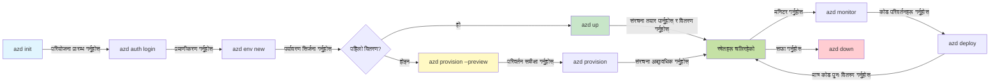
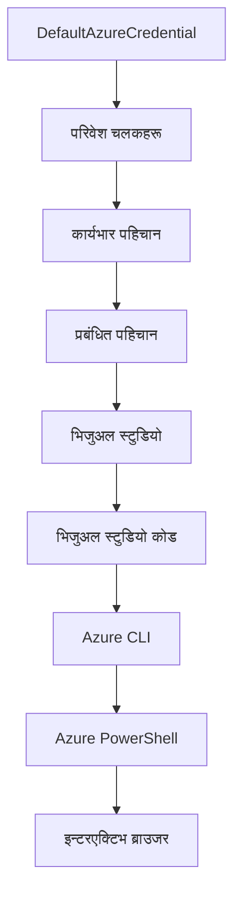

# AZD आधारभूत - Azure Developer CLI बुझ्ने

# AZD आधारभूत - मुख्य अवधारणाहरू र आधारभूत जानकारी

**अध्याय नेभिगेसन:**
- **📚 कोर्स होम**: [AZD सुरुवात गर्नेहरूका लागि](../../README.md)
- **📖 वर्तमान अध्याय**: अध्याय 1 - आधार र द्रुत सुरु
- **⬅️ अघिल्लो**: [कोर्स अवलोकन](../../README.md#-chapter-1-foundation--quick-start)
- **➡️ अर्को**: [इन्स्टलेसन र सेटअप](installation.md)
- **🚀 अर्को अध्याय**: [अध्याय 2: AI-प्रथम विकास](../chapter-02-ai-development/microsoft-foundry-integration.md)

## परिचय

यो पाठले तपाईंलाई Azure Developer CLI (azd) सँग परिचित गराउँछ, जुन शक्तिशाली कमाण्ड-लाइन उपकरण हो जसले स्थानीय विकासबाट Azure तिरको यात्रालाई छिटो बनाउँछ। तपाईंले आधारभूत अवधारणाहरू, मूल सुविधाहरू सिक्नु हुनेछ र कसरी azdले क्लाउड-नेटिभ अनुप्रयोग परिनियोजनलाई सरल बनाउँछ बुझ्नेछ।

## सिक्ने लक्ष्यहरू

यस पाठको अन्त्यसम्म, तपाईंले:
- Azure Developer CLI के हो र यसको मुख्य उद्देश्य के हो बुझ्ने
- टेम्प्लेटहरू, वातावरणहरू, र सेवाहरूका मुख्य अवधारणाहरू सिक्ने
- टेम्प्लेट-चालित विकास र Infrastructure as Code सहित प्रमुख सुविधाहरू अन्वेषण गर्ने
- azd परियोजना संरचना र कार्यप्रवाह बुझ्ने
- azd तपाईंको विकास वातावरणका लागि कसरी इन्स्टल र कन्फिगर गर्ने तयार हुने

## सिकाइ परिणामहरू

यस पाठ पूरा गरेपछि, तपाईं सक्षम हुनुहुनेछ:
- आधुनिक क्लाउड विकास कार्यप्रवाहहरूमा azd को भूमिका व्याख्या गर्न
- azd परियोजनाको संरचनाका कम्पोनेन्टहरू पहिचान गर्न
- कसरी टेम्प्लेट, वातावरणहरू, र सेवाहरू सँगसँग काम गर्छन् वर्णन गर्न
- azd सँग Infrastructure as Code को फाइदाहरू बुझ्न
- विभिन्न azd आदेशहरू र तिनीहरूको उद्देश्यहरू चिन्ने

## Azure Developer CLI (azd) के हो?

Azure Developer CLI (azd) एक कमाण्ड-लाइन उपकरण हो जुन स्थानीय विकासबाट Azure मा परिनियोजन गर्ने यात्रालाई छिटो बनाउँछ। यो Azure मा क्लाउड-नेटिभ अनुप्रयोगहरू निर्माण, परिनियोजन, र व्यवस्थापन गर्ने प्रक्रियालाई सरल बनाउँछ।

### azd सँग तपाईं के परिनियोजन गर्न सक्नुहुन्छ?

azd धेरै प्रकारका कामहरूलाई समर्थन गर्दछ—र सूची बढिरहेको छ। आज तपाईं azd प्रयोग गरेर परिनियोजन गर्न सक्नुहुन्छ:

| कामको प्रकार | उदाहरणहरू | एउटै कार्यप्रवाह? |
|---------------|----------|----------------|
| **पारम्परिक अनुप्रयोगहरू** | वेब एपहरू, REST API हरू, स्थिर साइटहरू | ✅ `azd up` |
| **सेवा र माइक्रोसर्भिसहरू** | कन्टेनर एप, फंक्शन एप, बहु-सेवा ब्याकएन्डहरू | ✅ `azd up` |
| **AI-सञ्चालित अनुप्रयोगहरू** | Microsoft Foundry मोडेलसहित च्याट एपहरू, AI खोजसहित RAG समाधानहरू | ✅ `azd up` |
| **बुद्धिमान एजेन्टहरू** | Foundry-होस्टेड एजेन्टहरू, बहु-एजेन्ट संयोजनहरू | ✅ `azd up` |

मुख्य कुरा भनेको **तपाईं जे परिनियोजन गर्नुहुन्छ, azd को जीवनचक्र उस्तै रहन्छ**। तपाईं परियोजना आरम्भ गर्नुहुन्छ, पूर्वाधार तयार पार्नुहुन्छ, कोड परिनियोजन गर्नुहुन्छ, अनुप्रयोग अनुगमन गर्नुहुन्छ, र सफा गर्नुहुन्छ—यो सानो वेबसाइट होस् वा जटिल AI एजेन्ट।

यो निरन्तरता डिजाइन अनुसार हो। azd ले AI क्षमताहरूलाई तपाईंको अनुप्रयोगले प्रयोग गर्ने अर्को प्रकारको सेवा रूपमा हेर्छ, मूलतः फरक केही होइन। Microsoft Foundry मोडेलहरूले समर्थित एउटा च्याट अन्त्यबिन्दु azd को दृष्टिले अर्को सेवा जस्तै हो जसलाई कन्फिगर र परिनियोजन गर्नुपर्छ।

### 🎯 किन AZD प्रयोग गर्ने? एउटा वास्तविक-संसार तुलना

साधारण वेब एप र डाटाबेस परिनियोजन तुलना गरौं:

#### ❌ AZD बिना: म्यानुअल Azure परिनियोजन (३०+ मिनेट)

```bash
# चरण १: स्रोत समूह सिर्जना गर्नुहोस्
az group create --name myapp-rg --location eastus

# चरण २: एप सेवा योजना सिर्जना गर्नुहोस्
az appservice plan create --name myapp-plan \
  --resource-group myapp-rg \
  --sku B1 --is-linux

# चरण ३: वेब एप सिर्जना गर्नुहोस्
az webapp create --name myapp-web-unique123 \
  --resource-group myapp-rg \
  --plan myapp-plan \
  --runtime "NODE:18-lts"

# चरण ४: कोसमस डीबी खाता सिर्जना गर्नुहोस् (१०-१५ मिनेट)
az cosmosdb create --name myapp-cosmos-unique123 \
  --resource-group myapp-rg \
  --kind MongoDB

# चरण ५: डाटाबेस सिर्जना गर्नुहोस्
az cosmosdb mongodb database create \
  --account-name myapp-cosmos-unique123 \
  --resource-group myapp-rg \
  --name tododb

# चरण ६: संग्रह सिर्जना गर्नुहोस्
az cosmosdb mongodb collection create \
  --account-name myapp-cosmos-unique123 \
  --resource-group myapp-rg \
  --database-name tododb \
  --name todos

# चरण ७: जडान स्ट्रिङ प्राप्त गर्नुहोस्
CONN_STR=$(az cosmosdb keys list \
  --name myapp-cosmos-unique123 \
  --resource-group myapp-rg \
  --type connection-strings \
  --query "connectionStrings[0].connectionString" -o tsv)

# चरण ८: एप सेटिङहरू कन्फिगर गर्नुहोस्
az webapp config appsettings set \
  --name myapp-web-unique123 \
  --resource-group myapp-rg \
  --settings MONGODB_URI="$CONN_STR"

# चरण ९: लगिङ सक्षम गर्नुहोस्
az webapp log config --name myapp-web-unique123 \
  --resource-group myapp-rg \
  --application-logging filesystem \
  --detailed-error-messages true

# चरण १०: एप्लिकेशन इनसाइट्स सेट अप गर्नुहोस्
az monitor app-insights component create \
  --app myapp-insights \
  --location eastus \
  --resource-group myapp-rg

# चरण ११: एप इनसाइट्सलाई वेब एपसँग जोड्नुहोस्
INSTRUMENTATION_KEY=$(az monitor app-insights component show \
  --app myapp-insights \
  --resource-group myapp-rg \
  --query "instrumentationKey" -o tsv)

az webapp config appsettings set \
  --name myapp-web-unique123 \
  --resource-group myapp-rg \
  --settings APPINSIGHTS_INSTRUMENTATIONKEY="$INSTRUMENTATION_KEY"

# चरण १२: स्थानीय रूपमा एप्लिकेशन निर्माण गर्नुहोस्
npm install
npm run build

# चरण १३: वितरण प्याकेज सिर्जना गर्नुहोस्
zip -r app.zip . -x "*.git*" "node_modules/*"

# चरण १४: एप्लिकेशन वितरण गर्नुहोस्
az webapp deployment source config-zip \
  --resource-group myapp-rg \
  --name myapp-web-unique123 \
  --src app.zip

# चरण १५: पर्खनुहोस् र काम होस् भनि प्राथना गर्नुहोस् 🙏
# (स्वचालित प्रमाणीकरण छैन, मैनुअल परीक्षण आवश्यक)
```

**समस्याहरू:**
- ❌ १५+ आदेशहरू सम्झनु र क्रमले चलाउनु पर्छ
- ❌ ३०-४५ मिनेट म्यानुअल काम
- ❌ गल्तीहरू गर्ने सम्भावना (टाइपो, गलत प्यारामिटर)
- ❌ कनेक्शन स्ट्रिङहरू टर्मिनल इतिहासमा खुल्ला रहन्छ
- ❌ असफल हुँदा स्वत: रोलब्याक हुँदैन
- ❌ टीमका सदस्यहरूका लागि पुनरावृत्ति गाह्रो
- ❌ हरेकपटक फरक (पुनर्निर्माणयोग्य छैन)

#### ✅ AZD सँग: स्वचालित परिनियोजन (५ आदेश, १०-१५ मिनेट)

```bash
# चरण १: टेम्प्लेटबाट सुरु गर्नुहोस्
azd init --template todo-nodejs-mongo

# चरण २: प्रमाणीकरण गर्नुहोस्
azd auth login

# चरण ३: वातावरण सिर्जना गर्नुहोस्
azd env new dev

# चरण ४: परिवर्तनहरू पूर्वावलोकन गर्नुहोस् (वैकल्पिक तर सिफारिस गरिएको)
azd provision --preview

# चरण ५: सबै चीज तैनाथ गर्नुहोस्
azd up

# ✨ सम्पन्न! सबै कुरा तैनाथ, कन्फिगर र अनुगमन गरिएको छ
```

**फाइदाहरू:**
- ✅ **५ आदेशहरू** बनाम १५+ म्यानुअल चरणहरू
- ✅ **१०-१५ मिनेट** कुल समय (धेरै Azure प्रतीक्षा)
- ✅ **कम म्यानुअल गल्तीहरू** - लगातार, टेम्प्लेट-चालित कार्यप्रवाह
- ✅ **सुरक्षित गोप्य ह्यान्डलिङ** - धेरै टेम्प्लेटहरूले Azure-प्रबंधित गोप्य भण्डारण प्रयोग गर्छन्
- ✅ **पुनरावृत्त परिनियोजनहरू** - प्रत्येक पटक एउटै कार्यप्रवाह
- ✅ **पूर्ण पुनरुत्पादनीय** - एउटै नतिजा प्रत्येक पटक
- ✅ **टीम-मैत्री** - जो कोही त्यहि आदेशहरूसँग परिनियोजन गर्न सक्छ
- ✅ **Infrastructure as Code** - संस्करण नियन्त्रित Bicep टेम्प्लेटहरू
- ✅ **निहित अनुगमन** - Application Insights स्वचालित कन्फिगर गरिएको

### 📊 समय र त्रुटि कमी

| मेट्रिक | म्यानुअल परिनियोजन | AZD परिनियोजन | सुधार |
|:-------|:------------------|:---------------|:------------|
| **आदेशहरू** | १५+ | ५ | ६७% कम |
| **समय** | ३०-४५ मिनेट | १०-१५ मिनेट | ६०% छिटो |
| **गल्ती दर** | ~४०% | <५% | ८८% कमी |
| **सुसंगतता** | कम (म्यानुअल) | १००% (स्वचालित) | उत्तम |
| **टीम अर्नोल्डिङ** | २-४ घण्टा | ३० मिनेट | ७५% छिटो |
| **रोलब्याक समय** | ३०+ मिनेट (म्यानुअल) | २ मिनेट (स्वचालित) | ९३% छिटो |

## मुख्य अवधारणाहरू

### टेम्प्लेटहरू
टेम्प्लेटहरूले azd को आधार तयार पार्छ। यसमा हुन्छ:
- **अनुप्रयोग कोड** - तपाईंको स्रोत कोड र निर्भरताहरू
- **पूर्वाधार परिभाषाहरू** - Bicep वा Terraform मा Azure स्रोतहरू परिभाषित
- **कन्फिगरेसन फाइलहरू** - सेटिङ र वातावरण चर
- **परिनियोजन स्क्रिप्टहरू** - स्वचालित परिनियोजन कार्यप्रवाहहरू

### वातावरणहरू
वातावरणहरूले फरक परिनियोजन लक्ष्यहरू प्रतिनिधित्व गर्छ:
- **विकास** - परीक्षण र विकासका लागि
- **स्टेजिङ** - पूर्व-उत्पादन वातावरण
- **उत्पादन** - प्रत्यक्ष उत्पादन वातावरण

प्रत्येक वातावरणले आफ्नै निम्न कुराहरू राख्छ:
- Azure स्रोत समूह
- कन्फिगरेसन सेटिङहरू
- परिनियोजन अवस्था

### सेवाहरू
सेवाहरू तपाईंको अनुप्रयोगका निर्माण इकाईहरू हुन्:
- **फ्रन्टएन्ड** - वेब अनुप्रयोगहरू, SPA हरू
- **ब्याकएन्ड** - API हरू, माइक्रोसर्भिसहरू
- **डाटाबेस** - डाटा भण्डारण समाधानहरू
- **स्टोरेज** - फाइल र ब्लब स्टोरेज

## प्रमुख सुविधाहरू

### १. टेम्प्लेट-चालित विकास
```bash
# उपलब्ध ढाँचा हेर्नुहोस्
azd template list

# ढाँचाबाट प्रारम्भ गर्नुहोस्
azd init --template <template-name>
```

### २. Infrastructure as Code
- **Bicep** - Azureको विशेष डोमेन-विशिष्ट भाषा
- **Terraform** - बहु-क्लाउड पूर्वाधार उपकरण
- **ARM टेम्प्लेटहरू** - Azure Resource Manager टेम्प्लेटहरू

### ३. एकीकृत कार्यप्रवाहहरू
```bash
# पूर्ण डिप्लोयमेन्ट कार्यप्रवाह
azd up            # प्रोभिजन + डिप्लोय यसलाई पहिलो पटक सेटअपको लागि हात नलाग्ने बनाइएको छ

# 🧪 नयाँ: डिप्लोयमेन्ट अघि पूर्वावलोकन पूर्वाधार परिवर्तनहरू (सुरक्षित)
azd provision --preview    # परिवर्तन नगरी पूर्वाधार डिप्लोयमेन्टको अनुकरण गर्नुहोस्

azd provision     # पूर्वाधार अद्यावधिक गर्दा Azure स्रोतहरू सिर्जना गर्नुहोस्, यसलाई प्रयोग गर्नुहोस्
azd deploy        # आवेदन कोड डिप्लोय गर्न वा अपडेट पछि पुनः डिप्लोय गर्न
azd down          # स्रोतहरू सफा गर्नुहोस्
```

#### 🛡️ Preview सँग सुरक्षित पूर्वाधार योजना
`azd provision --preview` आदेश सुरक्षित परिनियोजनका लागि खेल परिवर्तन गर्ने छ:
- **ड्राइ-रन विश्लेषण** - के निर्माण, संशोधन, वा मेटिने देखाउँछ
- **शून्य जोखिम** - Azure वातावरणमा वास्तविक परिवर्तन हुँदैन
- **टीम सहकार्य** - परिनियोजन अघि पूर्वावलोकन नतिजा साझा गर्न सकिन्छ
- **खर्च अनुमान** - प्रतिबद्धता अघि स्रोत लागत बुझ्न

```bash
# उदाहरण पूर्वावलोकन कार्यप्रवाह
azd provision --preview           # के परिवर्तन हुनेछ हेर्नुहोस्
# आउटपुट समीक्षा गर्नुहोस्, टोलीसँग छलफल गर्नुहोस्
azd provision                     # विश्वस्त भएर परिवर्तनहरू लागू गर्नुहोस्
```

### 📊 दृश्य: AZD विकास कार्यप्रवाह


**कार्यप्रवाह व्याख्या:**
1. **Init** - टेम्प्लेट वा नयाँ परियोजनाबाट सुरु गर्ने
2. **Auth** - Azure सँग प्रमाणिकरण गर्ने
3. **Environment** - अलग-थलग परिनियोजन वातावरण सिर्जना गर्ने
4. **Preview** - 🆕 सधैं पूर्वाधार परिवर्तनको पूर्वावलोकन गर्ने (सुरक्षित अभ्यास)
5. **Provision** - Azure स्रोतहरू सिर्जना/अपडेट गर्ने
6. **Deploy** - तपाईंको अनुप्रयोग कोड पठाउने
7. **Monitor** - अनुप्रयोग प्रदर्शन अनुगमन गर्ने
8. **Iterate** - परिवर्तन गरी कोड पुनःपरिनियोजन गर्ने
9. **Cleanup** - काम सके पछि स्रोतहरू हटाउने

### ४. वातावरण व्यवस्थापन
```bash
# वातावरणहरू सिर्जना गर्न र व्यवस्थापन गर्न
azd env new <environment-name>
azd env select <environment-name>
azd env list
```

### ५. विस्तारहरू र AI आदेशहरू

azd ले मूल CLI बाहेक क्षमताहरू थप्न विस्तार प्रणाली प्रयोग गर्छ। यो विशेष रूपमा AI कामभारका लागि उपयोगी छ:

```bash
# उपलब्ध विस्तारहरूको सूची
azd extension list

# Foundry एजेन्ट विस्तार स्थापना गर्नुहोस्
azd extension install azure.ai.agents

# म्यानिफेस्टबाट AI एजेन्ट परियोजना सुरु गर्नुहोस्
azd ai agent init -m agent-manifest.yaml

# AI-सहयोग प्राप्त विकासको लागि MCP सर्भर सुरु गर्नुहोस् (अल्फा)
azd mcp start
```

> विस्तारहरू विस्तृत रूपमा [अध्याय 2: AI-प्रथम विकास](../chapter-02-ai-development/agents.md) र [AZD AI CLI आदेशहरू](../chapter-08-production/production-ai-practices.md#azd-ai-cli-commands-and-extensions) सन्दर्भमा समेटिएको छ।

## 📁 परियोजना संरचना

सामान्य azd परियोजना संरचना:
```
my-app/
├── .azd/                    # azd configuration
│   └── config.json
├── .azure/                  # Azure deployment artifacts
├── .devcontainer/          # Development container config
├── .github/workflows/      # GitHub Actions
├── .vscode/               # VS Code settings
├── infra/                 # Infrastructure code
│   ├── main.bicep        # Main infrastructure template
│   ├── main.parameters.json
│   └── modules/          # Reusable modules
├── src/                  # Application source code
│   ├── api/             # Backend services
│   └── web/             # Frontend application
├── azure.yaml           # azd project configuration
└── README.md
```

## 🔧 कन्फिगरेसन फाइलहरू

### azure.yaml
मुख्य परियोजना कन्फिगरेसन फाइल:
```yaml
name: my-awesome-app
metadata:
  template: my-template@1.0.0

services:
  web:
    project: ./src/web
    language: js
    host: appservice
  api:
    project: ./src/api
    language: js
    host: appservice

hooks:
  preprovision:
    shell: pwsh
    run: echo "Preparing to provision..."
```

### .azure/config.json
वातावरणविशिष्ट कन्फिगरेसन:
```json
{
  "version": 1,
  "defaultEnvironment": "dev",
  "environments": {
    "dev": {
      "subscriptionId": "your-subscription-id",
      "location": "eastus"
    }
  }
}
```

## 🎪 साधारण कार्यप्रवाहहरू र व्यावहारिक अभ्यासहरू

> **💡 सिकाइ सुझाव:** यी अभ्यासहरूलाई क्रमबद्ध रूपमा पालना गरेर तपाईंको AZD सीप क्रमिक रूपमा विकास गर्नुहोस्।

### 🎯 अभ्यास १: तपाईंको पहिलो परियोजना आरम्भ गर्नुहोस्

**लक्ष्य:** AZD परियोजना सिर्जना गरेर यसको संरचना अन्वेषण गर्नुहोस्

**चरणहरू:**
```bash
# प्रमाणित टेम्प्लेट प्रयोग गर्नुहोस्
azd init --template todo-nodejs-mongo

# उत्पादन गरिएका फाइलहरू अन्वेषण गर्नुहोस्
ls -la  # लुकेका फाइलहरू सहित सबै फाइलहरू हेर्नुहोस्

# सिर्जना गरिएका मुख्य फाइलहरू:
# - azure.yaml (मुख्य कन्फिग)
# - infra/ (पूर्वाधार कोड)
# - src/ (एप्लिकेशन कोड)
```

**✅ सफलता:** तपाईंसँग azure.yaml, infra/, र src/ निर्देशिकाहरू छन्

---

### 🎯 अभ्यास २: Azure मा परिनियोजन गर्नुहोस्

**लक्ष्य:** अन्त्य-देखि-अन्त समग्र परिनियोजन पूरा गर्नुहोस्

**चरणहरू:**
```bash
# 1. प्रमाणित गर्नुहोस्
az login && azd auth login

# 2. वातावरण सिर्जना गर्नुहोस्
azd env new dev
azd env set AZURE_LOCATION eastus

# 3. परिवर्तनहरू पूर्वावलोकन गर्नुहोस् (सिफारिस गरिएको)
azd provision --preview

# 4. सबै केहि प्रक्षेपण गर्नुहोस्
azd up

# 5. प्रक्षेपण पुष्टि गर्नुहोस्
azd show    # तपाईंको एप्लिकेसन URL हेर्नुहोस्
```

**अपेक्षित समय:** १०-१५ मिनेट  
**✅ सफलता:** अनुप्रयोग URL ब्राउजरमा खुल्छ

---

### 🎯 अभ्यास ३: बहु वातावरणहरू

**लक्ष्य:** dev र staging मा परिनियोजन गर्नुहोस्

**चरणहरू:**
```bash
# पहिले नै dev छ, staging सिर्जना गर्नुहोस्
azd env new staging
azd env set AZURE_LOCATION westus2
azd up

# तिनीहरूको बीचमा स्विच गर्नुहोस्
azd env list
azd env select dev
```

**✅ सफलता:** Azure पोर्टलमा दुई फरक स्रोत समूहहरू

---

### 🛡️ ताजा सुरुआत: `azd down --force --purge`

जब तपाईंलाई पूर्ण रूपमा रिसेट गर्नु आवश्यक हुन्छ:

```bash
azd down --force --purge
```

**यसले के गर्छ:**
- `--force`: पुष्टि सोध्न पर्दैन
- `--purge`: सबै स्थानीय अवस्था र Azure स्रोतहरू मेटाउँछ

**प्रयोग गर्ने बेला:**
- परिनियोजन अप्ठ्यारो अवस्थामा फुट्यो
- परियोजना परिवर्तन गर्दै हुनुहुन्छ
- नयाँ सुरुआतको आवश्यकता

---

## 🎪 मूल कार्यप्रवाह सन्दर्भ

### नयाँ परियोजना सुरु गर्दै
```bash
# विधि १: विद्यमान टेम्पलेट प्रयोग गर्नुहोस्
azd init --template todo-nodejs-mongo

# विधि २: सायदबाट सुरु गर्नुहोस्
azd init

# विधि ३: वर्तमान निर्देशिका प्रयोग गर्नुहोस्
azd init .
```

### विकास चक्र
```bash
# विकास वातावरण स्थापना गर्नुहोस्
azd auth login
azd env new dev
azd env select dev

# सबै कुरा तैनाथ गर्नुहोस्
azd up

# परिवर्तनहरू गर्नुहोस् र पुन: तैनाथ गर्नुहोस्
azd deploy

# सकेपछि सफा गर्नुहोस्
azd down --force --purge # Azure Developer CLI मा कमाण्ड तपाईंको वातावरणको लागि **हार्ड रिसेट** हो—विशेष गरी असफल तैनाथीहरू समाधान गर्दा, छाडिएका संसाधनहरू सफा गर्दा, वा ताजा पुन: तैनाथीको तयारी गर्दा उपयोगी हुन्छ।
```

## `azd down --force --purge` बुझ्ने

`azd down --force --purge` आदेशले तपाईंको azd वातावरण र सबै सम्बन्धित स्रोतहरू पूर्ण रूपमा हटाउँछ। हरेक ध्वजले के गर्छ थाहा पाउँ:

```
--force
```
- पुष्टि सोध्नु छोड्छ।
- म्यानुअल इनपुट नसकिने स्क्रिप्टिङ वा अटोमेशनमा उपयोगी।
- CLI त्रुटि पत्ता लगाए पनि निरन्तरता सुनिश्चित गर्दछ।

```
--purge
```
सबै सम्बन्धित मेटाडाटा मेटाउँछ:
वातावरण अवस्था
स्थानीय `.azure` फोल्डर
कैश गरिएको परिनियोजन जानकारी
azd ले पहिलेका परिनियोजन सम्झिन सक्दैन, जसले क्रस म्याच संसाधन समूह वा पुराना रजिष्ट्री सन्दर्भहरूको समस्या रोक्छ।

### किन दुबै प्रयोग गर्ने?
जब `azd up` ले स्थिर अवस्था वा आंशिक परिनियोजनहरूका कारण समस्या ल्याउँछ, यस संयोजनले **पूर्ण रूपमा सफा राख्छ**।

विशेष गरी Azure पोर्टलमा म्यानुअल स्रोत मेटाइयो वा टेम्प्लेट, वातावरण, वा स्रोत समूह नाम परिवर्तन गर्दा मद्दत पुग्छ।


### बहु वातावरण व्यवस्थापन
```bash
# स्टेजिङ वातावरण सिर्जना गर्नुहोस्
azd env new staging
azd env select staging
azd up

# फेरी देवमा फर्किनुहोस्
azd env select dev

# वातावरणहरू तुलना गर्नुहोस्
azd env list
```

## 🔐 प्रमाणीकरण र प्रमाणपत्र

प्रमाणीकरण बुझ्नु azd परिनियोजन सफलताका लागि महत्त्वपूर्ण छ। Azure धेरै प्रमाणीकरण विधिहरू प्रयोग गर्छ, र azd ले अरु Azure उपकरणहरू जस्तै प्रमाण पत्र चेन प्रयोग गर्छ।

### Azure CLI प्रमाणीकरण (`az login`)

azd प्रयोग गर्नु अघि तपाईंले Azure मा प्रमाणिकरण गर्नुपर्छ। सामान्य विधि Azure CLI प्रयोग हो:

```bash
# अन्तरक्रियात्मक लगइन (ब्राउजर खोल्दछ)
az login

# निर्दिष्ट टेनेंटसँग लगइन
az login --tenant <tenant-id>

# सेवा प्रिन्सिपलसँग लगइन
az login --service-principal -u <app-id> -p <password> --tenant <tenant-id>

# हालको लगइन स्थिति जाँच्नुहोस्
az account show

# उपलब्ध सदस्यताहरू सूचीबद्ध गर्नुहोस्
az account list --output table

# पूर्वनिर्धारित सदस्यता सेट गर्नुहोस्
az account set --subscription <subscription-id>
```

### प्रमाणीकरण प्रवाह
1. **इन्टरअ्याक्टिभ लगइन**: प्रमाणीकरणका लागि तपाईंको डिफल्ट ब्राउजर खोल्छ
2. **डिभाइस कोड फ्लो**: ब्राउजर नभएका वातावरणका लागि
3. **सर्भिस प्रिन्सिपल**: अटोमेशन र CI/CD परिप्रेक्ष्यमा
4. **म्यानेज्ड आइडेन्टिटी**: Azure होस्ट गरिएका अनुप्रयोगहरूको लागि

### DefaultAzureCredential चेन

`DefaultAzureCredential` एक प्रकारको क्रेडेन्शियल हो जसले स्वचालित रूपमा विभिन्न स्रोतहरू पछि क्रमले प्रयास गर्दै सरल प्रमाणीकरण अनुभव प्रदान गर्छ:

#### क्रेडेन्शियल चेन क्रम

#### १. वातावरण चरहरू
```bash
# सेवा प्रिन्सिपलका लागि वातावरण चरहरू सेट गर्नुहोस्
export AZURE_CLIENT_ID="<app-id>"
export AZURE_CLIENT_SECRET="<password>"
export AZURE_TENANT_ID="<tenant-id>"
```

#### २. कार्यभार आइडेन्टिटी (Kubernetes/GitHub Actions)
स्वचालित रूपमा प्रयोग हुन्छ:
- Azure Kubernetes सेवा (AKS) सँग कार्यभार आइडेन्टिटी
- GitHub Actions सँग OIDC संघ
- अन्य संघीय आइडेन्टिटी परिदृश्यहरू

#### ३. म्यानेज्ड आइडेन्टिटी
Azure स्रोतहरूका लागि जस्तै:
- भर्चुअल मेसिनहरू
- App Service
- Azure Functions
- कन्टेनर उदाहरणहरू

```bash
# प्रबन्धित पहिचानको साथ Azure स्रोतमा चलिरहेको छ कि छैन जाँच गर्नुहोस्
az account show --query "user.type" --output tsv
# फर्काउँछ: यदि प्रबन्धित पहिचान प्रयोग गरिन्छ भने "servicePrincipal"
```

#### ४. विकास उपकरण एकीकरण
- **Visual Studio**: स्वचालित रूपमा साइन-इन गरिएको खाता प्रयोग गर्छ
- **VS Code**: Azure Account विस्तारको क्रेडेन्शियल प्रयोग गर्छ
- **Azure CLI**: `az login` क्रेडेन्शियल प्रयोग गर्छ (स्थानीय विकासका लागि सबैभन्दा सामान्य)

### AZD प्रमाणीकरण सेटअप

```bash
# विधि १: Azure CLI प्रयोग गर्नुहोस् (विकासको लागि सिफारिस गरिएको)
az login
azd auth login  # अवस्थित Azure CLI प्रमाणिकरणहरू प्रयोग गर्दछ

# विधि २: प्रत्यक्ष azd प्रमाणिकरण
azd auth login --use-device-code  # हेडलेस वातावरणका लागि

# विधि ३: प्रमाणिकरण स्थिति जाँच गर्नुहोस्
azd auth login --check-status

# विधि ४: लगआउट गर्नुहोस् र पुन: प्रमाणिकरण गर्नुहोस्
azd auth logout
azd auth login
```

### प्रमाणीकरण सर्वोत्तम अभ्यासहरू

#### स्थानीय विकासका लागि
```bash
# 1. Azure CLI सँग लगइन गर्नुहोस्
az login

# 2. सहि सदस्यता प्रमाणित गर्नुहोस्
az account show
az account set --subscription "Your Subscription Name"

# 3. अवस्थित प्रमाणपत्रहरूसँग azd प्रयोग गर्नुहोस्
azd auth login
```

#### CI/CD पाइपलाइनहरूका लागि
```yaml
# GitHub Actions example
- name: Azure Login
  uses: azure/login@v1
  with:
    creds: ${{ secrets.AZURE_CREDENTIALS }}

- name: Deploy with azd
  run: |
    azd auth login --client-id ${{ secrets.AZURE_CLIENT_ID }} \
                    --client-secret ${{ secrets.AZURE_CLIENT_SECRET }} \
                    --tenant-id ${{ secrets.AZURE_TENANT_ID }}
    azd up --no-prompt
```

#### उत्पादन वातावरणहरूका लागि
- Azure स्रोतमा चल्दा **म्यानेज्ड आइडेन्टिटी** प्रयोग गर्नुहोस्
- अटोमेशन परिदृश्यमा **सर्भिस प्रिन्सिपल** प्रयोग गर्नुहोस्
- कोड वा कन्फिगरेसन फाइलहरूमा प्रमाणपत्र नराख्नुहोस्
- संवेदनशील कन्फिगरेसनको लागि **Azure Key Vault** प्रयोग गर्नुहोस्

### सामान्य प्रमाणीकरण समस्या र समाधानहरू

#### समस्या: "कुनै सदस्यता फेला परेन"
```bash
# समाधान: पूर्वनिर्धारित सदस्यता सेट गर्नुहोस्
az account list --output table
az account set --subscription "<subscription-id>"
azd env set AZURE_SUBSCRIPTION_ID "<subscription-id>"
```

#### समस्या: "अपर्याप्त अनुमति"
```bash
# समाधान: आवश्यक भूमिकाहरू जाँच गर्नुहोस् र तोक्नुहोस्
az role assignment list --assignee $(az account show --query user.name --output tsv)

# सामान्य आवश्यक भूमिकाहरू:
# - योगदानकर्त्ता (संसाधन व्यवस्थापनको लागि)
# - प्रयोगकर्ता पहुँच प्रशासक (भूमिका तोक्ने कार्यका लागि)
```

#### समस्या: "टोकन अवधि समाप्त भयो"
```bash
# समाधान: पुनः प्रमाणीकरण गर्नुहोस्
az logout
az login
azd auth logout
azd auth login
```

### विभिन्न परिदृश्यमा प्रमाणीकरण

#### स्थानीय विकास
```bash
# व्यक्तिगत विकास खाता
az login
azd auth login
```

#### टिम विकास
```bash
# संगठनको लागि विशेष भाडादार प्रयोग गर्नुहोस्
az login --tenant contoso.onmicrosoft.com
azd auth login
```

#### बहु-टेनेन्ट परिदृश्यहरू
```bash
# भाडाबालाहरू बीच स्विच गर्नुहोस्
az login --tenant tenant1.onmicrosoft.com
# भाडाबाल १ मा तैनाथ गर्नुहोस्
azd up

az login --tenant tenant2.onmicrosoft.com  
# भाडाबाल २ मा तैनाथ गर्नुहोस्
azd up
```

### सुरक्षा विचारहरू
1. **क्रेडेन्सियल भण्डारण**: क्रेडेन्सियल कहिल्यै स्रोत कोडमा भण्डारण नगर्नुहोस्  
2. **स्कोप सीमितीकरण**: सेवा प्रिन्सिपलहरूका लागि न्यूनतम-अधिकार सिद्धान्त प्रयोग गर्नुहोस्  
3. **टोकेन रोटेशन**: नियमित रूपमा सेवा प्रिन्सिपल रहस्यहरू घुमाउनुहोस्  
4. **अडिट ट्रेल**: प्रमाणीकरण र डिप्लोयमेन्ट गतिविधिहरू निगरानी गर्नुहोस्  
5. **नेटवर्क सुरक्षा**: सम्भव भएमा निजी अन्त बिन्दुहरू प्रयोग गर्नुहोस्  

### प्रमाणीकरण समस्याहरू समाधान

```bash
# प्रमाणीकरण समस्याहरू डिबग गर्नुहोस्
azd auth login --check-status
az account show
az account get-access-token

# सामान्य निदान आदेशहरू
whoami                          # वर्तमान प्रयोगकर्ता सन्दर्भ
az ad signed-in-user show      # Azure AD प्रयोगकर्ता विवरणहरू
az group list                  # स्रोत पहुँच परीक्षण गर्नुहोस्
```
  
## `azd down --force --purge` बुझ्नुहोस्  

### खोज  
```bash
azd template list              # टेम्प्लेटहरू ब्राउज गर्नुहोस्
azd template show <template>   # टेम्प्लेट विवरण
azd init --help               # आरम्भ विकल्पहरू
```
  
### परियोजना व्यवस्थापन  
```bash
azd show                     # परियोजना अवलोकन
azd env list                # उपलब्ध वातावरण र चयन गरिएको पूर्वनिर्धारित
azd config show            # कन्फिगरेसन सेटिङहरू
```
  
### निगरानी  
```bash
azd monitor                  # Azure पोर्टल मोनिटरिङ खोल्नुहोस्
azd monitor --logs           # आवेदन लगहरू हेर्नुहोस्
azd monitor --live           # प्रत्यक्ष मेट्रिक्स हेर्नुहोस्
azd pipeline config          # CI/CD सेट अप गर्नुहोस्
```
  
## उत्तम अभ्यासहरू  

### 1. अर्थपूर्ण नामहरू प्रयोग गर्नुहोस्  
```bash
# राम्रो
azd env new production-east
azd init --template web-app-secure

# जोगिनुहोस्
azd env new env1
azd init --template template1
```
  
### 2. टेम्प्लेटहरू उपयोग गर्नुहोस्  
- अवस्थित टेम्प्लेटहरूसँग सुरु गर्नुहोस्  
- तपाईंको आवश्यकताअनुसार अनुकूलन गर्नुहोस्  
- तपाईंको संगठनका लागि पुन: प्रयोग गर्न मिल्ने टेम्प्लेटहरू सिर्जना गर्नुहोस्  

### 3. वातावरण अलगाव  
- विकास/स्टेजिंग/प्रोड का लागि अलग-अलग वातावरणहरू प्रयोग गर्नुहोस्  
- स्थानीय मेसिनबाट सिधा उत्पादनमा कहिल्यै डिप्लोय नगर्नुहोस्  
- उत्पादन डिप्लोयमेन्टका लागि CI/CD पाइपलाइनहरू प्रयोग गर्नुहोस्  

### 4. कन्फिगरेसन व्यवस्थापन  
- संवेदनशील डाटाका लागि वातावरण चरहरू प्रयोग गर्नुहोस्  
- कन्फिगरेसन भर्सन कन्ट्रोलमा राख्नुहोस्  
- वातावरण-विशेष सेटिङहरू दस्तावेज गर्नुहोस्  

## सिकाइ प्रगति  

### सुरुमा (हप्ता १-२)  
1. azd स्थापना र प्रमाणीकरण गर्नुहोस्  
2. एउटा सरल टेम्प्लेट डिप्लोय गर्नुहोस्  
3. परियोजना संरचना बुझ्नुहोस्  
4. आधारभूत आदेशहरू सिक्नुहोस् (up, down, deploy)  

### मध्यम (हप्ता ३-४)  
1. टेम्प्लेटहरू अनुकूलन गर्नुहोस्  
2. बहुविध वातावरणहरू व्यवस्थापन गर्नुहोस्  
3. पूर्वाधार कोड बुझ्नुहोस्  
4. CI/CD पाइपलाइनहरू सेटअप गर्नुहोस्  

### उच्च स्तर (हप्ता ५+)  
1. कस्टम टेम्प्लेटहरू सिर्जना गर्नुहोस्  
2. उन्नत पूर्वाधार ढाँचाहरू  
3. बहु-क्षेत्र डिप्लोयमेन्ट  
4. एण्टरप्राइज-ग्रेड कन्फिगरेसनहरू  

## अर्को कदमहरू  

**📖 अध्याय १ सिकाइ जारी राख्नुहोस्:**  
- [इंस्टलेसन र सेटअप](installation.md) - azd इन्स्टल र कन्फिगर गर्नुहोस्  
- [तपाईंको पहिलो परियोजना](first-project.md) - व्यावहारिक ट्यूटोरियल पूरा गर्नुहोस्  
- [कन्फिगरेसन गाइड](configuration.md) - उन्नत कन्फिगरेसन विकल्पहरू  

**🎯 अर्को अध्याय तयार हुनुहुन्छ?**  
- [अध्याय २: AI-प्रथम विकास](../chapter-02-ai-development/microsoft-foundry-integration.md) - AI अनुप्रयोगहरू विकास गर्न सुरु गर्नुहोस्  

## अतिरिक्त स्रोतहरू  

- [Azure Developer CLI अवलोकन](https://learn.microsoft.com/en-us/azure/developer/azure-developer-cli/)  
- [टेम्प्लेट ग्यालरी](https://azure.github.io/awesome-azd/)  
- [समुदाय नमूना](https://github.com/Azure-Samples)  

---

## 🙋 बारम्बार सोधिने प्रश्नहरू  

### सामान्य प्रश्नहरू  

**प्र: AZD र Azure CLI बीच के फरक छ?**  

उ: Azure CLI (`az`) व्यक्तिगत Azure स्रोतहरू व्यवस्थापन गर्न प्रयोग हुन्छ। AZD (`azd`) पुरा अनुप्रयोगहरू व्यवस्थापनका लागि हो:  

```bash
# Azure CLI - कम-स्तरीय स्रोत व्यवस्थापन
az webapp create --name myapp --resource-group rg
az sql server create --name myserver --resource-group rg
# ...धेरै थप आदेशहरू आवश्यक

# AZD - अनुप्रयोग-स्तरीय व्यवस्थापन
azd up  # सबै स्रोतहरूसहित सम्पूर्ण अनुप्रयोग तैनाथ गर्छ
```
  
**यसरी सोच्नुहोस्:**  
- `az` = व्यक्तिगत लेगो ईटहरू सञ्चालन गर्नु  
- `azd` = पूर्ण लेगो सेटहरूमा काम गर्नु  

---

**प्र: AZD प्रयोग गर्न Bicep वा Terraform जान्नै पर्छ?**  

उ: होइन! टेम्प्लेटहरूसँग सुरु गर्नुहोस्:  
```bash
# अवस्थित टेम्प्लेट प्रयोग गर्नुहोस् - IaC ज्ञान आवश्यक छैन
azd init --template todo-nodejs-mongo
azd up
```
  
तपाईं पछि Bicep सिकेर पूर्वाधार अनुकूलन गर्न सक्नुहुन्छ। टेम्प्लेटहरूले सिक्नका लागि काम गर्ने उदाहरणहरू प्रदान गर्छन्।  

---

**प्र: AZD टेम्प्लेटहरू चलाउन कति खर्च हुन्छ?**  

उ: टेम्प्लेटअनुसार लागत फरक पर्छ। अधिकांश विकास टेम्प्लेट $50-150/महिना रूपान्तरण गर्छन्:  

```bash
# तैनाथ गर्नुअघि लागत पूर्वावलोकन गर्नुहोस्
azd provision --preview

# प्रयोग नगर्दा सधैं सफा गर्नुहोस्
azd down --force --purge  # सबै स्रोतहरू हटाउँछ
```
  
**उपयुक्त सुझाव:** जहाँ सम्भव हो निशुल्क स्तरहरू प्रयोग गर्नुहोस्:  
- एप सेवा: F1 (निशुल्क)  

- Microsoft Foundry मोडेलहरू: Azure OpenAI ५०,००० टोकन/महिना निशुल्क  
- Cosmos DB: १००० RU/s निशुल्क स्तर  

---

**प्र: म AZD लाई अवस्थित Azure स्रोतहरूसँग प्रयोग गर्न सक्छु?**  

उ: हो, तर नयाँबाट सुरु गर्नु सजिलो हुन्छ। AZD सबै जीवनचक्र व्यवस्थापन गर्दा सबैभन्दा राम्रो काम गर्छ। अवस्थित स्रोतहरूको लागि:  

```bash
# विकल्प १: अवस्थित साधनहरू आयात गर्नुहोस् (प्रगतिशील)
azd init
# त्यसपछि infra/ लाई अवस्थित साधनहरूको सन्दर्भ गर्न परिवर्तन गर्नुहोस्

# विकल्प २: नयाँबाट सुरु गर्नुहोस् (सिफारिस गरिएको)
azd init --template matching-your-stack
azd up  # नयाँ वातावरण सिर्जना गर्दछ
```
  
---

**प्र: म आफ्नो परियोजना टोलीसँग कसरी साझा गरूँ?**  

उ: AZD परियोजनालाई Git मा प्रतिबद्ध गर्नुहोस् (तर `.azure` फोल्डर होइन):  

```bash
# पहिले नै .gitignore मा छ डिफल्टले
.azure/        # गोपन र वातावरण डेटा समावेश गर्दछ
*.env          # वातावरण चरहरू

# टोलीका सदस्यहरू त्यसपछि:
git clone <your-repo>
azd auth login
azd env new <their-name>-dev
azd up
```
  
सबैले समान पूर्वाधार त्यहि टेम्प्लेटहरूबाट पाउँछन्।  

---

### समस्याहरू समाधान गर्ने प्रश्नहरू  

**प्र: "azd up" आधामा असफल भयो। के गर्ने?**  

उ: त्रुटि जाँच्नुहोस्, सुधार्नुस्, अनि फेरि प्रयास गर्नुहोस्:  

```bash
# विस्तृत लगहरू हेर्नुहोस्
azd show

# सामान्य समाधानहरू:

# १. यदि कोटा बढी भयो:
azd env set AZURE_LOCATION "westus2"  # फरक क्षेत्र प्रयास गर्नुहोस्

# २. यदि स्रोत नाम द्वन्द्व भयो:
azd down --force --purge  # सफा स्लेट
azd up  # पुन: प्रयास गर्नुहोस्

# ३. यदि प्रमाणीकरण समाप्त भयो:
az login
azd auth login
azd up
```
  
**सबैभन्दा सामान्य समस्या:** गलत Azure सदस्यता चयन गरिएको  

```bash
az account list --output table
az account set --subscription "<correct-subscription>"
```
  
---

**प्र: म केवल कोड परिवर्तनहरू डिप्लोय कसरी गर्ने, पुन:प्राविधिक नगरी?**  

उ: `azd up` सट्टा `azd deploy` प्रयोग गर्नुहोस्:  

```bash
azd up          # पहिलो पटक: प्रावधान + तैनाथ (धिमा)

# कोड परिवर्तनहरू गर्नुहोस्...

azd deploy      # पछिल्ला पटकहरू: केवल तैनाथ गर्नुहोस् (छिटो)
```
  
गति तुलना:  
- `azd up`: १०-१५ मिनेट (पूर्वाधार प्रवाधान गर्छ)  
- `azd deploy`: २-५ मिनेट (केवल कोड)  

---

**प्र: म पूर्वाधार टेम्प्लेटहरू अनुकूलन गर्न सक्छु?**  

उ: हो! `infra/` भित्र Bicep फाइलहरू सम्पादन गर्नुहोस्:  

```bash
# azd init पछि
cd infra/
code main.bicep  # VS Code मा सम्पादन गर्नुहोस्

# परिवर्तनहरू पूर्वावलोकन गर्नुहोस्
azd provision --preview

# परिवर्तनहरू लागू गर्नुहोस्
azd provision
```
  
**सुझाव:** सानोबाट सुरु गर्नुहोस् - पहिले SKU परिवर्तन गर्नुहोस्:  

```bicep
// infra/main.bicep
sku: {
  name: 'B1'  // Change to 'P1V2' for production
}
```
  
---

**प्र: मैले AZD ले बनाएको सबै कुरा कसरी मेटाउने?**  

उ: एक आदेशले सबै स्रोतहरू हटाउँछ:  

```bash
azd down --force --purge

# यसले मेटाउँछ:
# - सबै Azure स्रोतहरू
# - स्रोत समूह
# - स्थानीय वातावरणको अवस्था
# - क्यास गरिएको सञ्चालन डेटा
```
  
**सधैं चलाउनुहोस् जब:**  
- टेम्प्लेट परीक्षण सकियो  
- विभिन्न परियोजनामा जानु छ  
- नयाँबाट सुरु गर्न चाहनुहुन्छ  

**खर्च बचत:** इस्तेमाल नगरिएका स्रोतहरू हटाउँदा $0 शुल्क  

---

**प्र: मैले Azure Portal मा गल्तीले स्रोतहरू हटाएँ भने?**  

उ: AZD अवस्थाले असङ्गत हुन सक्छ। नयाँ सुरुवात विधि:  

```bash
# 1. स्थानीय अवस्था हटाउनुहोस्
azd down --force --purge

# 2. नयाँ सुरुवात गर्नुहोस्
azd up

# विकल्प: AZD लाई पत्ता लगाउन र ठीक गर्न दिनुहोस्
azd provision  # हराएका स्रोतहरू सिर्जना गर्नेछ
```
  
---

### उन्नत प्रश्नहरू  

**प्र: म AZD CI/CD पाइपलाइनहरूमा प्रयोग गर्न सक्छु?**  

उ: हो! GitHub Actions उदाहरण:  

```yaml
# .github/workflows/deploy.yml
name: Deploy with AZD

on:
  push:
    branches: [main]

jobs:
  deploy:
    runs-on: ubuntu-latest
    steps:
      - uses: actions/checkout@v2
      
      - name: Install azd
        run: curl -fsSL https://aka.ms/install-azd.sh | bash
      
      - name: Azure Login
        run: |
          azd auth login \
            --client-id ${{ secrets.AZURE_CLIENT_ID }} \
            --client-secret ${{ secrets.AZURE_CLIENT_SECRET }} \
            --tenant-id ${{ secrets.AZURE_TENANT_ID }}
      
      - name: Deploy
        run: azd up --no-prompt
```
  
---

**प्र: म गोप्य र संवेदनशील डाटा कसरी व्यवस्थापन गर्ने?**  

उ: AZD स्वतः Azure Key Vault सँग एकीकरण गर्छ:  

```bash
# गोप्य कुराहरू कोडमा होइन, की भॉल्टमा स्टोर गरिन्छ
azd env set DATABASE_PASSWORD "$(openssl rand -base64 32)"

# AZD स्वचालित रूपमा:
# 1. की भॉल्ट सिर्जना गर्छ
# 2. गोप्य कुरा भण्डारण गर्छ
# 3. व्यवस्थापित परिचय मार्फत एप पहुँच अनुमति दिन्छ
# 4. रनटाइममा इन्जेक्ट गर्छ
```
  
**कहिल्यै प्रतिबद्ध नगर्नुहोस्:**  
- `.azure/` फोल्डर (पर्यावरण डाटा समावेश)  
- `.env` फाइलहरू (स्थानीय गोप्य डाटा)  
- कनेक्शन स्ट्रिङहरू  

---

**प्र: म धेरै क्षेत्रहरूमा डिप्लोय गर्न सक्छु?**  

उ: हो, क्षेत्र अनुसार वातावरण सिर्जना गर्नुहोस्:  

```bash
# पूर्व अमेरिका वातावरण
azd env new prod-eastus
azd env set AZURE_LOCATION eastus
azd up

# पश्चिम युरोप वातावरण
azd env new prod-westeurope
azd env set AZURE_LOCATION westeurope
azd up

# प्रत्येक वातावरण स्वतन्त्र छ
azd env list
```
  
साँचो बहु-क्षेत्र एपहरूका लागि, Bicep टेम्प्लेटहरू अनुकूलन गरेर धेरै क्षेत्रमा एकै साथ डिप्लोय गर्नुहोस्।  

---

**प्र: म कहाँ सहयोग पाउन सक्छु जब म अड्किन्छु?**  

1. **AZD दस्तावेजीकरण:** https://learn.microsoft.com/azure/developer/azure-developer-cli/  
2. **GitHub Issues:** https://github.com/Azure/azure-dev/issues  
3. **Discord:** [Azure Discord](https://discord.gg/microsoft-azure) - #azure-developer-cli च्यानल  
4. **Stack Overflow:** ट्याग `azure-developer-cli`  
5. **यो कोर्स:** [समस्या समाधान मार्गदर्शक](../chapter-07-troubleshooting/common-issues.md)  

**उपयुक्त सुझाव:** सोध्नुअघि चलाउनुहोस्:  
```bash
azd show       # वर्तमान स्थिति देखाउँछ
azd version    # तपाईंको संस्करण देखाउँछ
```
  
छिटो सहयोगका लागि यस जानकारी समावेश गर्नुहोस्।  

---

## 🎓 अब के?

तपाईंले AZD का आधारभूत कुरा बुझ्नुभयो। तपाईँको बाटो चयन गर्नुहोस्:  

### 🎯 सुरु भएका लागि:  
1. **अर्को:** [इंस्टलेसन र सेटअप](installation.md) - तपाईँको मेसिनमा AZD स्थापना गर्नुहोस्  
2. **पछाडि:** [तपाईँको पहिलो परियोजना](first-project.md) - तपाईँको पहिलो एप डिप्लोय गर्नुहोस्  
3. **अभ्यास:** यस पाठका सबै ३ अभ्यासहरू पूरा गर्नुहोस्  

### 🚀 AI विकासकर्ताका लागि:  
1. **छोडेर जानुहोस्:** [अध्याय २: AI-प्रथम विकास](../chapter-02-ai-development/microsoft-foundry-integration.md)  
2. **डिप्लोय गर्नुहोस्:** `azd init --template get-started-with-ai-chat` बाट सुरु गर्नुहोस्  
3. **सिक्नुहोस्:** डिप्लोय गर्दा निर्माण गर्नुहोस्  

### 🏗️ अनुभवी विकासकर्ताका लागि:  
1. **समीक्षा गर्नुहोस्:** [कन्फिगरेसन गाइड](configuration.md) - उन्नत सेटिङहरू  
2. **अन्वेषण गर्नुहोस्:** [पूर्वाधारको रूपमा कोड](../chapter-04-infrastructure/provisioning.md) - Bicep गहिराइमा  
3. **निर्माण गर्नुहोस्:** तपाईँको स्ट्याकका लागि कस्टम टेम्प्लेटहरू सिर्जना गर्नुहोस्  

---

**अध्याय नेभिगेसन:**  
- **📚 कोर्स गृह:** [सुरुआतीहरूको लागि AZD](../../README.md)  
- **📖 हालको अध्याय:** अध्याय १ - आधार र द्रुत सुरु  
- **⬅️ अघिल्लो:** [कोर्स अवलोकन](../../README.md#-chapter-1-foundation--quick-start)  
- **➡️ अर्को:** [इंस्टलेसन र सेटअप](installation.md)  
- **🚀 अर्को अध्याय:** [अध्याय २: AI-प्रथम विकास](../chapter-02-ai-development/microsoft-foundry-integration.md)

---

<!-- CO-OP TRANSLATOR DISCLAIMER START -->
**अस्वीकरण**:  
यो दस्तावेज AI अनुवाद सेवा [Co-op Translator](https://github.com/Azure/co-op-translator) को प्रयोग गरी अनुवाद गरिएको हो। हामी शुद्धताको लागि प्रयासरत छौं, तर कृपया जानकार हुनुस् कि स्वचालित अनुवादमा त्रुटिहरू वा अशुद्धिहरू हुन सक्छन्। मूल दस्तावेज यसको मौलिक भाषामा अधिकारिक स्रोत मानिनु पर्छ। महत्वपूर्ण जानकारीको लागि व्यावसायिक मानव अनुवाद सिफारिस गरिन्छ। यस अनुवादको प्रयोगबाट उत्पन्न हुने कुनै पनि गलतफहमी वा गलत व्याख्याहरूको लागि हामी जिम्मेवार छैनौं।
<!-- CO-OP TRANSLATOR DISCLAIMER END -->