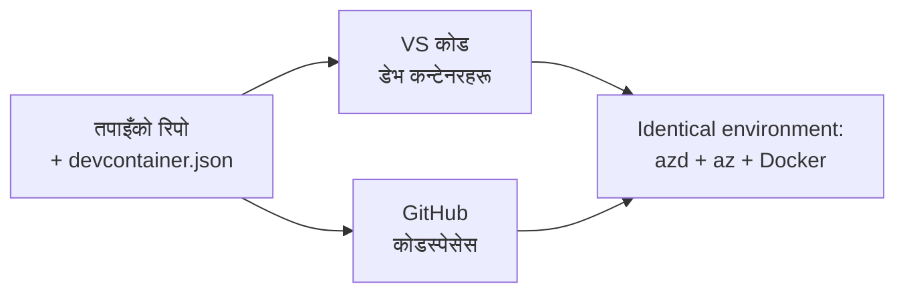

# azd का लागि Dev Containers र GitHub Codespaces

**अध्याय नेविगेसन:**
- **📚 कोर्स होम**: [शुरुआतीहरूका लागि AZD](../../README.md)
- **📖 वर्तमान अध्याय**: अध्याय 1 - आधार र छिटो सुरुवात
- **⬅️ अघिल्लो**: [आफ्नै एप ल्याउनुहोस्](bring-your-own-app.md)
- **🚀 अर्को अध्याय**: [अध्याय 2: एआई-प्रथम विकास](../chapter-02-ai-development/README.md)

> जुलाई 2026 मा `azd 1.27.1` विरुद्ध प्रमाणित।

## परिचय

azd, सही भाषा रनटाइम, Docker, र Azure CLI हरेक मेशिनमा स्थापना गर्नु झन्झटिलो हुन्छ—र यो नै प्रमुख कारण हो जुन एउटा "मेरो मेशिनमा काम गर्ने" ट्यूटोरियल अरू कसैको लागि काम गर्दैन। एउटा **dev container** ले यो समस्या हल गर्छ तपाईंको सम्पूर्ण उपकरण श्रृंखलालाई एउटा फाइलमा वर्णन गरेर। जसले पनी प्रोजेक्ट VS Code वा GitHub Codespaces मा खोल्छ, उसलाई ठीक त्यही वातावरण प्राप्त हुन्छ, जहाँ azd पहिल्यै स्थापित हुन्छ। यस पाठले तपाईंलाई कसरी एउटा थप्ने देखाउँछ।

## सिकाइ लक्ष्यहरू

यो पाठको अन्त्यमा, तपाईंले:
- dev container के हो र किन यो azd संग मद्दत गर्छ बुझ्न सक्नुहुनेछ
- प्रोजेक्टमा न्यूनतम `.devcontainer/devcontainer.json` थप्न सक्नुहुनेछ
- Dev Container *फिचरहरू* मार्फत azd, Azure CLI र Docker समावेश गर्न सक्नुहुनेछ
- प्रोजेक्ट GitHub Codespaces वा VS Code मा खोल्न सक्नुहुनेछ

## सिकाइ परिणामहरू

यो पाठ पूरा गरेपछि, तपाईंले गर्न सक्नुहुनेछ:
- azd प्रोजेक्टको लागि `devcontainer.json` लेख्न
- म्यानुअल इन्स्टल बिना azd र Azure उपकरण थप्न
- कन्टेनर वा Codespace भित्रबाट `azd up` चलाउन

---

## Dev Container के हो?

एक dev container भनेको तपाईंको रिपोजिटरीभित्र `.devcontainer/devcontainer.json` फाइलले परिभाषित गरेको Docker आधारित विकास वातावरण हो। जब तपाईं प्रोजेक्ट खोल्नुहुन्छ:

- **VS Code** (Dev Containers एक्सटेन्सन सहित) कन्टेनर निर्माण गर्छ र त्यसमा जडान हुन्छ।
- **GitHub Codespaces** ले उही कन्टेनर क्लाउडमा निर्माण गर्छ र तपाईंलाई ब्राउजर-आधारित सम्पादक दिन्छ।

कुनै पनि तरिकाले, प्रत्येक सहयोगीलाई एउटै उपकरण सेट प्राप्त हुन्छ—"तिमीले azd इन्स्टल गर्यौ कि?" जस्ता समस्याहरू हुँदैनन्।



---

## चरण 1: devcontainer फाइल बनाउनुहोस्

तपाईंको प्रोजेक्टको रुटमा `.devcontainer/devcontainer.json` बनाउनुहोस्:

```json
{
  "name": "azd-project",
  "image": "mcr.microsoft.com/devcontainers/base:bookworm",
  "features": {
    "ghcr.io/devcontainers/features/azure-cli:1": {},
    "ghcr.io/azure/azure-dev/azd:latest": {},
    "ghcr.io/devcontainers/features/docker-in-docker:2": {},
    "ghcr.io/devcontainers/features/node:1": {}
  },
  "customizations": {
    "vscode": {
      "extensions": [
        "ms-azuretools.azure-dev",
        "ms-azuretools.vscode-bicep"
      ]
    }
  },
  "forwardPorts": [3000],
  "postCreateCommand": "azd version"
}
```

प्रत्येक भागले के गर्छ:

| कुञ्जी | उद्देश्य |
|-----|---------|
| `image` | कन्टेनरको आधार OS |
| `features` | प्रि-बिल्ट इन्स्टलरहरू—यहाँ: Azure CLI, **azd**, Docker, र Node.js |
| `customizations.vscode.extensions` | azd र Bicep VS Code एक्सटेन्सनहरू स्वतः इन्स्टल गर्छ |
| `forwardPorts` | तपाईंको एपको पोर्टलाई ब्राउजरमा एक्सपोज गर्छ |
| `postCreateCommand` | कन्टेनर निर्माणपछि एक पटक चल्छ (यहाँ, एक सेनेटि जाँच) |

> `ghcr.io/azure/azure-dev/azd:latest` फिचर azd कन्टेनरमा पाउनको लागि आधिकारिक विधि हो। पुनरुत्पादनको लागि एउटा निश्चित संस्करण पिन गर्नुस् (उदाहरणका लागि `azd:1.27.1`)।

---

## चरण 2: फिचरलाई तपाईंको एपको भाषासँग मिलाउनुहोस्

तपाईंको एपले जुन भाषा प्रयोग गर्छ, त्यसअनुसार `node` फिचर सट्टा राख्नुहोस्:

```jsonc
// Python project
"ghcr.io/devcontainers/features/python:1": {},

// .NET project
"ghcr.io/devcontainers/features/dotnet:2": {},

// Java project
"ghcr.io/devcontainers/features/java:1": {},

// Go project
"ghcr.io/devcontainers/features/go:1": {}
```

यदि तपाईंको `host` `containerapp`, `aks`, वा कन्टेनर इमेज निर्माण गर्ने केही हो भने `docker-in-docker` राख्नुहोस्—azd ले Docker को प्रयोग गरेर इमेज बनाइन्छ र पठाइन्छ।

---

## चरण 3: यसलाई खोल्नुहोस्

**VS Code मा:**
1. **Dev Containers** एक्सटेन्सन इन्स्टल गर्नुहोस्।
2. प्रोजेक्ट फोल्डर खोल्नुहोस्।
3. जब सोधिन्छ **Reopen in Container** मा क्लिक गर्नुहोस् (वा *Dev Containers: Reopen in Container* चलाउनुहोस्)।

**GitHub Codespaces मा:**
1. репो GitHub मा पुश गर्नुहोस्।
2. **Code → Codespaces → Create codespace on main** मा क्लिक गर्नुहोस्।
3. कन्टेनर बनाउन पर्खनुहोस्—azd टर्मिनलमा तयार हुन्छ।

---

## चरण 4: कन्टेनर भित्रबाट डिप्लोय गर्नुहोस्

कन्टेनरमा azd पहिल्यै स्थापित छ, त्यसैले सामान्य workflow ले काम गर्छ:

```bash
azd auth login --use-device-code   # डिभाइस कोड Codespaces भित्र उपयोगी हुन्छ
azd up
```

> **किन `--use-device-code`?** रिमोट कन्टेनर वा Codespace मा स्थानीय ब्राउजर हुँदैन, त्यसैले device-code लगइन विश्वसनीय बाटो हो। तपाईंले लगइन पूरा गर्न ब्राउजर ट्याबमा कोड टाँस्नुहुनेछ।

---

## सामान्य समस्याहरू

| समस्या | समाधान |
|---------|-----|
| `azd up` ले इमेज बनाउन सक्दैन | `docker-in-docker` फिचर थप्नुहोस् |
| Codespaces मा ब्राउजर लगइन रोकिएको छ | `azd auth login --use-device-code` प्रयोग गर्नुहोस् |
| टिमका सदस्यहरूका उपकरण फरक छन् | फिचर संस्करणहरू पिन गर्नुहोस् (जस्तै `azd:1.27.1`) |
| ब्राउजरमा एप पहुँच योग्य छैन | `forwardPorts` मा पोर्ट थप्नुहोस् |

---

## सारांश

- एउटा dev container ले तपाईंको azd उपकरण श्रृंखला सबैका लागि पुनरुत्पादनयोग्य बनाउँछ।
- Dev Container *फिचरहरू* मार्फत azd, Azure CLI, र Docker थप्नुहोस्।
- तपाईंको एपको भाषा फिचरसँग मिलाउनुहोस् र कन्टेनर होस्टहरूका लागि `docker-in-docker` राख्नुहोस्।
- Codespaces भित्र चलाउँदा device-code लगइन प्रयोग गर्नुहोस्।

---

## 🔗 नेविगेसन

| दिशा | स्रोत |
|-----------|----------|
| **अघिल्लो** | [आफ्नै एप ल्याउनुहोस्](bring-your-own-app.md) |
| **अध्याय होम** | [अध्याय 1: आधार र छिटो सुरुवात](README.md) |
| **अर्को अध्याय** | [अध्याय 2: एआई-प्रथम विकास](../chapter-02-ai-development/README.md) |

## 📖 सम्बन्धित स्रोतहरू

- [स्थापना र सेटअप](installation.md)
- [कमाण्ड चिट शीट](../../resources/cheat-sheet.md)
- [औपचारिक Dev Containers विनिर्देशन](https://containers.dev/)
- [azd Dev Container फिचर](https://github.com/Azure/azure-dev/tree/main/ext/devcontainer)

---

<!-- CO-OP TRANSLATOR DISCLAIMER START -->
**अस्वीकरण**:
यो दस्तावेज़ AI अनुवाद सेवा [Co-op Translator](https://github.com/Azure/co-op-translator) प्रयोग गरेर अनुवाद गरिएको हो। हामी सही हुन प्रयास गर्छौं, तर कृपया जानकार हुनुस् कि स्वचालित अनुवादमा त्रुटिहरू वा अशुद्धताहरू हुन सक्छन्। मूल दस्तावेज़ यसको मूल भाषामा आधिकारिक स्रोत मानिनुपर्छ। महत्वपूर्ण जानकारीका लागि व्यावसायिक मानव अनुवाद सिफारिस गरिन्छ। यस अनुवादको प्रयोगबाट उत्पन्न कुनै पनि गलत बुझाइ वा त्रुटिको लागि हामी जिम्मेवार छैनौं।
<!-- CO-OP TRANSLATOR DISCLAIMER END -->