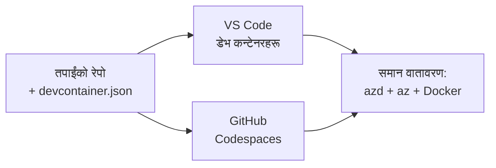

# azd का लागि Dev Containers र GitHub Codespaces

**अध्याय नेभिगेसन:**
- **📚 Course Home**: [सुरुवातकर्ताहरूका लागि AZD](../../README.md)
- **📖 Current Chapter**: अध्याय 1 - आधार र छिटो सुरु
- **⬅️ Previous**: [आफ्नै एप ल्याउनुहोस्](bring-your-own-app.md)
- **🚀 Next Chapter**: [अध्याय २: AI-प्रथम विकास](../chapter-02-ai-development/README.md)

> `azd 1.25.6` सँग जून 2026 मा प्रमाणित गरियो।

## परिचय

प्रत्येक मेशिनमा azd, उपयुक्त भाषा रनटाइम, Docker, र Azure CLI स्थापना गर्नु श्रमपूर्ण हुन्छ—र यो नै नम्बर-एक कारण हो कि "मेरो मेसिनमा काम गर्छ" भनिएको ट्युटोरियल कसैका लागि काम गर्दैन। एउटा dev container ले यो समस्यालाई फाइलमा तपाइँको सम्पूर्ण टुलचेन वर्णन गरेर समाधान गर्छ। जसले पनि प्रोजेक्ट VS Code वा GitHub Codespaces मा खोल्छ, उसलाई ठीक उस्तै वातावरण प्राप्त हुन्छ, azd पहिले नै इन्स्टल गरिएको हुन्छ। यो पाठले कसरी एउटा dev container जोड्ने देखाउँछ।

## सिक्ने लक्ष्यहरू

यस पाठको अन्त्यसम्म, तपाइँले:
- dev container के हो र यो azd सँग किन सहयोगी हुन्छ बुझ्ने मात्र
- प्रोजेक्टमा न्यूनतम `.devcontainer/devcontainer.json` थप्ने
- Dev Container *features* मार्फत azd, Azure CLI, र Docker समावेश गर्ने
- प्रोजेक्ट GitHub Codespaces वा VS Code मा खोल्ने

## सिकाइका परिणाम

यो पाठ पूरा गरेपछि, तपाइँ सक्षम हुनुहुनेछ:
- azd प्रोजेक्टका लागि `devcontainer.json` लेख्न
- म्यानुअल इन्स्टल बिना azd र Azure उपकरणहरू थप्न
- कन्टेनर वा Codespace भित्रबाट `azd up` चलाउन

---

## Dev Container के हो?

dev container तपाइँको रिपोजिटरीको `.devcontainer/devcontainer.json` फाइलद्वारा परिभाषित Docker-आधारित विकास वातावरण हो। जब तपाइँ प्रोजेक्ट खोल्नुहुन्छ:

- **VS Code** (Dev Containers एक्सटेन्सनसँग) कन्टेनर बनाउँछ र त्यसमा जडान हुन्छ।
- **GitHub Codespaces** ले क्लाउडमा उस्तै कन्टेनर बनाउँछ र तपाइँलाई ब्राउजर-आधारित सम्पादक दिन्छ।

दुवै अवस्थामा, प्रत्येक योगदानकर्ता समान टुलहरू पाउँछन्—"के तपाइँले azd इन्स्टल गर्नुभयो?" भन्ने ट्रबलशुटिङ हुँदैन।



---

## चरण 1: devcontainer फाइल सिर्जना गर्नुहोस्

प्रोजेक्टको रुटमा `.devcontainer/devcontainer.json` सिर्जना गर्नुहोस्:

```json
{
  "name": "azd-project",
  "image": "mcr.microsoft.com/devcontainers/base:bookworm",
  "features": {
    "ghcr.io/devcontainers/features/azure-cli:1": {},
    "ghcr.io/azure/azure-dev/azd:latest": {},
    "ghcr.io/devcontainers/features/docker-in-docker:2": {},
    "ghcr.io/devcontainers/features/node:1": {}
  },
  "customizations": {
    "vscode": {
      "extensions": [
        "ms-azuretools.azure-dev",
        "ms-azuretools.vscode-bicep"
      ]
    }
  },
  "forwardPorts": [3000],
  "postCreateCommand": "azd version"
}
```

हरेक भागले के गर्छ:

| Key | Purpose |
|-----|---------|
| `image` | कन्टेनरको आधार OS |
| `features` | पूर्वनिर्मित इन्स्टलरहरू—यहाँ: Azure CLI, **azd**, Docker, र Node.js |
| `customizations.vscode.extensions` | azd र Bicep VS Code एक्सटेन्सनहरू आत्म-इन्स्टल गर्छ |
| `forwardPorts` | तपाइँको एपको पोर्टलाई ब्राउजरमा एक्स्पोज गर्छ |
| `postCreateCommand` | कन्टेनर बनिसकेपछि एक पटक चल्छ (यहाँ, एक सन्टी चेकर) |

> `ghcr.io/azure/azure-dev/azd:latest` फीचर कन्टेनरमा azd प्राप्त गर्ने आधिकारिक तरिका हो। पुनरुत्पादनयोग्यताका लागि विशेष भर्सन पिन गर्नुहोस् (उदाहरणका लागि `azd:1.25.6`)।

---

## चरण 2: फीचरलाई तपाइँको एपको भाषासँग मेल गर्नुहोस्

तपाइँको एपले जुन भाषा प्रयोग गर्छ त्यसअनुसार `node` फीचर बदल्नुहोस्:

```jsonc
// Python project
"ghcr.io/devcontainers/features/python:1": {},

// .NET project
"ghcr.io/devcontainers/features/dotnet:2": {},

// Java project
"ghcr.io/devcontainers/features/java:1": {},

// Go project
"ghcr.io/devcontainers/features/go:1": {}
```

यदि तपाइँको `host` `containerapp`, `aks`, वा कुनै पनि यस्तो हो जसले कन्टेनर इमेज बनाउँछ भने `docker-in-docker` राख्नुहोस्—azd लाई इमेज बनाइ धकेल्न Docker चाहिन्छ।

---

## चरण 3: यसलाई खोल्नुहोस्

**VS Code मा:**
1. **Dev Containers** एक्सटेन्सन स्थापना गर्नुहोस्।
2. प्रोजेक्ट फोल्डर खोल्नुहोस्।
3. सोधिएपछि **Reopen in Container** मा क्लिक गर्नुहोस् (वा *Dev Containers: Reopen in Container* चलाउनुहोस्)।

**GitHub Codespaces मा:**
1. रिपो GitHub मा पुस गर्नुहोस्।
2. **Code → Codespaces → Create codespace on main** मा क्लिक गर्नुहोस्।
3. कन्टेनर बनिनुまで पर्खनुहोस्—टर्मिनलमा azd तयार हुनेछ।

---

## चरण 4: कन्टेनर भित्रबाट डिप्लोय गर्नुहोस्

कन्टेनरमा azd पहिले नै इन्स्टल भएको हुन्छ, त्यसैले सामान्य वर्कफ्लो नै काम गर्छ:

```bash
azd auth login --use-device-code   # डिभाइस कोड Codespaces भित्र उपयोगी छ
azd up
```

> **किन `--use-device-code`?** रिमोट कन्टेनर वा Codespace भित्र स्थानीय ब्राउजर रिडाइरेक्ट गर्न सकिंदैन, त्यसैले डिभाइस-कोड लगइन भरपर्दो बाटो हो। तपाइँले साइन-इन पूरा गर्न ब्राउजर ट्याबमा कोड पेस्ट गर्नुहुनेछ।

---

## सामान्य समस्याहरू

| Pitfall | Fix |
|---------|-----|
| `azd up` can't build an image | `docker-in-docker` फीचर थप्नुहोस् |
| Browser login hangs in Codespaces | `azd auth login --use-device-code` प्रयोग गर्नुहोस् |
| Tools differ between teammates | फीचर भर्सनहरू पिन गर्नुहोस् (जस्तै `azd:1.25.6`) |
| App not reachable in browser | पोर्टलाई `forwardPorts` मा थप्नुहोस् |

---

## सारांश

- dev container ले तपाइँको azd टुलचेन सबैका लागि पुनरुत्पादनयोग्य बनाउँछ।
- Dev Container *features* मार्फत azd, Azure CLI, र Docker थप्नुहोस्।
- तपाइँको एपको लागि भाषा फीचर मिलाउनुहोस् र कन्टेनर होस्टहरूका लागि `docker-in-docker` राख्नुहोस्।
- Codespaces भित्र चलाउँदा डिभाइस-कोड लगइन प्रयोग गर्नुहोस्।

---

## 🔗 नेभिगेसन

| Direction | Resource |
|-----------|----------|
| **Previous** | [आफ्नै एप ल्याउनुहोस्](bring-your-own-app.md) |
| **Chapter Home** | [अध्याय 1: आधार र छिटो सुरु](README.md) |
| **Next Chapter** | [अध्याय २: AI-प्रथम विकास](../chapter-02-ai-development/README.md) |

## 📖 सम्बन्धित स्रोतहरू

- [स्थापना र सेटअप](installation.md)
- [कमाण्ड चीट शीट](../../resources/cheat-sheet.md)
- [आधिकारिक Dev Containers विनिर्देशन](https://containers.dev/)
- [azd Dev Container सुविधा](https://github.com/Azure/azure-dev/tree/main/ext/devcontainer)

---

<!-- CO-OP TRANSLATOR DISCLAIMER START -->
**अस्वीकरण**:
यो दस्तावेज़ AI अनुवाद सेवा [Co-op Translator](https://github.com/Azure/co-op-translator) प्रयोग गरेर अनुवाद गरिएको हो। हामी सही हुन प्रयास गर्छौं, तर कृपया जानकार हुनुस् कि स्वचालित अनुवादमा त्रुटिहरू वा अशुद्धताहरू हुन सक्छन्। मूल दस्तावेज़ यसको मूल भाषामा आधिकारिक स्रोत मानिनुपर्छ। महत्वपूर्ण जानकारीका लागि व्यावसायिक मानव अनुवाद सिफारिस गरिन्छ। यस अनुवादको प्रयोगबाट उत्पन्न कुनै पनि गलत बुझाइ वा त्रुटिको लागि हामी जिम्मेवार छैनौं।
<!-- CO-OP TRANSLATOR DISCLAIMER END -->