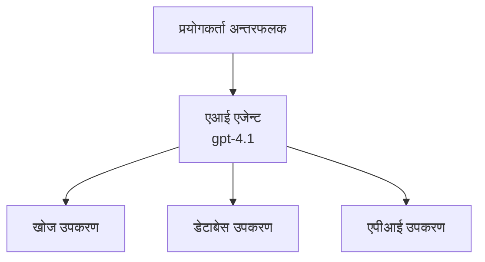
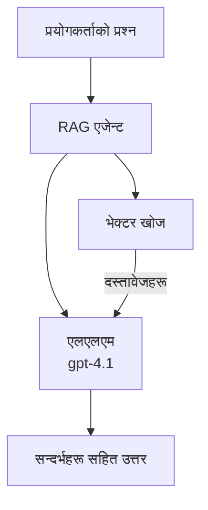
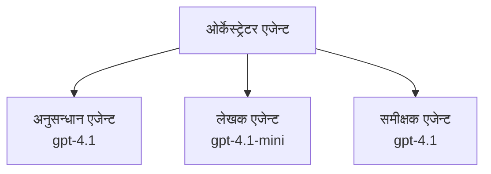

# Azure Developer CLI सँग AI एजेन्टहरू

**Chapter Navigation:**
- **📚 Course Home**: [AZD For Beginners](../../README.md)
- **📖 Current Chapter**: Chapter 2 - AI-First Development
- **⬅️ Previous**: [Microsoft Foundry Integration](microsoft-foundry-integration.md)
- **➡️ Next**: [AI Model Deployment](ai-model-deployment.md)
- **🚀 Advanced**: [Multi-Agent Solutions](../../examples/retail-scenario.md)

---

## परिचय

AI एजेन्टहरू स्वतन्त्र प्रोग्रामहरू हुन् जसले आफ्नो वातावरण पहिचान गर्न, निर्णय लिन, र निश्चित लक्ष्यहरू प्राप्त गर्न कार्यहरू लिन सक्छन्। साधारण प्रॉम्प्ट-आधारित च्याटबटहरू जसले जवाफ दिन्छन् भन्दा फरक रूपमा, एजेन्टहरूले:

- **उपकरणहरू प्रयोग गर्न सक्छन्** - API कल गर्न, डाटाबेस खोज्न, कोड चलाउन
- **योजना र तर्क गर्न सक्छन्** - जटिल कार्यहरूलाई चरणहरूमा विभाजन गर्न
- **सन्दर्भबाट सिक्न सक्छन्** - सम्झना कायम राख्न र व्यवहार अनुकूलन गर्न
- **सहकार्य गर्न सक्छन्** - अन्य एजेन्टहरूसँग काम गर्न (मल्टी-एजेन्ट प्रणालीहरू)

यो मार्गदर्शिकाले Azure मा Azure Developer CLI (azd) प्रयोग गरी AI एजेन्टहरू कसरी डिप्लोय गर्ने देखाउँछ।

## सिकाइ लक्ष्यहरू

यस मार्गदर्शिका पूरा गरेपछि, तपाईं:
- AI एजेन्टहरू के हुन् र तिनीहरू च्याटबटहरूसँग कसरी फरक छन् बुझ्नुहुनेछ
- AZD प्रयोग गरी पूर्व-निर्मित AI एजेन्ट टेम्प्लेटहरू डिप्लोय गर्न सक्नुहुनेछ
- कस्टम एजेन्टहरूको लागि Foundry Agents कन्फिगर गर्न सक्षम हुनुहुनेछ
- आधारभूत एजेन्ट ढाँचाहरू लागू गर्न सक्नुहुनेछ (टुल प्रयोग, RAG, मल्टी-एजेन्ट)
- डिप्लोय गरिएका एजेन्टहरू अनुगमन र डिबग गर्न सक्नुहुनेछ

## सिकाइ नतिजाहरू

पूरा गरेपछि, तपाईं सक्षम हुनुहुनेछ:
- एकै कमाण्डमा Azure मा AI एजेन्ट एप्लिकेसनहरू डिप्लोय गर्न
- एजेन्ट उपकरणहरू र क्षमताहरू कन्फिगर गर्न
- एजेन्टहरूसँग retrieval-augmented generation (RAG) लागू गर्न
- जटिल वर्कफ्लोहरूको लागि मल्टी-एजेन्ट आर्किटेक्चर डिजाइन गर्न
- सामान्य एजेन्ट डिप्लोयमेन्ट समस्याहरू ट्रबलशूट गर्न

---

## 🤖 एजेन्टलाई च्याटबटबाट केले फरक बनाउँछ?

| Feature | Chatbot | AI Agent |
|---------|---------|----------|
| **Behavior** | Responds to prompts | Takes autonomous actions |
| **Tools** | None | Can call APIs, search, execute code |
| **Memory** | Session-based only | Persistent memory across sessions |
| **Planning** | Single response | Multi-step reasoning |
| **Collaboration** | Single entity | Can work with other agents |

### सरल उपमा

- **Chatbot** = एउटा सूचना डेस्कमा प्रश्नहरूको जवाफ दिने सहयोगी व्यक्ति
- **AI Agent** = व्यक्तिगत सहायक जसले कल गर्न, भेटघाट बुक गर्न, र तपाईंका लागि कार्यहरू पूरा गर्न सक्छ

---

## 🚀 छिटो सुरुवात: आफ्नो पहिलो एजेन्ट डिप्लोय गर्नुहोस्

### विकल्प 1: Foundry Agents टेम्प्लेट (सिफारिस गरिएको)

```bash
# AI एजेन्टहरूको टेम्पलेट प्रारम्भ गर्नुहोस्
azd init --template get-started-with-ai-agents

# Azure मा तैनाथ गर्नुहोस्
azd up
```

**के डिप्लोय हुन्छ:**
- ✅ Foundry Agents
- ✅ Microsoft Foundry Models (gpt-4.1)
- ✅ Azure AI Search (RAG का लागि)
- ✅ Azure Container Apps (वेब इन्टरफेस)
- ✅ Application Insights (मोनिटरिङ)

**समय:** ~15-20 मिनेट
**लागत:** ~$100-150/महिना (डेभलपमेन्ट)

### विकल्प 2: Prompty सहित OpenAI Agent

```bash
# Prompty-आधारित एजेन्ट टेम्पलेट आरम्भ गर्नुहोस्
azd init --template agent-openai-python-prompty

# Azure मा तैनाथ गर्नुहोस्
azd up
```

**के डिप्लोय हुन्छ:**
- ✅ Azure Functions (सर्भरलेस एजेन्ट निष्पादन)
- ✅ Microsoft Foundry Models
- ✅ Prompty कन्फिगरेसन फाइलहरू
- ✅ नमुना एजेन्ट कार्यान्वयन

**समय:** ~10-15 मिनेट
**लागत:** ~$50-100/महिना (डेभलपमेन्ट)

### विकल्प 3: RAG च्याट एजेन्ट

```bash
# RAG च्याट टेम्पलेट प्रारम्भ गर्नुहोस्
azd init --template azure-search-openai-demo

# Azure मा तैनाथ गर्नुहोस्
azd up
```

**के डिप्लोय हुन्छ:**
- ✅ Microsoft Foundry Models
- ✅ Azure AI Search नमुना डाटासँग
- ✅ दस्तावेज प्रशोधन पाइपलाइन
- ✅ उद्धरण सहितको च्याट इन्टरफेस

**समय:** ~15-25 मिनेट
**लागत:** ~$80-150/महिना (डेभलपमेन्ट)

### विकल्प 4: AZD AI Agent Init (म्यानिफेस्ट-आधारित)

यदि तपाइँसँग एजेन्ट म्यानिफेस्ट फाइल छ भने, `azd ai` कमाण्ड प्रयोग गरी Foundry Agent Service प्रोजेक्ट प्रत्यक्ष रूपमा स्केफोल्ड गर्न सक्नुहुन्छ:

```bash
# AI एजेन्टहरू एक्सटेन्सन इन्स्टल गर्नुहोस्
azd extension install azure.ai.agents

# एजेन्ट म्यानिफेस्टबाट आरम्भ गर्नुहोस्
azd ai agent init -m agent-manifest.yaml

# Azure मा परिनियोजन गर्नुहोस्
azd up
```

**कहिले `azd ai agent init` vs `azd init --template` प्रयोग गर्ने:**

| Approach | Best For | How It Works |
|----------|----------|------|
| `azd init --template` | Starting from a working sample app | Clones a full template repo with code + infra |
| `azd ai agent init -m` | Building from your own agent manifest | Scaffolds project structure from your agent definition |

> **सुझाव:** सिक्ने क्रममा `azd init --template` प्रयोग गर्नुहोस् (माथिका विकल्प 1-3)। आफ्नै म्यानिफेस्टहरूसँग उत्पादन एजेन्टहरू निर्माण गर्दा `azd ai agent init` प्रयोग गर्नुहोस्। पूर्ण सन्दर्भका लागि हेर्नुहोस् [AZD AI CLI Commands](../chapter-08-production/production-ai-practices.md#azd-ai-cli-commands-and-extensions)।

---

## 🏗️ एजेन्ट आर्किटेक्चर ढाँचाहरू

### ढाँचा 1: उपकरणहरूसँग एकल एजेन्ट

सबभन्दा सरल एजेन्ट ढाँचा - एउटै एजेन्ट जसले धेरै उपकरणहरू प्रयोग गर्न सक्छ।


**उपयुक्त लागि:**
- ग्राहक सहायता बोटहरू
- अनुसन्धान सहायकहरू
- डाटा विश्लेषण एजेन्टहरू

**AZD Template:** `azure-search-openai-demo`

### ढाँचा 2: RAG एजेन्ट (Retrieval-Augmented Generation)

प्रतिक्रिया जनाउनुअघि सम्बन्धित दस्तावेजहरू खोज्ने एजेन्ट।


**उपयुक्त लागि:**
- उद्यम ज्ञान आधारहरू
- दस्तावेज Q&A प्रणालीहरू
- अनुपालन र कानुनी अनुसन्धान

**AZD Template:** `azure-search-openai-demo`

### ढाँचा 3: मल्टी-एजेन्ट सिस्टम

जटिल कार्यहरूमा सँगै काम गर्ने धेरै विशेषज्ञ एजेन्टहरू।


**उपयुक्त लागि:**
- जटिल सामग्री सिर्जना
- बहु-चरण वर्कफ्लोहरू
- विभिन्न विशेषज्ञता आवश्यक पर्ने कार्यहरू

**थप जान्नुहोस्:** [Multi-Agent Coordination Patterns](../chapter-06-pre-deployment/coordination-patterns.md)

---

## ⚙️ एजेन्ट उपकरणहरू कन्फिगर गर्दै

एजेन्टहरू उपकरणहरू प्रयोग गर्दा शक्तिशाली बन्छन्। यहाँ सामान्य उपकरणहरू कसरी कन्फिगर गर्ने देखाइएको छ:

### Foundry Agents मा टुल कन्फिगरेसन

```python
# agent_config.py
from azure.ai.projects import AIProjectClient
from azure.ai.projects.models import FunctionTool, CodeInterpreterTool

# अनुकूलित उपकरणहरू परिभाषित गर्नुहोस्
search_tool = FunctionTool(
    name="search_knowledge_base",
    description="Search the company knowledge base for relevant documents",
    parameters={
        "type": "object",
        "properties": {
            "query": {
                "type": "string",
                "description": "The search query"
            }
        },
        "required": ["query"]
    }
)

# उपकरणहरूसँग एजेन्ट सिर्जना गर्नुहोस्
agent = project_client.agents.create_agent(
    model="gpt-4.1",
    name="Support Agent",
    instructions="You are a helpful support agent. Use the search tool to find relevant information.",
    tools=[search_tool, CodeInterpreterTool()]
)
```

### वातावरण कन्फिगरेसन

```bash
# एजेन्ट-विशिष्ट वातावरण चरहरू कन्फिगर गर्नुहोस्
azd env set AZURE_OPENAI_MODEL "gpt-4.1"
azd env set AGENT_INSTRUCTIONS "You are a helpful assistant..."
azd env set ENABLE_CODE_INTERPRETER "true"
azd env set ENABLE_FILE_SEARCH "true"

# अद्यावधिक विन्याससहित तैनात गर्नुहोस्
azd deploy
```

---

## 📊 एजेन्टहरू अनुगमन

### Application Insights एकीकरण

सबै AZD एजेन्ट टेम्प्लेटहरूमा मोनिटरिङका लागि Application Insights समावेश हुन्छ:

```bash
# अनुगमन ड्यासबोर्ड खोल्नुहोस्
azd monitor --overview

# सजीव लगहरू हेर्नुहोस्
azd monitor --logs

# सजीव मेट्रिक्स हेर्नुहोस्
azd monitor --live
```

### ट्र्याक गर्ने मुख्य मेट्रिक्स

| Metric | Description | Target |
|--------|-------------|--------|
| Response Latency | Time to generate response | < 5 seconds |
| Token Usage | Tokens per request | Monitor for cost |
| Tool Call Success Rate | % of successful tool executions | > 95% |
| Error Rate | Failed agent requests | < 1% |
| User Satisfaction | Feedback scores | > 4.0/5.0 |

### एजेन्टहरूको लागि अनुकूल लगिङ

```python
import os
from azure.monitor.opentelemetry import configure_azure_monitor
from opentelemetry import trace

# OpenTelemetry सँग Azure Monitor कन्फिगर गर्नुहोस्
configure_azure_monitor(
    connection_string=os.environ["APPLICATIONINSIGHTS_CONNECTION_STRING"]
)

tracer = trace.get_tracer(__name__)

def log_agent_interaction(user_query, agent_response, tools_used, latency_ms):
    with tracer.start_as_current_span("agent_interaction") as span:
        span.set_attributes({
            "user_query": user_query,
            "response_length": len(agent_response),
            "tools_used": tools_used,
            "latency_ms": latency_ms
        })
```

> **नोट:** आवश्यक प्याकेजहरू स्थापना गर्नुहोस्: `pip install azure-monitor-opentelemetry opentelemetry`

---

## 💰 लागत विचारहरू

### ढाँचाअनुसार अनुमानित मासिक लागत

| Pattern | Dev Environment | Production |
|---------|-----------------|------------|
| Single Agent | $50-100 | $200-500 |
| RAG Agent | $80-150 | $300-800 |
| Multi-Agent (2-3 agents) | $150-300 | $500-1,500 |
| Enterprise Multi-Agent | $300-500 | $1,500-5,000+ |

### लागत अनुकूलन सुझावहरू

1. **साधारण कार्यहरूको लागि gpt-4.1-mini प्रयोग गर्नुहोस्**
   ```bash
   azd env set AZURE_OPENAI_MODEL "gpt-4.1-mini"
   ```

2. **दोहरिने प्रश्नहरूको लागि क्याचिङ लागू गर्नुहोस्**
   ```python
   from functools import lru_cache
   
   @lru_cache(maxsize=1000)
   def get_cached_response(query_hash):
       return agent.run(query_hash)
   ```

3. **प्रति रन टोकन सीमाहरू सेट गर्नुहोस्**
   ```python
   # एजेन्ट चलाउँदा max_completion_tokens सेट गर्नुहोस्, सिर्जना गर्दा होइन
   run = project_client.agents.create_run(
       thread_id=thread.id,
       agent_id=agent.id,
       max_completion_tokens=1000  # जवाफको लम्बाइ सीमित गर्नुहोस्
   )
   ```

4. **प्रयोगमा नरहेमा स्केल टु जीरो प्रयोग गर्नुहोस्**
   ```bash
   # कन्टेनर अनुप्रयोगहरू स्वचालित रूपमा शून्यसम्म स्केल गर्छन्
   azd env set MIN_REPLICAS "0"
   ```

---

## 🔧 एजेन्टहरू ट्रबलशूट गर्दै

### सामान्य समस्याहरू र समाधानहरू

<details>
<summary><strong>❌ उपकरण कलहरूमा एजेन्टले उत्तर दिँदैन्</strong></summary>

```bash
# उपकरणहरू ठीकसँग दर्ता भएका छन् कि छैनन् जाँच गर्नुहोस्
azd show

# OpenAI परिनियोजन जाँच गर्नुहोस्
az cognitiveservices account deployment list \
  --name $AZURE_OPENAI_NAME \
  --resource-group $RG_NAME

# एजेन्ट लगहरू जाँच गर्नुहोस्
azd monitor --logs
```

**सामान्य कारणहरू:**
- उपकरण फंक्शन सिग्नेचर मेल नहुने
- आवश्यक अनुमति हराइरहेको
- API endpoint पहुँचयोग्य छैन
</details>

<details>
<summary><strong>❌ एजेन्ट प्रतिक्रियाहरूमा उच्च लेटेन्सी</strong></summary>

```bash
# अवरोधहरूको लागि Application Insights जाँच गर्नुहोस्
azd monitor --live

# छिटो मोडेल प्रयोग गर्ने बारे विचार गर्नुहोस्
azd env set AZURE_OPENAI_MODEL "gpt-4.1-mini"
azd deploy
```

**अनुकूलन सुझावहरू:**
- स्ट्रिमिङ प्रतिक्रियाहरू प्रयोग गर्नुहोस्
- प्रतिक्रिया क्याचिङ लागू गर्नुहोस्
- सन्दर्भ विन्डो साइज घटाउनुहोस्
</details>

<details>
<summary><strong>❌ एजेन्टले गलत वा हल्युसिनेटेड जानकारी फर्काउँदैछ</strong></summary>

```python
# राम्रो सिस्टम प्रम्प्टहरू प्रयोग गरेर सुधार गर्नुहोस्
instructions = """
You are a helpful assistant. IMPORTANT:
- Only answer based on provided context
- If you don't know, say "I don't know"
- Always cite your sources
- Never make up information
"""

# ग्राउन्डिङका लागि पुनःप्राप्ति थप्नुहोस्
agent = project_client.agents.create_agent(
    model="gpt-4.1",
    instructions=instructions,
    tools=[FileSearchTool()]  # प्रतिक्रियाहरूलाई दस्तावेजहरूमा आधारित गर्नुहोस्
)
```
</details>

<details>
<summary><strong>❌ टोकन सीमा नाघिएको त्रुटिहरू</strong></summary>

```python
# सन्दर्भ विन्डो व्यवस्थापन कार्यान्वयन गर्नुहोस्
def truncate_context(messages, max_tokens=8000, model="gpt-4.1"):
    """Keep only recent messages within token limit."""
    import tiktoken
    encoding = tiktoken.encoding_for_model(model)
    total_tokens = 0
    truncated = []
    
    for msg in reversed(messages):
        msg_tokens = len(encoding.encode(msg.content))
        if total_tokens + msg_tokens > max_tokens:
            break
        truncated.insert(0, msg)
        total_tokens += msg_tokens
    
    return truncated
```
</details>

---

## 🎓 प्रायोगिक अभ्यासहरू

### अभ्यास 1: आधारभूत एजेन्ट डिप्लोय गर्नुहोस् (20 मिनेट)

**उद्देश्य:** AZD प्रयोग गरी आफ्नो पहिलो AI एजेन्ट डिप्लोय गर्नुहोस्

```bash
# चरण 1: टेम्पलेट आरम्भ गर्नुहोस्
azd init --template get-started-with-ai-agents

# चरण 2: Azure मा लगइन गर्नुहोस्
azd auth login

# चरण 3: परिनियोजन गर्नुहोस्
azd up

# चरण 4: एजेन्ट परीक्षण गर्नुहोस्
# परिनियोजन पछि अपेक्षित आउटपुट:
#   परिनियोजन पूरा भयो!
#   एन्डपोइन्ट: https://<app-name>.<region>.azurecontainerapps.io
# आउटपुटमा देखाइएको URL खोल्नुहोस् र प्रश्न सोधेर प्रयास गर्नुहोस्

# चरण 5: निगरानी हेर्नुहोस्
azd monitor --overview

# चरण 6: सफा गर्नुहोस्
azd down --force --purge
```

**सफलता मापदण्ड:**
- [ ] एजेन्टले प्रश्नहरूको जवाफ दिन्छ
- [ ] `azd monitor` मार्फत मोनिटरिङ ड्यासबोर्ड पहुँच गर्न सकिन्छ
- [ ] स्रोतहरू सफलतापूर्वक क्लिनअप गरियो

### अभ्यास 2: कस्टम टुल थप्नुहोस् (30 मिनेट)

**उद्देश्य:** एजेन्टलाई कस्टम टुलले विस्तार गर्नुहोस्

1. एजेन्ट टेम्प्लेट डिप्लोय गर्नुहोस्:
   ```bash
   azd init --template get-started-with-ai-agents
   azd up
   ```
2. आफ्नो एजेन्ट कोडमा नयाँ टुल फंक्शन सिर्जना गर्नुहोस्:
   ```python
   def get_weather(location: str) -> str:
       """Get current weather for a location."""
       # मौसम सेवामा गरिएको API कल
       return f"Weather in {location}: Sunny, 72°F"
   ```
3. टुललाई एजेन्टसँग रजिस्टर गर्नुहोस्:
   ```python
   from azure.ai.projects.models import FunctionTool

   weather_tool = FunctionTool(
       name="get_weather",
       description="Get current weather for a location",
       parameters={
           "type": "object",
           "properties": {
               "location": {"type": "string", "description": "City name"}
           },
           "required": ["location"]
       }
   )

   agent = project_client.agents.create_agent(
       model="gpt-4.1",
       name="Weather Agent",
       tools=[weather_tool]
   )
   ```
4. पुन:डिप्लोय र परीक्षण गर्नुहोस्:
   ```bash
   azd deploy
   # सोध्नुहोस्: "सिएटलमा मौसम कस्तो छ?"
   # अपेक्षित: एजेन्टले get_weather("Seattle") आह्वान गर्छ र मौसमको जानकारी फर्काउँछ
   ```

**सफलता मापदण्ड:**
- [ ] एजेन्टले मौसम सम्बन्धित प्रश्नहरू चिन्हित गर्छ
- [ ] टुल ठीकसँग कल गरिएको छ
- [ ] प्रतिक्रिया मौसम सम्बन्धी जानकारी समावेश गर्दछ

### अभ्यास 3: RAG एजेन्ट बनाउनुहोस् (45 मिनेट)

**उद्देश्य:** तपाइँका दस्तावेजहरूबाट प्रश्नहरूको जवाफ दिने एजेन्ट सिर्जना गर्नुहोस्

```bash
# चरण 1: RAG टेम्प्लेट परिनियोजन गर्नुहोस्
azd init --template azure-search-openai-demo
azd up

# चरण 2: आफ्नो कागजातहरू अपलोड गर्नुहोस्
# PDF/TXT फाइलहरू data/ निर्देशिकामा राख्नुहोस्, त्यसपछि चलाउनुहोस्:
python scripts/prepdocs.py

# चरण 3: डोमेन-विशिष्ट प्रश्नहरूसँग परीक्षण गर्नुहोस्
# azd up आउटपुटबाट वेब एपको URL खोल्नुहोस्
# आफ्ना अपलोड गरिएका कागजातहरूबारे प्रश्नहरू सोध्नुहोस्
# प्रतिक्रियाहरूले [doc.pdf] जस्ता उद्धरण सन्दर्भहरू समावेश गर्नुपर्छ
```

**सफलता मापदण्ड:**
- [ ] एजेन्ट अपलोड गरिएका दस्तावेजहरूबाट जवाफ दिन्छ
- [ ] प्रतिक्रियाहरूमा उद्धरणहरू समावेश छन्
- [ ] सीमा बाहिरका प्रश्नहरूमा हल्युसिनेशन छैन

---

## 📚 थप कदमहरू

अब जब तपाईंले AI एजेन्टहरू बुझ्नुभयो, यी उन्नत विषयहरू अन्वेषण गर्नुहोस्:

| Topic | Description | Link |
|-------|-------------|------|
| **Multi-Agent Systems** | Build systems with multiple collaborating agents | [Retail Multi-Agent Example](../../examples/retail-scenario.md) |
| **Coordination Patterns** | Learn orchestration and communication patterns | [Coordination Patterns](../chapter-06-pre-deployment/coordination-patterns.md) |
| **Production Deployment** | Enterprise-ready agent deployment | [Production AI Practices](../chapter-08-production/production-ai-practices.md) |
| **Agent Evaluation** | Test and evaluate agent performance | [AI Troubleshooting](../chapter-07-troubleshooting/ai-troubleshooting.md) |
| **AI Workshop Lab** | Hands-on: Make your AI solution AZD-ready | [AI Workshop Lab](ai-workshop-lab.md) |

---

## 📖 अतिरिक्त स्रोतहरू

### आधिकारिक डकुमेन्टेशन
- [Azure AI Agent Service](https://learn.microsoft.com/azure/ai-services/agents/)
- [Azure AI Foundry Agent Service Quickstart](https://learn.microsoft.com/azure/ai-services/agents/quickstart)
- [Semantic Kernel Agent Framework](https://learn.microsoft.com/semantic-kernel/)

### एजेन्टहरूका लागि AZD टेम्प्लेटहरू
- [Get Started with AI Agents](https://github.com/Azure-Samples/get-started-with-ai-agents)
- [Agent OpenAI Python Prompty](https://github.com/Azure-Samples/agent-openai-python-prompty)
- [Azure Search OpenAI Demo](https://github.com/Azure-Samples/azure-search-openai-demo)

### समुदाय स्रोतहरू
- [Awesome AZD - Agent Templates](https://azure.github.io/awesome-azd/?tags=ai-agents)
- [Azure AI Discord](https://discord.gg/microsoft-azure)
- [Microsoft Foundry Discord](https://discord.gg/nTYy5BXMWG)

### तपाइँको सम्पादनकर्ताका लागि एजेन्ट स्किलहरू
- [**Microsoft Azure Agent Skills**](https://skills.sh/microsoft/github-copilot-for-azure) - GitHub Copilot, Cursor, वा कुनै पनि समर्थित एजेन्टमा Azure विकासका लागि पुन:प्रयोगयोग्य AI एजेन्ट कौशलहरू इन्स्टल गर्नुहोस्। यसमा [Azure AI](https://skills.sh/microsoft/github-copilot-for-azure/azure-ai), [Microsoft Foundry](https://skills.sh/microsoft/github-copilot-for-azure/microsoft-foundry), [deployment](https://skills.sh/microsoft/github-copilot-for-azure/azure-deploy), र [diagnostics](https://skills.sh/microsoft/github-copilot-for-azure/azure-diagnostics) का लागि कौशलहरू समावेश छन्:
  ```bash
  npx skills add microsoft/github-copilot-for-azure
  ```

---

**Navigation**
- **Previous Lesson**: [Microsoft Foundry Integration](microsoft-foundry-integration.md)
- **Next Lesson**: [AI Model Deployment](ai-model-deployment.md)

---

<!-- CO-OP TRANSLATOR DISCLAIMER START -->
अस्वीकरण:
यो कागजात AI अनुवाद सेवा Co-op Translator (https://github.com/Azure/co-op-translator) प्रयोग गरी अनुवाद गरिएको हो। हामी शुद्धताका लागि प्रयासरत हुनु भए तापनि, कृपया ध्यान दिनुहोस् कि स्वचालित अनुवादमा त्रुटि वा असामञ्जस्यता हुन सक्नेछ। मूल कागजातलाई यसको मूल भाषामा प्राधिकृत स्रोतको रूपमा मानिनु पर्छ। महत्वपूर्ण जानकारीका लागि व्यावसायिक मानव अनुवाद सिफारिस गरिन्छ। यस अनुवादको प्रयोगबाट उत्पन्न हुने कुनै पनि गलतफहमी वा गलत व्याख्याका लागि हामी जिम्मेवार छैनौं।
<!-- CO-OP TRANSLATOR DISCLAIMER END -->