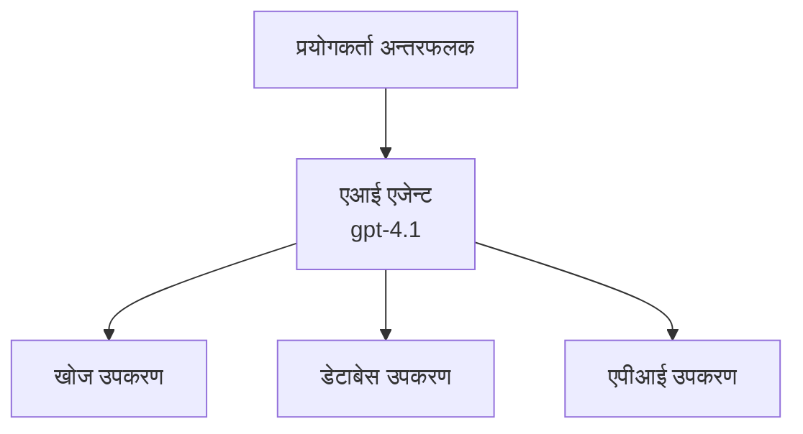
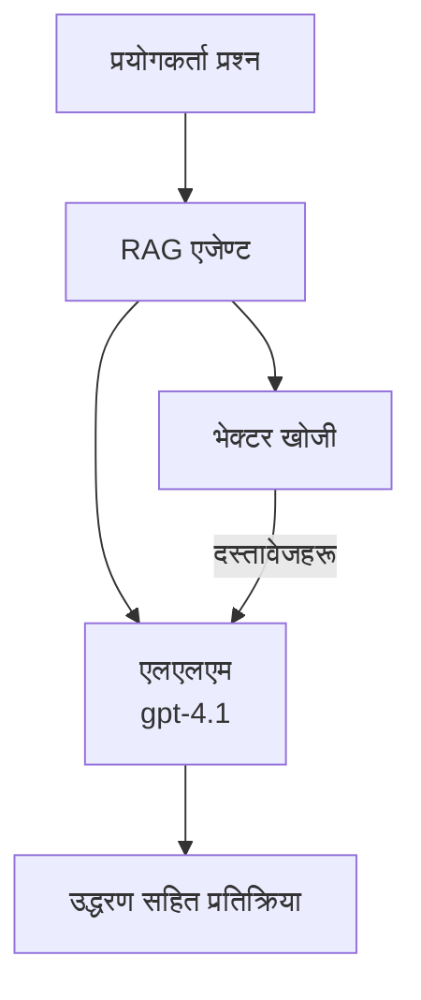
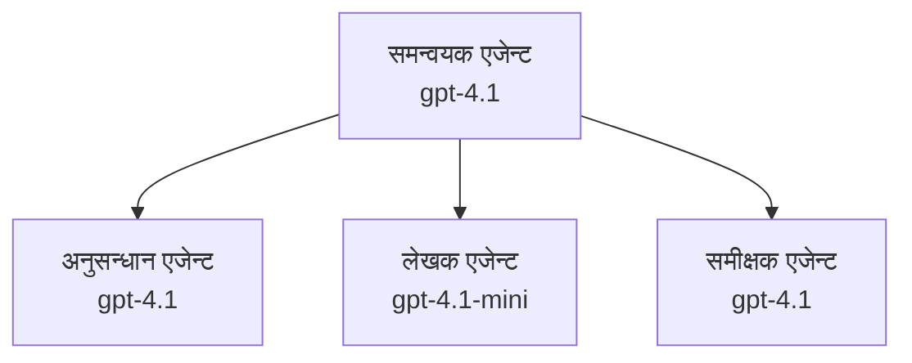

# Azure Developer CLI सँग AI एजेन्टहरू

**Chapter Navigation:**
- **📚 कोर्स गृह**: [AZD For Beginners](../../README.md)
- **📖 वर्तमान अध्याय**: अध्याय 2 - एआई-प्रथम विकास
- **⬅️ अघिल्लो**: [Microsoft Foundry Integration](microsoft-foundry-integration.md)
- **➡️ अर्को**: [AI Model Deployment](ai-model-deployment.md)
- **🚀 उन्नत**: [Multi-Agent Solutions](../../examples/retail-scenario.md)

---

## परिचय

AI एजेन्टहरू स्वतन्त्र प्रोग्रामहरू हुन् जसले आफ्नो वातावरणलाई बुझ्न, निर्णय लिन, र विशिष्ट लक्ष्यहरू प्राप्त गर्न कार्यहरू लिन सक्छन्। प्रम्प्टहरूमा जवाफ दिने साधारण च्याटबोटहरू भन्दा फरक, एजेन्टहरूले:

- **उपकरणहरू प्रयोग गर्नुहोस्** - API कल गर्न, डेटाबेस खोज्न, कोड चलाउन सक्नुहुन्छ
- **योजना र तर्क गर्नुहोस्** - जटिल कार्यहरूलाई चरणहरूमा विभाजन गर्नुहोस्
- **सन्दर्भबाट सिक्नुहोस्** - स्मृति कायम राख्नुहोस् र व्यवहार अनुकूलन गर्नुहोस्
- **सहयोग गर्नुहोस्** - अन्य एजेन्टहरूसँग काम गर्न सक्नुहुन्छ (बहु-एजेन्ट प्रणालीहरू)

यो मार्गदर्शिकाले Azure Developer CLI (azd) प्रयोग गरेर कसरी AI एजेन्टहरू Azure मा परिनियोजन गर्ने देखाउँछ।

> **सत्यापन नोट (2026-03-25):** यो मार्गदर्शिका `azd` `1.23.12` र `azure.ai.agents` `0.1.18-preview` विरुद्ध समीक्षा गरिएको थियो। `azd ai` अनुभव अझै पूर्वावलोकन-चालित छ, त्यसैले तपाइँको इन्स्टल गरिएको फ्ल्यागहरू भिन्न भएमा विस्तार सहायता हेर्नुहोस्।

## सिक्ने लक्ष्यहरू

यस मार्गदर्शिका पूरा गर्दा, तपाईंले:
- एजेन्टहरू के हुन् र तिनीहरू च्याटबोटहरू भन्दा कसरी फरक छन् बुझ्न सक्नुहुनेछ
- AZD प्रयोग गरेर तयार टेम्पलेटहरूबाट AI एजेन्ट तैनाथ गर्न सक्ने
- कस्टम एजेन्टहरूको लागि Foundry एजेन्टहरू कन्फिगर गर्न सक्ने
- आधारभूत एजेन्ट ढाँचाहरू लागू गर्न सक्ने (उपकरण प्रयोग, RAG, बहु-एजेन्ट)
- परिनियोजित एजेन्टहरू अनुगमन र डिबग गर्न सक्ने

## सिक्ने नतिजाहरू

पूरा गरेपछि, तपाईं सक्षम हुनुहुनेछ:
- एकै कमाण्डबाट Azure मा AI एजेन्ट अनुप्रयोगहरू परिनियोजन गर्न
- एजेन्ट उपकरण र क्षमताहरू कन्फिगर गर्न
- एजेन्टहरूसँग retrieval-augmented generation (RAG) लागू गर्न
- जटिल कार्यप्रवाहहरूका लागि बहु-एजेन्ट आर्किटेक्चर डिजाइन गर्न
- सामान्य एजेन्ट परिनियोजन समस्याहरू ट्रबलशूट गर्न

---

## 🤖 एजेन्टलाई च्याटबोट भन्दा के फरक बनाउँछ?

| विशेषता | च्याटबोट | AI एजेन्ट |
|---------|---------|----------|
| **व्यवहार** | प्रम्प्टहरूमा जवाफ दिन्छ | स्वचालित कार्यहरू गर्छ |
| **उपकरणहरू** | कुनै छैन | API कल गर्न, खोजी गर्न, कोड चलाउन सक्दछ |
| **स्मृति** | केवल सत्र-आधारित | सत्रहरूमा निरन्तर स्मृति |
| **योजना** | एक पटकको प्रतिक्रिया | बहु-चरण तर्क |
| **सहयोग** | एकल इकाई | अन्य एजेन्टहरूसँग काम गर्न सक्छ |

### साधारण उपमा

- **च्याटबोट** = सूचना डेस्कमा प्रश्नहरूको उत्तर दिने सहयोगी व्यक्ति
- **AI एजेन्ट** = एक व्यक्तिगत सहायक जसले कल गर्न, भेटघाट बुक गर्न, र तपाइँका लागि कामहरू पूरा गर्न सक्छ

---

## 🚀 छिटो सुरु: तपाइँको पहिलो एजेन्ट परिनियोजन गर्नुहोस्

### विकल्प 1: Foundry Agents Template (सिफारिस गरिन्छ)

```bash
# एआई एजेन्टहरूको टेम्पलेट आरम्भ गर्नुहोस्
azd init --template get-started-with-ai-agents

# Azure मा तैनात गर्नुहोस्
azd up
```

**के परिनियोजन हुन्छ:**
- ✅ Foundry Agents
- ✅ Microsoft Foundry Models (gpt-4.1)
- ✅ Azure AI Search (RAG का लागि)
- ✅ Azure Container Apps (वेब इन्टरफेस)
- ✅ Application Insights (मोनिटरिङ)

**समय:** ~15-20 मिनेट
**खर्च:** ~$100-150/महिना (विकास)

### विकल्प 2: OpenAI Agent with Prompty

```bash
# Prompty-आधारित एजेन्ट टेम्पलेट प्रारम्भ गर्नुहोस्
azd init --template agent-openai-python-prompty

# Azure मा तैनात गर्नुहोस्
azd up
```

**के परिनियोजन हुन्छ:**
- ✅ Azure Functions (सर्भरलेस एजेन्ट कार्यान्वयन)
- ✅ Microsoft Foundry Models
- ✅ Prompty कन्फिगरेसन फाइलहरू
- ✅ नमुना एजेन्ट कार्यान्वयन

**समय:** ~10-15 मिनेट
**खर्च:** ~$50-100/महिना (विकास)

### विकल्प 3: RAG Chat Agent

```bash
# RAG च्याट टेम्प्लेट आरम्भ गर्नुहोस्
azd init --template azure-search-openai-demo

# Azure मा तैनाथ गर्नुहोस्
azd up
```

**के परिनियोजन हुन्छ:**
- ✅ Microsoft Foundry Models
- ✅ Azure AI Search नमुना डाटा सहित
- ✅ दस्तावेज प्रोसेसिङ पाइपलाइन
- ✅ उद्धरण सहित च्याट इन्टरफेस

**समय:** ~15-25 मिनेट
**खर्च:** ~$80-150/महिना (विकास)

### विकल्प 4: AZD AI Agent Init (Manifest- वा Template-आधारित पूर्वावलोकन)

यदि तपाइँसँग एजेन्ट म्यानिफेस्ट फाइल छ भने, तपाइँ `azd ai` कमाण्ड प्रयोग गरी Foundry Agent Service परियोजना सोफ्टफोल्ड गर्न सक्नुहुन्छ। हालैका पूर्वावलोकन रिलिजहरूले टेम्पलेट-आधारित आरम्भ समर्थन पनि थपेका छन्, त्यसैले तपाइँको इन्स्टल गरिएको विस्तार संस्करण अनुसार ठ्याक्कै प्राँप्ट फ्लो सानोतिनो फरक हुन सक्छ।

```bash
# AI एजेन्ट एक्सटेन्सन स्थापना गर्नुहोस्
azd extension install azure.ai.agents

# ऐच्छिक: स्थापना गरिएको पूर्वावलोकन संस्करण जाँच गर्नुहोस्
azd extension show azure.ai.agents

# एजेन्ट म्यानिफेस्टबाट प्रारम्भ गर्नुहोस्
azd ai agent init -m agent-manifest.yaml

# Azure मा परिनियोजन गर्नुहोस्
azd up

# तैनाथ गरिएको एजेन्ट परीक्षण गर्नुहोस् (लेटेन्सी र पहिलो बाइटसम्मको समय देखाउँछ)
azd ai agent invoke
```

**कहिले `azd ai agent init` बनाम `azd init --template` प्रयोग गर्ने:**

| विधि | सर्वोत्तम लागि | कसरी काम गर्छ |
|----------|----------|------|
| `azd init --template` | कार्यरत नमुना एपबाट सुरु गर्दा | कोड + इन्फ्रा सहित पूर्ण टेम्पलेट रिपो क्लोन गर्छ |
| `azd ai agent init -m` | आफ्नो एजेन्ट म्यानिफेस्टबाट निर्माण गर्दा | तपाइँको एजेन्ट परिभाषाबाट परियोजना संरचना स्क्याफोल्ड गर्छ |

> **सुझाव:** सिकिरहेको बेला `azd init --template` प्रयोग गर्नुहोस् (उपायहरू 1-3 माथि)। आफ्नो म्यानिफेस्टहरूसँग उत्पादन एजेन्ट बनाउँदा `azd ai agent init` प्रयोग गर्नुहोस्।

`azd up` पछि, सोही एक्सटेन्सनले एजेन्ट लाइफसाइकलको बाँकी भागमा पनि तपाईंलाई लैजान्छ: परीक्षण गर्न `azd ai agent invoke`, गुणस्तर मापन र सुधारका लागि `azd ai agent eval generate` र `azd ai agent optimize`, र सफा गर्न `azd ai agent delete`। पूर्ण सन्दर्भका लागि हेर्नुहोस् [AZD AI CLI Commands](../chapter-08-production/production-ai-practices.md#azd-ai-cli-commands-and-extensions)।

---

## 🏗️ एजेन्ट आर्किटेक्चर ढाँचा

### ढाँचा 1: उपकरणसहित एकल एजेन्ट

सबैभन्दा सरल एजेन्ट ढाँचा - एउटा एजेन्ट जसले बहु उपकरणहरू प्रयोग गर्न सक्छ।



**उत्तम लागि:**
- ग्राहक समर्थन बोटहरू
- अनुसन्धान सहायकहरू
- डेटा विश्लेषण एजेन्टहरू

**AZD टेम्पलेट:** `azure-search-openai-demo`

### ढाँचा 2: RAG एजेन्ट (Retrieval-Augmented Generation)

जवाफ उत्पन्न गर्नु अघि सम्बन्धित दस्तावेजहरू पुन:प्राप्त गर्ने एजेन्ट।



**उत्तम लागि:**
- उद्यम ज्ञान आधारहरू
- दस्तावेज प्रश्नोत्तर प्रणालीहरू
- अनुपालन र कानुनी अनुसन्धान

**AZD टेम्पलेट:** `azure-search-openai-demo`

### ढाँचा 3: बहु-एजेन्ट प्रणाली

जटिल कार्यहरूमा सँगै काम गर्ने धेरै विशेषज्ञ एजेन्टहरू।



**उत्तम लागि:**
- जटिल सामग्री सिर्जना
- बहु-चरण कार्यप्रवाह
- विभिन्न विशेषज्ञता आवश्यक पर्ने कामहरू

**थप जान्नुहोस्:** [Multi-Agent Coordination Patterns](../chapter-06-pre-deployment/coordination-patterns.md)

---

## ⚙️ एजेन्ट उपकरणहरू कन्फिगर गर्दै

एजेन्टहरू उपकरणहरू प्रयोग गर्न सक्ने हुँदा शक्तिशाली बन्छन्। यहाँ सामान्य उपकरणहरू कसरी कन्फिगर गर्ने छ:

### Foundry एजेन्टहरूमा उपकरण कन्फिगरेसन

```python
# agent_config.py
from azure.ai.projects import AIProjectClient
from azure.ai.projects.models import FunctionTool, CodeInterpreterTool

# कस्टम उपकरणहरू परिभाषित गर्नुहोस्
search_tool = FunctionTool(
    name="search_knowledge_base",
    description="Search the company knowledge base for relevant documents",
    parameters={
        "type": "object",
        "properties": {
            "query": {
                "type": "string",
                "description": "The search query"
            }
        },
        "required": ["query"]
    }
)

# उपकरणहरूसँग एजेन्ट सिर्जना गर्नुहोस्
agent = project_client.agents.create_agent(
    model="gpt-4.1",
    name="Support Agent",
    instructions="You are a helpful support agent. Use the search tool to find relevant information.",
    tools=[search_tool, CodeInterpreterTool()]
)
```

### वातावरण कन्फिगरेसन

```bash
# एजेन्ट-विशिष्ट वातावरण चरहरू सेटअप गर्नुहोस्
azd env set AZURE_OPENAI_MODEL "gpt-4.1"
azd env set AGENT_INSTRUCTIONS "You are a helpful assistant..."
azd env set ENABLE_CODE_INTERPRETER "true"
azd env set ENABLE_FILE_SEARCH "true"

# अपडेट गरिएको कन्फिगरेसनसँग परिनियोजन गर्नुहोस्
azd deploy
```

---

## 📊 एजेन्टहरूको अनुगमन

### Application Insights एकीकरण

सबै AZD एजेन्ट टेम्पलेटहरू मोनिटरिङका लागि Application Insights समावेश गर्छन्:

```bash
# निगरानी ड्यासबोर्ड खोल्नुहोस्
azd monitor --overview

# प्रत्यक्ष लगहरू हेर्नुहोस्
azd monitor --logs

# प्रत्यक्ष मेट्रिकहरू हेर्नुहोस्
azd monitor --live
```

### ट्र्याक गर्नका लागि प्रमुख मेट्रिक्स

| मेट्रिक | विवरण | लक्ष्य |
|--------|-------------|--------|
| प्रतिक्रिया विलम्बता | प्रतिक्रिया उत्पन्न गर्न लाग्ने समय | < 5 सेकेन्ड |
| टोकन प्रयोग | प्रति अनुरोध टोकनहरू | लागतको लागि अनुगमन गर्नुहोस् |
| टुल कल सफलता दर | सफल टुल निष्पादनहरूको % | > 95% |
| त्रुटि दर | असफल एजेन्ट अनुरोधहरू | < 1% |
| प्रयोगकर्ता सन्तुष्टि | प्रतिक्रिया स्कोरहरू | > 4.0/5.0 |

### एजेन्टहरूको लागि कस्टम लगिङ

```python
import os
from azure.monitor.opentelemetry import configure_azure_monitor
from opentelemetry import trace

# OpenTelemetry सँग Azure Monitor कन्फिगर गर्नुहोस्
configure_azure_monitor(
    connection_string=os.environ["APPLICATIONINSIGHTS_CONNECTION_STRING"]
)

tracer = trace.get_tracer(__name__)

def log_agent_interaction(user_query, agent_response, tools_used, latency_ms):
    with tracer.start_as_current_span("agent_interaction") as span:
        span.set_attributes({
            "user_query": user_query,
            "response_length": len(agent_response),
            "tools_used": tools_used,
            "latency_ms": latency_ms
        })
```

> **नोट:** आवश्यक प्याकेजहरू इन्स्टल गर्नुहोस्: `pip install azure-monitor-opentelemetry opentelemetry`

---

## 💰 लागत विचारहरू

### ढाँचाअनुसार अनुमानित मासिक लागतहरू

| ढाँचा | डेभ वातावरण | उत्पादन |
|---------|-----------------|------------|
| एकल एजेन्ट | $50-100 | $200-500 |
| RAG एजेन्ट | $80-150 | $300-800 |
| बहु-एजेन्ट (2-3 एजेन्ट) | $150-300 | $500-1,500 |
| उद्यम बहु-एजेन्ट | $300-500 | $1,500-5,000+ |

### लागत अनुकूलन सुझावहरू

1. **सादा कार्यहरूको लागि gpt-4.1-mini प्रयोग गर्नुहोस्**
   ```bash
   azd env set AZURE_OPENAI_MODEL "gpt-4.1-mini"
   ```

2. **दोहरिएका प्रश्नहरूको लागि क्यासिङ लागू गर्नुहोस्**
   ```python
   from functools import lru_cache
   
   @lru_cache(maxsize=1000)
   def get_cached_response(query_hash):
       return agent.run(query_hash)
   ```

3. **प्रति रन टोकन सीमाहरू सेट गर्नुहोस्**
   ```python
   # एजेन्ट चलाउँदा max_completion_tokens सेट गर्नुहोस्, सिर्जना गर्दा होइन
   run = project_client.agents.create_run(
       thread_id=thread.id,
       agent_id=agent.id,
       max_completion_tokens=1000  # प्रतिक्रियाको लम्बाइ सीमित गर्नुहोस्
   )
   ```

4. **प्रयोगमा नहुँदा शून्यमा स्केल गर्नुहोस्**
   ```bash
   # Container Apps स्वतः शून्यसम्म स्केल हुन्छन्
   azd env set MIN_REPLICAS "0"
   ```

---

## 🔧 एजेन्ट समस्याको निवारण

### सामान्य समस्याहरू र समाधानहरू

<details>
<summary><strong>❌ टुल कलहरूमा एजेन्टले प्रतिक्रिया दिँदैँन</strong></summary>

```bash
# उपकरणहरू ठीकसँग दर्ता भएका छन् कि छैनन् जाँच गर्नुहोस्
azd show

# OpenAI तैनाती सत्यापित गर्नुहोस्
az cognitiveservices account deployment list \
  --name $AZURE_OPENAI_NAME \
  --resource-group $RG_NAME

# एजेन्टका लगहरू जाँच गर्नुहोस्
azd monitor --logs
```

**सामान्य कारणहरू:**
- टुल फंक्शन सिग्नेचर मिल्दैन
- आवश्यक अनुमति हराइरहेको
- API endpoint पहुँचयोग्य छैन
</details>

<details>
<summary><strong>❌ एजेन्ट प्रतिक्रियाहरूमा उच्च विलम्बता</strong></summary>

```bash
# Application Insights प्रयोग गरेर बोटलनेकहरू पत्ता लगाउनुहोस्
azd monitor --live

# छिटो मोडेल प्रयोग गर्ने बारेमा विचार गर्नुहोस्
azd env set AZURE_OPENAI_MODEL "gpt-4.1-mini"
azd deploy
```

**अनुकूलन सुझावहरू:**
- स्ट्रीमिङ प्रतिक्रियाहरू प्रयोग गर्नुहोस्
- प्रतिक्रिया क्यासिङ लागू गर्नुहोस्
- सन्दर्भ विन्डो साइज घटाउनुहोस्
</details>

<details>
<summary><strong>❌ एजेन्टले गलत वा हल्युसिनेसन जानकारी फर्काउँदैछ</strong></summary>

```python
# राम्रो सिस्टम प्रॉम्प्टहरू प्रयोग गरेर सुधार गर्नुहोस्
instructions = """
You are a helpful assistant. IMPORTANT:
- Only answer based on provided context
- If you don't know, say "I don't know"
- Always cite your sources
- Never make up information
"""

# ग्राउन्डिङका लागि पुन:प्राप्ति थप्नुहोस्
agent = project_client.agents.create_agent(
    model="gpt-4.1",
    instructions=instructions,
    tools=[FileSearchTool()]  # प्रतिक्रियाहरूलाई दस्तावेजहरूमा आधारित बनाउनुहोस्
)
```
</details>

<details>
<summary><strong>❌ टोकन सीमा पार गरियो त्रुटिहरू</strong></summary>

```python
# सन्दर्भ विन्डो व्यवस्थापन लागू गर्नुहोस्
def truncate_context(messages, max_tokens=8000, model="gpt-4.1"):
    """Keep only recent messages within token limit."""
    import tiktoken
    encoding = tiktoken.encoding_for_model(model)
    total_tokens = 0
    truncated = []
    
    for msg in reversed(messages):
        msg_tokens = len(encoding.encode(msg.content))
        if total_tokens + msg_tokens > max_tokens:
            break
        truncated.insert(0, msg)
        total_tokens += msg_tokens
    
    return truncated
```
</details>

---

## 🎓 व्यावहारिक अभ्यासहरू

### अभ्यास 1: आधारभूत एजेन्ट परिनियोजन (20 मिनेट)

**लक्ष्य:** AZD प्रयोग गरी आफ्नो पहिलो AI एजेन्ट परिनियोजन गर्नुहोस्

```bash
# चरण 1: टेम्पलेट आरम्भ गर्नुहोस्
azd init --template get-started-with-ai-agents

# चरण 2: Azure मा लगइन गर्नुहोस्
azd auth login
# यदि तपाईं विभिन्न टेनन्टहरूमा काम गर्नुहुन्छ भने, --tenant-id <tenant-id> थप्नुहोस्

# चरण 3: परिनियोजन गर्नुहोस्
azd up

# चरण 4: एजेन्ट परीक्षण गर्नुहोस्
# परिनियोजन पछि अपेक्षित आउटपुट:
#   परिनियोजन पूरा भयो!
#   एन्डपोइन्ट: https://<app-name>.<region>.azurecontainerapps.io
# आउटपुटमा देखिएको URL खोल्नुहोस् र प्रश्न सोधेर प्रयास गर्नुहोस्

# चरण 5: निगरानी हेर्नुहोस्
azd monitor --overview

# चरण 6: सफा गर्नुहोस्
azd down --force --purge
```

**सफलता मापदण्ड:**
- [ ] एजेन्टले प्रश्नहरूको उत्तर दिन्छ
- [ ] `azd monitor` मार्फत मोनिटरिङ ड्यासबोर्डमा पहुँच गर्न सक्छ
- [ ] स्रोतहरू सफलतापूर्वक सफा गरियो

### अभ्यास 2: कस्टम टुल थप्नुहोस् (30 मिनेट)

**लक्ष्य:** एजेन्टमा एक कस्टम टुल थपेर विस्तार गर्नुहोस्

1. एजेन्ट टेम्पलेट परिनियोजन गर्नुहोस्:
   ```bash
   azd init --template get-started-with-ai-agents
   azd up
   ```
2. तपाइँको एजेन्ट कोडमा नयाँ टुल फंक्शन सिर्जना गर्नुहोस्:
   ```python
   def get_weather(location: str) -> str:
       """Get current weather for a location."""
       # मौसम सेवामा API कल
       return f"Weather in {location}: Sunny, 72°F"
   ```
3. एजेन्टसँग टुल दर्ता गर्नुहोस्:
   ```python
   from azure.ai.projects.models import FunctionTool

   weather_tool = FunctionTool(
       name="get_weather",
       description="Get current weather for a location",
       parameters={
           "type": "object",
           "properties": {
               "location": {"type": "string", "description": "City name"}
           },
           "required": ["location"]
       }
   )

   agent = project_client.agents.create_agent(
       model="gpt-4.1",
       name="Weather Agent",
       tools=[weather_tool]
   )
   ```
4. पुनः परिनियोजन र परीक्षण गर्नुहोस्:
   ```bash
   azd deploy
   # सोध्नुहोस्: "सिएटलमा मौसम कस्तो छ?"
   # अपेक्षित: एजेन्टले get_weather("Seattle") कल गर्छ र मौसम जानकारी फर्काउँछ
   ```

**सफलता मापदण्ड:**
- [ ] एजेन्टले मौसम सम्बन्धी प्रश्नहरू चिनेको छ
- [ ] टुल सही रूपमा कल गरिएको छ
- [ ] प्रतिक्रियामा मौसम जानकारी समावेश छ

### अभ्यास 3: RAG एजेन्ट बनाउनुहोस् (45 मिनेट)

**लक्ष्य:** तपाइँका दस्तावेजहरूबाट प्रश्नहरूको उत्तर दिने एजेन्ट सिर्जना गर्नुहोस्

```bash
# चरण 1: RAG टेम्प्लेट तैनाथ गर्नुहोस्
azd init --template azure-search-openai-demo
azd up

# चरण 2: आफ्नो दस्तावेजहरू अपलोड गर्नुहोस्
# PDF/TXT फाइलहरूलाई data/ डायरेक्टरीमा राख्नुहोस्, त्यसपछि चलाउनुहोस्:
python scripts/prepdocs.py

# चरण 3: डोमेन-विशिष्ट प्रश्नहरूसँग परीक्षण गर्नुहोस्
# azd up आउटपुटबाट वेब एपको URL खोल्नुहोस्
# आफ्ना अपलोड गरिएका दस्तावेजहरूबारे प्रश्न सोध्नुहोस्
# प्रतिक्रियाहरूमा [doc.pdf] जस्ता उद्धरण सन्दर्भहरू समावेश हुनुपर्छ
```

**सफलता मापदण्ड:**
- [ ] एजेन्टले अपलोड गरिएको दस्तावेजहरूबाट उत्तर दिन्छ
- [ ] प्रतिक्रियाहरूमा उद्धरणहरू समावेश छन्
- [ ] परिधिबाहिरका प्रश्नहरूमा हल्युसिनेसन (गलत सूचना) हुँदैन

---

## 📚 अर्को कदमहरू

अब जब तपाईंले AI एजेन्टहरू बुझ्नु भयो, यी उन्नत विषयहरू अन्वेषण गर्नुहोस्:

| टपिक | विवरण | लिङ्क |
|-------|-------------|------|
| **बहु-एजेन्ट प्रणालीहरू** | एकसाथ मिलेर काम गर्ने बहु एजेन्टहरूसँग प्रणालीहरू निर्माण गर्नुहोस् | [Retail Multi-Agent Example](../../examples/retail-scenario.md) |
| **समन्वय ढाँचाहरू** | अोर्केस्ट्रेसन र सञ्चार ढाँचाहरू सिक्नुहोस् | [Coordination Patterns](../chapter-06-pre-deployment/coordination-patterns.md) |
| **उत्पादन परिनियोजन** | उद्यम-तयार एजेन्ट परिनियोजन | [Production AI Practices](../chapter-08-production/production-ai-practices.md) |
| **एजेन्ट मूल्यांकन** | एजेन्ट प्रदर्शन परीक्षण र मूल्यांकन गर्नुहोस् | [AI Troubleshooting](../chapter-07-troubleshooting/ai-troubleshooting.md) |
| **AI कार्यशाला ल्याब** | व्यावहारिक: तपाईंको AI समाधानलाई AZD-योग्य बनाउनुहोस् | [AI Workshop Lab](ai-workshop-lab.md) |

---

## 📖 अतिरिक्त स्रोतहरू

### आधिकारिक डकुमेन्टेशन
- [Microsoft Foundry Agent Service](https://learn.microsoft.com/azure/ai-services/agents/)
- [Microsoft Foundry Agent Service Quickstart](https://learn.microsoft.com/azure/ai-services/agents/quickstart)
- [Semantic Kernel Agent Framework](https://learn.microsoft.com/semantic-kernel/)

### एजेन्टहरूको लागि AZD टेम्पलेटहरू
- [Get Started with AI Agents](https://github.com/Azure-Samples/get-started-with-ai-agents)
- [Agent OpenAI Python Prompty](https://github.com/Azure-Samples/agent-openai-python-prompty)
- [Azure Search OpenAI Demo](https://github.com/Azure-Samples/azure-search-openai-demo)

### समुदाय स्रोतहरू
- [Awesome AZD - Agent Templates](https://azure.github.io/awesome-azd/?tags=ai-agents)
- [Azure AI Discord](https://discord.gg/microsoft-azure)
- [Microsoft Foundry Discord](https://discord.gg/nTYy5BXMWG)

### तपाईंको एडिटरका लागि एजेन्ट स्किलहरू
- [**Microsoft Azure Agent Skills**](https://skills.sh/microsoft/github-copilot-for-azure) - GitHub Copilot, Cursor, वा कुनै पनि समर्थित एजेन्टका लागि Azure विकासलाई पुन: प्रयोगयोग्य AI एजेन्ट स्किलहरू इन्स्टल गर्नुहोस्। यसमा [Azure AI](https://skills.sh/microsoft/github-copilot-for-azure/azure-ai), [Microsoft Foundry](https://skills.sh/microsoft/github-copilot-for-azure/microsoft-foundry), [deployment](https://skills.sh/microsoft/github-copilot-for-azure/azure-deploy), र [diagnostics](https://skills.sh/microsoft/github-copilot-for-azure/azure-diagnostics) का लागि स्किलहरू समावेश छन्:
  ```bash
  npx skills add microsoft/github-copilot-for-azure
  ```

---

**नेभिगेसन**
- **अघिल्लो पाठ**: [Microsoft Foundry Integration](microsoft-foundry-integration.md)
- **अर्को पाठ**: [AI Model Deployment](ai-model-deployment.md)

---

<!-- CO-OP TRANSLATOR DISCLAIMER START -->
**अस्वीकरण**:
यो दस्तावेज़ AI अनुवाद सेवा [Co-op Translator](https://github.com/Azure/co-op-translator) प्रयोग गरेर अनुवाद गरिएको हो। हामी सही हुन प्रयास गर्छौं, तर कृपया जानकार हुनुस् कि स्वचालित अनुवादमा त्रुटिहरू वा अशुद्धताहरू हुन सक्छन्। मूल दस्तावेज़ यसको मूल भाषामा आधिकारिक स्रोत मानिनुपर्छ। महत्वपूर्ण जानकारीका लागि व्यावसायिक मानव अनुवाद सिफारिस गरिन्छ। यस अनुवादको प्रयोगबाट उत्पन्न कुनै पनि गलत बुझाइ वा त्रुटिको लागि हामी जिम्मेवार छैनौं।
<!-- CO-OP TRANSLATOR DISCLAIMER END -->