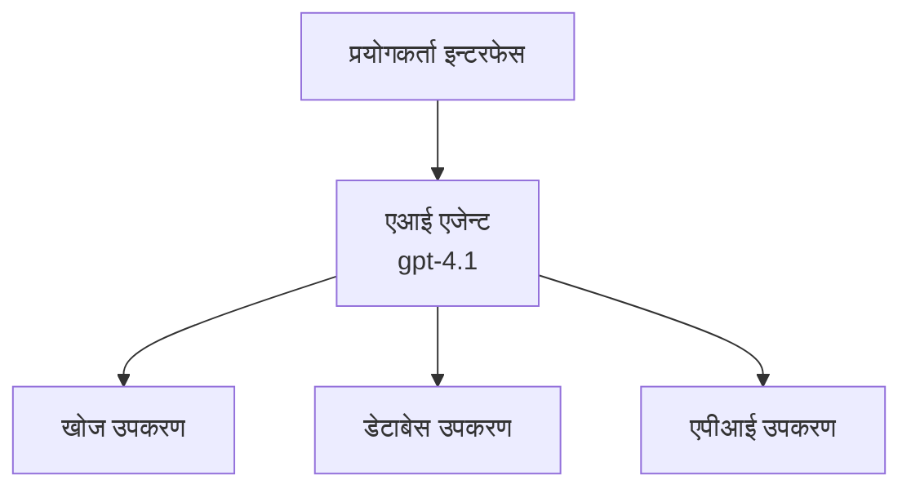
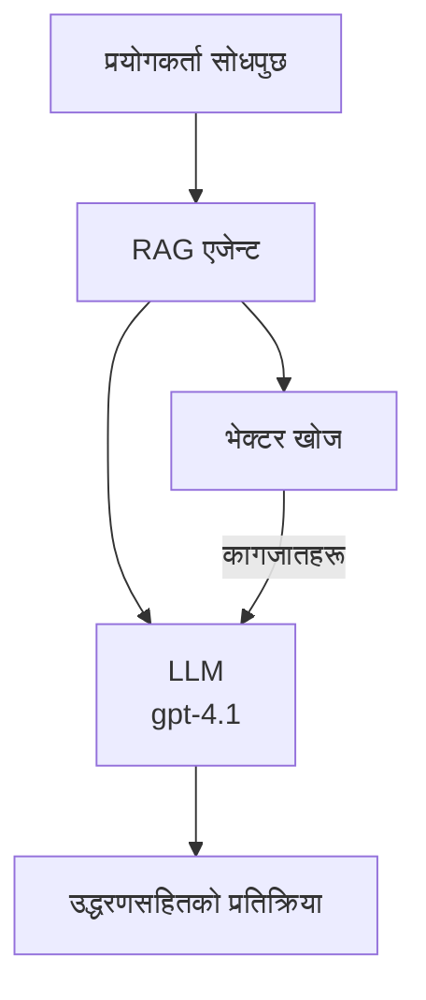
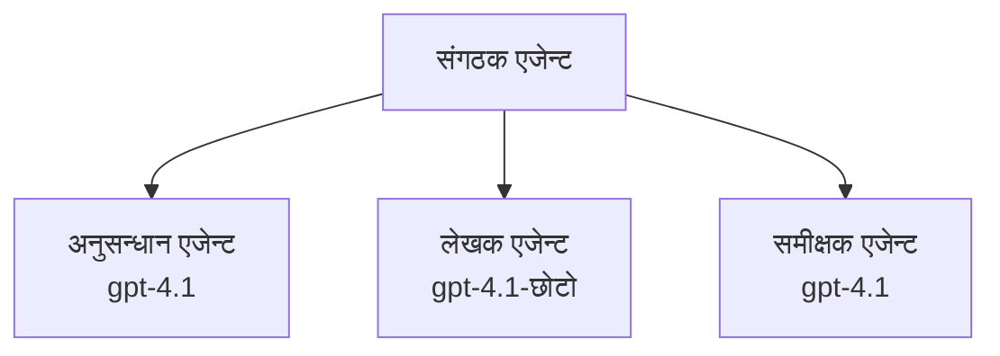

# Azure Developer CLI सँग AI एजेन्टहरू

**अध्याय नेभिगेसन:**
- **📚 कोर्स होम**: [AZD For Beginners](../../README.md)
- **📖 वर्तमान अध्याय**: अध्याय २ - AI-प्रथम विकास
- **⬅️ अघिल्लो**: [Microsoft Foundry Integration](microsoft-foundry-integration.md)
- **➡️ अर्को**: [AI Model Deployment](ai-model-deployment.md)
- **🚀 उन्नत**: [Multi-Agent Solutions](../../examples/retail-scenario.md)

---

## परिचय

AI एजेन्टहरू स्वायत्त कार्यक्रमहरू हुन् जसले आफ्नो वातावरणलाई बुझ्न, निर्णय लिन, र विशेष लक्ष्यहरू हासिल गर्न कार्यहरू लिन सक्छन्। साधारण च्याटबोटहरू जसले प्रम्प्टहरूको जवाफ दिन्छन् भन्दा फरक, एजेन्टहरूले सक्छन्:

- **उपकरणहरू प्रयोग गर्ने** - API कल गर्ने, डेटाबेस खोज्ने, कोड चलाउने
- **योजना र तर्क गर्ने** - जटिल कार्यहरूलाई चरणहरूमा तोड्ने
- **सन्दर्भबाट सिक्ने** - स्मृति राख्ने र व्यवहार अनुकूलन गर्ने
- **सहयोग गर्ने** - अन्य एजेन्टहरूसँग काम गर्ने (बहु-एजेन्ट प्रणालीहरू)

यस मार्गदर्शनले तपाईंलाई Azure Developer CLI (azd) प्रयोग गरी Azure मा AI एजेन्टहरू कसरी तैनाथ गर्ने देखाउँछ।

> **पुष्टि नोट (2026-03-25):** यस मार्गदर्शनलाई `azd` `1.23.12` र `azure.ai.agents` `0.1.18-preview` विरुद्ध समीक्षा गरिएको छ। `azd ai` अनुभव अझै प्रिभ्यु-चालित छ, त्यसैले तपाईंको इन्स्टल गरिएको फ्ल्यागहरू फरक भएमा विस्तार मद्दत हेर्नुहोस्।

## सिकाइ लक्ष्यहरू

यस मार्गदर्शन पूरा गरेर, तपाईं:
- AI एजेन्टहरूले के हुन् र तिनीहरू च्याटबोटहरू भन्दा कसरी फरक छन् बुझ्नुहुनेछ
- AZD प्रयोग गरेर पूर्व-निर्मित AI एजेन्ट टेम्प्लेटहरू तैनाथ गर्ने
- Foundry एजेन्टहरू कस्टम एजेन्टहरूका लागि कन्फिगर गर्ने
- आधारभूत एजेन्ट ढाँचाहरू लागू गर्ने (उपकरण प्रयोग, RAG, बहु-एजेन्ट)
- तैनाथ गरिएको एजेन्टहरूको अनुगमन र डिबग गर्ने

## सिकाइ नतिजाहरू

पूरा भएपछि, तपाईं सक्षम हुनुहुनेछ:
- एक आदेशमा AI एजेन्ट अनुप्रयोगहरू Azure मा तैनाथ गर्ने
- एजेन्ट उपकरणहरू र क्षमताहरू कन्फिगर गर्ने
- एजेन्टहरूसँग पुन: प्राप्ति-वृद्धि जनरेशन (RAG) लागू गर्ने
- जटिल कार्यहरूका लागि बहु-एजेन्ट संरचनाहरू डिजाइन गर्ने
- सामान्य एजेन्ट तैनाथ समस्याहरू समाधान गर्ने

---

## 🤖 एजेन्ट र च्याटबोटमा के फरक छ?

| विशेषता | च्याटबोट | AI एजेन्ट |
|---------|----------|-----------|
| **व्यवहार** | प्रम्प्टहरूमा प्रतिक्रिया दिन्छ | स्वतन्त्र क्रियाकलाप गर्छ |
| **उपकरणहरू** | छैन | API कल गर्न, खोज गर्न, कोड चलाउन सक्छ |
| **स्मृति** | केवल सत्र-आधारित | सत्रहरूमा पनि स्थायी स्मृति |
| **योजना** | एकल प्रतिक्रिया | बहु-चरण तर्क |
| **सहयोग** | एकल इकाई | अन्य एजेन्टहरूसँग काम गर्न सक्छ |

### सरल उपमा

- **च्याटबोट** = सूचना डेस्कमा प्रश्नहरूको जवाफ दिने मद्दतगार व्यक्ति
- **AI एजेन्ट** = तपाईंको लागि कलहरू गर्ने, भेटघाट बुक गर्ने, र कार्यहरू पूरा गर्ने व्यक्तिगत सहायक

---

## 🚀 छिटो सुरु: तपाईंको पहिलो एजेन्ट तैनाथ गर्नुहोस्

### विकल्प १: Foundry एजेन्टहरू टेम्प्लेट (सिफारिस गरिएको)

```bash
# AI एजेन्टहरूको ढाँचा सुरु गर्नुहोस्
azd init --template get-started-with-ai-agents

# Azure मा तैनाथ गर्नुहोस्
azd up
```

**के तैनाथ हुन्छ:**
- ✅ Foundry एजेन्टहरू
- ✅ Microsoft Foundry मोडेलहरू (gpt-4.1)
- ✅ Azure AI Search (RAG का लागि)
- ✅ Azure Container Apps (वेब इन्टरफेस)
- ✅ Application Insights (अनुगमन)

**समय:** ~१५-२० मिनेट
**लागत:** ~$१००-१५०/महिना (विकास)

### विकल्प २: Prompty सहित OpenAI एजेन्ट

```bash
# Prompty-आधारित एजेन्ट ढाँचा आरम्भ गर्नुहोस्
azd init --template agent-openai-python-prompty

# Azure मा तैनाथ गर्नुहोस्
azd up
```

**के तैनाथ हुन्छ:**
- ✅ Azure Functions (सर्भरलेस एजेन्ट कार्यान्वयन)
- ✅ Microsoft Foundry मोडेलहरू
- ✅ Prompty कन्फिगरेसन फाइलहरू
- ✅ नमूना एजेन्ट कार्यान्वयन

**समय:** ~१०-१५ मिनेट
**लागत:** ~$५०-१००/महिना (विकास)

### विकल्प ३: RAG च्याट एजेन्ट

```bash
# RAG च्याट टेम्प्लेट सुरु गर्नुहोस्
azd init --template azure-search-openai-demo

# Azure मा तैनाथ गर्नुहोस्
azd up
```

**के तैनाथ हुन्छ:**
- ✅ Microsoft Foundry मोडेलहरू
- ✅ Azure AI Search नमूना डाटासँग
- ✅ कागजात प्रशोधन पाइपलाइन
- ✅ उद्धरणसहितको च्याट इन्टरफेस

**समय:** ~१५-२५ मिनेट
**लागत:** ~$८०-१५०/महिना (विकास)

### विकल्प ४: AZD AI एजेन्ट सुरु (म्यानिफेस्ट वा टेम्प्लेट-आधारित प्रिभ्यु)

यदि तपाईंंसँग एजेन्ट म्यानिफेस्ट फाइल छ भने, तपाईंले `azd ai` आदेश प्रयोग गरेर Foundry Agent Service परियोजना प्रत्यक्ष स्क्याफोल्ड गर्न सक्नुहुन्छ। पछिल्ला प्रिभ्यु रिलिजहरूले टेम्प्लेट-आधारित सुरु समर्थन थपेका छन्, त्यसैले तपाइँको इन्स्टल गरिएको विस्तार संस्करण अनुसार प्रम्प्ट फ्लो अलिकति फरक हुन सक्छ।

```bash
# AI एजेन्ट विस्तार स्थापना गर्नुहोस्
azd extension install azure.ai.agents

# ऐच्छिक: स्थापना गरिएको पूर्वावलोकन संस्करण जाँच गर्नुहोस्
azd extension show azure.ai.agents

# एजेन्ट घोषणापत्रबाट आरम्भ गर्नुहोस्
azd ai agent init -m agent-manifest.yaml

# Azure मा परिनियोजन गर्नुहोस्
azd up
```

**`azd ai agent init` र `azd init --template` कहिले प्रयोग गर्ने:**

| तरिका | उत्तम के लागि | कसरी काम गर्छ |
|--------|---------------|----------------|
| `azd init --template` | काम गर्ने नमूना अनुप्रयोगबाट सुरु गर्ने | कोड + इन्फ्रास्ट्रक्चर सहित पूर्ण टेम्प्लेट रिपो क्लोन गर्दछ |
| `azd ai agent init -m` | तपाइँको आफ्नै एजेन्ट म्यानिफेस्टबाट तयार गर्ने | तपाइँको एजेन्ट परिभाषाबाट परियोजना संरचना स्क्याफोल्ड गर्दछ |

> **टिप:** सिकाइको लागि `azd init --template` प्रयोग गर्नुहोस् (माथि विकल्प १-३)। उत्पादन एजेन्टहरू आफ्नै म्यानिफेस्टहरूसँग निर्माण गर्दा `azd ai agent init` प्रयोग गर्नुहोस्। पूर्ण सन्दर्भको लागि [AZD AI CLI आदेशहरू](../chapter-08-production/production-ai-practices.md#azd-ai-cli-commands-and-extensions) हेर्नुहोस्।

---

## 🏗️ एजेन्ट संरचना ढाँचाहरू

### ढाँचा १: एकल एजेन्ट उपकरणहरूसँग

सर्वभन्दा सरल एजेन्ट ढाँचा - एउटा एजेन्ट जुन धेरै उपकरणहरू प्रयोग गर्न सक्छ।


**उत्तम लागि:**
- ग्राहक समर्थन बोटहरू
- अनुसन्धान सहायकहरू
- डाटा विश्लेषण एजेन्टहरू

**AZD टेम्प्लेट:** `azure-search-openai-demo`

### ढाँचा २: RAG एजेन्ट (पुन: प्राप्ति-वृद्धि जनरेशन)

एक एजेन्ट जसले प्रतिक्रिया दिने अघि सम्बन्धित कागजातहरू प्राप्त गर्छ।


**उत्तम लागि:**
- उद्यम ज्ञान आधारहरू
- कागजात प्रश्नोत्तर प्रणालीहरू
- अनुपालन र कानुनी अनुसन्धान

**AZD टेम्प्लेट:** `azure-search-openai-demo`

### ढाँचा ३: बहु-एजेन्ट प्रणाली

एकैसाथ धेरै विशेषज्ञ एजेन्टहरू जटिल कार्यहरूमा काम गर्छन्।


**उत्तम लागि:**
- जटिल सामग्री निर्माण
- बहु-चरण कार्यप्रवाहहरू
- विभिन्न विशेषज्ञता आवश्यक पर्ने कार्यहरू

**थप जान्न:** [बहु-एजेन्ट समन्वय ढाँचाहरू](../chapter-06-pre-deployment/coordination-patterns.md)

---

## ⚙️ एजेन्ट उपकरण कन्फिगरेसन

एजेन्टहरू शक्तिशाली हुन्छन् जब तिनीहरूले उपकरणहरू प्रयोग गर्न सक्छन्। सामान्य उपकरणहरू कन्फिगर गर्ने तरिका:

### Foundry एजेन्टहरूमा उपकरण कन्फिगरेसन

```python
# agent_config.py
from azure.ai.projects import AIProjectClient
from azure.ai.projects.models import FunctionTool, CodeInterpreterTool

# अनुकुल उपकरणहरू परिभाषित गर्नुहोस्
search_tool = FunctionTool(
    name="search_knowledge_base",
    description="Search the company knowledge base for relevant documents",
    parameters={
        "type": "object",
        "properties": {
            "query": {
                "type": "string",
                "description": "The search query"
            }
        },
        "required": ["query"]
    }
)

# उपकरणहरूसँग एजेन्ट सिर्जना गर्नुहोस्
agent = project_client.agents.create_agent(
    model="gpt-4.1",
    name="Support Agent",
    instructions="You are a helpful support agent. Use the search tool to find relevant information.",
    tools=[search_tool, CodeInterpreterTool()]
)
```

### वातावरण कन्फिगरेसन

```bash
# एजेन्ट-विशिष्ट वातावरण चरहरू सेटअप गर्नुहोस्
azd env set AZURE_OPENAI_MODEL "gpt-4.1"
azd env set AGENT_INSTRUCTIONS "You are a helpful assistant..."
azd env set ENABLE_CODE_INTERPRETER "true"
azd env set ENABLE_FILE_SEARCH "true"

# अद्यावधिक कन्फिगरेसनसहित डिप्लोय गर्नुहोस्
azd deploy
```

---

## 📊 एजेन्टहरू अनुगमन

### Application Insights एकीकरण

सबै AZD एजेन्ट टेम्प्लेटहरूमा अनुगमनका लागि Application Insights समावेश छ:

```bash
# अनुगमन ड्यासबोर्ड खोल्नुहोस्
azd monitor --overview

# प्रत्यक्ष लगहरू हेर्नुहोस्
azd monitor --logs

# प्रत्यक्ष मेट्रिक्स हेर्नुहोस्
azd monitor --live
```

### अनुगमन गर्नुपर्ने प्रमुख मेट्रिक्सहरू

| मेट्रिक | विवरण | लक्ष्य |
|---------|--------|--------|
| प्रतिक्रिया ढिलाइ | प्रतिक्रिया बनाउन लागेको समय | < ५ सेकेन्ड |
| टोकन प्रयोग | प्रति अनुरोध टोकन | लागत अनुगमन गर्नुहोस् |
| उपकरण कल सफल률 | सफल उपकरण कार्यान्वयन प्रतिशत | > ९५% |
| त्रुटि दर | असफल एजेन्ट अनुरोधहरू | < १% |
| प्रयोगकर्ता सन्तुष्टि | प्रतिक्रिया स्कोरहरू | > ४.०/५.० |

### एजेन्टहरूको लागि कस्टम लगिङ

```python
import os
from azure.monitor.opentelemetry import configure_azure_monitor
from opentelemetry import trace

# OpenTelemetry सँग Azure Monitor कन्फिगर गर्नुहोस्
configure_azure_monitor(
    connection_string=os.environ["APPLICATIONINSIGHTS_CONNECTION_STRING"]
)

tracer = trace.get_tracer(__name__)

def log_agent_interaction(user_query, agent_response, tools_used, latency_ms):
    with tracer.start_as_current_span("agent_interaction") as span:
        span.set_attributes({
            "user_query": user_query,
            "response_length": len(agent_response),
            "tools_used": tools_used,
            "latency_ms": latency_ms
        })
```

> **नोट:** आवश्यक प्याकेजहरू इन्स्टल गर्नुहोस्: `pip install azure-monitor-opentelemetry opentelemetry`

---

## 💰 लागत विचारहरू

### प्रत्येक ढाँचाका मासिक अनुमानित लागतहरू

| ढाँचा | विकास वातावरण | उत्पादन |
|--------|----------------|----------|
| एकल एजेन्ट | $५०-१०० | $२००-५०० |
| RAG एजेन्ट | $८०-१५० | $३००-८०० |
| बहु-एजेन्ट (२-३ एजेन्टहरू) | $१५०-३०० | $५००-१,५०० |
| उद्यम बहु-एजेन्ट | $३००-५०० | $१,५००-५,०००+ |

### लागत अनुकूलन सुझावहरू

1. **साधारण कार्यका लागि gpt-4.1-mini प्रयोग गर्नुहोस्**
   ```bash
   azd env set AZURE_OPENAI_MODEL "gpt-4.1-mini"
   ```

2. **दोहरिने प्रश्नहरूको लागि क्यासिङ लागू गर्नुहोस्**
   ```python
   from functools import lru_cache
   
   @lru_cache(maxsize=1000)
   def get_cached_response(query_hash):
       return agent.run(query_hash)
   ```

3. **प्रत्येक रनको लागि टोकन सीमा सेट गर्नुहोस्**
   ```python
   # एजेन्ट चलाउँदा max_completion_tokens सेट गर्नुहोस्, सिर्जना गर्दा होइन
   run = project_client.agents.create_run(
       thread_id=thread.id,
       agent_id=agent.id,
       max_completion_tokens=1000  # प्रतिक्रिया लामो सीमित गर्नुहोस्
   )
   ```

4. **नचाहिँदा स्केल टु जीरो गर्नुहोस्**
   ```bash
   # कन्टेनर एप्लिकेसनहरू स्वचालित रूपमा शून्यमा विस्तार हुन्छन्
   azd env set MIN_REPLICAS "0"
   ```

---

## 🔧 एजेन्ट समस्याहरू समाधान

### सामान्य समस्याहरू र समाधानहरू

<details>
<summary><strong>❌ एजेन्टले उपकरण कलमा प्रतिक्रिया दिँदैन</strong></summary>

```bash
# उपकरणहरू सही तरिकाले दर्ता गरिएको छ कि छैन जाँच गर्नुहोस्
azd show

# OpenAI डिप्लोयमेन्ट पुष्टि गर्नुहोस्
az cognitiveservices account deployment list \
  --name $AZURE_OPENAI_NAME \
  --resource-group $RG_NAME

# एजेन्ट लगहरू जाँच गर्नुहोस्
azd monitor --logs
```

**सामान्य कारणहरू:**
- उपकरण फंक्शन हस्ताक्षर मेल नखाने
- आवश्यक अनुमति हराएको
- API अन्तर्विन्दु पहुँचयोग्य छैन
</details>

<details>
<summary><strong>❌ एजेन्ट प्रतिक्रियामा उच्च विलम्बता</strong></summary>

```bash
# बोतल सरकारहरूको लागि एप्लिकेशन इनसाइट्स जाँच गर्नुहोस्
azd monitor --live

# छिटो मोडेल प्रयोग गर्ने विचार गर्नुहोस्
azd env set AZURE_OPENAI_MODEL "gpt-4.1-mini"
azd deploy
```

**अनुकूलन सुझावहरू:**
- स्ट्रिमिङ प्रतिक्रिया प्रयोग गर्नुहोस्
- प्रतिक्रिया क्यासिङ लागू गर्नुहोस्
- सन्दर्भ विन्डो साइज घटाउनुहोस्
</details>

<details>
<summary><strong>❌ एजेन्टले गलत वा कल्पित जानकारी फर्काउने</strong></summary>

```python
# राम्रो प्रणाली प्रॉम्प्टसंग सुधार गर्नुहोस्
instructions = """
You are a helpful assistant. IMPORTANT:
- Only answer based on provided context
- If you don't know, say "I don't know"
- Always cite your sources
- Never make up information
"""

# ग्राउन्डिङको लागि फिर्ता लिने थप्नुहोस्
agent = project_client.agents.create_agent(
    model="gpt-4.1",
    instructions=instructions,
    tools=[FileSearchTool()]  # उत्तरहरूलाई कागजातहरूमा ग्राउन्ड गर्नुहोस्
)
```
</details>

<details>
<summary><strong>❌ टोकन सीमा उल्लंघन त्रुटिहरू</strong></summary>

```python
# सन्दर्भ विन्डो व्यवस्थापन कार्यान्वयन गर्नुहोस्
def truncate_context(messages, max_tokens=8000, model="gpt-4.1"):
    """Keep only recent messages within token limit."""
    import tiktoken
    encoding = tiktoken.encoding_for_model(model)
    total_tokens = 0
    truncated = []
    
    for msg in reversed(messages):
        msg_tokens = len(encoding.encode(msg.content))
        if total_tokens + msg_tokens > max_tokens:
            break
        truncated.insert(0, msg)
        total_tokens += msg_tokens
    
    return truncated
```
</details>

---

## 🎓 व्यावहारिक अभ्यासहरू

### अभ्यास १: आधारभूत एजेन्ट तैनाथ गर्नुहोस् (२० मिनेट)

**लक्ष्य:** AZD प्रयोग गरेर तपाईंको पहिलो AI एजेन्ट तैनाथ गर्नुहोस्

```bash
# चरण १: टेम्प्लेट आरम्भ गर्नुहोस्
azd init --template get-started-with-ai-agents

# चरण २: Azure मा लगइन गर्नुहोस्
azd auth login
# यदि तपाईंले भिन्न टेनेन्टहरूमा काम गर्नु हुन्छ भने, --tenant-id <tenant-id> थप्नुहोस्

# चरण ३: तैनाथ गर्नुहोस्
azd up

# चरण ४: एजेन्ट परीक्षण गर्नुहोस्
# तैनाथ पछि अपेक्षित आउटपुट:
#   तैनाथी पूरा भयो!
#   अन्तबिन्दु: https://<app-name>.<region>.azurecontainerapps.io
# आउटपुटमा देखाइएको URL खोल्नुहोस् र प्रश्न सोध्ने प्रयास गर्नुहोस्

# चरण ५: निगरानी हेर्नुहोस्
azd monitor --overview

# चरण ६: सफाई गर्नुहोस्
azd down --force --purge
```

**सफलता मापदण्डहरू:**
- [ ] एजेन्टले प्रश्नहरूको जवाफ दिन्छ
- [ ] `azd monitor` मार्फत अनुगमन ड्यासबोर्ड पहुँच गर्न सक्छ
- [ ] स्रोतहरू सफाइ सफलतापूर्वक गरियो

### अभ्यास २: कस्टम उपकरण थप्नुहोस् (३० मिनेट)

**लक्ष्य:** एजेन्टलाई कस्टम उपकरणले विस्तार गर्नुहोस्

1. एजेन्ट टेम्प्लेट तैनाथ गर्नुहोस्:
   ```bash
   azd init --template get-started-with-ai-agents
   azd up
   ```
2. आफ्नो एजेन्ट कोडमा नयाँ उपकरण फंक्शन सिर्जना गर्नुहोस्:
   ```python
   def get_weather(location: str) -> str:
       """Get current weather for a location."""
       # मौसम सेवामा API कल
       return f"Weather in {location}: Sunny, 72°F"
   ```
3. उपकरणलाई एजेन्टसँग दर्ता गर्नुहोस्:
   ```python
   from azure.ai.projects.models import FunctionTool

   weather_tool = FunctionTool(
       name="get_weather",
       description="Get current weather for a location",
       parameters={
           "type": "object",
           "properties": {
               "location": {"type": "string", "description": "City name"}
           },
           "required": ["location"]
       }
   )

   agent = project_client.agents.create_agent(
       model="gpt-4.1",
       name="Weather Agent",
       tools=[weather_tool]
   )
   ```
4. पुनः तैनाथ गरी परीक्षण गर्नुहोस्:
   ```bash
   azd deploy
   # सोध्नुहोस्: "सिएटलमा मौसम कस्तो छ?"
   # अपेक्षित: एजेन्टले get_weather("Seattle") कल गर्दछ र मौसम सम्बन्धी जानकारी फर्काउँछ
   ```

**सफलता मापदण्डहरू:**
- [ ] एजेन्टले मौसमसम्बन्धी प्रश्नहरू पहिचान गर्छ
- [ ] उपकरण सही रूपमा कल हुन्छ
- [ ] प्रतिक्रियामा मौसम जानकारी समावेश हुन्छ

### अभ्यास ३: RAG एजेन्ट निर्माण गर्नुहोस् (४५ मिनेट)

**लक्ष्य:** कागजातहरूबाट प्रश्नहरूको उत्तर दिने एजेन्ट बनाउनुहोस्

```bash
# चरण 1: RAG टेम्प्लेट तैनाथ गर्नुहोस्
azd init --template azure-search-openai-demo
azd up

# चरण 2: आफ्नो कागजातहरू अपलोड गर्नुहोस्
# डेटा/ निर्देशिकामा PDF/TXT फाइलहरू राख्नुहोस्, त्यसपछि चलाउनुहोस्:
python scripts/prepdocs.py

# चरण 3: डोमेन-विशिष्ट प्रश्नहरूसँग परीक्षण गर्नुहोस्
# azd up आउटपुटबाट वेब एप URL खोल्नुहोस्
# अपलोड गरिएका कागजातहरूबारे प्रश्नहरू सोध्नुहोस्
# प्रतिक्रियाहरूले [doc.pdf] जस्ता उद्धरण सन्दर्भहरू समावेश गर्नुपर्छ
```

**सफलता मापदण्डहरू:**
- [ ] एजेन्ट अपलोड गरिएका कागजातहरूबाट जवाफ दिन्छ
- [ ] प्रतिक्रियामा उद्धरणहरू समावेश छन्
- [ ] सीमा बाहिरका प्रश्नमा कल्पनाशीलता हुँदैन

---

## 📚 अर्को चरणहरू

अब तपाईंले AI एजेन्टहरू बुझ्नुभएको छ, यी उन्नत विषयहरू अन्वेषण गर्नुहोस्:

| विषय | विवरण | लिंक |
|-------|----------|---------|
| **बहु-एजेन्ट प्रणालीहरू** | धेरै सहकार्य गर्ने एजेन्टहरूसँग प्रणाली निर्माण गर्नुहोस् | [Retail Multi-Agent Example](../../examples/retail-scenario.md) |
| **समन्वय ढाँचाहरू** | संचालन र सञ्चार ढाँचाहरू सिक्नुहोस् | [Coordination Patterns](../chapter-06-pre-deployment/coordination-patterns.md) |
| **उत्पादन तैनाथीकरण** | उद्यम-तयार एजेन्ट तैनाथ गर्नुहोस् | [Production AI Practices](../chapter-08-production/production-ai-practices.md) |
| **एजेन्ट मूल्यांकन** | एजेन्ट प्रदर्शन परीक्षण र मूल्याङ्कन गर्नुहोस् | [AI Troubleshooting](../chapter-07-troubleshooting/ai-troubleshooting.md) |
| **AI कार्यशाला प्रयोगशाला** | व्यावहारिक: तपाईंको AI समाधान AZD-तयार बनाउनुहोस् | [AI Workshop Lab](ai-workshop-lab.md) |

---

## 📖 अतिरिक्त स्रोतहरू

### आधिकारिक डकुमेन्टेसन
- [Azure AI Agent Service](https://learn.microsoft.com/azure/ai-services/agents/)
- [Azure AI Foundry Agent Service Quickstart](https://learn.microsoft.com/azure/ai-services/agents/quickstart)
- [Semantic Kernel Agent Framework](https://learn.microsoft.com/semantic-kernel/)

### AZD एजेन्ट टेम्प्लेटहरू
- [AI एजेन्टहरू सँग सुरु गर्नुहोस्](https://github.com/Azure-Samples/get-started-with-ai-agents)
- [Agent OpenAI Python Prompty](https://github.com/Azure-Samples/agent-openai-python-prompty)
- [Azure Search OpenAI Demo](https://github.com/Azure-Samples/azure-search-openai-demo)

### समुदाय स्रोतहरू
- [Awesome AZD - एजेन्ट टेम्प्लेटहरू](https://azure.github.io/awesome-azd/?tags=ai-agents)
- [Azure AI Discord](https://discord.gg/microsoft-azure)
- [Microsoft Foundry Discord](https://discord.gg/nTYy5BXMWG)

### तपाईंको सम्पादकका लागि एजेन्ट सीपहरू
- [**Microsoft Azure Agent Skills**](https://skills.sh/microsoft/github-copilot-for-azure) - Azure विकासका लागि GitHub Copilot, Cursor वा कुनै समर्थित एजेन्टमा पुन: प्रयोगयोग्य AI एजेन्ट सीपहरू इन्स्टल गर्नुहोस्। यसमा [Azure AI](https://skills.sh/microsoft/github-copilot-for-azure/azure-ai), [Microsoft Foundry](https://skills.sh/microsoft/github-copilot-for-azure/microsoft-foundry), [तैनाथीकरण](https://skills.sh/microsoft/github-copilot-for-azure/azure-deploy), र [निदान](https://skills.sh/microsoft/github-copilot-for-azure/azure-diagnostics) का सीपहरू समावेश छन्:
  ```bash
  npx skills add microsoft/github-copilot-for-azure
  ```

---

**नेभिगेसन**
- **अघिल्लो पाठ:** [Microsoft Foundry Integration](microsoft-foundry-integration.md)
- **अर्को पाठ:** [AI Model Deployment](ai-model-deployment.md)

---

<!-- CO-OP TRANSLATOR DISCLAIMER START -->
**अस्वीकरण**:  
यस दस्तावेजलाई AI अनुवाद सेवा [Co-op Translator](https://github.com/Azure/co-op-translator) को प्रयोग गरी अनुवाद गरिएको हो। हामी यथार्थताका लागि प्रयासरत छौँ, तर कृपया ध्यान दिनुहोस् कि स्वचालित अनुवादहरूमा त्रुटिहरू वा गलतफहमिहरू हुन सक्छन्। मूल भाषा मा रहेको दस्तावेजलाई अधिकृत स्रोतमात्र मान्नु पर्छ। महत्वपूर्ण जानकारीका लागि व्यावसायिक मानव अनुवाद सिफारिस गरिन्छ। यस अनुवादको प्रयोगबाट उत्पन्न कुनै पनि भ्रम वा गलत व्याख्यासँग सम्बन्धित जिम्मेवारी हामीमा पर्ने छैन।
<!-- CO-OP TRANSLATOR DISCLAIMER END -->