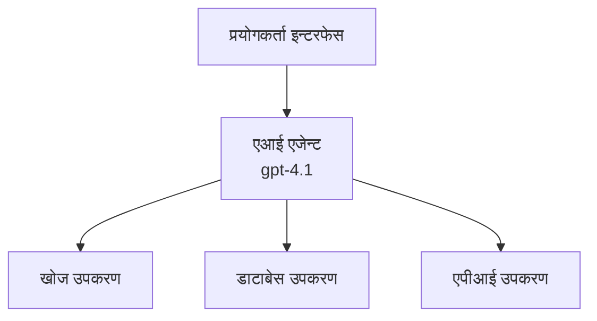
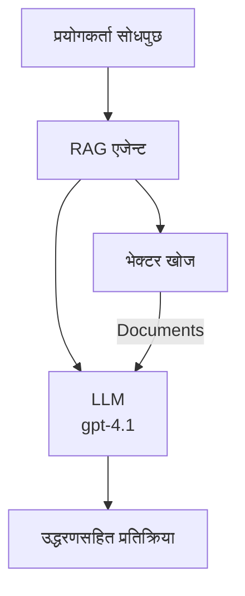
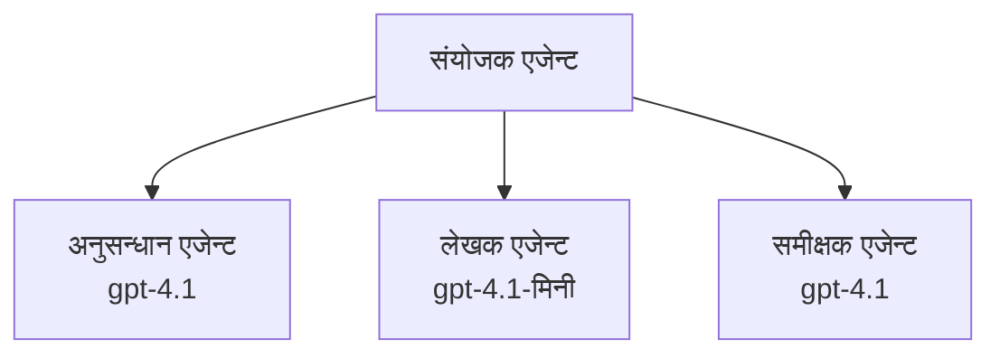

# Azure Developer CLI सँग AI एजेन्टहरू

**अध्याय नेभिगेशन:**
- **📚 कोर्स गृहपृष्ठ**: [AZD For Beginners](../../README.md)
- **📖 वर्तमान अध्याय**: अध्याय २ - AI-प्रथम विकास
- **⬅️ अघिल्लो**: [Microsoft Foundry Integration](microsoft-foundry-integration.md)
- **➡️ अर्को**: [AI Model Deployment](ai-model-deployment.md)
- **🚀 उन्नत**: [Multi-Agent Solutions](../../examples/retail-scenario.md)

---

## परिचय

AI एजेन्टहरू स्वतन्त्र कार्यक्रमहरू हुन् जसले आफ्नो वातावरणलाई महसुस गर्न, निर्णय लिन, र निश्चित लक्ष्यहरू प्राप्त गर्न क्रियाहरू लिन सक्छन्। साधारण च्याटबोटहरू जसले प्रॉम्प्टहरूमा प्रतिक्रिया दिन्छन्, भन्दा फरक, एजेन्टहरूले गर्न सक्छन्:

- **उपकरणहरू प्रयोग गर्नुहोस्** - API कल गर्नुहोस्, डेटाबेस खोज्नुहोस्, कोड चलाउनुहोस्
- **योजना बनाउनुहोस् र तर्क गर्नुहोस्** - जटिल कार्यहरूलाई चरणहरूमा विभाजन गर्नुहोस्
- **सन्दर्भबाट सिक्नुहोस्** - सम्झना राख्नुहोस् र व्यवहारमा अनुकूलन गर्नुहोस्
- **सहयोग गर्नुहोस्** - अन्य एजेन्टहरूसँग काम गर्नुहोस् (बहु-एजेन्ट प्रणालीहरू)

यस गाइडले तपाईंलाई Azure मा Azure Developer CLI (azd) प्रयोग गरेर AI एजेन्टहरू कसरी तैनाथ गर्ने देखाउँछ।

> **सत्यापन नोट (२०२६-०७-१३):** यो गाइड `azd` `1.27.1` र `azure.ai.agents` `1.0.0-beta.5` विरुद्ध समीक्षा गरिएको हो। `azd ai` अनुभव अझै प्रिभ्यु-आधारित छ, त्यसैले तपाईंले स्थापना गरेका झण्डाहरू फरक भएमा विस्तार मद्दत जाँच गर्नुहोला।

## सिकाइ लक्ष्यहरू

यस गाइड पुरा गरेपछि, तपाईंले:
- AI एजेन्टहरू के हुन् र तिनीहरू च्याटबोटहरू भन्दा कसरी फरक छन् बुझ्नुहुनेछ
- पूर्व-निर्मित AI एजेन्ट टेम्प्लेटहरू AZD प्रयोग गरेर तैनाथ गर्ने
- कस्टम एजेन्टहरूका लागि Foundry एजेन्टहरू कन्फिगर गर्ने
- आधारभूत एजेन्ट नमूनाहरू (उपकरण प्रयोग, RAG, बहु-एजेन्ट) कार्यान्वयन गर्ने
- तैनाथ एजेन्टहरूको निगरानी र डिबग गर्ने

## सिकाइ परिणामहरू

पुरा गरेपछि, तपाईं सक्षम हुनुहुनेछ:
- एउटा आदेशमात्र प्रयोग गरेर Azure मा AI एजेन्ट अनुप्रयोगहरू तैनाथ गर्न
- एजेन्ट उपकरणहरू र क्षमताहरू कन्फिगर गर्न
- एजेन्टहरूसँग पुनरुद्धार-वर्धित उत्पादन (RAG) लागू गर्न
- जटिल कार्यप्रवाहहरूको लागि बहु-एजेन्ट वास्तुकला डिजाइन गर्न
- सामान्य एजेन्ट तैनाथ समस्या समाधान गर्न

---

## 🤖 एजेन्ट र च्याटबोट बीच के फरक छ?

| विशेषता | च्याटबोट | AI एजेन्ट |
|---------|---------|----------|
| **व्यवहार** | प्रॉम्प्टहरूमा प्रतिक्रिया दिन्छ | स्वतन्त्र क्रियाहरू गर्छ |
| **उपकरणहरू** | कुनै छैन | API कल गर्न, खोज्न, कोड चलाउन सक्ने |
| **स्मृति** | सेसन-आधारित मात्र | सेसनहरू भन्दा लगातार स्मृति |
| **योजना बनाउने तरिका** | एकल प्रतिक्रिया | बहु-चरण तर्क |
| **सहयोग** | एकल इकाई | अन्य एजेन्टहरूसँग काम गर्न सक्ने |

### सरल उपमा

- **च्याटबोट** = सूचना डेस्कमा प्रश्नहरूको जवाफ दिने एक सहयोगी व्यक्ति
- **AI एजेन्ट** = तपाईंको लागि कल गर्ने, भेटघाट तय गर्ने, र कार्यहरू पूरा गर्ने व्यक्तिगत सहायक

---

## 🚀 छिटो सुरु: आफ्नो पहिलो एजेन्ट तैनाथ गर्नुहोस्

### विकल्प १: Foundry एजेन्ट टेम्प्लेट (सिफारिस गरिएको)

```bash
# AI एजेन्ट टेम्प्लेट सुरु गर्नुहोस्
azd init --template get-started-with-ai-agents

# Azure मा तैनाथ गर्नुहोस्
azd up
```

**के तैनाथ हुन्छ:**
- ✅ Foundry एजेन्टहरू
- ✅ Microsoft Foundry मोडेलहरू (gpt-4.1)
- ✅ Azure AI खोज (RAG का लागि)
- ✅ Azure Container Apps (वेब इन्टरफेस)
- ✅ अनुप्रयोग इन्साइट्स (निगरानी)

**समय:** ~१५-२० मिनेट
**लागत:** ~$१००-१५०/महिना (विकास)

### विकल्प २: Prompty सँग OpenAI एजेन्ट

```bash
# Prompty-आधारित एजेन्ट टेम्प्लेट सुरु गर्नुहोस्
azd init --template agent-openai-python-prompty

# Azure मा परिनियोजन गर्नुहोस्
azd up
```

**के तैनाथ हुन्छ:**
- ✅ Azure Functions (सर्भरलेस एजेन्ट कार्यान्वयन)
- ✅ Microsoft Foundry मोडेलहरू
- ✅ Prompty कन्फिगरेसन फाइलहरू
- ✅ नमूना एजेन्ट कार्यान्वयन

**समय:** ~१०-१५ मिनेट
**लागत:** ~$५०-१००/महिना (विकास)

### विकल्प ३: RAG च्याट एजेन्ट

```bash
# RAG च्याट टेम्प्लेट सुरु गर्नुहोस्
azd init --template azure-search-openai-demo

# Azure मा तैनाथ गर्नुहोस्
azd up
```

**के तैनाथ हुन्छ:**
- ✅ Microsoft Foundry मोडेलहरू
- ✅ नमूना डाटासँग Azure AI खोज
- ✅ दस्तावेज प्रक्रिया पाइपलाइन
- ✅ उद्धरणहरू सहितको च्याट इन्टरफेस

**समय:** ~१५-२५ मिनेट
**लागत:** ~$८०-१५०/महिना (विकास)

### विकल्प ४: AZD AI Agent Init (म्यानिफेस्ट वा टेम्प्लेट-आधारित प्रिभ्यु)

यदि तपाईं सँग एजेन्ट म्यानिफेस्ट फाइल छ भने, तपाईंले `azd ai` कमाण्ड प्रयोग गरी Foundry एजेन्ट सेवा परियोजना सिधै स्क्याफोल्ड गर्न सक्नुहुन्छ। हालका प्रिभ्यु रिलीजहरूले टेम्प्लेट-आधारित सुरुवात समर्थन पनि थपेका छन्, त्यसैले तपाईंले स्थापना गरेको संस्करण अनुसार प्रॉम्प्ट प्रवाहमा केही फरक हुन सक्छ।

```bash
# एआई एजेन्ट विस्तार स्थापना गर्नुहोस्
azd extension install azure.ai.agents

# वैकल्पिक: स्थापना गरिएको पूर्वावलोकन संस्करण प्रमाणित गर्नुहोस्
azd extension show azure.ai.agents

# एजेन्ट म्यानिफेस्टबाट प्रारम्भ गर्नुहोस्
azd ai agent init -m agent-manifest.yaml

# Azure मा तैनाथ गर्नुहोस्
azd up

# तैनाथ गरिएको एजेन्ट परीक्षण गर्नुहोस् (ल्याटेन्सी + पहिलो बाइटसम्मको समय देखाउँछ)
azd ai agent invoke
```

**`azd ai agent init` र `azd init --template` कहिले प्रयोग गर्ने:**

| विधि | सबैभन्दा उपयुक्त | कसरी काम गर्छ |
|----------|----------|------|
| `azd init --template` | काम गर्ने नमूना अनुप्रयोगबाट सुरूवात गर्दा | पूर्ण टेम्प्लेट रिपोज क्लोन गर्दछ जसमा कोड र पूर्वाधार छ |
| `azd ai agent init -m` | आफ्नो एजेन्ट म्यानिफेस्टबाट बनाउँदा | एजेन्ट परिभाषाबाट परियोजना संरचना स्क्याफोल्ड गर्छ |

> **सुझाव:** सिकाइ गर्दा `azd init --template` प्रयोग गर्नुहोस् (माथिको विकल्प १-३)। उत्पादन एजेन्टहरू निर्माण गर्दा आफ्नै म्यानिफेस्टहरूसँग `azd ai agent init` प्रयोग गर्नुहोस्।

`azd up` पछि, त्यसै विस्तारले तपाईंलाई एजेन्ट जीवनचक्रको बाँकी हरेक चरणमा लैजान्छ: जाँच गर्न `azd ai agent invoke`, गुणस्तर मापन र सुधारका लागि `azd ai agent eval generate` र `azd ai agent optimize`, र सफाइका लागि `azd ai agent delete`। पूर्ण सन्दर्भको लागि हेर्नुहोस् [AZD AI CLI Commands](../chapter-08-production/production-ai-practices.md#azd-ai-cli-commands-and-extensions)।

---

## 🏗️ एजेन्ट वास्तुकला नमूनाहरू

### नमूना १: उपकरणहरूसँग एकल एजेन्ट

सबैभन्दा सरल एजेन्ट नमूना - एउटा एजेन्ट जसले धेरै उपकरणहरू प्रयोग गर्न सक्छ।



**सबैभन्दा उपयुक्त:**
- ग्राहक समर्थन बोटहरू
- अनुसन्धान सहायकहरू
- डेटा विश्लेषण एजेन्टहरू

**AZD टेम्प्लेट:** `azure-search-openai-demo`

### नमूना २: RAG एजेन्ट (पुनरुद्धार-वर्धित उत्पादन)

यस्तो एजेन्ट जुन प्रतिक्रिया दिनुअघि सान्दर्भिक दस्तावेजहरू पुनः प्राप्त गर्छ।



**सबैभन्दा उपयुक्त:**
- उद्यम ज्ञान आधारहरू
- दस्तावेज Q&A प्रणालीहरू
- अनुपालन र कानूनी अनुसन्धान

**AZD टेम्प्लेट:** `azure-search-openai-demo`

### नमूना ३: बहु-एजेन्ट प्रणाली

धेरै विशिष्ट एजेन्टहरू जटिल कार्यहरूमा सँगै काम गर्दै।



**सबैभन्दा उपयुक्त:**
- जटिल सामग्री उत्पादन
- बहु-चरण कार्यप्रवाहहरू
- फरक विशेषज्ञता आवश्यक पर्ने कार्यहरू

**थप जान्न:** [बहु-एजेन्ट समन्वय नमूनाहरू](../chapter-06-pre-deployment/coordination-patterns.md)

---

## ⚙️ एजेन्ट उपकरणहरूको कन्फिगरेसन

एजेन्टहरूले उपकरणहरू प्रयोग गर्न सक्छन् भने उनीहरू शक्तिशाली हुन्छन्। सामान्य उपकरणहरू कसरी कन्फिगर गर्ने हेर्नुहोस्:

### Foundry एजेन्टहरूमा उपकरण कन्फिगरेसन

```python
# agent_config.py
from azure.ai.projects import AIProjectClient
from azure.ai.projects.models import FunctionTool, CodeInterpreterTool

# अनुकूल उपकरणहरू परिभाषित गर्नुहोस्
search_tool = FunctionTool(
    name="search_knowledge_base",
    description="Search the company knowledge base for relevant documents",
    parameters={
        "type": "object",
        "properties": {
            "query": {
                "type": "string",
                "description": "The search query"
            }
        },
        "required": ["query"]
    }
)

# उपकरणहरू सहित एजेन्ट सिर्जना गर्नुहोस्
agent = project_client.agents.create_agent(
    model="gpt-4.1",
    name="Support Agent",
    instructions="You are a helpful support agent. Use the search tool to find relevant information.",
    tools=[search_tool, CodeInterpreterTool()]
)
```

### वातावरण कन्फिगरेसन

```bash
# एजेन्ट-विशेष वातावरण भेरिएबलहरू सेट गर्नुहोस्
azd env set AZURE_OPENAI_MODEL "gpt-4.1"
azd env set AGENT_INSTRUCTIONS "You are a helpful assistant..."
azd env set ENABLE_CODE_INTERPRETER "true"
azd env set ENABLE_FILE_SEARCH "true"

# अद्यावधिक कन्फिगरेसनसँग डिप्लोय गर्नुहोस्
azd deploy
```

---

## 📊 एजेन्टहरूको निगरानी

### अनुप्रयोग इन्साइट्स एकीकरण

सबै AZD एजेन्ट टेम्प्लेटहरूमा निगरानीका लागि अनुप्रयोग इन्साइट्स समावेश छ:

```bash
# अनुगमन ड्यासबोर्ड खोल्नुहोस्
azd monitor --overview

# प्रत्यक्ष लगहरू हेर्नुहोस्
azd monitor --logs

# प्रत्यक्ष मेट्रिक्स हेर्नुहोस्
azd monitor --live
```

### ट्र्याक गर्ने प्रमुख मापदण्डहरू

| मापदण्ड | विवरण | लक्ष्य |
|--------|-------------|--------|
| प्रतिक्रिया विलम्बता | प्रतिक्रिया उत्पन्न गर्न लाग्ने समय | < ५ सेकेन्ड |
| टोकन प्रयोग | प्रति अनुरोध टोकनहरू | लागतको लागि अनुगमन गर्नुहोस् |
| उपकरण कल सफलता दर | सफल उपकरण कार्यान्वयनको % | > ९५% |
| त्रुटि दर | असफल एजेन्ट अनुरोधहरू | < १% |
| प्रयोगकर्ता सन्तुष्टि | प्रतिक्रिया स्कोरहरू | > ४.०/५.० |

### एजेन्टहरूको लागि कस्टम लगिङ

```python
import os
from azure.monitor.opentelemetry import configure_azure_monitor
from opentelemetry import trace

# OpenTelemetry सँग Azure Monitor कन्फिगर गर्नुहोस्
configure_azure_monitor(
    connection_string=os.environ["APPLICATIONINSIGHTS_CONNECTION_STRING"]
)

tracer = trace.get_tracer(__name__)

def log_agent_interaction(user_query, agent_response, tools_used, latency_ms):
    with tracer.start_as_current_span("agent_interaction") as span:
        span.set_attributes({
            "user_query": user_query,
            "response_length": len(agent_response),
            "tools_used": tools_used,
            "latency_ms": latency_ms
        })
```

> **सूचना:** आवश्यक प्याकेजहरू इन्स्टल गर्नुहोस्: `pip install azure-monitor-opentelemetry opentelemetry`

---

## 💰 लागत सम्बन्धी विचारहरू

### नमूनाका अनुसार मासिक अनुमानित लागतहरू

| नमूना | विकास वातावरण | उत्पादन |
|---------|-----------------|------------|
| एकल एजेन्ट | $५०-१०० | $२००-५०० |
| RAG एजेन्ट | $८०-१५० | $३००-८०० |
| बहु-एजेन्ट (२-३ एजेन्टहरू) | $१५०-३०० | $५००-१,५०० |
| उद्यम बहु-एजेन्ट | $३००-५०० | $१,५००-५,०००+ |

### लागत अनुकूलन सुझावहरू

१. **साधारण कार्यहरूका लागि gpt-4.1-मिनी प्रयोग गर्नुहोस्**
   ```bash
   azd env set AZURE_OPENAI_MODEL "gpt-4.1-mini"
   ```

२. **पुनरावृत्ति प्रश्नहरूको लागि क्यासिङ कार्यान्वयन गर्नुहोस्**
   ```python
   from functools import lru_cache
   
   @lru_cache(maxsize=1000)
   def get_cached_response(query_hash):
       return agent.run(query_hash)
   ```

३. **प्रत्येक रनको लागि टोकन सिमाना सेट गर्नुहोस्**
   ```python
   # एजेन्ट चलाउँदा max_completion_tokens सेट गर्नुहोस्, सिर्जना गर्दा होइन
   run = project_client.agents.create_run(
       thread_id=thread.id,
       agent_id=agent.id,
       max_completion_tokens=1000  # प्रतिक्रियाको लम्बाइ सीमित गर्नुहोस्
   )
   ```

४. **प्रयोग नभएको बेला शून्यमा स्केल गर्नुहोस्**
   ```bash
   # कन्टेनर एपहरू स्वचालित रूपमा शून्यमा विस्तार गर्छन्
   azd env set MIN_REPLICAS "0"
   ```

---

## 🔧 एजेन्ट समस्या समाधान

### सामान्य समस्या र समाधानहरू

<details>
<summary><strong>❌ एजेन्टले उपकरण कलमा प्रतिक्रिया दिँदैन</strong></summary>

```bash
# उपकरणहरू सही तरिकाले दर्ता भए नभएको जाँच गर्नुहोस्
azd show

# OpenAI परिनियोजन जाँच गर्नुहोस्
az cognitiveservices account deployment list \
  --name $AZURE_OPENAI_NAME \
  --resource-group $RG_NAME

# एजेन्ट लगहरू जाँच गर्नुहोस्
azd monitor --logs
```

**सामान्य कारणहरू:**
- उपकरण कार्य फङ्सन सिग्नेचर मेल खाँदैन
- आवश्यक अनुमतिहरू छुटेको
- API अन्तबिन्दु पहुँचयोग्य छैन
</details>

<details>
<summary><strong>❌ एजेन्ट प्रतिक्रिया विलम्ब छ</strong></summary>

```bash
# बोटलनेकहरूका लागि Application Insights जाँच गर्नुहोस्
azd monitor --live

# छिटो मोडल उपयोग गर्ने सोच्नुहोस्
azd env set AZURE_OPENAI_MODEL "gpt-4.1-mini"
azd deploy
```

**अनुकूलन सुझावहरू:**
- स्ट्रिमिङ प्रतिक्रिया प्रयोग गर्नुहोस्
- प्रतिक्रिया क्यासिङ कार्यान्वयन गर्नुहोस्
- सन्दर्भ विन्डोडेखि साइज घटाउनुहोस्
</details>

<details>
<summary><strong>❌ एजेन्ट गलत वा भ्रमपूर्ण सूचना फर्काउँछ</strong></summary>

```python
# राम्रो सिस्टम प्रॉम्प्टसँग सुधार गर्नुहोस्
instructions = """
You are a helpful assistant. IMPORTANT:
- Only answer based on provided context
- If you don't know, say "I don't know"
- Always cite your sources
- Never make up information
"""

# ग्राउन्डिङको लागि पुनःप्राप्ति थप्नुहोस्
agent = project_client.agents.create_agent(
    model="gpt-4.1",
    instructions=instructions,
    tools=[FileSearchTool()]  # जवाफहरूलाई कागजातहरूमा आधारभूत बनाउनुहोस्
)
```
</details>

<details>
<summary><strong>❌ टोकन सिमाना उल्लंघन एररहरू</strong></summary>

```python
# सन्दर्भ विन्डो व्यवस्थापन लागू गर्नुहोस्
def truncate_context(messages, max_tokens=8000, model="gpt-4.1"):
    """Keep only recent messages within token limit."""
    import tiktoken
    encoding = tiktoken.encoding_for_model(model)
    total_tokens = 0
    truncated = []
    
    for msg in reversed(messages):
        msg_tokens = len(encoding.encode(msg.content))
        if total_tokens + msg_tokens > max_tokens:
            break
        truncated.insert(0, msg)
        total_tokens += msg_tokens
    
    return truncated
```
</details>

---

## 🎓 व्यावहारिक अभ्यासहरू

### अभ्यास १: आधारभूत एजेन्ट तैनाथ गर्नुहोस् (२० मिनेट)

**लक्ष्य:** AZD प्रयोग गरेर आफ्नो पहिलो AI एजेन्ट तैनाथ गर्नुहोस्

```bash
# चरण 1: टेम्प्लेट सुरू गर्नुहोस्
azd init --template get-started-with-ai-agents

# चरण 2: Azure मा लगइन गर्नुहोस्
azd auth login
# यदि तपाईं विभिन्न टेनेन्टहरूमा काम गर्नुहुन्छ भने, --tenant-id <tenant-id> थप्नुहोस्

# चरण 3: वितरण गर्नुहोस्
azd up

# चरण 4: एजेन्टको परीक्षण गर्नुहोस्
# वितरण पछि अपेक्षित आउटपुट:
#   वितरण पूरा भयो!
#   अन्त बिन्दु: https://<app-name>.<region>.azurecontainerapps.io
# आउटपुटमा देखाइएको URL खोल्नुहोस् र प्रश्न सोध्ने प्रयास गर्नुहोस्

# चरण 5: अनुगमन हेर्नुहोस्
azd monitor --overview

# चरण 6: सफाइ गर्नुहोस्
azd down --force --purge
```

**सफलताको मापदण्डहरू:**
- [ ] एजेन्ट प्रश्नहरूमा प्रतिक्रिया दिन्छ
- [ ] `azd monitor` मार्फत निगरानी ड्यासबोर्ड पहुँच गर्न सक्छ
- [ ] स्रोतहरू सफा गरियो सफलतापूर्वक

### अभ्यास २: कस्टम उपकरण थप्नुहोस् (३० मिनेट)

**लक्ष्य:** एक एजेन्टलाई कस्टम उपकरणले विस्तार गर्नुहोस्

१. एजेन्ट टेम्प्लेट तैनाथ गर्नुहोस्:
   ```bash
   azd init --template get-started-with-ai-agents
   azd up
   ```
२. आफ्नो एजेन्ट कोडमा नयाँ उपकरण कार्य सिर्जना गर्नुहोस्:
   ```python
   def get_weather(location: str) -> str:
       """Get current weather for a location."""
       # मौसम सेवा को लागि API कल
       return f"Weather in {location}: Sunny, 72°F"
   ```
३. उपकरणलाई एजेन्टसँग दर्ता गर्नुहोस्:
   ```python
   from azure.ai.projects.models import FunctionTool

   weather_tool = FunctionTool(
       name="get_weather",
       description="Get current weather for a location",
       parameters={
           "type": "object",
           "properties": {
               "location": {"type": "string", "description": "City name"}
           },
           "required": ["location"]
       }
   )

   agent = project_client.agents.create_agent(
       model="gpt-4.1",
       name="Weather Agent",
       tools=[weather_tool]
   )
   ```
४. पुनः तैनाथ गरी परीक्षण गर्नुहोस्:
   ```bash
   azd deploy
   # सोध्नुहोस्: "सिएटलमा मौसम कस्तो छ?"
   # अपेक्षित: एजेन्टले get_weather("सिएटल") लाई कल गर्छ र मौसम जानकारी फिर्ता गर्छ
   ```

**सफलताको मापदण्डहरू:**
- [ ] एजेन्टले मौसम सम्बन्धि प्रश्नहरू पहिचान गर्छ
- [ ] उपकरण ठीकसँग कल हुन्छ
- [ ] प्रतिक्रियामा मौसम जानकारी समावेश हुन्छ

### अभ्यास ३: RAG एजेन्ट निर्माण गर्नुहोस् (४५ मिनेट)

**लक्ष्य:** एउटा एजेन्ट बनाउनुहोस् जुन तपाईंका दस्तावेजहरूबाट प्रश्नहरूको जवाफ दिन्छ

```bash
# चरण 1: RAG टेम्प्लेट परिनियोजन गर्नुहोस्
azd init --template azure-search-openai-demo
azd up

# चरण 2: तपाईँका दस्तावेजहरू अपलोड गर्नुहोस्
# PDF/TXT फाइलहरू data/ निर्देशिकामा राख्नुहोस्, र त्यसपछि चलाउनुहोस्:
python scripts/prepdocs.py

# चरण 3: डोमेन-विशिष्ट प्रश्नहरूसँग परीक्षण गर्नुहोस्
# azd up आउटपुटबाट वेब एप URL खोल्नुहोस्
# तपाईँले अपलोड गर्नुभएको दस्तावेजहरूको बारेमा प्रश्नहरू सोध्नुहोस्
# प्रतिक्रियाहरूमा [doc.pdf] जस्ता उद्धरण सन्दर्भहरू समावेश हुनु पर्नेछ
```

**सफलताको मापदण्डहरू:**
- [ ] एजेन्टले अपलोड गरिएको दस्तावेजहरूबाट जवाफ दिन्छ
- [ ] प्रतिक्रियाहरूमा उद्धरणहरू समावेश हुन्छन्
- [ ] क्षेत्रभन्दा बाहिर प्रश्नहरूमा कुनै भ्रम छैन

---

## 📚 अर्को कदमहरू

अब जब तपाईंले AI एजेन्टहरू बुझ्नुभयो, यी उन्नत विषयहरू अन्वेषण गर्नुहोस्:

| विषय | विवरण | लिंक |
|-------|-------------|------|
| **बहु-एजेन्ट प्रणालीहरू** | बहु सहकार्य गर्ने एजेन्टहरूसँग प्रणालीहरू निर्माण गर्नुहोस् | [Retail Multi-Agent Example](../../examples/retail-scenario.md) |
| **समन्वय नमूनाहरू** | समन्वय र सञ्चार नमूनाहरू सिक्नुहोस् | [Coordination Patterns](../chapter-06-pre-deployment/coordination-patterns.md) |
| **उत्पादन तैनाथी** | उद्यम-तयार एजेन्ट तैनाथी | [Production AI Practices](../chapter-08-production/production-ai-practices.md) |
| **एजेन्ट मूल्यांकन** | एजेन्ट प्रदर्शनको परीक्षण र मूल्यांकन | [AI Troubleshooting](../chapter-07-troubleshooting/ai-troubleshooting.md) |
| **AI कार्यशाला ल्याब** | व्यावहारिक: तपाईंको AI समाधानलाई AZD-तयार बनाउनुहोस् | [AI Workshop Lab](ai-workshop-lab.md) |

---

## 📖 थप स्रोतहरू

### आधिकारिक कागजातहरू
- [Microsoft Foundry Agent Service](https://learn.microsoft.com/azure/ai-services/agents/)
- [Microsoft Foundry Agent Service Quickstart](https://learn.microsoft.com/azure/ai-services/agents/quickstart)
- [Semantic Kernel Agent Framework](https://learn.microsoft.com/semantic-kernel/)

### एजेन्टहरूको लागि AZD टेम्प्लेटहरू
- [Get Started with AI Agents](https://github.com/Azure-Samples/get-started-with-ai-agents)
- [Agent OpenAI Python Prompty](https://github.com/Azure-Samples/agent-openai-python-prompty)
- [Azure Search OpenAI Demo](https://github.com/Azure-Samples/azure-search-openai-demo)

### समुदाय स्रोतहरू
- [Awesome AZD - Agent Templates](https://azure.github.io/awesome-azd/?tags=ai-agents)
- [Azure AI Discord](https://discord.gg/microsoft-azure)
- [Microsoft Foundry Discord](https://discord.gg/nTYy5BXMWG)

### तपाईँको सम्पादकका लागि एजेन्ट स्किलहरू
- [**Microsoft Azure Agent Skills**](https://skills.sh/microsoft/github-copilot-for-azure) - GitHub Copilot, Cursor, वा कुनै समर्थित एजेन्टमा Azure विकासका लागि पुनः प्रयोगयोग्य AI एजेन्ट स्किलहरू इन्स्टल गर्नुहोस्। यसमा [Azure AI](https://skills.sh/microsoft/github-copilot-for-azure/azure-ai), [Microsoft Foundry](https://skills.sh/microsoft/github-copilot-for-azure/microsoft-foundry), [तैनाथी](https://skills.sh/microsoft/github-copilot-for-azure/azure-deploy), र [डायग्नोस्टिक्स](https://skills.sh/microsoft/github-copilot-for-azure/azure-diagnostics) का स्किलहरू समावेश छन्:
  ```bash
  npx skills add microsoft/github-copilot-for-azure
  ```

---

**नेभिगेशन**
- **अघिल्लो पाठ**: [Microsoft Foundry Integration](microsoft-foundry-integration.md)
- **अर्को पाठ**: [AI Model Deployment](ai-model-deployment.md)

---

<!-- CO-OP TRANSLATOR DISCLAIMER START -->
**अस्वीकरण**:
यो दस्तावेज़ AI अनुवाद सेवा [Co-op Translator](https://github.com/Azure/co-op-translator) प्रयोग गरेर अनुवाद गरिएको हो। हामी सही हुन प्रयास गर्छौं, तर कृपया जानकार हुनुस् कि स्वचालित अनुवादमा त्रुटिहरू वा अशुद्धताहरू हुन सक्छन्। मूल दस्तावेज़ यसको मूल भाषामा आधिकारिक स्रोत मानिनुपर्छ। महत्वपूर्ण जानकारीका लागि व्यावसायिक मानव अनुवाद सिफारिस गरिन्छ। यस अनुवादको प्रयोगबाट उत्पन्न कुनै पनि गलत बुझाइ वा त्रुटिको लागि हामी जिम्मेवार छैनौं।
<!-- CO-OP TRANSLATOR DISCLAIMER END -->