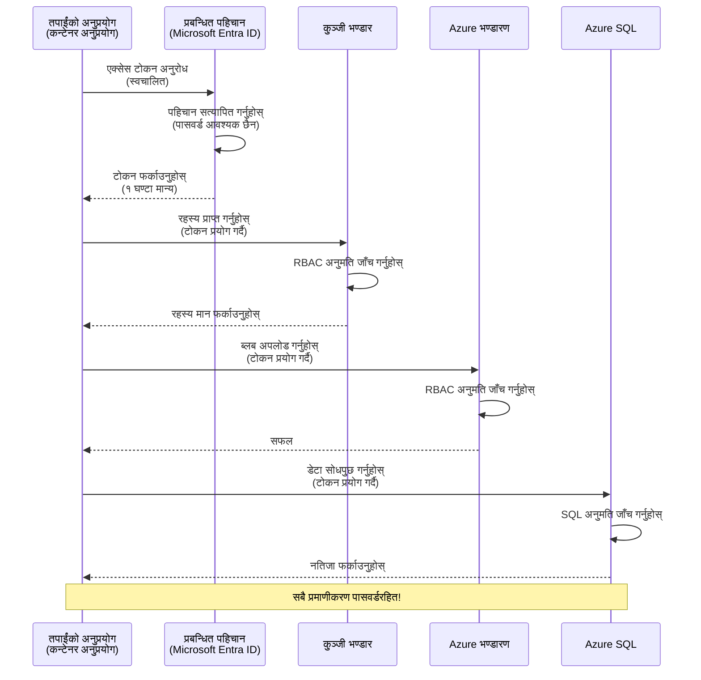
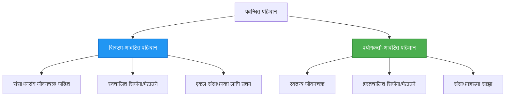

# प्रमाणीकरण ढाँचा र Managed Identity

⏱️ **अनुमानित समय**: 45-60 मिनेट | 💰 **लागत प्रभाव**: निःशुल्क (थप चार्ज छैन) | ⭐ **जटिलता**: मध्यम

**📚 सिकाइ मार्ग:**
- ← पहिले: [Configuration Management](configuration.md) - वातावरण भेरिएबल र गोप्य जानकारीहरूको व्यवस्थापन
- 🎯 **तपाईं यहाँ हुनुहुन्छ**: प्रमाणीकरण र सुरक्षा (Managed Identity, Key Vault, सुरक्षित ढाँचाहरू)
- → अर्को: [First Project](first-project.md) - आफ्नो पहिलो AZD अनुप्रयोग बनाउनुहोस्
- 🏠 [Course Home](../../README.md)

---

## तपाईंले के सिक्नुहुनेछ

यो पाठ पूरा गरेर, तपाईंले:
- Azure प्रमाणीकरण ढाँचाहरू बुझ्नुहुनेछ (keys, connection strings, managed identity)
- पासवर्डरहित प्रमाणीकरणका लागि **Managed Identity** कार्यान्वयन गर्ने
- **Azure Key Vault** एकीकरणमार्फत गोप्य जानकारी सुरक्षित गर्ने
- AZD deployments का लागि **role-based access control (RBAC)** कन्फिगर गर्ने
- Container Apps र Azure सेवाहरूमा सुरक्षा सर्वोत्तम अभ्यास लागू गर्ने
- key-आधारितबाट identity-आधारित प्रमाणीकरणमा माइग्रेसन गर्ने

## किन Managed Identity महत्वपूर्ण छ

### समस्या: पारम्परिक प्रमाणीकरण

**Managed Identity अघि:**
```javascript
// ❌ सुरक्षा जोखिम: कोडमा हार्डकोड गरिएको गोप्य जानकारी
const connectionString = "Server=mydb.database.windows.net;User=admin;Password=P@ssw0rd123";
const storageKey = "xK7mN9pQ2wR5tY8uI0oP3aS6dF1gH4jK...";
const cosmosKey = "C2x7B9n4M1p8Q5w3E6r0T2y5U8i1O4p7...";
```

**समस्या हरू:**
- 🔴 **कोडमा, कन्फिग फाइलहरूमा, वातावरण भेरिएबलमा** गोप्य जानकारीहरू सार्वजनिक हुने
- 🔴 **प्रमाणीपत्र घुमाउने (credential rotation)** को लागि कोड परिवर्तन र पुनःडिप्लोयोग आवश्यक पर्छ
- 🔴 **अडिट दुख** - कसले के, कहिले पहुँच गर्‍यो भन्ने थाहा पाउन गाह्रो
- 🔴 **फैलावट** - गोप्य जानकारीहरू धेरै सिस्टमहरूमा फैलिएका हुन्छन्
- 🔴 **अनुपालन जोखिम** - सुरक्षा अडिटमा असफल हुन सक्छ

### समाधान: Managed Identity

**Managed Identity पछाडि:**
```javascript
// ✅ सुरक्षित: कोडमा कुनै गोप्य जानकारी छैन
const credential = new DefaultAzureCredential();
const client = new BlobServiceClient(
  "https://mystorageaccount.blob.core.windows.net",
  credential  // Azure ले प्रमाणीकरणलाई स्वचालित रूपमा सम्हाल्छ
);
```

**लाभहरू:**
- ✅ **कोड वा कन्फिगमा शून्य गोप्य जानकारी**
- ✅ **स्वचालित घुमाउने** - Azure ले ह्यान्डल गर्छ
- ✅ **Microsoft Entra ID लगहरूमा पूर्ण अडिट ट्रेल**
- ✅ **केन्द्रित सुरक्षा** - Azure Portal मा व्यवस्थापन
- ✅ **अनुपालन तयार** - सुरक्षा मानक पूरा गर्छ

**उपमा**: पारम्परिक प्रमाणीकरण विभिन्न ढोकाका लागि धेरै भौतिक कुञ्जीहरू बोक्ने जस्तै हो। Managed Identity त्यस्तो सुरक्षा ब्याज (security badge) जस्तै हो जसले तपाईंको पहिचानको आधारमा स्वतः पहुँच दिन्छ—कुनै कुञ्जी हराउने, नक्कल गरिने, वा घुमाउने समस्या हुँदैन।

---

## वास्तुकला अवलोकन

### Managed Identity सँग प्रमाणीकरण फ्लो



### Managed Identities का प्रकार



| Feature | System-Assigned | User-Assigned |
|---------|----------------|---------------|
| **लाइफलाइफाइल** | स्रोतसँग जोडिएको | स्वतन्त्र |
| **सिर्जना** | स्रोतसँग स्वतः | म्यानुअल सिर्जना |
| **मेटाउने** | स्रोत मेटाउँदा हट्छ | स्रोत मेटाएपछि पनि रहन्छ |
| **शेयरिङ** | केवल एउटा स्रोतमा मात्र | धेरै स्रोतहरूमा साझा गर्न मिल्छ |
| **प्रयोग केस** | साधारण परिदृश्यहरू | जटिल बहु-स्रोत परिदृश्यहरू |
| **AZD Default** | ✅ सिफारिस गरिएको | वैकल्पिक |

---

## जरुरी पूर्वापेक्षाहरू

### आवश्यक उपकरणहरू

तपाईंले पहिलेका पाठहरूबाट यी पहिले नै इन्स्टल गरेका हुनु पर्छ:

```bash
# Azure Developer CLI सत्यापित गर्नुहोस्
azd version
# ✅ अपेक्षित: azd संस्करण 1.0.0 वा माथि

# Azure CLI सत्यापित गर्नुहोस्
az --version
# ✅ अपेक्षित: azure-cli संस्करण 2.50.0 वा माथि
```

### Azure आवश्यकताहरू

- सक्रिय Azure सब्सक्रिप्शन
- अनुमति हरू:
  - managed identities सिर्जना गर्ने
  - RBAC भूमिका असाइन गर्ने
  - Key Vault संसाधनहरू सिर्जना गर्ने
  - Container Apps तैनाथ गर्ने

### ज्ञान पूर्वापेक्षाहरू

तपाईंले यी पूरा गरिसक्नु भएको हुनु पर्छ:
- [Installation Guide](installation.md) - AZD सेटअप
- [AZD Basics](azd-basics.md) - मुख्य अवधारणाहरू
- [Configuration Management](configuration.md) - वातावरण भेरिएबलहरू

---

## पाठ 1: प्रमाणीकरण ढाँचाहरू समझनु

### ढाँचा 1: Connection Strings (पुरानो - टाढा रहनुहोस्)

**यो कसरी काम गर्छ:**
```bash
# कनेक्शन स्ट्रिङमा प्रमाण-पत्रहरू समावेश छन्
STORAGE_CONNECTION_STRING="DefaultEndpointsProtocol=https;AccountName=myaccount;AccountKey=xK7mN9pQ2wR5..."
COSMOS_CONNECTION_STRING="AccountEndpoint=https://myaccount.documents.azure.com:443/;AccountKey=C2x7..."
SQL_CONNECTION_STRING="Server=myserver.database.windows.net;User=admin;Password=P@ssw0rd..."
```

**समस्या हरू:**
- ❌ वातावरण भेरिएबलहरूमा गोप्य जानकारी देखिन्छ
- ❌ तैनाथी प्रणालीहरूमा लग हुने
- ❌ घुमाउन गाह्रो
- ❌ पहुँचको अडिट ट्रेल छैन

**कहिले प्रयोग गर्ने:** केवल स्थानीय विकासका लागि, कहिल्यै उत्पादनमा होइन।

---

### ढाँचा 2: Key Vault References (राम्रो)

**यो कसरी काम गर्छ:**
```bicep
// Store secret in Key Vault
resource keyVault 'Microsoft.KeyVault/vaults@2023-02-01' = {
  name: 'mykv'
  properties: {
    enableRbacAuthorization: true
  }
}

// Reference in Container App
env: [
  {
    name: 'STORAGE_KEY'
    secretRef: 'storage-key'  // References Key Vault
  }
]
```

**लाभहरू:**
- ✅ गोप्य जानकारीहरू Key Vault मा सुरक्षित रूपमा स्टोर गरिन्छ
- ✅ केंद्रीकृत गोप्य व्यवस्थापन
- ✅ कोड परिवर्तन बिना घुमाउने सम्भव

**सीमाहरू:**
- ⚠️ अझै पनि keys/passwords प्रयोग भइरहेको छ
- ⚠️ Key Vault पहुँच व्यवस्थापन गर्नुपर्ने हुन्छ

**कहिले प्रयोग गर्ने:** connection strings बाट managed identity तर्फ संक्रमणको चरणको रूपमा।

---

### ढाँचा 3: Managed Identity (सर्वोत्तम अभ्यास)

**यो कसरी काम गर्छ:**
```bicep
// Enable managed identity
resource containerApp 'Microsoft.App/containerApps@2023-05-01' = {
  name: 'myapp'
  identity: {
    type: 'SystemAssigned'  // Automatically creates identity
  }
}

// Grant permissions
resource roleAssignment 'Microsoft.Authorization/roleAssignments@2022-04-01' = {
  scope: storageAccount
  properties: {
    roleDefinitionId: storageBlobDataContributorRole
    principalId: containerApp.identity.principalId
  }
}
```

**एप्लिकेशन कोड:**
```javascript
// कुनै गोप्य कुरा आवश्यक छैन!
const { DefaultAzureCredential } = require('@azure/identity');
const { BlobServiceClient } = require('@azure/storage-blob');

const credential = new DefaultAzureCredential();
const blobServiceClient = new BlobServiceClient(
  'https://mystorageaccount.blob.core.windows.net',
  credential
);
```

**लाभहरू:**
- ✅ कोड/कन्फिगमा शून्य गोप्य जानकारी
- ✅ स्वतः प्रमाणीपत्र घुमाउने
- ✅ पूर्ण अडिट ट्रेल
- ✅ RBAC-आधारित अनुमतिहरू
- ✅ अनुपालन तयार

**कहिले प्रयोग गर्ने:** सधैं, उत्पादन अनुप्रयोगहरूको लागि।

---

### ढाँचा 4: Service Principals (CI/CD र स्वचालनका लागि)

Managed identity Azure भित्र चल्ने स्रोतहरूको लागि गोल्ड स्ट्यान्डर्ड हो। तर Azure बाहिर चल्ने चीजहरू—जस्तै बिल्ड एजेन्टमा CI/CD पाइपलाइन, वा तपाईँको ल्यापटपमा चल्ने स्क्रिप्ट जुन इन्टरएक्टिभ लगइन प्रयोग गर्न सक्दैन—को लागि के? त्यतिबेला एक **service principal** काममा आउँछ: स्वचालित प्रक्रियाले साइन इन गर्न सक्ने गैर-मानव पहिचान जसका आफ्नै प्रमाणपत्र हुन्छन्।

**यो कसरी काम गर्छ:**

न्यूनतम अधिकार सिद्धान्तअनुसार resource group मा सीमित service principal सिर्जना गर्नुहोस्:

```bash
az ad sp create-for-rbac \
  --name "myapp-cicd" \
  --role contributor \
  --scopes /subscriptions/<sub-id>/resourceGroups/<rg-name>
```

यसले client ID, client secret, र tenant ID देखाउँछ। azd ती प्रयोग गरेर non-interactively साइन इन गर्न सक्छ:

```bash
azd auth login \
  --client-id "<appId>" \
  --client-secret "<password>" \
  --tenant-id "<tenant>"
```

**Secret हरूको सट्टा federated credentials (OIDC) लाई प्राथमिकता दिनुहोस्।** लामो अवधि चल्ने client secretको सट्टा, एक federated credential कन्फिगर गर्नुहोस् जसले पाइपलाइनलाई छोटो-आयु token साटासाट गर्न दिन्छ—कुनै गोप्य जानकारी चुहिने वा घुमाउने जोखिम छैन:

```bash
azd auth login \
  --client-id "<appId>" \
  --federated-credential-provider "github" \
  --tenant-id "<tenant>"
```

> `azd pipeline config` ले यो तपाईंका लागि स्वचालित रूपमा सेटअप गर्छ। CI/CD walkthrough हरूका लागि [Chapter 8](../chapter-08-production/production-ai-practices.md) हेर्नुहोस्।

**लाभहरू:**
- ✅ Azure बाहिर काम गर्छ (build agents, on-premises, अन्य क्लाउडहरू)
- ✅ एकल resource group मा एक भूमिका दिएर सीमित गर्न सकिन्छ
- ✅ Federated (OIDC) प्रकारले कुनै स्टोर गरिएको गोप्य कुरा प्रयोग गर्दैन

**व्यापार-ऑफहरू:**
- ⚠️ Secret-आधारित प्रकारले सावधानीपूर्वक भण्डारण र घुमाउने आवश्यकता पर्दछ
- ⚠️ चुहिएको secret ले SP ले गर्न सक्ने सबै कुराहरू प्रदान गर्छ—स्कोपहरू कडा राख्नुहोस्

**कहिले प्रयोग गर्ने:** CI/CD पाइपलाइन र त्यस्ता स्वचालनका लागि जुन managed identity प्रयोग गर्न सक्दैन। सधैं **federated/OIDC** प्रकारलाई client secret भन्दा प्राथमिकता दिनुहोस्, र जहाँ काम भित्र Azure छ त्यहाँ managed identity लाई प्राथमिकता दिनुहोस्।

**प्रमाणीपत्रहरू सुरक्षित राख्ने तरिका:**
- कहिल्यै secrets कमिट नगर्नुहोस्—तपाईंको पाइपलाइनको secret स्टोर प्रयोग गर्नुहोस् (GitHub Actions secrets, Azure DevOps variable groups / Key Vault).
- SP लाई आवश्यक सबैभन्दा सानो भूमिका र resource group मा सीमित गर्नुहोस्।
- समाप्ति तारीख सेट गर्नुहोस् र घुमाउनुहोस्, वा OIDC मार्फत secret पूर्ण रूपमा हटाउनुहोस्।

---

## पाठ 2: AZD सँग Managed Identity कार्यान्वयन

### चरण-द्वारा-चरण कार्यान्वयन

आउनुहोस् एक सुरक्षित Container App बनाउँ कि जसले Azure Storage र Key Vault पहुँच गर्न managed identity प्रयोग गर्छ।

### परियोजना संरचना

```
secure-app/
├── azure.yaml                 # AZD configuration
├── infra/
│   ├── main.bicep            # Main infrastructure
│   ├── core/
│   │   ├── identity.bicep    # Managed identity setup
│   │   ├── keyvault.bicep    # Key Vault configuration
│   │   └── storage.bicep     # Storage with RBAC
│   └── app/
│       └── container-app.bicep
└── src/
    ├── app.js                # Application code
    ├── package.json
    └── Dockerfile
```

### 1. AZD कन्फिगर गर्नुहोस् (azure.yaml)

```yaml
name: secure-app
metadata:
  template: secure-app@1.0.0

services:
  api:
    project: ./src
    language: js
    host: containerapp

# Enable managed identity (AZD handles this automatically)
```

### 2. पूर्वाधार: Managed Identity सक्षम गर्नुहोस्

**File: `infra/main.bicep`**

```bicep
targetScope = 'subscription'

param environmentName string
param location string = 'eastus'

var tags = { 'azd-env-name': environmentName }

// Resource group
resource rg 'Microsoft.Resources/resourceGroups@2021-04-01' = {
  name: 'rg-${environmentName}'
  location: location
  tags: tags
}

// Storage Account
module storage './core/storage.bicep' = {
  name: 'storage'
  scope: rg
  params: {
    name: 'st${uniqueString(rg.id)}'
    location: location
    tags: tags
  }
}

// Key Vault
module keyVault './core/keyvault.bicep' = {
  name: 'keyvault'
  scope: rg
  params: {
    name: 'kv-${uniqueString(rg.id)}'
    location: location
    tags: tags
  }
}

// Container App with Managed Identity
module containerApp './app/container-app.bicep' = {
  name: 'container-app'
  scope: rg
  params: {
    name: 'ca-${environmentName}'
    location: location
    tags: tags
    storageAccountName: storage.outputs.name
    keyVaultName: keyVault.outputs.name
  }
}

// Grant Container App access to Storage
module storageRoleAssignment './core/role-assignment.bicep' = {
  name: 'storage-role'
  scope: rg
  params: {
    principalId: containerApp.outputs.identityPrincipalId
    roleDefinitionId: 'ba92f5b4-2d11-453d-a403-e96b0029c9fe'  // Storage Blob Data Contributor
    targetResourceId: storage.outputs.id
  }
}

// Grant Container App access to Key Vault
module kvRoleAssignment './core/role-assignment.bicep' = {
  name: 'kv-role'
  scope: rg
  params: {
    principalId: containerApp.outputs.identityPrincipalId
    roleDefinitionId: '4633458b-17de-408a-b874-0445c86b69e6'  // Key Vault Secrets User
    targetResourceId: keyVault.outputs.id
  }
}

// Outputs
output AZURE_STORAGE_ACCOUNT_NAME string = storage.outputs.name
output AZURE_KEY_VAULT_NAME string = keyVault.outputs.name
output APP_URL string = containerApp.outputs.url
```

### 3. System-Assigned Identity भएको Container App

**File: `infra/app/container-app.bicep`**

```bicep
param name string
param location string
param tags object = {}
param storageAccountName string
param keyVaultName string

resource containerApp 'Microsoft.App/containerApps@2023-05-01' = {
  name: name
  location: location
  tags: tags
  identity: {
    type: 'SystemAssigned'  // 🔑 Enable managed identity
  }
  properties: {
    configuration: {
      ingress: {
        external: true
        targetPort: 3000
      }
    }
    template: {
      containers: [
        {
          name: 'api'
          image: 'myregistry.azurecr.io/api:latest'
          resources: {
            cpu: json('0.5')
            memory: '1Gi'
          }
          env: [
            {
              name: 'AZURE_STORAGE_ACCOUNT_NAME'
              value: storageAccountName
            }
            {
              name: 'AZURE_KEY_VAULT_NAME'
              value: keyVaultName
            }
            // 🔑 No secrets - managed identity handles authentication!
          ]
        }
      ]
    }
  }
}

// Output the identity for RBAC assignments
output identityPrincipalId string = containerApp.identity.principalId
output id string = containerApp.id
output url string = 'https://${containerApp.properties.configuration.ingress.fqdn}'
```

### 4. RBAC भूमिका असाइनमेन्ट मोड्युल

**File: `infra/core/role-assignment.bicep`**

```bicep
param principalId string
param roleDefinitionId string  // Azure built-in role ID
param targetResourceId string

resource roleAssignment 'Microsoft.Authorization/roleAssignments@2022-04-01' = {
  name: guid(principalId, roleDefinitionId, targetResourceId)
  scope: resourceId('Microsoft.Resources/resourceGroups', resourceGroup().name)
  properties: {
    roleDefinitionId: subscriptionResourceId('Microsoft.Authorization/roleDefinitions', roleDefinitionId)
    principalId: principalId
    principalType: 'ServicePrincipal'
  }
}

output id string = roleAssignment.id
```

### 5. Managed Identity सँग एप्लिकेशन कोड

**File: `src/app.js`**

```javascript
const express = require('express');
const { DefaultAzureCredential } = require('@azure/identity');
const { BlobServiceClient } = require('@azure/storage-blob');
const { SecretClient } = require('@azure/keyvault-secrets');

const app = express();
const PORT = process.env.PORT || 3000;

// 🔑 क्रेडेन्सियल आरम्भ गर्नुहोस् (प्रबन्धित पहिचानसँग स्वचालित रूपमा काम गर्छ)
const credential = new DefaultAzureCredential();

// Azure Storage सेटअप
const storageAccountName = process.env.AZURE_STORAGE_ACCOUNT_NAME;
const blobServiceClient = new BlobServiceClient(
  `https://${storageAccountName}.blob.core.windows.net`,
  credential  // कुनै कुञ्जी आवश्यक छैन!
);

// Key Vault सेटअप
const keyVaultName = process.env.AZURE_KEY_VAULT_NAME;
const secretClient = new SecretClient(
  `https://${keyVaultName}.vault.azure.net`,
  credential  // कुनै कुञ्जी आवश्यक छैन!
);

// स्वास्थ्य जाँच
app.get('/health', (req, res) => {
  res.json({ status: 'healthy', authentication: 'managed-identity' });
});

// ब्लब स्टोरेजमा फाइल अपलोड गर्नुहोस्
app.post('/upload', async (req, res) => {
  try {
    const containerClient = blobServiceClient.getContainerClient('uploads');
    await containerClient.createIfNotExists();
    
    const blobName = `file-${Date.now()}.txt`;
    const blockBlobClient = containerClient.getBlockBlobClient(blobName);
    
    await blockBlobClient.upload('Hello from managed identity!', 30);
    
    res.json({
      success: true,
      blobName: blobName,
      message: 'File uploaded using managed identity!'
    });
  } catch (error) {
    console.error('Upload error:', error);
    res.status(500).json({ error: error.message });
  }
});

// Key Vault बाट गोप्य मान प्राप्त गर्नुहोस्
app.get('/secret/:name', async (req, res) => {
  try {
    const secretName = req.params.name;
    const secret = await secretClient.getSecret(secretName);
    
    res.json({
      name: secretName,
      value: secret.value,
      message: 'Secret retrieved using managed identity!'
    });
  } catch (error) {
    console.error('Secret error:', error);
    res.status(500).json({ error: error.message });
  }
});

// ब्लब कन्टेनरहरू सूचीबद्ध गर्नुहोस् (पढ्ने पहुँच प्रदर्शन गर्दछ)
app.get('/containers', async (req, res) => {
  try {
    const containers = [];
    for await (const container of blobServiceClient.listContainers()) {
      containers.push(container.name);
    }
    
    res.json({
      containers: containers,
      count: containers.length,
      message: 'Containers listed using managed identity!'
    });
  } catch (error) {
    console.error('List error:', error);
    res.status(500).json({ error: error.message });
  }
});

app.listen(PORT, () => {
  console.log(`Secure API listening on port ${PORT}`);
  console.log('Authentication: Managed Identity (passwordless)');
});
```

**File: `src/package.json`**

```json
{
  "name": "secure-app",
  "version": "1.0.0",
  "dependencies": {
    "express": "^4.18.2",
    "@azure/identity": "^4.0.0",
    "@azure/storage-blob": "^12.17.0",
    "@azure/keyvault-secrets": "^4.7.0"
  },
  "scripts": {
    "start": "node app.js"
  }
}
```

### 6. डिप्लोए र परीक्षण गर्नुहोस्

```bash
# AZD वातावरण आरम्भ गर्नुहोस्
azd init

# पूर्वाधार र अनुप्रयोग परिनियोजन गर्नुहोस्
azd up

# अनुप्रयोगको URL प्राप्त गर्नुहोस्
APP_URL=$(azd env get-values | grep APP_URL | cut -d '=' -f2 | tr -d '"')

# स्वास्थ्य जाँच गर्नुहोस्
curl $APP_URL/health
```

**✅ अपेक्षित आउटपुट:**
```json
{
  "status": "healthy",
  "authentication": "managed-identity"
}
```

**ब्लब अपलोड परीक्षण:**
```bash
curl -X POST $APP_URL/upload
```

**✅ अपेक्षित आउटपुट:**
```json
{
  "success": true,
  "blobName": "file-1700404800000.txt",
  "message": "File uploaded using managed identity!"
}
```

**कन्टेनर सूची परीक्षण:**
```bash
curl $APP_URL/containers
```

**✅ अपेक्षित आउटपुट:**
```json
{
  "containers": ["uploads"],
  "count": 1,
  "message": "Containers listed using managed identity!"
}
```

---

## सामान्य Azure RBAC भूमिकाहरू

### Managed Identity का लागि निर्मित भूमिका ID हरू

| सेवा | Role Name | Role ID | अनुमतिहरू |
|---------|-----------|---------|-------------|
| **Storage** | Storage Blob Data Reader | `2a2b9908-6b94-4a3d-8e5a-a7d8f8cc8a12` | ब्लबहरू र कन्टेनरहरू पढ्ने |
| **Storage** | Storage Blob Data Contributor | `ba92f5b4-2d11-453d-a403-e96b0029c9fe` | ब्लबहरू पढ्ने, लेख्ने, मेट्ने |
| **Storage** | Storage Queue Data Contributor | `974c5e8b-45b9-4653-ba55-5f855dd0fb88` | क्यु सन्देशहरू पढ्ने, लेख्ने, मेट्ने |
| **Key Vault** | Key Vault Secrets User | `4633458b-17de-408a-b874-0445c86b69e6` | गोप्य जानकारीहरू पढ्ने |
| **Key Vault** | Key Vault Secrets Officer | `b86a8fe4-44ce-4948-aee5-eccb2c155cd7` | गोप्य जानकारीहरू पढ्ने, लेख्ने, मेट्ने |
| **Cosmos DB** | Cosmos DB Built-in Data Reader | `00000000-0000-0000-0000-000000000001` | Cosmos DB डेटा पढ्ने |
| **Cosmos DB** | Cosmos DB Built-in Data Contributor | `00000000-0000-0000-0000-000000000002` | Cosmos DB मा पढ्ने, लेख्ने डाटा संचालन |
| **SQL Database** | SQL DB Contributor | `9b7fa17d-e63e-47b0-bb0a-15c516ac86ec` | SQL डेटाबेसहरू व्यवस्थापन गर्ने |
| **Service Bus** | Azure Service Bus Data Owner | `090c5cfd-751d-490a-894a-3ce6f1109419` | सन्देशहरू पठाउने, प्राप्त गर्ने, व्यवस्थापन गर्ने |

### Role ID कसरी फेला पार्ने

```bash
# सबै बिल्ट-इन भूमिकाहरू सूचीबद्ध गर्नुहोस्
az role definition list --query "[].{Name:roleName, ID:name}" --output table

# विशेष भूमिका खोज्नुहोस्
az role definition list --query "[?contains(roleName, 'Storage Blob')].{Name:roleName, ID:name}" --output table

# भूमिकाको विवरण प्राप्त गर्नुहोस्
az role definition list --name "Storage Blob Data Contributor"
```

---

## व्यवहारिक अभ्यासहरू

### अभ्यास 1: विद्यमान एपमा Managed Identity सक्षम गर्नुहोस् ⭐⭐ (मध्यम)

**लक्ष्य**: विद्यमान Container App डिप्लोयमेन्टमा managed identity थप्नुहोस्

**परिदृश्य**: तपाईंसँग connection strings प्रयोग गर्ने Container App छ। यसलाई managed identity मा रूपान्तरण गर्नुहोस्।

**सुरुआती बिन्दु**: यस कन्फिगरेसन भएको Container App:

```bicep
// ❌ Current: Using connection string
env: [
  {
    name: 'STORAGE_CONNECTION_STRING'
    secretRef: 'storage-connection'
  }
]
```

**चरणहरू**:

1. **Bicep मा managed identity सक्षम गर्नुहोस्:**

```bicep
resource containerApp 'Microsoft.App/containerApps@2023-05-01' = {
  name: 'myapp'
  identity: {
    type: 'SystemAssigned'  // Add this
  }
  // ... rest of configuration
}
```

2. **Storage पहुँच दिनुहोस्:**

```bicep
// Get storage account reference
resource storageAccount 'Microsoft.Storage/storageAccounts@2023-01-01' existing = {
  name: storageAccountName
}

// Assign role
resource roleAssignment 'Microsoft.Authorization/roleAssignments@2022-04-01' = {
  name: guid(containerApp.id, 'ba92f5b4-2d11-453d-a403-e96b0029c9fe', storageAccount.id)
  scope: storageAccount
  properties: {
    roleDefinitionId: subscriptionResourceId('Microsoft.Authorization/roleDefinitions', 'ba92f5b4-2d11-453d-a403-e96b0029c9fe')
    principalId: containerApp.identity.principalId
    principalType: 'ServicePrincipal'
  }
}
```

3. **एप्लिकेशन कोड अपडेट गर्नुहोस्:**

**अघि (connection string):**
```javascript
const { BlobServiceClient } = require('@azure/storage-blob');

const blobServiceClient = BlobServiceClient.fromConnectionString(
  process.env.STORAGE_CONNECTION_STRING
);
```

**पछि (managed identity):**
```javascript
const { DefaultAzureCredential } = require('@azure/identity');
const { BlobServiceClient } = require('@azure/storage-blob');

const credential = new DefaultAzureCredential();
const blobServiceClient = new BlobServiceClient(
  `https://${process.env.STORAGE_ACCOUNT_NAME}.blob.core.windows.net`,
  credential
);
```

4. **पर्यावरण भेरिएबलहरू अपडेट गर्नुहोस्:**

```bicep
env: [
  {
    name: 'STORAGE_ACCOUNT_NAME'
    value: storageAccountName  // Just the name, no secrets!
  }
  // Remove STORAGE_CONNECTION_STRING
]
```

5. **डिप्लोए र परीक्षण गर्नुहोस्:**

```bash
# फेरि तैनाथ गर्नुहोस्
azd up

# यो अझै पनि काम गर्छ कि गर्दैन भनेर परीक्षण गर्नुहोस्
curl https://myapp.azurecontainerapps.io/upload
```

**✅ सफलता मापदण्ड:**
- ✅ एप्लिकेशन त्रुटि बिना डिप्लोइ हुन्छ
- ✅ Storage अपरेसनहरू काम गर्छन् (अपलोड, सूची, डाउनलोड)
- ✅ वातावरण भेरिएबलहरूमा कुनै connection strings छैनन्
- ✅ Azure Portal मा "Identity" ब्लेड अन्तर्गत पहिचान देखिन्छ

**जाँच गर्ने तरिका:**

```bash
# व्यवस्थापित पहिचान सक्षम छ कि जाँच गर्नुहोस्
az containerapp show \
  --name myapp \
  --resource-group rg-myapp \
  --query "identity.type"
# ✅ अपेक्षित: "SystemAssigned"

# भूमिका नियुक्ति जाँच गर्नुहोस्
az role assignment list \
  --assignee $(az containerapp show --name myapp --resource-group rg-myapp --query "identity.principalId" -o tsv) \
  --scope /subscriptions/{sub-id}/resourceGroups/rg-myapp/providers/Microsoft.Storage/storageAccounts/mystorageaccount
# ✅ अपेक्षित: "Storage Blob Data Contributor" भूमिका देखाउँछ
```

**समय**: 20-30 मिनेट

---

### अभ्यास 2: User-Assigned Identity सँग बहु-सेवा पहुँच ⭐⭐⭐ (उन्नत)

**लक्ष्य**: धेरै Container Apps हरूमा साझा गरिएको user-assigned identity सिर्जना गर्नुहोस्

**परिदृश्य**: तपाईंसँग 3 माइक्रोसर्भिसहरू छन् जसले एउटै Storage account र Key Vault पहुँच गर्नुपर्छ।

**चरणहरू**:

1. **user-assigned identity सिर्जना गर्नुहोस्:**

**File: `infra/core/identity.bicep`**

```bicep
param name string
param location string
param tags object = {}

resource userAssignedIdentity 'Microsoft.ManagedIdentity/userAssignedIdentities@2023-01-31' = {
  name: name
  location: location
  tags: tags
}

output id string = userAssignedIdentity.id
output principalId string = userAssignedIdentity.properties.principalId
output clientId string = userAssignedIdentity.properties.clientId
```

2. **user-assigned identity लाई भूमिकाहरू असाइन गर्नुहोस्:**

```bicep
// In main.bicep
module userIdentity './core/identity.bicep' = {
  name: 'user-identity'
  scope: rg
  params: {
    name: 'id-${environmentName}'
    location: location
    tags: tags
  }
}

// Grant Storage access
resource storageRoleAssignment 'Microsoft.Authorization/roleAssignments@2022-04-01' = {
  name: guid(userIdentity.outputs.principalId, 'storage-contributor')
  scope: storageAccount
  properties: {
    roleDefinitionId: subscriptionResourceId('Microsoft.Authorization/roleDefinitions', 'ba92f5b4-2d11-453d-a403-e96b0029c9fe')
    principalId: userIdentity.outputs.principalId
    principalType: 'ServicePrincipal'
  }
}

// Grant Key Vault access
resource kvRoleAssignment 'Microsoft.Authorization/roleAssignments@2022-04-01' = {
  name: guid(userIdentity.outputs.principalId, 'kv-secrets-user')
  scope: keyVault
  properties: {
    roleDefinitionId: subscriptionResourceId('Microsoft.Authorization/roleDefinitions', '4633458b-17de-408a-b874-0445c86b69e6')
    principalId: userIdentity.outputs.principalId
    principalType: 'ServicePrincipal'
  }
}
```

3. **एकै identity लाई धेरै Container Apps मा असाइन गर्नुहोस्:**

```bicep
resource apiGateway 'Microsoft.App/containerApps@2023-05-01' = {
  name: 'api-gateway'
  identity: {
    type: 'UserAssigned'
    userAssignedIdentities: {
      '${userIdentity.outputs.id}': {}
    }
  }
  // ... rest of config
}

resource productService 'Microsoft.App/containerApps@2023-05-01' = {
  name: 'product-service'
  identity: {
    type: 'UserAssigned'
    userAssignedIdentities: {
      '${userIdentity.outputs.id}': {}
    }
  }
  // ... rest of config
}

resource orderService 'Microsoft.App/containerApps@2023-05-01' = {
  name: 'order-service'
  identity: {
    type: 'UserAssigned'
    userAssignedIdentities: {
      '${userIdentity.outputs.id}': {}
    }
  }
  // ... rest of config
}
```

4. **एप्लिकेशन कोड (सबै सेवाहरूले एउटै ढाँचा प्रयोग गर्छन्):**

```javascript
const { DefaultAzureCredential, ManagedIdentityCredential } = require('@azure/identity');

// प्रयोगकर्ताद्वारा तोकिएको पहिचानको लागि, क्लाइєн्ट ID निर्दिष्ट गर्नुहोस्
const credential = new ManagedIdentityCredential(
  process.env.AZURE_CLIENT_ID  // प्रयोगकर्ताद्वारा तोकिएको पहिचानको क्लाइєн्ट ID
);

// वा DefaultAzureCredential प्रयोग गर्नुहोस् (स्वचालित रूपमा पत्ता लगाउँछ)
const credential = new DefaultAzureCredential();

const blobServiceClient = new BlobServiceClient(
  `https://${process.env.STORAGE_ACCOUNT_NAME}.blob.core.windows.net`,
  credential
);
```

5. **डिप्लोए र प्रमाणीकरण गर्नुहोस्:**

```bash
azd up

# सबै सेवाहरूले भण्डारणमा पहुँच गर्न सक्छन् कि सक्दैनन् जाँच गर्नुहोस्
curl https://api-gateway.azurecontainerapps.io/upload
curl https://product-service.azurecontainerapps.io/upload
curl https://order-service.azurecontainerapps.io/upload
```

**✅ सफलता मापदण्ड:**
- ✅ 3 सेवाहरूमा साझा गरिएको एक पहिचान
- ✅ सबै सेवाहरूले Storage र Key Vault पहुँच गर्न सक्छन्
- ✅ एउट सेवा मेटाएमा identity बनेको रहन्छ
- ✅ केंद्रीकृत अनुमति व्यवस्थापन

**User-Assigned Identity का लाभहरू:**
- एकै पहिचान व्यवस्थापन गर्न सजिलो
- सेवाहरूमा समान अनुमति
- सेवा मेटाउँदा पनि बाँच्छ
- जटिल वास्तुकलाका लागि राम्रो

**समय**: 30-40 मिनेट

---

### अभ्यास 3: Key Vault गोप्य घुमाउने कार्यान्वयन गर्नुहोस् ⭐⭐⭐ (उन्नत)

**लक्ष्य**: तेस्रो-पक्ष API key हरू Key Vault मा स्टोर गर्ने र managed identity प्रयोग गरेर पहुँच गर्ने

**परिदृश्य**: तपाईँको एप्लिकेशनलाई बाह्य API (OpenAI, Stripe, SendGrid) कल गर्न API keys आवश्यक छ।

**चरणहरू**:

1. **RBAC सहित Key Vault सिर्जना गर्नुहोस्:**

**File: `infra/core/keyvault.bicep`**

```bicep
param name string
param location string
param tags object = {}

resource keyVault 'Microsoft.KeyVault/vaults@2023-02-01' = {
  name: name
  location: location
  tags: tags
  properties: {
    enableRbacAuthorization: true  // Use RBAC instead of access policies
    sku: {
      family: 'A'
      name: 'standard'
    }
    tenantId: subscription().tenantId
    enableSoftDelete: true
    softDeleteRetentionInDays: 90
  }
}

// Allow Container App to read secrets
output id string = keyVault.id
output name string = keyVault.name
output uri string = keyVault.properties.vaultUri
```

2. **Key Vault मा गोप्य जानकारीहरू स्टोर गर्नुहोस्:**

```bash
# Key Vault नाम प्राप्त गर्नुहोस्
KV_NAME=$(azd env get-values | grep AZURE_KEY_VAULT_NAME | cut -d '=' -f2 | tr -d '"')

# तृतीय-पक्ष API कुञ्जीहरू भण्डारण गर्नुहोस्
az keyvault secret set \
  --vault-name $KV_NAME \
  --name "OpenAI-ApiKey" \
  --value "sk-proj-xxxxxxxxxxxxx"

az keyvault secret set \
  --vault-name $KV_NAME \
  --name "Stripe-ApiKey" \
  --value "sk_live_xxxxxxxxxxxxx"

az keyvault secret set \
  --vault-name $KV_NAME \
  --name "SendGrid-ApiKey" \
  --value "SG.xxxxxxxxxxxxx"
```

3. **गोप्यहरू प्राप्त गर्न एप्लिकेशन कोड:**

**File: `src/config.js`**

```javascript
const { DefaultAzureCredential } = require('@azure/identity');
const { SecretClient } = require('@azure/keyvault-secrets');

class Config {
  constructor() {
    this.credential = new DefaultAzureCredential();
    this.secretClient = new SecretClient(
      `https://${process.env.AZURE_KEY_VAULT_NAME}.vault.azure.net`,
      this.credential
    );
    this.cache = {};
  }

  async getSecret(secretName) {
    // पहिले क्यास जाँच गर्नुहोस्
    if (this.cache[secretName]) {
      return this.cache[secretName];
    }

    try {
      const secret = await this.secretClient.getSecret(secretName);
      this.cache[secretName] = secret.value;
      console.log(`✅ Retrieved secret: ${secretName}`);
      return secret.value;
    } catch (error) {
      console.error(`❌ Failed to get secret ${secretName}:`, error.message);
      throw error;
    }
  }

  async getOpenAIKey() {
    return this.getSecret('OpenAI-ApiKey');
  }

  async getStripeKey() {
    return this.getSecret('Stripe-ApiKey');
  }

  async getSendGridKey() {
    return this.getSecret('SendGrid-ApiKey');
  }
}

module.exports = new Config();
```

4. **एप्लिकेशनमा गोप्यहरू प्रयोग गर्नुहोस्:**

**File: `src/app.js`**

```javascript
const express = require('express');
const config = require('./config');
const { OpenAI } = require('openai');

const app = express();

// Key Vault बाट कुञ्जी प्रयोग गरेर OpenAI आरम्भ गर्नुहोस्
let openaiClient;

async function initializeServices() {
  const openaiKey = await config.getOpenAIKey();
  openaiClient = new OpenAI({ apiKey: openaiKey });
  console.log('✅ Services initialized with secrets from Key Vault');
}

// स्टार्टअपमा कल गर्नुहोस्
initializeServices().catch(console.error);

app.post('/chat', async (req, res) => {
  try {
    const completion = await openaiClient.chat.completions.create({
      model: 'gpt-4.1',
      messages: [{ role: 'user', content: 'Hello!' }]
    });
    
    res.json({
      response: completion.choices[0].message.content,
      authentication: 'Key from Key Vault via Managed Identity'
    });
  } catch (error) {
    res.status(500).json({ error: error.message });
  }
});

app.listen(3000, () => {
  console.log('Secure API with Key Vault integration running');
});
```

5. **डिप्लोए र परीक्षण गर्नुहोस्:**

```bash
azd up

# API कुञ्जीहरू ठीकसँग काम गर्छन् भन्ने जाँच गर्नुहोस्
curl -X POST https://myapp.azurecontainerapps.io/chat \
  -H "Content-Type: application/json" \
  -d '{"message":"Hello AI"}'
```

**✅ सफलता मापदण्ड:**
- ✅ कोड वा वातावरण भेरिएबलहरूमा कुनै API कुञ्जीहरू छैनन्
- ✅ अनुप्रयोगले कुञ्जीहरू Key Vault बाट प्राप्त गर्छ
- ✅ तेश्रो-पक्षका API हरू सही रूपमा काम गर्छन्
- ✅ कोड परिवर्तन बिना कुञ्जीहरू घुमाउन सकिन्छ

**सिक्रेट घुमाउनुहोस्:**

```bash
# Key Vault मा गोप्य मान अद्यावधिक गर्नुहोस्
az keyvault secret set \
  --vault-name $KV_NAME \
  --name "OpenAI-ApiKey" \
  --value "sk-proj-NEW_KEY_HERE"

# नयाँ कुञ्जी प्रयोग गर्न एप पुनः सुरु गर्नुहोस्
az containerapp revision restart \
  --name myapp \
  --resource-group rg-myapp
```

**समय**: 25-35 मिनेट

---

## ज्ञान जाँचबिन्दु

### 1. प्रमाणिकरण ढाँचा ✓

तपाईंको बुझाइ जाँच्नुहोस्:

- [ ] **Q1**: तीन मुख्य प्रमाणिकरण ढाँचाहरू के हुन्? 
  - **A**: कनेक्शन स्ट्रिङहरू (legacy), Key Vault सन्दर्भहरू (transition), प्रबन्धित पहिचान (श्रेष्ठ)

- [ ] **Q2**: कनेक्शन स्ट्रिङहरू भन्दा प्रबन्धित पहिचान किन राम्रो हो?
  - **A**: कोडमा कुनै सिक्रेट हुँदैन, स्वचालित घुमाउरो, पूर्ण अडिट ट्रेल, RBAC अनुमतिहरू

- [ ] **Q3**: जब तपाईंले system-assigned सट्टा user-assigned identity प्रयोग गर्नुहुन्छ?
  - **A**: जब पहिचानलाई धेरै स्रोतहरूमा साझेदारी गर्नुपर्छ वा पहिचानको लाइफसाइकल स्रोतको लाइफसाइकलबाट स्वतन्त्र हुन्छ

**व्यावहारिक जाँच:**
```bash
# तपाईंको एपले कुन प्रकारको पहिचान प्रयोग गरिरहेको छ भनेर जाँच गर्नुहोस्
az containerapp show \
  --name myapp \
  --resource-group rg-myapp \
  --query "identity.type"

# पहिचानका लागि सबै भूमिका नियुक्तिहरू सूचीबद्ध गर्नुहोस्
az role assignment list \
  --assignee $(az containerapp show --name myapp --resource-group rg-myapp --query "identity.principalId" -o tsv)
```

---

### 2. RBAC र अनुमति ✓

तपाईंको बुझाइ जाँच्नुहोस्:

- [ ] **Q1**: "Storage Blob Data Contributor" को भूमिका ID के हो?
  - **A**: `ba92f5b4-2d11-453d-a403-e96b0029c9fe`

- [ ] **Q2**: "Key Vault Secrets User" ले के अनुमति दिन्छ?
  - **A**: सिक्रेटहरूमा पढ्ने मात्र पहुँच (बनाउन, अपडेट, वा मेटाउन सक्दैन)

- [ ] **Q3**: Container App लाई Azure SQL पहुँच कसरी दिनुहुन्छ?
  - **A**: "SQL DB Contributor" भूमिका असाइन गर्नुहोस् वा SQL का लागि Microsoft Entra ID प्रमाणिकरण कन्फिगर गर्नुहोस्

**व्यावहारिक जाँच:**
```bash
# विशिष्ट भूमिका खोज्नुहोस्
az role definition list --name "Storage Blob Data Contributor"

# तपाईंको पहिचानमा कुन-कुन भूमिकाहरू तोकिएका छन् जाँच गर्नुहोस्
PRINCIPAL_ID=$(az containerapp show --name myapp --resource-group rg-myapp --query "identity.principalId" -o tsv)
az role assignment list --assignee $PRINCIPAL_ID --output table
```

---

### 3. Key Vault एकीकरण ✓

तपाईंको बुझाइ जाँच्नुहोस्:

- [ ] **Q1**: Access policies को सट्टा Key Vault का लागि RBAC कसरी सक्षम गर्ने?
  - **A**: Bicep मा `enableRbacAuthorization: true` सेट गर्नुहोस्

- [ ] **Q2**: कुन Azure SDK लाइब्रेरीले प्रबन्धित पहिचान प्रमाणिकरण ह्यान्डल गर्छ?
  - **A**: `@azure/identity` जसमा `DefaultAzureCredential` class प्रयोग हुन्छ

- [ ] **Q3**: Key Vault सिक्रेटहरू कति समयसम्म क्यासमा रहन्छन्?
  - **A**: एप्लिकेशन-आधारित; आफ्नो क्यासिङ रणनीति लागू गर्नुहोस्

**व्यावहारिक जाँच:**
```bash
# कुञ्जी भण्डार पहुँचको परीक्षण
az keyvault secret show \
  --vault-name $KV_NAME \
  --name "OpenAI-ApiKey" \
  --query "value"

# RBAC सक्षम छ कि जाँच गर्नुहोस्
az keyvault show \
  --name $KV_NAME \
  --query "properties.enableRbacAuthorization"
# ✅ अपेक्षित: सत्य
```

---

## सुरक्षा सर्वोत्तम अभ्यासहरू

### ✅ गर्नुहोस्:

1. **सधैं उत्पादनमा प्रबन्धित पहिचान प्रयोग गर्नुहोस्**
   ```bicep
   identity: {
     type: 'SystemAssigned'
   }
   ```

2. **कम-अधिकार भएका RBAC भूमिकाहरू प्रयोग गर्नुहोस्**
   - सकिन्छ भने "Reader" भूमिका प्रयोग गर्नुहोस्
   - आवश्यक नभएसम्म "Owner" वा "Contributor" बाट बच्नुहोस्

3. **तेस्रो-पक्षका कुञ्जीहरू Key Vault मा राख्नुहोस्**
   ```javascript
   const apiKey = await secretClient.getSecret('ThirdPartyApiKey');
   ```

4. **अडिट लगिङ सक्षम गर्नुहोस्**
   ```bicep
   diagnosticSettings: {
     logs: [{ category: 'AuditEvent', enabled: true }]
   }
   ```

5. **डेभ/स्टेजिङ/प्रोडक्सनका लागि फरक पहिचानहरू प्रयोग गर्नुहोस्**
   ```bash
   azd env new dev
   azd env new staging
   azd env new prod
   ```

6. **नियमित रूपमा सिक्रेटहरू घुमाउनुहोस्**
   - Key Vault सिक्रेटहरूमा समाप्ति मिति सेट गर्नुहोस्
   - Azure Functions मार्फत घुमाउने प्रक्रिया स्वचालित गर्नुहोस्

### ❌ नगर्नुहोस्:

1. **कहिल्यै गोप्य जानकारी हार्डकोड नगर्नुहोस्**
   ```javascript
   // ❌ खराब
   const apiKey = "sk-proj-xxxxxxxxxxxxx";
   ```

2. **उत्पादनमा कनेक्शन स्ट्रिङहरू प्रयोग नगर्नुहोस्**
   ```javascript
   // ❌ नराम्रो
   BlobServiceClient.fromConnectionString(process.env.STORAGE_CONNECTION_STRING)
   ```

3. **अत्यधिक अनुमति नदिनुहोस्**
   ```bicep
   // ❌ BAD - too much access
   roleDefinitionId: 'Owner'
   
   // ✅ GOOD - least privilege
   roleDefinitionId: 'Storage Blob Data Reader'
   ```

4. **सिक्रेटहरू लगमा नलेख्नुहोस्**
   ```javascript
   // ❌ नराम्रो
   console.log('API Key:', apiKey);
   
   // ✅ राम्रो
   console.log('API Key retrieved successfully');
   ```

5. **वातावरणहरू बीच उत्पादन पहिचानहरू साझा नगर्नुहोस्**
   ```bicep
   // ❌ BAD - same identity for dev and prod
   // ✅ GOOD - separate identities per environment
   ```

---

## समस्या समाधान मार्गदर्शन

### समस्या: Azure Storage पहुँच गर्दा "Unauthorized"

**लक्षणहरू:**
```
Error: Unauthorized (403)
AuthorizationPermissionMismatch: This request is not authorized to perform this operation
```

**निदान:**

```bash
# प्रबन्धित पहिचान सक्षम छ कि छैन जाँच गर्नुहोस्
az containerapp show \
  --name myapp \
  --resource-group rg-myapp \
  --query "identity.type"
# ✅ अपेक्षित: "SystemAssigned" वा "UserAssigned"

# भूमिका नियुक्तिहरू जाँच गर्नुहोस्
PRINCIPAL_ID=$(az containerapp show --name myapp --resource-group rg-myapp --query "identity.principalId" -o tsv)
az role assignment list --assignee $PRINCIPAL_ID

# अपेक्षित: "Storage Blob Data Contributor" वा समान भूमिका देखिनु पर्छ
```

**समाधानहरू:**

1. **सही RBAC भूमिका दिनुहोस्:**
```bash
STORAGE_ID=$(az storage account show --name mystorageaccount --resource-group rg-myapp --query "id" -o tsv)
az role assignment create \
  --assignee $PRINCIPAL_ID \
  --role "Storage Blob Data Contributor" \
  --scope $STORAGE_ID
```

2. **प्रचारणको लागि पर्खनुहोस् (5-10 मिनेट लाग्न सक्छ):**
```bash
# भूमिका नियुक्ति स्थिति जाँच गर्नुहोस्
az role assignment list --assignee $PRINCIPAL_ID --scope $STORAGE_ID
```

3. **एप्लिकेशन कोडले सही क्रेडेन्सियल प्रयोग गरिरहेको छ कि छैन भेरिफाइ गर्नुहोस्:**
```javascript
// पक्का गर्नुहोस् कि तपाईं DefaultAzureCredential प्रयोग गर्दै हुनुहुन्छ
const credential = new DefaultAzureCredential();
```

---

### समस्या: Key Vault पहुँच अस्वीकृत

**लक्षणहरू:**
```
Error: Forbidden (403)
The user, group or application does not have secrets get permission
```

**निदान:**

```bash
# जाँच गर्नुहोस् कि Key Vault को RBAC सक्षम छ
az keyvault show \
  --name $KV_NAME \
  --query "properties.enableRbacAuthorization"
# ✅ अपेक्षित: साँचो

# भूमिका नियुक्तिहरू जाँच गर्नुहोस्
az role assignment list \
  --assignee $PRINCIPAL_ID \
  --scope /subscriptions/{sub-id}/resourceGroups/rg-myapp/providers/Microsoft.KeyVault/vaults/$KV_NAME
```

**समाधानहरू:**

1. **Key Vault मा RBAC सक्षम गर्नुहोस्:**
```bash
az keyvault update \
  --name $KV_NAME \
  --enable-rbac-authorization true
```

2. **Key Vault Secrets User भूमिका दिनुहोस्:**
```bash
KV_ID=$(az keyvault show --name $KV_NAME --query "id" -o tsv)
az role assignment create \
  --assignee $PRINCIPAL_ID \
  --role "Key Vault Secrets User" \
  --scope $KV_ID
```

---

### समस्या: DefaultAzureCredential स्थानीय रूपमा असफल हुन्छ

**लक्षणहरू:**
```
Error: DefaultAzureCredential failed to retrieve a token
CredentialUnavailableError: No credential available
```

**निदान:**

```bash
# तपाईं लग इन हुनुहुन्छ कि छैन जाँच गर्नुहोस्
az account show

# Azure CLI को प्रमाणीकरण जाँच गर्नुहोस्
az ad signed-in-user show
```

**समाधानहरू:**

1. **Azure CLI मा लगइन गर्नुहोस्:**
```bash
az login
```

2. **Azure सदस्यता सेट गर्नुहोस्:**
```bash
az account set --subscription "Your Subscription Name"
```

3. **स्थानीय विकासका लागि वातावरण भेरिएबलहरू प्रयोग गर्नुहोस्:**
```bash
export AZURE_TENANT_ID="your-tenant-id"
export AZURE_CLIENT_ID="your-client-id"
export AZURE_CLIENT_SECRET="your-client-secret"
```

4. **वा स्थानीय रूपमा फरक क्रेडेन्सियल प्रयोग गर्नुहोस्:**
```javascript
const { DefaultAzureCredential, AzureCliCredential } = require('@azure/identity');

// स्थानीय विकासको लागि AzureCliCredential प्रयोग गर्नुहोस्
const credential = process.env.NODE_ENV === 'production' 
  ? new DefaultAzureCredential()
  : new AzureCliCredential();
```

---

### समस्या: भूमिका नियुक्ति धेरै ढिलो प्रचारित हुन्छ

**लक्षणहरू:**
- भूमिका सफलतापूर्वक असाइन गरिएको छ
- अझै 403 त्रुटि आउँछ
- कहिलेकाहीं पहुँच हुन्छ, कहिलेकाहीं हुँदैन

**व्याख्या:**
Azure RBAC परिवर्तनहरू विश्वव्यापी रूपमा प्रचारित हुन 5-10 मिनेट लाग्न सक्छ।

**समाधान:**

```bash
# पर्खनुहोस् र पुनः प्रयास गर्नुहोस्
echo "Waiting for RBAC propagation..."
sleep 300  # 5 मिनेट पर्खनुहोस्

# पहुँच जाँच गर्नुहोस्
curl https://myapp.azurecontainerapps.io/upload

# यदि अझै असफल भइरहेको छ भने, एप पुनः सुरु गर्नुहोस्
az containerapp revision restart \
  --name myapp \
  --resource-group rg-myapp
```

---

## लागत सम्बन्धी विचारहरू

### प्रबन्धित पहिचान लागतहरू

| Resource | Cost |
|----------|------|
| **प्रबन्धित पहिचान** | 🆓 **नि:शुल्क** - शुल्क लाग्दैन |
| **RBAC भूमिका नियुक्तिहरू** | 🆓 **नि:शुल्क** - शुल्क लाग्दैन |
| **Microsoft Entra ID Token Requests** | 🆓 **नि:शुल्क** - समावेश |
| **Key Vault Operations** | $0.03 per 10,000 operations |
| **Key Vault Storage** | $0.024 per secret per month |

**प्रबन्धित पहिचानले पैसा बचत गर्छ किनभने:**
- ✅ सेवा-देखि-सेवा प्रमाणीकरणका लागि Key Vault अपरेसनहरू हटाउँछ
- ✅ सुरक्षा घटना घटाउँछ (कुनै क्रेडेन्सियल चुहावट हुँदैन)
- ✅ सञ्चालनिक ओभरहेड घटाउँछ (हस्तमै घुमाउन पर्ने हुँदैन)

**उदाहरण लागत तुलना (मासिक):**

| Scenario | Connection Strings | Managed Identity | Savings |
|----------|-------------------|-----------------|---------|
| सानो एप (1M requests) | ~$50 (Key Vault + ops) | ~$0 | $50/month |
| मध्यम एप (10M requests) | ~$200 | ~$0 | $200/month |
| ठूलो एप (100M requests) | ~$1,500 | ~$0 | $1,500/month |

---

## थप जान्नुहोस्

### आधिकारिक दस्तावेज
- [Azure प्रबन्धित पहिचान](https://learn.microsoft.com/entra/identity/managed-identities-azure-resources/overview)
- [Azure RBAC](https://learn.microsoft.com/azure/role-based-access-control/overview)
- [Azure Key Vault](https://learn.microsoft.com/azure/key-vault/general/overview)
- [DefaultAzureCredential](https://learn.microsoft.com/dotnet/api/azure.identity.defaultazurecredential)

### SDK दस्तावेज
- [@azure/identity (Node.js)](https://www.npmjs.com/package/@azure/identity)
- [Azure.Identity (C#)](https://www.nuget.org/packages/Azure.Identity/)
- [azure-identity (Python)](https://pypi.org/project/azure-identity/)

### यस पाठ्यक्रमका अर्को चरणहरू
- ← अघिल्लो: [कन्फिगरेसन व्यवस्थापन](configuration.md)
- → अर्को: [पहिलो परियोजना](first-project.md)
- 🏠 [पाठ्यक्रम गृह](../../README.md)

### सम्बन्धित उदाहरणहरू
- [Microsoft Foundry Models Chat Example](../../../../examples/azure-openai-chat) - Microsoft Foundry Models का लागि प्रबन्धित पहिचान प्रयोग गर्दछ
- [Microservices Example](../../../../examples/microservices) - बहु-सेवा प्रमाणिकरण ढाँचाहरू

---

## सारांश

**तपाईंले सिक्नुभयो:**
- ✅ तीन प्रमाणिकरण ढाँचाहरू (कनेक्शन स्ट्रिङहरू, Key Vault, प्रबन्धित पहिचान)
- ✅ AZD मा प्रबन्धित पहिचान कसरी सक्षम र कन्फिगर गर्ने
- ✅ Azure सेवाहरूका लागि RBAC भूमिका असाइनमेन्टहरू
- ✅ तेस्रो-पक्ष सिक्रेटहरूको लागि Key Vault एकीकरण
- ✅ user-assigned vs system-assigned पहिचानहरू
- ✅ सुरक्षा सर्वोत्तम अभ्यासहरू र समस्या समाधान

**मुख्य निष्कर्षहरू:**
1. **सधैं उत्पादनमा प्रबन्धित पहिचान प्रयोग गर्नुहोस्** - शुन्य सिक्रेटहरू, स्वचालित घुमाउरो
2. **कम-अधिकार भएका RBAC भूमिकाहरू प्रयोग गर्नुहोस्** - केवल आवश्यक अनुमति दिनुहोस्
3. **तेस्रो-पक्ष कुञ्जीहरू Key Vault मा राख्नुहोस्** - केन्द्रित सिक्रेट व्यवस्थापन
4. **वातावरण अनुसार पहिचान अलग्गै राख्नुहोस्** - Dev, staging, prod अलगाव
5. **अडिट लगिङ सक्षम गर्नुहोस्** - कसले के पहुँच गर्‍यो ट्रयाक गर्नुहोस्

**अर्को कदमहरू:**
1. माथिका व्यावहारिक अभ्यासहरू पूरा गर्नुहोस्
2. अवस्थित एपलाई कनेक्शन स्ट्रिङहरूबाट प्रबन्धित पहिचानमा माइग्रेट गर्नुहोस्
3. सुरुवातमै सुरक्षा सहित आफ्नो पहिलो AZD प्रोजेक्ट बनाउनुहोस्: [First Project](first-project.md)

---

<!-- CO-OP TRANSLATOR DISCLAIMER START -->
**अस्वीकरण**:
यो दस्तावेज़ AI अनुवाद सेवा [Co-op Translator](https://github.com/Azure/co-op-translator) प्रयोग गरेर अनुवाद गरिएको हो। हामी सही हुन प्रयास गर्छौं, तर कृपया जानकार हुनुस् कि स्वचालित अनुवादमा त्रुटिहरू वा अशुद्धताहरू हुन सक्छन्। मूल दस्तावेज़ यसको मूल भाषामा आधिकारिक स्रोत मानिनुपर्छ। महत्वपूर्ण जानकारीका लागि व्यावसायिक मानव अनुवाद सिफारिस गरिन्छ। यस अनुवादको प्रयोगबाट उत्पन्न कुनै पनि गलत बुझाइ वा त्रुटिको लागि हामी जिम्मेवार छैनौं।
<!-- CO-OP TRANSLATOR DISCLAIMER END -->