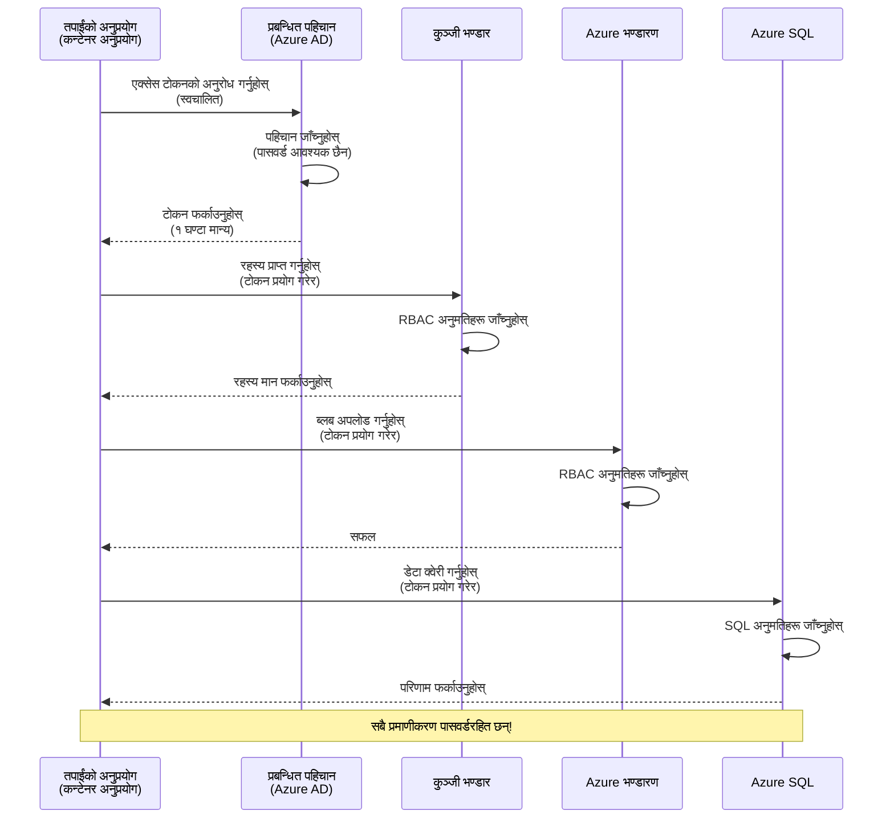
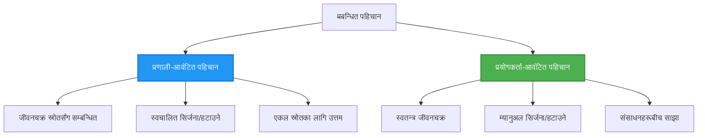

# प्रमाणिकरण ढाँचा र व्यवस्थापित पहिचान

⏱️ **अनुमानित समय**: 45-60 मिनेट | 💰 **लागत प्रभाव**: निःशुल्क (थप शुल्क छैन) | ⭐ **जटिलता**: मध्यम

**📚 सिकाइ मार्ग:**
- ← अघिल्लो: [Configuration Management](configuration.md) - वातावरण भेरिएबल र गोप्य जानकारी व्यवस्थापन
- 🎯 **तपाईं यहाँ हुनुहुन्छ**: प्रमाणिकरण र सुरक्षा (व्यवस्थापित पहिचान, Key Vault, सुरक्षित ढाँचा)
- → अर्को: [First Project](first-project.md) - आफ्नो पहिलो AZD अनुप्रयोग निर्माण गर्नुहोस्
- 🏠 [Course Home](../../README.md)

---

## तपाईंले के सिक्नु हुनेछ

यस पाठ पुरा गरेपछि, तपाईंले:
- Azure प्रमाणिकरण ढाँचाहरू (कुञ्जीहरू, कनेक्शन स्ट्रिङहरू, व्यवस्थापित पहिचान) बुझ्नुहुनेछ
- पासवर्ड-रहित प्रमाणिकरणका लागि **व्यवस्थापित पहिचान** लागू गर्नुहोस्
- **Azure Key Vault** एकीकरणद्वारा गोप्य जानकारी सुरक्षित गर्नुहोस्
- AZD परिनियोजनहरूका लागि **भूमिकामा आधारित पहुँच नियन्त्रण (RBAC)** कन्फिगर गर्नुहोस्
- Container Apps र Azure सेवाहरूमा सुरक्षा उत्तम अभ्यासहरू लागू गर्नुहोस्
- कुञ्जी-आधारितदेखि पहिचान-आधारित प्रमाणिकरणमा माइग्रेट गर्नुहोस्

## किन व्यवस्थापित पहिचान महत्त्वपूर्ण छ

### समस्या: परम्परागत प्रमाणिकरण

**व्यवस्थापित पहिचान भन्दा पहिले:**
```javascript
// ❌ सुरक्षा जोखिम: कोडमा हार्डकोड गरिएका गोप्य जानकारीहरू
const connectionString = "Server=mydb.database.windows.net;User=admin;Password=P@ssw0rd123";
const storageKey = "xK7mN9pQ2wR5tY8uI0oP3aS6dF1gH4jK...";
const cosmosKey = "C2x7B9n4M1p8Q5w3E6r0T2y5U8i1O4p7...";
```

**समस्याहरू:**
- 🔴 **कोड, कन्फिग फाइलहरू, वातावरण भेरिएबलहरूमा खुल्ला गोप्य जानकारी**
- 🔴 **क्रेडेन्सियल घुमाउने** गर्दा कोड परिवर्तन र पुनःपरिनियोजन आवश्यक
- 🔴 **अडिट समस्या** - कसले के, कहिले पहुँच गर्‍यो?
- 🔴 **फैलावट** - गोप्य जानकारी विभिन्न प्रणालीहरूमा बिखेरिएको
- 🔴 **अनुपालन जोखिम** - सुरक्षा अडिटमा असफल हुन सक्छ

### समाधान: व्यवस्थापित पहिचान

**व्यवस्थापित पहिचानपछि:**
```javascript
// ✅ सुरक्षित: कोडमा कुनै गोप्य जानकारी छैन
const credential = new DefaultAzureCredential();
const client = new BlobServiceClient(
  "https://mystorageaccount.blob.core.windows.net",
  credential  // Azure ले स्वचालित रूपमा प्रमाणीकरण सम्हाल्छ
);
```

**फाइदाहरू:**
- ✅ **कोड वा कन्फिगमा शून्य गोप्य जानकारी**
- ✅ **स्वचालित घुमाउने** - Azure ले व्यवस्थापन गर्छ
- ✅ **पूर्ण अडिट ट्रेल** Azure AD लगहरूमा
- ✅ **केन्द्रीयकृत सुरक्षा** - Azure पोर्टलबाट व्यवस्थापन गर्नुहोस्
- ✅ **अनुपालन तयार** - सुरक्षा मापदण्ड पूरा गर्छ

**उपमा**: परम्परागत प्रमाणिकरण विभिन्न ढोकाका लागि धेरै भौतिक कुञ्जीहरू बोक्ने जस्तै हो। व्यवस्थापित पहिचान भनेको तपाईँको व्यक्तित्वमा आधारित स्वचालित पहुँच दिने सुरक्षा ब्याज जस्तो हो—हराउने, नक्कल गर्ने, वा घुमाउने कुञ्जीहरू छैनन्।

---

## आर्किटेक्चर अवलोकन

### व्यवस्थापित पहिचानसँग प्रमाणिकरण फ्लो


### व्यवस्थापित पहिचानका प्रकारहरू


| विशेषता | प्रणाली-निर्धारित | प्रयोगकर्ता-निर्धारित |
|---------|----------------|---------------|
| **आयुचक्र** | स्रोतसँग जोडिएको | स्वतन्त्र |
| **सिर्जना** | स्रोतसँग स्वतः | म्यानुअल सिर्जना |
| **मेटाई** | स्रोत मेटाउँदा मेटिन्छ | स्रोत मेटाए पनि रहिरहन्छ |
| **साझेदारी** | एक मात्र स्रोत | बहु स्रोतहरूमा साझा गर्न मिल्छ |
| **उपयोग मामला** | सरल परिदृश्यहरू | बहु-संसाधन जटिल परिदृश्यहरू |
| **AZD पूर्वनिर्धारित** | ✅ सिफारिस गरिएको | वैकल्पिक |

---

## पूर्वआवश्यकता

### आवश्यक उपकरणहरू

पछिल्ला पाठहरूबाट यी पहिले नै इन्स्टल गर्नुभएको हुनुपर्छ:

```bash
# Azure Developer CLI सत्यापित गर्नुहोस्
azd version
# ✅ अपेक्षित: azd संस्करण 1.0.0 वा माथि

# Azure CLI सत्यापित गर्नुहोस्
az --version
# ✅ अपेक्षित: azure-cli संस्करण 2.50.0 वा माथि
```

### Azure आवश्यकताहरू

- सक्रिय Azure सदस्यता
- निम्न अनुमतिहरू:
  - व्यवस्थापित पहिचानहरू सिर्जना गर्ने
  - RBAC भूमिका नियुक्त गर्ने
  - Key Vault स्रोतहरू सिर्जना गर्ने
  - Container Apps परिनियोजन गर्ने

### ज्ञान पूर्वआवश्यकता

तपाईंले यी पुरा गरिसक्नुपर्छ:
- [Installation Guide](installation.md) - AZD सेटअप
- [AZD Basics](azd-basics.md) - मूल अवधारणाहरू
- [Configuration Management](configuration.md) - वातावरण भेरिएबलहरू

---

## पाठ 1: प्रमाणिकरण ढाँचाहरू बुझ्नु

### ढाँचा 1: कनेक्शन स्ट्रिङहरू (पुरानो - प्रयोग नगर्नुहोस्)

**यसरी काम गर्छ:**
```bash
# कनेक्शन स्ट्रिङमा प्रमाणीकरण विवरणहरू समावेश छन्
STORAGE_CONNECTION_STRING="DefaultEndpointsProtocol=https;AccountName=myaccount;AccountKey=xK7mN9pQ2wR5..."
COSMOS_CONNECTION_STRING="AccountEndpoint=https://myaccount.documents.azure.com:443/;AccountKey=C2x7..."
SQL_CONNECTION_STRING="Server=myserver.database.windows.net;User=admin;Password=P@ssw0rd..."
```

**समस्याहरू:**
- ❌ वातावरण भेरिएबलहरूमा गोप्य जानकारी देखिन्छ
- ❌ परिनियोजन प्रणालीहरूमा लग हुन सक्छ
- ❌ घुमाउन गाह्रो
- ❌ पहुँचको अडिट ट्रेल छैन

**कहिले प्रयोग गर्ने:** केवल स्थानीय विकासको लागि, उत्पादनमा कहिल्यै होइन।

---

### ढाँचा 2: Key Vault रेफरेन्सहरू (राम्रो)

**यसरी काम गर्छ:**
```bicep
// Store secret in Key Vault
resource keyVault 'Microsoft.KeyVault/vaults@2023-02-01' = {
  name: 'mykv'
  properties: {
    enableRbacAuthorization: true
  }
}

// Reference in Container App
env: [
  {
    name: 'STORAGE_KEY'
    secretRef: 'storage-key'  // References Key Vault
  }
]
```

**फाइदाहरू:**
- ✅ गोप्य जानकारी Key Vault मा सुरक्षित रूपमा सञ्चित हुन्छ
- ✅ केन्द्रीयकृत गोप्य प्रबन्धन
- ✅ कोड परिवर्तन बिना घुमाउन मिल्छ

**सीमाहरू:**
- ⚠️ अझै पनि कुञ्जी/पासवर्ड प्रयोग भइरहेको छ
- ⚠️ Key Vault पहुँच व्यवस्थापन गर्न आवश्यक

**कहिले प्रयोग गर्ने:** कनेक्शन स्ट्रिङबाट व्यवस्थापित पहिचानतर्फको संक्रमण चरणमा।

---

### ढाँचा 3: व्यवस्थापित पहिचान (सर्वोत्तम अभ्यास)

**यसरी काम गर्छ:**
```bicep
// Enable managed identity
resource containerApp 'Microsoft.App/containerApps@2023-05-01' = {
  name: 'myapp'
  identity: {
    type: 'SystemAssigned'  // Automatically creates identity
  }
}

// Grant permissions
resource roleAssignment 'Microsoft.Authorization/roleAssignments@2022-04-01' = {
  scope: storageAccount
  properties: {
    roleDefinitionId: storageBlobDataContributorRole
    principalId: containerApp.identity.principalId
  }
}
```

**एप्लिकेशन कोड:**
```javascript
// कुनै गोप्य जानकारी आवश्यक छैन!
const { DefaultAzureCredential } = require('@azure/identity');
const { BlobServiceClient } = require('@azure/storage-blob');

const credential = new DefaultAzureCredential();
const blobServiceClient = new BlobServiceClient(
  'https://mystorageaccount.blob.core.windows.net',
  credential
);
```

**फाइदाहरू:**
- ✅ कोड/कन्फिगमा शून्य गोप्य जानकारी
- ✅ स्वचालित क्रेडेन्सियल घुमाउने
- ✅ पूर्ण अडिट ट्रेल
- ✅ RBAC-आधारित अनुमति
- ✅ अनुपालन तयारी

**कहिले प्रयोग गर्ने:** सधैं, उत्पादन अनुप्रयोगहरूको लागि।

---

## पाठ २: AZD सँग व्यवस्थापित पहिचान कार्यान्वयन

### चरण-दर-चरण कार्यान्वयन

हामी व्यवस्थापित पहिचान प्रयोग गरी Azure Storage र Key Vault पहुँच गर्ने सुरक्षित Container App बनाउँछौं।

### परियोजना संरचना

```
secure-app/
├── azure.yaml                 # AZD configuration
├── infra/
│   ├── main.bicep            # Main infrastructure
│   ├── core/
│   │   ├── identity.bicep    # Managed identity setup
│   │   ├── keyvault.bicep    # Key Vault configuration
│   │   └── storage.bicep     # Storage with RBAC
│   └── app/
│       └── container-app.bicep
└── src/
    ├── app.js                # Application code
    ├── package.json
    └── Dockerfile
```

### 1. AZD कन्फिगर गर्नुहोस् (azure.yaml)

```yaml
name: secure-app
metadata:
  template: secure-app@1.0.0

services:
  api:
    project: ./src
    language: js
    host: containerapp

# Enable managed identity (AZD handles this automatically)
```

### 2. पूर्वाधार: व्यवस्थापित पहिचान सक्षम पार्नुहोस्

**फाइल: `infra/main.bicep`**

```bicep
targetScope = 'subscription'

param environmentName string
param location string = 'eastus'

var tags = { 'azd-env-name': environmentName }

// Resource group
resource rg 'Microsoft.Resources/resourceGroups@2021-04-01' = {
  name: 'rg-${environmentName}'
  location: location
  tags: tags
}

// Storage Account
module storage './core/storage.bicep' = {
  name: 'storage'
  scope: rg
  params: {
    name: 'st${uniqueString(rg.id)}'
    location: location
    tags: tags
  }
}

// Key Vault
module keyVault './core/keyvault.bicep' = {
  name: 'keyvault'
  scope: rg
  params: {
    name: 'kv-${uniqueString(rg.id)}'
    location: location
    tags: tags
  }
}

// Container App with Managed Identity
module containerApp './app/container-app.bicep' = {
  name: 'container-app'
  scope: rg
  params: {
    name: 'ca-${environmentName}'
    location: location
    tags: tags
    storageAccountName: storage.outputs.name
    keyVaultName: keyVault.outputs.name
  }
}

// Grant Container App access to Storage
module storageRoleAssignment './core/role-assignment.bicep' = {
  name: 'storage-role'
  scope: rg
  params: {
    principalId: containerApp.outputs.identityPrincipalId
    roleDefinitionId: 'ba92f5b4-2d11-453d-a403-e96b0029c9fe'  // Storage Blob Data Contributor
    targetResourceId: storage.outputs.id
  }
}

// Grant Container App access to Key Vault
module kvRoleAssignment './core/role-assignment.bicep' = {
  name: 'kv-role'
  scope: rg
  params: {
    principalId: containerApp.outputs.identityPrincipalId
    roleDefinitionId: '4633458b-17de-408a-b874-0445c86b69e6'  // Key Vault Secrets User
    targetResourceId: keyVault.outputs.id
  }
}

// Outputs
output AZURE_STORAGE_ACCOUNT_NAME string = storage.outputs.name
output AZURE_KEY_VAULT_NAME string = keyVault.outputs.name
output APP_URL string = containerApp.outputs.url
```

### 3. System-Assigned पहिचान सहित Container App

**फाइल: `infra/app/container-app.bicep`**

```bicep
param name string
param location string
param tags object = {}
param storageAccountName string
param keyVaultName string

resource containerApp 'Microsoft.App/containerApps@2023-05-01' = {
  name: name
  location: location
  tags: tags
  identity: {
    type: 'SystemAssigned'  // 🔑 Enable managed identity
  }
  properties: {
    configuration: {
      ingress: {
        external: true
        targetPort: 3000
      }
    }
    template: {
      containers: [
        {
          name: 'api'
          image: 'myregistry.azurecr.io/api:latest'
          resources: {
            cpu: json('0.5')
            memory: '1Gi'
          }
          env: [
            {
              name: 'AZURE_STORAGE_ACCOUNT_NAME'
              value: storageAccountName
            }
            {
              name: 'AZURE_KEY_VAULT_NAME'
              value: keyVaultName
            }
            // 🔑 No secrets - managed identity handles authentication!
          ]
        }
      ]
    }
  }
}

// Output the identity for RBAC assignments
output identityPrincipalId string = containerApp.identity.principalId
output id string = containerApp.id
output url string = 'https://${containerApp.properties.configuration.ingress.fqdn}'
```

### 4. RBAC भूमिका नियुक्ति मोड्युल

**फाइल: `infra/core/role-assignment.bicep`**

```bicep
param principalId string
param roleDefinitionId string  // Azure built-in role ID
param targetResourceId string

resource roleAssignment 'Microsoft.Authorization/roleAssignments@2022-04-01' = {
  name: guid(principalId, roleDefinitionId, targetResourceId)
  scope: resourceId('Microsoft.Resources/resourceGroups', resourceGroup().name)
  properties: {
    roleDefinitionId: subscriptionResourceId('Microsoft.Authorization/roleDefinitions', roleDefinitionId)
    principalId: principalId
    principalType: 'ServicePrincipal'
  }
}

output id string = roleAssignment.id
```

### 5. व्यवस्थापित पहिचान सहित एप्लिकेशन कोड

**फाइल: `src/app.js`**

```javascript
const express = require('express');
const { DefaultAzureCredential } = require('@azure/identity');
const { BlobServiceClient } = require('@azure/storage-blob');
const { SecretClient } = require('@azure/keyvault-secrets');

const app = express();
const PORT = process.env.PORT || 3000;

// 🔑 क्रेडेन्सियल आरम्भ गर्नुहोस् (म्यानेज्ड आइडेन्टिटीसँग स्वचालित रूपमा काम गर्दछ)
const credential = new DefaultAzureCredential();

// Azure स्टोरेज सेटअप
const storageAccountName = process.env.AZURE_STORAGE_ACCOUNT_NAME;
const blobServiceClient = new BlobServiceClient(
  `https://${storageAccountName}.blob.core.windows.net`,
  credential  // कुनै कुञ्जी आवश्यक छैन!
);

// Key Vault सेटअप
const keyVaultName = process.env.AZURE_KEY_VAULT_NAME;
const secretClient = new SecretClient(
  `https://${keyVaultName}.vault.azure.net`,
  credential  // कुनै कुञ्जी आवश्यक छैन!
);

// स्वास्थ्य जाँच
app.get('/health', (req, res) => {
  res.json({ status: 'healthy', authentication: 'managed-identity' });
});

// फाइललाई ब्लब स्टोरेजमा अपलोड गर्नुहोस्
app.post('/upload', async (req, res) => {
  try {
    const containerClient = blobServiceClient.getContainerClient('uploads');
    await containerClient.createIfNotExists();
    
    const blobName = `file-${Date.now()}.txt`;
    const blockBlobClient = containerClient.getBlockBlobClient(blobName);
    
    await blockBlobClient.upload('Hello from managed identity!', 30);
    
    res.json({
      success: true,
      blobName: blobName,
      message: 'File uploaded using managed identity!'
    });
  } catch (error) {
    console.error('Upload error:', error);
    res.status(500).json({ error: error.message });
  }
});

// Key Vault बाट गोप्य मान प्राप्त गर्नुहोस्
app.get('/secret/:name', async (req, res) => {
  try {
    const secretName = req.params.name;
    const secret = await secretClient.getSecret(secretName);
    
    res.json({
      name: secretName,
      value: secret.value,
      message: 'Secret retrieved using managed identity!'
    });
  } catch (error) {
    console.error('Secret error:', error);
    res.status(500).json({ error: error.message });
  }
});

// ब्लब कन्टेनरहरूको सूची (पढ्ने पहुँच प्रदर्शन गर्दछ)
app.get('/containers', async (req, res) => {
  try {
    const containers = [];
    for await (const container of blobServiceClient.listContainers()) {
      containers.push(container.name);
    }
    
    res.json({
      containers: containers,
      count: containers.length,
      message: 'Containers listed using managed identity!'
    });
  } catch (error) {
    console.error('List error:', error);
    res.status(500).json({ error: error.message });
  }
});

app.listen(PORT, () => {
  console.log(`Secure API listening on port ${PORT}`);
  console.log('Authentication: Managed Identity (passwordless)');
});
```

**फाइल: `src/package.json`**

```json
{
  "name": "secure-app",
  "version": "1.0.0",
  "dependencies": {
    "express": "^4.18.2",
    "@azure/identity": "^4.0.0",
    "@azure/storage-blob": "^12.17.0",
    "@azure/keyvault-secrets": "^4.7.0"
  },
  "scripts": {
    "start": "node app.js"
  }
}
```

### 6. परिनियोजन र परीक्षण

```bash
# AZD वातावरण आरम्भ गर्नुहोस्
azd init

# पूर्वाधार र अनुप्रयोग तैनाथ गर्नुहोस्
azd up

# अनुप्रयोगको URL प्राप्त गर्नुहोस्
APP_URL=$(azd env get-values | grep APP_URL | cut -d '=' -f2 | tr -d '"')

# हेल्थ चेक परीक्षण गर्नुहोस्
curl $APP_URL/health
```

**✅ अपेक्षित आउटपुट:**
```json
{
  "status": "healthy",
  "authentication": "managed-identity"
}
```

**ब्लब अपलोड परीक्षण:**
```bash
curl -X POST $APP_URL/upload
```

**✅ अपेक्षित आउटपुट:**
```json
{
  "success": true,
  "blobName": "file-1700404800000.txt",
  "message": "File uploaded using managed identity!"
}
```

**कन्टेनर सूचीकरण परीक्षण:**
```bash
curl $APP_URL/containers
```

**✅ अपेक्षित आउटपुट:**
```json
{
  "containers": ["uploads"],
  "count": 1,
  "message": "Containers listed using managed identity!"
}
```

---

## सामान्य Azure RBAC भूमिकाहरू

### व्यवस्थापित पहिचानका लागि बिल्ट-इन भूमिका ID हरू

| सेवा | भूमिका नाम | भूमिका ID | अनुमति |
|---------|-----------|---------|-------------|
| **Storage** | Storage Blob Data Reader | `2a2b9908-6b94-4a3d-8e5a-a7d8f8cc8a12` | ब्लब र कन्टेनरहरू पढ्ने |
| **Storage** | Storage Blob Data Contributor | `ba92f5b4-2d11-453d-a403-e96b0029c9fe` | ब्लबहरू पढ्ने, लेख्ने, मेट्ने |
| **Storage** | Storage Queue Data Contributor | `974c5e8b-45b9-4653-ba55-5f855dd0fb88` | क्यू सन्देशहरू पढ्ने, लेख्ने, मेट्ने |
| **Key Vault** | Key Vault Secrets User | `4633458b-17de-408a-b874-0445c86b69e6` | गोप्य जानकारी पढ्ने |
| **Key Vault** | Key Vault Secrets Officer | `b86a8fe4-44ce-4948-aee5-eccb2c155cd7` | गोप्य जानकारी पढ्ने, लेख्ने, मेट्ने |
| **Cosmos DB** | Cosmos DB Built-in Data Reader | `00000000-0000-0000-0000-000000000001` | Cosmos DB डेटा पढ्ने |
| **Cosmos DB** | Cosmos DB Built-in Data Contributor | `00000000-0000-0000-0000-000000000002` | Cosmos DB डेटा पढ्ने र लेख्ने |
| **SQL Database** | SQL DB Contributor | `9b7fa17d-e63e-47b0-bb0a-15c516ac86ec` | SQL डेटाबेसहरू व्यवस्थापन गर्ने |
| **Service Bus** | Azure Service Bus Data Owner | `090c5cfd-751d-490a-894a-3ce6f1109419` | सन्देशहरू पठाउने, प्राप्त गर्ने, व्यवस्थापन गर्ने |

### भूमिका ID कसरी पत्ता लगाउने

```bash
# सबै पूर्वनिर्मित भूमिकाहरू सूचीबद्ध गर्नुहोस्
az role definition list --query "[].{Name:roleName, ID:name}" --output table

# विशिष्ट भूमिका खोज्नुहोस्
az role definition list --query "[?contains(roleName, 'Storage Blob')].{Name:roleName, ID:name}" --output table

# भूमिकाको विवरण प्राप्त गर्नुहोस्
az role definition list --name "Storage Blob Data Contributor"
```

---

## व्यवहारिक अभ्यासहरू

### अभ्यास 1: विद्यमान एपमा व्यवस्थापित पहिचान सक्षम पार्नु ⭐⭐ (मध्यम)

**लक्ष्य**: विद्यमान Container App परिनियोजनमा व्यवस्थापित पहिचान थप्नुहोस्

**परिदृश्य**: तपाईंसँग कनेक्शन स्ट्रिङहरू प्रयोग गर्ने Container App छ। यसलाई व्यवस्थापित पहिचानमा रूपान्तरण गर्नुहोस्।

**शुरूवात बिन्दु**: निम्न कन्फिगरसहित Container App:

```bicep
// ❌ Current: Using connection string
env: [
  {
    name: 'STORAGE_CONNECTION_STRING'
    secretRef: 'storage-connection'
  }
]
```

**चरणहरू**:

1. **Bicep मा व्यवस्थापित पहिचान सक्षम गर्नुहोस्:**

```bicep
resource containerApp 'Microsoft.App/containerApps@2023-05-01' = {
  name: 'myapp'
  identity: {
    type: 'SystemAssigned'  // Add this
  }
  // ... rest of configuration
}
```

2. **Storage पहुँच दिनुहोस्:**

```bicep
// Get storage account reference
resource storageAccount 'Microsoft.Storage/storageAccounts@2023-01-01' existing = {
  name: storageAccountName
}

// Assign role
resource roleAssignment 'Microsoft.Authorization/roleAssignments@2022-04-01' = {
  name: guid(containerApp.id, 'ba92f5b4-2d11-453d-a403-e96b0029c9fe', storageAccount.id)
  scope: storageAccount
  properties: {
    roleDefinitionId: subscriptionResourceId('Microsoft.Authorization/roleDefinitions', 'ba92f5b4-2d11-453d-a403-e96b0029c9fe')
    principalId: containerApp.identity.principalId
    principalType: 'ServicePrincipal'
  }
}
```

3. **एप्लिकेशन कोड अपडेट गर्नुहोस्:**

**पहिले (कनेक्शन स्ट्रिङ):**
```javascript
const { BlobServiceClient } = require('@azure/storage-blob');

const blobServiceClient = BlobServiceClient.fromConnectionString(
  process.env.STORAGE_CONNECTION_STRING
);
```

**पछि (व्यवस्थापित पहिचान):**
```javascript
const { DefaultAzureCredential } = require('@azure/identity');
const { BlobServiceClient } = require('@azure/storage-blob');

const credential = new DefaultAzureCredential();
const blobServiceClient = new BlobServiceClient(
  `https://${process.env.STORAGE_ACCOUNT_NAME}.blob.core.windows.net`,
  credential
);
```

4. **वातावरण भेरिएबलहरू अपडेट गर्नुहोस्:**

```bicep
env: [
  {
    name: 'STORAGE_ACCOUNT_NAME'
    value: storageAccountName  // Just the name, no secrets!
  }
  // Remove STORAGE_CONNECTION_STRING
]
```

5. **परिनियोजन र परीक्षण गर्नुहोस्:**

```bash
# पुनः परिनियोजन गर्नुहोस्
azd up

# यो अझै पनि काम गर्छ कि छैन जाँच गर्नुहोस्
curl https://myapp.azurecontainerapps.io/upload
```

**✅ सफलता मापदण्ड:**
- ✅ एप्लिकेशन त्रुटिबिना परिनियोजित हुन्छ
- ✅ Storage अपरेशन्स काम गर्छन् (अपलोड, सूची, डाउनलोड)
- ✅ वातावरण भेरिएबलहरूमा कुनै कनेक्शन स्ट्रिङहरू छैनन्
- ✅ Azure पोर्टलमा "Identity" ब्लेड अन्तर्गत पहिचान देखिन्छ

**प्रमाणीकरण:**

```bash
# जाँच गर्नुहोस् कि व्यवस्थापित पहिचान सक्षम छ
az containerapp show \
  --name myapp \
  --resource-group rg-myapp \
  --query "identity.type"
# ✅ अपेक्षित: "SystemAssigned"

# भूमिका नियुक्ति जाँच गर्नुहोस्
az role assignment list \
  --assignee $(az containerapp show --name myapp --resource-group rg-myapp --query "identity.principalId" -o tsv) \
  --scope /subscriptions/{sub-id}/resourceGroups/rg-myapp/providers/Microsoft.Storage/storageAccounts/mystorageaccount
# ✅ अपेक्षित: "Storage Blob Data Contributor" भूमिका देखाउँछ
```

**समय**: 20-30 मिनेट

---

### अभ्यास 2: प्रयोगकर्ता-निर्धारित पहिचानसहित बहु-सेवा पहुँच ⭐⭐⭐ (उन्नत)

**लक्ष्य**: धेरै Container Apps हरूमा साझा गरिने प्रयोगकर्ता-निर्धारित पहिचान सिर्जना गर्नुहोस्

**परिदृश्य**: तपाईंसँग 3 माइक्रोसर्भिसहरू छन् जसलाई एउटै Storage खाता र Key Vault मा पहुँच आवश्यक छ।

**चरणहरू**:

1. **प्रयोगकर्ता-निर्धारित पहिचान सिर्जना गर्नुहोस्:**

**फाइल: `infra/core/identity.bicep`**

```bicep
param name string
param location string
param tags object = {}

resource userAssignedIdentity 'Microsoft.ManagedIdentity/userAssignedIdentities@2023-01-31' = {
  name: name
  location: location
  tags: tags
}

output id string = userAssignedIdentity.id
output principalId string = userAssignedIdentity.properties.principalId
output clientId string = userAssignedIdentity.properties.clientId
```

2. **प्रयोगकर्ता-निर्धारित पहिचानलाई भूमिकाहरू तोक्नुहोस्:**

```bicep
// In main.bicep
module userIdentity './core/identity.bicep' = {
  name: 'user-identity'
  scope: rg
  params: {
    name: 'id-${environmentName}'
    location: location
    tags: tags
  }
}

// Grant Storage access
resource storageRoleAssignment 'Microsoft.Authorization/roleAssignments@2022-04-01' = {
  name: guid(userIdentity.outputs.principalId, 'storage-contributor')
  scope: storageAccount
  properties: {
    roleDefinitionId: subscriptionResourceId('Microsoft.Authorization/roleDefinitions', 'ba92f5b4-2d11-453d-a403-e96b0029c9fe')
    principalId: userIdentity.outputs.principalId
    principalType: 'ServicePrincipal'
  }
}

// Grant Key Vault access
resource kvRoleAssignment 'Microsoft.Authorization/roleAssignments@2022-04-01' = {
  name: guid(userIdentity.outputs.principalId, 'kv-secrets-user')
  scope: keyVault
  properties: {
    roleDefinitionId: subscriptionResourceId('Microsoft.Authorization/roleDefinitions', '4633458b-17de-408a-b874-0445c86b69e6')
    principalId: userIdentity.outputs.principalId
    principalType: 'ServicePrincipal'
  }
}
```

3. **धेरै Container Apps लाई पहिचान तोक्नुहोस्:**

```bicep
resource apiGateway 'Microsoft.App/containerApps@2023-05-01' = {
  name: 'api-gateway'
  identity: {
    type: 'UserAssigned'
    userAssignedIdentities: {
      '${userIdentity.outputs.id}': {}
    }
  }
  // ... rest of config
}

resource productService 'Microsoft.App/containerApps@2023-05-01' = {
  name: 'product-service'
  identity: {
    type: 'UserAssigned'
    userAssignedIdentities: {
      '${userIdentity.outputs.id}': {}
    }
  }
  // ... rest of config
}

resource orderService 'Microsoft.App/containerApps@2023-05-01' = {
  name: 'order-service'
  identity: {
    type: 'UserAssigned'
    userAssignedIdentities: {
      '${userIdentity.outputs.id}': {}
    }
  }
  // ... rest of config
}
```

4. **एप्लिकेशन कोड (सबै सेवाहरूले एउटै ढाँचा प्रयोग गर्दछन्):**

```javascript
const { DefaultAzureCredential, ManagedIdentityCredential } = require('@azure/identity');

// प्रयोगकर्ताद्वारा असाइन गरिएको पहिचानको लागि क्लाइन्ट ID निर्दिष्ट गर्नुहोस्
const credential = new ManagedIdentityCredential(
  process.env.AZURE_CLIENT_ID  // प्रयोगकर्ताद्वारा असाइन गरिएको पहिचानको क्लाइन्ट ID
);

// वा DefaultAzureCredential प्रयोग गर्नुहोस् (स्वतः पत्ता लगाउँछ)
const credential = new DefaultAzureCredential();

const blobServiceClient = new BlobServiceClient(
  `https://${process.env.STORAGE_ACCOUNT_NAME}.blob.core.windows.net`,
  credential
);
```

5. **परिनियोजन र प्रमाणित गर्नुहोस्:**

```bash
azd up

# सबै सेवाहरूले भण्डारण पहुँच गर्न सक्छन् कि भनेर परीक्षण गर्नुहोस्
curl https://api-gateway.azurecontainerapps.io/upload
curl https://product-service.azurecontainerapps.io/upload
curl https://order-service.azurecontainerapps.io/upload
```

**✅ सफलता मापदण्ड:**
- ✅ 3 सेवामा साझा गरिएको एक पहिचान
- ✅ सबै सेवाहरूले Storage र Key Vault पहुँच गर्न सक्छन्
- ✅ एक सेवा मेटाए पनि पहिचान टिक्छ
- ✅ केन्द्रीयकृत अनुमति व्यवस्थापन

**प्रयोगकर्ता-निर्धारित पहिचानका फाइदाहरू:**
- व्यवस्थापन गर्न एउटै पहिचान
- सेवाहरूभरि निरन्तर अनुमति
- सेवा मेटाउँदा पनि टिक्छ
- जटिल वास्तुकलाका लागि उत्तम

**समय**: 30-40 मिनेट

---

### अभ्यास 3: Key Vault गोप्य जानकारी घुमाउने लागू गर्नुहोस् ⭐⭐⭐ (उन्नत)

**लक्ष्य**: तेस्रो-पक्ष API कुञ्जीहरू Key Vault मा भण्डारण गरेर व्यवस्थापित पहिचान प्रयोग गरी पहुँच गर्नुहोस्

**परिदृश्य**: तपाईँको एप्लिकेशनले बाह्य API (OpenAI, Stripe, SendGrid) कल गर्न API कुञ्जीहरू आवश्यक पर्छ।

**चरणहरू**:

1. **RBAC सहित Key Vault सिर्जना गर्नुहोस्:**

**फाइल: `infra/core/keyvault.bicep`**

```bicep
param name string
param location string
param tags object = {}

resource keyVault 'Microsoft.KeyVault/vaults@2023-02-01' = {
  name: name
  location: location
  tags: tags
  properties: {
    enableRbacAuthorization: true  // Use RBAC instead of access policies
    sku: {
      family: 'A'
      name: 'standard'
    }
    tenantId: subscription().tenantId
    enableSoftDelete: true
    softDeleteRetentionInDays: 90
  }
}

// Allow Container App to read secrets
output id string = keyVault.id
output name string = keyVault.name
output uri string = keyVault.properties.vaultUri
```

2. **Key Vault मा गोप्य जानकारी भण्डारण गर्नुहोस्:**

```bash
# Key Vault को नाम प्राप्त गर्नुहोस्
KV_NAME=$(azd env get-values | grep AZURE_KEY_VAULT_NAME | cut -d '=' -f2 | tr -d '"')

# तेस्रो-पक्षका API कुञ्जीहरू भण्डारण गर्नुहोस्
az keyvault secret set \
  --vault-name $KV_NAME \
  --name "OpenAI-ApiKey" \
  --value "sk-proj-xxxxxxxxxxxxx"

az keyvault secret set \
  --vault-name $KV_NAME \
  --name "Stripe-ApiKey" \
  --value "sk_live_xxxxxxxxxxxxx"

az keyvault secret set \
  --vault-name $KV_NAME \
  --name "SendGrid-ApiKey" \
  --value "SG.xxxxxxxxxxxxx"
```

3. **गोप्य जानकारी प्राप्त गर्न एप्लिकेशन कोड:**

**फाइल: `src/config.js`**

```javascript
const { DefaultAzureCredential } = require('@azure/identity');
const { SecretClient } = require('@azure/keyvault-secrets');

class Config {
  constructor() {
    this.credential = new DefaultAzureCredential();
    this.secretClient = new SecretClient(
      `https://${process.env.AZURE_KEY_VAULT_NAME}.vault.azure.net`,
      this.credential
    );
    this.cache = {};
  }

  async getSecret(secretName) {
    // पहिले क्यास जाँच गर्नुहोस्
    if (this.cache[secretName]) {
      return this.cache[secretName];
    }

    try {
      const secret = await this.secretClient.getSecret(secretName);
      this.cache[secretName] = secret.value;
      console.log(`✅ Retrieved secret: ${secretName}`);
      return secret.value;
    } catch (error) {
      console.error(`❌ Failed to get secret ${secretName}:`, error.message);
      throw error;
    }
  }

  async getOpenAIKey() {
    return this.getSecret('OpenAI-ApiKey');
  }

  async getStripeKey() {
    return this.getSecret('Stripe-ApiKey');
  }

  async getSendGridKey() {
    return this.getSecret('SendGrid-ApiKey');
  }
}

module.exports = new Config();
```

4. **एप्लिकेशनमा गोप्य जानकारी प्रयोग गर्नुहोस्:**

**फाइल: `src/app.js`**

```javascript
const express = require('express');
const config = require('./config');
const { OpenAI } = require('openai');

const app = express();

// Key Vault बाट प्राप्त कुञ्जी प्रयोग गरी OpenAI आरम्भ गर्नुहोस्
let openaiClient;

async function initializeServices() {
  const openaiKey = await config.getOpenAIKey();
  openaiClient = new OpenAI({ apiKey: openaiKey });
  console.log('✅ Services initialized with secrets from Key Vault');
}

// स्टार्टअपमा कल गर्नुहोस्
initializeServices().catch(console.error);

app.post('/chat', async (req, res) => {
  try {
    const completion = await openaiClient.chat.completions.create({
      model: 'gpt-4',
      messages: [{ role: 'user', content: 'Hello!' }]
    });
    
    res.json({
      response: completion.choices[0].message.content,
      authentication: 'Key from Key Vault via Managed Identity'
    });
  } catch (error) {
    res.status(500).json({ error: error.message });
  }
});

app.listen(3000, () => {
  console.log('Secure API with Key Vault integration running');
});
```

5. **परिनियोजन र परीक्षण गर्नुहोस्:**

```bash
azd up

# API कुञ्जीहरू काम गर्छन् भनेर परीक्षण गर्नुहोस्
curl -X POST https://myapp.azurecontainerapps.io/chat \
  -H "Content-Type: application/json" \
  -d '{"message":"Hello AI"}'
```

**✅ सफलता मापदण्ड:**
- ✅ कोड वा वातावरण भेरिएबलमा कुनै API कुञ्जी छैन
- ✅ एप्लिकेशन Key Vault बाट कुञ्जीहरू प्राप्त गर्छ
- ✅ तेस्रो-पक्ष API हरू ठीकसँग काम गर्छन्
- ✅ कुञ्जीहरू कोड परिवर्तन बिना घुमाउन मिल्छ

**कुनै गोप्य जानकारी घुमाउने:**

```bash
# Key Vault मा रहेको गोप्य जानकारी अद्यावधिक गर्नुहोस्
az keyvault secret set \
  --vault-name $KV_NAME \
  --name "OpenAI-ApiKey" \
  --value "sk-proj-NEW_KEY_HERE"

# नयाँ कुञ्जी लोड गर्न एपलाई पुनः सुरु गर्नुहोस्
az containerapp revision restart \
  --name myapp \
  --resource-group rg-myapp
```

**समय**: 25-35 मिनेट

---

## ज्ञान जाँचबिन्दु

### 1. प्रमाणिकरण ढाँचाहरू ✓

तपाईंको बुझाइ परीक्षण गर्नुहोस्:

- [ ] **Q1**: तीन मुख्य प्रमाणिकरण ढाँचाहरू के के हुन्? 
  - **A**: Connection strings (पुरानो), Key Vault references (स्थानान्तरण), Managed Identity (सर्वोत्तम)

- [ ] **Q2**: किन व्यवस्थापित पहिचान कनेक्शन स्ट्रिङहरू भन्दा राम्रो हो?
  - **A**: कोडमा कुनै गोप्य जानकारी हुँदैन, स्वचालित घुमाउने, पूर्ण अडिट ट्रेल, RBAC अनुमति

- [ ] **Q3**: प्रणाली-निर्धारितको सट्टा कहिले प्रयोगकर्ता-निर्धारित पहिचान प्रयोग गर्नुहुन्छ?
  - **A**: जब विभिन्न स्रोतहरूमा पहिचान साझा गर्नुपर्ने वा पहिचानको आयुचक्र स्रोतको आयुचक्रसँग स्वतन्त्र हुन आवश्यक हुन्छ

**ह्यान्ड्स-अन प्रमाणीकरण:**
```bash
# तपाईंको एपले कुन प्रकारको पहिचान प्रयोग गर्छ भनेर जाँच गर्नुहोस्
az containerapp show \
  --name myapp \
  --resource-group rg-myapp \
  --query "identity.type"

# पहिचानका लागि सबै भूमिका नियुक्तिहरू सूचीबद्ध गर्नुहोस्
az role assignment list \
  --assignee $(az containerapp show --name myapp --resource-group rg-myapp --query "identity.principalId" -o tsv)
```

---

### 2. RBAC र अनुमतिहरू ✓

तपाईंको बुझाइ परीक्षण गर्नुहोस्:

- [ ] **Q1**: "Storage Blob Data Contributor" को भूमिका ID के हो?
  - **A**: `ba92f5b4-2d11-453d-a403-e96b0029c9fe`

- [ ] **Q2**: "Key Vault Secrets User" ले कुन अनुमति प्रदान गर्दछ?
  - **A**: गोप्य जानकारी पढ्ने मात्र पहुँच (सिर्जना, अपडेट, वा मेटाउन सक्दैन)

- [ ] **Q3**: Container App लाई Azure SQL पहुँच कसरी दिनुहुन्छ?
  - **A**: "SQL DB Contributor" भूमिका नियुक्त गर्ने वा SQL का लागि Azure AD प्रमाणीकरण कन्फिगर गर्ने

**ह्यान्ड्स-ऑन प्रमाणीकरण:**
```bash
# विशिष्ट भूमिका खोज्नुहोस्
az role definition list --name "Storage Blob Data Contributor"

# तपाईंको पहिचानलाई कुन-कुन भूमिका तोकिएका छन् जाँच्नुहोस्
PRINCIPAL_ID=$(az containerapp show --name myapp --resource-group rg-myapp --query "identity.principalId" -o tsv)
az role assignment list --assignee $PRINCIPAL_ID --output table
```

---

### 3. Key Vault एकीकरण ✓
- [ ] **Q1**: Key Vault मा access policies को सट्टा RBAC कसरी सक्षम गर्ने?
  - **A**: Bicep मा `enableRbacAuthorization: true` सेट गर्नुहोस्

- [ ] **Q2**: कुन Azure SDK लाइब्रेरीले managed identity authentication ह्यान्डल गर्छ?
  - **A**: `@azure/identity` सँग `DefaultAzureCredential` क्लास

- [ ] **Q3**: Key Vault का secrets कति समयसम्म cache मा रहन्छन्?
  - **A**: एप्लिकेशनमा निर्भर; आफ्नै क्याचिङ रणनीति कार्यान्वयन गर्नुहोस्

**व्यावहारिक जाँच:**
```bash
# Key Vault पहुँच परीक्षण
az keyvault secret show \
  --vault-name $KV_NAME \
  --name "OpenAI-ApiKey" \
  --query "value"

# RBAC सक्षम छ कि छैन जाँच गर्नुहोस्
az keyvault show \
  --name $KV_NAME \
  --query "properties.enableRbacAuthorization"
# ✅ अपेक्षित: साँचो
```

---

## सुरक्षा सर्वोत्तम अभ्यासहरू

### ✅ गर्नुहोस्:

1. **प्रोडक्शनमा सधैं managed identity प्रयोग गर्नुहोस्**
   ```bicep
   identity: {
     type: 'SystemAssigned'
   }
   ```

2. **कम-आवश्यकतासहितका RBAC रोलहरू प्रयोग गर्नुहोस्**
   - सकेसम्म "Reader" रोल प्रयोग गर्नुहोस्
   - आवश्यक नपरेसम्म "Owner" वा "Contributor" बाट बच्नुहोस्

3. **तेस्रो-पक्षका कुञ्जीहरू Key Vault मा राख्नुहोस्**
   ```javascript
   const apiKey = await secretClient.getSecret('ThirdPartyApiKey');
   ```

4. **अडिट लगिङ सक्षम गर्नुहोस्**
   ```bicep
   diagnosticSettings: {
     logs: [{ category: 'AuditEvent', enabled: true }]
   }
   ```

5. **डेभ/स्टेजिङ/प्रोडका लागि फरक पहिचानहरू प्रयोग गर्नुहोस्**
   ```bash
   azd env new dev
   azd env new staging
   azd env new prod
   ```

6. **Secrets नियमित रूपमा परिवर्तन गर्नुहोस्**
   - Key Vault का secrets मा समाप्ति मिति सेट गर्नुहोस्
   - Azure Functions प्रयोग गरी रोटेसन स्वचालित गर्नुहोस्

### ❌ नगर्नुहोस्:

1. **कहिल्यै secrets हार्डकोड नगर्नुहोस्**
   ```javascript
   // ❌ खराब
   const apiKey = "sk-proj-xxxxxxxxxxxxx";
   ```

2. **प्रोडक्शनमा connection strings प्रयोग नगर्नुहोस्**
   ```javascript
   // ❌ खराब
   BlobServiceClient.fromConnectionString(process.env.STORAGE_CONNECTION_STRING)
   ```

3. **अत्यधिक अनुमति नदिनुहोस्**
   ```bicep
   // ❌ BAD - too much access
   roleDefinitionId: 'Owner'
   
   // ✅ GOOD - least privilege
   roleDefinitionId: 'Storage Blob Data Reader'
   ```

4. **गोप्य जानकारीहरू (secrets) लाई लग नगर्नुहोस्**
   ```javascript
   // ❌ खराब
   console.log('API Key:', apiKey);
   
   // ✅ राम्रो
   console.log('API Key retrieved successfully');
   ```

5. **वातावरणहरू बीच प्रोडक्शन पहिचानहरू साझा नगर्नुहोस्**
   ```bicep
   // ❌ BAD - same identity for dev and prod
   // ✅ GOOD - separate identities per environment
   ```

---

## समस्या समाधान मार्गदर्शक

### समस्या: Azure Storage मा पहुँच गर्दा "Unauthorized"

**लक्षणहरू:**
```
Error: Unauthorized (403)
AuthorizationPermissionMismatch: This request is not authorized to perform this operation
```

**निदान:**

```bash
# जाँच गर्नुहोस् कि प्रबन्धित पहिचान सक्षम छ कि छैन
az containerapp show \
  --name myapp \
  --resource-group rg-myapp \
  --query "identity.type"
# ✅ अपेक्षित: "SystemAssigned" वा "UserAssigned"

# भूमिका असाइनमेन्टहरू जाँच गर्नुहोस्
PRINCIPAL_ID=$(az containerapp show --name myapp --resource-group rg-myapp --query "identity.principalId" -o tsv)
az role assignment list --assignee $PRINCIPAL_ID

# अपेक्षित: "Storage Blob Data Contributor" वा समान भूमिका देखिनु पर्छ
```

**समाधानहरू:**

1. **सही RBAC रोल दिनुहोस्:**
```bash
STORAGE_ID=$(az storage account show --name mystorageaccount --resource-group rg-myapp --query "id" -o tsv)
az role assignment create \
  --assignee $PRINCIPAL_ID \
  --role "Storage Blob Data Contributor" \
  --scope $STORAGE_ID
```

2. **प्रसारणको लागि पर्खनुहोस् (5-10 मिनेट लाग्न सक्छ):**
```bash
# भूमिका आवंटन स्थिति जाँच गर्नुहोस्
az role assignment list --assignee $PRINCIPAL_ID --scope $STORAGE_ID
```

3. **एप्लिकेशन कोडले सहि credential प्रयोग गरेको छ भनि जाँच गर्नुहोस्:**
```javascript
// तपाईं DefaultAzureCredential प्रयोग गर्दै हुनुहुन्छ भन्ने सुनिश्चित गर्नुहोस्
const credential = new DefaultAzureCredential();
```

---

### समस्या: Key Vault पहुँच अस्वीकृत

**लक्षणहरू:**
```
Error: Forbidden (403)
The user, group or application does not have secrets get permission
```

**निदान:**

```bash
# जाँच गर्नुहोस् कि Key Vault RBAC सक्षम छ
az keyvault show \
  --name $KV_NAME \
  --query "properties.enableRbacAuthorization"
# ✅ अपेक्षित: true

# भूमिका असाइनमेन्टहरू जाँच गर्नुहोस्
az role assignment list \
  --assignee $PRINCIPAL_ID \
  --scope /subscriptions/{sub-id}/resourceGroups/rg-myapp/providers/Microsoft.KeyVault/vaults/$KV_NAME
```

**समाधानहरू:**

1. **Key Vault मा RBAC सक्षम गर्नुहोस्:**
```bash
az keyvault update \
  --name $KV_NAME \
  --enable-rbac-authorization true
```

2. **Key Vault Secrets User रोल दिनुहोस्:**
```bash
KV_ID=$(az keyvault show --name $KV_NAME --query "id" -o tsv)
az role assignment create \
  --assignee $PRINCIPAL_ID \
  --role "Key Vault Secrets User" \
  --scope $KV_ID
```

---

### समस्या: DefaultAzureCredential स्थानीय रूपमा असफल हुन्छ

**लक्षणहरू:**
```
Error: DefaultAzureCredential failed to retrieve a token
CredentialUnavailableError: No credential available
```

**निदान:**

```bash
# तपाईं लगइन हुनुहुन्छ कि छैन जाँच गर्नुहोस्
az account show

# Azure CLI प्रमाणीकरण जाँच गर्नुहोस्
az ad signed-in-user show
```

**समाधानहरू:**

1. **Azure CLI मा लगइन गर्नुहोस्:**
```bash
az login
```

2. **Azure subscription सेट गर्नुहोस्:**
```bash
az account set --subscription "Your Subscription Name"
```

3. **स्थानीय विकासको लागि environment variables प्रयोग गर्नुहोस्:**
```bash
export AZURE_TENANT_ID="your-tenant-id"
export AZURE_CLIENT_ID="your-client-id"
export AZURE_CLIENT_SECRET="your-client-secret"
```

4. **वा स्थानीय रूपमा फरक credential प्रयोग गर्नुहोस्:**
```javascript
const { DefaultAzureCredential, AzureCliCredential } = require('@azure/identity');

// स्थानीय विकासका लागि AzureCliCredential प्रयोग गर्नुहोस्
const credential = process.env.NODE_ENV === 'production' 
  ? new DefaultAzureCredential()
  : new AzureCliCredential();
```

---

### समस्या: रोल असाइनमेन्ट प्रसारण हुन धेरै समय लाग्छ

**लक्षणहरू:**
- रोल सफलतापूर्वक असाइन गरिएको छ
- अहिले पनि 403 त्रुटि आइरहेका छन्
- अवस्थित पहुँच (कहिले काम गर्छ, कहिले गर्दैन)

**व्याख्या:**
Azure RBAC परिवर्तनहरूलाई विश्वव्यापी रूपमा प्रसारित हुन 5-10 मिनेट लाग्न सक्छ।

**समाधान:**

```bash
# पर्खनुहोस् र फेरि प्रयास गर्नुहोस्
echo "Waiting for RBAC propagation..."
sleep 300  # 5 मिनेट पर्खनुहोस्

# पहुँच परीक्षण गर्नुहोस्
curl https://myapp.azurecontainerapps.io/upload

# यदि अझै पनि विफल छ भने, एप पुनः सुरु गर्नुहोस्
az containerapp revision restart \
  --name myapp \
  --resource-group rg-myapp
```

---

## लागत सम्बन्धी विचारहरू

### Managed Identity लागतहरू

| स्रोत | लागत |
|----------|------|
| **Managed Identity** | 🆓 **निःशुल्क** - कुनै शुल्क छैन |
| **RBAC Role Assignments** | 🆓 **निःशुल्क** - कुनै शुल्क छैन |
| **Azure AD Token Requests** | 🆓 **निःशुल्क** - समावेश |
| **Key Vault Operations** | $0.03 प्रति 10,000 अपरेसन |
| **Key Vault Storage** | $0.024 प्रति secret प्रति महिना |

**Managed identity ले पैसा बचाउछ:**
- ✅ सेवा-देखि-सेवा प्रमाणीकरणका लागि Key Vault अपरेसनहरू हटाएर
- ✅ सुरक्षा घटनाहरू घटाएर (कुनै लीक भएका प्रमाण-पत्रहरू हुँदैनन्)
- ✅ सञ्चालनात्मक बोझ घटाएर (म्यानुअल रोटेशन हुँदैन)

**उदाहरण लागत तुलना (मासिक):**

| परिदृश्य | Connection Strings | Managed Identity | बचत |
|----------|-------------------|-----------------|---------|
| सानो एप (1M अनुरोध) | ~$50 (Key Vault + अपरेसनहरू) | ~$0 | $50/महिना |
| मध्यम एप (10M अनुरोध) | ~$200 | ~$0 | $200/महिना |
| ठूलो एप (100M अनुरोध) | ~$1,500 | ~$0 | $1,500/महिना |

---

## थप जान्नुहोस्

### आधिकारिक कागजातहरू
- [Azure Managed Identity](https://learn.microsoft.com/entra/identity/managed-identities-azure-resources/overview)
- [Azure RBAC](https://learn.microsoft.com/azure/role-based-access-control/overview)
- [Azure Key Vault](https://learn.microsoft.com/azure/key-vault/general/overview)
- [DefaultAzureCredential](https://learn.microsoft.com/dotnet/api/azure.identity.defaultazurecredential)

### SDK कागजातहरू
- [@azure/identity (Node.js)](https://www.npmjs.com/package/@azure/identity)
- [Azure.Identity (C#)](https://www.nuget.org/packages/Azure.Identity/)
- [azure-identity (Python)](https://pypi.org/project/azure-identity/)

### यस कोर्सका अर्को चरणहरू
- ← अघिल्लो: [Configuration Management](configuration.md)
- → अर्को: [First Project](first-project.md)
- 🏠 [कोर्स होम](../../README.md)

### सम्बन्धित उदाहरणहरू
- [Azure OpenAI Chat Example](../../../../examples/azure-openai-chat) - Azure OpenAI का लागि managed identity प्रयोग गर्दछ
- [Microservices Example](../../../../examples/microservices) - बहु-सेवा प्रमाणीकरण ढाँचाहरू

---

## सारांश

**तपाईंले सिक्नुभयो:**
- ✅ तीन प्रमाणीकरण ढाँचाहरू (connection strings, Key Vault, managed identity)
- ✅ AZD मा managed identity कसरी सक्षम र कन्फिगर गर्ने
- ✅ Azure सेवाहरूका लागि RBAC रोल असाइनमेन्टहरू
- ✅ तेस्रो-पक्षको secrets का लागि Key Vault एकीकरण
- ✅ User-assigned र system-assigned identities
- ✅ सुरक्षा सर्वोत्तम अभ्यासहरू र समस्या समाधान

**मुख्य निष्कर्षहरू:**
1. **प्रोडक्शनमा सधैं managed identity प्रयोग गर्नुहोस्** - कुनै गोप्य जानकारी हुँदैन, स्वचालित रोटेसन
2. **कम-आवश्यकतासहितका RBAC रोलहरू प्रयोग गर्नुहोस्** - केवल आवश्यक अनुमति दिनुहोस्
3. **तेस्रो-पक्षका कुञ्जीहरू Key Vault मा राख्नुहोस्** - केन्द्रित गोप्य व्यवस्थापन
4. **प्रति वातावरण अलग पहिचानहरू राख्नुहोस्** - विकास, स्टेजिङ, प्रोड पृथकीकरण
5. **अडिट लगिङ सक्षम गर्नुहोस्** - कोले के पहुँच गर्यो ट्र्याक गर्नुहोस्

**अर्को कदमहरू:**
1. उपरोक्त व्यावहारिक अभ्यासहरू पूरा गर्नुहोस्
2. एक अवस्थित एपलाई connection strings बाट managed identity मा माइग्रेट गर्नुहोस्
3. पहिलो AZD परियोजना सुरुदेखि नै सुरक्षा सहित निर्माण गर्नुहोस्: [First Project](first-project.md)

---

<!-- CO-OP TRANSLATOR DISCLAIMER START -->
अस्वीकरण:
यो दस्तावेज AI अनुवाद सेवा Co-op Translator (https://github.com/Azure/co-op-translator) प्रयोग गरेर अनुवाद गरिएको हो। हामी सटीकताको लागि प्रयास गर्छौं, तर कृपया ध्यान दिनुहोस् कि स्वचालित अनुवादमा त्रुटि वा अशुद्धि हुन सक्छ। मूल दस्तावेजलाई त्यसको मूल भाषामा नै आधिकारिक स्रोत मान्नुपर्छ। महत्वपूर्ण जानकारीका लागि व्यावसायिक मानव अनुवाद सिफारिश गरिन्छ। यस अनुवादको प्रयोगबाट उत्पन्न कुनै पनि गलतफहमी वा गलत व्याख्याका लागि हामी जिम्मेवार छैनौँ।
<!-- CO-OP TRANSLATOR DISCLAIMER END -->