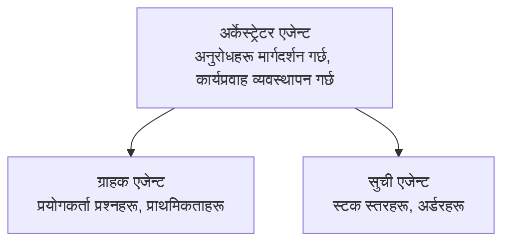

# अध्याय ५: बहु-एजेन्ट AI समाधानहरू

**📚 कोर्स**: [AZD For Beginners](../../README.md) | **⏱️ अवधि**: २-३ घण्टा | **⭐ जटिलता**: उन्नत

---

## अवलोकन

यस अध्यायले उन्नत बहु-एजेन्ट वास्तुकला ढाँचा, एजेन्ट समन्वय, र जटिल अवस्थाहरूका लागि उत्पादन-तय AI तैनाथीहरू समेट्छ।

> मार्च २०२६ मा `azd 1.23.12` विरूद्ध मान्य।

## सिकाइ उद्देश्यहरू

यस अध्याय पूरा गरेर, तपाईँले:
- बहु-एजेन्ट वास्तुकला ढाँचाहरू बुझ्नुहुनेछ
- समन्वित AI एजेन्ट प्रणालीहरू तैनाथ गर्नुहुनेछ
- एजेन्ट-टु-एजेन्ट सञ्चार कार्यान्वयन गर्नुहुनेछ
- उत्पादनको लागि तयार बहु-एजेन्ट समाधानहरू निर्माण गर्नुहुनेछ

---

## 📚 पाठहरू

| # | पाठ | वर्णन | समय |
|---|--------|-------------|------|
| १ | [रिटेल बहु-एजेन्ट समाधान](../../examples/retail-scenario.md) | पूर्ण कार्यान्वयन हिँडडुल | ९० मिनेट |
| २ | [समन्वय ढाँचा](../chapter-06-pre-deployment/coordination-patterns.md) | एजेन्ट समन्वय रणनीतिहरू | ३० मिनेट |
| ३ | [ARM टेम्पलेट तैनाथी](../../examples/retail-multiagent-arm-template/README.md) | एक-क्लिक तैनाथी | ३० मिनेट |

---

## 🚀 छिटो सुरुवात

```bash
# विकल्प १: टेम्पलेटबाट डिप्लोय गर्नुहोस्
azd init --template agent-openai-python-prompty
azd up

# विकल्प २: एजेन्ट म्यानिफेस्टबाट डिप्लोय गर्नुहोस् (azure.ai.agents एक्सटेन्सन आवश्यक छ)
azd extension install azure.ai.agents
azd ai agent init -m agent-manifest.yaml
azd up
```

> **कुन विधि?** `azd init --template` प्रयोग गरी काम गर्ने नमूना बाट सुरुवात गर्नुहोस्। `azd ai agent init` प्रयोग गर्नुहोस् जब तपाईँसँग आफ्नै एजेन्ट म्यानिफेस्ट छ। विस्तृत विवरणको लागि [AZD AI CLI सन्दर्भ](../chapter-08-production/production-ai-practices.md#azd-ai-cli-commands-and-extensions) हेर्नुहोस्।

---

## 🤖 बहु-एजेन्ट वास्तुकला


---

## 🎯 मुख्य समाधान: रिटेल बहु-एजेन्ट

[रिटेल बहु-एजेन्ट समाधान](../../examples/retail-scenario.md)ले निम्न देखाउँछ:

- **ग्राहक एजेन्ट**: प्रयोगकर्ता अन्तरक्रिया र प्राथमिकताहरूको हेरचाह
- **इन्वेन्टरी एजेन्ट**: स्टक र अर्डर प्रक्रियाको व्यवस्थापन
- **अर्केस्ट्रेटर**: एजेन्टहरूबीच समन्वय
- **साझा मेमोरी**: क्रस-एजेन्ट सन्दर्भ व्यवस्थापन

### प्रयोग भएका सेवाहरू

| सेवा | उद्देश्य |
|---------|---------|
| Microsoft Foundry Models | भाषा बुझाइ |
| Azure AI Search | उत्पादन सूची |
| Cosmos DB | एजेन्ट अवस्था र मेमोरी |
| Container Apps | एजेन्ट होस्टिङ |
| Application Insights | अनुगमन |

---

## 🔗 नेभिगेशन

| दिशा | अध्याय |
|-----------|---------|
| **अघिल्लो** | [अध्याय ४: पूर्वाधार](../chapter-04-infrastructure/README.md) |
| **अर्को** | [अध्याय ६: पूर्व-तैनाथी](../chapter-06-pre-deployment/README.md) |

---

## 📖 सम्बन्धित स्रोतहरू

- [AI एजेन्ट मार्गदर्शन](../chapter-02-ai-development/agents.md)
- [उत्पादन AI अभ्यासहरू](../chapter-08-production/production-ai-practices.md)
- [AI समस्या समाधान](../chapter-07-troubleshooting/ai-troubleshooting.md)

---

<!-- CO-OP TRANSLATOR DISCLAIMER START -->
**अस्वीकरण**:  
यस दस्तावेजलाई एआई अनुवाद सेवा [Co-op Translator](https://github.com/Azure/co-op-translator) प्रयोग गरी अनुवाद गरिएको हो। जबकि हामी शुद्धताका लागि प्रयासरत छौं, कृपया जानकार हुनुहोस् कि स्वचालित अनुवादमा त्रुटिहरू वा अशुद्धता हुनसक्छन्। मूल दस्तावेज यसको मूल भाषामा अधिकारिक स्रोत मानिनु पर्छ। महत्वपूर्ण जानकारीका लागि, व्यावसायिक मानव अनुवाद सिफारिस गरिन्छ। यस अनुवादको प्रयोगबाट उत्पन्न कुनै पनि गलतफहमी वा गलत व्याख्याको लागि हामी जिम्मेवार हुनुहुँदैन।
<!-- CO-OP TRANSLATOR DISCLAIMER END -->