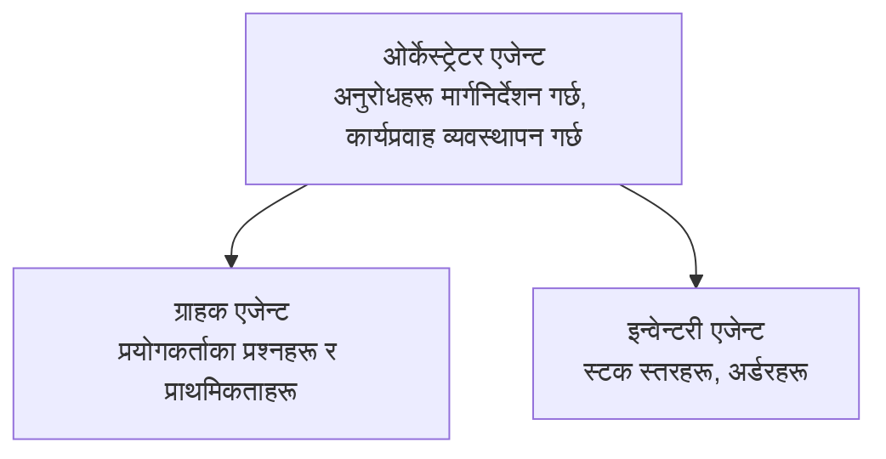

# अध्याय ५: बहु-एजेन्ट AI समाधान

**📚 पाठ्यक्रम**: [AZD For Beginners](../../README.md) | **⏱️ अवधि**: 2-3 घण्टा | **⭐ जटिलता**: उन्नत

---

## अवलोकन

यस अध्यायले उन्नत बहु-एजेन्ट वास्तुकला ढाँचाहरू, एजेन्ट समन्वयन र जटिल परिदृश्यहरूको लागि उत्पादन-तयार AI परिनियोजनहरू समेट्छ।

## सिकाइ उद्देश्यहरू

यस अध्याय पूरा गरेपछि, तपाईं:
- बहु-एजेन्ट वास्तुकला ढाँचाहरू बुझ्ने
- समन्वित AI एजेन्ट प्रणालीहरू तैनाथ गर्ने
- एजेन्ट-देखि-एजेन्ट सञ्चार लागू गर्ने
- उत्पादन-तयार बहु-एजेन्ट समाधानहरू निर्माण गर्ने

---

## 📚 पाठहरू

| # | Lesson | Description | Time |
|---|--------|-------------|------|
| 1 | [खुद्रा बहु-एजेन्ट समाधान](../../examples/retail-scenario.md) | पूर्ण कार्यान्वयन चरण-दर-चरण मार्गदर्शन | 90 मिनेट |
| 2 | [समन्वय ढाँचाहरू](../chapter-06-pre-deployment/coordination-patterns.md) | एजेन्ट समन्वय रणनीतिहरू | 30 मिनेट |
| 3 | [ARM टेम्प्लेट तैनाथीकरण](../../examples/retail-multiagent-arm-template/README.md) | एक-क्लिक तैनाथीकरण | 30 मिनेट |

---

## 🚀 द्रुत सुरु

```bash
# विकल्प 1: टेम्प्लेटबाट परिनियोजन
azd init --template agent-openai-python-prompty
azd up

# विकल्प 2: एजेण्ट म्यानिफेस्टबाट परिनियोजन (azure.ai.agents एक्सटेन्सन आवश्यक छ)
azd extension install azure.ai.agents
azd ai agent init -m agent-manifest.yaml
azd up
```

> **कुन दृष्टिकोण?** Use `azd init --template` to start from a working sample. Use `azd ai agent init` when you have your own agent manifest. See the [AZD AI CLI सन्दर्भ](../chapter-08-production/production-ai-practices.md#azd-ai-cli-commands-and-extensions) for full details.

---

## 🤖 बहु-एजेन्ट वास्तुकला


---

## 🎯 विशेष समाधान: खुद्रा बहु-एजेन्ट

The [खुद्रा बहु-एजेन्ट समाधान](../../examples/retail-scenario.md) ले देखाउँछ:

- **ग्राहक एजेन्ट**: प्रयोगकर्ता अन्तरक्रिया र प्राथमिकताहरू सम्हाल्छ
- **इनभेन्टरी एजेन्ट**: स्टक र अर्डर प्रसोधन व्यवस्थापन गर्छ
- **ओर्केस्ट्रेटर**: एजेन्टहरूबीच समन्वय गर्छ
- **साझा मेमोरी**: एजेन्टहरूबीच सन्दर्भ व्यवस्थापन

### प्रयोग गरिएका सेवाहरू

| Service | Purpose |
|---------|---------|
| Microsoft Foundry Models | भाषा बुझाइ |
| Azure AI Search | उत्पादन क्याटलोग |
| Cosmos DB | एजेन्ट अवस्था र मेमोरी |
| Container Apps | एजेन्ट होस्टिङ |
| Application Insights | निगरानी |

---

## 🔗 नेभिगेसन

| Direction | Chapter |
|-----------|---------|
| **अघिल्लो** | [अध्याय 4: Infrastructure](../chapter-04-infrastructure/README.md) |
| **अर्को** | [अध्याय 6: Pre-Deployment](../chapter-06-pre-deployment/README.md) |

---

## 📖 सम्बन्धित स्रोतहरू

- [AI एजेन्ट मार्गदर्शन](../chapter-02-ai-development/agents.md)
- [उत्पादन AI अभ्यासहरू](../chapter-08-production/production-ai-practices.md)
- [AI समस्या समाधान](../chapter-07-troubleshooting/ai-troubleshooting.md)

---

<!-- CO-OP TRANSLATOR DISCLAIMER START -->
अस्वीकरण:
यो दस्तावेज AI अनुवाद सेवा [Co-op Translator](https://github.com/Azure/co-op-translator) प्रयोग गरी अनुवाद गरिएको हो। हामी शुद्धताको प्रयास गर्छौं, तर कृपया ध्यान दिनुहोस् कि स्वचालित अनुवादमा त्रुटि वा अशुद्धि हुनसक्छ। मूल दस्तावेजलाई त्यसको मातृभाषामा आधिकारिक स्रोत मान्नुपर्छ। महत्वपूर्ण जानकारीका लागि व्यावसायिक मानव अनुवाद सिफारिश गरिन्छ। यस अनुवादको प्रयोगबाट उत्पन्न कुनै पनि गलतफहमी वा दुराव्याख्याका लागि हामी जिम्मेवार छैनौं।
<!-- CO-OP TRANSLATOR DISCLAIMER END -->