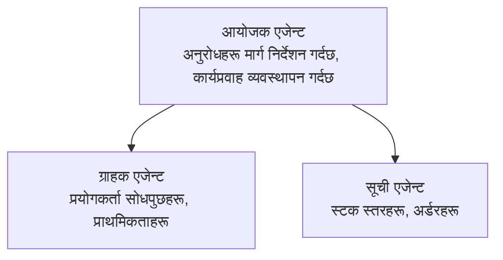

# अध्याय ५: बहु-एजेन्ट AI समाधानहरू

**📚 कोर्स**: [AZD शुरुवातकर्ताहरूका लागि](../../README.md) | **⏱️ अवधि**: २-३ घण्टा | **⭐ जटिलता**: उन्नत

---

## अवलोकन

यो अध्यायले उन्नत बहु-एजेन्ट आर्किटेक्चर ढाँचा, एजेन्ट समन्वय, र जटिल परिस्थितिहरूका लागि उत्पादन-तयार AI डिप्लोयमेन्टहरू समेट्छ।

> `azd 1.27.1` विरुद्ध जुलाई २०२६ मा प्रमाणित।

## सिकाइका उद्देश्यहरू

यो अध्याय पूरा गरेर, तपाईंले:
- बहु-एजेन्ट आर्किटेक्चर ढाँचाहरू बुझ्न सक्नुहुन्छ
- समन्वित AI एजेन्ट प्रणालीहरू डिप्लोय गर्न सक्नुहुन्छ
- एजेन्ट-देखि-एजेन्ट संचार कार्यान्वयन गर्न सक्नुहुन्छ
- उत्पादन-तयार बहु-एजेन्ट समाधानहरू निर्माण गर्न सक्नुहुन्छ

---

## 📚 पाठहरू

| # | पाठ | विवरण | समय |
|---|--------|-------------|------|
| 1 | [बहु-एजेन्ट आधारभूत](multi-agent-basics.md) | व्यावहारिक: `azd up` सँग काम गर्ने बहु-एजेन्ट एप डिप्लोय गर्नुहोस् | ४५ मिनेट |
| 2 | [समन्वय ढाँचाहरू](../chapter-06-pre-deployment/coordination-patterns.md) | एजेन्ट समन्वय रणनीतिहरू (अध्याय ६ मा जारी) | ३० मिनेट |
| 3 | [ARM टेम्प्लेट डिप्लोयमेन्ट](../../examples/retail-multiagent-arm-template/README.md) | एक-क्लिक डिप्लोयमेन्ट उदाहरण | ३० मिनेट |

> **पाठ १ बाट सुरु गर्नुहोस्।** यो अध्यायमा मात्र सम्पूर्ण रूपमा व्यावहारिक र डिप्लोय गर्न योग्य पाठ हो। पाठ २ अध्याय ६ मा छ (पूर्व-डिप्लोयमेन्ट योजनासँग साझा गरिएको छ), र [रिटेल बहु-एजेन्ट समाधान](../../examples/retail-scenario.md) एउटा आर्किटेक्चर ब्लूप्रिन्ट हो—एक डिजाइन सन्दर्भ, एक-कमान्ड टेम्प्लेट होइन।

---

## 🚀 छिटो सुरु

```bash
# विकल्प 1: टेम्प्लेटबाट तैनाथ गर्नुहोस्
azd init --template agent-openai-python-prompty
azd up

# विकल्प 2: एजेन्ट म्यानिफेस्टबाट तैनाथ गर्नुहोस् (azure.ai.agents एक्सटेन्शन आवश्यक छ)
azd extension install azure.ai.agents
azd ai agent init -m agent-manifest.yaml
azd up
```

> **कुन दृष्टिकोण?** काम गर्ने नमुनाबाट सुरु गर्न `azd init --template` प्रयोग गर्नुहोस्। आफ्नो एजेन्ट मैनिफेस्ट हुँदा `azd ai agent init` प्रयोग गर्नुहोस्। पूर्ण विवरणका लागि [AZD AI CLI संदर्भ](../chapter-08-production/production-ai-practices.md#azd-ai-cli-commands-and-extensions) हेर्नुहोस्।

---

## 🤖 बहु-एजेन्ट आर्किटेक्चर



---

## 🎯 विशेष समाधान: रिटेल बहु-एजेन्ट

[रिटेल बहु-एजेन्ट समाधान](../../examples/retail-scenario.md) ले प्रदर्शन गर्छ:

- **ग्राहक एजेन्ट**: प्रयोगकर्ता अन्तरक्रिया र प्राथमिकताहरू सम्हाल्छ
- **स्टक एजेन्ट**: स्टक र अर्डर प्रोसेसिंग व्यवस्थापन गर्दछ
- **संयोजक (ओर्केस्ट्रेटर)**: एजेन्टहरू बीच समन्वय गर्दछ
- **साझा मेमोरी**: क्रॉस-एजेन्ट सन्दर्भ व्यवस्थापन

### प्रयोग गरिएका सेवाहरू

| सेवा | प्रयोजन |
|---------|---------|
| Microsoft Foundry Models | भाषा बुझाइ |
| Azure AI Search | उत्पादन क्याटलग |
| Cosmos DB | एजेन्ट अवस्था र स्मृति |
| Container Apps | एजेन्ट होस्टिङ |
| Application Insights | अनुगमन |

---

## 🔗 नेभिगेसन

| दिशानिर्देश | अध्याय |
|-----------|---------|
| **अघिल्लो** | [अध्याय ४: पूर्वाधार](../chapter-04-infrastructure/README.md) |
| **पछिल्लो** | [अध्याय ६: पूर्व-डिप्लोयमेन्ट](../chapter-06-pre-deployment/README.md) |

---

## 📖 सम्बन्धित स्रोतहरू

- [AI एजेन्ट गाइड](../chapter-02-ai-development/agents.md)
- [उत्पादन AI अभ्यासहरू](../chapter-08-production/production-ai-practices.md)
- [AI समस्या समाधान](../chapter-07-troubleshooting/ai-troubleshooting.md)

---

<!-- CO-OP TRANSLATOR DISCLAIMER START -->
**अस्वीकरण**:
यो दस्तावेज़ AI अनुवाद सेवा [Co-op Translator](https://github.com/Azure/co-op-translator) प्रयोग गरेर अनुवाद गरिएको हो। हामी सही हुन प्रयास गर्छौं, तर कृपया जानकार हुनुस् कि स्वचालित अनुवादमा त्रुटिहरू वा अशुद्धताहरू हुन सक्छन्। मूल दस्तावेज़ यसको मूल भाषामा आधिकारिक स्रोत मानिनुपर्छ। महत्वपूर्ण जानकारीका लागि व्यावसायिक मानव अनुवाद सिफारिस गरिन्छ। यस अनुवादको प्रयोगबाट उत्पन्न कुनै पनि गलत बुझाइ वा त्रुटिको लागि हामी जिम्मेवार छैनौं।
<!-- CO-OP TRANSLATOR DISCLAIMER END -->