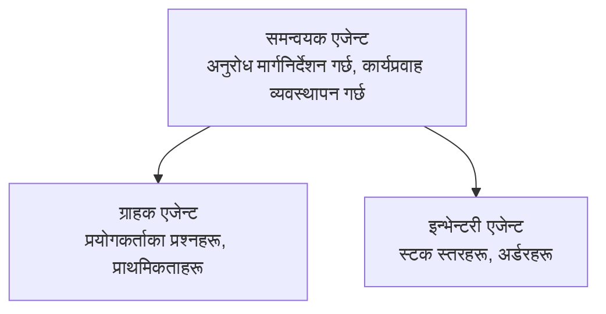

# Chapter 5: बहु-एजेन्ट AI समाधान

**📚 Course**: [AZD सुरु गर्नेहरूका लागि](../../README.md) | **⏱️ Duration**: 2-3 घण्टा | **⭐ Complexity**: उन्नत

---

## अवलोकन

यो अध्यायले उन्नत बहु-एजेन्ट वास्तुकला ढाँचाहरू, एजेन्ट समन्वय, र जटिल परिदृश्यहरूको लागि उत्पादन-योग्य AI परिनियोजनहरू समेट्छ।

> Validated against `azd 1.25.6` in June 2026.

## सिकाइ लक्ष्यहरू

यस अध्याय पूरा गरेर तपाईं:
- बहु-एजेन्ट वास्तुकला ढाँचाहरू बुझ्ने
- समन्वित AI एजेन्ट प्रणालीहरू परिनियोजन गर्ने
- एजेन्ट-देखि-एजेन्ट संवाद लागू गर्ने
- उत्पादन-योग्य बहु-एजेन्ट समाधानहरू निर्माण गर्ने

---

## 📚 पाठहरू

| # | पाठ | विवरण | समय |
|---|--------|-------------|------|
| 1 | [बहु-एजेन्ट आधारभूत](multi-agent-basics.md) | व्यावहारिक: `azd up` प्रयोग गरी काम गर्ने बहु-एजेन्ट एप डिप्लोय गर्नुहोस् | 45 मिनेट |
| 2 | [समन्वय ढाँचाहरू](../chapter-06-pre-deployment/coordination-patterns.md) | एजेन्ट ओरकेस्ट्रेसन रणनीतिहरू (अध्याय 6 मा जारी) | 30 मिनेट |
| 3 | [ARM टेम्प्लेट परिनियोजन](../../examples/retail-multiagent-arm-template/README.md) | एक-क्लिक परिनियोजन उदाहरण | 30 मिनेट |

> **पाठ 1 बाट सुरु गर्नुहोस्।** यो अध्यायमा नै पूर्णतः व्यावहारिक, डिप्लोययोग्य एकमात्र पाठ हो। पाठ 2 अध्याय 6 मा बस्छ (यो प्री-डिप्लोयमेन्ट योजनासँग साझा गरिएको छ), र the [रिटेल बहु-एजेन्ट समाधान](../../examples/retail-scenario.md) एक वास्तुकला ब्लूप्रिन्ट हो — डिजाइन सन्दर्भ, एक-कमान्ड टेम्प्लेट होइन।

---

## 🚀 द्रुत सुरु

```bash
# विकल्प 1: टेम्पलेटबाट परिनियोजन
azd init --template agent-openai-python-prompty
azd up

# विकल्प 2: एजेन्ट म्यानिफेस्टबाट परिनियोजन (azure.ai.agents एक्सटेन्शन आवश्यक छ)
azd extension install azure.ai.agents
azd ai agent init -m agent-manifest.yaml
azd up
```

> **कुन विधि?** कार्यरत नमुनाबाट सुरु गर्न `azd init --template` प्रयोग गर्नुहोस्। आफ्नै एजेन्ट म्यानिफेस्ट भएको बेला `azd ai agent init` प्रयोग गर्नुहोस्। पूर्ण विवरणका लागि [AZD AI CLI सन्दर्भ](../chapter-08-production/production-ai-practices.md#azd-ai-cli-commands-and-extensions) हेर्नुहोस्।

---

## 🤖 बहु-एजेन्ट वास्तुकला



---

## 🎯 फिचर्ड समाधान: रिटेल बहु-एजेन्ट

[रिटेल बहु-एजेन्ट समाधान](../../examples/retail-scenario.md) ले प्रदर्शन गर्दछ:

- **ग्राहक एजेन्ट**: प्रयोगकर्तासँगको अन्तरक्रिया र प्राथमिकताहरू सम्हाल्छ
- **इन्वेन्टरी एजेन्ट**: स्टक र अर्डर प्रोसेसिङ व्यवस्थापन गर्छ
- **ओर्केस्ट्रेटर**: एजेन्टहरू बीच समन्वय गर्छ
- **शेयर गरिएको मेमोरी**: एजेन्टहरूबीच सन्दर्भ व्यवस्थापन

### प्रयोग भएका सेवाहरू

| Service | Purpose |
|---------|---------|
| Microsoft Foundry Models | भाषा बुझाइ |
| Azure AI Search | उत्पादन सूची |
| Cosmos DB | एजेन्ट अवस्था र मेमोरी |
| Container Apps | एजेन्ट होस्टिङ |
| Application Insights | अनुगमन |

---

## 🔗 नेभिगेसन

| Direction | Chapter |
|-----------|---------|
| **अघिल्लो** | [अध्याय 4: पूर्वाधार](../chapter-04-infrastructure/README.md) |
| **अर्को** | [अध्याय 6: पूर्व-परिनियोजन](../chapter-06-pre-deployment/README.md) |

---

## 📖 सम्बन्धित स्रोतहरू

- [AI एजेन्ट मार्गदर्शिका](../chapter-02-ai-development/agents.md)
- [उत्पादन AI अभ्यासहरू](../chapter-08-production/production-ai-practices.md)
- [AI समस्या निवारण](../chapter-07-troubleshooting/ai-troubleshooting.md)

---

<!-- CO-OP TRANSLATOR DISCLAIMER START -->
**अस्वीकरण**:
यो दस्तावेज़ AI अनुवाद सेवा [Co-op Translator](https://github.com/Azure/co-op-translator) प्रयोग गरेर अनुवाद गरिएको हो। हामी सही हुन प्रयास गर्छौं, तर कृपया जानकार हुनुस् कि स्वचालित अनुवादमा त्रुटिहरू वा अशुद्धताहरू हुन सक्छन्। मूल दस्तावेज़ यसको मूल भाषामा आधिकारिक स्रोत मानिनुपर्छ। महत्वपूर्ण जानकारीका लागि व्यावसायिक मानव अनुवाद सिफारिस गरिन्छ। यस अनुवादको प्रयोगबाट उत्पन्न कुनै पनि गलत बुझाइ वा त्रुटिको लागि हामी जिम्मेवार छैनौं।
<!-- CO-OP TRANSLATOR DISCLAIMER END -->