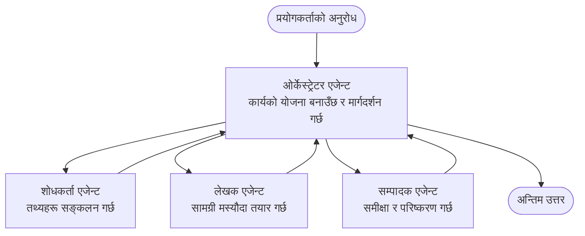

# बहु-एजेन्ट आधारभूत - तपाईंको पहिलो समन्वयित AI प्रणाली डिप्लोय गर्नुहोस्

**अध्याय नेभिगेशन:**
- **📚 पाठ्यक्रम गृह**: [AZD सुरुवातकर्ताहरूका लागि](../../README.md)
- **📖 हालको अध्याय**: अध्याय 5 - बहु-एजेन्ट AI समाधानहरू
- **⬅️ Previous**: [अध्याय 4: पूर्वाधार](../chapter-04-infrastructure/README.md)
- **➡️ Next**: [समन्वय ढाँचाहरू](../chapter-06-pre-deployment/coordination-patterns.md)

> जून 2026 मा `azd 1.25.6` सँग प्रमाणित।

## परिचय

पहिला अध्यायहरूमा तपाईंले एकल अनुप्रयोग डिप्लोय गर्नुभयो—र अध्याय 2 मा तपाईंले एकल AI एजेन्ट डिप्लोय गर्नुभयो। यो पाठले अर्को कदम लिन्छ: एक **बहु-एजेन्ट प्रणाली** डिप्लोय गर्ने, जहाँ धेरै विशेषज्ञ एजेन्टहरूले मिलेर यस्तो समस्या समाधान गर्छन् जुन एकल एजेन्टले राम्रोसँग गर्न सक्दैन।

सुरुवातकर्ताहरूका लागि राम्रो समाचार: **तपाईंलाई नयाँ कमान्डहरूको आवश्यकता छैन।** बहु-एजेन्ट समाधान अझै पनि एक azd परियोजना हो। तपाईं `azd init`, `azd up`, परीक्षण, र `azd down` गर्नुहुनेछ—ठ्याक्कै त्यो वर्कफ्लो जुन तपाईंले पहिलेदेखि जान्नुभएको छ। के परिवर्तन हुन्छ भने एपको भित्रको *आकृति* हो।

## सिक्ने लक्ष्यहरू

यस पाठको अन्त्यमा, तपाईंले:
- "बहु-एजेन्ट" भन्ने के हो र कहिले यसले अतिरिक्त जटिलता विना लाभ दिन्छ बुझ्ने
- बहु-एजेन्ट प्रणालीमा सामान्य भूमिकाहरू चिन्ने (अर्केस्ट्रेटर + विशेषज्ञहरू)
- `azd up` सँग वास्तविक, काम गर्ने बहु-एजेन्ट टेम्प्लेट डिप्लोय गर्ने
- बहु-एजेन्ट एपलाई पछ्याउने Azure स्रोतहरू बुझ्ने
- समाधानलाई सुरक्षित रूपमा जाँच, अनुकूलन, र हटाउन जानेको

## सिकाइ परिणामहरू

यो पाठ पूरा गरेपछि, तपाईं सक्षम हुनुहुनेछ:
- एकल एजेन्ट र बहु-एजेन्ट प्रणालीबीचको फरक व्याख्या गर्न
- एउटा उपकरणसहितको एकल एजेन्ट र साँच्चै बहु-एजेन्ट डिजाइनबाट छनोट गर्न
- azd सँग एक बहु-एजेन्ट टेम्प्लेट अन्तदेखि अन्तसम्म डिप्लोय र परीक्षण गर्न
- प्रत्येक एजेन्ट कहाँ चल्छ र कसरी तिनीहरू संवाद गर्छन् पहिचान गर्न
- दीर्घकालीन शुल्कहरू रोक्न सबै स्रोतहरू सफा गर्न

---

## बहु-एजेन्ट प्रणाली भनेको के हो?

एकल AI एजेन्ट भनेको एउटा मोडेल हो जससँग निर्देशनहरूको सेट र (वैकल्पिक रूपले) केहि उपकरणहरू हुन्छन्। त्यो केन्द्रित कार्यहरूको लागि राम्रो काम गर्छ। तर जस्तो-जस्तो कार्य बढ्छ—पहिले अनुसन्धान, त्यसपछि लेखन, त्यसपछि सम्पादन, त्यसपछि तथ्य-जाँच—सबैलाई एउटै प्रॉम्प्टमा थुम्पिँदा एजेन्ट धिमी, कम भरपर्दो, र डिबग गर्न गाह्रो हुन्छ।

एक **बहु-एजेन्ट प्रणाली** कामलाई विशेषज्ञहरूमा विभाजन गर्छ जो प्रत्येकले एउटा काम ठीकसँग गर्छन्, र एउटै अर्केस्ट्रेटरले समन्वय गर्छ:



### ती दुई भूमिकाहरू जुन तपाईंले सधैं देख्नुहुनेछ

| भूमिका | काम | उदाहरण |
|--------|-----|---------|
| **अरकेस्ट्रेटर** | *अर्को के हुन्छ* निर्णय गर्छ र एजेन्टहरूबीच काम राउट गर्छ | "पहिले अनुसन्धान, त्यसपछि लेखन, त्यसपछि सम्पादन" |
| **विशेषज्ञ** | एउटा केन्द्रित काम गर्छ र परिणाम फर्काउँछ | केवल तथ्यहरू सङ्कलन गर्ने "अनुसन्धानकर्ता" |

### के तपाईँलाई साँच्चै बहु-एजेन्ट चाहिन्छ?

सरलबाट सुरु गर्नुहोस्। तपाईँले बहु-एजेन्ट मात्र तब अपनाउनुहोस् जब यी मध्ये एक सत्य हो:

- ✅ कार्यमा **विभिन्न चरणहरू** छन् जसले फरक निर्देशनबाट लाभ लिन्छ (अनुसन्धान बनाम लेखन बनाम समीक्षा)
- ✅ तपाईं विशेषज्ञहरूलाई **समानान्तर रूपमा** चलाउन चाहनुहुन्छ समय बचतका लागि
- ✅ विभिन्न चरणहरूले **भिन्न उपकरण वा डेटा स्रोतहरू** चाहिन्छ
- ✅ तपाईंलाई प्रत्येक चरणलाई **स्वतन्त्र रूपमा परीक्षणयोग्य र डिबगयोग्य** चाहिन्छ

यदि तपाईंको कार्य एकल प्रश्न-उत्तर वा साधारण उपकरण कल हो भने, एक **एकल एजेन्टसँग उपकरणहरू** (अध्याय 2) सरल, सस्तो, र सञ्चालन गर्न सजिलो छ।

> **सुरुवातकर्ताका लागि सुझाव:** "धेरै एजेन्टहरू" भनेको "राम्रो" होइन। हरेक एजेन्टले विलम्बता, लागत, र निगरानीको नयाँ वस्तु थप्छ। एजेन्टहरू तब मात्र थप्नुहोस् जब समस्या स्पष्ट रूपमा भागहरूमा विभाजन भएको हो।

---

## Azure मा बहु-एजेन्ट बनाउन दुई तरिका

| दृष्टिकोण | के हो | सबैभन्दा उपयुक्त |
|----------|------|-----------------|
| **एकल एजेन्ट + उपकरणहरू** | एउटा Foundry एजेन्ट जुन functions/tools कल गर्छ | सरल वर्कफ्लोहरू, आरम्भ गर्न |
| **केही समन्वयित एजेन्टहरू** | अर्केस्ट्रेटर सहित धेरै एजेन्टहरू | स्पष्ट चरणहरू, समानान्तर काम, विशेषज्ञता |

यो पाठ दोस्रो दृष्टिकोणमा केन्द्रित छ र एक **तय-निर्मित टेम्प्लेट** प्रयोग गर्छ, ताकि तपाईंले आफ्नै बनाउनु अघि वास्तविक बहु-एजेन्ट प्रणाली चलिरहेको देख्न सक्नुहुनेछ।

---

## व्यावहारिक: काम गर्ने बहु-एजेन्ट एप डिप्लोय गर्नुहोस्

हामी **Contoso Creative Writer** डिप्लोय गर्नेछौं, जुन आधिकारिक Azure नमुना हो र यसले धेरै एजेन्टहरू (अनुसन्धानकर्ता, लेखक, सम्पादक) प्रयोग गरेर लेख उत्पादन गर्न समन्वय गर्छ। यो पहिलो बहु-एजेन्ट एपको रूपमा राम्रो छ किनभने भूमिकाहरू बुझ्न सजिलो छन्।

### चरण 1: टेम्प्लेट आरम्भ गर्नुहोस्

```bash
# कार्य गर्ने फोल्डर सिर्जना गर्नुहोस्
mkdir creative-writer && cd creative-writer

# आधिकारिक बहु-एजेन्ट टेम्पलेटबाट प्रारम्भ गर्नुहोस्
azd init --template contoso-creative-writer
```

> कहिँ पनि बढी बहु-एजेन्ट टेम्प्लेट ब्राउज गर्न [Awesome AZD AI gallery](https://azure.github.io/awesome-azd/?tags=ai) हेर्नुहोस्। अन्य सुरुवातमैत्री विकल्पहरूमा `get-started-with-ai-agents` र `azure-ai-travel-agents` समावेश छन्।

### चरण 2: प्रमाणीकृत गर्नुहोस्

```bash
# azd कार्यप्रवाहहरूको लागि आवश्यक
azd auth login
```

### चरण 3: वातावरण सिर्जना गर्नुहोस्

```bash
azd env new dev
```

### चरण 4: पूर्वावलोकन, त्यसपछि डिप्लोय गर्नुहोस्

```bash
# खर्च गर्नु अघि के बनाइनेछ हेर्नुहोस् (सिफारिस गरिएको)
azd provision --preview

# पूर्वाधार व्यवस्था गर्नुहोस् र सबै एजेन्टहरू एकै चरणमा तैनाथ गर्नुहोस्
azd up
```

`azd up` ले सदस्यता र क्षेत्रको लागि सोध्छ, त्यसपछि Azure स्रोतहरू provisioning गर्छ र अनुप्रयोग डिप्लोय गर्छ। AI डिप्लोयमेन्टहरू साधारण वेब एप भन्दा लामो समय लिन सक्छ—यदि तपाईं ठूला मोडेलहरू डिप्लोय गर्दै हुनुहुन्छ भने, तपाईं डिप्लोय टाइमआउट विस्तार गर्न सक्नुहुन्छ:

```bash
azd deploy --timeout 1800
```

> **लागत र क्षमता सम्बन्धि जानकारी:** बहु-एजेन्ट एपहरूले AI मोडेलहरू डिप्लोय गर्छन् जसले कोटा प्रयोग गर्छ र लागत हुन सक्छ। यदि `azd up` मोडेल कोटा कारण असफल हुन्छ भने, क्षेत्र र कोटा सुधारका लागि [AI Troubleshooting](../chapter-07-troubleshooting/ai-troubleshooting.md) हेर्नुहोस्, र अध्याय 6 को [Capacity Planning](../chapter-06-pre-deployment/capacity-planning.md) मा जानकारी पाउनुस्।

---

## तपाईंले के डिप्लोय गर्नुभयो भन्ने बुझ्नुहोस्

यस प्रकारको सामान्य बहु-एजेन्ट एपले Azure स्रोतहरूको सेट provisioning गर्छ जुन माथिको आरेखमा रहेका जिम्मेवारीहरूसँग सिधै मिल्छ:

| स्रोत | किन छ |
|-------|--------|
| **Microsoft Foundry / Models** | प्रत्येक एजेन्टले प्रयोग गर्ने भाषा मोडेलहरू होस्ट गर्छ |
| **Azure AI Search** | अनुसन्धानकर्ता एजेन्टलाई खोज्न योग्य ग्राउन्डेड डेटा दिन्छ |
| **Container Apps** (or App Service) | अर्केस्ट्रेटर र एजेन्ट कोड होस्ट गर्छ |
| **Cosmos DB** (in some samples) | एजेन्टहरूबीच साझा भए हुने अवस्था/मेमोरी राख्छ |
| **Application Insights** | एजेन्टहरू *बीच* अनुरोधहरू ट्रेस गर्छ ताकि तपाईं फ्लो डिबग गर्न सक्नुहुनेछ |

### एजेन्टहरू कसरी एक अर्कासँग कुरा गर्छन्

धेरै azd बहु-एजेन्ट नमूनाहरूमा, **अरकेस्ट्रेटर तपाईंको एप्लिकेशन कोडमा चल्छ** (उदाहरणका लागि Semantic Kernel वा Microsoft Agent Framework जस्ता फ्रेमवर्क प्रयोग गरी)। अर्केस्ट्रेटरले प्रत्येक विशेषज्ञ एजेन्टलाई पालैपालो कल गर्छ, परिणामहरू पास गर्छ, र अन्तिम उत्तर assemble गर्छ। एजेन्टहरूले सन्दर्भ साझा गर्छन् द्वारा:

- **Function/tool calls** — अर्केस्ट्रेटरले विशेषज्ञलाई invoke गर्छ र परिणाम फर्काइन्छ
- **Shared memory** — एक डाटाबेस (प्रायः Cosmos DB) राज्य राख्छ जुन दुबै एजेन्टले पढ्न सक्छन्
- **Messages/events** — ढिला coupling चाहिँदा, एजेन्टहरूले queue वा Service Bus मार्फत सञ्चार गर्छन्

> **डिबगिङका लागि यसको महत्त्व:** किनकि प्रत्येक चरण अलग हुन्छ, Application Insights तपाइँलाई देखाउँछ *कुन* एजेन्ट ढिलो भयो वा असफल भयो। यही बहु-एजेन्टमा काम विभाजन गर्ने एक प्रमुख कारण हो।

---

## डिप्लोयमेन्ट जाँच गर्नुहोस्

सिस्टम वास्तवमा काम गरिरहेको छ कि छैन पुष्टि गर्नुहोस् अघि बढ्नु अघि:

```bash
# डिप्लोय गरिएका अन्त्यबिन्दुहरू देखाउनुहोस्
azd show

# एपको निगरानी ड्यासबोर्ड खोल्नुहोस्
azd monitor

# यदि केही असामान्य देखियो भने लगहरू टेल गर्नुहोस्
azd monitor --logs
```

त्यसपछि `azd show` बाट एप URL खोल्नुहोस् र सबै एजेन्टहरू समावेश हुने अनुरोध प्रयास गर्नुहोस् (Creative Writer का लागि, यसलाई कुनै विषयमा छोटो लेख लेख्न भन्नुहोस्)। Application Insights को ट्रान्जेक्सन सर्चमा, तपाईंले अनुरोध अनुसन्धानकर्ता, लेखक, र सम्पादक चरणहरूमा फैलिएको देख्नुपर्छ।

**सफलताका मापदण्ड:**
- ✅ `azd show` ले पहुँचयोग्य endpoint सूचीबद्ध गर्छ
- ✅ एउटा अनुरोधले स्पष्ट रूपमा धेरै चरणहरू मार्फत गएको परिणाम उत्पादन गर्छ
- ✅ Application Insights मा एक भन्दा बढी एजेन्ट चरणहरूको ट्रेस देखिन्छ

---

## अनुकूलन गर्नुहोस्: एजेन्ट थप्नुहोस् वा समायोजन गर्नुहोस्

प्रत्येक एजेन्ट केवल निर्देशनहरू र उपकरणहरू भएकोले, अनुकूलन सजिलो छ:

1. **टेम्प्लेटमा एजेन्ट परिभाषाहरू खोज्नुहोस्** (अकसर `prompts/`, `agents/`, वा `*.prompty` फाइलहरूको सेट हुन्छ)।
2. **एजेन्टको निर्देशनहरू ट्यून गर्नुहोस्** — उदाहरणका लागि, सम्पादक एजेन्टलाई निश्चित टोन वा शब्द संख्या लागू गर्न भन्नुहोस्।
3. **केवल कोड पुनःडिप्लोय गर्नुहोस्** (अवसंरचना अपरिवर्तित छ):

   ```bash
   azd deploy
   ```

अर्कोतर्फ आफ्नो *आफ्नो* म्यानिफेस्टबाट एजेन्टहरू निर्माण गर्न र अधिक गर्न, एजेन्ट विस्तार र यसको पूरा जीवनचक्र प्रयोग गर्नुहोस्:

```bash
azd extension install azure.ai.agents
azd ai agent init -m agent-manifest.yaml
azd up
azd ai agent invoke      # परीक्षण, प्रतिक्रिया समय सहित
```

पूरा एजेन्ट जीवनचक्र (`invoke`, `eval generate`, `optimize`, `delete`) का लागि [अध्याय 2: एजेन्टहरू](../chapter-02-ai-development/agents.md) र [AZD AI CLI संदर्भ](../chapter-08-production/production-ai-practices.md#azd-ai-cli-commands-and-extensions) हेर्नुहोस्।

---

## सफा गर्नुहोस्

बहु-एजेन्ट एपहरू धेरै बिलयोग्य सर्भिसहरू चलाउँछन्। जब तपाईं समाप्त गर्नुभयो भने सबै कुरा हटाउनुहोस्:

```bash
azd down --force --purge
```

`--purge` फ्ल्यागले नरम-रूपमा मेटिएका AI स्रोतहरू (जस्तै Foundry/Azure AI Services खाताहरू) पनि हटाउनेछ ताकि ती भविष्यको पुन:डिप्लोय बाधा नबन्न् वा लागत थपिदैनन्।

---

## उत्पादन बहु-एजेन्ट प्रणालीहरू सम्बन्धी एउटा नोट

यस रेपोमा रहेको [Retail Multi-Agent Solution](../../examples/retail-scenario.md) एक **आर्किटेक्चर ब्लूप्रिन्ट** हो, एक एक-कमान्ड टेम्प्लेट होइन—यसले कसरि एउटा उत्पादन रिटेल सिस्टम *निर्माण गरिने थियो* भन्ने दस्तावेजीकरण गर्छ (र स्पष्ट रुपमा पूर्ण निर्माण एक ठूलो प्रयास हुनेलाई बताउँछ)। यहाँ एउटा काम गर्ने नमूना डिप्लोय गरेपछि यसलाई डिजाइन सन्दर्भको रूपमा प्रयोग गर्नुहोस्। उत्पादन सम्बन्धि चासोहरू (लचिलोपन, लागत, निगरानी, शासन) का लागि, [अध्याय 8: Production AI Practices](../chapter-08-production/production-ai-practices.md) मा जानुहोस्।

---

## सारांश

- एक बहु-एजेन्ट प्रणालीले कामलाई अर्केस्ट्रेटरद्वारा समन्वय गरिएका विशेषज्ञहरूमा विभाजन गर्छ।
- यो तब मात्र प्रयोग गर्नुहोस् जब कार्यमा स्पष्ट चरणहरू, समानान्तरता, वा चरण अनुसार भिन्न उपकरणहरूको आवश्यकता हो—अन्यथा एकल एजेन्ट रोज्नुहोस्।
- azd वर्कफ्लो अपरिवर्तित छ: `azd init` → `azd up` → परीक्षण → `azd down`।
- `contoso-creative-writer` जस्तो वास्तविक टेम्प्लेटले तपाईंलाई आजै एक काम गर्ने बहु-एजेन्ट एप देख्न र अनुकूलन गर्न अनुमति दिन्छ।
- एजेन्टहरू बीचको Application Insights ट्रेसिङ बहु-एजेन्ट डिजाइनको एक ठूलो व्यावहारिक लाभ हो।

---

## 🔗 नेभिगेशन

| Direction | Lesson |
|-----------|--------|
| **Previous** | [अध्याय 4: पूर्वाधार](../chapter-04-infrastructure/README.md) |
| **Next** | [समन्वय ढाँचाहरू](../chapter-06-pre-deployment/coordination-patterns.md) |

## 📖 सम्बन्धित स्रोतहरू

- [AI एजेन्ट मार्गदर्शिका](../chapter-02-ai-development/agents.md)
- [समन्वय ढाँचाहरू](../chapter-06-pre-deployment/coordination-patterns.md)
- [उत्पादन AI अभ्यासहरू](../chapter-08-production/production-ai-practices.md)
- [AI Troubleshooting](../chapter-07-troubleshooting/ai-troubleshooting.md)

---

<!-- CO-OP TRANSLATOR DISCLAIMER START -->
**अस्वीकरण**:
यो दस्तावेज़ AI अनुवाद सेवा [Co-op Translator](https://github.com/Azure/co-op-translator) प्रयोग गरेर अनुवाद गरिएको हो। हामी सही हुन प्रयास गर्छौं, तर कृपया जानकार हुनुस् कि स्वचालित अनुवादमा त्रुटिहरू वा अशुद्धताहरू हुन सक्छन्। मूल दस्तावेज़ यसको मूल भाषामा आधिकारिक स्रोत मानिनुपर्छ। महत्वपूर्ण जानकारीका लागि व्यावसायिक मानव अनुवाद सिफारिस गरिन्छ। यस अनुवादको प्रयोगबाट उत्पन्न कुनै पनि गलत बुझाइ वा त्रुटिको लागि हामी जिम्मेवार छैनौं।
<!-- CO-OP TRANSLATOR DISCLAIMER END -->