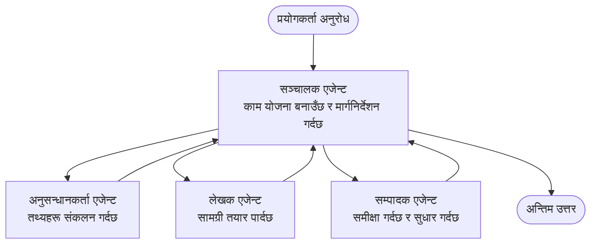

# बहु-एजेन्ट आधारहरू - आफ्नो पहिलो समन्वयित AI प्रणालीलाई डिप्लोय गर्नुहोस्

**अध्याय नेभिगेसन:**
- **📚 कोर्स गृह**: [AZD प्रारम्भकर्ताहरूका लागि](../../README.md)
- **📖 वर्तमान अध्याय**: अध्याय ५ - बहु-एजेन्ट AI समाधानहरू
- **⬅️ अघिल्लो**: [अध्याय ४: पूर्वाधार](../chapter-04-infrastructure/README.md)
- **➡️ अर्को**: [समन्वय ढाँचाहरू](../chapter-06-pre-deployment/coordination-patterns.md)

> `azd 1.27.1` सँग जुलाई २०२६ मा मान्य गरिएको।

## परिचय

पहिलेका अध्यायहरूमा तपाईंले एउटा मात्र एप्लिकेसन डिप्लोय गर्नुभयो—र अध्याय २ मा तपाईंले एउटा मात्र AI एजेन्ट डिप्लोय गर्नुभयो। यो पाठले अर्को चरण लिन्छ: **बहु-एजेन्ट प्रणाली** डिप्लोय गर्ने जुनमा धेरै विशेषज्ञ एजेन्टहरू समस्या समाधान गर्न सँगै काम गर्छन् जुन एउटै एजेन्टले आफैंले राम्ररी समाधान गर्न सक्दैन।

नवप्रवेशीहरूका लागि राम्रो खबर: **तपाईंलाई नयाँ कमाण्डहरू आवश्यक छैनन्।** बहु-एजेन्ट समाधान अझै azd परियोजना हो। तपाईं `azd init`, `azd up`, परीक्षण, र `azd down` गर्नुहुनेछ—ठ्याक्कै उही काम गर्ने तरिका जुन तपाईंले पहिले नै जान्नु भएको छ। के परिवर्तन हुन्छ भने एप्लिकेसनको *आकार* भित्र।

## सिकाइ लक्ष्यहरू

यस पाठको अन्त्यसम्म, तपाईं:
- "बहु-एजेन्ट" के हो र कहिलेसम्म जटिलता लायक हुन्छ बुझ्नुहुनेछ
- बहु-एजेन्ट प्रणालीका सामान्य भूमिकाहरू (समन्वयक + विशेषज्ञहरू) चिनिनुहुनेछ
- `azd up` मार्फत वास्तविक, काम गर्ने बहु-एजेन्ट टेम्प्लेट डिप्लोय गर्नुहुनेछ
- बहु-एजेन्ट एप पछ्याउने Azure स्रोतहरू बुझ्नुहुनेछ
- समाधानलाई सुरक्षित रूपमा प्रमाणित, अनुकूलन, र नष्ट गर्न जान्नुहुनेछ

## सिकाइ परिणामहरू

यस पाठ सकिएपछि, तपाईं सक्षम हुनुहुनेछ:
- एउटै एजेन्ट र बहु-एजेन्ट प्रणाली बीचको भिन्नता व्याख्या गर्न
- एउटै एजेन्टका उपकरणहरू प्रयोग गर्ने र साँच्चिकै बहु-एजेन्ट डिजाइन बीच छनोट गर्न
- azd सँग बहु-एजेन्ट टेम्प्लेटलाई सुरु देखि अन्त सम्म डिप्लोय र परीक्षण गर्न
- प्रत्येक एजेन्ट कहाँ चल्छ र कसरी संचार गर्छन् पत्ता लगाउन
- निरन्तर शुल्कबाट बच्न सबै स्रोत सफा गर्न

---

## बहु-एजेन्ट प्रणाली के हो?

एउटा मात्र AI एजेन्ट एउटा मोडल हो जससँग निर्देशनहरूको सेट र (परिवकल्पकरणमा) केही उपकरणहरू हुन्छन्। यो ध्यान केन्द्रित कामहरूका लागि राम्रो काम गर्छ। तर जति काम बढ्छ—अनुसन्धान, त्यसपछि लेखन, त्यसपछि सम्पादन, त्यसपछि तथ्य-जाँच—सबै कुरा एउटै प्रम्प्टमा हाल्दा एजेन्ट ढिलो, कम भरपर्दो, र डिबग गर्न कठिन हुन्छ।

एक **बहु-एजेन्ट प्रणाली** कामलाई विशेषज्ञहरूमा विभाजन गर्छ जसले प्रत्येकले एउटा काम राम्रो गरिरहेका हुन्छन्, जुन समन्वयक द्वारा समन्वित हुन्छ:



### दुई भूमिकाहरू जुन तपाईं सधैं देख्नुहुनेछ

| भूमिका | काम | उदाहरण |
|------|-----|---------|
| **समन्वयक** | *के हुन्छ त्यसको निर्णय गर्छ* र एजेन्टहरू बीच काम विभाजन गर्छ | "पहिले अनुसन्धान, त्यसपछि लेखन, त्यसपछि सम्पादन" |
| **विशेषज्ञ** | एउटा केन्द्रित काम गर्छ र परिणाम फर्काउँछ | एउटा "अनुसन्धानकर्ता" जसले तथ्य मात्र सङ्कलन गर्छ |

### के तपाईंलाई साँच्चिकै धेरै एजेन्टहरूको आवश्यकता छ?

सहज सुरू गर्नुहोस्। बहु-एजेन्ट **मात्र** प्रयोग गर्नुहोस् जब यी मध्ये कुनै एक सत्य हो:

- ✅ कार्यसँग **स्पष्ट चरणहरू** छन् जसलाई फरक निर्देशनले लाभ हुन्छ (अनुसन्धान बनाम लेखन बनाम समीक्षा)
- ✅ तपाईंले विशेषज्ञहरूलाई **समानान्तर** चलाउन चाहनुहुन्छ समय बचाउन
- ✅ फरक चरणहरूले **फरक उपकरण वा डाटा स्रोतहरू** चाहिन्छ
- ✅ प्रत्येक चरणलाई **स्वतन्त्र रूपमा परीक्षणयोग्य र डिबगयोग्य** बनाउनु पर्छ

यदि तपाईंको काम केवल प्रश्न-उत्तर हो वा साधारण उपकरण कल हो भने, एउटा **एकल एजेन्ट संग उपकरणहरू** (अध्याय २) सरल, सस्तो, र सजिलो हुन्छ।

> **नवप्रवेशी सुझाव:** "अधिक एजेन्टहरू" भनेको "राम्रो" होइन। प्रत्येक एजेन्टले ढिलाइ, लागत र नयाँ अनुगमन गरिने कुरा थप्दछ। एजेन्टहरू मात्र समस्या स्पष्ट रूपले भागहरूमा विभाजित हुँदा थप्नुहोस्।

---

## Azure मा बहु-एजेन्ट बनाउने दुई तरिका

| दृष्टिकोण | के हो | उत्तम लागि |
|----------|-----------|----------|
| **एकल एजेन्ट + उपकरणहरू** | एउटा Foundry एजेन्ट जसले फङ्शन/उपकरणहरू कल गर्छ | सरल कार्यप्रवाहहरू, सुरूवात गर्नेहरूका लागि |
| **धेरै समन्वयित एजेन्टहरू** | धेरै एजेन्टहरू जसमा समन्वयक हुन्छ | स्पष्ट चरणहरू, समानान्तर काम, विशेषज्ञता |

यो पाठ दोस्रो दृष्टिकोणमा केन्द्रित छ जसले **पूर्वनिर्मित टेम्प्लेट** प्रयोग गर्छ, ताकि तपाईंले आफ्नै निर्माण गर्नु अघि वास्तविक बहु-एजेन्ट प्रणाली चलिरहेको देख्न सक्नुहोस्।

---

## व्यवहारिक: एक काम गर्ने बहु-एजेन्ट एप डिप्लोय गर्नुहोस्

हामीले **Contoso Creative Writer** डिप्लोय गर्नेछौं, जुन आधिकारिक Azure नमूना हो जसले धेरै एजेन्टहरू (अनुसन्धानकर्ता, लेखक, सम्पादक) सँग समन्वय गरेर एउटा लेख उत्पादन गर्छ। यो राम्रो पहिलो बहु-एजेन्ट एप हो किनकि भूमिका बुझ्न सजिलो छ।

### चरण १: टेम्प्लेट आरम्भ गर्नुहोस्

```bash
# एक कार्य फोल्डर बनाउनुहोस्
mkdir creative-writer && cd creative-writer

# आधिकारिक बहु-एजेन्ट टेम्प्लेटबाट शुरू गर्नुहोस्
azd init --template contoso-creative-writer
```

> कुनै पनि बेला बहु-एजेन्ट टेम्प्लेटहरूको थप सूचीको लागि [Awesome AZD AI प्रदर्शनी](https://azure.github.io/awesome-azd/?tags=ai) भ्रमण गर्नुहोस्। अन्य नवप्रवेशी-अनुकूल विकल्पहरूमा `get-started-with-ai-agents` र `azure-ai-travel-agents` समावेश छन्।

### चरण २: प्रमाणीकरण गर्नुहोस्

```bash
# azd कार्यप्रवाहहरूको लागि आवश्यक छ
azd auth login
```

### चरण ३: वातावरण सिर्जना गर्नुहोस्

```bash
azd env new dev
```

### चरण ४: पूर्वावलोकन गरी डिप्लोय गर्नुहोस्

```bash
# केही खर्च गर्नु अघि के सिर्जना हुनेछ हेर्नुहोस् (सिफारिस गरिएको)
azd provision --preview

# पूर्वाधार व्यवस्थापन गर्नुहोस् र एउटा चरणमा सबै एजेन्टहरू परिचालित गर्नुहोस्
azd up
```

`azd up` ले सब्स्क्रिप्शन र क्षेत्रको लागि सोध्नेछ, त्यसपछि Azure स्रोतहरू तयार गरेर एप्लिकेसन डिप्लोय गर्नेछ। AI डिप्लोयमेन्टहरू साधारण वेब एप भन्दा बढी समय लिन सक्छन्—यदि तपाईं ठूला मोडलहरू डिप्लोय गर्दै हुनुहुन्छ भने, तपाईं डिप्लोय टाइमआउट विस्तार गर्न सक्नुहुन्छ:

```bash
azd deploy --timeout 1800
```

> **लागत र क्षमता बारे सचेत रहनुहोस्:** बहु-एजेन्ट एपहरूले AI मोडेलहरू प्रयोग गर्दछन् जुन क्युटा खपत गर्छन् र लागत लाग्छ। यदि `azd up` मोडल क्युटा कारण विफल हुन्छ भने, [AI समस्या समाधान](../chapter-07-troubleshooting/ai-troubleshooting.md) हेर्नुहोस् क्षेत्र र क्युटा समाधानहरूको लागि, र अध्याय ६ [क्षमता योजना](../chapter-06-pre-deployment/capacity-planning.md)।

---

## तपाईंले के डिप्लोय गर्नुभयो बुझ्ने

यस्तो प्रायः बहु-एजेन्ट एपले Azure स्रोतहरूको सेट तयार गर्दछ जुन माथिका जिम्मेवारीहरूको नक्सासँग मेल खान्छ:

| स्रोत | किन त्यहाँ छ |
|----------|----------------|
| **Microsoft Foundry / मोडलहरू** | प्रत्येक एजेन्टले प्रयोग गर्ने भाषिक मोडलहरू होस्ट गर्छ |
| **Azure AI Search** | अनुसन्धानकर्ता एजेन्टलाई आधारभूत डाटा खोज्न दिन्छ |
| **कन्टेनर एपहरू** (वा एप सेवा) | समन्वयक र एजेन्ट कोड होस्ट गर्छ |
| **Cosmos DB** (केही नमूनाहरूमा) | एजेन्टहरू बीच साझा गरिएको स्थिति/स्मृति भण्डारण गर्छ |
| **एप्लिकेशन इन्साइट्स** | एजेन्टहरू *बीच* अनुरोधहरू ट्र्याक गर्छ ताकि तपाईं फ्लो डिबग गर्न सक्नुहुन्छ |

### एजेन्टहरूले एकअर्कासँग कसरी कुरा गर्छन्

अधिकांश azd बहु-एजेन्ट नमूनाहरूमा, **समन्वयक तपाईंको एप्लिकेसन कोडमा चल्छ** (जस्तै, Semantic Kernel वा Microsoft Agent Framework जस्ता फ्रेमवर्क प्रयोग गरेर)। समन्वयक प्रत्येक विशेषज्ञ एजेन्टलाई पालैपालो कल गर्छ, नतिजा पास गर्छ, र अन्तिम उत्तर तयार गर्छ। एजेन्टहरूले साझा सन्दर्भ मार्फत कुराकानी गर्छन्:

- **फङ्शन/उपकरण कलहरू** — समन्वयकले विशेषज्ञलाई कल गरेर परिणाम प्राप्त गर्छ
- **साझा स्मृति** — एउटा डेटाबेस (अक्सर Cosmos DB) मा यस्तो अवस्था राखिन्छ जुन दुवै एजेन्टले पढ्न सक्छन्
- **सन्देश/इभेन्टहरू** — कम कडा जोडको लागि, एजेन्टहरूले क्यु वा सर्भिस बस मार्फत संचार गर्छन्

> **डिबगिङका लागि यो किन महत्त्वपूर्ण छ:** प्रत्येक चरण छुट्टै हुँदा, Application Insights ले देखाउँछ *कुन* एजेन्ट ढिलो वा असफल भयो। यो नै काम एजेन्टहरूबीच विभाजन गर्नको मुख्य कारण हो।

---

## डिप्लोयमेन्टको पुष्टि गर्नुहोस्

सिस्टम साँच्चिकै काम गरिरहेको छ कि छैन सुनिश्चित गर्नुहोस् अघि बढ्नु अघि:

```bash
# वितरण गरिएको अन्तबिन्दुहरू देखाउनुहोस्
azd show

# अनुप्रयोगको अनुगमन ड्यासबोर्ड खोल्नुहोस्
azd monitor

# यदि केही असामान्य देखिन्छ भने लगहरू ट्र्याक गर्नुहोस्
azd monitor --logs
```

त्यसपछि `azd show` बाट एप URL खोल्नुहोस् र सबै एजेन्टहरूलाई व्यस्त पार्ने अनुरोध प्रयास गर्नुहोस् (Creative Writer का लागि, कुनै विषयमा छोटो लेख लेख्न भन्नुहोस्)। Application Insights **लेनदेन खोजीमा**, तपाईंले सो अनुरोध अनुसन्धानकर्ता, लेखक, र सम्पादक चरणहरूमा फैलिएको देख्नुपर्छ।

**सफलताका मापदण्डहरू:**
- ✅ `azd show` ले पुग्न सकिने अन्तबिन्दु देखाउँछ
- ✅ एउटा अनुरोधले स्पष्ट रूपमा धेरै चरण पार गरेर परिणाम उत्पादन गर्छ
- ✅ Application Insights ले एकभन्दा बढी एजेन्ट चरणहरूको ट्रेस देखाउँछ

---

## अनुकूलन: एजेन्ट थप्नुहोस् वा समायोजन गर्नुहोस्

किनकि प्रत्येक एजेन्ट केवल निर्देशनहरू र उपकरणहरू हुन्, अनुकूलन गर्न सजिलो छ:

१. टेम्प्लेटमा एजेन्ट परिभाषाहरू फेला पार्नुहोस् (प्रायः `prompts/`, `agents/`, वा `*.prompty` फाइलहरूको सेटमा)।
२. एजेन्टका निर्देशनहरू ट्युन गर्नुहोस् — उदाहरणका लागि, सम्पादक एजेन्टलाई विशेष शैली वा शब्दसंख्या पालना गर्न भन्नुहोस्।
३. केवल कोड पुनः डिप्लोय गर्नुहोस् (पूर्वाधार नपरिवर्तन):

   ```bash
   azd deploy
   ```

अझ अघि जान र आफ्नै म्यानिफेस्टबाट एजेन्टहरू निर्माण गर्न, एजेन्ट एक्सटेन्सन र यसको पूर्ण जीवनचक्र प्रयोग गर्नुहोस्:

```bash
azd extension install azure.ai.agents
azd ai agent init -m agent-manifest.yaml
azd up
azd ai agent invoke      # प्रतिक्रिया समयसहित परीक्षण गर्नुहोस्
```

पूर्ण एजेन्ट जीवनचक्र (`invoke`, `eval generate`, `optimize`, `delete`) को लागि [अध्याय २: एजेन्टहरू](../chapter-02-ai-development/agents.md) र [AZD AI CLI सन्दर्भ](../chapter-08-production/production-ai-practices.md#azd-ai-cli-commands-and-extensions) हेर्नुहोस्।

---

## सफा गर्नुहोस्

बहु-एजेन्ट एपहरूले धेरै शुल्क लाग्ने सेवाहरू चलाउँछन्। काम सकिएपछि सबै हटाउनुहोस्:

```bash
azd down --force --purge
```

`--purge` फ्ल्यागले नराम्रो तरिकाले मेटिएका AI स्रोतहरू (जस्तै Foundry/Azure AI Services खाताहरू) पनि हटाउँछ ताकि तिनीहरूले भविष्यको पुन:डिप्लोय रोक्न नपाउन् वा लागत लागिरहँदैन।

---

## उत्पादन बहु-एजेन्ट प्रणालीमा एउटा नोट

यस रिपोमा रहेको [Retail Multi-Agent Solution](../../examples/retail-scenario.md) एक **वास्तुकला ब्लूप्रिन्ट** हो, कुनै एक कमाण्ड टेम्प्लेट होइन—यसले उत्पादन खुद्रा प्रणाली कसरी निर्माण गरिन्छ भनेर दस्तावेज गर्दछ (र पूर्ण निर्माण ठूलो प्रयास हो भनेर स्पष्ट छ)। यो काम गर्ने नमूना डिप्लोय गरेपछि डिजाइन सन्दर्भका रूपमा प्रयोग गर्नुहोस्। उत्पादन सम्बन्धी चिन्ताहरू (टिकाउपन, लागत, अनुगमन, प्रशासन) का लागि, [अध्याय ८: उत्पादन AI अभ्यासहरू](../chapter-08-production/production-ai-practices.md) मा जानुहोस्।

---

## सारांश

- बहु-एजेन्ट प्रणाली कामलाई विशेषज्ञहरूमा विभाजन गर्छ जुन समन्वयकले समन्वय गर्छ।
- यो मात्र प्रयोग गर्नुहोस् जब कार्यसँग स्पष्ट चरणहरू, समानान्तरता, वा फरक उपकरणहरू छन्—अन्यथा एकल एजेन्टलाई प्राथमिकता दिनुहोस्।
- azd कार्यप्रवाह अपरिवर्तित छ: `azd init` → `azd up` → परीक्षण → `azd down`।
- `contoso-creative-writer` जस्ता वास्तविक टेम्प्लेटले तपाईंलाई आज बहु-एजेन्ट एप हेर्न र अनुकूलन गर्न दिन्छ।
- एजेन्टहरू बीच Application Insights ट्रेसिङ धेरै ठूलो व्यावहारिक लाभ हो।

---

## 🔗 नेभिगेसन

| दिशा | पाठ |
|-----------|--------|
| **अघिल्लो** | [अध्याय ४: पूर्वाधार](../chapter-04-infrastructure/README.md) |
| **अर्को** | [समन्वय ढाँचाहरू](../chapter-06-pre-deployment/coordination-patterns.md) |

## 📖 सम्बन्धित स्रोतहरू

- [AI एजेन्ट गाइड](../chapter-02-ai-development/agents.md)
- [समन्वय ढाँचाहरू](../chapter-06-pre-deployment/coordination-patterns.md)
- [उत्पादन AI अभ्यासहरू](../chapter-08-production/production-ai-practices.md)
- [AI समस्या समाधान](../chapter-07-troubleshooting/ai-troubleshooting.md)

---

<!-- CO-OP TRANSLATOR DISCLAIMER START -->
**अस्वीकरण**:
यो दस्तावेज़ AI अनुवाद सेवा [Co-op Translator](https://github.com/Azure/co-op-translator) प्रयोग गरेर अनुवाद गरिएको हो। हामी सही हुन प्रयास गर्छौं, तर कृपया जानकार हुनुस् कि स्वचालित अनुवादमा त्रुटिहरू वा अशुद्धताहरू हुन सक्छन्। मूल दस्तावेज़ यसको मूल भाषामा आधिकारिक स्रोत मानिनुपर्छ। महत्वपूर्ण जानकारीका लागि व्यावसायिक मानव अनुवाद सिफारिस गरिन्छ। यस अनुवादको प्रयोगबाट उत्पन्न कुनै पनि गलत बुझाइ वा त्रुटिको लागि हामी जिम्मेवार छैनौं।
<!-- CO-OP TRANSLATOR DISCLAIMER END -->