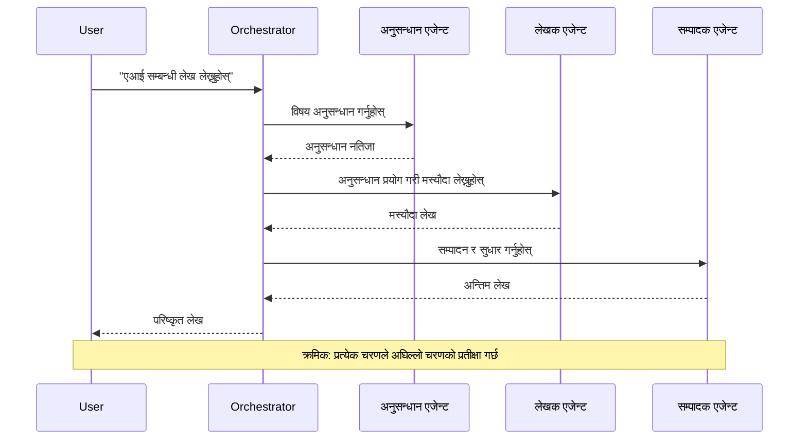
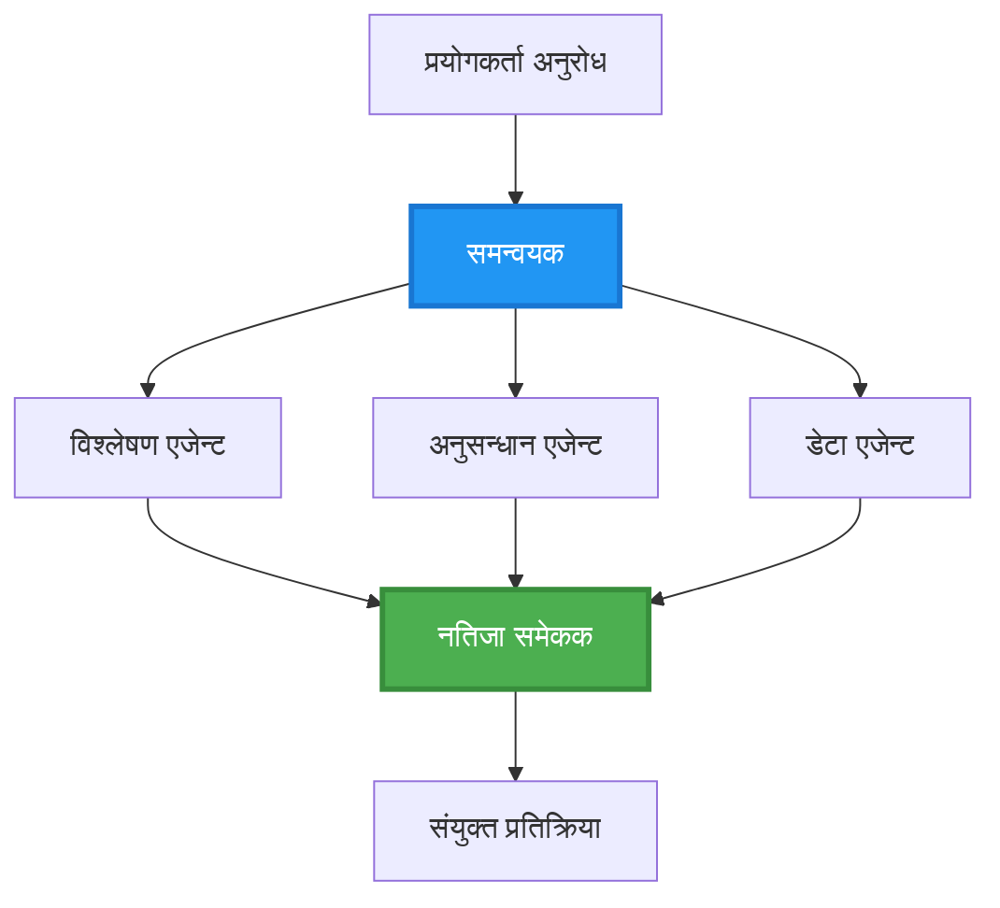
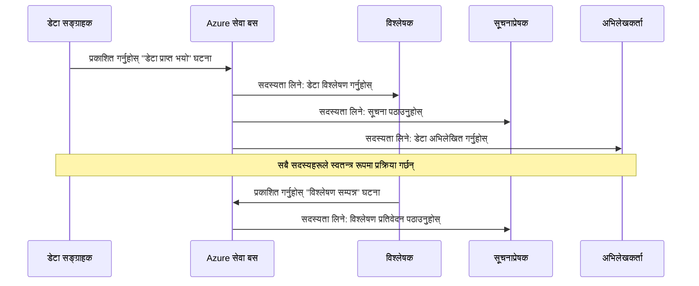
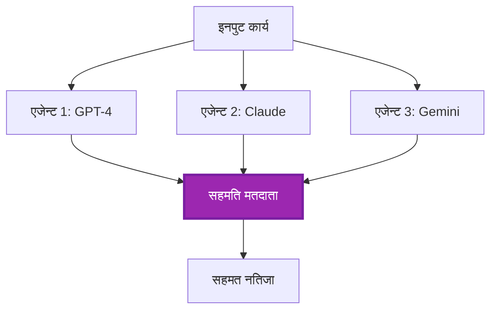
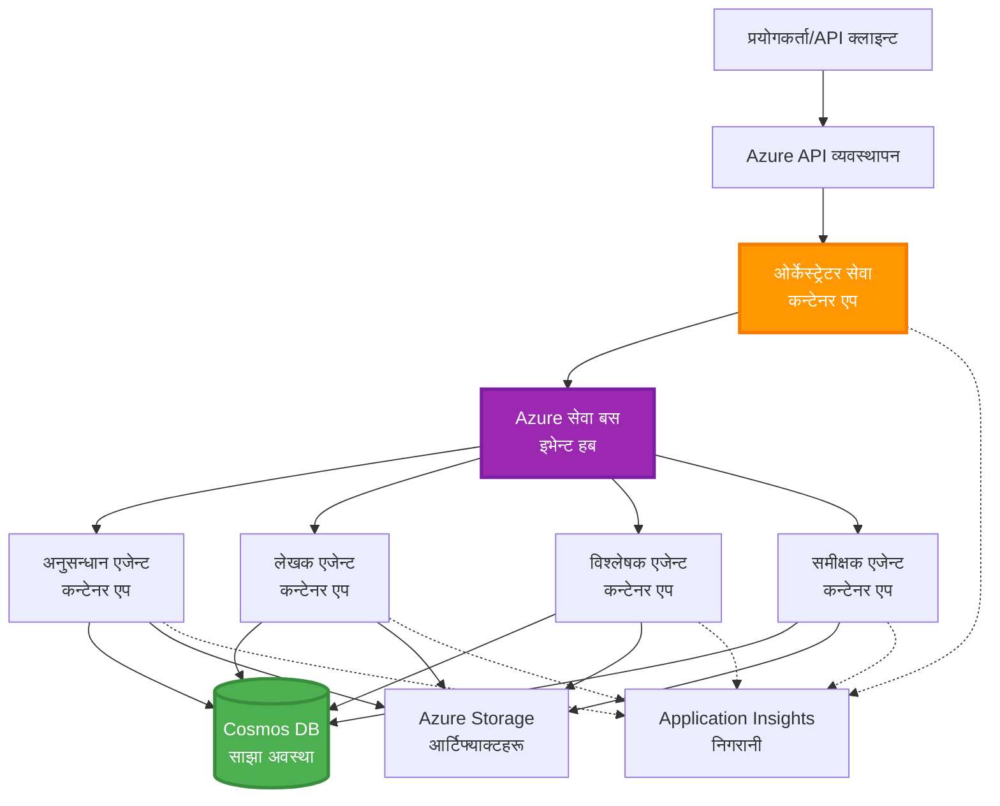

# बहु-एजेन्ट समन्वय ढाँचाहरू

⏱️ **अनुमानित समय**: 60-75 मिनेट | 💰 **अनुमानित लागत**: ~$100-300/महिना | ⭐ **जटिलता**: उन्नत

**📚 पठन मार्ग:**
- ← अघिल्लो: [Capacity Planning](capacity-planning.md) - स्रोत साइजिङ र स्केलिङ रणनीतिहरू
- 🎯 **तपाईं यहाँ हुनुहुन्छ**: बहु-एजेन्ट समन्वय ढाँचाहरू (ओर्केस्ट्रेसन, सञ्चार, अवस्था व्यवस्थापन)
- → अर्को: [SKU Selection](sku-selection.md) - उपयुक्त Azure सेवाहरू चयन गर्ने
- 🏠 [Course Home](../../README.md)

---

## तपाईंले के सिक्नुहुनेछ

यस पाठलाई पूरा गर्दा, तपाईंले:
- **बहु-एजेन्ट आर्किटेक्चर** ढाँचाहरू र कहिले प्रयोग गर्ने बुझ्नुहुनेछ
- **ओर्केस्ट्रेसन ढाँचाहरू** कार्यान्वयन गर्नुहुनेछ (केन्द्रीयकृत, विकेन्द्रित, पदानुक्रमिक)
- **एजेन्ट सञ्चार** रणनीतिहरू डिजाइन गर्ने (सिनक्रमनस, एसिनक्रमनस, घटना-चालित)
- वितरित एजेन्टहरू बीच **साझा अवस्था** व्यवस्थापन गर्ने
- AZD संग Azure मा **बहु-एजेन्ट प्रणालीहरू** डिप्लोय गर्ने
- वास्तविक संसारका AI परिदृश्यहरूका लागि **समन्वय ढाँचाहरू** लागू गर्ने
- वितरित एजेन्ट प्रणालीहरूको अनुगमन र डीबग गर्ने

## किन बहु-एजेन्ट समन्वय महत्वपूर्ण छ

### विकास: एकल एजेन्टदेखि बहु-एजेन्टसम्म

**एकल एजेन्ट (सरल):**
```
User → Agent → Response
```
- ✅ बुझ्न र कार्यान्वयन गर्न सजिलो
- ✅ साधा कामहरूको लागि छिटो
- ❌ एकल मोडेलको क्षमताले सीमित
- ❌ जटिल कार्यहरू समानान्तर गर्न सकिँदैन
- ❌ विशेषज्ञता छैन

**बहु-एजेन्ट प्रणाली (उन्नत):**
```
           ┌─────────────┐
           │ Orchestrator│
           └──────┬──────┘
        ┌─────────┼─────────┐
        │         │         │
    ┌───▼──┐  ┌──▼───┐  ┌──▼────┐
    │Agent1│  │Agent2│  │Agent3 │
    │(Plan)│  │(Code)│  │(Review)│
    └──────┘  └──────┘  └───────┘
```
- ✅ विशिष्ट कार्यहरूका लागि विशेषीकृत एजेन्टहरू
- ✅ गति बढाउन समानान्तर कार्यान्वयन
- ✅ मोड्युलर र मर्मतयोग्य
- ✅ जटिल कार्यप्रवाहहरूमा राम्रो
- ⚠️ समन्वय तर्क आवश्यक

**उपमा**: एकल एजेन्ट त्यो एक व्यक्तिले सबै काम गर्ने जस्तै हो। बहु-एजेन्ट टोली जस्तो हो जहाँ प्रत्येक सदस्यसँग विशेष सीपहरू हुन्छन् (अनुसन्धानकर्ता, कोडर, समीक्षक, लेखक) र उनीहरू सँगै काम गर्छन्।

---

## मुख्य समन्वय ढाँचाहरू

### ढाँचा 1: अनुक्रमिक समन्वय (Chain of Responsibility)

**कहिले प्रयोग गर्ने**: कार्यहरू विशिष्ट क्रममा पूरा हुनुपर्छ, प्रत्येक एजेन्टले अघिल्लो आउटपुटमा निर्माण गर्छ।


**फाइदाहरू:**
- ✅ स्पष्ट डेटा प्रवाह
- ✅ डीबग गर्न सजिलो
- ✅ पूर्वानुमेय कार्यान्वयन क्रम

**सीमाहरू:**
- ❌ ढिलो (समानान्तरता छैन)
- ❌ एउटै असफलताले सम्पूर्ण चेन अवरुद्ध गर्छ
- ❌ अन्तरनिर्भर कार्यहरू सम्हाल्न सक्दैन

**उदाहरण प्रयोग केसहरू:**
- सामग्री सिर्जना पाइपलाइन (अनुसन्धान → लेखन → सम्पादन → प्रकाशन)
- कोड जेनेरेशन (योजना → कार्यान्वयन → परीक्षण → डिप्लोय)
- रिपोर्ट निर्माण (डेटा सङ्कलन → विश्लेषण → भिजुअलाइजेसन → सारांश)

---

### ढाँचा 2: समानान्तर समन्वय (Fan-Out/Fan-In)

**कहिले प्रयोग गर्ने**: स्वतन्त्र कार्यहरू एकै पटक चलाउन सकिन्छ, परिणामहरू अन्त्यमा संयुक्त गरिन्छ।


**फाइदाहरू:**
- ✅ छिटो (समानान्तर कार्यान्वयन)
- ✅ दोष सहिष्णु (आंशिक परिणामहरू स्वीकार्य)
- ✅ горизонтली स्केल हुन्छ

**सीमाहरू:**
- ⚠️ परिणामहरू क्रमबद्ध आउने छैनन्
- ⚠️ एग्रिगेसन तर्क आवश्यक
- ⚠️ जटिल अवस्था व्यवस्थापन

**उदाहरण प्रयोग केसहरू:**
- बहु-स्रोत डेटा सङ्कलन (APIs + डेटाबेस + वेब स्क्र्यापिङ)
- प्रतिस्पर्धी विश्लेषण (विभिन्न मोडेलहरूले समाधान उत्पन्न गर्छन्, सर्वश्रेष्ठ चयन गरिन्छ)
- अनुवाद सेवाहरू (एकैसाथ धेरै भाषाहरूमा अनुवाद)

---

### ढाँचा 3: पदानुक्रमिक समन्वय (Manager-Worker)

**कहिले प्रयोग गर्ने**: उप-टास्कहरू हुने जटिल कार्यप्रवाहहरूमा, डेलिगेसन आवश्यक हुन्छ।


**फाइदाहरू:**
- ✅ जटिल कार्यप्रवाहहरू सम्हाल्छ
- ✅ मोड्युलर र मर्मतयोग्य
- ✅ जिम्मेवारी सीमाना स्पष्ट

**सीमाहरू:**
- ⚠️ बढी जटिल आर्किटेक्चर
- ⚠️ उच्च लेटेन्सी (धेरै समन्वय तहहरू)
- ⚠️ परिष्कृत ओर्केस्ट्रेसन आवश्यक

**उदाहरण प्रयोग केसहरू:**
- एण्टरप्राइज दस्तावेज प्रक्रिया (वर्गीकरण → मार्गनिर्देशन → प्रक्रिया → अभिलेखन)
- बहु-चरण डेटा पाइपलाइनहरू (इन्जेस्ट → क्लिन → ट्रान्सफर्म → विश्लेषण → रिपोर्ट)
- जटिल अटोमेसन कार्यप्रवाहहरू (योजना → स्रोत आवंटन → कार्यान्वयन → अनुगमन)

---

### ढाँचा 4: घटना-चालित समन्वय (Publish-Subscribe)

**कहिले प्रयोग गर्ने**: एजेन्टहरूले घटनाहरूमा प्रतिक्रिया दिनु पर्छ, ढिलो कूप्लिङ चाहिन्छ।


**फाइदाहरू:**
- ✅ एजेन्टहरूबीच ढिलो कूप्लिङ
- ✅ नयाँ एजेन्टहरू थप्न सजिलो (सिर्फ सदस्यता लिनुहोस्)
- ✅ एसिनक्रमनस प्रक्रिया
- ✅ लचिलो (मेसेज दृढता)

**सीमाहरू:**
- ⚠️ अन्तिम रूपमा समरूपता (eventual consistency)
- ⚠️ जटिल डीबगिङ
- ⚠️ मेसेज अर्डरिङ चुनौतीहरू

**उदाहरण प्रयोग केसहरू:**
- वास्तविक-समय अनुगमन प्रणाली (अलर्टहरू, ड्यासबोर्ड, लगहरू)
- बहु-च्यानल नोटिफिकेसन (इमेल, SMS, पुश, Slack)
- डेटा प्रोसेसिङ पाइपलाइनहरू (एकै डेटा का बहु उपभोक्ता)

---

### ढाँचा 5: सहमति-आधारित समन्वय (Voting/Quorum)

**कहिले प्रयोग गर्ने**: अगाडि बढ्नु अघि धेरै एजेन्टहरूबाट सहमति आवश्यक हुन्छ।


**फाइदाहरू:**
- ✅ उच्च सत्यता (धेरै विचारहरू)
- ✅ दोष सहिष्णु (अल्पसंख्यक असफलताहरू स्वीकार्य)
- ✅ गुणस्तर सुनिश्चितता निर्मित

**सीमाहरू:**
- ❌ महँगो (धेरै मोडेल कलहरू)
- ❌ ढिलो (सबै एजेन्टहरूको पर्खाइ)
- ⚠️ द्वन्द्व समाधान आवश्यक

**उदाहरण प्रयोग केसहरू:**
- सामग्री मोडरेशन (धेरै मोडेलहरूले सामग्री समीक्षा गर्छन्)
- कोड समीक्षा (धेरै लिन्टर/एनालाइजरहरू)
- चिकित्सकीय निदान (धेरै AI मोडेलहरू, विशेषज्ञ प्रमाणीकरण)

---

## आर्किटेक्चर अवलोकन

### Azure मा पूर्ण बहु-एजेन्ट प्रणाली


**मुख्य घटकहरू:**

| घटक | उद्देश्य | Azure Service |
|-----------|---------|---------------|
| **API Gateway** | प्रवेश बिन्दु, दर सीमाङ्कन, प्रमाणीकरण | API Management |
| **Orchestrator** | एजेन्ट कार्यप्रवाहहरू समन्वय गर्छ | Container Apps |
| **Message Queue** | असिन्क्रोनस सञ्चार | Service Bus / Event Hubs |
| **Agents** | विशेषीकृत AI कार्यकर्ता | Container Apps / Functions |
| **State Store** | साझा अवस्था, कार्य ट्र्याकिङ | Cosmos DB |
| **Artifact Storage** | कागजातहरू, नतिजा, लगहरू | Blob Storage |
| **Monitoring** | वितरित ट्रेसिङ, लगहरू | Application Insights |

---

## पूर्वआवश्यकताहरू

### आवश्यक उपकरणहरू

```bash
# Azure Developer CLI जाँच गर्नुहोस्
azd version
# ✅ अपेक्षित: azd संस्करण 1.0.0 वा माथि

# Azure CLI जाँच गर्नुहोस्
az --version
# ✅ अपेक्षित: azure-cli संस्करण 2.50.0 वा माथि

# Docker जाँच गर्नुहोस् (स्थानीय परीक्षणको लागि)
docker --version
# ✅ अपेक्षित: Docker संस्करण 20.10 वा माथि
```

### Azure आवश्यकताहरू

- सक्रिय Azure सदस्यता
- सिर्जना गर्ने अनुमति:
  - Container Apps
  - Service Bus namespaces
  - Cosmos DB accounts
  - Storage accounts
  - Application Insights

### ज्ञान सम्बन्धी पूर्वआवश्यकताहरू

तपाईंले पूरा गरेका हुनुपर्छ:
- [Configuration Management](../chapter-03-configuration/configuration.md)
- [Authentication & Security](../chapter-03-configuration/authsecurity.md)
- [Microservices Example](../../../../examples/microservices)

---

## कार्यान्वयन मार्गदर्शन

### प्रोजेक्ट संरचना

```
multi-agent-system/
├── azure.yaml                    # AZD configuration
├── infra/
│   ├── main.bicep               # Main infrastructure
│   ├── core/
│   │   ├── servicebus.bicep     # Message queue
│   │   ├── cosmos.bicep         # State store
│   │   ├── storage.bicep        # Artifact storage
│   │   └── monitoring.bicep     # Application Insights
│   └── app/
│       ├── orchestrator.bicep   # Orchestrator service
│       └── agent.bicep          # Agent template
└── src/
    ├── orchestrator/            # Orchestration logic
    │   ├── app.py
    │   ├── workflows.py
    │   └── Dockerfile
    ├── agents/
    │   ├── research/            # Research agent
    │   ├── writer/              # Writer agent
    │   ├── analyst/             # Analyst agent
    │   └── reviewer/            # Reviewer agent
    └── shared/
        ├── state_manager.py     # Shared state logic
        └── message_handler.py   # Message handling
```

---

## पाठ 1: अनुक्रमिक समन्वय ढाँचा

### कार्यान्वयन: सामग्री सिर्जना पाइपलाइन

हामी अनुक्रमिक पाइपलाइन बनाउछौं: अनुसन्धान → लेखन → सम्पादन → प्रकाशन

### 1. AZD कन्फिगरेसन

**फाइल: `azure.yaml`**

```yaml
name: content-pipeline
metadata:
  template: multi-agent-sequential@1.0.0

services:
  orchestrator:
    project: ./src/orchestrator
    language: python
    host: containerapp
  
  research-agent:
    project: ./src/agents/research
    language: python
    host: containerapp
  
  writer-agent:
    project: ./src/agents/writer
    language: python
    host: containerapp
  
  editor-agent:
    project: ./src/agents/editor
    language: python
    host: containerapp
```

### 2. पूर्वाधार: समन्वयका लागि Service Bus

**फाइल: `infra/core/servicebus.bicep`**

```bicep
param name string
param location string
param tags object = {}

resource serviceBusNamespace 'Microsoft.ServiceBus/namespaces@2022-10-01-preview' = {
  name: name
  location: location
  tags: tags
  sku: {
    name: 'Standard'
    tier: 'Standard'
  }
  properties: {
    minimumTlsVersion: '1.2'
  }
}

// Queue for orchestrator → research agent
resource researchQueue 'Microsoft.ServiceBus/namespaces/queues@2022-10-01-preview' = {
  parent: serviceBusNamespace
  name: 'research-tasks'
  properties: {
    maxDeliveryCount: 3
    lockDuration: 'PT5M'
    deadLetteringOnMessageExpiration: true
  }
}

// Queue for research agent → writer agent
resource writerQueue 'Microsoft.ServiceBus/namespaces/queues@2022-10-01-preview' = {
  parent: serviceBusNamespace
  name: 'writer-tasks'
  properties: {
    maxDeliveryCount: 3
    lockDuration: 'PT5M'
  }
}

// Queue for writer agent → editor agent
resource editorQueue 'Microsoft.ServiceBus/namespaces/queues@2022-10-01-preview' = {
  parent: serviceBusNamespace
  name: 'editor-tasks'
  properties: {
    maxDeliveryCount: 3
    lockDuration: 'PT5M'
  }
}

output namespace string = serviceBusNamespace.name
output connectionString string = listKeys('${serviceBusNamespace.id}/AuthorizationRules/RootManageSharedAccessKey', serviceBusNamespace.apiVersion).primaryConnectionString
```

### 3. साझा अवस्था प्रबन्धक

**फाइल: `src/shared/state_manager.py`**

```python
from azure.cosmos import CosmosClient, PartitionKey
from datetime import datetime
import os

class StateManager:
    """Manages shared state across agents using Cosmos DB"""
    
    def __init__(self):
        endpoint = os.environ['COSMOS_ENDPOINT']
        key = os.environ['COSMOS_KEY']
        
        self.client = CosmosClient(endpoint, key)
        self.database = self.client.get_database_client('agent-state')
        self.container = self.database.get_container_client('tasks')
    
    def create_task(self, task_id: str, task_type: str, input_data: dict):
        """Create a new task"""
        task = {
            'id': task_id,
            'type': task_type,
            'status': 'pending',
            'input': input_data,
            'created_at': datetime.utcnow().isoformat(),
            'steps': []
        }
        self.container.create_item(task)
        return task
    
    def update_task_step(self, task_id: str, step_name: str, result: dict):
        """Update task with completed step"""
        task = self.container.read_item(task_id, partition_key=task_id)
        
        task['steps'].append({
            'name': step_name,
            'completed_at': datetime.utcnow().isoformat(),
            'result': result
        })
        
        self.container.replace_item(task_id, task)
        return task
    
    def complete_task(self, task_id: str, final_result: dict):
        """Mark task as complete"""
        task = self.container.read_item(task_id, partition_key=task_id)
        task['status'] = 'completed'
        task['result'] = final_result
        task['completed_at'] = datetime.utcnow().isoformat()
        self.container.replace_item(task_id, task)
        return task
    
    def get_task(self, task_id: str):
        """Retrieve task state"""
        return self.container.read_item(task_id, partition_key=task_id)
```

### 4. ओर्केस्ट्रेटर सेवा

**फाइल: `src/orchestrator/app.py`**

```python
from flask import Flask, request, jsonify
from azure.servicebus import ServiceBusClient, ServiceBusMessage
import json
import uuid
import os
from shared.state_manager import StateManager

app = Flask(__name__)
state_manager = StateManager()

# सर्भिस बस जडान
servicebus_connection_str = os.environ['SERVICEBUS_CONNECTION_STRING']
servicebus_client = ServiceBusClient.from_connection_string(servicebus_connection_str)

@app.route('/health', methods=['GET'])
def health():
    return jsonify({'status': 'healthy', 'service': 'orchestrator'})

@app.route('/create-content', methods=['POST'])
def create_content():
    """
    Sequential workflow: Research → Write → Edit → Publish
    """
    data = request.json
    topic = data.get('topic')
    
    if not topic:
        return jsonify({'error': 'Topic required'}), 400
    
    # स्टेट स्टोरमा टास्क सिर्जना गर्नुहोस्
    task_id = str(uuid.uuid4())
    task = state_manager.create_task(
        task_id=task_id,
        task_type='content_creation',
        input_data={'topic': topic}
    )
    
    # अनुसन्धान एजेन्टमा सन्देश पठाउनुहोस् (पहिलो चरण)
    sender = servicebus_client.get_queue_sender('research-tasks')
    message = ServiceBusMessage(
        body=json.dumps({
            'task_id': task_id,
            'topic': topic,
            'next_queue': 'writer-tasks'  # परिणामहरू कहाँ पठाउने
        }),
        content_type='application/json'
    )
    
    with sender:
        sender.send_messages(message)
    
    return jsonify({
        'task_id': task_id,
        'status': 'started',
        'workflow': 'sequential',
        'steps': ['research', 'write', 'edit', 'publish'],
        'message': 'Content creation pipeline initiated'
    }), 202

@app.route('/task/<task_id>', methods=['GET'])
def get_task_status(task_id):
    """Check task status"""
    try:
        task = state_manager.get_task(task_id)
        return jsonify(task)
    except Exception as e:
        return jsonify({'error': str(e)}), 404

if __name__ == '__main__':
    app.run(host='0.0.0.0', port=8080)
```

### 5. अनुसन्धान एजेन्ट

**फाइल: `src/agents/research/app.py`**

```python
from azure.servicebus import ServiceBusClient, ServiceBusMessage
from openai import AzureOpenAI
import json
import os
import time
from shared.state_manager import StateManager

# क्लाइन्टहरू प्रारम्भ गर्नुहोस्
state_manager = StateManager()
servicebus_client = ServiceBusClient.from_connection_string(
    os.environ['SERVICEBUS_CONNECTION_STRING']
)

openai_client = AzureOpenAI(
    api_key=os.environ['AZURE_OPENAI_API_KEY'],
    api_version="2024-02-01",
    azure_endpoint=os.environ['AZURE_OPENAI_ENDPOINT']
)

def process_research_task(message_data):
    """Process research request and pass to writer"""
    task_id = message_data['task_id']
    topic = message_data['topic']
    next_queue = message_data['next_queue']
    
    print(f"🔬 Researching: {topic}")
    
    # अनुसन्धानका लागि Azure OpenAI लाई कल गर्नुहोस्
    response = openai_client.chat.completions.create(
        model="gpt-4",
        messages=[
            {"role": "system", "content": "You are a research assistant. Provide comprehensive research on the given topic."},
            {"role": "user", "content": f"Research this topic thoroughly: {topic}"}
        ],
        max_tokens=1500
    )
    
    research_results = response.choices[0].message.content
    
    # अवस्था अद्यावधिक गर्नुहोस्
    state_manager.update_task_step(
        task_id=task_id,
        step_name='research',
        result={'research': research_results}
    )
    
    # अर्को एजेन्ट (लेखक) लाई पठाउनुहोस्
    sender = servicebus_client.get_queue_sender(next_queue)
    message = ServiceBusMessage(
        body=json.dumps({
            'task_id': task_id,
            'topic': topic,
            'research': research_results,
            'next_queue': 'editor-tasks'
        }),
        content_type='application/json'
    )
    
    with sender:
        sender.send_messages(message)
    
    print(f"✅ Research complete for task {task_id}")

def main():
    """Listen to research queue"""
    receiver = servicebus_client.get_queue_receiver('research-tasks')
    
    print("🔬 Research Agent started, listening for tasks...")
    
    with receiver:
        while True:
            messages = receiver.receive_messages(max_wait_time=5)
            for message in messages:
                try:
                    message_data = json.loads(str(message))
                    process_research_task(message_data)
                    receiver.complete_message(message)
                except Exception as e:
                    print(f"❌ Error processing message: {e}")
                    receiver.abandon_message(message)

if __name__ == '__main__':
    main()
```

### 6. लेखक एजेन्ट

**फाइल: `src/agents/writer/app.py`**

```python
from azure.servicebus import ServiceBusClient, ServiceBusMessage
from openai import AzureOpenAI
import json
import os
from shared.state_manager import StateManager

state_manager = StateManager()
servicebus_client = ServiceBusClient.from_connection_string(
    os.environ['SERVICEBUS_CONNECTION_STRING']
)

openai_client = AzureOpenAI(
    api_key=os.environ['AZURE_OPENAI_API_KEY'],
    api_version="2024-02-01",
    azure_endpoint=os.environ['AZURE_OPENAI_ENDPOINT']
)

def process_writing_task(message_data):
    """Write article based on research"""
    task_id = message_data['task_id']
    topic = message_data['topic']
    research = message_data['research']
    next_queue = message_data['next_queue']
    
    print(f"✍️ Writing article: {topic}")
    
    # लेख लेख्न Azure OpenAI लाई कल गर्नुहोस्
    response = openai_client.chat.completions.create(
        model="gpt-4",
        messages=[
            {"role": "system", "content": "You are a professional writer. Write engaging, well-structured articles."},
            {"role": "user", "content": f"Based on this research:\n\n{research}\n\nWrite a comprehensive article about: {topic}"}
        ],
        max_tokens=2000
    )
    
    article_draft = response.choices[0].message.content
    
    # स्थिति अद्यावधिक गर्नुहोस्
    state_manager.update_task_step(
        task_id=task_id,
        step_name='writing',
        result={'draft': article_draft}
    )
    
    # सम्पादकलाई पठाउनुहोस्
    sender = servicebus_client.get_queue_sender(next_queue)
    message = ServiceBusMessage(
        body=json.dumps({
            'task_id': task_id,
            'topic': topic,
            'draft': article_draft
        }),
        content_type='application/json'
    )
    
    with sender:
        sender.send_messages(message)
    
    print(f"✅ Article draft complete for task {task_id}")

def main():
    """Listen to writer queue"""
    receiver = servicebus_client.get_queue_receiver('writer-tasks')
    
    print("✍️ Writer Agent started, listening for tasks...")
    
    with receiver:
        while True:
            messages = receiver.receive_messages(max_wait_time=5)
            for message in messages:
                try:
                    message_data = json.loads(str(message))
                    process_writing_task(message_data)
                    receiver.complete_message(message)
                except Exception as e:
                    print(f"❌ Error: {e}")
                    receiver.abandon_message(message)

if __name__ == '__main__':
    main()
```

### 7. सम्पादक एजेन्ट

**फाइल: `src/agents/editor/app.py`**

```python
from azure.servicebus import ServiceBusClient
from openai import AzureOpenAI
import json
import os
from shared.state_manager import StateManager

state_manager = StateManager()
servicebus_client = ServiceBusClient.from_connection_string(
    os.environ['SERVICEBUS_CONNECTION_STRING']
)

openai_client = AzureOpenAI(
    api_key=os.environ['AZURE_OPENAI_API_KEY'],
    api_version="2024-02-01",
    azure_endpoint=os.environ['AZURE_OPENAI_ENDPOINT']
)

def process_editing_task(message_data):
    """Edit and finalize article"""
    task_id = message_data['task_id']
    topic = message_data['topic']
    draft = message_data['draft']
    
    print(f"📝 Editing article: {topic}")
    
    # सम्पादनका लागि Azure OpenAI लाई कल गर्नुहोस्
    response = openai_client.chat.completions.create(
        model="gpt-4",
        messages=[
            {"role": "system", "content": "You are an expert editor. Improve grammar, clarity, and structure."},
            {"role": "user", "content": f"Edit and improve this article:\n\n{draft}"}
        ],
        max_tokens=2000
    )
    
    final_article = response.choices[0].message.content
    
    # कार्यलाई पूरा भएको रूपमा चिन्ह लगाउनुहोस्
    state_manager.complete_task(
        task_id=task_id,
        final_result={
            'topic': topic,
            'final_article': final_article,
            'word_count': len(final_article.split())
        }
    )
    
    print(f"✅ Article finalized for task {task_id}")

def main():
    """Listen to editor queue"""
    receiver = servicebus_client.get_queue_receiver('editor-tasks')
    
    print("📝 Editor Agent started, listening for tasks...")
    
    with receiver:
        while True:
            messages = receiver.receive_messages(max_wait_time=5)
            for message in messages:
                try:
                    message_data = json.loads(str(message))
                    process_editing_task(message_data)
                    receiver.complete_message(message)
                except Exception as e:
                    print(f"❌ Error: {e}")
                    receiver.abandon_message(message)

if __name__ == '__main__':
    main()
```

### 8. डिप्लोय र परीक्षण

```bash
# प्रारम्भ र परिनियोजन गर्नुहोस्
azd init
azd up

# ओर्केस्ट्रेटरको URL प्राप्त गर्नुहोस्
ORCHESTRATOR_URL=$(azd env get-values | grep ORCHESTRATOR_URL | cut -d '=' -f2 | tr -d '"')

# सामग्री सिर्जना गर्नुहोस्
curl -X POST $ORCHESTRATOR_URL/create-content \
  -H "Content-Type: application/json" \
  -d '{"topic": "The Future of AI in Healthcare"}'
```

**✅ अपेक्षित आउटपुट:**
```json
{
  "task_id": "a1b2c3d4-e5f6-7890-abcd-ef1234567890",
  "status": "started",
  "workflow": "sequential",
  "steps": ["research", "write", "edit", "publish"],
  "message": "Content creation pipeline initiated"
}
```

**कार्यको प्रगति जाँच्नुहोस्:**
```bash
TASK_ID="a1b2c3d4-e5f6-7890-abcd-ef1234567890"
curl $ORCHESTRATOR_URL/task/$TASK_ID
```

**✅ अपेक्षित आउटपुट (समाप्त):**
```json
{
  "id": "a1b2c3d4-e5f6-7890-abcd-ef1234567890",
  "type": "content_creation",
  "status": "completed",
  "steps": [
    {
      "name": "research",
      "completed_at": "2025-11-19T10:30:00Z",
      "result": {"research": "..."}
    },
    {
      "name": "writing",
      "completed_at": "2025-11-19T10:32:00Z",
      "result": {"draft": "..."}
    }
  ],
  "result": {
    "topic": "The Future of AI in Healthcare",
    "final_article": "...",
    "word_count": 1500
  }
}
```

---

## पाठ 2: समानान्तर समन्वय ढाँचा

### कार्यान्वयन: बहु-स्रोत अनुसन्धान एग्रिगेटर

हामी समानान्तर प्रणाली बनाउछौं जसले एकै समयमा बहु स्रोतहरूबाट जानकारी सङ्कलन गर्छ।

### समानान्तर ओर्केस्ट्रेटर

**फाइल: `src/orchestrator/parallel_workflow.py`**

```python
from flask import Flask, request, jsonify
from azure.servicebus import ServiceBusClient, ServiceBusMessage
import json
import uuid
import os
from shared.state_manager import StateManager

app = Flask(__name__)
state_manager = StateManager()

servicebus_client = ServiceBusClient.from_connection_string(
    os.environ['SERVICEBUS_CONNECTION_STRING']
)

@app.route('/research-parallel', methods=['POST'])
def research_parallel():
    """
    Parallel workflow: Multiple agents work simultaneously
    """
    data = request.json
    query = data.get('query')
    
    task_id = str(uuid.uuid4())
    task = state_manager.create_task(
        task_id=task_id,
        task_type='parallel_research',
        input_data={
            'query': query,
            'agents': ['web', 'academic', 'news', 'social']
        }
    )
    
    # फ्यान-आउट: सबै एजेन्टहरूलाई एकै पटक पठाउनुहोस्
    agents = [
        ('web-research-queue', 'web'),
        ('academic-research-queue', 'academic'),
        ('news-research-queue', 'news'),
        ('social-research-queue', 'social')
    ]
    
    for queue_name, agent_type in agents:
        sender = servicebus_client.get_queue_sender(queue_name)
        message = ServiceBusMessage(
            body=json.dumps({
                'task_id': task_id,
                'query': query,
                'agent_type': agent_type,
                'result_queue': 'aggregation-queue'
            }),
            content_type='application/json'
        )
        
        with sender:
            sender.send_messages(message)
    
    return jsonify({
        'task_id': task_id,
        'status': 'started',
        'workflow': 'parallel',
        'agents_dispatched': 4,
        'message': 'Parallel research initiated'
    }), 202

if __name__ == '__main__':
    app.run(host='0.0.0.0', port=8080)
```

### समेकन तर्क

**फाइल: `src/agents/aggregator/app.py`**

```python
from azure.servicebus import ServiceBusClient
import json
import os
from collections import defaultdict
from shared.state_manager import StateManager

state_manager = StateManager()
servicebus_client = ServiceBusClient.from_connection_string(
    os.environ['SERVICEBUS_CONNECTION_STRING']
)

# प्रत्येक कार्यका लागि नतिजाहरू ट्र्याक गर्नुहोस्
task_results = defaultdict(list)
expected_agents = 4  # वेब, शैक्षिक, समाचार, सामाजिक

def process_result(message_data):
    """Aggregate results from parallel agents"""
    task_id = message_data['task_id']
    agent_type = message_data['agent_type']
    result = message_data['result']
    
    # नतिजा भण्डारण गर्नुहोस्
    task_results[task_id].append({
        'agent': agent_type,
        'data': result
    })
    
    print(f"📊 Received result from {agent_type} agent ({len(task_results[task_id])}/{expected_agents})")
    
    # जाँच गर्नुहोस् कि सबै एजेन्टहरूले सम्पन्न भएका छन् कि छैनन् (फ्यान-इन)
    if len(task_results[task_id]) == expected_agents:
        print(f"✅ All agents completed for task {task_id}. Aggregating...")
        
        # नतिजाहरू संयोजन गर्नुहोस्
        aggregated = {
            'query': message_data['query'],
            'sources': task_results[task_id],
            'summary': generate_summary(task_results[task_id])
        }
        
        # सम्पन्न भनेर चिन्ह लगाउनुहोस्
        state_manager.complete_task(task_id, aggregated)
        
        # सफाइ गर्नुहोस्
        del task_results[task_id]
        
        print(f"✅ Aggregation complete for task {task_id}")

def generate_summary(results):
    """Generate summary from all sources"""
    summaries = [r['data'].get('summary', '') for r in results]
    return '\n\n'.join(summaries)

def main():
    """Listen to aggregation queue"""
    receiver = servicebus_client.get_queue_receiver('aggregation-queue')
    
    print("📊 Aggregator started, listening for results...")
    
    with receiver:
        while True:
            messages = receiver.receive_messages(max_wait_time=5)
            for message in messages:
                try:
                    message_data = json.loads(str(message))
                    process_result(message_data)
                    receiver.complete_message(message)
                except Exception as e:
                    print(f"❌ Error: {e}")
                    receiver.abandon_message(message)

if __name__ == '__main__':
    main()
```

**समानान्तर ढाँचाको फाइदाहरू:**
- ⚡ **4x छिटो** (एजेन्टहरू एकैसाथ चल्छन्)
- 🔄 **दोष सहिष्णु** (आंशिक परिणामहरू स्वीकार्य)
- 📈 **स्केलेबल** (सहजै थप एजेन्टहरू थप्न सकिन्छ)

---

## व्यवहारिक अभ्यासहरू

### अभ्यास 1: टाइमआउट ह्यान्डलिङ थप्नुहोस् ⭐⭐ (मध्यम)

**उद्देश्य**: एग्रिगेटरले ढिला गर्ने एजेन्टहरूका लागि सधैं पर्खेर बस्ने बन्द गर्ने टाइमआउट तर्क कार्यान्वयन गर्नुहोस्।

**कदमहरू**:

1. **एग्रिगेटरमा टाइमआउट ट्र्याकिङ थप्नुहोस्:**

```python
from datetime import datetime, timedelta

task_timeouts = {}  # task_id -> समाप्ति_समय

def process_result(message_data):
    task_id = message_data['task_id']
    
    # पहिलो परिणाममा समयसीमा सेट गर्नुहोस्
    if task_id not in task_timeouts:
        task_timeouts[task_id] = datetime.utcnow() + timedelta(seconds=30)
    
    task_results[task_id].append({
        'agent': message_data['agent_type'],
        'data': message_data['result']
    })
    
    # पूरा भयो वा टाइमआउट भयो कि जाँच गर्नुहोस्
    if len(task_results[task_id]) == expected_agents or \
       datetime.utcnow() > task_timeouts[task_id]:
        
        print(f"📊 Aggregating with {len(task_results[task_id])}/{expected_agents} results")
        
        aggregated = {
            'query': message_data['query'],
            'sources': task_results[task_id],
            'completed_agents': len(task_results[task_id]),
            'timed_out': len(task_results[task_id]) < expected_agents
        }
        
        state_manager.complete_task(task_id, aggregated)
        
        # सफाइ
        del task_results[task_id]
        del task_timeouts[task_id]
```

2. **कृत्रिम ढिलाइहरूसँग परीक्षण गर्नुहोस्:**

```python
# एक एजेन्टमा सुस्त प्रशोधन अनुकरण गर्न ढिलाइ थप्नुहोस्
import time
time.sleep(35)  # ३०-सेकेन्डको समयसीमा नाघ्छ
```

3. **डिप्लोय र प्रमाणीकरण गर्नुहोस्:**

```bash
azd deploy aggregator

# कार्य प्रस्तुत गर्नुहोस्
curl -X POST $ORCHESTRATOR_URL/research-parallel \
  -H "Content-Type: application/json" \
  -d '{"query": "AI safety research"}'

# 30 सेकेन्ड पछि नतिजा जाँच गर्नुहोस्
curl $ORCHESTRATOR_URL/task/$TASK_ID
```

**✅ सफलता मापदण्डहरू:**
- ✅ यदि एजेन्टहरू अपूर्ण भए तापनि 30 सेकेन्डपछि टास्क पूरा हुन्छ
- ✅ प्रतिक्रिया आंशिक परिणामहरू देखाउँछ (`"timed_out": true`)
- ✅ उपलब्ध परिणामहरू फिर्ता गरिन्छ (4 मध्ये 3 एजेन्टहरू)

**समय**: 20-25 मिनेट

---

### अभ्यास 2: पुन:प्रयास तर्क लागू गर्नुहोस् ⭐⭐⭐ (उन्नत)

**उद्देश्य**: असफल एजेन्ट कार्यहरू स्वचालित रूपमा पुन:प्रयास गरियोस् र त्यसपछि मात्र बन्द गरियोस्।

**कदमहरू**:

1. **ओर्केस्ट्रेटरमा पुन:प्रयास ट्र्याकिङ थप्नुहोस्:**

```python
from dataclasses import dataclass
from typing import Dict

@dataclass
class RetryConfig:
    max_retries: int = 3
    backoff_seconds: int = 5

retry_counts: Dict[str, int] = {}  # message_id बाट retry_count

def send_with_retry(queue_name: str, message_data: dict, retry_config: RetryConfig):
    """Send message with retry metadata"""
    message_id = message_data.get('message_id', str(uuid.uuid4()))
    message_data['message_id'] = message_id
    message_data['retry_count'] = retry_counts.get(message_id, 0)
    message_data['max_retries'] = retry_config.max_retries
    
    sender = servicebus_client.get_queue_sender(queue_name)
    message = ServiceBusMessage(
        body=json.dumps(message_data),
        content_type='application/json',
        message_id=message_id
    )
    
    with sender:
        sender.send_messages(message)
```

2. **एजेन्टहरूमा पुन:प्रयास ह्यान्डलर थप्नुहोस्:**

```python
def process_with_retry(message, receiver, process_func):
    """Process message with automatic retry on failure"""
    try:
        message_data = json.loads(str(message))
        
        # सन्देश प्रशोधन गर्नुहोस्
        process_func(message_data)
        
        # सफलता - पूरा
        receiver.complete_message(message)
        
    except Exception as e:
        message_id = message.message_id
        retry_count = message_data.get('retry_count', 0)
        max_retries = message_data.get('max_retries', 3)
        
        if retry_count < max_retries:
            # पुनः प्रयास: परित्याग गरी गणना बढाएर पुनः कतारमा राख्नुहोस्
            print(f"⚠️ Retry {retry_count + 1}/{max_retries} for message {message_id}")
            
            message_data['retry_count'] = retry_count + 1
            
            # उही कतारमा ढिलाइका साथ फिर्ता पठाउनुहोस्
            time.sleep(5 * (retry_count + 1))  # घातीय ब्याकअफ
            send_with_retry(queue_name, message_data, RetryConfig())
            
            receiver.complete_message(message)  # मूल हटाउनुहोस्
        else:
            # अधिकतम पुन: प्रयास सीमा पार भयो - डेड लेटर कतारमा सार्नुहोस्
            print(f"❌ Max retries exceeded for message {message_id}")
            receiver.dead_letter_message(
                message,
                reason="MaxRetriesExceeded",
                error_description=str(e)
            )
```

3. **डेड लेटर क्यु अनुगमन गर्नुहोस्:**

```python
def monitor_dead_letters():
    """Check dead letter queue for failed messages"""
    receiver = servicebus_client.get_queue_receiver(
        'research-queue',
        sub_queue='deadletter'
    )
    
    with receiver:
        messages = receiver.receive_messages(max_wait_time=5)
        for message in messages:
            print(f"☠️ Dead letter: {message.message_id}")
            print(f"Reason: {message.dead_letter_reason}")
            print(f"Description: {message.dead_letter_error_description}")
```

**✅ सफलता मापदण्डहरू:**
- ✅ असफल टास्कहरू स्वचालित रूपमा पुन:प्रयास हुन्छन् (अधिकतम 3 पटक)
- ✅ पुन:प्रयासबीच घातीय ब्याकअफ (5s, 10s, 15s)
- ✅ अधिकतम प्रयासपछि मेसेजहरू डेड लेटर क्युमा जान्छन्
- ✅ डेड लेटर क्यु अनुगमन र रि-प्ले गर्न सकिन्छ

**समय**: 30-40 मिनेट

---

### अभ्यास 3: सर्किट ब्रेकर लागू गर्नुहोस् ⭐⭐⭐ (उन्नत)

**उद्देश्य**: असफलता फैलनबाट रोक्नका लागि असफल हुँदै गरेको एजेन्टहरूमा अनुरोध रोक्ने।

**कदमहरू**:

1. **सर्किट ब्रेकर क्लास बनाउनुहोस्:**

```python
from enum import Enum
from datetime import datetime, timedelta

class CircuitState(Enum):
    CLOSED = "closed"      # सामान्य सञ्चालन
    OPEN = "open"          # विफल हुँदैछ, अनुरोधहरू अस्वीकृत गरिन्छ
    HALF_OPEN = "half_open"  # पुनः सुचारु भएको छ कि परीक्षण गर्दै

class CircuitBreaker:
    def __init__(self, failure_threshold=5, timeout_seconds=60):
        self.failure_threshold = failure_threshold
        self.timeout_seconds = timeout_seconds
        self.failure_count = 0
        self.last_failure_time = None
        self.state = CircuitState.CLOSED
    
    def call(self, func):
        """Execute function with circuit breaker protection"""
        if self.state == CircuitState.OPEN:
            # समयसीमा समाप्त भएको छ कि जाँच गर्नुहोस्
            if datetime.utcnow() - self.last_failure_time > timedelta(seconds=self.timeout_seconds):
                self.state = CircuitState.HALF_OPEN
                print("🔄 Circuit breaker: HALF_OPEN (testing)")
            else:
                raise Exception(f"Circuit breaker OPEN for agent. Try again in {self.timeout_seconds}s")
        
        try:
            result = func()
            
            # सफलता
            if self.state == CircuitState.HALF_OPEN:
                self.state = CircuitState.CLOSED
                self.failure_count = 0
                print("✅ Circuit breaker: CLOSED (recovered)")
            
            return result
            
        except Exception as e:
            self.failure_count += 1
            self.last_failure_time = datetime.utcnow()
            
            if self.failure_count >= self.failure_threshold:
                self.state = CircuitState.OPEN
                print(f"🔴 Circuit breaker: OPEN (too many failures)")
            
            raise e
```

2. **एजेन्ट कलहरूमा लागू गर्नुहोस्:**

```python
# ओर्केस्ट्रेटरमा
agent_circuits = {
    'web': CircuitBreaker(failure_threshold=5, timeout_seconds=60),
    'academic': CircuitBreaker(failure_threshold=5, timeout_seconds=60),
    'news': CircuitBreaker(failure_threshold=5, timeout_seconds=60),
    'social': CircuitBreaker(failure_threshold=5, timeout_seconds=60)
}

def send_to_agent(agent_type, message_data):
    """Send with circuit breaker protection"""
    circuit = agent_circuits[agent_type]
    
    try:
        circuit.call(lambda: send_message(agent_type, message_data))
    except Exception as e:
        print(f"⚠️ Skipping {agent_type} agent: {e}")
        # अन्य एजेन्टहरूसँग जारी राख्नुहोस्
```

3. **सर्किट ब्रेकर परीक्षण गर्नुहोस्:**

```bash
# पुनरावर्ती विफलताहरू अनुकरण गर्नुहोस् (एक एजेन्ट रोक्नुहोस्)
az containerapp stop --name web-research-agent --resource-group rg-agents

# धेरै अनुरोधहरू पठाउनुहोस्
for i in {1..10}; do
  curl -X POST $ORCHESTRATOR_URL/research-parallel \
    -H "Content-Type: application/json" \
    -d '{"query": "test query '$i'"}'
  sleep 2
done

# लगहरू जाँच गर्नुहोस् - 5 असफलतापछि सर्किट खुलिरहेको देखिनु पर्छ
# Container App का लगहरू हेर्न Azure CLI प्रयोग गर्नुहोस्:
az containerapp logs show --name orchestrator --resource-group $RG_NAME --tail 50
```

**✅ सफलता मापदण्डहरू:**
- ✅ 5 असफलतापछि सर्किट खुलेर अनुरोधहरू अस्वीकार गर्छ
- ✅ 60 सेकेन्डपछि सर्किट हाफ-ओपन अवस्थामा जान्छ (पुनरुत्थानको परीक्षण)
- ✅ अन्य एजेन्टहरू सामान्य रूपमा काम गर्न जारी राख्छन्
- ✅ एजेन्ट पुनःसञ्चालन हुँदा सर्किट स्वचालित रूपमा बन्द हुन्छ

**समय**: 40-50 मिनेट

---

## अनुगमन र डीबगिङ

### Application Insights सँग वितरित ट्रेसिङ

**फाइल: `src/shared/tracing.py`**

```python
from opencensus.ext.azure.log_exporter import AzureLogHandler
from opencensus.ext.azure.trace_exporter import AzureExporter
from opencensus.trace import config_integration
from opencensus.trace.tracer import Tracer
from opencensus.trace.samplers import AlwaysOnSampler
import logging
import os

# ट्रेसिङ कन्फिगर गर्नुहोस्
config_integration.trace_integrations(['requests', 'logging'])

connection_string = os.environ.get('APPLICATIONINSIGHTS_CONNECTION_STRING')

# ट्रेसर सिर्जना गर्नुहोस्
tracer = Tracer(
    exporter=AzureExporter(connection_string=connection_string),
    sampler=AlwaysOnSampler()
)

# लगिङ कन्फिगर गर्नुहोस्
logger = logging.getLogger(__name__)
logger.addHandler(AzureLogHandler(connection_string=connection_string))
logger.setLevel(logging.INFO)

def trace_agent_call(agent_name, task_id, operation):
    """Trace agent operations"""
    with tracer.span(name=f'{agent_name}.{operation}') as span:
        span.add_attribute('agent', agent_name)
        span.add_attribute('task_id', task_id)
        span.add_attribute('operation', operation)
        
        try:
            result = operation()
            span.add_attribute('status', 'success')
            return result
        except Exception as e:
            span.add_attribute('status', 'error')
            span.add_attribute('error', str(e))
            raise
```

### Application Insights क्वेरीहरू

**बहु-एजेन्ट कार्यप्रवाहहरू ट्र्याक गर्नुहोस्:**

```kusto
// Trace complete workflow for a task
traces
| where customDimensions.task_id == "a1b2c3d4-..."
| project timestamp, message, customDimensions.agent, customDimensions.operation
| order by timestamp asc
```

**एजेन्ट प्रदर्शन तुलना:**

```kusto
// Compare agent execution times
dependencies
| where name contains "agent"
| summarize 
    avg_duration = avg(duration),
    p95_duration = percentile(duration, 95),
    count = count()
  by agent = tostring(customDimensions.agent)
| order by avg_duration desc
```

**विफलता विश्लेषण:**

```kusto
// Find which agents fail most
exceptions
| where customDimensions.agent != ""
| summarize 
    failure_count = count(),
    unique_errors = dcount(outerMessage)
  by agent = tostring(customDimensions.agent)
| order by failure_count desc
```

---

## लागत विश्लेषण

### बहु-एजेन्ट प्रणाली लागतहरू (मासिक अनुमानहरू)

| घटक | कन्फिगरेसन | लागत |
|-----------|--------------|------|
| **Orchestrator** | 1 Container App (1 vCPU, 2GB) | $30-50 |
| **4 Agents** | 4 Container Apps (0.5 vCPU, 1GB each) | $60-120 |
| **Service Bus** | Standard tier, 10M messages | $10-20 |
| **Cosmos DB** | Serverless, 5GB storage, 1M RUs | $25-50 |
| **Blob Storage** | 10GB storage, 100K operations | $5-10 |
| **Application Insights** | 5GB ingestion | $10-15 |
| **Azure OpenAI** | GPT-4, 10M tokens | $100-300 |
| **कुल** | | **$240-565/month** |

### लागत अनुकूलन रणनीतिहरू

1. **जहाँ सम्भव हो सर्भरलेस प्रयोग गर्नुहोस्:**
   ```bicep
   // Cosmos DB serverless (no minimum cost)
   properties: {
     databaseAccountOfferType: 'Standard'
     capabilities: [{ name: 'EnableServerless' }]
   }
   ```

2. **एजेन्टहरू आइडल हुँदा शून्यमा स्केल गर्नुहोस्:**
   ```bicep
   scale: {
     minReplicas: 0  // Scale to zero when no messages
     maxReplicas: 10
   }
   ```

3. **Service Bus का लागि ब्याचिङ प्रयोग गर्नुहोस्:**
   ```python
   # सन्देशहरू थोकमा पठाउनुहोस् (सस्तो)
   sender.send_messages([message1, message2, message3])
   ```

4. **प्राय: प्रयोग हुने परिणामहरू क्यास गर्नुहोस्:**
   ```python
   # Azure Cache for Redis प्रयोग गर्नुहोस्
   if cache.exists(query_hash):
       return cache.get(query_hash)
   ```

---

## सर्वोत्तम अभ्यासहरू

### ✅ गर्नुहोस्:

1. **आइडेम्पोटेन्ट अपरेसनहरू प्रयोग गर्नुहोस्**
   ```python
   # एजेन्टले एउटै सन्देशलाई धेरै पटक सुरक्षित रूपमा प्रशोधन गर्न सक्छ
   def process_task(task_id):
       if state_manager.task_exists(task_id):
           print(f"Task {task_id} already processed, skipping")
           return
       # कार्य प्रशोधन...
   ```

2. **व्यापक लगिङ कार्यान्वयन गर्नुहोस्**
   ```python
   logger.info(f"Agent: {agent_name}, Task: {task_id}, Action: {action}")
   ```

3. **करेलेसन IDs प्रयोग गर्नुहोस्**
   ```python
   # task_id लाई सम्पूर्ण कार्यप्रवाहभरि पठाउनुहोस्
   message_data = {
       'task_id': task_id,  # सम्बन्ध आईडी
       'timestamp': datetime.utcnow().isoformat()
   }
   ```

4. **सन्देश TTL (time-to-live) सेट गर्नुहोस्**
   ```bicep
   properties: {
     defaultMessageTimeToLive: 'PT1H'  // 1 hour max
   }
   ```

5. **डेड लेटर क्युहरू अनुगमन गर्नुहोस्**
   ```python
   # असफल सन्देशहरूको नियमित अनुगमन
   monitor_dead_letters()
   ```

### ❌ नगर्नुहोस्:

1. **परिपत्र निर्भरता सिर्जना नगर्नुहोस्**
   ```python
   # ❌ खराब: Agent A → Agent B → Agent A (अनन्त लूप)
   # ✅ राम्रो: एक स्पष्ट दिशात्मक चक्रीय-रहित ग्राफ (DAG) परिभाषित गर्नुहोस्
   ```

2. **एजेन्ट थ्रेडहरू ब्लक नगर्नुहोस्**
   ```python
   # ❌ खराब: समक्रमिक प्रतीक्षा
   while not task_complete:
       time.sleep(1)
   
   # ✅ राम्रो: सन्देश पङ्क्तिको कलब्याकहरू प्रयोग गर्नुहोस्
   ```

3. **आंशिक असफलताहरूलाई बेवास्ता नगर्नुहोस्**
   ```python
   # ❌ खराब: एउटै एजेन्ट असफल भएमा पूरै वर्कफ्लो असफल पार्ने
   # ✅ राम्रो: त्रुटि सूचकहरूसहित आंशिक परिणामहरू फर्काउने
   ```

4. **असीमित पुन:प्रयासहरू प्रयोग नगर्नुहोस्**
   ```python
   # ❌ खराब: अनन्तसम्म पुनः प्रयास
   # ✅ राम्रो: max_retries = 3, त्यसपछि डेड-लेटरमा पठाउनुहोस्
   ```

---
## समस्या निवारण मार्गदर्शिका

### समस्या: सन्देशहरू क्युमा अड्किएका छन्

**लक्षणहरू:**
- सन्देशहरू क्युमा जम्मा हुन्छन्
- एजेन्टहरूले प्रक्रिया गरिरहेका छैनन्
- टास्क स्थिति "pending" मा अड्किएको छ

**निदान:**
```bash
# क्यूको गहिराइ जाँच गर्नुहोस्
az servicebus queue show \
  --namespace-name mybus \
  --name research-tasks \
  --query "countDetails"

# Azure CLI प्रयोग गरेर एजेन्टका लगहरू जाँच गर्नुहोस्
az containerapp logs show --name research-agent --resource-group $RG_NAME --tail 50
```

**समाधानहरू:**

1. **एजेन्ट रेप्लिकाहरू बढाउनुहोस्:**
   ```bash
   az containerapp update \
     --name research-agent \
     --min-replicas 3 \
     --max-replicas 10
   ```

2. **डेड लेटर क्यु जाँच गर्नुहोस्:**
   ```bash
   az servicebus queue show \
     --namespace-name mybus \
     --name research-tasks \
     --query "countDetails.deadLetterMessageCount"
   ```

---

### समस्या: टास्क समयआउट/कहिल्यै पूरा हुँदैन

**लक्षणहरू:**
- टास्क स्थिति "in_progress" मा रहन्छ
- केही एजेन्टहरूले पूरा गर्छन्, अरूले गर्दैनन्
- त्रुटि सन्देशहरू छैनन्

**निदान:**
```bash
# टास्कको अवस्था जाँच्नुहोस्
curl $ORCHESTRATOR_URL/task/$TASK_ID

# Application Insights जाँच गर्नुहोस्
# क्वेरी चलाउनुहोस्: traces | where customDimensions.task_id == "..."
```

**समाधानहरू:**

1. **एग्रिगेटरमा टाइमआउट लागू गर्नुहोस् (व्यायाम 1)**

2. **Azure Monitor प्रयोग गरेर एजेन्ट विफलताहरू जाँच गर्नुहोस्:**
   ```bash
   # azd monitor मार्फत लगहरू हेर्नुहोस्
   azd monitor --logs
   
   # वा Azure CLI प्रयोग गरेर विशिष्ट container app का लगहरू जाँच्नुहोस्
   az containerapp logs show --name <agent-name> --resource-group $RG_NAME --follow | grep "ERROR\|FAIL"
   ```

3. **सबै एजेन्टहरू चलिरहेका छन् कि छैनन् जाँच गर्नुहोस्:**
   ```bash
   az containerapp list \
     --resource-group rg-agents \
     --query "[].{name:name, status:properties.runningStatus}"
   ```

---

## थप जान्नुहोस्

### आधिकारिक प्रलेखन
- [Azure Service Bus](https://learn.microsoft.com/azure/service-bus-messaging/service-bus-messaging-overview)
- [Cosmos DB](https://learn.microsoft.com/azure/cosmos-db/introduction)
- [Container Apps DAPR](https://learn.microsoft.com/azure/container-apps/dapr-overview)
- [Multi-Agent Design Patterns](https://learn.microsoft.com/azure/architecture/guide/ai/multi-agent-systems)

### यस पाठ्यक्रमका लागि अर्को कदमहरू
- ← अघिल्लो: [क्षमता योजना](capacity-planning.md)
- → अर्को: [SKU चयन](sku-selection.md)
- 🏠 [पाठ्यक्रम गृह](../../README.md)

### सम्बन्धित उदाहरणहरू
- [माइक्रोसर्भिस उदाहरण](../../../../examples/microservices) - सेवा सञ्चार ढाँचाहरू
- [Azure OpenAI उदाहरण](../../../../examples/azure-openai-chat) - एआई एकीकरण

---

## सारांश

**तपाईंले सिक्नुभयो:**
- ✅ पाँच समन्वय ढाँचाहरू (क्रमिक, समानान्तर, पदानुक्रमिक, घटना-चालित, सहमति)
- ✅ Azure मा बहु-एजेन्ट आर्किटेक्चर (Service Bus, Cosmos DB, Container Apps)
- ✅ वितरित एजेन्टहरूमा राज्य व्यवस्थापन
- ✅ टाइमआउट ह्यान्डलिङ, पुन:प्रयासहरू, र सर्किट ब्रेकरहरू
- ✅ वितरित प्रणालीहरूको अनुगमन र डिबगिङ
- ✅ लागत अनुकूलन रणनीतिहरू

**महत्त्वपूर्ण निष्कर्षहरू:**
1. **सही ढाँचा चयन गर्नुहोस्** - क्रमबद्ध वर्कफ्लोहरूको लागि क्रमिक, गतिका लागि समानान्तर, लचकताका लागि घटना-चालित
2. **राज्यलाई सावधानीपूर्वक व्यवस्थापन गर्नुहोस्** - साझा राज्यका लागि Cosmos DB वा समान प्रयोग गर्नुहोस्
3. **त्रुटिहरूलाई शालीनतापूर्वक ह्यान्डल गर्नुहोस्** - टाइमआउट, पुन:प्रयासहरू, सर्किट ब्रेकरहरू, डेड लेटर क्युहरू
4. **सबै कुरा अनुगमन गर्नुहोस्** - डिबगिङका लागि वितरित ट्रेसिङ आवश्यक छ
5. **लागत अनुकूलन गर्नुहोस्** - स्केल टु जीरो, सर्भरलेस प्रयोग गर्नुहोस्, क्याचिङ लागू गर्नुहोस्

**अर्को कदमहरू:**
1. व्यावहारिक अभ्यासहरू पूरा गर्नुहोस्
2. आफ्नो प्रयोगको लागि बहु-एजेन्ट सिस्टम बनाउनुहोस्
3. प्रदर्शन र लागत अनुकूलन गर्न [SKU चयन](sku-selection.md) अध्ययन गर्नुहोस्

---

<!-- CO-OP TRANSLATOR DISCLAIMER START -->
अस्वीकरण:
यो दस्तावेज AI अनुवाद सेवा [Co-op Translator](https://github.com/Azure/co-op-translator) प्रयोग गरी अनुवाद गरिएको हो। हामी यथासम्भव शुद्धता सुनिश्चित गर्न प्रयास गर्छौं, तर कृपया ध्यान दिनुहोस् कि स्वचालित अनुवादमा त्रुटि वा अशुद्धता हुन सक्छ। मूल दस्तावेजलाई यसको मूल भाषामा नै आधिकारिक स्रोत मानिनु पर्छ। महत्त्वपूर्ण जानकारीका लागि पेशेवर मानव अनुवादको सिफारिश गरिन्छ। यस अनुवादको प्रयोगबाट उत्पन्न हुने कुनै पनि गलत बुझाइ वा गलत व्याख्याका लागि हामी जिम्मेवार छैनौं।
<!-- CO-OP TRANSLATOR DISCLAIMER END -->