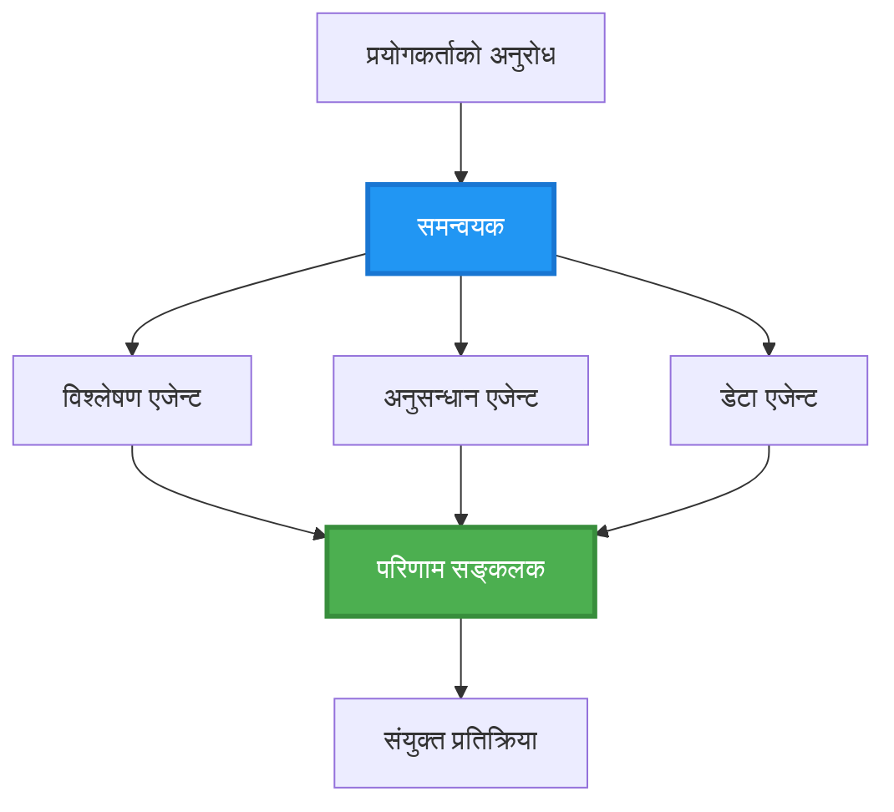
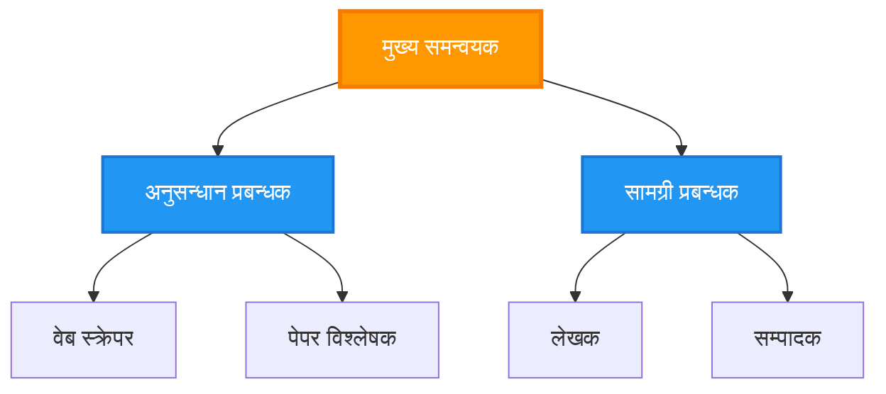
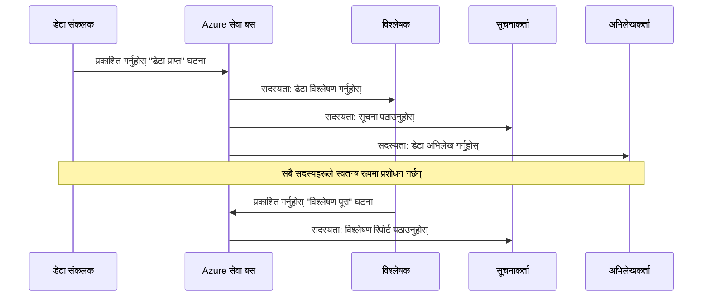
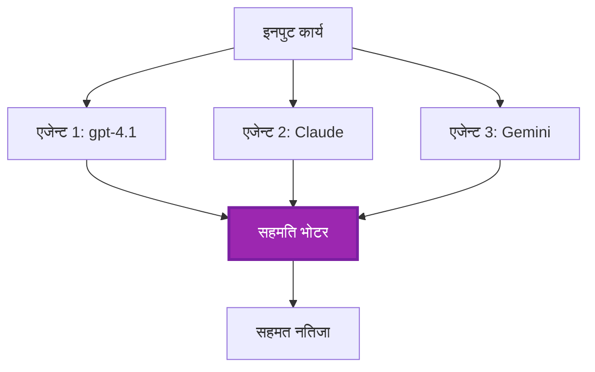
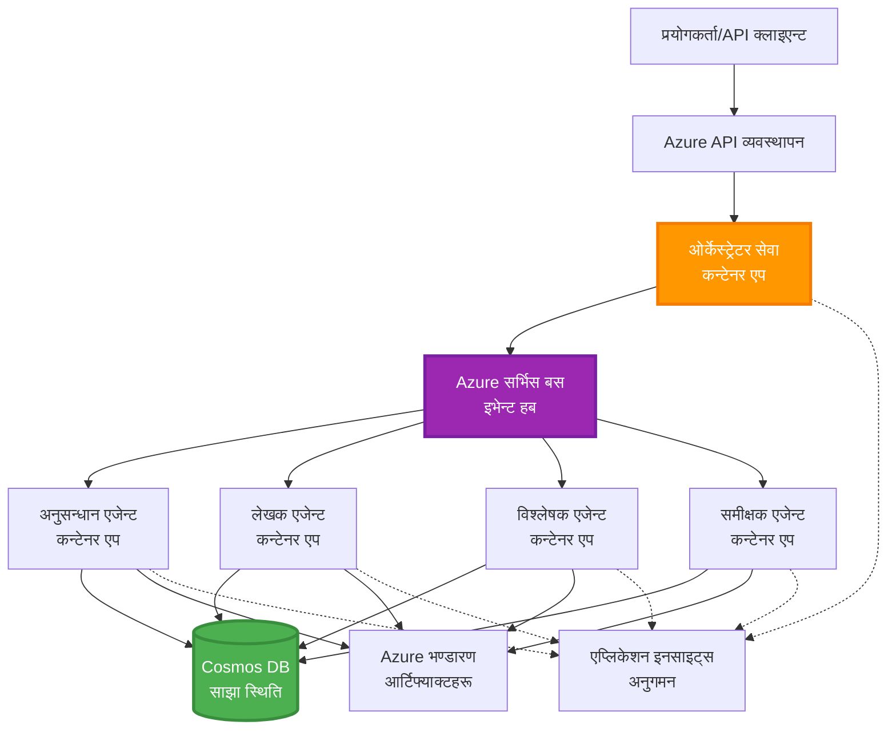

# बहु-एजेन्ट समन्वय ढाँचाहरू

⏱️ **अनुमानित समय**: 60-75 मिनेट | 💰 **अनुमानित लागत**: ~$100-300/महिना | ⭐ **जटिलता**: उन्नत

**📚 सिकाइ मार्ग:**
- ← अघिल्लो: [क्षमता योजना](capacity-planning.md) - स्रोत आकार निर्धारण र स्केलिङ रणनीतिहरू
- 🎯 **तपाईं यहाँ हुनुहुन्छ**: बहु-एजेन्ट समन्वय ढाँचाहरू (ओर्केस्ट्रेशन, संचार, राज्य व्यवस्थापन)
- → अर्को: [SKU चयन](sku-selection.md) - सही Azure सेवाहरू छनौट गर्नु
- 🏠 [कोर्स होम](../../README.md)

---

## तपाईंले के सिक्नुहुनेछ

यो पाठ पूरा गरेपछि, तपाईंले:
- बहु-एजेन्ट वास्तुकला ढाँचाहरू र कहिले प्रयोग गर्ने भन्ने बुझ्ने
- **ओर्केस्ट्रेशन ढाँचाहरू** लागू गर्ने (केन्द्रिकृत, विकेन्द्रिकृत, पदानुक्रमिक)
- **एजेन्ट संचार** रणनीतिहरू डिजाइन गर्ने (सिङ्क्रोनस, एसिङ्क्रोनस, इभेन्ट-ड्राइभन)
- वितरण गरिएको एजेन्टहरू बीच **साझा राज्य** व्यवस्थापन गर्ने
- AZD सँग Azure मा **बहु-एजेन्ट प्रणालीहरू** डिप्लोय गर्ने
- वास्तविक-विश्व AI परिदृश्यहरूको लागि **समन्वय ढाँचाहरू** लागू गर्ने
- वितरण गरिएको एजेन्ट प्रणालीहरू अनुगमन र डिबग गर्ने

## किन बहु-एजेन्ट समन्वय महत्वपूर्ण छ

### विकासक्रम: एकल एजेन्टबाट बहु-एजेन्टसम्म

**एकल एजेन्ट (सहज):**
```
User → Agent → Response
```
- ✅ बुझ्न र लागू गर्न सजिलो
- ✅ साधारण कार्यहरूका लागि छिटो
- ❌ एकल मोडलको क्षमताले सीमित
- ❌ जटिल कार्यहरूमा समानान्तरता गर्न सक्दैन
- ❌ विशेषज्ञता छैन

**बहु-एजेन्ट प्रणाली (उन्नत):**
```mermaid
graph TD
    Orchestrator[समन्वयकर्ता] --> Agent1[एजेन्ट1<br/>योजना]
    Orchestrator --> Agent2[एजेन्ट2<br/>कोड]
    Orchestrator --> Agent3[एजेन्ट3<br/>समीक्षा]
```- ✅ विशिष्ट कार्यहरूका लागि विशेषज्ञ एजेन्टहरू
- ✅ तीव्रता लागि समानान्तर कार्यान्वयन
- ✅ मोड्युलर र मर्मतयोग्य
- ✅ जटिल कार्यप्रवाहहरूमा राम्रो
- ⚠️ समन्वय तर्क आवश्यक

**उपमा**: एकल एजेन्ट एक व्यक्तिले सबै कार्य गर्ने जस्तो हो। बहु-एजेन्ट भनेको टीम जस्तै जहाँ प्रत्येक सदस्यसँग विशेष सीपहरू (अनुसन्धानकर्ता, कोडर, समीक्षक, लेखक) हुन्छन् र सँगै काम गर्छन्।

---

## मुख्य समन्वय ढाँचाहरू

### ढाँचा 1: अनुक्रमिक समन्वय (Chain of Responsibility)

**कहिले प्रयोग गर्ने**: कार्यहरू निश्चित क्रममा पूरा हुनुपर्छ, प्रत्येक एजेन्टले अघिल्लोको आउटपुटमा निर्माण गर्दछ।

```mermaid
sequenceDiagram
    participant User
    participant Orchestrator
    participant Agent1 as अनुसन्धानकर्ता एजेन्ट
    participant Agent2 as लेखक एजेन्ट
    participant Agent3 as सम्पादक एजेन्ट
    
    User->>Orchestrator: "कृत्रिम बुद्धिमत्ता (AI) सम्बन्धी लेख लेख्नुहोस्"
    Orchestrator->>Agent1: अनुसन्धान विषय
    Agent1-->>Orchestrator: अनुसन्धान नतिजा
    Orchestrator->>Agent2: ड्राफ्ट लेख्नुहोस् (अनुसन्धान प्रयोग गरेर)
    Agent2-->>Orchestrator: ड्राफ्ट लेख
    Orchestrator->>Agent3: सम्पादन र सुधार गर्नुहोस्
    Agent3-->>Orchestrator: अन्तिम लेख
    Orchestrator-->>User: परिष्कृत लेख
    
    Note over User,Agent3: क्रमिक: प्रत्येक चरणले अघिल्लोको प्रतीक्षा गर्छ
```
**फाइदाहरू:**
- ✅ स्पष्ट डाटा फ्लो
- ✅ डिबग गर्न सजिलो
- ✅ पूर्वानुमेय कार्यान्वयन क्रम

**सीमाहरू:**
- ❌ ढिलो (समानान्तरता छैन)
- ❌ एउटा असफलताले सम्पूर्ण चेन रोक्छ
- ❌ अन्तरनिर्भर कार्यहरू ह्यान्डल गर्न सक्दैन

**उदाहरण प्रयोग केशहरू:**
- सामग्री सिर्जना पाइपलाइन (अनुसन्धान → लेखन → सम्पादन → प्रकाशन)
- कोड जेनरेसन (योजना → कार्यान्वयन → परीक्षण → डिप्लोय)
- प्रतिवेदन निर्माण (डेटा सङ्कलन → विश्लेषण → भिजुअलाइजेशन → सारांश)

---

### ढाँचा 2: समानान्तर समन्वय (Fan-Out/Fan-In)

**कहिले प्रयोग गर्ने**: स्वतन्त्र कार्यहरू एकैसाथ चलाउन सकिन्छ, परिणामहरू अन्त्यमा संयोजन गरिन्छ।


**फाइदाहरू:**
- ✅ छिटो (समानान्तर कार्यान्वयन)
- ✅ फॉल्ट-टोलरन्ट (आंशिक परिणामहरू स्वीकार्य)
- ✅ क्षैतिज रूपमा स्केल हुन्छ

**सीमाहरू:**
- ⚠️ परिणामहरू आउट-अफ-अर्डर आउन सक्छन्
- ⚠️ एग्रिगेसन तर्क आवश्यक
- ⚠️ जटिल राज्य व्यवस्थापन

**उदाहरण प्रयोग केशहरू:**
- बहु-स्रोत डेटा सङ्कलन (APIs + डेटाबेस + वेब स्क्र्यापिङ)
- प्रतिस्पर्धात्मक विश्लेषण (धेरै मोडेलहरूले समाधान जेनरेट गर्छन्, उत्कृष्ट चयन गरिन्छ)
- अनुवाद सेवाहरू (एकैसाथ धेरै भाषामा अनुवाद)

---

### ढाँचा 3: पदानुक्रमिक समन्वय (Manager-Worker)

**कहिले प्रयोग गर्ने**: उप-कर्महरू भएको जटिल कार्यप्रवाहहरूमा, प्रतिनिधित्व आवश्यक हुन्छ।


**फाइदाहरू:**
- ✅ जटिल कार्यप्रवाहहरू ह्यान्डल गर्दछ
- ✅ मोड्युलर र मर्मतयोग्य
- ✅ स्पष्ट जिम्मेवारी सीमा

**सीमाहरू:**
- ⚠️ बढी जटिल वास्तुकला
- ⚠️ उच्च लेटेन्सी (बहु समन्वय तहहरू)
- ⚠️ परिष्कृत ओर्केस्ट्रेशन आवश्यक

**उदाहरण प्रयोग केशहरू:**
- एन्ड-टु-एन्ड कर्पोरेट दस्तावेज प्रोसेसिङ (वर्गीकरण → मार्गनिर्देशन → प्रक्रिया → आर्काइभ)
- बहु-चरण डेटा पाइपलाइनहरू (इन्जेस्ट → क्लिन → ट्रान्सफर्म → विश्लेषण → रिपोर्ट)
- जटिल स्वचालन कार्यप्रवाहहरू (योजना → स्रोत आवंटन → कार्यान्वयन → अनुगमन)

---

### ढाँचा 4: इभेन्ट-ड्राइभन समन्वय (Publish-Subscribe)

**कहिले प्रयोग गर्ने**: एजेन्टहरूले घटनाहरूमा प्रतिक्रिया दिनुपर्छ, ढिलाइयुक्त कप्लिङ चाहिन्छ।


**फाइदाहरू:**
- ✅ एजेन्टहरू बीच ढिला कप्लिङ (लूज़ कप्लिङ)
- ✅ नयाँ एजेन्टहरू थप्न सजिलो (जस्ट सब्सक्राइब गर्नुहोस्)
- ✅ एसिङ्क्रोनस प्रोसेसिङ
- ✅ प्रत्यास्थ (मेसेज पर्सिस्टेन्स)

**सीमाहरू:**
- ⚠️ अन्ततः सुसंगतता
- ⚠️ जटिल डिबगिङ
- ⚠️ मेसेज अर्डरिङ चुनौतीहरू

**उदाहरण प्रयोग केशहरू:**
- रियल-टाइम मोनिटरिङ सिस्टमहरू (अलर्टहरू, ड्यासबोर्ड, लगहरू)
- बहु-च्यानल सूचना (इमेल, SMS, पुश, Slack)
- डेटा प्रोसेसिङ पाइपलाइनहरू (एकै डेटा का धेरै कन्ज्युमरहरू)

---

### ढाँचा 5: कन्सेन्सस-आधारित समन्वय (Voting/Quorum)

**कहिले प्रयोग गर्ने**: अगाडि बढ्नु अघि धेरै एजेन्टहरूको सहमति आवश्यक पर्दछ।


**फाइदाहरू:**
- ✅ उच्च सटीकता (धेरै विचार)
- ✅ फॉल्ट-टोलरन्ट (माइनोरिटी असफलताहरू स्वीकार्य)
- ✅ गुणस्तर सुनिश्चितता अन्तर्निर्मित

**सीमाहरू:**
- ❌ महँगो (धेरै मोडल कलहरू)
- ❌ ढिलो (सबै एजेन्टहरूको प्रतिक्षा)
- ⚠️ द्वन्द्व समाधान आवश्यक

**उदाहरण प्रयोग केशहरू:**
- सामग्रीModeration (धेरै मोडेलहरूले सामग्री समीक्षा)
- कोड समीक्षा (धेरै लिन्टर/एनालाइजरहरू)
- मेडिकल डायग्नोसिस (धेरै AI मोडेलहरू, विशेषज्ञ प्रमाणीकरण)

---

## वास्तुकला अवलोकन

### Azure मा पूर्ण बहु-एजेन्ट प्रणाली


**प्रमुख कम्पोनेन्टहरू:**

| Component | Purpose | Azure Service |
|-----------|---------|---------------|
| **API Gateway** | प्रवेश बिन्दु, rate limiting, auth | API Management |
| **Orchestrator** | एजेन्ट कार्यप्रवाहहरू समन्वय गर्दछ | Container Apps |
| **Message Queue** | एसिङ्क्रोनस संचार | Service Bus / Event Hubs |
| **Agents** | विशिष्ट AI वर्करहरू | Container Apps / Functions |
| **State Store** | साझा राज्य, कार्य ट्र्याकिङ | Cosmos DB |
| **Artifact Storage** | कागजातहरू, परिणामहरू, लगहरू | Blob Storage |
| **Monitoring** | वितरण गरिएको ट्रेसिङ, लगहरू | Application Insights |

---

## पूर्वआवश्यकताहरू

### आवश्यक टुलहरू

```bash
# सत्यापित गर्नुहोस् Azure Developer CLI
azd version
# ✅ अपेक्षित: azd संस्करण 1.0.0 वा माथि

# सत्यापित गर्नुहोस् Azure CLI
az --version
# ✅ अपेक्षित: azure-cli 2.50.0 वा माथि

# सत्यापित गर्नुहोस् Docker (स्थानीय परीक्षणका लागि)
docker --version
# ✅ अपेक्षित: Docker संस्करण 20.10 वा माथि
```

### Azure आवश्यकता

- सक्रिय Azure सदस्यता
- सिर्जना गर्ने अनुमति:
  - Container Apps
  - Service Bus नामस्थानहरू
  - Cosmos DB खाता
  - Storage खाताहरू
  - Application Insights

### ज्ञान पूर्वआवश्यकताहरू

तपाईंले पूरा गरेको हुनुपर्छ:
- [कन्फिगरेसन व्यवस्थापन](../chapter-03-configuration/configuration.md)
- [प्रमाणीकरण र सुरक्षा](../chapter-03-configuration/authsecurity.md)
- [माइक्रोसर्भिस उदाहरण](../../../../examples/microservices)

---

## कार्यान्वयन गाइड

### प्रोजेक्ट संरचना

```
multi-agent-system/
├── azure.yaml                    # AZD configuration
├── infra/
│   ├── main.bicep               # Main infrastructure
│   ├── core/
│   │   ├── servicebus.bicep     # Message queue
│   │   ├── cosmos.bicep         # State store
│   │   ├── storage.bicep        # Artifact storage
│   │   └── monitoring.bicep     # Application Insights
│   └── app/
│       ├── orchestrator.bicep   # Orchestrator service
│       └── agent.bicep          # Agent template
└── src/
    ├── orchestrator/            # Orchestration logic
    │   ├── app.py
    │   ├── workflows.py
    │   └── Dockerfile
    ├── agents/
    │   ├── research/            # Research agent
    │   ├── writer/              # Writer agent
    │   ├── analyst/             # Analyst agent
    │   └── reviewer/            # Reviewer agent
    └── shared/
        ├── state_manager.py     # Shared state logic
        └── message_handler.py   # Message handling
```

---

## पाठ 1: अनुक्रमिक समन्वय ढाँचा

### कार्यान्वयन: सामग्री सिर्जना पाइपलाइन

आउनुहोस् एक अनुक्रमिक पाइपलाइन बनाउँ: अनुसन्धान → लेखन → सम्पादन → प्रकाशन

### 1. AZD कन्फिगरेसन

**फाइल: `azure.yaml`**

```yaml
name: content-pipeline
metadata:
  template: multi-agent-sequential@1.0.0

services:
  orchestrator:
    project: ./src/orchestrator
    language: python
    host: containerapp
  
  research-agent:
    project: ./src/agents/research
    language: python
    host: containerapp
  
  writer-agent:
    project: ./src/agents/writer
    language: python
    host: containerapp
  
  editor-agent:
    project: ./src/agents/editor
    language: python
    host: containerapp
```

### 2. पूर्वाधार: समन्वयको लागि Service Bus

**फाइल: `infra/core/servicebus.bicep`**

```bicep
param name string
param location string
param tags object = {}

resource serviceBusNamespace 'Microsoft.ServiceBus/namespaces@2022-10-01-preview' = {
  name: name
  location: location
  tags: tags
  sku: {
    name: 'Standard'
    tier: 'Standard'
  }
  properties: {
    minimumTlsVersion: '1.2'
  }
}

// Queue for orchestrator → research agent
resource researchQueue 'Microsoft.ServiceBus/namespaces/queues@2022-10-01-preview' = {
  parent: serviceBusNamespace
  name: 'research-tasks'
  properties: {
    maxDeliveryCount: 3
    lockDuration: 'PT5M'
    deadLetteringOnMessageExpiration: true
  }
}

// Queue for research agent → writer agent
resource writerQueue 'Microsoft.ServiceBus/namespaces/queues@2022-10-01-preview' = {
  parent: serviceBusNamespace
  name: 'writer-tasks'
  properties: {
    maxDeliveryCount: 3
    lockDuration: 'PT5M'
  }
}

// Queue for writer agent → editor agent
resource editorQueue 'Microsoft.ServiceBus/namespaces/queues@2022-10-01-preview' = {
  parent: serviceBusNamespace
  name: 'editor-tasks'
  properties: {
    maxDeliveryCount: 3
    lockDuration: 'PT5M'
  }
}

output namespace string = serviceBusNamespace.name
output connectionString string = listKeys('${serviceBusNamespace.id}/AuthorizationRules/RootManageSharedAccessKey', serviceBusNamespace.apiVersion).primaryConnectionString
```

### 3. साझा राज्य प्रबन्धक

**फाइल: `src/shared/state_manager.py`**

```python
from azure.cosmos import CosmosClient, PartitionKey
from datetime import datetime
import os

class StateManager:
    """Manages shared state across agents using Cosmos DB"""
    
    def __init__(self):
        endpoint = os.environ['COSMOS_ENDPOINT']
        key = os.environ['COSMOS_KEY']
        
        self.client = CosmosClient(endpoint, key)
        self.database = self.client.get_database_client('agent-state')
        self.container = self.database.get_container_client('tasks')
    
    def create_task(self, task_id: str, task_type: str, input_data: dict):
        """Create a new task"""
        task = {
            'id': task_id,
            'type': task_type,
            'status': 'pending',
            'input': input_data,
            'created_at': datetime.utcnow().isoformat(),
            'steps': []
        }
        self.container.create_item(task)
        return task
    
    def update_task_step(self, task_id: str, step_name: str, result: dict):
        """Update task with completed step"""
        task = self.container.read_item(task_id, partition_key=task_id)
        
        task['steps'].append({
            'name': step_name,
            'completed_at': datetime.utcnow().isoformat(),
            'result': result
        })
        
        self.container.replace_item(task_id, task)
        return task
    
    def complete_task(self, task_id: str, final_result: dict):
        """Mark task as complete"""
        task = self.container.read_item(task_id, partition_key=task_id)
        task['status'] = 'completed'
        task['result'] = final_result
        task['completed_at'] = datetime.utcnow().isoformat()
        self.container.replace_item(task_id, task)
        return task
    
    def get_task(self, task_id: str):
        """Retrieve task state"""
        return self.container.read_item(task_id, partition_key=task_id)
```

### 4. ओर्केस्ट्रेटर सेवा

**फाइल: `src/orchestrator/app.py`**

```python
from flask import Flask, request, jsonify
from azure.servicebus import ServiceBusClient, ServiceBusMessage
import json
import uuid
import os
from shared.state_manager import StateManager

app = Flask(__name__)
state_manager = StateManager()

# सर्भिस बस जडान
servicebus_connection_str = os.environ['SERVICEBUS_CONNECTION_STRING']
servicebus_client = ServiceBusClient.from_connection_string(servicebus_connection_str)

@app.route('/health', methods=['GET'])
def health():
    return jsonify({'status': 'healthy', 'service': 'orchestrator'})

@app.route('/create-content', methods=['POST'])
def create_content():
    """
    Sequential workflow: Research → Write → Edit → Publish
    """
    data = request.json
    topic = data.get('topic')
    
    if not topic:
        return jsonify({'error': 'Topic required'}), 400
    
    # स्टेट स्टोरमा कार्य सिर्जना गर्नुहोस्
    task_id = str(uuid.uuid4())
    task = state_manager.create_task(
        task_id=task_id,
        task_type='content_creation',
        input_data={'topic': topic}
    )
    
    # अनुसन्धान एजेन्टलाई सन्देश पठाउनुहोस् (पहिलो चरण)
    sender = servicebus_client.get_queue_sender('research-tasks')
    message = ServiceBusMessage(
        body=json.dumps({
            'task_id': task_id,
            'topic': topic,
            'next_queue': 'writer-tasks'  # नतिजाहरू कहाँ पठाउने
        }),
        content_type='application/json'
    )
    
    with sender:
        sender.send_messages(message)
    
    return jsonify({
        'task_id': task_id,
        'status': 'started',
        'workflow': 'sequential',
        'steps': ['research', 'write', 'edit', 'publish'],
        'message': 'Content creation pipeline initiated'
    }), 202

@app.route('/task/<task_id>', methods=['GET'])
def get_task_status(task_id):
    """Check task status"""
    try:
        task = state_manager.get_task(task_id)
        return jsonify(task)
    except Exception as e:
        return jsonify({'error': str(e)}), 404

if __name__ == '__main__':
    app.run(host='0.0.0.0', port=8080)
```

### 5. अनुसन्धान एजेन्ट

**फाइल: `src/agents/research/app.py`**

```python
from azure.servicebus import ServiceBusClient, ServiceBusMessage
from openai import AzureOpenAI
import json
import os
import time
from shared.state_manager import StateManager

# क्लाइंटहरू प्रारम्भ गर्नुहोस्
state_manager = StateManager()
servicebus_client = ServiceBusClient.from_connection_string(
    os.environ['SERVICEBUS_CONNECTION_STRING']
)

openai_client = AzureOpenAI(
    api_key=os.environ['AZURE_OPENAI_API_KEY'],
    api_version="2024-02-01",
    azure_endpoint=os.environ['AZURE_OPENAI_ENDPOINT']
)

def process_research_task(message_data):
    """Process research request and pass to writer"""
    task_id = message_data['task_id']
    topic = message_data['topic']
    next_queue = message_data['next_queue']
    
    print(f"🔬 Researching: {topic}")
    
    # अनुसन्धानका लागि Microsoft Foundry मोडेलहरू कल गर्नुहोस्
    response = openai_client.chat.completions.create(
        model="gpt-4.1",
        messages=[
            {"role": "system", "content": "You are a research assistant. Provide comprehensive research on the given topic."},
            {"role": "user", "content": f"Research this topic thoroughly: {topic}"}
        ],
        max_tokens=1500
    )
    
    research_results = response.choices[0].message.content
    
    # स्थिति अद्यावधिक गर्नुहोस्
    state_manager.update_task_step(
        task_id=task_id,
        step_name='research',
        result={'research': research_results}
    )
    
    # अर्को एजेन्ट (लेखक) लाई पठाउनुहोस्
    sender = servicebus_client.get_queue_sender(next_queue)
    message = ServiceBusMessage(
        body=json.dumps({
            'task_id': task_id,
            'topic': topic,
            'research': research_results,
            'next_queue': 'editor-tasks'
        }),
        content_type='application/json'
    )
    
    with sender:
        sender.send_messages(message)
    
    print(f"✅ Research complete for task {task_id}")

def main():
    """Listen to research queue"""
    receiver = servicebus_client.get_queue_receiver('research-tasks')
    
    print("🔬 Research Agent started, listening for tasks...")
    
    with receiver:
        while True:
            messages = receiver.receive_messages(max_wait_time=5)
            for message in messages:
                try:
                    message_data = json.loads(str(message))
                    process_research_task(message_data)
                    receiver.complete_message(message)
                except Exception as e:
                    print(f"❌ Error processing message: {e}")
                    receiver.abandon_message(message)

if __name__ == '__main__':
    main()
```

### 6. लेखक एजेन्ट

**फाइल: `src/agents/writer/app.py`**

```python
from azure.servicebus import ServiceBusClient, ServiceBusMessage
from openai import AzureOpenAI
import json
import os
from shared.state_manager import StateManager

state_manager = StateManager()
servicebus_client = ServiceBusClient.from_connection_string(
    os.environ['SERVICEBUS_CONNECTION_STRING']
)

openai_client = AzureOpenAI(
    api_key=os.environ['AZURE_OPENAI_API_KEY'],
    api_version="2024-02-01",
    azure_endpoint=os.environ['AZURE_OPENAI_ENDPOINT']
)

def process_writing_task(message_data):
    """Write article based on research"""
    task_id = message_data['task_id']
    topic = message_data['topic']
    research = message_data['research']
    next_queue = message_data['next_queue']
    
    print(f"✍️ Writing article: {topic}")
    
    # लेख लेख्न Microsoft Foundry मोडेलहरूलाई कल गर्नुहोस्
    response = openai_client.chat.completions.create(
        model="gpt-4.1",
        messages=[
            {"role": "system", "content": "You are a professional writer. Write engaging, well-structured articles."},
            {"role": "user", "content": f"Based on this research:\n\n{research}\n\nWrite a comprehensive article about: {topic}"}
        ],
        max_tokens=2000
    )
    
    article_draft = response.choices[0].message.content
    
    # राज्य अद्यावधिक गर्नुहोस्
    state_manager.update_task_step(
        task_id=task_id,
        step_name='writing',
        result={'draft': article_draft}
    )
    
    # सम्पादकलाई पठाउनुहोस्
    sender = servicebus_client.get_queue_sender(next_queue)
    message = ServiceBusMessage(
        body=json.dumps({
            'task_id': task_id,
            'topic': topic,
            'draft': article_draft
        }),
        content_type='application/json'
    )
    
    with sender:
        sender.send_messages(message)
    
    print(f"✅ Article draft complete for task {task_id}")

def main():
    """Listen to writer queue"""
    receiver = servicebus_client.get_queue_receiver('writer-tasks')
    
    print("✍️ Writer Agent started, listening for tasks...")
    
    with receiver:
        while True:
            messages = receiver.receive_messages(max_wait_time=5)
            for message in messages:
                try:
                    message_data = json.loads(str(message))
                    process_writing_task(message_data)
                    receiver.complete_message(message)
                except Exception as e:
                    print(f"❌ Error: {e}")
                    receiver.abandon_message(message)

if __name__ == '__main__':
    main()
```

### 7. सम्पादक एजेन्ट

**फाइल: `src/agents/editor/app.py`**

```python
from azure.servicebus import ServiceBusClient
from openai import AzureOpenAI
import json
import os
from shared.state_manager import StateManager

state_manager = StateManager()
servicebus_client = ServiceBusClient.from_connection_string(
    os.environ['SERVICEBUS_CONNECTION_STRING']
)

openai_client = AzureOpenAI(
    api_key=os.environ['AZURE_OPENAI_API_KEY'],
    api_version="2024-02-01",
    azure_endpoint=os.environ['AZURE_OPENAI_ENDPOINT']
)

def process_editing_task(message_data):
    """Edit and finalize article"""
    task_id = message_data['task_id']
    topic = message_data['topic']
    draft = message_data['draft']
    
    print(f"📝 Editing article: {topic}")
    
    # सम्पादन गर्न Microsoft Foundry मोडेलहरूलाई कल गर्नुहोस्
    response = openai_client.chat.completions.create(
        model="gpt-4.1",
        messages=[
            {"role": "system", "content": "You are an expert editor. Improve grammar, clarity, and structure."},
            {"role": "user", "content": f"Edit and improve this article:\n\n{draft}"}
        ],
        max_tokens=2000
    )
    
    final_article = response.choices[0].message.content
    
    # कार्यलाई पूरा भएको रूपमा चिन्हित गर्नुहोस्
    state_manager.complete_task(
        task_id=task_id,
        final_result={
            'topic': topic,
            'final_article': final_article,
            'word_count': len(final_article.split())
        }
    )
    
    print(f"✅ Article finalized for task {task_id}")

def main():
    """Listen to editor queue"""
    receiver = servicebus_client.get_queue_receiver('editor-tasks')
    
    print("📝 Editor Agent started, listening for tasks...")
    
    with receiver:
        while True:
            messages = receiver.receive_messages(max_wait_time=5)
            for message in messages:
                try:
                    message_data = json.loads(str(message))
                    process_editing_task(message_data)
                    receiver.complete_message(message)
                except Exception as e:
                    print(f"❌ Error: {e}")
                    receiver.abandon_message(message)

if __name__ == '__main__':
    main()
```

### 8. डिप्लोय र परीक्षण

```bash
# विकल्प A: टेम्पलेट-आधारित तैनाती
azd init
azd up

# विकल्प B: एजेन्ट म्यानिफेस्ट मार्फत तैनाती (एक्सटेन्सन आवश्यक छ)
azd extension install azure.ai.agents
azd ai agent init -m agent-manifest.yaml
azd up
```

> हेर्नुहोस् [AZD AI CLI Commands](../chapter-08-production/production-ai-practices.md#azd-ai-cli-commands-and-extensions) सबै `azd ai` फ्ल्यागहरू र अप्सनहरूको लागि।

```bash
# ओर्केस्ट्रेटरको URL प्राप्त गर्नुहोस्
ORCHESTRATOR_URL=$(azd env get-values | grep ORCHESTRATOR_URL | cut -d '=' -f2 | tr -d '"')

# सामग्री सिर्जना गर्नुहोस्
curl -X POST $ORCHESTRATOR_URL/create-content \
  -H "Content-Type: application/json" \
  -d '{"topic": "The Future of AI in Healthcare"}'
```

**✅ अपेक्षित आउटपुट:**
```json
{
  "task_id": "a1b2c3d4-e5f6-7890-abcd-ef1234567890",
  "status": "started",
  "workflow": "sequential",
  "steps": ["research", "write", "edit", "publish"],
  "message": "Content creation pipeline initiated"
}
```

**कार्य प्रगति जाँच गर्नुहोस्:**
```bash
TASK_ID="a1b2c3d4-e5f6-7890-abcd-ef1234567890"
curl $ORCHESTRATOR_URL/task/$TASK_ID
```

**✅ अपेक्षित आउटपुट (पूरा भयो):**
```json
{
  "id": "a1b2c3d4-e5f6-7890-abcd-ef1234567890",
  "type": "content_creation",
  "status": "completed",
  "steps": [
    {
      "name": "research",
      "completed_at": "2025-11-19T10:30:00Z",
      "result": {"research": "..."}
    },
    {
      "name": "writing",
      "completed_at": "2025-11-19T10:32:00Z",
      "result": {"draft": "..."}
    }
  ],
  "result": {
    "topic": "The Future of AI in Healthcare",
    "final_article": "...",
    "word_count": 1500
  }
}
```

---

## पाठ 2: समानान्तर समन्वय ढाँचा

### कार्यान्वयन: बहु-स्रोत अनुसन्धान एग्रिगेटर

आउनुहोस् एक समानान्तर प्रणाली बनाउने जसले एकै समयमा धेरै स्रोतहरूबाट जानकारी सङ्कलन गर्छ।

### समानान्तर ओर्केस्ट्रेटर

**फाइल: `src/orchestrator/parallel_workflow.py`**

```python
from flask import Flask, request, jsonify
from azure.servicebus import ServiceBusClient, ServiceBusMessage
import json
import uuid
import os
from shared.state_manager import StateManager

app = Flask(__name__)
state_manager = StateManager()

servicebus_client = ServiceBusClient.from_connection_string(
    os.environ['SERVICEBUS_CONNECTION_STRING']
)

@app.route('/research-parallel', methods=['POST'])
def research_parallel():
    """
    Parallel workflow: Multiple agents work simultaneously
    """
    data = request.json
    query = data.get('query')
    
    task_id = str(uuid.uuid4())
    task = state_manager.create_task(
        task_id=task_id,
        task_type='parallel_research',
        input_data={
            'query': query,
            'agents': ['web', 'academic', 'news', 'social']
        }
    )
    
    # फ्यान-आउट: सबै एजेन्टहरूलाई एकैसाथ पठाउनुहोस्
    agents = [
        ('web-research-queue', 'web'),
        ('academic-research-queue', 'academic'),
        ('news-research-queue', 'news'),
        ('social-research-queue', 'social')
    ]
    
    for queue_name, agent_type in agents:
        sender = servicebus_client.get_queue_sender(queue_name)
        message = ServiceBusMessage(
            body=json.dumps({
                'task_id': task_id,
                'query': query,
                'agent_type': agent_type,
                'result_queue': 'aggregation-queue'
            }),
            content_type='application/json'
        )
        
        with sender:
            sender.send_messages(message)
    
    return jsonify({
        'task_id': task_id,
        'status': 'started',
        'workflow': 'parallel',
        'agents_dispatched': 4,
        'message': 'Parallel research initiated'
    }), 202

if __name__ == '__main__':
    app.run(host='0.0.0.0', port=8080)
```

### एग्रिगेसन तर्क

**फाइल: `src/agents/aggregator/app.py`**

```python
from azure.servicebus import ServiceBusClient
import json
import os
from collections import defaultdict
from shared.state_manager import StateManager

state_manager = StateManager()
servicebus_client = ServiceBusClient.from_connection_string(
    os.environ['SERVICEBUS_CONNECTION_STRING']
)

# प्रत्येक कार्यको लागि परिणामहरू ट्र्याक गर्नुहोस्
task_results = defaultdict(list)
expected_agents = 4  # वेब, शैक्षिक, समाचार, सामाजिक

def process_result(message_data):
    """Aggregate results from parallel agents"""
    task_id = message_data['task_id']
    agent_type = message_data['agent_type']
    result = message_data['result']
    
    # परिणाम भण्डारण गर्नुहोस्
    task_results[task_id].append({
        'agent': agent_type,
        'data': result
    })
    
    print(f"📊 Received result from {agent_type} agent ({len(task_results[task_id])}/{expected_agents})")
    
    # सबै एजेन्टहरूले पूरा गरे कि छैनन् जाँच गर्नुहोस् (फ्यान-इन)
    if len(task_results[task_id]) == expected_agents:
        print(f"✅ All agents completed for task {task_id}. Aggregating...")
        
        # परिणामहरू मिलाउनुहोस्
        aggregated = {
            'query': message_data['query'],
            'sources': task_results[task_id],
            'summary': generate_summary(task_results[task_id])
        }
        
        # पूरा भएको चिन्ह लगाउनुहोस्
        state_manager.complete_task(task_id, aggregated)
        
        # सफाइ गर्नुहोस्
        del task_results[task_id]
        
        print(f"✅ Aggregation complete for task {task_id}")

def generate_summary(results):
    """Generate summary from all sources"""
    summaries = [r['data'].get('summary', '') for r in results]
    return '\n\n'.join(summaries)

def main():
    """Listen to aggregation queue"""
    receiver = servicebus_client.get_queue_receiver('aggregation-queue')
    
    print("📊 Aggregator started, listening for results...")
    
    with receiver:
        while True:
            messages = receiver.receive_messages(max_wait_time=5)
            for message in messages:
                try:
                    message_data = json.loads(str(message))
                    process_result(message_data)
                    receiver.complete_message(message)
                except Exception as e:
                    print(f"❌ Error: {e}")
                    receiver.abandon_message(message)

if __name__ == '__main__':
    main()
```

**समानान्तर ढाँचाको फाइदाहरू:**
- ⚡ **4x छिटो** (एजेन्टहरू एकैसाथ चल्छन्)
- 🔄 **फॉल्ट-टोलरन्ट** (आंशिक परिणामहरू स्वीकार्य)
- 📈 **स्केलेबल** (आसानीले थप एजेन्टहरू थप्न सकिन्छ)

---

## व्यवहारिक अभ्यासहरू

### अभ्यास 1: टाइमआउट ह्यान्डलिङ थप्नुहोस् ⭐⭐ (मध्यम)

**लक्ष्य**: एग्रिगेटरले ढिला एजेन्टहरूको लागि सधैं प्रतिक्षा नगरोस् भन्ने टाइमआउट तर्क लागू गर्नुहोस्।

**चरणहरू**:

1. **एग्रिगेटरमा टाइमआउट ट्र्याकिङ थप्नुहोस्:**

```python
from datetime import datetime, timedelta

task_timeouts = {}  # task_id -> expiration_time

def process_result(message_data):
    task_id = message_data['task_id']
    
    # पहिलो नतिजामा टाइमआउट सेट गर्नुहोस्
    if task_id not in task_timeouts:
        task_timeouts[task_id] = datetime.utcnow() + timedelta(seconds=30)
    
    task_results[task_id].append({
        'agent': message_data['agent_type'],
        'data': message_data['result']
    })
    
    # पूरा भएको छ वा टाइमआउट भएको छ कि छैन जाँच गर्नुहोस्
    if len(task_results[task_id]) == expected_agents or \
       datetime.utcnow() > task_timeouts[task_id]:
        
        print(f"📊 Aggregating with {len(task_results[task_id])}/{expected_agents} results")
        
        aggregated = {
            'query': message_data['query'],
            'sources': task_results[task_id],
            'completed_agents': len(task_results[task_id]),
            'timed_out': len(task_results[task_id]) < expected_agents
        }
        
        state_manager.complete_task(task_id, aggregated)
        
        # सफाइ
        del task_results[task_id]
        del task_timeouts[task_id]
```

2. **कृत्रिम ढिलाइहरूसँग परीक्षण गर्नुहोस्:**

```python
# एक एजेन्टमा सुस्त प्रशोधन अनुकरण गर्न ढिलाइ थप्नुहोस्
import time
time.sleep(35)  # 30 सेकेन्डको समयसीमा नाघ्छ
```

3. **डिप्लोय र प्रमाणित गर्नुहोस्:**

```bash
azd deploy aggregator

# कार्य पेश गर्नुहोस्
curl -X POST $ORCHESTRATOR_URL/research-parallel \
  -H "Content-Type: application/json" \
  -d '{"query": "AI safety research"}'

# 30 सेकेन्डपछि नतिजा जाँच गर्नुहोस्
curl $ORCHESTRATOR_URL/task/$TASK_ID
```

**✅ सफलताको मापदण्ड:**
- ✅ एजेन्टहरू अपूर्ण भए पनि 30 सेकेन्डपछि कार्य पूरा हुन्छ
- ✅ प्रतिक्रियाले आंशिक परिणामहरू सूचित गर्छ (`"timed_out": true`)
- ✅ उपलब्ध परिणामहरू फिर्ता गरिन्छ (4 मध्ये 3 एजेन्टहरू)

**समय**: 20-25 मिनेट

---

### अभ्यास 2: रे-ट्राइ तर्क लागू गर्नुहोस् ⭐⭐⭐ (उन्नत)

**लक्ष्य**: असफल एजेन्ट कार्यहरू स्वतः फेरि प्रयास गर्नुपर्छ भन्ने लागू गर्नुहोस्।

**चरणहरू**:

1. **ओर्केस्ट्रेटरमा रे-ट्राइ ट्र्याकिङ थप्नुहोस्:**

```python
from dataclasses import dataclass
from typing import Dict

@dataclass
class RetryConfig:
    max_retries: int = 3
    backoff_seconds: int = 5

retry_counts: Dict[str, int] = {}  # सन्देश_आईडी -> पुनःप्रयास_गिन्ती

def send_with_retry(queue_name: str, message_data: dict, retry_config: RetryConfig):
    """Send message with retry metadata"""
    message_id = message_data.get('message_id', str(uuid.uuid4()))
    message_data['message_id'] = message_id
    message_data['retry_count'] = retry_counts.get(message_id, 0)
    message_data['max_retries'] = retry_config.max_retries
    
    sender = servicebus_client.get_queue_sender(queue_name)
    message = ServiceBusMessage(
        body=json.dumps(message_data),
        content_type='application/json',
        message_id=message_id
    )
    
    with sender:
        sender.send_messages(message)
```

2. **एजेन्टहरूमा रे-ट्राइ ह्यान्डलर थप्नुहोस्:**

```python
def process_with_retry(message, receiver, process_func):
    """Process message with automatic retry on failure"""
    try:
        message_data = json.loads(str(message))
        
        # सन्देश प्रशोधन गर्नुहोस्
        process_func(message_data)
        
        # सफल - पूरा
        receiver.complete_message(message)
        
    except Exception as e:
        message_id = message.message_id
        retry_count = message_data.get('retry_count', 0)
        max_retries = message_data.get('max_retries', 3)
        
        if retry_count < max_retries:
            # पुन: प्रयास: परित्याग गरी बढेको गणनासहित फेरी कतारमा राख्नुहोस्
            print(f"⚠️ Retry {retry_count + 1}/{max_retries} for message {message_id}")
            
            message_data['retry_count'] = retry_count + 1
            
            # उही कतारमा ढिलाइसहित फिर्ता पठाउनुहोस्
            time.sleep(5 * (retry_count + 1))  # घातीय ढिलाइ
            send_with_retry(queue_name, message_data, RetryConfig())
            
            receiver.complete_message(message)  # मूल हटाउनुहोस्
        else:
            # अधिकतम पुनःप्रयास नाघ्यो - डेड लेटर कतारमा सार्नुहोस्
            print(f"❌ Max retries exceeded for message {message_id}")
            receiver.dead_letter_message(
                message,
                reason="MaxRetriesExceeded",
                error_description=str(e)
            )
```

3. **डेड लेटर क्व्यू अनुगमन गर्नुहोस्:**

```python
def monitor_dead_letters():
    """Check dead letter queue for failed messages"""
    receiver = servicebus_client.get_queue_receiver(
        'research-queue',
        sub_queue='deadletter'
    )
    
    with receiver:
        messages = receiver.receive_messages(max_wait_time=5)
        for message in messages:
            print(f"☠️ Dead letter: {message.message_id}")
            print(f"Reason: {message.dead_letter_reason}")
            print(f"Description: {message.dead_letter_error_description}")
```

**✅ सफलताको मापदण्ड:**
- ✅ असफल कार्यहरू स्वचालित रूपमा पुन: प्रयास गरिन्छ (अधिकतम 3 पटक)
- ✅ पुन: प्रयासहरूबीच एक्सपोनेन्सियल ब्याकअफ (5s, 10s, 15s)
- ✅ अधिकतम पुन: प्रयासपछि, मेसेजहरू डेड लेटर क्व्यूमा जान्छन्
- ✅ डेड लेटर क्व्यू अनुगमन र पुन: प्ले गर्न सकिन्छ

**समय**: 30-40 मिनेट

---

### अभ्यास 3: सर्किट ब्रेकर लागू गर्नुहोस् ⭐⭐⭐ (उन्नत)

**लक्ष्य**: असफलता फैलिन नदिन असफल एजेन्टहरूमा अनुरोध रोक्ने।

**चरणहरू**:

1. **सर्किट ब्रेकर क्लास सिर्जना गर्नुहोस्:**

```python
from enum import Enum
from datetime import datetime, timedelta

class CircuitState(Enum):
    CLOSED = "closed"      # सामान्य सञ्चालन
    OPEN = "open"          # विफल हुँदैछ, अनुरोधहरू अस्वीकार गर्नुहोस्
    HALF_OPEN = "half_open"  # सुधारियो कि छैन जाँच गर्दै

class CircuitBreaker:
    def __init__(self, failure_threshold=5, timeout_seconds=60):
        self.failure_threshold = failure_threshold
        self.timeout_seconds = timeout_seconds
        self.failure_count = 0
        self.last_failure_time = None
        self.state = CircuitState.CLOSED
    
    def call(self, func):
        """Execute function with circuit breaker protection"""
        if self.state == CircuitState.OPEN:
            # समयसीमा समाप्त भयो कि छैन जाँच गर्नुहोस्
            if datetime.utcnow() - self.last_failure_time > timedelta(seconds=self.timeout_seconds):
                self.state = CircuitState.HALF_OPEN
                print("🔄 Circuit breaker: HALF_OPEN (testing)")
            else:
                raise Exception(f"Circuit breaker OPEN for agent. Try again in {self.timeout_seconds}s")
        
        try:
            result = func()
            
            # सफलता
            if self.state == CircuitState.HALF_OPEN:
                self.state = CircuitState.CLOSED
                self.failure_count = 0
                print("✅ Circuit breaker: CLOSED (recovered)")
            
            return result
            
        except Exception as e:
            self.failure_count += 1
            self.last_failure_time = datetime.utcnow()
            
            if self.failure_count >= self.failure_threshold:
                self.state = CircuitState.OPEN
                print(f"🔴 Circuit breaker: OPEN (too many failures)")
            
            raise e
```

2. **एजेन्ट कलहरूमा लागू गर्नुहोस्:**

```python
# समन्वयकमा
agent_circuits = {
    'web': CircuitBreaker(failure_threshold=5, timeout_seconds=60),
    'academic': CircuitBreaker(failure_threshold=5, timeout_seconds=60),
    'news': CircuitBreaker(failure_threshold=5, timeout_seconds=60),
    'social': CircuitBreaker(failure_threshold=5, timeout_seconds=60)
}

def send_to_agent(agent_type, message_data):
    """Send with circuit breaker protection"""
    circuit = agent_circuits[agent_type]
    
    try:
        circuit.call(lambda: send_message(agent_type, message_data))
    except Exception as e:
        print(f"⚠️ Skipping {agent_type} agent: {e}")
        # अन्य एजेन्टहरूसँग जारी राख्नुहोस्
```

3. **सर्किट ब्रेकर परीक्षण गर्नुहोस्:**

```bash
# बारम्बार विफलता अनुकरण गर्नुहोस् (एक एजेन्ट रोक्नुहोस्)
az containerapp stop --name web-research-agent --resource-group rg-agents

# धेरै अनुरोधहरू पठाउनुहोस्
for i in {1..10}; do
  curl -X POST $ORCHESTRATOR_URL/research-parallel \
    -H "Content-Type: application/json" \
    -d '{"query": "test query '$i'"}'
  sleep 2
done

# लॉगहरू जाँच गर्नुहोस् - 5 विफलतापछि सर्किट खुल्ला भएको देखिनु पर्छ
# कन्टेनर एपका लगहरूको लागि Azure CLI प्रयोग गर्नुहोस्:
az containerapp logs show --name orchestrator --resource-group $RG_NAME --tail 50
```

**✅ सफलताको मापदण्ड:**
- ✅ 5 असफलतापछि सर्किट खुल्छ (अनुरोधहरू अस्वीकार हुन्छन्)
- ✅ 60 सेकेन्डपछि सर्किट हाफ-ओपन हुन्छ (रिकवरी परीक्षण)
- ✅ अन्य एजेन्टहरू सामान्य रूपमा काम जारी राख्छन्
- ✅ एजेन्ट फेरी रिकभर गर्दा सर्किट स्वचालित रूपमा बन्द हुन्छ

**समय**: 40-50 मिनेट

---

## अनुगमन र डिबगिङ

### Application Insights सँग वितरण गरिएको ट्रेसिङ

**फाइल: `src/shared/tracing.py`**

```python
from opencensus.ext.azure.log_exporter import AzureLogHandler
from opencensus.ext.azure.trace_exporter import AzureExporter
from opencensus.trace import config_integration
from opencensus.trace.tracer import Tracer
from opencensus.trace.samplers import AlwaysOnSampler
import logging
import os

# ट्रेसिङ कन्फिगर गर्नुहोस्
config_integration.trace_integrations(['requests', 'logging'])

connection_string = os.environ.get('APPLICATIONINSIGHTS_CONNECTION_STRING')

# ट्रेसर सिर्जना गर्नुहोस्
tracer = Tracer(
    exporter=AzureExporter(connection_string=connection_string),
    sampler=AlwaysOnSampler()
)

# लगिङ कन्फिगर गर्नुहोस्
logger = logging.getLogger(__name__)
logger.addHandler(AzureLogHandler(connection_string=connection_string))
logger.setLevel(logging.INFO)

def trace_agent_call(agent_name, task_id, operation):
    """Trace agent operations"""
    with tracer.span(name=f'{agent_name}.{operation}') as span:
        span.add_attribute('agent', agent_name)
        span.add_attribute('task_id', task_id)
        span.add_attribute('operation', operation)
        
        try:
            result = operation()
            span.add_attribute('status', 'success')
            return result
        except Exception as e:
            span.add_attribute('status', 'error')
            span.add_attribute('error', str(e))
            raise
```

### Application Insights क्वेरीहरू

**बहु-एजेन्ट कार्यप्रवाहहरू ट्र्याक गर्नुहोस्:**

```kusto
// Trace complete workflow for a task
traces
| where customDimensions.task_id == "a1b2c3d4-..."
| project timestamp, message, customDimensions.agent, customDimensions.operation
| order by timestamp asc
```

**एजेन्ट प्रदर्शन तुलना:**

```kusto
// Compare agent execution times
dependencies
| where name contains "agent"
| summarize 
    avg_duration = avg(duration),
    p95_duration = percentile(duration, 95),
    count = count()
  by agent = tostring(customDimensions.agent)
| order by avg_duration desc
```

**विफलता विश्लेषण:**

```kusto
// Find which agents fail most
exceptions
| where customDimensions.agent != ""
| summarize 
    failure_count = count(),
    unique_errors = dcount(outerMessage)
  by agent = tostring(customDimensions.agent)
| order by failure_count desc
```

---

## लागत विश्लेषण

### बहु-एजेन्ट प्रणाली लागत (मासिक अनुमान)

| Component | Configuration | Cost |
|-----------|--------------|------|
| **Orchestrator** | 1 Container App (1 vCPU, 2GB) | $30-50 |
| **4 Agents** | 4 Container Apps (0.5 vCPU, 1GB each) | $60-120 |
| **Service Bus** | Standard tier, 10M messages | $10-20 |
| **Cosmos DB** | Serverless, 5GB storage, 1M RUs | $25-50 |
| **Blob Storage** | 10GB storage, 100K operations | $5-10 |
| **Application Insights** | 5GB ingestion | $10-15 |
| **Microsoft Foundry Models** | gpt-4.1, 10M tokens | $100-300 |
| **Total** | | **$240-565/month** |

### लागत अनुकूलन रणनीतिहरू

1. **जहाँ सम्भव छ serverless प्रयोग गर्नुहोस्:**
   ```bicep
   // Cosmos DB serverless (no minimum cost)
   properties: {
     databaseAccountOfferType: 'Standard'
     capabilities: [{ name: 'EnableServerless' }]
   }
   ```

2. **एजेन्टहरू idle हुँदा zero मा स्केल गर्नुहोस्:**
   ```bicep
   scale: {
     minReplicas: 0  // Scale to zero when no messages
     maxReplicas: 10
   }
   ```

3. **Service Bus का लागि ब्याचिङ प्रयोग गर्नुहोस्:**
   ```python
   # सन्देशहरू थोकमा पठाउनुहोस् (सस्तो)
   sender.send_messages([message1, message2, message3])
   ```

4. **बारम्बार प्रयोग हुने परिणामहरू क्यास गर्नुहोस्:**
   ```python
   # Azure Cache for Redis प्रयोग गर्नुहोस्
   if cache.exists(query_hash):
       return cache.get(query_hash)
   ```

---

## उत्तम अभ्यासहरू

### ✅ गर्नुहोस्:

1. **Idempotent अपरेसनहरू प्रयोग गर्नुहोस्**
   ```python
   # एजेन्टले उही सन्देशलाई धेरै पटक सुरक्षित रूपमा प्रक्रिया गर्न सक्छ
   def process_task(task_id):
       if state_manager.task_exists(task_id):
           print(f"Task {task_id} already processed, skipping")
           return
       # कार्य प्रक्रिया गरिँदैछ...
   ```

2. **व्यापक लगिङ लागू गर्नुहोस्**
   ```python
   logger.info(f"Agent: {agent_name}, Task: {task_id}, Action: {action}")
   ```

3. **Correlation IDs प्रयोग गर्नुहोस्**
   ```python
   # सम्पूर्ण कार्यप्रवाहभरि task_id लैजानुहोस्
   message_data = {
       'task_id': task_id,  # सहसम्बन्ध ID
       'timestamp': datetime.utcnow().isoformat()
   }
   ```

4. **मेसेज TTL (time-to-live) सेट गर्नुहोस्**
   ```bicep
   properties: {
     defaultMessageTimeToLive: 'PT1H'  // 1 hour max
   }
   ```

5. **डेड लेटर क्व्यूहरूको अनुगमन गर्नुहोस्**
   ```python
   # असफल सन्देशहरूको नियमित अनुगमन
   monitor_dead_letters()
   ```

### ❌ नगर्नुहोस्:

1. **रिङ्कुलर निर्भरताहरू सिर्जना नगर्नुहोस्**
   ```python
   # ❌ खराब: एजेन्ट A → एजेन्ट B → एजेन्ट A (अनन्त लूप)
   # ✅ राम्रो: स्पष्ट निर्देशित चक्ररहित ग्राफ (DAG) परिभाषित गर्नुहोस्
   ```

2. **एजेन्ट थ्रेडहरू ब्लक नगर्नुहोस्**
   ```python
   # ❌ खराब: समकालिक प्रतीक्षा
   while not task_complete:
       time.sleep(1)
   
   # ✅ राम्रो: सन्देश कतारका कलब्याकहरू प्रयोग गर्नुहोस्
   ```

3. **आंशिक असफलताहरूलाई बेवास्ता नगर्नुहोस्**
   ```python
   # ❌ खराब: यदि एउटा एजेन्ट असफल भयो भने सम्पूर्ण कार्यप्रवाह असफल गराउनुहोस्
   # ✅ राम्रो: त्रुटि संकेतकहरूसँग आंशिक परिणाम फर्काउनुहोस्
   ```

4. **अनन्त पुन:प्रयासहरू प्रयोग नगर्नुहोस्**
   ```python
   # ❌ खराब: अनन्तसम्म पुनःप्रयास गर्नु
   # ✅ राम्रो: max_retries = 3, त्यसपछि डेड लेटर
   ```

---

## समस्या निवारण मार्गदर्शिका

### समस्या: सन्देशहरू कतारमा अड्किएका छन्

**लक्षणहरू:**
- सन्देशहरू कतारमा जम्मा हुन्छन्
- एजेन्टहरूले प्रशोधन गरिरहेका छैनन्
- टास्कको स्थिति "pending" मा अड्किएको

**निदान:**
```bash
# कतारको गहिराइ जाँच गर्नुहोस्
az servicebus queue show \
  --namespace-name mybus \
  --name research-tasks \
  --query "countDetails"

# Azure CLI प्रयोग गरेर एजेन्ट लगहरू जाँच गर्नुहोस्
az containerapp logs show --name research-agent --resource-group $RG_NAME --tail 50
```

**समाधानहरू:**

1. **एजेन्ट प्रतिलिपिहरू बढाउनुहोस्:**
   ```bash
   az containerapp update \
     --name research-agent \
     --min-replicas 3 \
     --max-replicas 10
   ```

2. **डेड लेटर कतार जाँच गर्नुहोस्:**
   ```bash
   az servicebus queue show \
     --namespace-name mybus \
     --name research-tasks \
     --query "countDetails.deadLetterMessageCount"
   ```

---

### समस्या: टास्क टाइमआउट / कहिल्यै पूरा हुँदैन

**लक्षणहरू:**
- टास्कको स्थिति "in_progress" मा रहन्छ
- केही एजेन्टहरूले काम पूरा गर्छन्, अन्यहरूले गर्दैनन्
- कुनै त्रुटि सन्देशहरू छैनन्

**निदान:**
```bash
# टास्कको स्थिति जाँच गर्नुहोस्
curl $ORCHESTRATOR_URL/task/$TASK_ID

# Application Insights जाँच गर्नुहोस्
# क्वेरी चलाउनुहोस्: traces | where customDimensions.task_id == "..."
```

**समाधानहरू:**

1. **एग्रिगेटरमा टाइमआउट लागू गर्नुहोस् (व्यायाम 1)**

2. **Azure Monitor प्रयोग गरी एजेन्ट त्रुटिहरू जाँच गर्नुहोस्:**
   ```bash
   # azd monitor मार्फत लगहरू हेर्नुहोस्
   azd monitor --logs
   
   # वा विशिष्ट कन्टेनर एपका लगहरू जाँच्न Azure CLI प्रयोग गर्नुहोस्
   az containerapp logs show --name <agent-name> --resource-group $RG_NAME --follow | grep "ERROR\|FAIL"
   ```

3. **सबै एजेन्टहरू चलिरहेको छन् कि छैनन् जाँच गर्नुहोस्:**
   ```bash
   az containerapp list \
     --resource-group rg-agents \
     --query "[].{name:name, status:properties.runningStatus}"
   ```

---

## थप जान्नुहोस्

### आधिकारिक प्रलेखन
- [Azure Service Bus](https://learn.microsoft.com/azure/service-bus-messaging/service-bus-messaging-overview)
- [Cosmos DB](https://learn.microsoft.com/azure/cosmos-db/introduction)
- [Container Apps DAPR](https://learn.microsoft.com/azure/container-apps/dapr-overview)
- [Multi-Agent Design Patterns](https://learn.microsoft.com/azure/architecture/guide/ai/multi-agent-systems)

### यस कोर्सका अर्को चरणहरू
- ← अघिल्लो: [क्षमता योजना](capacity-planning.md)
- → अर्को: [SKU चयन](sku-selection.md)
- 🏠 [कोर्स गृह](../../README.md)

### सम्बन्धित उदाहरणहरू
- [Microservices Example](../../../../examples/microservices) - सेवा सञ्चार ढाँचा
- [Microsoft Foundry Models Example](../../../../examples/azure-openai-chat) - AI एकीकरण

---

## सारांश

**तपाईंले सिक्नुभयो:**
- ✅ पाँच समन्वय ढाँचाहरू (अनुक्रमिक, समांतर, पदानुक्रमिक, घटना-आधारित, सहमति)
- ✅ Azure मा मल्टि-एजेन्ट आर्किटेक्चर (Service Bus, Cosmos DB, Container Apps)
- ✅ वितरित एजेन्टहरूमा राज्य व्यवस्थापन
- ✅ टाइमआउट ह्यान्डलिङ, पुनःप्रयासहरू, र सर्किट ब्रेकरहरू
- ✅ वितरित प्रणालीहरूको निगरानी र डिबगिङ
- ✅ लागत अनुकूलन रणनीतिहरू

**मुख्य निष्कर्षहरू:**
1. **सही ढाँचा छान्नुहोस्** - आदेशबद्ध वर्कफ्लोहरूको लागि अनुक्रमिक, गति का लागि समांतर, लचकताको लागि घटना-आधारित
2. **राज्यलाई सावधानीपूर्वक व्यवस्थापन गर्नुहोस्** - साझा राज्यका लागि Cosmos DB वा समान प्रयोग गर्नुहोस्
3. **विफलताहरूलाई सुसज्जित तरिकाले सम्हाल्नुहोस्** - टाइमआउट, पुनःप्रयासहरू, सर्किट ब्रेकरहरू, डेड लेटर कतारहरू
4. **सबै कुरा अनुगमन गर्नुहोस्** - डिबगिङका लागि वितरित ट्रेसिङ आवश्यक छ
5. **लागत अनुकूलन गर्नुहोस्** - शून्यसम्म स्केल गर्नुहोस्, सर्वरलेस प्रयोग गर्नुहोस्, क्याचिङ लागू गर्नुहोस्

**अर्को चरणहरू:**
1. व्यावहारिक अभ्यासहरू पूरा गर्नुहोस्
2. तपाईंको प्रयोग केसका लागि मल्टि-एजेन्ट प्रणाली निर्माण गर्नुहोस्
3. प्रदर्शन र लागत अनुकूलन गर्न [SKU चयन](sku-selection.md) अध्ययन गर्नुहोस्

---

<!-- CO-OP TRANSLATOR DISCLAIMER START -->
अस्वीकरण:
यो दस्तावेज AI अनुवाद सेवा [Co-op Translator](https://github.com/Azure/co-op-translator) प्रयोग गरी अनुवाद गरिएको हो। हामी शुद्धताको लागि प्रयास गर्छौं, तर कृपया ध्यान दिनुहोस् कि स्वचालित अनुवादमा त्रुटि वा अशुद्धता हुनसक्छ। मूल दस्तावेजलाई त्यसको मूल भाषामा अधिकारिक स्रोतको रूपमा लिनुहोस्। महत्त्वपूर्ण जानकारीका लागि व्यावसायिक मानवीय अनुवाद सिफारिस गरिन्छ। हामी यस अनुवादको प्रयोगबाट उत्पन्न कुनै पनि गलत बुझाइ वा गलत व्याख्याको लागि उत्तरदायी छैनौं।
<!-- CO-OP TRANSLATOR DISCLAIMER END -->