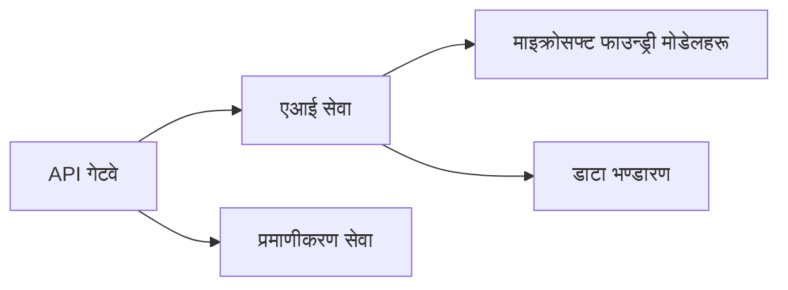
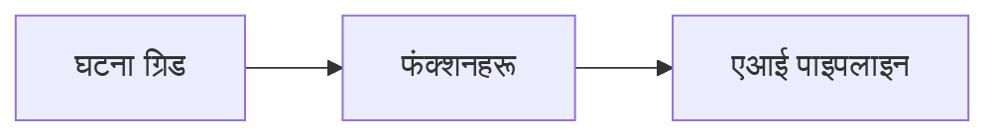

# अध्याय ८: उत्पादन र उद्यम ढाँचाहरू

**📚 पाठ्यक्रम**: [आरम्भकर्ताहरूका लागि AZD](../../README.md) | **⏱️ समय अवधि**: २-३ घण्टा | **⭐ जटिलता**: उन्नत

---

## अवलोकन

यो अध्याय उद्यम तयार तैनाती ढाँचाहरू, सुरक्षा कडाइ, अनुगमन, र उत्पादन AI कामभारहरूको लागत अनुकूलन समेट्छ।

> जुलाई २०२६ मा `azd 1.27.1` विरुद्ध प्रमाणित।

## सिकाइ उद्देश्यहरू

यस अध्याय पूरा गरेर, तपाईं:
- बहु-क्षेत्र लचिलो अनुप्रयोगहरू तैनाथ गर्ने
- उद्यम सुरक्षा ढाँचाहरू लागू गर्ने
- व्यापक अनुगमन कन्फिगर गर्ने
- मापन मा लागत अनुकूलन गर्ने
- AZD सङ्ग CI/CD पाइपलाइन सेटअप गर्ने

---

## 📚 पाठहरू

| # | पाठ | विवरण | समय |
|---|--------|-------------|------|
| १ | [उत्पादन AI अभ्यासहरू](production-ai-practices.md) | उद्यम तैनाती ढाँचाहरू | ९० मिनेट |

---

## 🚀 उत्पादन जाँचसूची

- [ ] लचिलोपना का लागि बहु-क्षेत्र तैनाती
- [ ] प्रमाणिकरण का लागि व्यवस्थापन गरिएको पहिचान (कुनै कुञ्जीहरू छैनन्)
- [ ] अनुगमन का लागि एप्लिकेशन इनसाइट्स
- [ ] लागत बजेटहरू र चेतावनीहरू कन्फिगर गरिएको
- [ ] सुरक्षा स्क्यानिंग सक्षम गरिएको
- [ ] CI/CD पाइपलाइन एकीकरण
- [ ] विपत्ति पुन: प्राप्ति योजना

---

## 🏗️ वास्तुकला ढाँचाहरू

### ढाँचा १: माइक्रोसर्भिस AI



### ढाँचा २: घटना-चालित AI



---

## 🔐 सुरक्षा उत्तम अभ्यासहरू

```bicep
// Use managed identity
identity: {
  type: 'SystemAssigned'
}

// Private endpoints for AI services
properties: {
  publicNetworkAccess: 'Disabled'
  networkAcls: {
    defaultAction: 'Deny'
  }
}
```

---

## 💰 लागत अनुकूलन

| रणनीति | बचत |
|----------|---------|
| शून्यसम्म स्केल (कन्टेनर अनुप्रयोगहरू) | ६०-८०% |
| विकासको लागि खपत स्तरहरू प्रयोग गर्ने | ५०-७०% |
| निर्धारण गरिएको स्केलिङ | ३०-५०% |
| आरक्षित क्षमता | २०-४०% |

```bash
# बजेट चेतावनीहरू सेट गर्नुहोस्
az consumption budget create \
  --budget-name "AI-Budget" \
  --amount 500 \
  --category Cost \
  --time-grain Monthly
```

---

## 📊 अनुगमन सेटअप

```bash
# स्ट्रिम लगहरू
azd monitor --logs

# एप्लिकेसन इनसाइट्स जाँच गर्नुहोस्
azd monitor --overview

# मेट्रिक्स हेर्नुहोस्
az monitor metrics list --resource <resource-id>
```

---

## 🔗 नेभिगेशन

| दिशा | अध्याय |
|-----------|---------|
| **अघिल्लो** | [अध्याय ७: समस्याहरू समाधान गर्ने](../chapter-07-troubleshooting/README.md) |
| **पाठ्यक्रम पूर्ण** | [पाठ्यक्रम गृह](../../README.md) |

---

## 📖 सम्बन्धित स्रोतहरू

- [AI एजेन्ट मार्गदर्शन](../chapter-02-ai-development/agents.md)
- [एप्लिकेशन इनसाइट्स](../chapter-06-pre-deployment/application-insights.md)
- [बहु-एजेन्ट समाधानहरू](../chapter-05-multi-agent/README.md)
- [माइक्रोसर्भिस उदाहरण](../../examples/microservices/README.md)

---

<!-- CO-OP TRANSLATOR DISCLAIMER START -->
**अस्वीकरण**:
यो दस्तावेज़ AI अनुवाद सेवा [Co-op Translator](https://github.com/Azure/co-op-translator) प्रयोग गरेर अनुवाद गरिएको हो। हामी सही हुन प्रयास गर्छौं, तर कृपया जानकार हुनुस् कि स्वचालित अनुवादमा त्रुटिहरू वा अशुद्धताहरू हुन सक्छन्। मूल दस्तावेज़ यसको मूल भाषामा आधिकारिक स्रोत मानिनुपर्छ। महत्वपूर्ण जानकारीका लागि व्यावसायिक मानव अनुवाद सिफारिस गरिन्छ। यस अनुवादको प्रयोगबाट उत्पन्न कुनै पनि गलत बुझाइ वा त्रुटिको लागि हामी जिम्मेवार छैनौं।
<!-- CO-OP TRANSLATOR DISCLAIMER END -->