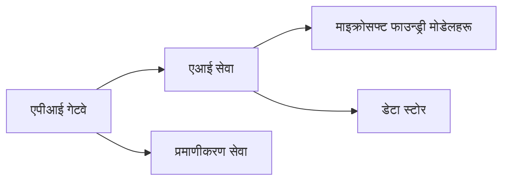
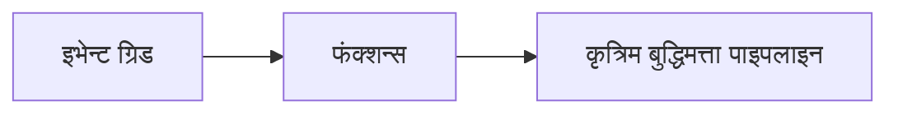

# अध्याय 8: उत्पादन र उद्यम ढाँचाहरू

**📚 पाठ्यक्रम**: [AZD For Beginners](../../README.md) | **⏱️ अवधी**: 2-3 घण्टा | **⭐ जटिलता**: उन्नत

---

## अवलोकन

यो अध्याय उद्यम-तयार तैनाती ढाँचाहरू, सुरक्षा कडाइ, निगरानी, र उत्पादन AI कार्यभारहरूको लागि लागत अनुकूलन समेट्छ।

## सिकाइ उद्देश्यहरू

यो अध्याय पूरा गरेपछि, तपाईँले:
- बहु-क्षेत्र लचिलोपनका लागि अनुप्रयोगहरू तैनाथ गर्न
- उद्यम सुरक्षा ढाँचाहरू कार्यान्वयन गर्न
- व्यापक निगरानी कन्फिगर गर्न
- स्केलमा लागतहरू अनुकूलन गर्न
- AZD सँग CI/CD पाइपलाइन्स सेटअप गर्न

---

## 📚 पाठहरू

| # | पाठ | विवरण | समय |
|---|--------|-------------|------|
| 1 | [उत्पादन AI अभ्यासहरू](production-ai-practices.md) | उद्यम तैनाती ढाँचाहरू | 90 मिनेट |

---

## 🚀 उत्पादन जाँच सूची

- [ ] लचिलोपनका लागि बहु-क्षेत्र तैनाती
- [ ] प्रमाणीकरणका लागि प्रबन्धित पहिचान (कुञ्जीहरू बिना)
- [ ] निगरानीका लागि Application Insights
- [ ] लागत बजेट र अलर्टहरू कन्फिगर गरिएको
- [ ] सुरक्षा स्क्यान सक्षम गरिएको
- [ ] CI/CD पाइपलाइन एकीकरण
- [ ] आपतकालीन पुन:प्राप्ति योजना

---

## 🏗️ आर्किटेक्चर ढाँचाहरू

### ढाँचा 1: माइक्रोसर्भिसेज AI


### ढाँचा 2: इभेन्ट-चालित AI


---

## 🔐 सुरक्षा सर्वोत्तम अभ्यासहरू

```bicep
// Use managed identity
identity: {
  type: 'SystemAssigned'
}

// Private endpoints for AI services
properties: {
  publicNetworkAccess: 'Disabled'
  networkAcls: {
    defaultAction: 'Deny'
  }
}
```

---

## 💰 लागत अनुकूलन

| रणनीति | बचत |
|----------|---------|
| शून्यसम्म स्केल गर्नुहोस् (Container Apps) | 60-80% |
| विकासको लागि खपत टियरहरू प्रयोग गर्नुहोस् | 50-70% |
| अनुसूचित स्केलिङ | 30-50% |
| आरक्षित क्षमता | 20-40% |

```bash
# बजेट अलर्ट सेट गर्नुहोस्
az consumption budget create \
  --budget-name "AI-Budget" \
  --amount 500 \
  --category Cost \
  --time-grain Monthly
```

---

## 📊 निगरानी सेटअप

```bash
# लगहरू स्ट्रिम गर्नुहोस्
azd monitor --logs

# Application Insights जाँच गर्नुहोस्
azd monitor

# मेट्रिक्स हेर्नुहोस्
az monitor metrics list --resource <resource-id>
```

---

## 🔗 नेभिगेसन

| दिशा | अध्याय |
|-----------|---------|
| **अघिल्लो** | [अध्याय 7: समस्या समाधान](../chapter-07-troubleshooting/README.md) |
| **पाठ्यक्रम पूरा** | [पाठ्यक्रम गृहपृष्ठ](../../README.md) |

---

## 📖 सम्बन्धित स्रोतहरू

- [AI Agents Guide](../chapter-02-ai-development/agents.md)
- [Application Insights](../chapter-06-pre-deployment/application-insights.md)
- [Multi-Agent Solutions](../chapter-05-multi-agent/README.md)
- [माइक्रोसर्भिसेज उदाहरण](../../examples/microservices/README.md)

---

<!-- CO-OP TRANSLATOR DISCLAIMER START -->
अस्वीकरण:
यो कागजात AI अनुवाद सेवा [Co-op Translator](https://github.com/Azure/co-op-translator) प्रयोग गरी अनुवाद गरिएको हो। हामी शुद्धताको लागि प्रयासरत भए तापनि, कृपया ध्यान दिनुहोस् कि स्वचालित अनुवादमा त्रुटि वा अशुद्धता हुन सक्छ। मूल कागजातलाई यसको मूल भाषामा आधिकारिक स्रोत मानिनु पर्छ। महत्वपूर्ण जानकारीका लागि पेशेवर मानव अनुवाद सिफारिस गरिन्छ। यस अनुवादको प्रयोगबाट उत्पन्न कुनै पनि गलतफहमी वा गलत व्याख्याका लागि हामी उत्तरदायी हुनेछैनौं।
<!-- CO-OP TRANSLATOR DISCLAIMER END -->