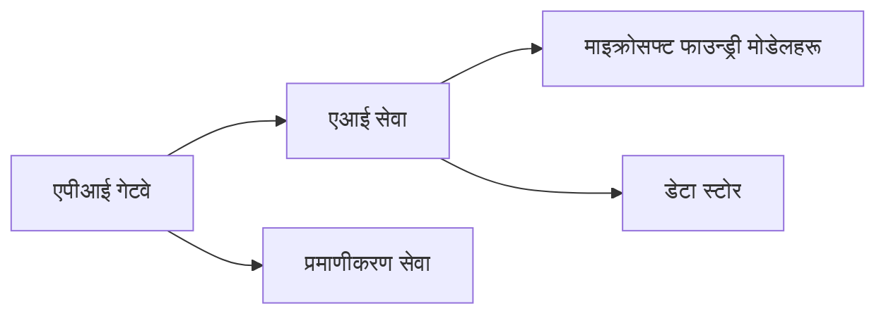
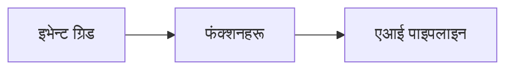

# अध्याय ८: उत्पादन र एंटरप्राइज ढाँचा

**📚 कोर्स**: [AZD आरम्भकर्ताहरूका लागि](../../README.md) | **⏱️ अवधि**: २-३ घण्टा | **⭐ जटिलता**: उन्नत

---

## अवलोकन

यस अध्यायले एंटरप्राइज-तयार परिनियोजन ढाँचाहरू, सुरक्षा कडाइ, अनुगमन, र उत्पादन AI कार्यभारको लागत अनुकूलनलाई समेट्छ।

> मार्च २०२६ मा `azd 1.23.12` विरुद्ध प्रमाणित।

## सिक्ने उद्देश्य

यो अध्याय पूरा गरेपछि, तपाईंले:
- बहु-क्षेत्र पुनरुत्थानशील अनुप्रयोगहरू परिनियोजन गर्ने
- एंटरप्राइज सुरक्षा ढाँचाहरू कार्यान्वयन गर्ने
- व्यापक अनुगमन कन्फिगर गर्ने
- मापनस्तरमा लागत अनुकूलन गर्ने
- AZD सँग CI/CD पाइपलाइन सेटअप गर्ने

---

## 📚 पाठहरू

| # | पाठ | विवरण | समय |
|---|--------|-------------|------|
| १ | [उत्पादन AI अभ्यासहरू](production-ai-practices.md) | एंटरप्राइज परिनियोजन ढाँचाहरू | ९० मिनेट |

---

## 🚀 उत्पादन जाँचसूची

- [ ] पुनरुत्थानशीलता को लागि बहु-क्षेत्र परिनियोजन
- [ ] प्रमाणीकरण को लागि प्रबन्धित पहिचान (कुञ्जीहरू छैनन्)
- [ ] अनुगमन को लागि अनुप्रयोग इनसाइट्स
- [ ] लागत बजेट र सूचनाहरू कन्फिगर गरियो
- [ ] सुरक्षा स्क्यानिंग सक्षम गरियो
- [ ] CI/CD पाइपलाइन एकिकृत गरियो
- [ ] विपत्तिको पुन: प्राप्ति योजना

---

## 🏗️ वास्तुकला ढाँचाहरू

### ढाँचा १: माइक्रोसर्भिस AI


### ढाँचा २: घटना-चालित AI


---

## 🔐 सुरक्षा उत्कृष्ट अभ्यासहरू

```bicep
// Use managed identity
identity: {
  type: 'SystemAssigned'
}

// Private endpoints for AI services
properties: {
  publicNetworkAccess: 'Disabled'
  networkAcls: {
    defaultAction: 'Deny'
  }
}
```

---

## 💰 लागत अनुकूलन

| रणनीति | बचत |
|----------|---------|
| शून्यसम्म स्केल गर्नुहोस् (कन्टेनर अनुप्रयोगहरू) | ६०-८०% |
| विकासको लागि खपत स्तरहरू प्रयोग गर्नुहोस् | ५०-७०% |
| अनुसूचित स्केलिंग | ३०-५०% |
| आरक्षित क्षमता | २०-४०% |

```bash
# बजेट सतर्कता सेट गर्नुहोस्
az consumption budget create \
  --budget-name "AI-Budget" \
  --amount 500 \
  --category Cost \
  --time-grain Monthly
```

---

## 📊 अनुगमन सेटअप

```bash
# प्रवाह लगहरू
azd monitor --logs

# एप्लिकेशन इनसाइट्स जाँच गर्नुहोस्
azd monitor --overview

# मेट्रिक्स हेर्नुहोस्
az monitor metrics list --resource <resource-id>
```

---

## 🔗 नेविगेसन

| दिशा | अध्याय |
|-----------|---------|
| **अघिल्लो** | [अध्याय ७: समस्या समाधान](../chapter-07-troubleshooting/README.md) |
| **कोर्स पूरा भयो** | [कोर्स होम](../../README.md) |

---

## 📖 सम्बन्धित स्रोतहरू

- [AI एजेन्ट गाइड](../chapter-02-ai-development/agents.md)
- [अनुप्रयोग इनसाइट्स](../chapter-06-pre-deployment/application-insights.md)
- [बहु-एजेन्ट समाधानहरू](../chapter-05-multi-agent/README.md)
- [माइक्रोसर्भिस उदाहरण](../../examples/microservices/README.md)

---

<!-- CO-OP TRANSLATOR DISCLAIMER START -->
**अस्वीकरण**:  
यस दस्तावेजलाई AI अनुवाद सेवा [Co-op Translator](https://github.com/Azure/co-op-translator) प्रयोग गरी अनुवाद गरिएको हो। हामी सटीकता तर्फ प्रयासरत छौँ, कृपया ध्यान दिनुहोस् कि स्वचालित अनुवादमा त्रुटिहरु वा अधूरोपनहरु हुन सक्छन्। मूल दस्तावेज यसको मूल भाषामा नै अधिकारिक स्रोत मानिनुपर्छ। महत्वपूर्ण जानकारीको लागि पेशेवर मानव अनुवाद सिफारिस गरिन्छ। यस अनुवादको प्रयोगबाट उत्पन्न कुनै पनि गलतफहमी वा गलत व्याख्याहरूको लागि हामी जिम्मेवार हौंन।
<!-- CO-OP TRANSLATOR DISCLAIMER END -->