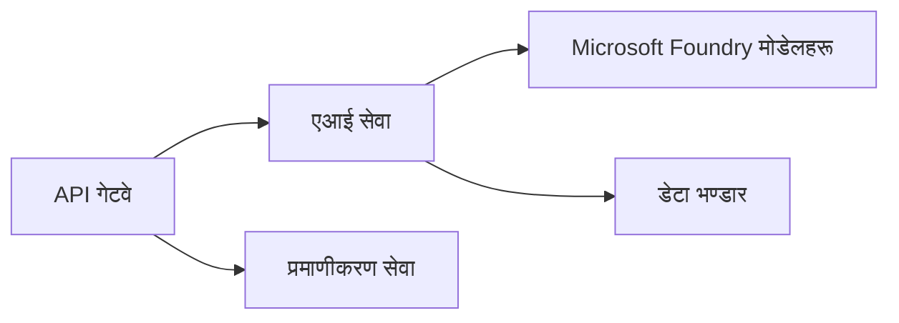

# Chapter 8: उत्पादन र एन्त्रप्राइज ढाँचाहरू

**📚 Course**: [AZD For Beginners](../../README.md) | **⏱️ Duration**: 2-3 घण्टा | **⭐ Complexity**: उन्नत

---

## अवलोकन

यस अध्यायले एन्त्रप्राइज-तयार डिप्लोयमेन्ट ढाँचाहरू, सुरक्षा कडाइ, मोनिटरिङ, र उत्पादन AI वर्कलोडहरूको लागि लागत अनुकूलन समावेश गर्दछ।

> Validated against `azd 1.25.6` जुन २०२६ मा।

## सिकाइ लक्ष्यहरू

यस अध्याय पूरा गरेर, तपाईं:
- बहु-क्षेत्र प्रतिरोधी अनुप्रयोगहरू तैनाथ गर्नुहोस्
- एन्त्रप्राइज सुरक्षा ढाँचाहरू लागू गर्नुहोस्
- व्यापक मोनिटरिङ कन्फिगर गर्नुहोस्
- स्केलमा लागत अनुकूलन गर्नुहोस्
- AZD सँग CI/CD पाइपलाइनहरू सेट अप गर्नुहोस्

---

## 📚 पाठहरू

| # | पाठ | वर्णन | समय |
|---|--------|-------------|------|
| 1 | [Production AI Practices](production-ai-practices.md) | एन्त्रप्राइज तैनाथी ढाँचाहरू | 90 मिनेट |

---

## 🚀 उत्पादन चेकलिष्ट

- [ ] प्रतिरोधका लागि बहु-क्षेत्र तैनाथी
- [ ] प्रमाणिकरणका लागि व्यवस्थापित आइडेन्टीटी (कुञ्जीहरू बिना)
- [ ] मोनिटरिङका लागि Application Insights
- [ ] लागत बजेट र अलर्टहरू कन्फिगर गरिएको
- [ ] सुरक्षा स्क्यानिङ सक्षम गरिएको
- [ ] CI/CD पाइपलाइन एकीकृत गरिएको
- [ ] प्रकोप पुनर्प्राप्ति योजना

---

## 🏗️ आर्किटेक्चर ढाँचाहरू

### ढाँचा 1: माइक्रोसर्भिस AI



### ढाँचा 2: घटना-प्रेरित AI


---

## 🔐 सुरक्षा उत्तम अभ्यासहरू

```bicep
// Use managed identity
identity: {
  type: 'SystemAssigned'
}

// Private endpoints for AI services
properties: {
  publicNetworkAccess: 'Disabled'
  networkAcls: {
    defaultAction: 'Deny'
  }
}
```

---

## 💰 लागत अनुकूलन

| रणनीति | बचत |
|----------|---------|
| शून्यसम्म स्केल गर्नुहोस् (Container Apps) | 60-80% |
| डेभका लागि उपभोग तहहरू प्रयोग गर्नुहोस् | 50-70% |
| तालिकाबद्ध स्केलिङ | 30-50% |
| आरक्षित क्षमता | 20-40% |

```bash
# बजेट अलर्टहरू सेट गर्नुहोस्
az consumption budget create \
  --budget-name "AI-Budget" \
  --amount 500 \
  --category Cost \
  --time-grain Monthly
```

---

## 📊 मोनिटरिङ सेटअप

```bash
# लॉग स्ट्रिम गर्नुहोस्
azd monitor --logs

# Application Insights जाँच गर्नुहोस्
azd monitor --overview

# मेट्रिक्स हेर्नुहोस्
az monitor metrics list --resource <resource-id>
```

---

## 🔗 नेभिगेसन

| दिशा | अध्याय |
|-----------|---------|
| **अघिल्लो** | [अध्याय 7: समस्या निवारण](../chapter-07-troubleshooting/README.md) |
| **कोर्स पूरा** | [कोर्स गृह](../../README.md) |

---

## 📖 सम्बन्धित स्रोतहरू

- [AI Agents Guide](../chapter-02-ai-development/agents.md)
- [Application Insights](../chapter-06-pre-deployment/application-insights.md)
- [Multi-Agent Solutions](../chapter-05-multi-agent/README.md)
- [Microservices Example](../../examples/microservices/README.md)

---

<!-- CO-OP TRANSLATOR DISCLAIMER START -->
**अस्वीकरण**:
यो दस्तावेज़ AI अनुवाद सेवा [Co-op Translator](https://github.com/Azure/co-op-translator) प्रयोग गरेर अनुवाद गरिएको हो। हामी सही हुन प्रयास गर्छौं, तर कृपया जानकार हुनुस् कि स्वचालित अनुवादमा त्रुटिहरू वा अशुद्धताहरू हुन सक्छन्। मूल दस्तावेज़ यसको मूल भाषामा आधिकारिक स्रोत मानिनुपर्छ। महत्वपूर्ण जानकारीका लागि व्यावसायिक मानव अनुवाद सिफारिस गरिन्छ। यस अनुवादको प्रयोगबाट उत्पन्न कुनै पनि गलत बुझाइ वा त्रुटिको लागि हामी जिम्मेवार छैनौं।
<!-- CO-OP TRANSLATOR DISCLAIMER END -->