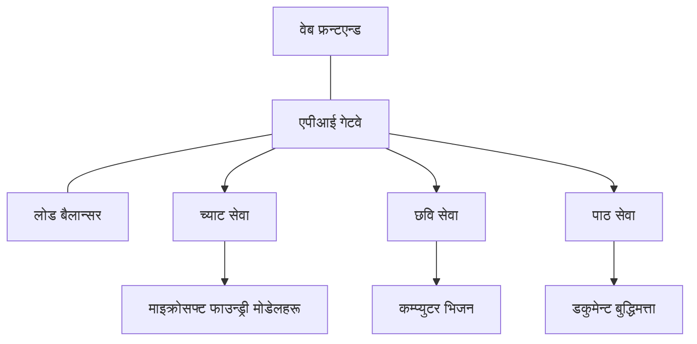

# Production AI Workload Best Practices with AZD

**अध्याय नेभिगेशन:**
- **📚 कोर्स गृह**: [AZD For Beginners](../../README.md)
- **📖 हालको अध्याय**: अध्याय ८ - उत्पादन र उद्यम ढाँचाहरू
- **⬅️ अघिल्लो अध्याय**: [अध्याय ७: समस्यासमाधान](../chapter-07-troubleshooting/debugging.md)
- **⬅️ सम्बन्धित**: [AI कार्यशाला प्रयोगशाला](ai-workshop-lab.md)
- **🎯 कोर्स पूर्ण**: [AZD For Beginners](../../README.md)

## अवलोकन

यो गाइडले Azure Developer CLI (AZD) प्रयोग गरेर उत्पादन-तयार AI कार्यभारहरू तैनाथ गर्नका लागि व्यापक उत्तम अभ्यासहरू प्रदान गर्दछ। Microsoft Foundry Discord समुदाय र वास्तविक ग्राहक तैनाथीहरूको प्रतिक्रिया आधारमा, यी अभ्यासहरूले उत्पादन AI प्रणालीहरूमा भएका सबैभन्दा सामान्य चुनौतीहरू सम्बोधन गर्छन्।

## सम्बोधित मुख्य चुनौतीहरू

हाम्रा समुदाय सर्वेक्षण परिणामहरू अनुसार, यी विकासकर्ताहरूले सामना गर्ने शीर्ष चुनौतीहरू हुन्:

- **४५%** ले बहु-सेवा AI तैनाथीमा कठिनाइ भोगिरहेका छन्
- **३८%** ले प्रमाणपत्र र गुप्त व्यवस्थापनमा समस्याहरू छन्  
- **३५%** ले उत्पादन तत्परता र विस्तार कठिन पाउछन्
- **३२%** ले राम्रो लागत अनुकूलन रणनीतिहरू आवश्यक पाउँछन्
- **२९%** ले सुधारिएको अनुगमन र समस्यासमाधान चाहिन्छ

## उत्पादन AI का लागि वास्तुकला ढाँचाहरू

### ढाँचा १: माइक्रोसर्भिस AI वास्तुकला

**कहिले प्रयोग गर्ने**: जटिल AI अनुप्रयोगहरू जहाँ धेरै क्षमता हुन्छन्


**AZD कार्यान्वयन**:

```yaml
# azure.yaml
name: enterprise-ai-platform
services:
  web:
    project: ./web
    host: staticwebapp
  api-gateway:
    project: ./api-gateway
    host: containerapp
  chat-service:
    project: ./services/chat
    host: containerapp
  vision-service:
    project: ./services/vision
    host: containerapp
  text-service:
    project: ./services/text
    host: containerapp
```

### ढाँचा २: घटनाप्रेरित AI प्रक्रिया

**कहिले प्रयोग गर्ने**: ब्याच प्रक्रिया, कागजात विश्लेषण, असिंक वर्कफ्लोहरू

```bicep
// Event Hub for AI processing pipeline
resource eventHub 'Microsoft.EventHub/namespaces@2023-01-01-preview' = {
  name: eventHubNamespaceName
  location: location
  sku: {
    name: 'Standard'
    tier: 'Standard'
    capacity: 1
  }
}

// Service Bus for reliable message processing
resource serviceBus 'Microsoft.ServiceBus/namespaces@2022-10-01-preview' = {
  name: serviceBusNamespaceName
  location: location
  sku: {
    name: 'Premium'
    tier: 'Premium'
    capacity: 1
  }
}

// Function App for processing
resource functionApp 'Microsoft.Web/sites@2023-01-01' = {
  name: functionAppName
  location: location
  kind: 'functionapp,linux'
  properties: {
    siteConfig: {
      appSettings: [
        {
          name: 'FUNCTIONS_EXTENSION_VERSION'
          value: '~4'
        }
        {
          name: 'AZURE_OPENAI_ENDPOINT'
          value: '@Microsoft.KeyVault(VaultName=${keyVault.name};SecretName=openai-endpoint)'
        }
      ]
    }
  }
}
```

## AI एजेन्ट स्वास्थ्यको बारेमा सोच्नु

जब कुनै पारंपरिक वेब अनुप्रयोग बिग्रन्छ, लक्षणहरू परिचित हुन्छन्: एउटा पृष्ठ लोड हुँदैन, API त्रुटि फर्काउँछ, वा तैनाथी असफल हुन्छ। AI-समर्थित अनुप्रयोगहरू ती सबै तरिकामा बिग्रन सक्छन्—तर तिनीहरू अझ सुक्ष्म तरिकाले पनि खराब व्यवहार गर्न सक्छन् जसले स्पष्ट त्रुटि सन्देशहरू उत्पादन गर्दैन।

यस भागले तपाईंलाई AI कार्यभारहरूको अनुगमनका लागि मानसिक मोडेल बनाउन सहयोग गर्दछ ताकि तपाईंलाई जब कुरा सहि नजस्तो लाग्छ तब कहाँ खोज्ने थाहा होस्।

### एजेन्ट स्वास्थ्य पारंपरिक अनुप्रयोग स्वास्थ्यबाट कसरी फरक हुन्छ

पारंपरिक अनुप्रयोगले काम गर्छ वा गर्दैन। AI एजेन्ट काम गरेको जस्तो देखिन सक्छ तर कमजोर परिणाम उत्पादन गर्न सक्छ। एजेन्ट स्वास्थ्य दुई तहमा सोच्नुहोस्:

| तह | के हेर्ने | कहाँ हेर्ने |
|-------|--------------|---------------|
| **पूर्वाधार स्वास्थ्य** | सेवा चलिरहेको छ? स्रोतहरू उपलब्ध छन्? अन्तर्देशीय पहुँचयोग्य छन्? | `azd monitor`, Azure Portal स्रोत स्वास्थ्य, कन्टेनर/एप्लिकेसन लगहरू |
| **व्यवहार स्वास्थ्य** | एजेन्ट सही प्रतिक्रिया देिरहेको छ? प्रतिक्रिया समयमा छ? मोडल ठीकसँग कल भइरहेको छ? | एप्लिकेसन इन्साइट्स ट्रेसेस, मोडल कल विलम्ब मेट्रिक्स, प्रतिक्रिया गुणस्तर लगहरू |

पूर्वाधार स्वास्थ्य परिचित छ—यो कुनै पनि azd एपका लागि समान हुन्छ। व्यवहार स्वास्थ्य AI कार्यभारहरूले ल्याउने नयाँ तह हो।

### AI एपहरू अपेक्षित जस्तो व्यवहार नगर्दा कहाँ हेर्ने

यदि तपाईंको AI अनुप्रयोगले तपाईंले अपेक्षा गरेको परिणामहरू उत्पादन गरिरहेको छैन भने, यहाँ एक वैचारिक जाँच-सूची छ:

1. **आधारभूत कुरा बाट सुरु गर्नुहोस्।** एप चलिरहेको छ? के यसले आफ्नो निर्भरता पहुँच गर्न सक्छ? कुनै पनि एपमा जस्तै `azd monitor` र स्रोत स्वास्थ्य जाँच गर्नुहोस्।
2. **मोडल कनेक्शन जाँच्नुहोस्।** के तपाईंको अनुप्रयोग सफलतापूर्वक AI मोडललाई कल गर्दैछ? असफल वा टाइमआउट भएका मोडल कलहरू AI एप समस्याको सर्वाधिक सामान्य कारण हुन् र तपाईंको एप लगहरूमा देखिन्छन्।
3. **मोडलले के प्राप्त गर्‍यो हेर्नुहोस्।** AI प्रतिक्रियाहरू इनपुट (प्रॉम्प्ट र कुनै पनि पुनःप्राप्त सन्दर्भ) मा निर्भर गर्दछ। यदि आउटपुट गलत छ भने, इनपुट प्रायः गलत हुन्छ। तपाईंको अनुप्रयोगले मोडलमा सही डेटा पठाइरहेको छ कि छैन जाँच्नुहोस्।
4. **प्रतिक्रिया विलम्ब समीक्षा गर्नुहोस्।** AI मोडल कलहरू सामान्य API कलहरू भन्दा ढिलो हुन्छन्। यदि तपाईंको एप सुस्त महसुस हुन्छ भने, मोडल प्रतिक्रिया समय बढेको छ कि छैन जाँच्नुहोस्—यसले थ्रोटलिंग, क्यापासिटी सीमाहरू, वा क्षेत्रीय स्तरको भीड संकेत गर्न सक्छ।
5. **लागत संकेतहरूमा ध्यान दिनुहोस्।** टोकन प्रयोग वा API कलहरूमा अनपेक्षित उछालहरूले लूप, गलत प्रॉम्प्ट, वा अत्यधिक पुन: प्रयास संकेत गर्न सक्छ।

तपाईंले अवलोकन उपकरणहरू तुरुन्तै मास्टर गर्न आवश्यक छैन। मुख्य कुरा यो हो कि AI अनुप्रयोगसँग नयाँ व्यवहार तह हुन्छ जाँच गर्न, र azd को इम्बेडेड अनुगमन (`azd monitor`) ले दुवै तहहरूको अनुसन्धान सुरु गर्न थाल्ने ठाऊँ दिन्छ।

---

## सुरक्षा उत्तम अभ्यासहरू

### १. शून्य-विश्वास सुरक्षा मोडेल

**कार्यान्वयन रणनीति**:
- प्रमाणीकरण बिना सेवा-सेवा संचार हुँदैन
- सबै API कलहरू प्रबन्धित परिचयहरू प्रयोग गर्छन्
- निजी अन्तर्देशीयहरूको साथ नेटवर्क अलगाव
- न्यूनतम सत्ताधिकार पहुँच नियन्त्रण

```bicep
// Managed Identity for each service
resource chatServiceIdentity 'Microsoft.ManagedIdentity/userAssignedIdentities@2023-01-31' = {
  name: 'chat-service-identity'
  location: location
}

// Role assignments with minimal permissions
resource openAIUserRole 'Microsoft.Authorization/roleAssignments@2022-04-01' = {
  scope: openAIAccount
  name: guid(openAIAccount.id, chatServiceIdentity.id, openAIUserRoleDefinitionId)
  properties: {
    roleDefinitionId: subscriptionResourceId('Microsoft.Authorization/roleDefinitions', '5e0bd9bd-7b93-4f28-af87-19fc36ad61bd')
    principalId: chatServiceIdentity.properties.principalId
    principalType: 'ServicePrincipal'
  }
}
```

### २. सुरक्षित गुप्त व्यवस्थापन

**Key Vault एकीकरण ढाँचा**:

```bicep
// Key Vault with proper access policies
resource keyVault 'Microsoft.KeyVault/vaults@2023-02-01' = {
  name: keyVaultName
  location: location
  properties: {
    tenantId: tenant().tenantId
    sku: {
      family: 'A'
      name: 'premium'  // Use premium for production
    }
    enableRbacAuthorization: true  // Use RBAC instead of access policies
    enablePurgeProtection: true    // Prevent accidental deletion
    enableSoftDelete: true
    softDeleteRetentionInDays: 90
  }
}

// Store all AI service credentials
resource openAIKeySecret 'Microsoft.KeyVault/vaults/secrets@2023-02-01' = {
  parent: keyVault
  name: 'openai-api-key'
  properties: {
    value: openAIAccount.listKeys().key1
    attributes: {
      enabled: true
    }
  }
}
```

### ३. नेटवर्क सुरक्षा

**निजी अन्तर्देशीय कन्फिगरेसन**:

```bicep
// Virtual Network for AI services
resource virtualNetwork 'Microsoft.Network/virtualNetworks@2023-04-01' = {
  name: vnetName
  location: location
  properties: {
    addressSpace: {
      addressPrefixes: ['10.0.0.0/16']
    }
    subnets: [
      {
        name: 'ai-services-subnet'
        properties: {
          addressPrefix: '10.0.1.0/24'
          privateEndpointNetworkPolicies: 'Disabled'
        }
      }
      {
        name: 'app-services-subnet'
        properties: {
          addressPrefix: '10.0.2.0/24'
          delegations: [
            {
              name: 'Microsoft.Web/serverFarms'
              properties: {
                serviceName: 'Microsoft.Web/serverFarms'
              }
            }
          ]
        }
      }
    ]
  }
}

// Private endpoints for all AI services
resource openAIPrivateEndpoint 'Microsoft.Network/privateEndpoints@2023-04-01' = {
  name: '${openAIAccountName}-pe'
  location: location
  properties: {
    subnet: {
      id: virtualNetwork.properties.subnets[0].id
    }
    privateLinkServiceConnections: [
      {
        name: 'openai-connection'
        properties: {
          privateLinkServiceId: openAIAccount.id
          groupIds: ['account']
        }
      }
    ]
  }
}
```

## प्रदर्शन र विस्तार

### १. अटो-स्केलिङ रणनीतिहरू

**कन्टेनर एप्स अटो-स्केलिङ**:

```bicep
resource containerApp 'Microsoft.App/containerApps@2023-05-01' = {
  name: containerAppName
  location: location
  properties: {
    configuration: {
      ingress: {
        external: true
        targetPort: 8000
        transport: 'http'
      }
    }
    template: {
      scale: {
        minReplicas: 2  // Always have 2 instances minimum
        maxReplicas: 50 // Scale up to 50 for high load
        rules: [
          {
            name: 'http-scaling'
            http: {
              metadata: {
                concurrentRequests: '20'  // Scale when >20 concurrent requests
              }
            }
          }
          {
            name: 'cpu-scaling'
            custom: {
              type: 'cpu'
              metadata: {
                type: 'Utilization'
                value: '70'  // Scale when CPU >70%
              }
            }
          }
        ]
      }
    }
  }
}
```

### २. क्यासिङ रणनीतिहरू

**AI प्रतिक्रियाहरूको लागि Redis Cache**:

```bicep
// Redis Premium for production workloads
resource redisCache 'Microsoft.Cache/redis@2023-04-01' = {
  name: redisCacheName
  location: location
  properties: {
    sku: {
      name: 'Premium'
      family: 'P'
      capacity: 1
    }
    enableNonSslPort: false
    minimumTlsVersion: '1.2'
    redisConfiguration: {
      'maxmemory-policy': 'allkeys-lru'
    }
    // Enable clustering for high availability
    redisVersion: '6.0'
    shardCount: 2
  }
}

// Cache configuration in application
var cacheConnectionString = '${redisCache.properties.hostName}:6380,password=${redisCache.listKeys().primaryKey},ssl=True,abortConnect=False'
```

### ३. लोड ब्यालेन्सिङ र ट्राफिक व्यवस्थापन

**WAF सहित एप्लिकेसन गेटवे**:

```bicep
// Application Gateway with Web Application Firewall
resource applicationGateway 'Microsoft.Network/applicationGateways@2023-04-01' = {
  name: appGatewayName
  location: location
  properties: {
    sku: {
      name: 'WAF_v2'
      tier: 'WAF_v2'
      capacity: 2
    }
    webApplicationFirewallConfiguration: {
      enabled: true
      firewallMode: 'Prevention'
      ruleSetType: 'OWASP'
      ruleSetVersion: '3.2'
    }
    // Backend pools for AI services
    backendAddressPools: [
      {
        name: 'ai-services-pool'
        properties: {
          backendAddresses: [
            {
              fqdn: '${containerApp.properties.configuration.ingress.fqdn}'
            }
          ]
        }
      }
    ]
  }
}
```

## 💰 लागत अनुकूलन

### १. स्रोत उचित आकार निर्धारण

**परिवेश-विशिष्ट कन्फिगरेसनहरू**:

```bash
# विकास वातावरण
azd env new development
azd env set AZURE_OPENAI_SKU "S0"
azd env set AZURE_OPENAI_CAPACITY 10
azd env set AZURE_SEARCH_SKU "basic"
azd env set CONTAINER_CPU 0.5
azd env set CONTAINER_MEMORY 1.0

# उत्पादन वातावरण
azd env new production
azd env set AZURE_OPENAI_SKU "S0"
azd env set AZURE_OPENAI_CAPACITY 100
azd env set AZURE_SEARCH_SKU "standard"
azd env set CONTAINER_CPU 2.0
azd env set CONTAINER_MEMORY 4.0
```

### २. लागत अनुगमन र बजेटहरू

```bicep
// Cost management and budgets
resource budget 'Microsoft.Consumption/budgets@2023-05-01' = {
  name: 'ai-workload-budget'
  properties: {
    timePeriod: {
      startDate: '2024-01-01'
      endDate: '2024-12-31'
    }
    timeGrain: 'Monthly'
    amount: 2000  // $2000 monthly budget
    category: 'Cost'
    notifications: {
      warning: {
        enabled: true
        operator: 'GreaterThan'
        threshold: 80
        contactEmails: [
          'finance@company.com'
          'engineering@company.com'
        ]
        contactRoles: [
          'Owner'
          'Contributor'
        ]
      }
      critical: {
        enabled: true
        operator: 'GreaterThan'
        threshold: 95
        contactEmails: [
          'cto@company.com'
        ]
      }
    }
  }
}
```

### ३. टोकन प्रयोग अनुकूलन

**OpenAI लागत व्यवस्थापन**:

```typescript
// अनुप्रयोग-स्तर टोकन अनुकूलन
class TokenOptimizer {
  private readonly maxTokens = 4000;
  private readonly reserveTokens = 500;
  
  optimizePrompt(userInput: string, context: string): string {
    const availableTokens = this.maxTokens - this.reserveTokens;
    const estimatedTokens = this.estimateTokens(userInput + context);
    
    if (estimatedTokens > availableTokens) {
      // सन्दर्भ छोट्याउनुहोस्, प्रयोगकर्ता इनपुट होइन
      context = this.truncateContext(context, availableTokens - this.estimateTokens(userInput));
    }
    
    return `${context}\n\nUser: ${userInput}`;
  }
  
  private estimateTokens(text: string): number {
    // करिब अनुमान: १ टोकन ≈ ४ पात्रहरू
    return Math.ceil(text.length / 4);
  }
}
```

## अनुगमन र अवलोकन

### १. समग्र एप्लिकेसन इन्साइट्स

```bicep
// Application Insights with advanced features
resource applicationInsights 'Microsoft.Insights/components@2020-02-02' = {
  name: applicationInsightsName
  location: location
  kind: 'web'
  properties: {
    Application_Type: 'web'
    WorkspaceResourceId: logAnalyticsWorkspace.id
    SamplingPercentage: 100  // Full sampling for AI apps
    DisableIpMasking: false  // Enable for security
  }
}

// Custom metrics for AI operations
resource aiMetricAlerts 'Microsoft.Insights/metricAlerts@2018-03-01' = {
  name: 'ai-high-error-rate'
  location: 'global'
  properties: {
    description: 'Alert when AI service error rate is high'
    severity: 2
    enabled: true
    scopes: [
      applicationInsights.id
    ]
    evaluationFrequency: 'PT1M'
    windowSize: 'PT5M'
    criteria: {
      'odata.type': 'Microsoft.Azure.Monitor.SingleResourceMultipleMetricCriteria'
      allOf: [
        {
          name: 'high-error-rate'
          metricName: 'requests/failed'
          operator: 'GreaterThan'
          threshold: 10
          timeAggregation: 'Count'
        }
      ]
    }
  }
}
```

### २. AI-विशेष अनुगमन

**AI मेट्रिक्सका लागि अनुकूल ड्यासबोर्डहरू**:

```json
// Dashboard configuration for AI workloads
{
  "dashboard": {
    "name": "AI Application Monitoring",
    "tiles": [
      {
        "name": "OpenAI Request Volume",
        "query": "requests | where name contains 'openai' | summarize count() by bin(timestamp, 5m)"
      },
      {
        "name": "AI Response Latency",
        "query": "requests | where name contains 'openai' | summarize avg(duration) by bin(timestamp, 5m)"
      },
      {
        "name": "Token Usage",
        "query": "customMetrics | where name == 'openai_tokens_used' | summarize sum(value) by bin(timestamp, 1h)"
      },
      {
        "name": "Cost per Hour",
        "query": "customMetrics | where name == 'openai_cost' | summarize sum(value) by bin(timestamp, 1h)"
      }
    ]
  }
}
```

### ३. स्वास्थ्य जाँच र अपटाइम अनुगमन

```bicep
// Application Insights availability tests
resource availabilityTest 'Microsoft.Insights/webtests@2022-06-15' = {
  name: 'ai-app-availability-test'
  location: location
  tags: {
    'hidden-link:${applicationInsights.id}': 'Resource'
  }
  properties: {
    SyntheticMonitorId: 'ai-app-availability-test'
    Name: 'AI Application Availability Test'
    Description: 'Tests AI application endpoints'
    Enabled: true
    Frequency: 300  // 5 minutes
    Timeout: 120    // 2 minutes
    Kind: 'ping'
    Locations: [
      {
        Id: 'us-east-2-azr'
      }
      {
        Id: 'us-west-2-azr'
      }
    ]
    Configuration: {
      WebTest: '''
        <WebTest Name="AI Health Check" 
                 Id="8d2de8d2-a2b0-4c2e-9a0d-8f9c9a0b8c8d" 
                 Enabled="True" 
                 CssProjectStructure="" 
                 CssIteration="" 
                 Timeout="120" 
                 WorkItemIds="" 
                 xmlns="http://microsoft.com/schemas/VisualStudio/TeamTest/2010" 
                 Description="" 
                 CredentialUserName="" 
                 CredentialPassword="" 
                 PreAuthenticate="True" 
                 Proxy="default" 
                 StopOnError="False" 
                 RecordedResultFile="" 
                 ResultsLocale="">
          <Items>
            <Request Method="GET" 
                     Guid="a5f10126-e4cd-570d-961c-cea43999a200" 
                     Version="1.1" 
                     Url="${webApp.properties.defaultHostName}/health" 
                     ThinkTime="0" 
                     Timeout="120" 
                     ParseDependentRequests="True" 
                     FollowRedirects="True" 
                     RecordResult="True" 
                     Cache="False" 
                     ResponseTimeGoal="0" 
                     Encoding="utf-8" 
                     ExpectedHttpStatusCode="200" 
                     ExpectedResponseUrl="" 
                     ReportingName="" 
                     IgnoreHttpStatusCode="False" />
          </Items>
        </WebTest>
      '''
    }
  }
}
```

## विपद् पुनःप्राप्ति र उच्च उपलब्धता

### १. बहु-क्षेत्र तैनाथी

```yaml
# azure.yaml - Multi-region configuration
name: ai-app-multiregion
services:
  api-primary:
    project: ./api
    host: containerapp
    env:
      - AZURE_REGION=eastus
  api-secondary:
    project: ./api
    host: containerapp
    env:
      - AZURE_REGION=westus2
```

```bicep
// Traffic Manager for global load balancing
resource trafficManager 'Microsoft.Network/trafficManagerProfiles@2022-04-01' = {
  name: trafficManagerProfileName
  location: 'global'
  properties: {
    profileStatus: 'Enabled'
    trafficRoutingMethod: 'Priority'
    dnsConfig: {
      relativeName: trafficManagerProfileName
      ttl: 30
    }
    monitorConfig: {
      protocol: 'HTTPS'
      port: 443
      path: '/health'
      intervalInSeconds: 30
      toleratedNumberOfFailures: 3
      timeoutInSeconds: 10
    }
    endpoints: [
      {
        name: 'primary-endpoint'
        type: 'Microsoft.Network/trafficManagerProfiles/azureEndpoints'
        properties: {
          targetResourceId: primaryAppService.id
          endpointStatus: 'Enabled'
          priority: 1
        }
      }
      {
        name: 'secondary-endpoint'
        type: 'Microsoft.Network/trafficManagerProfiles/azureEndpoints'
        properties: {
          targetResourceId: secondaryAppService.id
          endpointStatus: 'Enabled'
          priority: 2
        }
      }
    ]
  }
}
```

### २. डेटा ब्याकअप र पुनःप्राप्ति

```bicep
// Backup configuration for critical data
resource backupVault 'Microsoft.DataProtection/backupVaults@2023-05-01' = {
  name: backupVaultName
  location: location
  identity: {
    type: 'SystemAssigned'
  }
  properties: {
    storageSettings: [
      {
        datastoreType: 'VaultStore'
        type: 'LocallyRedundant'
      }
    ]
  }
}

// Backup policy for AI models and data
resource backupPolicy 'Microsoft.DataProtection/backupVaults/backupPolicies@2023-05-01' = {
  parent: backupVault
  name: 'ai-data-backup-policy'
  properties: {
    policyRules: [
      {
        backupParameters: {
          backupType: 'Full'
          objectType: 'AzureBackupParams'
        }
        trigger: {
          schedule: {
            repeatingTimeIntervals: [
              'R/2024-01-01T02:00:00+00:00/P1D'  // Daily at 2 AM
            ]
          }
          objectType: 'ScheduleBasedTriggerContext'
        }
        dataStore: {
          datastoreType: 'VaultStore'
          objectType: 'DataStoreInfoBase'
        }
        name: 'BackupDaily'
        objectType: 'AzureBackupRule'
      }
    ]
  }
}
```

## DevOps र CI/CD एकीकरण

### १. GitHub Actions वर्कफ्लो

```yaml
# .github/workflows/deploy-ai-app.yml
name: Deploy AI Application

on:
  push:
    branches: [main]
  pull_request:
    branches: [main]

jobs:
  test:
    runs-on: ubuntu-latest
    steps:
      - uses: actions/checkout@v4
      
      - name: Setup Python
        uses: actions/setup-python@v4
        with:
          python-version: '3.11'
          
      - name: Install dependencies
        run: |
          pip install -r requirements.txt
          pip install pytest
          
      - name: Run tests
        run: pytest tests/
        
      - name: AI Safety Tests
        run: |
          python scripts/test_ai_safety.py
          python scripts/validate_prompts.py

  deploy-staging:
    needs: test
    if: github.event_name == 'pull_request'
    runs-on: ubuntu-latest
    steps:
      - uses: actions/checkout@v4
      
      - name: Setup AZD
        uses: Azure/setup-azd@v2
        
      - name: Login to Azure
        uses: azure/login@v1
        with:
          creds: ${{ secrets.AZURE_CREDENTIALS }}
          
      - name: Deploy to Staging
        run: |
          azd env select staging
          azd deploy

  deploy-production:
    needs: test
    if: github.ref == 'refs/heads/main'
    runs-on: ubuntu-latest
    steps:
      - uses: actions/checkout@v4
      
      - name: Setup AZD
        uses: Azure/setup-azd@v2
        
      - name: Login to Azure
        uses: azure/login@v1
        with:
          creds: ${{ secrets.AZURE_CREDENTIALS }}
          
      - name: Deploy to Production
        run: |
          azd env select production
          azd deploy
          
      - name: Run Production Health Checks
        run: |
          python scripts/health_check.py --env production
```

### २. पूर्वाधार प्रमाणीकरण

```bash
# scripts/validate_infrastructure.sh
#!/bin/bash

echo "Validating AI infrastructure deployment..."

# सबै आवश्यक सेवाहरू चलिरहेको छ कि छैन जाँच्नुहोस्
services=("openai" "search" "storage" "keyvault")
for service in "${services[@]}"; do
    echo "Checking $service..."
    if ! az resource list --resource-type "Microsoft.CognitiveServices/accounts" --query "[?contains(name, '$service')]" -o tsv; then
        echo "ERROR: $service not found"
        exit 1
    fi
done

# OpenAI मोडेल डिप्लोयमेन्टहरू मान्य गर्नुहोस्
echo "Validating OpenAI model deployments..."
models=$(az cognitiveservices account deployment list --name $AZURE_OPENAI_NAME --resource-group $AZURE_RESOURCE_GROUP --query "[].name" -o tsv)
if [[ ! $models == *"gpt-4.1-mini"* ]]; then
  echo "ERROR: Required model gpt-4.1-mini not deployed"
    exit 1
fi

# AI सेवा कनेक्टिविटी परीक्षण गर्नुहोस्
echo "Testing AI service connectivity..."
python scripts/test_connectivity.py

echo "Infrastructure validation completed successfully!"
```

## उत्पादन तत्परता जाँच-सूची

### सुरक्षा ✅
- [ ] सबै सेवाहरू प्रबन्धित परिचयहरू प्रयोग गर्छन्
- [ ] गुप्तहरू Key Vault मा सुरक्षित छन्
- [ ] निजी अन्तर्देशीयहरू कन्फिगर गरिएको छ
- [ ] नेटवर्क सुरक्षा समूहहरू लागू गरिएको छ
- [ ] न्यूनतम सत्ताधिकार सहित RBAC
- [ ] सार्वजनिक अन्तर्देशियहरूमा WAF सक्षम गरिएको छ

### प्रदर्शन ✅
- [ ] अटो-स्केलिङ कन्फिगर गरिएको छ
- [ ] क्यासिङ लागू गरिएको छ
- [ ] लोड ब्यालेन्सिङ सेटअप गरिएको छ
- [ ] स्थिर सामग्रीको लागि CDN
- [ ] डाटाबेस कनेक्शन पूलिंग
- [ ] टोकन प्रयोग अनुकूलन

### अनुगमन ✅
- [ ] एप्लिकेसन इन्साइट्स कन्फिगर गरिएको छ
- [ ] अनुकूल मेट्रिक्स परिभाषित गरिएको छ
- [ ] सचेत नियमहरू सेटअप गरिएको छ
- [ ] ड्यासबोर्ड सिर्जना गरिएको छ
- [ ] स्वास्थ्य जाँच लागू गरिएको छ
- [ ] लग संरक्षण नीतिहरू

### विश्वसनीयता ✅
- [ ] बहु-क्षेत्र तैनाथी
- [ ] ब्याकअप र पुनःप्राप्ति योजना
- [ ] सर्किट ब्रेकर लागू गरिएको छ
- [ ] पुन: प्रयास नीतिहरू कन्फिगर गरिएको छ
- [ ] सुस्त गतिको ह्रास
- [ ] स्वास्थ्य जाँच अन्तर्देशियहरू

### लागत व्यवस्थापन ✅
- [ ] बजेट सचेतहरू कन्फिगर गरिएको छ
- [ ] स्रोत उचित आकार निर्धारण
- [ ] विकास/परीक्षण छुटहरू लागू गरिएको छ
- [ ] आरक्षित इन्स्ट्यान्सहरू खरिद गरिएको छ
- [ ] लागत अनुगमन ड्यासबोर्ड
- [ ] नियमित लागत समीक्षा

### अनुपालन ✅
- [ ] डेटा आवास आवश्यकताहरू पूरा गरिएको छ
- [ ] अडिट लगहरू सक्षम गरिएको छ
- [ ] अनुपालन नीतिहरू लागू गरिएको छ
- [ ] सुरक्षा आधारभूत रेखाहरू लागू गरिएको छ
- [ ] नियमित सुरक्षा मूल्यांकनहरू
- [ ] घटनाप्रतिक्रिया योजना

## प्रदर्शन मापन

### सामान्य उत्पादन मेट्रिक्स

| मेट्रिक | लक्ष्य | अनुगमन |
|--------|--------|------------|
| **प्रतिक्रिया समय** | < २ सेकेन्ड | एप्लिकेसन इन्साइट्स |
| **उपलब्धता** | ९९.९% | अपटाइम अनुगमन |
| **त्रुटि दर** | < ०.१% | एप्लिकेसन लगहरू |
| **टोकन प्रयोग** | < $५००/महिना | लागत व्यवस्थापन |
| **समकालीन प्रयोगकर्ता संख्या** | १०००+ | लोड परीक्षण |
| **पुनःप्राप्ति समय** | < १ घण्टा | विपद् पुनःप्राप्ति परीक्षण |

### लोड परीक्षण

```bash
# एआई अनुप्रयोगहरूको लागि लोड परीक्षण स्क्रिप्ट
python scripts/load_test.py \
  --endpoint https://your-ai-app.azurewebsites.net \
  --concurrent-users 100 \
  --duration 300 \
  --ramp-up 60
```

## 🤝 समुदायका उत्तम अभ्यासहरू

Microsoft Foundry Discord समुदायको प्रतिक्रियामा आधारित:

### समुदायबाट शीर्ष सुझावहरू:

१. **सानोतिरबाट सुरु गरी क्रमशः विस्तार गर्नुहोस्**: आधारभूत SKU हरू बाट सुरु गरी वास्तविक प्रयोग अनुसार विस्तार गर्नुहोस्  
२. **सबै कुरा अनुगमन गर्नुहोस्**: दिनको पहिलो दिनदेखि समग्र अनुगमन सेटअप गर्नुहोस्  
३. **सुरक्षा स्वचालित गर्नुहोस्**: निरन्तर सुरक्षा लागि पूर्वाधारलाई कोडको रूपमा प्रयोग गर्नुहोस्  
४. **थोरै परीक्षण गरौं**: तपाईंको पाइपलाइनमा AI-विशेष परीक्षणहरू समावेश गर्नुहोस्  
५. **लागतको योजना बनाउनुहोस्**: टोकन प्रयोग अनुगमन गर्नुहोस् र चाँडै बजेट सचेत सेट गर्नुहोस्  

### सामान्य गल्तीहरू जुन बच्नुपर्छ:

- ❌ कोडमा API कुञ्जीहरू हार्डकोडिङ गर्नु
- ❌ उचित अनुगमन सेटअप नगर्नु
- ❌ लागत अनुकूलनलाई बेवास्ता गर्नु
- ❌ असफलता परिदृश्यहरू परीक्षण नगर्नु
- ❌ स्वास्थ्य जाँच बिना तैनाथ गर्नु

## AZD AI CLI आदेशहरू र विस्तारहरू

AZD मा AI-विशेष आदेशहरू र विस्तारहरू समावेश छन् जसले उत्पादन AI कार्यभारहरू सहज बनाउँछन्। यी उपकरणहरूले स्थानीय विकास र उत्पादन तैनाथी बीचको खाडल पुल गर्छन्।

### AI का लागि AZD विस्तारहरू

AZD ले व्यापकता प्रणाली प्रयोग गर्छ AI-विशेष क्षमताहरू थप्न। विस्तारहरू स्थापना र व्यवस्थापन गर्न:

```bash
# सबै उपलब्ध विस्तारहरू (एआई सहित) सूचीबद्ध गर्नुहोस्
azd extension list

# स्थापना गरिएको विस्तार विवरण जाँच गर्नुहोस्
azd extension show azure.ai.agents

# फाउण्ड्री एजेन्ट्स विस्तार स्थापना गर्नुहोस्
azd extension install azure.ai.agents

# फाइन-ट्यूनिङ विस्तार स्थापना गर्नुहोस्
azd extension install azure.ai.finetune

# कस्टम मोडेलहरू विस्तार स्थापना गर्नुहोस्
azd extension install azure.ai.models

# सबै स्थापना गरिएका विस्तारहरू अपग्रेड गर्नुहोस्
azd extension upgrade --all
```

**उपलब्ध AI विस्तारहरू:**

| विस्तार | उद्देश्य | स्थिति |
|-----------|---------|--------|
| `azure.ai.agents` | Foundry Agent सेवा व्यवस्थापन | पूर्वावलोकन |
| `azure.ai.finetune` | Foundry मोडल फाईन-ट्यूनिङ | पूर्वावलोकन |
| `azure.ai.models` | Foundry कस्टम मोडलहरू | पूर्वावलोकन |
| `azure.coding-agent` | कोडिङ एजेन्ट कन्फिगरेसन | उपलब्ध |

### `azd ai agent init` द्वारा एजेन्ट परियोजनाहरू सुरुवात

`azd ai agent init` आदेश Microsoft Foundry Agent Service सँग एकीकृत उत्पादन-तयार AI एजेन्ट परियोजना स्क्याफोल्ड गर्दछ:

```bash
# एजेन्ट म्यानिफेस्टबाट नयाँ एजेन्ट प्रोजेक्ट सुरु गर्नुहोस्
azd ai agent init -m <manifest-path-or-uri>

# एउटा विशेष फाउन्ड्री प्रोजेक्ट सुरु गर्नुहोस् र लक्ष्य गर्नुहोस्
azd ai agent init -m agent-manifest.yaml --project-id <foundry-project-id>

# अनुकूलित स्रोत निर्देशिका प्रयोग गरेर सुरु गर्नुहोस्
azd ai agent init -m agent-manifest.yaml --src ./agents/my-agent

# होस्टको रूपमा कन्टेनर एप्सलाई लक्षित गर्नुहोस्
azd ai agent init -m agent-manifest.yaml --host containerapp
```

**मुख्य झण्डाहरू:**

| झण्डा | विवरण |
|------|-------------|
| `-m, --manifest` | तपाईंको परियोजनामा थप्न एजेन्ट म्यानिफेस्टको पथ वा URI |
| `-p, --project-id` | तपाईँको azd वातावरणको लागि रहेको Microsoft Foundry परियोजना आईडी |
| `-s, --src` | एजेन्ट परिभाषा डाउनलोड गर्नको लागि डिरेक्टरी (पूर्वनिर्धारित `src/<agent-id>`) |
| `--host` | पूर्वनिर्धारित होस्टलाई ओभरराइड गर्ने (जस्तै, `containerapp`) |
| `-e, --environment` | प्रयोग गर्नको लागि azd वातावरण |

**उत्पादन सुझाव**: `--project-id` प्रयोग गर्नुहोस् ताकि सुरुबाटै तपाईंको एजेन्ट कोड र क्लाउड स्रोतहरू एउटा रहेको Foundry परियोजनामा सिधै जोड्न सकियोस्।

### `azd mcp` संग मोडल प्रसंग प्रोटोकल (MCP)

AZD मा बिल्ट-इन MCP सर्भर समर्थन (अल्फा) छ जसले AI एजेन्ट र उपकरणहरूलाई तपाईंको Azure स्रोतहरूसँग मानकीकृत प्रोटोकलमार्फत अन्तर्क्रिया गर्न सक्षम पार्छ:

```bash
# तपाईंको परियोजनाको लागि MCP सर्भर सुरु गर्नुहोस्
azd mcp start

# उपकरण कार्यान्वयनका लागि हालको Copilot सहमति नियमहरू समीक्षा गर्नुहोस्
azd copilot consent list
```

MCP सर्भरले तपाईंको azd परियोजना प्रसंग—परिवेशहरू, सेवाहरू, र Azure स्रोतहरू—AI-समर्थित विकास उपकरणहरूलाई एक्सपोज गर्दछ। यसले सम्भव बनाउँछ:

- **AI-सहायता प्राप्त तैनाथी**: कोडिङ एजेन्टहरूले तपाईंको परियोजना स्थिति सोध्न र तैनाथी ट्रिगर गर्न सक्छन्  
- **स्रोत पत्ता लगाउने**: AI उपकरणहरूले तपाईंको परियोजनाले कुन Azure स्रोतहरू प्रयोग गर्छ पत्ता लगाउन सक्छन्  
- **परिवेश व्यवस्थापन**: एजेन्टहरूले dev/staging/production परिवेशहरू बीच स्विच गर्न सक्छन्  

### `azd infra generate` संग पूर्वाधार उत्पादन

उत्पादन AI कार्यभारहरूको लागि, तपाईं स्वतः प्रावधानमा निर्भर नरहिदै पूर्वाधारलाई कोडको रूपमा उत्पन्न र अनुकूलित गर्न सक्नुहुन्छ:

```bash
# तपाईंको परियोजना परिभाषाबाट Bicep/Terraform फाइलहरू生成 गर्नुहोस्
azd infra generate
```

यसले डिस्कमा IaC लेख्छ ताकि तपाईंले:
- तैनाथी अगाडि पूर्वाधार समीक्षा र अडिट गर्न सक्नुहुन्छ
- कस्टम सुरक्षा नीतिहरू थप्न सक्नुहुन्छ (नेटवर्क नियमहरू, निजी अन्तर्देशीयहरू)
- अवस्थित IaC समीक्षा प्रक्रियासँग एकीकरण गर्न सक्नुहुन्छ
- अनुप्रयोग कोडबाट अलग पूर्वाधार परिवर्तनहरू संस्करण नियन्त्रण गर्न सक्नुहुन्छ

### उत्पादन जीवनचक्र हुकहरू

AZD हुकहरूले तपाईंलाई तैनाथी जीवनचक्रका प्रत्येक चरणमा अनुकूलित तर्क राख्न अनुमति दिन्छन्—उत्पादन AI वर्कफ्लोहरूको लागि यसले महत्वपूर्ण भूमिका खेल्दछ:

```yaml
# azure.yaml - Production hooks example
name: ai-production-app
hooks:
  preprovision:
    shell: sh
    run: scripts/validate-quotas.sh    # Check AI model quota before provisioning
  postprovision:
    shell: sh
    run: scripts/configure-networking.sh  # Set up private endpoints
  predeploy:
    shell: sh
    run: scripts/run-ai-safety-tests.sh  # Run prompt safety checks
  postdeploy:
    shell: sh
    run: scripts/smoke-test.sh           # Verify agent responses post-deploy
services:
  agent-api:
    project: ./src/agent
    host: containerapp
    hooks:
      predeploy:
        shell: sh
        run: scripts/validate-model-access.sh  # Per-service hook
```

```bash
# विकासको क्रममा विशेष हुकलाई म्यानुअली चलाउनुहोस्
azd hooks run predeploy
```

**AI कार्यभारहरूको लागि सिफारिस गरिएका उत्पादन हुकहरू:**

| हुक | प्रयोग केस |
|------|----------|
| `preprovision` | AI मोडल क्षमता लागि सदस्यता कोटा प्रमाणीकरण गर्नुहोस् |
| `postprovision` | निजी अन्तर्देशीयहरू कन्फिगर गर्नुहोस्, मोडल वजनहरू तैनाथ गर्नुहोस् |
| `predeploy` | AI सुरक्षा परीक्षणहरू चलाउनुहोस्, प्रॉम्प्ट टेम्पलेटहरू प्रमाणीकरण गर्नुहोस् |
| `postdeploy` | एजेन्ट प्रतिक्रियाहरूको स्मोक टेस्ट गर्नुहोस्, मोडल कनेक्टिविटी पुष्टि गर्नुहोस् |

### CI/CD पाइपलाइन कन्फिगरेसन

`azd pipeline config` प्रयोग गरी तपाईंको परियोजनालाई GitHub Actions वा Azure Pipelines सँग सुरक्षित Azure प्रमाणीकरणको साथ जोड्नुहोस्:

```bash
# CI/CD पाइपलाइन कन्फिगर गर्नुहोस् (इन्टेराक्टिभ)
azd pipeline config

# एक विशिष्ट प्रदायकसँग कन्फिगर गर्नुहोस्
azd pipeline config --provider github
```

यस आदेशले:
- न्यूनतम सत्ताधिकार सहित सेवा प्रिन्सिपल बनाउँछ
- फेडरेटेड प्रमाणपत्रहरू कन्फिगर गर्छ (बिना सङ्ग्रहित गुप्तहरू)
- तपाईंको पाइपलाइन परिभाषा फाइल सिर्जना वा अपडेट गर्छ
- तपाईंको CI/CD प्रणालीमा आवश्यक वातावरण चरहरू सेट गर्छ

**पाइपलाइन कन्फिगसहित उत्पादन वर्कफ्लो:**

```bash
# १. उत्पादन वातावरण सेट अप गर्नुहोस्
azd env new production
azd env set AZURE_OPENAI_CAPACITY 100

# २. पाइपलाइन कन्फिगर गर्नुहोस्
azd pipeline config --provider github

# ३. प्रत्येक मुख्यमा पुश गर्दा पाइपलाइनले azd deploy चलाउँछ
```

### `azd add` द्वारा कम्पोनेन्टहरू थप्दै

एक विद्यमान परियोजनामा Azure सेवाहरू क्रमशः थप्न:

```bash
# नयाँ सेवा कम्पोनेंट अन्तरक्रियात्मक रूपमा थप्नुहोस्
azd add
```

यो विशेष गरी उत्पादन AI अनुप्रयोगहरू विस्तार गर्न उपयोगी छ—जस्तै, भेक्टर खोज सेवा थप्ने, नयाँ एजेन्ट अन्तर्देशीय थप्ने, वा विद्यमान तैनाथीमा अनुगमन कम्पोनेन्ट थप्ने।

## अतिरिक्त स्रोतहरू
- **एजुर वेल-आर्किटेक्टेड फ्रेमवर्क**: [AI workload guidance](https://learn.microsoft.com/azure/well-architected/ai/)
- **Microsoft Foundry Documentation**: [Official docs](https://learn.microsoft.com/azure/ai-studio/)
- **समुदाय टेम्पलेटहरू**: [Azure Samples](https://github.com/Azure-Samples)
- **Discord Community**: [#Azure channel](https://discord.gg/microsoft-azure)
- **एजेन्ट सिपहरू एजुरका लागि**: [microsoft/github-copilot-for-azure on skills.sh](https://skills.sh/microsoft/github-copilot-for-azure) - एजुर AI, Foundry, deployment, cost optimization, र diagnostics का लागि 37 खुला एजेन्ट सिपहरू। तपाईंको सम्पादकमा स्थापना गर्नुहोस्:
  ```bash
  npx skills add microsoft/github-copilot-for-azure
  ```

---

**अध्याय नेभिगेसन:**
- **📚 कोर्स होम**: [AZD For Beginners](../../README.md)
- **📖 वर्तमान अध्याय**: अध्याय 8 - उत्पादन र उद्यम ढाँचा
- **⬅️ अघिल्लो अध्याय**: [अध्याय 7: समस्या समाधान](../chapter-07-troubleshooting/debugging.md)
- **⬅️ सम्बन्धित पनि**: [AI कार्यशाला प्रयोगशाला](ai-workshop-lab.md)
- **� कोर्स पूरा भयो**: [AZD For Beginners](../../README.md)

**स्मरण रहोस्**: उत्पादन AI workloads ले सावधानीपूर्वक योजना, अनुगमन, र निरन्तर अनुकूलन आवश्यक पर्दछ। यी ढाँचाहरूबाट सुरु गर्नुहोस् र तिनीहरूलाई तपाईंको विशेष आवश्यकताहरूमा अनुकुल बनाउनुहोस्।

---

<!-- CO-OP TRANSLATOR DISCLAIMER START -->
**अस्वीकरण**:  
यो दस्तावेज AI अनुवाद सेवा [Co-op Translator](https://github.com/Azure/co-op-translator) को प्रयोग गरेर अनुवाद गरिएको हो। हामी सठिकता का लागि प्रयासरत छौं, तर कृत्रिम अनुवादमा त्रुटिहरू वा असत्यताहरु हुन सक्छन्। मूल दस्तावेज यसको स्थानीय भाषामा आधिकारिक स्रोतको रूपमा लिनुपर्छ। महत्वपूर्ण जानकारीका लागि, व्यावसायिक मानव अनुवाद सिफारिस गरिन्छ। यस अनुवादको प्रयोगबाट आउने कुनै पनि गलतफहमि वा गलत व्याख्याका लागि हामी जिम्मेवार छैनौं।
<!-- CO-OP TRANSLATOR DISCLAIMER END -->