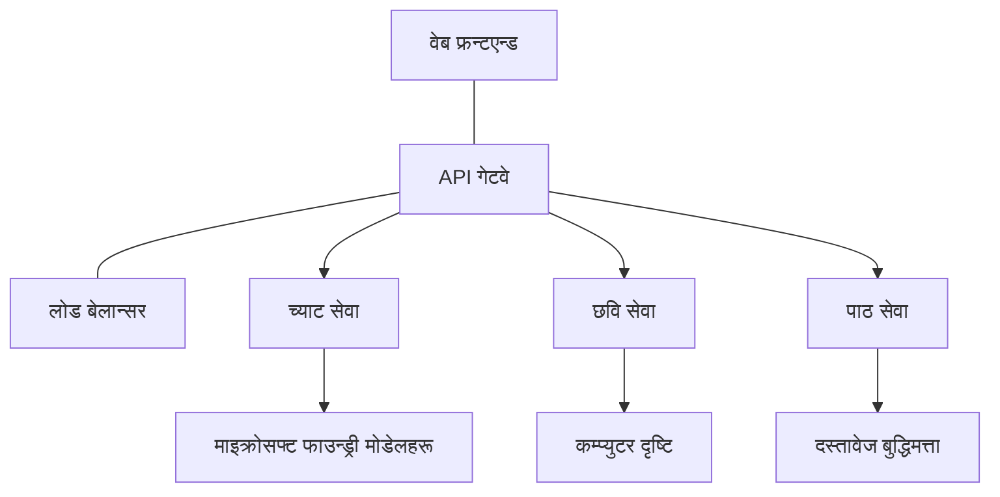

# AZD सँग उत्पादन एआई कार्यभारका लागि उत्तम अभ्यासहरू

**अध्याय नेभिगेसन:**
- **📚 पाठ्यक्रम होम**: [AZD For Beginners](../../README.md)
- **📖 वर्तमान अध्याय**: अध्याय 8 - उत्पादन र उद्यम ढाँचाहरू
- **⬅️ अघिल्लो अध्याय**: [अध्याय 7: समस्या निवारण](../chapter-07-troubleshooting/debugging.md)
- **⬅️ सम्बन्धित**: [AI Workshop Lab](ai-workshop-lab.md)
- **🎯 पाठ्यक्रम पूरा**: [AZD For Beginners](../../README.md)

## अवलोकन

यो मार्गदर्शकले Azure Developer CLI (AZD) प्रयोग गरेर उत्पादन-योग्य एआई कार्यभारहरू परिनियोजन गर्दा सम्पूर्ण रूपमा समेटिएका उत्तम अभ्यासहरू प्रदान गर्दछ। Microsoft Foundry Discord समुदाय र वास्तविक ग्राहक परिनियोजनहरूबाट प्राप्त प्रतिक्रिया अनुसार, यी अभ्यासहरूले उत्पादन एआई प्रणालीहरूमा सबैभन्दा सामान्य चुनौतीहरू सम्बोधन गर्छन्।

## सम्बोधित मुख्य चुनौतीहरू

हाम्रो समुदाय पोल परिणामहरूका आधारमा, विकासकर्ताहरूले सामना गर्ने शीर्ष चुनौतीहरू यी हुन्:

- **45%** बहु-सेवा एआई परिनियोजनसँग संघर्ष गर्छन्
- **38%** प्रमाण-पत्र र गोप्य व्यवस्थापनमा समस्या छन्  
- **35%** उत्पादन-तयारी र स्केलिङ कठिन पाउँछन्
- **32%** लागत अनुकूलन रणनीतिहरू सुधार आवश्यक छ
- **29%** निगरानी र समस्या निवारणमा सुधार चाहिन्छ

## उत्पादन एआई का लागि वास्तुकला ढाँचाहरू

### ढाँचा 1: माइक्रोसर्भिस एआई वास्तुकला

**कहिले प्रयोग गर्ने**: बहु क्षमतासहितका जटिल एआई अनुप्रयोगहरू



**AZD कार्यान्वयन**:

```yaml
# azure.yaml
name: enterprise-ai-platform
services:
  web:
    project: ./web
    host: staticwebapp
  api-gateway:
    project: ./api-gateway
    host: containerapp
  chat-service:
    project: ./services/chat
    host: containerapp
  vision-service:
    project: ./services/vision
    host: containerapp
  text-service:
    project: ./services/text
    host: containerapp
```

### ढाँचा 2: घटना-प्रेरित एआई प्रशोधन

**कहिले प्रयोग गर्ने**: ब्याच प्रशोधन, दस्तावेज विश्लेषण, असिंक्रोनस कार्यप्रवाहहरू

```bicep
// Event Hub for AI processing pipeline
resource eventHub 'Microsoft.EventHub/namespaces@2023-01-01-preview' = {
  name: eventHubNamespaceName
  location: location
  sku: {
    name: 'Standard'
    tier: 'Standard'
    capacity: 1
  }
}

// Service Bus for reliable message processing
resource serviceBus 'Microsoft.ServiceBus/namespaces@2022-10-01-preview' = {
  name: serviceBusNamespaceName
  location: location
  sku: {
    name: 'Premium'
    tier: 'Premium'
    capacity: 1
  }
}

// Function App for processing
resource functionApp 'Microsoft.Web/sites@2023-01-01' = {
  name: functionAppName
  location: location
  kind: 'functionapp,linux'
  properties: {
    siteConfig: {
      appSettings: [
        {
          name: 'FUNCTIONS_EXTENSION_VERSION'
          value: '~4'
        }
        {
          name: 'AZURE_OPENAI_ENDPOINT'
          value: '@Microsoft.KeyVault(VaultName=${keyVault.name};SecretName=openai-endpoint)'
        }
      ]
    }
  }
}
```

## एआई एजेन्टको स्वास्थ्यबारे विचार

परम्परागत वेब अनुप्रयोग टुट्दा लक्षणहरू परिचित हुन्छन्: पृष्ठ लोड हुँदैन, कुनै API त्रुटि फर्काउँछ, वा परिनियोजन असफल हुन्छ। एआई-संचालित अनुप्रयोगहरू यी सबै तरिकाहरूमा टुट्न सक्छन्—तर तिनीहरू सूक्ष्म तरिकाले पनि गलत व्यवहार गर्न सक्छन् जसले स्पष्ट त्रुटि सन्देशहरू उत्पन्न गर्दैन।

यस भागले तपाईंलाई एआई कार्यभारहरूको निगरानीका लागि मानसिक मोडेल बनाउन मद्दत गर्छ ताकि जब चीजहरू ठीक हुँदैनन् तब कहाँ हेर्ने भनेर थाहा होस्।

### कसरी एजेन्ट स्वास्थ्य परम्परागत अनुप्रयोग स्वास्थ्यबाट फरक हुन्छ

परम्परागत एप वा त काम गर्छ वा गर्दैन। एआई एजेन्ट काम गरिरहेको जस्तो देखिन सक्छ तर कमजोर नतिजा दिन सक्छ। एजेन्ट स्वास्थ्यलाई दुई तहमा विचार गर्नुहोस्:

| तह | के हेर्ने | कहाँ हेर्ने |
|-------|--------------|---------------|
| **पूर्वाधार स्वास्थ्य** | सेवा चलिरहेको छ? के स्रोतहरू प्रावधान गरिएका छन्? के एन्डपोइन्टहरू पहुँचयोग्य छन्? | `azd monitor`, Azure Portal मा रिसोर्स स्वास्थ्य, कन्टेनर/एप लगहरू |
| **व्यवहार स्वास्थ्य** | एजेन्टले ठीक उत्तर दिइरहेको छ? के प्रतिक्रियाहरू समयमै आइरहेका छन्? के मोडेललाई सही तरिकाले कल गरिएको छ? | Application Insights ट्रेसहरू, मोडेल कल लेटेन्सी मेट्रिक्स, प्रतिक्रिया गुणस्तर लगहरू |

पूर्वाधार स्वास्थ्य परिचित छ—यो कुनै पनि azd एपको लागि समान हो। व्यवहार स्वास्थ्य एआई कार्यभारहरूले परिचय गराउने नयाँ तह हो।

### जब एआई एपहरू अपेक्षाअनुसार व्यवहार गर्दैनन् तब कहाँ हेर्ने

यदि तपाईंको एआई अनुप्रयोगले अपेक्षित नतिजा दिन्न भने, यहाँ एक सारांश जाँचसूची छ:

1. **आधारभूत भाषाबाट सुरु गर्नुहोस्।** के एप चलिरहेको छ? के यसले आफ्ना आश्रित सेवाहरूमा पहुँच गर्न सक्छ? कुनै पनि एप जस्तै `azd monitor` र रिसोर्स स्वास्थ्य जाँच गर्नुहोस्।
2. **मोडेल कनेक्शन जाँच गर्नुहोस्।** के तपाईंको अनुप्रयोग सफलतापूर्वक एआई मोडेललाई कल गरिरहेको छ? असफल वा टाइमआउट भएका मोडेल कलहरू एआई एप समस्याहरूको सबैभन्दा सामान्य कारण हुन् र तपाईंको अनुप्रयोग लगहरूमा देखिनेछन्।
3. **हेर्नुहोस् मोडेलले के प्राप्त गर्‍यो।** एआई प्रतिक्रियाहरू इनपुट (प्रम्प्ट र कुनै पनि पुनःप्राप्त सन्दर्भ) मा निर्भर गर्छन्। यदि आउटपुट गलत छ भने, सामान्यतया इनपुट गलत हुन्छ। जाँच गर्नुहोस् कि तपाईंको अनुप्रयोग मोडेलमा सही डेटा पठाइरहेको छ कि छैन।
4. **प्रतिक्रिया लेटेन्सी समीक्षा गर्नुहोस्।** एआई मोडेल कलहरू सामान्य API कलहरू भन्दा ढिला हुन्छन्। यदि तपाईंको एप सुस्त लाग्छ भने, मोडेल प्रतिक्रिया समयहरू बढेको छ कि छैन जाँच गर्नुहोस्—यसले थ्रोटलिङ, क्षमता सीमाहरू, वा क्षेत्र-स्तरको भीड जनाउन सक्छ।
5. **लागत संकेतहरूमा नजर राख्नुहोस्।** टोकन प्रयोग वा API कलहरूमा अनपेक्षित उछालले लूप, गलत कन्फिगर गरिएको प्रम्प्ट, वा अत्यधिक रिट्राइहरूको संकेत दिन सक्छ।

तपाईंले तुरुन्तै अवलोकन उपकरणको मास्टरी गर्न आवश्यक छैन। प्रमुख कुरा भनेको एआई अनुप्रयोगहरूमा निगरानी गर्नुपर्ने अतिरिक्त व्यवहार तह हुन्छ, र azd को बिल्ट-इन निगरानी (`azd monitor`) ले दुबै तहको अन्वेषणका लागि सुरुवात बिन्दु दिन्छ।

---

## सुरक्षा उत्तम अभ्यासहरू

### 1. शून्य-विश्वास सुरक्षा मोडेल

**कार्यान्वयन रणनीति**:
- प्रमाणीकरण बिना कुनै सेवा-देखि-सेवा सञ्चार हुँदैन
- सबै API कलहरू managed identities प्रयोग गरियोस्
- निजी एन्डपॉइन्टहरूसँग सञ्जाल पृथकीकरण
- न्यूनतम विशेषाधिकार पहुँच नियन्त्रणहरू

```bicep
// Managed Identity for each service
resource chatServiceIdentity 'Microsoft.ManagedIdentity/userAssignedIdentities@2023-01-31' = {
  name: 'chat-service-identity'
  location: location
}

// Role assignments with minimal permissions
resource openAIUserRole 'Microsoft.Authorization/roleAssignments@2022-04-01' = {
  scope: openAIAccount
  name: guid(openAIAccount.id, chatServiceIdentity.id, openAIUserRoleDefinitionId)
  properties: {
    roleDefinitionId: subscriptionResourceId('Microsoft.Authorization/roleDefinitions', '5e0bd9bd-7b93-4f28-af87-19fc36ad61bd')
    principalId: chatServiceIdentity.properties.principalId
    principalType: 'ServicePrincipal'
  }
}
```

### 2. सुरक्षित गोप्य व्यवस्थापन

**Key Vault एकीकरण ढाँचा**:

```bicep
// Key Vault with proper access policies
resource keyVault 'Microsoft.KeyVault/vaults@2023-02-01' = {
  name: keyVaultName
  location: location
  properties: {
    tenantId: tenant().tenantId
    sku: {
      family: 'A'
      name: 'premium'  // Use premium for production
    }
    enableRbacAuthorization: true  // Use RBAC instead of access policies
    enablePurgeProtection: true    // Prevent accidental deletion
    enableSoftDelete: true
    softDeleteRetentionInDays: 90
  }
}

// Store all AI service credentials
resource openAIKeySecret 'Microsoft.KeyVault/vaults/secrets@2023-02-01' = {
  parent: keyVault
  name: 'openai-api-key'
  properties: {
    value: openAIAccount.listKeys().key1
    attributes: {
      enabled: true
    }
  }
}
```

### 3. नेटवर्क सुरक्षा

**निजी एन्डपॉइन्ट कन्फिगरेसन**:

```bicep
// Virtual Network for AI services
resource virtualNetwork 'Microsoft.Network/virtualNetworks@2023-04-01' = {
  name: vnetName
  location: location
  properties: {
    addressSpace: {
      addressPrefixes: ['10.0.0.0/16']
    }
    subnets: [
      {
        name: 'ai-services-subnet'
        properties: {
          addressPrefix: '10.0.1.0/24'
          privateEndpointNetworkPolicies: 'Disabled'
        }
      }
      {
        name: 'app-services-subnet'
        properties: {
          addressPrefix: '10.0.2.0/24'
          delegations: [
            {
              name: 'Microsoft.Web/serverFarms'
              properties: {
                serviceName: 'Microsoft.Web/serverFarms'
              }
            }
          ]
        }
      }
    ]
  }
}

// Private endpoints for all AI services
resource openAIPrivateEndpoint 'Microsoft.Network/privateEndpoints@2023-04-01' = {
  name: '${openAIAccountName}-pe'
  location: location
  properties: {
    subnet: {
      id: virtualNetwork.properties.subnets[0].id
    }
    privateLinkServiceConnections: [
      {
        name: 'openai-connection'
        properties: {
          privateLinkServiceId: openAIAccount.id
          groupIds: ['account']
        }
      }
    ]
  }
}
```

## प्रदर्शन र स्केलिङ

### 1. अटो-स्केलिङ रणनीतिहरू

**Container Apps अटो-स्केलिङ**:

```bicep
resource containerApp 'Microsoft.App/containerApps@2023-05-01' = {
  name: containerAppName
  location: location
  properties: {
    configuration: {
      ingress: {
        external: true
        targetPort: 8000
        transport: 'http'
      }
    }
    template: {
      scale: {
        minReplicas: 2  // Always have 2 instances minimum
        maxReplicas: 50 // Scale up to 50 for high load
        rules: [
          {
            name: 'http-scaling'
            http: {
              metadata: {
                concurrentRequests: '20'  // Scale when >20 concurrent requests
              }
            }
          }
          {
            name: 'cpu-scaling'
            custom: {
              type: 'cpu'
              metadata: {
                type: 'Utilization'
                value: '70'  // Scale when CPU >70%
              }
            }
          }
        ]
      }
    }
  }
}
```

### 2. क्यासिङ रणनीतिहरू

**एआई प्रतिक्रियाहरूको लागि Redis क्यास**:

```bicep
// Redis Premium for production workloads
resource redisCache 'Microsoft.Cache/redis@2023-04-01' = {
  name: redisCacheName
  location: location
  properties: {
    sku: {
      name: 'Premium'
      family: 'P'
      capacity: 1
    }
    enableNonSslPort: false
    minimumTlsVersion: '1.2'
    redisConfiguration: {
      'maxmemory-policy': 'allkeys-lru'
    }
    // Enable clustering for high availability
    redisVersion: '6.0'
    shardCount: 2
  }
}

// Cache configuration in application
var cacheConnectionString = '${redisCache.properties.hostName}:6380,password=${redisCache.listKeys().primaryKey},ssl=True,abortConnect=False'
```

### 3. लोड ब्यालेन्सिङ र ट्राफिक व्यवस्थापन

**WAF सहित Application Gateway**:

```bicep
// Application Gateway with Web Application Firewall
resource applicationGateway 'Microsoft.Network/applicationGateways@2023-04-01' = {
  name: appGatewayName
  location: location
  properties: {
    sku: {
      name: 'WAF_v2'
      tier: 'WAF_v2'
      capacity: 2
    }
    webApplicationFirewallConfiguration: {
      enabled: true
      firewallMode: 'Prevention'
      ruleSetType: 'OWASP'
      ruleSetVersion: '3.2'
    }
    // Backend pools for AI services
    backendAddressPools: [
      {
        name: 'ai-services-pool'
        properties: {
          backendAddresses: [
            {
              fqdn: '${containerApp.properties.configuration.ingress.fqdn}'
            }
          ]
        }
      }
    ]
  }
}
```

## 💰 लागत अनुकूलन

### 1. स्रोतको उपयुक्त आकार निर्धारण

**वातावरण-विशिष्ट कन्फिगरेसनहरू**:

```bash
# विकास वातावरण
azd env new development
azd env set AZURE_OPENAI_SKU "S0"
azd env set AZURE_OPENAI_CAPACITY 10
azd env set AZURE_SEARCH_SKU "basic"
azd env set CONTAINER_CPU 0.5
azd env set CONTAINER_MEMORY 1.0

# उत्पादन वातावरण
azd env new production
azd env set AZURE_OPENAI_SKU "S0"
azd env set AZURE_OPENAI_CAPACITY 100
azd env set AZURE_SEARCH_SKU "standard"
azd env set CONTAINER_CPU 2.0
azd env set CONTAINER_MEMORY 4.0
```

### 2. लागत निगरानी र बजेटहरू

```bicep
// Cost management and budgets
resource budget 'Microsoft.Consumption/budgets@2023-05-01' = {
  name: 'ai-workload-budget'
  properties: {
    timePeriod: {
      startDate: '2024-01-01'
      endDate: '2024-12-31'
    }
    timeGrain: 'Monthly'
    amount: 2000  // $2000 monthly budget
    category: 'Cost'
    notifications: {
      warning: {
        enabled: true
        operator: 'GreaterThan'
        threshold: 80
        contactEmails: [
          'finance@company.com'
          'engineering@company.com'
        ]
        contactRoles: [
          'Owner'
          'Contributor'
        ]
      }
      critical: {
        enabled: true
        operator: 'GreaterThan'
        threshold: 95
        contactEmails: [
          'cto@company.com'
        ]
      }
    }
  }
}
```

### 3. टोकन प्रयोग अनुकूलन

**OpenAI लागत व्यवस्थापन**:

```typescript
// अनुप्रयोग-स्तरीय टोकन अनुकूलन
class TokenOptimizer {
  private readonly maxTokens = 4000;
  private readonly reserveTokens = 500;
  
  optimizePrompt(userInput: string, context: string): string {
    const availableTokens = this.maxTokens - this.reserveTokens;
    const estimatedTokens = this.estimateTokens(userInput + context);
    
    if (estimatedTokens > availableTokens) {
      // सन्दर्भ छोट्याउनुहोस्, प्रयोगकर्ताको इनपुट होइन
      context = this.truncateContext(context, availableTokens - this.estimateTokens(userInput));
    }
    
    return `${context}\n\nUser: ${userInput}`;
  }
  
  private estimateTokens(text: string): number {
    // अनुमान: 1 टोकन ≈ 4 अक्षर
    return Math.ceil(text.length / 4);
  }
}
```

## निगरानी र अवलोकनयोग्यता

### 1. व्यापक Application Insights

```bicep
// Application Insights with advanced features
resource applicationInsights 'Microsoft.Insights/components@2020-02-02' = {
  name: applicationInsightsName
  location: location
  kind: 'web'
  properties: {
    Application_Type: 'web'
    WorkspaceResourceId: logAnalyticsWorkspace.id
    SamplingPercentage: 100  // Full sampling for AI apps
    DisableIpMasking: false  // Enable for security
  }
}

// Custom metrics for AI operations
resource aiMetricAlerts 'Microsoft.Insights/metricAlerts@2018-03-01' = {
  name: 'ai-high-error-rate'
  location: 'global'
  properties: {
    description: 'Alert when AI service error rate is high'
    severity: 2
    enabled: true
    scopes: [
      applicationInsights.id
    ]
    evaluationFrequency: 'PT1M'
    windowSize: 'PT5M'
    criteria: {
      'odata.type': 'Microsoft.Azure.Monitor.SingleResourceMultipleMetricCriteria'
      allOf: [
        {
          name: 'high-error-rate'
          metricName: 'requests/failed'
          operator: 'GreaterThan'
          threshold: 10
          timeAggregation: 'Count'
        }
      ]
    }
  }
}
```

### 2. एआई-विशेष निगरानी

**एआई मेट्रिक्सका लागि अनुकूलन ड्यासबोर्डहरू**:

```json
// Dashboard configuration for AI workloads
{
  "dashboard": {
    "name": "AI Application Monitoring",
    "tiles": [
      {
        "name": "OpenAI Request Volume",
        "query": "requests | where name contains 'openai' | summarize count() by bin(timestamp, 5m)"
      },
      {
        "name": "AI Response Latency",
        "query": "requests | where name contains 'openai' | summarize avg(duration) by bin(timestamp, 5m)"
      },
      {
        "name": "Token Usage",
        "query": "customMetrics | where name == 'openai_tokens_used' | summarize sum(value) by bin(timestamp, 1h)"
      },
      {
        "name": "Cost per Hour",
        "query": "customMetrics | where name == 'openai_cost' | summarize sum(value) by bin(timestamp, 1h)"
      }
    ]
  }
}
```

### 3. स्वास्थ्य जाँच र अपटाइम निगरानी

```bicep
// Application Insights availability tests
resource availabilityTest 'Microsoft.Insights/webtests@2022-06-15' = {
  name: 'ai-app-availability-test'
  location: location
  tags: {
    'hidden-link:${applicationInsights.id}': 'Resource'
  }
  properties: {
    SyntheticMonitorId: 'ai-app-availability-test'
    Name: 'AI Application Availability Test'
    Description: 'Tests AI application endpoints'
    Enabled: true
    Frequency: 300  // 5 minutes
    Timeout: 120    // 2 minutes
    Kind: 'ping'
    Locations: [
      {
        Id: 'us-east-2-azr'
      }
      {
        Id: 'us-west-2-azr'
      }
    ]
    Configuration: {
      WebTest: '''
        <WebTest Name="AI Health Check" 
                 Id="8d2de8d2-a2b0-4c2e-9a0d-8f9c9a0b8c8d" 
                 Enabled="True" 
                 CssProjectStructure="" 
                 CssIteration="" 
                 Timeout="120" 
                 WorkItemIds="" 
                 xmlns="http://microsoft.com/schemas/VisualStudio/TeamTest/2010" 
                 Description="" 
                 CredentialUserName="" 
                 CredentialPassword="" 
                 PreAuthenticate="True" 
                 Proxy="default" 
                 StopOnError="False" 
                 RecordedResultFile="" 
                 ResultsLocale="">
          <Items>
            <Request Method="GET" 
                     Guid="a5f10126-e4cd-570d-961c-cea43999a200" 
                     Version="1.1" 
                     Url="${webApp.properties.defaultHostName}/health" 
                     ThinkTime="0" 
                     Timeout="120" 
                     ParseDependentRequests="True" 
                     FollowRedirects="True" 
                     RecordResult="True" 
                     Cache="False" 
                     ResponseTimeGoal="0" 
                     Encoding="utf-8" 
                     ExpectedHttpStatusCode="200" 
                     ExpectedResponseUrl="" 
                     ReportingName="" 
                     IgnoreHttpStatusCode="False" />
          </Items>
        </WebTest>
      '''
    }
  }
}
```

## विपद पुनर्प्राप्ति र उच्च उपलब्धता

### 1. बहु-क्षेत्र परिनियोजन

```yaml
# azure.yaml - Multi-region configuration
name: ai-app-multiregion
services:
  api-primary:
    project: ./api
    host: containerapp
    env:
      - AZURE_REGION=eastus
  api-secondary:
    project: ./api
    host: containerapp
    env:
      - AZURE_REGION=westus2
```

```bicep
// Traffic Manager for global load balancing
resource trafficManager 'Microsoft.Network/trafficManagerProfiles@2022-04-01' = {
  name: trafficManagerProfileName
  location: 'global'
  properties: {
    profileStatus: 'Enabled'
    trafficRoutingMethod: 'Priority'
    dnsConfig: {
      relativeName: trafficManagerProfileName
      ttl: 30
    }
    monitorConfig: {
      protocol: 'HTTPS'
      port: 443
      path: '/health'
      intervalInSeconds: 30
      toleratedNumberOfFailures: 3
      timeoutInSeconds: 10
    }
    endpoints: [
      {
        name: 'primary-endpoint'
        type: 'Microsoft.Network/trafficManagerProfiles/azureEndpoints'
        properties: {
          targetResourceId: primaryAppService.id
          endpointStatus: 'Enabled'
          priority: 1
        }
      }
      {
        name: 'secondary-endpoint'
        type: 'Microsoft.Network/trafficManagerProfiles/azureEndpoints'
        properties: {
          targetResourceId: secondaryAppService.id
          endpointStatus: 'Enabled'
          priority: 2
        }
      }
    ]
  }
}
```

### 2. डेटा ब्याकअप र पुनर्प्राप्ति

```bicep
// Backup configuration for critical data
resource backupVault 'Microsoft.DataProtection/backupVaults@2023-05-01' = {
  name: backupVaultName
  location: location
  identity: {
    type: 'SystemAssigned'
  }
  properties: {
    storageSettings: [
      {
        datastoreType: 'VaultStore'
        type: 'LocallyRedundant'
      }
    ]
  }
}

// Backup policy for AI models and data
resource backupPolicy 'Microsoft.DataProtection/backupVaults/backupPolicies@2023-05-01' = {
  parent: backupVault
  name: 'ai-data-backup-policy'
  properties: {
    policyRules: [
      {
        backupParameters: {
          backupType: 'Full'
          objectType: 'AzureBackupParams'
        }
        trigger: {
          schedule: {
            repeatingTimeIntervals: [
              'R/2024-01-01T02:00:00+00:00/P1D'  // Daily at 2 AM
            ]
          }
          objectType: 'ScheduleBasedTriggerContext'
        }
        dataStore: {
          datastoreType: 'VaultStore'
          objectType: 'DataStoreInfoBase'
        }
        name: 'BackupDaily'
        objectType: 'AzureBackupRule'
      }
    ]
  }
}
```

## DevOps र CI/CD एकीकरण

### 1. GitHub Actions कार्यप्रवाह

```yaml
# .github/workflows/deploy-ai-app.yml
name: Deploy AI Application

on:
  push:
    branches: [main]
  pull_request:
    branches: [main]

jobs:
  test:
    runs-on: ubuntu-latest
    steps:
      - uses: actions/checkout@v4
      
      - name: Setup Python
        uses: actions/setup-python@v4
        with:
          python-version: '3.11'
          
      - name: Install dependencies
        run: |
          pip install -r requirements.txt
          pip install pytest
          
      - name: Run tests
        run: pytest tests/
        
      - name: AI Safety Tests
        run: |
          python scripts/test_ai_safety.py
          python scripts/validate_prompts.py

  deploy-staging:
    needs: test
    if: github.event_name == 'pull_request'
    runs-on: ubuntu-latest
    steps:
      - uses: actions/checkout@v4
      
      - name: Setup AZD
        uses: Azure/setup-azd@v2
        
      - name: Login to Azure
        uses: azure/login@v1
        with:
          creds: ${{ secrets.AZURE_CREDENTIALS }}
          
      - name: Deploy to Staging
        run: |
          azd env select staging
          azd deploy

  deploy-production:
    needs: test
    if: github.ref == 'refs/heads/main'
    runs-on: ubuntu-latest
    steps:
      - uses: actions/checkout@v4
      
      - name: Setup AZD
        uses: Azure/setup-azd@v2
        
      - name: Login to Azure
        uses: azure/login@v1
        with:
          creds: ${{ secrets.AZURE_CREDENTIALS }}
          
      - name: Deploy to Production
        run: |
          azd env select production
          azd deploy
          
      - name: Run Production Health Checks
        run: |
          python scripts/health_check.py --env production
```

### 2. पूर्वाधार मान्यता

```bash
# scripts/validate_infrastructure.sh
#!/bin/bash

echo "Validating AI infrastructure deployment..."

# आवश्यक सबै सेवाहरू चलिरहेका छन् कि छैनन् जाँच गर्नुहोस्
services=("openai" "search" "storage" "keyvault")
for service in "${services[@]}"; do
    echo "Checking $service..."
    if ! az resource list --resource-type "Microsoft.CognitiveServices/accounts" --query "[?contains(name, '$service')]" -o tsv; then
        echo "ERROR: $service not found"
        exit 1
    fi
done

# OpenAI मोडेल परिनियोजनहरू मान्य गर्नुहोस्
echo "Validating OpenAI model deployments..."
models=$(az cognitiveservices account deployment list --name $AZURE_OPENAI_NAME --resource-group $AZURE_RESOURCE_GROUP --query "[].name" -o tsv)
if [[ ! $models == *"gpt-4.1-mini"* ]]; then
  echo "ERROR: Required model gpt-4.1-mini not deployed"
    exit 1
fi

# AI सेवासँगको जडान परीक्षण गर्नुहोस्
echo "Testing AI service connectivity..."
python scripts/test_connectivity.py

echo "Infrastructure validation completed successfully!"
```

## उत्पादन तयारिको जाँचसूची

### Security ✅
- [ ] सबै सेवाहरू प्रबन्धित पहिचानहरू प्रयोग गर्छन्
- [ ] गोप्य वस्तुहरू Key Vault मा भण्डार गरिएका छन्
- [ ] निजी एन्डपॉइन्टहरू कन्फिगर गरिएका छन्
- [ ] नेटवर्क सुरक्षा समूहहरू लागू गरिएका छन्
- [ ] RBAC न्यूनतम विशेषाधिकारका साथ
- [ ] सार्वजनिक एन्डपॉइन्टमा WAF सक्षम गरिएको छ

### Performance ✅
- [ ] अटो-स्केलिङ कन्फिगर गरिएको छ
- [ ] क्यासिङ लागू गरिएको छ
- [ ] लोड ब्यालेन्सिङ सेटअप गरिएको छ
- [ ] स्थिर सामग्रीका लागि CDN
- [ ] डाटाबेस कनेक्शन पूलिङ
- [ ] टोकन प्रयोग अनुकूलन

### Monitoring ✅
- [ ] Application Insights कन्फिगर गरिएको छ
- [ ] कस्टम मेट्रिक्स परिभाषित गरिएका छन्
- [ ] अलर्ट नियमहरू सेटअप गरिएका छन्
- [ ] ड्यासबोर्ड सिर्जना गरिएको छ
- [ ] हेल्थ चेकहरू लागू गरिएका छन्
- [ ] लग प्रतिधारण नीतिहरू

### Reliability ✅
- [ ] बहु-क्षेत्र परिनियोजन
- [ ] ब्याकअप र पुनर्प्राप्ति योजना
- [ ] सर्किट ब्रेकरहरू लागू गरिएका छन्
- [ ] रिट्राई नीतिहरू कन्फिगर गरिएका छन्
- [ ] सुचारु अवनति
- [ ] हेल्थ चेक एन्डपॉइन्टहरू

### Cost Management ✅
- [ ] बजेट अलर्टहरू कन्फिगर गरिएका छन्
- [ ] स्रोतहरूको उचित आकार निर्धारण
- [ ] डेभ/टेस्ट छुटहरू लागू गरिएका छन्
- [ ] रिजर्भ्ड इन्स्टेन्सहरू खरिद गरिएका छन्
- [ ] लागत निगरानी ड्यासबोर्ड
- [ ] नियमित लागत समीक्षा

### Compliance ✅
- [ ] डेटा बसोबास आवश्यकताहरू पूरा गरिएका छन्
- [ ] अडिट लगिङ सक्षम गरिएको छ
- [ ] अनुपालन नीतिहरू लागू गरिएका छन्
- [ ] सुरक्षा बेसलाइनहरू लागू गरिएका छन्
- [ ] नियमित सुरक्षा मूल्यांकनहरू
- [ ] इन्सिडेन्ट रिस्पोन्स योजना

## प्रदर्शन मापन मानकहरू

### सामान्य उत्पादन मेट्रिक्स

| मेट्रिक | लक्ष्य | निगरानी |
|--------|--------|------------|
| **प्रतिक्रिया समय** | < 2 सेकेन्ड | Application Insights |
| **उपलब्धता** | 99.9% | अपटाइम निगरानी |
| **त्रुटि दर** | < 0.1% | अनुप्रयोग लगहरू |
| **टोकन प्रयोग** | < $500/महिना | लागत व्यवस्थापन |
| **समानकालीन प्रयोगकर्ताहरू** | 1000+ | लोड परीक्षण |
| **रिकवरी समय** | < 1 घण्टा | विपद पुनर्प्राप्ति परीक्षणहरू |

### लोड परीक्षण

```bash
# एआई अनुप्रयोगहरूको लोड परीक्षण स्क्रिप्ट
python scripts/load_test.py \
  --endpoint https://your-ai-app.azurewebsites.net \
  --concurrent-users 100 \
  --duration 300 \
  --ramp-up 60
```

## 🤝 समुदायका उत्तम अभ्यासहरू

Microsoft Foundry Discord समुदायको प्रतिक्रिया अनुसार:

### समुदायबाट शीर्ष सिफारिसहरू:

1. **सानोबाट सुरु गर्नुहोस्, क्रमश: विस्तार गर्नुहोस्**: आधारभूत SKU हरूबाट सुरु गर्नुहोस् र वास्तविक प्रयोगको आधारमा स्केल गर्नुहोस्
2. **सबै कुराको निगरानी गर्नुहोस्**: पहिलो दिनदेखि व्यापक निगरानी सेटअप गर्नुहोस्
3. **सुरक्षा स्वचालित गर्नुहोस्**: निरन्तर सुरक्षाका लागि Infrastructure as Code प्रयोग गर्नुहोस्
4. **पुर्ण रूपमा परीक्षण गर्नुहोस्**: तपाईंको पाइपलाइनमा एआई-विशेष परीक्षण समावेश गर्नुहोस्
5. **लागतका लागि योजना बनाउनुहोस्**: टोकन प्रयोग निगरानी गर्नुहोस् र छिटो बजेट अलर्टहरू सेट गर्नुहोस्

### सामान्य गल्तीहरू जसबाट बच्नुपर्ने:

- ❌ कोडमा API कुञ्जीहरू हार्डकोडिङ गर्नु
- ❌ सही निगरानी सेटअप नगर्नु
- ❌ लागत अनुकूलन बेवास्ता गर्नु
- ❌ असफलता परिदृश्यहरू परीक्षण नगर्नु
- ❌ हेल्थ चेकहरू बिना परिनियोजन गर्नु

## AZD AI CLI आदेशहरू र विस्तारहरू

AZD मा उत्पादन एआई कार्यप्रवाहहरूलाई सरल बनाउने एआई-विशेष आदेश र विस्तारहरूको बढ्दो सेट समावेश छ। यी उपकरणहरूले एआई कार्यभारहरूको लागि स्थानीय विकास र उत्पादन परिनियोजनबीचको खाडल बन्द गर्छन्।

### एआई का लागि AZD विस्तारहरू

AZD ले एआई-विशेष क्षमताहरू थप्न विस्तार प्रणाली प्रयोग गर्छ। विस्तारहरू इन्स्टल र व्यवस्थापन गर्न:

```bash
# सबै उपलब्ध एक्सटेन्सनहरू सूचीबद्ध गर्नुहोस् (एआई सहित)
azd extension list

# स्थापित एक्सटेन्सनका विवरणहरू जाँच गर्नुहोस्
azd extension show azure.ai.agents

# Foundry agents एक्सटेन्सन स्थापना गर्नुहोस्
azd extension install azure.ai.agents

# फाइन-ट्युनिङ एक्सटेन्सन स्थापना गर्नुहोस्
azd extension install azure.ai.finetune

# कस्टम मोडेलहरूको एक्सटेन्सन स्थापना गर्नुहोस्
azd extension install azure.ai.models

# स्थापित सबै एक्सटेन्सनहरू अपग्रेड गर्नुहोस्
azd extension upgrade --all
```

**उपलब्ध एआई विस्तारहरू:**

| विस्तार | उद्देश्य | स्थिति |
|-----------|---------|--------|
| `azure.ai.agents` | Foundry Agent Service व्यवस्थापन | पूर्वावलोकन |
| `azure.ai.skills` | पुन: प्रयोगयोग्य एजेन्ट स्किलहरू | पूर्वावलोकन |
| `azure.ai.connections` | Foundry कनेक्सनहरू (डेटा स्रोतहरू, उपकरणहरू) | पूर्वावलोकन |
| `azure.ai.finetune` | Foundry मोडेल फाइन-ट्युनिङ | पूर्वावलोकन |
| `azure.ai.models` | Foundry कस्टम मोडेलहरू | पूर्वावलोकन |
| `azure.coding-agent` | कोडिङ एजेन्ट कन्फिगरेसन | उपलब्ध |

> `azure.ai.agents` विस्तार तीव्र रूपमा विकास हुँदैछ। यो कोर्स `0.1.40-preview` विरुद्ध मान्य गरिएको छ। पछिल्लो कमाण्ड सेट प्राप्त गर्न `azd extension upgrade --all` चलाउनुहोस्, र तपाईंको इन्स्टल संस्करण प्रमाणित गर्न `azd extension show azure.ai.agents` चलाउनुहोस्।

**नयाँ `skills` र `connections` विस्तारहरू के हुन्?**

एजेण्ट टुलिङसँगै दुई पूर्वावलोकन विस्तारहरू देखा परेका छन् र शुरुवातीको रूपमा पनि बुझ्नलायक छन्:

- **`azure.ai.skills`** — एक **skill** पुन:प्रयोगयोग्य क्षमता हो (एक प्याकेज गरिएको उपकरण वा व्यवहार) जसलाई तपाईं प्रत्येक पटक पुनः कार्यान्वयन नगरी एक वा अधिक एजेन्टहरूमा जोड्न सक्नुहुन्छ। यसलाई साझा निर्माण ब्लकको रूपमा सोच्नुहोस्: एकपटक "डकुमेन्टहरू खोज्ने" वा "अर्डर खोज्ने" स्किल परिभाषित गर्नुहोस्, त्यसपछि त्यसलाई एजेन्टहरूमा पुन: प्रयोग गर्नुहोस्। यसले बहु-एजेन्ट प्रणालीहरू (अध्याय 5) लाई समान राख्छ र कपी-पेस्टबाट बचाउँछ।
- **`azure.ai.connections`** — एक **connection** तपाईंको Foundry परियोजनाबाट तपाईंका एजेन्टहरूले आवश्यक पार्ने बाह्य स्रोततर्फको प्रबन्धित लिंक हो—एक डेटा स्रोत (जस्तै Azure AI Search), एउटा उपकरण एन्डप्वाइन्ट, वा अर्को सेवा। Connections ले एजेन्टहरूले डेटा कहाँ (*कहाँ*) र कसरी (*कसरी*) पहुँच गर्छन् भन्ने कुरालाई केन्द्रीकृत गर्छ, जसले प्रमाण-पत्र र एन्डप्वाइन्टहरू कोडमा फैलिनुको सट्टा एक शासन गरिएको ठाउँमा राख्छ।

तपाईंले आफ्ना पहिलो एजेन्टहरू परिनियोजन गर्न यी आवश्यक छैनन्—शिक्षण गर्दा `azure.ai.agents` सँगै बस्नुहोस्। जब तपाईं आफूले एउटै उपकरणलाई एजेन्टहरूमा दोहोर्याएर प्रयोग गरिरहेको भेट्नुहुन्छ तब `skills` प्रयोग गर्नुहोस्, र जब धेरै एजेन्टहरूले एउटै डेटा स्रोत साझा गर्छन् तब `connections` प्रयोग गर्नुहोस्।

### `azd ai agent init` सँग एजेन्ट परियोजना आरम्भ

`azd ai agent init` कमाण्डले Microsoft Foundry Agent Service सँग एकीकृत उत्पादन-तयार एआई एजेन्ट परियोजना स्क्याफोल्ड गर्छ:

```bash
# एजेन्ट म्यानिफेस्टबाट नयाँ एजेन्ट परियोजना आरम्भ गर्नुहोस्
azd ai agent init -m <manifest-path-or-uri>

# विशिष्ट Foundry परियोजनालाई आरम्भ र लक्षित गर्नुहोस्
azd ai agent init -m agent-manifest.yaml --project-id <foundry-project-id>

# अनुकूलित स्रोत निर्देशिका प्रयोग गरेर आरम्भ गर्नुहोस्
azd ai agent init -m agent-manifest.yaml --src ./agents/my-agent

# Container Apps लाई होस्टको रूपमा लक्षित गर्नुहोस्
azd ai agent init -m agent-manifest.yaml --host containerapp
```

**मुख्य फ्ल्यागहरू:**

| फ्ल्याग | विवरण |
|------|-------------|
| `-m, --manifest` | तपाइँको परियोजनामा थप्नको लागि एजेन्ट म्यानिफेस्टको पथ वा URI |
| `-p, --project-id` | तपाइँको azd वातावरणका लागि अवस्थित Microsoft Foundry परियोजना ID |
| `-s, --src` | एजेन्ट परिभाषा डाउनलोड गर्नको लागि डायरेक्टरी (पूर्वनिर्धारित `src/<agent-id>`) |
| `--host` | पूर्वनिर्धारित होस्ट ओभरराइड गर्नुहोस् (उदा., `containerapp`) |
| `-e, --environment` | प्रयोग गर्नको लागि azd वातावरण |

**उत्पादन सुझाव**: सुरूवातमै तपाईंको एजेन्टको कोड र क्लाउड स्रोतहरू लिंक गरिएको राख्न अवस्थित Foundry परियोजनामा सिधै जडान गर्न `--project-id` प्रयोग गर्नुहोस्।

### एजेन्ट जीवनचक्र व्यवस्थापन

`init` भन्दा परे, `azure.ai.agents` विस्तारले होस्ट गरिएको एजेन्टको पूर्ण जीवनचक्रका लागि कमाण्डहरू प्रदान गर्छ—परीक्षण, मूल्याङ्कन, अनुकूलन, र रिटायर गर्नु:

```bash
# डिप्लोय गरिएको एजेन्टलाई कल गर्नुहोस् र सर्भर प्रतिक्रिया समय हेर्नुहोस्
# (कुल विलम्ब र पहिलो बाइटसम्मको समय)
azd ai agent invoke

# परिवर्तन गर्नु अघि लाइभ एन्डपोइन्ट कन्फिगरेसन देखाउनुहोस्
azd ai agent endpoint show

# एजेन्टको लागि मूल्याङ्कन डेटासेट उत्पन्न गर्नुहोस्
azd ai agent eval generate --dataset ./eval/dataset.jsonl

# तपाईंको मूल्याङ्कन डेटाको आधारमा एजेन्ट निर्देशहरू अनुकूलन गर्नुहोस्
# (एजेन्ट परियोजनामा optimization_model आवश्यक छ)
azd ai agent optimize

# कोड-आधारित होस्ट गरिएको एजेन्टको डिप्लोय गरिएको स्रोत डाउनलोड गर्नुहोस्
# (SHA-256 प्रमाणिकरण सहित)
azd ai agent code download

# एक होस्ट गरिएको एजेन्ट र यसको सबै संस्करणहरू मेटाउनुहोस्
# (--force सक्रिय सत्रहरू समाप्त गर्छ)
azd ai agent delete --force
```

**जीवनचक्र एक नजरमा:**

| चरण | आदेश | उत्पादन प्रयोग |
|-------|---------|----------------|
| परीक्षण | `azd ai agent invoke` | रिलीज अघि प्रतिक्रियाहरू प्रमाणित गर्नुहोस् र लेटेन्सी मापन गर्नुहोस् |
| जाँच | `azd ai agent endpoint show` | एन्डप्वाइन्ट auth/config समीक्षा गर्नुहोस्; प्रारम्भिक रूपमा ब्रेकिंग परिवर्तनहरू पत्ता लगाउनुहोस् |
| मापन | `azd ai agent eval generate` | वास्तविक ट्रेसबाट दोहोर्याउन योग्य मूल्याङ्कन सेट बनाउनुहोस् |
| सुधार | `azd ai agent optimize` | मापन गरिएको गुणस्तरको आधारमा निर्देशनहरू ट्युन गर्नुहोस् |
| पुनर्प्राप्ति | `azd ai agent code download` | अडिट/रोलब्याकका लागि ठ्याक्कै परिनियोजित स्रोत निकाल्नुहोस् |
| रिटायर | `azd ai agent delete --force` | एजेन्ट र यसको भर्सनहरू सफा रूपमा हटाउनुहोस् |

> यी पूर्वावलोकन कमाण्डहरू हुन् र विस्तार रिलिजहरू बीच परिवर्तन हुन सक्छ। तपाईंको इन्स्टल गरिएको भर्सनमा उपलब्ध ठ्याक्कै सबकमाण्डहरू हेर्न `azd ai agent --help` चलाउनुहोस्।

### `azd mcp` सँग मोडेल कन्टेक्स्ट प्रोटोकल (MCP)
AZD ले निर्माण गरिएको MCP सर्भर समर्थन (अल्फा) समावेश गर्दछ, जसले AI एजेन्टहरू र उपकरणहरूलाई मानकीकृत प्रोटोकल मार्फत तपाईंका Azure स्रोतहरूसँग अन्तरक्रिया गर्न सक्षम बनाउँछ:

```bash
# आफ्नो प्रोजेक्टको लागि MCP सर्भर सुरु गर्नुहोस्
azd mcp start

# उपकरण सञ्चालनका लागि हालका Copilot सहमति नियमहरू समीक्षा गर्नुहोस्
azd copilot consent list
```

MCP सर्भरले तपाईंको azd परियोजना सन्दर्भ—पर्यावरणहरू, सेवाहरू, र Azure स्रोतहरू—AI-संचालित विकास उपकरणहरूका लागि सार्वजनिक गर्दछ। यसले निम्न सक्षम बनाउँछ:

- **AI-assisted deployment**: कोडिङ एजेन्टहरूले तपाईंको परियोजना स्थिति सोधपुछ गराएर तैनातीहरू ट्रिगर गर्न दिनुहोस्
- **Resource discovery**: AI उपकरणहरूले तपाईंको परियोजनाले कुन Azure स्रोतहरू प्रयोग गर्छ भनेर पत्ता लगाउन सक्छन्
- **Environment management**: एजेन्टहरूले dev/staging/production वातावरणहरू बीच स्विच गर्न सक्छन्

### Infrastructure Generation with `azd infra generate`

उत्पादन AI वर्कलोडहरूको लागि, तपाईं स्वचालित प्रोभिजनिङमा निर्भर हुनुको सट्टा Infrastructure as Code जेनेरेट र अनुकूलित गर्न सक्नुहुन्छ:

```bash
# तपाईंको परियोजना परिभाषाबाट Bicep/Terraform फाइलहरू उत्पन्न गर्नुहोस्
azd infra generate
```

यसले IaC लाई डिस्कमा लेख्छ ताकि तपाईं:
- तैनात गर्नु अघि पूर्वाधार समीक्षा र अडिट गर्नुहोस्
- अनुकूल सुरक्षा नीतिहरू थप्नुहोस् (नेटवर्क नियमहरू, प्राइभेट एन्डपोइन्टहरू)
- अवस्थित IaC समीक्षा प्रक्रियासँग एकीकृत गर्नुहोस्
- आवेदन कोडबाट अलग गरी पूर्वाधार परिवर्तनहरू भर्सन कन्ट्रोल गर्नुहोस्

### Production Lifecycle Hooks

AZD हुकहरूले तैनाती लाइफसाइकलको हरेक चरणमा अनुकूलित तर्क इन्जेक्ट गर्न दिन्छन्—उत्पादन AI वर्कफ्लोहरूको लागि अत्यावश्यक:

```yaml
# azure.yaml - Production hooks example
name: ai-production-app
hooks:
  preprovision:
    shell: sh
    run: scripts/validate-quotas.sh    # Check AI model quota before provisioning
  postprovision:
    shell: sh
    run: scripts/configure-networking.sh  # Set up private endpoints
  predeploy:
    shell: sh
    run: scripts/run-ai-safety-tests.sh  # Run prompt safety checks
  postdeploy:
    shell: sh
    run: scripts/smoke-test.sh           # Verify agent responses post-deploy
services:
  agent-api:
    project: ./src/agent
    host: containerapp
    hooks:
      predeploy:
        shell: sh
        run: scripts/validate-model-access.sh  # Per-service hook
```

```bash
# विकासको क्रममा कुनै विशिष्ट हुकलाई म्यानुअल रूपमा चलाउनुहोस्
azd hooks run predeploy
```

**Recommended production hooks for AI workloads:**

| Hook | प्रयोग मामला |
|------|----------|
| `preprovision` | AI मोडेल क्षमताका लागि सदस्यता कोटा सत्यापन गर्नुहोस् |
| `postprovision` | प्राइभेट एन्डपोइन्टहरू कन्फिगर गर्नुहोस्, मोडेल वजन तैनात गर्नुहोस् |
| `predeploy` | AI सुरक्षा परीक्षणहरू चलाउनुहोस्, प्रम्प्ट टेम्पलेटहरू सत्यापित गर्नुहोस् |
| `postdeploy` | एजेन्ट प्रतिक्रियाहरूको स्मोक टेस्ट गर्नुहोस्, मोडेल कनेक्टिभिटी जाँच गर्नुहोस् |

### CI/CD Pipeline Configuration

सुरक्षित Azure प्रमाणीकरणसहित आफ्नो परियोजनालाई GitHub Actions वा Azure Pipelines सँग जडान गर्न `azd pipeline config` प्रयोग गर्नुहोस्:

```bash
# CI/CD पाइपलाइन कन्फिगर गर्नुहोस् (इन्टरएक्टिभ)
azd pipeline config

# विशिष्ट प्रदायकसँग कन्फिगर गर्नुहोस्
azd pipeline config --provider github
```

यो कमाण्ड:
- कम अधिकार पहुँच सहित सेवा प्रिन्सिपल सिर्जना गर्दछ
- फेडरेटेड क्रेडेन्सियलहरू कन्फिगर गर्दछ (कुनै भन्डार गरिएको गोप्य जानकारी छैन)
- तपाईंको पाइपलाइन परिभाषा फाइल जेनेरेट वा अपडेट गर्दछ
- तपाईंको CI/CD प्रणालीमा आवश्यक वातावरण परिवर्तनशीलहरू सेट गर्दछ

#### Step-by-step: your first GitHub Actions pipeline

यहाँ चलिरहेको azd परियोजनाबाट प्रत्येक पुशमा स्वचालित तैनातीसम्मको पूर्ण चरण-द्वारा-चरण मार्गदर्शन छ।

**1. Make sure your project is on GitHub**

```bash
git init
git add .
git commit -m "Initial azd project"
gh repo create my-ai-app --private --source=. --push
```

**2. Run pipeline config**

```bash
azd pipeline config --provider github
```

azd अन्तरक्रियात्मक रूपमा:
- कुन Azure सब्सक्रिप्सन र वातावरण लक्षित गर्ने सोध्ने
- पाइपलाइनका लागि Entra **app registration + service principal** सिर्जना गर्ने
- **federated credentials (OIDC)** सेटअप गर्ने—यसले GitHub लाई छोटो-अवधिको टोकनहरूसँग Azure मा प्रमाणित गराउँछ र **कुनै गोप्य जानकारी भन्डार गरिँदैन**
- आवश्यक **variables** तपाईंको GitHub रेपोमा धकेल्ने (`AZURE_CLIENT_ID`, `AZURE_TENANT_ID`, `AZURE_SUBSCRIPTION_ID`, `AZURE_ENV_NAME`, `AZURE_LOCATION`)

**3. Understand the generated workflow**

azd ले `.github/workflows/azure-dev.yml` थप्छ। प्रमुख भागहरू यसरी देखिन्छन्:

```yaml
# .github/workflows/azure-dev.yml
on:
  push:
    branches: [ main ]
  workflow_dispatch:        # lets you run it manually too

permissions:
  id-token: write           # required for OIDC federated login
  contents: read

jobs:
  build:
    runs-on: ubuntu-latest
    env:
      AZURE_CLIENT_ID: ${{ vars.AZURE_CLIENT_ID }}
      AZURE_TENANT_ID: ${{ vars.AZURE_TENANT_ID }}
      AZURE_SUBSCRIPTION_ID: ${{ vars.AZURE_SUBSCRIPTION_ID }}
      AZURE_ENV_NAME: ${{ vars.AZURE_ENV_NAME }}
      AZURE_LOCATION: ${{ vars.AZURE_LOCATION }}
    steps:
      - uses: actions/checkout@v4
      - name: Install azd
        uses: Azure/setup-azd@v2
      - name: Log in with OIDC
        run: azd auth login --client-id "$AZURE_CLIENT_ID" --federated-credential-provider "github" --tenant-id "$AZURE_TENANT_ID"
      - name: Provision infrastructure
        run: azd provision --no-prompt
      - name: Deploy application
        run: azd deploy --no-prompt
```

**4. Verify it works**

```bash
# पाइपलाइन ट्रिगर गर्न परिवर्तन पुश गर्नुहोस्
git commit -am "Trigger pipeline" --allow-empty
git push
```

तपाईंको GitHub रेपोमा **Actions** ट्याब खोल्नुहोस् र वर्कफ्लोले स्वचालित रूपमा `azd provision` र `azd deploy` चलाउँदै गरेको हेर्नुहोस्।

> **Why federated credentials matter:** पुराना पाइपलाइनहरूले GitHub मा क्लाइन्ट सिक्रेट भन्डार गर्थे। OIDC फेडरेटेड क्रेडेन्सियलहरूले त्यो गोप्य कुरा पूर्ण रूपमा हटाउँछन्—GitHub चलाउने समयमा छोटो-अवधिको टोकन अनुरोध गर्दछ, जुन अधिक सुरक्षित हुन्छ र रोटेट वा चुहावट हुने कुनै कुरा हुँदैन। यो नै `azd pipeline config` ले डिफल्ट रूपमा सेटअप गर्छ।

> **Secrets vs. variables:** संवेदनशील नभएका पहिचानकर्ता (`AZURE_CLIENT_ID`, आदि) रेपोका **variables** मा जान्छन्। यदि तपाईंको एप्ले वास्तवमै बिल्ड समयमा कुनै गोप्य जानकारी चाहिन्छ भने, त्यसलाई GitHub **secret** को रूपमा थप्नुहोस् र `${{ secrets.NAME }}` बाट सन्दर्भ गर्नुहोस्—तर रनटाइममा Key Vault + managed identity लाई प्राथमिकता दिनुहोस् (हेर्नुहोस् [Chapter 3](../chapter-03-configuration/authsecurity.md))।

**Production workflow with pipeline config:**

```bash
# 1. उत्पादन वातावरण सेटअप गर्नुहोस्
azd env new production
azd env set AZURE_OPENAI_CAPACITY 100

# 2. पाइपलाइन कन्फिगर गर्नुहोस्
azd pipeline config --provider github

# 3. पाइपलाइनले मुख्य शाखामा हरेक पुशमा azd deploy चलाउँछ
```

#### Step-by-step: Azure DevOps Pipelines

GitHub Actions भन्दा Azure DevOps प्राथमिकता दिनुहुन्छ? azd ले `azdo` प्रोभाइडरमार्फत स्वदेशी समर्थन गर्दछ। फ्लो लगभग एउटै छ—azd ले पाइपलाइन फाइल जेनेरेट गर्दछ, सेवा कनेक्सन सिर्जना गर्दछ, र प्रमाणीकरण सेटअप गर्दछ।

**1. Make sure you have an Azure DevOps project**

तपाईंलाई `https://dev.azure.com/<your-org>` मा एउटा संगठन र एउटा परियोजना चाहिन्छ। Personal Access Token (PAT) जेनेरेट गर्नुहोस् जसमा **Build (Read & execute)**, **Code (Read & write)**, र **Service Connections (Read, query & manage)** स्कोपहरू समावेश हों—azd ले यसका लागि तपाईंलाई सोध्नेछ।

**2. Configure the pipeline**

```bash
azd pipeline config --provider azdo
```

azd ले:
- तपाईंको Azure DevOps संगठन र परियोजना सोध्ने
- सर्भिस प्रिन्सिपल प्रयोग गरेर Azure सँग **service connection** सिर्जना (वा पुन: प्रयोग) गर्ने
- कुनै क्लाइन्ट सिक्रेट भन्डार नगरियोस् भनी **workload identity federation (OIDC)** कन्फिगर गर्ने
- तपाईंको रेपोमा `azure-dev.yml` पाइपलाइन परिभाषा कमिट गर्ने

**3. Review the generated `azure-dev.yml`**

azd एउटा पाइपलाइन लेख्छ जसले `main` मा हरेक पुशमा प्रोभिजन र डिप्लोय गर्दछ:

```yaml
# azure-dev.yml
trigger:
  - main

pool:
  vmImage: ubuntu-latest

steps:
  - task: setup-azd@1
    displayName: Install azd

  - script: azd provision --no-prompt
    displayName: Provision Infrastructure
    env:
      AZURE_SUBSCRIPTION_ID: $(AZURE_SUBSCRIPTION_ID)
      AZURE_ENV_NAME: $(AZURE_ENV_NAME)
      AZURE_LOCATION: $(AZURE_LOCATION)

  - script: azd deploy --no-prompt
    displayName: Deploy Application
    env:
      AZURE_SUBSCRIPTION_ID: $(AZURE_SUBSCRIPTION_ID)
      AZURE_ENV_NAME: $(AZURE_ENV_NAME)
      AZURE_LOCATION: $(AZURE_LOCATION)
```

**4. Where the variables come from**

azd ले वातावरण मानहरू (`AZURE_ENV_NAME`, `AZURE_LOCATION`, `AZURE_SUBSCRIPTION_ID`) Azure DevOps मा **variable group** को रूपमा स्टोर गर्छ ताकि पाइपलाइनले तिनीहरू पढ्न सकोस्। तपाईं **Pipelines → Library** अन्तर्गत तिनीहरू हेर्न र सम्पादन गर्न सक्नुहुन्छ।

> **Same OIDC benefit as GitHub:** `azdo` प्रोभाइडरले पनि पहिले नै workload identity federation कन्फिगर गर्छ, त्यसैले service connection मा क्लाइन्ट सिक्रेट भन्डार हुँदैन—Azure DevOps ले रनटाइममा छोटो-अवधिको टोकन साटासाट गर्छ। तपाईंको संगठनले अझै OIDC प्रयोग गर्न नसकेको अवस्था बाहेक मात्र `--auth-type client-credentials` पास गर्नुहोस्।

**5. Run it**

```bash
git commit -am "Add Azure DevOps pipeline" --allow-empty
git push
```

Azure DevOps मा **Pipelines** खोल्नुहोस् र `azd provision` र `azd deploy` चलिरहेका हेर्नुहोस्।

### Adding Components with `azd add`

एक अवस्थित परियोजनामा क्रमिक रूपमा Azure सेवाहरू थप्नुहोस्:

```bash
# नयाँ सेवा घटक अन्तरक्रियात्मक रूपमा थप्नुहोस्
azd add
```

यो उत्पादन AI अनुप्रयोगहरू विस्तार गर्दा विशेष गरी उपयोगी हुन्छ—उदाहरणका लागि, भेक्टर सर्च सेवा थप्नु, नयाँ एजेन्ट एन्डपोइन्ट थप्नु, वा अवस्थित डिप्लोयमेन्टमा मोनिटरिङ कम्पोनेन्ट थप्नु।

## Additional Resources

- **Azure Well-Architected Framework**: [AI वर्कलोड मार्गदर्शन](https://learn.microsoft.com/azure/well-architected/ai/)
- **Microsoft Foundry Documentation**: [आधिकारिक डक्युमेन्टेशन](https://learn.microsoft.com/azure/ai-studio/)
- **Community Templates**: [Azure नमूनाहरू](https://github.com/Azure-Samples)
- **Discord Community**: [#Azure च्यानल](https://discord.gg/microsoft-azure)
- **Agent Skills for Azure**: [microsoft/github-copilot-for-azure on skills.sh](https://skills.sh/microsoft/github-copilot-for-azure) - Azure AI, Foundry, तैनाती, लागत अनुकूलन, र डायग्नोस्टिक्सका लागि 37 खुला एजेन्ट स्किलहरू। आफ्नो एडिटरमा इन्स्टल गर्नुहोस्:
  ```bash
  npx skills add microsoft/github-copilot-for-azure
  ```

---

**Chapter Navigation:**
- **📚 Course Home**: [AZD For Beginners](../../README.md)
- **📖 Current Chapter**: अध्याय 8 - उत्पादन र उद्यम ढाँचाहरू
- **⬅️ Previous Chapter**: [अध्याय 7: समस्या निवारण](../chapter-07-troubleshooting/debugging.md)
- **⬅️ Also Related**: [AI कार्यशाला ल्याब](ai-workshop-lab.md)
- **� पाठ्यक्रम पूरा**: [AZD For Beginners](../../README.md)

**याद गर्नुहोस्**: उत्पादन AI वर्कलोडहरूलाई सावधानीपूर्वक योजना, अनुगमन, र निरन्तर अनुकूलन आवश्यक हुन्छ। यी ढाँचाहरूबाट सुरू गर्नुहोस् र तिनीहरूलाई तपाईंका विशिष्ट आवश्यकताहरूमा अनुकूल बनाउनुहोस्।

---

<!-- CO-OP TRANSLATOR DISCLAIMER START -->
**अस्वीकरण**:
यो दस्तावेज़ AI अनुवाद सेवा [Co-op Translator](https://github.com/Azure/co-op-translator) प्रयोग गरेर अनुवाद गरिएको हो। हामी सही हुन प्रयास गर्छौं, तर कृपया जानकार हुनुस् कि स्वचालित अनुवादमा त्रुटिहरू वा अशुद्धताहरू हुन सक्छन्। मूल दस्तावेज़ यसको मूल भाषामा आधिकारिक स्रोत मानिनुपर्छ। महत्वपूर्ण जानकारीका लागि व्यावसायिक मानव अनुवाद सिफारिस गरिन्छ। यस अनुवादको प्रयोगबाट उत्पन्न कुनै पनि गलत बुझाइ वा त्रुटिको लागि हामी जिम्मेवार छैनौं।
<!-- CO-OP TRANSLATOR DISCLAIMER END -->