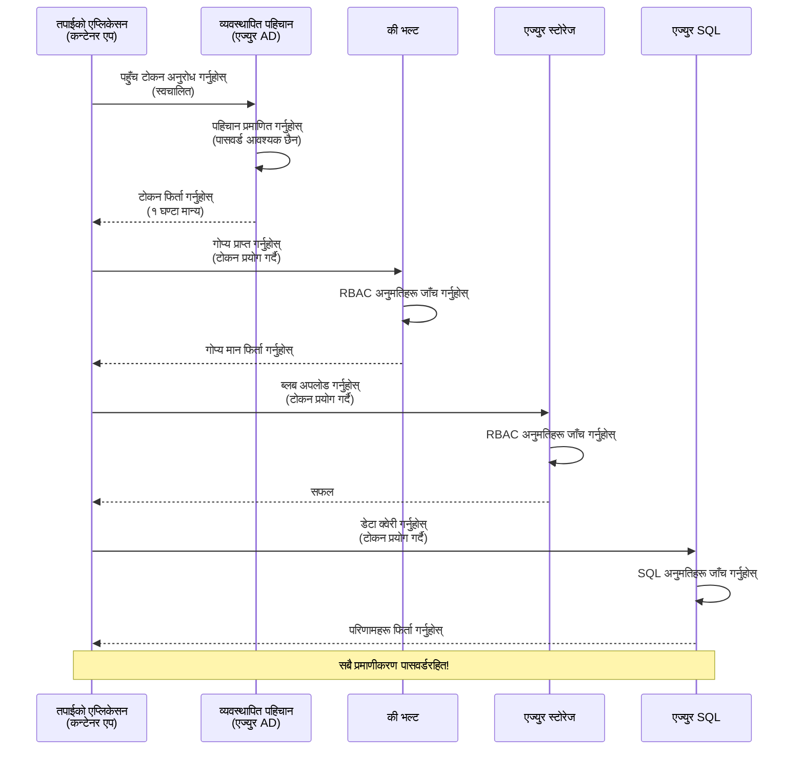
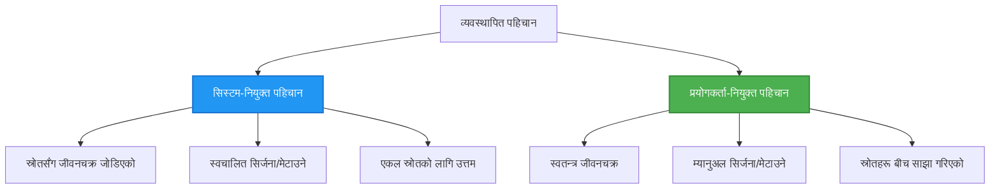

<!--
CO_OP_TRANSLATOR_METADATA:
{
  "original_hash": "e13ff6e1197e0a7462ed0aede7df9f23",
  "translation_date": "2025-11-20T16:19:55+00:00",
  "source_file": "docs/getting-started/authsecurity.md",
  "language_code": "ne"
}
-->
# प्रमाणीकरण ढाँचाहरू र प्रबन्धित पहिचान

⏱️ **अनुमानित समय**: ४५-६० मिनेट | 💰 **खर्च प्रभाव**: निःशुल्क (थप शुल्क छैन) | ⭐ **जटिलता**: मध्यम

**📚 सिकाइ मार्ग:**
- ← अघिल्लो: [कन्फिगरेसन व्यवस्थापन](configuration.md) - वातावरण चर र गोप्य व्यवस्थापन
- 🎯 **तपाईं यहाँ हुनुहुन्छ**: प्रमाणीकरण र सुरक्षा (प्रबन्धित पहिचान, की भल्ट, सुरक्षित ढाँचाहरू)
- → अर्को: [पहिलो परियोजना](first-project.md) - आफ्नो पहिलो AZD एप्लिकेसन निर्माण गर्नुहोस्
- 🏠 [पाठ्यक्रम गृह](../../README.md)

---

## तपाईंले के सिक्नुहुनेछ

यो पाठ पूरा गरेर, तपाईं:
- Azure प्रमाणीकरण ढाँचाहरू (किज, कनेक्शन स्ट्रिङहरू, प्रबन्धित पहिचान) बुझ्नुहुनेछ
- **प्रबन्धित पहिचान** बिना पासवर्ड प्रमाणीकरण कार्यान्वयन गर्नुहोस्
- **Azure Key Vault** एकीकरणसँग गोप्यहरू सुरक्षित गर्नुहोस्
- AZD परिनियोजनहरूको लागि **भूमिका-आधारित पहुँच नियन्त्रण (RBAC)** कन्फिगर गर्नुहोस्
- कन्टेनर एप्स र Azure सेवाहरूमा सुरक्षा उत्तम अभ्यासहरू लागू गर्नुहोस्
- किज-आधारितबाट पहिचान-आधारित प्रमाणीकरणमा माइग्रेट गर्नुहोस्

## प्रबन्धित पहिचान किन महत्त्वपूर्ण छ

### समस्या: परम्परागत प्रमाणीकरण

**प्रबन्धित पहिचानभन्दा पहिले:**
```javascript
// ❌ सुरक्षा जोखिम: कोडमा हार्डकोड गरिएको गोप्य जानकारी
const connectionString = "Server=mydb.database.windows.net;User=admin;Password=P@ssw0rd123";
const storageKey = "xK7mN9pQ2wR5tY8uI0oP3aS6dF1gH4jK...";
const cosmosKey = "C2x7B9n4M1p8Q5w3E6r0T2y5U8i1O4p7...";
```

**समस्याहरू:**
- 🔴 **गोप्यहरू उजागर** कोड, कन्फिग फाइलहरू, वातावरण चरहरूमा
- 🔴 **क्रेडेन्सियल घुमाउने** कोड परिवर्तन र पुनःपरिनियोजन आवश्यक छ
- 🔴 **अडिट दुःस्वप्नहरू** - कसले के, कहिले पहुँच गर्यो?
- 🔴 **छरपस्ट** - गोप्यहरू धेरै प्रणालीहरूमा छरिएका
- 🔴 **अनुपालन जोखिमहरू** - सुरक्षा अडिटहरू असफल

### समाधान: प्रबन्धित पहिचान

**प्रबन्धित पहिचानपछि:**
```javascript
// ✅ सुरक्षित: कोडमा कुनै गोप्य कुरा छैन
const credential = new DefaultAzureCredential();
const client = new BlobServiceClient(
  "https://mystorageaccount.blob.core.windows.net",
  credential  // Azure स्वचालित रूपमा प्रमाणीकरणको हेरचाह गर्छ
);
```

**फाइदाहरू:**
- ✅ **कोड वा कन्फिगमा शून्य गोप्यहरू**
- ✅ **स्वचालित घुमाउने** - Azure ले यसलाई व्यवस्थापन गर्छ
- ✅ **पूर्ण अडिट ट्रेल** Azure AD लगहरूमा
- ✅ **केन्द्रित सुरक्षा** - Azure पोर्टलमा व्यवस्थापन गर्नुहोस्
- ✅ **अनुपालन तयार** - सुरक्षा मापदण्डहरू पूरा गर्दछ

**उदाहरण**: परम्परागत प्रमाणीकरण भनेको विभिन्न ढोकाहरूको लागि धेरै भौतिक किजहरू बोक्नु जस्तै हो। प्रबन्धित पहिचान भनेको सुरक्षा ब्याज जस्तै हो जसले तपाईं को हुनुहुन्छ भन्ने आधारमा स्वचालित रूपमा पहुँच प्रदान गर्दछ—गुमाउने, प्रतिलिपि गर्ने, वा घुमाउने कुनै किज छैन।

---

## वास्तुकला अवलोकन

### प्रबन्धित पहिचानसँग प्रमाणीकरण प्रवाह


### प्रबन्धित पहिचानका प्रकारहरू


| विशेषता | प्रणाली-आवंटित | प्रयोगकर्ता-आवंटित |
|---------|----------------|---------------|
| **आयु चक्र** | स्रोतसँग सम्बन्धित | स्वतन्त्र |
| **सिर्जना** | स्रोतसँग स्वचालित | म्यानुअल सिर्जना |
| **मेटाउने** | स्रोतसँग मेटाइन्छ | स्रोत मेटिएपछि पनि रहन्छ |
| **साझेदारी** | एक स्रोत मात्र | धेरै स्रोतहरू |
| **प्रयोग केस** | साधारण परिदृश्यहरू | जटिल बहु-स्रोत परिदृश्यहरू |
| **AZD डिफल्ट** | ✅ सिफारिस गरिएको | वैकल्पिक |

---

## पूर्वआवश्यकताहरू

### आवश्यक उपकरणहरू

तपाईंले यी उपकरणहरू अघिल्लो पाठहरूबाट पहिले नै स्थापना गरिसक्नुभएको हुनुपर्छ:

```bash
# Azure Developer CLI प्रमाणित गर्नुहोस्
azd version
# ✅ अपेक्षित: azd संस्करण 1.0.0 वा उच्च

# Azure CLI प्रमाणित गर्नुहोस्
az --version
# ✅ अपेक्षित: azure-cli 2.50.0 वा उच्च
```

### Azure आवश्यकताहरू

- सक्रिय Azure सदस्यता
- अनुमति:
  - प्रबन्धित पहिचानहरू सिर्जना गर्न
  - RBAC भूमिकाहरू असाइन गर्न
  - Key Vault स्रोतहरू सिर्जना गर्न
  - कन्टेनर एप्स परिनियोजन गर्न

### ज्ञान पूर्वआवश्यकताहरू

तपाईंले पूरा गर्नुभएको हुनुपर्छ:
- [स्थापना गाइड](installation.md) - AZD सेटअप
- [AZD आधारभूत](azd-basics.md) - कोर अवधारणाहरू
- [कन्फिगरेसन व्यवस्थापन](configuration.md) - वातावरण चरहरू

---

## पाठ १: प्रमाणीकरण ढाँचाहरू बुझ्दै

### ढाँचा १: कनेक्शन स्ट्रिङहरू (पुरानो - बच्नुहोस्)

**यसले कसरी काम गर्छ:**
```bash
# जडान स्ट्रिङले प्रमाणपत्रहरू समावेश गर्दछ
STORAGE_CONNECTION_STRING="DefaultEndpointsProtocol=https;AccountName=myaccount;AccountKey=xK7mN9pQ2wR5..."
COSMOS_CONNECTION_STRING="AccountEndpoint=https://myaccount.documents.azure.com:443/;AccountKey=C2x7..."
SQL_CONNECTION_STRING="Server=myserver.database.windows.net;User=admin;Password=P@ssw0rd..."
```

**समस्याहरू:**
- ❌ गोप्यहरू वातावरण चरहरूमा देखिन्छन्
- ❌ परिनियोजन प्रणालीहरूमा लग गरिन्छ
- ❌ घुमाउन गाह्रो
- ❌ पहुँचको कुनै अडिट ट्रेल छैन

**कहिले प्रयोग गर्ने:** केवल स्थानीय विकासको लागि, कहिल्यै उत्पादनको लागि होइन।

---

### ढाँचा २: Key Vault सन्दर्भहरू (राम्रो)

**यसले कसरी काम गर्छ:**
```bicep
// Store secret in Key Vault
resource keyVault 'Microsoft.KeyVault/vaults@2023-02-01' = {
  name: 'mykv'
  properties: {
    enableRbacAuthorization: true
  }
}

// Reference in Container App
env: [
  {
    name: 'STORAGE_KEY'
    secretRef: 'storage-key'  // References Key Vault
  }
]
```

**फाइदाहरू:**
- ✅ गोप्यहरू Key Vault मा सुरक्षित रूपमा भण्डारण गरिन्छ
- ✅ गोप्य व्यवस्थापन केन्द्रित
- ✅ कोड परिवर्तन बिना घुमाउने

**सीमितताहरू:**
- ⚠️ अझै किज/पासवर्डहरू प्रयोग गर्दै
- ⚠️ Key Vault पहुँच व्यवस्थापन गर्न आवश्यक

**कहिले प्रयोग गर्ने:** कनेक्शन स्ट्रिङहरूबाट प्रबन्धित पहिचानमा संक्रमण चरण।

---

### ढाँचा ३: प्रबन्धित पहिचान (सर्वोत्तम अभ्यास)

**यसले कसरी काम गर्छ:**
```bicep
// Enable managed identity
resource containerApp 'Microsoft.App/containerApps@2023-05-01' = {
  name: 'myapp'
  identity: {
    type: 'SystemAssigned'  // Automatically creates identity
  }
}

// Grant permissions
resource roleAssignment 'Microsoft.Authorization/roleAssignments@2022-04-01' = {
  scope: storageAccount
  properties: {
    roleDefinitionId: storageBlobDataContributorRole
    principalId: containerApp.identity.principalId
  }
}
```

**एप्लिकेसन कोड:**
```javascript
// कुनै गोप्य कुरा आवश्यक छैन!
const { DefaultAzureCredential } = require('@azure/identity');
const { BlobServiceClient } = require('@azure/storage-blob');

const credential = new DefaultAzureCredential();
const blobServiceClient = new BlobServiceClient(
  'https://mystorageaccount.blob.core.windows.net',
  credential
);
```

**फाइदाहरू:**
- ✅ कोड/कन्फिगमा शून्य गोप्यहरू
- ✅ स्वचालित क्रेडेन्सियल घुमाउने
- ✅ पूर्ण अडिट ट्रेल
- ✅ RBAC-आधारित अनुमति
- ✅ अनुपालन तयार

**कहिले प्रयोग गर्ने:** सधैं, उत्पादन एप्लिकेसनहरूको लागि।

---

## पाठ २: AZD सँग प्रबन्धित पहिचान कार्यान्वयन

### चरण-दर-चरण कार्यान्वयन

आउनुहोस्, Azure Storage र Key Vault पहुँच गर्न प्रबन्धित पहिचान प्रयोग गर्ने सुरक्षित कन्टेनर एप निर्माण गरौं।

### परियोजना संरचना

```
secure-app/
├── azure.yaml                 # AZD configuration
├── infra/
│   ├── main.bicep            # Main infrastructure
│   ├── core/
│   │   ├── identity.bicep    # Managed identity setup
│   │   ├── keyvault.bicep    # Key Vault configuration
│   │   └── storage.bicep     # Storage with RBAC
│   └── app/
│       └── container-app.bicep
└── src/
    ├── app.js                # Application code
    ├── package.json
    └── Dockerfile
```

### १. AZD कन्फिगर गर्नुहोस् (azure.yaml)

```yaml
name: secure-app
metadata:
  template: secure-app@1.0.0

services:
  api:
    project: ./src
    language: js
    host: containerapp

# Enable managed identity (AZD handles this automatically)
```

### २. पूर्वाधार: प्रबन्धित पहिचान सक्षम गर्नुहोस्

**फाइल: `infra/main.bicep`**

```bicep
targetScope = 'subscription'

param environmentName string
param location string = 'eastus'

var tags = { 'azd-env-name': environmentName }

// Resource group
resource rg 'Microsoft.Resources/resourceGroups@2021-04-01' = {
  name: 'rg-${environmentName}'
  location: location
  tags: tags
}

// Storage Account
module storage './core/storage.bicep' = {
  name: 'storage'
  scope: rg
  params: {
    name: 'st${uniqueString(rg.id)}'
    location: location
    tags: tags
  }
}

// Key Vault
module keyVault './core/keyvault.bicep' = {
  name: 'keyvault'
  scope: rg
  params: {
    name: 'kv-${uniqueString(rg.id)}'
    location: location
    tags: tags
  }
}

// Container App with Managed Identity
module containerApp './app/container-app.bicep' = {
  name: 'container-app'
  scope: rg
  params: {
    name: 'ca-${environmentName}'
    location: location
    tags: tags
    storageAccountName: storage.outputs.name
    keyVaultName: keyVault.outputs.name
  }
}

// Grant Container App access to Storage
module storageRoleAssignment './core/role-assignment.bicep' = {
  name: 'storage-role'
  scope: rg
  params: {
    principalId: containerApp.outputs.identityPrincipalId
    roleDefinitionId: 'ba92f5b4-2d11-453d-a403-e96b0029c9fe'  // Storage Blob Data Contributor
    targetResourceId: storage.outputs.id
  }
}

// Grant Container App access to Key Vault
module kvRoleAssignment './core/role-assignment.bicep' = {
  name: 'kv-role'
  scope: rg
  params: {
    principalId: containerApp.outputs.identityPrincipalId
    roleDefinitionId: '4633458b-17de-408a-b874-0445c86b69e6'  // Key Vault Secrets User
    targetResourceId: keyVault.outputs.id
  }
}

// Outputs
output AZURE_STORAGE_ACCOUNT_NAME string = storage.outputs.name
output AZURE_KEY_VAULT_NAME string = keyVault.outputs.name
output APP_URL string = containerApp.outputs.url
```

### ३. प्रणाली-आवंटित पहिचानसहित कन्टेनर एप

**फाइल: `infra/app/container-app.bicep`**

```bicep
param name string
param location string
param tags object = {}
param storageAccountName string
param keyVaultName string

resource containerApp 'Microsoft.App/containerApps@2023-05-01' = {
  name: name
  location: location
  tags: tags
  identity: {
    type: 'SystemAssigned'  // 🔑 Enable managed identity
  }
  properties: {
    configuration: {
      ingress: {
        external: true
        targetPort: 3000
      }
    }
    template: {
      containers: [
        {
          name: 'api'
          image: 'myregistry.azurecr.io/api:latest'
          resources: {
            cpu: json('0.5')
            memory: '1Gi'
          }
          env: [
            {
              name: 'AZURE_STORAGE_ACCOUNT_NAME'
              value: storageAccountName
            }
            {
              name: 'AZURE_KEY_VAULT_NAME'
              value: keyVaultName
            }
            // 🔑 No secrets - managed identity handles authentication!
          ]
        }
      ]
    }
  }
}

// Output the identity for RBAC assignments
output identityPrincipalId string = containerApp.identity.principalId
output id string = containerApp.id
output url string = 'https://${containerApp.properties.configuration.ingress.fqdn}'
```

### ४. RBAC भूमिका असाइनमेन्ट मोड्युल

**फाइल: `infra/core/role-assignment.bicep`**

```bicep
param principalId string
param roleDefinitionId string  // Azure built-in role ID
param targetResourceId string

resource roleAssignment 'Microsoft.Authorization/roleAssignments@2022-04-01' = {
  name: guid(principalId, roleDefinitionId, targetResourceId)
  scope: resourceId('Microsoft.Resources/resourceGroups', resourceGroup().name)
  properties: {
    roleDefinitionId: subscriptionResourceId('Microsoft.Authorization/roleDefinitions', roleDefinitionId)
    principalId: principalId
    principalType: 'ServicePrincipal'
  }
}

output id string = roleAssignment.id
```

### ५. प्रबन्धित पहिचानसहित एप्लिकेसन कोड

**फाइल: `src/app.js`**

```javascript
const express = require('express');
const { DefaultAzureCredential } = require('@azure/identity');
const { BlobServiceClient } = require('@azure/storage-blob');
const { SecretClient } = require('@azure/keyvault-secrets');

const app = express();
const PORT = process.env.PORT || 3000;

// 🔑 प्रमाणपत्र आरम्भ गर्नुहोस् (व्यवस्थापित पहिचानसँग स्वचालित रूपमा काम गर्दछ)
const credential = new DefaultAzureCredential();

// Azure Storage सेटअप
const storageAccountName = process.env.AZURE_STORAGE_ACCOUNT_NAME;
const blobServiceClient = new BlobServiceClient(
  `https://${storageAccountName}.blob.core.windows.net`,
  credential  // कुनै कुञ्जी आवश्यक छैन!
);

// Key Vault सेटअप
const keyVaultName = process.env.AZURE_KEY_VAULT_NAME;
const secretClient = new SecretClient(
  `https://${keyVaultName}.vault.azure.net`,
  credential  // कुनै कुञ्जी आवश्यक छैन!
);

// स्वास्थ्य जाँच
app.get('/health', (req, res) => {
  res.json({ status: 'healthy', authentication: 'managed-identity' });
});

// ब्लब स्टोरेजमा फाइल अपलोड गर्नुहोस्
app.post('/upload', async (req, res) => {
  try {
    const containerClient = blobServiceClient.getContainerClient('uploads');
    await containerClient.createIfNotExists();
    
    const blobName = `file-${Date.now()}.txt`;
    const blockBlobClient = containerClient.getBlockBlobClient(blobName);
    
    await blockBlobClient.upload('Hello from managed identity!', 30);
    
    res.json({
      success: true,
      blobName: blobName,
      message: 'File uploaded using managed identity!'
    });
  } catch (error) {
    console.error('Upload error:', error);
    res.status(500).json({ error: error.message });
  }
});

// Key Vault बाट गोप्य प्राप्त गर्नुहोस्
app.get('/secret/:name', async (req, res) => {
  try {
    const secretName = req.params.name;
    const secret = await secretClient.getSecret(secretName);
    
    res.json({
      name: secretName,
      value: secret.value,
      message: 'Secret retrieved using managed identity!'
    });
  } catch (error) {
    console.error('Secret error:', error);
    res.status(500).json({ error: error.message });
  }
});

// ब्लब कन्टेनरहरूको सूची बनाउनुहोस् (पढ्ने पहुँच प्रदर्शन गर्दछ)
app.get('/containers', async (req, res) => {
  try {
    const containers = [];
    for await (const container of blobServiceClient.listContainers()) {
      containers.push(container.name);
    }
    
    res.json({
      containers: containers,
      count: containers.length,
      message: 'Containers listed using managed identity!'
    });
  } catch (error) {
    console.error('List error:', error);
    res.status(500).json({ error: error.message });
  }
});

app.listen(PORT, () => {
  console.log(`Secure API listening on port ${PORT}`);
  console.log('Authentication: Managed Identity (passwordless)');
});
```

**फाइल: `src/package.json`**

```json
{
  "name": "secure-app",
  "version": "1.0.0",
  "dependencies": {
    "express": "^4.18.2",
    "@azure/identity": "^4.0.0",
    "@azure/storage-blob": "^12.17.0",
    "@azure/keyvault-secrets": "^4.7.0"
  },
  "scripts": {
    "start": "node app.js"
  }
}
```

### ६. परिनियोजन र परीक्षण

```bash
# AZD वातावरण आरम्भ गर्नुहोस्
azd init

# पूर्वाधार र अनुप्रयोग परिनियोजन गर्नुहोस्
azd up

# एप URL प्राप्त गर्नुहोस्
APP_URL=$(azd env get-values | grep APP_URL | cut -d '=' -f2 | tr -d '"')

# स्वास्थ्य जाँच परीक्षण गर्नुहोस्
curl $APP_URL/health
```

**✅ अपेक्षित नतिजा:**
```json
{
  "status": "healthy",
  "authentication": "managed-identity"
}
```

**ब्लब अपलोड परीक्षण:**
```bash
curl -X POST $APP_URL/upload
```

**✅ अपेक्षित नतिजा:**
```json
{
  "success": true,
  "blobName": "file-1700404800000.txt",
  "message": "File uploaded using managed identity!"
}
```

**कन्टेनर सूची परीक्षण:**
```bash
curl $APP_URL/containers
```

**✅ अपेक्षित नतिजा:**
```json
{
  "containers": ["uploads"],
  "count": 1,
  "message": "Containers listed using managed identity!"
}
```

---

## सामान्य Azure RBAC भूमिकाहरू

### प्रबन्धित पहिचानका लागि निर्मित भूमिका आईडीहरू

| सेवा | भूमिका नाम | भूमिका आईडी | अनुमति |
|---------|-----------|---------|-------------|
| **स्टोरेज** | Storage Blob Data Reader | `2a2b9908-6b94-4a3d-8e5a-a7d8f8cc8a12` | ब्लब र कन्टेनरहरू पढ्नुहोस् |
| **स्टोरेज** | Storage Blob Data Contributor | `ba92f5b4-2d11-453d-a403-e96b0029c9fe` | ब्लबहरू पढ्नुहोस्, लेख्नुहोस्, मेटाउनुहोस् |
| **स्टोरेज** | Storage Queue Data Contributor | `974c5e8b-45b9-4653-ba55-5f855dd0fb88` | पंक्ति सन्देशहरू पढ्नुहोस्, लेख्नुहोस्, मेटाउनुहोस् |
| **Key Vault** | Key Vault Secrets User | `4633458b-17de-408a-b874-0445c86b69e6` | गोप्यहरू पढ्नुहोस् |
| **Key Vault** | Key Vault Secrets Officer | `b86a8fe4-44ce-4948-aee5-eccb2c155cd7` | गोप्यहरू पढ्नुहोस्, लेख्नुहोस्, मेटाउनुहोस् |
| **Cosmos DB** | Cosmos DB Built-in Data Reader | `00000000-0000-0000-0000-000000000001` | Cosmos DB डेटा पढ्नुहोस् |
| **Cosmos DB** | Cosmos DB Built-in Data Contributor | `00000000-0000-0000-0000-000000000002` | Cosmos DB डेटा पढ्नुहोस्, लेख्नुहोस् |
| **SQL Database** | SQL DB Contributor | `9b7fa17d-e63e-47b0-bb0a-15c516ac86ec` | SQL डेटाबेसहरू व्यवस्थापन गर्नुहोस् |
| **Service Bus** | Azure Service Bus Data Owner | `090c5cfd-751d-490a-894a-3ce6f1109419` | सन्देशहरू पठाउनुहोस्, प्राप्त गर्नुहोस्, व्यवस्थापन गर्नुहोस् |

### भूमिका आईडीहरू कसरी फेला पार्ने

```bash
# सबै बिल्ट-इन भूमिकाहरू सूचीबद्ध गर्नुहोस्
az role definition list --query "[].{Name:roleName, ID:name}" --output table

# विशेष भूमिकाको लागि खोजी गर्नुहोस्
az role definition list --query "[?contains(roleName, 'Storage Blob')].{Name:roleName, ID:name}" --output table

# भूमिकाको विवरण प्राप्त गर्नुहोस्
az role definition list --name "Storage Blob Data Contributor"
```

---

## व्यावहारिक अभ्यासहरू

### अभ्यास १: अवस्थित एपका लागि प्रबन्धित पहिचान सक्षम गर्नुहोस् ⭐⭐ (मध्यम)

**लक्ष्य**: अवस्थित कन्टेनर एप परिनियोजनमा प्रबन्धित पहिचान थप्नुहोस्

**परिदृश्य**: तपाईंको कन्टेनर एप कनेक्शन स्ट्रिङहरू प्रयोग गर्दैछ। यसलाई प्रबन्धित पहिचानमा रूपान्तरण गर्नुहोस्।

**सुरुवात बिन्दु**: यो कन्फिगरेसन भएको कन्टेनर एप:

```bicep
// ❌ Current: Using connection string
env: [
  {
    name: 'STORAGE_CONNECTION_STRING'
    secretRef: 'storage-connection'
  }
]
```

**चरणहरू**:

1. **Bicep मा प्रबन्धित पहिचान सक्षम गर्नुहोस्:**

```bicep
resource containerApp 'Microsoft.App/containerApps@2023-05-01' = {
  name: 'myapp'
  identity: {
    type: 'SystemAssigned'  // Add this
  }
  // ... rest of configuration
}
```

2. **स्टोरेज पहुँच प्रदान गर्नुहोस्:**

```bicep
// Get storage account reference
resource storageAccount 'Microsoft.Storage/storageAccounts@2023-01-01' existing = {
  name: storageAccountName
}

// Assign role
resource roleAssignment 'Microsoft.Authorization/roleAssignments@2022-04-01' = {
  name: guid(containerApp.id, 'ba92f5b4-2d11-453d-a403-e96b0029c9fe', storageAccount.id)
  scope: storageAccount
  properties: {
    roleDefinitionId: subscriptionResourceId('Microsoft.Authorization/roleDefinitions', 'ba92f5b4-2d11-453d-a403-e96b0029c9fe')
    principalId: containerApp.identity.principalId
    principalType: 'ServicePrincipal'
  }
}
```

3. **एप्लिकेसन कोड अद्यावधिक गर्नुहोस्:**

**पहिले (कनेक्शन स्ट्रिङ):**
```javascript
const { BlobServiceClient } = require('@azure/storage-blob');

const blobServiceClient = BlobServiceClient.fromConnectionString(
  process.env.STORAGE_CONNECTION_STRING
);
```

**पछि (प्रबन्धित पहिचान):**
```javascript
const { DefaultAzureCredential } = require('@azure/identity');
const { BlobServiceClient } = require('@azure/storage-blob');

const credential = new DefaultAzureCredential();
const blobServiceClient = new BlobServiceClient(
  `https://${process.env.STORAGE_ACCOUNT_NAME}.blob.core.windows.net`,
  credential
);
```

4. **वातावरण चरहरू अद्यावधिक गर्नुहोस्:**

```bicep
env: [
  {
    name: 'STORAGE_ACCOUNT_NAME'
    value: storageAccountName  // Just the name, no secrets!
  }
  // Remove STORAGE_CONNECTION_STRING
]
```

5. **परिनियोजन र परीक्षण गर्नुहोस्:**

```bash
# पुनः तैनाथ गर्नुहोस्
azd up

# यो अझै काम गर्छ कि छैन परीक्षण गर्नुहोस्
curl https://myapp.azurecontainerapps.io/upload
```

**✅ सफलता मापदण्ड:**
- ✅ एप्लिकेसन त्रुटिहरू बिना परिनियोजन हुन्छ
- ✅ स्टोरेज अपरेसनहरू काम गर्छन् (अपलोड, सूची, डाउनलोड)
- ✅ वातावरण चरहरूमा कुनै कनेक्शन स्ट्रिङहरू छैनन्
- ✅ पहिचान Azure पोर्टलमा "Identity" ब्लेड अन्तर्गत देखिन्छ

**सत्यापन:**

```bash
# व्यवस्थापित पहिचान सक्षम छ कि जाँच गर्नुहोस्
az containerapp show \
  --name myapp \
  --resource-group rg-myapp \
  --query "identity.type"
# ✅ अपेक्षित: "SystemAssigned"

# भूमिका असाइनमेन्ट जाँच गर्नुहोस्
az role assignment list \
  --assignee $(az containerapp show --name myapp --resource-group rg-myapp --query "identity.principalId" -o tsv) \
  --scope /subscriptions/{sub-id}/resourceGroups/rg-myapp/providers/Microsoft.Storage/storageAccounts/mystorageaccount
# ✅ अपेक्षित: "Storage Blob Data Contributor" भूमिका देखाउँछ
```

**समय**: २०-३० मिनेट

---

### अभ्यास २: प्रयोगकर्ता-आवंटित पहिचानसँग बहु-सेवा पहुँच ⭐⭐⭐ (उन्नत)

**लक्ष्य**: धेरै कन्टेनर एप्समा साझा गरिएको प्रयोगकर्ता-आवंटित पहिचान सिर्जना गर्नुहोस्

**परिदृश्य**: तपाईंको ३ माइक्रोसर्भिसहरू छन् जसले एउटै स्टोरेज खाता र Key Vault पहुँच गर्न आवश्यक छ।

**चरणहरू**:

1. **प्रयोगकर्ता-आवंटित पहिचान सिर्जना गर्नुहोस्:**

**फाइल: `infra/core/identity.bicep`**

```bicep
param name string
param location string
param tags object = {}

resource userAssignedIdentity 'Microsoft.ManagedIdentity/userAssignedIdentities@2023-01-31' = {
  name: name
  location: location
  tags: tags
}

output id string = userAssignedIdentity.id
output principalId string = userAssignedIdentity.properties.principalId
output clientId string = userAssignedIdentity.properties.clientId
```

2. **प्रयोगकर्ता-आवंटित पहिचानलाई भूमिकाहरू असाइन गर्नुहोस्:**

```bicep
// In main.bicep
module userIdentity './core/identity.bicep' = {
  name: 'user-identity'
  scope: rg
  params: {
    name: 'id-${environmentName}'
    location: location
    tags: tags
  }
}

// Grant Storage access
resource storageRoleAssignment 'Microsoft.Authorization/roleAssignments@2022-04-01' = {
  name: guid(userIdentity.outputs.principalId, 'storage-contributor')
  scope: storageAccount
  properties: {
    roleDefinitionId: subscriptionResourceId('Microsoft.Authorization/roleDefinitions', 'ba92f5b4-2d11-453d-a403-e96b0029c9fe')
    principalId: userIdentity.outputs.principalId
    principalType: 'ServicePrincipal'
  }
}

// Grant Key Vault access
resource kvRoleAssignment 'Microsoft.Authorization/roleAssignments@2022-04-01' = {
  name: guid(userIdentity.outputs.principalId, 'kv-secrets-user')
  scope: keyVault
  properties: {
    roleDefinitionId: subscriptionResourceId('Microsoft.Authorization/roleDefinitions', '4633458b-17de-408a-b874-0445c86b69e6')
    principalId: userIdentity.outputs.principalId
    principalType: 'ServicePrincipal'
  }
}
```

3. **धेरै कन्टेनर एप्समा पहिचान असाइन गर्नुहोस्:**

```bicep
resource apiGateway 'Microsoft.App/containerApps@2023-05-01' = {
  name: 'api-gateway'
  identity: {
    type: 'UserAssigned'
    userAssignedIdentities: {
      '${userIdentity.outputs.id}': {}
    }
  }
  // ... rest of config
}

resource productService 'Microsoft.App/containerApps@2023-05-01' = {
  name: 'product-service'
  identity: {
    type: 'UserAssigned'
    userAssignedIdentities: {
      '${userIdentity.outputs.id}': {}
    }
  }
  // ... rest of config
}

resource orderService 'Microsoft.App/containerApps@2023-05-01' = {
  name: 'order-service'
  identity: {
    type: 'UserAssigned'
    userAssignedIdentities: {
      '${userIdentity.outputs.id}': {}
    }
  }
  // ... rest of config
}
```

4. **एप्लिकेसन कोड (सबै सेवाहरूले एउटै ढाँचा प्रयोग गर्छन्):**

```javascript
const { DefaultAzureCredential, ManagedIdentityCredential } = require('@azure/identity');

// प्रयोगकर्ताद्वारा असाइन गरिएको पहिचानको लागि, क्लाइन्ट आईडी निर्दिष्ट गर्नुहोस्
const credential = new ManagedIdentityCredential(
  process.env.AZURE_CLIENT_ID  // प्रयोगकर्ताद्वारा असाइन गरिएको पहिचान क्लाइन्ट आईडी
);

// वा DefaultAzureCredential प्रयोग गर्नुहोस् (स्वतः-पहिचान गर्दछ)
const credential = new DefaultAzureCredential();

const blobServiceClient = new BlobServiceClient(
  `https://${process.env.STORAGE_ACCOUNT_NAME}.blob.core.windows.net`,
  credential
);
```

5. **परिनियोजन र सत्यापन गर्नुहोस्:**

```bash
azd up

# सबै सेवाहरूले भण्डारण पहुँच गर्न सक्छन् कि परीक्षण गर्नुहोस्
curl https://api-gateway.azurecontainerapps.io/upload
curl https://product-service.azurecontainerapps.io/upload
curl https://order-service.azurecontainerapps.io/upload
```

**✅ सफलता मापदण्ड:**
- ✅ ३ सेवाहरूमा साझा गरिएको एक पहिचान
- ✅ सबै सेवाहरूले स्टोरेज र Key Vault पहुँच गर्न सक्छन्
- ✅ यदि तपाईंले एउटा सेवा मेटाउनुभयो भने पनि पहिचान रहन्छ
- ✅ अनुमति व्यवस्थापन केन्द्रित

**प्रयोगकर्ता-आवंटित पहिचानका फाइदाहरू:**
- व्यवस्थापन गर्न एकल पहिचान
- सेवाहरूमा स्थिर अनुमति
- सेवा मेटाउँदा पनि रहन्छ
- जटिल वास्तुकलाहरूका लागि राम्रो

**समय**: ३०-४० मिनेट

---

### अभ्यास ३: Key Vault गोप्य घुमाउने कार्यान्वयन गर्नुहोस् ⭐⭐⭐ (उन्नत)

**लक्ष्य**: Key Vault मा तेस्रो-पक्ष API किजहरू भण्डारण गर्नुहोस् र तिनीहरूलाई प्रबन्धित पहिचान प्रयोग गरेर पहुँच गर्नुहोस्

**परिदृश्य**: तपाईंको एपले API किजहरू आवश्यक पर्ने बाह्य API (OpenAI, Stripe, SendGrid) कल गर्न आवश्यक छ।

**चरणहरू**:

1. **RBAC सहित Key Vault सिर्जना गर्नुहोस्:**

**फाइल: `infra/core/keyvault.bicep`**

```bicep
param name string
param location string
param tags object = {}

resource keyVault 'Microsoft.KeyVault/vaults@2023-02-01' = {
  name: name
  location: location
  tags: tags
  properties: {
    enableRbacAuthorization: true  // Use RBAC instead of access policies
    sku: {
      family: 'A'
      name: 'standard'
    }
    tenantId: subscription().tenantId
    enableSoftDelete: true
    softDeleteRetentionInDays: 90
  }
}

// Allow Container App to read secrets
output id string = keyVault.id
output name string = keyVault.name
output uri string = keyVault.properties.vaultUri
```

2. **Key Vault मा गोप्यहरू भण्डारण गर्नुहोस्:**

```bash
# की भल्ट नाम प्राप्त गर्नुहोस्
KV_NAME=$(azd env get-values | grep AZURE_KEY_VAULT_NAME | cut -d '=' -f2 | tr -d '"')

# तेस्रो-पक्ष API कुञ्जीहरू भण्डारण गर्नुहोस्
az keyvault secret set \
  --vault-name $KV_NAME \
  --name "OpenAI-ApiKey" \
  --value "sk-proj-xxxxxxxxxxxxx"

az keyvault secret set \
  --vault-name $KV_NAME \
  --name "Stripe-ApiKey" \
  --value "sk_live_xxxxxxxxxxxxx"

az keyvault secret set \
  --vault-name $KV_NAME \
  --name "SendGrid-ApiKey" \
  --value "SG.xxxxxxxxxxxxx"
```

3. **गोप्यहरू पुनःप्राप्त गर्न एप्लिकेसन कोड:**

**फाइल: `src/config.js`**

```javascript
const { DefaultAzureCredential } = require('@azure/identity');
const { SecretClient } = require('@azure/keyvault-secrets');

class Config {
  constructor() {
    this.credential = new DefaultAzureCredential();
    this.secretClient = new SecretClient(
      `https://${process.env.AZURE_KEY_VAULT_NAME}.vault.azure.net`,
      this.credential
    );
    this.cache = {};
  }

  async getSecret(secretName) {
    // पहिले क्यास जाँच गर्नुहोस्
    if (this.cache[secretName]) {
      return this.cache[secretName];
    }

    try {
      const secret = await this.secretClient.getSecret(secretName);
      this.cache[secretName] = secret.value;
      console.log(`✅ Retrieved secret: ${secretName}`);
      return secret.value;
    } catch (error) {
      console.error(`❌ Failed to get secret ${secretName}:`, error.message);
      throw error;
    }
  }

  async getOpenAIKey() {
    return this.getSecret('OpenAI-ApiKey');
  }

  async getStripeKey() {
    return this.getSecret('Stripe-ApiKey');
  }

  async getSendGridKey() {
    return this.getSecret('SendGrid-ApiKey');
  }
}

module.exports = new Config();
```

4. **एप्लिकेसनमा गोप्यहरू प्रयोग गर्नुहोस्:**

**फाइल: `src/app.js`**

```javascript
const express = require('express');
const config = require('./config');
const { OpenAI } = require('openai');

const app = express();

// की भल्टबाट कुञ्जीको साथमा ओपनएआई आरम्भ गर्नुहोस्
let openaiClient;

async function initializeServices() {
  const openaiKey = await config.getOpenAIKey();
  openaiClient = new OpenAI({ apiKey: openaiKey });
  console.log('✅ Services initialized with secrets from Key Vault');
}

// सुरुमा कल गर्नुहोस्
initializeServices().catch(console.error);

app.post('/chat', async (req, res) => {
  try {
    const completion = await openaiClient.chat.completions.create({
      model: 'gpt-4',
      messages: [{ role: 'user', content: 'Hello!' }]
    });
    
    res.json({
      response: completion.choices[0].message.content,
      authentication: 'Key from Key Vault via Managed Identity'
    });
  } catch (error) {
    res.status(500).json({ error: error.message });
  }
});

app.listen(3000, () => {
  console.log('Secure API with Key Vault integration running');
});
```

5. **परिनियोजन र परीक्षण गर्नुहोस्:**

```bash
azd up

# API कुञ्जीहरू काम गर्छन् भनेर परीक्षण गर्नुहोस्
curl -X POST https://myapp.azurecontainerapps.io/chat \
  -H "Content-Type: application/json" \
  -d '{"message":"Hello AI"}'
```

**✅ सफलता मापदण्ड:**
- ✅ कोड वा वातावरण चरहरूमा कुनै API किज छैन
- ✅ एप्लिकेसनले Key Vault बाट किज पुनःप्राप्त गर्छ
- ✅ तेस्रो-पक्ष API हरू सही रूपमा काम गर्छन्
- ✅ कोड परिवर्तन बिना किजहरू घुमाउन सकिन्छ

**गोप्य घुमाउनुहोस्:**

```bash
# की भल्टमा गोप्य अद्यावधिक गर्नुहोस्
az keyvault secret set \
  --vault-name $KV_NAME \
  --name "OpenAI-ApiKey" \
  --value "sk-proj-NEW_KEY_HERE"

# नयाँ कुञ्जी लिन अनुप्रयोग पुनः सुरु गर्नुहोस्
az containerapp revision restart \
  --name myapp \
  --resource-group rg-myapp
```

**समय**: २५-३५ मिनेट

---

## ज्ञान जाँच बिन्दु

### १. प्रमाणीकरण ढाँचाहरू ✓

आफ्नो बुझाइ परीक्षण गर्नुहोस्:

- [ ] **Q1**: मुख्य तीन प्रमाणीकरण ढाँचाहरू के हुन्? 
  - **A**: कनेक्शन स्ट्रिङहरू (पुरानो), Key Vault सन्दर्भहरू (संक्रमण), प्रबन्धित पहिचान (सर्वोत्तम)

- [ ] **Q2**: प्रबन्धित पहिचान कनेक्शन स्ट्रिङहरू भन्दा किन राम्रो छ?
  - **A**: कोडमा कुनै गोप्य छैन, स्वचालित घुमाउने, पूर्ण अडिट ट्रेल, RBAC अनुमति

- [ ] **Q3**: प्रणाली-आवंटितको सट्टा प्रयोगकर्ता-आवंटित पहिचान कहिले प्रयोग गर्ने?
  - **A**: जब धेरै स्रोतहरूमा पहिचान साझा गर्नुपर्छ वा जब पहिचानको आयु चक्र स्रोतको आयु चक्रबाट स्वतन्त्र हुन्छ

**ह्यान्ड्स-अन सत्यापन:**
```bash
# तपाईको एपले कुन प्रकारको पहिचान प्रयोग गर्दछ जाँच गर्नुहोस्
az containerapp show \
  --name myapp \
  --resource-group rg-myapp \
  --query "identity.type"

# पहिचानको लागि सबै भूमिका असाइनमेन्टहरू सूचीबद्ध गर्नुहोस्
az role assignment list \
  --assignee $(az containerapp show --name myapp --resource-group rg-myapp --query "identity.principalId" -o tsv)
```

---

### २. RBAC र अनुमति ✓

आफ्नो बुझाइ परीक्षण गर्नुहोस्:

- [ ] **Q1**: "Storage Blob Data Contributor" को भूमिका आईडी के हो?
  - **A**: `ba92f5b4-2d11-453d-a403-e96b0029c9fe`

- [ ] **Q2**: "Key Vault Secrets User" ले के अनुमति प्रदान गर्छ?
  - **A**: गोप्यहरू पढ्न मात्र (सिर्जना, अद्यावधिक, वा मेटाउन सक्दैन)

- [ ] **Q3**: कन्टेनर एपलाई Azure SQL पहुँच कसरी प्रदान गर्ने?
  - **A**: "SQL DB Contributor" भूमिका असाइन गर्नुहोस् वा SQL को लागि Azure AD प्रमाणीकरण कन्फिगर गर्नुहोस्

**ह्यान्ड्स-अन सत्यापन:**
```bash
# विशेष भूमिका खोज्नुहोस्
az role definition list --name "Storage Blob Data Contributor"

# तपाईको पहिचानमा कुन भूमिकाहरू असाइन गरिएको छ जाँच गर्नुहोस्
PRINCIPAL_ID=$(az containerapp show --name myapp --resource-group rg-myapp --query "identity.principalId" -o tsv)
az role assignment list --assignee $PRINCIPAL_ID --output table
```

---

### ३. Key Vault एकीकरण ✓

आफ्नो बुझाइ परीक्षण गर्नुहोस्:
- [ ] **Q1**: Key Vault को लागि RBAC कसरी सक्षम गर्ने, access policies को सट्टा?
  - **A**: Bicep मा `enableRbacAuthorization: true` सेट गर्नुहोस्

- [ ] **Q2**: कुन Azure SDK लाइब्रेरीले managed identity authentication ह्यान्डल गर्छ?
  - **A**: `@azure/identity` र `DefaultAzureCredential` क्लास

- [ ] **Q3**: Key Vault का secrets कति समयसम्म cache मा रहन्छन्?
  - **A**: एप्लिकेसनमा निर्भर; आफ्नै caching strategy लागू गर्नुहोस्

**व्यावहारिक परीक्षण:**
```bash
# परीक्षण कुञ्जी भण्डार पहुँच
az keyvault secret show \
  --vault-name $KV_NAME \
  --name "OpenAI-ApiKey" \
  --query "value"

# जाँच गर्नुहोस् RBAC सक्षम छ
az keyvault show \
  --name $KV_NAME \
  --query "properties.enableRbacAuthorization"
# ✅ अपेक्षित: सत्य
```

---

## सुरक्षा उत्तम अभ्यासहरू

### ✅ गर्नुहोस्:

1. **उत्पादनमा सधैं managed identity प्रयोग गर्नुहोस्**
   ```bicep
   identity: {
     type: 'SystemAssigned'
   }
   ```

2. **कम-विशेषाधिकार RBAC roles प्रयोग गर्नुहोस्**
   - "Reader" roles सकेसम्म प्रयोग गर्नुहोस्
   - "Owner" वा "Contributor" मात्र आवश्यक परेमा प्रयोग गर्नुहोस्

3. **तृतीय-पक्षका keys Key Vault मा भण्डारण गर्नुहोस्**
   ```javascript
   const apiKey = await secretClient.getSecret('ThirdPartyApiKey');
   ```

4. **Audit logging सक्षम गर्नुहोस्**
   ```bicep
   diagnosticSettings: {
     logs: [{ category: 'AuditEvent', enabled: true }]
   }
   ```

5. **Dev/Staging/Prod का लागि फरक identities प्रयोग गर्नुहोस्**
   ```bash
   azd env new dev
   azd env new staging
   azd env new prod
   ```

6. **Secrets नियमित रूपमा घुमाउनुहोस्**
   - Key Vault secrets मा expiration dates सेट गर्नुहोस्
   - Azure Functions को साथ rotation स्वचालित गर्नुहोस्

### ❌ नगर्नुहोस्:

1. **कहिल्यै secrets हार्डकोड नगर्नुहोस्**
   ```javascript
   // ❌ नराम्रो
   const apiKey = "sk-proj-xxxxxxxxxxxxx";
   ```

2. **उत्पादनमा connection strings प्रयोग नगर्नुहोस्**
   ```javascript
   // ❌ नराम्रो
   BlobServiceClient.fromConnectionString(process.env.STORAGE_CONNECTION_STRING)
   ```

3. **अत्यधिक permissions नदिनुहोस्**
   ```bicep
   // ❌ BAD - too much access
   roleDefinitionId: 'Owner'
   
   // ✅ GOOD - least privilege
   roleDefinitionId: 'Storage Blob Data Reader'
   ```

4. **Secrets को log नगर्नुहोस्**
   ```javascript
   // ❌ नराम्रो
   console.log('API Key:', apiKey);
   
   // ✅ राम्रो
   console.log('API Key retrieved successfully');
   ```

5. **उत्पादन identities विभिन्न वातावरणहरूमा साझा नगर्नुहोस्**
   ```bicep
   // ❌ BAD - same identity for dev and prod
   // ✅ GOOD - separate identities per environment
   ```

---

## समस्या समाधान गाइड

### समस्या: Azure Storage पहुँच गर्दा "Unauthorized"

**लक्षणहरू:**
```
Error: Unauthorized (403)
AuthorizationPermissionMismatch: This request is not authorized to perform this operation
```

**निदान:**

```bash
# व्यवस्थापित पहिचान सक्षम छ कि छैन जाँच गर्नुहोस्
az containerapp show \
  --name myapp \
  --resource-group rg-myapp \
  --query "identity.type"
# ✅ अपेक्षित: "SystemAssigned" वा "UserAssigned"

# भूमिका असाइनमेन्टहरू जाँच गर्नुहोस्
PRINCIPAL_ID=$(az containerapp show --name myapp --resource-group rg-myapp --query "identity.principalId" -o tsv)
az role assignment list --assignee $PRINCIPAL_ID

# अपेक्षित: "Storage Blob Data Contributor" वा यस्तै भूमिका देखिनु पर्छ
```

**समाधानहरू:**

1. **सही RBAC role प्रदान गर्नुहोस्:**
```bash
STORAGE_ID=$(az storage account show --name mystorageaccount --resource-group rg-myapp --query "id" -o tsv)
az role assignment create \
  --assignee $PRINCIPAL_ID \
  --role "Storage Blob Data Contributor" \
  --scope $STORAGE_ID
```

2. **Propagation को लागि पर्खनुहोस् (५-१० मिनेट लाग्न सक्छ):**
```bash
# भूमिका असाइनमेन्ट स्थिति जाँच गर्नुहोस्
az role assignment list --assignee $PRINCIPAL_ID --scope $STORAGE_ID
```

3. **एप्लिकेसन कोडले सही credential प्रयोग गरेको सुनिश्चित गर्नुहोस्:**
```javascript
// सुनिश्चित गर्नुहोस् कि तपाईं DefaultAzureCredential प्रयोग गर्दै हुनुहुन्छ
const credential = new DefaultAzureCredential();
```

---

### समस्या: Key Vault पहुँच अस्वीकृत

**लक्षणहरू:**
```
Error: Forbidden (403)
The user, group or application does not have secrets get permission
```

**निदान:**

```bash
# सुनिश्चित गर्नुहोस् कि Key Vault RBAC सक्षम छ
az keyvault show \
  --name $KV_NAME \
  --query "properties.enableRbacAuthorization"
# ✅ अपेक्षित: सत्य

# भूमिका असाइनमेन्टहरू जाँच गर्नुहोस्
az role assignment list \
  --assignee $PRINCIPAL_ID \
  --scope /subscriptions/{sub-id}/resourceGroups/rg-myapp/providers/Microsoft.KeyVault/vaults/$KV_NAME
```

**समाधानहरू:**

1. **Key Vault मा RBAC सक्षम गर्नुहोस्:**
```bash
az keyvault update \
  --name $KV_NAME \
  --enable-rbac-authorization true
```

2. **Key Vault Secrets User role प्रदान गर्नुहोस्:**
```bash
KV_ID=$(az keyvault show --name $KV_NAME --query "id" -o tsv)
az role assignment create \
  --assignee $PRINCIPAL_ID \
  --role "Key Vault Secrets User" \
  --scope $KV_ID
```

---

### समस्या: DefaultAzureCredential स्थानीय रूपमा असफल

**लक्षणहरू:**
```
Error: DefaultAzureCredential failed to retrieve a token
CredentialUnavailableError: No credential available
```

**निदान:**

```bash
# जाँच गर्नुहोस् कि तपाईं लगइन हुनुहुन्छ
az account show

# Azure CLI प्रमाणीकरण जाँच गर्नुहोस्
az ad signed-in-user show
```

**समाधानहरू:**

1. **Azure CLI मा लगइन गर्नुहोस्:**
```bash
az login
```

2. **Azure subscription सेट गर्नुहोस्:**
```bash
az account set --subscription "Your Subscription Name"
```

3. **स्थानीय विकासको लागि environment variables प्रयोग गर्नुहोस्:**
```bash
export AZURE_TENANT_ID="your-tenant-id"
export AZURE_CLIENT_ID="your-client-id"
export AZURE_CLIENT_SECRET="your-client-secret"
```

4. **वा स्थानीय रूपमा फरक credential प्रयोग गर्नुहोस्:**
```javascript
const { DefaultAzureCredential, AzureCliCredential } = require('@azure/identity');

// स्थानीय विकासको लागि AzureCliCredential प्रयोग गर्नुहोस्
const credential = process.env.NODE_ENV === 'production' 
  ? new DefaultAzureCredential()
  : new AzureCliCredential();
```

---

### समस्या: Role assignment propagate हुन धेरै समय लाग्छ

**लक्षणहरू:**
- Role सफलतापूर्वक असाइन गरियो
- अझै 403 errors देखिन्छ
- कहिलेकाहीं काम गर्छ, कहिलेकाहीं गर्दैन

**व्याख्या:**
Azure RBAC परिवर्तनहरूलाई विश्वव्यापी रूपमा propagate हुन ५-१० मिनेट लाग्न सक्छ।

**समाधान:**

```bash
# पर्खनुहोस् र पुन: प्रयास गर्नुहोस्
echo "Waiting for RBAC propagation..."
sleep 300  # ५ मिनेट पर्खनुहोस्

# पहुँच परीक्षण गर्नुहोस्
curl https://myapp.azurecontainerapps.io/upload

# यदि अझै असफल छ भने, एप पुन: सुरु गर्नुहोस्
az containerapp revision restart \
  --name myapp \
  --resource-group rg-myapp
```

---

## लागत विचारहरू

### Managed Identity लागत

| स्रोत | लागत |
|-------|------|
| **Managed Identity** | 🆓 **निःशुल्क** - कुनै शुल्क छैन |
| **RBAC Role Assignments** | 🆓 **निःशुल्क** - कुनै शुल्क छैन |
| **Azure AD Token Requests** | 🆓 **निःशुल्क** - समावेश छ |
| **Key Vault Operations** | $0.03 प्रति १०,००० अपरेसन |
| **Key Vault Storage** | $0.024 प्रति secret प्रति महिना |

**Managed identity ले पैसा बचत गर्छ:**
- ✅ सेवा-देखि-सेवा authentication को लागि Key Vault अपरेसन हटाएर
- ✅ सुरक्षा घटनाहरू घटाएर (कुनै credentials लीक हुँदैन)
- ✅ सञ्चालन लागत घटाएर (कुनै म्यानुअल rotation आवश्यक छैन)

**उदाहरण लागत तुलना (मासिक):**

| परिदृश्य | Connection Strings | Managed Identity | बचत |
|----------|-------------------|-----------------|---------|
| सानो एप (१M अनुरोध) | ~$50 (Key Vault + ops) | ~$0 | $50/महिना |
| मध्यम एप (१०M अनुरोध) | ~$200 | ~$0 | $200/महिना |
| ठूलो एप (१००M अनुरोध) | ~$1,500 | ~$0 | $1,500/महिना |

---

## थप जान्नुहोस्

### आधिकारिक दस्तावेज
- [Azure Managed Identity](https://learn.microsoft.com/entra/identity/managed-identities-azure-resources/overview)
- [Azure RBAC](https://learn.microsoft.com/azure/role-based-access-control/overview)
- [Azure Key Vault](https://learn.microsoft.com/azure/key-vault/general/overview)
- [DefaultAzureCredential](https://learn.microsoft.com/dotnet/api/azure.identity.defaultazurecredential)

### SDK दस्तावेज
- [@azure/identity (Node.js)](https://www.npmjs.com/package/@azure/identity)
- [Azure.Identity (C#)](https://www.nuget.org/packages/Azure.Identity/)
- [azure-identity (Python)](https://pypi.org/project/azure-identity/)

### यस कोर्समा अर्को चरण
- ← अघिल्लो: [Configuration Management](configuration.md)
- → अर्को: [First Project](first-project.md)
- 🏠 [कोर्स होम](../../README.md)

### सम्बन्धित उदाहरणहरू
- [Azure OpenAI Chat Example](../../../../examples/azure-openai-chat) - Azure OpenAI को लागि managed identity प्रयोग गर्दछ
- [Microservices Example](../../../../examples/microservices) - बहु-सेवा authentication ढाँचाहरू

---

## संक्षेप

**तपाईंले सिक्नुभयो:**
- ✅ तीन authentication ढाँचाहरू (connection strings, Key Vault, managed identity)
- ✅ AZD मा managed identity सक्षम र कन्फिगर गर्ने तरिका
- ✅ Azure सेवाहरूको लागि RBAC role assignments
- ✅ तृतीय-पक्ष secrets को लागि Key Vault एकीकरण
- ✅ User-assigned र system-assigned identities
- ✅ सुरक्षा उत्तम अभ्यासहरू र समस्या समाधान

**मुख्य बुँदाहरू:**
1. **उत्पादनमा सधैं managed identity प्रयोग गर्नुहोस्** - Zero secrets, स्वचालित rotation
2. **कम-विशेषाधिकार RBAC roles प्रयोग गर्नुहोस्** - आवश्यक अनुमति मात्र प्रदान गर्नुहोस्
3. **तृतीय-पक्षका keys Key Vault मा भण्डारण गर्नुहोस्** - केन्द्रीयकृत secret व्यवस्थापन
4. **वातावरण अनुसार अलग identities प्रयोग गर्नुहोस्** - Dev, staging, prod isolation
5. **Audit logging सक्षम गर्नुहोस्** - कसले के पहुँच गर्यो ट्र्याक गर्नुहोस्

**अर्को चरणहरू:**
1. माथिका व्यावहारिक अभ्यासहरू पूरा गर्नुहोस्
2. Connection strings बाट managed identity मा एउटा विद्यमान एप माइग्रेट गर्नुहोस्
3. पहिलो AZD प्रोजेक्ट निर्माण गर्नुहोस्, सुरक्षासहित: [First Project](first-project.md)

---

<!-- CO-OP TRANSLATOR DISCLAIMER START -->
**अस्वीकरण**:  
यो दस्तावेज़ AI अनुवाद सेवा [Co-op Translator](https://github.com/Azure/co-op-translator) प्रयोग गरेर अनुवाद गरिएको छ। हामी शुद्धताको लागि प्रयास गर्छौं, तर कृपया ध्यान दिनुहोस् कि स्वचालित अनुवादमा त्रुटिहरू वा अशुद्धताहरू हुन सक्छ। यसको मूल भाषा मा रहेको दस्तावेज़लाई आधिकारिक स्रोत मानिनुपर्छ। महत्वपूर्ण जानकारीको लागि, व्यावसायिक मानव अनुवाद सिफारिस गरिन्छ। यस अनुवादको प्रयोगबाट उत्पन्न हुने कुनै पनि गलतफहमी वा गलत व्याख्याको लागि हामी जिम्मेवार हुने छैनौं।
<!-- CO-OP TRANSLATOR DISCLAIMER END -->