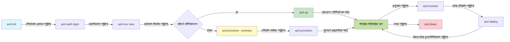
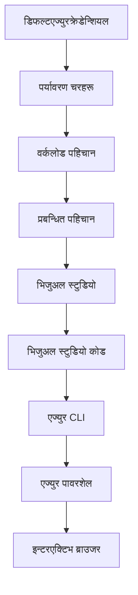

<!--
CO_OP_TRANSLATOR_METADATA:
{
  "original_hash": "e855e899d2705754fe85b04190edd0f0",
  "translation_date": "2025-11-20T14:16:25+00:00",
  "source_file": "docs/getting-started/azd-basics.md",
  "language_code": "ne"
}
-->
# AZD आधारभूत - Azure Developer CLI बुझ्दै

# AZD आधारभूत - मुख्य अवधारणाहरू र आधारभूत जानकारी

**अध्याय नेभिगेसन:**
- **📚 कोर्स होम**: [AZD For Beginners](../../README.md)
- **📖 हालको अध्याय**: अध्याय 1 - आधार र छिटो सुरुवात
- **⬅️ अघिल्लो**: [कोर्स अवलोकन](../../README.md#-chapter-1-foundation--quick-start)
- **➡️ अर्को**: [स्थापना र सेटअप](installation.md)
- **🚀 अर्को अध्याय**: [अध्याय 2: AI-प्रथम विकास](../microsoft-foundry/microsoft-foundry-integration.md)

## परिचय

यस पाठले तपाईंलाई Azure Developer CLI (azd) को परिचय दिन्छ, जुन एक शक्तिशाली कमाण्ड-लाइन उपकरण हो जसले स्थानीय विकासबाट Azure मा परिनियोजनको यात्रालाई तीव्र बनाउँछ। तपाईंले आधारभूत अवधारणाहरू, मुख्य सुविधाहरू सिक्नुहुनेछ र कसरी azd ले क्लाउड-नेटिभ अनुप्रयोग परिनियोजनलाई सरल बनाउँछ भन्ने बुझ्नुहुनेछ।

## सिकाइ लक्ष्यहरू

यस पाठको अन्त्यमा, तपाईं:
- Azure Developer CLI के हो र यसको मुख्य उद्देश्य के हो भन्ने बुझ्नुहुनेछ
- टेम्प्लेट, वातावरणहरू, र सेवाहरूको मुख्य अवधारणाहरू सिक्नुहुनेछ
- टेम्प्लेट-आधारित विकास र Infrastructure as Code जस्ता प्रमुख सुविधाहरू अन्वेषण गर्नुहुनेछ
- azd परियोजना संरचना र कार्यप्रवाह बुझ्नुहुनेछ
- तपाईंको विकास वातावरणको लागि azd स्थापना र कन्फिगर गर्न तयार हुनुहुनेछ

## सिकाइ परिणामहरू

यस पाठ पूरा गरेपछि, तपाईं:
- आधुनिक क्लाउड विकास कार्यप्रवाहहरूमा azd को भूमिका व्याख्या गर्न सक्नुहुनेछ
- azd परियोजना संरचनाका घटकहरू पहिचान गर्न सक्नुहुनेछ
- टेम्प्लेट, वातावरणहरू, र सेवाहरू कसरी सँगै काम गर्छन् भन्ने वर्णन गर्न सक्नुहुनेछ
- azd सँग Infrastructure as Code को फाइदाहरू बुझ्नुहुनेछ
- विभिन्न azd आदेशहरू र तिनीहरूको उद्देश्यहरू चिन्न सक्नुहुनेछ

## Azure Developer CLI (azd) के हो?

Azure Developer CLI (azd) एक कमाण्ड-लाइन उपकरण हो जसले स्थानीय विकासबाट Azure मा परिनियोजनको यात्रालाई तीव्र बनाउँछ। यसले Azure मा क्लाउड-नेटिभ अनुप्रयोगहरू निर्माण, परिनियोजन, र व्यवस्थापन गर्ने प्रक्रियालाई सरल बनाउँछ।

### 🎯 किन AZD प्रयोग गर्ने? वास्तविक संसारको तुलना

आउनुहोस्, डेटाबेससहितको साधारण वेब अनुप्रयोग परिनियोजनको तुलना गरौं:

#### ❌ AZD बिना: म्यानुअल Azure परिनियोजन (30+ मिनेट)

```bash
# चरण १: स्रोत समूह सिर्जना गर्नुहोस्
az group create --name myapp-rg --location eastus

# चरण २: एप सेवा योजना सिर्जना गर्नुहोस्
az appservice plan create --name myapp-plan \
  --resource-group myapp-rg \
  --sku B1 --is-linux

# चरण ३: वेब एप सिर्जना गर्नुहोस्
az webapp create --name myapp-web-unique123 \
  --resource-group myapp-rg \
  --plan myapp-plan \
  --runtime "NODE:18-lts"

# चरण ४: Cosmos DB खाता सिर्जना गर्नुहोस् (१०-१५ मिनेट)
az cosmosdb create --name myapp-cosmos-unique123 \
  --resource-group myapp-rg \
  --kind MongoDB

# चरण ५: डाटाबेस सिर्जना गर्नुहोस्
az cosmosdb mongodb database create \
  --account-name myapp-cosmos-unique123 \
  --resource-group myapp-rg \
  --name tododb

# चरण ६: संग्रह सिर्जना गर्नुहोस्
az cosmosdb mongodb collection create \
  --account-name myapp-cosmos-unique123 \
  --resource-group myapp-rg \
  --database-name tododb \
  --name todos

# चरण ७: जडान स्ट्रिङ प्राप्त गर्नुहोस्
CONN_STR=$(az cosmosdb keys list \
  --name myapp-cosmos-unique123 \
  --resource-group myapp-rg \
  --type connection-strings \
  --query "connectionStrings[0].connectionString" -o tsv)

# चरण ८: एप सेटिङहरू कन्फिगर गर्नुहोस्
az webapp config appsettings set \
  --name myapp-web-unique123 \
  --resource-group myapp-rg \
  --settings MONGODB_URI="$CONN_STR"

# चरण ९: लगिङ सक्षम गर्नुहोस्
az webapp log config --name myapp-web-unique123 \
  --resource-group myapp-rg \
  --application-logging filesystem \
  --detailed-error-messages true

# चरण १०: एप्लिकेसन इनसाइट्स सेट अप गर्नुहोस्
az monitor app-insights component create \
  --app myapp-insights \
  --location eastus \
  --resource-group myapp-rg

# चरण ११: एप इनसाइट्सलाई वेब एपसँग लिंक गर्नुहोस्
INSTRUMENTATION_KEY=$(az monitor app-insights component show \
  --app myapp-insights \
  --resource-group myapp-rg \
  --query "instrumentationKey" -o tsv)

az webapp config appsettings set \
  --name myapp-web-unique123 \
  --resource-group myapp-rg \
  --settings APPINSIGHTS_INSTRUMENTATIONKEY="$INSTRUMENTATION_KEY"

# चरण १२: एप्लिकेसन स्थानीय रूपमा निर्माण गर्नुहोस्
npm install
npm run build

# चरण १३: परिनियोजन प्याकेज सिर्जना गर्नुहोस्
zip -r app.zip . -x "*.git*" "node_modules/*"

# चरण १४: एप्लिकेसन परिनियोजन गर्नुहोस्
az webapp deployment source config-zip \
  --resource-group myapp-rg \
  --name myapp-web-unique123 \
  --src app.zip

# चरण १५: पर्खनुहोस् र प्रार्थना गर्नुहोस् कि यो काम गर्छ 🙏
# (कुनै स्वचालित मान्यता छैन, म्यानुअल परीक्षण आवश्यक छ)
```

**समस्याहरू:**
- ❌ 15+ आदेशहरू सम्झन र सही क्रममा कार्यान्वयन गर्नुपर्ने
- ❌ 30-45 मिनेटको म्यानुअल काम
- ❌ गल्ती गर्न सजिलो (टाइपो, गलत प्यारामिटरहरू)
- ❌ टर्मिनल इतिहासमा कनेक्शन स्ट्रिङहरू देखिने
- ❌ केहि असफल भएमा स्वचालित रोलब्याक छैन
- ❌ टोलीका सदस्यहरूका लागि पुन: निर्माण गर्न गाह्रो
- ❌ हरेक पटक फरक (पुन: उत्पादन गर्न नसकिने)

#### ✅ AZD सँग: स्वचालित परिनियोजन (5 आदेशहरू, 10-15 मिनेट)

```bash
# चरण १: टेम्प्लेटबाट आरम्भ गर्नुहोस्
azd init --template todo-nodejs-mongo

# चरण २: प्रमाणिकरण गर्नुहोस्
azd auth login

# चरण ३: वातावरण सिर्जना गर्नुहोस्
azd env new dev

# चरण ४: परिवर्तनहरूको पूर्वावलोकन गर्नुहोस् (वैकल्पिक तर सिफारिस गरिएको)
azd provision --preview

# चरण ५: सबै कुरा परिनियोजन गर्नुहोस्
azd up

# ✨ सम्पन्न! सबै कुरा परिनियोजन, कन्फिगर, र अनुगमन गरिएको छ
```

**फाइदाहरू:**
- ✅ **5 आदेशहरू** बनाम 15+ म्यानुअल चरणहरू
- ✅ **10-15 मिनेट** कुल समय (मुख्यत: Azure को प्रतीक्षा)
- ✅ **शून्य त्रुटिहरू** - स्वचालित र परीक्षण गरिएको
- ✅ **गोप्य जानकारी सुरक्षित रूपमा व्यवस्थापन** Key Vault मार्फत
- ✅ **स्वचालित रोलब्याक** असफलताहरूमा
- ✅ **पूर्ण रूपमा पुन: उत्पादनयोग्य** - हरेक पटक उस्तै परिणाम
- ✅ **टोली-तयार** - जो कोहीले उस्तै आदेशहरूसँग परिनियोजन गर्न सक्छ
- ✅ **Infrastructure as Code** - संस्करण-नियन्त्रित Bicep टेम्प्लेटहरू
- ✅ **निर्मित निगरानी** - Application Insights स्वचालित रूपमा कन्फिगर गरिएको

### 📊 समय र त्रुटि कमी

| मेट्रिक | म्यानुअल परिनियोजन | AZD परिनियोजन | सुधार |
|:-------|:------------------|:---------------|:------------|
| **आदेशहरू** | 15+ | 5 | 67% कम |
| **समय** | 30-45 मिनेट | 10-15 मिनेट | 60% छिटो |
| **त्रुटि दर** | ~40% | <5% | 88% कमी |
| **संगतता** | कम (म्यानुअल) | 100% (स्वचालित) | पूर्ण |
| **टोली अनबोर्डिङ** | 2-4 घण्टा | 30 मिनेट | 75% छिटो |
| **रोलब्याक समय** | 30+ मिनेट (म्यानुअल) | 2 मिनेट (स्वचालित) | 93% छिटो |

## मुख्य अवधारणाहरू

### टेम्प्लेटहरू
टेम्प्लेटहरू azd को आधार हुन्। तिनीहरूले समावेश गर्छन्:
- **अनुप्रयोग कोड** - तपाईंको स्रोत कोड र निर्भरताहरू
- **पूर्वाधार परिभाषाहरू** - Azure स्रोतहरू Bicep वा Terraform मा परिभाषित
- **कन्फिगरेसन फाइलहरू** - सेटिङहरू र वातावरण चरहरू
- **परिनियोजन स्क्रिप्टहरू** - स्वचालित परिनियोजन कार्यप्रवाहहरू

### वातावरणहरू
वातावरणहरूले विभिन्न परिनियोजन लक्ष्यहरू प्रतिनिधित्व गर्छन्:
- **विकास** - परीक्षण र विकासको लागि
- **स्टेजिङ** - उत्पादनपूर्व वातावरण
- **उत्पादन** - प्रत्यक्ष उत्पादन वातावरण

प्रत्येक वातावरणले आफ्नै:
- Azure स्रोत समूह
- कन्फिगरेसन सेटिङहरू
- परिनियोजन अवस्था कायम राख्छ

### सेवाहरू
सेवाहरू तपाईंको अनुप्रयोगका निर्माण ब्लकहरू हुन्:
- **फ्रन्टएन्ड** - वेब अनुप्रयोगहरू, SPAs
- **ब्याकएन्ड** - APIs, माइक्रोसर्भिसहरू
- **डाटाबेस** - डाटा भण्डारण समाधानहरू
- **स्टोरेज** - फाइल र ब्लब स्टोरेज

## मुख्य सुविधाहरू

### 1. टेम्प्लेट-आधारित विकास
```bash
# उपलब्ध टेम्पलेटहरू ब्राउज गर्नुहोस्
azd template list

# टेम्पलेटबाट सुरु गर्नुहोस्
azd init --template <template-name>
```

### 2. Infrastructure as Code
- **Bicep** - Azure को डोमेन-विशिष्ट भाषा
- **Terraform** - मल्टि-क्लाउड पूर्वाधार उपकरण
- **ARM टेम्प्लेटहरू** - Azure Resource Manager टेम्प्लेटहरू

### 3. एकीकृत कार्यप्रवाहहरू
```bash
# पूर्ण परिनियोजन कार्यप्रवाह
azd up            # प्रावधान + परिनियोजन यो पहिलो पटक सेटअपको लागि स्वत: हुन्छ

# 🧪 नयाँ: परिनियोजन अघि पूर्वाधार परिवर्तनहरूको पूर्वावलोकन गर्नुहोस् (सुरक्षित)
azd provision --preview    # परिवर्तन नगरी पूर्वाधार परिनियोजनको अनुकरण गर्नुहोस्

azd provision     # यदि तपाईंले पूर्वाधार अद्यावधिक गर्नुभयो भने Azure स्रोतहरू सिर्जना गर्नुहोस्
azd deploy        # अनुप्रयोग कोड परिनियोजन गर्नुहोस् वा अद्यावधिक पछि अनुप्रयोग कोड पुन: परिनियोजन गर्नुहोस्
azd down          # स्रोतहरू सफा गर्नुहोस्
```

#### 🛡️ सुरक्षित पूर्वाधार योजना प्रिभ्युका साथ
`azd provision --preview` आदेश सुरक्षित परिनियोजनका लागि गेम-चेन्जर हो:
- **ड्राइ-रन विश्लेषण** - के सिर्जना, परिमार्जन, वा मेटिनेछ भन्ने देखाउँछ
- **शून्य जोखिम** - तपाईंको Azure वातावरणमा कुनै वास्तविक परिवर्तन हुँदैन
- **टोली सहयोग** - परिनियोजन अघि प्रिभ्यु परिणामहरू साझा गर्नुहोस्
- **लागत अनुमान** - प्रतिबद्धता अघि स्रोत लागतहरू बुझ्नुहोस्

```bash
# उदाहरण पूर्वावलोकन कार्यप्रवाह
azd provision --preview           # के परिवर्तन हुनेछ हेर्नुहोस्
# नतिजा समीक्षा गर्नुहोस्, टोलीसँग छलफल गर्नुहोस्
azd provision                     # आत्मविश्वासका साथ परिवर्तनहरू लागू गर्नुहोस्
```

### 📊 दृश्य: AZD विकास कार्यप्रवाह


**कार्यप्रवाह व्याख्या:**
1. **Init** - टेम्प्लेट वा नयाँ परियोजनाबाट सुरु गर्नुहोस्
2. **Auth** - Azure सँग प्रमाणिकरण गर्नुहोस्
3. **Environment** - अलग परिनियोजन वातावरण सिर्जना गर्नुहोस्
4. **Preview** - 🆕 सधैं पूर्वाधार परिवर्तनहरू पहिले प्रिभ्यु गर्नुहोस् (सुरक्षित अभ्यास)
5. **Provision** - Azure स्रोतहरू सिर्जना/अपडेट गर्नुहोस्
6. **Deploy** - तपाईंको अनुप्रयोग कोड पुश गर्नुहोस्
7. **Monitor** - अनुप्रयोग प्रदर्शन अवलोकन गर्नुहोस्
8. **Iterate** - परिवर्तनहरू गर्नुहोस् र कोड पुन: परिनियोजन गर्नुहोस्
9. **Cleanup** - काम सकिएपछि स्रोतहरू हटाउनुहोस्

### 4. वातावरण व्यवस्थापन
```bash
# वातावरणहरू सिर्जना र व्यवस्थापन गर्नुहोस्
azd env new <environment-name>
azd env select <environment-name>
azd env list
```

## 📁 परियोजना संरचना

एक सामान्य azd परियोजना संरचना:
```
my-app/
├── .azd/                    # azd configuration
│   └── config.json
├── .azure/                  # Azure deployment artifacts
├── .devcontainer/          # Development container config
├── .github/workflows/      # GitHub Actions
├── .vscode/               # VS Code settings
├── infra/                 # Infrastructure code
│   ├── main.bicep        # Main infrastructure template
│   ├── main.parameters.json
│   └── modules/          # Reusable modules
├── src/                  # Application source code
│   ├── api/             # Backend services
│   └── web/             # Frontend application
├── azure.yaml           # azd project configuration
└── README.md
```

## 🔧 कन्फिगरेसन फाइलहरू

### azure.yaml
मुख्य परियोजना कन्फिगरेसन फाइल:
```yaml
name: my-awesome-app
metadata:
  template: my-template@1.0.0

services:
  web:
    project: ./src/web
    language: js
    host: appservice
  api:
    project: ./src/api
    language: js
    host: appservice

hooks:
  preprovision:
    shell: pwsh
    run: echo "Preparing to provision..."
```

### .azure/config.json
वातावरण-विशिष्ट कन्फिगरेसन:
```json
{
  "version": 1,
  "defaultEnvironment": "dev",
  "environments": {
    "dev": {
      "subscriptionId": "your-subscription-id",
      "location": "eastus"
    }
  }
}
```

## 🎪 सामान्य कार्यप्रवाहहरू व्यावहारिक अभ्यासहरूसँग

> **💡 सिकाइ सुझाव:** यी अभ्यासहरू क्रमबद्ध रूपमा पालना गर्नुहोस् ताकि तपाईंको AZD सीपहरू क्रमिक रूपमा निर्माण गर्न सक्नुहोस्।

### 🎯 अभ्यास 1: तपाईंको पहिलो परियोजना सुरु गर्नुहोस्

**लक्ष्य:** AZD परियोजना सिर्जना गर्नुहोस् र यसको संरचना अन्वेषण गर्नुहोस्

**चरणहरू:**
```bash
# प्रमाणित टेम्पलेट प्रयोग गर्नुहोस्
azd init --template todo-nodejs-mongo

# उत्पन्न फाइलहरू अन्वेषण गर्नुहोस्
ls -la  # सबै फाइलहरू हेर्नुहोस्, लुकेका फाइलहरू समेत

# मुख्य फाइलहरू सिर्जना गरियो:
# - azure.yaml (मुख्य कन्फिग)
# - infra/ (पूर्वाधार कोड)
# - src/ (अनुप्रयोग कोड)
```

**✅ सफलता:** तपाईंसँग azure.yaml, infra/, र src/ निर्देशिकाहरू छन्

---

### 🎯 अभ्यास 2: Azure मा परिनियोजन गर्नुहोस्

**लक्ष्य:** अन्त-देखि-अन्त परिनियोजन पूरा गर्नुहोस्

**चरणहरू:**
```bash
# १. प्रमाणिकरण गर्नुहोस्
az login && azd auth login

# २. वातावरण सिर्जना गर्नुहोस्
azd env new dev
azd env set AZURE_LOCATION eastus

# ३. परिवर्तनहरूको पूर्वावलोकन गर्नुहोस् (सिफारिस गरिएको)
azd provision --preview

# ४. सबै कुरा परिनियोजन गर्नुहोस्
azd up

# ५. परिनियोजन प्रमाणित गर्नुहोस्
azd show    # आफ्नो एप URL हेर्नुहोस्
```

**अपेक्षित समय:** 10-15 मिनेट  
**✅ सफलता:** अनुप्रयोग URL ब्राउजरमा खुल्छ

---

### 🎯 अभ्यास 3: बहु-वातावरणहरू

**लक्ष्य:** dev र staging मा परिनियोजन गर्नुहोस्

**चरणहरू:**
```bash
# पहिले नै dev छ, staging सिर्जना गर्नुहोस्
azd env new staging
azd env set AZURE_LOCATION westus2
azd up

# तिनीहरू बीच स्विच गर्नुहोस्
azd env list
azd env select dev
```

**✅ सफलता:** Azure पोर्टलमा दुई अलग स्रोत समूहहरू

---

### 🛡️ सफा स्लेट: `azd down --force --purge`

जब तपाईंलाई पूर्ण रूपमा रिसेट गर्न आवश्यक छ:

```bash
azd down --force --purge
```

**यसले के गर्छ:**
- `--force`: कुनै पुष्टि संकेतहरू छैन
- `--purge`: सबै स्थानीय अवस्था र Azure स्रोतहरू मेट्छ

**कहिले प्रयोग गर्ने:**
- परिनियोजन बीचमा असफल भयो
- परियोजनाहरू स्विच गर्दै
- नयाँ सुरुवात आवश्यक

---

## 🎪 मूल कार्यप्रवाह सन्दर्भ

### नयाँ परियोजना सुरु गर्दै
```bash
# विधि १: विद्यमान टेम्पलेट प्रयोग गर्नुहोस्
azd init --template todo-nodejs-mongo

# विधि २: सुरुबाट सुरु गर्नुहोस्
azd init

# विधि ३: वर्तमान डाइरेक्टरी प्रयोग गर्नुहोस्
azd init .
```

### विकास चक्र
```bash
# विकास वातावरण सेट अप गर्नुहोस्
azd auth login
azd env new dev
azd env select dev

# सबै कुरा परिनियोजन गर्नुहोस्
azd up

# परिवर्तनहरू गर्नुहोस् र पुनः परिनियोजन गर्नुहोस्
azd deploy

# सकिएपछि सफा गर्नुहोस्
azd down --force --purge # Azure Developer CLI मा आदेश तपाईंको वातावरणको लागि **कडा रिसेट** हो—विशेष गरी असफल परिनियोजनहरू समाधान गर्दा, अनाथ स्रोतहरू सफा गर्दा, वा नयाँ परिनियोजनको तयारी गर्दा उपयोगी।
```

## `azd down --force --purge` बुझ्दै
`azd down --force --purge` आदेश तपाईंको azd वातावरण र सबै सम्बद्ध स्रोतहरू पूर्ण रूपमा हटाउनको लागि शक्तिशाली तरिका हो। यहाँ प्रत्येक झण्डाको विवरण छ:
```
--force
```

- पुष्टि संकेतहरू छोड्छ।
- स्वचालन वा स्क्रिप्टिङका लागि उपयोगी जहाँ म्यानुअल इनपुट सम्भव छैन।
- CLI ले असंगतता पत्ता लगाए पनि टियरडाउन बिना अवरोध अघि बढ्छ।

```
--purge
```

**सबै सम्बद्ध मेटाडाटा मेटाउँछ**, जसमा समावेश छ:
- वातावरण अवस्था
- स्थानीय `.azure` फोल्डर
- क्यास गरिएको परिनियोजन जानकारी
- azd लाई "अघिल्लो परिनियोजनहरू" सम्झनबाट रोक्छ, जसले स्रोत समूहहरू वा पुराना रजिस्ट्री सन्दर्भहरू जस्ता समस्याहरू निम्त्याउन सक्छ।

### किन दुवै प्रयोग गर्ने?
जब तपाईं `azd up` सँग अड्किनुहुन्छ बाँकी अवस्थाको कारण वा आंशिक परिनियोजनहरूमा, यो संयोजनले **सफा स्लेट** सुनिश्चित गर्दछ।

यो विशेष गरी उपयोगी छ Azure पोर्टलमा म्यानुअल स्रोत मेटाउने वा टेम्प्लेट, वातावरण, वा स्रोत समूह नामकरण सम्मेलनहरू स्विच गर्दा।

### बहु-वातावरण व्यवस्थापन
```bash
# स्टेजिङ्ग वातावरण सिर्जना गर्नुहोस्
azd env new staging
azd env select staging
azd up

# विकासमा फर्कनुहोस्
azd env select dev

# वातावरणहरू तुलना गर्नुहोस्
azd env list
```

## 🔐 प्रमाणिकरण र प्रमाणपत्रहरू

सफल azd परिनियोजनहरूको लागि प्रमाणिकरण बुझ्न महत्त्वपूर्ण छ। Azure ले धेरै प्रमाणिकरण विधिहरू प्रयोग गर्दछ, र azd ले अन्य Azure उपकरणहरूले प्रयोग गर्ने उही प्रमाणिकरण चेन प्रयोग गर्दछ।

### Azure CLI प्रमाणिकरण (`az login`)

azd प्रयोग गर्नु अघि, तपाईंले Azure सँग प्रमाणिकरण गर्न आवश्यक छ। सबैभन्दा सामान्य विधि Azure CLI प्रयोग गर्नु हो:

```bash
# अन्तरक्रियात्मक लगइन (ब्राउजर खोल्छ)
az login

# विशेष टेनेंटसँग लगइन गर्नुहोस्
az login --tenant <tenant-id>

# सेवा प्रमुखसँग लगइन गर्नुहोस्
az login --service-principal -u <app-id> -p <password> --tenant <tenant-id>

# हालको लगइन स्थिति जाँच गर्नुहोस्
az account show

# उपलब्ध सदस्यताहरू सूचीबद्ध गर्नुहोस्
az account list --output table

# डिफल्ट सदस्यता सेट गर्नुहोस्
az account set --subscription <subscription-id>
```

### प्रमाणिकरण प्रवाह
1. **इन्टरएक्टिभ लगइन**: प्रमाणिकरणका लागि तपाईंको डिफल्ट ब्राउजर खोल्छ
2. **डिभाइस कोड प्रवाह**: ब्राउजर पहुँच नभएका वातावरणहरूको लागि
3. **सर्भिस प्रिन्सिपल**: स्वचालन र CI/CD परिदृश्यहरूको लागि
4. **प्रबन्धित पहिचान**: Azure-होस्ट गरिएको अनुप्रयोगहरूको लागि

### DefaultAzureCredential चेन

`DefaultAzureCredential` एक प्रमाणिकरण प्रकार हो जसले धेरै प्रमाणिकरण स्रोतहरूलाई विशिष्ट क्रममा स्वचालित रूपमा प्रयास गरेर सरल प्रमाणिकरण अनुभव प्रदान गर्दछ:

#### प्रमाणिकरण चेन क्रम

#### 1. वातावरण चरहरू
```bash
# सेवा प्रमुखको लागि वातावरण चरहरू सेट गर्नुहोस्
export AZURE_CLIENT_ID="<app-id>"
export AZURE_CLIENT_SECRET="<password>"
export AZURE_TENANT_ID="<tenant-id>"
```

#### 2. वर्कलोड पहिचान (Kubernetes/GitHub Actions)
स्वचालित रूपमा प्रयोग गरिन्छ:
- Azure Kubernetes Service (AKS) वर्कलोड पहिचानसँग
- GitHub Actions OIDC फेडेरेशनसँग
- अन्य फेडेरेटेड पहिचान परिदृश्यहरू

#### 3. प्रबन्धित पहिचान
Azure स्रोतहरूको लागि जस्तै:
- भर्चुअल मेसिनहरू
- अनुप्रयोग सेवा
- Azure Functions
- कन्टेनर इन्स्टेन्सहरू

```bash
# जाँच गर्नुहोस् कि प्रबन्धित पहिचानको साथ Azure स्रोतमा चलिरहेको छ
az account show --query "user.type" --output tsv
# फर्काउँछ: "servicePrincipal" यदि प्रबन्धित पहिचान प्रयोग गरिरहेको छ
```

#### 4. विकासकर्ता उपकरण एकीकरण
- **Visual Studio**: स्वचालित रूपमा साइन-इन गरिएको खाता प्रयोग गर्दछ
- **VS Code**: Azure खाता एक्सटेन्सन प्रमाणिकरण प्रयोग गर्दछ
- **Azure CLI**: `az login` प्रमाणिकरण प्रयोग गर्दछ (स्थानीय विकासको लागि सबैभन्दा सामान्य)

### AZD प्रमाणिकरण सेटअप

```bash
# विधि १: Azure CLI प्रयोग गर्नुहोस् (विकासको लागि सिफारिस गरिएको)
az login
azd auth login  # अवस्थित Azure CLI प्रमाणहरू प्रयोग गर्दछ

# विधि २: प्रत्यक्ष azd प्रमाणीकरण
azd auth login --use-device-code  # हेडलेस वातावरणहरूको लागि

# विधि ३: प्रमाणीकरण स्थिति जाँच गर्नुहोस्
azd auth login --check-status

# विधि ४: लगआउट गर्नुहोस् र पुन: प्रमाणीकरण गर्नुहोस्
azd auth logout
azd auth login
```

### प्रमाणिकरणका लागि उत्तम अभ्यासहरू

#### स्थानीय विकासका लागि
```bash
# 1. Azure CLI प्रयोग गरेर लगइन गर्नुहोस्
az login

# 2. सही सदस्यता पुष्टि गर्नुहोस्
az account show
az account set --subscription "Your Subscription Name"

# 3. विद्यमान प्रमाणपत्रहरूसँग azd प्रयोग गर्नुहोस्
azd auth login
```

#### CI/CD पाइपलाइनहरूको लागि
```yaml
# GitHub Actions example
- name: Azure Login
  uses: azure/login@v1
  with:
    creds: ${{ secrets.AZURE_CREDENTIALS }}

- name: Deploy with azd
  run: |
    azd auth login --client-id ${{ secrets.AZURE_CLIENT_ID }} \
                    --client-secret ${{ secrets.AZURE_CLIENT_SECRET }} \
                    --tenant-id ${{ secrets.AZURE_TENANT_ID }}
    azd up --no-prompt
```

#### उत्पादन वातावरणहरूको लागि
- Azure स्रोतहरूमा चल्दा **प्रबन्धित पहिचान** प्रयोग गर्नुहोस्
- स्वचालन परिदृश्यहरूको लागि **सर्भिस प्रिन्सिपल** प्रयोग गर्नुहोस्
- कोड वा कन्फिगरेसन फाइलहरूमा प्रमाणपत्रहरू भण्डारण नगर्नुहोस्
- संवेदनशील कन्फिगरेसनको लागि **Azure Key Vault** प्रयोग गर्नुहोस्

### सामान्य प्रमाणिकरण समस्याहरू र समाधानहरू

#### समस्या: "कुनै सदस्यता फेला परेन"
```bash
# समाधान: डिफल्ट सदस्यता सेट गर्नुहोस्
az account list --output table
az account set --subscription "<subscription-id>"
azd env set AZURE_SUBSCRIPTION_ID "<subscription-id>"
```

#### समस्या: "अपर्याप्त अनुमति"
```bash
# समाधान: आवश्यक भूमिकाहरू जाँच गर्नुहोस् र असाइन गर्नुहोस्
az role assignment list --assignee $(az account show --query user.name --output tsv)

# सामान्य आवश्यक भूमिकाहरू:
# - योगदानकर्ता (स्रोत व्यवस्थापनको लागि)
# - प्रयोगकर्ता पहुँच प्रशासक (भूमिका असाइनमेन्टको लागि)
```

#### समस्या: "टोकन समाप्त भयो"
```bash
# समाधान: पुनः प्रमाणिकरण गर्नुहोस्
az logout
az login
azd auth logout
azd auth login
```

### विभिन्न परिदृश्यहरूमा प्रमाणिकरण

#### स्थानीय विकास
```bash
# व्यक्तिगत विकास खाता
az login
azd auth login
```

#### टोली विकास
```bash
# संगठनको लागि विशिष्ट भाडावाल प्रयोग गर्नुहोस्
az login --tenant contoso.onmicrosoft.com
azd auth login
```

#### बहु-भाडामा परिदृश्यहरू
```bash
# भाडामा लिने व्यक्तिहरू बीच स्विच गर्नुहोस्
az login --tenant tenant1.onmicrosoft.com
# भाडामा लिने व्यक्ति १ मा तैनाथ गर्नुहोस्
azd up

az login --tenant tenant2.onmicrosoft.com  
# भाडामा लिने व्यक्ति २ मा तैनाथ गर्नुहोस्
azd up
```

### सुरक्षा विचारहरू

1. **प्रमाणपत्र भण्डारण**: कहिल्यै स्रोत कोडमा प्रमाणपत्रहरू भण्डारण नगर्नुहोस्
2. **स्कोप सीमितता**: सर्भिस प्रिन्सिपलहरूको लागि न्यूनतम-अधिकार सिद्धान्त प्रयोग गर्नुहोस्
3. **टोकन रोटेसन**: सर्भिस प्रिन्सिपल गोप्य जानकारीहरू नियमित रूपमा रोटेट गर्नुहोस्
4. **अडिट ट्रेल**: प्रमाणिकरण र परिनियोजन गतिविधिहरू निगरानी गर्नुहोस्
5. **नेटवर्क सुरक्षा**: सम्भव भएमा निजी अन्तर्क्रियाहरू प्रयोग गर्नुहोस्

### प्रमाणिकरण समस्या समाधान

```bash
# प्रमाणीकरण समस्याहरू डिबग गर्नुहोस्
azd auth login --check-status
az account show
az account get-access-token

# सामान्य डायग्नोस्टिक आदेशहरू
whoami                          # वर्तमान प्रयोगकर्ता सन्दर्भ
az ad signed-in-user show      # Azure AD प्रयोगकर्ता विवरणहरू
az group list                  # स्रोत पहुँच परीक्षण गर्नुहोस्
```

## `azd down --force --purge` बुझ्दै

### खोज
```bash
azd template list              # टेम्प्लेटहरू ब्राउज गर्नुहोस्
azd template show <template>   # टेम्प्लेट विवरण
azd init --help               # आरम्भिक विकल्पहरू
```

### परियोजना व्यवस्थापन
```bash
azd show                     # परियोजना अवलोकन
azd env show                 # वर्तमान वातावरण
azd config list             # कन्फिगरेसन सेटिङहरू
```

### निगरानी
```bash
azd monitor                  # Azure पोर्टल खोल्नुहोस्
azd pipeline config          # CI/CD सेटअप गर्नुहोस्
azd logs                     # एप्लिकेशन लगहरू हेर्नुहोस्
```

## उत्तम अभ्यासहरू

### 1. अर्थपूर्ण नामहरू प्रयोग गर्नुहोस्
```bash
# राम्रो
azd env new production-east
azd init --template web-app-secure

# टाढा रहनुहोस्
azd env new env1
azd init --template template1
```

### 2. टेम्प्लेटहरूको लाभ उठाउनुहोस्
- अवस्थित टेम्प्लेटहरूसँग सुरु गर्नुहोस्
- तपाईंको आवश्यकताहरूका लागि अनुकूलन गर्नुहोस्
- तपाईंको संगठनका लागि पुन: प्रयोग गर्न मिल्ने टेम्प्लेटहरू सिर्जना गर्नुहोस्

### 3. वातावरण अलगाव
- dev/staging/prod का लागि अलग वातावरणहरू प्रयोग गर्नुहोस्
- स्थानीय मेसिनबाट सिधै उत्पादनमा कहिल्यै परिनियोजन नगर्नुहोस्
- उत्पादन परिनियोजनहरूको लागि CI/CD पाइपलाइनहरू प्रयोग गर्नुहोस्

### 4. कन्फिगरेसन व्यवस्थापन
- संवेदनशील डाटाका लागि वातावरण चरहरू प्रयोग गर्नुहोस्
- कन्फिगरेसन संस्करण नियन्त्रणमा राख्नुहोस्
- वातावरण-विशिष्ट सेटिङहरू कागजात गर्नुहोस्

## सिकाइ प्रगति

### प्रारम्भिक (हप्ता 1-2)
1. azd स्थापना गर्नुहोस् र प्रमाणिकरण गर्नुहोस्
2. साधारण टेम्प्लेट परिनियोजन गर्नुहोस्
3. परियोजना संरचना बुझ्नुहोस्
4. आधारभूत
- [स्थापना र सेटअप](installation.md) - AZD स्थापना र कन्फिगर गर्नुहोस्
- [तपाईंको पहिलो प्रोजेक्ट](first-project.md) - पूर्ण व्यावहारिक ट्यूटोरियल
- [कन्फिगरेसन गाइड](configuration.md) - उन्नत कन्फिगरेसन विकल्पहरू

**🎯 अर्को अध्यायको लागि तयार?**
- [अध्याय २: AI-प्रथम विकास](../microsoft-foundry/microsoft-foundry-integration.md) - AI एप्लिकेसन निर्माण सुरु गर्नुहोस्

## थप स्रोतहरू

- [Azure Developer CLI अवलोकन](https://learn.microsoft.com/en-us/azure/developer/azure-developer-cli/)
- [टेम्प्लेट ग्यालरी](https://azure.github.io/awesome-azd/)
- [समुदाय नमूनाहरू](https://github.com/Azure-Samples)

---

## 🙋 बारम्बार सोधिने प्रश्नहरू

### सामान्य प्रश्नहरू

**प्रश्न: AZD र Azure CLI बीच के फरक छ?**

उत्तर: Azure CLI (`az`) व्यक्तिगत Azure स्रोतहरू व्यवस्थापन गर्न प्रयोग गरिन्छ। AZD (`azd`) सम्पूर्ण एप्लिकेसन व्यवस्थापन गर्न प्रयोग गरिन्छ:

```bash
# Azure CLI - तल्लो स्तरको स्रोत व्यवस्थापन
az webapp create --name myapp --resource-group rg
az sql server create --name myserver --resource-group rg
# ...धेरै थप आदेशहरू आवश्यक छन्

# AZD - अनुप्रयोग स्तरको व्यवस्थापन
azd up  # सम्पूर्ण अनुप्रयोग सबै स्रोतहरूसँग तैनात गर्दछ
```

**यसरी सोच्नुहोस्:**
- `az` = व्यक्तिगत लेगो इँटा सञ्चालन गर्दै
- `azd` = सम्पूर्ण लेगो सेटसँग काम गर्दै

---

**प्रश्न: AZD प्रयोग गर्न मलाई Bicep वा Terraform जान्न आवश्यक छ?**

उत्तर: छैन! टेम्प्लेटबाट सुरु गर्नुहोस्:
```bash
# अवस्थित टेम्प्लेट प्रयोग गर्नुहोस् - IaC ज्ञान आवश्यक छैन
azd init --template todo-nodejs-mongo
azd up
```

तपाईं पछि Bicep सिक्न सक्नुहुन्छ संरचना अनुकूलन गर्न। टेम्प्लेटहरूले सिक्नको लागि काम गर्ने उदाहरणहरू प्रदान गर्छन्।

---

**प्रश्न: AZD टेम्प्लेट चलाउन कति खर्च लाग्छ?**

उत्तर: टेम्प्लेट अनुसार लागत फरक हुन्छ। अधिकांश विकास टेम्प्लेटको लागत $50-150/महिना हुन्छ:

```bash
# परिनियोजन गर्नु अघि लागतहरू पूर्वावलोकन गर्नुहोस्
azd provision --preview

# प्रयोग नगर्दा सधैं सफा गर्नुहोस्
azd down --force --purge  # सबै स्रोतहरू हटाउँछ
```

**प्रो टिप:** जहाँ उपलब्ध छ नि:शुल्क स्तर प्रयोग गर्नुहोस्:
- App Service: F1 (नि:शुल्क) स्तर
- Azure OpenAI: ५०,००० टोकन/महिना नि:शुल्क
- Cosmos DB: १००० RU/s नि:शुल्क स्तर

---

**प्रश्न: के म AZD लाई विद्यमान Azure स्रोतहरूसँग प्रयोग गर्न सक्छु?**

उत्तर: हो, तर नयाँबाट सुरु गर्नु सजिलो हुन्छ। AZD सम्पूर्ण जीवनचक्र व्यवस्थापन गर्दा राम्रोसँग काम गर्छ। विद्यमान स्रोतहरूको लागि:

```bash
# विकल्प १: अवस्थित स्रोतहरू आयात गर्नुहोस् (उन्नत)
azd init
# त्यसपछि अवस्थित स्रोतहरूलाई सन्दर्भ गर्न infra/ परिमार्जन गर्नुहोस्

# विकल्प २: नयाँ सुरु गर्नुहोस् (सिफारिस गरिएको)
azd init --template matching-your-stack
azd up  # नयाँ वातावरण सिर्जना गर्दछ
```

---

**प्रश्न: म मेरो प्रोजेक्ट सहकर्मीहरूसँग कसरी साझा गर्न सक्छु?**

उत्तर: AZD प्रोजेक्टलाई Git मा कमिट गर्नुहोस् (तर .azure फोल्डर होइन):

```bash
# पहिले नै .gitignore मा डिफल्ट रूपमा छ
.azure/        # गोप्य र वातावरण डेटा समावेश गर्दछ
*.env          # वातावरण चरहरू

# त्यसपछि टोलीका सदस्यहरू:
git clone <your-repo>
azd auth login
azd env new <their-name>-dev
azd up
```

सबैलाई समान टेम्प्लेटबाट समान संरचना प्राप्त हुन्छ।

---

### समस्या समाधान प्रश्नहरू

**प्रश्न: "azd up" आधा बाटोमा असफल भयो। म के गरूँ?**

उत्तर: त्रुटि जाँच गर्नुहोस्, समाधान गर्नुहोस्, र पुन: प्रयास गर्नुहोस्:

```bash
# विस्तृत लगहरू हेर्नुहोस्
azd show

# सामान्य सुधारहरू:

# 1. यदि कोटा नाघ्यो:
azd env set AZURE_LOCATION "westus2"  # फरक क्षेत्र प्रयास गर्नुहोस्

# 2. यदि स्रोत नाम द्वन्द्व:
azd down --force --purge  # सफा स्लेट
azd up  # पुन: प्रयास गर्नुहोस्

# 3. यदि प्रमाणीकरण समाप्त भयो:
az login
azd auth login
azd up
```

**सबभन्दा सामान्य समस्या:** गलत Azure सदस्यता चयन गरिएको
```bash
az account list --output table
az account set --subscription "<correct-subscription>"
```

---

**प्रश्न: संरचना पुन: प्रावधान नगरी कोड परिवर्तनहरू मात्र कसरी तैनात गर्ने?**

उत्तर: `azd up` को सट्टा `azd deploy` प्रयोग गर्नुहोस्:

```bash
azd up          # पहिलो पटक: प्रावधान + परिनियोजन (ढिलो)

# कोड परिवर्तन गर्नुहोस्...

azd deploy      # पछिल्ला पटकहरू: केवल परिनियोजन (छिटो)
```

गति तुलना:
- `azd up`: १०-१५ मिनेट (संरचना प्रावधान गर्दछ)
- `azd deploy`: २-५ मिनेट (कोड मात्र)

---

**प्रश्न: के म संरचना टेम्प्लेटहरू अनुकूलित गर्न सक्छु?**

उत्तर: हो! `infra/` मा Bicep फाइलहरू सम्पादन गर्नुहोस्:

```bash
# azd आरम्भ पछि
cd infra/
code main.bicep  # VS Code मा सम्पादन गर्नुहोस्

# परिवर्तनहरूको पूर्वावलोकन गर्नुहोस्
azd provision --preview

# परिवर्तनहरू लागू गर्नुहोस्
azd provision
```

**टिप:** सानोबाट सुरु गर्नुहोस् - पहिले SKUs परिवर्तन गर्नुहोस्:
```bicep
// infra/main.bicep
sku: {
  name: 'B1'  // Change to 'P1V2' for production
}
```

---

**प्रश्न: AZD द्वारा सिर्जना गरिएको सबै कुरा कसरी मेटाउने?**

उत्तर: एक आदेशले सबै स्रोतहरू हटाउँछ:

```bash
azd down --force --purge

# यो मेटाउँछ:
# - सबै Azure स्रोतहरू
# - स्रोत समूह
# - स्थानीय वातावरण अवस्था
# - क्यास गरिएको परिनियोजन डेटा
```

**सधैं यो चलाउनुहोस् जब:**
- टेम्प्लेट परीक्षण समाप्त भयो
- फरक प्रोजेक्टमा स्विच गर्दै
- नयाँबाट सुरु गर्न चाहन्छ

**लागत बचत:** प्रयोग नगरिएका स्रोतहरू मेटाउनुहोस् = $0 शुल्क

---

**प्रश्न: यदि मैले Azure Portal मा स्रोतहरू गल्तीले मेटाएँ भने के हुन्छ?**

उत्तर: AZD स्थिति असंगत हुन सक्छ। सफा स्लेट दृष्टिकोण:

```bash
# १. स्थानीय अवस्था हटाउनुहोस्
azd down --force --purge

# २. नयाँ सुरु गर्नुहोस्
azd up

# विकल्प: AZD लाई पत्ता लगाउन र सुधार गर्न दिनुहोस्
azd provision  # हराइरहेका स्रोतहरू सिर्जना गर्नेछ
```

---

### उन्नत प्रश्नहरू

**प्रश्न: के म AZD लाई CI/CD पाइपलाइनहरूमा प्रयोग गर्न सक्छु?**

उत्तर: हो! GitHub Actions उदाहरण:

```yaml
# .github/workflows/deploy.yml
name: Deploy with AZD

on:
  push:
    branches: [main]

jobs:
  deploy:
    runs-on: ubuntu-latest
    steps:
      - uses: actions/checkout@v2
      
      - name: Install azd
        run: curl -fsSL https://aka.ms/install-azd.sh | bash
      
      - name: Azure Login
        run: |
          azd auth login \
            --client-id ${{ secrets.AZURE_CLIENT_ID }} \
            --client-secret ${{ secrets.AZURE_CLIENT_SECRET }} \
            --tenant-id ${{ secrets.AZURE_TENANT_ID }}
      
      - name: Deploy
        run: azd up --no-prompt
```

---

**प्रश्न: म गोप्य र संवेदनशील डाटा कसरी व्यवस्थापन गर्छु?**

उत्तर: AZD स्वचालित रूपमा Azure Key Vault सँग एकीकृत हुन्छ:

```bash
# गोप्य कुराहरू कोडमा होइन, की भल्टमा राखिन्छन्
azd env set DATABASE_PASSWORD "$(openssl rand -base64 32)"

# AZD स्वचालित रूपमा:
# 1. की भल्ट सिर्जना गर्दछ
# 2. गोप्य कुरा राख्छ
# 3. एपलाई प्रबन्धित पहिचान मार्फत पहुँच प्रदान गर्दछ
# 4. रनटाइममा इंजेक्ट गर्दछ
```

**कहिल्यै कमिट नगर्नुहोस्:**
- `.azure/` फोल्डर (पर्यावरण डाटा समावेश गर्दछ)
- `.env` फाइलहरू (स्थानीय गोप्य)
- कनेक्शन स्ट्रिङहरू

---

**प्रश्न: के म धेरै क्षेत्रहरूमा तैनात गर्न सक्छु?**

उत्तर: हो, प्रत्येक क्षेत्रको लागि वातावरण सिर्जना गर्नुहोस्:

```bash
# पूर्वी अमेरिका वातावरण
azd env new prod-eastus
azd env set AZURE_LOCATION eastus
azd up

# पश्चिमी युरोप वातावरण
azd env new prod-westeurope
azd env set AZURE_LOCATION westeurope
azd up

# प्रत्येक वातावरण स्वतन्त्र छ
azd env list
```

साँचो बहु-क्षेत्र एप्सको लागि, Bicep टेम्प्लेटहरू अनुकूलित गर्नुहोस् एकै समयमा धेरै क्षेत्रहरूमा तैनात गर्न।

---

**प्रश्न: यदि म अड्किएँ भने सहयोग कहाँ प्राप्त गर्न सक्छु?**

1. **AZD दस्तावेज:** https://learn.microsoft.com/azure/developer/azure-developer-cli/
2. **GitHub Issues:** https://github.com/Azure/azure-dev/issues
3. **Discord:** [Azure Discord](https://discord.gg/microsoft-azure) - #azure-developer-cli च्यानल
4. **Stack Overflow:** Tag `azure-developer-cli`
5. **यो पाठ्यक्रम:** [समस्या समाधान गाइड](../troubleshooting/common-issues.md)

**प्रो टिप:** सोध्नु अघि चलाउनुहोस्:
```bash
azd show       # वर्तमान अवस्था देखाउँछ
azd version    # तपाईंको संस्करण देखाउँछ
```
तपाईंको प्रश्नमा यो जानकारी समावेश गर्नुहोस् छिटो सहयोगको लागि।

---

## 🎓 अब के गर्ने?

तपाईंले AZD को आधारभूत कुरा बुझ्नुभयो। आफ्नो मार्ग छनौट गर्नुहोस्:

### 🎯 शुरुवातकर्ताहरूको लागि:
1. **अगाडि:** [स्थापना र सेटअप](installation.md) - आफ्नो मेसिनमा AZD स्थापना गर्नुहोस्
2. **त्यसपछि:** [तपाईंको पहिलो प्रोजेक्ट](first-project.md) - आफ्नो पहिलो एप्लिकेसन तैनात गर्नुहोस्
3. **अभ्यास गर्नुहोस्:** यस पाठको सबै ३ अभ्यासहरू पूरा गर्नुहोस्

### 🚀 AI विकासकर्ताहरूको लागि:
1. **सिधै जानुहोस्:** [अध्याय २: AI-प्रथम विकास](../microsoft-foundry/microsoft-foundry-integration.md)
2. **तैनात गर्नुहोस्:** `azd init --template get-started-with-ai-chat` बाट सुरु गर्नुहोस्
3. **सिक्नुहोस्:** तैनात गर्दा निर्माण गर्नुहोस्

### 🏗️ अनुभवी विकासकर्ताहरूको लागि:
1. **पुनरावलोकन गर्नुहोस्:** [कन्फिगरेसन गाइड](configuration.md) - उन्नत सेटिङहरू
2. **अन्वेषण गर्नुहोस्:** [संरचना कोडको रूपमा](../deployment/provisioning.md) - Bicep गहिरो अध्ययन
3. **निर्माण गर्नुहोस्:** आफ्नो स्ट्याकको लागि अनुकूलित टेम्प्लेटहरू सिर्जना गर्नुहोस्

---

**अध्याय नेभिगेसन:**
- **📚 पाठ्यक्रम गृहपृष्ठ**: [AZD शुरुवातकर्ताहरूको लागि](../../README.md)
- **📖 वर्तमान अध्याय**: अध्याय १ - आधारभूत र छिटो सुरु  
- **⬅️ अघिल्लो**: [पाठ्यक्रम अवलोकन](../../README.md#-chapter-1-foundation--quick-start)
- **➡️ अगाडि**: [स्थापना र सेटअप](installation.md)
- **🚀 अर्को अध्याय**: [अध्याय २: AI-प्रथम विकास](../microsoft-foundry/microsoft-foundry-integration.md)

---

<!-- CO-OP TRANSLATOR DISCLAIMER START -->
**अस्वीकरण**:  
यो दस्तावेज़ AI अनुवाद सेवा [Co-op Translator](https://github.com/Azure/co-op-translator) प्रयोग गरेर अनुवाद गरिएको छ। हामी शुद्धताको लागि प्रयास गर्छौं, तर कृपया ध्यान दिनुहोस् कि स्वचालित अनुवादमा त्रुटिहरू वा अशुद्धताहरू हुन सक्छ। यसको मूल भाषा मा रहेको दस्तावेज़लाई आधिकारिक स्रोत मानिनुपर्छ। महत्वपूर्ण जानकारीको लागि, व्यावसायिक मानव अनुवाद सिफारिस गरिन्छ। यस अनुवादको प्रयोगबाट उत्पन्न हुने कुनै पनि गलतफहमी वा गलत व्याख्याको लागि हामी जिम्मेवार हुने छैनौं।
<!-- CO-OP TRANSLATOR DISCLAIMER END -->