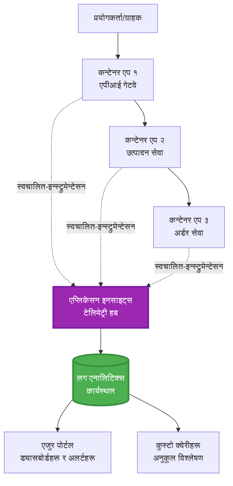
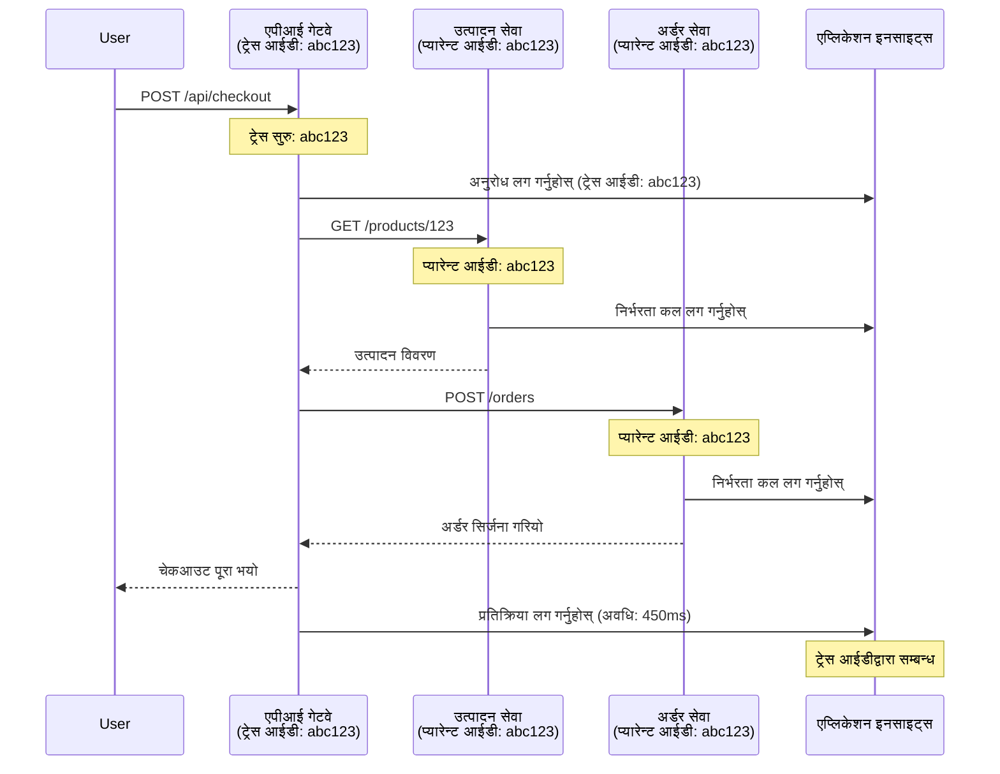

# AZD सँग Application Insights एकीकरण

⏱️ **अनुमानित समय**: ४०-५० मिनेट | 💰 **खर्च प्रभाव**: ~$५-१५/महिना | ⭐ **जटिलता**: मध्यम

**📚 सिकाइ मार्ग:**
- ← अघिल्लो: [Preflight Checks](preflight-checks.md) - पूर्व-परिनियोजन मान्यता
- 🎯 **तपाईं यहाँ हुनुहुन्छ**: Application Insights एकीकरण (निगरानी, टेलिमेट्री, डिबगिङ)
- → अर्को: [Deployment Guide](../deployment/deployment-guide.md) - Azure मा परिनियोजन
- 🏠 [पाठ गृहपृष्ठ](../../README.md)

---

## तपाईंले के सिक्नुहुनेछ

यो पाठ पूरा गरेर, तपाईं:
- **Application Insights** लाई AZD परियोजनाहरूमा स्वचालित रूपमा एकीकृत गर्नुहुनेछ
- माइक्रोसर्भिसहरूको लागि **distributed tracing** कन्फिगर गर्नुहुनेछ
- **custom telemetry** (मेट्रिक्स, घटनाहरू, निर्भरताहरू) कार्यान्वयन गर्नुहुनेछ
- वास्तविक-समय निगरानीको लागि **live metrics** सेट गर्नुहुनेछ
- AZD परिनियोजनबाट **alerts र dashboards** सिर्जना गर्नुहुनेछ
- **telemetry queries** को साथ उत्पादन समस्याहरू डिबग गर्नुहुनेछ
- **खर्च र नमूना रणनीतिहरू** अनुकूलित गर्नुहुनेछ
- **AI/LLM अनुप्रयोगहरू** (टोकन, ढिलाइ, खर्च) निगरानी गर्नुहुनेछ

## AZD सँग Application Insights किन महत्त्वपूर्ण छ

### चुनौती: उत्पादन अवलोकनीयता

**Application Insights बिना:**
```
❌ No visibility into production behavior
❌ Manual log aggregation across services
❌ Reactive debugging (wait for customer complaints)
❌ No performance metrics
❌ Cannot trace requests across services
❌ Unknown failure rates and bottlenecks
```

**Application Insights + AZD सँग:**
```
✅ Automatic telemetry collection
✅ Centralized logs from all services
✅ Proactive issue detection
✅ End-to-end request tracing
✅ Performance metrics and insights
✅ Real-time dashboards
✅ AZD provisions everything automatically
```

**उदाहरण**: Application Insights तपाईंको अनुप्रयोगको लागि "ब्ल्याक बक्स" उडान रेकर्डर + ककपिट ड्यासबोर्ड जस्तै हो। तपाईंले वास्तविक समयमा सबै कुरा देख्न सक्नुहुन्छ र कुनै पनि घटनालाई पुन: खेल्न सक्नुहुन्छ।

---

## आर्किटेक्चर अवलोकन

### AZD आर्किटेक्चरमा Application Insights


### स्वचालित रूपमा के निगरानी गरिन्छ

| टेलिमेट्री प्रकार | यसले के समेट्छ | प्रयोग केस |
|----------------|------------------|----------|
| **Requests** | HTTP अनुरोधहरू, स्थिति कोडहरू, अवधि | API प्रदर्शन निगरानी |
| **Dependencies** | बाह्य कलहरू (DB, APIs, स्टोरेज) | बोटलनेकहरू पहिचान गर्नुहोस् |
| **Exceptions** | स्ट्याक ट्रेसहरूसँग अप्रत्याशित त्रुटिहरू | असफलताहरू डिबगिङ |
| **Custom Events** | व्यापार घटनाहरू (साइनअप, खरिद) | एनालिटिक्स र फनेलहरू |
| **Metrics** | प्रदर्शन काउन्टरहरू, कस्टम मेट्रिक्स | क्षमता योजना |
| **Traces** | गम्भीरतासँग लग सन्देशहरू | डिबगिङ र अडिटिङ |
| **Availability** | अपटाइम र प्रतिक्रिया समय परीक्षणहरू | SLA निगरानी |

---

## पूर्वआवश्यकताहरू

### आवश्यक उपकरणहरू

```bash
# Azure Developer CLI प्रमाणित गर्नुहोस्
azd version
# ✅ अपेक्षित: azd संस्करण 1.0.0 वा उच्च

# Azure CLI प्रमाणित गर्नुहोस्
az --version
# ✅ अपेक्षित: azure-cli 2.50.0 वा उच्च
```

### Azure आवश्यकताहरू

- सक्रिय Azure सदस्यता
- सिर्जना गर्न अनुमति:
  - Application Insights स्रोतहरू
  - Log Analytics कार्यक्षेत्रहरू
  - Container Apps
  - Resource groups

### ज्ञान पूर्वआवश्यकताहरू

तपाईंले पूरा गर्नुभएको हुनुपर्छ:
- [AZD Basics](../getting-started/azd-basics.md) - कोर AZD अवधारणाहरू
- [Configuration](../getting-started/configuration.md) - वातावरण सेटअप
- [First Project](../getting-started/first-project.md) - आधारभूत परिनियोजन

---

## पाठ १: AZD सँग स्वचालित Application Insights

### AZD कसरी Application Insights प्रावधान गर्दछ

AZD ले तपाईंले परिनियोजन गर्दा स्वचालित रूपमा Application Insights सिर्जना र कन्फिगर गर्दछ। यसलाई कसरी काम गर्छ हेर्नुहोस्।

### परियोजना संरचना

```
monitored-app/
├── azure.yaml                     # AZD configuration
├── infra/
│   ├── main.bicep                # Main infrastructure
│   ├── core/
│   │   └── monitoring.bicep      # Application Insights + Log Analytics
│   └── app/
│       └── api.bicep             # Container App with monitoring
└── src/
    ├── app.py                    # Application with telemetry
    ├── requirements.txt
    └── Dockerfile
```

---

### चरण १: AZD कन्फिगर गर्नुहोस् (azure.yaml)

**फाइल: `azure.yaml`**

```yaml
name: monitored-app
metadata:
  template: monitored-app@1.0.0

services:
  api:
    project: ./src
    language: python
    host: containerapp

# AZD automatically provisions monitoring!
```

**यत्ति हो!** AZD ले आधारभूत निगरानीको लागि Application Insights स्वचालित रूपमा सिर्जना गर्नेछ। थप कन्फिगरेसन आवश्यक छैन।

---

### चरण २: निगरानी पूर्वाधार (Bicep)

**फाइल: `infra/core/monitoring.bicep`**

```bicep
param logAnalyticsName string
param applicationInsightsName string
param location string = resourceGroup().location
param tags object = {}

// Log Analytics Workspace (required for Application Insights)
resource logAnalytics 'Microsoft.OperationalInsights/workspaces@2022-10-01' = {
  name: logAnalyticsName
  location: location
  tags: tags
  properties: {
    sku: {
      name: 'PerGB2018'  // Pay-as-you-go pricing
    }
    retentionInDays: 30  // Keep logs for 30 days
    features: {
      enableLogAccessUsingOnlyResourcePermissions: true
    }
  }
}

// Application Insights
resource applicationInsights 'Microsoft.Insights/components@2020-02-02' = {
  name: applicationInsightsName
  location: location
  tags: tags
  kind: 'web'
  properties: {
    Application_Type: 'web'
    WorkspaceResourceId: logAnalytics.id
    IngestionMode: 'LogAnalytics'
    publicNetworkAccessForIngestion: 'Enabled'
    publicNetworkAccessForQuery: 'Enabled'
  }
}

// Outputs for Container Apps
output logAnalyticsWorkspaceId string = logAnalytics.id
output logAnalyticsWorkspaceName string = logAnalytics.name
output applicationInsightsConnectionString string = applicationInsights.properties.ConnectionString
output applicationInsightsInstrumentationKey string = applicationInsights.properties.InstrumentationKey
output applicationInsightsName string = applicationInsights.name
```

---

### चरण ३: Application Insights सँग Container App जडान गर्नुहोस्

**फाइल: `infra/app/api.bicep`**

```bicep
param name string
param location string
param tags object = {}
param containerAppsEnvironmentName string
param applicationInsightsConnectionString string

resource containerApp 'Microsoft.App/containerApps@2023-05-01' = {
  name: name
  location: location
  tags: tags
  properties: {
    configuration: {
      ingress: {
        external: true
        targetPort: 8000
      }
      secrets: [
        {
          name: 'appinsights-connection-string'
          value: applicationInsightsConnectionString
        }
      ]
    }
    template: {
      containers: [
        {
          name: 'api'
          image: 'myregistry.azurecr.io/api:latest'
          resources: {
            cpu: json('0.5')
            memory: '1Gi'
          }
          env: [
            {
              name: 'APPLICATIONINSIGHTS_CONNECTION_STRING'
              secretRef: 'appinsights-connection-string'
            }
            {
              name: 'APPLICATIONINSIGHTS_ENABLED'
              value: 'true'
            }
          ]
        }
      ]
    }
  }
}

output uri string = 'https://${containerApp.properties.configuration.ingress.fqdn}'
```

---

### चरण ४: टेलिमेट्रीको साथ अनुप्रयोग कोड

**फाइल: `src/app.py`**

```python
from flask import Flask, request, jsonify
from opencensus.ext.azure.log_exporter import AzureLogHandler
from opencensus.ext.azure.trace_exporter import AzureExporter
from opencensus.ext.flask.flask_middleware import FlaskMiddleware
from opencensus.trace.samplers import ProbabilitySampler
import logging
import os

app = Flask(__name__)

# एप्लिकेशन इनसाइट्स कनेक्शन स्ट्रिङ प्राप्त गर्नुहोस्
connection_string = os.environ.get('APPLICATIONINSIGHTS_CONNECTION_STRING')

if connection_string:
    # वितरित ट्रेसिङ कन्फिगर गर्नुहोस्
    middleware = FlaskMiddleware(
        app,
        exporter=AzureExporter(connection_string=connection_string),
        sampler=ProbabilitySampler(rate=1.0)  # विकासको लागि १००% स्याम्पलिङ
    )
    
    # लगिङ कन्फिगर गर्नुहोस्
    logger = logging.getLogger(__name__)
    logger.addHandler(AzureLogHandler(connection_string=connection_string))
    logger.setLevel(logging.INFO)
    
    print("✅ Application Insights enabled")
else:
    logger = logging.getLogger(__name__)
    logger.setLevel(logging.INFO)
    print("⚠️ Application Insights not configured")

@app.route('/health')
def health():
    logger.info('Health check endpoint called')
    return jsonify({'status': 'healthy', 'monitoring': 'enabled'})

@app.route('/api/products')
def get_products():
    logger.info('Fetching products')
    
    # डाटाबेस कलको अनुकरण गर्नुहोस् (स्वतः निर्भरता रूपमा ट्र्याक गरिन्छ)
    products = [
        {'id': 1, 'name': 'Laptop', 'price': 999.99},
        {'id': 2, 'name': 'Mouse', 'price': 29.99},
        {'id': 3, 'name': 'Keyboard', 'price': 79.99}
    ]
    
    logger.info(f'Returned {len(products)} products')
    return jsonify(products)

@app.route('/api/error-test')
def error_test():
    """Test error tracking"""
    logger.error('Testing error tracking')
    try:
        raise ValueError('This is a test exception')
    except Exception as e:
        logger.exception('Exception occurred in error-test endpoint')
        return jsonify({'error': str(e)}), 500

@app.route('/api/slow')
def slow_endpoint():
    """Test performance tracking"""
    import time
    logger.info('Slow endpoint called')
    time.sleep(3)  # ढिलो अपरेशनको अनुकरण गर्नुहोस्
    logger.warning('Endpoint took 3 seconds to respond')
    return jsonify({'message': 'Slow operation completed'})

if __name__ == '__main__':
    app.run(host='0.0.0.0', port=8000)
```

**फाइल: `src/requirements.txt`**

```txt
Flask==3.0.0
opencensus-ext-azure==1.1.13
opencensus-ext-flask==0.8.1
gunicorn==21.2.0
```

---

### चरण ५: परिनियोजन गर्नुहोस् र प्रमाणित गर्नुहोस्

```bash
# AZD आरम्भ गर्नुहोस्
azd init

# परिनियोजन गर्नुहोस् (स्वचालित रूपमा एप्लिकेशन इनसाइट्स प्रदान गर्दछ)
azd up

# एप URL प्राप्त गर्नुहोस्
APP_URL=$(azd env get-values | grep API_URL | cut -d '=' -f2 | tr -d '"')

# टेलिमेट्री उत्पन्न गर्नुहोस्
curl $APP_URL/health
curl $APP_URL/api/products
curl $APP_URL/api/error-test
curl $APP_URL/api/slow
```

**✅ अपेक्षित नतिजा:**
```json
{
  "status": "healthy",
  "monitoring": "enabled"
}
```

---

### चरण ६: Azure Portal मा टेलिमेट्री हेर्नुहोस्

```bash
# एप्लिकेशन इनसाइट्स विवरण प्राप्त गर्नुहोस्
azd env get-values | grep APPLICATIONINSIGHTS

# Azure पोर्टलमा खोल्नुहोस्
az monitor app-insights component show \
  --app $(azd env get-values | grep APPLICATIONINSIGHTS_NAME | cut -d '=' -f2 | tr -d '"') \
  --resource-group $(azd env get-values | grep AZURE_RESOURCE_GROUP | cut -d '=' -f2 | tr -d '"') \
  --query "appId" -o tsv
```

**Azure Portal → Application Insights → Transaction Search मा जानुहोस्**

तपाईंले हेर्नुहुनेछ:
- ✅ HTTP अनुरोधहरू स्थिति कोडहरूसँग
- ✅ अनुरोध अवधि (`/api/slow` को लागि ३+ सेकेन्ड)
- ✅ `/api/error-test` बाट अपवाद विवरणहरू
- ✅ कस्टम लग सन्देशहरू

---

## पाठ २: कस्टम टेलिमेट्री र घटनाहरू

### व्यापार घटनाहरू ट्र्याक गर्नुहोस्

व्यापार-आवश्यक घटनाहरूको लागि कस्टम टेलिमेट्री थपौं।

**फाइल: `src/telemetry.py`**

```python
from opencensus.ext.azure import metrics_exporter
from opencensus.stats import aggregation as aggregation_module
from opencensus.stats import measure as measure_module
from opencensus.stats import stats as stats_module
from opencensus.stats import view as view_module
from opencensus.tags import tag_map as tag_map_module
from opencensus.ext.azure.log_exporter import AzureLogHandler
from opencensus.ext.azure.trace_exporter import AzureExporter
from opencensus.trace import tracer as tracer_module
import logging
import os

class TelemetryClient:
    """Custom telemetry client for Application Insights"""
    
    def __init__(self, connection_string=None):
        self.connection_string = connection_string or os.environ.get('APPLICATIONINSIGHTS_CONNECTION_STRING')
        
        if not self.connection_string:
            print("⚠️ Application Insights connection string not found")
            return
        
        # लग इन सेटअप गर्नुहोस्
        self.logger = logging.getLogger(__name__)
        self.logger.addHandler(AzureLogHandler(connection_string=self.connection_string))
        self.logger.setLevel(logging.INFO)
        
        # मेट्रिक्स निर्यातकर्ता सेटअप गर्नुहोस्
        self.stats = stats_module.stats
        self.view_manager = self.stats.view_manager
        self.stats_recorder = self.stats.stats_recorder
        
        exporter = metrics_exporter.new_metrics_exporter(
            connection_string=self.connection_string
        )
        self.view_manager.register_exporter(exporter)
        
        # ट्रेसर सेटअप गर्नुहोस्
        self.tracer = tracer_module.Tracer(
            exporter=AzureExporter(connection_string=self.connection_string)
        )
        
        print("✅ Custom telemetry client initialized")
    
    def track_event(self, event_name: str, properties: dict = None):
        """Track custom business event"""
        properties = properties or {}
        self.logger.info(
            f"CustomEvent: {event_name}",
            extra={
                'custom_dimensions': {
                    'event_name': event_name,
                    **properties
                }
            }
        )
    
    def track_metric(self, metric_name: str, value: float, properties: dict = None):
        """Track custom metric"""
        properties = properties or {}
        self.logger.info(
            f"CustomMetric: {metric_name} = {value}",
            extra={
                'custom_dimensions': {
                    'metric_name': metric_name,
                    'value': value,
                    **properties
                }
            }
        )
    
    def track_dependency(self, name: str, dependency_type: str, duration: float, success: bool):
        """Track external dependency call"""
        with self.tracer.span(name=name) as span:
            span.add_attribute('dependency.type', dependency_type)
            span.add_attribute('duration', duration)
            span.add_attribute('success', success)

# ग्लोबल टेलिमेट्री क्लाइन्ट
telemetry = TelemetryClient()
```

### कस्टम घटनाहरूको साथ अनुप्रयोग अद्यावधिक गर्नुहोस्

**फाइल: `src/app.py` (विस्तारित)**

```python
from flask import Flask, request, jsonify
from telemetry import telemetry
import time
import random

app = Flask(__name__)

@app.route('/api/purchase', methods=['POST'])
def purchase():
    """Track purchase event with custom telemetry"""
    data = request.json
    product_id = data.get('product_id')
    quantity = data.get('quantity', 1)
    price = data.get('price', 0)
    
    # व्यापार घटना ट्र्याक गर्नुहोस्
    telemetry.track_event('Purchase', {
        'product_id': product_id,
        'quantity': quantity,
        'total_amount': price * quantity,
        'user_id': request.headers.get('X-User-Id', 'anonymous')
    })
    
    # राजस्व मेट्रिक ट्र्याक गर्नुहोस्
    telemetry.track_metric('Revenue', price * quantity, {
        'product_id': product_id,
        'currency': 'USD'
    })
    
    return jsonify({
        'order_id': f'ORD-{random.randint(1000, 9999)}',
        'status': 'confirmed',
        'total': price * quantity
    })

@app.route('/api/search')
def search():
    """Track search queries"""
    query = request.args.get('q', '')
    
    start_time = time.time()
    
    # खोज अनुकरण गर्नुहोस् (वास्तविक डाटाबेस क्वेरी हुनेछ)
    results = [{'id': 1, 'name': f'Result for {query}'}]
    
    duration = (time.time() - start_time) * 1000  # मिलिसेकेन्डमा रूपान्तरण गर्नुहोस्
    
    # खोज घटना ट्र्याक गर्नुहोस्
    telemetry.track_event('Search', {
        'query': query,
        'results_count': len(results),
        'duration_ms': duration
    })
    
    # खोज प्रदर्शन मेट्रिक ट्र्याक गर्नुहोस्
    telemetry.track_metric('SearchDuration', duration, {
        'query_length': len(query)
    })
    
    return jsonify({'results': results, 'count': len(results)})

@app.route('/api/external-call')
def external_call():
    """Track external API dependency"""
    import requests
    
    start_time = time.time()
    success = True
    
    try:
        # बाह्य API कल अनुकरण गर्नुहोस्
        response = requests.get('https://api.example.com/data', timeout=5)
        result = response.json()
    except Exception as e:
        success = False
        result = {'error': str(e)}
    
    duration = (time.time() - start_time) * 1000
    
    # निर्भरता ट्र्याक गर्नुहोस्
    telemetry.track_dependency(
        name='ExternalAPI',
        dependency_type='HTTP',
        duration=duration,
        success=success
    )
    
    return jsonify(result)

if __name__ == '__main__':
    app.run(host='0.0.0.0', port=8000)
```

### कस्टम टेलिमेट्री परीक्षण गर्नुहोस्

```bash
# खरिद घटना ट्र्याक गर्नुहोस्
curl -X POST $APP_URL/api/purchase \
  -H "Content-Type: application/json" \
  -H "X-User-Id: user123" \
  -d '{"product_id": 1, "quantity": 2, "price": 29.99}'

# खोजी घटना ट्र्याक गर्नुहोस्
curl "$APP_URL/api/search?q=laptop"

# बाह्य निर्भरता ट्र्याक गर्नुहोस्
curl $APP_URL/api/external-call
```

**Azure Portal मा हेर्नुहोस्:**

Application Insights → Logs मा जानुहोस्, त्यसपछि चलाउनुहोस्:

```kusto
// View purchase events
traces
| where customDimensions.event_name == "Purchase"
| project 
    timestamp,
    product_id = tostring(customDimensions.product_id),
    total_amount = todouble(customDimensions.total_amount),
    user_id = tostring(customDimensions.user_id)
| order by timestamp desc

// View revenue metrics
traces
| where customDimensions.metric_name == "Revenue"
| summarize TotalRevenue = sum(todouble(customDimensions.value)) by bin(timestamp, 1h)
| render timechart

// View search performance
traces
| where customDimensions.event_name == "Search"
| summarize 
    AvgDuration = avg(todouble(customDimensions.duration_ms)),
    SearchCount = count()
  by bin(timestamp, 5m)
| render timechart
```

---

## पाठ ३: माइक्रोसर्भिसहरूको लागि Distributed Tracing

### क्रस-सर्भिस ट्रेसिङ सक्षम गर्नुहोस्

माइक्रोसर्भिसहरूको लागि, Application Insights ले स्वचालित रूपमा सेवाहरूमा अनुरोधहरू सम्बन्धित गर्दछ।

**फाइल: `infra/main.bicep`**

```bicep
targetScope = 'subscription'

param environmentName string
param location string = 'eastus'

var tags = { 'azd-env-name': environmentName }

resource rg 'Microsoft.Resources/resourceGroups@2021-04-01' = {
  name: 'rg-${environmentName}'
  location: location
  tags: tags
}

// Monitoring (shared by all services)
module monitoring './core/monitoring.bicep' = {
  name: 'monitoring'
  scope: rg
  params: {
    logAnalyticsName: 'log-${environmentName}'
    applicationInsightsName: 'appi-${environmentName}'
    location: location
    tags: tags
  }
}

// API Gateway
module apiGateway './app/api-gateway.bicep' = {
  name: 'api-gateway'
  scope: rg
  params: {
    name: 'ca-gateway-${environmentName}'
    location: location
    tags: union(tags, { 'azd-service-name': 'gateway' })
    applicationInsightsConnectionString: monitoring.outputs.applicationInsightsConnectionString
  }
}

// Product Service
module productService './app/product-service.bicep' = {
  name: 'product-service'
  scope: rg
  params: {
    name: 'ca-products-${environmentName}'
    location: location
    tags: union(tags, { 'azd-service-name': 'products' })
    applicationInsightsConnectionString: monitoring.outputs.applicationInsightsConnectionString
  }
}

// Order Service
module orderService './app/order-service.bicep' = {
  name: 'order-service'
  scope: rg
  params: {
    name: 'ca-orders-${environmentName}'
    location: location
    tags: union(tags, { 'azd-service-name': 'orders' })
    applicationInsightsConnectionString: monitoring.outputs.applicationInsightsConnectionString
  }
}

output APPLICATIONINSIGHTS_CONNECTION_STRING string = monitoring.outputs.applicationInsightsConnectionString
output GATEWAY_URL string = apiGateway.outputs.uri
```

### अन्त-देखि-अन्त लेनदेन हेर्नुहोस्


**अन्त-देखि-अन्त ट्रेस क्वेरी गर्नुहोस्:**

```kusto
// Find complete request flow
let traceId = "abc123...";  // Get from response header
dependencies
| union requests
| where operation_Id == traceId
| project 
    timestamp,
    type = itemType,
    name,
    duration,
    success,
    cloud_RoleName
| order by timestamp asc
```

---

## पाठ ४: Live Metrics र वास्तविक-समय निगरानी

### Live Metrics Stream सक्षम गर्नुहोस्

Live Metrics ले <१ सेकेन्ड ढिलाइको साथ वास्तविक-समय टेलिमेट्री प्रदान गर्दछ।

**Live Metrics पहुँच गर्नुहोस्:**

```bash
# एप्लिकेशन इनसाइट्स स्रोत प्राप्त गर्नुहोस्
APPI_NAME=$(azd env get-values | grep APPLICATIONINSIGHTS_NAME | cut -d '=' -f2 | tr -d '"')

# स्रोत समूह प्राप्त गर्नुहोस्
RG_NAME=$(azd env get-values | grep AZURE_RESOURCE_GROUP | cut -d '=' -f2 | tr -d '"')

echo "Navigate to: Azure Portal → Resource Groups → $RG_NAME → $APPI_NAME → Live Metrics"
```

**तपाईंले वास्तविक समयमा देख्नुहुनेछ:**
- ✅ आउने अनुरोध दर (requests/sec)
- ✅ जाने निर्भरताका कलहरू
- ✅ अपवाद गणना
- ✅ CPU र मेमोरी प्रयोग
- ✅ सक्रिय सर्भर गणना
- ✅ नमूना टेलिमेट्री

### परीक्षणको लागि लोड उत्पन्न गर्नुहोस्

```bash
# लाइभ मेट्रिक्स हेर्न लोड उत्पन्न गर्नुहोस्
for i in {1..100}; do
  curl $APP_URL/api/products &
  curl $APP_URL/api/search?q=test$i &
done

# Azure पोर्टलमा लाइभ मेट्रिक्स हेर्नुहोस्
# तपाईंले अनुरोध दरको वृद्धि देख्नु पर्नेछ
```

---

## व्यावहारिक अभ्यासहरू

### अभ्यास १: अलर्ट सेट गर्नुहोस् ⭐⭐ (मध्यम)

**लक्ष्य**: उच्च त्रुटि दर र ढिलो प्रतिक्रियाहरूको लागि अलर्टहरू सिर्जना गर्नुहोस्।

**चरणहरू:**

1. **त्रुटि दरको लागि अलर्ट सिर्जना गर्नुहोस्:**

```bash
# एप्लिकेशन इनसाइट्स स्रोत ID प्राप्त गर्नुहोस्
APPI_ID=$(az monitor app-insights component show \
  --app $APPI_NAME \
  --resource-group $RG_NAME \
  --query "id" -o tsv)

# असफल अनुरोधहरूको लागि मेट्रिक अलर्ट सिर्जना गर्नुहोस्
az monitor metrics alert create \
  --name "High-Error-Rate" \
  --resource-group $RG_NAME \
  --scopes $APPI_ID \
  --condition "count requests/failed > 10" \
  --window-size 5m \
  --evaluation-frequency 1m \
  --description "Alert when error rate exceeds 10 per 5 minutes"
```

2. **ढिलो प्रतिक्रियाहरूको लागि अलर्ट सिर्जना गर्नुहोस्:**

```bash
az monitor metrics alert create \
  --name "Slow-Responses" \
  --resource-group $RG_NAME \
  --scopes $APPI_ID \
  --condition "avg requests/duration > 3000" \
  --window-size 5m \
  --evaluation-frequency 1m \
  --description "Alert when average response time exceeds 3 seconds"
```

3. **Bicep मार्फत अलर्ट सिर्जना गर्नुहोस् (AZD को लागि प्राथमिकता):**

**फाइल: `infra/core/alerts.bicep`**

```bicep
param applicationInsightsId string
param actionGroupId string = ''
param location string = resourceGroup().location

// High error rate alert
resource errorRateAlert 'Microsoft.Insights/metricAlerts@2018-03-01' = {
  name: 'high-error-rate'
  location: 'global'
  properties: {
    description: 'Alert when error rate exceeds threshold'
    severity: 2
    enabled: true
    scopes: [
      applicationInsightsId
    ]
    evaluationFrequency: 'PT1M'
    windowSize: 'PT5M'
    criteria: {
      'odata.type': 'Microsoft.Azure.Monitor.SingleResourceMultipleMetricCriteria'
      allOf: [
        {
          name: 'Error rate'
          metricName: 'requests/failed'
          operator: 'GreaterThan'
          threshold: 10
          timeAggregation: 'Count'
        }
      ]
    }
    actions: actionGroupId != '' ? [
      {
        actionGroupId: actionGroupId
      }
    ] : []
  }
}

// Slow response alert
resource slowResponseAlert 'Microsoft.Insights/metricAlerts@2018-03-01' = {
  name: 'slow-responses'
  location: 'global'
  properties: {
    description: 'Alert when response time is too high'
    severity: 3
    enabled: true
    scopes: [
      applicationInsightsId
    ]
    evaluationFrequency: 'PT1M'
    windowSize: 'PT5M'
    criteria: {
      'odata.type': 'Microsoft.Azure.Monitor.SingleResourceMultipleMetricCriteria'
      allOf: [
        {
          name: 'Response duration'
          metricName: 'requests/duration'
          operator: 'GreaterThan'
          threshold: 3000
          timeAggregation: 'Average'
        }
      ]
    }
  }
}

output errorAlertId string = errorRateAlert.id
output slowResponseAlertId string = slowResponseAlert.id
```

4. **अलर्ट परीक्षण गर्नुहोस्:**

```bash
# त्रुटिहरू उत्पन्न गर्नुहोस्
for i in {1..20}; do
  curl $APP_URL/api/error-test
done

# ढिलो प्रतिक्रिया उत्पन्न गर्नुहोस्
for i in {1..10}; do
  curl $APP_URL/api/slow
done

# चेतावनी स्थिति जाँच गर्नुहोस् (५-१० मिनेट पर्खनुहोस्)
az monitor metrics alert list \
  --resource-group $RG_NAME \
  --query "[].{Name:name, Enabled:enabled, State:properties.enabled}" \
  --output table
```

**✅ सफलता मापदण्ड:**
- ✅ अलर्टहरू सफलतापूर्वक सिर्जना गरियो
- ✅ थ्रेसहोल्ड नाघ्दा अलर्टहरू ट्रिगर हुन्छन्
- ✅ Azure Portal मा अलर्ट इतिहास हेर्न सकिन्छ
- ✅ AZD परिनियोजनसँग एकीकृत

**समय**: २०-२५ मिनेट

---

### अभ्यास २: कस्टम ड्यासबोर्ड सिर्जना गर्नुहोस् ⭐⭐ (मध्यम)

**लक्ष्य**: प्रमुख अनुप्रयोग मेट्रिक्स देखाउने ड्यासबोर्ड निर्माण गर्नुहोस्।

**चरणहरू:**

1. **Azure Portal मार्फत ड्यासबोर्ड सिर्जना गर्नुहोस्:**

Azure Portal → Dashboards → New Dashboard मा जानुहोस्

2. **प्रमुख मेट्रिक्सका लागि टाइलहरू थप्नुहोस्:**

- अनुरोध गणना (पछिल्लो २४ घण्टा)
- औसत प्रतिक्रिया समय
- त्रुटि दर
- शीर्ष ५ ढिलो अपरेसनहरू
- प्रयोगकर्ताहरूको भौगोलिक वितरण

3. **Bicep मार्फत ड्यासबोर्ड सिर्जना गर्नुहोस्:**

**फाइल: `infra/core/dashboard.bicep`**

```bicep
param dashboardName string
param applicationInsightsId string
param location string = resourceGroup().location

resource dashboard 'Microsoft.Portal/dashboards@2020-09-01-preview' = {
  name: dashboardName
  location: location
  properties: {
    lenses: [
      {
        order: 0
        parts: [
          // Request count
          {
            position: { x: 0, y: 0, rowSpan: 4, colSpan: 6 }
            metadata: {
              type: 'Extension/Microsoft_OperationsManagementSuite_Workspace/PartType/LogsDashboardPart'
              inputs: [
                {
                  name: 'resourceId'
                  value: applicationInsightsId
                }
                {
                  name: 'query'
                  value: '''
                    requests
                    | summarize RequestCount = count() by bin(timestamp, 1h)
                    | render timechart
                  '''
                }
              ]
            }
          }
          // Error rate
          {
            position: { x: 6, y: 0, rowSpan: 4, colSpan: 6 }
            metadata: {
              type: 'Extension/Microsoft_OperationsManagementSuite_Workspace/PartType/LogsDashboardPart'
              inputs: [
                {
                  name: 'resourceId'
                  value: applicationInsightsId
                }
                {
                  name: 'query'
                  value: '''
                    requests
                    | summarize 
                        Total = count(),
                        Failed = countif(success == false)
                    | extend ErrorRate = (Failed * 100.0) / Total
                    | project ErrorRate
                  '''
                }
              ]
            }
          }
        ]
      }
    ]
  }
}

output dashboardId string = dashboard.id
```

4. **ड्यासबोर्ड परिनियोजन गर्नुहोस्:**

```bash
# मुख्य.bicep मा थप्नुहोस्
module dashboard './core/dashboard.bicep' = {
  name: 'dashboard'
  scope: rg
  params: {
    dashboardName: 'dashboard-${environmentName}'
    applicationInsightsId: monitoring.outputs.applicationInsightsId
    location: location
  }
}

# परिनियोजन गर्नुहोस्
azd up
```

**✅ सफलता मापदण्ड:**
- ✅ ड्यासबोर्ड प्रमुख मेट्रिक्स देखाउँछ
- ✅ Azure Portal गृहमा पिन गर्न सकिन्छ
- ✅ वास्तविक समयमा अद्यावधिक हुन्छ
- ✅ AZD मार्फत परिनियोज्य

**समय**: २५-३० मिनेट

---

### अभ्यास ३: AI/LLM अनुप्रयोग निगरानी गर्नुहोस् ⭐⭐⭐ (उन्नत)

**लक्ष्य**: Azure OpenAI प्रयोग (टोकन, खर्च, ढिलाइ) ट्र्याक गर्नुहोस्।

**चरणहरू:**

1. **AI निगरानी आवरण सिर्जना गर्नुहोस्:**

**फाइल: `src/ai_telemetry.py`**

```python
from telemetry import telemetry
from openai import AzureOpenAI
import time

class MonitoredAzureOpenAI:
    """Azure OpenAI client with automatic telemetry"""
    
    def __init__(self, api_key, endpoint, api_version="2024-02-01"):
        self.client = AzureOpenAI(
            api_key=api_key,
            api_version=api_version,
            azure_endpoint=endpoint
        )
    
    def chat_completion(self, model: str, messages: list, **kwargs):
        """Track chat completion with telemetry"""
        start_time = time.time()
        
        try:
            # Azure OpenAI कल गर्नुहोस्
            response = self.client.chat.completions.create(
                model=model,
                messages=messages,
                **kwargs
            )
            
            duration = (time.time() - start_time) * 1000  # एमएस
            
            # प्रयोग निकाल्नुहोस्
            usage = response.usage
            prompt_tokens = usage.prompt_tokens
            completion_tokens = usage.completion_tokens
            total_tokens = usage.total_tokens
            
            # लागत गणना गर्नुहोस् (GPT-4 मूल्य निर्धारण)
            prompt_cost = (prompt_tokens / 1000) * 0.03  # $0.03 प्रति 1K टोकन
            completion_cost = (completion_tokens / 1000) * 0.06  # $0.06 प्रति 1K टोकन
            total_cost = prompt_cost + completion_cost
            
            # अनुकूलित घटना ट्र्याक गर्नुहोस्
            telemetry.track_event('OpenAI_Request', {
                'model': model,
                'prompt_tokens': prompt_tokens,
                'completion_tokens': completion_tokens,
                'total_tokens': total_tokens,
                'duration_ms': duration,
                'cost_usd': total_cost,
                'success': True
            })
            
            # मेट्रिक्स ट्र्याक गर्नुहोस्
            telemetry.track_metric('OpenAI_Tokens', total_tokens, {
                'model': model,
                'type': 'total'
            })
            
            telemetry.track_metric('OpenAI_Cost', total_cost, {
                'model': model,
                'currency': 'USD'
            })
            
            telemetry.track_metric('OpenAI_Duration', duration, {
                'model': model
            })
            
            return response
            
        except Exception as e:
            duration = (time.time() - start_time) * 1000
            
            telemetry.track_event('OpenAI_Request', {
                'model': model,
                'duration_ms': duration,
                'success': False,
                'error': str(e)
            })
            
            raise
```

2. **निगरानी गरिएको क्लाइन्ट प्रयोग गर्नुहोस्:**

```python
from flask import Flask, request, jsonify
from ai_telemetry import MonitoredAzureOpenAI
import os

app = Flask(__name__)

# निगरानी गरिएको OpenAI क्लाइन्ट आरम्भ गर्नुहोस्
openai_client = MonitoredAzureOpenAI(
    api_key=os.environ['AZURE_OPENAI_API_KEY'],
    endpoint=os.environ['AZURE_OPENAI_ENDPOINT']
)

@app.route('/api/chat', methods=['POST'])
def chat():
    data = request.json
    user_message = data.get('message')
    
    # स्वचालित निगरानीको साथ कल गर्नुहोस्
    response = openai_client.chat_completion(
        model='gpt-4',
        messages=[
            {'role': 'user', 'content': user_message}
        ]
    )
    
    return jsonify({
        'response': response.choices[0].message.content,
        'tokens': response.usage.total_tokens
    })
```

3. **AI मेट्रिक्स क्वेरी गर्नुहोस्:**

```kusto
// Total AI spend over time
traces
| where customDimensions.event_name == "OpenAI_Request"
| where customDimensions.success == "True"
| summarize TotalCost = sum(todouble(customDimensions.cost_usd)) by bin(timestamp, 1h)
| render timechart

// Token usage by model
traces
| where customDimensions.event_name == "OpenAI_Request"
| summarize 
    TotalTokens = sum(toint(customDimensions.total_tokens)),
    RequestCount = count()
  by Model = tostring(customDimensions.model)

// Average latency
traces
| where customDimensions.event_name == "OpenAI_Request"
| summarize AvgDuration = avg(todouble(customDimensions.duration_ms))
| project AvgDurationSeconds = AvgDuration / 1000

// Cost per request
traces
| where customDimensions.event_name == "OpenAI_Request"
| extend Cost = todouble(customDimensions.cost_usd)
| summarize 
    TotalCost = sum(Cost),
    RequestCount = count(),
    AvgCostPerRequest = avg(Cost)
```

**✅ सफलता मापदण्ड:**
- ✅ प्रत्येक OpenAI कल स्वचालित रूपमा ट्र्याक गरियो
- ✅ टोकन प्रयोग र खर्च देख्न सकिन्छ
- ✅ ढिलाइ निगरानी गरियो
- ✅ बजेट अलर्ट सेट गर्न सकिन्छ

**समय**: ३५-४५ मिनेट

---

## खर्च अनुकूलन

### नमूना रणनीतिहरू

टेलिमेट्रीको लागत नियन्त्रण गर्न नमूना प्रयोग गर्नुहोस्:

```python
from opencensus.trace.samplers import ProbabilitySampler

# विकास: १००% नमूना
sampler = ProbabilitySampler(rate=1.0)

# उत्पादन: १०% नमूना (खर्च ९०% ले घटाउनुहोस्)
sampler = ProbabilitySampler(rate=0.1)

# अनुकूलन नमूना (स्वतः समायोजन गर्दछ)
from opencensus.trace.samplers import AdaptiveSampler
sampler = AdaptiveSampler()
```

**Bicep मा:**

```bicep
resource applicationInsights 'Microsoft.Insights/components@2020-02-02' = {
  name: applicationInsightsName
  properties: {
    SamplingPercentage: 10  // 10% sampling
  }
}
```

### डेटा प्रतिधारण

```bicep
resource logAnalytics 'Microsoft.OperationalInsights/workspaces@2022-10-01' = {
  name: logAnalyticsName
  properties: {
    retentionInDays: 30  // Minimum (cheapest)
    // Options: 30, 31, 60, 90, 120, 180, 270, 365, 550, 730
  }
}
```

### मासिक खर्च अनुमान

| डेटा मात्रा | प्रतिधारण | मासिक खर्च |
|-------------|-----------|--------------|
| १ GB/महिना | ३० दिन | ~$२-५ |
| ५ GB/महिना | ३० दिन | ~$१०-१५ |
| १० GB/महिना | ९० दिन | ~$२५-४० |
| ५० GB/महिना | ९० दिन | ~$१००-१५० |

**निःशुल्क स्तर**: ५ GB/महिना समावेश

---

## ज्ञान जाँच

### १. आधारभूत एकीकरण ✓

तपाईंको बुझाइ परीक्षण गर्नुहोस्:

- [ ] **Q1**: AZD ले Application Insights कसरी प्रावधान गर्दछ?
  - **A**: `infra/core/monitoring.bicep` मा Bicep टेम्प्लेटहरू मार्फत स्वचालित रूपमा

- [ ] **Q2**: Application Insights सक्षम गर्न कुन वातावरण चर प्रयोग गरिन्छ?
  - **A**: `APPLICATIONINSIGHTS_CONNECTION_STRING`

- [ ] **Q3**: तीन मुख्य टेलिमेट्री प्रकारहरू के हुन्?
  - **A**: अनुरोधहरू (HTTP कलहरू), निर्भरताहरू (बाह्य कलहरू), अपवादहरू (त्रुटिहरू)

**व्यावहारिक प्रमाणीकरण:**
```bash
# एप्लिकेशन इनसाइट्स कन्फिगर गरिएको छ कि छैन जाँच गर्नुहोस्
azd env get-values | grep APPLICATIONINSIGHTS

# टेलिमेट्री प्रवाह भइरहेको छ कि छैन पुष्टि गर्नुहोस्
az monitor app-insights metrics show \
  --app $APPI_NAME \
  --resource-group $RG_NAME \
  --metric "requests/count"
```

---

### २. कस्टम टेलिमेट्री ✓

तपाईंको बुझाइ परीक्षण गर्नुहोस्:

- [ ] **Q1**: तपाईं कस्टम व्यापार घटनाहरू कसरी ट्र्याक गर्नुहुन्छ?
  - **A**: `custom_dimensions` वा `TelemetryClient.track_event()` को साथ लगर प्रयोग गर्नुहोस्

- [ ] **Q2**: घटनाहरू र मेट्रिक्स बीच के फरक छ?
  - **A**: घटनाहरू छुट्टै घटनाहरू हुन्, मेट्रिक्स संख्यात्मक मापन हुन्

- [ ] **Q3**: तपाईं कसरी सेवाहरूमा टेलिमेट्री सम्बन्धित गर्नुहुन्छ?
  - **A**: Application Insights ले स्वचालित रूपमा `operation_Id` प्रयोग गर्दछ

**व्यावहारिक प्रमाणीकरण:**
```kusto
// Verify custom events
traces
| where customDimensions.event_name != ""
| summarize count() by tostring(customDimensions.event_name)
```

---

### ३. उत्पादन निगरानी ✓

तपाईंको बुझाइ परीक्षण गर्नुहोस्:

- [ ] **Q1**: नमूना के हो र किन प्रयोग गरिन्छ?
  - **A**: नमूना टेलिमेट्रीको प्रतिशत मात्र कब्जा गरेर डेटा मात्रा (र लागत) घटाउँछ

- [ ] **Q2**: तपाईं अलर्ट कसरी सेट गर्नुहुन्छ?
  - **A**: Application Insights मेट्रिक्समा आधारित Bicep वा Azure Portal मा मेट्रिक अलर्ट प्रयोग गर्नुहोस्

- [ ] **Q3**: Log Analytics र Application Insights बीच के फरक छ?
  - **A**: Application Insights ले डेटा Log Analytics कार्यक्षेत्रमा भण्डारण गर्दछ; App Insights ले अनुप्रयोग-विशिष्ट दृश्यहरू प्रदान गर्दछ

**व्यावहारिक प्रमाणीकरण:**
```bash
# नमूना कन्फिगरेसन जाँच गर्नुहोस्
az monitor app-insights component show \
  --app $APPI_NAME \
  --resource-group $RG_NAME \
  --query "properties.SamplingPercentage"
```

---

## उत्कृष्ट अभ्यासहरू

### ✅ गर्नुहोस्:

1. **सम्बन्ध आईडीहरू प्रयोग गर्नुहोस्**
   ```python
   logger.info('Processing order', extra={
       'custom_dimensions': {
           'order_id': order_id,
           'user_id': user_id
       }
   })
   ```

2. **महत्त्वपूर्ण मेट्रिक्सका लागि अलर्ट सेट गर्नुहोस्**
   ```bicep
   // Error rate, slow responses, availability
   ```

3. **संरचित लगिङ प्रयोग गर्नुहोस्**
   ```python
   # ✅ राम्रो: संरचित
   logger.info('User signup', extra={'custom_dimensions': {'user_id': 123}})
   
   # ❌ नराम्रो: असंरचित
   logger.info(f'User 123 signed up')
   ```

4. **निर्भरताहरू निगरानी गर्नुहोस्**
   ```python
   # स्वतः डेटाबेस कलहरू, HTTP अनुरोधहरू आदि ट्र्याक गर्नुहोस्।
   ```

5. **परिनियोजनको समयमा Live Metrics प्रयोग गर्नुहोस्**

### ❌ नगर्नुहोस्:

1. **संवेदनशील डेटा लग नगर्नुहोस्**
   ```python
   # ❌ नराम्रो
   logger.info(f'Login: {username}:{password}')
   
   # ✅ राम्रो
   logger.info('Login attempt', extra={'custom_dimensions': {'username': username}})
   ```

2. **उत्पादनमा १००% नमूना प्रयोग नगर्नुहोस्**
   ```python
   # ❌ महँगो
   sampler = ProbabilitySampler(rate=1.0)
   
   # ✅ लागत-प्रभावी
   sampler = ProbabilitySampler(rate=0.1)
   ```

3. **मृत पत्र पङ्क्तिहरू बेवास्ता नगर्नुहोस्**

4. **डेटा प्रतिधारण सीमा सेट गर्न नबिर्सनुहोस्**

---

## समस्या समाधान

### समस्या: कुनै टेलिमेट्री देखिँदैन

**निदान:**
```bash
# जडान स्ट्रिङ सेट गरिएको छ कि छैन जाँच गर्नुहोस्
azd env get-values | grep APPLICATIONINSIGHTS

# अनुप्रयोग लगहरू जाँच गर्नुहोस्
azd logs api --tail 50
```

**समाधान:**
```bash
# कन्टेनर एपमा कनेक्शन स्ट्रिङ जाँच गर्नुहोस्
az containerapp show \
  --name $APP_NAME \
  --resource-group $RG_NAME \
  --query "properties.template.containers[0].env" \
  | grep -i applicationinsights
```

---

### समस्या: उच्च लागत

**निदान:**
```bash
# डाटा इनजेस्टन जाँच गर्नुहोस्
az monitor app-insights metrics show \
  --app $APPI_NAME \
  --resource-group $RG_NAME \
  --metric "availabilityResults/count"
```

**समाधान:**
- नमूना दर घटाउनुहोस्
- प्रतिधारण अवधि घटाउनुहोस्
- विस्तृत लगिङ हटाउनुहोस्

---

## थप जान्नुहोस्

### आधिकारिक दस्तावेज
- [Application Insights अवलोकन](https://learn.microsoft.com/azure/azure-monitor/app/app-insights-overview)
- [Python का लागि Application Insights](https://learn.microsoft.com/azure/azure-monitor/app/opencensus-python)
- [Kusto Query Language](https://learn.microsoft.com/azure/data-explorer/kusto/query/)
- [AZD निगरानी](https://learn.microsoft.com/azure/developer/azure-developer-cli/monitor-your-app)

### यस पाठ्यक्रममा अर्को चरण
- ← अघिल्लो: [Preflight Checks](preflight-checks.md)
- → अर्को: [Deployment Guide](../deployment/deployment-guide.md)
- 🏠 [पाठ गृहपृष्ठ](../../README.md)

### सम्बन्धित उदाहरणहरू
- [Azure OpenAI उदाहरण](../../../../examples/azure-openai-chat) - AI टेलिमेट्री
- [माइक्रोसर्भिस उदाहरण](../../../../examples/microservices) - Distributed tracing

---

## सारांश

**तपाईंले सिक्नुभयो:**
- ✅ AZD सँग स्वचालित Application Insights प्रावधान
- ✅ कस्टम टेलिमेट्री (घटनाहरू, मेट्रिक्स, निर्भरताहरू)
- ✅ माइक्रोसर्भिसहरूमा Distributed tracing
- ✅ Live Metrics र वास्तविक-समय निगरानी
- ✅ अलर्ट र ड्यासबोर्डहरू
- ✅ एआई/एलएलएम एप्लिकेशन अनुगमन
- ✅ लागत अनुकूलन रणनीतिहरू

**मुख्य बुँदाहरू:**
1. **AZD ले अनुगमन स्वचालित रूपमा प्रदान गर्छ** - कुनै म्यानुअल सेटअप आवश्यक छैन
2. **संरचित लगिङ प्रयोग गर्नुहोस्** - क्वेरी गर्न सजिलो बनाउँछ
3. **व्यावसायिक घटनाहरू ट्र्याक गर्नुहोस्** - केवल प्राविधिक मेट्रिक्स मात्र होइन
4. **एआई लागतहरू अनुगमन गर्नुहोस्** - टोकन र खर्च ट्र्याक गर्नुहोस्
5. **अलर्टहरू सेट गर्नुहोस्** - प्रतिक्रियात्मक होइन, सक्रिय बन्नुहोस्
6. **लागतहरू अनुकूलित गर्नुहोस्** - स्याम्पलिङ र रिटेन्सन सीमा प्रयोग गर्नुहोस्

**अर्का कदमहरू:**
1. व्यावहारिक अभ्यासहरू पूरा गर्नुहोस्
2. आफ्नो AZD प्रोजेक्टहरूमा Application Insights थप्नुहोस्
3. आफ्नो टोलीका लागि अनुकूल ड्यासबोर्डहरू बनाउनुहोस्
4. [डिप्लोयमेन्ट गाइड](../deployment/deployment-guide.md) सिक्नुहोस्

---

<!-- CO-OP TRANSLATOR DISCLAIMER START -->
**अस्वीकरण**:  
यो दस्तावेज़ AI अनुवाद सेवा [Co-op Translator](https://github.com/Azure/co-op-translator) प्रयोग गरेर अनुवाद गरिएको छ। हामी शुद्धताको लागि प्रयास गर्छौं, तर कृपया ध्यान दिनुहोस् कि स्वचालित अनुवादहरूमा त्रुटिहरू वा अशुद्धताहरू हुन सक्छ। यसको मूल भाषा मा रहेको दस्तावेज़लाई आधिकारिक स्रोत मानिनुपर्छ। महत्वपूर्ण जानकारीको लागि, व्यावसायिक मानव अनुवाद सिफारिस गरिन्छ। यस अनुवादको प्रयोगबाट उत्पन्न हुने कुनै पनि गलतफहमी वा गलत व्याख्याको लागि हामी जिम्मेवार हुने छैनौं।
<!-- CO-OP TRANSLATOR DISCLAIMER END -->